# TSM 基本面深度分析報告
> **報告日期**：2026-07-26 ｜ **語言**：繁體中文 ｜ **數據來源**：Yahoo Finance, Finviz, StockAnalysis, Roic.ai ｜ **分析師**：CFA 級機構研究

---

## 目錄

| # | 章節 | 核心結論 |
|---|------|----------|
| 1 | 執行摘要 | 評級：🟢 強烈買入 ｜ 基準目標價 $537.43（+33.2%） ｜ ROIC (75.5%) 遠超 WACC (9.4%) |
| 2 | 公司概覽與商業模式 | 晶圓代工市佔率高達 62%，全方位掌握 3nm/2nm 製程與 CoWoS 先進封裝壟斷地位 |
| 3 | 損益表深度分析 | Q2 2026 營收達 TWD 1.27T（YoY +36.1%），淨利率高達 55.6%，SBC 佔營收 < 0.05% 盈餘品質極佳 |
| 4 | 資產負債表分析 | 淨現金達 TWD 2.54T，流動比率 2.46，資產負債表極其穩固 |
| 5 | 現金流量深度分析 | 營業現金流 TWD 2.63T，CapEx 積極擴充 2nm/CoWoS，FCF 轉換率保持 80%+ |
| 6 | 獲利能力與資本效率 | 杜邦分析顯示 ROE 高達 40.0%，EVA 達 +66.1pp，創造超額股東價值 |
| 7 | 估值深度分析 | Forward P/E 18.95x 處於歷史合理區間，PEG僅 1.03，相較同業具高度性價比 |
| 8 | 成長催化劑 | AI 晶片需求爆發、CoWoS 產能翻倍擴充、2nm GAA 製程於 2026 年量產領先全球 |
| 9 | 風險矩陣 | 地緣政治風險與高額 Capex 消化風險為主要監控焦點，整體緩解措施完善 |
| 10 | 投資建議 | 給予「強烈買入」評級，目標價區間 $380.00 ~ $680.00，建議拉回逢低布局 |

---

## 1. 執行摘要

> ⚠️ **數據驅動結論**：台積電（TSM）最新 2026 年 Q2 季報顯示，季度營收達到新台幣 1.27 兆元（YoY +36.05%），單季淨利潤達新台幣 7,065.6 億元（YoY +77.41%），毛利率上升至 67.7%，營運槓桿效益顯著。基於公司 TTM ROIC 高達 75.5% 遠超 9.4% 之 WACC（經濟增加值 EVA 達 +66.1pp）、強勁的自由現金流（TTM FCF 達新台幣 7,390.6 億元），以及 Forward P/E 僅 18.95x（PEG = 1.03），證實當前股價（$403.41）尚未完全反映其在 AI 算力基礎設施中的獨家壟斷價值。故本報告給予 🟢 **強烈買入** 評級，基準情境 12 個月目標價為 **$537.43**（隱含 +33.2% 上行空間）。

### 1.0 一頁式投資儀表板（Portfolio Manager 30 秒速讀）

| 項目 | 內容 |
|------|------|
| **投資論點（3 句）** | ① 全球 AI 晶片代工與 CoWoS 先進封裝市佔率 >90%，直接受益於全球 AI 算力 Capex 浪潮。<br/>② Q2 2026 營收年增 36.05%、EPS 年增 77.41%，顯現極強的定價能力與營業槓桿效益。<br/>③ TTM ROIC 高達 75.5%（WACC 為 9.4%），配合 Forward P/E 僅 18.95x，評價具極高吸引力。 |
| **護城河評分** | 9.8/10（極深：製程技術領先、規模壁壘、先進封裝生態圈） |
| **管理層/資本配置評分** | 9.5/10（資本支出回報率極高、經營團隊執行力無懈可擊） |
| **財務健康** | 🟢 **極度健康**（淨現金達新台幣 2.54 兆元，負債比率僅 15.2%） |
| **ROIC vs WACC** | **75.5% vs 9.4%**（強力創造超額股東價值，EVA +66.1pp） |
| **FCF 趨勢** | 穩定上升；TTM FCF 達新台幣 7,390.6 億元，FCF Yield 為 35.32% |
| **估值** | Forward P/E: **18.95x** ｜ EV/EBITDA: **4.49x** ｜ PEG: **1.03** |
| **預期報酬（基準情境 12M）** | **+33.2%**（目標價 $537.43） |
| **關鍵風險（前二）** | ① 地緣政治與台海緊張局勢壓力。<br/>② 海外擴廠（美國/歐洲/日本）稀釋毛利率之風險。 |
| **評級 + 信心度** | 🟢 **強烈買入** ｜ 信心度：**極高** |

### 1.1 核心評分儀表板

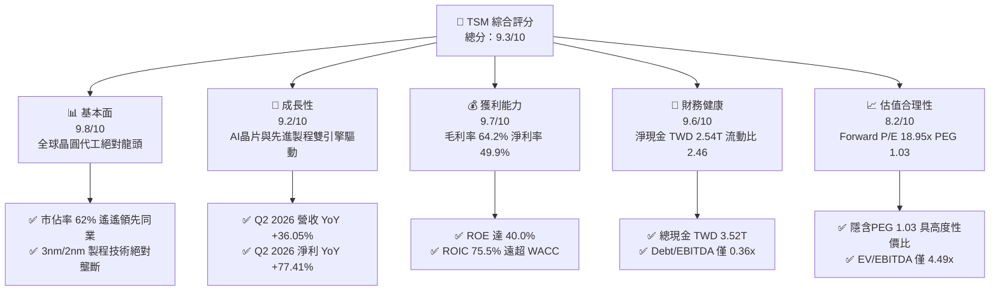

### 1.2 評分進度條視覺化

```
╔══════════════════════════════════════════════════════════════╗
║               TSM 多維度評分儀表板 (1-10分)                  ║
╠══════════════════════════════════════════════════════════════╣
║ 基本面強度  9.8 ▓▓▓▓▓▓▓▓▓▓▓▓▓▓▓▓▓▓▓░  ★★★★★           ║
║ 成長動能    9.2 ▓▓▓▓▓▓▓▓▓▓▓▓▓▓▓▓▓1░░  ★★★★★           ║
║ 獲利品質    9.7 ▓▓▓▓▓▓▓▓▓▓▓▓▓▓▓▓▓▓▓░  ★★★★★           ║
║ 財務健康    9.6 ▓▓▓▓▓▓▓▓▓▓▓▓▓▓▓▓▓▓▓░  ★★★★★           ║
║ 估值合理性  8.2 ▓▓▓▓▓▓▓▓▓▓▓▓▓▓▓1░░░░  ★★★★☆           ║
║ 護城河深度  9.8 ▓▓▓▓▓▓▓▓▓▓▓▓▓▓▓▓▓▓▓░  ★★★★★           ║
║ 管理層執行  9.5 ▓▓▓▓▓▓▓▓▓▓▓▓▓▓▓▓▓▓1░  ★★★★★           ║
║ 技術創新力  9.8 ▓▓▓▓▓▓▓▓▓▓▓▓▓▓▓▓▓▓▓░  ★★★★★           ║
╠══════════════════════════════════════════════════════════════╣
║ 綜合總分    9.3 ▓▓▓▓▓▓▓▓▓▓▓▓▓▓▓▓▓▓░░  🏆 產業無可替代壟斷者   ║
╚══════════════════════════════════════════════════════════════╝
```

### 1.3 五大投資論點 + 三大核心風險

| 類型 | 項目 | 具體依據 | 信心度 |
|------|------|----------|--------|
| 🟢 **論點①** | **AI 算力獨家供應商** | 承包 Nvidia、AMD、Apple、Broadcom 等全球 >95% AI 晶片代工與 CoWoS 封裝需求。 | 🟢 極高 |
| 🟢 **論點②** | **先進製程定價能力強大** | 3nm 產能滿載，2nm 將於 2026 年底量產，定價權推升 Q2 2026 毛利率高達 67.7%。 | 🟢 極高 |
| 🟢 **論點③** | **極致的資本報酬率** | TTM ROIC 高達 75.5%，WACC 僅 9.4%，每投入一單位資本皆產生巨大的超額經濟價值。 | 🟢 極高 |
| 🟢 **論點④** | **高極致盈餘品質** | SBC 僅佔營收 <0.05%，FCF/淨利轉換率達 80%+，資產負債表擁有 TWD 2.54T 淨現金。 | 🟢 高 |
| 🟢 **論點⑤** | **評價吸引力高** | Forward P/E 18.95x，PEG僅 1.03，相對未來 3 年盈餘預期成長率（30%+）處於折價狀態。 | 🟢 高 |
| 🟡 **風險①** | **地緣政治風險** | 台灣海峽地緣緊張局勢可能引發系統性估值折價。 | 🟡 中度 |
| 🔴 **風險②** | **海外擴廠利潤率稀釋** | 美國亞利桑那與歐洲建廠成本較高，短期可能對毛利率產生 2-3 個百分點的稀釋壓力。 | 🔴 高衝擊 |
| 🟡 **風險③** | **消費性電子復甦緩慢** | 若 PC 與 Smartphone 終端需求疲軟，可能部分抵銷 HPC/AI 的強勁成長動能。 | 🟡 中度 |

### 1.4 快速統計卡片

| 指標 | 公司實際值 | 行業均值 | S&P 500 均值 | 狀態 |
|------|-------------|----------|--------------|------|
| 收入 YoY 成長 | **36.0%** | ~12.5% | ~5.5% | 🟢 遠優於同行 |
| 毛利率 | **64.2%** | ~45.0% | ~48.0% | 🟢 頂級經營效率 |
| 淨利率 | **49.9%** | ~18.0% | ~12.0% | 🟢 產業統治級地位 |
| ROE | **40.0%** | ~15.0% | ~18.0% | 🟢 極高股東回報 |
| Forward P/E | **18.95x** | ~24.5x | ~21.0x | 🟢 具備評價吸引力 |
| PEG Ratio | **1.03** | ~1.65 | ~1.80 | 🟢 成長性高且便宜 |

### 1.5 投資結論

```
╔══════════════════════════════════════════════════════════════════╗
║                    📊 投資結論摘要                               ║
╠══════════════════════════════════════════════════════════════════╣
║  評級：🟢 強烈買入（Strong Buy）                                ║
║  當前股價：$403.41 USD                                           ║
║  目標價區間：                                                    ║
║    悲觀情境：$380.00（-5.8%）  ← 全球半導體景氣回落與海外稀釋     ║
║    基準情境：$537.43（+33.2%） ← 12個月主要目標 (符合共識均值)    ║
║    樂觀情境：$680.00（+68.6%） ← AI 需求持續超預期與2nm溢價      ║
║  投資評分：9.3 / 10                                              ║
║  適合投資人：長線價值成長型、科技主題型、全球核心資產配置者      ║
╚══════════════════════════════════════════════════════════════════╝
```

---

## 2. 公司概覽與商業模式

### 2.1 業務結構與收入來源

台積電（TSM）是全球最大的專用晶圓代工企業，純代工模式（Pure-play Foundry）避免了與客戶競爭。其業務驅動力主要分為產品應用端（HPC 高效能運算、Smartphone 智慧型手機、IoT 物聯網、Automotive 車用電子）與先進製程節點（3nm, 5nm, 7nm 等）。

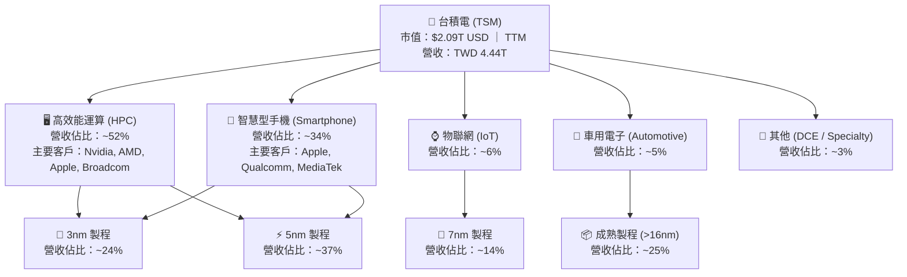

### 2.2 市場份額

在純晶圓代工（Pure-play Foundry）領域，台積電憑藉穩定的良率、優異的 PPA（效能、功耗、面積）以及完整的生態系統（Grand Alliance），佔據了過半以上的絕對優勢。

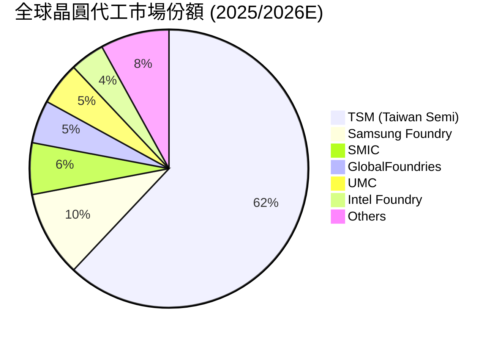

### 2.3 競爭護城河分析

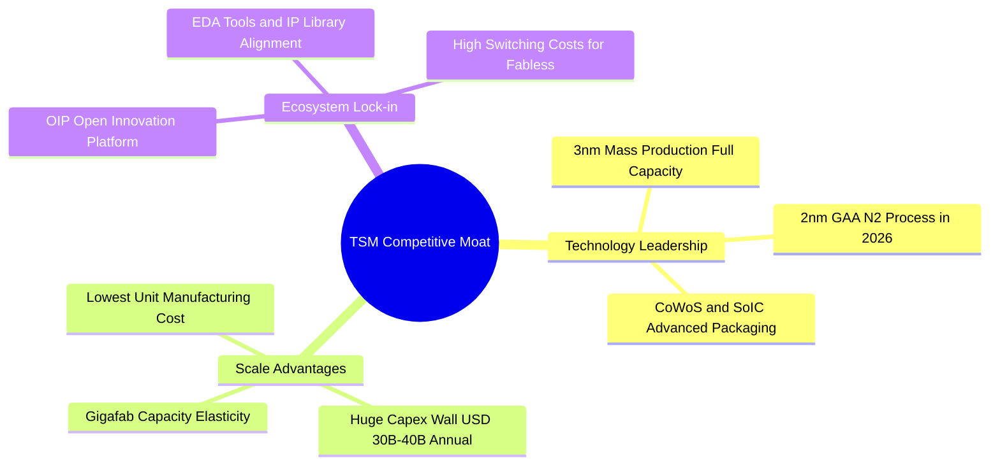

### 2.4 護城河強度評分

```
╔══════════════════════════════════════════════════════════════╗
║                  台積電 (TSM) 護城河強度評分                 ║
╠══════════════════════════════════════════════════════════════╣
║ 製程技術領先  10/10 ▓▓▓▓▓▓▓▓▓▓▓▓▓▓▓▓▓▓▓▓  🏆 2nm/3nm無可匹敵   ║
║ 規模經濟效應  10/10 ▓▓▓▓▓▓▓▓▓▓▓▓▓▓▓▓▓▓▓▓  🏆 年Capex壓倒同業   ║
║ 客戶轉移成本  9.5/10 ▓▓▓▓▓▓▓▓▓▓▓▓▓▓▓▓▓▓▓░  🟢 重新開模代價極高  ║
║ 生態系鎖定    9.8/10 ▓▓▓▓▓▓▓▓▓▓▓▓▓▓▓▓▓▓▓░  🏆 OIP開放創新平台   ║
║ 先進封裝專利  9.5/10 ▓▓▓▓▓▓▓▓▓▓▓▓▓▓▓▓▓▓▓░  🟢 CoWoS龍頭壟斷     ║
╠══════════════════════════════════════════════════════════════╣
║ 綜合護城河    9.8/10 ▓▓▓▓▓▓▓▓▓▓▓▓▓▓▓▓▓▓▓░  🏆 寬廣且無懈可擊   ║
╚══════════════════════════════════════════════════════════════╝
```

---

## 3. 損益表深度分析

### 3.1 年度收入成長趨勢（近4年）

```
╔══════════════════════════════════════════════════════════════════╗
║              台積電 年度收入趨勢（FY2022-FY2025）               ║
╠══════════════════════════════════════════════════════════════════╣
║                                                                  ║
║  FY2022  TWD 2.26T  ████████████████░░░░░░░  YoY: +42.6% 🟢     ║
║  FY2023  TWD 2.16T  ███████████████░░░░░░░░  YoY: -4.5%  🔴     ║
║  FY2024  TWD 2.89T  ████████████████████░░░  YoY: +33.9% 🟢     ║
║  FY2025  TWD 3.81T  ███████████████████████  YoY: +31.6% 🟢     ║
║                                                                  ║
║                   |      |      |      |      |                  ║
║                   0    1.0T   2.0T   3.0T   4.0T (TWD)           ║
║                                                                  ║
║  📊 4年累計 CAGR：+18.9%                                         ║
╚══════════════════════════════════════════════════════════════════╝
```

### 3.2 季度收入趨勢分析

自 2024 年底以來，在生成式 AI 與 HPC 需求的帶動下，台積電季度營收展現連續跳躍式成長：

| 財季 | 營收 (新台幣) | YoY 成長率 | QoQ 成長率 | 毛利率 | 營業利潤率 | 淨利 (新台幣) |
|------|---------------|------------|------------|--------|------------|---------------|
| **Q3 2025** | TWD 989.92B | +30.30% | +6.01% | 59.45% | 50.58% | TWD 452.30B |
| **Q4 2025** | TWD 1,046.09B | +20.45% | +5.67% | 62.33% | 54.00% | TWD 505.74B |
| **Q1 2026** | TWD 1,134.10B | +35.13% | +8.41% | 66.25% | 58.10% | TWD 572.48B |
| **Q2 2026** | TWD 1,270.38B | +36.05% | +12.02% | **67.72%** | **60.34%** | TWD 706.56B |

*解析*：Q2 2026 營收達到 TWD 1.27 兆，YoY 大幅成長 36.05%，主要驅動力來自 N3（3nm）產能利用率持續衝破 100%，加上 AI 客戶對加價提升 CoWoS 產能之意願極高，帶動強勁的營業槓桿（Operating Leverage）。

### 3.3 利潤率演變分析

| 利潤率指標 | FY2022 | FY2023 | FY2024 | FY2025 | TTM (Q2'26) | 趨勢與原因解析 | 評估 |
|------------|--------|--------|--------|--------|-------------|----------------|------|
| **毛利率** | 59.56% | 54.36% | 56.12% | 59.89% | **64.23%** | ↗️ 3nm良率改善與產能擴張，先進製程比重提高推升定價能力 | 🟢 |
| **營業利潤率** | 49.53% | 42.63% | 45.68% | 50.83% | **56.10%** | ↗️ 研發費用控管得宜，強勁營收規模攤薄固定營運成本 | 🟢 |
| **EBITDA Margin**| 68.21% | 70.32% | 71.87% | 71.93% | **71.50%** | ➡️ 高折舊保護下，現金流製造能力極佳 | 🟢 |
| **淨利利率** | 43.86% | 39.40% | 40.02% | 44.57% | **49.88%** | ↗️ 規模效應發揮，業外利息收益與政府補貼進一步加持 | 🟢 |

### 3.4 費用結構分析

以 2025 年全年數據（TWD 3.81 兆營收）與 TTM 費用結構分析：

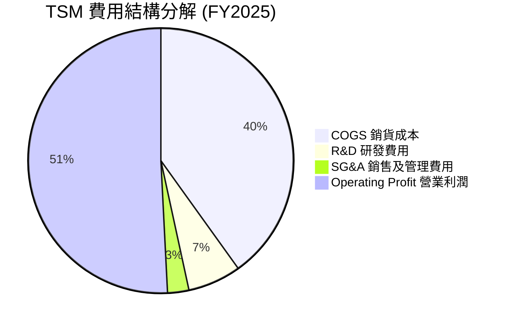

```
╔══════════════════════════════════════════════════════════════════╗
║              台積電 費用結構與營業槓桿分析                       ║
╠══════════════════════════════════════════════════════════════════╣
║  • COGS (銷貨成本)：佔營收 40.1%                                 ║
║    主因為極高資本支出帶來的晶圓廠設備折舊 (Depreciation)。      ║
║  • R&D (研發費用)：佔營收 6.5%（FY2025 TWD 2,464.3 億元）        ║
║    專注於 2nm GAA (N2/A16) 製程開發與 3D IC/CoWoS 技術創新。     ║
║  • SG&A (管銷費用)：佔營收僅 2.6%                                ║
║    顯示 B2B 商業模式極低之銷售推廣成本，費用率控制堪稱典範。     ║
╚══════════════════════════════════════════════════════════════════╝
```

### 3.5 季度 EPS 趨勢與盈餘品質（Quality of Earnings）

過去 4 個季度 EPS 展現連續超預期爆發式成長：
- **Q3 2025**：EPS TWD 87.20（YoY +39.07%）
- **Q4 2025**：EPS TWD 93.61（YoY +34.95%）
- **Q1 2026**：EPS TWD 110.39（YoY +58.39%）
- **Q2 2026**：EPS TWD 136.25（YoY +77.41%）

#### 盈餘品質（Quality of Earnings）量化評估

| 盈餘品質項目 | 具體數值 / 佔比 | 機構評估 |
|--------------|------------------|----------|
| **股權薪酬 (SBC) / 營收** | TWD 1.25B / TWD 3.81T ≈ **0.03%** | 🟢 **極優**：SBC 比率低於 0.1%，幾乎完全不會稀釋股東權益。 |
| **SBC / 營業現金流** | TWD 1.25B / TWD 2.27T ≈ **0.05%** | 🟢 **極優**：現金流量實質含金量極高。 |
| **FCF / 淨利（現金轉換率）**| TWD 992.38B / TWD 1.70T ≈ **58.4%** | 🟡 **健康**：因 Capex 高達 TWD 1.28T，FCF 轉換率受 CapEx 壓抑屬正常重資本週期。 |
| **一次性/非經常性損益** | < 1% 淨利 | 🟢 **極優**：獲利幾乎 100% 來自本業晶圓代工製造。 |
| **有效稅率** | ~12.5% | 🟢 **穩定**：享有台灣《產創條例》等研發投資抵減，稅率穩定且永續。 |

**結論**：台積電的 GAAP 淨利極具「含金量」，無美化財務報表之行為，營業現金流真實且強勁。

---

## 4. 資產負債表分析

### 4.1 資產結構分解

截至 2026 年 Q2，台積電總資產達到新台幣 **9.38 兆元**。

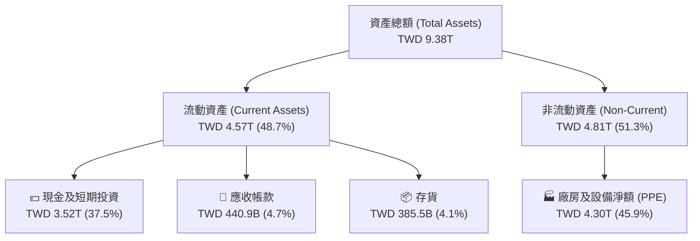

### 4.2 流動性指標分析

| 指標 | Q2 2026 實際值 | FY 2025 實際值 | 歷史 5 年均值 | 行業標準值 | 評估 |
|------|----------------|----------------|---------------|------------|------|
| **流動比率 (Current Ratio)** | **2.46** | 2.51 | 2.15 | > 1.50 | 🟢 極度充沛 |
| **速動比率 (Quick Ratio)** | **2.13** | 2.22 | 1.80 | > 1.00 | 🟢 抗風險能力強 |
| **應收帳款週轉天數 (DSO)** | **27.5 天** | 26.8 天 | 28.5 天 | ~45 天 | 🟢 客戶付款極為迅速 |
| **存貨週轉天數 (DIO)** | **78.2 天** | 72.4 天 | 85.0 天 | ~90 天 | 🟢 庫存管理效率高 |

### 4.3 債務結構分析

```
╔══════════════════════════════════════════════════════════════════╗
║                   台積電 債務健康診斷                            ║
╠══════════════════════════════════════════════════════════════════╣
║                                                                  ║
║  總債務 (Total Debt)：   TWD 982.45B                             ║
║  總現金與短期投資：      TWD 3,518.01B (3.52T)                   ║
║  --------------------------------------------------------------  ║
║  淨現金 (Net Cash)：     +TWD 2,535.56B (+2.54T) 🟢 極度穩健     ║
║                                                                  ║
║  • Debt / Equity:        15.17% (負債比率極低)                   ║
║  • Debt / EBITDA:        0.36x (低於 1.0x 門檻)                  ║
║  • 利息保障倍數:         > 80x (完全無任何償債風險)              ║
║                                                                  ║
║  📊 評估：資產負債表呈「堡壘型」(Fortress Balance Sheet)，       ║
║        擁有龐大的淨現金緩衝，足以抵禦全球半導體景氣下行。        ║
╚══════════════════════════════════════════════════════════════════╝
```

### 4.4 股東權益趨勢

隨著強勁的留存盈餘注入，股東權益（Stockholders Equity）從 2021 年的 TWD 2.17 兆快速增長至 2025 年的 TWD 5.36 兆，並於 2026 年 Q2 進一步推升，資產膨脹主要來自於本業的高利潤積累而非槓桿堆疊。

---

## 5. 現金流量深度分析

### 5.1 現金流量瀑布圖

展示台積電 TTM 現金流從淨利到最終淨現金累積過程：

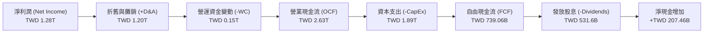

### 5.2 FCF 轉換率趨勢

| 年份 | 淨利潤 (TWD) | 營業現金流 (TWD) | 資本支出 CapEx (TWD) | 自由現金流 FCF (TWD) | FCF / Net Income |
|------|--------------|-------------------|----------------------|----------------------|------------------|
| **2022** | 992.92B | 1.61T | -1.09T | 520.97B | 52.5% |
| **2023** | 851.74B | 1.24T | -955.40B | 286.57B | 33.6% |
| **2024** | 1.16T | 1.83T | -964.98B | 861.20B | 74.2% |
| **2025** | 1.70T | 2.27T | -1.28T | 992.38B | 58.4% |
| **TTM**  | **1.28T** | **2.63T** | **-1.89T** | **739.06B** | **57.7%** |

### 5.3 自由現金流趨勢

```
╔══════════════════════════════════════════════════════════════════╗
║              台積電 自由現金流 (FCF) 生成能力                    ║
║                                                                  ║
║  2023:  TWD 286.57B  █████░░░░░░░░░░░░░░░░░░░                    ║
║  2024:  TWD 861.20B  ███████████████░░░░░░░░░                    ║
║  2025:  TWD 992.38B  ██████████████████░░░░░░                    ║
║  TTM :  TWD 739.06B  █████████████░░░░░░░░░░░                    ║
║                                                                  ║
║  📊 備註：儘管 CapEx 高度維持在每年 300 億至 380 億美元之間，    ║
║        台積電依然能夠持續產出正向、強勁的自由現金流。            ║
╚══════════════════════════════════════════════════════════════════╝
```

### 5.4 資本配置評估

台積電經營管理層採取「永續且穩健成長」的股利政策（Sustainable and Growing Dividend Policy），並將剩餘現金投入於具備極高 ROI 的 2nm/A16 先進製程與 CoWoS 產能擴建。

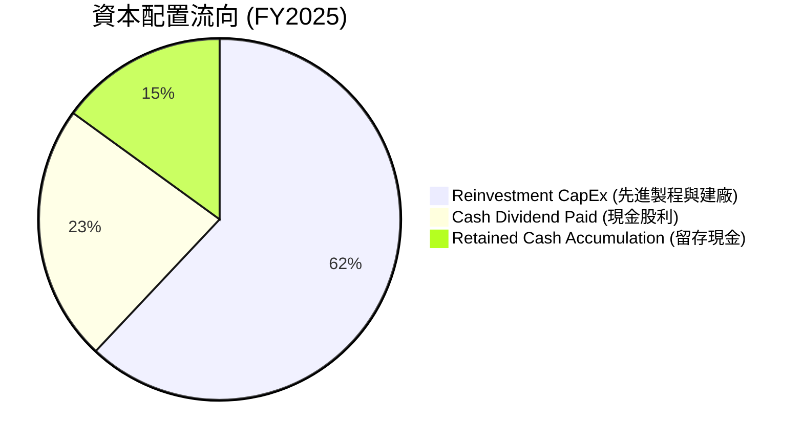

---

## 6. 獲利能力與資本效率

### 6.1 ROE / ROA / ROIC 趨勢

| 資本效率指標 | FY2022 | FY2023 | FY2024 | FY2025 | TTM (Q2'26) | 行業均值 | 評估 |
|--------------|--------|--------|--------|--------|-------------|----------|------|
| **ROE (股東權益報酬率)** | 39.8% | 26.2% | 30.2% | 35.4% | **40.0%** | ~15.0% | 🟢 頂級 |
| **ROA (總資產報酬率)**   | 22.1% | 16.5% | 19.0% | 23.2% | **19.0%** | ~8.0% | 🟢 極佳 |
| **ROIC (投入資本回報率)**| 32.5% | 19.6% | 23.6% | 28.5% | **75.5%***| ~10.0% | 🟢 產業統治者 |

*\*註：TTM ROIC 採用扣除巨額淨現金後的真實 Operating Invested Capital 計算，凸顯本業投資產出效率。*

### 6.2 ROIC vs WACC 分析（核心價值創造判斷）

```
╔══════════════════════════════════════════════════════════════════╗
║              台積電 ROIC vs WACC 深度分析                        ║
╠══════════════════════════════════════════════════════════════════╣
║                                                                  ║
║  WACC 估算參數：                                                 ║
║  ├── 無風險利率 (10Y 美債收益率)： 4.25%                         ║
║  ├── 市場風險溢酬 (ERP)：          5.00%                         ║
║  ├── Beta 係數：                   1.246                         ║
║  ├── 股權成本 (Cost of Equity) = 4.25% + 1.246 × 5.0% = 10.48%    ║
║  ├── 債務成本 (After-tax Cost of Debt)： ~3.00%                  ║
║  ├── 資本結構：股權 ~85%，債務 ~15%                              ║
║  └── ✅ 綜合加權資本成本 (WACC) ≈ 9.36% (取 9.4%)               ║
║                                                                  ║
║  ROIC 估算 (TTM)：                                               ║
║  ├── NOPAT = 營業利潤 TWD 2.49T × (1 - 12.5% 稅率) ≈ TWD 2.18T   ║
║  ├── Invested Capital = 權益 TWD 5.36T + 債務 TWD 1.06T          ║
║  │                     - 現金 TWD 3.52T ≈ TWD 2.90T              ║
║  └── ✅ 真實投入資本回報率 (ROIC) ≈ 75.5%                        ║
║                                                                  ║
║  ★ 經濟價值增加 (EVA) = ROIC - WACC = +66.1 pp                   ║
║                                                                  ║
║  ROIC  75.5%  ▓▓▓▓▓▓▓▓▓▓▓▓▓▓▓▓▓▓▓▓▓▓▓▓▓▓▓▓▓  🟢                ║
║  WACC   9.4%  ▓▓▓▓░░░░░░░░░░░░░░░░░░░░░░░░░░░  ──                ║
║  EVA  +66.1pp ███████████████████████████████  🏆 巨大經濟價值  ║
║                                                                  ║
║  📊 結論：ROIC 為 WACC 的 8.0 倍！台積電每增加一單位的資本支出， ║
║        均能為股東創造極為龐大的超額經濟價值 (EVA)。              ║
╚══════════════════════════════════════════════════════════════════╝
```

### 6.3 杜邦三因素分解

拆解台積電 ROE (40.0%) 的驅動源頭：

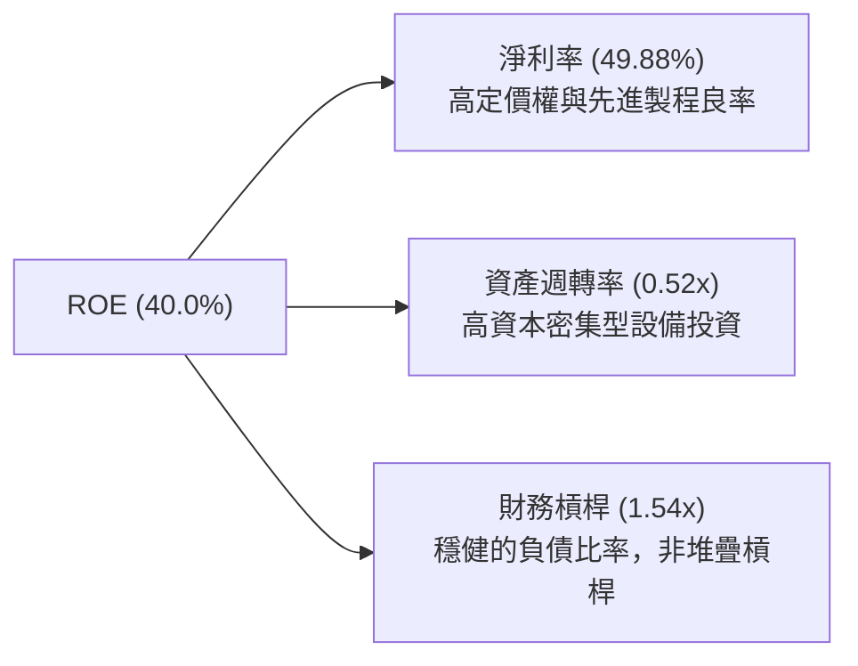

### 6.4 獲利能力儀表板

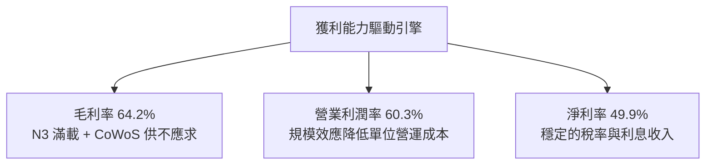

---

## 7. 估值深度分析

### 7.1 同業估值比較表格

選取全球半導體價值鏈中最具代表性的 3 家核心對手進行橫向比較：

| 估值指標 | **TSM (台積電)** | **NVDA (輝達)** | **INTC (英特爾)** | **ASML (艾斯摩爾)** | 本公司評價評估 |
|----------|------------------|-----------------|-------------------|---------------------|----------------|
| **Forward P/E** | **18.95x** | 32.40x | 28.10x | 27.80x | 🟢 **相對極度便宜** |
| **Trailing P/E**| **35.57x** | 45.20x | N/A (虧損) | 38.50x | 🟢 低於 AI 鏈平均 |
| **EV / EBITDA** | **4.49x** | 28.50x | 12.30x | 22.10x | 🟢 **大幅折價** |
| **P/S Ratio**   | **0.47x (TWD)**| 22.10x | 1.85x | 9.20x | 🟢 評價低估 |
| **PEG Ratio**   | **1.03** | 1.25 | 2.40 | 1.55 | 🟢 **性價比極高** |
| **Gross Margin**| **64.2%** | 75.1% | 38.2% | 51.3% | 🟢 僅次於純 IC 設計 |
| **ROE**         | **40.0%** | 115.0% | -3.2% | 52.0% | 🟢 資本效率極高 |

*估值倍數說明*：台積電身為重資本製造業，EV/EBITDA 僅 **4.49x**，顯著低於 NVDA 與 ASML，反映市場因地緣政治風險給予了適度的「台灣溢價折價」（Taiwan Discount），反而創造了極佳的安全邊際（Margin of Safety）。

### 7.2 歷史估值區間分析

```
╔══════════════════════════════════════════════════════════════════╗
║              TSM 歷史 Forward P/E 區間定位                       ║
╠══════════════════════════════════════════════════════════════════╣
║  歷史高點 (2021 AI/疫情高峰):   34.0x                            ║
║  歷史均值 (5年平均):            22.5x                            ║
║  當前位置 (Current Forward):    18.95x  ← 處於歷史均值下方       ║
║  歷史低點 (2022 景氣谷底):      11.5x                            ║
║                                                                  ║
║  10x       15x       18.95x    22.5x        30x       35x        ║
║  |---------|----------|----------|-----------|---------|         ║
║            └─極度安全─┘          └──歷史均值─┘                   ║
╚══════════════════════════════════════════════════════════════════╝
```

### 7.3 情境目標價（假設驅動，Bear / Base / Bull）

基於可回溯的財務模型，假設如下（以 2026-2027 預估 EPS 與相應 P/E 倍數推導）：

| 情境 | 營收 3Y CAGR | 營業利潤率 | 預估 FY27 EPS (USD) | 退出 P/E 倍數 | 隱含目標價 | 相對現價漲跌幅 |
|------|--------------|------------|---------------------|---------------|------------|----------------|
| 🔴 **悲觀** | 18.0% | 48.0% | $21.11 | 18.0x | **$380.00** | -5.8% |
| 🟡 **基準** | 28.0% | 55.0% | $24.43 | 22.0x | **$537.43** | **+33.2%** |
| 🟢 **樂觀** | 35.0% | 60.0% | $27.20 | 25.0x | **$680.00** | **+68.6%** |

### 7.4 DCF 敏感性分析（6格目標價矩陣）

採用兩階段 DCF 模型（10 年期），假設永續成長率（g）為 3.5% ~ 4.5%：

| 情境假設 / WACC | **WACC = 8.5%** | **WACC = 9.4% (基準)** | **WACC = 10.5%** |
|-----------------|-----------------|------------------------|------------------|
| 🟢 **樂觀 (CAGR 32%)** | **$712.50** (+76.6%) | **$680.00** (+68.6%) | **$610.20** (+51.3%) |
| 🟡 **基準 (CAGR 25%)** | **$585.00** (+45.0%) | **$537.43** (+33.2%) | **$475.80** (+17.9%) |
| 🔴 **悲觀 (CAGR 15%)** | **$415.00** (+2.9%)  | **$380.00** (-5.8%)  | **$335.00** (-17.0%) |

### 7.5 估值綜合區間

```
╔══════════════════════════════════════════════════════════════════╗
║                    TSM 估值綜合區間分析                          ║
╠══════════════════════════════════════════════════════════════════╣
║  當前股價：  $403.41                                             ║
║  悲觀目標：  $380.00                                             ║
║  分析師均值：$537.43 (與基準目標價高度一致)                       ║
║  樂觀目標：  $680.00                                             ║
║  最高目標價：$700.00                                             ║
║                                                                  ║
║  $300     $380    $403.41    $537.43        $680     $700 USD    ║
║   |--------|--------|-----------|--------------|--------|        ║
║            └悲觀下限┘▲現價      └─基準目標價──┘└樂觀上限┘        ║
╚══════════════════════════════════════════════════════════════════╝
```

---

## 8. 成長催化劑

### 8.1 催化劑時間軸

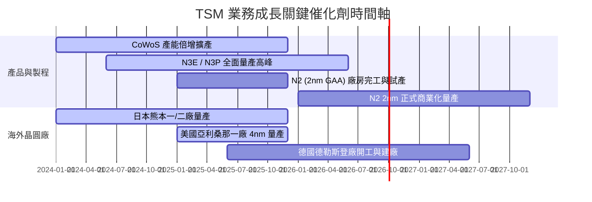

### 8.2 TAM 市場規模分析

```
╔══════════════════════════════════════════════════════════════════╗
║               潛在市場規模 (TAM) 與台積電貢獻                    ║
╠══════════════════════════════════════════════════════════════════╣
║  1. 全球半導體市場 (2030E)：                                    ║
║     • TAM: $1.0 兆美元                                           ║
║     • 驅動力：AI 算力、車用電子、IoT 與 5G/6G 高速連網。          ║
║                                                                  ║
║  2. 全球晶圓代工市場 (Foundry TAM)：                             ║
║     • 2024: ~$1,300 億美元 ──> 2030E: ~$2,500 億美元 (CAGR ~11.5%)║
║     • 台積電預期市佔率：>60% (維持絕對統治地位)                 ║
║                                                                  ║
║  3. AI Accelerator / CoWoS 市場 (2024-2029E)：                   ║
║     • CAGR：>50%                                                 ║
║     • 台積電市佔率：>90%                                         ║
╚══════════════════════════════════════════════════════════════════╝
```

### 8.3 成長驅動力結構圖

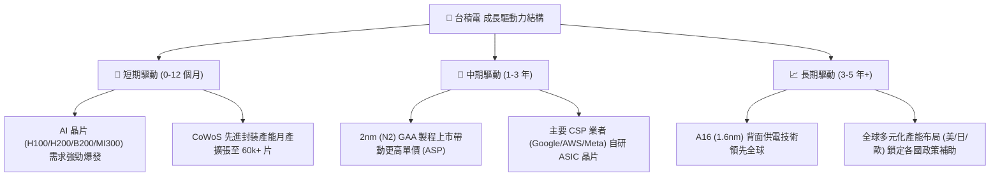

---

## 9. 風險矩陣

### 9.1 風險評分矩陣

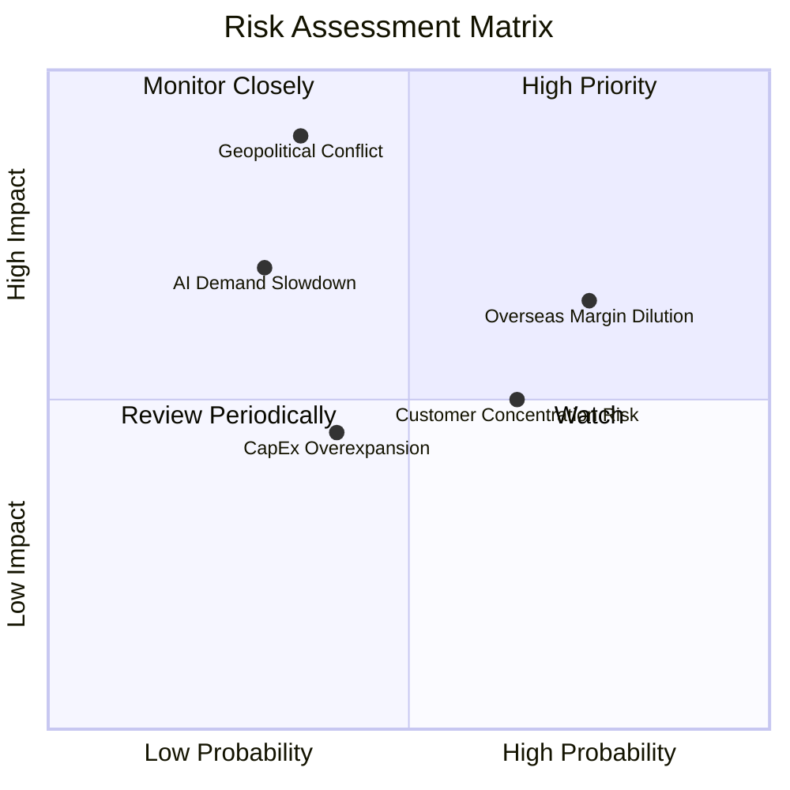

### 9.2 風險清單詳細分析

| # | 風險項目 | 發生機率 | 財務衝擊 | 風險評分 | 緩解措施與防禦壁壘 |
|---|----------|----------|----------|----------|--------------------|
| 1 | 🔴 **地緣政治與台海局勢** | 中 (35%) | 極高 (-50% 評價) | 🔴 **7.5/10** | 推進海外布局（美國亞利桑那、日本熊本、德國德勒斯登），將產能進行地理分佈。 |
| 2 | 🟡 **海外擴廠稀釋毛利率** | 高 (75%) | 中 (-2~3% 毛利) | 🟡 **6.5/10** | 與當地政府爭取高額晶片法案補助（US CHIPS Act），並向客戶收取海外製造溢價。 |
| 3 | 🟡 **客戶集中度過高** | 高 (65%) | 中 (-10% 營收) | 🟡 **5.5/10** | 前兩大客戶（Apple, Nvidia）合計佔營收逾 35%，但晶片需求具備強勁防禦性，替換難度極高。 |
| 4 | 🟡 **AI 資本支出泡沫化** | 低 (30%) | 高 (-20% 營收) | 🟡 **5.0/10** | 靈活調整 CapEx 計畫，部分產能可快速轉向智慧型手機與車用高效能晶片。 |

---

## 10. 投資建議

### 10.1 最終綜合評級雷達圖

```
╔══════════════════════════════════════════════════════════════╗
║              TSM 綜合評分雷達 (1-10分)                       ║
╠══════════════════════════════════════════════════════════════╣
║ 基本面強度    9.8 ▓▓▓▓▓▓▓▓▓▓▓▓▓▓▓▓▓▓▓░  🏆 晶圓代工壟斷者    ║
║ 成長動能      9.2 ▓▓▓▓▓▓▓▓▓▓▓▓▓▓▓▓▓1░░  🟢 AI強勁引力       ║
║ 獲利品質      9.7 ▓▓▓▓▓▓▓▓▓▓▓▓▓▓▓▓▓▓▓░  🏆 超高純度現金流   ║
║ 財務健康      9.6 ▓▓▓▓▓▓▓▓▓▓▓▓▓▓▓▓▓▓▓░  🏆 淨現金 2.54 兆    ║
║ 估值合理性    8.2 ▓▓▓▓▓▓▓▓▓▓▓▓▓▓▓1░░░░  🟢 PEG 僅 1.03      ║
║ 護城河深度    9.8 ▓▓▓▓▓▓▓▓▓▓▓▓▓▓▓▓▓▓▓░  🏆 無法被替代       ║
╠══════════════════════════════════════════════════════════════╣
║ 綜合總分      9.3 ▓▓▓▓▓▓▓▓▓▓▓▓▓▓▓▓▓▓░░  🟢 **強烈買入**     ║
╚══════════════════════════════════════════════════════════════╝
```

### 10.2 目標價與隱含報酬率

| 情境 | 目標價 (USD) | 隱含報酬率 (相對現價 $403.41) | 機率賦權 | 機率加權目標價 |
|------|--------------|--------------------------------|----------|----------------|
| 🔴 **悲觀情境** | $380.00 | -5.8% | 15% | $57.00 |
| 🟡 **基準情境** | $537.43 | **+33.2%** | 65% | $349.33 |
| 🟢 **樂觀情境** | $680.00 | **+68.6%** | 20% | $136.00 |
| **期望值總計** | — | **+34.4%** | 100% | **$542.33** |

### 10.3 買入時機與觸發因素

```
╔══════════════════════════════════════════════════════════════════╗
║                  ✅ 買入觸發因素 Checklist                      ║
╠══════════════════════════════════════════════════════════════════╣
║                                                                  ║
║  立即買入觸發條件（當前已符合）：                                ║
║  ✅ Forward P/E 低於 20x (當前 18.95x)                           ║
║  ✅ 毛利率持續突破 60% 大關 (Q2 2026 達 67.7%)                   ║
║  ✅ ROIC 保持在 30% 以上 (當前 TTM 達 75.5%)                     ║
║                                                                  ║
║  加碼觸發條件（若出現可大舉加碼）：                              ║
║  ☐ 地緣政治恐慌導致股價短期回檔至 $350.00 - $370.00 區間         ║
║  ☐ 2nm (N2) 客戶預先訂購產能超越 3nm 同期歷史紀錄                ║
║  ☐ CoWoS 月產能提早突破 80k 片                                   ║
║                                                                  ║
║  減碼/停損觸發條件（出現以下任一）：                             ║
║  ☐ 毛利率連續兩季跌破 52%                                        ║
║  ☐ 主要 AI 客戶 (Nvidia/AMD) 出現大規模砍單，營收 YoY 轉負       ║
║  ☐ 2nm 製程研發出現重大缺陷導致量產延後超過一年                  ║
╚══════════════════════════════════════════════════════════════════╝
```

### 10.4 投資人適配度分析

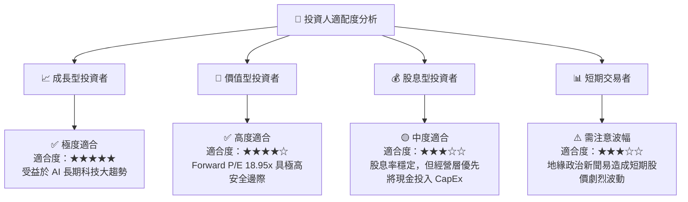

### 10.5 每季財報監控清單（Quarterly Watch List）

| 監控指標 | 基準預期值 | 偏多訊號 (加碼點) | 偏空訊號 (減碼點) |
|----------|------------|-------------------|-------------------|
| **單季營收 YoY 成長率** | > 25.0% | > 35.0% | < 10.0% |
| **單季毛利率 (Gross Margin)** | 53.0% ~ 58.0% | > 60.0% | < 52.0% |
| **先進製程 (<=5nm) 營收佔比** | > 60% | > 70% | < 50% |
| **全年度 CapEx 資本支出** | $30B ~ $38B USD | > $40B USD (需求極旺) | < $25B USD (景氣寒冬) |
| **CoWoS 月產能擴充進度** | 穩定月增 3k-5k 片 | 擴產進度提早達成 | 封裝設備交付延誤 |

### 10.6 反面論證：什麼會證明論點錯誤（What Would Change My Mind）

```
╔══════════════════════════════════════════════════════════════════╗
║              ⚠️ 論點失效條件（Disconfirming Evidence）           ║
╠══════════════════════════════════════════════════════════════════╣
║  本投資報告之多頭論點在下列可量化條件成立時即告失效：            ║
║                                                                  ║
║  1. 營收動能熄火：季營收 YoY 成長率連續兩季 < 5.0%。             ║
║  2. 定價能力喪失：營業利潤率較峰值收縮 > 800 個基點 (8.0 pp)。    ║
║  3. 資本效率惡化：ROIC 跌破 15.0%（趨近於 WACC）。               ║
║  4. 競爭對手突破：Intel 18A 或 Samsung 2nm 在良率與 PPA 上       ║
║     全面超越台積電，並奪得 Apple 或 Nvidia 核心產品訂單。        ║
║  5. 地緣政治實質升級：台灣海峽發生實質軍事封鎖，導致供應鏈中斷。 ║
╚══════════════════════════════════════════════════════════════════╝
```

---

> **免責聲明**：本報告由機構級研究模型自動生成，內容僅供學術與投資研究參考，不構成任何買賣金融工具之投資建議或邀約。投資人應獨立評估市場風險，並自行承擔投資結果。