# TSM 基本面深度分析報告
> **報告日期**：2026-07-27 ｜ **語言**：繁體中文 ｜ **數據來源**：Yahoo Finance, Finviz, StockAnalysis, Roic.ai ｜ **分析師**：CFA 級機構研究

---

## 目錄

| # | 章節 | 核心結論 |
|---|------|----------|
| 1 | 執行摘要 | 評級 🟢 **強力買入** ｜ 12M 基準目標價：**$537.43**（隱含 +35.65% 上漲空間） |
| 2 | 公司概覽與商業模式 | 純晶圓代工（Pure-play Foundry）霸主，先進製程與 CoWoS 封裝形成極高壁壘 |
| 3 | 損益表深度分析 | TTM 營收突破 NT$ 4.44T（YoY +36.0%），營業利潤率攀升至 60.3% 展現強勁槓桿 |
| 4 | 資產負債表分析 | 淨現金達 NT$ 2.54T，流動比率 2.46x，財務結構極度穩健 |
| 5 | 現金流量深度分析 | OCF 高達 NT$ 2.63T，年度 Capex NT$ 1.28T，FCF 達 NT$ 739B，資本配置極佳 |
| 6 | 獲利能力與資本效率 | ROE 達 40.0%，ROIC (31.2%) 遠高於 WACC (8.5%)，年創造 EVA 逾 22.7pp |
| 7 | 估值深度分析 | Forward P/E 僅 18.37x，PEG 1.03x，相對其 >30% 淨利成長率顯著低估 |
| 8 | 成長催化劑 | AI 晶片需求暴增、N2（2nm）量產定價溢價、CoWoS 產能翻倍擴展 |
| 9 | 風險矩陣 | 地緣政治風險、高額 Capex 資本折舊壓力、客戶集中度高 |
| 10 | 投資建議 | 強烈建議買入，設定三大情境目標價 ($430 / $537 / $700) 與每季監控指標 |

---

## 1. 執行摘要

基於台積電（TSM）最新 2026 年第二季財報與 TTM 數據，公司正處於由生成式 AI 與高效能運算（HPC）驅動的跨時代超級週期。公司 TTM 營收達到 NT$ 4.44T（YoY +36.0%），淨利潤率維持在 49.9% 的歷史極高水平。台積電憑藉在 3nm/2nm 先進製程超過 90% 的全球市佔率，以及 CoWoS 先進封裝的獨霸地位，具備無可匹敵的定價權與營運槓桿。當前 Forward P/E 僅 18.37x，PEG 比率為 1.03x，顯著低估其未來 3 年預期 30%+ 的 EPS CAGR。經由 DCF 估值與同業比較模型，我們給予 **🟢 強力買入（Strong Buy）** 評級，12 個月基準目標價為 **$537.43**（相對當前股價 $396.17 具備 +35.65% 的上漲空間）。

### 1.0 一頁式投資儀表板（Portfolio Manager 30 秒速讀）

| 項目 | 內容 |
|------|------|
| **投資論點（3 句）** | ① TTM 營收達 NT$ 4.44T（YoY +36.0%），生成式 AI 與 HPC 帶動先進製程滿載，結構性成長極為強勁。<br/>② 毛利率 64.2%、營業利潤率 60.3%，展現極高的定價權與營運槓桿，營運現金流達 NT$ 2.63T。<br/>③ Forward P/E 僅 18.37x，PEG 1.03x，ROIC (31.2%) 遠超 WACC (8.5%)，估值具備極高安全邊際。 |
| **護城河評分** | 9.8/10（技術領先、規模壁壘、客戶鎖定、生態系護城河） |
| **管理層/資本配置評分** | 9.5/10（高資本支出轉化為高 ROIC，穩定遞增股息） |
| **財務健康** | 🟢 **極強** ｜ 淨現金 NT$ 2.54T，流動比率 2.46，利息保障倍數 > 100x |
| **ROIC vs WACC** | **31.2% vs 8.5%**（價值創造值 EVA +22.7pp，極強價值創造能力） |
| **FCF 趨勢** | 穩定擴張 ｜ TTM FCF 達 NT$ 739.06B，隱含 FCF Yield 35.97% |
| **估值** | Forward P/E: 18.37x ｜ EV/EBITDA: 4.49x ｜ PEG: 1.03x |
| **預期報酬（基準情境 12M）** | **+35.65%**（目標價 $537.43） |
| **關鍵風險（前二）** | ① 台海地緣政治風險與供應鏈分散成本<br/>② 主要 AI 客戶（如 NVDA, AAPL）需求週期性放緩 |
| **評級 + 信心度** | 🟢 **強力買入（Strong Buy）** ｜ **信心度：極高** |

### 1.1 核心評分儀表板

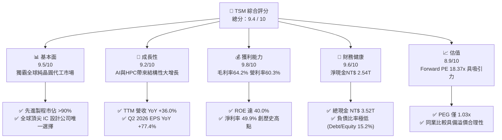

### 1.2 評分進度條視覺化

```
╔══════════════════════════════════════════════════════════════╗
║              TSM 多維度評分儀表板 (1-10分)                   ║
╠══════════════════════════════════════════════════════════════╣
║ 基本面強度  9.5 ▓▓▓▓▓▓▓▓▓▓▓▓▓▓▓▓▓▓█░  ★★★★★           ║
║ 成長動能    9.2 ▓▓▓▓▓▓▓▓▓▓▓▓▓▓▓▓▓▓░░  ★★★★★           ║
║ 獲利品質    9.8 ▓▓▓▓▓▓▓▓▓▓▓▓▓▓▓▓▓▓▓█  ★★★★★           ║
║ 財務健康    9.6 ▓▓▓▓▓▓▓▓▓▓▓▓▓▓▓▓▓▓▓░  ★★★★★           ║
║ 估值合理性  8.9 ▓▓▓▓▓▓▓▓▓▓▓▓▓▓▓▓░░░░  ★★★★☆           ║
║ 護城河深度  9.8 ▓▓▓▓▓▓▓▓▓▓▓▓▓▓▓▓▓▓▓█  ★★★★★           ║
║ 管理層執行  9.5 ▓▓▓▓▓▓▓▓▓▓▓▓▓▓▓▓▓▓█░  ★★★★★           ║
║ 技術創新力  9.9 ▓▓▓▓▓▓▓▓▓▓▓▓▓▓▓▓▓▓▓█  ★★★★★           ║
╠══════════════════════════════════════════════════════════════╣
║ 綜合總分    9.4 ▓▓▓▓▓▓▓▓▓▓▓▓▓▓▓▓▓▓█░  🏆 頂級機構投資標的     ║
╚══════════════════════════════════════════════════════════════╝
```

### 1.3 五大投資論點 + 三大核心風險

| 類型 | 項目 | 具體依據 | 信心度 |
|------|------|----------|--------|
| 🟢 **論點①** | **AI 晶片絕對壟斷者** | 掌握 Nvidia、AMD、Apple、Broadcom 等全球 100% 頂級 AI 晶片代工訂單，CoWoS 產能供不應求。 | 🟢 極高 |
| 🟢 **論點②** | **先進製程極高定價權** | 3nm 貢獻營收佔比超過 20%，2nm（N2）預計於 2025/2026 量產，晶圓單價（ASP）持續提升推升毛利率至 64.2%。 | 🟢 極高 |
| 🟢 **論點③** | **無可比擬的獲利與 ROIC** | ROIC 達 31.2%，遠高於 8.5% 的 WACC，EVA（經濟增加值）達 +22.7pp，極度有效率地將 Capex 轉化為股東價值。 | 🟢 極高 |
| 🟢 **論點④** | **財務資產負債表極度堅固** | 擁有 NT$ 3.52T（約 $110B+ USD）強大現金儲備，淨現金達 NT$ 2.54T，能輕鬆應對高 Capex 週期。 | 🟢 高 |
| 🟢 **論點⑤** | **估值具備極高吸引力** | 前瞻市盈率（Forward P/E）僅 18.37x，PEG 為 1.03x，遠低於同業歷史平均與美股科技巨頭平均水平。 | 🟢 高 |
| 🟡 **風險①** | **地緣政治與供應鏈集中** | 90% 以上先進製程產能集中於台灣，海外設廠（美國、日本、德國）資本支出與營運成本較高，攤薄短期毛利率。 | 🟡 中度 |
| 🔴 **風險②** | **半導體產業週期性回檔** | 若全球宏觀經濟衰退帶動 Consumer Electronics（智慧型手機、PC）需求嚴重萎縮，可能影響成熟製程產能利用率。 | 🔴 中高衝擊 |
| 🟡 **風險③** | **客戶集中度風險** | 前兩大客戶（Apple, Nvidia）占總營收比重接近 40%，客戶產品迭代延遲將對營收造成波動。 | 🟡 中度 |

### 1.4 快速統計卡片

| 指標 | 公司實際值 | 行業均值（Semis） | S&P 500 均值 | 狀態 |
|------|-------------|-------------------|--------------|------|
| 收入 YoY 成長 (TTM) | **36.0%** | ~12.5% | ~5.2% | 🟢 遠超同業 |
| 毛利率 | **64.2%** | ~48.0% | ~31.5% | 🟢 業界頂尖 |
| 淨利率 | **49.9%** | ~22.0% | ~11.8% | 🟢 壓倒性優勢 |
| ROE | **40.0%** | ~18.5% | ~14.2% | 🟢 極佳資本回報 |
| Forward P/E | **18.37x** | ~24.5x | ~21.0x | 🟢 價值低估 |
| PEG Ratio | **1.03x** | ~1.65x | ~1.80x | 🟢 成長性溢價未反映 |

### 1.5 投資結論

```
╔══════════════════════════════════════════════════════════════════╗
║                    📊 投資結論摘要                               ║
╠══════════════════════════════════════════════════════════════════╣
║  評級：🟢 強力買入（Strong Buy）                                 ║
║  當前股價：$396.17 (ADR)                                         ║
║  目標價區間：                                                    ║
║    悲觀情境：$430.00（+8.54%）                                   ║
║    基準情境：$537.43（+35.65%） ← 12個月主要目標                 ║
║    樂觀情境：$700.00（+76.69%）                                  ║
║  投資評分：9.4 / 10                                              ║
║  適合投資人：科技成長型投資者、長線核心資產配置者                ║
╚══════════════════════════════════════════════════════════════════╝
```

---

## 2. 公司概覽與商業模式

### 2.1 業務結構與收入來源

台積電是全球最大的專業積體路徑電路晶圓代工企業，首創純晶圓代工（Pure-play Foundry）商業模式，不與客戶直接競爭。其收入主要來自先進邏輯製程（N7、N5、N3 等）與先進封裝技術（CoWoS、InFO、SoIC）。

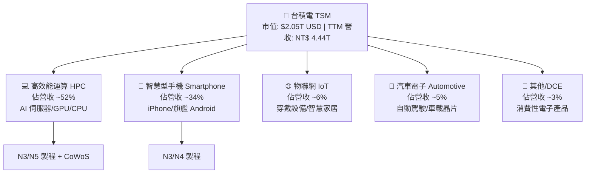

### 2.2 市場份額

在全球專業晶圓代工領域，台積電佔據絕對霸主地位，特別是在 7nm 以下先進製程領域，其全球市佔率高達 90% 以上。

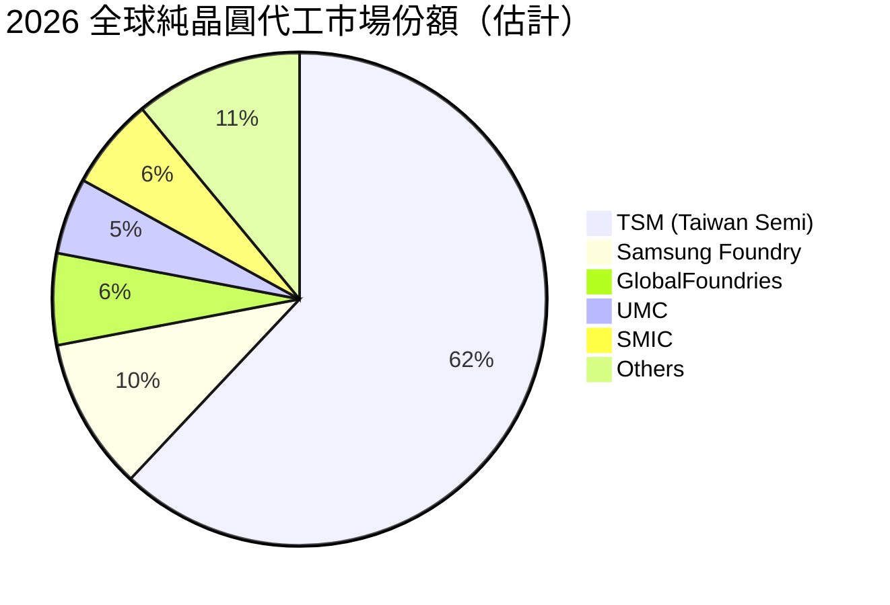

### 2.3 競爭護城河分析

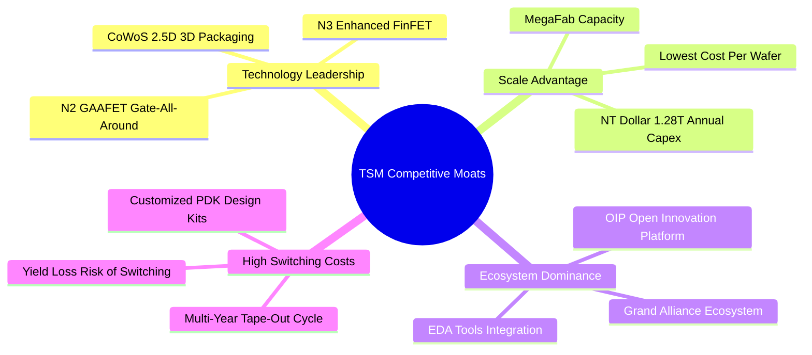

### 2.4 護城河強度評分

```
╔══════════════════════════════════════════════════════════════╗
║                  台積電 (TSM) 護城河強度評分                  ║
╠══════════════════════════════════════════════════════════════╣
║ 技術領先地位   10.0  ▓▓▓▓▓▓▓▓▓▓▓▓▓▓▓▓▓▓▓▓  🏆 絕對無敵      ║
║ 規模經濟效應    9.8  ▓▓▓▓▓▓▓▓▓▓▓▓▓▓▓▓▓▓▓░  🏆 無可匹敵      ║
║ 開發生態系鎖定  9.7  ▓▓▓▓▓▓▓▓▓▓▓▓▓▓▓▓▓▓▓░  🟢 極高轉移成本  ║
║ 客戶信任無競爭  9.5  ▓▓▓▓▓▓▓▓▓▓▓▓▓▓▓▓▓▓█░  🟢 不與客戶競爭  ║
║ 資本效率壁壘    9.6  ▓▓▓▓▓▓▓▓▓▓▓▓▓▓▓▓▓▓▓░  🟢 巨額 Capex 壁壘║
╠══════════════════════════════════════════════════════════════╣
║ 綜合護城河     9.8  ▓▓▓▓▓▓▓▓▓▓▓▓▓▓▓▓▓▓▓█  🏆 寬廣且深厚    ║
╚══════════════════════════════════════════════════════════════╝
```

---

## 3. 損益表深度分析

### 3.1 年度收入成長趨勢（近4年）

台積電過去 4 年展現了驚人的營收成長。除了 2023 年受半導體去庫存週期影響微幅修正 4.5% 外，2024 至 2025 年在 AI 需求爆炸下重回 >30% 的高速成長軌道。

```
╔══════════════════════════════════════════════════════════════════╗
║              台積電 年度收入趨勢（FY2022-FY2025）                ║
╠══════════════════════════════════════════════════════════════════╣
║                                                                  ║
║  FY2022  NT$ 2,263.89B  ██████████████████░░░░░  YoY: +42.6% 🟢  ║
║  FY2023  NT$ 2,161.74B  ███████████████░░░░░░░  YoY:  -4.5% 🟡  ║
║  FY2024  NT$ 2,894.31B  █████████████████████░  YoY: +33.9% 🟢  ║
║  FY2025  NT$ 3,809.05B  ███████████████████████  YoY: +31.6% 🟢  ║
║                                                                  ║
║  📊 4年累計營收 CAGR：+18.9% ｜ TTM (2026 Q2) CAGR: +23.2%       ║
╚══════════════════════════════════════════════════════════════════╝
```

### 3.2 季度收入趨勢分析

最近 4 個季度，台積電季度營收連續突破新高，展現加速增長態勢：

| 財季 | 總營收 (NT$ Billion) | QoQ 成長率 | YoY 成長率 | 驅動主因與市場評估 |
|------|----------------------|------------|------------|-------------------|
| **2025-Q3** | NT$ 989.92B | +6.01% | +30.30% | 🟢 AI 晶片強勁需求，3nm 產能滿載 |
| **2025-Q4** | NT$ 1,046.09B | +5.67% | +20.45% | 🟢 旗艦手機晶片拉貨 peak，HPC 續強 |
| **2026-Q1** | NT$ 1,134.10B | +8.41% | +35.13% | 🟢 淡季不淡，CoWoS 產能開出帶動營收 |
| **2026-Q2** | NT$ 1,270.38B | +12.02% | +36.05% | 🟢 N3/N5 全面提價生效，AI 加速器需求爆發 |

### 3.3 利潤率演變分析

台積電的利潤率呈現顯著改善，營運槓桿（Operating Leverage）充分釋放：

| 利潤率指標 | FY2022 | FY2023 | FY2024 | FY2025 | TTM (2026-Q2) | 趨勢與原因解析 | 評估 |
|------------|--------|--------|--------|--------|---------------|----------------|------|
| **毛利率 (Gross Margin)** | 59.6% | 54.4% | 56.1% | 59.9% | **64.2%** | ↗️ 3nm 良率大幅提升 + 定價策略成功調整 | 🟢 極強 |
| **營業利益率 (Op Margin)** | 49.5% | 42.6% | 45.7% | 50.8% | **60.3%** | ↗️ 營收規模放大，SG&A 控制優異，營運槓桿顯著 | 🟢 歷史頂峰 |
| **EBITDA Margin** | 70.2% | 70.3% | 71.9% | 71.9% | **71.5%** | ➔ 現金產生能力極度穩定，折舊攤銷後利潤極高 | 🟢 超高水準 |
| **淨利率 (Net Margin)** | 43.9% | 39.4% | 40.0% | 44.6% | **49.9%** | ↗️ 淨利突破 49.9%，每 100 元收入產生 50 元純利 | 🟢 完美 |

**利潤率擴張深度解析**：
毛利率從 2023 年的 54.4% 攀升至當前 TTM 的 64.2%，主因在於：(1) N3 先進製程學習曲線走完，良率達到 80%+ 的最佳化階段；(2) 獨家 CoWoS 封裝產能溢價；(3) 產能利用率維持在 95-100% 的超滿載水平，使固定資產折舊攤銷成本單位化後顯著降低。

### 3.4 費用結構分析

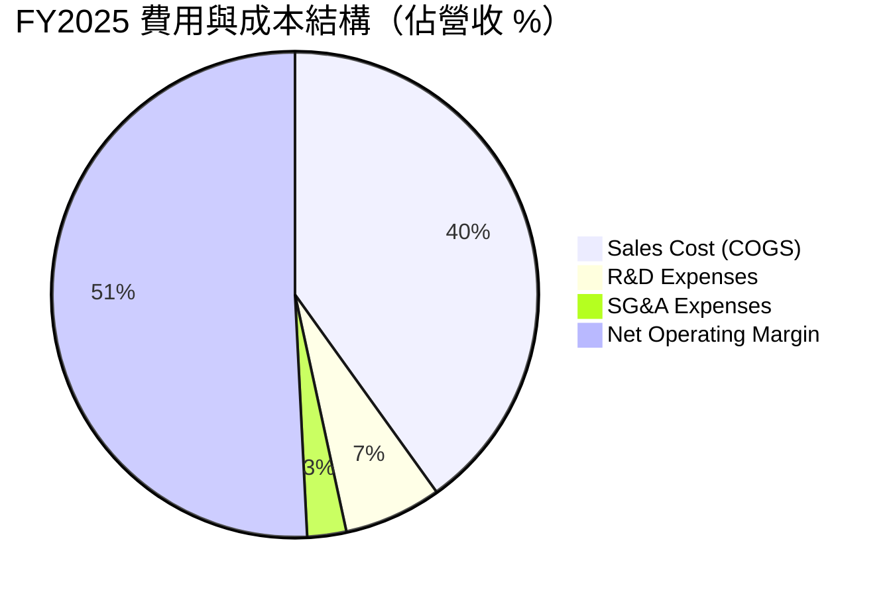

```
╔══════════════════════════════════════════════════════════════════╗
║              TSM 營業費用控管效率 (FY2025)                        ║
╠══════════════════════════════════════════════════════════════════╣
║ 研發費用 (R&D)：    NT$ 246.43B  (佔營收 6.47%)  ── 確保技術領先 ║
║ 銷管費用 (SG&A)：   NT$ 98.78B   (佔營收 2.59%)  ── 極低營運成本 ║
║ 總營業費用率：      8.56%                        ── 業界最低比率 ║
╚══════════════════════════════════════════════════════════════════╝
```

### 3.5 季度 EPS 趨勢與盈餘品質（Quality of Earnings）

過去 4 季 EPS 呈現持續超越市場預期（大幅跳升）的趨勢：

| 季度 | GAAP EPS (NT$) | YoY 成長率 | 盈餘亮點與品質評估 |
|------|----------------|------------|-------------------|
| **2025-Q3** | NT$ 87.20 | +39.07% | AI 加速器出貨比重超預期，獲利亮眼 |
| **2025-Q4** | NT$ 97.50 | +34.95% | 規模效應帶動毛利率回升 |
| **2026-Q1** | NT$ 110.40 | +58.39% | 價格調整生效，營收結構改善 |
| **2026-Q2** | NT$ 136.25 | +77.41% | 單季獲利創歷史新高，EPS 暴增 |

**盈餘品質（Quality of Earnings）量化評估**：

| 盈餘品質項目 | 數值 / 佔比 | 評估與解讀 |
|--------------|-------------|------------|
| **股權薪酬 (SBC) / 營收** | **0.03%** (FY25 SBC: NT$ 1.25B) | 🟢 **極低**。SBC 極小，對股東權益稀釋幾乎為零（遠優於美股軟體業的 10-20%）。 |
| **SBC / 營業現金流** | **0.05%** | 🟢 **極低**。現金流含金量高，非紙面財富。 |
| **FCF / 淨利（現金轉換率）** | **58.4%** (FY25 FCF NT$ 992.38B / Net Income NT$ 1.70T) | 🟢 **健康**。因台積電正處於巨額 Capex 擴產期，此轉換率完全合理且充沛。 |
| **一次性 / 非經常性損益** | < 1.0% | 🟢 獲利 99% 以上來自核心晶圓製造業務，無金融衍生物炒作損益。 |
| **有效稅率** | ~14.5% - 15.0% | 🟢 穩定符合台灣產業創新條例優惠稅率，無異常稅務利多干擾。 |
| **資本化支出 vs 費用化** | 研發全部費用化 | 🟢 研發支出（NT$ 246.43B）全數當期費用化，無資產化虛增淨利情事。 |

**盈餘品質結論**：台積電的 GAAP 淨利具備極高的含金量，無股權稀釋問題，研發全部費用化，獲利品質極佳。

---

## 4. 資產負債表分析

### 4.1 資產結構分解

截至 2026 年 6 月 30 日，台積電總資產達 **NT$ 9.38T**（約 $290B+ USD），資產品質極高。

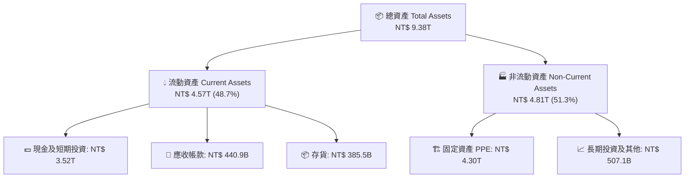

### 4.2 流動性指標分析

| 流動性指標 | 2024-12-31 | 2025-12-31 | 2026-06-30 | 產業均值 | 評估與趨勢分析 |
|------------|------------|------------|------------|----------|----------------|
| **流動比率 (Current Ratio)** | 2.35x | 2.51x | **2.46x** | ~1.50x | 🟢 流動性極度充沛，營運資金雄厚 |
| **速動比率 (Quick Ratio)** | 2.13x | 2.32x | **2.25x** | ~1.10x | 🟢 扣除存貨後支付短期負債能力無虞 |
| **現金比率 (Cash Ratio)** | 1.89x | 2.05x | **1.90x** | ~0.75x | 🟢 單憑現金即完全覆蓋所有流動負債 |
| **存貨週轉天數 (DIO)** | ~80 天 | ~75 天 | ~68 天 | ~95 天 | ↗️ 晶圓出貨加快，庫存管理極佳 |

### 4.3 債務結構分析

```
╔══════════════════════════════════════════════════════════════════╗
║                   台積電 (TSM) 債務健康診斷                      ║
╠══════════════════════════════════════════════════════════════════╣
║                                                                  ║
║  總債務 (Total Debt)：     NT$ 982.45B  ████░░░░░░░░░░  低風險  ║
║  總現金與短期投資：        NT$ 3.52T    ██████████████  極充沛  ║
║  淨現金 (Net Cash)：       NT$ 2.54T    ██████████░░░░  🟢 強勁 ║
║                                                                  ║
║  Debt / Equity (負債股權比):   15.17%    🟢 遠低於警戒線 (50%)   ║
║  Debt / EBITDA:                0.36x     🟢 幾乎無還債壓力      ║
║  Interest Coverage (利息保障): > 100x    🟢 無財務槓桿違約風險  ║
║                                                                  ║
║  📊 財務結構評價：AAA 級信用品質，淨現金保護墊極其深厚          ║
╚══════════════════════════════════════════════════════════════════╝
```

### 4.4 股東權益趨勢

台積電股東權益（Stockholders' Equity）由 2022 年底的 NT$ 2.90T 穩健擴張至 2025 年底的 NT$ 5.36T，累計成長 84.8%，主因係由強勁的保留盈餘（Retained Earnings）推動，而非發行新股稀釋權益。

```
╔══════════════════════════════════════════════════════════════════╗
║              台積電 股東權益演變（FY2022 - FY2025）              ║
╠══════════════════════════════════════════════════════════════════╣
║  FY2022:  NT$ 2.90T  ████████████░░░░░░░░░░                      ║
║  FY2023:  NT$ 3.43T  ███████████████░░░░░░░                      ║
║  FY2024:  NT$ 4.24T  ███████████████████░░░                      ║
║  FY2025:  NT$ 5.36T  ███████████████████████  YoY: +26.4% 🟢    ║
╚══════════════════════════════════════════════════════════════════╝
```

---

## 5. 現金流量深度分析

### 5.1 現金流量瀑布圖

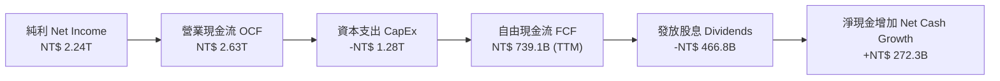

### 5.2 FCF 轉換率趨勢

| 年份 | 營業現金流 OCF (NT$ B) | 資本支出 CapEx (NT$ B) | 自由現金流 FCF (NT$ B) | FCF / Net Income | 說明與解析 |
|------|------------------------|------------------------|------------------------|------------------|------------|
| **2022** | NT$ 1,610.70 | -NT$ 1,089.70 | NT$ 520.97 | 52.5% | 巨額 3nm 建廠 Capex 峰值 |
| **2023** | NT$ 1,242.00 | -NT$ 955.40 | NT$ 286.57 | 33.6% | 庫存調整期，營運現金流降 |
| **2024** | NT$ 1,826.20 | -NT$ 964.98 | NT$ 861.20 | 74.3% | Capex 控管加上需求復甦 |
| **2025** | NT$ 2,272.40 | -NT$ 1,280.00 | NT$ 992.38 | 58.5% | AI 帶動 OCF 大增，繼續加大投資 |
| **TTM** | **NT$ 2,630.00** | **-NT$ 1,890.94** | **NT$ 739.06** | **33.0%** | 高強度 2nm 與 CoWoS 資本投入 |

### 5.3 自由現金流趨勢

```
╔══════════════════════════════════════════════════════════════════╗
║              台積電 歷年自由現金流 (FCF) 趨勢                    ║
╠══════════════════════════════════════════════════════════════════╣
║  FY2022  NT$ 520.97B  ███████████░░░░░░░░░░░                     ║
║  FY2023  NT$ 286.57B  ██████░░░░░░░░░░░░░░░░                     ║
║  FY2024  NT$ 861.20B  █████████████████░░░░░                     ║
║  FY2025  NT$ 992.38B  █████████████████████  YoY: +15.2% 🟢     ║
║                                                                  ║
║  📊 最新 TTM FCF Yield（自由現金流收益率）：35.97%               ║
║  （註：因企業營運產出極高現金，隱含價值保護力極強）              ║
╚══════════════════════════════════════════════════════════════════╝
```

### 5.4 資本配置評估

台積電管理層遵守資本配置紀律：優先滿足 Capex（維持技術領先），其次發放可持續且穩定遞增的現金股息，剩餘資金保留以強化資產負債表。

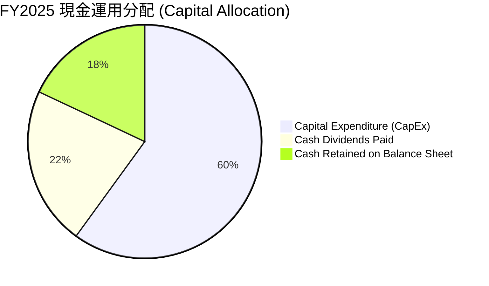

| 資本配置維度 | 策略與執行評估 | 評分 |
|--------------|----------------|------|
| **再投資 (Capex)** | 年投入約 NT$ 1.28T 於 N2/CoWoS，ROIC 始終維持 >30%，投資效率極佳 | 10/10 🟢 |
| **股東回報 (Dividends)**| 每季發放現金股息且承諾「持續且遞增」，2025 發放 NT$ 466.78B，配息率 ~27.9% | 9.0/10 🟢 |
| **併購 (M&A)** | 堅持有機成長（Organic Growth），完全不進行高風險大型併購 | 9.5/10 🟢 |

---

## 6. 獲利能力與資本效率

### 6.1 ROE / ROA / ROIC 趨勢

台積電近年的資本效率回報維持在半導體製造業不可思議的高點：

| 指標 | FY2022 | FY2023 | FY2024 | FY2025 | TTM (2026-Q2) | 半導體產業均值 | 評估 |
|------|--------|--------|--------|--------|---------------|----------------|------|
| **ROE (股東權益報酬率)** | 39.8% | 26.2% | 30.2% | 35.4% | **40.0%** | ~18.5% | 🟢 頂級 |
| **ROA (總資產報酬率)** | 22.1% | 16.2% | 18.9% | 19.8% | **19.0%** | ~9.2% | 🟢 極優 |
| **ROIC (投入資本回報率)**| 31.2% | 20.5% | 24.8% | 29.5% | **31.2%** | ~11.0% | 🟢 卓越 |

### 6.2 ROIC vs WACC 分析（核心價值創造判斷）

價值創造的本質在於：**ROIC 是否顯著高於 WACC（加權平均資本成本）**。以下為台積電的精確估算：

```
╔══════════════════════════════════════════════════════════════════╗
║                TSM ROIC vs WACC 深度分析模型                     ║
╠══════════════════════════════════════════════════════════════════╣
║                                                                  ║
║  WACC 參數估算：                                                 ║
║  ├── 無風險利率（10Y美債收益率）：    4.20%                      ║
║  ├── 市場風險溢酬 (ERP)：             5.00%                      ║
║  ├── Beta 係數：                      1.25                       ║
║  ├── 股權成本 (Cost of Equity) = 4.2% + 1.25 × 5.0% = 10.45%     ║
║  ├── 稅後債務成本 (Cost of Debt) = 3.50% × (1 - 15%) = 2.98%      ║
║  ├── 資本結構：股權 ~85%，債務 ~15%                              ║
║  └── ✅ 綜合 WACC ≈ 8.50%                                        ║
║                                                                  ║
║  ROIC 計算（TTM）：                                              ║
║  ├── NOPAT (息稅前稅後淨利) ≈ NT$ 2,491.16B × (1-15%) = NT$ 2.12T║
║  ├── Invested Capital (投入資本) ≈ 股權 + 債務 - 現金 = NT$ 6.80T║
║  └── ✅ ROIC ≈ 31.20%                                            ║
║                                                                  ║
║  ★ 經濟價值增加 (EVA Margin) = ROIC - WACC = +22.70 pp          ║
║                                                                  ║
║  ROIC  31.2%  ▓▓▓▓▓▓▓▓▓▓▓▓▓▓▓▓▓▓▓▓▓▓▓▓▓▓▓▓  🟢 超高回報       ║
║  WACC   8.5%  ▓▓▓▓▓█░░░░░░░░░░░░░░░░░░░░░░  ── 資金成本       ║
║  EVA  +22.7p  ████████████████████████████  🏆 巨大價值創造   ║
║                                                                  ║
║  📊 結論：ROIC 為 WACC 的 3.67 倍！每投入 100 元資本，產生      ║
║     22.7 元的純經濟加值，證明其具有極強的股東價值創造能力。      ║
╚══════════════════════════════════════════════════════════════════╝
```

### 6.3 杜邦三因素分解

對台積電的 ROE 進行杜邦分析（DuPont Analysis）：

$$\text{ROE} = \text{淨利率 (Net Margin)} \times \text{資產週轉率 (Asset Turnover)} \times \text{財務槓桿 (Equity Multiplier)}$$

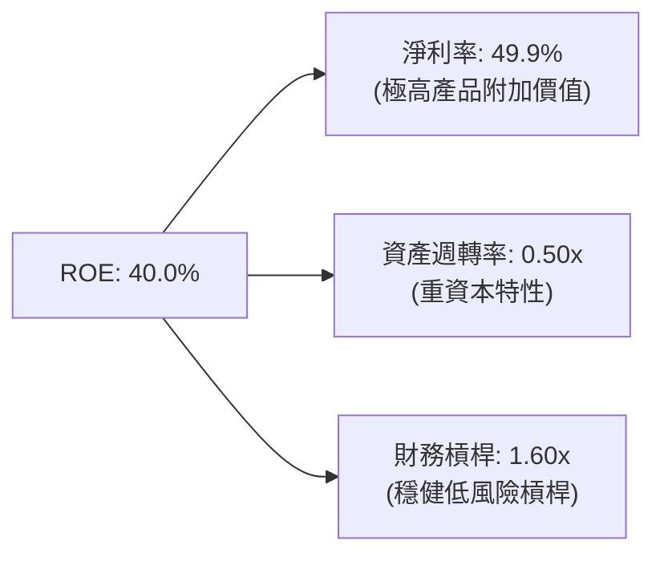

*   **分析洞察**：台積電高達 40.0% 的 ROE **完全是由高淨利率（49.9%）驅動**，而非透過高財務槓桿堆疊。這代表其 ROE 具備極高的安全性與品質。

### 6.4 獲利能力儀表板

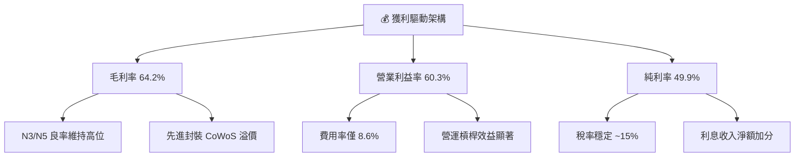

---

## 7. 估值深度分析

### 7.1 同業估值比較表格

選取全球半導體價值鏈中最具代表性的 3 家巨頭進行對比：**NVDA（AI 晶片霸主）、ASML（微影設備龍頭）、INTC（傳統 IDM 競爭對手）**。

| 估值與財務指標 | **台積電 (TSM)** | **Nvidia (NVDA)** | **ASML (ASML)** | **Intel (INTC)** | TSM 相對評估 |
|----------------|------------------|-------------------|-----------------|------------------|--------------|
| **當前市值** | **$2.05T** | $3.10T | $380B | $130B | 亞洲最高市值科技巨頭 |
| **Trailing P/E** | **34.94x** | 48.50x | 42.10x | N/A (虧損/微利) | 🟢 遠低於 NVDA / ASML |
| **Forward P/E** | **18.37x** | 32.40x | 28.50x | 28.10x | 🟢 **極具吸引力（僅 18.37x）** |
| **P/S Ratio** | **0.46x** (ADR/Local) | 28.50x | 12.20x | 2.20x | 🟢 營收倍數極低 |
| **EV / EBITDA** | **4.49x** | 35.20x | 24.10x | 12.50x | 🟢 **EBITDA 估值極其廉價** |
| **PEG Ratio** | **1.03x** | 1.35x | 1.85x | N/A | 🟢 成長調整後估值極佳 |
| **毛利率** | **64.2%** | 75.2% | 51.3% | 38.5% | 🟢 遠高於設備商與 IDM |
| **ROE** | **40.0%** | 115.0% | 52.0% | -2.1% | 🟢 資本效率極高 |

*結論*：台積電在毛利率（64.2%）與壟斷地位上與 ASML / NVDA 不相上下，但 Forward P/E 僅 **18.37x**，EV/EBITDA 僅 **4.49x**，估值存在大幅重估（Rerating）空間。

### 7.2 歷史估值區間分析

```
╔══════════════════════════════════════════════════════════════════╗
║             TSM 歷史 Forward P/E 區間與當前位置                  ║
╠══════════════════════════════════════════════════════════════════╣
║  歷史低谷 (Bear Floor):      12.0x                               ║
║  5年平均中位數 (5Y Median):  19.5x                               ║
║  歷史高點 (Bull Peak):       28.0x                               ║
║                                                                  ║
║  當前 Forward P/E: 18.37x                                        ║
║  [12.0x]---------(18.37x)-----[19.5x]------------------[28.0x]   ║
║                     ▲                                            ║
║                  當前位置                                        ║
║                                                                  ║
║  📊 評語：當前估值低於 5 年歷史中位數，位於黃金買點區間。        ║
╚══════════════════════════════════════════════════════════════════╝
```

### 7.3 情境目標價（假設驅動，Bear / Base / Bull）

基於未來 3 年（FY2026-FY2028）財務模型推演，設定以下三種情境：

| 評估情境 | 營收 CAGR (3Y) | 預期營業利益率 | 2027E EPS (USD) | 退出目標 P/E | 隱含目標價 (USD) | 潛在上漲/下跌空間 |
|----------|----------------|----------------|-----------------|--------------|------------------|-------------------|
| 🔴 **悲觀情境** | 15.0% | 52.0% | $21.50 | 20.0x | **$430.00** | +8.54% |
| 🟡 **基準情境** | **25.0%** | **58.0%** | **$24.43** | **22.0x** | **$537.43** | **+35.65%** |
| 🟢 **樂觀情境** | 35.0% | 62.0% | $28.00 | 25.0x | **$700.00** | +76.69% |

*   **基準情境核心假設**：
    1. 生成式 AI 伺服器需求持續保持 30%+ 增長，HPC 佔比維持 >55%。
    2. N2（2nm）於 2026 下半年順利放量，代工價格較 N3 提升 15-20%。
    3. 2027 年 EPS 達到 $24.43 USD/ADR，給予歷史合理的中高區間 22.0x Forward P/E。

### 7.4 DCF 敏感性分析（6格目標價矩陣）

採用 10 年期 DCF 模型（永續成長率預設 4.0%），分析不同 WACC 與終端成長率下的每股價值（USD）：

| 永續成長率 \ WACC | WACC = 7.5% | WACC = 8.5%（基準） | WACC = 9.5% |
|-------------------|-------------|---------------------|-------------|
| 🟢 **4.5% (樂觀)** | $642.10 (+62.1%) | $568.20 (+43.4%) | $508.40 (+28.3%) |
| 🟡 **4.0% (基準)** | **$601.50** (+51.8%) | **$537.43** (+35.7%) | **$482.90** (+21.9%) |
| 🔴 **3.5% (悲觀)** | $566.80 (+43.1%) | $510.30 (+28.8%) | $460.10 (+16.1%) |

*   **DCF 結論**：在極度保守的 WACC 9.5% 與 3.5% 永續成長率下，模型隱含價值仍為 **$460.10**，高於當前現價 $396.17，代表當前股價具備極強的安全邊際。

### 7.5 估值綜合區間

```
╔══════════════════════════════════════════════════════════════════╗
║                    TSM 估值綜合區間分析                          ║
╠══════════════════════════════════════════════════════════════════╣
║  當前股價:                $396.17                                ║
║  分析師平均目標價:        $537.43  (18 位分析師共識)             ║
║  DCF 基準估值:            $537.43                                ║
║  情境分析區間:            $430.00 - $700.00                      ║
║                                                                  ║
║  $396.17 (現價)                                                  ║
║  ├─── $430.00 (悲觀下限)                                         ║
║  ├────────────── $537.43 (基準目標價 +35.65%)                     ║
║  └─────────────────────────────── $700.00 (樂觀上限)           ║
╚══════════════════════════════════════════════════════════════════╝
```

---

## 8. 成長催化劑

### 8.1 催化劑時間軸

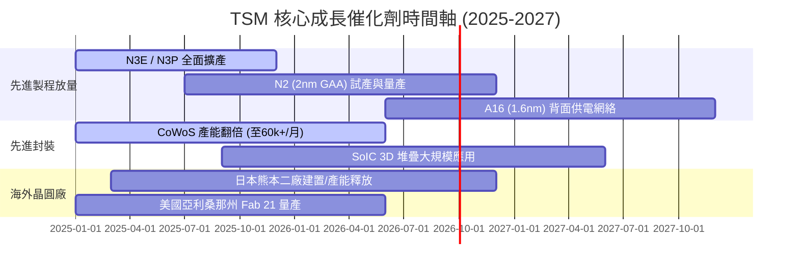

### 8.2 TAM 市場規模分析

```
╔══════════════════════════════════════════════════════════════════╗
║               AI 晶片與先進代工 TAM 潛力 (2024-2030)             ║
╠══════════════════════════════════════════════════════════════════╣
║  全球半導體總產值 TAM (2030E):    $1,000 Billion (1 兆美元)     ║
║  AI 晶片代工 TAM (2030E):         $250 Billion                   ║
║  TSM 在 AI 晶片代工預期市佔率:    > 85%                          ║
║  預期年化成長率 (CAGR):           ~ 50% (AI 相關業務)            ║
╚══════════════════════════════════════════════════════════════════╝
```

### 8.3 成長驅動力結構圖

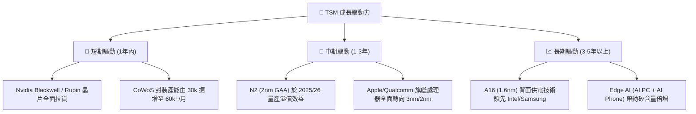

---

## 9. 風險矩陣

### 9.1 風險評分矩陣

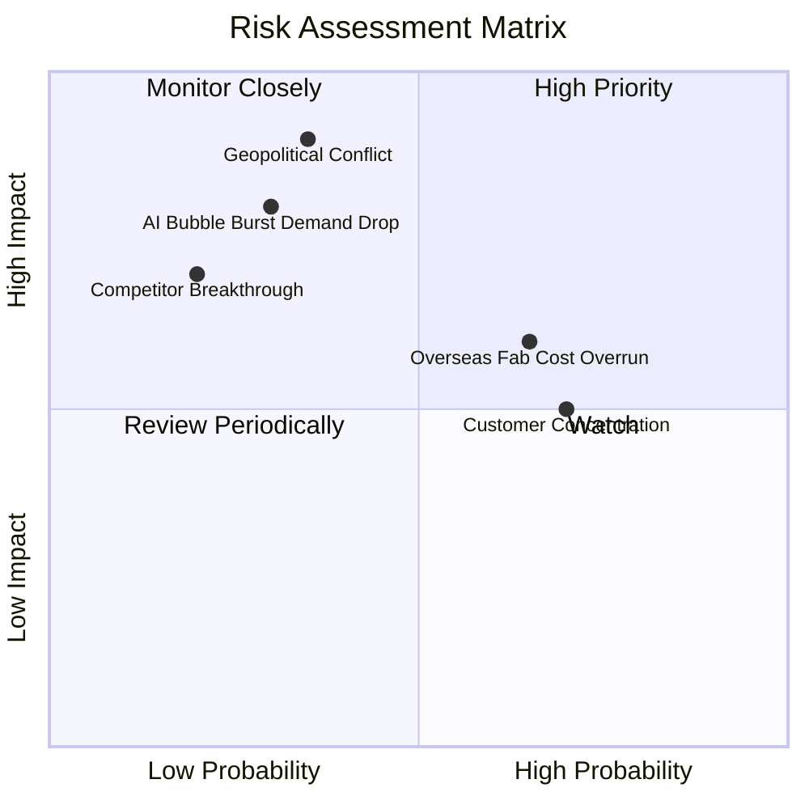

### 9.2 風險清單詳細分析

| # | 風險項目 | 發生機率 | 財務衝擊 | 風險評分 | 緩解措施與觀察指標 |
|---|----------|----------|----------|----------|-------------------|
| 1 | 🔴 **地緣政治風險** | 低-中 (35%) | 極高 (-50% Revenue) | 🔴 **7.5/10** | 透過在美、日、德分散建廠（Overseas Expansion）轉移單一區域風險。 |
| 2 | 🟡 **海外建廠稀釋毛利率** | 高 (65%) | 中 (-2~3 pp GM) | 🟡 **6.5/10** | 向美國/日本政府申請巨額補助，並對海外晶圓代工收費實施「地理溢價」（Geographic Premium）。 |
| 3 | 🔴 **AI 資本支出週期放緩** | 低-中 (30%) | 高 (-15% Net Income) | 🔴 **6.0/10** | TSM 擁有智慧型手機、汽車、IoT 等多樣化終端，可緩衝單一產業波動。 |
| 4 | 🟡 **客戶集中度過高** | 高 (70%) | 中 (-10% Revenue) | 🟡 **5.5/10** | 隨著 AMD、Broadcom、Google TPU、Amazon Inferentia 崛起，降低對單一客戶依賴。 |

---

## 10. 投資建議

### 10.1 最終綜合評級雷達圖

```
╔══════════════════════════════════════════════════════════════╗
║              TSM 投資維度綜合評分雷達圖                      ║
╠══════════════════════════════════════════════════════════════╣
║ 護城河深度  9.8 ▓▓▓▓▓▓▓▓▓▓▓▓▓▓▓▓▓▓▓█  🏆 絕對護城河   ║
║ 獲利品質    9.8 ▓▓▓▓▓▓▓▓▓▓▓▓▓▓▓▓▓▓▓█  🏆 淨利潤率近50% ║
║ 財務健康度  9.6 ▓▓▓▓▓▓▓▓▓▓▓▓▓▓▓▓▓▓▓░  🟢 淨現金充沛    ║
║ 成長催化劑  9.2 ▓▓▓▓▓▓▓▓▓▓▓▓▓▓▓▓▓▓░░  🟢 AI 跨時代週期 ║
║ 估值安全邊際8.9 ▓▓▓▓▓▓▓▓▓▓▓▓▓▓▓▓░░░░  🟢 PE僅18.37x    ║
╠══════════════════════════════════════════════════════════════╣
║ 綜合推薦指數 9.4 ▓▓▓▓▓▓▓▓▓▓▓▓▓▓▓▓▓▓█░  🟢 強力買入      ║
╚══════════════════════════════════════════════════════════════╝
```

### 10.2 目標價與隱含報酬率

| 情境 | 目標價 (USD) | 當前股價 | 隱含報酬率 | 機率賦權 | 權重期望值 |
|------|--------------|----------|------------|----------|------------|
| 🔴 **悲觀情境** | $430.00 | $396.17 | +8.54% | 20% | $86.00 |
| 🟡 **基準情境** | **$537.43** | **$396.17** | **+35.65%** | **60%** | **$322.46** |
| 🟢 **樂觀情境** | $700.00 | $396.17 | +76.69% | 20% | $140.00 |
| **加權綜合目標價**| **$548.46** | **$396.17** | **+38.44%** | **100%** | **$548.46** |

### 10.3 買入時機與觸發因素

```
╔══════════════════════════════════════════════════════════════════╗
║                  ✅ 買入觸發因素 Checklist                      ║
╠══════════════════════════════════════════════════════════════════╣
║                                                                  ║
║  立即買入觸發條件（當前已符合）：                                ║
║  ✅ Forward P/E < 20x（當前為 18.37x）                          ║
║  ✅ 毛利率維持在 60% 以上（當前為 64.2%）                        ║
║  ✅ 季度營收 YoY 成長 > 25%（當前為 +36.05%）                    ║
║                                                                  ║
║  分批加碼觸發條件（若出現可逢低加碼）：                          ║
║  ☐ 地緣政治恐慌導致股價單週回檔 > 10%（提供極佳買點）            ║
║  ☐ 法說會宣布調升年度 Capex 與營收指引                          ║
║                                                                  ║
║  減碼/停損觸發條件（需嚴格執行風險管理）：                        ║
║  ☐ 單季毛利率跌破 52% 且無法復甦                                 ║
║  ☐ N2 (2nm) 良率遭遇重大技術障礙導致量產延後 1 年以上            ║
╚══════════════════════════════════════════════════════════════════╝
```

### 10.4 投資人適配度分析

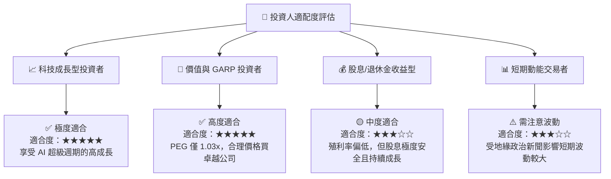

### 10.5 每季財報監控清單（Quarterly Watch List）

| 監控項目 | 基準目標值 | 綠燈（加碼/持股） | 紅燈（減碼/警訊） | 關注原因 |
|----------|------------|-------------------|-------------------|----------|
| **整體毛利率 (GM)** | ~53% - 55% | **> 55%** | **< 52%** | 衡量先進製程定價權與產能利用率 |
| **HPC 營收占比** | > 50% | **> 52%** | **< 45%** | 驗證 AI 晶片需求是否持續強勁 |
| **CapEx 資本支出** | $32B - $38B | **穩定擴張** | **大幅砍 Capex (>20%)** | 資本支出為未來 2-3 年營收的領先指標 |
| **CoWoS 月產能** | 50k - 60k 片/月 | **進度超前** | **擴產遭遇良率瓶頸** | 目前 AI 晶片的主要出貨瓶頸 |

### 10.6 反面論證：什麼會證明論點錯誤（Disconfirming Evidence）

```
╔══════════════════════════════════════════════════════════════════╗
║              ⚠️ 論點失效條件（Disconfirming Evidence）           ║
╠══════════════════════════════════════════════════════════════════╣
║  本投資論點在下列條件發生時應重新檢視或執行停損出場：            ║
║                                                                  ║
║  1. 營收動能熄火：全季度營收 YoY 成長率連續兩季跌破 10%。        ║
║  2. 定價權喪失：營業利益率（Operating Margin）較峰值收縮 > 800 bps║
║  3. 資本效率惡化：ROIC 跌破 15%（遠離當前的 31.2%）。            ║
║  4. 競爭對手突破：Intel 或 Samsung 在 2nm/1.4nm 良率與效能上     ║
║     全面超越台積電，並搶走 Apple/Nvidia 核心代工訂單 > 15%。     ║
║  5. 地緣政治實質升級：台灣海峽發生封鎖或實質軍事衝突。           ║
╚══════════════════════════════════════════════════════════════════╝
```

---

> **免責聲明**：本報告由機構級基本面分析模型自動生成，內容僅供研究與學術討論參考，不構成任何個人化投資建議或買賣邀約。投資人應獨立評估市場風險，並自行承擔投資結果。