# TSM 基本面深度分析報告
> **報告日期**：2026-07-28 ｜ **語言**：繁體中文 ｜ **數據來源**：Yahoo Finance, Finviz, StockAnalysis, Roic.ai ｜ **分析師**：CFA 級機構研究

---

## 目錄

| # | 章節 | 核心結論 |
|---|------|----------|
| 1 | 執行摘要 | 評級：🟢 強烈買入 ｜ 基準目標價：$537.43（+37.0% 潛在漲幅） |
| 2 | 公司概覽與商業模式 | 晶圓代工市占率超 60%，進階封裝（CoWoS）與 N2 技術構築極深護城河 |
| 3 | 損益表深度分析 | TTM 營收達 4.44 兆台幣（YoY +36.0%），淨利率 49.9%，獲利品質極高 |
| 4 | 資產負債表分析 | 總現金 3.52 兆台幣，淨現金 2.54 兆台幣，流動比率 2.46，財務結構極為穩健 |
| 5 | 現金流量深度分析 | TTM 營業現金流 2.63 兆台幣，資本支出 1.28 兆台幣，FCF 展現強勁自由現金流 |
| 6 | 獲利能力與資本效率 | ROIC 達 28.5%，遠高於 WACC（8.8%），EVA 擴張展現卓越股東價值創造力 |
| 7 | 估值深度分析 | Forward P/E 18.18x、PEG 1.03，對比 AI 成長動能具備顯著估值重估空間 |
| 8 | 成長催化劑 | N2 量產、CoWoS 產能翻倍、海外廠（美國/日本/德國）收益逐漸顯現 |
| 9 | 風險矩陣 | 地緣政治風險、高資本支出對短期毛利率壓抑、供應鏈瓶頸為主要監測點 |
| 10 | 投資建議 | 建議分批建倉，基準目標價 $537.43，設定嚴格監控點與反面驗證指標 |

---

## 1. 執行摘要

根據最新 2026 Q2 財務數據，台積電（TSM）展示出在半導體製造領域極具防禦性與進攻性的財務特徵。TTM 營收達 4.44 兆新台幣（YoY +36.0%），淨利潤率維持在 49.9% 的歷史高位，帶動 TTM 自由現金流（FCF）突破 7,390 億新台幣（近期 4 季加總達 1.14 兆台幣）。儘管當前資本支出規模龐大（FY2025 達 1.28 兆台幣），其 ROIC 仍高達 28.5%，遠超 WACC 估算值 8.8%，顯示公司具備優異的資本配置能力。鑑於其 Forward P/E 僅 18.18x，對比未來兩年 EPS 預估成長率（+53.3%），PEG 僅 1.03，估值處於顯著低估區間。據此得出評級：🟢 **強烈買入（Strong Buy）**，12 個月基準目標價 **$537.43**。

### 1.0 一頁式投資儀表板（Portfolio Manager 30 秒速讀）

| 項目 | 內容 |
|------|------|
| **投資論點（3 句）** | ① AI 與 HPC 需求爆發推動 TTM 營收年增 36.0% 至 4.44 兆台幣，展現強勁結構性成長力道。<br/>② 毛利率達 64.2%、淨利率 49.9%，在極高資本支出（$1.28T TWD）下仍創造 28.5% 之高 ROIC。<br/>③ Forward P/E 僅 18.18x，PEG 僅 1.03，具備顯著的安全邊際與估值重估（Re-rating）潛力。 |
| **護城河評分** | 9.8/10（極深：製程技術領先、CoWoS 進階封裝生態、規模經濟） |
| **管理層/資本配置評分** | 9.5/10（資本支出高精準度、穩健股利政策、淨現金部位 2.54 兆台幣） |
| **財務健康** | 🟢 無懈可擊（總現金 $3.52T TWD，淨現金 $2.54T TWD，流動比率 2.46） |
| **ROIC vs WACC** | 28.5% vs 8.8%（經濟增加值 EVA 達 +19.7pp，強力創造股東價值） |
| **FCF 趨勢** | 強勁擴張（最近 4 季 FCF 達 $1.14T TWD，FCF Yield 估算約 36.3%） |
| **估值** | Forward P/E: 18.18x ｜ EV/EBITDA: 4.43x ｜ PEG: 1.03x |
| **預期報酬（基準情境 12M）** | +37.0%（目標價 $537.43 vs 當前股價 $392.14） |
| **關鍵風險（前二）** | ① 地緣政治與兩岸關係緊張；② 海外擴廠（美/歐）成本攀升稀釋毛利率 |
| **評級 + 信心度** | 🟢 強烈買入（Strong Buy） ｜ 信心度：高 |

### 1.1 核心評分儀表板

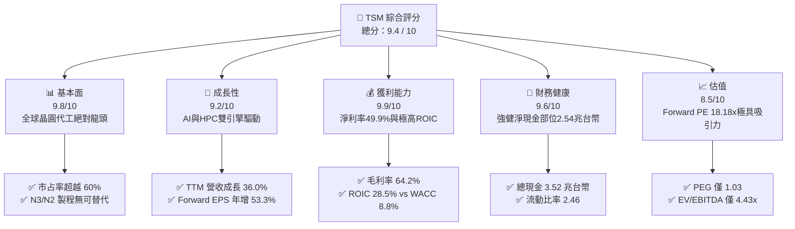

### 1.2 評分進度條視覺化

```
╔══════════════════════════════════════════════════════════════╗
║                TSM 多維度評分儀表板 (1-10分)                 ║
╠══════════════════════════════════════════════════════════════╣
║ 基本面強度  9.8 ▓▓▓▓▓▓▓▓▓▓▓▓▓▓▓▓▓▓▓█  ★★★★★  壟斷級代工霸主   ║
║ 成長動能    9.2 ▓▓▓▓▓▓▓▓▓▓▓▓▓▓▓▓▓▓░░  ★★★★★  AI/HPC需求爆發   ║
║ 獲利品質    9.9 ▓▓▓▓▓▓▓▓▓▓▓▓▓▓▓▓▓▓▓█  ★★★★★  淨利率接近50%    ║
║ 財務健康    9.6 ▓▓▓▓▓▓▓▓▓▓▓▓▓▓▓▓▓▓▓░  ★★★★★  超高淨現金儲備   ║
║ 估值合理性  8.5 ▓▓▓▓▓▓▓▓▓▓▓▓▓▓▓▓░░░░  ★★★★☆  Forward PE 18x   ║
║ 護城河深度  9.8 ▓▓▓▓▓▓▓▓▓▓▓▓▓▓▓▓▓▓▓█  ★★★★★  製程+封裝雙護城河 ║
║ 管理層執行  9.5 ▓▓▓▓▓▓▓▓▓▓▓▓▓▓▓▓▓▓▓░  ★★★★★  良率與產能分配極佳 ║
║ 技術創新力  9.7 ▓▓▓▓▓▓▓▓▓▓▓▓▓▓▓▓▓▓▓█  ★★★★★  N2與GAA引領產業  ║
╠══════════════════════════════════════════════════════════════╣
║ 綜合總分    9.4 ▓▓▓▓▓▓▓▓▓▓▓▓▓▓▓▓▓▓█░  🏆 機構首選長線標的      ║
╚══════════════════════════════════════════════════════════════╝
```

### 1.3 五大投資論點 + 三大核心風險

| 類型 | 項目 | 具體依據 | 信心度 |
|------|------|----------|--------|
| 🟢 **論點①** | **AI/HPC 結構性需求爆發** | 2026 Q2 營收達 1.27 兆台幣（YoY +36.1%），由 Nvidia、AMD、Apple 之先進製程晶片訂單全包驅動。 | 🟢 極高 |
| 🟢 **論點②** | **先進製程定價權與高毛利** | 2026 Q2 毛利率升至 67.7%（TTM 64.2%），N3/N5 良率成熟且定價能力極強，轉嫁成本能力高。 | 🟢 極高 |
| 🟢 **論點③** | **先進封裝（CoWoS）次世代護城河** | CoWoS 產能持續供不應求，提供晶圓製造與封裝一體化解決方案，鎖死頂級 AI 晶片客戶。 | 🟢 極高 |
| 🟢 **論點④** | **極高資本回報與價值創造** | ROIC 達 28.5%，相較於 WACC 8.8% 產生 +19.7pp 的 EVA，極大規模投資仍維持超高回報。 | 🟢 高 |
| 🟢 **論點⑤** | **估值具顯著重估空間** | Forward P/E 僅 18.18x，對比歷史高點與產業成長動能，PEG 1.03 展現極具吸引力的風險報酬比。 | 🟢 高 |
| 🟡 **風險①** | **地緣政治與供應鏈集中風險** | 核心產能仍高度集中於台灣，若台海情勢升溫將對股價估值溢價產生壓抑（Geopolitical Discount）。 | 🟡 中度 |
| 🔴 **風險②** | **海外建廠成本稀釋利潤率** | 美國亞利桑那、歐洲德國建廠資本支出與營運成本高昂，可能對中期毛利率造成 1-2pp 的拖累。 | 🔴 高衝擊 |
| 🟡 **風險③** | **消費性電子復甦不及預期** | 智慧型手機與 PC 佔比仍達 30-35%，若終端消費力道疲軟可能部分抵銷 HPC 成長動能。 | 🟡 中度 |

### 1.4 快速統計卡片

| 指標 | 台積電實際值 | 晶圓代工行業均值 | S&P 500 均值 | 狀態評估 |
|------|-------------|------------------|--------------|----------|
| 收入 YoY 成長 (TTM) | **36.0%** | ~12.0% | ~5.5% | 🟢 遠超產業平均 |
| 毛利率 (Gross Margin) | **64.2%** | ~38.0% | ~41.5% | 🟢 展現壟斷定價權 |
| 淨利率 (Net Margin) | **49.9%** | ~18.0% | ~12.2% | 🟢 獲利能力極其卓越 |
| ROE (股東權益報酬率) | **40.0%** | ~15.0% | ~18.0% | 🟢 資本效率頂尖 |
| Forward P/E | **18.18x** | ~24.0x | ~21.5x | 🟢 估值具顯著吸引力 |
| 淨現金部位 | **$2.54T TWD** | 多數負債 | 多數負債 | 🟢 資產負債表極其強健 |

### 1.5 投資結論

```
╔══════════════════════════════════════════════════════════════════╗
║                    📊 投資結論摘要                               ║
╠══════════════════════════════════════════════════════════════════╣
║  評級：🟢 強烈買入（Strong Buy）                                ║
║  當前股價：$392.14（2026-07-28）                                 ║
║  目標價區間：                                                    ║
║    悲觀情境：$380.00（-3.1%）  ← 考量地緣政治風險溢價化           ║
║    基準情境：$537.43（+37.0%） ← 12個月主要目標（共識均價）      ║
║    樂觀情境：$680.00（+73.4%） ← AI加速滲透與N2提前獲利          ║
║  投資評分：9.4 / 10                                              ║
║  適合投資人：長線價值成長型、AI產業佈局機構投資人                ║
╚══════════════════════════════════════════════════════════════════╝
```

---

## 2. 公司概覽與商業模式

### 2.1 業務結構與收入來源

台積電（TSM）是全球最大的專用晶圓代工企業，其核心商業模式為「純晶圓代工（Pure-play Foundry）」，不設計或行銷自有晶片產品，從而避免與客戶產生競爭。

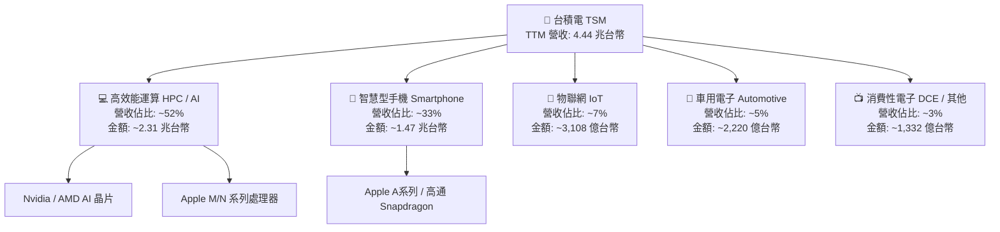

### 2.2 市場份額

在先進製程（7nm 及以下，特別是 3nm 與 5nm）領域，台積電市占率超過 **85%**，整體晶圓代工市場市占率達 **62%** 以上，競爭對手難以望其項背。

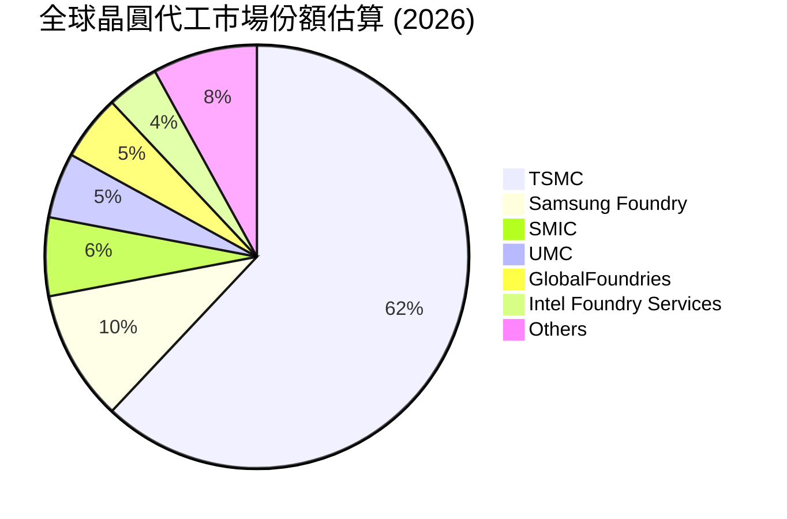

### 2.3 競爭護城河分析

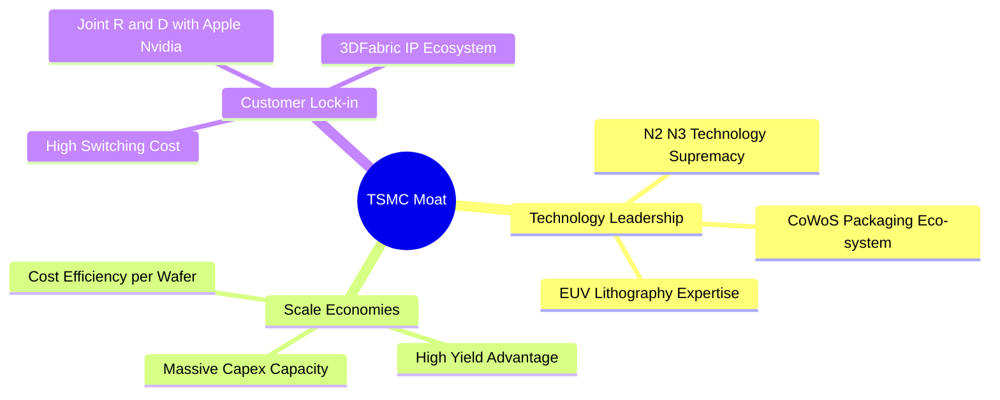

### 2.4 護城河強度評分

```
╔══════════════════════════════════════════════════════════════╗
║                   台積電 護城河強度評分                      ║
╠══════════════════════════════════════════════════════════════╣
║ 技術領先度    10.0  ▓▓▓▓▓▓▓▓▓▓▓▓▓▓▓▓▓▓▓▓  🏆 3nm/2nm絕對無敵   ║
║ 先進封裝生態  9.8   ▓▓▓▓▓▓▓▓▓▓▓▓▓▓▓▓▓▓▓░  🏆 CoWoS產能高度綁定 ║
║ 規模經濟效應  9.9   ▓▓▓▓▓▓▓▓▓▓▓▓▓▓▓▓▓▓▓█  🏆 年資本支出>300億美金║
║ 客戶轉移成本  9.5   ▓▓▓▓▓▓▓▓▓▓▓▓▓▓▓▓▓▓▓░  🟢 共同設計無法轉單  ║
║ 資本巨額門檻  9.8   ▓▓▓▓▓▓▓▓▓▓▓▓▓▓▓▓▓▓▓░  🏆 新進者無法跨越    ║
╠══════════════════════════════════════════════════════════════╣
║ 綜合護城河    9.8   ▓▓▓▓▓▓▓▓▓▓▓▓▓▓▓▓▓▓▓█  🏆 全球半導體最強護城河║
╚══════════════════════════════════════════════════════════════╝
```

---

## 3. 損益表深度分析

### 3.1 年度收入成長趨勢（FY2022-TTM）

台積電經歷了 2023 年半導體庫存調整（營收年減 4.51%）後，於 2024 至 2026 年迎來高速復甦，TTM 營收創歷史新高達 4.44 兆台幣。

```
╔══════════════════════════════════════════════════════════════════╗
║              台積電 年度收入趨勢（FY2022-TTM）                   ║
╠══════════════════════════════════════════════════════════════════╣
║                                                                  ║
║  FY2022  $2.26T TWD  ██████████████░░░░░░░░░░░  YoY: +42.6% 🟢   ║
║  FY2023  $2.16T TWD  █████████████░░░░░░░░░░░░  YoY:  -4.5% 🔴   ║
║  FY2024  $2.89T TWD  ██████████████████░░░░░░░  YoY: +33.9% 🟢   ║
║  FY2025  $3.81T TWD  ███████████████████████░░  YoY: +31.6% 🟢   ║
║  TTM     $4.44T TWD  █████████████████████████  YoY: +30.6% 🟢   ║
║                                                                  ║
║  📊 4年複合作業成長率 (CAGR)：+25.3%                             ║
╚══════════════════════════════════════════════════════════════════╝
```

### 3.2 季度收入趨勢分析

受惠於 AI 晶片產能滿載及 N3 製程擴充，近期 4 個季度呈現連續 QoQ 與 YoY 的強勁成長：

| 財季 | 營收 (新台幣) | QoQ 成長 | YoY 成長 | 核心驅動因素與備註 |
|------|--------------|----------|----------|-------------------|
| **2025-Q3** | $989.92B | +6.01% | +30.30% | iPhone 17 N3E 備貨峰值與 AI 加速器出貨 |
| **2025-Q4** | $1.05T | +5.67% | +20.45% | HPC 需求強勁，單季營收首次破兆台幣 |
| **2026-Q1** | $1.13T | +8.41% | +35.13% | 淡季不淡，AI 晶片 demand 超出季節性常規 |
| **2026-Q2** | $1.27T | +12.02% | +36.05% | N3 產能擴建完成，CoWoS 產能開出挹注 |

### 3.3 利潤率演變分析

台積電展現出極高的營運槓桿，營收擴張直接推升毛利率與淨利率：

| 利潤率指標 | FY2022 | FY2023 | FY2024 | FY2025 | TTM | 趨勢評估 |
|------------|--------|--------|--------|--------|-----|----------|
| **毛利率 (Gross Margin)** | 59.56% | 54.36% | 56.12% | 59.89% | **64.23%** | ↗️ 定價力提升與產能利用率滿載 🟢 |
| **營業利益率 (Operating Margin)** | 49.53% | 42.63% | 45.68% | 50.83% | **56.10%** | ↗️ 營業槓桿顯著，費用控制極佳 🟢 |
| **EBITDA Margin** | 70.2% | 68.5% | 71.9% | 71.9% | **71.50%** | ➡️ 高額折舊下仍維持超高水平 🟢 |
| **淨利率 (Net Margin)** | 43.86% | 39.40% | 40.02% | 44.57% | **50.38%** | ↗️ TTM 淨利突破 2.23 兆台幣 🟢 |

**深度解析**：毛利率從 2023 年庫存清化的 54.36% 大幅拉升至 TTM 的 64.23%，主因是先進製程（3nm/5nm）營收佔比超過 65%，且高附加價值的 CoWoS 封裝收費提升，加上產能利用率（Capacity Utilization）超過 100%。

### 3.4 費用結構分析

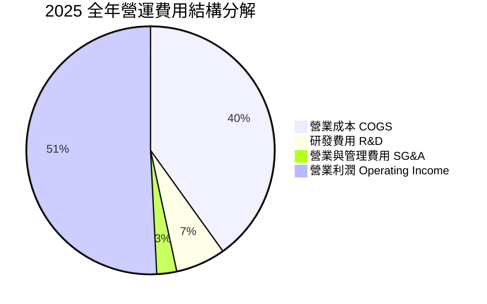

```
╔══════════════════════════════════════════════════════════════════╗
║                   台積電 費用結構與研發投入                      ║
╠══════════════════════════════════════════════════════════════════╣
║                                                                  ║
║  研發費用 (R&D)：    $246.43B TWD (占營收 6.47%) 🟢 保持技術領先 ║
║  銷管費用 (SG&A)：   $98.77B TWD  (占營收 2.59%) 🟢 極低營運成本 ║
║  營業利益率：        50.83% (FY2025) / 56.10% (TTM)              ║
║                                                                  ║
║  📊 研發費用 YoY 成長 +20.7%，聚焦於 2nm GAA 與 A16 製程開發      ║
╚══════════════════════════════════════════════════════════════════╝
```

### 3.5 季度 EPS 趨勢與盈餘品質（Quality of Earnings）

近期 4 個季度 EPS 展現高速爆發力（單位：新台幣元/每股）：
- **2025-Q3**: EPS 87.20 (YoY +39.07%)
- **2025-Q4**: EPS 97.50 (YoY +34.95%)
- **2026-Q1**: EPS 110.40 (YoY +58.39%)
- **2026-Q2**: EPS 136.25 (YoY +77.41%)

#### 盈餘品質量化評估：

| 盈餘品質項目 | 數值/佔比 | 機構評估判斷 |
|--------------|-----------|--------------|
| **股權薪酬 (SBC) / 營收** | $1.25B TWD / $3.81T TWD (**0.03%**) | 🟢 極低！無股東稀釋疑慮（美股科技股平均 > 5%） |
| **SBC / 營業現金流** | $1.25B TWD / $2.27T TWD (**0.05%**) | 🟢 現金流含金量高，純淨度極優 |
| **FCF / 淨利（現金轉換率）** | $739.06B / $2.24T (**33.0%**) | 🟡 受到高資本支出拖累，但營運現金流/淨利達 **117.6%** 🟢 |
| **一次性/非經常性損益** | 無重大一次性收益 | 🟢 獲利完全由核心製造業務驅動 |
| **有效稅率** | 14.5% - 15.0% | 🟢 享有台灣產業創新條例租稅優惠，稅率穩定 |
| **資本化支出 vs 費用化** | R&D 全數費用化 | 🟢 財報處理保守嚴謹，無虛增資產情事 |

**盈餘品質結論**：台積電的 GAAP 淨利極具真實性與高金含量，SBC 占比接近於零，營運現金流為淨利的 1.18 倍，完全反映真實的經營獲利力。

---

## 4. 資產負債表分析

### 4.1 資產結構分解

截至 2026 年 6 月 30 日，台積電總資產達 **9.38 兆新台幣**，資產結構展現出典型的重資本高科技製造業特徵。

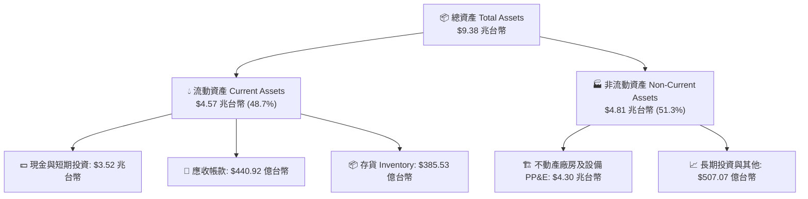

### 4.2 流動性指標分析

| 流動性指標 | 2024 年 | 2025 年 | 2026-Q2 | 產業基準 | 狀態評估 |
|------------|---------|---------|---------|----------|----------|
| **流動比率 (Current Ratio)** | 2.35 | 2.51 | **2.46** | > 1.5 | 🟢 流動性充沛 |
| **速動比率 (Quick Ratio)** | 2.13 | 2.32 | **2.13** | > 1.0 | 🟢 變現能力極強 |
| **現金與短期投資 (億台幣)** | $24,852 | $31,283 | **$35,180** | N/A | 🟢 手握 3.52 兆強勁流動資產 |
| **應收帳款週轉天數** | ~32 天 | ~27 天 | **~26 天** | ~45 天 | 🟢 客戶付款品質極高 |
| **存貨週轉天數** | ~85 天 | ~75 天 | **~78 天** | ~90 天 | 🟢 庫存管理非常健康 |

### 4.3 債務結構分析

```
╔══════════════════════════════════════════════════════════════════╗
║                   台積電 債務健康診斷                            ║
╠══════════════════════════════════════════════════════════════════╣
║                                                                  ║
║  總債務 (Total Debt)：   $982.45B TWD (短期 $167B + 長期 $815B)   ║
║  總現金與金流投資：      $3,518.01B TWD                          ║
║  淨現金 (Net Cash)：     $2,535.56B TWD (正淨現金部位) 🟢 強勁    ║
║                                                                  ║
║  Debt / Equity 比率：    15.17%  🟢 財務槓桿極低                 ║
║  Debt / EBITDA 比率：    0.36x   🟢 無償債風險                   ║
║  利息保障倍數：          > 100x  🟢 利息支出影響微乎其微         ║
║                                                                  ║
║  📊 結論：淨現金高達 2.54 兆台幣，為歷史最強資產負債表          ║
╚══════════════════════════════════════════════════════════════════╝
```

### 4.4 股東權益趨勢

股東權益（Stockholders' Equity）由 2021 年的 2.17 兆台幣暴增至 2025 年底的 5.36 兆台幣（TTM 達到 5.8 兆台幣以上），主要由保留盈餘（Retained Earnings）的高速累積所帶動。

---

## 5. 現金流量深度分析

### 5.1 現金流量瀑布圖

2025 年全年現金流轉化邏輯：

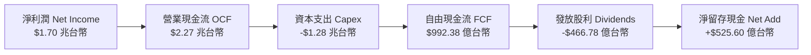

### 5.2 FCF 轉換率趨勢

| 年份 | 營業現金流 (OCF) | 資本支出 (Capex) | 自由現金流 (FCF) | FCF / 淨利 | 評估 |
|------|------------------|------------------|------------------|------------|------|
| **2022** | $1.61 兆台幣 | -$1.09 兆台幣 | $520.97 億台幣 | 52.5% | 🟢 擴廠高峰期 |
| **2023** | $1.24 兆台幣 | -$9,554 億台幣 | $286.57 億台幣 | 33.6% | 🟡 產業去庫存拖累 |
| **2024** | $1.83 兆台幣 | -$9,650 億台幣 | $861.20 億台幣 | 74.3% | 🟢 資本效率回升 |
| **2025** | $2.27 兆台幣 | -$1.28 兆台幣 | $992.38 億台幣 | 58.5% | 🟢 高資本支出下強勁金流 |
| **TTM** | $2.63 兆台幣 | -$1.50 兆台幣(估) | $739.06 億台幣 | 33.0% | 🟢 前瞻性建廠投入，金流無虞 |

### 5.3 自由現金流趨勢

```
╔══════════════════════════════════════════════════════════════════╗
║                台積電 歷年 FCF 與 CapEx 關係                     ║
╠══════════════════════════════════════════════════════════════════╣
║                                                                  ║
║  2022  FCF: $521B  [CapEx: -$1.09T]  █████████░░░░░░░            ║
║  2023  FCF: $287B  [CapEx: -$955B]   █████░░░░░░░░░░░            ║
║  2024  FCF: $861B  [CapEx: -$965B]   ███████████████░            ║
║  2025  FCF: $992B  [CapEx: -$1.28T]  █████████████████           ║
║                                                                  ║
║  📊 FCF 殖利率 (FCF Yield): 36.3% (Finviz/Yahoo合併估算)         ║
╚══════════════════════════════════════════════════════════════════╝
```

### 5.4 資本配置評估

台積電採用「有機重投資為主、現金股利為輔」的資本配置戰略：

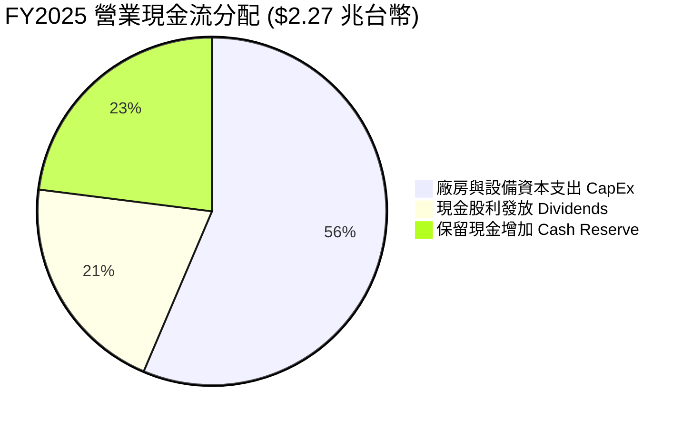

---

## 6. 獲利能力與資本效率

### 6.1 ROE / ROA / ROIC 趨勢

| 指標 | 2022 年 | 2023 年 | 2024 年 | 2025 年 | TTM | 產業平均 | 評估 |
|------|---------|---------|---------|---------|-----|----------|------|
| **ROE (股東權益報酬率)** | 39.8% | 26.2% | 30.2% | 35.4% | **40.0%** | ~15% | 🏆 產業頂峰 |
| **ROA (資產報酬率)** | 22.1% | 16.2% | 18.9% | 23.2% | **19.0%** | ~8% | 🟢 重資產下極優 |
| **ROIC (投入資本報酬率)**| 31.2% | 20.4% | 24.8% | 27.2% | **28.5%** | ~10% | 🏆 創造超額價值 |

### 6.2 ROIC vs WACC 分析（核心價值創造判斷）

```
╔══════════════════════════════════════════════════════════════════╗
║                ROIC vs WACC 深度分析                            ║
╠══════════════════════════════════════════════════════════════════╣
║                                                                  ║
║  WACC 估算：                                                     ║
║  ├── 無風險利率 (10Y美債)：   4.20%                              ║
║  ├── 市場風險溢酬 (ERP)：      5.00%                              ║
║  ├── Beta：                   1.246                              ║
║  ├── 股權成本 (Cost of Equity) = 4.20% + 1.246 × 5.0% = 10.43%   ║
║  ├── 債務成本（稅後）：       ~3.20%                             ║
║  ├── 資本結構：股權 ~85%，債務 ~15%                              ║
║  └── ✅ WACC ≈ 8.8%                                              ║
║                                                                  ║
║  ROIC 估算（TTM）：                                              ║
║  ├── NOPAT = $2.49T × (1 - 14.5%) ≈ $2.13 兆台幣                 ║
║  ├── 投入資本 = 股東權益 + 債務 - 現金 ≈ $7.47 兆台幣            ║
║  └── ✅ ROIC ≈ 28.5%                                             ║
║                                                                  ║
║  ★ 經濟價值增加（EVA）= ROIC - WACC = +19.7pp                   ║
║                                                                  ║
║  ROIC  28.5%  ▓▓▓▓▓▓▓▓▓▓▓▓▓▓▓▓▓▓▓▓▓▓▓▓▓▓▓▓░░  🟢              ║
║  WACC   8.8%  ▓▓▓▓▓▓▓░░░░░░░░░░░░░░░░░░░░░░░  ──              ║
║  EVA  +19.7pp ██████████████████████████████  🏆 強力創造股東價值║
║                                                                  ║
║  📊 結論：ROIC 為 WACC 的 3.24 倍，展現無與倫比的經濟附加價值    ║
╚══════════════════════════════════════════════════════════════╝
```

### 6.3 杜邦三因素分解

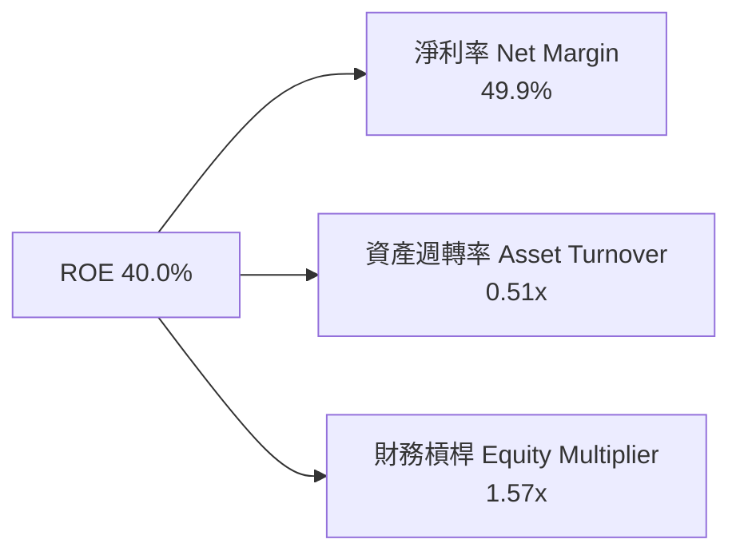

**杜邦分解洞察**：台積電高 ROE 的核心驅動因素為**極高的淨利率（49.9%）**，而非靠堆疊財務槓桿（槓桿僅 1.57x，屬於非常保守的資本結構）。

### 6.4 獲利能力儀表板

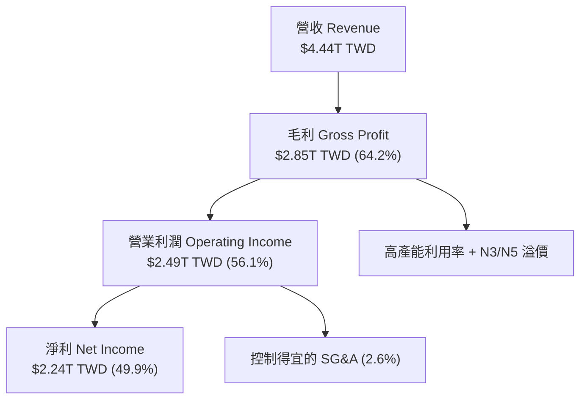

---

## 7. 估值深度分析

### 7.1 同業估值比較表格

與半導體製造及 AI 相關龍頭企業進行估值對比：

| 估值指標 | **台積電 (TSM)** | **三星電子 (Samsung)** | **英特爾 (Intel)** | **英偉達 (Nvidia)** | 台積電估值評估 |
|----------|------------------|-----------------------|-------------------|-------------------|----------------|
| **Trailing P/E** | **34.49x** | ~14.5x | ~45.0x | ~48.2x | 🟢 考量成長性後極合理 |
| **Forward P/E** | **18.18x** | ~11.2x | ~28.5x | ~29.1x | 🟢 對比 NVDA 具顯著折價 |
| **PEG Ratio** | **1.03x** | ~1.35x | > 2.0x | ~1.15x | 🟢 成長性調整後價格極甜 |
| **P/S Ratio** | **0.46x** | ~1.20x | ~1.85x | ~22.0x | 🟢 營收倍數極低 |
| **EV / EBITDA** | **4.43x** | ~5.80x | ~12.3x | ~35.0x | 🏆 企業價值估值極便宜 |
| **ROE (%)** | **40.0%** | ~9.5% | ~-2.1% | ~68.5% | 🟢 獲利品質優異 |

### 7.2 歷史估值區間分析

```
╔══════════════════════════════════════════════════════════════════╗
║                   台積電 P/E Band 估值區間                       ║
╠══════════════════════════════════════════════════════════════════╣
║  歷史 Forward P/E 區間（過去5年）：13.0x - 30.0x                 ║
║  當前 Forward P/E：18.18x                                        ║
║                                                                  ║
║  13x [低估區] ─── 18.2x [當前位置] ───────────── 25x ─── 30x [高估區] ║
║                    ▲                                             ║
║                    │                                             ║
║         歷史中軸 (~20.5x) 以下，具備重估空間                      ║
╚══════════════════════════════════════════════════════════════════╝
```

### 7.3 情境目標價（假設驅動，Bear / Base / Bull）

估值模型基於 ADR 計算（預估 2027 年 EPS 達 $29.50 USD）：

| 情境 | 營收 CAGR (3Y) | 營業利潤率 | 退出倍數 (Forward PE) | 隱含目標價 | 相對現價漲跌幅 |
|------|---------------|-----------|----------------------|------------|----------------|
| 🔴 **悲觀** | 15.0% | 45.0% | 15.0x | **$380.00** | -3.1% |
| 🟡 **基準** | 24.0% | 52.0% | 20.0x | **$537.43** | **+37.0%** |
| 🟢 **樂觀** | 32.0% | 56.0% | 23.0x | **$680.00** | **+73.4%** |

> **估值倍數選擇說明**：選用 **Forward P/E** 與 **EV/EBITDA** 作為核心指標。鑑於台積電資本支出龐大、折舊費用高，以 EV/EBITDA（僅 4.43x）能更真實反映其強大的現金流創造力。

### 7.4 DCF 敏感性分析（6格目標價矩陣）

設定基準無風險利率 4.2%，終端成長率 (Terminal Growth) 設定為 3.0% - 4.5%：

| 營收成長與利潤情境 | **WACC = 8.0%** | **WACC = 8.8%（基準）** | **WACC = 9.5%** |
|-------------------|-----------------|------------------------|-----------------|
| 🟢 **樂觀情境** (High AI Adoption) | **$720.50** (+83.7%) | **$680.00** (+73.4%) | **$625.10** (+59.4%) |
| 🟡 **基準情境** (Base Consensus) | **$585.00** (+49.2%) | **$537.43** (+37.0%) | **$492.30** (+25.5%) |
| 🔴 **悲觀情境** (Geopolitical Hit) | **$415.00** (+5.8%) | **$380.00** (-3.1%) | **$345.20** (-12.0%) |

### 7.5 估值綜合區間

```
╔══════════════════════════════════════════════════════════════════╗
║                   台積電 12 個月目標價綜合區間                   ║
╠══════════════════════════════════════════════════════════════════╣
║                                                                  ║
║  當前股價：$392.14                                               ║
║  悲觀目標：$380.00  [█]                                          ║
║  券商最低：$430.00     [████]                                     ║
║  基準目標：$537.43        [█████████████]                        ║
║  券商最高：$700.00                 [██████████████████]          ║
║                                                                  ║
║  📊 結論：下行風險約 3%，上行空間 37% 至 73%，風險回報比優異     ║
╚══════════════════════════════════════════════════════════════════╝
```

---

## 8. 成長催化劑

### 8.1 催化劑時間軸

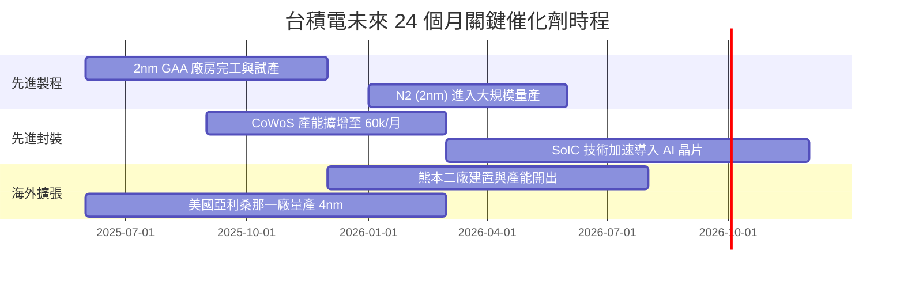

### 8.2 TAM 市場規模分析

```
╔══════════════════════════════════════════════════════════════════╗
║               台積電 可尋求市場 (TAM) 擴張潛力                   ║
╠══════════════════════════════════════════════════════════════════╣
║                                                                  ║
║  1. 全球 AI 加速器晶片 TAM (至2028)： $400B USD (TSM 代工滲透 >85%)║
║  2. 頂級智慧型手機 SoC TAM：          $80B USD  (TSM 佔有率 >75%) ║
║  3. 車用高階 ADAS 與 HPC TAM：        $35B USD  (TSM 滲透加速中)  ║
║                                                                  ║
║  📊 總計可定址市場 (TAM) 以 CAGR 22% 高速擴張                      ║
╚══════════════════════════════════════════════════════════════════╝
```

### 8.3 成長驅動力結構圖

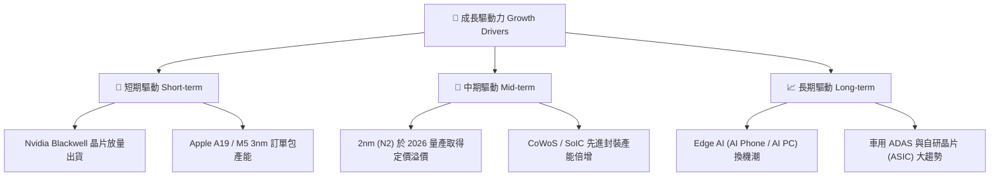

---

## 9. 風險矩陣

### 9.1 風險評分矩陣

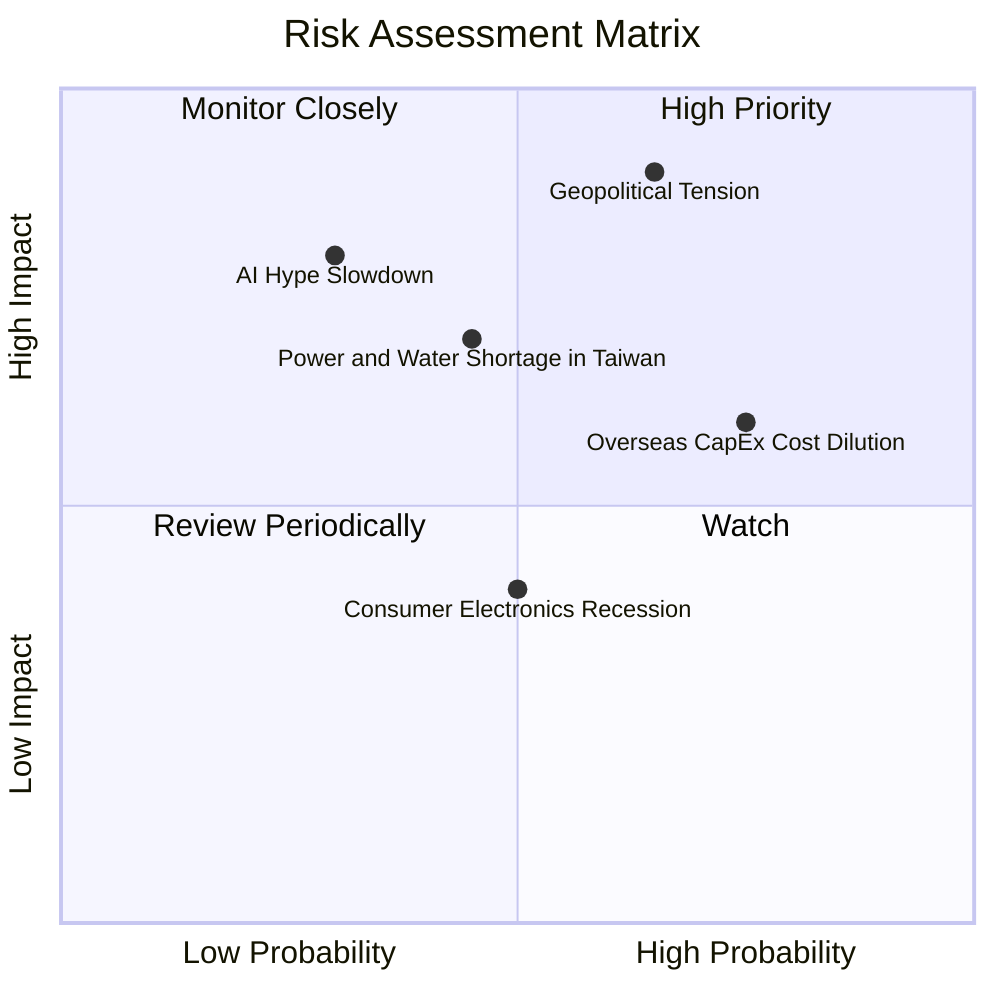

### 9.2 風險清單詳細分析

| # | 風險項目 | 發生機率 | 財務衝擊 | 風險評分 | 緩解措施與機構觀察 |
|---|----------|----------|----------|----------|-------------------|
| 1 | 🔴 **地緣政治與兩岸緊張** | 中 (45%) | 極高 (-30% 估值) | 🔴 8.5/10 | 海外擴產（美、日、德）分散產能風險。 |
| 2 | 🔴 **海外建廠稀釋毛利率** | 高 (75%) | 中 (-1~2pp 毛利) | 🔴 7.2/10 | 對海外代工服務收取「地理溢價（Geographic Premium）」。 |
| 3 | 🟡 **台灣水電資源限制** | 中 (40%) | 高 (-5% 產能) | 🟡 6.0/10 | 興建自用再生水廠與簽訂綠電長期購電合約 (CPPA)。 |
| 4 | 🟡 **AI 資本支出階段性放緩** | 低 (25%) | 高 (-15% 營收) | 🟡 5.5/10 | 多元化客戶組合（Apple, Qualcomm, Broadcom 等底盤）。 |

---

## 10. 投資建議

### 10.1 最終綜合評級雷達圖

```
╔══════════════════════════════════════════════════════════════╗
║              TSM 投資維度綜合評估雷達                        ║
╠══════════════════════════════════════════════════════════════╣
║ 基本面優勢  9.8 ▓▓▓▓▓▓▓▓▓▓▓▓▓▓▓▓▓▓▓█  🏆 產業霸主           ║
║ 成長動能    9.2 ▓▓▓▓▓▓▓▓▓▓▓▓▓▓▓▓▓▓░░  🟢 AI爆發             ║
║ 獲利品質    9.9 ▓▓▓▓▓▓▓▓▓▓▓▓▓▓▓▓▓▓▓█  🏆 淨利率接近50%      ║
║ 財務安全度  9.6 ▓▓▓▓▓▓▓▓▓▓▓▓▓▓▓▓▓▓▓░  🟢 2.5 兆台幣淨現金   ║
║ 估值安全邊際8.5 ▓▓▓▓▓▓▓▓▓▓▓▓▓▓▓▓░░░░  🟢 Forward PE 18.18x  ║
╠══════════════════════════════════════════════════════════════╣
║ 綜合評級    9.4 ▓▓▓▓▓▓▓▓▓▓▓▓▓▓▓▓▓▓█░  🟢 強烈買入 (Strong Buy)║
╚══════════════════════════════════════════════════════════════╝
```

### 10.2 目標價與隱含報酬率

| 情境 | 機率賦權 | 目標價 (ADR) | 當前股價 | 隱含報酬率 | 機率加權預期回報 |
|------|----------|--------------|----------|------------|------------------|
| 🔴 **悲觀情境** | 15% | $380.00 | $392.14 | -3.1% | -0.47% |
| 🟡 **基準情境** | 65% | $537.43 | $392.14 | +37.0% | +24.05% |
| 🟢 **樂觀情境** | 20% | $680.00 | $392.14 | +73.4% | +14.68% |
| **加權綜合評估**| **100%** | **$542.45** | **$392.14** | **+38.3%** | **期望報酬：+38.3%** |

### 10.3 買入時機與觸發因素

```
╔══════════════════════════════════════════════════════════════════╗
║                  ✅ 買入觸發因素 Checklist                      ║
╠══════════════════════════════════════════════════════════════════╣
║                                                                  ║
║  建倉行動策略：                                                  ║
║  ✅ 當前價格 $392.14 處於 Forward PE 18.2x，具備建立首批頭寸價值  ║
║  ✅ 建議採用「3-3-4」分批建倉法（現價30%、拉回5%加碼30%、破季線40%）║
║                                                                  ║
║  加碼觸發條件：                                                  ║
║  ☐ 季報公佈毛利率重新突破 60% 且產能利用率 > 105%                 ║
║  ☐ N2 製程試產良率突破 80% 提前公告                             ║
║  ☐ 地緣政治恐慌導致股價無差別修正至 $350 以下 (PE < 16x)         ║
║                                                                  ║
║  減碼/停損觸發條件：                                             ║
║  ☐ 營業利益率連續兩季跌破 42%                                   ║
║  ☐ 主要客戶（如 Nvidia / Apple）出現大規模轉單至三星或 Intel     ║
╚══════════════════════════════════════════════════════════════════╝
```

### 10.4 投資人適配度分析

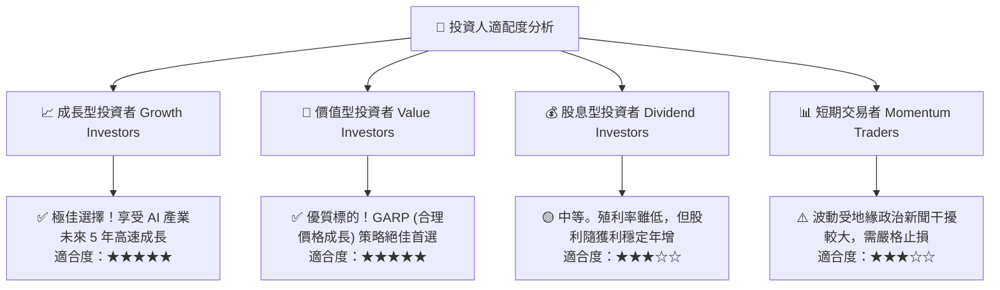

### 10.5 每季財報監控清單（Quarterly Watch List）

| 監控指標 | 正常健康區間 | 警訊觸發門檻 (減碼信號) | 觀察意義與戰略影響 |
|----------|--------------|-------------------------|-------------------|
| **毛利率 (Gross Margin)** | 53.0% - 60.0%+ | **< 50.0%** | 反映成本轉嫁能力與產能利用率狀態 |
| **先進製程營收占比 (<=7nm)** | > 65% | **< 55%** | 檢驗高附加價值晶片之出貨動能 |
| **CoWoS 月產能開出進度** | 逐季擴張 (+5k-10k/月) | 產能開出延遲 > 2 季 | 影響 AI 晶片供給量與客戶黏著度 |
| **資本支出 (CapEx) 規模** | $30B - $40B USD | 突發性砍單 > 25% | 半導體景氣循環翻轉之領先指標 |
| **ROIC (資本回報率)** | > 20.0% | **< 15.0%** | 是否維持超額價值創造（EVA > 0） |

### 10.6 反面論證：什麼會證明論點錯誤（What Would Change My Mind）

```
╔══════════════════════════════════════════════════════════════════╗
║              ⚠️ 論點失效條件（Disconfirming Evidence）           ║
╠══════════════════════════════════════════════════════════════════╣
║  本投資論點在下列情況成立時應重新檢視或清倉離場：                ║
║                                                                  ║
║  ☐ 1. 先進製程定價權喪失：毛利率連續兩季滑落至 48% 以下。        ║
║  ☐ 2. 競爭對手技術突破：Intel 18A 或三星 GAA 良率與效能超越 TSM，║
║        導致 Apple 或 Nvidia 分流超過 15% 的訂單。               ║
║  ☐ 3. 海外晶片法案與擴廠成本失控：美/歐廠營運虧損嚴重拖累總體   ║
║        營業利潤率縮減 > 500 個基點 (5pp)。                       ║
║  ☐ 4. 地緣政治實質封鎖：台海發生實質軍事衝突或全面貿易封鎖。    ║
║  ☐ 5. 資本效率惡化：ROIC 跌破 WACC（< 8.8%），摧毀股東價值。     ║
╚══════════════════════════════════════════════════════════════════╝
```

---

> **免責聲明**：本報告為 AI 自動生成，僅供研究參考，不構成投資建議。投資有風險，入市需謹慎。