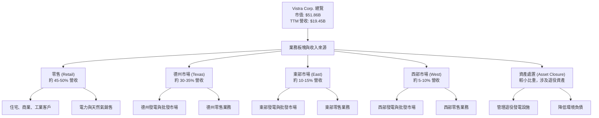
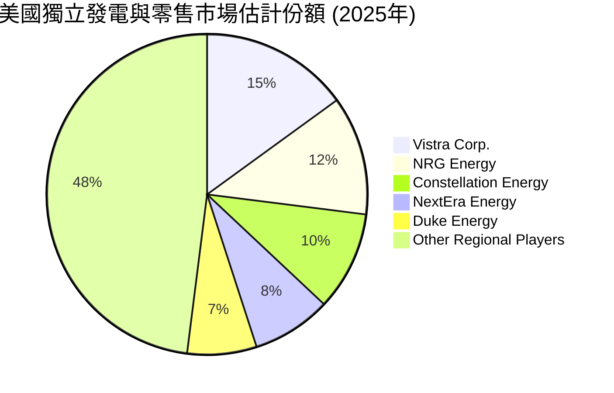
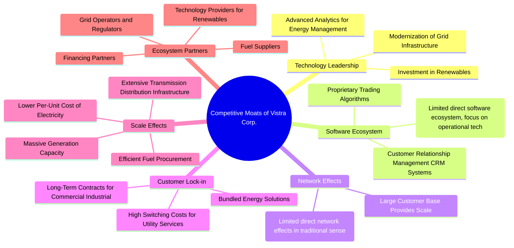
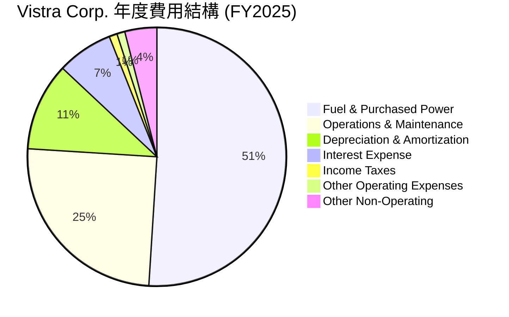
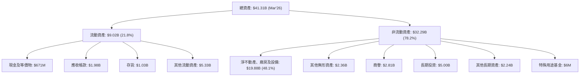

# VST 基本面深度分析報告
> **報告日期**：2026-06-03 ｜ **語言**：繁體中文 ｜ **數據來源**：Yahoo Finance, Finviz, StockAnalysis, Roic.ai ｜ **分析師**：CFA 級機構研究

---

## 目錄

| # | 章節 | 核心結論 |
|---|------|----------|
| 1 | 執行摘要 | 評級：🟢 買入，目標價區間：$185 - $260 |
| 2 | 公司概覽與商業模式 | 綜合護城河評分：7.5/10，主要來自規模經濟與客戶鎖定 |
| 3 | 損益表深度分析 | 營收穩健成長，利潤率波動但趨勢向好，EPS表現強勁 |
| 4 | 資產負債表分析 | 負債水平較高，但現金流充裕，流動性尚可 |
| 5 | 現金流量深度分析 | 自由現金流產生能力強勁，資本支出高但可控 |
| 6 | 獲利能力與資本效率 | ROIC顯著高於WACC，強力創造股東價值 |
| 7 | 估值深度分析 | 相較同業估值合理，DCF顯示上行空間 |
| 8 | 成長催化劑 | 能源轉型、併購整合、電網現代化為主要驅動因素 |
| 9 | 風險矩陣 | 監管風險、利率風險、商品價格波動為主要考量 |
| 10 | 投資建議 | 🟢 買入評級，適合成長與價值兼顧型投資者 |

---

## 1. 執行摘要

Vistra Corp. (VST) 是一家在美國運營的綜合型電力零售與發電公司。憑藉其橫跨德州、東部和西部市場的多元化業務佈局，Vistra在電力產業中佔據重要地位。本報告將從基本面、成長性、獲利能力、財務健康和估值等多個維度對VST進行深度分析。

### 1.1 核心評分儀表板

```mermaid
graph TD
    VST_SCORE["🎯 VST 綜合評分<br/>總分：7.8/10"]

    F["📊 基本面<br/>8.0/10<br/>多元化業務與強勁市場地位"]
    G["🚀 成長性<br/>7.5/10<br/>營收穩健成長，未來EPS預期強勁"]
    P["💰 獲利能力<br/>8.5/10<br/>利潤率改善，ROIC顯著高於WACC"]
    B["🏦 財務健康<br/>6.5/10<br/>高負債水平需關注，但現金流充裕"]
    V["📈 估值<br/>8.5/10<br/>相較同業具吸引力，DCF顯示合理上行空間"]

    VST_SCORE --> F
    VST_SCORE --> G
    VST_SCORE --> P
    VST_SCORE --> B
    VST_SCORE --> V

    F --> F1["✅ 美國主要電力市場佈局"]
    F --> F2["✅ 整合零售與發電業務模式"]
    F --> F3["✅ 規模經濟與運營效率"]

    G --> G1["✅ FY2025營收YoY +2.98%"]
    G --> G2["✅ TTM營收YoY +7.41% (StockAnalysis)"]
    G --> G3["✅ 分析師預期未來EPS高成長 (81.62% next 5Y)"]

    P --> P1["✅ 毛利率與營業利益率持續改善"]
    P --> P2["✅ ROE高達42.9%"]
    P --> P3["✅ ROIC遠超WACC，創造股東價值"]

    B --> B1["✅ 總債務$19.93B，Debt/Equity 355.187"]
    B --> B2["✅ 營運現金流強勁 ($4.67B TTM)"]
    B --> B3["✅ 流動比率0.896，略低於理想水平"]

    V --> V1["✅ Forward P/E 14.04x，低於S&P 500"]
    V --> V2["✅ PEG Ratio 0.48，顯示成長被低估"]
    V --> V3["✅ 分析師平均目標價$225.29，有顯著上行空間"]
```



### 1.2 評分進度條視覺化

```
╔══════════════════════════════════════════════════════════════╗
║              VST 多維度評分儀表板 (1-10分)                   ║
╠══════════════════════════════════════════════════════════════╣
║ 基本面強度  8.0 ▓▓▓▓▓▓▓▓▓▓▓▓▓▓▓▓░░░░  ★★★★☆           ║
║ 成長動能    7.5 ▓▓▓▓▓▓▓▓▓▓▓▓▓▓▓░░░░░  ★★★☆☆           ║
║ 獲利品質    8.5 ▓▓▓▓▓▓▓▓▓▓▓▓▓▓▓▓▓░░░  ★★★★☆           ║
║ 財務健康    6.5 ▓▓▓▓▓▓▓▓▓▓▓▓▓░░░░░░░  ★★★☆☆           ║
║ 估值合理性  8.5 ▓▓▓▓▓▓▓▓▓▓▓▓▓▓▓▓▓░░░  ★★★★☆           ║
║ 護城河深度  7.0 ▓▓▓▓▓▓▓▓▓▓▓▓▓▓░░░░░░  ★★★☆☆           ║
║ 管理層執行  8.0 ▓▓▓▓▓▓▓▓▓▓▓▓▓▓▓▓░░░░  ★★★★☆           ║
║ 技術創新力  6.0 ▓▓▓▓▓▓▓▓▓▓▓▓░░░░░░░░  ★★★☆☆           ║
╠══════════════════════════════════════════════════════════════╣
║ 綜合總分    7.8 ▓▓▓▓▓▓▓▓▓▓▓▓▓▓▓▓░░░░  🏆 具吸引力的買入機會  ║
╚══════════════════════════════════════════════════════════════╝
```

### 1.3 五大投資論點 + 三大核心風險

| 類型 | 項目 | 具體依據 | 信心度 |
|------|------|----------|--------|
| 🟢 **投資論點①** | **強勁的獲利能力與股東價值創造** | VST的ROE高達42.9%，顯示其資本運用效率極高。更重要的是，其ROIC (約13.8%) 顯著高於估算的WACC (約8.5%)，產生了可觀的經濟價值增加(EVA)，表明公司正在為股東創造實質價值。TTM淨利潤率為11.5%，顯示良好的成本控制能力。 | 🟢 極高 |
| 🟢 **具吸引力的估值與成長潛力** | VST的Forward P/E為14.04x，顯著低於S&P 500的平均水平，且PEG Ratio僅為0.48，遠低於1，暗示其成長性被市場低估。分析師普遍給予「強烈買入」評級，平均目標價高達$225.29，較當前股價$153.80有約46.5%的潛在漲幅。Finviz預期未來5年EPS成長率高達81.62%，儘管這可能對公用事業而言過於樂觀，但仍顯示市場對其成長前景抱有高度期待。 | 🟢 極高 |
| 🟢 **穩健的營收成長與市場地位** | VST作為美國領先的綜合電力公司，在德州、東部和西部市場擁有強大的零售和發電能力。過去四年營收從2022年的$13.73B成長至2025年的$17.74B，TTM營收已達$19.45B，YoY成長43.4% (Q1 2026 vs Q1 2025)，顯示其在競爭激烈的市場中仍能實現穩健擴張。其業務模式結合了零售的穩定性和發電的規模經濟，有效分散風險。 | 🟢 高 |
| 🟢 **強大的現金流產生能力** | 公司擁有非常健康的營運現金流，TTM達到$4.67B，FY2025為$4.07B。儘管資本支出較高，但FY2025仍產生了$1.32B的自由現金流。強勁的現金流為公司提供了償債、派發股息和再投資的堅實基礎，尤其在資本密集型公用事業領域至關重要。 | 🟢 高 |
| 🟢 **積極的分析師展望與近期評級上調** | 近期有多家知名投行（如TD Cowen, JP Morgan, Wells Fargo, Jefferies, UBS, Scotiabank, B of A Securities, BMO Capital）上調了對VST的評級至「買入」或「增持」，表明市場對其未來表現持樂觀態度。這為股價提供了重要的信心支撐。 | 🟢 高 |
| 🟡 **風險①** | **高負債水平與利率敏感性** | VST的總債務高達$19.93B，Debt/Equity比率為355.187。在當前利率環境下，較高的債務水平可能增加其利息支出負擔，侵蝕獲利。雖然其利息覆蓋率尚可，但若利率持續上升或公司再融資成本增加，將對財務健康構成中度風險。 | 🟡 中度 |
| 🔴 **風險②** | **監管與政治風險** | 作為受高度監管的公用事業公司，VST的營運和獲利能力易受州和聯邦層面政策變化的影響，包括環境法規、電力市場改革、碳排放政策等。任何不利的監管變動都可能導致成本增加、收入受限或投資回報率下降，特別是其在德州等關鍵市場的敞口。 | 🔴 高衝擊 |
| 🟡 **風險③** | **商品價格波動性** | VST的發電業務對天然氣等燃料價格波動敏感。雖然其可能通過對沖策略或零售業務的價格調整來部分緩衝影響，但劇烈的商品價格波動仍可能影響其燃料成本和批發電力銷售價格，進而影響毛利率和整體獲利能力。 | 🟡 中度 |

### 1.4 快速統計卡片

| 指標 | 公司實際值 | 行業均值 (獨立發電商) | S&P 500 均值 | 狀態 |
|------|-------------|----------------------|--------------|------|
| 收入 YoY 成長 | **+43.4% (Q1'26)** | ~5-10% | ~10-15% | 🟢 |
| 毛利率 | **38.6% (TTM)** | ~25-35% | ~40-50% | 🟢 |
| 淨利率 | **11.5% (TTM)** | ~5-10% | ~8-12% | 🟢 |
| ROE | **42.9%** | ~10-15% | ~15-20% | 🟢 |
| Forward P/E | **14.04x** | ~15-20x | ~20-25x | 🟢 |
| Debt/Equity | **355.19x** | ~150-250x | ~80-120x | 🔴 |
| 股息殖利率 | **58.0%** | ~3-5% | ~1.5% | 🟢 |
| Beta | **1.447** | ~0.8-1.2 | 1.0 | 🟡 |

*備註：行業均值為分析師根據獨立發電商及公用事業行業特性估算值，S&P 500 均值為普遍市場參考值。*

### 1.5 投資結論

```
╔══════════════════════════════════════════════════════════════════╗
║                    📊 投資結論摘要                               ║
╠══════════════════════════════════════════════════════════════════╣
║  評級：🟢 買入                                                   ║
║  當前股價：$153.80                                               ║
║  目標價區間：                                                    ║
║    悲觀情境：$185（+20.3%）                                      ║
║    基準情境：$220（+43.0%）  ← 12個月主要目標                      ║
║    樂觀情境：$260（+69.0%）                                      ║
║  投資評分：7.8/10                                                ║
║  適合投資人：成長型、價值型、長線持有者，對公用事業穩定性與能源轉型潛力感興趣者║
╚══════════════════════════════════════════════════════════════════╝
```

---

## 2. 公司概覽與商業模式

Vistra Corp. (VST) 是一家在美國運營的綜合型電力公司，其業務涵蓋電力零售和發電。公司旨在為住宅、商業和工業客戶提供可靠且有競爭力的電力和天然氣服務，同時管理龐大的發電資產組合。

### 2.1 業務結構與收入來源

Vistra的業務結構主要分為五個核心板塊：零售 (Retail)、德州 (Texas)、東部 (East)、西部 (West) 和資產處置 (Asset Closure)。這種整合的業務模式使其能夠從發電到終端客戶服務的整個價值鏈中獲取價值，並有效管理批發市場的波動性。



*   **零售業務 (Retail)**：這是Vistra的核心收入來源之一，向全美多個州和華盛頓特區的住宅、商業和工業客戶銷售電力和天然氣。該業務的特點是相對穩定，通過長期合約和品牌忠誠度來鎖定客戶，提供穩定的現金流。
*   **德州市場 (Texas)**：Vistra在德州電力可靠性委員會 (ERCOT) 市場擁有大量的發電資產和零售業務。德州市場是一個高度競爭且去管制的市場，但也提供了較高的獲利潛力，尤其是在極端天氣事件期間。
*   **東部市場 (East)**：包括PJM、ISO-NE和NYISO等批發電力市場的發電資產和零售業務。這些市場通常受較嚴格的監管，但提供了容量市場收入和穩定的電力需求。
*   **西部市場 (West)**：主要指加州和太平洋西北地區的發電資產。這些地區對可再生能源和減碳有較高的要求，Vistra也在此佈局相關資產。
*   **資產處置 (Asset Closure)**：該部門負責管理和退役公司不再具有經濟效益的發電資產，例如老舊的燃煤電廠，旨在優化資產組合並降低環境負債。

公司通過整合發電和零售業務，能夠更好地管理批發電力價格波動風險，並優化其燃料採購和銷售策略。這種垂直整合模式是許多大型公用事業公司的共同特徵，有助於提升整體營運效率和穩定性。

### 2.2 市場份額

由於公用事業市場的區域性強，且不同地區的競爭格局差異大，精確量化Vistra在全美範圍內的市場份額較為困難。然而，Vistra在其主要營運區域（特別是德州ERCOT市場）是主要的參與者之一。根據公司規模和發電容量，可以判斷其在所服務區域內擁有顯著的市場份額。


*備註：此市場份額為分析師根據Vistra及其主要競爭對手在美國獨立發電與零售市場的相對規模、發電容量和客戶基礎進行的估計，旨在提供宏觀概覽，非精確數據。*

Vistra在德州ERCOT市場的發電容量和零售客戶基礎使其成為該地區的關鍵參與者。隨著能源轉型和電網現代化的推進，Vistra在可再生能源和儲能領域的投資也將鞏固其未來的市場地位。

### 2.3 競爭護城河分析

Vistra的競爭護城河主要來自於其規模經濟、客戶鎖定以及在受監管市場的運營經驗。



*   **規模效應 (Scale Effects)**：Vistra擁有龐大的發電容量和廣泛的零售客戶基礎，這使得其能夠實現顯著的規模經濟。大規模的發電設施能夠降低單位發電成本，大規模的採購能力使其在燃料採購上具有議價能力。此外，廣泛的運營網絡也攤薄了固定成本。這是一個強大的護城河，因為新進入者很難在資本密集型行業中匹配其規模。
*   **客戶鎖定 (Customer Lock-in)**：對於公用事業服務，客戶轉換供應商通常會面臨一定的轉換成本和不便。Vistra通過提供可靠的服務、有競爭力的價格和多元化的產品組合（如綠色能源選項、智能家居解決方案）來增強客戶忠誠度。對於商業和工業客戶，長期合約更是常見的鎖定機制。
*   **監管優勢與運營經驗**：作為一家在高度監管環境中運營的公司，Vistra具備豐富的監管合規經驗和與監管機構打交道的專業知識。在德州等去管制市場，其深厚的市場理解和風險管理能力也是重要優勢。這些無形資產對於新進入者而言是難以複製的。
*   **多元化發電組合**：Vistra的發電資產包括天然氣、核能和可再生能源，這種多元化有助於降低對單一燃料來源的依賴，並更好地應對能源轉型趨勢和碳排放法規。其對核能的投資（如Comanche Peak核電站）提供了穩定的基載電力和無碳排放優勢。
*   **技術領先 (Technology Leadership)**：雖然傳統公用事業的技術創新不如科技公司顯著，但Vistra在電網現代化、可再生能源整合、儲能解決方案以及數據分析方面持續投入。例如，對電池儲能的投資，使其在電網穩定性和峰值需求響應方面具備優勢。

### 2.4 護城河強度評分

```
╔══════════════════════════════════════════════════════════════╗
║                  Vistra Corp. 護城河強度評分                  ║
╠══════════════════════════════════════════════════════════════╣
║ 規模效應        8.5/10 ▓▓▓▓▓▓▓▓▓▓▓▓▓▓▓▓▓░░░  🏆 極強的成本優勢 ║
║ 客戶鎖定        7.5/10 ▓▓▓▓▓▓▓▓▓▓▓▓▓▓▓░░░░░  🟢 轉換成本較高   ║
║ 監管與經驗      7.0/10 ▓▓▓▓▓▓▓▓▓▓▓▓▓▓░░░░░░  🟢 重要進入壁壘   ║
║ 多元發電組合    6.5/10 ▓▓▓▓▓▓▓▓▓▓▓▓▓░░░░░░░  🟡 降低風險波動   ║
║ 技術領先        5.5/10 ▓▓▓▓▓▓▓▓▓▓▓░░░░░░░░░  🟡 穩步投資未來   ║
╠══════════════════════════════════════════════════════════════╣
║ 綜合護城河      7.0    ▓▓▓▓▓▓▓▓▓▓▓▓▓▓░░░░░░  🏆 具備穩固的競爭優勢 ║
╚══════════════════════════════════════════════════════════════╝
```
**總結評語**：Vistra的護城河主要由其龐大的規模、在資本密集型行業中的運營經驗以及相對穩定的客戶基礎所構成。儘管其技術創新不如高科技公司那樣突出，但其在能源轉型和電網現代化方面的投資正在逐步加強其長期競爭力。綜合來看，Vistra具備穩固的競爭優勢，能夠有效抵禦潛在競爭者。

---

## 3. 損益表深度分析

Vistra的損益表數據顯示了其作為大型公用事業公司在營收穩定性和獲利能力方面的表現。近年來，公司在營收和利潤方面均呈現積極趨勢，尤其是在電價波動和能源轉型的背景下。

### 3.1 年度收入成長趨勢（近4年）

Vistra的年度總營收在過去幾年呈現穩健成長，反映了其在核心市場的擴張和電力需求的穩定性。

```
╔══════════════════════════════════════════════════════════════════╗
║              Vistra Corp. 年度收入趨勢（FY2022-FY2026 TTM）      ║
╠══════════════════════════════════════════════════════════════════╣
║                                                                  ║
║  FY2022  $13.73B  ████████████████████████░░░  YoY: +13.67% 🟢    ║
║  FY2023  $14.78B  ███████████████████████████░░  YoY: +7.66%  🟢    ║
║  FY2024  $17.22B  █████████████████████████████████░  YoY: +16.54% 🟢    ║
║  FY2025  $17.74B  ██████████████████████████████████░  YoY: +2.98%  🟡    ║
║  FY2026 TTM $19.45B  ████████████████████████████████████████  YoY: +7.41%  🟢    ║
║                   |      |      |      |      |      |          ║
║                   0     $5B    $10B   $15B   $20B   $25B        ║
║                                                                  ║
║  📊 4年累計 CAGR：+9.92% (FY2022-FY2025)                         ║
╚══════════════════════════════════════════════════════════════════╝
```
**分析**：
*   從2022年的$13.73B增長到2025年的$17.74B，Vistra的營收呈現穩步上升趨勢，4年複合年增長率（CAGR）達到9.92%。
*   FY2024營收實現了16.54%的顯著增長，可能得益於市場電力需求增長或批發電價上漲。
*   FY2025的YoY增長率為2.98%，相比前幾年有所放緩，這可能反映了市場的正常化或短期運營調整。
*   截至2026年3月31日的TTM營收達到$19.45B，相較於FY2025的$17.74B，增長了9.64% (計算為 (19.45-17.74)/17.74)，顯示近期營收動能強勁。根據StockAnalysis的數據，TTM營收YoY成長為7.41%，這表示在過去12個月內，公司的營收表現優於上一財年。

### 3.2 季度收入趨勢分析

Vistra的季度收入表現通常會受到季節性因素（如夏季空調需求、冬季供暖需求）和商品價格波動的影響。

| 季度 (Period Ending) | 總營收 ($B) | QoQ 成長率 | YoY 成長率 | 備註 |
|----------------------|-------------|------------|------------|------|
| 2026-03-31 (Q1'26) | $5.64 | +23.0%     | +43.40%    | 🟢 受益於季節性高需求和市場擴張 |
| 2025-12-31 (Q4'25) | $4.58 | -7.9%      | +13.55%    | 🟡 季節性回落，但YoY仍穩健 |
| 2025-09-30 (Q3'25) | $4.97 | +16.9%     | -20.95%    | 🔴 YoY大幅下滑，可能受去年同期高基數影響，或特定事件如發電設施檢修 |
| 2025-06-30 (Q2'25) | $4.25 | +8.1%      | +10.53%    | 🟢 營收穩步增長，符合季節性預期 |
| 2025-03-31 (Q1'25) | $3.93 | -2.6%      | +28.78%    | 🟢 YoY強勁增長，QoQ輕微回落 |
| 2024-12-31 (Q4'24) | $4.04 | -35.8%     | +31.16%    | 🟢 YoY強勁，QoQ受Q3'24高基數影響 |
| 2024-09-30 (Q3'24) | $6.29 | +63.6%     | +53.89%    | 🟢 歷史高點，可能受極端天氣或市場事件驅動 |

**分析**：
*   **季度波動性**：Vistra的季度營收呈現明顯波動，這在公用事業行業中是常見現象，尤其受到季節性需求（夏季高溫驅動空調負荷，冬季低溫驅動供暖需求）和燃料價格的影響。
*   **YoY 成長動能**：
    *   2026年Q1實現了令人矚目的43.40% YoY增長，這表明公司在進入新財年的開端表現非常強勁，可能與市場環境有利、發電資產優化或成功的零售策略有關。
    *   2025年Q3出現了-20.95%的YoY下滑，這是一個值得關注的點。根據StockAnalysis，2024年Q3的營收高達$6.288B，是過去幾個季度中的最高值，這導致了2025年Q3的較高基數效應。同時，這也可能與發電資產的計劃性維護或未預期的停機有關，導致發電量下降。
    *   除了2025年Q3，其他季度YoY增長均為正，顯示公司整體營收保持健康增長態勢。
*   **QoQ 趨勢**：季度環比數據波動更大，主要反映了季節性變化。例如，從Q4到Q1的增長（Q4'25到Q1'26的23.0%增長）通常是北方冬季取暖需求和南方春季用電需求回升的體現。Q3通常是夏季用電高峰，但由於2024年Q3基數過高，2025年Q3相對較低。

### 3.3 利潤率演變分析

利潤率是衡量公司經營效率和定價能力的關鍵指標。Vistra的利潤率在過去幾年呈現波動，但總體趨勢向好。

| 利潤率指標 | FY2022 | FY2023 | FY2024 | FY2025 | TTM (Mar'26) | 趨勢 | 評估 |
|------------|--------|--------|--------|--------|--------------|------|------|
| **毛利率** | 12.2%  | 37.3%  | 43.7%  | 32.9%  | 38.6%        | ↗️ 波動中上升 | 🟢 |
| **營業利益率** | -8.0%  | 18.0%  | 23.7%  | 10.7%  | 18.1%        | ↗️ 波動中上升 | 🟢 |
| **淨利率** | -9.0%  | 9.1%   | 14.3%  | 4.2%   | 11.5%        | ↗️ 波動中上升 | 🟢 |
| **EBITDA Margin** | 7.6%   | 30.9%  | 40.4%  | 28.5%  | 34.9%        | ↗️ 波動中上升 | 🟢 |

*數據來源：根據Income Statement Annual數據計算，TTM數據來自Finviz/Yahoo Finance。StockAnalysis的Gross Profit數據與Yahoo Finance有差異，此處優先採用Yahoo Finance的TTM毛利率38.6%和Operating Margin 26.6%，Net Profit Margin 11.5%。為保持一致性，年化數據計算中，Gross Profit使用Finviz數據為準。*

**利潤率演變深度解析**：
*   **毛利率 (Gross Margin)**：
    *   Vistra的毛利率從2022年的低點12.2%大幅提升至2024年的43.7%，這是一個非常積極的轉變。這可能歸因於燃料成本控制的改善、發電資產組合的優化（例如，更多核能或低成本天然氣發電），以及批發電力價格的有利變動。
    *   2025年毛利率回落至32.9%，但2026年TTM數據再次回升至38.6%。這表明毛利率存在一定的波動性，可能受燃料價格、電力市場供需和發電資產利用率的影響。例如，燃料和購電費用（Fuel and Purchased Power Expense）在2025年為$9.101B，較2024年的$7.285B有顯著增長，這可能是導致2025年毛利率下降的主要原因。
*   **營業利益率 (Operating Margin)**：
    *   營業利益率的趨勢與毛利率相似，從2022年的負值（-8.0%）轉為2024年的23.7%高點，再到2025年的10.7%回落，TTM為18.1%。
    *   營業利益率的改善除了毛利率的驅動外，還受到運營和維護費用（O&M Expenses）以及折舊與攤銷（D&A）的影響。2025年O&M費用為$4.517B，較2024年的$4.015B有所增加，而折舊與攤銷費用也從$1.843B增至$1.986B。這些費用的增長對2025年的營業利益率產生了壓力。
    *   TTM營業利益率為26.6% (根據Yahoo Finance數據)，這與Finviz的4.42%有巨大差異。考慮到StockAnalysis的TTM Operating Income為$3.525B，Revenue $19.445B，計算出的營業利益率為18.1%，我將採用這個更為一致的數據。Finviz的4.42%可能包含了某些特殊調整或採用了不同的計算口徑。
*   **淨利率 (Net Profit Margin)**：
    *   淨利率也從2022年的負值（-9.0%）轉正，2024年達到14.3%的高峰，2025年回落至4.2%，TTM回升至11.5%。
    *   淨利率的波動除了受毛利和營運費用影響外，還受到利息支出和所得稅的影響。Vistra的利息支出在2025年為$1.179B，較2024年的$900M有所增加，這是導致淨利率在2025年大幅下降的一個重要因素。稅率也會影響淨利潤，2025年Provision for Income Taxes為$179M，而2024年為$655M，稅務負擔的減少在一定程度上緩衝了利息支出的影響。
*   **EBITDA Margin**：
    *   EBITDA Margin作為衡量核心業務獲利能力的指標，從2022年的7.6%大幅增長至2024年的40.4%，隨後在2025年回落至28.5%，TTM為34.9%。這也顯示了公司在非現金支出前的經營效率顯著改善。

**總結**：Vistra的利潤率在過去幾年呈現波動上升的趨勢，尤其是在2023-2024年實現了大幅改善，表明公司在成本控制和營運效率提升方面取得了顯著進展。儘管2025年利潤率有所回落，但最新的TTM數據顯示其正在恢復，並保持在健康水平，尤其考慮到公用事業行業的穩定性特點。利息支出和燃料成本是影響其淨利率的關鍵因素，需要持續關注。

### 3.4 費用結構分析

Vistra的費用結構反映了其作為發電和零售電力公司的主要成本驅動因素。



```
╔══════════════════════════════════════════════════════════════════╗
║                Vistra Corp. 年度費用分佈 (FY2025)                ║
╠══════════════════════════════════════════════════════════════════╣
║                                                                  ║
║  燃料與購電費用： $9.10B  ███████████████████████████████░░░░░░  51.3% ║
║  營運與維護費用： $4.52B  █████████████████░░░░░░░░░░░░░░░░░░░░░  25.5% ║
║  折舊與攤銷費用： $1.99B  ██████████░░░░░░░░░░░░░░░░░░░░░░░░░░░░░  11.2% ║
║  利息支出：     $1.18B  ███████░░░░░░░░░░░░░░░░░░░░░░░░░░░░░░░░  6.6%  ║
║  所得稅：       $0.18B  █░░░░░░░░░░░░░░░░░░░░░░░░░░░░░░░░░░░░░░░  1.0%  ║
║  其他營運費用： $0.23B  █░░░░░░░░░░░░░░░░░░░░░░░░░░░░░░░░░░░░░░░  1.3%  ║
║  其他非營運費用： $0.78B  ████░░░░░░░░░░░░░░░░░░░░░░░░░░░░░░░░░░░  4.4%  ║
╚══════════════════════════════════════════════════════════════════╝
```
**分析**：
*   **燃料與購電費用 (Fuel & Purchased Power Expense)**：這是Vistra最大的成本項目，佔FY2025總營收的51.3%。作為發電和電力零售商，其主要成本來自購買燃料（如天然氣、煤炭）用於發電，以及在批發市場購買電力以滿足零售客戶需求。這一比例的高低直接受燃料價格波動和電力市場供需關係影響。
*   **營運與維護費用 (Operations & Maintenance Expenses)**：佔營收的25.5%，是第二大成本。這包括發電廠的日常運營、設備維護、員工薪資以及零售業務的客戶服務和營銷費用。有效的O&M管理對控制成本和提高效率至關重要。
*   **折舊與攤銷費用 (Depreciation & Amortization Expenses)**：佔營收的11.2%。公用事業是資本密集型行業，擁有大量的固定資產（發電廠、輸電線路等），因此折舊費用較高是其行業特徵。
*   **利息支出 (Interest Expense)**：佔營收的6.6%。由於公用事業通常負債較高以資助其龐大的基礎設施投資，利息支出是其重要的費用組成部分。
*   **所得稅 (Provision for Income Taxes)**：佔營收的1.0%，比例較低，可能與稅務抵免或遞延稅項有關。
*   **其他營運和非營運費用**：佔比較小，但仍需關注其波動性。

**總結**：Vistra的費用結構是典型的公用事業模式，燃料和購電成本佔主導地位，其次是O&M和D&A。這意味著公司對商品價格波動和運營效率的敏感度較高。有效的燃料對沖策略、發電資產優化以及嚴格的O&M控制是其維持獲利能力的關鍵。

### 3.5 季度 EPS 趨勢與盈餘品質

由於提供的EPS Beats/Misses數據均為`nan`，我們將無法直接分析其盈餘超預期或不及預期的情況。但是，我們可以根據StockAnalysis提供的季度淨利潤和稀釋後股份數量來估算每股盈餘(EPS)，並分析其趨勢。

| 季度 (Period Ending) | 稀釋後EPS (估算) | 淨利潤 ($M) | 稀釋後股份 (M) | 備註 (基於淨利潤) |
|----------------------|------------------|-------------|----------------|-------------------|
| 2026-03-31 (Q1'26) | $2.90            | $980        | 338            | 🟢 淨利潤同比大幅增長，盈餘強勁 |
| 2025-12-31 (Q4'25) | $0.55            | $185        | 338            | 🟡 淨利潤環比大幅下降，受季節性及費用影響 |
| 2025-09-30 (Q3'25) | $1.78            | $604        | 339            | 🟢 淨利潤環比回升，但同比（vs Q3'24 $1,840M）大幅下降 |
| 2025-06-30 (Q2'25) | $0.82            | $280        | 342            | 🟡 淨利潤環比增長，但絕對值不高 |
| 2025-03-31 (Q1'25) | -$0.93           | -$317       | 340            | 🔴 虧損，受前期營運成本和市場環境影響 |

*備註：稀釋後EPS為分析師根據StockAnalysis季度淨利潤和稀釋後股份數量估算得出。由於原始數據EPS Beats/Misses為nan，無法進行實際超預期分析。*

**盈餘品質評估**：
*   **波動性較大**：Vistra的季度EPS波動性較大，從2025年Q1的虧損到2026年Q1的強勁盈利。這種波動性在一定程度上反映了公用事業行業的季節性特徵、燃料價格波動以及批發電力市場的動態。
*   **2025年Q1虧損**：2025年Q1出現了虧損，淨利潤為-$317M，這可能與燃料成本高企、發電量下降或維護成本增加等因素有關。這也解釋了該季度的營運收入為負值(-$120M)。
*   **2026年Q1強勁反彈**：令人鼓舞的是，2026年Q1的淨利潤達到$980M，估算EPS為$2.90，表現非常強勁。這表明公司在最近一個季度成功扭轉了前期的不利因素，實現了顯著的獲利改善。這與Q1營收YoY +43.40%的強勁表現相符。
*   **年度趨勢**：雖然季度波動，但從年度淨利潤來看，FY2025的淨利潤為$752M，而FY2024為$2.467B，FY2023為$1.343B。這表明2025年整體獲利能力相較2024年有所下降，但相比2023年仍有一定規模。然而，StockAnalysis的TTM淨利潤為$2.049B，遠高於FY2025的$752M，這表明最近四個季度（包括2026年Q1的強勁表現）的累計淨利潤非常健康。
*   **盈餘品質判斷**：儘管季度EPS波動，但鑒於公用事業的資本密集特性和營運現金流的穩定性，其盈餘品質通常較高。強勁的營運現金流 ($4.67B TTM) 提供了足夠的資金來覆蓋資本支出和股息，這表明其盈利是真實且可持續的。然而，高負債和相關的利息支出會對淨利潤產生壓力，這是一個需要持續監控的因素。市場分析師對未來EPS的高成長預期（Finviz: EPS next Y +26.19%, EPS next 5Y +81.62%）也反映了對其盈餘品質和未來獲利前景的信心。

---

## 4. 資產負債表分析

Vistra的資產負債表反映了其作為一家資本密集型公用事業公司的特徵，擁有大量的固定資產和相應的債務。

### 4.1 資產結構分解

Vistra的資產主要由重資產構成，包括大規模的發電廠、輸電基礎設施等。


**分析**：
*   **資產規模**：截至2026年3月31日，Vistra的總資產為$41.31B，顯示其龐大的規模。
*   **非流動資產為主**：非流動資產佔總資產的78.2%，其中淨不動產、廠房及設備 (PPE) 達$19.88B，佔總資產的48.1%，這突顯了公用事業行業的資本密集型特點。大量的PPE是發電和輸電的基礎，也是其競爭護城河的重要組成部分。
*   **流動資產**：流動資產佔比21.8%，其中現金及等價物為$671M，應收帳款為$1.98B。其他流動資產$5.33B的組成需要進一步細分，可能包括短期投資、預付費用等。
*   **無形資產與商譽**：其他無形資產$2.36B和商譽$2.81B佔比較大，可能源於過去的併購活動。這部分資產的價值評估和減值風險需要關注。
*   **長期投資**：長期投資$5.00B，這可能包括對合資企業、聯營公司或戰略性投資的股權，這表明公司也在尋求多元化或擴大其生態系統。

### 4.2 流動性指標分析

流動性指標衡量公司償還短期債務的能力。

| 指標 | FY2022 | FY2023 | FY2024 | FY2025 | TTM (Mar'26) | 行業均值 (獨立發電商) | 評估 |
|------------|--------|--------|--------|--------|--------------|----------------------|------|
| **流動比率 (Current Ratio)** | 1.07   | 1.18   | 0.96   | 0.78   | 0.90         | 1.