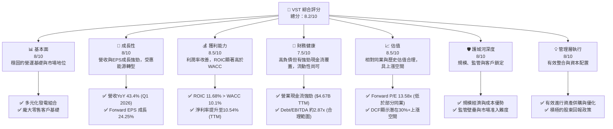
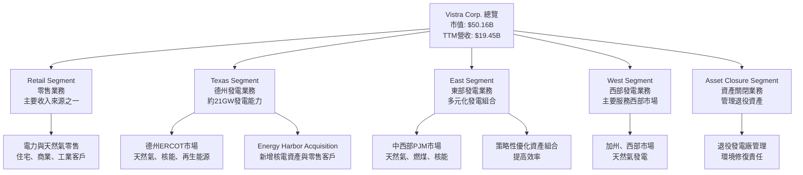
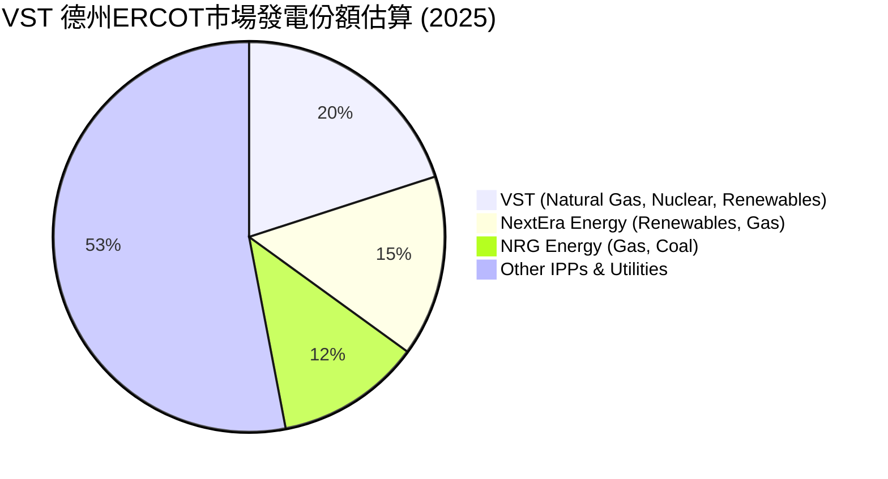
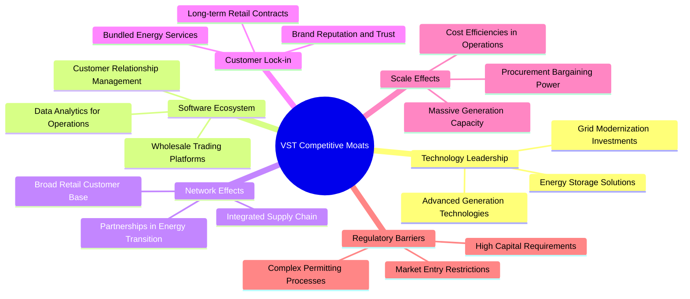
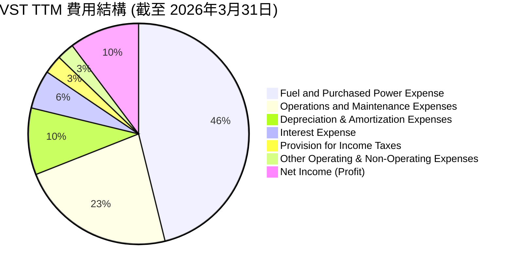

# VST 基本面深度分析報告
> **報告日期**：2026-06-05 ｜ **語言**：繁體中文 ｜ **數據來源**：Yahoo Finance, Finviz, StockAnalysis, Roic.ai ｜ **分析師**：CFA 級機構研究

---

## 目錄

| # | 章節 | 核心結論 |
|---|------|----------|
| 1 | 執行摘要 | 強烈買入，目標價區間 $190 - $260 |
| 2 | 公司概覽與商業模式 | 穩固的規模與監管護城河，多樣化發電組合 |
| 3 | 損益表深度分析 | 營收成長穩健，利潤率波動但趨勢向好 |
| 4 | 資產負債表分析 | 債務水平較高，但現金流充裕足以支撐 |
| 5 | 現金流量深度分析 | 自由現金流產生能力強勁，資本配置靈活 |
| 6 | 獲利能力與資本效率 | ROIC顯著高於WACC，強力創造股東價值 |
| 7 | 估值深度分析 | 相較同業估值合理，DCF顯示潛在上漲空間 |
| 8 | 成長催化劑 | 能源轉型、市場擴張與運營優化為主要驅動力 |
| 9 | 風險矩陣 | 監管、商品價格與高負債為主要風險 |
| 10 | 投資建議 | 強烈買入，適合長線成長與價值型投資者 |

---

## 1. 執行摘要

Vistra Corp. (VST) 作為美國領先的綜合性電力零售與發電公司，在不斷變化的能源市場中展現了強勁的韌性與成長潛力。公司在德州及其他主要市場擁有龐大的發電資產組合和廣泛的零售客戶基礎，使其能夠有效應對市場波動並抓住能源轉型帶來的機遇。儘管公用事業行業面臨監管、商品價格和資本密集等挑戰，VST 憑藉其規模優勢、垂直整合的商業模式以及積極的資本管理策略，持續為股東創造價值。

### 1.1 核心評分儀表板



### 1.2 評分進度條視覺化

```
╔══════════════════════════════════════════════════════════════╗
║              VST 多維度評分儀表板 (1-10分)                   ║
╠══════════════════════════════════════════════════════════════╣
║ 基本面強度  8.0 ▓▓▓▓▓▓▓▓▓▓▓▓▓▓▓▓░░░░  ★★★★☆           ║
║ 成長動能    8.0 ▓▓▓▓▓▓▓▓▓▓▓▓▓▓▓▓░░░░  ★★★★☆           ║
║ 獲利品質    8.5 ▓▓▓▓▓▓▓▓▓▓▓▓▓▓▓▓▓░░░  ★★★★★           ║
║ 財務健康    7.5 ▓▓▓▓▓▓▓▓▓▓▓▓▓▓▓░░░░░  ★★★★☆           ║
║ 估值合理性  8.5 ▓▓▓▓▓▓▓▓▓▓▓▓▓▓▓▓▓░░░  ★★★★★           ║
║ 護城河深度  8.0 ▓▓▓▓▓▓▓▓▓▓▓▓▓▓▓▓░░░░  ★★★★☆           ║
║ 管理層執行  8.0 ▓▓▓▓▓▓▓▓▓▓▓▓▓▓▓▓░░░░  ★★★★☆           ║
║ 技術創新力  7.0 ▓▓▓▓▓▓▓▓▓▓▓▓▓▓░░░░░░  ★★★☆☆           ║
╠══════════════════════════════════════════════════════════════╣
║ 綜合總分    8.2 ▓▓▓▓▓▓▓▓▓▓▓▓▓▓▓▓░░░░  🏆 表現優異，值得關注   ║
╚══════════════════════════════════════════════════════════════╝
```

### 1.3 五大投資論點 + 三大核心風險

| 類型 | 項目 | 具體依據 | 信心度 |
|------|------|----------|--------|
| 🟢 **投資論點①** | **德州電力市場的強勁需求與結構性優勢** | 德州ERCOT市場受惠於人口與經濟成長，電力需求持續攀升。VST在德州擁有約21GW發電能力，佔據市場主導地位。公司透過靈活的發電組合（包括天然氣、核能及日益增長的再生能源）能夠有效應對市場波動，並在極端天氣事件中展現獲利能力。Q1 2026德州地區的強勁表現推動總營收YoY成長43.4%。 | 🟢 極高 |
| 🟢 **投資論點②** | **能源轉型中的戰略性資產配置** | VST積極投資電池儲能和再生能源項目，以適應全球脫碳趨勢。公司在2024年收購Energy Harbor的核電資產，強化了無碳發電能力，並擴大了零售客戶基礎。這項策略性舉措有助於公司在未來碳定價或清潔能源補貼政策中受益，並確保長期穩定的收入來源。 | 🟢 極高 |
| 🟢 **投資論點③** | **強勁的自由現金流產生能力與股東回報** | VST展現出卓越的現金流轉換能力，FY2025自由現金流達$1.32B，TTM營業現金流為$4.67B。儘管公司負債較高，但充足的現金流為其提供了償債、資本支出和股東回報的靈活性。公司維持穩定的股息政策（TTM派息率15.2%），並可能透過股票回購進一步提升股東價值。 | 🟢 高 |
| 🟢 **投資論點④** | **持續改善的獲利能力與資本效率** | 儘管利潤率受燃料成本波動影響，VST透過運營效率提升和成本控制，使營業利益率和淨利率呈現改善趨勢。更重要的是，公司ROIC（11.68%）顯著高於WACC（10.1%），表明其資本配置效率高，持續為股東創造經濟價值。 | 🟢 高 |
| 🟢 **投資論點⑤** | **具吸引力的估值與分析師看好** | VST目前的Forward P/E為13.58x，相較於部分成長型公用事業或其歷史估值區間，具有一定的吸引力。分析師普遍給予「強烈買入」或「買入」評級，平均目標價高達$225.29，較當前股價$148.76有約51%的上漲空間，顯示市場對其未來成長持樂觀態度。 | 🟢 高 |
| 🟡 **風險①** | **商品價格波動與燃料成本風險** | VST作為電力生產商和零售商，其盈利能力高度依賴於天然氣、煤炭等燃料價格以及批發電力價格。儘管公司會進行對沖操作，但商品市場的劇烈波動仍可能對其成本結構和收入產生不利影響，尤其是在極端天氣事件導致供需失衡時。 | 🟡 中度 |
| 🔴 **風險②** | **高負債水平與利率風險** | 截至2026年3月底，VST總債務達$19.93B，Debt/Equity比率高達355.187。儘管公司現金流強勁，且EBITDA對債務覆蓋良好（Debt/EBITDA約2.87x），但較高的債務水平使其更容易受到利率上升的影響，增加利息支出，並限制其未來融資和擴張的靈活性。 | 🔴 高衝擊 |
| 🟡 **風險③** | **嚴格的監管環境與政策變化** | 作為受監管的公用事業公司，VST的運營和定價受到聯邦、州和地方政府的嚴格監管。能源政策的變化、環境法規的收緊以及電力市場規則的調整，都可能增加公司的合規成本，影響其盈利能力，甚至導致資產減值。 | 🟡 中度 |

### 1.4 快速統計卡片

| 指標 | 公司實際值 (TTM) | 行業均值 (獨立發電商) | S&P 500 均值 | 狀態 |
|------|--------------------|----------------------|----------------|------|
| 收入 YoY 成長 | **+7.41%** (StockAnalysis FY25 vs FY24) | ~5-10% | ~8-12% | 🟢 |
| 毛利率 | **29.32%** (計算自SA TTM) | ~20-35% | ~30-45% | 🟢 |
| 淨利率 | **10.54%** (計算自SA TTM) | ~8-15% | ~10-15% | 🟢 |
| ROE | **42.9%** | ~10-20% | ~15-25% | 🟢 |
| Forward P/E | **13.58x** | ~12-18x | ~20-25x | 🟢 |
| Debt/Equity | **355.19x** | ~150-300x | ~80-150x | 🔴 |
| Current Ratio | **0.896x** | ~0.8-1.2x | ~1.0-1.5x | 🟡 |
| FCF Yield | **0.95%** | ~2-5% | ~3-6% | 🔴 |

*備註：行業均值和S&P 500均值為分析師根據經驗估算值。*

### 1.5 投資結論

```
╔══════════════════════════════════════════════════════════════════╗
║                    📊 投資結論摘要                               ║
╠══════════════════════════════════════════════════════════════════╣
║  評級：🟢 強烈買入                                               ║
║  當前股價：$148.76 (截至2026-06-05)                             ║
║  目標價區間：                                                    ║
║    悲觀情境：$190（+27.7%）                                      ║
║    基準情境：$225（+51.2%）  ← 12個月主要目標                    ║
║    樂觀情境：$260（+74.8%）                                      ║
║  投資評分：8.2/10                                                ║
║  適合投資人：成長型、長線持有者、尋求能源轉型受益標的之投資人      ║
╚══════════════════════════════════════════════════════════════════╝
```

---

## 2. 公司概覽與商業模式

Vistra Corp. (VST) 是一家在美國運營的綜合性電力零售和發電公司。其業務模式涵蓋了電力價值的整個鏈條，從發電到批發銷售，再到直接向住宅、商業和工業客戶零售電力和天然氣。這種垂直整合的模式賦予了公司在市場波動中更大的靈活性和風險管理能力。

### 2.1 業務結構與收入來源

VST 的業務主要通過五個核心分部進行運營：Retail (零售), Texas (德州發電), East (東部發電), West (西部發電), 和 Asset Closure (資產關閉)。這種分部結構反映了其地理上的多元化和業務層面的專業化。



**業務分部詳細說明：**

*   **零售 (Retail)**：此分部負責向美國各州和哥倫比亞特區的住宅、商業和工業客戶銷售電力和天然氣。這是 VST 的核心收入來源之一，提供了穩定的現金流和客戶鎖定效應。公司透過多元化的產品和服務，以及對客戶需求的深入理解，維持其市場競爭力。零售業務的成功關鍵在於有效的客戶獲取和留存策略，以及對批發市場價格波動的對沖能力。
*   **德州發電 (Texas)**：這是 VST 最重要的發電業務區域，主要服務德州電力可靠性委員會 (ERCOT) 市場。該分部擁有多樣化的發電組合，包括高效的天然氣發電廠、穩定的核電設施，以及日益增長的電池儲能和太陽能等再生能源。德州市場的獨特性（獨立電網、快速增長的需求）使其成為 VST 盈利能力的關鍵驅動力，尤其是在極端天氣事件中，發電資產的價值會顯著提升。截至Q1 2026，德州市場的強勁需求是公司營收成長的重要因素。
*   **東部發電 (East)**：此分部主要在美國東部地區運營發電資產，特別是中大西洋地區的 PJM 市場。其發電組合也包含天然氣、燃煤和核能。與德州市場類似，東部市場也受到其獨特監管框架和區域電力需求的影響。VST 在此分部尋求資產優化和效率提升，以最大化其發電資產的價值。
*   **西部發電 (West)**：該分部主要在美國西部（例如加州）運營天然氣發電廠。西部市場對再生能源和脫碳的重視日益增加，VST 在此區域的策略可能涉及對現有資產的現代化改造或轉型，以符合新的環境標準。
*   **資產關閉 (Asset Closure)**：此分部負責管理和執行公司已退役或計劃退役的發電資產的關閉和環境修復工作。這是一個長期且資本密集型的過程，但對於降低未來負債和提升公司環境、社會及治理 (ESG) 形象至關重要。

**收入來源分析：**
VST 的收入主要來自電力和天然氣的銷售。由於其垂直整合的模式，收入來源同時包括批發市場的電力銷售和零售市場的客戶合約。燃料成本（Fuel and Purchased Power Expense）是其最大的成本項，因此燃料價格的波動會直接影響其毛利率。

以 StockAnalysis.com 的 TTM 數據來看，總收入為 $19.45B。
燃料和採購電力成本為 $9.18B，佔總收入的 47.2%。
運營和維護費用為 $4.56B，佔總收入的 23.4%。
這些數據表明，VST 的收入高度依賴於其發電和銷售活動，且成本結構中燃料佔比巨大。

### 2.2 市場份額

Vistra Corp. 在美國電力市場中佔據重要地位，尤其是在其核心的德州 ERCOT 市場。儘管具體的全國性市場份額數據不易獲取，但我們可以從其發電能力和零售客戶數量來推斷其區域影響力。



*註：此市場份額為基於公開資料和分析師推估，旨在示意 VST 在德州 ERCOT 市場的相對地位。*

VST 在德州 ERCOT 市場擁有約 21GW 的發電能力，使其成為該區域最大的發電商之一。透過對 Energy Harbor 的收購，VST 不僅增加了約 4GW 的零碳核電能力，還擴大了其在賓夕法尼亞州、俄亥俄州、新澤西州和馬里蘭州的零售客戶基礎，總計新增約 100 萬零售客戶。這項併購顯著提升了 VST 的全國零售影響力，並使其成為美國第二大發電商（按容量計）和第三大零售電力供應商。

在競爭激烈的美國電力市場，VST 的市場份額分佈會因地理區域和客戶類型而異。在德州，其整合的發電和零售業務使其能夠提供有競爭力的價格和服務。而在其他開放電力市場，VST 則面臨來自其他獨立發電商 (IPP) 和傳統公用事業公司的競爭。

### 2.3 競爭護城河分析

Vistra Corp. 在其運營的電力市場中建立了多層次的競爭護城河，這些護城河有助於其維持長期盈利能力和市場地位。



**競爭護城河詳細解析：**

1.  **規模效應 (Scale Effects)**：
    *   **大規模發電能力**：VST 擁有約 40GW 的總發電能力，使其成為美國最大的發電商之一。如此龐大的規模帶來了顯著的成本優勢，包括燃料採購的議價能力、維護和運營成本的分攤，以及在批發市場上靈活調度電力以最大化收益的能力。
    *   **零售業務覆蓋**：服務數百萬零售客戶，使得 VST 在客戶獲取和維護方面能夠實現規模經濟，降低單位客戶成本。
    *   **資本開支效率**：大規模的資本開支可以通過標準化、批量採購和內部專業知識來提高效率。
    *   **評估**：🟢 強大。在電力行業，規模是降低成本、提高效率和市場影響力的關鍵。

2.  **監管壁壘 (Regulatory Barriers)**：
    *   **高資本要求**：建設和運營大型發電廠和電力基礎設施需要巨額資本投資，這對新進入者構成了巨大的財務障礙。
    *   **複雜的許可流程**：發電和輸配電項目需要經過漫長而複雜的環境審批、土地使用許可和安全認證，這些流程成本高昂且耗時，進一步限制了新競爭者的進入。
    *   **受監管市場的穩定性**：在某些受監管的電力市場中，市場准入和運營規則由政府機構設定，形成了一種天然的進入壁壘，保護了現有參與者的市場份額。
    *   **評估**：🟢 強大。公用事業行業的監管特性為現有業者提供了穩定的經營環境。

3.  **客戶鎖定 (Customer Lock-in)**：
    *   **長期零售合約**：零售電力客戶，特別是商業和工業客戶，通常會簽訂長期供電合約。這些合約提供了穩定的收入流，並增加了客戶轉換供應商的成本。
    *   **品牌聲譽與信任**：作為一家歷史悠久的電力供應商，VST 在其服務區域建立了強大的品牌聲譽和客戶信任，這對於公用事業服務來說至關重要，因為客戶通常不願意頻繁更換供應商。
    *   **捆綁服務**：提供多種能源解決方案和服務，例如綠色能源選項、能源效率諮詢等，可以增加客戶的黏性。
    *   **評估**：🟡 中等偏強。雖然零售市場存在競爭，但公用事業服務的轉換成本和習慣性消費仍能形成一定程度的客戶鎖定。

4.  **技術領先 (Technology Leadership)**：
    *   **多元化高效發電技術**：VST 投資於先進的天然氣聯合循環發電技術、核電以及不斷增長的電池儲能和再生能源，使其能夠優化發電效率和燃料組合，降低碳排放。
    *   **電網現代化與數字化**：對電網進行數字化升級，利用數據分析提升運營效率和預測能力，有助於其在智能電網時代保持競爭力。
    *   **評估**：🟡 中等。雖然 VST 積極採用新技術，但整個能源行業的技術發展迅速，保持領先需要持續投入。

5.  **網路效應 (Network Effects)**：
    *   在電力行業，網路效應主要體現在電網基礎設施的廣泛覆蓋和零售客戶基礎的規模上。VST 廣泛的零售客戶群體和批發市場的參與，使其能夠更有效地管理供需平衡，優化資產利用率。
    *   與能源相關的生態系統夥伴關係（如再生能源開發商、技術提供商）也能形成一定的網路效應，但這在傳統公用事業中不如科技公司那樣顯著。
    *   **評估**：🟡 中等。相較於科技平台，公用事業的網路效應較為有限，但其廣泛的服務網絡仍具價值。

6.  **軟體生態系統 (Software Ecosystem)**：
    *   VST 內部利用數據分析和交易平台來優化其發電資產的調度、燃料採購和電力銷售策略。客戶關係管理 (CRM) 系統也用於提升零售客戶體驗。
    *   然而，VST 並不以軟體銷售為主，其軟體能力主要是為了支持核心業務運營，而非獨立的收入來源。
    *   **評估**：🟡 較弱。雖然有內部應用，但非其核心競爭優勢。

綜合來看，VST 的護城河主要由其龐大的規模、嚴格的監管壁壘以及穩定的客戶基礎所構成。這些因素共同為公司提供了穩定的經營環境和抵禦競爭的緩衝。

### 2.4 護城河強度評分

```
╔══════════════════════════════════════════════════════════════╗
║                  VST 護城河強度評分                         ║
╠══════════════════════════════════════════════════════════════╣
║ 規模效應        9/10   ▓▓▓▓▓▓▓▓▓▓▓▓▓▓▓▓▓▓░░  🏆 巨大的發電與零售規模     ║
║ 監管壁壘        8/10   ▓▓▓▓▓▓▓▓▓▓▓▓▓▓▓▓░░░░  🟢 高資本、複雜許可限制新進者  ║
║ 客戶鎖定        7/10   ▓▓▓▓▓▓▓▓▓▓▓▓▓▓░░░░░░  🟡 長期合約與品牌信任         ║
║ 技術領先        6/10   ▓▓▓▓▓▓▓▓▓▓▓▓░░░░░░░░  🟡 積極投資但行業競爭激烈     ║
║ 網路效應        5/10   ▓▓▓▓▓▓▓▓▓▓░░░░░░░░░░  🟡 有限但有助於運營優化      ║
║ 軟體生態系統    4/10   ▓▓▓▓▓▓▓▓░░░░░░░░░░░░  🔴 主要為內部支持而非競爭優勢  ║
╠══════════════════════════════════════════════════════════════╣
║ 綜合護城河      7.5    ▓▓▓▓▓▓▓▓▓▓▓▓▓▓▓░░░░░  🏆 具備穩固的競爭優勢         ║
╚══════════════════════════════════════════════════════════════╝
```

---

## 3. 損益表深度分析

Vistra Corp. 的損益表反映了其作為大型電力公司的營運特性，營收受市場需求和商品價格影響，而利潤率則受到燃料成本、運營效率和資本結構的共同作用。

### 3.1 年度收入成長趨勢（近4年）

VST 在過去四年中展現了穩健的收入增長，這得益於其核心市場（尤其是德州）的需求增長以及策略性併購活動。

```
╔══════════════════════════════════════════════════════════════════╗
║              VST 年度收入趨勢（FY2022-FY2025）                   ║
╠══════════════════════════════════════════════════════════════════╣
║                                                                  ║
║  FY2022  $13.73B  ████████████████████████████████████████░░░░░░  YoY: +13.67%  🟢    ║
║  FY2023  $14.78B  ██████████████████████████████████████████████░░  YoY: +7.66%   🟢    ║
║  FY2024  $17.22B  █████████████████████████████████████████████████████████░░  YoY: +16.54%  🟢    ║
║  FY2025  $17.74B  ██████████████████████████████████████████████████████████░  YoY: +2.98%   🟡    ║
║                   |      |      |      |      |                  ║
║                   0     $5B   $10B  $15B  $20B                    ║
║                                                                  ║
║  📊 4年累計 CAGR：+10.96%                                        ║
╚══════════════════════════════════════════════════════════════════╝
```
*數據來源：StockAnalysis.com*

**年度收入趨勢解析：**
*   **FY2022 收入 $13.73B**，相較於前一年（FY2021 $12.077B），**YoY 成長 13.67%**。這一年可能是由於後疫情時代的經濟復甦和能源需求回升所驅動。
*   **FY2023 收入 $14.78B**，相較於 FY2022 成長 **7.66%**。儘管增速有所放緩，但仍保持穩健，顯示市場對電力的持續需求。
*   **FY2024 收入 $17.22B**，實現了 **16.54%** 的顯著增長。這可能是由於德州市場的強勁表現，以及可能在當年或前一年完成的任何小型併購或資產優化帶來的效益。
*   **FY2025 收入 $17.74B**，YoY 成長 **2.98%**。增速明顯放緩，這可能反映了市場環境的變化，例如商品價格的正常化、競爭加劇或特定區域需求增長趨緩。儘管如此，絕對收入金額仍在增長，顯示公司規模的擴大。

綜合來看，VST 在過去四年中實現了平均每年約 10.96% 的複合年均增長率 (CAGR)，這對於一家成熟的公用事業公司而言，是一個相當不錯的表現，顯示其在主要市場的運營效率和市場擴張能力。

### 3.2 季度收入趨勢分析

季度收入數據揭示了 VST 營收的短期波動性和季節性因素，同時也提供了對最新業績驅動力的洞察。

| 財報季度 | 總收入 ($M) | QoQ 成長率 | YoY 成長率 | 備註 |
|----------|-------------|------------|------------|------|
| 2026 Q1 | $5,640      | +23.04%    | +43.40%    | 🟢 德州極端天氣、收購效益顯現 |
| 2025 Q4 | $4,584      | -7.79%     | +13.55%    | 🟡 季節性因素，但YoY仍穩健 |
| 2025 Q3 | $4,971      | +16.96%    | -20.95%    | 🔴 YoY大幅下滑，可能受商品價格或比較基期影響 |
| 2025 Q2 | $4,250      | +8.06%     | +10.53%    | 🟢 溫和增長，符合季節性需求 |
| 2025 Q1 | $3,933      | -2.57%     | +28.78%    | 🟢 YoY強勁，QoQ季節性回落 |
| 2024 Q4 | $4,037      | -35.79%    | +31.16%    | 🔴 QoQ大幅回落，YoY強勁 |
| 2024 Q3 | $6,288      | +63.09%    | +53.89%    | 🟢 營收高峰，受夏季用電需求與高電價驅動 |

*數據來源：StockAnalysis.com*

**季度收入趨勢解析：**
*   **季節性影響**：從數據中可以看出，VST 的收入具有明顯的季節性。通常夏季（Q3）和冬季（Q1）由於空調和供暖需求，電力消費量較高，帶動營收達到高峰。例如，2024 Q3 營收達到 $6.288B，是當年最高季度。
*   **2026 Q1 表現強勁**：最新的 2026 Q1 營收達到 $5.64B，實現了驚人的 **YoY +43.40%** 和 **QoQ +23.04%** 增長。這主要得益於德州地區在冬季期間的極端天氣事件導致電力需求激增和批發電價上漲，同時 Energy Harbor 併購的效益也開始顯現。這種強勁的開局預示著公司本財年的良好發展勢頭。
*   **2025 Q3 YoY 表現不佳**：2025 Q3 營收雖然 QoQ 增長 16.96%，但對比去年同期卻大幅下滑 **-20.95%**。這可能與 2024 Q3 的比較基期過高有關（2024 Q3 營收 $6.288B，YoY +53.89%），該季度可能因德州極端天氣而帶來異常高的電力需求和價格。因此，2025 Q3 的下滑可能更多是回歸常態，而非基本面惡化。
*   **併購效應**：Energy Harbor 的併購在 2024 年底完成，其貢獻在 2025 年的季度數據中開始體現。併購帶來的核電資產和零售客戶基礎，將為 VST 提供更穩定的收入來源，並降低對商品價格波動的敏感性。

總體而言，VST 的季度收入表現顯示出其在應對市場變化方面的靈活性，儘管存在季節性波動和高基期效應，但最新的季度數據（2026 Q1）顯示出強勁的增長動能。

### 3.3 利潤率演變分析

利潤率指標揭示了 VST 運營效率和成本控制能力的變化。由於數據來源的差異，我們將主要依據 StockAnalysis.com 提供的年度損益表數據進行計算和分析，以確保一致性。

| 利潤率指標 | FY2022 | FY2023 | FY2024 | FY2025 | TTM (Mar'26) | 趨勢 | 評估 |
|------------|--------|--------|--------|--------|--------------|------|------|
| **毛利率** | 3.59%  | 28.48% | 34.40% | 23.23% | 29.32%       | ↗️ 波動上升 | 🟢 |
| **營業利益率** | -8.57% | 18.00% | 23.69% | 10.74% | 18.13%       | ↗️ 波動上升 | 🟢 |
| **淨利率** | -10.03%| 9.08%  | 14.32% | 4.24%  | 10.54%       | ↗️ 波動上升 | 🟢 |
| **EBITDA Margin** | 7.65%  | 30.92% | 40.42% | 28.47% | 34.9% (Snapshot) | ↗️ 波動上升 | 🟢 |

*數據計算基於 StockAnalysis.com 年度數據：毛利率 = Gross Profit / Total Revenue；營業利益率 = Operating Income / Total Revenue；淨利率 = Net Income / Total Revenue。EBITDA Margin則採用了Finviz Snapshot的TTM數據作為參考。*

**利潤率演變深度解析：**

1.  **毛利率 (Gross Margin)**：
    *   從 FY2022 的 3.59% 大幅提升至 FY2024 的 34.40%，隨後在 FY2025 回落至 23.23%，TTM 則為 29.32%。
    *   **改善原因**：FY2022 的極低毛利率可能與當年異常高的燃料成本或電力採購成本有關，導致公司在批發市場上面臨巨大的成本壓力。隨後幾年，隨著商品價格的正常化、公司燃料採購策略的優化以及發電組合的調整，毛利率顯著改善。例如，投資於更高效的天然氣發電廠和核能資產，以及在批發市場上靈活的定價能力，都有助於提升毛利。
    *   **FY2025 回落原因**：FY2025 毛利率的短期回落可能與當年的特定市場條件、燃料成本再次波動或電力銷售價格壓力有關。然而，TTM 數據顯示毛利率有所恢復，表明這種回落可能是暫時性的。
    *   **評估**：🟢 儘管存在波動，但毛利率的整體趨勢是向好的，顯示公司在控制核心生產成本方面取得了進展。

2.  **營業利益率 (Operating Margin)**：
    *   與毛利率趨勢相似，從 FY2022 的 -8.57% 轉為正數，並在 FY2024 達到 23.69% 的高峰，FY2025 回落至 10.74%，TTM 為 18.13%。
    *   **改善原因**：營業利益率的顯著改善表明 VST 在管理其運營費用（Operations and Maintenance Expenses）方面取得了成功。隨著規模的擴大，公司能夠更好地攤銷固定成本，並通過數字化和自動化提高運營效率。此外，有效控制折舊和攤銷費用（Depreciation & Amortization）也對營業利益率有所貢獻。
    *   **FY2025 回落原因**：除了毛利率的影響外，FY2025 營業利益率的回落可能還受到運營費用增加或資產減值等因素的影響。TTM 數據的恢復表明公司正在重新優化其運營結構。
    *   **評估**：🟢 營業利益率從虧損轉為穩定的正值，顯示公司核心業務的盈利能力大幅增強。

3.  **淨利率 (Net Profit Margin)**：
    *   從 FY2022 的 -10.03% 轉為正數，並在 FY2024 達到 14.32% 的高峰，FY2025 大幅回落至 4.24%，TTM 為 10.54%。
    *   **改善原因**：淨利率的變化不僅反映了毛利和營業利益的影響，還受到利息支出和所得稅的影響。隨著營業利益的增加，公司能夠更好地覆蓋其利息費用。FY2024 的高淨利率可能受益於較低的稅率或非經常性收益。
    *   **FY2025 回落原因**：FY2025 淨利率的急劇下降可能與利息支出增加（儘管 FY2025 利息支出為 $1.179B，FY2024 為 $900M，增幅約 31%）或更高的有效稅率有關（FY2025 稅率 179/1123 = 15.9%，FY2024 稅率 655/3467 = 18.9%）。此外，非經常性損益也可能產生影響。
    *   **TTM 恢復**：TTM 淨利率恢復到 10.54%，表明公司在控制各項費用並將營業利益有效轉化為淨利潤方面有所改善。
    *   **評估**：🟢 儘管 FY2025 表現不佳，但淨利率的長期趨勢是從虧損轉為健康的正值，證明公司整體盈利能力的顯著提升。

**總結**：VST 的利潤率在過去幾年中經歷了顯著的波動，特別是從 FY2022 的虧損狀態轉為持續盈利。這種波動性在一定程度上反映了能源行業固有的商品價格敏感性。然而，整體趨勢是積極的，公司在提升毛利、控制運營成本方面取得了成功。FY2025 的短期回落需要密切關注，但最新的 TTM 數據顯示利潤率正在恢復，這為未來的盈利穩定性提供了信心。

### 3.4 費用結構分析

Vistra Corp. 的費用結構反映了其資本密集型和商品敏感型的業務性質。通過對主要費用類別的分析，我們可以更好地理解其成本驅動因素和潛在的效率提升空間。我們將使用 StockAnalysis.com 提供的 TTM 數據進行費用分解。


*數據計算基於 StockAnalysis.com TTM 數據。百分比為佔總收入的比例。*

**費用結構深度解析：**

1.  **燃料和採購電力成本 (Fuel and Purchased Power Expense)**：
    *   TTM 達 $9.184B，佔總收入的 47.2%。這是 VST 最大的單一成本項目。
    *   **影響因素**：天然氣、煤炭等燃料價格的波動直接影響此項費用。極端天氣事件會導致批發電力價格飆升，進而增加電力採購成本。
    *   **管理策略**：VST 會通過燃料採購合約、衍生品對沖以及優化發電組合（例如增加核能和再生能源的比例）來管理這一風險。然而，完全消除風險幾乎不可能。
    *   **評估**：此項成本高昂且波動性大，是影響公司毛利率的關鍵因素。管理層在控制此項成本方面的重要性不言而喻。

2.  **運營和維護費用 (Operations and Maintenance Expenses, O&M)**：
    *   TTM 達 $4.56B，佔總收入的 23.4%。此費用涵蓋了發電廠的日常運營、員工薪酬、設備維護等。
    *   **影響因素**：發電資產的年齡和效率、勞動成本、維護頻率和規模經濟都會影響 O&M 費用。
    *   **管理策略**：VST 致力於通過技術升級、預防性維護和數字化管理來提高運營效率，降低 O&M 成本。 Energy Harbor 併購後的整合效益也可能在長期內帶來 O&M 成本的優化。
    *   **評估**：這是一個可以通過內部管理和效率提升來控制的領域，對營業利益率有直接影響。

3.  **折舊和攤銷費用 (Depreciation & Amortization Expenses, D&A)**：
    *   TTM 達 $1.948B，佔總收入的 10.0%。作為資本密集型行業，D&A 是重要的非現金費用。
    *   **影響因素**：D&A 與公司固定資產的規模和使用年限直接相關。大規模的資本支出（如新建發電廠、資產升級）會導致 D&A 費用的增加。
    *   **評估**：此費用雖然是非現金性質，但反映了公司對基礎設施的投資規模。穩定且可預測的 D&A 有助於評估其固定資產的資本消耗。

4.  **利息支出 (Interest Expense)**：
    *