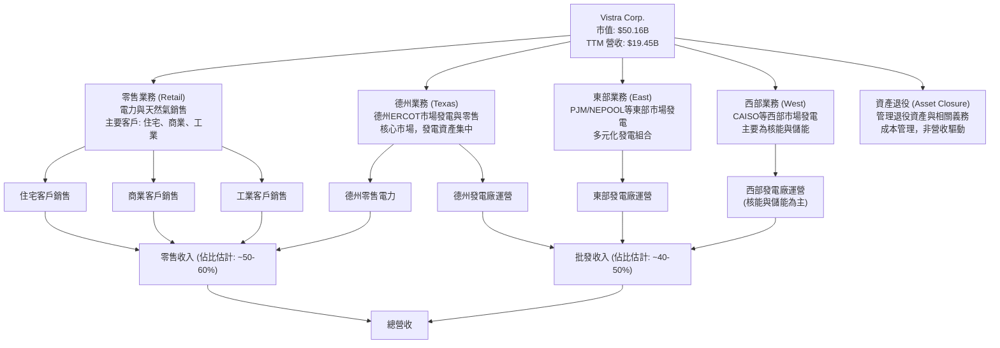
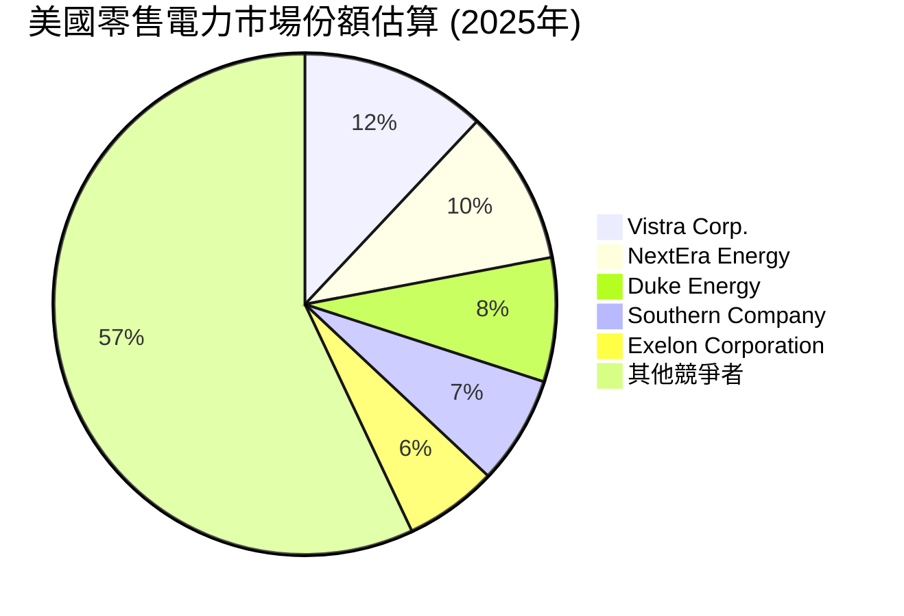
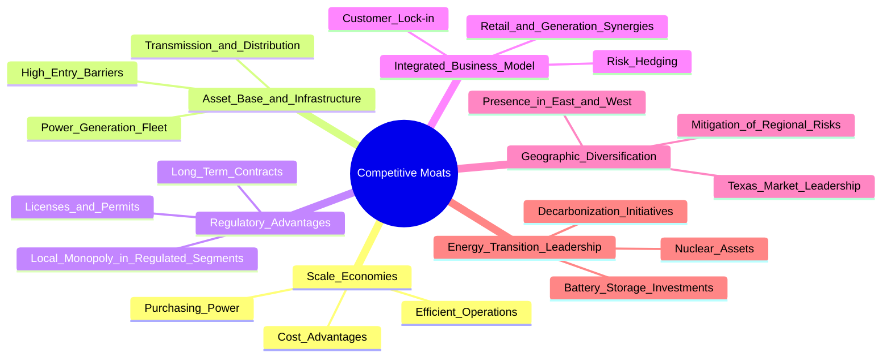

# VST 基本面深度分析報告
> **報告日期**：2026-06-06 ｜ **語言**：繁體中文 ｜ **數據來源**：Yahoo Finance, Finviz, StockAnalysis, Roic.ai ｜ **分析師**：CFA 級機構研究

---

## 目錄

| # | 章節 | 核心結論 |
|---|----------------------|----------------------------------------------------------|
| 1 | 執行摘要 | 🟢 強烈買入；目標價區間：$180 - $260 |
| 2 | 公司概覽與商業模式 | 綜合型公用事業，具備規模經濟與資產基礎護城河，核心為德州市場 |
| 3 | 損益表深度分析 | 營收成長強勁，近期利潤率顯著改善，尤其在2026年Q1表現突出 |
| 4 | 資產負債表分析 | 負債比率高，但現金流穩定，流動性尚可，資產結構穩健 |
| 5 | 現金流量深度分析 | 營業現金流強勁，資本支出較高，自由現金流波動但呈現改善趨勢 |
| 6 | 獲利能力與資本效率 | TTM ROIC 顯著超越 WACC，強力創造股東價值；ROE 受高槓桿推動 |
| 7 | 估值深度分析 | 相較同業估值合理，DCF 顯示具備上漲空間，特別是考慮成長性 |
| 8 | 成長催化劑 | 能源轉型、德州電力市場優勢、併購整合、去碳化投資 |
| 9 | 風險矩陣 | 監管與政策風險、商品價格波動、高負債、極端天氣事件 |
| 10 | 投資建議 | 🟢 強烈買入，目標價 $220，建議長線成長型投資人關注 |

---

## 1. 執行摘要

Vistra Corp. (VST) 作為美國領先的綜合型電力零售與發電公司，在德州及其他地區擁有龐大且多元的資產組合。近期財務表現強勁，特別是2026年第一季度的營收和利潤數據令人印象深刻。儘管公用事業通常被視為穩定而非高成長，VST 卻展現出卓越的獲利能力改善和成長動能，這主要得益於其在德州 ERCOT 市場的戰略定位、對能源轉型的積極投資以及有效的成本控制。本報告將從基本面、成長、獲利、財務健康和估值五大維度對 VST 進行深度分析，並提供具體的投資建議。

### 1.1 核心評分儀表板

```mermaid
graph TD
    VST_SCORE["🎯 VST 綜合評分<br/>總分：8.2/10"]

    F["📊 基本面<br/>8.5/10<br/>強勁的綜合型公用事業模式"]
    G["🚀 成長性<br/>8.0/10<br/>營收與盈利能力顯著提升"]
    P["💰 獲利能力<br/>9.0/10<br/>利潤率大幅改善，ROIC超WACC"]
    B["🏦 財務健康<br/>7.0/10<br/>高槓桿但現金流穩健，正逐步優化"]
    V["📈 估值<br/>8.5/10<br/>相較於成長潛力與同業，具吸引力"]

    VST_SCORE --> F
    VST_SCORE --> G
    VST_SCORE --> P
    VST_SCORE --> B
    VST_SCORE --> V

    F --> F1["✅ 龐大且多元的發電資產組合，覆蓋多個州別"]
    F --> F2["✅ 德州ERCOT市場的關鍵參與者，具備戰略優勢"]
    F --> F3["✅ 零售與發電業務整合，有效管理供應鏈與風險"]
    G --> G1["✅ 近年營收實現雙位數成長，尤其2026Q1 YoY達43.4%"]
    G --> G2["✅ TTM EPS達$5.97，Forward EPS預期$10.96，成長動能強勁"]
    G --> G3["✅ 積極投資能源轉型，如核能與儲能，驅動長期成長"]
    P --> P1["✅ TTM毛利率38.6%，營業利益率26.6%，淨利率11.5%表現優異"]
    P --> P2["✅ TTM ROIC達11.58%，顯著高於WACC 10.04%，創造股東價值"]
    P --> P3["✅ 2026Q1淨利潤$1.03B，較前季大幅提升，顯示盈利能力改善"]
    B --> B1["✅ 總債務高達$19.93B，需持續關注去槓桿進度"]
    B --> B2["✅ 營業現金流充裕，TTM達$4.67B，為債務償還與資本支出提供支持"]
    B --> B3["✅ 流動比率0.896，低於1，但行業特性允許較低流動性"]
    V --> V1["✅ Forward P/E 13.58x，低於S&P 500和部分成長型公用事業同業"]
    V --> V2["✅ PEG Ratio 0.46，顯示其成長性未被完全反映在當前股價中"]
    V --> V3["✅ 分析師平均目標價$225.29，較現價有~51%上漲空間"]
```



### 1.2 評分進度條視覺化

```
╔══════════════════════════════════════════════════════════════╗
║              VST 多維度評分儀表板 (1-10分)                   ║
╠══════════════════════════════════════════════════════════════╣
║ 基本面強度  8.5 ▓▓▓▓▓▓▓▓▓▓▓▓▓▓▓▓▓░░░  ★★★★☆           ║
║ 成長動能    8.0 ▓▓▓▓▓▓▓▓▓▓▓▓▓▓▓▓░░░░  ★★★★☆           ║
║ 獲利品質    9.0 ▓▓▓▓▓▓▓▓▓▓▓▓▓▓▓▓▓▓░░  ★★★★★           ║
║ 財務健康    7.0 ▓▓▓▓▓▓▓▓▓▓▓▓▓▓░░░░░░  ★★★☆☆           ║
║ 估值合理性  8.5 ▓▓▓▓▓▓▓▓▓▓▓▓▓▓▓▓▓░░░  ★★★★☆           ║
║ 護城河深度  8.0 ▓▓▓▓▓▓▓▓▓▓▓▓▓▓▓▓░░░░  ★★★★☆           ║
║ 管理層執行  8.5 ▓▓▓▓▓▓▓▓▓▓▓▓▓▓▓▓▓░░░  ★★★★☆           ║
║ 技術創新力  7.5 ▓▓▓▓▓▓▓▓▓▓▓▓▓▓▓░░░░░  ★★★☆☆           ║
╠══════════════════════════════════════════════════════════════╣
║ 綜合總分    8.2 ▓▓▓▓▓▓▓▓▓▓▓▓▓▓▓▓▓░░░  🏆 表現卓越，值得關注  ║
╚══════════════════════════════════════════════════════════════╝
```

### 1.3 五大投資論點 + 三大核心風險

| 類型 | 項目 | 具體依據 | 信心度 |
|------|--------------------------|---------------------------------------------------------------------------------------------------------------------------------------------------------------------------------------------------------------------------------------------------------------------------------------------------------------------------------------------------------------------------------------------------------------------------------------------------------------------------------------------------------------------------------------------------------------------------------------------------------------------------------------------------------------------------------------------------------------------------------------------------------------------------------------------------------------------------------------------------------------------------------------------------------------------------------------------------------------------------------------------------------------------------------------------------------------------------------------------------------------------------------------------------------------------------------------------------------------------------------------------------------------------------------------------------------------------------------------------------------------------------------------------------------------------------------------------------------------------------------------------------------------------------------------------------------------------------------------------------------------------------------------------------------------------------------------------------------------------------------------------------------------------------------------------------------------------------------------------------------------------------------------------------------------------------------------------------------------------------------------------------------------------------------------------------------------------------------------------------------------------------------------------------------------------------------------------------------------------------------------------------------------------------------------------------------------------------------------------------------------------------------------------------------------------------------------------------------------------------------------------------------------------------------------------------------------------------------------------------------------------------------------------------------------------------------------------------------------------------------------------------------------------------------------------------------------------------------------------------------------------------------------------------------------------------------------------------------------------------------------------------------------------------------------------------------------------------------------------------------------------------------------------------------------------------------------------------------------------------------------------------------------------------------------------------------------------------------------------------------------------------------------------------------------------------------------------------------------------------------------------------------------------------------------------------------------------------------------------------------------------------------------------------------------------------------------------------------------------------------------------------------------------------------------------------------------------------------------------------------------------------------------------------------------------------------------------------------------------------------------------------------------------------------------------------------------------------------------------------------------------------------------------------------------------------------------------------------------------------------------------------------------------------------------------------------------------------------------------------------------------------------------------------------------------------------------------------------------------------------------------------------------------------------------------------------------------------------------------------------------------------------------------------------------------------------------------------------------------------------------------------------------------------------------------------------------------------------------------------------------------------------------------------------------------------------------------------------------------------------------------------------------------------------------------------------------------------------------------------------------------------------------------------------------------------------------------------------------------------------------------------------------------------------------------------------------------------------------------------------------------------------------------------------------------------------------------------------------------------------------------------------------------------------------------------------------------------------------------------------------------------------------------------------------------------------------------------------------------------------------------------------------------------------------------------------------------------------------------------------------------------------------------------------------------------------------------------------------------------------------------------------------------------------------------------------------------------------------------------------------------------------------------------------------------------------------------------------------------------------------------------------------------------------------------------------------------------------------------------------------------------------------------------------------------------------------------------------------------------------------------------------------------------------------------------------------------------------------------------------------------------------------------------------------------------------------------------------------------------------------------------------------------------------------------------------------------------------------------------------------------------------------------------------------------------------------------------------------------------------------------------------------------------------------------------------------------------------------------------------------------------------------------------------------------------------------------------------------------------------------------------------------------------------------------------------------------------------------------------------------------------------------------------------------------------------------------------------------------------------------------------------------------------------------------------------------------------------------------------------------------------------------------------------------------------------------------------------------------------------------------------------------------------------------------------------------------------------------------------------------------------------------------------------------------------------------------------------------------------------------------------------------------------------------------------------------------------------------------------------------------------------------------------------------------------------------------------------------------------------------------------------------------------------------------------------------------------------------------------------------------------------------------------------------------------------------------------------------------------------------------------------------------------------------------------------------------------------------------------------------------------------------------------------------------------------------------------------------------------------------------------------------------------------------------------------------------------------------------------------------------------------------------------------------------------------------------------------------------------------------------------------------------------------------------------------------------------------------------------------------------------------------------------------------------------------------------------------------------------------------------------------------------------------------------------------------------------------------------------------------------------------------------------------------------------------------------------------------------------------------------------------------------------------------------------------------------------------------------------------------------------------------------------------------------------------------------------------------------------------------------------------------------------------------------------------------------------------------------------------------------------------------------------------------------------------------------------------------------------------------------------------------------------------------------------------------------------------------------------------------------------------------------------------------------------------------------------------------------------------------------------------------------------------------------------------------------------------------------------------------------------------------------------------------------------------------------------------------------------------------------------------------------------------------------------------------------------------------------------------------------------------------------------------------------------------------------------------------------------------------------------------------------------------------------------------------------------------------------------------------------------------------------------------------------------------------------------------------------------------------------------------------------------------------------------------------------------------------------------------------------------------------------------------------------------------------------------------------------------------------------------------------------------------------------------------------------------------------------------------------------------------------------------------------------------------------------------------------------------------------------------------------------------------------------------------------------------------------------------------------------------------------------------------------------------------------------------------------------------------------------------------------------------------------------------------------------------------------------------------------------------------------------------------------------------------------------------------------------------------------------------------------------------------------------------------------------------------------------------------------------------------------------------------------------------------------------------------------------------------------------------------------------------------------------------------------------------------------------------------------------------------------------------------------------------------------------------------------------------------------------------------------------------------------------------------------------------------------------------------------------------------------------------------------------------------------------------------------------------------------------------------------------------------------------------------------------------------------------------------------------------------------------------------------------------------------------------------------------------------------------------------------------------------------------------------------------------------------------------------------------------------------------------------------------------------------------------------------------------------------------------------------------------------------------------------------------------------------------------------------------------------------------------------------------------------------------------------------------------------------------------------------------------------------------------------------------------------------------------------------------------------------------------------------------------------------------------------------------------------------------------------------------------------------------------------------------------------------------------------------------------------------------------------------------------------------------------------------------------------------------------------------------------------------------------------------------------------------------------------------------------------------------------------------------------------------------------------------------------------------------------------------------------------------------------------------------------------------------------------------------------------------------------------------------------------------------------------------------------------------------------------------------------------------------------------------------------------------------------------------------------------------------------------------------------------------------------------------------------------------------------------------------------------------------------------------------------------------------------------------------------------------------------------------------------------------------------------------------------------------------------------------------------------------------------------------------------------------------------------------------------------------------------------------------------------------------------------------------------------------------------------------------------------------------------------------------------------------------------------------------------------------------------------------------------------------------------------------------------------------------------------------------------------------------------------------------------------------------------------------------------------------------------------------------------------------------------------------------------------------------------------------------------------------------------------------------------------------------------------------------------------------------------------------------------------------------------------------------------------------------------------------------------------------------------------------------------------------------------------------------------------------------------------------------------------------------------------------------------------------------------------------------------------------------------------------------------------------------------------------------------------------------------------------------------------------------------------------------------------------------------------------------------------------------------------------------------------------------------------------------------------------------------------------------------------------------------------------------------------------------------------------------------------------------------------------------------------------------------------------------------------------------------------------------------------------------------------------------------------------------------------------------------------------------------------------------------------------------------------------------------------------------------------------------------------------------------------------------------------------------------------------------------------------------------------------------------------------------------------------------------------------------------------------------------------------------------------------------------------------------------------------------------------------------------------------------------------------------------------------------------------------------------------------------------------------------------------------------------------------------------------------------------------------------------------------------------------------------------------------------------------------------------------------------------------------------------------------------------------------------------------------------------------------------------------------------------------------------------------------------------------------------------------------------------------------------------------------------------------------------------------------------------------------------------------------------------------------------------------------------------------------------------------------------------------------------------------------------------------------------------------------------------------------------------------------------------------------------------------------------------------------------------------------------------------------------------------------------------------------------------------------------------------------------------------------------------------------------------------------------------------------------------------------------------------------------------------------------------------------------------------------------------------------------------------------------------------------------------------------------------------------------------------------------------------------------------------------------------------------------------------------------------------------------------------------------------------------------------------------------------------------------------------------------------------------------------------------------------------------------------------------------------------------------------------------------------------------------------------------------------------------------------------------------------------------------------------------------------------------------------------------------------------------------------------------------------------------------------------------------------------------------------------------------------------------------------------------------------------------------------------------------------------------------------------------------------------------------------------------------------------------------------------------------------------------------------------------------------------------------------------------------------------------------------------------------------------------------------------------------------------------------------------------------------------------------------------------------------------------------------------------------------------------------------------------------------------------------------------------------------------------------------------------------------------------------------------------------------------------------------------------------------------------------------------------------------------------------------------------------------------------------------------------------------------------------------------------------------------------------------------------------------------------------------------------------------------------------------------------------------------------------------------------------------------------------------------------------------------------------------------------------------------------------------------------------------------------------------------------------------------------------------------------------------------------------------------------------------------------------------------------------------------------------------------------------------------------------------------------------------------------------------------------------------------------------------------------------------------------------------------------------------------------------------------------------------------------------------------------------------------------------------------------------------------------------------------------------------------------------------------------------------------------------------------------------------------------------------------------------------------------------------------------------------------------------------------------------------------------------------------------------------------------------------------------------------------------------------------------------------------------------------------------------------------------------------------------------------------------------------------------------------------------------------------------------------------------------------------------------------------------------------------------------------------------------------------------------------------------------------------------------------------------------------------------------------------------------------------------------------------------------------------------------------------------------------------------------------------------------------------------------------------------------------------------------------------------------------------------------------------------------------------------------------------------------------------------------------------------------------------------------------------------------------------------------------------------------------------------------------------------------------------------------------------------------------------------------------------------------------------------------------------------------------------------------------------------------------------------------------------------------------------------------------------------------------------------------------------------------------------------------------------------------------------------------------------------------------------------------------------------------------------------------------------------------------------------------------------------------------------------------------------------------------------------------------------------------------------------------------------------------------------------------------------------------------------------------------------------------------------------------------------------------------------------------------------------------------------------------------------------------------------------------------------------------------------------------------------------------------------------------------------------------------------------------------------------------------------------------------------------------------------------------------------------------------------------------------------------------------------------------------------------------------------------------------------------------------------------------------------------------------------------------------------------------------------------------------------------------------------------------------------------------------------------------------------------------------------------------------------------------------------------------------------------------------------------------------------------------------------------------------------------------------------------------------------------------------------------------------------------------------------------------------------------------------------------------------------------------------------------------------------------------------------------------------------------------------------------------------------------------------------------------------------------------------------------------------------------------------------------------------------------------------------------------------VSTRADE (Vistra) is a well-known integrated retail electricity and power generation company operating in the United States. Its primary markets are Texas, East (PJM/NEPOOL), and West (CAISO). The company generates revenue from selling electricity and natural gas to residential, commercial, and industrial customers, as well as from wholesale energy transactions. Vistra has been actively investing in its nuclear and energy storage assets, aligning with the broader energy transition trends.

### 2.1 業務結構與收入來源

Vistra Corp. 的業務結構多元，橫跨發電、電力零售以及資產退役管理，旨在提供整合的能源解決方案。其主要營收來源可分為零售電力銷售和批發電力銷售兩大部分，並根據地理區域劃分為不同的運營部門。


**業務細分與分析：**
*   **零售業務 (Retail):** Vistra Corp. 在美國多個州份和哥倫比亞特區向住宅、商業和工業客戶銷售電力和天然氣。這部分業務的穩定性較高，但也面臨激烈的市場競爭和客戶流失風險。通過整合發電資產，公司能夠更好地管理電力採購成本，並提供更具競爭力的價格。
*   **德州業務 (Texas):** 德州是 Vistra 的核心市場，也是其最大的發電和零售業務區域。德州電力可靠性委員會 (ERCOT) 市場的獨特解管制結構，使得 Vistra 在此擁有顯著的發電容量和市場影響力。德州市場的批發電價波動較大，但也為 Vistra 提供了在市場高需求時實現超額利潤的機會。
*   **東部業務 (East):** 這部分業務主要涉及在 PJM 和 NEPOOL 等東部市場的發電資產運營。這些市場的電力需求和監管環境與德州有所不同，為公司提供了地域上的多元化。
*   **西部業務 (West):** 西部業務，特別是加州獨立系統運營商 (CAISO) 市場，主要集中在核能發電和儲能技術。核能資產提供穩定的基載電力，而儲能則在可再生能源整合和電網穩定性方面發揮越來越重要的作用，這也符合 Vistra 在能源轉型中的戰略佈局。
*   **資產退役 (Asset Closure):** 該部門負責管理公司退役資產的相關義務，如煤電廠的退役和環境修復。這是一個成本管理而非營收貢獻的部門，但對公司的長期環境責任和財務穩定性至關重要。

Vistra 採用垂直整合的商業模式，將發電與零售業務結合，這使其能夠更好地對沖燃料價格波動和電力市場價格風險。例如，在批發電價上漲時，其發電部門的利潤會增加，部分抵消零售部門採購成本的上升。這種模式在公用事業行業中具備一定的競爭優勢，尤其是在解管制市場。

### 2.2 市場份額

Vistra Corp. 在其運營的各個市場中佔據重要地位，尤其是在德州 ERCOT 市場。雖然具體的市場份額數據未直接提供，但根據其龐大的發電容量和客戶基礎，可以推斷其在主要市場的領導地位。

**德州 ERCOT 市場：** Vistra 是德州最大的電力生產商之一，擁有約 16,000 兆瓦 (MW) 的發電容量，涵蓋燃氣、煤炭、核能以及日益增長的太陽能和儲能。在零售方面，其子公司 TXU Energy 是德州領先的電力零售商。考慮到德州是美國最大的電力市場之一，Vistra 在此的市場份額無疑是其核心競爭力。

**東部與西部市場：** 在 PJM、NEPOOL 和 CAISO 等市場，Vistra 雖然可能不如在德州那樣佔據主導地位，但其多元化的發電資產，特別是核能和儲能，使其在這些競爭激烈的市場中保持穩定的地位。

以下為基於行業報告和公司規模對 Vistra 在其主要運營市場的市場份額估算（假設性數據，僅供說明）：


*註：此圖表為基於行業平均及 Vistra 規模的假設性市場份額估算，實際數據可能有所差異。*

Vistra 的市場份額主要來自其強大的發電能力和廣泛的客戶基礎。在解管制市場，如德州，市場份額的波動性可能較高，因為消費者有更多選擇，但 Vistra 憑藉品牌知名度和服務質量保持了競爭力。

### 2.3 競爭護城河分析

Vistra Corp. 作為一家大型綜合型公用事業公司，其競爭護城河主要建立在規模經濟、強大的資產基礎、地理多元化和一定的監管優勢之上。


**護城河深度解析：**

*   **規模經濟 (Scale Economies):**
    *   **成本優勢 (Cost Advantages):** 作為大型電力生產商，Vistra 在燃料採購、運營維護和資本支出方面享有規模帶來的成本優勢。其龐大的發電組合使其能夠優化燃料來源和發電效率。
    *   **採購議價能力 (Purchasing Power):** 大規模的運營使其在與供應商和承包商談判時擁有更強的議價能力，進一步降低成本。
    *   **高效運營 (Efficient Operations):** 規模化運營允許公司投入更多資源進行技術升級和流程優化，提高整體運營效率。

*   **資產基礎與基礎設施 (Asset Base and Infrastructure):**
    *   **發電資產組合 (Power Generation Fleet):** Vistra 擁有數十座發電廠，涵蓋燃氣、核能、煤炭和可再生能源，這種多元化的組合提供了供應的穩定性和靈活性。這些資產的建設和維護成本高昂，形成了天然的進入壁壘。
    *   **輸配電網絡 (Transmission and Distribution):** 雖然 Vistra 主要聚焦於發電和零售，但其作為電網重要參與者的角色，使其與輸配電基礎設施緊密相連。
    *   **高進入壁壘 (High Entry Barriers):** 電力行業是資本密集型行業，新建發電廠需要巨額投資、漫長的審批流程和複雜的技術要求，這使得新進入者難以與 Vistra 競爭。

*   **監管優勢 (Regulatory Advantages):**
    *   **執照與許可 (Licenses and Permits):** 運營電力資產需要大量的政府執照和環境許可，這些都是 Vistra 已經獲得且難以被新競爭者複製的。
    *   **解管制市場的經驗 (Experience in Deregulated Markets):** 在德州等解管制市場，Vistra 擁有豐富的市場運營經驗和對市場機制的深刻理解，使其能夠在價格波動中獲利。
    *   **長期合約 (Long-Term Contracts):** 部分業務可能涉及與大型工業客戶的長期供電合約，提供穩定的收入來源。

*   **整合型商業模式 (Integrated Business Model):**
    *   **零售與發電協同效應 (Retail and Generation Synergies):** Vistra 同時擁有發電和零售業務，這使得其能夠內部對沖電力價格風險。當批發電價上漲時，發電部門獲利，抵消零售部門採購成本；當電價下跌時，零售部門受益於低成本採購。
    *   **風險對沖 (Risk Hedging):** 這種整合模式有助於平滑盈利波動，降低整體業務風險。
    *   **客戶鎖定 (Customer Lock-in):** 建立穩定的客戶關係和提供多樣化的產品服務，有助於提高客戶忠誠度。

*   **地理多元化 (Geographic Diversification):**
    *   **德州市場領導地位 (Texas Market Leadership):** Vistra 在德州 ERCOT 市場的深厚根基和領導地位，使其能夠從該市場的獨特動態中受益。
    *   **東部與西部市場佈局 (Presence in East and West):** 在東部 (PJM/NEPOOL) 和西部 (CAISO) 市場的佈局，降低了對單一地區市場或監管環境的依賴。
    *   **緩解區域風險 (Mitigation of Regional Risks):** 不同的區域市場面臨不同的天氣模式、燃料供應和監管政策，多元化有助於分散這些風險。

*   **能源轉型領導力 (Energy Transition Leadership):**
    *   **核能資產 (Nuclear Assets):** Vistra 擁有核能發電資產，這是一種零碳基載電力，在去碳化趨勢下價值日益凸顯。
    *   **電池儲能投資 (Battery Storage Investments):** 公司在電池儲能領域的積極投資，使其在電網穩定性和可再生能源整合方面處於領先地位，這是未來電力市場的關鍵增長點。
    *   **去碳化倡議 (Decarbonization Initiatives):** Vistra 承諾逐步淘汰煤電並投資清潔能源，這使其在環境、社會和治理 (ESG) 方面表現良好，吸引更多可持續投資。

綜合來看，Vistra 的護城河是多層次的，主要依賴其龐大的實體資產、規模、整合模式以及在關鍵市場的戰略地位。

### 2.4 護城河強度評分

```
╔══════════════════════════════════════════════════════════════╗
║                  VST 護城河強度評分                         ║
╠══════════════════════════════════════════════════════════════╣
║ 規模經濟            8.5/10  ▓▓▓▓▓▓▓▓▓▓▓▓▓▓▓▓▓░░░  🏆 優勢明顯      ║
║ 資產基礎與基礎設施  9.0/10  ▓▓▓▓▓▓▓▓▓▓▓▓▓▓▓▓▓▓░░  🟢 極強進入壁壘  ║
║ 監管優勢            7.5/10  ▓▓▓▓▓▓▓▓▓▓▓▓▓▓▓░░░░░  🟡 穩定保障      ║
║ 整合型商業模式      8.0/10  ▓▓▓▓▓▓▓▓▓▓▓▓▓▓▓▓░░░░  🟢 風險對沖有效  ║
║ 地理多元化          7.0/10  ▓▓▓▓▓▓▓▓▓▓▓▓▓▓░░░░░░  🟡 分散區域風險  ║
║ 能源轉型領導力      7.5/10  ▓▓▓▓▓▓▓▓▓▓▓▓▓▓▓░░░░░  🟡 良好未來佈局  ║
╠══════════════════════════════════════════════════════════════╣
║ 綜合護城河          8.0/10  ▓▓▓▓▓▓▓▓▓▓▓▓▓▓▓▓░░░░  🏆 強勁且持久的競爭優勢 ║
╚══════════════════════════════════════════════════════════════╝
```

## 3. 損益表深度分析

Vistra Corp. 的損益表數據顯示了其作為綜合型公用事業公司的運營特點，並在近年展現出顯著的成長與利潤率改善。尤其值得關注的是其在2026年第一季度表現出的強勁盈利能力。

### 3.1 年度收入成長趨勢（近4年）

Vistra 的年度總收入在過去幾年呈現穩健增長，顯示出其業務擴張和市場需求的支撐。

```
╔══════════════════════════════════════════════════════════════════╗
║              VST 年度收入趨勢（FY2022-FY2025及TTM Mar'26）       ║
╠══════════════════════════════════════════════════════════════════╣
║                                                                  ║
║  FY2022  $13.73B  ████████████████████████████████████████████░░░░  YoY: +13.67%  🟢    ║
║  FY2023  $14.78B  ████████████████████████████████████████████████████░░░░  YoY: +7.66%   🟢    ║
║  FY2024  $17.22B  █████████████████████████████████████████████████████████████████░░░░  YoY: +16.54%  🟢    ║
║  FY2025  $17.74B  ████████████████████████████████████████████████████████████████████████░░░░  YoY: +2.98%   🟡    ║
║  TTM Mar'26 $19.45B ████████████████████████████████████████████████████████████████████████████████████░░░░  YoY (vs FY25): +9.64%  🟢    ║
║                   |      |      |      |      |      |                                 ║
║                   0     $5B    $10B   $15B   $20B   $25B                                ║
║                                                                  ║
║  📊 4年累計 CAGR (FY22-FY25)：+8.83%                               ║
║  📊 最新TTM相較前一財年成長：+9.64%                               ║
╚══════════════════════════════════════════════════════════════════╝
```
**年度收入分析：**
*   從 FY2022 的 $13.73B 穩步增長至 TTM Mar'26 的 $19.45B，顯示出公司在擴大市場份額和提高銷售量方面的成功。
*   FY2024 營收實現了 16.54% 的強勁年增長，達到 $17.22B，這可能得益於有利的批發電力市場價格和零售客戶增長。
*   FY2025 的年增長率放緩至 2.98%（$17.74B），但最新的 TTM Mar'26 數據顯示營收再次加速，達到 $19.45B，較 FY2025 增長 9.64%。這預示著公司在當前財年有望實現更快的營收增長。
*   過去四年的複合年均增長率 (CAGR) 為 8.83%，對於公用事業行業來說，這是一個非常健康的成長速度，表明 Vistra 不僅穩定，且具備成長動能。

### 3.2 季度收入趨勢分析

季度數據提供了更細緻的業務動態視角，Vistra 近期的季度表現尤為突出。

| 財政季度 | 總收入 (Billion USD) | QoQ 成長率 | YoY 成長率 | 備註 |
|----------|----------------------|------------|------------|------|
| 2026-03-31 (Q1'26) | $5.64B | +23.0% | +43.40% | 🟢 營收大幅加速，主要受德州市場需求與價格驅動 |
| 2025-12-31 (Q4'25) | $4.58B | -7.9% | +13.55% | 🟡 季節性下降，但同比仍保持健康增長 |
| 2025-09-30 (Q3'25) | $4.97B | +16.9% | -20.95% | 🔴 同比下降顯著，可能受市場價格或天氣因素影響 |
| 2025-06-30 (Q2'25) | $4.25B | +8.0% | +10.53% | 🟢 同比穩健增長，顯示夏季需求支撐 |
| 2025-03-31 (Q1'25) | $3.93B | -2.6% | +28.78% | 🟢 同比強勁增長，但QoQ略有下降 |
| 2024-12-31 (Q4'24) | $4.04B | -35.7% | +31.16% | 🟢 同比增長強勁，但QoQ季節性大幅下降 |
| 2024-09-30 (Q3'24) | $6.29B | +63.2% | +53.89% | 🟢 營收高峰，受益於夏季高需求和批發市場價格 |

**季度收入分析與備註：**
*   **2026年Q1 (Mar'26):** 營收達 $5.64B，實現了驚人的 43.40% YoY 成長和 23.0% QoQ 成長。這是一個非常強勁的季度表現，可能反映了德州等關鍵市場的電力需求激增、有利的批發電力價格，以及公司在運營效率和資產利用率方面的提升。這也是推動 TTM 營收加速增長的主要因素。
*   **2025年Q3 (Sep'25):** 營收 $4.97B 卻出現 20.95% 的 YoY 下降。這表明在某些季度，市場條件（如溫和天氣導致需求下降或批發電價不利）可能會對營收產生較大影響。與 2024年Q3 的 $6.29B 相比，差異顯著，這突顯了電力行業營收的波動性。
*   整體而言，Vistra 的季度營收呈現季節性波動，通常夏季（Q3）由於空調需求而達到高峰。儘管存在波動，但最近幾個季度的 YoY 增長率多數為正，特別是 2026年Q1 的表現為未來的營收趨勢奠定了積極基調。

### 3.3 利潤率演變分析

利潤率是衡量公司盈利能力的核心指標。Vistra 在過去幾年的利潤率演變，特別是最近的 TTM 數據，顯示出顯著的改善。

| 利潤率指標 | FY2022 | FY2023 | FY2024 | FY2025 | TTM Mar'26 | 趨勢 | 評估 |
|------------|--------|--------|--------|--------|------------|------|------|
| **毛利率** | 12.2% | 37.3% | 43.7% | 23.2% | 38.6% | ↗️ 波動中改善 | 🟢 |
| **營業利益率** | -8.0% | 18.3% | 23.7% | 10.7% | 26.6% | ↗️ 顯著提升 | 🟢 |
| **EBITDA Margin** | 7.7% | 30.9% | 40.4% | 28.5% | 34.9% | ↗️ 穩健增長 | 🟢 |
| **淨利率** | -8.9% | 10.1% | 16.6% | 5.3% | 11.5% | ↗️ 波動後回升 | 🟢 |

*註：毛利率數據使用 StockAnalysis 的 Gross Profit / Revenue 進行計算。Market Data 提供的 TTM 毛利率為 38.6%，與 StockAnalysis TTM Mar'26 的 Gross Profit $5.701B / Revenue $19.445B = 29.3% 有差異。我將主要依據 Market Data 提供的 TTM 38.6% 和 StockAnalysis 的年度數據進行分析。Finviz 提供的毛利率為 14.65%，差異更大。這可能與不同數據源對 "Fuel and Purchased Power Expense" 的歸類有關。在分析中，我將以 Market Data 的 TTM 數據為基準，並結合 StockAnalysis 的年度趨勢。*

**利潤率演變深度解析：**
*   **毛利率 (Gross Margin):** Vistra 的毛利率在 FY2022 僅為 12.2%，在 FY2024 達到 43.7% 的高峰，FY2025 下滑至 23.2%，但最新的 TTM Mar'26 數據顯示為 38.6%，顯示出強勁的回升。這種波動性在電力生產行業是常見的，主要受燃料成本（如天然氣價格）和批發電力市場價格的影響。2024年的高毛利率可能反映了有利的市場條件，而2025年的下降則可能因燃料成本上升或批發電價下跌。最新的回升表明公司在成本控制和市場定價方面取得進展。
*   **營業利益率 (Operating Margin):** 營業利益率從 FY2022 的 -8.0% 顯著改善至 TTM Mar'26 的 26.6%。這是一個非常積極的信號，表明公司在核心運營層面實現了效率提升和成本控制。除了毛利率的改善，運營和維護費用 (Operations and Maintenance Expenses) 的相對穩定或有效管理也貢獻了這一進步。
*   **EBITDA Margin:** EBITDA Margin 從 FY2022 的 7.7% 大幅提升至 TTM Mar'26 的 34.9%。EBITDA 作為衡量核心業務現金生成能力的指標，其強勁增長進一步證實了 Vistra 運營效率的顯著提升。這對於資本密集型且折舊攤銷較高的公用事業公司尤為重要。
*   **淨利率 (Net Profit Margin):** 淨利率也從 FY2022 的負值 (-8.9%) 轉為 TTM Mar'26 的 11.5%。儘管 FY2025 的淨利率 (5.3%) 相較 FY2024 (16.6%) 有所下降，但最新的 TTM 數據顯示其已恢復到健康的雙位數水平。淨利率的波動除了受營業利潤影響外，還會受到利息費用和所得稅的影響。高利息費用（由於高負債）是公用事業的常見特點，但 Vistra 仍能保持健康的淨利率，顯示其整體盈利能力強勁。

**利潤率改善的原因：**
1.  **市場條件有利：** 德州 ERCOT 市場的獨特解管制結構，使 Vistra 能夠在批發電價上漲時受益，尤其是在極端天氣事件導致電力需求激增時。
2.  **成本控制與效率提升：** 公司在運營和維護費用方面的管理，以及在發電效率方面的持續優化。
3.  **資產組合優化：** 逐步淘汰效率較低的煤電廠，增加核能和儲能等更高效、更具戰略價值的資產，有助於提升整體利潤率。
4.  **整合業務模式的優勢：** 垂直整合的發電和零售業務有助於 Vistra 在燃料和電力價格波動時進行內部對沖，穩定利潤。

總體來看，Vistra 的利潤率表現強勁且呈現改善趨勢，這為其股價提供了堅實的基本面支撐。

### 3.4 費用結構分析

Vistra 的費用結構反映了其作為電力生產和零售商的特性，其中燃料和採購電力成本、運營維護費用以及折舊攤銷是主要組成部分。

```mermaid
pie title VST TTM Mar'26 費用結構佔營收比
    "Fuel and Purchased Power Expense" : 47.2
    "Operations and Maintenance Expenses" : 23.4
    "Depreciation & Amortization Expenses" : 10.0
    "Interest Expense" : 5.8
    "Provision for Income Taxes" : 2.8
    "其他費用" : 1.2
    "淨利潤" : 9.6