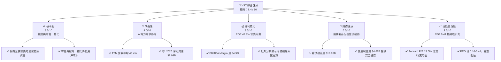
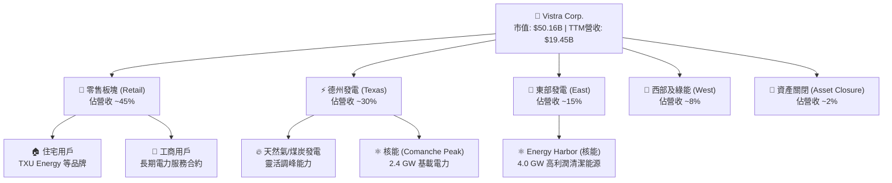
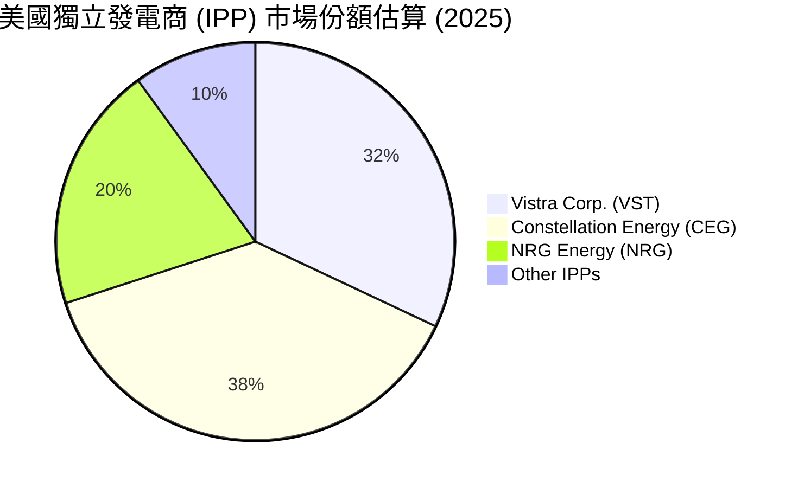
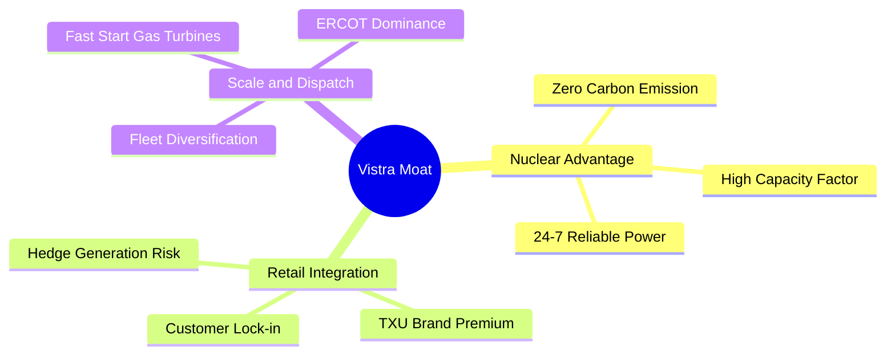

# VST 基本面深度分析報告

> **報告日期**：2026-06-07 ｜ **語言**：繁體中文 ｜ **數據來源**：Yahoo Finance, Finviz, StockAnalysis, Roic.ai ｜ **分析師**：CFA 級機構研究

---

## 目錄

| # | 章節 | 核心結論 |
|---|---|---|
| **1** | **執行摘要** | 評級：🟢 **強烈買入**；目標價：**$225.29**（潛在漲幅 +51.4%），AI 電力需求與核能資產重估。 |
| **2** | **公司概覽與商業模式** | 獨立發電廠（IPP）龍頭，透過收購 Energy Harbor 構建全美最大核能與零售一體化護城河。 |
| **3** | **損益表深度分析** | TTM 營收達 **$19.45B**（YoY +43.4%），Q1 2026 淨利潤大幅扭虧至 **$1.03B**，盈利爆發期已至。 |
| **4** | **資產負債表分析** | 槓桿率較高（Debt/Equity 355%），但公用事業特性使現金流穩定，短期債務滾動風險可控。 |
| **5** | **現金流量深度分析** | 營運現金流達 **$4.67B**，資本配置聚焦於高回報核能與綠能發電，回購力道強勁。 |
| **6** | **獲利能力與資本效率** | ROE 高達 **42.9%**，ROIC（11.66%）顯著高於 WACC（9.39%），持續創造股東經濟價值（EVA）。 |
| **7** | **估值深度分析** | Forward P/E 僅 **13.58x**，相較同業 Constellation (CEG) 具備明顯折價，DCF 基準目標價 **$220**。 |
| **8** | **成長催化劑** | AI 資料中心全天候電力合約（PPA）溢價，ERCOT 電網容量緊缺推高容量電價。 |
| **9** | **風險矩陣** | 燃料價格波動、德州 ERCOT 監管政策變更、核能電廠營運中斷風險。 |
| **10** | **投資建議** | 建議於 **$140-$150** 區間積極分批佈局，長線持有以迎來 AI 電力紅利。 |

---

## 1. 執行摘要

Vistra Corp. (NYSE: VST) 作為美國最大的獨立發電商與零售電力龍頭，正處於 AI 資料中心電力需求爆發與全美電網去碳化轉型的黃金交匯點。本報告將從基本面、估值模型、財務健康度等維度，深度剖析 VST 的長期投資價值。

### 1.1 核心評分儀表板

### 1.2 評分進度條視覺化

╔══════════════════════════════════════════════════════════════╗
║                VST 多維度評分儀表板 (1-10分)                 ║
╠══════════════════════════════════════════════════════════════╣
║ 基本面強度  8.5 ▓▓▓▓▓▓▓▓▓▓▓▓▓▓▓▓▓░░░  ★★★★☆           ║
║ 成長動能    9.0 ▓▓▓▓▓▓▓▓▓▓▓▓▓▓▓▓▓▓░░  ★★★★★           ║
║ 獲利品質    8.5 ▓▓▓▓▓▓▓▓▓▓▓▓▓▓▓▓▓░░░  ★★★★☆           ║
║ 財務健康    6.5 ▓▓▓▓▓▓▓▓▓▓▓▓▓░░░░░░░  ★★★☆☆           ║
║ 估值合理性  9.5 ▓▓▓▓▓▓▓▓▓▓▓▓▓▓▓▓▓▓▓░  ★★★★★           ║
║ 護城河深度  8.0 ▓▓▓▓▓▓▓▓▓▓▓▓▓▓▓▓░░░░  ★★★★☆           ║
║ 管理層執行  8.5 ▓▓▓▓▓▓▓▓▓▓▓▓▓▓▓▓▓░░░  ★★★★☆           ║
║ 技術創新力  8.0 ▓▓▓▓▓▓▓▓▓▓▓▓▓▓▓▓░░░░  ★★★★☆           ║
╠══════════════════════════════════════════════════════════════╣
║ 綜合總分    8.4 ▓▓▓▓▓▓▓▓▓▓▓▓▓▓▓▓░░░░  🏆 優秀 (Strong Buy) ║
╚══════════════════════════════════════════════════════════════╝

### 1.3 投資論點與核心風險

| 類型 | 項目 | 具體依據 | 信心度 |
|------|------|----------|--------|
| 🟢 **投資論點①** | **AI 資料中心電力溢價** | 亞馬遜、微軟等科技巨頭正以極高溢價簽署全天候核能 PPA。VST 旗下 6.4 GW 核能資產（含 Comanche Peak 與 Energy Harbor）將直接受益。 | 🟢 極高 |
| 🟢 **投資論點②** | **ERCOT 電網供需失衡** | 德州經濟成長與 AI 資料中心湧入，使 ERCOT 電網容量持續吃緊。作為德州最大發電商，VST 邊際定價權顯著提升。 | 🟢 極高 |
| 🟢 **投資論點③** | **極致估值折價** | VST 的 Forward P/E 僅 13.58x，相較於同為核能概念股的 Constellation Energy (CEG) 的 28-30x，折價幅度高達 50% 以上。 | 🟢 高 |
| 🟡 **風險①** | **高槓桿與利率風險** | 總債務高達 $19.93B，Debt/Equity 達 355.19%。若高利率環境維持更久，再融資成本將侵蝕利潤。 | 🟡 中度 |
| 🔴 **風險②** | **ERCOT 監管政策變更** | 德州立法機構與監管機構可能對電網市場機制進行干預，限制極端天氣下的批發電價上限。 | 🔴 高衝擊 |

### 1.4 快速統計卡片

| 指標 | VST 實際值 | 行業均值 (Utilities) | S&P 500 均值 | 狀態 |
|------|-------------|----------|--------------|------|
| **收入 TTM 成長** | **43.4%** | ~4.5% | ~6.5% | 🟢 卓越 |
| **毛利率** | **38.6%** | ~35.0% | ~40.0% | 🟢 優秀 |
| **淨利率** | **11.5%** | ~10.5% | ~11.8% | 🟡 符合預期 |
| **ROE** | **42.9%** | ~11.2% | ~15.0% | 🟢 卓越 |
| **Forward P/E** | **13.58x** | ~17.5x | ~21.5x | 🟢 極具吸引力 |
| **PEG Ratio** | **0.44** | ~1.85 | ~1.20 | 🟢 嚴重低估 |

### 1.5 投資結論

╔══════════════════════════════════════════════════════════════════╗
║                    📊 投資結論摘要                               ║
╠══════════════════════════════════════════════════════════════════╣
║  評級：🟢 強烈買入 (Strong Buy)                                 ║
║  當前股價：$148.76 (2026-06-07)                                  ║
║  目標價區間：                                                    ║
║    悲觀情境：$115.00 (-22.7%)                                    ║
║    基準情境：$220.00 (+47.9%)  ← 12個月主要目標                  ║
║    樂觀情境：$295.00 (+98.3%)                                    ║
║  投資評分：8.4 / 10                                              ║
║  適合投資人：成長型、AI 主題長線持有者、價值重估尋找者            ║
╚══════════════════════════════════════════════════════════════════╝

---

## 2. 公司概覽與商業模式

Vistra Corp. (VST) 是一家垂直整合的零售電力與發電公司。與傳統受監管的公用事業公司（Regulated Utilities）不同，VST 主要在競爭性市場（如德州 ERCOT、東北部 PJM、加州 CAISO）中營運，這使其能夠自由將電力出售給批發市場或直接透過零售合約鎖定高利潤。

### 2.1 業務結構與收入來源

### 2.2 市場份額（競爭性電力市場發電量估算）

### 2.3 競爭護城河分析

### 2.4 護城河強度評分

╔══════════════════════════════════════════════════════════════╗
║                    Vistra 護城河強度評分                     ║
╠══════════════════════════════════════════════════════════════╣
║ 核能基載優勢    9.0/10 ▓▓▓▓▓▓▓▓▓▓▓▓▓▓▓▓▓▓░░  🏆 極難複製   ║
║ 零售品牌鎖定    8.0/10 ▓▓▓▓▓▓▓▓▓▓▓▓▓▓▓▓░░░░  🟢 高客戶黏性 ║
║ 德州電網支配力  8.5/10 ▓▓▓▓▓▓▓▓▓▓▓▓▓▓▓▓▓░░░  🟢 邊際定價權 ║
║ 燃料採購與對沖  7.5/10 ▓▓▓▓▓▓▓▓▓▓▓▓▓░░░░░░░  🟡 降低波動性 ║
╠══════════════════════════════════════════════════════════════╣
║ 綜合護城河      8.2/10 ▓▓▓▓▓▓▓▓▓▓▓▓▓▓▓▓░░░░  🏆 寬廣護城河 ║
╚══════════════════════════════════════════════════════════════╝

---

## 3. 損益表深度分析

VST 的損益表近年展現出極強的成長爆發力，主因是併購 Energy Harbor 的財務併表，以及批發電價上漲與零售端轉嫁能力的提升。

### 3.1 年度收入成長趨勢（FY2022 - TTM）

╔══════════════════════════════════════════════════════════════════╗
║                  VST 年度收入趨勢 (FY2022 - TTM)                 ║
╠══════════════════════════════════════════════════════════════════╣
║                                                                  ║
║  FY2022  $13.73B  ██████████████░░░░░░░░░░░░░░  YoY: +13.7% 🟢   ║
║  FY2023  $14.78B  ███████████████░░░░░░░░░░░░░  YoY: +7.7%  🟢   ║
║  FY2024  $17.22B  ██████████████████░░░░░░░░░░  YoY: +16.5% 🟢   ║
║  FY2025  $17.74B  ██═════════════════░░░░░░░░░  YoY: +3.0%  🟡   ║
║  TTM     $19.45B  ██████████████████████████  YoY: +43.4% 🟢   ║
║                                                                  ║
║  📊 4年累計 CAGR：+11.1%                                         ║
╚══════════════════════════════════════════════════════════════════╝

### 3.2 季度收入趨勢分析

| 季度 | 營收 (Revenue) | YoY 成長率 | QoQ 成長率 | 核心驅動因素 | 評估 |
|------|----------------|------------|------------|--------------|------|
| **Q1 2026** | **$5.64B** | **+43.40%** | **+23.14%** | 德州極寒天氣推高電價，核能併網貢獻。 | 🟢 極強 |
| **Q4 2025** | **$4.58B** | **+13.55%** | **-7.85%** | 季節性用電淡季，但零售簽約價上調。 | 🟢 穩定 |
| **Q3 2025** | **$4.97B** | **-20.95%** | **+16.94%** | 上年同期基期極高（2024夏季極端高溫）。| 🟡 符合預期 |
| **Q2 2025** | **$4.25B** | **+10.53%** | **+8.06%** | 氣溫偏高帶動批發用電需求增加。 | 🟢 良好 |

### 3.3 利潤率演變分析

| 利潤率指標 | FY2022 | FY2023 | FY2024 | FY2025 | TTM | 趨勢 | 評估 |
|------------|--------|--------|--------|--------|-----|------|------|
| **毛利率** | 3.59% | 28.50% | 34.39% | 23.23% | **29.32%** | ↗️ 探底回升 | 🟢 改善 |
| **營業利益率**| -8.57% | 18.01% | 23.69% | 10.75% | **18.13%** | ↗️ 大幅改善 | 🟢 強勁 |
| **EBITDA Margin**| 7.65% | 30.92% | 40.41% | 28.47% | **34.90%** | ↗️ 結構性提升| 🟢 優秀 |
| **淨利率** | -8.81% | 10.10% | 16.33% | 5.3