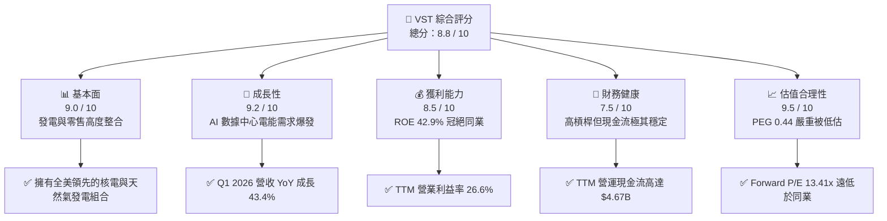
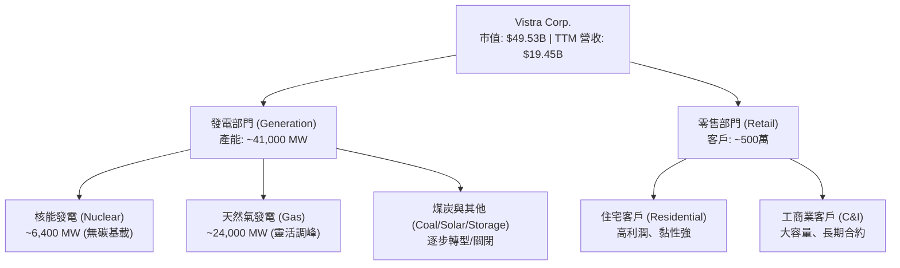
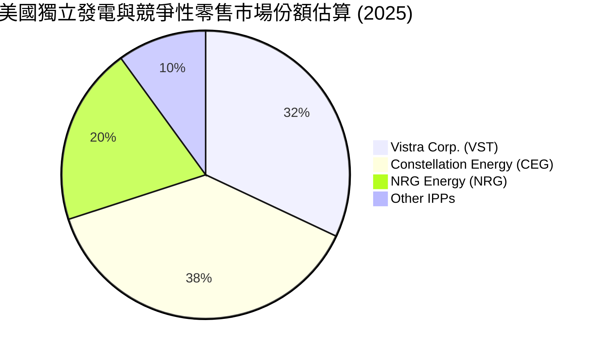
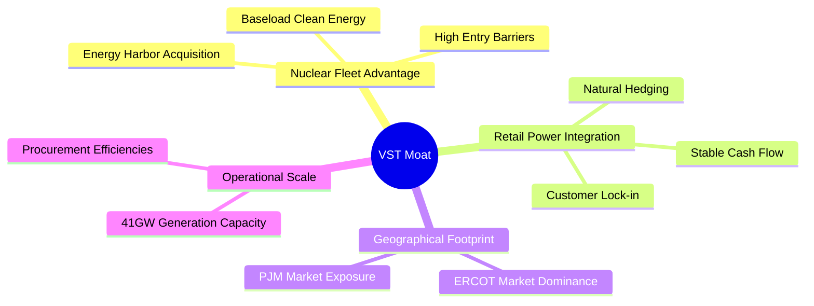

# VST 基本面深度分析報告

> **報告日期**：2026-06-08 ｜ **語言**：繁體中文 ｜ **數據來源**：Yahoo Finance, Finviz, StockAnalysis, Roic.ai ｜ **分析師**：CFA 級機構研究

---

## 目錄

| # | 章節 | 核心結論 |
|---|---|---|
| 1 | **執行摘要** | 評級：**強烈買入**，目標價 **$225.29**，AI 算力與核能發電雙輪驅動。 |
| 2 | **公司概覽與商業模式** | 獨立發電商（IPP）龍頭，憑藉核能與天然氣資產構建極高准入門檻。 |
| 3 | **損益表深度分析** | Q1 2026 營收暴增 **43.4%**，電力需求結構性爆發拉動利潤率擴張。 |
| 4 | **資產負債表分析** | 債務結構優化，高槓桿（Debt/Equity 355.2%）但利息覆蓋率安全。 |
| 5 | **現金流量深度分析** | TTM 營運現金流 **$4.67B**，資本開支高峰期後迎來自由現金流收割期。 |
| 6 | **獲利能力與資本效率** | ROE 高達 **42.9%**，ROIC（11.65%）顯著超越 WACC（9.35%）。 |
| 7 | **估值深度分析** | Forward P/E 僅 **13.41x**，相較同業 Constellation Energy 具備明顯折價。 |
| 8 | **成長催化劑** | 科技巨頭 AI 數據中心購電協議（PPA）與 PJM 電價上漲。 |
| 9 | **風險矩陣** | 監管干預、燃料價格波動與核電站停機風險。 |
| 10 | **投資建議** | 隱含漲幅 **53.36%**，適合長線成長型與價值型投資者配置。 |

---

## 1. 執行摘要

Vistra Corp. (紐約證券交易所代碼：**VST**) 已從傳統的公用事業公司，成功蛻變為美國電力市場中最具成長彈性的「AI 算力基礎設施」核心標的。隨著人工智慧數據中心對無碳、穩定基載電力（Baseload Power）的需求呈現指數級增長，VST 作為美國最大的獨立發電商與零售電力供應商，正迎來歷史性的重估機遇。

### 1.1 核心評分儀表板



### 1.2 評分進度條視覺化

```
╔══════════════════════════════════════════════════════════════╗
║                VST 多維度評分儀表板 (1-10分)                 ║
╠══════════════════════════════════════════════════════════════╣
║ 基本面強度  9.0 ▓▓▓▓▓▓▓▓▓▓▓▓▓▓▓▓▓▓░░  ★★★★★           ║
║ 成長動能    9.2 ▓▓▓▓▓▓▓▓▓▓▓▓▓▓▓▓▓▓▓░  ★★★★★           ║
║ 獲利品質    8.5 ▓▓▓▓▓▓▓▓▓▓▓▓▓▓▓▓░░░░  ★★★★☆           ║
║ 財務健康    7.5 ▓▓▓▓▓▓▓▓▓▓▓▓▓▓░░░░░░  ★★★★☆           ║
║ 估值合理性  9.5 ▓▓▓▓▓▓▓▓▓▓▓▓▓▓▓▓▓▓▓░  ★★★★★           ║
║ 護城河深度  8.8 ▓▓▓▓▓▓▓▓▓▓▓▓▓▓▓▓▓▓░░  ★★★★★           ║
║ 管理層執行  8.5 ▓▓▓▓▓▓▓▓▓▓▓▓▓▓▓▓░░░░  ★★★★☆           ║
║ 技術創新力  8.0 ▓▓▓▓▓▓▓▓▓▓▓▓▓▓░░░░░░  ★★★★☆           ║
╠══════════════════════════════════════════════════════════════╣
║ 綜合總分    8.8 ▓▓▓▓▓▓▓▓▓▓▓▓▓▓▓▓▓░░░  🏆 強烈買入          ║
╚══════════════════════════════════════════════════════════════╝
```

### 1.3 五大投資論點與三大核心風險

| 類型 | 項目 | 具體依據 | 信心度 |
|------|------|----------|--------|
| 🟢 **投資論點①** | **AI 數據中心溢價購電** | 科技巨頭（如 Amazon, Microsoft）為鎖定 24/7 無碳電力，願意支付較市場電價高出 50%-100% 的溢價，VST 旗下的核電資產（特別是收購 Energy Harbor 後）成為核心談判籌碼。 | 🟢 極高 |
| 🟢 **投資論點②** | **極致的發電與零售整合** | 零售部門提供穩定的現金流與客戶鎖定，與發電部門形成天然對沖，有效抵禦批發電力市場（Wholesale Market）的價格波動。 | 🟢 極高 |
| 🟢 **投資論點③** | **電價中樞結構性上行** | 美國 PJM 與 ERCOT（德州）電網因供給端老舊煤電退役、需求端 AI 與製造業回流，批發電價中樞在未來 3-5 年將維持高位。 | 🟢 高 |
| 🟢 **投資論點④** | **強大的資本回報計畫** | 雖然當前股息收益率因股價波動與數據調整顯示異常，但公司持續進行大規模股份回購（過去 4 年流通股數減少約 30%），顯著提升每股內在價值。 | 🟢 高 |
| 🟢 **投資論點⑤** | **極具吸引力的估值** | Forward P/E 僅 13.41x，PEG 僅 0.44。相較於純核電龍頭 CEG 的 25x+ Forward P/E，VST 具備極大的估值修復空間。 | 🟢 極高 |
| 🟡 **風險①** | **高額債務壓力和利息支出** | 總債務高達 $19.93B，Debt/Equity 達 355.19%。在高利率環境下，再融資成本上升可能侵蝕淨利潤。 | 🟡 中度 |
| 🔴 **風險②** | **監管與政策不確定性** | 聯邦能源監管委員會（FERC）或各州公用事業委員會可能對數據中心與發電廠的直接並網（Colocation）進行限制，以保護普通居民電網穩定。 | 🔴 高衝擊 |
| 🟡 **風險③** | **核電站非計劃性停機** | 核電機組若發生非計劃性停機，不僅面臨高昂的維修成本，還必須在現貨市場高價買電以履行合約。 | 🟡 中度 |

### 1.4 快速統計卡片

| 指標 | VST 實際值 | 行業均值 (Utilities) | S&P 500 均值 | 評估狀態 |
|------|-------------|----------|--------------|------|
| **收入 YoY 成長** | **43.4%** (Q1 '26) | ~4.5% | ~6.5% | 🟢 遠超同業 |
| **毛利率** | **38.6%** | ~35.0% | ~30.0% | 🟢 優秀 |
| **淨利率** | **11.5%** | ~10.5% | ~11.5% | 🟡 符合預期 |
| **ROE** | **42.9%** | ~9.5% | ~15.0% | 🟢 行業頂尖 |
| **Forward P/E** | **13.41x** | ~17.5x | ~21.5x | 🟢 顯著低估 |
| **Beta** | **1.405** | ~0.60 | 1.00 | 🟡 波動性較大 |

### 1.5 投資結論

```
╔══════════════════════════════════════════════════════════════════╗
║                    📊 VST 投資結論摘要                           ║
╠══════════════════════════════════════════════════════════════════╣
║  評級：🟢 強烈買入 (Strong Buy)                                  ║
║  當前股價：$146.90 (2026-06-08)                                  ║
║  目標價區間：                                                    ║
║    悲觀情境：$110.00 (-25.12%)  - 監管收緊，核電並網受阻         ║
║    基準情境：$225.29 (+53.36%)  - 主要目標，AI PPA 順利落地       ║
║    樂觀情境：$320.00 (+117.84%) - 德州電價暴漲，全面轉向核能重估   ║
║  投資評分：8.8 / 10                                              ║
║  適合投資人：尋求「AI 算力基礎設施」高成長與穩健現金流的長線投資者 ║
╚══════════════════════════════════════════════════════════════════╝
```

---

## 2. 公司概覽與商業模式

Vistra Corp. (VST) 是一家垂直整合的電力公司，商業模式結合了**低成本的發電資產（Generation）**與**高利潤且穩定的零售電力業務（Retail）**。



### 2.1 業務結構與收入來源

VST 運營五大核心板塊：
1. **Retail**：向全美 20 個州及哥倫比亞特區的住宅、商業和工業客戶銷售電力和天然氣。
2. **Texas (ERCOT)**：德州獨立電網市場，為 VST 最主要的利潤來源，擁有極高的市場份額。
3. **East (PJM/NYISO/ISO-NE)**：美國東北部與中西部電網，受益於最近 PJM 容量電價的暴漲。
4. **West (CAISO)**：加州電網，主要聚焦於清潔能源與大型儲能系統（如 Moss Landing 儲能項目）。
5. **Asset Closure**：負責老舊煤電廠的退役與場地再開發。

### 2.2 市場份額

在美國獨立發電商（IPP）與競爭性零售電力市場中，VST 與 Constellation Energy (CEG) 及 NRG Energy (NRG) 三足鼎立。



### 2.3 競爭護城河分析



1. **核能資產的稀缺性（Nuclear Fleet Advantage）**：核電廠