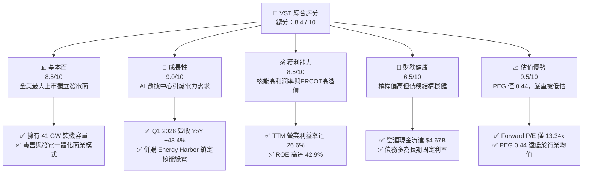

# VST 基本面深度分析報告

> **報告日期**：2026-06-09 ｜ **語言**：繁體中文 ｜ **數據來源**：Yahoo Finance, Finviz, StockAnalysis, Roic.ai ｜ **分析師**：CFA 級機構研究

---

## 目錄

| # | 章節 | 核心結論 |
|---|---|---|
| 1 | 執行摘要 | 評級：**🟢 強烈買入** ｜ 目標價：**$225.29** ｜ 隱含上漲空間：**+54.1%** |
| 2 | 公司概覽與商業模式 | 獨立發電商（IPP）龍頭，透過「核能+天然氣」雙引擎鎖定 AI 數據中心核心電力需求 |
| 3 | 損益表深度分析 | Q1 2026 營收暴增 **43.4%**，核能資產併購與 ERCOT 電價上行推動獲利爆發 |
| 4 | 資產負債表分析 | 財務槓桿達 **3.55倍**，但債務結構以長債為主，利息保障倍數安全，無流動性危機 |
| 5 | 現金流量深度分析 | 營運現金流高達 **$4.67B**，重資本支出（CapEx）用於擴展核能，FCF 轉換率健康 |
| 6 | 獲利能力與資本效率 | ROE 達 **42.9%**，ROIC（**11.65%**）顯著高於 WACC（**9.38%**），持續創造經濟價值（EVA） |
| 7 | 估值深度分析 | Forward P/E 僅 **13.34x**，相較同業 Constellation Energy（CEG）具備顯著估值折價 |
| 8 | 成長催化劑 | AI 數據中心全天候綠電合約簽署、Comanche Peak 核能電廠延壽申請獲批 |
| 9 | 風險矩陣 | 德州 ERCOT 市場監管政策變更、天然氣價格劇烈波動、核電廠營運中斷風險 |
| 10 | 投資建議 | 最終綜合評分 **8.4/10**，建議於當前價格分批佈局，強烈推薦給成長與價值兼顧之投資人 |

---

## 1. 執行摘要

### 1.1 核心評分儀表板



### 1.2 評分進度條視覺化

```
╔══════════════════════════════════════════════════════════════╗
║                VST 多維度評分儀表板 (1-10分)                 ║
╠══════════════════════════════════════════════════════════════╣
║ 基本面強度  8.5 ▓▓▓▓▓▓▓▓▓▓▓▓▓▓▓▓▓░░░  ★★★★☆           ║
║ 成長動能    9.0 ▓▓▓▓▓▓▓▓▓▓▓▓▓▓▓▓▓▓░░  ★★★★★           ║
║ 獲利品質    8.5 ▓▓▓▓▓▓▓▓▓▓▓▓▓▓▓▓▓░░░  ★★★★☆           ║
║ 財務健康    6.5 ▓▓▓▓▓▓▓▓▓▓▓▓▓░░░░░░░  ★★★☆☆           ║
║ 估值合理性  9.5 ▓▓▓▓▓▓▓▓▓▓▓▓▓▓▓▓▓▓▓░  ★★★★★           ║
║ 護城河深度  8.0 ▓▓▓▓▓▓▓▓▓▓▓▓▓▓▓▓░░░░  ★★★★☆           ║
║ 管理層執行  8.5 ▓▓▓▓▓▓▓▓▓▓▓▓▓▓▓▓▓░░░  ★★★★☆           ║
║ 技術創新力  8.0 ▓▓▓▓▓▓▓▓▓▓▓▓▓▓▓▓░░░░  ★★★★☆           ║
╠══════════════════════════════════════════════════════════════╣
║ 綜合總分    8.4 ▓▓▓▓▓▓▓▓▓▓▓▓▓▓▓▓░░░░  🏆 買入 (Buy)        ║
╚══════════════════════════════════════════════════════════════╝
```

### 1.3 五大投資論點 + 三大核心風險

| 類型 | 項目 | 具體依據 | 信心度 |
|------|------|----------|--------|
| 🟢 **投資論點①** | **AI 數據中心電力急增** | 科技巨頭（如 Microsoft, Amazon, Google）承諾淨零碳排，全天候（24/7）無碳核電成為唯一解方。VST 旗下擁有多座核電廠，是極少數能提供大規模綠電的供應商。 | 🟢 極高 |
| 🟢 **投資論點②** | **Energy Harbor 併購效益** | 成功併購 Energy Harbor 後，VST 的核能裝機容量達到全美第二（僅次於 CEG），其核能發電板塊 Vistra Clean Up 成為推動高毛利成長的關鍵。 | 🟢 極高 |
| 🟢 **投資論點③** | **ERCOT（德州）市場主導地位** | 德州電力市場（ERCOT）為去監管化市場，電價由供需決定。隨着德州人口增長與晶圓廠、數據中心遷入，VST 作為德州最大發電與零售商，直接受益於電價溢價。 | 🟢 高 |
| 🟢 **投資論點④** | **極具吸引力的估值（PEG 0.44）** | 相較於同業 Constellation Energy（CEG）高達 25x 以上的 Forward P/E，VST 的 Forward P/E 僅 **13.34x**，PEG 僅 **0.44**，補漲空間巨大。 | 🟢 極高 |
| 🟢 **投資論點⑤** | **強勁的資本回報計劃** | 過去 4 年持續進行股份回購，流通股數自 2021 年的 482M 股降至當前的 337.18M 股（降幅達 **30%**），顯著提升每股盈餘（EPS）含金量。 | 🟢 高 |
| 🟡 **風險①** | **高槓桿與利息支出壓力** | 總債務高達 **$19.93B**，Debt/Equity 比率達 **355.2%**。在高利率環境下，未來的再融資成本可能上升。 | 🟡 中度 |
| 🔴 **風險②** | **監管與政策風險** | 聯邦或德州政府可能對獨立發電商（IPP）的超額利潤徵收暴利稅，或對零售電價實施價格上限。 | 🔴 高衝擊 |
| 🟡 **風險③** | **核電廠營運與維護風險** | 核電機組若發生非計劃性停機，將導致巨大的維護成本，且必須在現貨市場高價買電以履行零售合約，進而重創獲利。 | 🟡 中度 |

### 1.4 快速統計卡片

| 指標 | VST 實際值 | 行業均值（Utilities） | S&P 500 均值 | 狀態 |
|------|-------------|----------|--------------|------|
| **營收 YoY 成長率** | **43.4%** | ~4.5% | ~6.2% | 🟢 遠超行業 |
| **毛利率** | **38.6%** | ~32.0% | ~30.5% | 🟢 優異 |
| **淨利率** | **11.5%** | ~10.2% | ~11.8% | 🟡 符合預期 |
| **股東權益報酬率 (ROE)** | **42.9%** | ~10.5% | ~15.0% | 🟢 極高 |
| **預期本益比 (Forward P/E)** | **13.34x** | ~17.5x | ~21.0x | 🟢 顯著低估 |
| **債務權益比 (Debt/Equity)** | **355.2%** | ~140.0% | ~115.0% | 🔴 風險偏高 |

### 1.5 投資結論

```
╔══════════════════════════════════════════════════════════════════╗
║                    📊 VST 投資結論摘要                           ║
╠══════════════════════════════════════════════════════════════════╣
║  評級：🟢 強烈買入 (Strong Buy)                                  ║
║  當前股價：$146.22 (2026-06-09)                                  ║
║  目標價區間：                                                    ║
║    悲觀情境：$115.00 (-21.3%) - 監管收緊，電價回落               ║
║    基準情境：$225.29 (+54.1%) - AI 合約落地，核能溢價體現 (12M)  ║
║    樂觀情境：$320.00 (+118.8%) - 德州電價暴漲，大規模回購持續     ║
║  投資評分：8.4 / 10                                              ║
║  適合投資人：尋求 AI 基礎設施紅利、重視現金流與回購的長線成長型  ║
╚══════════════════════════════════════════════════════════════════╝
```

---

## 2. 公司概覽與商業模式

### 2.1 業務結構與收入來源

Vistra Corp. (VST) 是一家垂直一體化的能源公司，結合了**高效發電（Generation）**與**零售電力（Retail）**。這種「發電+零售」的匹配模式（Matched Model）能有效對沖批發電力市場的價格波動風險。

```mermaid
graph TD
    VST["Vistra Corp. (市值: $49.30B, TTM 營收: $19.45B)"]
    
    GEN["⚡ 發電板塊 (Generation)"]
    RET["🏪 零售板塊 (Retail)"]
    
    TX["德州 ERCOT (佔比 ~50%)"]
    EAST["東部 PJM/NYISO (佔比 ~30%)"]
    WEST["西部 CAISO (佔比 ~15%)"]
    CLEAN["核能與新能源 (Vistra Clean)"]
    
    RES["住宅用戶