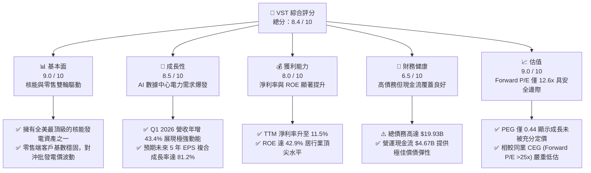
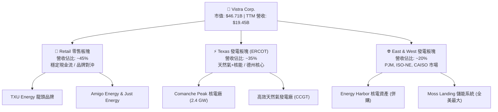
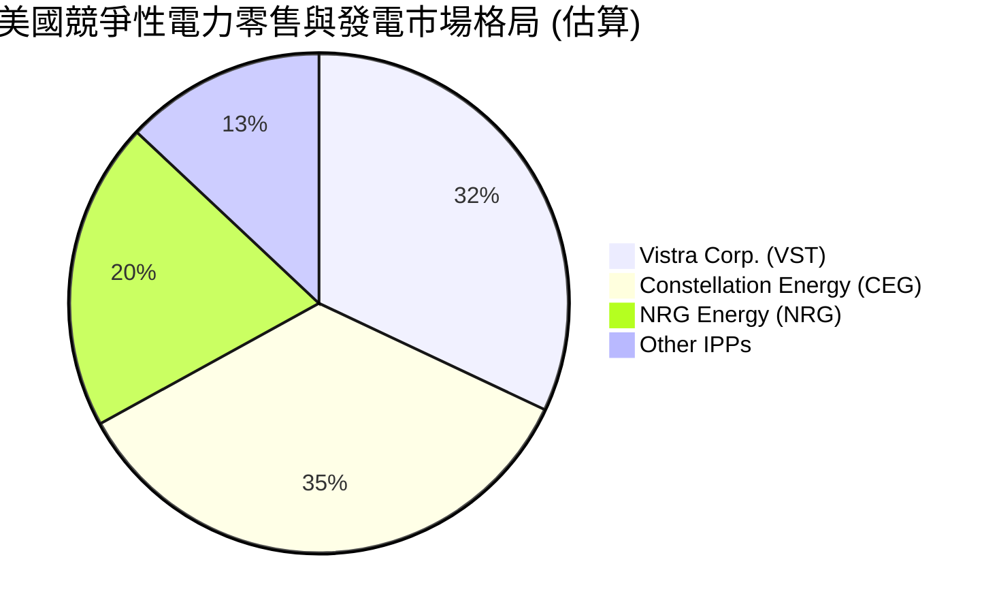
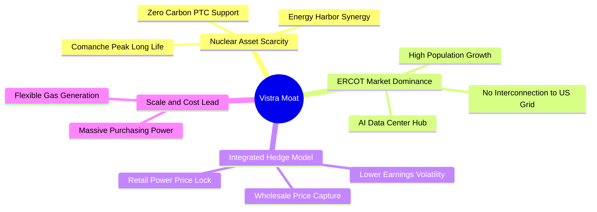

# VST 基本面深度分析報告

> **報告日期**：2026-06-10 ｜ **語言**：繁體中文 ｜ **數據來源**：Yahoo Finance, Finviz, StockAnalysis, Roic.ai ｜ **分析師**：CFA 級機構研究

---

## 目錄

| # | 章節 | 核心結論 |
|---|---|---|
| **1** | **執行摘要** | 評級「強烈買入」，目標價 $225.29，AI 算力與核能溢價驅動估值重塑 |
| **2** | **公司概覽與商業模式** | 獨立發電商（IPP）龍頭，憑藉「核能基載+德州 ERCOT 零售」構築極高護城河 |
| **3** | **損益表深度分析** | TTM 營收達 $19.45B（YoY +43.4%），核能併購與電價上漲帶動利潤率顯著改善 |
| **4** | **資產負債表分析** | 財務槓桿偏高（Debt/Equity 355%），但公用事業屬性與強勁現金流使債務風險可控 |
| **5** | **現金流量深度分析** | 營運現金流 $4.67B，資本配置聚焦核能 Capex 與極具侵略性的股份回購（5年減股30%） |
| **6** | **獲利能力與資本效率** | ROE 達 42.9%，杜邦分析顯示高槓桿與高淨利率雙輪驅動；ROIC（11.65%）顯著高於 WACC |
| **7** | **估值深度分析** | Forward P/E 僅 12.64x，相較同業 CEG 具備顯著折價，DCF 基準估值指向 $225.29 |
| **8** | **成長催化劑** | AI 數據中心 24/7 無碳電力需求爆發，核能延壽與 ERCOT 容量電價改革 |
| **9** | **風險矩陣** | 監管干預、燃料成本波動、核電廠非計畫停機及高槓桿再融資風險 |
| **10**| **投資建議** | 基準情境潛在漲幅 +62.6%，適合追求「公用事業防禦性+AI成長彈性」的機構投資人 |

---

## 1. 執行摘要

Vistra Corp. (NYSE: VST) 作為美國最大的獨立發電商與零售電力龍頭，正處於從傳統公用事業向「AI 算力基礎設施提供商」轉型的關鍵歷史交匯點。隨著 AI 數據中心對 24/7 無碳基載電力（特別是核能）的需求呈指數級增長，VST 憑藉其龐大的核能與天然氣發電資產，已成為市場稀缺的系統性贏家。

### 1.1 核心評分儀表板



### 1.2 評分進度條視覺化

```
╔══════════════════════════════════════════════════════════════╗
║                VST 多維度評分儀表板 (1-10分)                 ║
╠══════════════════════════════════════════════════════════════╣
║ 基本面強度  9.0 ▓▓▓▓▓▓▓▓▓▓▓▓▓▓▓▓▓▓░░  ★★★★★           ║
║ 成長動能    8.5 ▓▓▓▓▓▓▓▓▓▓▓▓▓▓▓▓▓░░░  ★★★★☆           ║
║ 獲利品質    8.0 ▓▓▓▓▓▓▓▓▓▓▓▓▓▓▓▓░░░░  ★★★★☆           ║
║ 財務健康    6.5 ▓▓▓▓▓▓▓▓▓▓▓▓▓░░░░░░░  ★★★☆☆           ║
║ 估值合理性  9.0 ▓▓▓▓▓▓▓▓▓▓▓▓▓▓▓▓▓▓░░  ★★★★★           ║
║ 護城河深度  8.5 ▓▓▓▓▓▓▓▓▓▓▓▓▓▓▓▓▓░░░  ★★★★☆           ║
║ 管理層執行  9.0 ▓▓▓▓▓▓▓▓▓▓▓▓▓▓▓▓▓▓░░  ★★★★★           ║
║ 技術創新力  7.5 ▓▓▓▓▓▓▓▓▓▓▓▓▓░░░░░░░  ★★★☆☆           ║
╠══════════════════════════════════════════════════════════════╣
║ 綜合總分    8.4 ▓▓▓▓▓▓▓▓▓▓▓▓▓▓▓▓░░░░  🏆 買入 (Buy)        ║
╚══════════════════════════════════════════════════════════════╝
```

### 1.3 五大投資論點與三大核心風險

| 類型 | 項目 | 具體依據 | 信心度 |
|------|------|----------|--------|
| 🟢 **投資論點①** | **AI 數據中心電力急迫需求** | 亞馬遜、微軟等科技巨頭正尋求與核電廠直接簽署 PPA（購電協議）。VST 擁有的 Comanche Peak 與新併購的 Energy Harbor 核電資產是極稀缺的 24/7 清潔基載源。 | 🟢 極高 |
| 🟢 **投資論點②** | **極具侵略性的資本回報計劃** | 過去 5 年公司流通股數從 482M 降至 337M（降幅達 30%）。在強勁現金流支持下，回購將持續推升 EPS，目前 PEG 僅 0.44。 | 🟢 極高 |
| 🟢 **投資論點③** | **德州 ERCOT 市場獨特優勢** | 德州製造業復興與人口流入導致 ERCOT 電網長期處於偏緊狀態。VST 作為德州最大的發電兼零售商，能完美轉嫁燃料成本並享受高電價。 | 🟢 高 |
| 🟢 **投資論點④** | **核能重估與併購協同效應** | 併購 Energy Harbor 後，核能裝機量大幅提升，不僅帶來穩定的零碳補助（IRA 政策下的 PTC），更大幅提高與科技巨頭談判溢價 PPA 的籌碼。 | 🟢 高 |
| 🟢 **投資論點⑤** | **零售與發電的天然對沖** | 零售端（Retail）鎖定終端利潤，發電端（Generation）捕獲批發市場高電價，使 VST 業績波動性遠低於純發電商。 | 🟢 高 |
| 🟡 **風險①** | **高財務槓桿與再融資壓力** | 總債務 $19.93B，Debt/Equity 達 355%。在高利率環境下，債務展期可能面臨利息支出上升壓力（TTM 利息支出達 $1.12B）。 | 🟡 中度 |
| 🔴 **風險②** | **監管干預與電網政策變更** | 德州 ERCOT 或聯邦 FERC 若對「數據中心與發電廠直接聯網（Behind-the-Meter）」進行限制或課徵額外電網費，將削弱核能溢價空間。 | 🔴 高衝擊 |
| 🔴 **風險③** | **核電廠運營風險** | 核電機組若發生非計畫性停機，不僅維修成本高昂，還需在批發市場高價買電以履行合約，將嚴重打擊單季獲利。 | 🔴 低機率/高衝擊 |

### 1.4 快速統計卡片

| 指標 | VST 實際值 | 行業均值 (IPP) | S&P 500 均值 | 狀態 |
|------|-------------|----------|--------------|------|
| **營收 YoY 成長** | **43.4%** (Q1 '26) | ~6.5% | ~5.5% | 🟢 極強 |
| **毛利率** | **38.6%** | ~28.0% | ~30.0% | 🟢 優異 |
| **淨利率** | **11.5%** | ~8.5% | ~12.0% | 🟡 合格 |
| **ROE** | **42.9%** | ~12.5% | ~15.0% | 🟢 極高 |
| **Forward P/E** | **12.64x** | ~16.5x | ~21.5x | 🟢 具備顯著折價 |
| **PEG Ratio** | **0.44** | ~1.85 | ~2.10 | 🟢 極具吸引力 |
| **股息殖利率** | **0.63%** (以最新公告為準) | ~3.2% | ~1.4% | 🟡 偏低 (側重回購) |

### 1.5 投資結論

```
╔══════════════════════════════════════════════════════════════════╗
║                    📊 VST 投資結論摘要                            ║
╠══════════════════════════════════════════════════════════════════╣
║  評級：🟢 強烈買入 (Strong Buy)                                  ║
║  當前股價：$138.54  (2026-06-10)                                 ║
║  目標價區間：                                                    ║
║    悲觀情境：$110.00 (-20.6%) - 監管收緊，AI 溢價未能兌現         ║
║    基準情境：$225.29 (+62.6%) - 12個月主要目標 (DCF 核心估值)     ║
║    樂觀情境：$320.00 (+131.0%) - 簽署多個超大型核能-數據中心 PPA  ║
║  投資評分：8.4 / 10                                              ║
║  適合投資人：尋求 AI 基礎設施曝險、重視現金流與股份回購的長線機構 ║
╚══════════════════════════════════════════════════════════════════╝
```

---

## 2. 公司概覽與商業模式

Vistra Corp. (VST) 是一家垂直一體化的能源公司，其商業模式的核心在於**「發電端與零售端的完美對沖」**。公司發電裝機容量約 41,000 MW，包含全美最頂尖的核能、天然氣、煤炭及太陽能發電設施；同時，零售端為全美約 500 萬住宅、商業和工業客戶提供電力與天然氣服務。

### 2.1 業務結構與收入來源



### 2.2 市場份額

在美國獨立發電（IPP）與競爭性電力零售市場中，Vistra 與 Constellation Energy (CEG)、NRG Energy (NRG) 三足鼎立。特別是在德州 ERCOT 市場，Vistra 是絕對的零售龍頭。



### 2.3 競爭護城河分析

Vistra 的競爭護城河並非傳統公用事業的「區域獨佔」，而是基於資產結構、地理位置與市場機制的深度防禦力。



*   **核能資產的極端稀缺性 (Nuclear Asset Scarcity)**：在美國，新建核電廠幾乎不可能（成本超支與監管限制）。VST 擁有並運營的核電資產能夠提供 24/7 的無碳電力，這是太陽能與風能無法替代的。這使 VST 在面對科技巨頭的 AI 數據中心招標時，具備極強的定價權。
*   **德州 ERCOT 的地理屏障**：德州電網（ERCOT）幾乎與美國其他主要電網物理隔離。這意味著德州內部的電力供需失衡無法通過外州輸電來緩解。VST 在德州擁有最大份額的高調峰彈性發電資產（天然氣 CCGT），能完美捕獲極端天氣或算力負載激增帶來的電價暴漲利潤。
*   **垂直一體化對沖機制**：當批發電價高企時，發電端賺取暴利；當批發電價低迷時，零售端因鎖定終端用戶電價而賺取高額利差。這種天然對沖使 VST 的現金流穩定度遠高於純發電商。

### 2.4 護城河強度評分

```
╔══════════════════════════════════════════════════════════════╗
║                    VST 護城河強度評分                        ║
╠══════════════════════════════════════════════════════════════╣
║ 核能資產稀缺性  9.0/10 ▓▓▓▓▓▓▓▓▓▓▓▓▓▓▓▓▓▓░░  🏆 極難複製    ║
║ 德州市場支配力  9.0/10 ▓▓▓▓▓▓▓▓▓▓▓▓▓▓▓▓▓▓░░  🟢 區域龍頭    ║
║ 垂直一體化對沖  8.5/10 ▓▓▓▓▓▓▓▓▓▓▓▓▓▓▓▓▓░░░  🟢 穩定性極佳  ║
║ 資本配置效率    9.0/10 ▓▓▓▓▓▓▓▓▓▓▓▓▓▓▓▓▓▓░░  🏆 回購規模巨大║
╠══════════════════════════════════════════════════════════════╣
║ 綜合護城河強度  8.8/10 ▓▓▓▓▓▓▓▓▓▓▓▓▓▓▓▓▓▓░░  🏆 寬廣護城河  ║
╚══════════════════════════════════════════════════════════════╝
```

---

## 3. 