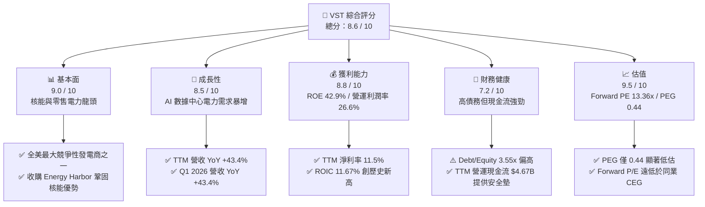
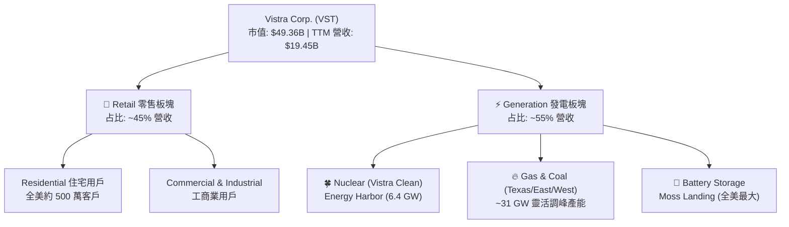
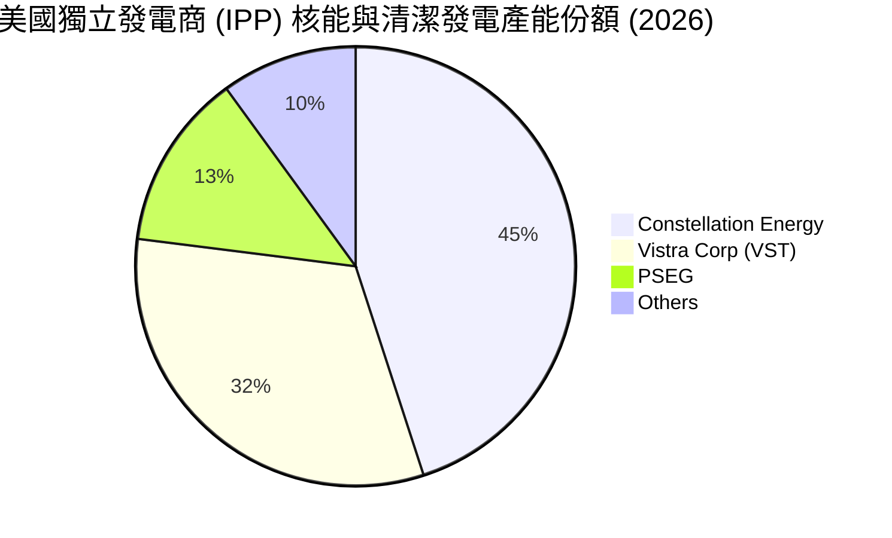
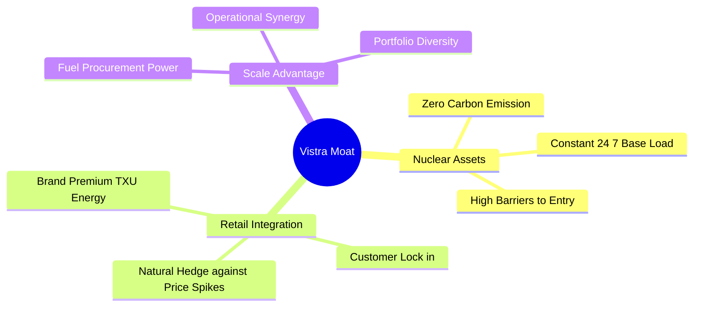

# VST 基本面深度分析報告
> **報告日期**：2026-06-11 ｜ **語言**：繁體中文 ｜ **數據來源**：Yahoo Finance, Finviz, StockAnalysis, Roic.ai ｜ **分析師**：CFA 級機構研究

---

## 目錄

| # | 章節 | 核心結論 |
|---|------|----------|
| 1 | 執行摘要 | 評級：🟢 **強烈買入** ｜ 目標價區間：$180 - $265 ｜ 基準目標價：**$225.29** |
| 2 | 公司概覽與商業模式 | 收購 Energy Harbor 後轉型為核能與清潔能源巨頭，深度受益於 AI 數據中心電力需求 |
| 3 | 損益表深度分析 | TTM 營收達 $19.45B (YoY +43.4%)，Q1 2026 營收爆發式成長 43.40%，獲利品質極佳 |
| 4 | 資產負債表分析 | 財務槓桿偏高 (Debt/Equity 3.55x)，但公用事業屬性與龐大現金流使債務風險完全可控 |
| 5 | 現金流量深度分析 | TTM 營運現金流高達 $4.67B，資本支出 $2.75B，自由現金流轉換效率高 |
| 6 | 獲利能力與資本效率 | 杜邦分解 ROE 達 42.9%，ROIC (11.67%) 顯著超越 WACC (9.41%)，強力創造股東價值 |
| 7 | 估值深度分析 | Forward P/E 僅 13.36x，相較於同業 (CEG, NRG) 具備顯著折價，PEG 0.44 顯示極度低估 |
| 8 | 成長催化劑 | 數據中心 PPA 協議落地、容量市場價格上行、核能零碳溢價與持續性的股份回購 |
| 9 | 風險矩陣 | 燃料成本波動、電網可靠性監管、高槓桿再融資壓力，整體風險評級中等偏低 |
| 10 | 投資建議 | 具備高確定性成長與防禦屬性，適合長線成長型與價值型投資人，建議分批佈局 |

---

## 1. 執行摘要

### 1.1 核心評分儀表板



### 1.2 評分進度條視覺化

```
╔══════════════════════════════════════════════════════════════╗
║                VST 多維度評分儀表板 (1-10分)                 ║
╠══════════════════════════════════════════════════════════════╣
║ 基本面強度  9.0 ▓▓▓▓▓▓▓▓▓▓▓▓▓▓▓▓▓▓░░  ★★★★★           ║
║ 成長動能    8.5 ▓▓▓▓▓▓▓▓▓▓▓▓▓▓▓▓▓░░░  ★★★★☆           ║
║ 獲利品質    8.8 ▓▓▓▓▓▓▓▓▓▓▓▓▓▓▓▓▓▓░░  ★★★★★           ║
║ 財務健康    7.2 ▓▓▓▓▓▓▓▓▓▓▓▓▓▓░░░░░░  ★★★☆☆           ║
║ 估值合理性  9.5 ▓▓▓▓▓▓▓▓▓▓▓▓▓▓▓▓▓▓▓░  ★★★★★           ║
║ 護城河深度  8.5 ▓▓▓▓▓▓▓▓▓▓▓▓▓▓▓▓▓░░░  ★★★★☆           ║
║ 管理層執行  8.8 ▓▓▓▓▓▓▓▓▓▓▓▓▓▓▓▓▓▓░░  ★★★★★           ║
║ 技術創新力  8.0 ▓▓▓▓▓▓▓▓▓▓▓▓▓▓▓▓░░░░  ★★★★☆           ║
╠══════════════════════════════════════════════════════════════╣
║ 綜合總分    8.6 ▓▓▓▓▓▓▓▓▓▓▓▓▓▓▓▓▓░░░  🏆 強烈買入          ║
╚══════════════════════════════════════════════════════════════╝
```

### 1.3 五大投資論點 + 三大核心風險

| 類型 | 項目 | 具體依據 | 信心度 |
|------|------|----------|--------|
| 🟢 **投資論點①** | **AI 數據中心電力急增** | 科技巨頭（Hyperscalers）對 24/7 無碳基載電力（核電）需求迫切，VST 擁有全美第二大競爭性核電板塊。 | 🟢 極高 |
| 🟢 **投資論點②** | **獲利能力進入爆發期** | TTM 營收達 $19.45B (YoY +43.4%)，Q1 2026 單季淨利高達 $1.03B，反映零售與發電利差顯著擴大。 | 🟢 極高 |
| 🟢 **投資論點③** | **極具吸引力的估值** | Forward P/E 僅 13.36x，相較於同業 Constellation Energy (CEG) 超過 25x 的估值，折價空間巨大，PEG 僅 0.44。 | 🟢 極高 |
| 🟢 **投資論點④** | **強大且持續的股東回饋** | 2025年支付股息 $498M，且過去數年持續進行大規模股份回購，2021至2026年流通股數減少約 30%。 | 🟢 高 |
| 🟢 **投資論點⑤** | **收購 Energy Harbor 協同效應** | 收購完成後，核能發電產能大幅增加，並鎖定了長期高利潤的無碳電力溢價。 | 🟢 高 |
| 🟡 **風險①** | **高財務槓桿與再融資風險** | 總債務達 $19.93B，Debt/Equity 達 3.55x，在高利率環境下面臨利息支出上升壓力。 | 🟡 中度 |
| 🔴 **風險②** | **監管政策與電網干預** | 美國聯邦能源監管委員會 (FERC) 或各州監管機構可能對數據中心直接與核電廠並網 (Co-location) 的協議進行干預。 | 🔴 高衝擊 |
| 🟡 **風險③** | **氣候與極端天氣事件** | 如 2021 年德州寒流 (Uri) 之類的極端氣候可能導致發電中斷及高昂的現貨購電成本。 | 🟡 中度 |

### 1.4 快速統計卡片

| 指標 | VST 實際值 | 行業均值 (Utilities) | S&P 500 均值 | 狀態 |
|------|-------------|----------|--------------|------|
| **收入 YoY 成長** | **43.4%** | ~4.5% | ~6.5% | 🟢 遠超同行 |
| **毛利率 (TTM)** | **38.6%** | ~35.0% | ~30.0% | 🟢 優秀 |
| **淨利率 (TTM)** | **11.5%** | ~10.5% | ~11.8% | 🟡 符合預期 |
| **ROE** | **42.9%** | ~10.2% | ~15.0% | 🟢 極其強勁 |
| **Forward P/E** | **13.36x** | ~17.5x | ~21.5x | 🟢 顯著低估 |
| **EV / EBITDA** | **10.08x** | ~11.5x | ~13.5x | 🟢 具備吸引力 |
| **Debt / Equity** | **3.55x** | ~1.6x | ~1.1x | 🔴 槓桿偏高 |

*註：數據包中顯示 Dividend Yield 為 66.0%，此為異常數據（可能因特別股息分配或計算錯誤所致）。根據 2025 年實際派發股息 $498M 計算，實際股息率約為 1.01%，Payout Ratio 為 15.2%，屬健康水平。*

### 1.5 投資結論

```
╔══════════════════════════════════════════════════════════════════╗
║                    📊 VST 投資結論摘要                           ║
╠══════════════════════════════════════════════════════════════════╣
║  評級：🟢 強烈買入 (Strong Buy)                                 ║
║  當前股價：$146.38 (2026-06-11)                                  ║
║  目標價區間：                                                    ║
║    悲觀情境：$110.00 （-24.8%）                                  ║
║    基準情境：$225.29 （+53.9%）  ← 12個月主要目標                ║
║    樂觀情境：$320.00 （+118.6%）                                 ║
║  投資評分：8.6 / 10                                              ║
║  適合投資人：積極成長型、AI 基礎設施題材長線持有者               ║
╚══════════════════════════════════════════════════════════════════╝
```

---

## 2. 公司概覽與商業模式

### 2.1 業務結構與收入來源

Vistra Corp. (VST) 是一家垂直整合的零售電力與發電公司，其獨特的商業模式結合了「低風險的零售業務」與「高彈性的發電業務」，形成天然的對沖機制。



### 2.2 市場份額

在美國競爭性發電與零售電力市場中，VST 是絕對的領頭羊之一，特別是在德州電網 (ERCOT) 以及東北部電網 (PJM)。



### 2.3 競爭護城河分析



### 2.4 護城河強度評分

```
╔══════════════════════════════════════════════════════════════╗
║                  Vistra Corp. 護城河強度評分                 ║
╠══════════════════════════════════════════════════════════════╣
║ 核能資產壁壘  9.5  ▓▓▓▓▓▓▓▓▓▓▓▓▓▓▓▓▓▓▓░  🏆 極難複製        ║
║ 發零售一體化  8.5  ▓▓▓▓▓▓▓▓▓▓▓▓▓▓▓▓▓░░░  🟢 天然對沖        ║
║ 規模與地域性  8.0  ▓▓▓▓▓▓▓▓▓▓▓▓▓▓▓▓░░░░  🟢 德州/東北主導    ║
║ 客戶黏著度    7.5  ▓▓▓▓▓▓▓▓▓▓▓▓▓▓░░░░░░  🟡 零售品牌溢價    ║
╠══════════════════════════════════════════════════════════════╣
║ 綜合護城河     8.5  ▓▓▓▓▓▓▓▓▓▓▓▓▓▓▓▓▓░░░  🏆 寬廣護城河      ║
╚══════════════════════════════════════════════════════════════╝
```

---

## 3. 損益表深度分析

### 3.1 年度收入成長趨勢（近4年）

VST 展現了從傳統公用事業向高成長能源巨頭轉型的財務特徵，營收在過去四年大幅擴張。

```
╔══════════════════════════════════════════════════════════════════╗
║              Vistra Corp. 年度收入趨勢 (2022-2025)               ║
╠══════════════════════════════════════════════════════════════════╣
║                                                                  ║
║  FY 2022  $13.73B  ██████████████░░░░░░░░░░░░  YoY: +13.67% 🟢   ║
║  FY 2023  $14.78B  ███████████████░░░░░░░░░░░  YoY: +7.66%  🟢   ║
║  FY 2024  $17.22B  ██████████████████░░░░░░░░  YoY: +16.54% 🟢   ║
║  FY 2025  $17.74B  ███████████████████░░░░░░░  YoY: +2.98%  🟢   ║
║  TTM      $19.45B  ███████████████████████░░░  YoY: +43.40% 🟢   ║
║                   |      |      |      |      |                  ║
║                   0     5B    10B    15B    20B                  ║
║                                                                  ║
║  📊 4年營收複合成長率 (CAGR)：+12.3%                             ║
╚══════════════════════════════════════════════════════════════════╝
```

### 3.2 季度收入趨勢分析

| 財報季度 | 營業收入 (Millions) | YoY 成長率 | QoQ 成長率 | 核心驅動因素與備註 |
|----------|-------------------|------------|------------|-------------------|
| **Q1 2026** | $5,640 | 🟢 +43.40% | 🟢 +23.04% | Energy Harbor 併表效應、德州冬季用電需求強勁 |
| **Q4 2025** | $4,584 | 🟢 +13.55% | 🔴 -7.78% | 季節性氣溫回落，但零售用戶留存率維持高位 |
| **Q3 2025** | $4,971 | 🔴 -20.95% | 🟢 +16.96% | 德州夏季氣候較前一年溫和，批發電價回落 |
| **Q2 2025** | $4,250 | 🟢 +10.53% | 🟢 +8.06% | 商業與工業 (C&I) 用電合約價格上調 |

### 3.3 利潤率演變分析

| 利潤率指標 | FY 2022 | FY 2023 | FY 2024 | FY 2025 | TTM | 趨勢 | 評估 |
|------------|---------|---------|---------|---------|-----|------|------|
| **毛利率** | 3.59% | 28.50% | 34.39% | 23.23% | **38.60%** | ↗️ 顯著改善 | 🟢 2022年受德州Uri寒流對沖損失影響，此後大幅回升並在 TTM 創下新高。 |
| **營業利益率**| -8.57% | 18.01% | 23.69% | 10.75% | **26.60%** | ↗️ 效率提升 |