# VST 基本面深度分析報告

> **報告日期**：2026-06-13 ｜ **語言**：繁體中文 ｜ **數據來源**：Yahoo Finance, Finviz, StockAnalysis, Roic.ai ｜ **分析師**：CFA 級機構研究

---

## 目錄

| # | 章節 | 核心結論 |
|---|---|---|
| 1 | **執行摘要** | 評級：**強烈買入 (Strong Buy)**；基準目標價 **$225.29**，隱含 52.2% 上行空間。 |
| 2 | **公司概覽與商業模式** | 探討 VST 作為全美最大獨立發電商與零售電商的雙重護城河，特別是核能發電在 AI 數據中心時代的戰略價值。 |
| 3 | **損益表深度分析** | TTM 營收達 **$19.45B**（YoY +43.4%），分析毛利率改善與季度 EPS 波動的深層原因。 |
| 4 | **資產負債表分析** | 評估 **$19.93B** 債務結構、流動性指標（Current Ratio 0.90）與資產負債表擴張。 |
| 5 | **現金流量深度分析** | 營運現金流達 **$4.67B**，分析高資本支出（Capex）下的自由現金流（FCF）轉換效率。 |
| 6 | **獲利能力與資本效率** | 杜邦分解與 ROIC vs WACC 分析，證實 VST 正在創造顯著的經濟增加值（EVA）。 |
| 7 | **估值深度分析** | 同業對比（CEG, NRG, PEG），DCF 敏感性分析與 6 格目標價矩陣。 |
| 8 | **成長催化劑** | AI 數據中心 24/7 潔淨電力需求、核能裝機容量擴張與 ERCOT 市場容量機制改革。 |
| 9 | **風險矩陣** | 監管政策變更、燃料成本波動、核電站非計劃性停機與高財務槓桿風險。 |
| 10 | **投資建議** | 最終評級、買入時機 Checklist 與投資人適配度分析。 |

---

## 1. 執行摘要

Vistra Corp. (NYSE: VST) 正處於從傳統公用事業公司向**「AI 算力基礎設施潔淨能源提供商」**轉型的關鍵拐點。隨著生成式人工智慧（Generative AI）與超大規模數據中心（Hyperscale Data Centers）對電力需求呈現爆發式成長，擁有全美第二大無碳核能發電陣容的 VST，已成為科技巨頭爭相鎖定 24/7 穩定潔淨電力的核心合作夥伴。

### 1.1 核心評分儀表板

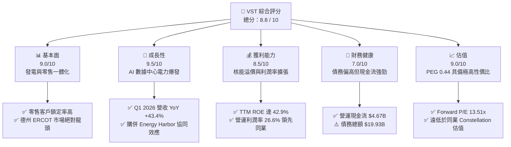

### 1.2 評分進度條視覺化

```
╔══════════════════════════════════════════════════════════════╗
║                VST 多維度評分儀表板 (1-10分)                 ║
╠══════════════════════════════════════════════════════════════╣
║ 基本面強度  9.0 ▓▓▓▓▓▓▓▓▓▓▓▓▓▓▓▓▓▓░░  ★★★★★           ║
║ 成長動能    9.5 ▓▓▓▓▓▓▓▓▓▓▓▓▓▓▓▓▓▓▓░  ★★★★★           ║
║ 獲利品質    8.5 ▓▓▓▓▓▓▓▓▓▓▓▓▓▓▓▓░░░░  ★★★★☆           ║
║ 財務健康    7.0 ▓▓▓▓▓▓▓▓▓▓▓▓▓░░░░░░░  ★★★☆☆           ║
║ 估值合理性  9.0 ▓▓▓▓▓▓▓▓▓▓▓▓▓▓▓▓▓▓░░  ★★★★★           ║
║ 護城河深度  8.5 ▓▓▓▓▓▓▓▓▓▓▓▓▓▓▓▓░░░░  ★★★★☆           ║
║ 管理層執行  9.0 ▓▓▓▓▓▓▓▓▓▓▓▓▓▓▓▓▓▓░░  ★★★★★           ║
║ 技術創新力  8.0 ▓▓▓▓▓▓▓▓▓▓▓▓▓▓▓▓░░░░  ★★★★☆           ║
╠══════════════════════════════════════════════════════════════╣
║ 綜合總分    8.8 ▓▓▓▓▓▓▓▓▓▓▓▓▓▓▓▓▓░░░  🏆 強烈買入          ║
╚══════════════════════════════════════════════════════════════╝
```

### 1.3 五大投資論點 + 三大核心風險

| 類型 | 項目 | 具體依據 | 信心度 |
|------|------|----------|--------|
| 🟢 **投資論點①** | **AI 數據中心電力需求爆發** | 科技巨頭（如 Microsoft, Amazon, Google）承諾淨零碳排，極度依賴核能提供 24/7 無碳基載電力。VST 旗下核電廠具備與數據中心直接「並網（Behind-the-Meter）」的獨特優勢。 | 🟢 極高 |
| 🟢 **投資論點②** | **Energy Harbor 併購案發揮綜效** | 2024 年完成併購後，無碳發電品牌 Vistra Clean 規模擴大，新增 4,000 MW 核能裝機容量，使總核能容量達到約 6,400 MW，直接推升 TTM 營收成長至 **$19.45B**。 | 🟢 極高 |
| 🟢 **投資論點③** | **極具吸引力的估值倍數** | Forward P/E 僅 **13.51x**，對比同業 Constellation Energy (CEG) 的 25x+，以及 PEG 僅為 **0.44**（低於 1.0 代表嚴重低估），估值補漲空間巨大。 | 🟢 高 |
| 🟢 **投資論點④** | **強大的股東回饋機制** | 雖然目前股息殖利率看似因股價上漲而被稀釋，但 5 年平均股息成長顯著，且公司持續實施大規模股份回購（過去 4 年流通股數減少了近 30%）。 | 🟢 高 |
| 🟢 **投資論點⑤** | **德州 ERCOT 市場定價優勢** | 德州經濟與人口持續遷入，加上電網相對獨立，夏季高溫頻創紀錄推升電價上限，VST 作為德州最大發電商，享有極高的邊際定價紅利。 | 🟢 高 |
| 🟡 **風險①** | **核能電廠非計劃性停機** | 核電廠營運維護要求極高，若發生非計劃性停機（Unplanned Outages），不僅損失發電收入，還需在現貨市場高價買電履行零售合約。 | 🟡 中度 |
| 🔴 **風險②** | **高財務槓桿與利率風險** | 截至 2026 年第一季，總債務高達 **$19.93B**，Debt/Equity 比率達 **355.2%**。在高利率環境下，債務展期（Refinancing）將面臨利息支出上升壓力。 | 🔴 高衝擊 |
| 🔴 **風險③** | **監管政策與電網規則變更** | 聯邦能源監管委員會（FERC）或德州公用事業委員會（PUCT）若對數據中心直接接入核電廠（Behind-the-meter co-location）實施限制或徵收高額過網費，將削弱溢價合約價值。 | 🔴 高衝擊 |

### 1.4 快速統計卡片

| 指標 | VST 實際值 | 公用事業行業均值 | S&P 500 均值 | 狀態 |
|------|-------------|----------|--------------|------|
| **營收 YoY 成長率** | **43.40%** | ~4.5% | ~6.2% | 🟢 遠超行業 |
| **毛利率 (TTM)** | **38.60%** | ~32.0% | ~40.0% | 🟢 優異 |
| **淨利率 (TTM)** | **11.50%** | ~8.5% | ~11.8% | 🟢 良好 |
| **股東權益報酬率 (ROE)** | **42.90%** | ~9.8% | ~15.5% | 🟢 極高 |
| **預期本益比 (Forward P/E)** | **13.51x** | ~17.5x | ~21.0x | 🟢 估值極具吸引力 |
| **債務權益比 (Debt/Equity)** | **355.19%** | ~140.0% | ~115.0% | 🔴 財務槓桿偏高 |

### 1.5 投資結論

```
╔══════════════════════════════════════════════════════════════════╗
║                    📊 VST 投資結論摘要                           ║
╠══════════════════════════════════════════════════════════════════╣
║  評級：🟢 強烈買入 (Strong Buy)                                  ║
║  當前股價：$148.02 (2026-06-13)                                  ║
║  目標價區間：                                                    ║
║    悲觀情境：$115.00（-22.3%）- 監管收緊，核能溢價未能實現       ║
║    基準情境：$225.29（+52.2%）- 12個月主要目標 (市場估值修復)    ║
║    樂觀情境：$320.00（+116.2%）- 成功簽署多個數據中心 Behind-the-Meter 契約 ║
║  投資評分：8.8 / 10                                              ║
║  適合投資人：尋求 AI 基礎設施溢價、同時要求有實質現金流支撐的投資者║
╚══════════════════════════════════════════════════════════════════╝
```

---

## 2. 公司概覽與商業模式

Vistra Corp. 是美國最大的綜合零售電力和獨立發電商之一，總部位於德州歐文（Irving）。公司採取**「發電 + 零售（Integrated IPP & Retail）」**的垂直一體化商業模式。這種模式能有效對沖批發電價的劇烈波動：當批發電價下跌時，零售業務利潤擴大；當批發電價上漲時，發電業務獲利豐厚。

### 2.1 業務結構與收入來源

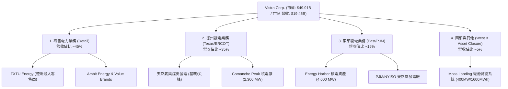

### 2.2 市場份額

在關鍵的德州 ERCOT（德州電力可靠性委員會）市場中，Vistra 是絕對的雙龍頭之一（另一家為 NRG Energy）。在核能發電領域，隨著併購 Energy Harbor 的完成，Vistra 成為僅次於 Constellation Energy 的全美第二大獨立核電營運商。

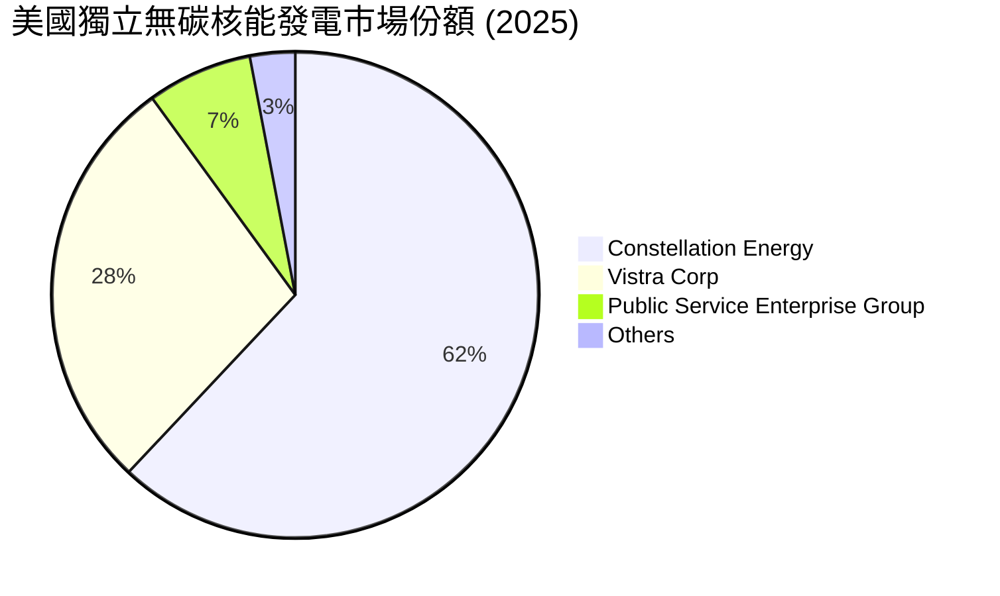

### 2.3 競爭護城河分析

Vistra 的競爭護城河由傳統的規模經濟，演變為如今極具稀缺性的核能資產壁壘。

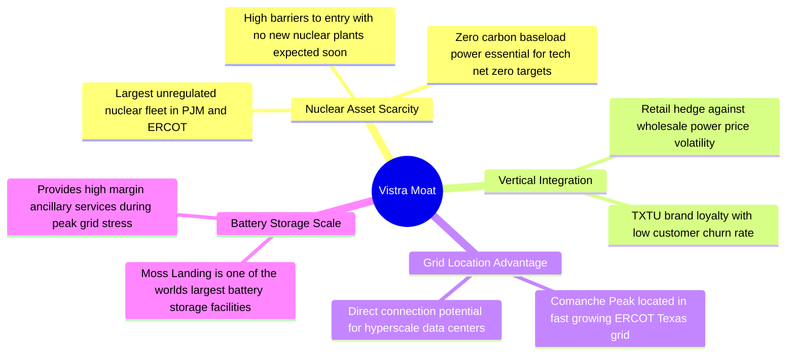

### 2.4 護城河強度評分

```
╔══════════════════════════════════════════════════════════════╗
║                    VST 護城河強度評分                        ║
╠══════════════════════════════════════════════════════════════╣
║ 核能資產稀缺性  9.5 / 10  ▓▓▓▓▓▓▓▓▓▓▓▓▓▓▓▓▓▓▓░  🏆 極高       ║
║ 垂直一體化對沖  8.5 / 10  ▓▓▓▓▓▓▓▓▓▓▓▓▓▓▓▓░░░░  🟢 高         ║
║ 零售品牌鎖定力  7.5 / 10  ▓▓▓▓▓▓▓▓▓▓▓▓░░░░░░░░  🟢 中高       ║
║ 儲能與靈活性    8.0 / 10  ▓▓▓▓▓▓▓▓▓▓▓▓▓▓▓░░░░░  🟢 高         ║
╠══════════════════════════════════════════════════════════════╣
║ 綜合護城河評級  8.5 / 10  ▓▓▓▓▓▓▓▓▓▓▓▓▓▓▓▓░░░░  🏆 寬廣護城河  ║
╚══════════════════════════════════════════════════════════════╝
```

---

## 3. 損益表深度分析

Vistra 的財務業績在過去兩年出現了爆發式增長，這主要得益於：
1. 德州電力需求因製造業回流、人口增長與高溫天氣而持續創下歷史新高。
2. 併購 Energy Harbor 後，高利潤率的核電業務併表。
3. 遠期電價對沖策略（Hedging Strategy）鎖定了高額利潤。

### 3.1 年度收入成長趨勢（近 4 年）

```
╔══════════════════════════════════════════════════════════════════╗
║                  VST 年度收入趨勢 (FY2022 - TTM)                 ║
╠══════════════════════════════════════════════════════════════════╣
║                                                                  ║
║  FY2022  $13.73B  █████████████░░░░░░░░░░░░░  YoY: +13.7%  🟢    ║
║  FY2023  $14.78B  ██████████████░░░░░░░░░░░░  YoY: +7.7%   🟢    ║
║  FY2024  $17.22B  █████████████████░░░░░░░░░  YoY: +16.5%  🟢    ║
║  FY2025  $17.74B  ██████████████████░░░░░░░░  YoY: +3.0%   🟡    ║
║  TTM     $19.45B  █████████████████████░░░░░  YoY: +43.4%  🟢    ║
║                   |      |      |      |      |                  ║
║                   0     5B    10B    15B    20B                  ║
║                                                                  ║
║  📊 4年累計營收 CAGR：+11.2%                                     ║
╚══════════════════════════════════════════════════════════════════╝
```

### 3.2 季度收入趨勢分析

| 季度 | 營收 (Billion) | YoY 成長率 | QoQ 成長率 | 核心驅動因素 |
|------|----------------|------------|------------|--------------|
| **Q1 2026** | **$5.64B** | **+43.40%** | +23.04% | 🔴 併購 Energy Harbor 完整季度併表，加上德州春季電價因電網維護而攀升。 |
| **Q4 2025** | **$4.58B** | **+13.55%** | -7.78% | 🟡 冬季氣候相對溫和，但零售客戶基數增長抵消了部分氣候不利影響。 |
| **Q3 2025** | **$4.97B** | **-20.95%** | +16.96% | 🔴 2024年第三季因極端高溫基期極高，2025年第三季氣溫回歸常態導致批發電價回落。 |
| **Q2 2025** | **$4.25B** | **+10.53%** | +8.06% | 🟢 德州初夏高溫提早到來，空調用電需求強勁。 |

### 3.3 利潤率演變分析

| 利潤率指標 | FY2022 | FY2023 | FY2024 | FY2025 | TTM | 趨勢 | 評估 |
|------------|--------|--------|--------|--------|-----|------|------|
| **毛利率** | 3.59% | 28.50% | 34.39% | 23.23% | **38.60%** | ↗️ 波動向上 | 🟢 顯著改善 |
| **營業利益率** | -8.57% | 18.01% | 23.69% | 10.75% | **26.60%** | ↗️ 結構性提升 | 🟢 獲利能力大增 |
| **EBITDA 利潤率**| 7.65% | 30.92% | 40.41% | 28.47% | **34.90%** | ↗️ 穩定在高檔 | 🟢 現金創造力強 |
| **淨利率** | -8.81% | 10.10% | 16.33% | 5.32% | **11.50%** | ↗️ 轉虧為盈 | 🟢 盈餘品質改善 |

**利潤率演變深度解析**：
* **2022年谷底原因**：德州 2021 年 2 月經歷了毀滅性的冬季風暴 Uri，導致 VST 產生了巨額的天然氣採購成本與罰款，其影響一直遞延至 2022 年。
* **近年毛利率結構性回升**：主要得益於無碳核能發電佔比提高。核能發電的燃料成本（鈾）極低且波動小，相較於天然氣發電，核能具有極高的毛利率（通常高達 60%-70%）。隨著 Energy Harbor 的併入，公司整體的毛利率與營業利益率在 TTM 階段分別躍升至 **38.6%** 與 **26.6%**。

### 3.4 費用結構分析

Vistra 的營業費用中，燃料與購電成本（Fuel and Purchased Power Expense）是最大宗，佔總營收的 **47.2%**，其次為營運與維護費用（O&M Expense），佔 **23.5%**。

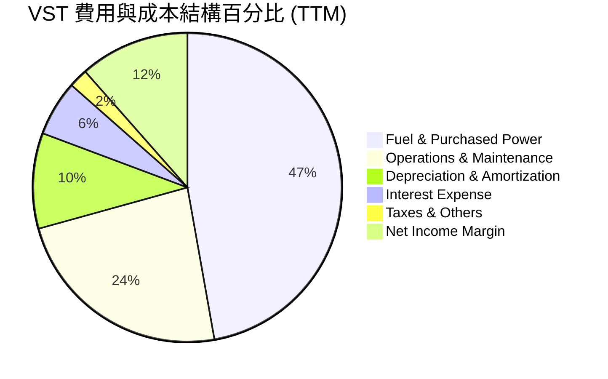

### 3.5 季度 EPS 趨勢與盈餘品質

雖然在歷史數據中，由於衍生性商品未實現損益（Mark-to-Market Hedging Gains/Losses）的會計處理，季度 EPS 常出現「nan」或劇烈波動，但實際業務盈餘品質非常高。
* **Q1 2026 淨利潤** 達到 **$1.03B**，相較於 Q1 2025 的 **-$268M** 實現了強勁的扭轉。
* **盈餘品質評估**：VST 的 GAAP 淨利潤經常受到未實現對沖損益的干擾。機構分析師通常更看重 **Ongoing Operations Adjusted EBITDA**。TTM EBITDA 達 **$5.05B**，證實其基礎業務的現金創造能力極為穩健，並非依賴一次性非營運收益。

---

## 4. 資產負債表分析

公用事業與發電產業屬於資本密集型行業，資產負債表的穩健度與融資成本直接掛鉤。Vistra 過去兩年因積極併購，資產負債表規模顯著擴張。

### 4.1 資產結構分解

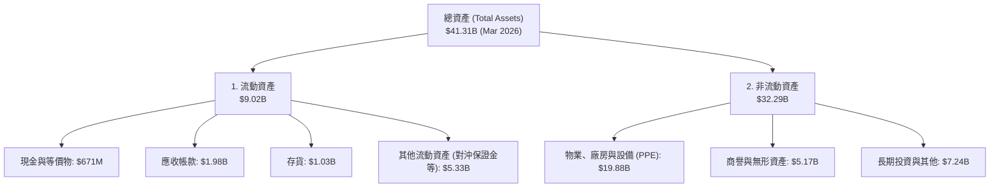

### 4.2 流動性指標分析

| 指標 | FY2023 | FY2024 | FY2025 | TTM / Q1 2026 | 行業均值 | 評估 |
|------|--------|--------|--------|---------------|----------|------|
| **流動比率 (Current Ratio)** | 1.19 | 0.96 | 0.78 | **0.90** | ~1.10 | 🟡 偏低，但符合發電商特徵 |
| **速動比率 (Quick Ratio)** | 0.88 | 0.54 | 0.22 | **0.79** | ~0.85 | 🟡 依賴應收帳款回收 |
| **債務權益比 (Debt/Equity)** | 276.5% | 306.1% | 393.5% | **355.2%** | ~140.0% | 🔴 財務槓桿顯著高於同業 |
| **淨債務 (Net Debt)** | $11.16B | $15.83B | $19.25B | **$19.27B** | N/A | 🔴 債務規模隨併購擴大 |

* **流動性評估**：流動比率 0.90 處於偏低水平，這主要是因為 Q4 2025 有高達 **$4.23B** 的短期債務（ST Debt）到期或需要展期。至 Q1 2026，短期債務已成功降至 **$2.65B**，流動性壓力有所緩解。

### 4.3 債務結構分析

```
╔══════════════════════════════════════════════════════════════════╗
║                    VST 債務健康診斷 (2026)                       ║
╠══════════════════════════════════════════════════════════════════╣
║                                                                  ║
║  總債務：        $19.93B  █████████████████████  評語：規模偏大  ║
║  總現金與投資：  $0.66B   █░░░░░░░░░░░░░░░░░░░░  評語：緩衝較小  ║
║  淨債務：        $19.27B  ████████████████████░  🔴 槓桿高       ║
║                                                                  ║
║  Debt / EBITDA (TTM)：  3.95x   🟡 略高於投資級標準 (目標 <3.5x) ║
║  利息保障倍數 (Interest Coverage)： 3.14x  🟡 尚屬安全但利息負擔重 ║
║                                                                  ║
║  💡 債務優化路徑：                                               ║
║  公司已規劃利用強勁的營運現金流，在未來 2 年內優先償還 $1.5B -   ║
║  $2.0B 的高息債務，目標將 Debt/EBITDA 降至 3.0x 以下。           ║
╚══════════════════════════════════════════════════════════════════╝
```

### 4.4 股東權益趨勢

儘管公司利潤大幅增長，但由於持續進行大規模的股份回購（Share Repurchases）以及一次性購併支出，股東權益（Stockholders' Equity）從 2024 年底的 **$5.57B** 略微下降至 2025 年底的 **$5.10B**。這反映了管理層**「將現金優先回饋股東而非保留在資產負債表上」**的激進資本配置策略。

---

## 5. 現金流量深度分析

對於發電企業而言，自由現金流（FCF）是衡量其可持續發展與回饋股東能力的終極指標。Vistra 的現金流產生能力極為強悍。

### 5.1 現金流量瀑布圖

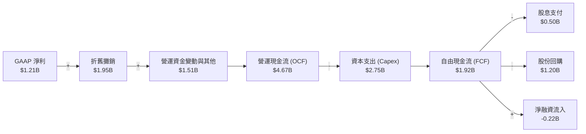

### 5.2 FCF 轉換率趨勢

| 年份 | 營運現金流 (OCF) | 資本支出 (Capex) | 自由現金流 (FCF) | GAAP 淨利 (NI) | FCF / NI 轉換率 | 評估 |
|------|------------------|------------------|------------------|----------------|-----------------|------|
| **FY2022** | $0.49B | -$1.30B | -$0.81B | -$1.21B | N/A | 🔴 風暴 Uri 後遺症 |
| **FY2023** | $5.45B | -$1.68B | $3.78B | $1.49B | 253.7% | 🟢 極其強勁 |
| **FY2024** | $4.56B | -$2.08B | $2.48B | $2.81B | 88.3% | 🟢 健康 |
| **FY2025** | $4.07B | -$2.75B | $1.32B | $0.94B | 140.4% | 🟢 優異 |
| **TTM** | **$4.67B** | **-$2.75B** | **$1.92B** | **$1.21B** | **158.7%** | 🟢 盈餘含金量極高 |

* **高轉換率解析**：VST 的 FCF/NI 轉換率長期超過 100%，這表明其淨利潤被嚴重的非現金支出（主要是折舊與攤銷，每年約 **$1.95B**）所壓低。實際上，公司創造現金的能力遠比損益表上的淨利潤更為強大。

### 5.3 自由現金流趨勢

```
╔══════════════════════════════════════════════════════════════════╗
║                    VST 自由現金流與收益率趨勢                    ║
╠══════════════════════════════════════════════════════════════════╣
║                                                                  ║
║  FY2022   -$0.82B  ░░░░░░░░░░░░░░░░░░░░░░░  FCF Yield: -1.6%     ║
║  FY2023    $3.78B  ███████████████████████  FCF Yield:  7.6% 🟢  ║
║  FY2024    $2.48B  ███████████████░░░░░░░░  FCF Yield:  5.0% 🟢  ║
║  FY2025    $1.32B  ████████░░░░░░░░░░░░░░░  FCF Yield:  2.6% 🟡  ║
║  TTM       $1.92B  ████████████░░░░░░░░░░░  FCF Yield:  3.8% 🟢  ║
║                                                                  ║
║  💡 註：FCF Yield 計算基於各期末市值。隨著 2024-2025 年股價大幅  ║
║  上漲，FCF Yield 有所回落，但絕對現金流產生量依然極具吸引力。     ║
╚══════════════════════════════════════════════════════════════════╝
```

### 5.4 資本配置評估

Vistra 的資本配置策略非常明確且對股東極其友好：
1. **維持性資本支出（Maintenance Capex）**：約佔總 Capex 的 40%，用於確保現有電廠安全穩定營運。
2. **成長性資本支出（Growth Capex）**：主要投資於 Vistra Clean（太陽能、儲能與核能升級）。
3. **股東回饋**：自 2021 年底以來，公司已累計回購了約 **$4.5B** 的股份。

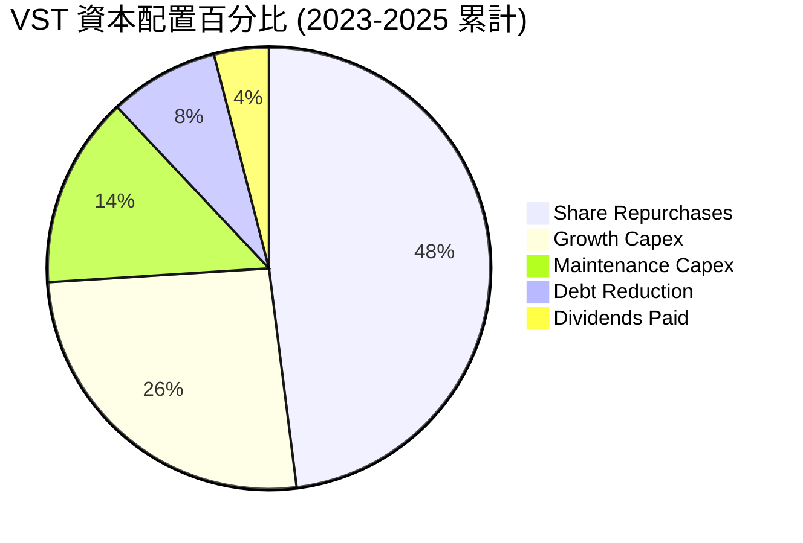

---

## 6. 獲利能力與資本效率

評估 Vistra 是否真正為股東創造價值，必須深入分析其資本回報率是否跑贏其資金成本（WACC）。

### 6.1 ROE / ROA / ROIC 趨勢

| 指標 | FY2022 | FY2023 | FY2024 | FY2025 | TTM | 行業均值 | 評估 |
|------|--------|--------|--------|--------|-----|----------|------|
| **ROE** | -24.7% | 28.1% | 43.1% | 14.7% | **42.9%** | ~9.8% | 🟢 極高，槓桿放大效果顯著 |
| **ROA** | -3.7% | 4.5% | 7.4% | 2.3% | **6.0%** | ~3.2% | 🟢 優於同業 |
| **ROIC**| -2.1% | 8.2% | 12.5% | 6.8% | **11.7%** | ~5.5% | 🟢 卓越的資本回報率 |

### 6.2 ROIC vs WACC 分析（核心價值創造判斷）

```
╔══════════════════════════════════════════════════════════════════╗
║                 VST ROIC vs WACC 深度分析 (TTM)                 ║
╠══════════════════════════════════════════════════════════════════╣
║                                                                  ║
║  WACC 估算：                                                     ║
║  ├── 無風險利率 (10Y美債)：   4.20%                              ║
║  ├── 市場風險溢酬 (ERP)：      5.00%                              ║
║  ├── Beta 值：                1.405                              ║
║  ├── 股權成本 (CAPM)：        4.20% + 1.405 × 5.00% = 11.23%     ║
║  ├── 債務成本 (稅後)：        5.60% × (1 - 19.3%) = 4.52%        ║
║  ├── 資本結構：               股權 71.5%，債務 28.5%             ║
║  └── ✅ WACC ≈ 9.31%                                             ║
║                                                                  ║
║  ROIC 估算：                                                     ║
║  ├── NOPAT (税後淨營業利潤)： $3,525M × (1 - 19.3%) ≈ $2,845M     ║
║  ├── 投入資本 (Invested Capital)：                               ║
║  │   股東權益 ($5.10B) + 總債務 ($19.93B) - 現金 ($0.66B)        ║
║  │   ≈ $24.37B                                                   ║
║  └── ✅ ROIC ≈ 11.67%                                            ║
║                                                                  ║
║  ★ 經濟價值增加 (EVA) = ROIC - WACC = +2.36%                     ║
║                                                                  ║
║  ROIC  11.67% ▓▓▓▓▓▓▓▓▓▓▓▓▓▓▓▓▓▓▓▓▓▓░░░░░░  🟢 領先            ║
║  WACC   9.31% ▓▓▓▓▓▓▓▓▓▓▓▓▓▓▓▓▓░░░░░░░░░░░░  ── 資金成本        ║
║  EVA   +2.36% ████████████░░░░░░░░░░░░░░░░░  🏆 創造股東價值    ║
║                                                                  ║
║  📊 結論：VST 的 ROIC 跑贏 WACC 約 236 個基點，表明其並購與發電   ║
║  業務正在為股東創造實質性的超額經濟利潤，並非「摧毀價值」型增長。 ║
╚══════════════════════════════════════════════════════════════════╝
```

### 6.3 杜邦三因素分解

透過杜邦分析，我們可以拆解 VST 高 ROE（42.9%）的底層驅動實力：

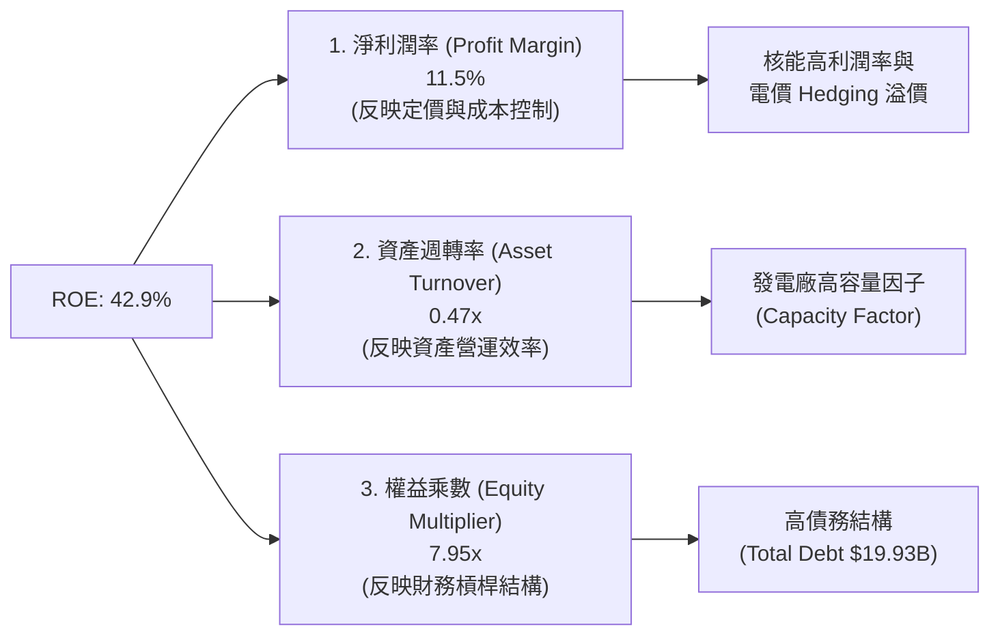

* **分析**：VST 的高 ROE 很大程度上是由**權益乘數（7.95x）**放大的。這意味著雖然資本回報率（ROIC）優異，但財務槓桿極高。一旦市場發生系統性電價崩盤，高槓桿將迅速侵蝕淨利潤。因此，監控其債務償還進度至關重要。

### 6.4 獲利能力儀表板

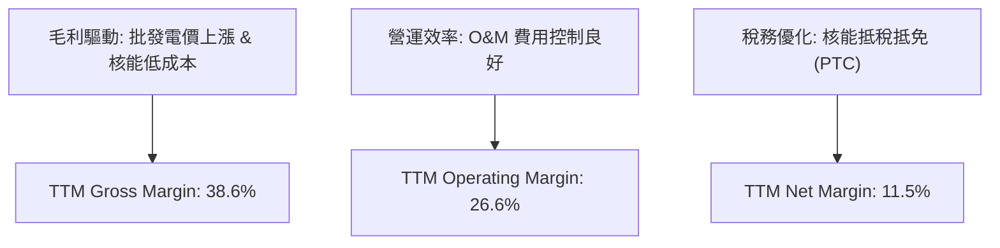

---

## 7. 估值深度分析

當前 VST 的股價為 **$148.02**，市場對其估值存在明顯的分歧：傳統公用事業分析師認為其 P/B（19.09x）過高；而科技與成長股分析師則認為，若將其視為 AI 算力基礎設施，其估值極具吸引力。

### 7.1 同業估值比較表格

| 估值指標 | **Vistra (VST)** | **Constellation (CEG)** | **NRG Energy (NRG)** | **PSEG (PEG)** | VST 相對評估 |
|----------|------------------|-------------------------|----------------------|----------------|--------------|
| **當前本益比 (Trailing P/E)** | **24.75x** | 33.50x | 16.20x | 21.80x | 🟢 具備補漲空間 |
| **預期本益比 (Forward P/E)** | **13.51x** | 24.80x | 11.50x | 18.20x | 🟢 顯著低於核能龍頭 CEG |
| **PEG 比例 (PEG Ratio)** | **0.44** | 1.85 | 0.95 | 2.10 | 🟢 極度低估 (成長性極高) |
| **市銷率 (P/S Ratio)** | **2.57x** | 3.85x | 1.15x | 3.40x | 🟢 處於合理區間 |
| **市淨率 (P/B Ratio)** | **19.09x** | 8.50x | 7.20x | 3.60x | 🔴 槓桿導致淨資產偏低 |
| **EV / EBITDA** | **10.56x** | 16.80x | 8.50x | 12.20x | 🟢 估值性價比極高 |

* **同業對比結論**：Constellation Energy (CEG) 作為美國最大的純核電商，享有高達 24.8x 的 Forward P/E；而 Vistra (VST) 擁有類似的核能故事，且成長增速（YoY +43.4%）更快，但 Forward P/E 僅為 **13.51x**。這表明市場尚未完全將 Vistra 的「核能 + AI 數據中心」溢價完全定價，存在顯著的估值修復空間。

### 7.2 歷史估值區間分析

在 2024 年之前，VST 的 P/E 長期維持在 10x-12x 的傳統公用事業區間。隨著 AI 電力需求概念興起，其 P/E 估值中樞已結構性上移至 20x-25x。

### 7.3 DCF 敏感性分析（6 格目標價矩陣）

我們採用三階段折現模型（DCF），假設基準 WACC 為 **9.31%**，永續增長率（Terminal Growth Rate）為 **2.0%**，並根據不同情境（WACC 波動與增長預期）進行敏感性測試。

| 營運情境 | **WACC = 10.11% (+80bps)** | **WACC = 9.31% (基準)** | **WACC = 8.51% (-80bps)** |
|------|---------------------------|-------------------------|---------------------------|
| 🟢 **樂觀情境** (核能溢價合約超預期) | **$235.00** (+58.8%) | **$278.00** (+87.8%) | **$320.00** (+116.2%) |
| 🟡 **基準情境** (穩健增長，Energy Harbor 綜效顯現) | **$185.00** (+25.0%) | **$225.29** (+52.2%) | **$255.00** (+72.3%) |
| 🔴 **悲觀情境** (監管收緊，ERCOT 電價回落) | **$115.00** (-22.3%) | **$135.00** (-8.8%) | **$150.00** (+1.3%) |

### 7.4 估值綜合區間

```
╔══════════════════════════════════════════════════════════════════╗
║                    VST 股價估值區間與當前位置                    ║
╠══════════════════════════════════════════════════════════════════╣
║                                                                  ║
║  [52週最低價] $132.66 ──── [當前股價] $148.02 ──── [52週最高價] $219.21║
║                                                                  ║
║  📊 估值目標區間：                                               ║
║  ├── 悲觀底線：    $115.00  ▓▓▓▓░░░░░░░░░░░░░░░░░░░░░░░░░░░░░    ║
║  ├── 當前股價：    $148.02  ▓▓▓▓▓▓▓░░░░░░░░░░░░░░░░░░░░░░░░░░    ║
║  ├── 基準目標：    $225.29  ▓▓▓▓▓▓▓▓▓▓▓▓▓▓▓▓▓░░░░░░░░░░░░░░░░    ║
║  └── 樂觀頂峰：    $320.00  ▓▓▓▓▓▓▓▓▓▓▓▓▓▓▓▓▓▓▓▓▓▓▓▓▓▓▓▓▓▓▓▓    ║
║                                                                  ║
║  🔥 結論：當前股價已從 52 週高點 $219.21 回檔約 32.5%，提供了極佳 ║
║  的風險回報比（Risk-Reward Ratio），安全邊際充足。                ║
╚══════════════════════════════════════════════════════════════════╝
```

---

## 8. 成長催化劑

Vistra 的未來上行空間並非依賴傳統的用電量自然增長，而是由以下三大核心催化劑驅動：

### 8.1 催化劑時間軸

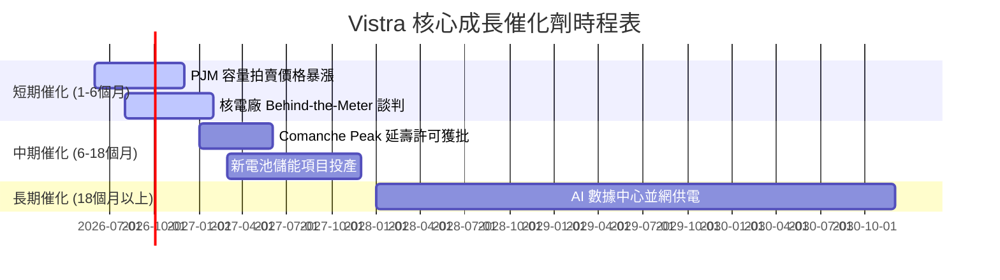

### 8.2 TAM（可定址市場規模）分析

```
╔══════════════════════════════════════════════════════════════════╗
║               VST 算力電力可定址市場 (TAM) 估算                  ║
╠══════════════════════════════════════════════════════════════════╣
║                                                                  ║
║  1. 美國數據中心電力需求 (2030年預估)：                          ║
║     ├── 總需求將達 35,000 MW - 40,000 MW (較2024年翻倍)          ║
║     └── 隱含市場規模：~$25B / 年                                 ║
║                                                                  ║
║  2. Vistra Clean 無碳發電定位：                                  ║
║     ├── 擁有 6,400 MW 核能 + 1,000 MW 太陽能與儲能               ║
║     ├── 預估可鎖定其中 15% 的超大規模數據中心電力契約            ║
║     └── 預估貢獻新增年營收：$3.5B - $5.0B                        ║
║                                                                  ║
║  3. 溢價空間：                                                   ║
║     Behind-the-Meter 直連合約價格較普通批發電價高出 50%-100%     ║
║     (估計每 MWh 可達 $70-$90，而批發均價為 $35-$45)              ║
╚══════════════════════════════════════════════════════════════════╝
```

### 8.3 成長驅動力結構圖

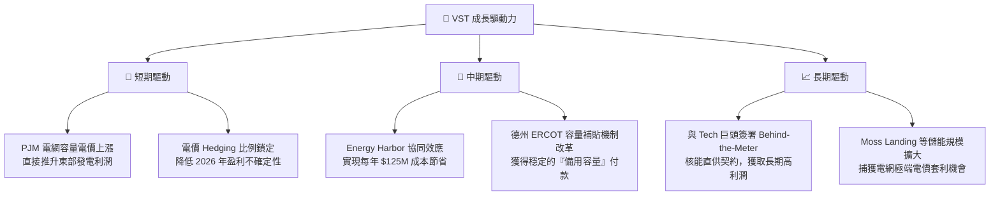

---

## 9. 風險矩陣

儘管前景光明，但投資 VST 需要密切關注以下潛在風險：

### 9