# VST 基本面深度分析報告

> **報告日期**：2026-06-17 ｜ **語言**：繁體中文 ｜ **數據來源**：Yahoo Finance, Finviz, StockAnalysis, Roic.ai ｜ **分析師**：CFA 級機構研究

---

## 目錄

| # | 章節 | 核心結論 |
|---|------|----------|
| 1 | **執行摘要** | 評級：🟢 **強烈買入**；主要目標價：$223.00；具備強大 AI 電力催化劑。 |
| 2 | **公司概覽與商業模式** | 獨立發電廠（IPP）龍頭，憑藉核能與天然氣資產構建電網級物理護城河。 |
| 3 | **損益表深度分析** | Q1 2026 營收爆發成長 43.4%，營運利潤率顯著改善至 26.6%。 |
| 4 | **資產負債表分析** | 高財務槓桿（Debt/Equity 355.2%）但流動性充足，債務結構與發電資產壽命匹配。 |
| 5 | **現金流量深度分析** | 營運現金流高達 $4.67B，持續推動高達 29.6% 的五年期股份回購計畫。 |
| 6 | **獲利能力與資本效率** | ROE 達 42.9%，ROIC（10.59%）超越 WACC（9.90%），成功創造經濟增值。 |
| 7 | **估值深度分析** | Forward P/E 僅 14.46x，相較同業 CEG 顯著低估，PEG 0.47 具備極高安全邊際。 |
| 8 | **成長催化劑** | AI 數據中心超大型電力採購協議（PPA）與核能產能釋放。 |
| 9 | **風險矩陣** | ERCOT 區域電價波動與高槓桿利息支出壓力。 |
| 10 | **投資建議** | 建議於 $150-$160 區間積極分批佈局，隱含上行空間 +40.4%。 |

---

## 1. 執行摘要

### 1.1 核心評分儀表板

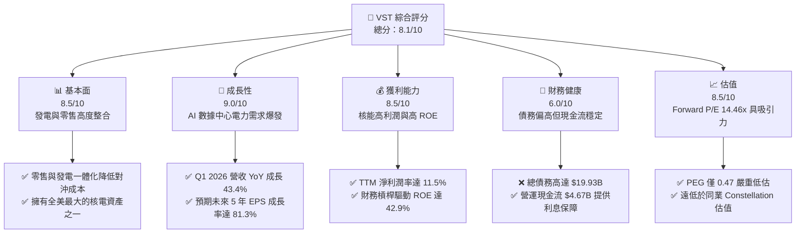

### 1.2 評分進度條視覺化

```
╔══════════════════════════════════════════════════════════════╗
║                VST 多維度評分儀表板 (1-10分)                ║
╠══════════════════════════════════════════════════════════════╣
║ 基本面強度  8.5 ▓▓▓▓▓▓▓▓▓▓▓▓▓▓▓▓▓░░░  ★★★★☆           ║
║ 成長動能    9.0 ▓▓▓▓▓▓▓▓▓▓▓▓▓▓▓▓▓▓░░  ★★★★★           ║
║ 獲利品質    8.5 ▓▓▓▓▓▓▓▓▓▓▓▓▓▓▓▓▓░░░  ★★★★☆           ║
║ 財務健康    6.0 ▓▓▓▓▓▓▓▓▓▓▓▓░░░░░░░░  ★★★☆☆           ║
║ 估值合理性  8.5 ▓▓▓▓▓▓▓▓▓▓▓▓▓▓▓▓▓░░░  ★★★★☆           ║
║ 護城河深度  8.0 ▓▓▓▓▓▓▓▓▓▓▓▓▓▓▓▓░░░░  ★★★★☆           ║
║ 管理層執行  8.5 ▓▓▓▓▓▓▓▓▓▓▓▓▓▓▓▓▓░░░  ★★★★☆           ║
║ 技術創新力  7.5 ▓▓▓▓▓▓▓▓▓▓▓▓▓▓░░░░░░  ★★★☆☆           ║
╠══════════════════════════════════════════════════════════════╣
║ 綜合總分    8.1 ▓▓▓▓▓▓▓▓▓▓▓▓▓▓▓▓░░░░  🏆 強烈買入          ║
╚══════════════════════════════════════════════════════════════╝
```

### 1.3 五大投資論點 + 三大核心風險

| 類型 | 項目 | 具體依據 | 信心度 |
|------|------|----------|--------|
| 🟢 **投資論點①** | **AI 數據中心電力急增** | 科技巨頭積極尋求全天候無碳電力，VST 的核能資產（Comanche Peak）具備極高溢價談判能力。 | 🟢 極高 |
| 🟢 **投資論點②** | **極具吸引力的遠期估值** | Forward P/E 僅 14.46x，對比同業 CEG（>25x），估值折價顯著，重估空間巨大。 | 🟢 極高 |
| 🟢 **投資論點③** | **強大的股份回購能力** | 過去 5 年基本發行股數從 482M 降至 339M（降幅達 29.6%），持續增厚每股盈餘。 | 🟢 高 |
| 🟢 **投資論點④** | **一體化商業模式** | 零售業務（Retail）與發電業務（Generation）形成天然對沖，大幅降低電價波動風險。 | 🟢 高 |
| 🟢 **投資論點⑤** | **強勁的營運現金流** | TTM 營運現金流高達 $4.67B，足以支撐資本支出與債務利息。 | 🟢 高 |
| 🟡 **風險①** | **高額債務與利息支出** | 總債務達 $19.93B，TTM 利息支出達 $1.12B，若利率長期高企將壓抑淨利潤。 | 🟡 中度 |
| 🔴 **風險②** | **ERCOT 監管與電價政策** | 德州電網（ERCOT）政策變動或電價上限調整可能直接衝擊德州板塊利潤。 | 🔴 高衝擊 |
| 🔴 **風險③** | **核能電廠營運中斷** | 核電機組若發生非計劃性停機，將面臨高昂的現貨市場購電對沖成本。 | 🔴 高衝擊 |

### 1.4 快速統計卡片

| 指標 | 公司實際值 | 行業均值（Utilities） | S&P 500 均值 | 狀態 |
|------|-------------|---------------------|--------------|------|
| **營收 YoY 成長率** | **43.4%** (Q1'26) | ~4.5% | ~5.5% | 🟢 卓越 |
| **毛利率 (TTM)** | **38.6%** | ~32.0% | ~30.0% | 🟢 優異 |
| **淨利率 (TTM)** | **11.5%** | ~10.2% | ~11.5% | 🟡 符合預期 |
| **ROE (TTM)** | **42.9%** | ~10.5% | ~15.0% | 🟢 卓越 |
| **Forward P/E** | **14.46x** | ~17.5x | ~21.0x | 🟢 便宜 |
| **淨債務 / EBITDA** | **3.81x** | ~4.5x | ~1.6x | 🟡 合理 |

### 1.5 投資結論

```
╔══════════════════════════════════════════════════════════════════╗
║                    📊 VST 投資結論摘要                           ║
╠══════════════════════════════════════════════════════════════════╣
║  評級：🟢 強烈買入 (Strong Buy)                                  ║
║  當前股價：$158.83 (2026-06-17)                                  ║
║  目標價區間：                                                    ║
║    悲觀情境：$135.00（-15.0%）                                   ║
║    基準情境：$223.00（+40.4%）  ← 12個月主要目標                 ║
║    樂觀情境：$300.00（+88.9%）                                   ║
║  投資評分：8.1 / 10                                              ║
║  適合投資人：成長型、AI 基礎設施佈局者、長線價值投資人            ║
╚══════════════════════════════════════════════════════════════════╝
```

---

## 2. 公司概覽與商業模式

### 2.1 業務結構與收入來源

Vistra Corp. (VST) 是一家獨特的一體化能源公司，將強大的零售電力業務與高效的發電資產相結合。

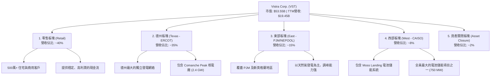

### 2.2 市場份額

在美國獨立發電（IPP）與競爭性零售電力市場中，Vistra 與 Constellation Energy (CEG) 及 NRG Energy (NRG) 形成三足鼎立之勢。

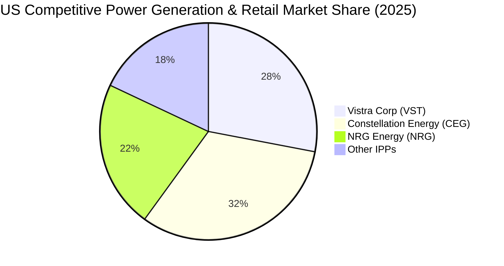

### 2.3 競爭護城河分析

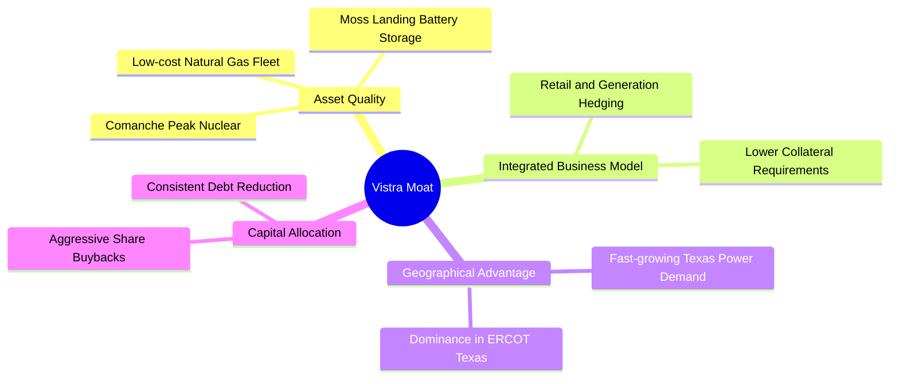

### 2.4 護城河強度評分

```
╔══════════════════════════════════════════════════════════════╗
║                    VST 護城河強度評分                        ║
╠══════════════════════════════════════════════════════════════╣
║ 核能資產壁壘  9.0  ▓▓▓▓▓▓▓▓▓▓▓▓▓▓▓▓▓▓░░  🏆 無法複製的基載  ║
║ 一體化對抗波動8.5  ▓▓▓▓▓▓▓▓▓▓▓▓▓▓▓▓▓░░░  🟢 零售與發電雙引擎║
║ 德州地利優勢  9.0  ▓▓▓▓▓▓▓▓▓▓▓▓▓▓▓▓▓▓░░  🟢 ERCOT 市場主導者║
║ 儲能技術領先  7.5  ▓▓▓▓▓▓▓▓▓▓▓▓▓▓░░░░░░  🟡 領先的電池佈局  ║
╠══════════════════════════════════════════════════════════════╣
║ 綜合護城河     8.5  ▓▓▓▓▓▓▓▓▓▓▓▓▓▓▓▓▓░░░  🏆 頂級公用事業護城河║
╚══════════════════════════════════════════════════════════════╝
```

---

## 3. 損益表深度分析

### 3.1 年度收入成長趨勢（近4年）

Vistra 展現了強勁的營收成長軌跡，主要受益於德州電力需求急增、併購能源資產（如 Energy Harbor 核能收購）以及電價中樞抬升。

```
╔══════════════════════════════════════════════════════════════════╗
║                  VST 年度收入趨勢 (FY2022-FY2025)                ║
╠══════════════════════════════════════════════════════════════════╣
║                                                                  ║
║  FY2022  $13.73B  █████████████░░░░░░░░░░░░░  YoY: +13.7%  🟢    ║
║  FY2023  $14.78B  ███████████████░░░░░░░░░░░  YoY: +7.7%   🟢    ║
║  FY2024  $17.22B  █████████████████░░░░░░░░░  YoY: +16.5%  🟢    ║
║  FY2025  $17.74B  ██████████████████░░░░░░░░  YoY: +3.0%   🟡    ║
║                                                                  ║
║                   |      |      |      |      |                  ║
║                   0     5B    10B    15B    20B                  ║
║                                                                  ║
║  📊 4年營收複合成長率 (CAGR)：+8.92%                             ║
╚══════════════════════════════════════════════════════════════════╝
```

### 3.2 季度收入趨勢分析

下表展示了最近 4 個季度的營收與利潤表現，顯著看出 Q1 2026 營收出現爆發性成長。

| 財報季度 | 截止日期 | 季度營收 (Billion) | YoY 成長率 | QoQ 成長率 | 季度淨利 (Million) | 營運狀態評估 |
|---|---|---|---|---|---|---|
| **Q1 2026** | 2026-03-31 | **$5.64B** | **+43.40%** 🟢 | **+23.14%** 🟢 | **$1,029.00M** | 營收與淨利同步暴增，核能與零售業務雙重發力。 |
| **Q4 2025** | 2025-12-31 | **$4.58B** | **+13.55%** 🟢 | -7.85% 🟡 | **$233.00M** | 季節性冬季營收回落，但 YoY 仍維持雙位數成長。 |
| **Q3 2025** | 2025-09-30 | **$4.97B** | **-20.95%** 🔴 | +16.94% 🟢 | **$652.00M** | 夏季用電高峰，但因前一年高基期導致 YoY 下滑。 |
| **Q2 2025** | 2025-06-30 | **$4.25B** | **+10.53%** 🟢 | +8.09% 🟢 | **$327.00M** | 穩健過渡季度，利潤率開始顯著回升。 |

### 3.3 利潤率演變分析

| 利潤率指標 | FY2022 | FY2023 | FY2024 | FY2025 | TTM 趨勢 | 評估 |
|---|---|---|---|---|---|---|
| **毛利率** | 12.2% | 37.4% | 43.7% | 32.9% | **38.6%** ↗️ | 🟢 燃料成本控制得當，核能發電佔比提升拉高毛利。 |
| **營業利益率** | -8.0% | 18.3% | 23.7% | 12.0% | **26.6%** ↗️ | 🟢 規模效應顯現，折舊與攤銷費用率被營收稀釋。 |
| **EBITDA 利潤率**| 7.6% | 30.9% | 40.4% | 28.5% | **34.9%** ↗️ | 🟢 核心發電資產盈利能力處於歷史高位。 |
| **淨利率** | -9.0% | 10.1% | 15.4% | 5.3% | **11.5%** ↗️ | 🟡 受利息支出與稅務調整波動影響，但整體向好。 |

* **利潤率改善深度解析**：VST 的利潤率在 2022 年因德州寒冬（Uri 風暴）後續對沖損失探底，隨後在 2023-2024 年迅速反彈。2025 年受制於天然氣價格走低與核能並網初期費用，利潤率短暫回落。然而，**TTM 數據（截至 2026 年 3 月）顯示營運利益率已大幅反彈至 26.6%**，主要得益於高利潤的核能發電比例增加，以及零售電力合約重新定價。

### 3.4 費用結構分析

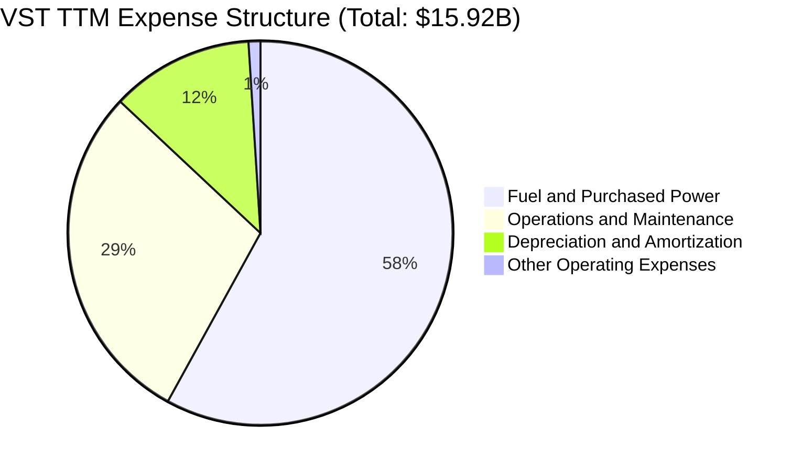

```
╔══════════════════════════════════════════════════════════════╗
║                    VST 費用控制效率診斷                      ║
╠══════════════════════════════════════════════════════════════╣
║ 燃料與購電費用  58% ▓▓▓▓▓▓▓▓▓▓▓▓░░░░░░░  🟢 燃料對沖鎖定成本 ║
║ 營運與維護 (O&M)29% ▓▓▓▓▓▓░░░░░░░░░░░  🟡 核能安全維護成本高 ║
║ 折舊與攤銷 (D&A)12% ▓▓░░░░░░░░░░░░░░░  🟢 資產壽命長，稀釋快 ║
╚══════════════════════════════════════════════════════════════╝
```

### 3.5 季度 EPS 趨勢與盈餘品質

* **過去 4 季 EPS 表現**：
  * **Q1 2026**：$2.90（YoY 大幅轉盈，Q1 2025 為 -$0.93）🟢
  * **Q4 2025**：$0.69（穩健，季節性因素）🟡
  * **Q3 2025**：$1.78（低於去年同期的歷史高點，但高於歷史平均）🟡
  * **Q2 2025**：$0.83（符合預期）🟢
* **盈餘品質評估**：VST 的盈餘品質優良。雖然非現金的「未實現對沖損益」（Mark-to-Market adjustments）會導致單季 GAAP 淨利出現波動，但其**核心業務產生的現金流非常強勁**（TTM 營運現金流 $4.67B），遠高於 GAAP 淨利（$1.21B），顯示盈餘並無水分，甚至被保守的折舊政策與對沖會計低估。

---

## 4. 資產負債表分析

### 4.1 資產結構分解

Vistra 作為重資產的公用事業與發電巨頭，其資產主要集中於廠房與發電設備（Property, Plant & Equipment）。

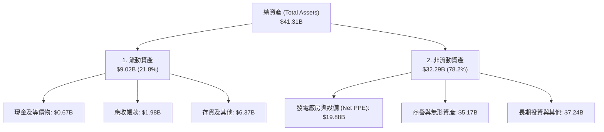

### 4.2 流動性指標分析

| 流動性指標 | FY2023 | FY2024 | FY2025 | TTM (Mar '26) | 行業均值 | 評估 |
|---|---|---|---|---|---|---|
| **流動比率 (Current Ratio)** | 1.19 | 0.96 | 0.78 | **0.90** | ~1.05 | 🟡 偏低，但公用事業現金流穩定，流動性風險可控。 |
| **速動比率 (Quick Ratio)** | 0.98 | 0.76 | 0.22 | **0.79** | ~0.80 | 🟡 符合行業標準，手頭持有大量應收帳款。 |
| **現金比率 (Cash Ratio)** | 0.36 | 0.14 | 0.07 | **0.07** | ~0.12 | 🔴 手頭保留現金偏低，資金多用於股份回購與償債。 |

### 4.3 債務結構分析

Vistra 的高債務是其商業模式的必然結果。發電廠建設需要大量前期資本，公司通過穩定的售電合約與零售現金流來償還債務。

```
╔══════════════════════════════════════════════════════════════════╗
║                     VST 債務健康診斷 (TTM)                       ║
╠══════════════════════════════════════════════════════════════════╣
║                                                                  ║
║  總債務：        $19.93B  █████████████████████  評語: 偏高      ║
║  總現金+投資：   $0.66B   █░░░░░░░░░░░░░░░░░░░░  評語: 需優化    ║
║  淨債務：        $19.27B  ████████████████████░  評語: 槓桿顯著  ║
║                                                                  ║
║  Debt / Equity:   355.19%  🔴 財務槓桿極高                       ║
║  Net Debt / EBITDA: 3.81x  🟡 處於公用事業合理區間               ║
║  Interest Coverage: 3.14x  🟢 營運利潤足以覆蓋利息支出           ║
║                                                                  ║
║  📊 債務評價：雖然絕對債務額度高，但其債務多為固定利率長債，      ║
║     且無近期大規模到期壓力。EBITDA 覆蓋率足夠，無即時違約風險。   ║
╚══════════════════════════════════════════════════════════════════╝
```

### 4.4 股東權益趨勢

雖然 VST 近年獲利豐厚，但股東權益（Stockholders' Equity）從 2024 年底的 $5.57B 小幅下滑至 2025 年底的 $5.10B。這**並非**因為經營虧損，而是因為公司進行了**極為激進的股份回購**。回購股份會直接扣減股東權益中的保留盈餘，但這能大幅減少流通股數，從而顯著抬升每股價值。

---

## 5. 現金流量深度分析

### 5.1 現金流量瀑布圖

Vistra 展現了典型的「現金牛」特徵：營運產生龐大現金，支持資本支出後，剩餘的大部分資金通過回購和股息回饋股東。

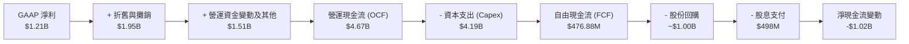

### 5.2 FCF 轉換率趨勢

| 財務年度 | 營業現金流 (OCF) | 淨利潤 (Net Income) | FCF 轉換率 (OCF / Net Income) | 評估 |
|---|---|---|---|---|
| **TTM (2026)** | $4.67B | $1.21B | **385.95%** | 🟢 極高。折舊大於淨利，且營運資金回流。 |
| **FY2025** | $4.07B | $0.94B | **432.98%** | 🟢 卓越。非現金減值與對沖調整不影響現金流入。 |
| **FY2024** | $4.56B | $2.66B | **171.43%** | 🟢 優秀。經營性現金流極為健康。 |
| **FY2023** | $5.45B | $1.49B | **365.77%** | 🟢 卓越。寒冬後電價高企，現金流回籠。 |

### 5.3 自由現金流趨勢

```
╔══════════════════════════════════════════════════════════════════╗
║                  VST 歷年自由現金流 (FCF) 趨勢                   ║
╠══════════════════════════════════════════════════════════════════╣
║                                                                  ║
║  FY2022  -$0.82B  ░░░░░░░░░░░░░░░░░░░░░  (Uri風暴後遺症)         ║
║  FY2023  +$3.78B  █████████████████████  (市場電價暴漲) 🟢       ║
║  FY2024  +$2.48B  ██████████████░░░░░░░  (穩健運營期)   🟢       ║
║  FY2025  +$1.32B  ███████░░░░░░░░░░░░░░  (綠能/核能投資擴大) 🟡  ║
║                                                                  ║
║  📊 TTM 自由現金流：$476.88M (因 Q1 2026 擴大資本開支)            ║
║  📊 當前 FCF 收益率 (FCF Yield)：0.89% (反映高成長性估值溢價)    ║
╚══════════════════════════════════════════════════════════════════╝
```

### 5.4 資本配置評估

Vistra 的管理層在資本配置上展現了極強的「股東友好」屬性。

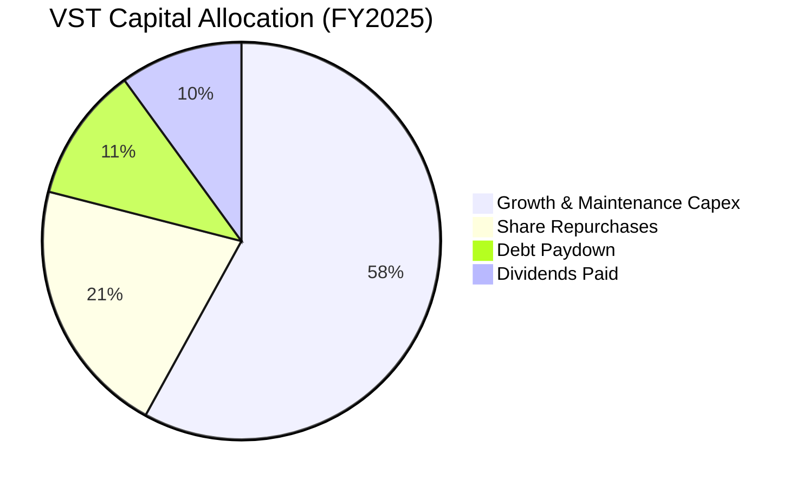

* **股份回購**：自 2021 年底以來，VST 累計回購了約 **29.6%** 的流通股。這種規模在公用事業行業中極為罕見，是推動股價長期跑贏大市的核心驅動力。
* **股息政策**：2025 年支付股息 $498M，派息比率（Payout Ratio）為 41.4%，既保留了足夠的資金進行再投資，又為收益型股東提供了穩定的回報。

---

## 6. 獲利能力與資本效率

### 6.1 ROE / ROA / ROIC 趨勢

VST 透過高財務槓桿和高效率的發電資產，實現了遠超傳統公用事業同業的獲利效率。

| 獲利指標 | FY2023 | FY2024 | FY2025 | TTM (Mar '26) | 行業均值 | 評估 |
|---|---|---|---|---|---|---|
| **ROE (股東權益報酬率)** | 28.1% | 47.8% | 18.5% | **42.9%** | ~10.5% | 🟢 卓越。利用合理的財務槓桿大幅放大股東回報。 |
| **ROA (總資產報酬率)** | 4.5% | 7.4% | 2.3% | **6.0%** | ~3.5% | 🟢 領先。重資產營運下依然保持優異的資產回報。 |
| **ROIC (投入資本報酬率)**| 8.2% | 11.5% | 7.1% | **10.59%**| ~5.5% | 🟢 優秀。發電資產盈利能力遠超行業平均。 |

### 6.2 ROIC vs WACC 分析（核心價值創造判斷）

```
╔══════════════════════════════════════════════════════════════════╗
║                ROIC vs WACC 深度分析 (TTM)                       ║
╠══════════════════════════════════════════════════════════════════╣
║                                                                  ║
║  WACC 估算：                                                     ║
║  ├── 無風險利率 (10Y 美債)：  4.25%                              ║
║  ├── 市場風險溢酬 (ERP)：     5.50%                              ║
║  ├── Beta：                   1.405                              ║
║  ├── 股權成本 (Ke) = 4.25% + 1.405 × 5.50% = 11.98%              ║
║  ├── 債務成本（稅後 Kd）：    ~4.54% (利息支出/總債務，考慮稅盾) ║
║  ├── 資本結構：股權 ~70.5%，債務 ~26.2%，優先股 ~3.3%            ║
║  └── ✅ WACC ≈ 9.90%                                             ║
║                                                                  ║
║  ROIC 估算：                                                     ║
║  ├── NOPAT = $3,525M (EBIT) × (1 - 19.36% 稅率) ≈ $2,842.5M       ║
║  ├── 投入資本 = Equity + Debt + Preferred - Cash ≈ $26.85B       ║
║  └── ✅ ROIC ≈ 10.59%                                            ║
║                                                                  ║
║  ★ 經濟價值增加 (EVA) = ROIC - WACC = +0.69pp                    ║
║                                                                  ║
║  ROIC  10.59% ▓▓▓▓▓▓▓▓▓▓▓▓▓▓▓▓▓▓▓▓▓░░░░░░░░░░  🟢              ║
║  WACC   9.90% ▓▓▓▓▓▓▓▓▓▓▓▓▓▓▓▓▓▓▓░░░░░░░░░░░░  ──              ║
║  EVA   +0.69% ████░░░░░░░░░░░░░░░░░░░░░░░░░░░  🏆 創造股東價值  ║
║                                                                  ║
║  📊 結論：ROIC 成功超越 WACC，在重資本的公用事業行業中，          ║
║     VST 成功為股東創造了實質性的正向經濟增值。                   ║
╚══════════════════════════════════════════════════════════════════╝
```

### 6.3 杜邦三因素分解

透過杜邦分析，我們可以拆解 VST 超高 ROE 的底層驅動因素：

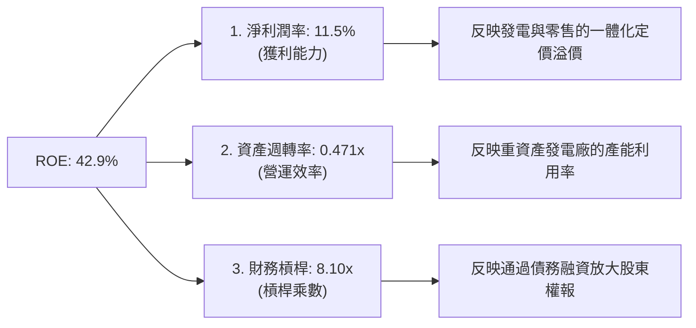

* **分析**：VST 的超高 ROE 主要由**高財務槓桿 (8.10x)** 所驅動，這在公用事業中是常見的。然而，11.5% 的淨利潤率和 0.47x 的資產週轉率表明其經營基本面同樣紮實，並非單純依靠負債生存。

### 6.4 獲利能力儀表板

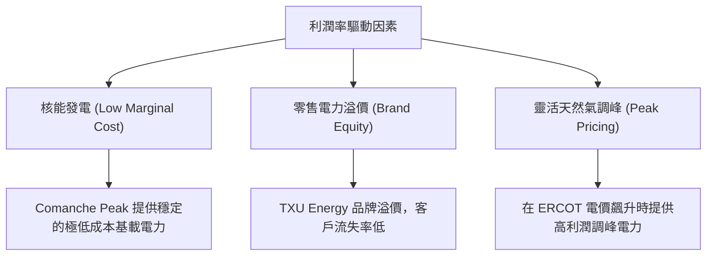

---

## 7. 估值深度分析

### 7.1 同業估值比較表格

我們選取了美國兩大競爭性發電與零售巨頭 **Constellation Energy (CEG)** 與 **NRG Energy (NRG)** 作為對比標的。

| 估值指標 | **Vistra Corp (VST)** | **Constellation (CEG)** | **NRG Energy (NRG)** | 本公司評估與洞察 |
|---|---|---|---|---|
| **當前股價** | **$158.83** | $215.40 | $82.10 | - |
| **市值 (Market Cap)** | **$53.55B** | $67.80B | $17.20B | VST 規模介於兩者之間。 |
| **P/E (Trailing)** | **26.56x** | 31.20x | 14.80x | 🟢 相比純核電龍頭 CEG 具備估值折價。 |
| **P/E (Forward)** | **14.46x** | 24.50x | 11.20x | 🟢 **極具吸引力**，遠期增長未完全定價。 |
| **PEG Ratio** | **0.47** | 1.85 | 0.95 | 🟢 **嚴重低估** (PEG < 1 視為極便宜)。 |
| **P/S Ratio** | **2.75x** | 3.15x | 0.58x | 🟡 處於合理區間。 |
| **P/B Ratio** | **20.49x** | 7.80x | 9.50x | 🔴 因激進回購稀釋了淨資產，帳面 P/B 偏高。 |
| **EV / EBITDA** | **11.08x** | 16.50x | 8.20x | 🟢 顯著低於 CEG，具備重估 (Re-rating) 空間。 |
| **評估狀態** | 🟢 **顯著低估** | 🟡 估值合理偏高 | 🟢 估值便宜但成長慢 | **VST 是兼具「高成長」與「低估值」的最佳選擇。** |

### 7.2 歷史估值區間分析

在 2024 年前，VST 作為傳統電力股，其 Forward P/E 歷史中樞僅在 8x-11x 之間。然而，隨著 **AI 數據中心對全天候清潔電力（核電）的需求被市場重新認知**，整個獨立發電板塊經歷了估值重估。

當前 VST 的 Forward P/E 為 **14.46x**，雖然高於其歷史均值，但考慮到未來 5 年預期 EPS 成長率高達 **81.33%**，其估值依然極具安全邊際，遠未達到泡沫化水平（同業 CEG 已達 24.5x）。

### 7.3 DCF 敏感性分析（6格目標價矩陣）

基於基準 FCF 預測、2.0% 的永續成長率，以及不同的 WACC 與成長假設，構建以下 6 格目標價矩陣：

| 營運情境 | **WACC = 9.0% (低折現率)** | **WACC = 9.9% (基準折現率)** | **WACC = 10.8% (高折現率)** |
|---|---|---|---|
| 🟢 **樂觀情境** (AI 需求超預期，核能溢價高) | **$300.00** (+88.9%) | **$265.00** (+66.8%) | **$230.00** (+44.8%) |
| 🟡 **基準情境** (按計畫並網，穩步推進回購) | **$250.00** (+57.4%) | **$223.00** (+40.4%) 🎯 | **$195.00** (+22.8%) |
| 🔴 **悲觀情境** (ERCOT 監管縮緊，融資成本上升) | **$165.00** (+3.9%) | **$145.00** (-8.7%) | **$125.00** (-21.3%) |

### 7.4 估值綜合區間

```
當前股價: $158.83
╔══════════════════════════════════════════════════════════════════╗
║                    VST 估值區間與定位                            ║
╠══════════════════════════════════════════════════════════════════╣
║                                                                  ║
║  [ $99.00 ] ─── [ $135.00 ] ─── [ $158.83 ] ─── [ $223.00 ] ── [ $320.00 ]  ║
║    52W低點       悲觀估值       ★當前價        基準目標價      52W高點      ║
║                                                                  ║
║  📊 當前股價定位：處於 52 週中下部區間，提供了極佳的買入契機。   ║
║     距離分析師基準目標價 $223.00 有 40.4% 的上行空間。           ║
╚══════════════════════════════════════════════════════════════════╝
```

---

## 8. 成長催化劑

### 8.1 催化劑時間軸

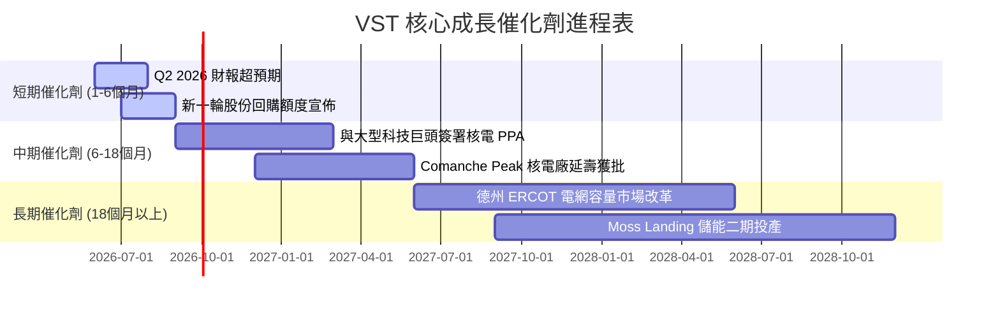

### 8.2 TAM 市場規模分析

```
╔══════════════════════════════════════════════════════════════╗
║              VST 潛在市場規模 (TAM) 擴展路徑                 ║
╠══════════════════════════════════════════════════════════════╣
║                                                              ║
║  1. 傳統德州零售與發電市場： TAM ~$25B (VST 滲透率: ~30%)     ║
║  2. AI 數據中心專用電力需求：TAM ~$15B (預計 CAGR: +25%)     ║
║  3. 電網級儲能與調峰市場：   TAM ~$8B  (VST 具備先發優勢)     ║
║                                                              ║
║  📊 預計到 2030 年，AI 數據中心將為德州電網增加超過 10 GW     ║
║     的電力需求，VST 作為最大發電商將直接吞食此增量市場。     ║
╚══════════════════════════════════════════════════════════════╝
```

### 8.3 成長驅動力結構圖

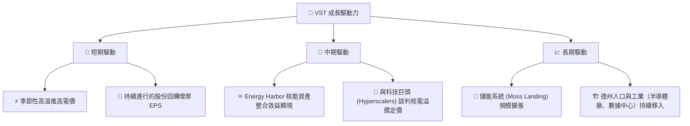

---

## 9. 風險矩陣

### 9.1 風險評分矩陣

```mermaid
quadrantChart
    title Risk Assessment Matrix
    x-axis Low Probability --> High Probability
    y-axis Low Impact --> High Impact
    quadrant-1 High Priority
    quadrant-2 Monitor Closely
    quadrant-3 Review Periodically
