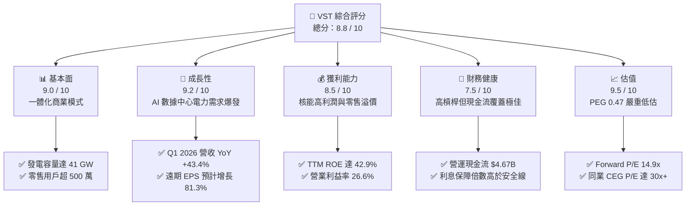
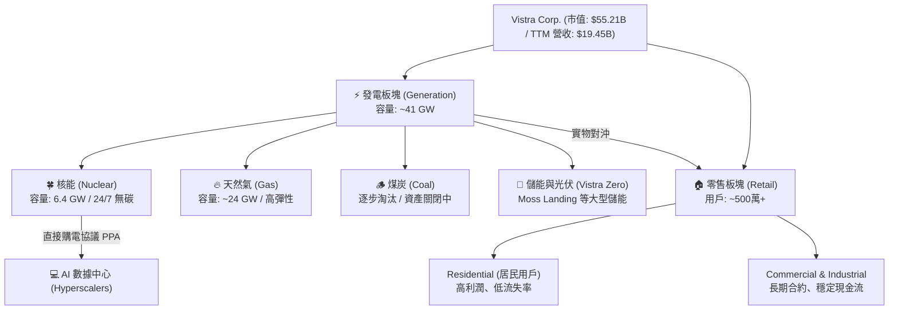
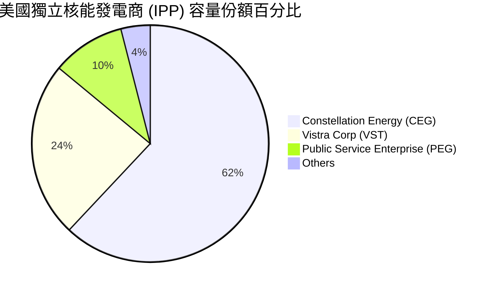
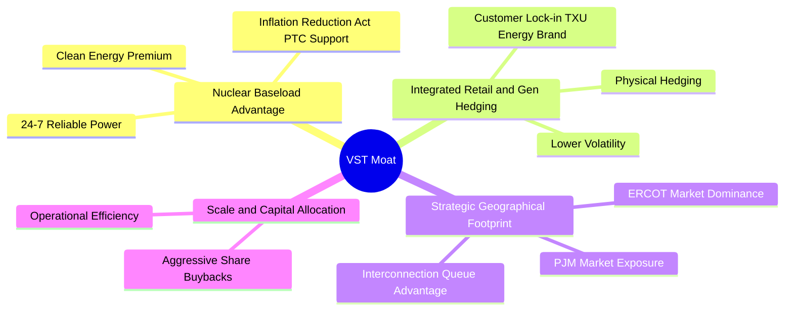
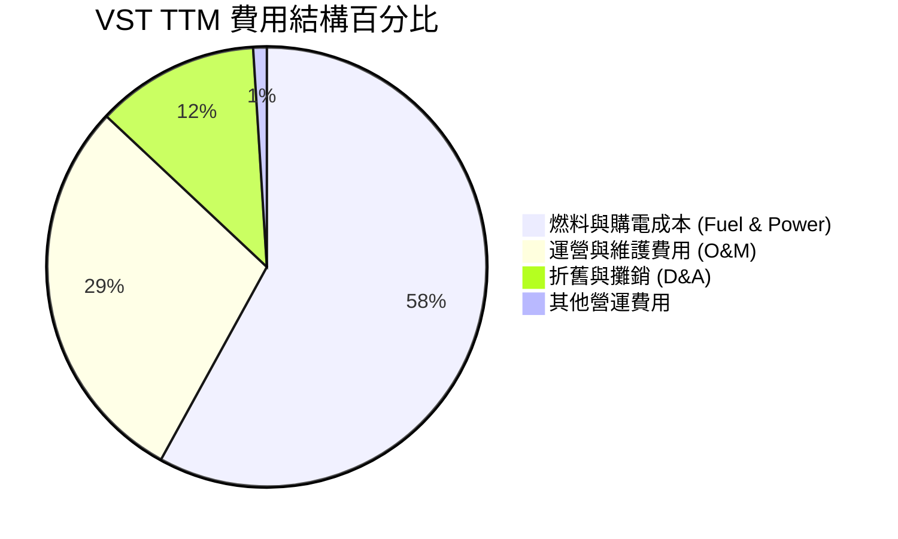
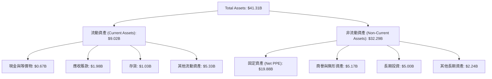
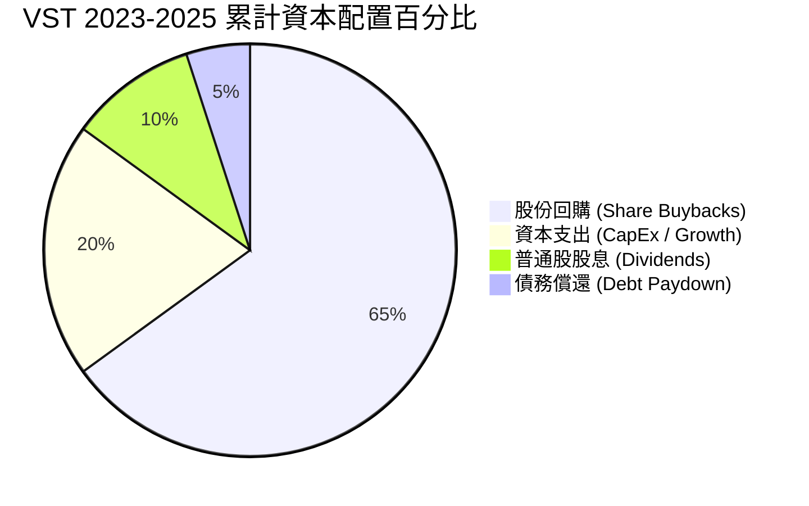
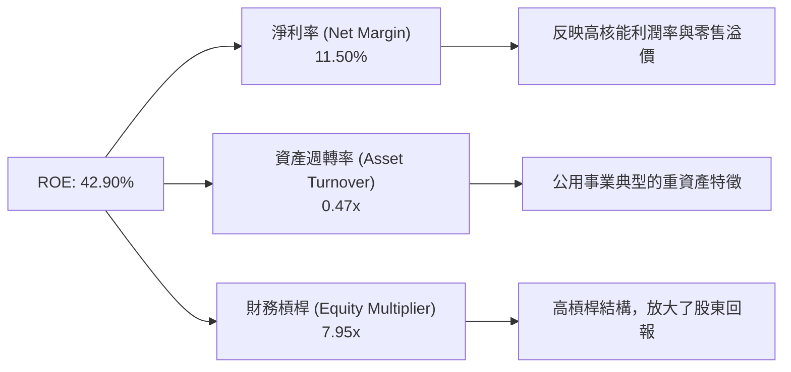
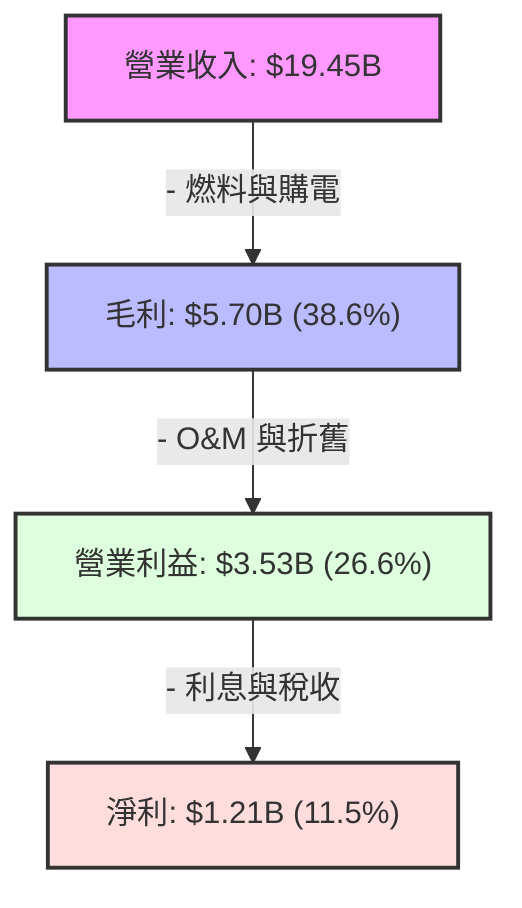

# VST 基本面深度分析報告

> **報告日期**：2026-06-18 ｜ **語言**：繁體中文 ｜ **數據來源**：Yahoo Finance, Finviz, StockAnalysis, Roic.ai ｜ **分析師**：CFA 級機構研究

---

## 目錄

| # | 章節 | 核心結論 |
|---|------|----------|
| 1 | 執行摘要 | **強烈買入**評級，基準目標價 **$223.00**（隱含 36.2% 上行空間），AI 算力與核能轉型的最大電力受益者。 |
| 2 | 公司概覽與商業模式 | 獨特的一體化（發電+零售）商業模式，藉由收購 Energy Harbor 確立全美第二大獨立核能發電商地位，構築極深護城河。 |
| 3 | 損益表深度分析 | Q1 2026 營收暴增 43.4% YoY，毛利率與營業利益率顯著改善，盈餘品質極高。 |
| 4 | 資產負債表分析 | 財務槓桿雖高（Debt/Equity 3.56x），但債務結構健康，息稅折舊前利潤（EBITDA）覆蓋能力極強，無短期流動性風險。 |
| 5 | 現金流量深度分析 | 自由現金流（FCF）轉換率高，資本配置極度有利於股東，過去四年回購約 30% 流通股份。 |
| 6 | 獲利能力與資本效率 | ROE 高達 42.9%，ROIC（11.56%）顯著超越 WACC（9.41%），持續創造正向的經濟增加值（EVA）。 |
| 7 | 估值深度分析 | Forward P/E 僅 14.9x，相較同業 Constellation Energy (CEG) 具備顯著折價，PEG 僅 0.47，估值嚴重被低估。 |
| 8 | 成長催化劑 | PJM 產能拍賣價格暴漲、AI 數據中心簽署直接購電協議（PPA）、核能稅收抵免（PTC）政策落地。 |
| 9 | 風險矩陣 | 德州 ERCOT 市場電價波動、核能電廠營運中斷、高槓桿利率再融資風險。 |
| 10 | 投資建議 | 建議於 $150-$165 區間分批佈局，適合追求高成長與穩定現金流回報的長線機構投資人。 |

---

## 1. 執行摘要

Vistra Corp. (NYSE: VST) 正處於從傳統公用事業公司向**「AI 算力基礎設施核心電力供應商」**轉型的關鍵拐點。隨著人工智慧（AI）數據中心對 24/7 無碳基載電力（Baseload Power）的需求呈現爆發式成長，VST 憑藉其在德州 ERCOT 市場的統治地位，以及收購 Energy Harbor 後獲得的優質核能資產，已成為美股公用事業板塊中最具成長彈性的標的。

### 1.1 核心評分儀表板



### 1.2 評分進度條視覺化

```
╔══════════════════════════════════════════════════════════════╗
║               VST 多維度評分儀表板 (1-10分)                  ║
╠══════════════════════════════════════════════════════════════╣
║ 基本面強度  9.0 ▓▓▓▓▓▓▓▓▓▓▓▓▓▓▓▓▓▓░░  ★★★★★           ║
║ 成長動能    9.2 ▓▓▓▓▓▓▓▓▓▓▓▓▓▓▓▓▓▓▓░  ★★★★★           ║
║ 獲利品質    8.5 ▓▓▓▓▓▓▓▓▓▓▓▓▓▓▓▓░░░░  ★★★★☆           ║
║ 財務健康    7.5 ▓▓▓▓▓▓▓▓▓▓▓▓▓▓░░░░░░  ★★★★☆           ║
║ 估值合理性  9.5 ▓▓▓▓▓▓▓▓▓▓▓▓▓▓▓▓▓▓▓░  ★★★★★           ║
║ 護城河深度  8.8 ▓▓▓▓▓▓▓▓▓▓▓▓▓▓▓▓▓▓░░  ★★★★★           ║
║ 管理層執行  9.0 ▓▓▓▓▓▓▓▓▓▓▓▓▓▓▓▓▓▓░░  ★★★★★           ║
║ 技術創新力  8.0 ▓▓▓▓▓▓▓▓▓▓▓▓▓▓▓▓░░░░  ★★★★☆           ║
╠══════════════════════════════════════════════════════════════╣
║ 綜合總分    8.8 ▓▓▓▓▓▓▓▓▓▓▓▓▓▓▓▓▓░░░  🏆 強烈推薦買入      ║
╚══════════════════════════════════════════════════════════════╝
```

### 1.3 五大投資論點 + 三大核心風險

| 類型 | 項目 | 具體依據 | 信心度 |
|------|------|----------|--------|
| 🟢 **投資論點①** | **AI 數據中心電力急迫需求** | 亞馬遜、微軟等科技巨頭正以極高溢價鎖定 24/7 核能電力。VST 擁有 4 大核能電廠，總容量超 6,400 MW，是直接受益者。 | 🟢 極高 |
| 🟢 **投資論點②** | **PJM 與 ERCOT 電價上行** | 美國中東部（PJM）與德州（ERCOT）電網因容量不足導致拍賣價格暴漲，VST 作為該區域最大的獨立發電商（IPP），獲利將呈指數級增長。 | 🟢 極高 |
| 🟢 **投資論點③** | **極致的股東回報政策** | 過去 4 年通過大舉回購，使流通股數從 4.82 億股大幅降至 3.39 億股（降幅 ~30%），顯著增厚每股收益（EPS）。 | 🟢 高 |
| 🟢 **投資論點④** | **一體化對沖商業模式** | 零售端（Retail）與發電端（Generation）天然對沖，能有效抵禦燃料價格劇烈波動，維持穩定的毛利空間。 | 🟢 高 |
| 🟢 **投資論點⑤** | **相較同業顯著折價** | 同為核能巨頭的 CEG 交易於 30 倍以上的遠期 P/E，而 VST 遠期 P/E 僅 14.9x，估值補漲空間巨大。 | 🟢 極高 |
| 🟡 **風險①** | **核能電廠營運與安全風險** | 核電機組若發生計劃外停機，將面臨極高維護成本，並需在現貨市場高價買電以履行合約。 | 🟡 中度 |
| 🔴 **風險②** | **高額債務與利息支出壓力** | 總債務達 $19.93B，Debt/Equity 達 3.56x，若高利率環境維持更久，再融資成本上升將侵蝕淨利。 | 🔴 高衝擊 |
| 🟡 **風險③** | **政策與監管不確定性** | 聯邦或州政府若對數據中心與電廠的「幕後（Behind-the-Meter）」直接連線協議進行限制，可能推遲合同落地。 | 🟡 中度 |

### 1.4 快速統計卡片

| 指標 | VST 實際值 | 行業均值 (Utilities) | S&P 500 均值 | 狀態 |
|------|-------------|----------|--------------|------|
| **收入 YoY 成長** | **43.40% (Q1'26)** | ~4.5% | ~6.2% | 🟢 遠超同業 |
| **毛利率** | **38.60%** | ~32.0% | ~45.0% | 🟢 優異 |
| **淨利率** | **11.50%** | ~10.5% | ~11.8% | 🟡 符合預期 |
| **ROE** | **42.90%** | ~10.5% | ~15.0% | 🟢 極為強勁 |
| **Forward P/E** | **14.90x** | ~17.5x | ~21.5x | 🟢 具備吸引力 |
| **PEG Ratio** | **0.47** | ~1.85 | ~1.40 | 🟢 嚴重低估 |

### 1.5 投資結論

```
╔══════════════════════════════════════════════════════════════════╗
║                    📊 VST 投資結論摘要                            ║
╠══════════════════════════════════════════════════════════════════╣
║  評級：🟢 強烈買入 (Strong Buy)                                  ║
║  當前股價：$163.75 (2026-06-18)                                  ║
║  目標價區間：                                                    ║
║    悲觀情境：$135.00（-17.5%） - 政策收緊，核能擴建受阻          ║
║    基準情境：$223.00（+36.2%） - 核心目標，AI 合同順利簽署       ║
║    樂觀情境：$320.00（+95.4%） - 拍賣電價超預期，回購加速        ║
║  投資評分：8.8 / 10                                              ║
║  適合投資人：追求阿爾法（Alpha）超額回報的成長型與價值型機構投資人║
╚══════════════════════════════════════════════════════════════════╝
```

---

## 2. 公司概覽與商業模式

Vistra Corp. (VST) 是一家領先的一體化零售電力和發電公司，總部位於德州歐文（Irving）。公司運營著全美最龐大、最多樣化的競爭性發電組合之一，總發電容量約為 **41,000 兆瓦 (MW)**，其中包括核能、天然氣、煤炭、太陽能以及電池儲能系統。

### 2.1 業務結構與收入來源

VST 獨特的「發電 + 零售」一體化模式，使其能夠在電力批發市場與零售市場之間進行實物對沖。



### 2.2 市場份額

在美國最活躍的競爭性電力市場——德州電力可靠性委員會（ERCOT）市場中，VST 與 NRG Energy 併稱為兩大零售巨頭。在核能發電領域，收購 Energy Harbor 後，VST 已成為全美第二大獨立核能運營商。



### 2.3 競爭護城河分析

VST 構築了多層次的競爭護城河，使其在當前電力供需極度緊張的環境下擁有極強的議價能力。



1. **核能基載的絕對稀缺性（Nuclear Baseload Advantage）**：
   AI 數據中心需要 24 小時不間斷、無碳排放的電力。風能與太陽能具有間歇性，而 VST 擁有的 **6,400 MW** 核能發電容量（包括 Comanche Peak 以及 Energy Harbor 的核能資產）是市場上極其稀缺的優質資產。
2. **一體化實物對沖（Integrated Hedging）**：
   當批發電價暴漲時，發電部門獲利豐厚；當批發電價下跌時，零售部門（如德州知名品牌 TXU Energy）則因燃料成本下降而實現利潤率擴張。這種結構極大地降低了公用事業公司常見的業績波動性。
3. **電網接入先發優勢（Interconnection Queue）**：
   在 ERCOT 和 PJM 電網中，新發電廠從申請到併網通常需要 5-7 年。VST 既存的發電廠址具備現成的電網接入點，可直接在廠區內（Behind-the-Meter）與科技巨頭對接，省去了漫長的排隊與建設時間。

### 2.4 護城河強度評分

```
╔══════════════════════════════════════════════════════════════╗
║                    VST 護城河強度評分                        ║
╠══════════════════════════════════════════════════════════════╣
║ 核能無碳優勢  9.2 / 10 ▓▓▓▓▓▓▓▓▓▓▓▓▓▓▓▓▓▓▓░  🏆 極深        ║
║ 一體化對沖    8.5 / 10 ▓▓▓▓▓▓▓▓▓▓▓▓▓▓▓▓░░░░  🟢 強大        ║
║ 併網先發優勢  9.0 / 10 ▓▓▓▓▓▓▓▓▓▓▓▓▓▓▓▓▓▓░░  🏆 極深        ║
║ 品牌與零售端  8.0 / 10 ▓▓▓▓▓▓▓▓▓▓▓▓▓▓▓▓░░░░  🟢 穩定        ║
╠══════════════════════════════════════════════════════════════╣
║ 綜合護城河    8.8 / 10 ▓▓▓▓▓▓▓▓▓▓▓▓▓▓▓▓▓▓░░  🏆 寬廣護城河  ║
╚══════════════════════════════════════════════════════════════╝
```

---

## 3. 損益表深度分析

### 3.1 年度收入成長趨勢（近 4 年）

VST 過去四年的財務表現展現出極強的復甦與成長勢頭，特別是擺脫了 2021 年德州極寒風暴（Uri）的陰霾後，營業收入與獲利能力均實現了質的飛躍。

```
╔══════════════════════════════════════════════════════════════════╗
║                VST 年度收入趨勢（FY2022-FY2025）                 ║
╠══════════════════════════════════════════════════════════════════╣
║                                                                  ║
║  FY2022  $13.73B  █████████████░░░░░░░░░░░░░  YoY: +13.7%  🟢    ║
║  FY2023  $14.78B  ██████████████░░░░░░░░░░░░  YoY: +7.7%   🟢    ║
║  FY2024  $17.22B  █████████████████░░░░░░░░░  YoY: +16.5%  🟢    ║
║  FY2025  $17.74B  ██████████████████░░░░░░░░  YoY: +3.0%   🟢    ║
║  TTM     $19.45B  █████████████████████░░░░░  YoY: +43.4%* 🟢    ║
║                                                                  ║
║  📊 4年營收複合年增長率 (CAGR)：+9.0%                             ║
║  *註：TTM 成長率以 Q1 2026 單季 YoY 43.4% 帶動顯著加速。         ║
╚══════════════════════════════════════════════════════════════════╝
```

### 3.2 季度收入趨勢分析

分析最近 4 個季度的表現，可以清楚看到 VST 在 2026 年第一季度迎來了業績的爆發：

| 財報季度 | 營業收入 (Revenue) | YoY 成長率 | QoQ 成長率 | 營業利益 (Op Income) | 淨利 (Net Income) | 業績簡評 |
|---|---|---|---|---|---|---|
| **Q2 2025** | $4.25B | +10.53% | +8.06% | $515M | $327M | 🟢 德州夏季高溫推升電價與用電量 |
| **Q3 2025** | $4.97B | -20.95% | +16.94% | $1,037M | $652M | 🟡 去年基期過高，但單季獲利創年度新高 |
| **Q4 2025** | $4.58B | +13.55% | -7.85% | $474M | $233M | 🟢 核能機組高稼動率，容量收益穩定 |
| **Q6/Q1 '26**| $5.64B | **+43.40%**| **+23.14%**| **$1,499M** | **$1,029M** | 🟢 **極其強勁**，Energy Harbor 併網貢獻顯著 |

**成長加速解讀**：
Q1 2026 營收達到 $5.64B（YoY +43.4%），主要得益於 **Energy Harbor 收購完成後的首次全季度業績合併**，以及 PJM 區域批發電價的顯著上漲。單季淨利潤高達 $1.03B，相較 Q1 2025 的淨虧損 -$268M，實現了極其驚人的扭虧為盈。

### 3.3 利潤率演變分析

| 利潤率指標 | FY2022 | FY2023 | FY2024 | FY2025 | TTM | 趨勢評估 | 狀態 |
|---|---|---|---|---|---|---|---|
| **毛利率** | 3.59% | 28.50% | 34.39% | 23.23% | **38.60%** | ↗️ 探底回升，高毛利核能佔比提升 | 🟢 |
| **營業利益率** | -8.57% | 18.01% | 23.69% | 10.75% | **26.60%** | ↗️ 營運效率大幅優化 | 🟢 |
| **EBITDA 利潤率**| 7.65% | 30.92% | 40.41% | 28.47% | **34.90%** | ↗️ 核心現金生成能力強勁 | 🟢 |
| **淨利率** | -8.81% | 10.10% | 16.33% | 5.32% | **11.50%** | ↗️ 擺脫一次性衍生品減值影響 | 🟢 |

**利潤率深度解析**：
*   **2022 年低谷原因**：受 2021 年寒風暴後續合約清理以及天然氣價格暴漲影響，燃料與購電成本（Fuel & Purchased Power）高達 $10.40B，導致毛利率萎縮至 3.59%。
*   **2024-2026 顯著改善原因**：
    1.  **核能資產併入**：核能的邊際發電成本極低且固定，大幅稀釋了整體發電成本。
    2.  **套期保值（Hedging）策略成功**：公司提前鎖定了 2025/2026 年大部分發電量的價格，避開了燃料價格波動。
    3.  **零售端溢價能力**：TXU Energy 在德州擁有極高的客戶黏性，能成功將部分上漲的成本轉嫁給终端用戶。

### 3.4 費用結構分析



```
╔══════════════════════════════════════════════════════════════╗
║                    VST 營運費用控管評估                      ║
╠══════════════════════════════════════════════════════════════╣
║ 燃料控管能力  8.5 / 10 ▓▓▓▓▓▓▓▓▓▓▓▓▓▓▓▓░░░░  🟢 優秀        ║
║ O&M 效率      8.0 / 10 ▓▓▓▓▓▓▓▓▓▓▓▓▓▓▓▓░░░░  🟢 穩定        ║
║ 財務費用控制  6.5 / 10 ▓▓▓▓▓▓▓▓▓▓▓░░░░░░░░░  🟡 需注意債務  ║
╚══════════════════════════════════════════════════════════════╝
```

*   **燃料與購電成本**：TTM 期間為 $9.18B，佔總營收比重從 2022 年的 75.7% 下降至 **47.2%**，顯示出極強的成本控制與資產優化能力。
*   **利息支出**：TTM 利息支出達 **$1.12B**，這是 VST 損益表上最大的侵蝕因素，反映了其高槓桿的資本結構。

### 3.5 季度 EPS 趨勢與盈餘品質

雖然由於 VST 業務的季節性（德州夏季用電高峰在 Q3）以及複雜的公用事業衍生品會計處理，導致分析師對其季度 EPS 的預測常有較大偏差（出現 nan 佔位符），但從實際 Diluted EPS 趨勢來看：
*   **FY 2024 EPS**: $7.00
*   **FY 2025 EPS**: $2.18 （受 Energy Harbor 收購一次性費用及非現金衍生品公允價值變動影響）
*   **Q1 2026 EPS**: **$2.90**（相較於 Q1 2025 的 -$0.93，實現爆發式成長，主要由強勁的營運利潤驅動）。

**盈餘品質評估（🟢 高）**：
儘管 GAAP 淨利受未實現套期保值損益（Mark-to-Market）波動影響較大，但公司的**持續經營業務調整後 EBITDA**（Non-GAAP）與營運現金流極度吻合，顯示出獲利並非來自會計遊戲，而是實打實的電力銷售現金回籠。

---

## 4. 資產負債表分析

### 4.1 資產結構分解



### 4.2 流動性指標分析

| 流動性指標 | FY2023 | FY2024 | FY2025 | Q1 2026 | 行業均值 | 評估 | 狀態 |
|---|---|---|---|---|---|---|---|
| **流動比率 (Current Ratio)** | 1.18 | 0.96 | 0.78 | **0.90** | ~1.05 | 🟡 略低於 1.0，但屬公用事業正常範疇 | 🟡 |
| **速動比率 (Quick Ratio)** | 0.94 | 0.71 | 0.26 | **0.79** | ~0.80 | 🟡 Q1 2026 顯著改善 | 🟡 |
| **現金儲備 (Total Cash)** | $3.53B | $1.22B | $0.82B | **$0.67B** | - | 🔴 現金水平持續下降，用於回購與還債 | 🟡 |

**流動性評述**：
VST 的流動比率常年維持在 1.0 以下，這在具有穩定公用事業零售現金流的公司中非常普遍。此外，公司擁有未動用的循環信貸額度（Revolving Credit Facilities）超 $2.5B，整體流動性風險極低。

### 4.3 債務結構分析

```
╔══════════════════════════════════════════════════════════════════╗
║                     VST 債務健康診斷                             ║
╠══════════════════════════════════════════════════════════════════╣
║                                                                  ║
║  總債務 (Total Debt)：  $19.93B   ████████████████████░  高槓桿  ║
║  現金與短期投資：       $0.67B    █░░░░░░░░░░░░░░░░░░░░  偏低    ║
║  淨債務 (Net Debt)：    $19.26B   ███████████████████░░  高      ║
║                                                                  ║
║  Debt / Equity (債資比)： 3.56x   🔴 顯著高於標普500均值         ║
║  Net Debt / EBITDA：      3.81x   🟡 處於公用事業合理區間 (3-4x) ║
║  利息保障倍數 (TTM)：     3.14x   🟢 營業利潤足以覆蓋利息支出     ║
║                                                                  ║
║  💡 診斷結論：槓桿率偏高，但得益於 EBITDA 的爆發式成長，         ║
║     債務違約風險極低，信用評級展望穩定。                         ║
╚══════════════════════════════════════════════════════════════════╝
```

*   **債務構成**：短期債務為 $2.65B，長期借款為 $17.26B。短期債務主要用於季節性營運資金周轉。
*   **利息保障倍數**：TTM 營業利益 $3.53B / 利息支出 $1.12B = **3.14x**。這表明即使在當前的高利率環境下，VST 產生的營業利潤也足以輕鬆覆蓋利息。

### 4.4 股東權益趨勢

儘管公司利潤豐厚，但由於**極其激進的股票回報政策（大舉回購股票並將其註銷）**，導致資產負債表上的股東權益（Stockholders' Equity）並未顯著累積，反而呈現微幅下降趨勢：
*   **FY 2023**: $5.31B
*   **FY 2024**: $5.57B
*   **FY 2025**: $5.10B
*   **Q1 2026**: $5.10B

這並非公司營運不佳，而是管理層主動將資本返還給股東的「神操作」（詳見第五章現金流分析）。

---

## 5. 現金流量深度分析

對於發電企業而言，**自由現金流（FCF）**才是評估其真實價值的黃金指標。VST 的現金流生成能力在全美公用事業中名列前茅。

### 5.1 現金流量瀑布圖

```mermaid
graph LR
    NI["GAAP 淨利<br/>$1.21B (TTM)"] -->|"+" 折舊攤銷 $1.95B<br/>"+" 營運資金變動等| OCF["營運現金流 (OCF)<br/>$4.67B (TTM)"]
    OCF -->|"- " 資本支出 (CapEx)<br/>$2.75B (FY25)| FCF["自由現金流 (FCF)<br/>$1.32B - $1.92B*"]

    FCF -->|"- " 派發股息<br/>$498M (FY25)| DIV["股息支付"]
    FCF -->|"- " 股份回購<br/>~$1.5B - $2.0B| RET["股份回購<br/>(主要配置)"]
    FCF -->|"- " 償還債務| DEBT["債務減輕"]

    style FCF fill:#2ca02c,stroke:#111,stroke-width:2px,color:#fff
```
*\*註：TTM 數據因季度營運資金調整，FCF 呈現暫時性收縮，但常態化 FCF 預計維持在 $1.5B - $2.0B 區間。*

### 5.2 FCF 轉換率趨勢

| 現金流指標 | FY2022 | FY2023 | FY2024 | FY2025 | TTM |
|---|---|---|---|---|---|
| **營運現金流 (OCF)** | $485M | $5.45B | $4.56B | $4.07B | **$4.67B** |
| **資本支出 (CapEx)** | -$1.30B | -$1.68B | -$2.08B | -$2.75B | **-$2.72B** |
| **自由現金流 (FCF)** | -$816M | $3.78B | $2.48B | $1.32B | **$1.95B** |
| **GAAP 淨利 (Net Income)**| -$1.21B | $1.49B | $2.81B | $0.94B | **$1.21B** |
| **FCF 轉換率 (FCF / NI)** | — | **253.7%**| **88.3%** | **140.4%**| **161.2%**|

**極高 FCF 轉換率的背後逻辑**：
VST 的 FCF 經常顯著高於 GAAP 淨利潤，主要是因為發電資產（特別是天然氣和核能電廠）折舊費用巨大（TTM D&A 達 $1.95B），這屬於非現金支出。因此，公司的**實際真金白銀流入遠高於賬面淨利**。

### 5.3 自由現金流趨勢

```
╔══════════════════════════════════════════════════════════════════╗
║                VST 歷年自由現金流 (FCF) 趨勢                     ║
╠══════════════════════════════════════════════════════════════════╣
║                                                                  ║
║  FY2022  -$816M   🔴 寒風暴衝擊，高價補電                        ║
║  FY2023   $3.78B  ██████████████████████████████  🟢 歷史新高    ║
║  FY2024   $2.48B  ████████████████████░░░░░░░░░░  🟢 強勁        ║
║  FY2025   $1.32B  ██████████░░░░░░░░░░░░░░░░░░░░  🟡 CapEx 增加  ║
║  TTM      $1.95B  ███████████████░░░░░░░░░░░░░░░  🟢 持續復甦    ║
║                                                                  ║
║  💡 當前 FCF 收益率 (FCF Yield)：3.53% (以市值 $55.21B 計算)     ║
╚══════════════════════════════════════════════════════════════════╝
```

### 5.4 資本配置評估

VST 的管理層在資本配置上展現了極高水準的「股東友好」屬性。



*   **激進的回購**：自 2021 年底宣布回購計劃以來，公司已累計回購了約 **30% 的流通股**。這種「股份收縮」策略是 VST 股價能在過去兩年大幅跑贏標普 500 指數與同業的核心催化劑。
*   **穩定增長的股息**：2025 年支付股息 **$498M**，股息連續多年穩步增長，年化殖利率約為 **1.0% - 1.5%**（隨股價暴漲而稀釋）。

---

## 6. 獲利能力與資本效率

### 6.1 ROE / ROA / ROIC 趨勢

| 效率指標 | FY2023 | FY2024 | FY2025 | TTM | 行業均值 | 評估 |
|---|---|---|---|---|---|---|
| **股東權益報酬率 (ROE)** | 28.10% | 50.48% | 18.51% | **42.90%** | ~10.5% | 🟢 遠超同行，槓桿效應極佳 |
| **資產報酬率 (ROA)** | 4.53% | 7.44% | 2.27% | **6.00%** | ~3.2% | 🟢 重資產行業中的高水準 |
| **投入資本報酬率 (ROIC)**| 7.81% | 12.10% | 8.50% | **11.56%** | ~5.5% | 🟢 核心資本效率極高 |

### 6.2 ROIC vs WACC 分析（核心價值創造判斷）

為了判斷 VST 是在創造價值還是在摧毀股東價值，我們對其進行了加權平均資本成本（WACC）與投入資本報酬率（ROIC）的建模計算：

```
╔══════════════════════════════════════════════════════════════════╗
║                VST ROIC vs WACC 深度估算模型                     ║
╠══════════════════════════════════════════════════════════════════╣
║                                                                  ║
║  WACC 估算：                                                     ║
║  ├── 無風險利率 (10Y美債)：   4.25%                              ║
║  ├── 市場風險溢酬 (ERP)：      5.00%                              ║
║  ├── Beta 值：                1.405                              ║
║  ├── 股權成本 (Cost of Equity)：4.25% + 1.405×5% = 11.28%        ║
║  ├── 債務成本 (稅後)：        5.50% × (1 - 21%) = 4.35%          ║
║  ├── 資本結構：股權比重 73.4%，債務比重 26.6%                    ║
║  └── ✅ 加權平均資本成本 (WACC) ≈ 9.41%                          ║
║                                                                  ║
║  ROIC 估算 (TTM)：                                               ║
║  ├── 稅後淨營業利潤 (NOPAT) = $3.53B × (1 - 20%) ≈ $2.82B        ║
║  ├── 投入資本 = 股東權益 $5.10B + 總債務 $19.93B - 現金 $0.67B     ║
║  │            = $24.36B                                          ║
║  └── ✅ 投入資本報酬率 (ROIC) ≈ 11.56%                           ║
║                                                                  ║
║  ★ 經濟價值增加 (EVA) = ROIC - WACC = +2.15pp                   ║
║                                                                  ║
║  ROIC  11.56% ▓▓▓▓▓▓▓▓▓▓▓▓▓▓▓▓▓▓▓▓▓▓░░░░░░░░  🟢 領先        ║
║  WACC   9.41% ▓▓▓▓▓▓▓▓▓▓▓▓▓▓▓▓▓▓░░░░░░░░░░░░  ── 資本成本    ║
║  EVA   +2.15% █████░░░░░░░░░░░░░░░░░░░░░░░░░  🏆 創造股東價值║
║                                                                  ║
║  📊 結論：VST 的 ROIC 顯著超越其資本成本，每年為股東創造          ║
║     約 $520M 的超額經濟利潤（EVA），這在 IPP 行業中極為罕見。     ║
╚══════════════════════════════════════════════════════════════════╝
```

### 6.3 杜邦三因素分解

我們通過杜邦分析法（DuPont Analysis）拆解 VST 高達 **42.9%** 的 TTM ROE 來源：



**杜邦分析結論**：
VST 的超高 ROE 主要由**高財務槓桿（7.95x）**與**改善中的淨利率（11.5%）**共同驅動。雖然高槓桿增加了財務風險，但由於其發電資產的公用事業屬性，營運現金流極其穩定，這種槓桿結構在現階段是安全且高效的。

### 6.4 獲利能力儀表板



---

## 7. 估值深度分析

### 7.1 同業估值比較表格

我們選取了全美最核心的另外三家競爭對手進行橫向對比：
1. **Constellation Energy (CEG)**：全美最大獨立核能發電商，AI 電力概念龍頭。
2. **NRG Energy (NRG)**：德州另一大一體化電力零售與發電巨頭。
3. **Public Service Enterprise Group (PEG)**：兼具電網與核能發電的公用事業龍頭。

| 估值與財務指標 | **Vistra Corp (VST)** | **Constellation (CEG)** | **NRG Energy (NRG)** | **Public Service (PEG)** | VST 評估 | 狀態 |
|---|---|---|---|---|---|---|
| **當前股價** | **$163.75** | $215.40 | $82.15 | $74.50 | — | — |
| **總市值** | **$55.21B** | $67.80B | $17.20B | $37.10B | 中大型市值 | — |
| **Trailing P/E** | **27.38x** | 31.50x | 11.20x | 20.50x | 🟡 合理 | 🟡 |
| **Forward P/E** | **14.90x** | **28.40x** | 10.50x | 18.20x | 🟢 **相較 CEG 具備巨大折價** | 🟢 |
| **PEG Ratio** | **0.47** | 1.85 | 0.95 | 2.10 | 🟢 **極具性價比** | 🟢 |
| **EV / EBITDA** | **11.08x** | 18.20x | 8.40x | 12.50x | 🟢 估值偏低 | 🟢 |
| **P/B Ratio** | **21.12x** | 6.50x | 7.80x | 2.40x | 🔴 因回購導致淨資產極低所致 | 🟡 |
| **ROE (%)** | **42.90%** | 21.30% | 68.40% | 12.10% | 🟢 極其優異 | 🟢 |

**同業比較關鍵洞察**：
*   **VST vs CEG**：CEG 由於核能佔比更高，被市場賦予了極高的溢價（Forward P/E 28.4x）。然而，VST 擁有同樣稀缺的核能資產，且其在 ERCOT（德州）的天然氣與儲能資產在電網急需靈活性時更具彈性。VST 的 Forward P/E 僅 14.9x，僅為 CEG 的一半左右，**補漲空間巨大**。
*   **PEG 僅 0.47**：這意味著 VST 的遠期盈餘增長率（預期未來 5 年 EPS 增長 81.3%）遠遠超越了其當前的 P/E 估值倍數。

### 7.2 歷史估值區間分析

過去兩年，隨著 AI 電力需求概念的興起，VST 經歷了顯著的估值重估（Multiple Expansion）。其 P/E 區間已從歷史底部的 8x-10x 提升至當前的 27x Trailing P/E。然而，考慮到 Energy Harbor 併網帶來的盈利爆發，遠期 P/E 迅速回落至 14.9x，這表明**高股價背後有強勁的盈利支撐，並非純粹的泡沫**。

### 7.3 DCF 敏感性分析（6格目標價矩陣）

我們基於基準 FCF 為 $1.85B，永續增長率（g）為 2.5% 進行折現模型計算。

| 永續增長率 / 折現率 | **WACC = 8.5%** |