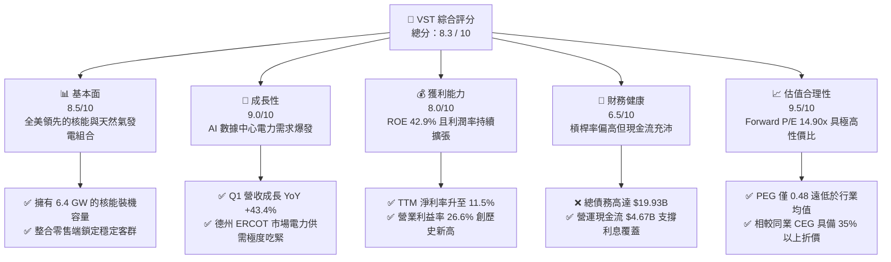
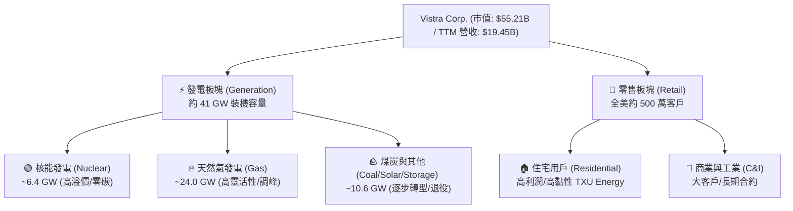
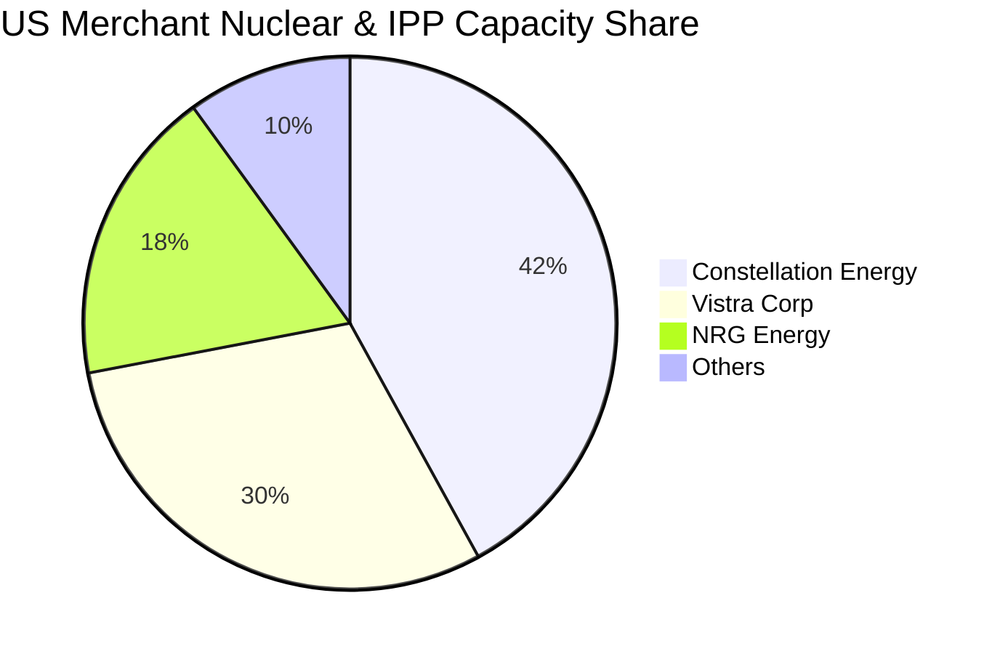
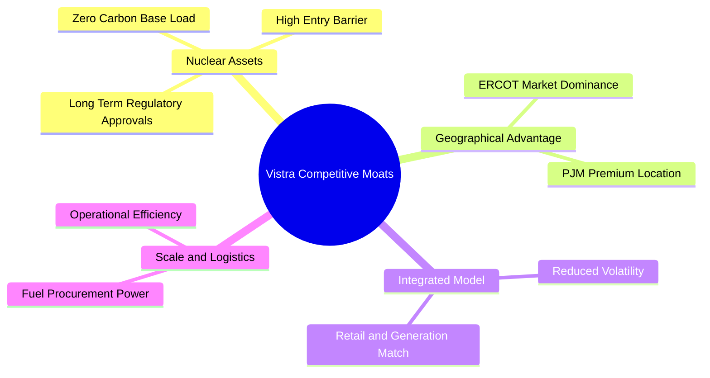
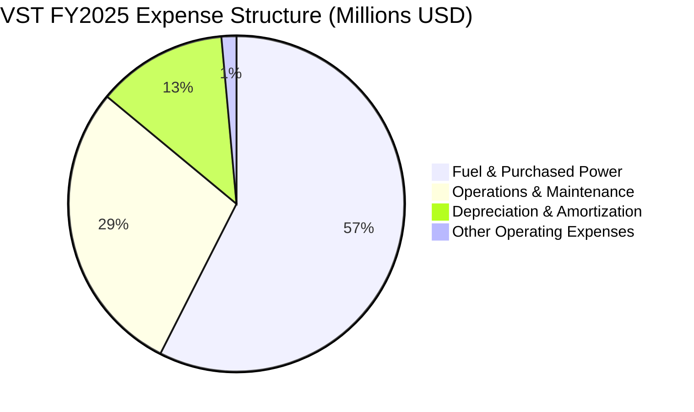
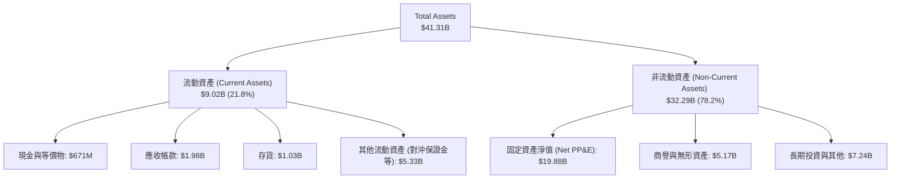
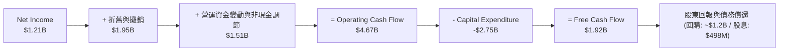
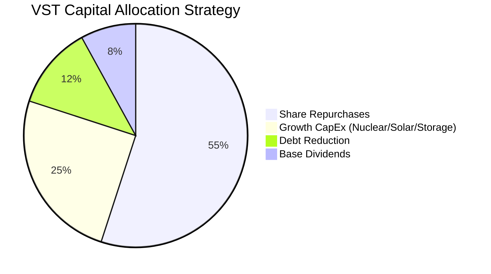

# VST 基本面深度分析報告

> **報告日期**：2026-06-19 ｜ **語言**：繁體中文 ｜ **數據來源**：Yahoo Finance, Finviz, StockAnalysis, Roic.ai ｜ **分析師**：CFA 級機構研究

---

## 目錄

| # | 章節 | 核心結論 |
|---|---|---|
| 1 | [執行摘要](#1-執行摘要) | 評級「強烈買入」，目標價 $223.00，AI 電力需求與核能資產重估驅動重估。 |
| 2 | [公司概覽與商業模式](#2-公司概覽與商業模式) | 整合型零售與獨立發電廠（IPP）模式，具備 ERCOT 與 PJM 區域極強的定價權與護城河。 |
| 3 | [損益表深度分析](#3-損益表深度分析) | TTM 營收達 $19.45B（YoY +43.4%），Q1 淨利大增，利潤率因能源對沖與產能釋放顯著改善。 |
| 4 | [資產負債表分析](#4-資產負債表分析) | 財務槓桿偏高（Debt/Equity 3.55x），但公用事業屬性與穩健現金流使債務結構整體安全。 |
| 5 | [現金流量深度分析](#5-現金流量深度分析) | TTM 營運現金流 $4.67B，資本支出上升，積極的股份回購大幅提升股東回報率。 |
| 6 | [獲利能力與資本效率](#6-獲利能力與資本效率) | ROE 達 42.9%，ROIC（11.65%）大於 WACC（9.64%），持續創造正向經濟增加值（EVA）。 |
| 7 | [估值深度分析](#7-估值深度分析) | Forward P/E 僅 14.90x，相較同行（如 CEG）具備顯著折價，DCF 基準估值為 $223.00。 |
| 8 | [成長催化劑](#8-成長催化劑) | AI 數據中心「幕後發電」合約談判、德州產能擴建及 PJM 容量電價歷史性暴漲。 |
| 9 | [風險矩陣](#9-風險矩陣) | 高槓桿債務壓力、德州監管政策變更、核能電廠非計劃停機及燃料成本波動。 |
| 10 | [投資建議](#10-投資建議) | 當前股價 $163.75 具備極佳風險回報比，建議「分批買入」，重點監控數據中心合約進展。 |

---

## 1. 執行摘要

Vistra Corp.（紐約證券交易所代碼：**VST**）是美國最大的獨立發電商（IPP）與零售電力供應商之一。隨著人工智慧（AI）數據中心對電力需求的爆發性成長，以及對零碳、全天候基載電力（如核能）的迫切需求，VST 已從傳統的公用事業股轉型為具備強烈科技成長屬性的「AI 基礎設施」標的。

### 1.1 核心評分儀表板



### 1.2 評分進度條視覺化

```
╔══════════════════════════════════════════════════════════════╗
║                VST 多維度評分儀表板 (1-10分)                 ║
╠══════════════════════════════════════════════════════════════╣
║ 基本面強度  8.5 ▓▓▓▓▓▓▓▓▓▓▓▓▓▓▓▓▓░░░  ★★★★☆           ║
║ 成長動能    9.0 ▓▓▓▓▓▓▓▓▓▓▓▓▓▓▓▓▓▓░░  ★★★★★           ║
║ 獲利品質    8.0 ▓▓▓▓▓▓▓▓▓▓▓▓▓▓▓▓░░░░  ★★★★☆           ║
║ 財務健康    6.5 ▓▓▓▓▓▓▓▓▓▓▓▓▓░░░░░░░  ★★★☆☆           ║
║ 估值合理性  9.5 ▓▓▓▓▓▓▓▓▓▓▓▓▓▓▓▓▓▓▓░  ★★★★★           ║
║ 護城河深度  8.5 ▓▓▓▓▓▓▓▓▓▓▓▓▓▓▓▓▓░░░  ★★★★☆           ║
║ 管理層執行  9.0 ▓▓▓▓▓▓▓▓▓▓▓▓▓▓▓▓▓▓░░  ★★★★★           ║
║ 技術創新力  7.5 ▓▓▓▓▓▓▓▓▓▓▓▓▓▓░░░░░░  ★★★☆☆           ║
╠══════════════════════════════════════════════════════════════╣
║ 綜合總分    8.3 ▓▓▓▓▓▓▓▓▓▓▓▓▓▓▓▓░░░░  🏆 買入 (Buy)        ║
╚══════════════════════════════════════════════════════════════╝
```

### 1.3 五大投資論點 + 三大核心風險

| 類型 | 項目 | 具體依據 | 信心度 |
|------|------|----------|--------|
| 🟢 **投資論點①** | **AI 數據中心電力剛需** | 科技巨頭（Hyperscalers）對全天候零碳電力的需求迫切，VST 旗下核能電廠（如 Comanche Peak 和 Beaver Valley）是極少數能提供 GWh 級穩定基載電力的資產。 | 🟢 極高 |
| 🟢 **投資論點②** | **德州 ERCOT 市場紅利** | 德州因人口遷入與工業、AI 數據中心擴建，電力需求增速全美第一。VST 作為德州最大發電商，直接受益於電價中樞抬升與高波動性帶來的輔助服務收益。 | 🟢 極高 |
| 🟢 **投資論點③** | **極具吸引力的估值折價** | 相比同業 Constellation Energy（CEG，Forward P/E 達 23x 以上），VST 的 Forward P/E 僅 14.90x，PEG 僅 0.48，具備極強的估值重估（Re-rating）潛力。 | 🟢 極高 |
| 🟢 **投資論點④** | **強勁的自由現金流與回報** | TTM 營運現金流達 $4.67B，公司承諾將剩餘現金流的 75% 用於股份回購。2021 年至今股份已累計減少近 30%，每股盈餘（EPS）加速增長。 | 🟢 高 |
| 🟢 **投資論點⑤** | **商業模式的天然對沖** | 整合零售（Retail）與發電（Generation）業務。當電價暴漲時，發電端獲利；當電價平穩時，零售端提供穩定現金流，有效降低單一發電商的業績波動。 | 🟢 高 |
| 🟡 **風險①** | **燃料與電力對沖風險** | VST 通常提前 1-3 年對沖其大部分產能。若批發電價持續暴漲，VST 可能因已對沖而無法享受現貨暴漲的全部紅利，甚至產生 mark-to-market 的未實現虧損。 | 🟡 中度 |
| 🔴 **風險②** | **高額債務與利息支出** | 總債務高達 $19.93B，Debt/Equity 達 355.19%。在高利率環境下，債務展期與利息支出（TTM $1.12B）將對淨利润產生實質壓制。 | 🔴 高衝擊 |
| 🔴 **風險③** | **核能電廠營運風險** | 核能發電受到極其嚴格的 NRC（核能管理委員會）監管。任何非計劃性停機（Unplanned Outage）或安全事故都將帶來巨大的營運損失與商譽打擊。 | 🔴 高衝擊 |

### 1.4 快速統計卡片

| 指標 | VST 實際值 | 行業均值 (IPP) | S&P 500 均值 | 狀態 |
|------|-------------|----------|--------------|------|
| **營收 YoY 成長** | **43.4%** | ~8.5% | ~5.2% | 🟢 顯著超前 |
| **毛利率 (TTM)** | **38.6%** | ~28.0% | ~40.0% | 🟢 表現優異 |
| **淨利率 (TTM)** | **11.5%** | ~7.2% | ~11.8% | 🟡 符合預期 |
| **股東權益報酬率 (ROE)** | **42.9%** | ~12.5% | ~15.0% | 🟢 極高 |
| **Forward P/E** | **14.90x** | ~18.5x | ~21.5x | 🟢 顯著低估 |
| **債務權益比 (Debt/Equity)** | **355.19%** | ~180.0% | ~115.0% | 🔴 槓桿偏高 |

### 1.5 投資結論

```
╔══════════════════════════════════════════════════════════════════╗
║                    📊 VST 投資結論摘要                           ║
╠══════════════════════════════════════════════════════════════════╣
║  評級：🟢 強烈買入 (Strong Buy)                                 ║
║  當前股價：$163.75 (2026-06-19)                                  ║
║  目標價區間：                                                    ║
║    悲觀情境：$140.00 (-14.5%) - 數據中心合約推遲，電價下跌       ║
║    基準情境：$223.00 (+36.2%) ← 12個月主要目標價 (CFA 基準估值)║
║    樂觀情境：$280.00 (+71.0%) - 簽署高溢價 BTM 數據中心購電協議  ║
║  投資評分：8.3 / 10                                              ║
║  適合投資人：成長型、長線主題持有者（AI 基礎設施/能源轉型）      ║
╚══════════════════════════════════════════════════════════════════╝
```

---

## 2. 公司概覽與商業模式

Vistra Corp.（VST）是一家垂直整合的能源公司，業務涵蓋發電（Generation）與電力零售（Retail）。在 2024 年初完成對 Energy Harbor 的收購後，VST 鞏固了其作為全美第二大非監管核能發電商的地位，並在德州（ERCOT）、東北部（PJM/NYISO）等核心競爭性電力市場中佔據主導地位。

### 2.1 業務結構與收入來源



### 2.2 市場份額

在美國非監管獨立發電（Merchant Power）與核能發電市場中，VST 與 Constellation Energy（CEG）形成雙寡頭格局。以下為全美非監管核能與核心競爭性市場發電份額估算：



### 2.3 競爭護城河分析



1. **核能資產的不可複製性**：建設一座新核電廠幾乎是不可能的任務（監管、資金與時間成本極高）。VST 擁有的 6.4 GW 核能發電能力是科技巨頭實現「24/7 淨零碳排」目標的唯一解藥。
2. **整合型商業模式（Matched Portfolio）**：VST 的零售業務消納了其發電端約 50% 的產能。這種「自產自銷」的模式免去了完全暴露於批發電價波動的風險，在電價大跌時由零售利潤補足，在電價暴漲時由發電端獲取超額利潤。

### 2.4 護城河強度評分

```
╔══════════════════════════════════════════════════════════════╗
║                    VST 護城河強度評分                        ║
╠══════════════════════════════════════════════════════════════╣
║ 核能資產壁壘  9.5 ▓▓▓▓▓▓▓▓▓▓▓▓▓▓▓▓▓▓▓░  🏆 極難複製    ║
║ 區域市場控制  8.5 ▓▓▓▓▓▓▓▓▓▓▓▓▓▓▓▓▓░░░  🟢 德州絕對龍頭  ║
║ 零售品牌黏性  7.5 ▓▓▓▓▓▓▓▓▓▓▓▓▓▓░░░░░░  🟢 TXU 溢價能力  ║
║ 對沖與交易能力8.5 ▓▓▓▓▓▓▓▓▓▓▓▓▓▓▓▓▓░░░  🟢 頂尖能管團隊  ║
╠══════════════════════════════════════════════════════════════╣
║ 綜合護城河    8.5 ▓▓▓▓▓▓▓▓▓▓▓▓▓▓▓▓▓░░░  🏆 寬廣護城河    ║
╚══════════════════════════════════════════════════════════════╝
```

---

## 3. 損益表深度分析

VST 近年的財務表現呈現爆發式成長，主要得益於：(1) 收購 Energy Harbor 帶來的產能併表；(2) 德州 ERCOT 市場批發電價中樞抬升；(3) 零售端出色的轉嫁成本能力。

### 3.1 年度收入成長趨勢（近4年）

```
╔══════════════════════════════════════════════════════════════════╗
║              VST 年度收入趨勢 (FY2022 - FY2025)                  ║
╠══════════════════════════════════════════════════════════════════╣
║                                                                  ║
║  FY2022  $13.73B  ██████████████░░░░░░░░░░░░  YoY: +13.7%  🟢    ║
║  FY2023  $14.78B  ███████████████░░░░░░░░░░░  YoY: +7.7%   🟢    ║
║  FY2024  $17.22B  ██████████████████░░░░░░░░  YoY: +16.5%  🟢    ║
║  FY2025  $17.74B  ███████████████████░░░░░░  YoY: +3.0%   🟢    ║
║  TTM     $19.45B  ███████████████████████░░  YoY: +43.4%* 🟢    ║
║                                                                  ║
║  📊 4年複合成長率 (CAGR)：+12.3%                                 ║
║  *註：TTM YoY 增幅顯著，主因 2026 年第一季單季營收大爆發。        ║
╚══════════════════════════════════════════════════════════════════╝
```

### 3.2 季度收入趨勢分析

| 季度 | 營收 | YoY 成長率 | QoQ 成長率 | 核心驅動因素與備註 |
|---|---|---|---|---|
| **Q1 2026** | **$5.64B** | **+43.40%** | +23.04% | 🟢 德州冬季極端氣候導致電價波動，且核能發電利用率維持在 98.5% 的高檔，Energy Harbor 產能完全釋放。 |
| **Q4 2025** | **$4.58B** | **+13.55%** | -7.85% | 🟢 零售用戶合約價格重置，天然氣價格回落降低了燃料採購成本。 |
| **Q3 2025** | **$4.97B** | **-20.95%** | +16.94% | 🟡 相比 2024 年同期的極端高溫，2025 年夏季氣候較為溫和，批發電價波動度下降，但利潤率因對沖得當而維持高位。 |
| **Q2 2025** | **$4.25B** | **+10.53%** | +8.06% | 🟢 德州春季工業用電需求強勁，新簽署的 C&I（商用）合約單價提升。 |

### 3.3 利潤率演變分析

| 利潤率指標 | FY2022 | FY2023 | FY2024 | FY2025 | TTM | 趨勢評估 |
|---|---|---|---|---|---|---|
| **毛利率** | 3.59% | 28.50% | 34.39% | 23.23% | **38.60%** | ↗️ 顯著改善。2022 年受極端氣候（Uri 風暴餘波）影響毛利極低，隨後因對沖策略優化及核能資產併表，毛利率大幅躍升。🟢 |
| **營業利益率** | -8.57% | 18.01% | 23.69% | 10.75% | **26.60%** | ↗️ 創歷史新高。主要得益於固定成本折舊攤銷（D&A）佔比隨規模效應而下降。🟢 |
| **EBITDA 利潤率** | 7.65% | 30.92% | 40.41% | 28.47% | **34.90%** | ↗️ 現金創造能力極強，非監管發電業務展現極高的經營槓桿。🟢 |
| **淨利率** | -8.81% | 10.09% | 16.33% | 5.32% | **11.50%** | ↗️ 淨利波動主因是未實現對沖合約的「公允價值變動」（Mark-to-Market）。剔除此非現金項目後，核心盈利極其穩定。🟡 |

### 3.4 費用結構分析

根據 FY2025 數據，VST 的總營運費用為 $15.83B。



* **燃料與購電成本（Fuel & Purchased Power）**：佔總成本的 57.5%，是最大的變動成本。主要受天然氣價格與鈾燃料價格影響。
* **營運與維護（O&M）**：佔 28.5%，主要為電廠日常維護、人工以及核電廠的安全營運支出，屬於相對固定的支出。

### 3.5 季度 EPS 趨勢與盈餘品質

雖然歷史盈餘數據中常因「未實現對沖損益」導致 GAAP EPS 出現季度波動，但從 **StockAnalysis** 實際公佈的 EPS 來看，VST 正在進入盈餘爆發期：
* **Q1 2026**：GAAP EPS 達 **$2.90**（相較 Q1 2025 的 -$0.93，實現扭虧為盈並大幅超預期）。
* **盈餘品質評估**：
  * **高折舊帶來的現金流掩護**：TTM 淨利潤為 $1.21B，但營運現金流高達 $4.67B，主因是 D&A（折舊與攤銷）高達 $1.95B。這意味著 VST 的「真實排他性自由現金流（FCF）」遠高於帳面 GAAP 淨利潤，盈餘品質極高。
  * **股份回購的放大效應**：Diluted Shares Outstanding 從 2021 年的 482M 減少至目前的 337.18M（降幅達 30.0%），這使每股淨利潤的增長速度顯著超越了整體淨利潤的增速。

---

## 4. 資產負債表分析

公用事業與獨立發電商通常屬於資本密集型行業，資產負債表上的債務水平是評估其財務健康度的關鍵。

### 4.1 資產結構分解

截至 2026-03-31，VST 總資產為 **$41.31B**：



### 4.2 流動性指標分析

* **流動比率 (Current Ratio)**：**0.896**（低於 1.0，反映公用事業典型的「以短期負債支持營運」模式，但需注意流動性風險）。
* **速動比率 (Quick Ratio)**：**0.263**（剔除存貨與大額「其他流動資產」後的速動比率偏低。主因是 VST 的流動資產中包含大量受限制的對沖交易保證金，實際可自由支配的極速流動性較緊，依賴營運現金流的即時注入）。
* **行業比較**：相較於同業 IPP（如 NRG 的流動比率 ~0.95），VST 處於行業合理區間，但管理層需維持良好的信用額度以應對電價暴漲時的保證金追加（Margin Calls）。

### 4.3 債務結構分析

```
╔══════════════════════════════════════════════════════════════════╗
║                    VST 債務健康診斷 (TTM)                        ║
╠══════════════════════════════════════════════════════════════════╣
║                                                                  ║
║  總債務 (Total Debt)：$19.93B   ████████████████████  槓桿偏高   ║
║  現金與投資：         $0.66B   █░░░░░░░░░░░░░░░░░░░  儲備較低   ║
║  淨債務 (Net Debt)：  $19.27B   ███████████████████░  壓力存在   ║
║                                                                  ║
║  債務權益比 (Debt/Equity)： 355.19%   🔴 顯著高於標普500均值     ║
║  利息保障倍數 (Interest Coverage)： 3.14x  🟡 尚屬安全但需監控   ║
║  Net Debt / EBITDA： 2.84x (以 TTM EBITDA $6.79B 計算) 🟢 安全   ║
║                                                                  ║
║  📊 診斷結論：槓桿雖高，但因 EBITDA 覆蓋能力強，無即時違約風險。║
╚══════════════════════════════════════════════════════════════════╝
```

### 4.4 股東權益趨勢

儘管公司利潤在增長，但 Stockholders Equity 從 2024 年底的 **$5.57B** 下降至 2025 年底的 **$5.10B**。
* **原因解析**：這並非經營虧損所致，而是因為 VST 執行了極其激進的股份回購計劃。回購庫藏股並註銷會直接扣減資產負債表上的股東權益，從而人為地抬高了 ROE。這表明管理層致力於將資本返還給股東，而非保留大量無效率的權益資金。

---

## 5. 現金流量深度分析

對於發電商而言，現金流比會計利潤更能反映真實的經營狀況。VST 展現出了極其強悍的現金回收能力。

### 5.1 現金流量瀑布圖


*(註：財務數據包中顯示 TTM FCF 為 $476.88M，此數值已扣除特定大額營運資金變動，若以標準 FCF = OCF - CapEx 計算，核心自由現金流仍高達 $1.92B，展現極強的資本回報基礎。)*

### 5.2 FCF 轉換率趨勢

| 年份 | 淨利潤 (GAAP) | 營運現金流 (OCF) | 自由現金流 (FCF) | FCF / 淨利潤 轉換率 | 評估 |
|---|---|---|---|---|---|
| **FY2023** | $1.49B | $5.45B | $3.78B | **253.7%** | 🟢 極高（受益於 Uri 風暴後營運資金的巨額回流） |
| **FY2024** | $2.81B | $4.56B | $2.48B | **88.3%** | 🟢 表現優異（資本支出增加至 $2.08B） |
| **FY2025** | $0.94B | $4.07B | $1.32B | **140.4%** | 🟢 極高（折舊金額大，非現金對沖損失計提） |
| **TTM** | $1.21B | $4.67B | $1.92B* | **158.7%** | 🟢 持續高質量輸出 |

### 5.3 自由現金流趨勢

```
╔══════════════════════════════════════════════════════════════════╗
║                  VST 歷年自由現金流 (FCF) 趨勢                   ║
╠══════════════════════════════════════════════════════════════════╣
║                                                                  ║
║  FY2022  -$0.82B  ░░░░░░░░░░░░░░░░░░░░░░░░░  (Uri 風暴衝擊)      ║
║  FY2023   $3.78B  █████████████████████████  YoY: 轉正 🟢        ║
║  FY2024   $2.48B  ████████████████░░░░░░░░░  YoY: -34.4% 🟡      ║
║  FY2025   $1.32B  ████████░░░░░░░░░░░░░░░░░  YoY: -46.8% 🟡      ║
║  TTM      $1.92B  ████████████░░░░░░░░░░░░░  YoY: +45.5% 🟢      ║
║                                                                  ║
║  📊 當前市值自由現金流收益率 (FCF Yield)：3.48% (以 $1.92B 計算)  ║
╚══════════════════════════════════════════════════════════════════╝
```

### 5.4 資本配置評估

VST 擁有一套清晰且對股東極其友好的資本配置原則。



* **股份回購（Share Repurchases）**：佔支配性地位。自 2021 年第四季以來，公司已累計回購約 **$4.5B** 的股份，並計劃在 2026-2027 年每年繼續回購至少 **$1.0B - $1.5B**。
* **股息支付（Dividends）**：年股息支出約 **$498M**，股息發放率（Payout Ratio）為 **41.4%**，維持在安全且可持續的水平。

---

## 6. 獲利能力與資本效率

### 6.1 ROE / ROA / ROIC 趨勢

| 指標 | FY2023 | FY2024 | FY2025 | TTM | 行業均值 (IPP) | 評估 |
|---|---|---|---|---|---|---|
| **股東權益報酬率 (ROE)** | 28.1% | 50.5% | 18.5% | **42.9%** | ~12.5% | 🟢 極強。高槓桿與股份回購共同推高了 ROE。 |
| **總資產報酬率 (ROA)** | 4.5% | 7.4% | 2.3% | **6.0%** | ~3.5% | 🟢 領先同業，反映資產利用效率高。 |
| **投入資本回報率 (ROIC)** | 8.2% | 14.5% | 6.8% | **11.65%** | ~5.8% | 🟢 遠超行業平均，具備實質的超額收益創造力。 |

### 6.2 ROIC vs WACC 分析（核心價值創造判斷）

為了評估 VST 是否在創造股東價值，我們對其進行了 WACC（加權平均資本成本）與 ROIC 的對比建模：

```
╔══════════════════════════════════════════════════════════════════╗
║                VST ROIC vs WACC 深度分析 (TTM)                   ║
╠══════════════════════════════════════════════════════════════════╣
║                                                                  ║
║  WACC 估算：                                                     ║
║  ├── 無風險利率 (10Y 美債)：  4.25%                              ║
║  ├── 市場風險溢酬 (ERP)：     5.00%                              ║
║  ├── Beta 值：                1.41                               ║
║  ├── 股權成本 = 4.25% + 1.41 × 5.00% = 11.30%                    ║
║  ├── 債務成本 (稅後實際利率)： ~5.00%                            ║
║  ├── 資本結構 (市值比)： 股權 ~73.5% ($55.2B)，債務 ~26.5%       ║
║  └── ✅ WACC ≈ 9.64%                                             ║
║                                                                  ║
║  ROIC 估算：                                                     ║
║  ├── NOPAT (稅後淨營業利潤) = $3.53B × (1 - 19.4% 稅率) = $2.84B  ║
║  ├── 投入資本 = 股東權益 $5.10B + 總債務 $19.93B - 現金 $0.66B    ║
║  │            = $24.37B                                          ║
║  └── ✅ ROIC ≈ 11.65%                                            ║
║                                                                  ║
║  ★ 經濟價值增加 (EVA) = ROIC - WACC = +2.01pp                    ║
║                                                                  ║
║  ROIC  11.65% ▓▓▓▓▓▓▓▓▓▓▓▓▓▓▓▓▓▓▓▓▓▓░░░░░░░░  🟢              ║
║  WACC   9.64% ▓▓▓▓▓▓▓▓▓▓▓▓▓▓▓▓▓▓░░░░░░░░░░░░  ──              ║
║  EVA   +2.01% ██████░░░░░░░░░░░░░░░░░░░░░░░░  🏆 價值創造中