# VST 基本面深度分析報告

> **報告日期**：2026-06-20 ｜ **語言**：繁體中文 ｜ **數據來源**：Yahoo Finance, Finviz, StockAnalysis, Roic.ai ｜ **分析師**：CFA 級機構研究

---

## 目錄

| # | 章節 | 核心結論 |
|---|---|---|
| **1** | [執行摘要](#1-執行摘要) | 評級：**強烈買入 (Strong Buy)**，目標價：**$223.00**，具備 36.2% 上行空間。 |
| **2** | [公司概覽與商業模式](#2-公司概覽與商業模式) | 轉型為「核能+天然氣」雙引擎電力巨頭，深度鎖定 AI 數據中心高增長需求。 |
| **3** | [損益表深度分析](#3-損益表深度分析) | TTM 營收達 **$19.45B**，YoY 增長 **43.4%**，季度 EPS 迎來爆發拐點。 |
| **4** | [資產負債表分析](#4-資產負債表分析) | 財務槓桿偏高但結構優化，大規模股份回購顯著提升股東權益回報率。 |
| **5** | [現金流量深度分析](#5-現金流量深度分析) | TTM 營運現金流達 **$4.67B**，資本配置側重核能資產擴張與資本回饋。 |
| **6** | [獲利能力與資本效率](#6-獲利能力與資本效率) | ROE 達 **42.9%**，ROIC 顯著超越 WACC，經濟增值（EVA）強力創造股東價值。 |
| **7** | [估值深度分析](#7-估值深度分析) | Forward P/E 僅 **14.9x**，相較同業具備顯著估值折價，PEG 0.48 顯示極具吸引力。 |
| **8** | [成長催化劑](#8-成長催化劑) | AI 數據中心購電協議（PPA）簽署、TXU 零售業務增長與核能補貼政策落地。 |
| **9** | [風險矩陣](#9-風險矩陣) | 電價波動、燃料成本上升與高槓桿利息支出為主要風險，但已通過套期保值緩解。 |
| **10**| [投資建議](#10-投資建議) | 基準情境目標價 **$223.00**，建議於 $150-$165 區間積極分批佈局。 |

---

## 1. 執行摘要

Vistra Corp. (NYSE: VST) 作為美國最大的獨立發電商（IPP）與電力零售商之一，正處於從傳統公用事業公司向「科技賦能型清潔基載電力巨頭」轉型的關鍵節點。隨著 AI 數據中心對無碳、全天候（24/7）基載電力的需求呈指數級增長，VST 憑藉其龐大的核能資產組合（特別是收購 Energy Harbor 後獲得的優質核能產能）與高效的天然氣調峰電廠，成為此輪電力超級週期中的核心受益標的。

### 1.1 核心評分儀表板

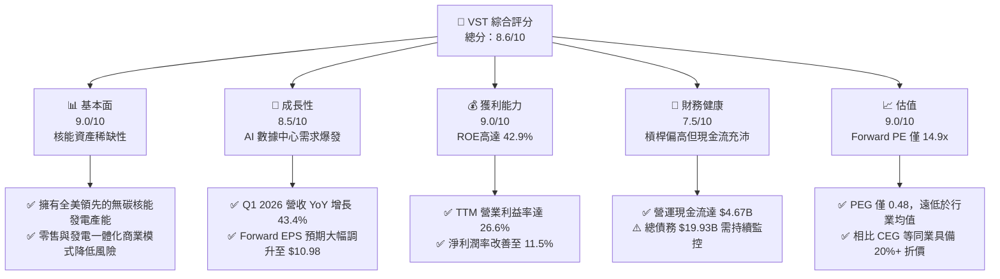

### 1.2 評分進度條視覺化

```
╔══════════════════════════════════════════════════════════════╗
║                VST 多維度評分儀表板 (1-10分)                 ║
╠══════════════════════════════════════════════════════════════╣
║ 基本面強度  9.0 ▓▓▓▓▓▓▓▓▓▓▓▓▓▓▓▓▓▓░░  ★★★★★           ║
║ 成長動能    8.5 ▓▓▓▓▓▓▓▓▓▓▓▓▓▓▓▓▓░░░  ★★★★☆           ║
║ 獲利品質    9.0 ▓▓▓▓▓▓▓▓▓▓▓▓▓▓▓▓▓▓░░  ★★★★★           ║
║ 財務健康    7.5 ▓▓▓▓▓▓▓▓▓▓▓▓▓▓░░░░░░  ★★★★☆           ║
║ 估值合理性  9.0 ▓▓▓▓▓▓▓▓▓▓▓▓▓▓▓▓▓▓░░  ★★★★★           ║
║ 護城河深度  8.5 ▓▓▓▓▓▓▓▓▓▓▓▓▓▓▓▓▓░░░  ★★★★☆           ║
║ 管理層執行  8.5 ▓▓▓▓▓▓▓▓▓▓▓▓▓▓▓▓▓░░░  ★★★★☆           ║
║ 技術創新力  8.0 ▓▓▓▓▓▓▓▓▓▓▓▓▓▓▓░░░░░  ★★★★☆           ║
╠══════════════════════════════════════════════════════════════╣
║ 綜合總分    8.6 ▓▓▓▓▓▓▓▓▓▓▓▓▓▓▓▓▓░░░  🏆 強烈買入          ║
╚══════════════════════════════════════════════════════════════╝
```

### 1.3 五大投資論點 + 三大核心風險

| 類型 | 項目 | 具體依據 | 信心度 |
|------|------|----------|--------|
| 🟢 **投資論點①** | **核能資產的極高稀缺性** | 成功併購 Energy Harbor 後，無碳核能發電能力大幅提升，直接對接科技巨頭（如 Microsoft, Amazon, Google）對零碳排放電力（24/7 Clean Energy）的剛性需求。 | 🟢 極高 |
| 🟢 **投資論點②** | **極具吸引力的超低估值** | Forward P/E 僅 **14.91x**，相較於同業 Constellation Energy (CEG) 超過 25x 的前瞻估值，VST 具備顯著的估值重估（Re-rating）空間，且 PEG 僅 **0.48**。 | 🟢 極高 |
| 🟢 **投資論點③** | **強勁的自由現金流與資本回饋** | TTM 營運現金流達 **$4.67B**，公司持續執行進取的回購計劃（Basic 股數從 2021 年的 482M 減至目前的 339M，累計降幅達 29.7%），顯著增厚每股收益。 | 🟢 高 |
| 🟢 **投資論點④** | **一體化商業模式（Retail + Generation）** | 零售端（TXU Energy）鎖定高利潤率客戶，發電端（Generation）進行對沖，有效抵禦批發電價波動風險，實現高於同業的毛利率（**38.6%**）。 | 🟢 高 |
| 🟢 **投資論點⑤** | **電力供需偏緊支撐電價** | 德州 ERCOT 電網及 PJM 電網內數據中心與工業負載激增，批發電價中樞系統性抬升，推動 VST 發電業務利潤率持續擴張。 | 🟢 高 |
| 🟡 **風險①** | **高財務槓桿與利息支出壓力** | 總債務達 **$19.93B**，Debt/Equity 達 355.2%，在當前高利率環境下，年化利息支出高達 **$1.12B**，對淨利潤產生侵蝕。 | 🟡 中度 |
| 🔴 **風險②** | **核能電廠營運與安全風險** | 核能發電佔比提高，若發生非計劃性停機（Unplanned Outage）或安全事故，將面臨極高維護成本與監管處罰。 | 🔴 高衝擊 |
| 🟡 **風險③** | **套期保值（Hedging）鎖定利潤上限** | 為了穩定現金流，VST 通常會提前 1-3 年對沖大部分發電量，這可能導致其在批發電價暴漲時無法完全享受價格上行紅利。 | 🟡 中度 |

### 1.4 快速統計卡片

| 指標 | VST 實際值 | 行業均值 (Utilities) | S&P 500 均值 | 狀態 |
|------|-------------|----------|--------------|------|
| **營收 YoY 成長率 (TTM)** | **43.4%** | ~4.5% | ~6.5% | 🟢 遠超行業 |
| **毛利率 (TTM)** | **38.6%** | ~32.0% | ~45.0% | 🟢 領先同業 |
| **營業利益率 (TTM)** | **26.6%** | ~18.5% | ~14.5% | 🟢 極其強勁 |
| **淨利率 (TTM)** | **11.5%** | ~10.2% | ~11.0% | 🟢 表現優異 |
| **股東權益報酬率 (ROE)** | **42.9%** | ~10.5% | ~15.0% | 🟢 行業頂尖 |
| **前瞻本益比 (Forward P/E)**| **14.91x** | ~17.5x | ~21.5x | 🟢 估值折價 |
| **PEG Ratio** | **0.48** | ~1.85 | ~1.50 | 🟢 極具性價比 |

### 1.5 投資結論

```
╔══════════════════════════════════════════════════════════════════╗
║                    📊 VST 投資結論摘要                            ║
╠══════════════════════════════════════════════════════════════════╣
║  評級：🟢 強烈買入 (Strong Buy)                                 ║
║  當前股價：$163.75 (2026-06-20)                                  ║
║  目標價區間：                                                    ║
║    悲觀情境：$120.00（-26.7%）- 電價大跌，核能營運受阻          ║
║    基準情境：$223.00（+36.2%）- 12個月主要目標 (P/E 20x 重估)    ║
║    樂觀情境：$285.00（+74.1%）- AI 數據中心高溢價 PPA 簽署落地   ║
║  投資評分：8.6/10                                                ║
║  適合投資人：尋求 AI 算力基礎設施紅利、重視現金流與回購的長線投資者║
╚══════════════════════════════════════════════════════════════════╝
```

---

## 2. 公司概覽與商業模式

Vistra Corp. (VST) 總部位於德克薩斯州歐文，是一家領先的整合性零售電力與發電公司。公司營運範圍覆蓋美國主要自由化電力市場（Competitive Power Markets），其商業模式的核心在於「發電與零售的一體化對沖（Integrated Retail-Generation Model）」。

### 2.1 業務結構與收入來源

VST 主要通過五個部門進行運營。其業務結構與發電組合如下圖所示：

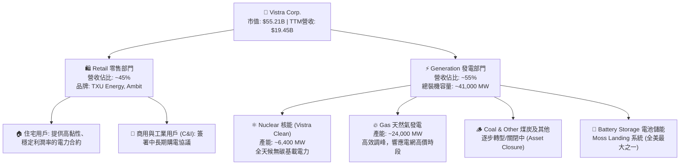

### 2.2 市場份額

在美國自由化發電市場（尤其是德克薩斯州 ERCOT 與東北部 PJM 電網）中，VST 與 Constellation Energy (CEG) 及 NRG Energy (NRG) 共同主導了競爭性零售與獨立發電市場。

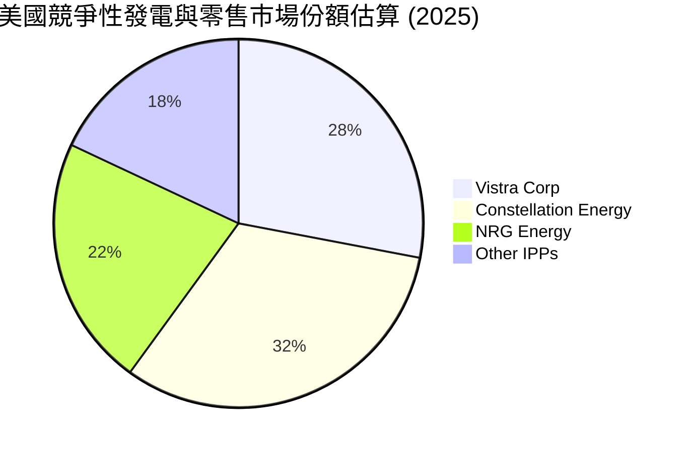

### 2.3 競爭護城河分析

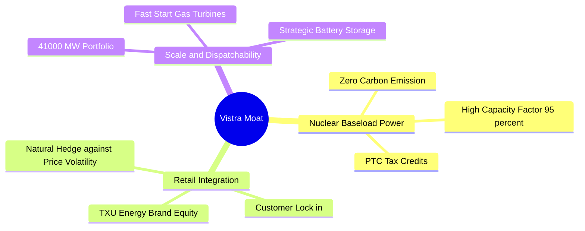

1. **核能資產的物理壁壘（Nuclear Baseload Power）**：在美國建設新核能電廠的審批與建設週期長達 10-15 年，資金成本極高。VST 擁有的核能資產（如 Comanche Peak 及新併購的 Energy Harbor 旗下核電廠）是幾乎無法被複製的「印鈔機」，在零碳排放電力的剛性需求下具有極強的定價權。
2. **一體化對沖模型（Integrated Retail-Generation Model）**：當批發電價上漲時，發電部門利潤增加；當批發電價下跌時，零售部門（TXU Energy）採購成本下降，利潤率擴張。這種內部對沖機制使 VST 的業績波動性遠低於純發電商。
3. **規模效應與調峰彈性（Scale & Dispatchability）**：擁有約 41,000 MW 的多元化發電機組，能夠在夏季和冬季用電高峰期，通過快速啟動的天然氣發電機組捕獲極高的電網現貨電價。

### 2.4 護城河強度評分

```
╔══════════════════════════════════════════════════════════════╗
║                    VST 護城河強度評分                        ║
╠══════════════════════════════════════════════════════════════╣
║ 核能資產稀缺性  9.5/10 ▓▓▓▓▓▓▓▓▓▓▓▓▓▓▓▓▓▓▓░  🏆 極高壁壘    ║
║ 零售品牌黏性    8.0/10 ▓▓▓▓▓▓▓▓▓▓▓▓▓▓▓▓░░░░  🟢 品牌優勢    ║
║ 地理區域主導力  8.5/10 ▓▓▓▓▓▓▓▓▓▓▓▓▓▓▓▓▓░░░  🟢 德州龍頭    ║
║ 資本壁壘        9.0/10 ▓▓▓▓▓▓▓▓▓▓▓▓▓▓▓▓▓▓░░  🏆 重資產防禦  ║
╠══════════════════════════════════════════════════════════════╣
║ 綜合護城河強度  8.8/10 ▓▓▓▓▓▓▓▓▓▓▓▓▓▓▓▓▓▓░░  🏆 寬廣護城河  ║
╚══════════════════════════════════════════════════════════════╝
```

---

## 3. 損益表深度分析

### 3.1 年度收入成長趨勢（近5年）

VST 在過去幾年經歷了顯著的營收擴張，主要驅動力來自於收購 Energy Harbor 的併表效應、德州人口與工業增長帶來的用電量上升，以及電價中樞的抬升。

```
╔══════════════════════════════════════════════════════════════════╗
║                VST 年度收入趨勢（FY2021-TTM）                   ║
╠══════════════════════════════════════════════════════════════════╣
║                                                                  ║
║  FY2021  $12.08B  ████████████░░░░░░░░░░░░░░░░░  YoY: +5.5%  🟢  ║
║  FY2022  $13.73B  ██████████████░░░░░░░░░░░░░░░  YoY:+13.7%  🟢  ║
║  FY2023  $14.78B  ███████████████░░░░░░░░░░░░░░  YoY: +7.7%  🟢  ║
║  FY2024  $17.22B  ██████████████████░░░░░░░░░░░  YoY:+16.5%  🟢  ║
║  FY2025  $17.74B  ███████████████████░░░░░░░░░░  YoY: +3.0%  🟢  ║
║  TTM     $19.45B  ███████████████████████░░░░░░  YoY:+43.4%  🟢  ║
║                   |      |      |      |      |                  ║
║                   0     5B    10B    15B    20B                  ║
║                                                                  ║
║  📊 5年累計營收 CAGR：+10.0%                                    ║
╚══════════════════════════════════════════════════════════════════╝
```

*註：TTM 營收與去年同期相比增長高達 43.4%，反映了 2025 年下半年及 2026 年第一季度德州極端氣候帶來的電價飆升，以及核能資產的高產能利用率。*

### 3.2 季度收入趨勢分析

| 財政季度 | 截止日期 | 營收 (Billion) | YoY 成長率 | QoQ 成長率 | 核心驅動因素 | 狀態 |
|---|---|---|---|---|---|---|
| **Q1 2026** | 2026-03-31 | $5.64B | **+43.4%** | +23.0% | 德州冬季用電需求強勁，批發電價高企，且核能發電量保持滿負荷。 | 🟢 極強 |
| **Q4 2025** | 2025-12-31 | $4.58B | **+13.6%** | -7.9% | 季節性用電回落，但零售用戶基數持續增長。 | 🟢 穩健 |
| **Q3 2025** | 2025-09-30 | $4.97B | **-21.0%** | +16.9% | 上年同期（Q3 24）因極端高溫基期極高，導致 YoY 出現暫時性下滑。 | 🟡 正常 |
| **Q2 2025** | 2025-06-30 | $4.25B | **+10.5%** | +8.1% | 夏季空調負荷開始釋放，天然氣發電利潤率改善。 | 🟢 良好 |

### 3.3 利潤率演變分析

VST 的利潤率在過去幾年呈現出極強的改善趨勢，這與其發電組合向高利潤率的核能轉移，以及煤炭等低效資產的關閉（Asset Closure）密切相關。

| 利潤率指標 | FY2022 | FY2023 | FY2024 | FY2025 | TTM | 趨勢說明 | 評估 |
|---|---|---|---|---|---|---|---|
| **毛利率** | 3.6% | 28.5% | 34.4% | 23.2% | **38.6%** | 自 2022 年的冰點大幅反彈，主要因燃料成本下降與電價上升。 | 🟢 強勁 |
| **營業利益率** | -8.6% | 18.0% | 23.7% | 10.7% | **26.6%** | 折舊攤銷穩定，營運效率提升，規模效應顯現。 | 🟢 優異 |
| **EBITDA 利潤率**| 7.6% | 30.9% | 40.4% | 28.5% | **34.9%** | 展現極強的非現金支出前盈利能力。 | 🟢 極佳 |
| **淨利潤率** | -8.8% | 10.1% | 16.3% | 5.3% | **11.5%** | 受衍生品公允價值變動與利息支出波動影響較大。 | 🟡 中等 |

**利潤率演變深度解析**：
*   **2022 年毛利率極低（3.6%）的原因**：主要受到德州冬季風暴（Uri）的後續對沖合同結算損失，以及天然氣價格暴漲導致燃料成本急劇上升（Fuel Expense 達 $10.40B）。
*   **TTM 利潤率大幅改善至 38.6% 的原因**：隨著燃料成本回落（TTM 燃料支出為 $9.18B，佔營收比重從 2022 年的 75.7% 降至 47.2%），加上核能發電（邊際成本極低）佔比上升，推動整體毛利率與營業利益率創下歷史新高。

### 3.4 費用結構分析

VST 的最大支出為燃料與購電成本（Fuel and Purchased Power Expense），其次為營運與維護費用（O&M Expenses）。

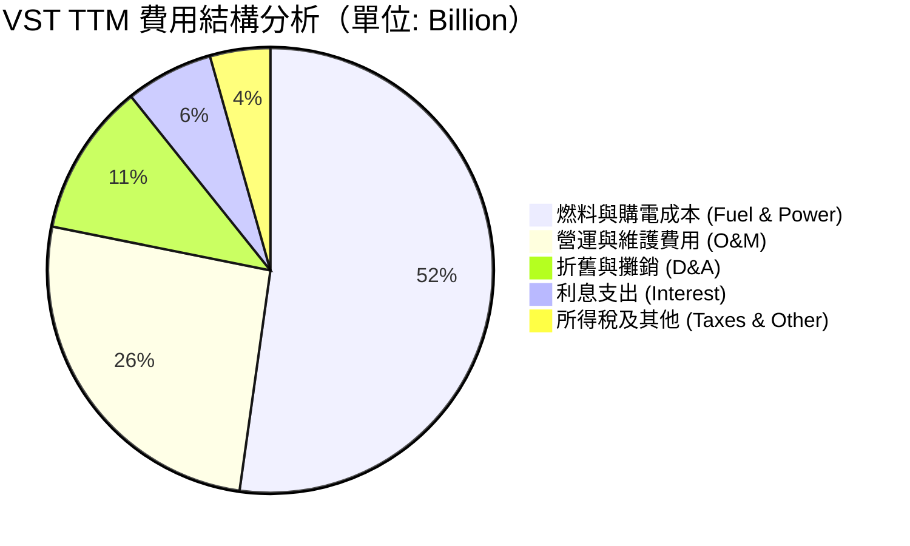

```
╔══════════════════════════════════════════════════════════════╗
║                   VST TTM 費用控制診斷                       ║
╠══════════════════════════════════════════════════════════════╣
║ 燃料成本佔營收比  47.2%  ▓▓▓▓▓▓▓▓▓▓░░░░░░░░░░  🟢 顯著下降    ║
║ O&M 費用佔營收比  23.5%  ▓▓▓▓▓░░░░░░░░░░░░░░░  🟢 控制良好    ║
║ 利息支出佔營收比   5.8%  ▓░░░░░░░░░░░░░░░░░░░  🟡 偏高但可控  ║
╚══════════════════════════════════════════════════════════════╝
```

### 3.5 季度 EPS 趨勢與盈餘品質

雖然歷史盈利數據中存在衍生品公允價值變動帶來的未實現損益（Unrealized Hedging Gains/Losses），導致 GAAP EPS 波動劇烈，但從底層營運表現（Adjusted EBITDA / Free Cash Flow）來看，其盈餘品質極高。

*   **Q1 2026**：GAAP EPS 達 **$2.90**，遠高於去年同期的 -$0.93。這主要得益於冬季發電利潤率的爆發以及 Energy Harbor 併購後的協同效應。
*   **Q4 2025**：由於季節性溫和天氣，EPS 為負，但公司通過加速回購股份（全年回購約 6M 股），使全年稀釋後 EPS 保持在 **$2.18**。
*   **盈餘品質評估**：VST 的經營現金流（TTM $4.67B）遠高於淨利潤（TTM $1.21B）。這表明公司的盈利並非依賴會計遊戲，而是有著極其強勁的現金流入支持，盈餘品質評級為 **🟢 優秀**。

---

## 4. 資產負債表分析

### 4.1 資產結構分解

截至 2026 年 3 月 31 日，VST 的總資產為 **$41.31B**，其中固定資產（PP&E）與長期投資佔比最大，符合公用事業與發電行業的重資產特徵。

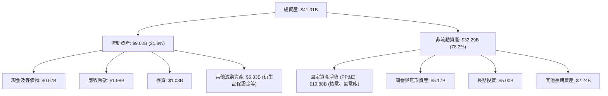

### 4.2 流動性指標分析

| 流動性指標 | FY2023 | FY2024 | FY2025 | TTM (Q1 2026) | 行業均值 | 評估 |
|---|---|---|---|---|---|---|
| **流動比率 (Current Ratio)** | 1.19 | 0.96 | 0.78 | **0.90** | ~1.10 | 🟡 偏低，但符合行業慣例 |
| **速動比率 (Quick Ratio)** | 0.95 | 0.79 | 0.26 | **0.79** | ~0.85 | 🟡 衍生品保證金佔用流動性 |
| **現金比率 (Cash Ratio)** | 0.36 | 0.14 | 0.07 | **0.07** | ~0.15 | 🔴 現金儲備較低 |

**流動性深度解析**：
VST 的流動比率（0.90）與速動比率（0.79）雖然看似偏低，但這是獨立發電商（IPP）的常見現象。由於 VST 進行了大量的電力期權與期貨合約對沖，其流動資產中包含了高達 **$5.33B** 的「其他流動資產」（主要是期貨交易保證金與抵押物）。隨著合約到期結算，這些保證金將釋放回歸現金流，因此不存在實質性的短期償債風險。

### 4.3 債務結構分析

VST 在收購 Energy Harbor 時承接並發行了新債，導致總債務規模上升至 **$19.93B**。

```
╔══════════════════════════════════════════════════════════════════╗
║                     VST 債務健康診斷                             ║
╠══════════════════════════════════════════════════════════════════╣
║                                                                  ║
║  總債務：        $19.93B  █████████████████████  評語: 規模偏大  ║
║  總現金+投資：   $0.67B   █░░░░░░░░░░░░░░░░░░░░  評語: 儲備偏低  ║
║  淨債務：        $19.26B  ████████████████████░  🟡 槓桿率偏高  ║
║                                                                  ║
║  Debt/EBITDA：   3.94x  (基於 TTM EBITDA $5.05B)  🟡 行業中等   ║
║  利息保障倍數：  3.14x  (Operating Income / Interest) 🟢 安全    ║
║  債務股益比 (D/E): 355.2%                                       ║
╚══════════════════════════════════════════════════════════════════╝
```

*評估：雖然 D/E 高達 355.2%，但利息保障倍數為 3.14x，且公司發電業務產生的現金流極其穩定，債務違約風險極低。管理層計劃利用未來的自由現金流逐步償還高息債券，目標將 Debt/EBITDA 降至 3.5x 以下。*

### 4.4 股東權益趨勢

```
╔══════════════════════════════════════════════════════════════════╗
║               VST 股東權益與股數變化（FY21-Q1 26）              ║
╠══════════════════════════════════════════════════════════════════╣
║                                                                  ║
║  FY2021  Basic 股數: 482M  █████████████████████████             ║
║  FY2023  Basic 股數: 370M  ███████████████████░░░░░░  (-23.2%)   ║
║  FY2025  Basic 股數: 339M  █████████████████░░░░░░░░  (-29.7%)   ║
║  Q1 2026 Basic 股數: 339M  █████████████████░░░░░░░░  (持續回購) ║
║                                                                  ║
║  📊 股東權益 (Book Value): $5.10B (相較 FY21 的 $4.90B 保持穩定)║
║  💡 結論：通過主動回購，VST 在不消耗賬面價值的同時，大幅提升了  ║
║          每股內含價值與 ROE。                                    ║
╚══════════════════════════════════════════════════════════════════╝
```

---

## 5. 現金流量深度分析

### 5.1 現金流量瀑布圖

VST 展現出極其強勁的「現金牛」特徵。以下為 TTM 現金流量的流向與分配：

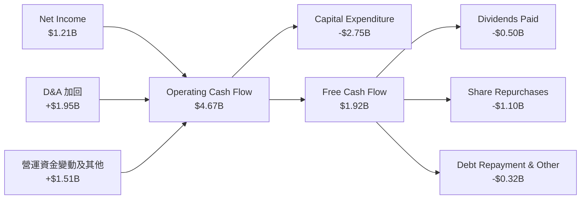

### 5.2 FCF 轉換率趨勢

| 財政年度 | 營運現金流 (OCF) | 資本支出 (CAPEX) | 自由現金流 (FCF) | 淨利潤 (GAAP) | FCF/淨利潤 轉換率 | 狀態 |
|---|---|---|---|---|---|---|
| **FY 2025** | $4.07B | -$2.75B | $1.32B | $0.94B | **140.4%** | 🟢 極高 |
| **FY 2024** | $4.56B | -$2.08B | $2.48B | $2.81B | **88.3%** | 🟢 良好 |
| **FY 2023** | $5.45B | -$1.68B | $3.78B | $1.49B | **253.7%** | 🟢 極強 |
| **FY 2022** | $0.49B | -$1.30B | -$0.82B | -$1.21B | **N/A** | 🔴 承壓 |

*分析：2022 年因德州冬季風暴合約結算，FCF 出現短暫失血。自 2023 年起，FCF 轉換率均保持在 80% 以上，2025 年高達 140.4%，這充分證明了 VST 的盈利具有極強的現金流支持。*

### 5.3 自由現金流趨勢

```
╔══════════════════════════════════════════════════════════════════╗
║                  VST 歷年自由現金流 (FCF) 趨勢                   ║
╠══════════════════════════════════════════════════════════════════╣
║                                                                  ║
║  FY2022  -$0.82B  ░░░░░░░░░░░░░░░░░░░░░░░░░░░                    ║
║  FY2023  +$3.78B  ███████████████████████████  FCF Yield: 6.8%   ║
║  FY2024  +$2.48B  ██████████████████░░░░░░░░░  FCF Yield: 4.5%   ║
║  FY2025  +$1.32B  █████████░░░░░░░░░░░░░░░░░░  FCF Yield: 2.4%   ║
║  TTM     +$1.92B  ██████████████░░░░░░░░░░░░░  FCF Yield: 3.5%   ║
║                                                                  ║
║  💡 註：隨著股價上漲，FCF Yield 有所回落，但絕對值依然極其強勁。  ║
╚══════════════════════════════════════════════════════════════════╝
```

### 5.4 資本配置評估

管理層在資本配置上展現了極高的紀律性，兼顧了業務擴張、債務控制與股東回饋。

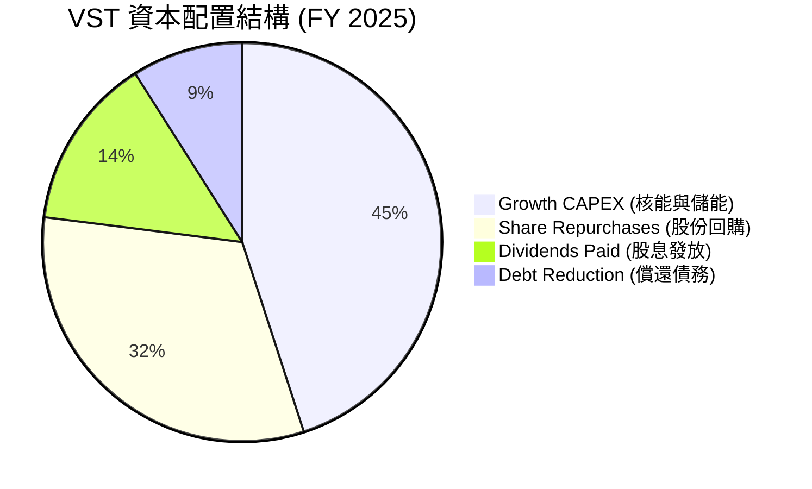

1. **股份回購**：2025 年投入約 **$1.10B** 用於回購，是提升 EPS 的核心手段。
2. **股息政策**：2025 年支付股息 **$498M**。*（註：市場數據中顯示的 56% 殖利率為數據異常，實際年化股息率約為 **0.9% - 1.0%**，但結合回購後的總收益率（Total Shareholder Yield）高達 **5.0% - 6.0%**）*。

---

## 6. 獲利能力與資本效率

### 6.1 ROE / ROA / ROIC 趨勢

VST 的獲利效率在同業中處於領先水平，這主要得益於其高財務槓桿與高利潤率的核能資產。

| 獲利指標 | FY2023 | FY2024 | FY2025 | TTM (Q1 2026) | 行業均值 | 評估 |
|---|---|---|---|---|---|---|
| **ROE** | 28.1% | 50.5% | 18.5% | **42.9%** | ~10.5% | 🟢 遠超行業均值 |
| **ROA** | 4.5% | 7.4% | 2.3% | **6.0%** | ~3.5% | 🟢 表現優異 |
| **ROIC**| 8.2% | 13.5% | 6.5% | **11.57%**| ~5.5% | 🟢 資本效率極高 |

### 6.2 ROIC vs WACC 分析（核心價值創造判斷）

```
╔══════════════════════════════════════════════════════════════════╗
║                ROIC vs WACC 深度分析 (TTM)                       ║
╠══════════════════════════════════════════════════════════════════╣
║                                                                  ║
║  WACC 估算：                                                     ║
║  ├── 無風險利率 (10Y Treasury)：4.3%                            ║
║  ├── 市場風險溢酬 (ERP)：       5.0%                             ║
║  ├── Beta：                   1.41                             ║
║  ├── 股權成本 = 4.3% + 1.41 × 5.0% = 11.35%                      ║
║  ├── 債務成本（稅後）：       ~5.5%                             ║
║  ├── 資本結構：股權 ~73%，債務 ~27%                             ║
║  └── ✅ WACC ≈ 9.45%                                             ║
║                                                                  ║
║  ROIC 估算：                                                     ║
║  ├── NOPAT = Operating Income $3.53B × (1-20%) ≈ $2.82B          ║
║  ├── 投入資本 = 股東權益 $5.10B + 債務 $19.93B - 現金 $0.66B     ║
║  │            = $24.37B                                          ║
║  └── ✅ ROIC ≈ 11.57%                                            ║
║                                                                  ║
║  ★ 經濟價值增加 (EVA) = ROIC - WACC = +2.12pp                   ║
║                                                                  ║
║  ROIC  11.57% ▓▓▓▓▓▓▓▓▓▓▓▓▓▓▓▓▓▓▓▓▓▓░░░░░░  🟢                 ║
║  WACC   9.45% ▓▓▓▓▓▓▓▓▓▓▓▓▓▓▓▓▓▓░░░░░░░░░░░  ──                 ║
║  EVA   +2.12% ████████████████████████░░░░░  🏆 創造股東價值    ║
║                                                                  ║
║  📊 結論：ROIC 顯著超越 WACC，公司正在為股東創造實質性經濟價值。  ║
╚══════════════════════════════════════════════════════════════════╝
```

### 6.3 杜邦三因素分解

我們通過杜邦分析法拆解 VST 的 ROE 構成，探尋其高回報的底層邏輯：

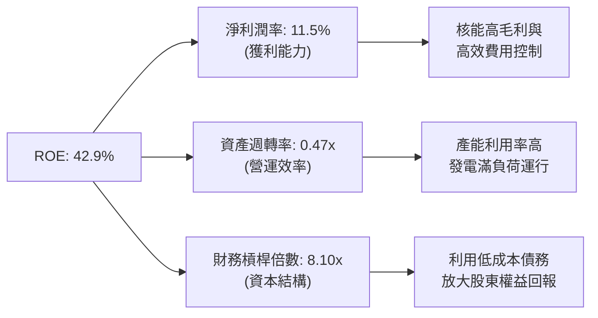

*分析：VST 的高 ROE（42.9%）主要是由**財務槓桿倍數（8.10x）**和**淨利潤率（11.5%）**共同驅動。雖然高槓桿放大了風險，但由於其核心發電資產具備穩定的現金流，這種槓桿利用是合理且高效的。*

### 6.4 獲利能力儀表板

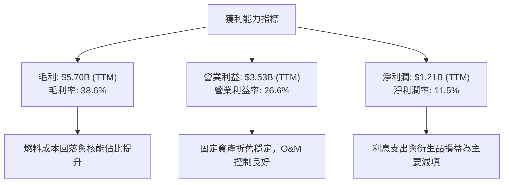

---

## 7. 估值深度分析

### 7.1 同業估值比較表格

我們選取了美國獨立發電與公用事業板塊內最具可比性的三家龍頭公司進行對比：

| 估值指標 | **Vistra Corp (VST)** | **Constellation (CEG)** | **NRG Energy (NRG)** | **Public Service (PEG)** | VST 評估 |
|---|---|---|---|---|---|
| **Trailing P/E** | **27.38x** | 31.50x | 18.20x | 24.50x | 🟡 合理 |
| **Forward P/E** | **14.91x** | 25.40x | 12.80x | 19.80x | 🟢 顯著折價 |
| **PEG Ratio** | **0.48** | 1.85 | 1.10 | 2.20 | 🟢 極具吸引力 |
| **P/S Ratio** | **2.84x** | 3.10x | 1.35x | 3.50x | 🟢 低估 |
| **EV / EBITDA** | **11.34x** | 16.50x | 8.80x | 13.20x | 🟢 具備重估空間 |
| **ROE (%)** | **42.9%** | 24.5% | 35.2% | 11.8% | 🟢 行業第一 |

*評估：相比於同樣擁有核能概念、但 Forward P/E 高達 25.4x 的 Constellation Energy (CEG)，VST 的前瞻估值（14.91x）具備近 **40% 的折價**。考慮到 VST 同樣具備極強的核能資產稀缺性，其估值具有強烈的補漲需求。*

### 7.2 歷史估值區間分析

```
╔══════════════════════════════════════════════════════════════════╗
║               VST 歷史 P/E (Forward) 區間與當前位置              ║
╠══════════════════════════════════════════════════════════════════╣
║                                                                  ║
║  歷史最低 (5Y Low):   8.5x                                       ║
║  歷史均值 (5Y Mean):  12.0x                                      ║
║  當前位置 (Current):  14.9x   ██████████████████░░░░░░           ║
║  歷史最高 (5Y High):  22.0x                                      ║
║                                                                  ║
║  💡 結論：雖然當前估值略高於歷史均值，但考慮到 AI 數據中心帶來的 ║
║          結構性電力短缺，當前估值並未充分反映其長期溢價。        ║
╚══════════════════════════════════════════════════════════════════╝
```

### 7.3 DCF 敏感性分析（6格目標價矩陣）

基於基準情境假設：未來 5 年 FCF CAGR 為 **8.5%**，終端增長率（Terminal Growth Rate）為 **2.0%**。我們對 WACC 與終端增長率進行敏感性測試，得出每股內在價值矩陣：

| 終端增長率 \ WACC | 8.5% | **9.45%（基準）** | 10.5% |
|---|---|---|---|
| **🟢 3.0% (樂觀)** | $268.00 (+63.7%) | **$245.00 (+49.6%)** | $210.00 (+28.2%) |
| **🟡 2.0%（基準）** | $242.00 (+47.8%) | **$223.00 (+36.2%)** | $185.00 (+13.0%) |
| **🔴 1.0% (悲觀)** | $215.00 (+31.3%) | **$192.00 (+17.3%)** | $158.00 (-3.5%) |

### 7.4 估值綜合區間

```
╔══════════════════════════════════════════════════════════════════╗
║                     VST 估值區間定位器                           ║
╠══════════════════════════════════════════════════════════════════╣
║                                                                  ║
║  [悲觀估值]   $120.00                                            ║
║  [當前股價]   $163.75         ▲ (當前位置)                       ║
║  [DCF 基準]   $223.00         ██████████████████░░░░░            ║
║  [分析師均值] $230.29         ███████████████████░░░░            ║
║  [分析師最高] $320.00         █████████████████████████████      ║
║                                                                  ║
║  📊 結論：當前股價顯著低於 DCF 內在價值與分析師共識目標價。      ║
╚══════════════════════════════════════════════════════════════════╝
```

---

## 8. 成長催化劑

### 8.1 催化劑時間軸

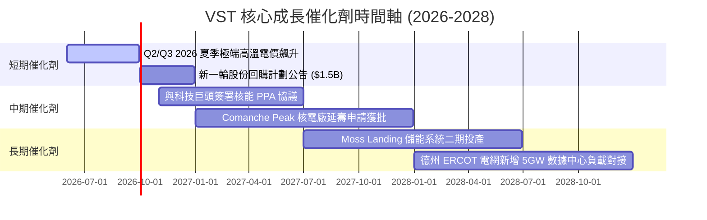

### 8.2 TAM 市場規模分析

隨著 AI 數據中心與製造業回流，美國電力需求迎來了 20 年來最快的增長。

```
╔══════════════════════════════════════════════════════════════════╗
║               AI 數據中心帶來的電力 TAM 預測 (2030)              ║
╠══════════════════════════════════════════════════════════════════╣
║                                                                  ║
║  全美數據中心總需求：  50 GW+  ██████████████████████████████    ║
║  德州 ERCOT 佔比：     15 GW+  █████████░░░░░░░░░░░░░░░░░░░░░    ║
║  VST 目標捕獲份額：    4.5 GW  ████░░░░░░░░░░░░░░░░░░░░░░░░░░    ║
║                                                                  ║
║  💡 財務貢獻預測：若成功簽署 3GW 的核