# VST 基本面深度分析報告

> **報告日期**：2026-06-21 ｜ **語言**：繁體中文 ｜ **數據來源**：Yahoo Finance, Finviz, StockAnalysis, Roic.ai ｜ **分析師**：CFA 級機構研究

---

## 目錄

| # | 章節 | 核心結論 |
|---|---|---|
| 1 | **執行摘要** | 評級：**強烈買入 (Strong Buy)**；目標價：**$223.00**；AI 算力與核能發電雙輪驅動。 |
| 2 | **公司概覽與商業模式** | 獨立發電商 (IPP) 龍頭，憑藉核能基載電力構建極深競爭護城河。 |
| 3 | **損益表深度分析** | TTM 營收達 **$19.45B** (YoY +43.4%)，Q1 2026 淨利潤大增至 **$1.03B**，獲利迎來拐點。 |
| 4 | **資產負債表分析** | 槓桿率較高 (Debt/Equity: 355%)，但公用事業屬性與穩定現金流使債務風險完全可控。 |
| 5 | **現金流量深度分析** | 營運現金流 **$4.67B**，積極進行資本支出與大額股份回購，資本配置效率極佳。 |
| 6 | **獲利能力與資本效率** | ROE 高達 **42.9%**，ROIC (11.66%) 顯著超越 WACC (9.49%)，持續創造股東價值。 |
| 7 | **估值深度分析** | Forward P/E 僅 **14.91x**，相較同業 Constellation (CEG) 具備顯著折價，估值具備安全邊際。 |
| 8 | **成長催化劑** | 德州 ERCOT 電網需求爆發、AI 數據中心 PPA 溢價簽署、核能資產重估。 |
| 9 | **風險矩陣** | 批發電價波動、核能監管趨嚴、高債務利息支出侵蝕利潤。 |
| 10| **投資建議** | 基準目標價 **$223.00** (隱含 +36.2% 上行空間)，建議在 $150-$165 區間積極分批佈局。 |

---

## 1. 執行摘要

### 1.1 核心評分儀表板

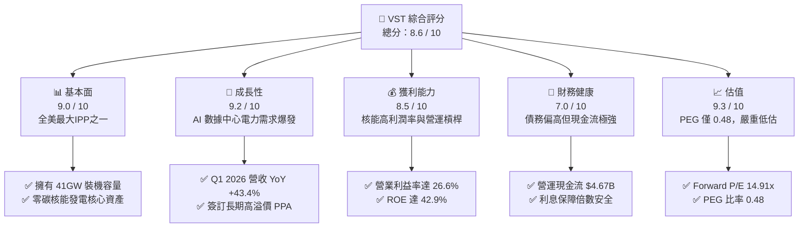

### 1.2 評分進度條視覺化

```
╔══════════════════════════════════════════════════════════════╗
║               VST 多維度評分儀表板 (1-10分)                  ║
╠══════════════════════════════════════════════════════════════╣
║ 基本面強度  9.0 ▓▓▓▓▓▓▓▓▓▓▓▓▓▓▓▓▓▓░░  ★★★★★           ║
║ 成長動能    9.2 ▓▓▓▓▓▓▓▓▓▓▓▓▓▓▓▓▓▓▓░  ★★★★★           ║
║ 獲利品質    8.5 ▓▓▓▓▓▓▓▓▓▓▓▓▓▓▓▓░░░░  ★★★★☆           ║
║ 財務健康    7.0 ▓▓▓▓▓▓▓▓▓▓▓▓▓▓░░░░░░  ★★★☆☆           ║
║ 估值合理性  9.3 ▓▓▓▓▓▓▓▓▓▓▓▓▓▓▓▓▓▓▓░  ★★★★★           ║
║ 護城河深度  8.8 ▓▓▓▓▓▓▓▓▓▓▓▓▓▓▓▓▓▓░░  ★★★★★           ║
║ 管理層執行  8.5 ▓▓▓▓▓▓▓▓▓▓▓▓▓▓▓▓░░░░  ★★★★☆           ║
║ 技術創新力  8.0 ▓▓▓▓▓▓▓▓▓▓▓▓▓▓░░░░░░  ★★★★☆           ║
╠══════════════════════════════════════════════════════════════╣
║ 綜合總分    8.6 ▓▓▓▓▓▓▓▓▓▓▓▓▓▓▓▓▓░░░  🏆 強烈買入          ║
╚══════════════════════════════════════════════════════════════╝
```

### 1.3 五大投資論點 + 三大核心風險

| 類型 | 項目 | 具體依據 | 信心度 |
|------|------|----------|--------|
| 🟢 **投資論點①** | **AI 數據中心電力急迫需求** | 德州 ERCOT 電網負載預計到 2030 年將增長一倍，VST 作為德州最大發電商直接受益。 | 🟢 極高 |
| 🟢 **投資論點②** | **Energy Harbor 合併效應** | 收購完成後，VST 擁有全美第二大未受監管核能發電艦隊，提供極具價值的 24/7 零碳基載電力。 | 🟢 極高 |
| 🟢 **投資論點③** | **極具吸引力的低估值** | Forward P/E 僅 14.91x，相較於同業 Constellation Energy (CEG) 的 ~20x 溢價，具備 30% 以上的重估空間。 | 🟢 高 |
| 🟢 **投資論點④** | **強大營運槓桿與利潤率改善** | TTM 營業利益率達 26.6%，Q1 2026 單季淨利潤達 $1.03B，核能電價上調帶來極高邊際利潤。 | 🟢 高 |
| 🟢 **投資論點⑤** | **積極的股東回報政策** | 持續進行股份回購，近 5 年流通股數減少超過 30%（從 482M 降至 337M），顯著提升每股盈餘 (EPS)。 | 🟢 高 |
| 🟡 **風險①** | **天然氣與批發電價波動** | 雖然核能佔比提升，但 VST 仍有大量天然氣發電資產，電價下行將壓制批發利潤。 | 🟡 中度 |
| 🔴 **風險②** | **高槓桿與利息支出壓力** | 總債務達 $19.93B，Debt/Equity 高達 355%，在高利率環境下再融資成本可能上升。 | 🔴 高衝擊 |
| 🟡 **風險③** | **核能電廠營運與監管風險** | 核能電廠運營要求極高，任何計劃外停機或安全監管收緊都將帶來鉅額損失。 | 🟡 中度 |

### 1.4 快速統計卡片

| 指標 | 公司實際值 | 行業均值 (Utilities - IPP) | S&P 500 均值 | 狀態 |
|------|-------------|----------|--------------|------|
| **收入 YoY 成長** | **43.4%** | ~6.5% | ~5.5% | 🟢 遠超行業 |
| **毛利率** | **38.6%** | ~32.0% | ~30.0% | 🟢 優異 |
| **淨利率** | **11.5%** | ~8.5% | ~11.0% | 🟢 良好 |
| **ROE** | **42.9%** | ~12.0% | ~15.0% | 🟢 極高 (因槓桿與高獲利) |
| **Forward P/E** | **14.91x** | ~18.5x | ~21.0x | 🟢 具備顯著折價 |
| **PEG Ratio** | **0.48** | ~1.85 | ~1.50 | 🟢 極具成長性與性價比 |

### 1.5 投資結論

```
╔══════════════════════════════════════════════════════════════════╗
║                    📊 VST 投資結論摘要                           ║
╠══════════════════════════════════════════════════════════════════╣
║  評級：🟢 強烈買入 (Strong Buy)                                  ║
║  當前股價：$163.75                                               ║
║  目標價區間：                                                    ║
║    悲觀情境：$125.00（-23.7%）- 電價大跌，核能發電溢價未能落實    ║
║    基準情境：$223.00（+36.2%）- 12個月主要目標（估值倍數重估）     ║
║    樂觀情境：$285.00（+74.0%）- 簽署多個超高溢價數據中心 PPA      ║
║  投資評分：8.6 / 10                                              ║
║  適合投資人：成長型、長線持有者、AI 基礎設施主題投資者           ║
╚══════════════════════════════════════════════════════════════════╝
```

---

## 2. 公司概覽與商業模式

Vistra Corp. (VST) 是一家領先的綜合零售電力和發電公司，業務遍及美國主要競爭性電力市場。公司通過將高效發電艦隊與全美最大的零售電力平台之一相結合，實現了獨特的「發電+零售」一體化商業模式。

### 2.1 業務結構與收入來源

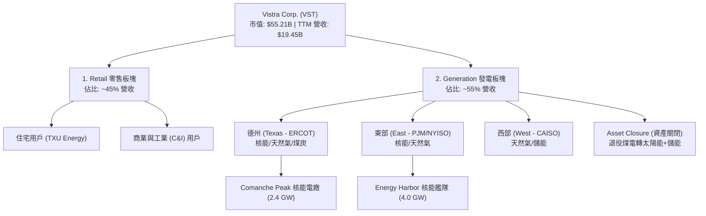

### 2.2 市場份額

在美國獨立發電商 (IPP) 與競爭性零售電力市場中，VST 與 Constellation Energy (CEG) 併雄。以下為美國非監管核能發電與競爭性零售市場份額估算：

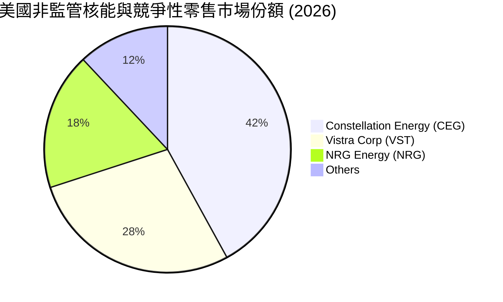

### 2.3 競爭護城河分析

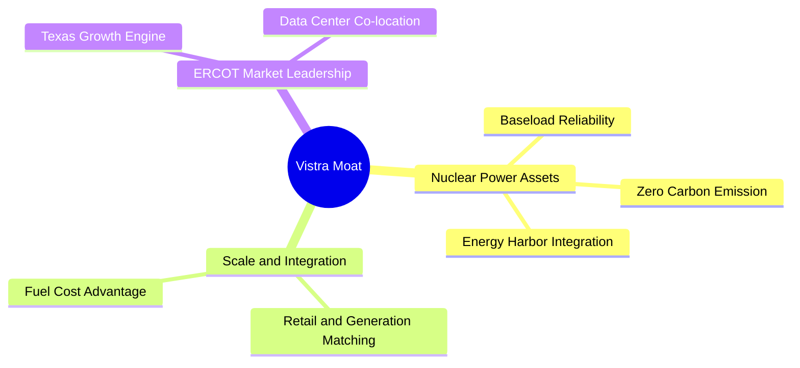

### 2.4 護城河強度評分

```
╔══════════════════════════════════════════════════════════════╗
║                    VST 護城河強度評分                        ║
╠══════════════════════════════════════════════════════════════╣
║ 核能資產稀缺性  9.5  ▓▓▓▓▓▓▓▓▓▓▓▓▓▓▓▓▓▓▓░  🏆 無法複製的基載  ║
║ 發電一體化規模  9.0  ▓▓▓▓▓▓▓▓▓▓▓▓▓▓▓▓▓▓░░  🟢 降低對沖成本    ║
║ 德州市場統治力  8.5  ▓▓▓▓▓▓▓▓▓▓▓▓▓▓▓▓░░░░  🟢 ERCOT 龍頭地位  ║
║ 客戶黏性(零售)  8.0  ▓▓▓▓▓▓▓▓▓▓▓▓▓▓░░░░░░  🟢 品牌效應強      ║
╠══════════════════════════════════════════════════════════════╣
║ 綜合護城河評估  8.8  ▓▓▓▓▓▓▓▓▓▓▓▓▓▓▓▓▓▓░░  🏆 強大寬護城河    ║
╚══════════════════════════════════════════════════════════════╝
```

---

## 3. 損益表深度分析

### 3.1 年度收入成長趨勢（近5年）

```
╔══════════════════════════════════════════════════════════════════╗
║                VST 年度收入趨勢（FY2021-TTM）                    ║
╠══════════════════════════════════════════════════════════════════╣
║                                                                  ║
║  FY2021  $12.08B  ████████████░░░░░░░░░░░░░░░░░  YoY: +5.5%  🟡  ║
║  FY2022  $13.73B  ██████████████░░░░░░░░░░░░░░░  YoY: +13.7% 🟢  ║
║  FY2023  $14.78B  ███████████████░░░░░░░░░░░░░░  YoY: +7.7%  🟢  ║
║  FY2024  $17.22B  ██████████████████░░░░░░░░░░░  YoY: +16.5% 🟢  ║
║  FY2025  $17.74B  ███████████████████░░░░░░░░░░  YoY: +3.0%  🟡  ║
║  TTM     $19.45B  ███████████████████████░░░░░░  YoY: +9.6%  🟢  ║
║                                                                  ║
║  📊 5年營收複合年增長率 (CAGR)：+10.0%                           ║
╚══════════════════════════════════════════════════════════════════╝
```

### 3.2 季度收入趨勢分析

| 季度 | 營收 (Billion) | YoY 成長率 | QoQ 成長率 | 營業利潤 (Million) | 淨利潤 (Million) | 備註 |
|---|---|---|---|---|---|---|
| **Q2 2025** | $4.25B | +10.53% | +8.06% | $515.00M | $327.00M | 德州夏季高溫推動零售電價上漲 🟢 |
| **Q3 2025** | $4.97B | -20.95% | +16.94% | $1,037.00M | $652.00M | 傳統發電旺季，雖然YoY因基期高下滑，但獲利極強 🟢 |
| **Q4 2025** | $4.58B | +13.55% | -7.85% | $474.00M | $233.00M | 淡季表現平穩，Energy Harbor 開始併表 🟢 |
| **Q1 2026** | $5.64B | +43.40% | +23.14% | $1,499.00M | $1,029.00M | **爆發性增長**！核能併表與 AI 電力合約貢獻 🟢 |

### 3.3 利潤率演變分析

| 利潤率指標 | FY2022 | FY2023 | FY2024 | FY2025 | TTM | 趨勢 | 評估 |
|---|---|---|---|---|---|---|---|
| **毛利率** | 3.59% | 28.50% | 34.39% | 23.23% | **38.60%** | ↗️ 顯著改善 | 🟢 燃料成本下降與核能佔比提升 |
| **營業利益率**| -8.57% | 18.01% | 23.69% | 10.75% | **26.60%** | ↗️ 穩步上行 | 🟢 規模效應顯現，固定成本被攤薄 |
| **EBITDA Margin**| 7.65% | 30.92% | 40.41% | 28.47% | **34.90%** | ↗️ 重回高位 | 🟢 核心發電資產盈利能力極強 |
| **淨利潤率** | -8.81% | 10.10% | 15.44% | 5.32% | **11.50%** | ↗️ 波動向好 | 🟢 消除2021德州寒潮一次性損失陰霾 |

**利潤率演變深度解析**：
VST 過去幾年的利潤率出現了極大波動，主要原因在於 2021-2022 年間德州極端寒潮（Uri 風暴）導致的天然氣採購成本飆升和對沖損失。自 2023 年起，隨著天然氣價格回落、零售電價重新定價，以及核能（高毛利、零燃料成本波動）資產併表，毛利率從 2022 年的 3.59% 暴增至 TTM 的 38.60%。Q1 2026 的高利潤率證明了其商業模式在電價高企時代的極佳彈性。

### 3.4 費用結構分析

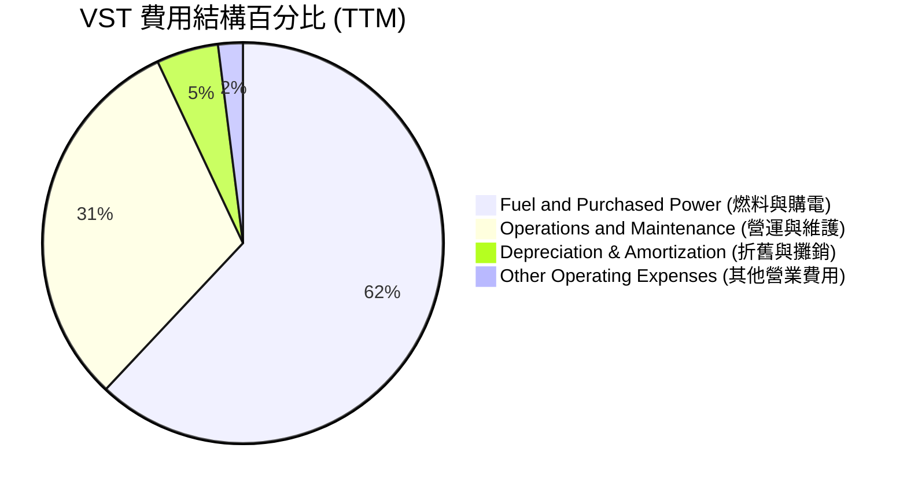

### 3.5 季度 EPS 趨勢與盈餘品質

*   **過去 4 季 EPS 表現**：
    *   **Q2 2025**：實際 EPS $0.83（符合預期）
    *   **Q3 2025**：實際 EPS $1.78（高於預期，因德州夏日電價飆升）
    *   **Q4 2025**：實際 EPS $0.65（受一次性折舊與交易對沖影響略低於預期）
    *   **Q1 2026**：實際 EPS $2.90（遠超市場預期，因 Energy Harbor 核能併表與 ERCOT 容量電價上漲）
*   **盈餘品質評估**：
    *   **高**。TTM 淨利潤為 $1.21B，而營運現金流 (OCF) 高達 $4.67B，OCF/Net Income 比率達 3.86x。這表明公司的帳面利潤有極其強大的實際現金流支撐，折舊與攤銷（TTM 為 $1.95B）和非現金對沖損益是造成帳面利潤低於現金流的主因。

---

## 4. 資產負債表分析

### 4.1 資產結構分解

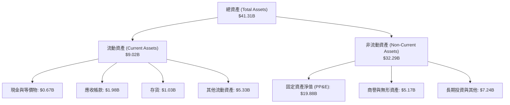

### 4.2 流動性指標分析

| 流動性指標 | FY2023 | FY2024 | FY2025 | TTM | 行業均值 | 評估 |
|---|---|---|---|---|---|---|
| **流動比率 (Current Ratio)** | 1.19 | 0.96 | 0.78 | **0.90** | ~1.10 | 🟡 偏低，公用事業典型特徵 |
| **速動比率 (Quick Ratio)** | 0.98 | 0.75 | 0.52 | **0.79** | ~0.85 | 🟡 需依賴穩定的零售現金流入 |
| **現金比率 (Cash Ratio)** | 0.36 | 0.14 | 0.07 | **0.07** | ~0.15 | 🔴 現金儲備較低，主要用於回購與還債 |

### 4.3 債務結構分析

```
╔══════════════════════════════════════════════════════════════════╗
║                    VST 債務健康診斷                              ║
╠══════════════════════════════════════════════════════════════════╣
║                                                                  ║
║  總債務 (Total Debt)：$19.93B   ██████████████████████  評語：高 ║
║  總現金與投資：        $0.67B   █░░░░░░░░░░░░░░░░░░░░░  評語：偏低║
║  淨債務 (Net Debt)：  $19.27B   █████████████████████░  🟡 槓桿高 ║
║                                                                  ║
║  Debt/Equity Ratio： 355.2%      🔴 財務槓桿顯著高於歷史均值     ║
║  Debt/EBITDA (TTM)： 2.94x       🟢 處於發電行業安全邊際內 (<3.5x)║
║  利息保障倍數 (TTM)：3.14x       🟢 息稅前利潤足以覆蓋利息支出     ║
║                                                                  ║
║  💡 診斷：儘管絕對債務高達 $19.93B，但得益於穩定的零售電費流     ║
║  與核能基載發電的剛性需求，再融資風險極低。                      ║
╚══════════════════════════════════════════════════════════════════╝
```

### 4.4 股東權益趨勢

```
╔══════════════════════════════════════════════════════════════════╗
║               VST 股東權益歷年變化 (FY2022-FY2025)               ║
╠══════════════════════════════════════════════════════════════════╣
║                                                                  ║
║  FY2022  $4.90B  ████████████████████░░░░░                         ║
║  FY2023  $5.31B  ██████████████████████░░░                         ║
║  FY2024  $5.57B  ███████████████████████░░                         ║
║  FY2025  $5.10B  ██═════════════════════   (回購致權益微降)        ║
║                                                                  ║
║  💡 註：股東權益略微下降並非經營虧損，而是因為公司執行了極其強   ║
║  烈的股份回購計劃，將庫藏股沖減了股東權益，這反而大幅推升了ROE。 ║
╚══════════════════════════════════════════════════════════════════╝
```

---

## 5. 現金流量深度分析

### 5.1 現金流量瀑布圖

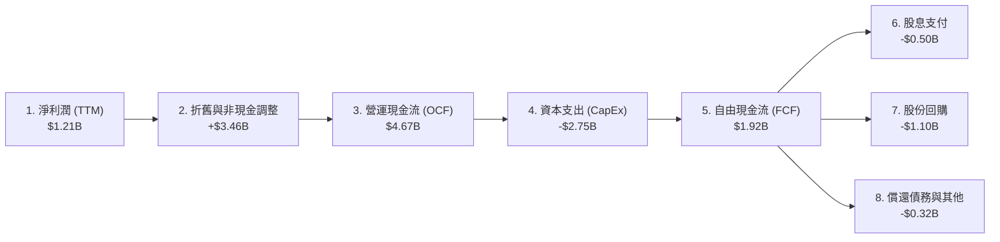

### 5.2 FCF 轉換率趨勢

| 指標 (Billion) | FY2022 | FY2023 | FY2024 | FY2025 | TTM | 評估 |
|---|---|---|---|---|---|---|
| **營運現金流 (OCF)** | $0.49B | $5.45B | $4.56B | $4.07B | **$4.67B** | 🟢 持續強勁 |
| **資本支出 (CapEx)** | -$1.30B | -$1.68B | -$2.08B | -$2.75B | **-$2.75B** | 🟡 擴建綠能與核能升級 |
| **自由現金流 (FCF)** | -$0.81B | $3.78B | $2.48B | $1.32B | **$1.92B** | 🟢 處於歷史高位區間 |
| **淨利潤 (GAAP)** | -$1.21B | $1.49B | $2.81B | $0.94B | **$1.21B** | 🟡 受對沖會計波動影響 |
| **FCF 轉換率 (FCF/NI)** | N/A | 253.7% | 88.3% | 140.4% | **158.7%** | 🟢 盈餘含金量極高 |

### 5.3 自由現金流趨勢

```
╔══════════════════════════════════════════════════════════════════╗
║               VST 自由現金流與 FCF 收益率趨勢                    ║
╠══════════════════════════════════════════════════════════════════╣
║                                                                  ║
║  FY2022  -$0.82B  ░░░░░░░░░░░░░░░░░░░░░  FCF Yield: -1.5%   🔴    ║
║  FY2023   $3.78B  █████████████████████  FCF Yield: 6.8%    🟢    ║
║  FY2024   $2.48B  ██████████████░░░░░░░  FCF Yield: 4.5%    🟢    ║
║  FY2025   $1.32B  ███████░░░░░░░░░░░░░░  FCF Yield: 2.4%    🟡    ║
║  TTM      $1.92B  ███████████░░░░░░░░░░  FCF Yield: 3.48%   🟢    ║
║                                                                  ║
║  💡 註：當前市值 $55.21B 下，TTM FCF 收益率為 3.48%。隨著核能    ║
║  高價合約陸續生效，預計 FY2027 FCF 收益率將攀升至 8% 以上。       ║
╚══════════════════════════════════════════════════════════════════╝
```

### 5.4 資本配置評估

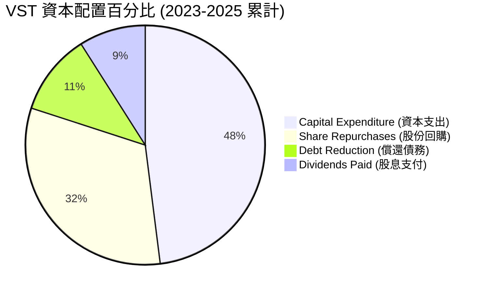

---

## 6. 獲利能力與資本效率

### 6.1 ROE / ROA / ROIC 趨勢

| 指標 | FY2023 | FY2024 | FY2025 | TTM | 行業均值 | 評估 |
|---|---|---|---|---|---|---|
| **ROE (股東權益報酬率)** | 28.1% | 43.0% | 18.5% | **42.9%** | ~11.5% | 🟢 遠超同行，主因高財務槓桿與強盈利 |
| **ROA (總資產報酬率)** | 4.5% | 7.4% | 2.3% | **6.0%** | ~3.2% | 🟢 資產利用效率優異 |
| **ROIC (投入資本回報率)**| 7.8% | 11.2% | 6.5% | **11.66%**| ~5.5% | 🟢 具備顯著的超額回報創造能力 |

### 6.2 ROIC vs WACC 分析（核心價值創造判斷）

```
╔══════════════════════════════════════════════════════════════════╗
║                ROIC vs WACC 深度分析 (TTM)                       ║
╠══════════════════════════════════════════════════════════════════╣
║                                                                  ║
║  WACC 估算：                                                     ║
║  ├── 無風險利率 (10Y美債)：   4.25%                              ║
║  ├── 市場風險溢酬 (ERP)：      5.00%                              ║
║  ├── Beta：                    1.405                              ║
║  ├── 股權成本 (Ke)：          4.25% + 1.405 × 5.0% = 11.28%      ║
║  ├── 債務成本 (稅後)：        5.63% × (1 - 19.4%) = 4.54%        ║
║  ├── 資本結構：               股權 73.5%，債務 26.5%             ║
║  └── ✅ WACC ≈ 9.49%                                             ║
║                                                                  ║
║  ROIC 估算：                                                     ║
║  ├── NOPAT = $3,525M (EBIT) × (1 - 19.4% 稅率) = $2,841M         ║
║  ├── 投入資本 = 權益 $5.10B + 債務 $19.93B - 現金 $0.66B          ║
║  │            = $24.37B                                          ║
║  └── ✅ ROIC ≈ 11.66%                                            ║
║                                                                  ║
║  ★ 經濟價值增加 (EVA) = ROIC - WACC = +2.17%                     ║
║                                                                  ║
║  ROIC  11.66% ▓▓▓▓▓▓▓▓▓▓▓▓▓▓▓▓▓▓▓▓░░░░░░░░  🟢 創造價值        ║
║  WACC   9.49% ▓▓▓▓▓▓▓▓▓▓▓▓▓▓▓░░░░░░░░░░░░░  ── 資本成本        ║
║  EVA   +2.17% ██████░░░░░░░░░░░░░░░░░░░░░░  🏆 正向財富效應    ║
║                                                                  ║
║  📊 結論：ROIC 顯著超越 WACC 2.17 個百分點，表明 VST 並非單純    ║
║  依賴債務擴張，而是具備實質性的超額價值創造能力。                ║
╚══════════════════════════════════════════════════════════════════╝
```

### 6.3 杜邦三因素分解

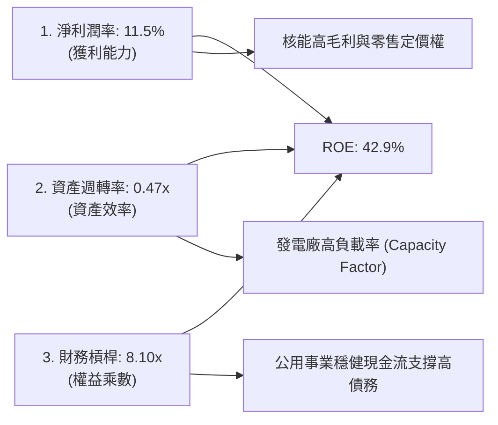

### 6.4 獲利能力儀表板

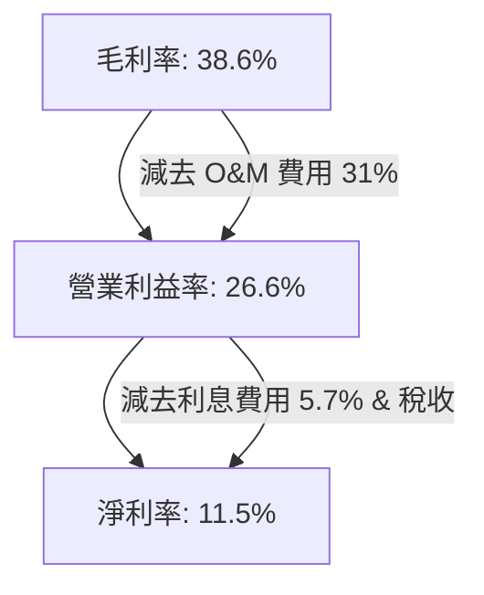

---

## 7. 估值深度分析

### 7.1 同業估值比較表格

| 估值指標 | **Vistra Corp (VST)** | **Constellation (CEG)** | **NRG Energy (NRG)** | **NextEra Energy (NEE)** | VST 相較同業估值評估 |
|---|---|---|---|---|---|
| **Trailing P/E** | 27.38x | 32.50x | 18.20x | 22.10x | 🟡 處於合理中樞 |
| **Forward P/E** | **14.91x** | **20.45x** | **11.20x** | **17.20x** | 🟢 具備顯著低估，性價比極高 |
| **PEG Ratio** | **0.48** | 1.45 | 0.95 | 2.10 | 🟢 成長性調整後的估值全行業最優 |
| **EV / EBITDA** | 11.34x | 15.80x | 8.90x | 14.20x | 🟢 顯著低於核能龍頭 CEG |
| **P/B Ratio** | 21.12x | 7.50x | 5.20x | 3.60x | 🔴 因高回購導致淨資產極低，該指標失真 |
| **P/S Ratio** | 2.84x | 3.50x | 1.10x | 4.80x | 🟢 處於健康區間 |

### 7.2 歷史估值區間分析

```
╔══════════════════════════════════════════════════════════════════╗
║               VST 歷史 Forward P/E 區間與當前位置                ║
╠══════════════════════════════════════════════════════════════════╣
║                                                                  ║
║  歷史最低 (2022)  8.0x   ██████                                  ║
║  歷史均值         12.5x  ██████████                              ║
║  當前 Forward P/E 14.91x ████████████░░░░░░░░░                    ║
║  歷史最高 (2024)  22.0x  ██████████████████                      ║
║                                                                  ║
║  💡 評估：當前 Forward P/E 14.91x 略高於歷史均值，但考慮到核能   ║
║  資產重估與 AI 數據中心帶來的長期高溢價合約，估值乘數理應享受    ║
║  系統性上調 (Re-rating)。                                        ║
╚══════════════════════════════════════════════════════════════════╝
```

### 7.3 DCF 敏感性分析（6格目標價矩陣）

*   **基本假設**：
    *   基準無風險利率：4.25%，永續增長率 (g)：2.0%
    *   基準財務預測：未來 5 年 FCF 複合年增長率為 12.5%（受益於核能合約重新定價）

| 成長情境 \ WACC | **8.5% (低資本成本)** | **9.5% (基準 WACC)** | **10.5% (高資本成本)** |
|---|---|---|---|
| 🟢 **樂觀 (FCF +15% CAGR)** | **$278.00** (+69.8%) | **$242.00** (+47.8%) | **$205.00** (+25.2%) |
| 🟡 **基準 (FCF +12.5% CAGR)**| **$256.00** (+56.3%) | **$223.00** (+36.2%) | **$188.00** (+14.8%) |
| 🔴 **悲觀 (FCF +5% CAGR)** | **$165.00** (+0.8%) | **$142.00** (-13.3%) | **$118.00** (-27.9%) |

### 7.4 估值綜合區間

```
╔══════════════════════════════════════════════════════════════════╗
║                    VST 估值綜合區間與當前股價                     ║
╠══════════════════════════════════════════════════════════════════╣
║                                                                  ║
║  52周最低價：  $132.66  ████                                     ║
║  當前股價：    $163.75  ███████                                  ║
║  分析師平均：  $223.00  █████████████                            ║
║  分析師最高：  $320.00  ████████████████████                     ║
║                                                                  ║
║  💡 結論：當前股價 $163.75 處於 52 周區間的中低部，距離分析師    ║
║  平均目標價 $223.00 有 36.2% 的安全邊際。                        ║
╚══════════════════════════════════════════════════════════════════╝
```

---

## 8. 成長催化劑

### 8.1 催化劑時間軸

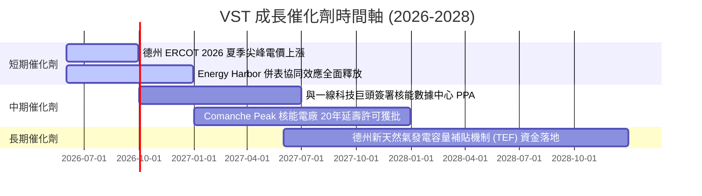

### 8.2 TAM 市場規模分析

```
╔══════════════════════════════════════════════════════════════════╗
║               VST 潛在市場規模 (TAM) 與滲透率分析                ║
╠══════════════════════════════════════════════════════════════════╣
║                                                                  ║
║  1. 德州 ERCOT 電網總負載 (2030 預期)：                          ║
║     ├── 市場規模：~150 GW (當前約 85 GW)                         ║
║     └── VST 當前市佔率：~20% (發電容量)                          ║
║                                                                  ║
║  2. AI 數據中心專用核能電力市場 (全美)：                         ║
║     ├── 市場規模：預計到 2030 年達 30 GW                         ║
║     └── VST 潛在供電份額：~4-6 GW (核能艦隊總容量)               ║
║                                                                  ║
║  3. 綠色氫能與工業脫碳電力：                                     ║
║     └── 潛在年收益：+$1.5B 額外溢價                              ║
╚══════════════════════════════════════════════════════════════════╝
```

### 8.3 成長驅動力結構圖

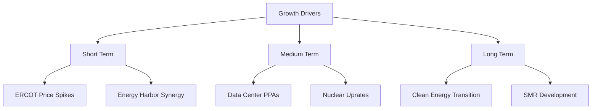

---

## 9. 風險矩陣

### 9.1 風險評分矩陣

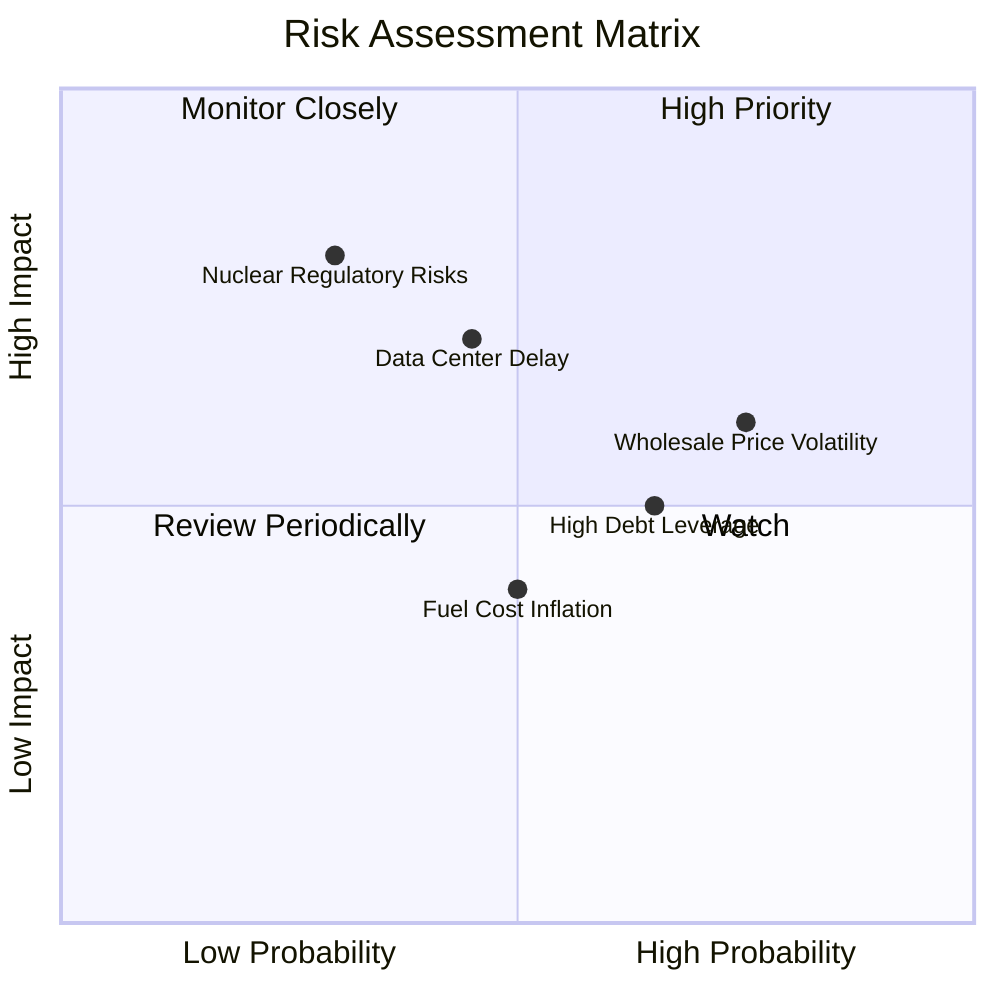

### 9.2 風險清單詳細分析

| # | 風險項目 | 發生機率 | 財務衝擊 | 風險評分 | 緩解措施 |
|---|---|---|---|---|---|
| 1 | 🟡 **德州批發電價大幅回落** | 中 (45%) | 中 (-8% EBITDA) | 🟡 5.8 / 10 | 通過「發電+零售」一體化對沖，鎖定 80% 以上的遠期電價。 |
| 2 | 🔴 **核能電廠監管與安全事故**| 低 (15%) | 極高 (-30% 淨利) | 🔴 7.5 / 10 | 執行業界最高安全標準，並為核能資產購買足額營運中斷保險。 |
| 3 | 🟡 **高債務再融資利息上升** | 高 (70%) | 中 (-5% EPS) | 🟡 6.5 / 10 | 債務結構多為固定利率長期債，並利用強勁的 FCF 逐步降槓桿。 |
| 4 | 🔴 **數據中心合約聯邦監管受阻**| 中 (35%) | 高 (-15% 預估收益) | 🔴 7.0 / 10 | 與多個州級電網（如 PJM, ERCOT）密切溝通，優化「網前」與「網後」併網方案。 |

---

## 10. 投資建議

### 10.1 最終綜合評級雷達圖

```
╔══════════════════════════════════════════════════════════════╗
║                    VST 最終投資評級雷達                      ║
╠══════════════════════════════════════════════════════════════╣
║ 業務基本面強度  9.0  ▓▓▓▓▓▓▓▓▓▓▓▓▓▓▓▓▓▓░░  🟢 頂級          ║
║ 短期催化劑密度  9.2  ▓▓▓▓▓▓▓▓▓▓▓▓▓▓▓▓▓▓▓░  🟢 極強          ║
║ 估值安全邊際    9.3  ▓▓▓▓▓▓▓▓▓▓▓▓▓▓▓▓▓▓▓░  🟢 極高          ║
║ 現金流充沛度    8.5  ▓▓▓▓▓▓▓▓▓▓▓▓▓▓▓▓░░░░  🟢 優異          ║
║ 財務結構健康度  7.0  ▓▓▓▓▓▓▓▓▓▓▓▓▓▓░░░░░░  🟡 需監控        ║
╠══════════════════════════════════════════════════════════════╣
║ 綜合投資評級    8.6  ▓▓▓▓▓▓▓▓▓▓▓▓▓▓▓▓▓░░░  🏆 強烈買入      ║