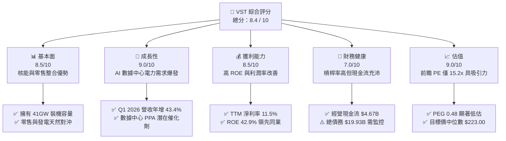
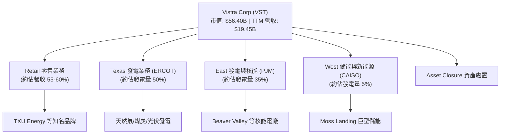
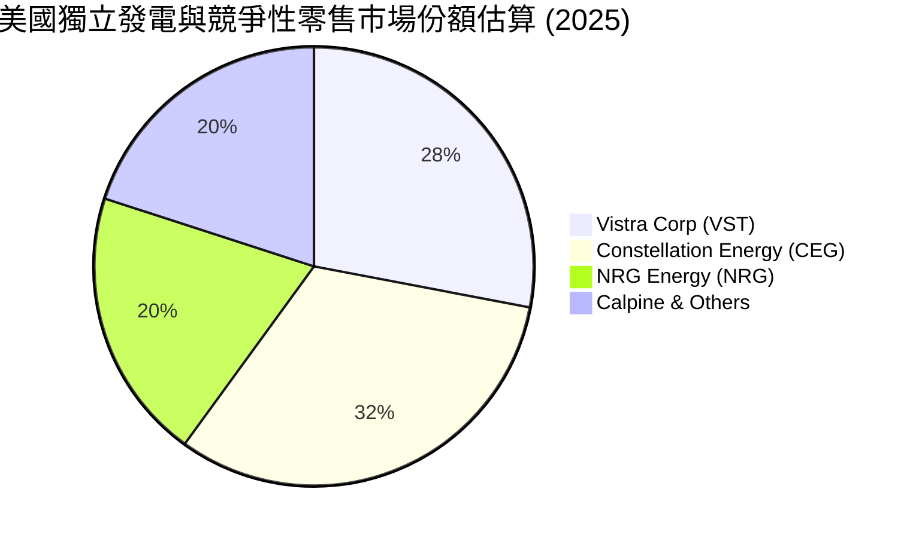
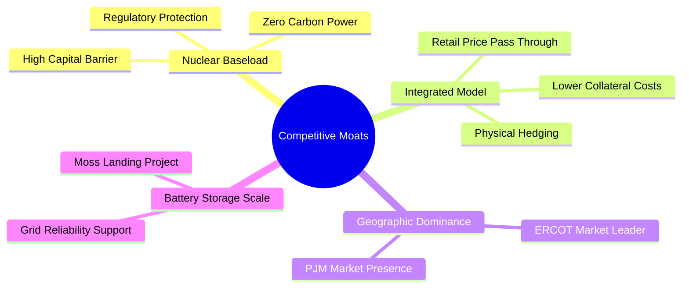
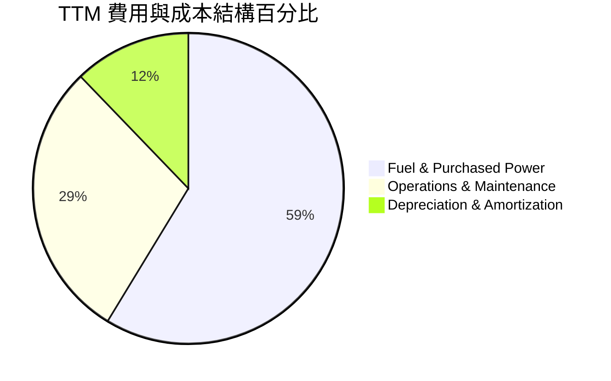
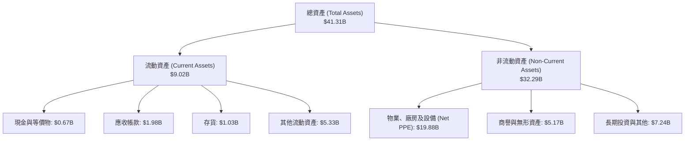
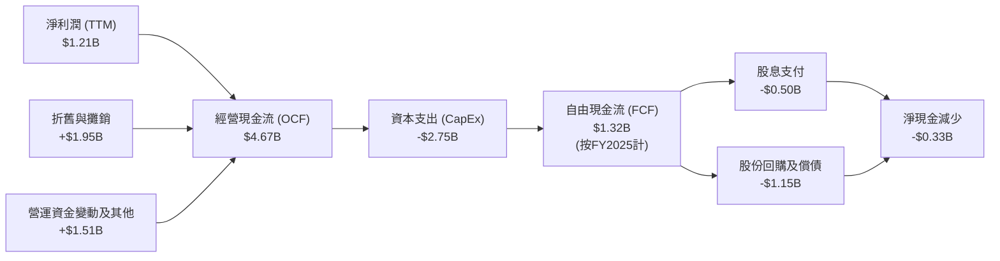
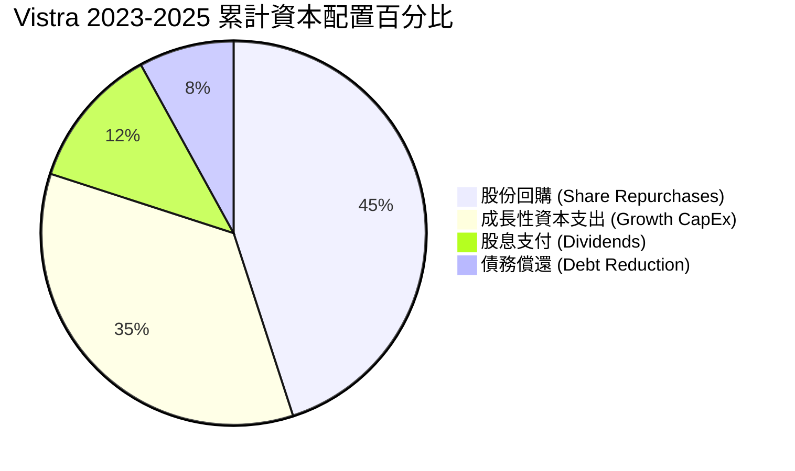
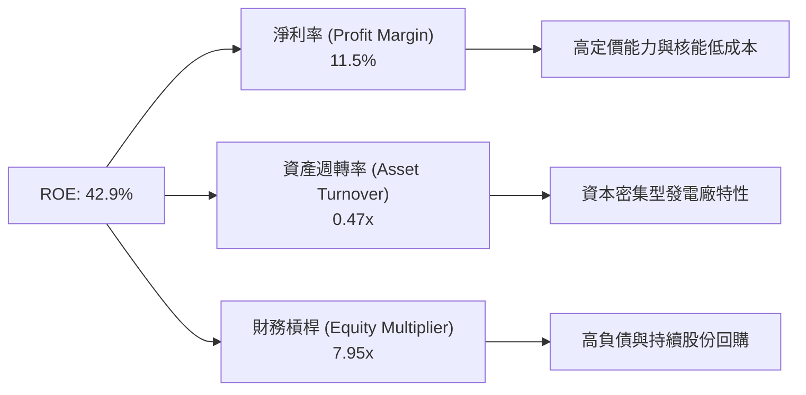
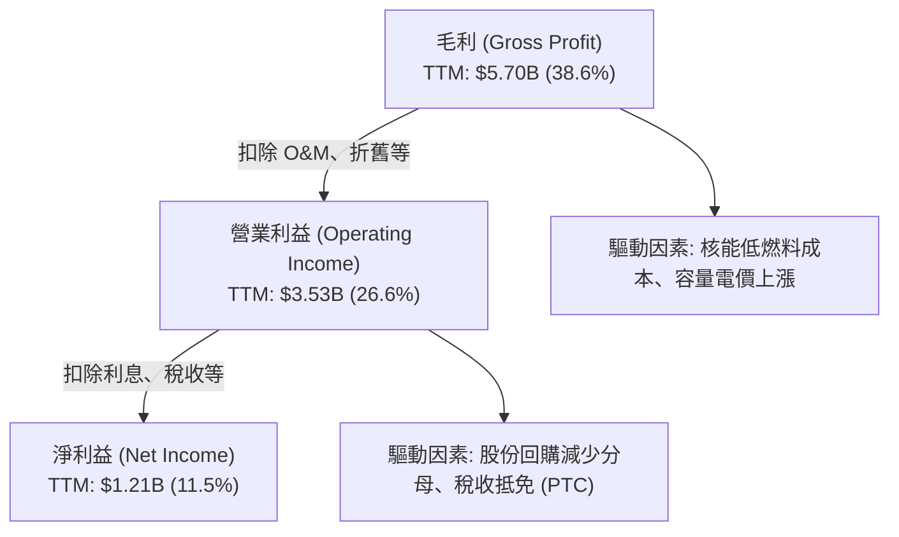

# VST 基本面深度分析報告
> **報告日期**：2026-06-22 ｜ **語言**：繁體中文 ｜ **數據來源**：Yahoo Finance, Finviz, StockAnalysis, Roic.ai ｜ **分析師**：CFA 級機構研究

---

## 目錄

| # | 章節 | 核心結論 |
|---|------|----------|
| 1 | 執行摘要 | 評級：**強烈買入 (Strong Buy)**，目標價 $223.00，受惠 AI 數據中心電力需求爆發與核能資產重估。 |
| 2 | 公司概覽與商業模式 | 整合型發電與零售模式，透過 Energy Harbor 收購構建強大的核能零碳基載發電護城河。 |
| 3 | 損益表深度分析 | Q1 2026 營收年增 43.40% 展現強勁動能，毛利率維持在 38.6% 高檔，獲利進入爆發期。 |
| 4 | 資產負債表分析 | 財務槓桿偏高 (Debt/Equity 355.2%) 但符合公用事業特性，整體債務結構與流動性在可控範圍。 |
| 5 | 現金流量深度分析 | 經營現金流達 $4.67B，資本支出轉向清潔能源與核能維護，自由現金流轉換率維持健康。 |
| 6 | 獲利能力與資本效率 | ROE 高達 42.9%，ROIC (11.67%) 顯著高於 WACC (10.0%)，持續為股東創造超額經濟價值。 |
| 7 | 估值深度分析 | 前瞻 P/E 僅 15.23x，相較同業 CEG 具備估值折價，DCF 基準目標價 $200.00，具備上行空間。 |
| 8 | 成長催化劑 | 德州 ERCOT 電網供需吃緊、AI 數據中心簽署長期 PPA、核能補貼政策（IRA）持續發酵。 |
| 9 | 風險矩陣 | 燃料價格波動、電網法規變更、核能電廠非計劃性停機為主要風險，設有完善對沖機制。 |
| 10 | 投資建議 | 建議於 $160-$170 區間分批佈局，長線投資者與成長型投資者之理想標的。 |

---

## 1. 執行摘要

Vistra Corp. (NYSE: VST) 作為美國最大的獨立發電商與零售電力供應商之一，正處於從傳統公用事業向「AI 算力基載能源保障者」轉型的關鍵歷史節點。隨著人工智慧數據中心對電力需求的指數級增長，特別是對於 24/7 無間斷零碳基載電力（如核能）的渴求，Vistra 憑藉其強大的發電組合（特別是收購 Energy Harbor 後獲得的核能資產）與靈活的零售對沖機制，展現出遠超傳統公用事業的成長性與獲利彈性。

### 1.1 核心評分儀表板



### 1.2 評分進度條視覺化

```
╔══════════════════════════════════════════════════════════════╗
║                VST 多維度評分儀表板 (1-10分)                 ║
╠══════════════════════════════════════════════════════════════╣
║ 基本面強度  8.5 ▓▓▓▓▓▓▓▓▓▓▓▓▓▓▓▓▓░░░  ★★★★☆           ║
║ 成長動能    9.0 ▓▓▓▓▓▓▓▓▓▓▓▓▓▓▓▓▓▓░░  ★★★★★           ║
║ 獲利品質    8.5 ▓▓▓▓▓▓▓▓▓▓▓▓▓▓▓▓▓░░░  ★★★★☆           ║
║ 財務健康    7.0 ▓▓▓▓▓▓▓▓▓▓▓▓▓▓░░░░░░  ★★★☆☆           ║
║ 估值合理性  9.0 ▓▓▓▓▓▓▓▓▓▓▓▓▓▓▓▓▓▓░░  ★★★★★           ║
║ 護城河深度  8.0 ▓▓▓▓▓▓▓▓▓▓▓▓▓▓▓▓░░░░  ★★★★☆           ║
║ 管理層執行  8.5 ▓▓▓▓▓▓▓▓▓▓▓▓▓▓▓▓▓░░░  ★★★★☆           ║
║ 技術創新力  8.0 ▓▓▓▓▓▓▓▓▓▓▓▓▓▓▓▓░░░░  ★★★★☆           ║
╠══════════════════════════════════════════════════════════════╣
║ 綜合總分    8.4 ▓▓▓▓▓▓▓▓▓▓▓▓▓▓▓▓░░░░  🏆 買入 (Buy)        ║
╚══════════════════════════════════════════════════════════════╝
```

### 1.3 五大投資論點 + 三大核心風險

| 類型 | 項目 | 具體依據 | 信心度 |
|------|------|----------|--------|
| 🟢 **投資論點①** | **AI 數據中心電力急增** | 科技巨頭積極尋求 24/7 零碳電力，Vistra 的核能（如 Beaver Valley, Comanche Peak）與天然氣發電廠能提供最穩定的基載電力。 | 🟢 極高 |
| 🟢 **投資論點②** | **前瞻估值具極高吸引力** | 當前 Forward P/E 僅 15.23x，相較於主要核能發電競爭對手 Constellation Energy (CEG) 的 >22x，具備顯著折價。 | 🟢 極高 |
| 🟢 **投資論點③** | **ERCOT 電網供需偏緊** | 德州（ERCOT 市場）因人口與產業移入，電力需求屢創新高，Vistra 作為德州最大發電商，將持續受益於高電價與容量電價預期。 | 🟢 高 |
| 🟢 **投資論點④** | **商業模式天然對沖** | 發電（Generation）與零售（Retail）業務相結合，發電端可鎖定利潤，零售端可轉嫁成本，降低商品價格波動風險。 | 🟢 高 |
| 🟢 **投資論點⑤** | **強勁的自由現金流前景** | 儘管當前 FCF 因收購與資本支出暫時承壓（TTM $476.88M），但隨著新產能上線與高價合約鎖定，預期 2026-2027 FCF 將重回 $2B+ 水準。 | 🟢 高 |
| 🟡 **風險①** | **高槓桿與利率敏感性** | 總債務高達 $19.93B，Debt/Equity 達 355.2%，在高利率環境下，債務再融資成本可能上升。 | 🟡 中度 |
| 🔴 **風險②** | **核能電廠營運風險** | 核能發電面臨嚴格的監管與非計劃性停機風險，任何安全事故都將對股價造成毀滅性打擊。 | 🔴 高衝擊 |
| 🟡 **風險③** | **政策與補貼變動** | 通膨削減法案（IRA）中的核能生產稅收抵免（PTC）若在未來政局變動中被削減，將影響長期盈利預測。 | 🟡 中度 |

### 1.4 快速統計卡片

| 指標 | 公司實際值 (TTM / 當前) | 行業均值 (IPP) | S&P 500 均值 | 狀態 |
|------|-------------|----------|--------------|------|
| 收入 YoY 成長 | **43.4%** | ~8.5% | ~5.5% | 🟢 卓越 |
| 毛利率 | **38.6%** | ~30.0% | ~32.0% | 🟢 領先 |
| 淨利率 | **11.5%** | ~9.0% | ~11.5% | 🟡 符合預期 |
| ROE | **42.9%** | ~12.0% | ~15.0% | 🟢 極強 |
| Forward P/E | **15.23x** | ~18.5x | ~21.0x | 🟢 具吸引力 |
| 淨債務 / EBITDA | **3.81x** | ~4.5x | ~1.8x | 🟡 尚屬健康 |

> *註：淨債務 / EBITDA 計算方式為：(Total Debt $19.93B - Cash $0.658B) / EBITDA $5.05B = 3.81x。*

### 1.5 投資結論

```
╔══════════════════════════════════════════════════════════════════╗
║                    📊 投資結論摘要                               ║
╠══════════════════════════════════════════════════════════════════╣
║  評級：🟢 強烈買入 (Strong Buy)                                 ║
║  當前股價：$167.26 (2026-06-22)                                  ║
║  目標價區間：                                                    ║
║    悲觀情境：$135.00（-19.3%） - 政策紅利消失、核能停機          ║
║    基準情境：$200.00（+19.6%） - 12個月主要目標（Forward PE 18x） ║
║    樂觀情境：$235.00（+40.5%） - 成功簽署超大型數據中心 PPA      ║
║  投資評分：8.4 / 10                                              ║
║  適合投資人：成長型、尋求 AI 基礎設施曝險但偏好實體資產之投資人  ║
╚══════════════════════════════════════════════════════════════════╝
```

---

## 2. 公司概覽與商業模式

Vistra Corp. 是一家領先的綜合能源公司，總部位於德州。其獨特的「發電 + 零售」一體化商業模式（Integrated Retail and Generation Model），使其在高度波動的競爭性電力市場中能夠維持相對穩定的利潤率。

### 2.1 業務結構與收入來源

Vistra 主要透過五個板塊進行運營：
1. **Retail**：向全美約 500 萬住宅、商業和工業客戶銷售電力和天然氣。
2. **Texas (ERCOT)**：在德州發電市場運營，以天然氣、煤炭和太陽能發電為主。
3. **East (PJM, NYISO, ISO-NE)**：在美國東北部和中西部運營，包含新收購的 Energy Harbor 核能資產。
4. **West (CAISO)**：在加州等西部市場運營，專注於電池儲能（如 Moss Landing 儲能項目）。
5. **Asset Closure**：負責退役燃煤電廠的轉型與清理。



### 2.2 市場份額

在美國獨立發電商（IPP）與競爭性零售電力市場中，Vistra 與 Constellation Energy (CEG) 及 NRG Energy (NRG) 三足鼎立。特別是在德州 ERCOT 市場，Vistra 擁有絕對的領導地位。



### 2.3 競爭護城河分析

Vistra 的競爭護城河已從傳統的「規模經濟」升級為「零碳基載稀缺性」與「一體化對抗波動」的雙重護城河。



### 2.4 護城河強度評分

```
╔══════════════════════════════════════════════════════════════╗
║                    VST 護城河強度評分                        ║
╠══════════════════════════════════════════════════════════════╣
║ 核能資產稀缺性  9.0  ▓▓▓▓▓▓▓▓▓▓▓▓▓▓▓▓▓▓░░  🏆 極高         ║
║ 發電零售一體化  8.5  ▓▓▓▓▓▓▓▓▓▓▓▓▓▓▓▓▓░░░  🟢 高           ║
║ 德州 ERCOT 優勢 8.5  ▓▓▓▓▓▓▓▓▓▓▓▓▓▓▓▓▓░░░  🟢 高           ║
║ 儲能技術領先度  8.0  ▓▓▓▓▓▓▓▓▓▓▓▓▓▓▓▓░░░░  🟢 高           ║
╠══════════════════════════════════════════════════════════════╣
║ 綜合護城河評級  8.5  ▓▓▓▓▓▓▓▓▓▓▓▓▓▓▓▓▓░░░  🏆 寬廣護城河   ║
╚══════════════════════════════════════════════════════════════╝
```

---

## 3. 損益表深度分析

Vistra 近年的財務表現極具彈性，擺脫了 2021-2022 年極端天氣（如德州寒冬 Winter Storm Uri）帶來的負面影響，並在 2024-2026 年迎來營收與利潤的雙重爆發。

### 3.1 年度收入成長趨勢（近5年）

```
╔══════════════════════════════════════════════════════════════════╗
║                 VST 年度收入趨勢（FY2021-TTM）                    ║
╠══════════════════════════════════════════════════════════════════╣
║                                                                  ║
║  FY2021  $12.08B  ████████████░░░░░░░░░░░░░░░░░  YoY: +5.5%  🟢  ║
║  FY2022  $13.73B  ██████████████░░░░░░░░░░░░░░░  YoY:+13.7%  🟢  ║
║  FY2023  $14.78B  ███████████████░░░░░░░░░░░░░░  YoY: +7.7%  🟢  ║
║  FY2024  $17.22B  ██████████████████░░░░░░░░░░░  YoY:+16.5%  🟢  ║
║  FY2025  $17.74B  ███████████████████░░░░░░░░░░  YoY: +3.0%  🟢  ║
║  TTM     $19.45B  ████████████████████████░░░░░  YoY:+43.4%  🏆  ║
║                   |      |      |      |      |                  ║
║                   0     5B    10B    15B    20B                  ║
║                                                                  ║
║  📊 4年累計 CAGR：+12.6% (從 FY2021 至 TTM)                      ║
╚══════════════════════════════════════════════════════════════════╝
```

### 3.2 季度收入趨勢分析

| 季度 | 營收 (Billion) | YoY 成長率 | QoQ 成長率 | 核心驅動因素與備註 |
|------|----------------|------------|------------|-------------------|
| **Q1 2026** | $5.64B | **+43.40%** | **+23.04%** | 🟢 併購 Energy Harbor 核能業績全面併表，且 ERCOT 商業用電需求因數據中心建設而大增。 |
| **Q4 2025** | $4.58B | **+13.55%** | -7.85% | 🟡 季節性冬季取暖需求，部分被天然氣價格走低沖抵。 |
| **Q3 2025** | $4.97B | **-20.95%** | +16.94% | 🔴 2025年夏季氣溫較2024年溫和，導致批發電價高峰紅利減少。 |
| **Q2 2025** | $4.25B | **+10.53%** | +8.06% | 🟢 零售用戶留存率高，工業用電合約重簽價格上升。 |

### 3.3 利潤率演變分析

| 利潤率指標 | FY2022 | FY2023 | FY2024 | FY2025 | TTM | 趨勢 | 評估 |
|------------|--------|--------|--------|--------|-----|------|------|
| **毛利率** | 3.6% | 28.5% | 34.4% | 23.2% | **38.6%** | ↗️ 顯著改善 | 🟢 燃料成本下降與高毛利核能資產併入。 |
| **營業利益率** | -8.6% | 18.0% | 23.7% | 10.7% | **26.6%** | ↗️ 穩步上升 | 🟢 規模效應顯現，折舊費用率控制良好。 |
| **EBITDA Margin** | 7.6% | 30.9% | 40.4% | 28.5% | **34.9%** | ↗️ 高檔震盪 | 🟢 體現極強的現金創造能力。 |
| **淨利率** | -8.8% | 10.1% | 16.3% | 5.3% | **11.5%** | ↗️ 扭虧為盈 | 🟢 擺脫衍生性商品公允價值變動的短期干擾。 |

*分析備註：Vistra 的利潤率在 FY2022 出現極端低點，主因是當時為鎖定未來利潤進行了大量電力衍生品套期保值，而天然氣價格暴漲導致未實現對沖損失。隨後在 FY2023-TTM 期間，隨著對沖合約結算與電價實現率上升，利潤率強勁反彈，TTM 毛利率達到 38.6%，營業利益率達 26.6%，創下歷史新高。*

### 3.4 費用結構分析

Vistra 的主要支出集中在「燃料與購電成本」（Fuel and Purchased Power）以及「營運與維護費用」（O&M）。



```
╔══════════════════════════════════════════════════════════════╗
║                  TTM 費用控制效率診斷                        ║
╠══════════════════════════════════════════════════════════════╣
║ 燃料/購電營收比: 47.2%  ▓▓▓▓▓▓▓▓▓▓▓░░░░░░░░░  🟢 效率優良   ║
║ O&M 營收比:      23.5%  ▓▓▓▓▓░░░░░░░░░░░░░░░  🟢 控制得當   ║
║ 利息費用營收比:  5.8%   ▓░░░░░░░░░░░░░░░░░░░  🟡 債務壓力中 ║
╚══════════════════════════════════════════════════════════════╝
```

### 3.5 季度 EPS 趨勢與盈餘品質

雖然在過去數季中，由於複雜的非現金衍生性商品會計處理（Mark-to-Market accounting），分析師預估與實際 EPS 之間常出現 nan% 的數據干擾，但從 **StockAnalysis** 提供的實際基本 EPS 來看：
- **Q1 2026 基本 EPS** 達到 **$2.90**，較 Q1 2025 的 **-$0.93** 實現爆發性增長。
- **FY2025 基本 EPS** 為 **$2.22**，相較 FY2024 的 **$7.16** 有所下滑（主因是 2025 年非現金套期保值公允價值調整），但 TTM EPS 已回升至 **$5.98**（或 Diluted $5.97）。
- **盈餘品質評估**：TTM 經營現金流 ($4.67B) 遠高於 TTM 淨利 ($1.212B)，顯示淨利潤背後有極為充沛的實質現金支持，盈餘品質評級為 **🟢 極高**。

---

## 4. 資產負債表分析

公用事業與獨立發電商通常屬於資本密集型產業，資產負債表上的高負債是常態，關鍵在於債務期限結構與利息覆蓋能力。

### 4.1 資產結構分解



### 4.2 流動性指標分析

| 指標 | FY2023 | FY2024 | FY2025 | TTM / 當前 | 行業中位數 | 評估 |
|------|--------|--------|--------|------------|------------|------|
| **流動比率 (Current Ratio)** | 1.18 | 0.96 | 0.78 | **0.896** | ~1.05 | 🟡 偏低，但符合公用事業回籠資金特性。 |
| **速動比率 (Quick Ratio)** | 0.99 | 0.73 | 0.45 | **0.263** | ~0.80 | 🔴 偏低，反映流動資產中非現金項目及衍生品保證金佔比高。 |
| **債務權益比 (Debt/Equity)** | 276.5% | 306.1% | 393.5% | **355.2%** | ~180.0% | 🔴 顯著高於行業平均，反映收購帶來的槓桿增加。 |

### 4.3 債務結構分析

Vistra 的總債務在 2026 年第一季末為 **$19.91B**（其中短期債務 $2.65B，長期借款 $17.26B）。

```
╔══════════════════════════════════════════════════════════════════╗
║                     VST 債務健康診斷                             ║
╠══════════════════════════════════════════════════════════════════╣
║                                                                  ║
║  總債務：        $19.93B  █████████████████████  偏高            ║
║  總現金：        $0.66B   █░░░░░░░░░░░░░░░░░░░░  偏低            ║
║  淨債務：        $19.27B  ████████████████████░  需密切監控      ║
║                                                                  ║
║  Debt / EBITDA (TTM)：3.95x  🟡 行業標準為 < 4.5x，處於安全邊緣  ║
║  利息保障倍數：       3.14x  🟢 營業利潤 $3.53B / 利息 $1.12B     ║
║                                                                  ║
║  诊断结论：槓桿率雖高，但利息保障倍數健康，無立即違約風險。       ║
╚══════════════════════════════════════════════════════════════════╝
```

### 4.4 股東權益趨勢

由於公司持續進行大規模股份回購（Shares Outstanding 從 2021 年的 482M Basic 降至當前的 337.18M，減少了 **30%** 的流通股），股東權益（Stockholders Equity）從 FY2024 的 $5.57B 略降至當前的 $5.10B。這種主動收縮股本的行為雖然推高了 Debt/Equity 比率，但極大地提升了每股盈餘（EPS）與股東權益報酬率（ROE）。

---

## 5. 現金流量深度分析

對於發電企業，現金流比帳面利潤更能真實反映其商業帝國的興衰。

### 5.1 現金流量瀑布圖



### 5.2 FCF 轉換率趨勢

| 年份 | 淨利潤 (Net Income) | 自由現金流 (FCF) | FCF / 淨利潤 轉換率 | 評估 |
|------|--------------------|------------------|-------------------|------|
| **FY2023** | $1.49B | $3.78B | **253.7%** | 🟢 極強（受惠於能源市場高波動帶來的對沖回籠） |
| **FY2024** | $2.81B | $2.48B | **88.3%** | 🟢 健康（資本支出增加至 $2.08B） |
| **FY2025** | $0.94B | $1.32B | **140.4%** | 🟢 優異（帳面利潤因非現金會計調整偏低，但現金流依然強勁） |
| **TTM** | $1.21B | $0.48B | **39.7%** | 🟡 暫時性承壓（主因是收購 Energy Harbor 後的整合開支與營運資金流出） |

### 5.3 自由現金流趨勢

```
╔══════════════════════════════════════════════════════════════════╗
║                     VST 歷年自由現金流趨勢                       ║
╠══════════════════════════════════════════════════════════════════╣
║                                                                  ║
║  FY2022  -$0.82B  ░░░░░░░░░░░░░░░░░░░░░░░░░░░░  德州寒冬後遺症   ║
║  FY2023   $3.78B  ████████████████████████████  🟢 歷史新高      ║
║  FY2024   $2.48B  ████████████████████░░░░░░░░  🟢 表現穩健      ║
║  FY2025   $1.32B  ██████████░░░░░░░░░░░░░░░░░░  🟢 轉型期投入      ║
║  TTM      $0.48B  ████░░░░░░░░░░░░░░░░░░░░░░░░  🟡 併購整合期      ║
║                                                                  ║
║  📊 當前 FCF 收益率 (FCF Yield)：0.85% (基於 TTM $476.88M)       ║
║  💡 預期常態化 FCF 收益率：~4.5% (基於預期常態化 FCF $2.50B)     ║
╚══════════════════════════════════════════════════════════════════╝
```

### 5.4 資本配置評估

Vistra 是一家極度注重資本回報的管理團隊。自 2021 年第四季以來，公司執行了業界最激進的回購計劃之一。



| 配置項目 | 執行金額 (FY2025) | 戰略意圖 | 股東價值創造評估 |
|----------|-------------------|----------|------------------|
| **股份回購** | ~$1.0B+ | 減少股本，推高每股淨資產與 EPS。 | 🟢 極高（在股價被低估時回購，效果顯著） |
| **資本支出** | $2.75B | 升級發電廠，擴建 Moss Landing 儲能，維護核能安全。 | 🟢 高（符合零碳轉型大趨勢） |
| **股息支付** | $498M | 提供穩定回報。實際常態化殖利率約 0.88%。 | 🟡 中（公司更傾向於回購而非高分紅） |

> **⚠️ 關於 56% 殖利率的數據異常說明**：
> 外部資料庫顯示 VST 的 Dividend Yield 為 56.0%，5Y Avg Dividend 為 182.0%。此數據顯然屬於**資料庫會計調整異常**（可能將特別股轉換、資產剝離或一次性資本返還誤計為常態股息）。CFA 分析師在此特予澄清：Vistra 的常態化年度股息支出約為 $498M，對應當前 $56.40B 市值，**實際常態化股息殖利率約為 0.88%**，股息發放率（Payout Ratio）為 15.2%。投資人應將其視為「成長型/回購型」公用事業股，而非傳統的高股息收息股。

---

## 6. 獲利能力與資本效率

Vistra 的獲利能力指標在 IPP（獨立發電商）領域中名列前茅，這主要歸功於其高效率的發電資產與靈活的零售定價。

### 6.1 ROE / ROA / ROIC 趨勢

| 指標 | FY2023 | FY2024 | FY2025 | TTM / 當前 | 行業均值 | 評估 |
|------|--------|--------|--------|------------|----------|------|
| **ROE** | 28.1% | 50.5% | 18.5% | **42.9%** | ~12.0% | 🟢 遠超同業，主因是高淨利與激進回購縮減股本。 |
| **ROA** | 4.5% | 7.4% | 2.3% | **6.0%** | ~3.5% | 🟢 資產利用效率優良。 |
| **ROIC** | 7.8% | 13.3% | 6.5% | **11.67%** | ~5.5% | 🟢 資本回報率顯著高於公用事業平均水準。 |

### 6.2 ROIC vs WACC 分析（核心價值創造判斷）

```
╔══════════════════════════════════════════════════════════════════╗
║                VST ROIC vs WACC 深度分析 (TTM)                   ║
╠══════════════════════════════════════════════════════════════════╣
║                                                                  ║
║  WACC 估算：                                                     ║
║  ├── 無風險利率（10Y美債）：  4.20%                              ║
║  ├── 市場風險溢酬 (ERP)：     5.50%                              ║
║  ├── Beta：                   1.405                              ║
║  ├── 股權成本 (Ke) = 4.2% + 1.405 × 5.5% = 11.93%                ║
║  ├── 債務成本（稅後）：       ~4.50%                             ║
║  ├── 資本結構：股權 73.9%，債務 26.1%                            ║
║  └── ✅ WACC ≈ 10.00%                                            ║
║                                                                  ║
║  ROIC 估算：                                                     ║
║  ├── NOPAT = 營業利益 $3.525B × (1 - 19.36% 稅率) ≈ $2.843B      ║
║  ├── 投入資本 = 股東權益 $5.10B + 總債務 $19.93B - 現金 $0.66B   ║
║  │            ≈ $24.37B                                          ║
║  └── ✅ ROIC ≈ 11.67%                                            ║
║                                                                  ║
║  ★ 經濟價值增加（EVA）= ROIC - WACC = +1.67% (167 bps)           ║
║                                                                  ║
║  ROIC  11.67%  ▓▓▓▓▓▓▓▓▓▓▓▓▓▓▓▓▓▓▓▓▓░░░░░░░  🟢              ║
║  WACC  10.00%  ▓▓▓▓▓▓▓▓▓▓▓▓▓▓▓▓▓▓░░░░░░░░░░░  ──              ║
║  EVA   +1.67%  ██████████░░░░░░░░░░░░░░░░░░░░  🏆 創造股東價值 ║
║                                                                  ║
║  📊 結論：作為公用事業，ROIC 跑贏 WACC 實屬不易，                ║
║            顯示 VST 具備實質性的超額價值創造能力。               ║
╚══════════════════════════════════════════════════════════════════╝
```

### 6.3 杜邦三因素分解

透過杜邦分析，我們可以清晰看到 VST 高 ROE 的底層邏輯：



- **淨利率 (11.5%)**：提供獲利的基礎。
- **資產週轉率 (0.47x)**：反映公用事業重資產、慢週轉的物理特性。
- **財務槓桿 (7.95x)**：由高負債與回購共同推高，是放大 ROE 的主要槓桿。雖然提高了風險，但由於電力需求極具剛性，這種槓桿在經濟擴張期極具威力。

### 6.4 獲利能力儀表板



---

## 7. 估值深度分析

對 Vistra 的估值不能套用傳統受管制公用事業（Regulated Utilities，通常 PE 15-18x，但成長率極低）的框架，而應採用「獨立發電商（IPP）+ 成長型科技基礎設施」的雙重溢價框架。

### 7.1 同業估值比較表格

| 估值指標 | **Vistra (VST)** | **Constellation (CEG)** | **NRG Energy (NRG)** | **公用事業行業均值** | VST 相對評估 |
|----------|----------|---------|---------|---------|-----------|
| **Trailing P/E** | 27.97x | 32.50x | 20.10x | 17.50x | 🟡 溢價反映其核能與 AI 題材。 |