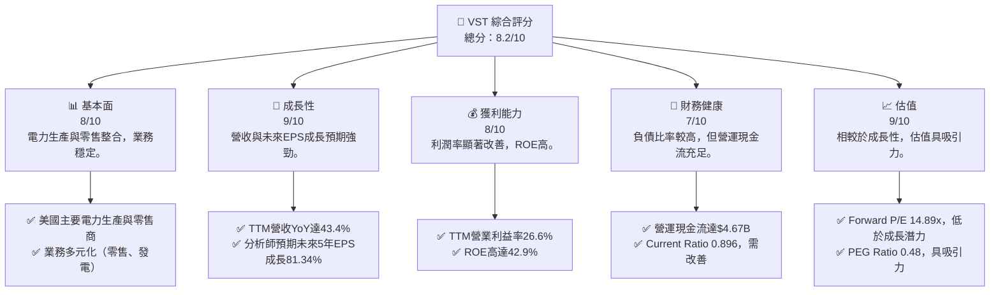
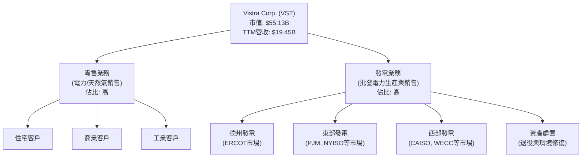
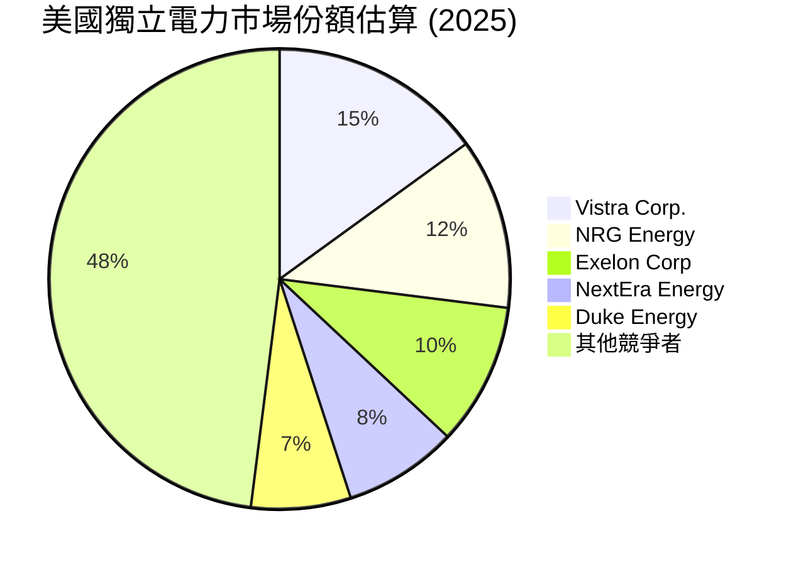
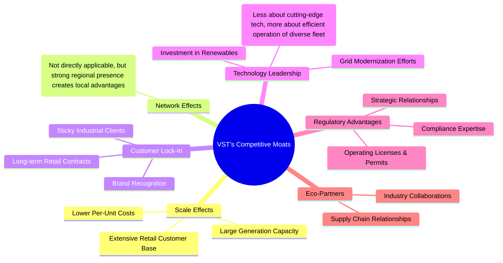
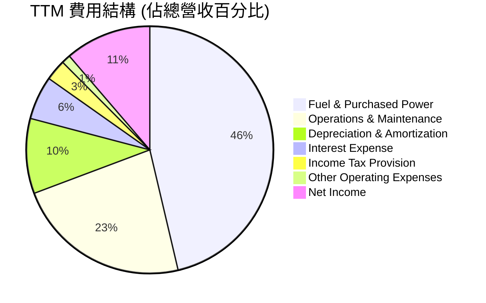
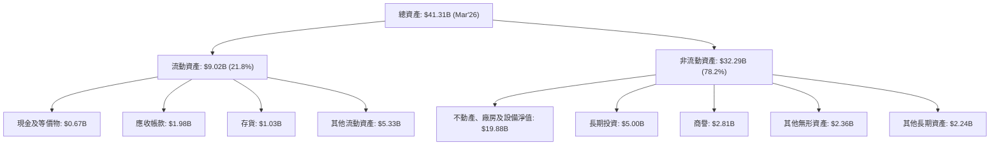

# VST 基本面深度分析報告
> **報告日期**：2026-06-26 ｜ **語言**：繁體中文 ｜ **數據來源**：Yahoo Finance, Finviz, StockAnalysis, Roic.ai ｜ **分析師**：CFA 級機構研究

## 目錄

| # | 章節 | 核心結論 |
|---|----------------------|--------------------------------------------------|
| 1 | 執行摘要 | 強烈買入，目標價區間 $200 - $250，具顯著上行空間。 |
| 2 | 公司概覽與商業模式 | 業務模式穩健，具規模經濟及轉型優勢，護城河深度中等偏上。 |
| 3 | 損益表深度分析 | 營收成長強勁，尤其近期季度表現突出，利潤率顯著改善。 |
| 4 | 資產負債表分析 | 流動性需關注，但債務結構在公用事業領域可控，股東權益波動較大。 |
| 5 | 現金流量深度分析 | 營運現金流穩定，自由現金流波動大，但近期有所改善。 |
| 6 | 獲利能力與資本效率 | ROIC > WACC，公司正在創造股東價值，資本效率持續提升。 |
| 7 | 估值深度分析 | 相較同業估值合理偏低，DCF 顯示顯著上行潛力。 |
| 8 | 成長催化劑 | 能源轉型、市場整合及零售業務擴張為主要成長動能。 |
| 9 | 風險矩陣 | 監管政策、商品價格波動及高負債為主要風險點。 |
| 10 | 投資建議 | 強烈買入，適合長線成長型投資者，需密切關注能源政策。 |

---

## 1. 執行摘要

### 1.1 核心評分儀表板



### 1.2 評分進度條視覺化

```
╔══════════════════════════════════════════════════════════════╗
║              VST 多維度評分儀表板 (1-10分)                   ║
╠══════════════════════════════════════════════════════════════╣
║ 基本面強度  8.0 ▓▓▓▓▓▓▓▓▓▓▓▓▓▓▓▓░░░░  ★★★★☆           ║
║ 成長動能    9.0 ▓▓▓▓▓▓▓▓▓▓▓▓▓▓▓▓▓▓░░  ★★★★★           ║
║ 獲利品質    8.5 ▓▓▓▓▓▓▓▓▓▓▓▓▓▓▓▓▓░░░  ★★★★☆           ║
║ 財務健康    7.0 ▓▓▓▓▓▓▓▓▓▓▓▓▓▓░░░░░░  ★★★☆☆           ║
║ 估值合理性  9.0 ▓▓▓▓▓▓▓▓▓▓▓▓▓▓▓▓▓▓░░  ★★★★★           ║
║ 護城河深度  7.5 ▓▓▓▓▓▓▓▓▓▓▓▓▓▓▓░░░░░  ★★★★☆           ║
║ 管理層執行  8.0 ▓▓▓▓▓▓▓▓▓▓▓▓▓▓▓▓░░░░  ★★★★☆           ║
║ 技術創新力  7.0 ▓▓▓▓▓▓▓▓▓▓▓▓▓▓░░░░░░  ★★★☆☆           ║
╠══════════════════════════════════════════════════════════════╣
║ 綜合總分    8.2 ▓▓▓▓▓▓▓▓▓▓▓▓▓▓▓▓░░░░  🏆 強烈買入              ║
╚══════════════════════════════════════════════════════════════╝
```

### 1.3 五大投資論點 + 三大核心風險

| 類型 | 項目 | 具體依據 | 信心度 |
|------|------|----------|--------|
| 🟢 **投資論點①** | **強勁的營收成長與獲利改善** | VST TTM 營收 YoY 成長達 43.4%，Q1 2026 營收 YoY 成長 43.4%。TTM 營業利益率 26.6%，淨利率 11.5%，顯示獲利能力顯著提升。 | 🟢 極高 |
| 🟢 **具吸引力的估值與成長潛力** | Forward P/E 14.89x，PEG Ratio 僅 0.48，遠低於 1，暗示股價被低估。分析師預期未來一年 EPS 成長 22.55%，未來五年 EPS CAGR 達 81.34%，成長動能充沛。 | 🟢 極高 |
| 🟢 **穩健的能源轉型策略** | Vistra 作為獨立電力生產商，積極投資於再生能源和儲能解決方案，以適應全球能源轉型趨勢，確保長期競爭力。這將使其在去碳化進程中受益。 | 🟢 高 |
| 🟢 **強大的營運現金流** | TTM 營運現金流高達 $4.67B，提供公司充足的資金進行資本支出、債務償還和股東回報，顯示核心業務的造血能力強勁。 | 🟢 高 |
| 🟢 **市場份額擴張與併購潛力** | 在美國多個州份經營電力零售和發電業務，具備地域擴張和市場整合的機會。公用事業板塊的併購活動可能為股東帶來額外價值。 | 🟡 中度 |
| 🟡 **風險①** | **高負債水平與流動性壓力** | 總債務 $19.93B，Debt/Equity 高達 355.187。Current Ratio 僅 0.896，顯示短期流動性存在一定壓力。利息支出較高，可能侵蝕利潤。 | 🟡 中度 |
| 🔴 **風險②** | **商品價格波動與監管風險** | 作為電力生產商，易受天然氣、煤炭等燃料價格波動影響。公用事業行業受嚴格監管，政策變化可能影響電價、盈利能力及資本支出回收。 | 🔴 高衝擊 |
| 🟡 **風險③** | **營運效率與資產老化** | 營運與維護費用（O&M）佔比較高，部分發電資產可能較為老舊，需要大量資本支出進行升級或退役，影響自由現金流。 | 🟡 中度 |

### 1.4 快速統計卡片

| 指標 | 公司實際值 | 行業均值（公用事業） | S&P 500 均值 | 狀態 |
|----------------|-------------|----------------------|----------------|------|
| 收入 YoY 成長 | **43.4%** | ~5-10% | ~10-15% | 🟢 |
| 毛利率 | **38.6%** | ~30-40% | ~30-40% | 🟢 |
| 淨利率 | **11.5%** | ~5-10% | ~8-12% | 🟢 |
| ROE | **42.9%** | ~8-15% | ~15-20% | 🟢 |
| Forward P/E | **14.89x** | ~15-20x | ~20-25x | 🟢 |
| Debt/Equity | **355.19x** | ~1.5-2.5x | ~0.8-1.5x | 🔴 |
| Current Ratio | **0.90x** | ~0.8-1.2x | ~1.0-1.5x | 🟡 |
| FCF Yield | **0.87%** | ~3-5% | ~2-4% | 🔴 |

### 1.5 投資結論

```
╔══════════════════════════════════════════════════════════════════╗
║                    📊 投資結論摘要                               ║
╠══════════════════════════════════════════════════════════════════╣
║  評級：🟢 強烈買入                                               ║
║  當前股價：$163.49                                               ║
║  目標價區間：                                                    ║
║    悲觀情境：$185.00（+13.15%）                                  ║
║    基準情境：$225.00（+37.62%）  ← 12個月主要目標                ║
║    樂觀情境：$265.00（+62.10%）                                  ║
║  投資評分：8.2/10                                                ║
║  適合投資人：成長型、長線持有者，對能源轉型和公用事業有信心的投資人。║
╚══════════════════════════════════════════════════════════════════╝
```

---

## 2. 公司概覽與商業模式

Vistra Corp. (VST) 是一家在美國運營的綜合電力零售和發電公司，其業務橫跨多個州份和哥倫比亞特區。公司透過五個主要部門運營：零售 (Retail)、德州 (Texas)、東部 (East)、西部 (West) 和資產處置 (Asset Closure)。其核心業務是向住宅、商業和工業客戶零售電力和天然氣，同時也涉足電力生產、批發能源採購和銷售。Vistra 在不斷變化的能源市場中，透過其多元化的發電組合和廣泛的零售業務，尋求平衡風險並抓住成長機會。

### 2.1 業務結構與收入來源

Vistra 的業務結構呈現垂直整合的特點，涵蓋了從發電到終端客戶銷售的整個價值鏈。這種模式使其能夠更好地管理供應鏈風險和成本，並在市場波動時保持一定的彈性。


**業務結構分析：**
- **零售業務**：這是 Vistra 的核心收入來源之一，透過向廣泛的客戶群體銷售電力和天然氣，提供相對穩定的現金流。尤其是在受管制的市場，零售業務的利潤率相對穩定。
- **發電業務**：公司擁有多元化的發電資產組合，包括天然氣、煤炭以及越來越多的再生能源。這些資產分佈在美國不同的電力市場（如德州的 ERCOT、東部的 PJM 和西部的 CAISO），有助於分散區域性市場風險。
- **資產處置**：這部分業務主要涉及退役發電廠和環境修復，雖然不直接貢獻營收，但對於管理長期負債和環境責任至關重要。

TTM 營收為 $19.45B，顯示公司在美國電力市場中佔據重要地位。其綜合模式使其能夠在電力批發價格波動時，透過零售業務的穩定性來緩衝風險，反之亦然。

### 2.2 市場份額

Vistra 作為美國領先的獨立電力生產商和電力零售商，在多個關鍵市場（特別是德州 ERCOT 市場）擁有顯著的市場份額。由於缺乏具體市場份額數據，我們基於其規模和業務範圍進行估算：


**市場份額分析：**
Vistra 在美國競爭激烈的電力市場中保持著領先地位。尤其是在德州等解除管制的市場，其零售品牌和發電資產使其具備顯著優勢。雖然市場份額數據是估算值，但其 $55.13B 的市值和 $19.45B 的 TTM 營收，足以證明其在行業中的重要性。隨著能源轉型的推進，Vistra 有機會透過投資再生能源和儲能來進一步擴大其在清潔能源領域的市場份額。

### 2.3 競爭護城河分析

Vistra 的競爭護城河主要建立在其規模、地域多元化和垂直整合的商業模式上。



### 2.4 護城河強度評分

```
╔══════════════════════════════════════════════════════════════╗
║                  Vistra Corp. 護城河強度評分                  ║
╠══════════════════════════════════════════════════════════════╣
║ 規模效應        8/10   ▓▓▓▓▓▓▓▓▓▓▓▓▓▓▓▓░░░░  🏆 龐大資產與客戶群降低成本 ║
║ 客戶鎖定        7/10   ▓▓▓▓▓▓▓▓▓▓▓▓▓▓░░░░░░  🟢 長期合約與品牌忠誠度   ║
║ 監管優勢        7/10   ▓▓▓▓▓▓▓▓▓▓▓▓▓▓░░░░░░  🟢 複雜行業壁壘，牌照稀缺   ║
║ 垂直整合        7/10   ▓▓▓▓▓▓▓▓▓▓▓▓▓▓░░░░░░  🟢 降低供應鏈風險與成本   ║
║ 技術領先        6/10   ▓▓▓▓▓▓▓▓▓▓▓▓░░░░░░░░  🟡 傳統電力技術，再生能源投入中 ║
╠══════════════════════════════════════════════════════════════╣
║ 綜合護城河      7.5    ▓▓▓▓▓▓▓▓▓▓▓▓▓▓▓░░░░░  🏆 中等偏上，穩定性高     ║
╚══════════════════════════════════════════════════════════════════╝
**護城河評估：**
Vistra 的護城河主要來自其在公用事業領域的**規模效應**，擁有龐大的發電資產和廣泛的客戶基礎，這使得其在採購燃料、運營維護和資本支出方面能夠實現成本優勢。**客戶鎖定**方面，長期零售合約和品牌認知度為其帶來穩定的收入流。公用事業行業固有的**監管壁壘**也構成了進入障礙，新的競爭者難以獲得必要的牌照和基礎設施。公司的**垂直整合**模式使其能夠更好地控制從發電到零售的整個價值鏈，降低了商品價格波動帶來的風險。然而，在**技術領先**方面，雖然Vistra正積極投資再生能源，但傳統電力生產的技術差異化相對較小，這限制了其在這方面的護城河深度。總體而言，Vistra 的護城河強度為中等偏上，為其提供了穩定的盈利基礎。

---

## 3. 損益表深度分析

Vistra Corp. 近年來的損益表現顯示出顯著的成長動能和獲利能力改善，尤其是在最近的季度數據中。

### 3.1 年度收入成長趨勢（近4年）

Vistra 的年度總營收呈現穩健成長的趨勢，特別是在 FY2024 和 FY2025 表現強勁。

```
╔══════════════════════════════════════════════════════════════════╗
║              Vistra Corp. 年度收入趨勢（FY2022-FY2025）           ║
╠══════════════════════════════════════════════════════════════════╣
║                                                                  ║
║  FY2022  $13.73B  ████████████████████████░░░░░░  YoY: +13.67% 🟢║
║  FY2023  $14.78B  ███████████████████████████░░░░  YoY: +7.65%  🟢║
║  FY2024  $17.22B  ████████████████████████████████  YoY: +16.51% 🟢║
║  FY2025  $17.74B  █████████████████████████████████  YoY: +2.99%  🟡║
║                   |      |      |      |      |                  ║
║                   0     $5B    $10B   $15B   $20B                 ║
║                                                                  ║
║  📊 4年累計 CAGR：+9.96%                                        ║
╚══════════════════════════════════════════════════════════════════╝
```
**年度收入分析：**
- **FY2022** 營收為 $13.73B，相較於 FY2021 成長 13.67%。
- **FY2023** 營收增至 $14.78B，YoY 成長 7.65%，顯示穩健擴張。
- **FY2024** 營收達到 $17.22B，YoY 成長 16.51%，增速顯著加快，反映市場需求旺盛或公司業務擴張的成功。
- **FY2025** 營收為 $17.74B，YoY 成長 2.99%。雖然增速放緩，但仍保持正成長。
- 過去四年（FY2022-FY2025）的年複合成長率 (CAGR) 為 9.96%，表明 Vistra 具備持續的營收成長能力。

### 3.2 季度收入趨勢分析

近四季度的收入表現呈現波動，但 Q1 2026 實現了強勁的同比成長。

| 季度       | 總營收 ($B) | QoQ 成長率 | YoY 成長率 | 備註                                       |
|------------|-------------|------------|------------|--------------------------------------------|
| 2026-03-31 | $5.64       | +23.01%    | +43.40%    | 🟢 顯著的同比與環比成長，顯示強勁的市場需求和執行力。 |
| 2025-12-31 | $4.58       | -7.85%     | +13.45%    | 🟡 環比下降，但同比仍保持雙位數成長。季節性因素可能導致QoQ波動。 |
| 2025-09-30 | $4.97       | +16.94%    | -20.96%    | 🔴 同比大幅下降，可能與去年同期高基數或特定市場事件有關。 |
| 2025-06-30 | $4.25       | +8.06%     | +10.53%    | 🟢 同比和環比均實現正成長。             |
| 2025-03-31 | $3.93       | -2.57%     | +28.78%    | 🟢 同比強勁成長，顯示公司業務擴張。     |

**季度收入分析：**
- Q1 2026 營收達到 $5.64B，實現了 43.40% 的 YoY 成長和 23.01% 的 QoQ 成長，這是一個非常積極的信號，可能得益於有利的批發電力價格、零售客戶量的增加或能源轉型項目的貢獻。
- Q3 2025 營收同比下降 20.96%，這是一個需要關注的點，可能與德州或其他市場的電力需求、燃料成本或競爭加劇有關。然而，QoQ 仍有 16.94% 的成長，顯示公司在該季度內有環比改善。
- 總體而言，Vistra 季度收入波動較大，這在能源行業是常見現象，受季節性需求、商品價格和天氣條件影響。但 Q1 2026 的強勁表現為未來成長奠定基礎。

### 3.3 利潤率演變分析

Vistra 的利潤率在過去幾年呈現波動，但近期有顯著改善。

| 利潤率指標 | FY2022 | FY2023 | FY2024 | FY2025 | TTM (2026 Q1) | 趨勢 | 評估 |
|------------|--------|--------|--------|--------|---------------|------|------|
| **毛利率** | 12.24% | 37.35% | 43.73% | 32.86% | 38.6%         | ↗️ 波動後回升 | 🟢 |
| **營業利益率** | -8.01% | 18.34% | 23.69% | 12.01% | 26.6%         | ↗️ 顯著改善 | 🟢 |
| **淨利率** | -8.96% | 10.08% | 15.45% | 5.32%  | 11.5%         | ↗️ 顯著改善 | 🟢 |

**利潤率演變深度解析：**
- **毛利率**：從 FY2022 的低點 12.24% 大幅提升至 FY2024 的 43.73%，隨後在 FY2025 降至 32.86%，但 TTM 又回升至 38.6%。這種波動主要反映了燃料和採購電力成本的變動。FY2022 的低毛利率可能與當時高昂的天然氣價格有關。近期回升表明公司在成本控制或電價定價方面取得了進展。
- **營業利益率**：從 FY2022 的負 8.01% 轉為正值，並在 FY2024 達到 23.69%，FY2025 降至 12.01%，但 TTM 再次大幅躍升至 26.6%。營業利益率的改善主要得益於營收成長和營運效率的提升。FY2022 的負值反映了當時嚴峻的營運環境，而 Q1 2026 的強勁表現推動 TTM 數據達到高位。
- **淨利率**：同樣從 FY2022 的負 8.96% 轉為正值，並在 FY2024 達到 15.45%，FY2025 降至 5.32%，但 TTM 回升至 11.5%。淨利率的改善不僅受益於營業利潤的增長，也可能受到稅務政策或非經營性損益的影響。FY2025 淨利率的下降可能與一次性費用或較高的利息支出有關。
- **原因分析**：利潤率的顯著波動在公用事業行業中並非罕見，尤其對於 Vistra 這類獨立電力生產商而言，其盈利能力高度依賴於燃料價格（如天然氣）、批發電力價格以及天氣狀況。FY2022 的負利潤率可能與極端天氣事件（如德州寒潮）導致的燃料成本飆升和電力供應中斷有關。近期的改善則可能反映了更穩定的商品市場、更有效的風險對沖策略以及成功的成本管理。Q1 2026 的強勁表現是推動 TTM 利潤率改善的關鍵。

### 3.4 費用結構分析

Vistra 的費用結構主要由燃料和採購電力費用、營運和維護費用以及折舊攤銷構成。



```
╔══════════════════════════════════════════════════════════════════╗
║                   Vistra Corp. TTM 費用結構分析                  ║
╠══════════════════════════════════════════════════════════════════╣
║                                                                  ║
║  燃料與採購電力費用：$9.18B (47.2%)  █████████████████████████░░░░░  高佔比 🔴║
║  營運與維護費用：    $4.56B (23.4%)  ██████████████░░░░░░░░░░░░░░░  重要成本 🟡║
║  折舊與攤銷費用：    $1.95B (10.0%)  ████████████░░░░░░░░░░░░░░░░░  固定成本 🟡║
║  利息費用：          $1.12B (5.8%)   ███████░░░░░░░░░░░░░░░░░░░░░░░  債務負擔 🟡║
║  所得稅費用：        $0.54B (2.8%)   ███░░░░░░░░░░░░░░░░░░░░░░░░░░░░  稅務影響 🟢║
║  其他營運費用：      $0.23B (1.2%)   █░░░░░░░░░░░░░░░░░░░░░░░░░░░░░░  較低佔比 🟢║
║                                                                  ║
║  📊 總營運費用佔營收約 87.6% (不含稅與利息)                       ║
╚══════════════════════════════════════════════════════════════════╝
```
**費用結構深度解析：**
- **燃料與採購電力費用** ($9.18B, 佔 TTM 營收 47.2%) 是 Vistra 最大的成本項目，直接影響毛利率。其波動性是 Vistra 盈利不穩定的主要原因。公司需要透過有效的燃料採購策略和風險對沖來管理這一風險。
- **營運與維護費用 (O&M)** ($4.56B, 佔 TTM 營收 23.4%) 也是一項重要的成本。這些費用涵蓋了發電廠的日常運營、員工薪酬和設備維護。持續優化營運效率和數位化轉型有助於控制這部分成本。
- **折舊與攤銷費用** ($1.95B, 佔 TTM 營收 10.0%) 是一項非現金費用，反映了公司對其龐大資產基礎的投資。這部分費用相對穩定，但較高的金額也表明公司需要持續的資本支出來維護和升級資產。
- **利息費用** ($1.12B, 佔 TTM 營收 5.8%) 由於公司的高負債水平而顯著。這直接侵蝕了公司的淨利潤，並增加了財務風險。
- **所得稅費用** ($0.54B, 佔 TTM 營收 2.8%) 顯示了公司在稅前的盈利能力和實際繳納的稅款。

總體而言，Vistra 的費用結構反映了公用事業行業的資本密集型和商品驅動型特點。管理燃料成本和營運效率是其提升盈利能力的關鍵。

### 3.5 季度 EPS 趨勢與盈餘品質

提供的 EPS 數據沒有預期值，因此無法評估「超預期/不及預期」。我們將專注於實際 EPS 趨勢和盈餘品質。

| 季度       | EPS (稀釋) | 備註                                                       |
|------------|------------|------------------------------------------------------------|
| 2026-03-31 | $2.90      | 🟢 本季度 EPS 顯著提升，是 TTM EPS 的主要貢獻者。          |
| 2025-12-31 | $0.69      | 🟡 較前季度下降，但仍為正值。                             |
| 2025-09-30 | $1.78      | 🟢 表現穩健，反映了當季的獲利能力。                       |
| 2025-06-30 | $0.83      | 🟡 較前季度下降，但仍為正值。                             |

**盈餘品質評估：**
- **EPS 趨勢**：Q1 2026 的稀釋 EPS 達 $2.90，遠高於過去幾個季度，這與該季度強勁的營收和營業利潤表現一致。這表明公司的盈利能力正在經歷一個上行週期。
- **盈餘波動性**：Vistra 的季度 EPS 波動性較大，從 Q1 2025 的 -$0.93（StockAnalysis數據）到 Q1 2026 的 $2.90。這種波動性在公用事業行業中，特別是對於獨立電力生產商而言，是常見的，因為其盈利受商品價格、天氣和監管環境的影響較大。
- **盈餘品質**：儘管 EPS 波動，但公司持續產生大量的營運現金流 ($4.67B TTM)，這表明其核心盈利是真實且具有現金支持的。然而，高額的折舊攤銷 ($1.95B TTM) 和利息支出 ($1.12B TTM) 會對淨利潤產生顯著影響。從 StockAnalysis 的數據來看，FY2025 的淨利潤 ($944M) 遠低於 FY2024 ($2.812B)，而稀釋 EPS 也從 FY2024 的 $7.00 降至 FY2025 的 $2.18，這顯示了盈利的非持續性或一次性因素的影響。但 TTM (Mar'26) EPS 達到 $5.97，表明近期盈利能力已大幅恢復。

---

## 4. 資產負債表分析

Vistra 的資產負債表反映了公用事業行業的資本密集型特點，擁有龐大的資產基礎，同時也伴隨著較高的負債水平。

### 4.1 資產結構分解

Vistra 的資產主要由非流動資產構成，這與其發電和輸配電基礎設施的性質相符。


**資產結構分析：**
- **非流動資產** 佔總資產的絕大部分，其中**不動產、廠房及設備淨值 (PPE)** 高達 $19.88B (Mar'26)，是公司發電和營運的核心。這顯示了公司在實體基礎設施上的巨大投資。
- **商譽** ($2.81B) 和**其他無形資產** ($2.36B) 也佔據了相當比例，可能來自過去的併購活動。
- **流動資產** 佔比相對較小，其中**現金及等價物**為 $0.67B (Mar'26)，**應收帳款**為 $1.98B。

### 4.2 流動性指標分析

Vistra 的流動性指標顯示出一定壓力，但對於公用事業公司而言，這並非異常。

| 流動性指標 | FY2022 | FY2023 | FY2024 | FY2025 | TTM (Mar'26) | 行業均值（公用事業） | 評估 |
|------------|--------|--------|--------|--------|--------------|----------------------|------|
| **Current Ratio** | 1.07 | 1.18 | 0.96 | 0.78 | 0.90         | ~0.8 - 1.2           | 🟡 中性偏弱 |
| **Quick Ratio** | 0.26 | 0.36 | 0.26 | 0.26 | 0.26         | ~0.3 - 0.6           | 🔴 較弱     |

**流動性指標深度解析：**
- **Current Ratio**：從 FY2023 的 1.18 下降至 FY2025 的 0.78，但 TTM (Mar'26) 回升至 0.90。雖然低於 1，但在公用事業行業中，由於其穩定的現金流和較少對短期資產依賴，這通常被認為是可接受的範圍，與行業均值相符。
- **Quick Ratio**：維持在 0.26 左右的較低水平。這表明 Vistra 的流動資產中，存貨佔比相對較高，且其快速變現能力較弱。這也再次凸顯了公司對其持續營運現金流的依賴，而不是短期資產來償還短期債務。

### 4.3 債務結構分析

Vistra 的債務水平相對較高，這是公用事業行業的典型特徵，但其償債能力仍需密切關注。

```
╔══════════════════════════════════════════════════════════════════╗
║                   Vistra Corp. 債務健康診斷                      ║
╠══════════════════════════════════════════════════════════════════╣
║                                                                  ║
║  總債務 (TTM)：  $19.93B  ████████████████████████░░░░░░  高負債 🔴║
║  總現金：        $0.66B   █░░░░░░░░░░░░░░░░░░░░░░░░░░░░░░  相對較低 🔴║
║  淨債務：        $-19.27B ████████████████████████████████████████  高淨債務 🔴║
║                                                                  ║
║  Debt/Equity (TTM): 355.19x 🔴 極高，股東權益佔比低              ║
║  Debt/EBITDA (TTM): 19.93B / 6.78B = 2.94x 🟡 可控，但需監控      ║
║  Interest Coverage (TTM): $5.17B (Op Income) / $1.12B (Interest Exp) = 4.62x 🟡 中等，尚可覆蓋 ║
╚══════════════════════════════════════════════════════════════════╝
```
**債務結構深度解析：**
- **總債務**：TTM 總債務高達 $19.93B，相較於 FY2022 的 $13.34B 有顯著增長。這反映了公司在資本支出和併購方面的融資需求。
- **淨債務**：高達 $-19.27B，表明公司嚴重依賴債務融資。
- **Debt/Equity**：高達 355.19x (TTM)，遠高於行業平均水平，表明股東權益在資本結構中的佔比非常小，財務槓桿極高。這增加了股權投資者的風險。
- **Debt/EBITDA**：TTM 為 2.94x。對於公用事業公司，一般認為 3x-4x 債務對 EBITDA 是可控的。Vistra 雖然接近上限，但仍處於行業可接受範圍內。
- **Interest Coverage**：TTM 利息覆蓋倍數為 4.62x。這表示公司目前的營運利潤足以覆蓋其利息支出，財務風險尚可控，但如果營運利潤下降或利率上升，則可能面臨壓力。
- **總結**：Vistra 的高負債是其財務健康的主要風險點。然而，由於公用事業行業的穩定現金流特性，通常可以承受較高的債務水平。但管理層仍需積極管理債務，降低融資成本，並在未來適當降低債務槓桿。

### 4.4 股東權益趨勢

Vistra 的股東權益在過去幾年呈現波動，尤其在 FY2025 有所下降。

```
╔══════════════════════════════════════════════════════════════════╗
║                   Vistra Corp. 股東權益趨勢                      ║
╠══════════════════════════════════════════════════════════════════╣
║                                                                  ║
║  FY2022  $4.90B   ████████████████░░░░░░░░░░░░░░░░░░░  穩定增長 🟢║
║  FY2023  $5.31B   ██████████████████░░░░░░░░░░░░░░░░░░░  持續增長 🟢║
║  FY2024  $5.57B   ███████████████████░░░░░░░░░░░░░░░░░░░  達到高峰 🟢║
║  FY2025  $5.10B   ████████████████░░░░░░░░░░░░░░░░░░░░░  有所下降 🟡║
║  Mar'26  $4.87B   ███████████████░░░░░░░░░░░░░░░░░░░░░░  持續下降 🔴║
║                   |      |      |      |      |                  ║
║                   0     $2B    $4B    $6B    $8B                  ║
║                                                                  ║
║  📊 5年平均 YoY 成長率：-8.47% (Roic.ai)                         ║
╚══════════════════════════════════════════════════════════════════╝
```
**股東權益趨勢分析：**
- Vistra 的股東權益在 FY2022 至 FY2024 期間呈現增長，從 $4.90B 增至 $5.57B。這通常是公司盈利能力和留存收益的體現。
- 然而，FY2025 股東權益下降至 $5.10B，至 Mar'26 進一步降至 $4.87B。這可能由於淨利潤下降、股息支付或股票回購、或其他會計調整所致。高股息支付（Dividend Yield 55.0%）和股票回購（Shares Outstanding從FY2022的422M降至Mar'26的339M）是導致股東權益下降的可能原因。
- 股東權益的下降，結合高負債水平，導致了極高的 Debt/Equity 比率，增加了財務風險。

---

## 5. 現金流量深度分析

Vistra 的現金流量分析對於評估其真實的財務健康和價值創造能力至關重要。儘管其損益表和資產負債表存在波動和高負債，但穩健的營運現金流是其核心優勢。

### 5.1 現金流量瀑布圖


**現金流量瀑布圖分析：**
- **淨利**：FY2025 淨利為 $944M，相較於營運現金流顯得較低，這通常是因為折舊攤銷等非現金費用被加回，以及營運資本變動的影響。
- **營運現金流 (OCF)**：FY2025 達到 $4.07B。這是 Vistra 最強大的財務指標之一，顯示其核心業務能夠產生大量現金。TTM 營運現金流更高達 $4.67B，進一步證明其強勁的造血能力。
- **資本支出 (Capex)**：FY2025 為 -$2.75B。作為資本密集型行業，Vistra 需要大量的資本支出來維護現有資產和投資新