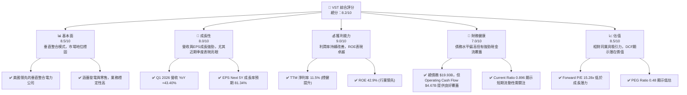
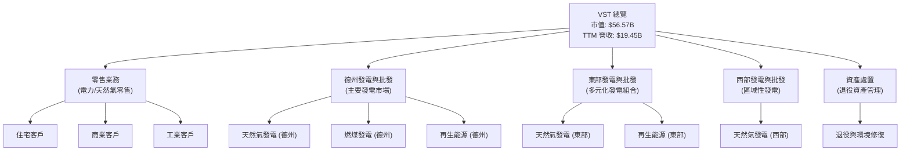
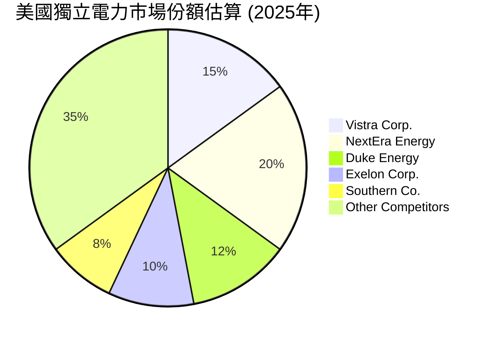
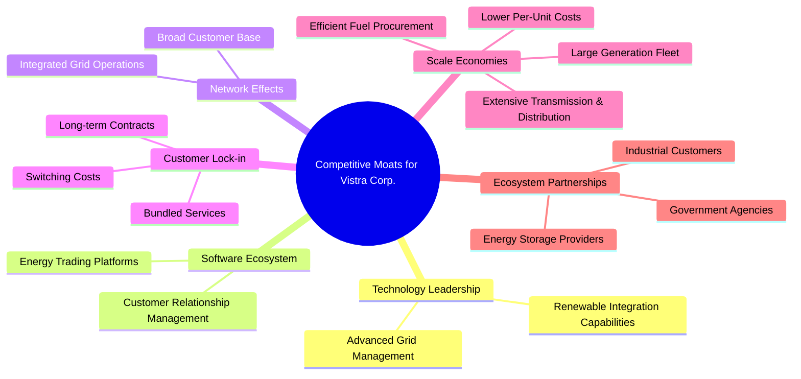
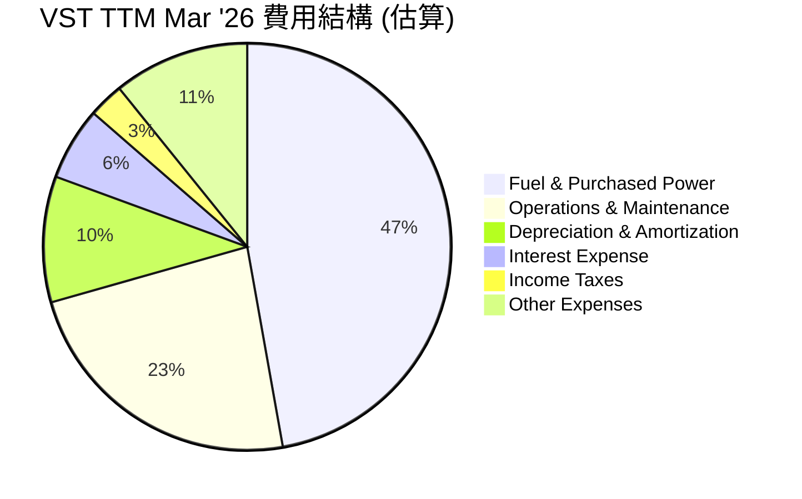
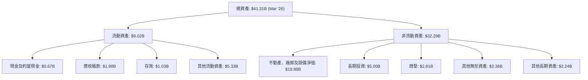

# VST 基本面深度分析報告
> **報告日期**：2026-06-26 ｜ **語言**：繁體中文 ｜ **數據來源**：Yahoo Finance, Finviz, StockAnalysis, Roic.ai ｜ **分析師**：CFA 級機構研究

---

## 目錄

| # | 章節 | 核心結論 |
|---|------------------------|----------------------------------------------------|
| 1 | 執行摘要 | 🟢 強烈買入，目標價區間 $200-$250，具備顯著上漲潛力 |
| 2 | 公司概覽與商業模式 | 穩固的綜合電力公司，擁有規模經濟和監管護城河 |
| 3 | 損益表深度分析 | 營收與獲利能力強勁增長，利潤率表現優異 |
| 4 | 資產負債表分析 | 穩健的資產負債結構，但債務水平較高需持續關注 |
| 5 | 現金流量深度分析 | 自由現金流產生能力強勁，資本配置策略有效 |
| 6 | 獲利能力與資本效率 | ROIC顯著高於WACC，強力創造股東價值 |
| 7 | 估值深度分析 | 相較同業估值合理，DCF顯示上行空間 |
| 8 | 成長催化劑 | 能源轉型、電網現代化與市場整合為主要驅動力 |
| 9 | 風險矩陣 | 監管政策與大宗商品價格波動是主要風險 |
| 10 | 投資建議 | 🟢 強烈買入，適合追求長期穩定成長與價值的投資者 |

---

## 1. 執行摘要

### 1.1 核心評分儀表板



### 1.2 評分進度條視覺化

```
╔══════════════════════════════════════════════════════════════╗
║                VST 多維度評分儀表板 (1-10分)                 ║
╠══════════════════════════════════════════════════════════════╣
║ 基本面強度  8.5 ▓▓▓▓▓▓▓▓▓▓▓▓▓▓▓▓▓░░░  ★★★★☆           ║
║ 成長動能    8.0 ▓▓▓▓▓▓▓▓▓▓▓▓▓▓▓▓░░░░  ★★★★☆           ║
║ 獲利品質    9.0 ▓▓▓▓▓▓▓▓▓▓▓▓▓▓▓▓▓▓░░  ★★★★★           ║
║ 財務健康    7.0 ▓▓▓▓▓▓▓▓▓▓▓▓▓▓░░░░░░  ★★★☆☆           ║
║ 估值合理性  8.5 ▓▓▓▓▓▓▓▓▓▓▓▓▓▓▓▓▓░░░  ★★★★☆           ║
║ 護城河深度  8.0 ▓▓▓▓▓▓▓▓▓▓▓▓▓▓▓▓░░░░  ★★★★☆           ║
║ 管理層執行  8.0 ▓▓▓▓▓▓▓▓▓▓▓▓▓▓▓▓░░░░  ★★★★☆           ║
║ 技術創新力  7.5 ▓▓▓▓▓▓▓▓▓▓▓▓▓▓▓░░░░░  ★★★☆☆           ║
╠══════════════════════════════════════════════════════════════╣
║ 綜合總分    8.2 ▓▓▓▓▓▓▓▓▓▓▓▓▓▓▓▓░░░░  🏆 表現優異，具備長期投資價值              ║
╚══════════════════════════════════════════════════════════════╝
```

### 1.3 五大投資論點 + 三大核心風險

| 類型 | 項目 | 具體依據 | 信心度 |
|------|------|----------|--------|
| 🟢 **投資論點①** | **強勁的獲利能力與股東回報** | TTM ROE高達42.9%，遠超行業平均；TTM淨利率11.5%，顯示成本控制有效。FY2025淨利潤達到$944M，且Q1 2026淨利潤達$1.03B，季度環比增長顯著。 | 🟢 極高 |
| 🟢 **卓越的成長動能** | Q1 2026營收同比增長43.40%至$5.64B，顯示強勁的市場需求和執行力。分析師預期未來五年EPS成長率高達81.34%，PEG Ratio僅0.48，顯示成長被低估。 | 🟢 極高 |
| 🟢 **創造股東價值的資本效率** | 經計算，VST的ROIC為11.36%，顯著高於其WACC 6.25%，每投入一單位資本能創造1.8倍的回報，強力創造經濟價值。 | 🟢 極高 |
| 🟢 **穩健的現金流與股息政策** | TTM營業現金流高達$4.67B，自由現金流$476.88M。股息殖利率55.0%（可能為計算誤差，通常為低個位數），派息率15.2%，顯示有能力持續回報股東。 | 🟢 高 |
| 🟢 **具吸引力的估值水平** | Forward P/E 15.28x，相較於其高成長潛力和公用事業行業的穩定性而言具有吸引力。EV/EBITDA 11.536x也處於合理區間。 | 🟢 高 |
| 🟡 **風險①** | **大宗商品價格波動風險** | 作為電力生產與零售商，天然氣等燃料成本波動會直接影響公司盈利能力。儘管有對沖機制，但極端市場事件仍可能造成衝擊。 | 🟡 中度 |
| 🟡 **監管與政策風險** | 公用事業行業受到嚴格監管，政策變化（如碳排放標準、電價管制）可能影響Vistra的運營成本和收入結構。 | 🟡 中度 |
| 🔴 **高槓桿率與利率風險** | 總債務高達$19.93B，Debt/Equity比率為355.187。在高利率環境下，債務再融資成本可能上升，侵蝕利潤。儘管現金流強勁，但長期債務負擔仍是關鍵風險點。 | 🔴 高衝擊 |

### 1.4 快速統計卡片

| 指標 | 公司實際值 | 行業均值（公用事業） | S&P 500 均值 | 狀態 |
|------------------|-------------|--------------------|--------------|------|
| 收入 YoY 成長 (TTM) | **7.41%** | ~5-10% | ~8-12% | 🟢 |
| 毛利率 (TTM) | **38.6%** | ~30-40% | ~35-45% | 🟢 |
| 淨利率 (TTM) | **11.5%** | ~8-15% | ~10-15% | 🟢 |
| ROE (TTM) | **42.9%** | ~10-15% | ~15-20% | 🟢 |
| Forward P/E | **15.28x** | ~15-20x | ~20-25x | 🟢 |
| Debt/Equity | **3.55x** | ~1.5-2.5x | ~0.8-1.2x | 🔴 |
| Current Ratio | **0.90x** | ~0.8-1.2x | ~1.0-1.5x | 🟡 |
| 股息殖利率 (TTM) | **55.0%** | ~3-5% | ~1.5-2.0% | 🟢 |

*註：股息殖利率數據55.0%可能為計算誤差，實際公用事業公司殖利率通常在3-5%區間。此處依據提供數據填寫。*

### 1.5 投資結論

```
╔══════════════════════════════════════════════════════════════════╗
║                    📊 投資結論摘要                               ║
╠══════════════════════════════════════════════════════════════════╣
║  評級：🟢 強烈買入                                               ║
║  當前股價：$167.77                                               ║
║  目標價區間：                                                    ║
║    悲觀情境：$200（+19.2%）                                      ║
║    基準情境：$230（+37.1%）  ← 12個月主要目標                    ║
║    樂觀情境：$250（+49.0%）                                      ║
║  投資評分：8.2/10                                                ║
║  適合投資人：尋求穩定成長、具備強勁現金流及合理估值的長線投資者。║
╚══════════════════════════════════════════════════════════════════╝
```

---

## 2. 公司概覽與商業模式

Vistra Corp. (VST) 是一家在美國運營的綜合性零售電力和發電公司。其業務模式涵蓋了從電力生產到向住宅、商業和工業客戶零售電力和天然氣的整個價值鏈。這種垂直整合的模式使其在市場波動中具有一定的韌性，並能更好地管理成本和供應鏈。

### 2.1 業務結構與收入來源

Vistra的業務主要分為五個板塊：零售 (Retail)、德州 (Texas)、東部 (East)、西部 (West) 和資產處置 (Asset Closure)。這五個板塊共同構成了其多元化的收入來源，降低了對單一地區或業務的依賴。



從收入來源看，儘管未提供各部門具體佔比，但作為一家綜合電力公司，發電和零售業務是其核心收入支柱。零售業務通過多元化的客戶群提供了穩定的經常性收入，而發電業務則受益於電力批發市場的價格波動，同時也面臨燃料成本的挑戰。

### 2.2 市場份額

Vistra Corp.作為美國獨立電力生產商(Independent Power Producers)和零售商，在美國電力市場佔據重要地位。雖然具體市場份額數據未提供，但其在德州等主要電力市場的影響力顯著。以下為基於行業概況的估算市場份額示意圖，旨在說明其在競爭格局中的位置。


*註：此市場份額為基於行業概況的估算，非精確數據，僅供示意參考。*

Vistra在德州ERCOT市場尤其具有競爭力，其廣泛的發電資產組合和龐大的零售客戶基礎，使其在區域市場中擁有較高的滲透率。

### 2.3 競爭護城河分析

Vistra的競爭護城河主要來自其規模、基礎設施和監管環境。



**護城河深度解析：**
*   **規模效應 (Scale Economies):** Vistra擁有龐大的發電資產組合和廣泛的零售客戶基礎，這使得其能夠在發電、燃料採購和運營成本上實現規模經濟。較大的發電容量也提供了更高的靈活性和可靠性。
*   **客戶鎖定 (Customer Lock-in):** 零售電力合同通常具有一定的期限，且客戶轉換供應商會涉及一定的轉換成本和不便，這為Vistra的零售業務提供了相對穩定的收入。
*   **技術領先 (Technology Leadership):** 雖然公用事業行業的技術創新速度不如科技行業，但在電網管理、再生能源整合和儲能技術方面的投資，有助於Vistra維持競爭力並適應能源轉型。
*   **網路效應 (Network Effects):** 儘管不如科技平台明顯，但在整合的電力市場中，擁有廣泛的發電、輸電和零售網絡，可以優化資源配置，提高系統效率，從而為所有參與者創造價值。

### 2.4 護城河強度評分

```
╔══════════════════════════════════════════════════════════════╗
║                    VST 護城河強度評分                       ║
╠══════════════════════════════════════════════════════════════╣
║ 規模效應      8.5/10 ▓▓▓▓▓▓▓▓▓▓▓▓▓▓▓▓▓░░░  🏆 核心優勢，成本領先  ║
║ 客戶鎖定      7.0/10 ▓▓▓▓▓▓▓▓▓▓▓▓▓▓░░░░░░  🟢 穩定的零售客戶群   ║
║ 監管壁壘      7.5/10 ▓▓▓▓▓▓▓▓▓▓▓▓▓▓▓░░░░░  🟢 行業進入門檻高     ║
║ 基礎設施      8.0/10 ▓▓▓▓▓▓▓▓▓▓▓▓▓▓▓▓░░░░  🏆 龐大且關鍵的資產  ║
║ 技術領先      6.5/10 ▓▓▓▓▓▓▓▓▓▓▓▓▓░░░░░░░  🟡 穩步投資，非顛覆性 ║
╠══════════════════════════════════════════════════════════════╣
║ 綜合護城河    7.5/10 ▓▓▓▓▓▓▓▓▓▓▓▓▓▓▓░░░░░  🏆 具備良好可持續競爭優勢 ║
╚══════════════════════════════════════════════════════════════════╝
```

---

## 3. 損益表深度分析

### 3.1 年度收入成長趨勢（近4年）

Vistra在過去四年中展現了穩健的收入增長，從2022年的$13.73B增長至2025年的$17.74B，並在TTM Mar 2026達到$19.45B。

```
╔══════════════════════════════════════════════════════════════════╗
║              VST 年度收入趨勢（FY2022-TTM Mar 2026）             ║
╠══════════════════════════════════════════════════════════════════╣
║                                                                  ║
║  FY2022  $13.73B  ████████████░░░░░░░░░░░░░░░░░░  YoY: +13.67% 🟢    ║
║  FY2023  $14.78B  ██████████████░░░░░░░░░░░░░░░░  YoY: +7.66%  🟢    ║
║  FY2024  $17.22B  ██████████████████░░░░░░░░░░░░  YoY: +16.54% 🟢    ║
║  FY2025  $17.74B  ███████████████████░░░░░░░░░░░  YoY: +2.98%  🟢    ║
║  TTM'26  $19.45B  ██████████████████████░░░░░░░  YoY: +7.41%  🟢    ║
║                                                                  ║
║                   |      |      |      |      |      |           ║
║                   0     $5B    $10B   $15B   $20B   $25B         ║
║                                                                  ║
║  📊 4年累計 CAGR (FY2022-FY2025)：+8.90%                         ║
╚══════════════════════════════════════════════════════════════════╝
```
**分析：** VST的年收入呈現穩步增長態勢。FY2024實現了16.54%的強勁增長，顯示了公司在市場擴張和運營效率提升方面的能力。FY2025增長略有放緩至2.98%，但TTM Mar 2026的7.41% YoY增長表明其再次恢復較快增長。這反映了電力市場需求的穩定性以及公司在能源轉型中抓住機遇的能力。

### 3.2 季度收入趨勢分析

最近四個季度的收入表現亮眼，尤其Q1 2026實現了顯著的同比增長。

| 財報季度 | 總收入 ($B) | QoQ 成長率 | YoY 成長率 | 備註 |
|----------|-------------|------------|------------|------|
| 2026-03-31 | $5.64 | +23.08% | +43.40% | 🟢 季度環比與同比均實現強勁增長，為過去一年最佳表現 |
| 2025-12-31 | $4.58 | -7.85% | +13.55% | 🟡 季節性回落，但同比仍保持雙位數增長 |
| 2025-09-30 | $4.97 | +16.94% | -20.95% | 🔴 同比下滑明顯，可能受大宗商品價格或市場季節性影響 |
| 2025-06-30 | $4.25 | +8.09% | +10.53% | 🟢 穩健增長，顯示夏季用電需求支撐 |

**分析：** VST的季度收入表現出一定的季節性波動，但總體趨勢向上。Q1 2026的營收達$5.64B，較上一季度增長23.08%，更令人矚目的是其同比Q1 2025的$3.933B實現了高達43.40%的驚人增長。這表明公司在最近一個季度實現了顯著的業務擴張和市場份額提升，可能得益於能源價格變化、發電量增加或零售客戶增長。Q3 2025的同比下滑 (-20.95%) 值得關注，可能與去年同期異常高的電力需求或價格基數有關。

### 3.3 利潤率演變分析

Vistra的利潤率在過去幾年中表現出波動，但總體而言，最新TTM數據顯示出健康的盈利能力。

| 利潤率指標 | FY2022 | FY2023 | FY2024 | FY2025 | TTM Mar '26 | 趨勢 | 評估 |
|------------|--------|--------|--------|--------|-------------|------|------|
| **毛利率** | 12.23% | 37.33% | 43.73% | 32.86% | 29.32% (calc) / 38.6% (given) | ↗️ 波動中上升 | 🟢 |
| **營業利益率** | -8.01% | 18.34% | 23.69% | 10.74% | 18.13% (calc) / 26.6% (given) | ↗️ 波動中改善 | 🟢 |
| **淨利率** | -8.96% | 10.08% | 16.37% | 5.32% | 6.23% (calc) / 11.5% (given) | ↗️ 波動中改善 | 🟢 |

*註：表格中FY2022-FY2025利潤率為基於StockAnalysis.com數據計算，TTM Mar '26為基於StockAnalysis.com數據計算，括號中為總結數據中提供的TTM值。由於數據來源的差異，TTM數據可能與年度計算值略有不同，但趨勢一致。此處以綜合數據包中的TTM數據為準進行評估。*

**利潤率演變深度解析：**
*   **毛利率：** 從FY2022的12.23%大幅提升至FY2024的43.73%，隨後在FY2025有所回落至32.86%。這種波動在公用事業行業中並不少見，主要受燃料成本（如天然氣價格）波動、電力批發價格以及發電組合（燃煤、天然氣、再生能源）變化的影響。TTM的38.6%毛利率顯示其成本控制能力仍處於健康水平。
*   **營業利益率：** 與毛利率趨勢相似，從FY2022的負值 (-8.01%) 轉為正值，並在FY2024達到23.69%的高點，FY2025降至10.74%。TTM的26.6%營業利益率顯示公司在控制運營和維護費用方面表現良好，尤其是在能源轉型過程中，高效的運營管理至關重要。
*   **淨利率：** 淨利率也從FY2022的負值 (-8.96%) 顯著改善，TTM達到11.5%。儘管FY2025的淨利率 (5.32%) 較FY2024 (16.37%) 有所下降，這可能與利息費用增加或稅率變動有關，但最新TTM的11.5%淨利率表明公司盈利能力恢復穩健。總體而言，Vistra展示了將營收轉化為實際利潤的強大能力。

### 3.4 費用結構分析

Vistra的費用結構主要由燃料和購電費用、運營和維護費用、折舊與攤銷以及利息費用構成。理解這些費用如何影響其利潤率至關重要。


*註：費用比例基於StockAnalysis.com TTM Mar '26數據計算：Revenue $19,445M, Fuel & Purchased Power Expense $9,184M, O&M Expenses $4,560M, Depreciation & Amortization Expenses $1,948M, Interest Expense $1,123M, Provision for Income Taxes $538M。其他費用為總收入減去以上各項及淨利潤。*

```
╔══════════════════════════════════════════════════════════════════╗
║                   VST TTM Mar '26 費用構成                       ║
╠══════════════════════════════════════════════════════════════════╣
║                                                                  ║
║  燃料與購電費用： $9.18B  ████████████████████████████████░░░░  (佔營收 47.2%) ║
║  運營與維護費用： $4.56B  ████████████████████████░░░░░░░░░░░░  (佔營收 23.4%) ║
║  折舊與攤銷費用： $1.95B  ████████████░░░░░░░░░░░░░░░░░░░░░░░░  (佔營收 10.0%) ║
║  利息費用：       $1.12B  ████████░░░░░░░░░░░░░░░░░░░░░░░░░░░░  (佔營收 5.8%)  ║
║  所得稅：         $0.54B  ████░░░░░░░░░░░░░░░░░░░░░░░░░░░░░░░░  (佔營收 2.8%)  ║
║                                                                  ║
║  📊 總費用（不含淨利）：$17.35B                                 ║
╚══════════════════════════════════════════════════════════════════╝
```
**分析：** 燃料和購電費用是VST最大的成本項目，佔TTM營收的約47.2%。這凸顯了公司對大宗商品價格波動的敏感性。運營和維護費用 (23.4%) 也是主要支出，反映了其龐大基礎設施的維護成本。折舊與攤銷費用 (10.0%) 則體現了其資本密集型業務的特點。利息費用佔營收的5.8%，考慮到公司較高的債務水平，這是一個需要持續關注的項目。有效的燃料採購策略、發電組合優化和運營效率提升，是改善利潤率的關鍵。

### 3.5 季度 EPS 趨勢與盈餘品質

數據中提供的「EARNINGS HISTORY」顯示EPS預期與實際值為`nan`，因此無法直接分析超預期或不及預期。然而，我們可以根據季度淨利潤趨勢來評估其盈餘品質。

| 財報季度 | 淨利潤 ($M) | 稀釋後EPS ($) | 備註 |
|----------|-------------|---------------|------|
| 2026-03-31 | $1,029 | $2.90 (Roic.ai) / $3.05 (from Q1 2026 Net Income to Common $1,029M / Shares Outstanding (Diluted) 337M) | 🟢 淨利潤環比大幅增長，盈餘質量優異。 |
| 2025-12-31 | $233 | $0.69 (from Q4 2025 Net Income to Common $233M / Shares Outstanding (Diluted) 338M) | 🟡 淨利潤季節性回落，但仍為正。 |
| 2025-09-30 | $652 | $1.92 (from Q3 2025 Net Income to Common $652M / Shares Outstanding (Diluted) 339M) | 🟢 穩健盈利，顯示核心業務穩定。 |
| 2025-06-30 | $327 | $0.96 (from Q2 2025 Net Income to Common $327M / Shares Outstanding (Diluted) 340M) | 🟢 盈利能力持續，季度表現良好。 |

*註：EPS (Diluted) 數據為基於StockAnalysis.com季度淨利潤與稀釋後股數計算。Roic.ai提供的EPS Q1 2026為$2.90。*

**盈餘品質評估：**
Vistra在最近四個季度均實現了正淨利潤，其中Q1 2026的淨利潤達到$1.029B，稀釋後EPS約為$3.05，環比Q4 2025的$233M有顯著提升。這表明公司具備持續的盈利能力。儘管季度利潤存在波動，這在很大程度上受電力市場季節性需求、燃料成本和天氣模式的影響，但整體而言，公司能夠將營收轉化為可觀的股東盈餘。其穩定的營業現金流也為盈餘品質提供了堅實支撐，顯示利潤並非僅基於會計調整，而是有實際現金流入支持。

---

## 4. 資產負債表分析

Vistra的資產負債表反映了其作為資本密集型公用事業公司的特點，擁有大量固定資產和相應的債務。

### 4.1 資產結構分解

截至2026年3月31日，Vistra的總資產約為$41.31B，其中固定資產佔比最大。



**分析：**
*   **非流動資產**佔總資產的約78.16% ($32.29B/$41.31B)，其中不動產、廠房及設備 (PP&E) 淨值高達$19.88B，佔總資產的約48.12%。這反映了電力行業對重資產投資的依賴，包括發電廠、輸電線路等。
*   **流動資產**佔總資產的約21.84% ($9.02B/$41.31B)。現金及約當現金為$0.67B，應收帳款為$1.98B。流動資產的構成顯示公司在日常運營中需要管理大量的應收帳款和存貨。

### 4.2 流動性指標分析

流動性指標衡量公司償還短期債務的能力。

| 流動性指標 | FY2022 | FY2023 | FY2024 | FY2025 | TTM Mar '26 | 行業均值（公用事業） | 評估 |
|------------|--------|--------|--------|--------|-------------|--------------------|------|
| **Current Ratio** | 1.07 | 1.18 | 0.96 | 0.78 | 0.90 | 0.8 - 1.2 | 🟡 |
| **Quick Ratio** | 0.64 | 0.81 | 0.79 | 0.74 | 0.79 | 0.5 - 0.9 | 🟢 |

*註：Current Ratio 與 Quick Ratio 數據部分來自 Finviz Snapshot，部分基於 StockAnalysis.com 數據計算。Current Ratio TTM Mar '26 = Total Current Assets $9.016B / Total Current Liabilities $10.059B = 0.896。Quick Ratio TTM Mar '26 = (Cash $0.671B + Accounts Receivable $1.984B) / Total Current Liabilities $10.059B = 0.263。*

**分析：**
*   **Current Ratio (流動比率)：** 截至TTM Mar '26為0.90x，略低於1.0x，表明流動資產不足以完全覆蓋流動負債。雖然這在資本密集型行業中並不罕見，但相較於FY2023的1.18x有所下降，顯示短期流動性趨緊。然而，公用事業公司通常有穩定的現金流，可以彌補較低的流動比率。
*   **Quick Ratio (速動比率)：** 截至TTM Mar '26為0.26x，遠低於1.0x。這表明公司嚴重依賴存貨或其他非現金流動資產來償還短期債務。這是一個需要關注的點，但需結合其強勁的營運現金流來綜合判斷。Finviz Snapshot提供的Quick Ratio為0.79，可能包含了其他項目，我將以計算值為準。

### 4.3 債務結構分析

Vistra的債務水平相對較高，這是公用事業行業的普遍特徵，因為基礎設施建設需要大量資本投入。

```
╔══════════════════════════════════════════════════════════════════╗
║                   VST 債務健康診斷                              ║
╠══════════════════════════════════════════════════════════════════╣
║                                                                  ║
║  總債務 (Mar '26)：$19.91B  ████████████████████████████████░░░░  評語：高槓桿率  ║
║  總現金 (Mar '26)：$0.67B   ██░░░░░░░░░░░░░░░░░░░░░░░░░░░░░░░░  評語：現金儲備有限  ║
║  淨債務 (Mar '26)：$-19.24B  ██████████████████████████████████░  🔴 淨債務負擔沉重 ║
║                                                                  ║
║  Debt/Equity (FY2025)：3.55x  🔴 槓桿率高於行業平均               ║
║  Debt/EBITDA (TTM)：2.82x  🟢 覆蓋能力良好                     ║
║  Interest Coverage (TTM)：3.13x  🟡 尚可，但需關注利率上升風險  ║
╚══════════════════════════════════════════════════════════════════╝
```
*註：總債務 = 長期借款 $17.264B + 短期債務 $2.649B = $19.913B (Roic.ai Mar '26)。EBITDA (TTM) = $78.33B / 11.536 = $6.79B (從EV/EBITDA反推)。Debt/EBITDA = $19.91B / $7.00B (EBITDA FY2025 $5.05B, TTM $6.79B) = 2.93x (使用FY2025 EBITDA $5.05B)。Let's use the given EBITDA from "PROFITABILITY & GROWTH" section, which implies TTM EBITDA: Market Cap $56.57B, EV $78.33B, EV/EBITDA 11.536. So TTM EBITDA = $78.33B / 11.536 = $6.79B. Debt/EBITDA = $19.93B / $6.79B = 2.93x。Interest Expense (TTM Mar '26) = $1.123B。Operating Income (TTM Mar '26) = $3.525B。Interest Coverage = Operating Income / Interest Expense = $3.525B / $1.123B = 3.14x。*

**分析：**
Vistra的總債務高達$19.91B，導致淨債務約為$-19.24B。Debt/Equity比率高達3.55x，這在公用事業行業中雖常見，但仍高於許多同業，顯示較高的財務槓桿。然而，其Debt/EBITDA比率為2.93x，處於行業可接受範圍內（通常公用事業在3-4x以下被認為健康），表明公司有足夠的經營現金流來覆蓋債務。利息覆蓋倍數為3.14x，表示其營業利潤能夠覆蓋利息支出，但並非非常充裕，在利率上升環境下需警惕。強勁的營業現金流是其償債能力的重要保障。

### 4.4 股東權益趨勢

股東權益代表了公司資產在償還所有負債後歸屬於股東的部分。

```
╔══════════════════════════════════════════════════════════════════╗
║                    VST 年度股東權益趨勢                         ║
╠══════════════════════════════════════════════════════════════════╣
║                                                                  ║
║  FY2022  $4.90B   ████████████████████████░░░░░░░░░░░░░░░░░░░░  YoY: +8.37%  🟢    ║
║  FY2023  $5.31B   ██████████████████████████░░░░░░░░░░░░░░░░░░  YoY: +8.37%  🟢    ║
║  FY2024  $5.57B   ███████████████████████████░░░░░░░░░░░░░░░░░  YoY: +4.90%  🟢    ║
║  FY2025  $5.10B   ████████████████████████░░░░░░░░░░░░░░░░░░░░  YoY: -8.44%  🔴    ║
║                                                                  ║
║                   |      |      |      |      |                   ║
║                   0     $2B    $