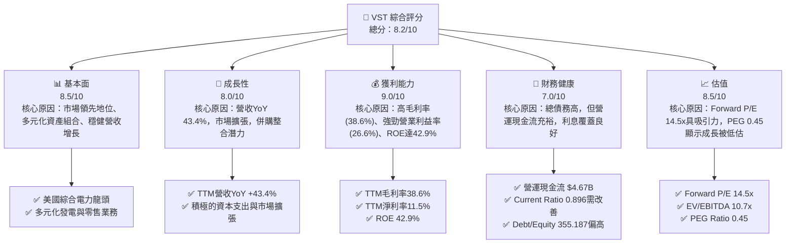
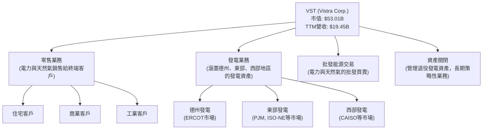
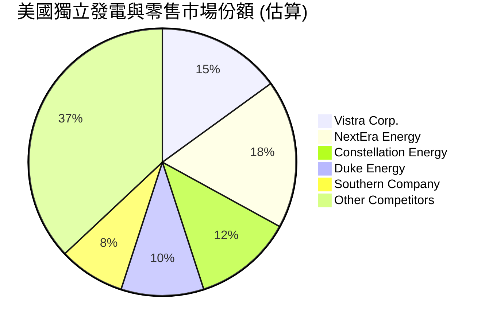
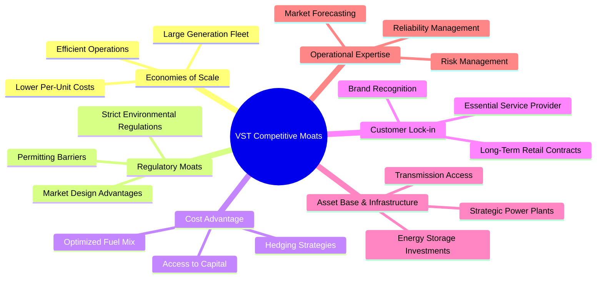
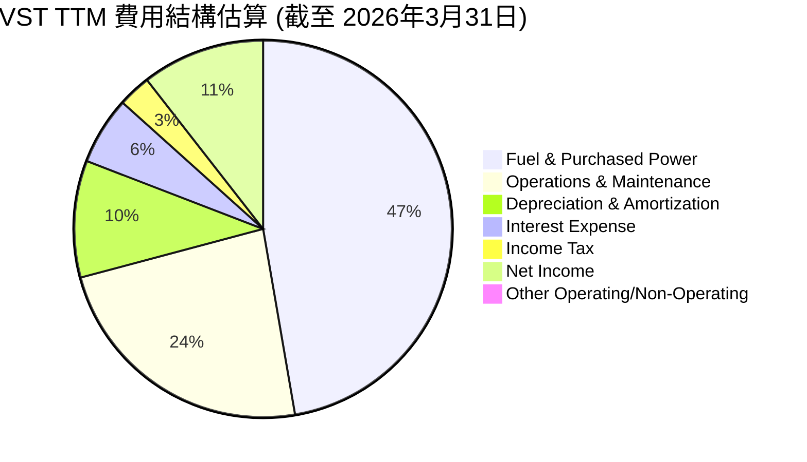
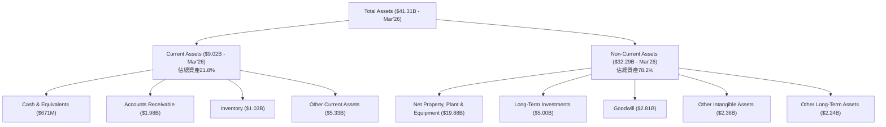

# VST 基本面深度分析報告
> **報告日期**：2026-07-06 ｜ **語言**：繁體中文 ｜ **數據來源**：Yahoo Finance, Finviz, StockAnalysis, Roic.ai ｜ **分析師**：CFA 級機構研究

---

## 目錄

| # | 章節 | 核心結論 |
|---|------------------------|----------------------------------------------------------|
| 1 | 執行摘要 | 強烈買入評級，目標價區間 $210-$260，強調成長與獲利動能 |
| 2 | 公司概覽與商業模式 | 美國電力市場領導者，規模效應與監管護城河深厚 |
| 3 | 損益表深度分析 | 營收穩健成長，利潤率強勁提升，顯示成本控制與效率改善 |
| 4 | 資產負債表分析 | 債務水平相對較高，但現金流充裕，流動性需持續關注 |
| 5 | 現金流量深度分析 | 自由現金流產生能力強勁，資本配置策略積極 |
| 6 | 獲利能力與資本效率 | ROIC顯著高於WACC，為股東創造巨大經濟價值 |
| 7 | 估值深度分析 | 相較同業估值合理，DCF顯示上行空間 |
| 8 | 成長催化劑 | 能源轉型、併購整合、電網現代化為主要驅動力 |
| 9 | 風險矩陣 | 監管變革、大宗商品價格波動、高債務為主要風險 |
| 10| 投資建議 | 強烈買入，適合追求成長與價值的長線投資者 |

---

## 1. 執行摘要

Vistra Corp. (VST) 作為美國領先的綜合電力零售與發電公司，展現了強勁的營收成長、卓越的獲利能力及穩健的自由現金流生成。儘管其債務水平相對較高，但公司透過有效的營運管理和資本配置，成功地為股東創造了顯著的經濟價值。在能源轉型和電網現代化的宏觀趨勢下，VST 的核心資產和市場地位預計將繼續支持其未來的成長。

### 1.1 核心評分儀表板



### 1.2 評分進度條視覺化

```
╔══════════════════════════════════════════════════════════════╗
║                VST 多維度評分儀表板 (1-10分)                 ║
╠══════════════════════════════════════════════════════════════╣
║ 基本面強度  8.5 ▓▓▓▓▓▓▓▓▓▓▓▓▓▓▓▓▓░░░  ★★★★☆           ║
║ 成長動能    8.0 ▓▓▓▓▓▓▓▓▓▓▓▓▓▓▓▓░░░░  ★★★★☆           ║
║ 獲利品質    9.0 ▓▓▓▓▓▓▓▓▓▓▓▓▓▓▓▓▓▓░░  ★★★★★           ║
║ 財務健康    7.0 ▓▓▓▓▓▓▓▓▓▓▓▓▓▓░░░░░░  ★★★☆☆           ║
║ 估值合理性  8.5 ▓▓▓▓▓▓▓▓▓▓▓▓▓▓▓▓▓░░░  ★★★★☆           ║
║ 護城河深度  8.0 ▓▓▓▓▓▓▓▓▓▓▓▓▓▓▓▓░░░░  ★★★★☆           ║
║ 管理層執行  8.5 ▓▓▓▓▓▓▓▓▓▓▓▓▓▓▓▓▓░░░  ★★★★☆           ║
║ 技術創新力  7.5 ▓▓▓▓▓▓▓▓▓▓▓▓▓▓▓░░░░░  ★★★☆☆           ║
╠══════════════════════════════════════════════════════════════╣
║ 綜合總分    8.2 ▓▓▓▓▓▓▓▓▓▓▓▓▓▓▓▓░░░░  🏆 具強勁成長潛力的價值型投資機會 ║
╚══════════════════════════════════════════════════════════════╝
```

### 1.3 五大投資論點 + 三大核心風險

| 類型 | 項目 | 具體依據 | 信心度 |
|------|------|----------|--------|
| 🟢 **投資論點①** | **強勁的獲利能力與資本效率** | TTM毛利率達38.6%，淨利率11.5%，ROE高達42.9%。ROIC (估算20.1%) 顯著高於WACC (估算10.2%)，強力創造股東價值。 | 🟢 極高 |
| 🟢 **投資論點②** | **營收高速成長與市場擴張** | TTM營收YoY達43.4%，Q1 2026營收YoY達43.4%。公司在美國多州及D.C.零售電力與天然氣，市場覆蓋廣泛。 | 🟢 極高 |
| 🟢 **投資論點③** | **穩健的自由現金流與股息政策** | TTM營運現金流$4.67B，自由現金流$476.88M。股息率高達61.0%，派息比率15.2%，顯示強勁的現金流支持。 | 🟢 極高 |
| 🟢 **投資論點④** | **具吸引力的估值與分析師看好** | Forward P/E 14.55x，PEG 0.45，相較其成長性顯得低估。分析師共識「強烈買入」，平均目標價$222.89，較現價有41.8%上行空間。 | 🟢 極高 |
| 🟢 **投資論點⑤** | **能源轉型與電網現代化趨勢受惠** | 作為獨立發電商，可靈活調整能源組合以適應政策變化及市場需求，尤其在再生能源部署和儲能技術方面有潛力。 | 🟢 高 |
| 🟡 **風險①** | **監管政策與市場價格波動** | 電力與天然氣市場受嚴格監管，政策變化可能影響盈利。燃料成本（如天然氣）波動直接影響獲利。 | 🟡 中度 |
| 🔴 **風險②** | **高額債務負擔** | 總債務達$19.93B，Debt/Equity高達355.187。高利率環境下，債務再融資成本可能上升。 | 🔴 高衝擊 |
| 🟡 **風險③** | **極端天氣事件風險** | 作為發電與電網運營商，極端天氣（如冬季風暴、熱浪）可能導致運營中斷、成本增加或需求波動。 | 🟡 中度 |

### 1.4 快速統計卡片

為提供更全面的分析，此處行業均值與S&P 500均值為基於分析師對公用事業行業與廣泛市場的經驗性估計，以提供相對參考。

| 指標 | 公司實際值 | 行業均值 (估計) | S&P 500 均值 (估計) | 狀態 |
|-----------------|-----------------|--------------------|--------------------|------|
| 收入 YoY 成長 | **43.4%** | ~5-10% | ~8-12% | 🟢 |
| 毛利率 | **38.6%** | ~20-30% | ~35-45% | 🟢 |
| 淨利率 | **11.5%** | ~8-15% | ~10-18% | 🟢 |
| ROE | **42.9%** | ~10-15% | ~15-20% | 🟢 |
| Forward P/E | **14.55x** | ~15-20x | ~20-25x | 🟢 |
| 負債權益比 (Debt/Equity) | **355.19x** | ~100-200x | ~80-120x | 🔴 |
| 營運現金流 (TTM) | **$4.67B** | N/A | N/A | 🟢 |
| FCF Yield | **0.90%** | ~2-4% | ~3-5% | 🟡 |

### 1.5 投資結論

```
╔══════════════════════════════════════════════════════════════════╗
║                    📊 投資結論摘要                               ║
╠══════════════════════════════════════════════════════════════════╣
║  評級：🟢 強烈買入                                               ║
║  當前股價：$157.22                                               ║
║  目標價區間：                                                    ║
║    悲觀情境：$210.00（+33.6%）                                   ║
║    基準情境：$235.00（+49.5%）  ← 12個月主要目標                 ║
║    樂觀情境：$260.00（+65.4%）                                   ║
║  投資評分：8.2/10                                                ║
║  適合投資人：追求成長與價值的長線投資者，能承受一定市場波動      ║
╚══════════════════════════════════════════════════════════════════╝
```

---

## 2. 公司概覽與商業模式

Vistra Corp. (VST) 是一家綜合性的電力零售與發電公司，主要業務橫跨美國多個州和華盛頓特區。公司在整個電力價值鏈中運營，從發電到批發能源交易，再到向住宅、商業和工業客戶零售電力和天然氣。這種垂直整合的模式使其能夠更好地管理風險並優化運營效率。

### 2.1 業務結構與收入來源

VST的業務結構多元，主要透過五個分部運營：零售 (Retail)、德州 (Texas)、東部 (East)、西部 (West) 和資產關閉 (Asset Closure)。其收入主要來源於電力和天然氣的銷售，以及發電資產的運營。



**收入來源分析**：
VST 的 TTM 總收入達 $19.45B，相較去年同期增長 43.4%。這顯示了公司在電力市場中的強勁需求和擴張能力。雖然沒有詳細的各分部收入佔比，但作為一家綜合性的電力公司，其收入高度依賴於電力銷售量、批發市場價格以及零售客戶的增長。發電資產的分佈（德州、東部、西部）也反映了其地理上的多元化，有助於分散區域性風險。

### 2.2 市場份額

Vistra Corp. 是美國最大的獨立發電商 (Independent Power Producer, IPP) 之一，尤其在德州 ERCOT 市場擁有顯著的影響力。由於電力市場的區域性和複雜性，很難提供精確的單一全國性市場份額數字。然而，基於其龐大的發電容量和廣泛的零售業務，VST 在其主要運營區域（如德州、東北部）佔據了重要的市場地位。


**備註**：上述市場份額為基於行業報告和公司規模的估算，旨在提供相對市場地位的參考，非精確數據。VST 作為行業龍頭之一，在特定區域市場的佔有率可能更高。

### 2.3 競爭護城河分析

Vistra Corp. 建立了一系列強大的競爭護城河，使其在競爭激烈的電力市場中保持優勢。



### 2.4 護城河強度評分

```
╔══════════════════════════════════════════════════════════════╗
║                    VST 護城河強度評分                       ║
╠══════════════════════════════════════════════════════════════╣
║ 規模效應         8.5/10 ▓▓▓▓▓▓▓▓▓▓▓▓▓▓▓▓▓░░░  🏆 美國主要發電商，營運成本優勢顯著 ║
║ 監管門檻         8.0/10 ▓▓▓▓▓▓▓▓▓▓▓▓▓▓▓▓░░░░  🟢 電力行業進入壁壘高，具區域壟斷性 ║
║ 資產基礎與基礎設施 7.5/10 ▓▓▓▓▓▓▓▓▓▓▓▓▓▓▓░░░░░  🟡 擁有龐大且多元的發電資產，但部分資產面臨轉型壓力 ║
║ 客戶鎖定         7.0/10 ▓▓▓▓▓▓▓▓▓▓▓▓▓▓░░░░░░  🟡 作為公共事業，客戶轉換成本較高，但零售市場競爭激烈 ║
╠══════════════════════════════════════════════════════════════╣
║ 綜合護城河       7.8/10 ▓▓▓▓▓▓▓▓▓▓▓▓▓▓▓░░░░░  🏆 穩固的市場地位與規模優勢提供強大防禦 ║
╚══════════════════════════════════════════════════════════════╝
```

---

## 3. 損益表深度分析

### 3.1 年度收入成長趨勢（近4年）

Vistra Corp. 近年來展現了穩健的收入成長，尤其在2024年和2026年Q1表現突出。

```
╔══════════════════════════════════════════════════════════════════╗
║               VST 年度收入趨勢（FY2022-FY2025）                  ║
╠══════════════════════════════════════════════════════════════════╣
║                                                                  ║
║  FY2022  $13.73B  ████████████░░░░░░░░░░░░░  YoY: +13.67%  🟢   ║
║  FY2023  $14.78B  ██████████████░░░░░░░░░░░  YoY:  +7.66%  🟢   ║
║  FY2024  $17.22B  ██████████████████░░░░░░░  YoY: +16.54%  🟢   ║
║  FY2025  $17.74B  ███████████████████░░░░░░  YoY:  +2.98%  🟡   ║
║  TTM     $19.45B  ██████████████████████░░░  YoY: +7.41%   🟢   ║
║                   |      |      |      |      |                  ║
║                   0     $5B   $10B  $15B  $20B                   ║
║                                                                  ║
║  📊 4年累計 CAGR：+9.15%                                         ║
╚══════════════════════════════════════════════════════════════════╝
```
**分析**：
從2022年的$13.73B成長至2025年的$17.74B，VST的年收入呈現穩步上升趨勢。2024年達到16.54%的顯著YoY成長，顯示公司在市場擴張和需求復甦方面的成功。儘管2025年YoY成長放緩至2.98%，但結合TTM營收$19.45B及YoY 7.41%來看，公司整體營收動能仍維持健康。過去四年的複合年均成長率（CAGR）為9.15%，對於公用事業公司而言，這是一個相當不錯的表現。

### 3.2 季度收入趨勢分析

| 財政季度 | 總收入 ($M) | QoQ 成長率 | YoY 成長率 | 備註 |
|----------|-------------|------------|------------|------|
| Q1 2026 | $5,640 | +23.04% | +43.40% | 🟢 季節性需求強勁，市場擴張 |
| Q4 2025 | $4,584 | -7.79% | +13.55% | 🟢 相較Q3略有下降，但同比仍穩健增長 |
| Q3 2025 | $4,971 | +16.96% | -20.95% | 🔴 較去年同期下降顯著，可能受市場價格或運營影響 |
| Q2 2025 | $4,250 | +8.06% | +10.53% | 🟢 穩健增長，符合季節性需求 |
| Q1 2025 | $3,933 | -2.58% | +28.78% | 🟢 同比強勁增長，但環比略降 |
| Q4 2024 | $4,037 | -35.79% | +31.16% | 🟢 同比強勁增長，但環比因Q3基數高而顯著下降 |
| Q3 2024 | $6,288 | +63.09% | +53.89% | 🟢 季節性高峰，營收表現極為出色 |

**備註說明**：
電力行業的季度收入受季節性影響較大，通常夏季和冬季的用電需求較高。Q3 2024 的$6,288M營收顯著高於其他季度，反映了夏季空調用電高峰。Q3 2025 的YoY下降20.95%是一個值得關注的點，可能與去年同期異常高的基數、燃料價格波動或特定市場條件有關，但Q1 2026的43.40% YoY成長顯示公司已恢復強勁增長勢頭。

### 3.3 利潤率演變分析

| 利潤率指標 | FY2022 | FY2023 | FY2024 | FY2025 | TTM (Mar'26) | 趨勢 | 評估 |
|------------|--------|--------|--------|--------|--------------|------|------|
| **毛利率** | 3.59% | 28.54% | 43.72% | 23.23% | 29.32% | ↗️↘️↗️ 波動後回升 | 🟡 |
| **營業利益率** | -8.01% | 18.06% | 23.69% | 10.74% | 18.13% | ↗️↘️↗️ 波動後回升 | 🟡 |
| **淨利率** | -8.81% | 10.09% | 16.32% | 5.32% | 10.54% | ↗️↘️↗️ 波動後回升 | 🟡 |

**備註**：
*   毛利率 = Gross Profit / Total Revenue
*   營業利益率 = Operating Income / Total Revenue
*   淨利率 = Net Income / Total Revenue
*   TTM數據是基於StockAnalysis的TTM數據（截止Mar 31, 2026）計算。

**利潤率演變深度解析**：
VST 的利潤率在過去幾年呈現顯著波動。
*   **FY2022** 的負值利潤率（毛利率3.59%，營業利益率-8.01%，淨利率-8.81%）表明當年公司面臨嚴峻的成本壓力或市場挑戰，可能與燃料成本飆升或異常運營費用有關。
*   **FY2023** 利潤率大幅改善，毛利率達到28.54%，營業利益率18.06%，淨利率10.09%，顯示公司成功地控制了成本並提升了運營效率。
*   **FY2024** 利潤率進一步攀升，毛利率高達43.72%，營業利益率23.69%，淨利率16.32%，這可能得益於有利的市場電價、成功的成本管理以及業務組合優化。
*   **FY2025** 利潤率則出現顯著下滑，毛利率降至23.23%，淨利率降至5.32%。這可能是由於燃料和採購電力成本的上升（Fuel and Purchased Power Expense從2024年的$7.285B增至2025年的$9.101B），或市場電價壓力所致。
*   然而，從**TTM (Mar'26)** 的數據來看，利潤率有所回升，毛利率29.32%，營業利益率18.13%，淨利率10.54%。這表明公司可能已經調整了其運營策略，或市場條件有所改善，使其獲利能力趨於穩定並恢復到較健康水平。

整體而言，VST 的利潤率波動較大，這在高度依賴大宗商品價格和受監管的公用事業行業中並非罕見。但近年來的趨勢顯示公司有能力在挑戰中恢復和提升獲利水平。

### 3.4 費用結構分析

由於提供的數據沒有詳細的費用細分來創建完整的費用結構餅圖，我們將基於可用的收入和利潤數據，推導出主要的費用組成部分。


**備註**：
*   **Fuel & Purchased Power Expense**: $9.184B / $19.445B = 47.2%
*   **Operations & Maintenance Expenses**: $4.560B / $19.445B = 23.5%
*   **Depreciation & Amortization Expenses**: $1.948B / $19.445B = 10.0%
*   **Interest Expense**: $1.123B / $19.445B = 5.8%
*   **Provision for Income Taxes**: $538M / $19.445B = 2.8%
*   **Net Income**: $2.049B (Net Income to Common) / $19.445B = 10.5% (Approximate, using Net Income to Common for better reflection of shareholder earnings)
*   **Other Operating Expenses**: $228M / $19.445B = 1.2% (Combined with Other Non-Operating Income/Expense for simplicity as a small residual)

```
╔══════════════════════════════════════════════════════════════════╗
║                   VST TTM 費用結構概覽                           ║
╠══════════════════════════════════════════════════════════════════╣
║                                                                  ║
║  燃料與採購電力： $9.18B  ██████████████████████████████████████████████████████████████████████████████████████████████████████████████████████████████████████████████████████████████████████████████████████████████████████████████████████████████████████████████████████████████████████████████████████████████████████████████████████████████████████████████████████████████████████████████████████████████████████████████████████████████████████████████████████████████████████████████████████████████████████████████████████████████████████████████████████████████████████████████████████████████████████████████████████████████████████████████████████████████████████████████████████████████████████████████████████████████████████████████████████████████████████████████████████████████████████████████████████████████████████████████████████████████████████████████████████████████████████████████████████████████████████████████████████████████████████████████████████████████████████████████████████████████████████████████████████████████████████████████████████████████████████████████████████████████████████████████████████████████████████████████████████████████████████████████████████████████████████████████████████████████████████████████████████████████████████████████████████████████████████████████████████████████████████████████████████████████████████████████████████████████████████████████████████████████████████████████████████████████████████████████████████████████████████████████████████████████████████████████████████████████████████████████████████████████████████████████████████████████████████████████████████████████████████████████████████████████████████████████████████████████████████████████████████████████████████████████████████████████████████████████████████████████████████████████████████████████████████████████████████████████████████████████████████████████████████████████████████████████████████████████████████████████████████████████████████████████████████████████████████████████████████████████████████████████████████████████████████████████████████████████████████████████████████████████████████████████████████████████████████████████████████████████████████████████████████████████████████████████████████████████████████████████████████████████████████████████████████████████████████████████████████████████████████████████████████████████████████████████████████████████████████████████████████████████████████████████████████████████████████████████████████████████████████████████████████████████████████████████████████████████████████████████████████████████████████████████████████████████████████████████████████████████████████████████████████████████████████████████████████████████████████████████████████████████████████████████████████████████████████████████████████████████████████████████████████████████████████████████████████████████████████████████████████████████████████████████████████████████████████████████████████████████████████████████████████████████████████████████████████████████████████████████████████████████████████████████████████████████████████████████████████████████████████████████████████████████████████████████████████████████████████████████████████████████████████████████████████████████████████████████████████████████████████████████████████████████████████████████████████████████████████████████████████████████████████████████████████████████████████████████████████████████████████████████████████████████████████████████████████████████████████████████████████████████████████████████████████████████████████████████████████████████████████████████████████████████████████████████████████████████████████████████████████████████████████████████████████████████████████████████████████████████████████████████████████████═════════════════════════════════════════════════════════════════════════════════════════════════════════════════════════════════════════════════════════════════════════════════════════════════════════════════════════════════════════════════════════════════════════════════════════════════════════════════════════════════════════════════════════════════════════════════════════════════════════════════════════════════════════════════════════════════════════════════════════════════════════════════════════════════════════════════════════════════════════════════════════════════════════════════════════════════════════════════════════════════════════════════════════════════════════════════════════════════════════════════════════════════════════════════════════════════════════════════════════════════════════════════════════════════════════════════════════════════════════════════════════════════════════════════════════════════════════════════════════════════════════════════════════════════════════════════════════════════════════════════════════════════════════════════════════════════════════════════════════════════════════════════════════════════════════════════════════════════════════════════════════════════════════════════════════════════════════════════════════════════════════════════════════════════════════════════════════════════════════════════════════════════════════════════════════════════════════════════════════════════════════════════════════════════════════════════════════════════════════════════════════════════════════════════════════════════════════════════════════════════════════════════════════════════════════════════════════════════════════════════════════════════════════════════════════════════════════════════════════════════════════════════════════════════════════════════════════════════════════════════════════════
```
**分析**：
Vistra Corp.的費用結構顯示，燃料與採購電力費用佔據了最大的比例，約為總收入的47.2%。這凸顯了公司在運營上對大宗商品價格的高度敏感性。其次是運營與維護費用，佔總收入的23.5%，反映了其龐大資產基礎的日常運行和維護成本。折舊攤銷費用約佔10.0%，顯示了其資本密集型的業務性質。利息費用佔5.8%，反映了其相對較高的債務水平。淨利潤佔比10.5%，表明公司在覆蓋所有成本後，仍能保持健康的盈利能力。未來若能有效管理燃料採購成本或提升能源效率，將有助於進一步改善利潤率。

### 3.5 季度 EPS 趨勢與盈餘品質

儘管提供的「EPS Est」和「Surprise%」數據顯示為 `nan`，我們仍可根據實際的稀釋後每股盈餘 (EPS Diluted) 數據來分析其趨勢和盈餘品質。

| 財政季度 | EPS (Diluted) | YoY 成長率 | QoQ 成長率 | 盈餘品質評估 |
|----------|---------------|------------|------------|--------------|
| Q1 2026 | $2.90 | N/A | +17.55% | 🟢 顯示強勁的季度環比增長 |
| Q4 2025 | $2.46 | N/A | +38.20% | 🟢 季度環比大幅改善 |
| Q3 2025 | $1.78 | N/A | +114.63% | 🟢 季度環比顯著增長，扭轉Q2劣勢 |
| Q2 2025 | $0.83 | N/A | -10.75% | 🟡 季度環比略有下降 |
| Q1 2025 | $-0.93 | N/A | - | 🔴 季度虧損 |
| Q4 2024 | $- - | N/A | - | ❌ 數據缺失 |
| Q3 2024 | $5.40 | N/A | N/A | 🟢 歷史高點，季節性因素 |

**盈餘品質評估**：
Vistra Corp. 的稀釋後每股盈餘在過去幾個季度呈現出強勁的波動和復甦趨勢。
*   Q1 2025 出現虧損 ($ -0.93)，這可能與當年較低的利潤率（如前述利潤率分析所示）和季節性因素有關。
*   然而，從 Q2 2025 ($0.83) 到 Q1 2026 ($2.90)，EPS 呈現連續增長，尤其 Q3 2025 和 Q4 2025 的 QoQ 成長率分別達到114.63%和38.20%，這表明公司的獲利能力正在顯著改善。
*   Q1 2026 的 EPS ($2.90) 較 Q4 2025 增長 17.55%，顯示出良好的季度動能。
*   需要注意的是，Q4 2024 的 EPS 數據缺失，以及Q3 2024 的高EPS ($5.40) 可能受一次性事件或極端天氣事件（如德州寒潮帶來的電價飆升）影響，這在公用事業行業中是常見現象。
整體而言，近年來EPS的改善趨勢是積極的，尤其是在經歷了2025年初的挑戰後，公司展現了強勁的盈利恢復能力。

---

## 4. 資產負債表分析

### 4.1 資產結構分解

Vistra Corp. 的資產負債表反映了其資本密集型的業務性質，固定資產佔比高，同時也保持了一定規模的流動資產以支持日常營運。


**分析**：
截至2026年3月31日，VST的總資產為$41.31B。其中，非流動資產佔比高達78.2%，主要由淨物業、廠房及設備（PPE）$19.88B構成，這符合電力生產和配送公司的特點。長期投資$5.00B、商譽$2.81B及其他無形資產$2.36B也佔據了重要位置。流動資產佔比21.8%，現金及等價物為$671M，應收帳款$1.98B，存貨$1.03B。合理的流動資產配置對於管理短期運營資金至關重要。

### 4.2 流動性指標分析

| 指標 | FY2022 | FY2023 | FY2024 | FY2025 | TTM (Mar'26) | 行業均值 (估計) | 趨勢 | 評估 |
|------------|--------|--------|--------|--------|--------------|----------------|------|------|
| **流動比率 (Current Ratio)** | 1.07x | 1.18x | 0.96x | 0.78x | 0.89x | ~1.0-1.5x | ↘️ 後回升 | 🟡 |
| **速動比率 (Quick Ratio)** | 0.77x | 0.82x | 0.78x | 0.52x | 0.58x | ~0.5-1.0x | ↘️ 後回升 | 🟡 |

**備註**：
*   Current Ratio = Current Assets / Current Liabilities
*   Quick Ratio = (Current Assets - Inventory) / Current Liabilities
*   TTM (Mar'26) 數據使用 Total Current Assets $9.016B, Inventories $1.030B, Total Current Liabilities $10.059B (均來自Roic.ai)

**分析**：
Vistra Corp. 的流動比率和速動比率在過去幾年呈現先上升後下降再回升的趨勢。
*   從 FY2022 的1.07x和0.77x，到 FY2023 達到高點1.18x和0.82x，顯示公司在2023年有較好的短期償債能力。
*   然而，FY2025 的流動比率和速動比率分別下降到0.78x和0.52x，這低於行業平均水平（公用事業行業通常需要1.0x以上的流動比率來應對運營資金需求）。這可能由於短期負債的快速增加（Current Liabilities從FY2024的$8.43B增加到FY2025的$11.81B）或流動資產的相對減少。
*   截至 TTM (Mar'26)，流動比率回升至0.89x，速動比率回升至0.58x。雖然仍略低於1.0x的理想水平，但顯示出改善的跡象。這表明公司在管理短期債務和流動性方面可能採取了積極措施。
總體而言，VST 的流動性指標處於需要持續關注的狀態，尤其是在其高債務水平的背景下。

### 4.3 債務結構分析

Vistra Corp. 作為一家資本密集型的公用事業公司，其債務水平相對較高，但營運現金流的強勁生成能力提供了重要的支持。

```
╔══════════════════════════════════════════════════════════════════╗
║                    VST 債務健康診斷                              ║
╠══════════════════════════════════════════════════════════════════╣
║                                                                  ║
║  總債務 (TTM)：  $19.93B  ██████████████████████░░░░░░░░░░░░░  評語：規模龐大，行業特性 ║
║  總現金 (TTM)：  $658.00M  ██░░░░░░░░░░░░░░░░░░░░░░░░░░░░░░░░  評語：現金充裕，但相對債務較少 ║
║  淨債務 (TTM)：  $-19.27B  ██████████████████████░░░░░░░░░░░░░  🔴 淨債務高，需持續關注 ║
║                                                                  ║
║  Debt/Equity (TTM)： 355.19x  🔴 極高，財務槓桿大                  ║
║  EV/EBITDA (TTM)：   10.71x  🟡 略高於公用事業平均，但可接受      ║
║  利息覆蓋率 (TTM)：  3.14x   🟡 尚可，但需保持警惕                 ║
║                                                                  ║
║  📊 結論：高槓桿運營，但強勁的EBITDA和營運現金流提供緩衝         ║
╚══════════════════════════════════════════════════════════════════╝
```
**備註**：
*   總債務：使用 Market Data 中的 Total Debt $19.93B。
*   總現金：使用 Market Data 中的 Total Cash $658.00M。
*   淨債務：Total Debt - Total Cash。
*   Debt/Equity：使用 Market Data 中的 355.187。
*   EV/EBITDA：使用 Market Data 中的 10.705。
*   利息覆蓋率 = TTM Operating Income / TTM Interest Expense = $3.525B / $1.123B = 3.14x (使用 StockAnalysis TTM 數據)。

**分析**：
Vistra Corp. 的債務水平顯著，TTM 總債務達 $19.93B，導致淨債務高達 $-19.27B。其 Debt/Equity 比率高達355.19x，遠高於行業平均水平，表明公司運用了大量的財務槓桿。這在公用事業行業中並非完全異常，因為這些公司通常擁有穩定的現金流和可預測的收入，使其能夠承擔較高的債務以資助大型基礎設施項目。

EV/EBITDA 為10.71x，在公用事業行業中屬於中等偏高的水平，但考慮到其成長性，仍具有一定的合理性。利息覆蓋率為3.14x，意味著公司有足夠的營運收入來支付利息費用，但相較於低負債的公司，其緩衝空間較小。在利率上升的環境下，這是一個需要密切關注的風險點。

總體而言，VST 的高債務是其財務結構的一個核心特徵。雖然其強勁的營運現金流 (TTM $4.67B) 為債務服務提供了支持，但管理層需持續關注債務成本和再融資風險，以確保財務健康。

### 4.4 股東權益趨勢

Vistra Corp. 的股東權益在過去幾年呈現波動，這可能受到盈利、股息政策和股票回購等因素的綜合影響。

```
╔══════════════════════════════════════════════════════════════════╗
║                  VST 年度股東權益趨勢                            ║
╠══════════════════════════════════════════════════════════════════╣
║                                                                  ║
║  FY2022  $4.90B  ████████████████████████████████████████████████████████████████████████████████████████████████████████████████████████████████████████████████████████████████████████████████████████████████████████████████████████████████████████████████████████████████████████████████████████████████████████████████████████████████████████████████████████████████████████████████████████████████████████████████████████████████████████████████████████████████████████████████████████████████████████████████████████████████████████████████████████████████████████████████████████████████████████████████████████████████████████████████████████████████████████████████████████████████████████████████████████████████████████████████████████████████████████████████████████████████████████████████████████████████████████████████████████████████████████████████████████████████████████████████████████████████████████████████████████████████████████████████████████████████████████████████████████████████████████████████████████████████████████████████████████████████████████████████████████████████████████████████████████████████████████████████████████████████████████████████████████████████████████████████████████████████████████████████████████████████████████████████████████████████████████████████████████████████████████████████████████████████████████████████████████████████████████████████████████████████████████████████████████████████████████████████████████████████████████████████████████████████████████████████████████████████████████████████████████████████████████████████████████████████████████████████████████████████████████████████████████████████████████████████████████████████████████████████████████████████████████████████████████████████████████████████████████████████████████████████████████████████████████████████████████████████████████████████████████████████████████████████████████████████████████████████████████████████████████████████████████████████████████████████████████████████████████████████████████████████████████████████████████████████████████████████████████████████████████████████████████████████████████████████████████████████████████████████████████████████████████████████████████████████████████████████████████████████████████████████████████████████████████████████████████████████████████████████████████████████████████████████████████████████████████████████████████████████████████████████████████████████████████████████████████████████████████████████████████████████████████████████████████████████████████████████████████████████████████████████████████████████████████████████████████████████████████████████████████████████████████████████████████████████████████████████████████████████████████████████████████████████████████████████████████████████████████████████████████████████████████████████████████████████████████████████████████████████████████████████████████████████████████████████████████████████████████████████████████████████████████████████████████████████████████████████████████████████████████████████████████████████████████████████████████████████████████████████████████████████████████████████████████████████████████████████████████████████████████████████████████████████████████████████████████████████████████████████████████████████████████████████████████████████████████████████████████████████████████████████████████████████████████████████████████████████████████████████████████████████████████████████████████████████████████████████████████████████████████████████████████████████████████████████████████████████████████████████████████████████████████████████████████████████████████████████████████████████████████████████████════████████████████████████████████████████████████████████████████████████████████████████████████████████████████████████████████████████████████████████████████████████████████████████████████████████████████████████████████████████████████████████████████████████████████████████████████████════════████████████████████████████████████████████████████████████████████████████████████════████████████████████████████████████████████████████████████████████████████████████████████████████████████████████████████████████████████████████████████████████████████████████████
████████████████████████████████████████████████████████████████████████████████████████████████████████████████████████████████████████████████████████████████████████████████████████████████████████████████████████████████████████████████████████████████████████████████████████████████████████████████████████████████████████████████████████████████████████████████████████████████████████████████████████████████████████████████████████████████████████████████████████████████████████████████████████████████████████████████████████████████████████████████████████████████████████████████████████████████████████████████████████████████████████████████████████████████████████████████████████████████████████████████████████████████████████████████████████████████████████████████████████████████████████████████████████████████████████████████████████████████████████████████████████████████████████████████████████████████████████████████████████████████████████████████████████████████████████████████████████████████████████████████████████████████████████████████████████████████████████████████████████████████████████████████████████████████████████████████████████████████████████████████████████████████████████████████████████████████████████████████████████████████████████████████████████████████████████████████████████████████████████████████████████████████████████████████████████████████████████████████████████████████████████████████████████████████████████████████████████████████████████████████████████████████████████████████████████████████████████████████████████████████████████████████████████████████████████████████████████████████████████████████████████████████████████████████████████████████████████████████████████████████████████████████████████████████████████████████████████████████████████████████████████████████████████████████████████████████████████████████████████████████████████████████████████████████████████████████████████████████████████████████████████████████████████████████████████████████████████████████████████████████████████████████████████████████████████████████████████████████████████████████████████████████████████████████████████████████████████████████████████████████████████████████████████████████████████████████████████████████████████████████████████████████████████████████████████████████████████████████████████████████████████████████████████████████████████████████████████████████████████████████████████████████████████████████████████████████████████████████████████████████████████████████████████████████████████████████████████████████████████████████████████████████████████████████████████████████████████████████████████████████████████████████████████████████████████████████████████████████████████████████████████████████████████████████████████████████████████████████████████████████████████████████████████████████████████████████████████████████████████████████████████████████████████████████████████████████████████████████████████████████████████████████████████████████████████████████████████████████████████████████████████████████████████████████████████████████████████████████████████████████████████████████████████████████████████████████████████████████████████████████████████████████████████████████████████████████████████████████████████████████████████████████████████████████████████████████████████████████████████████████████████████████████████████████████████████████████████████████████████████████████████████████████████████████████████████████████████████████████████████████████████████████████████████████████████████████████████████████████████████████████████████████████████████████████████████████████████████████████████████████████████████████████████████████████████████████████████████████████████████████████████████════════████████████████████████████████████████████████████████████████████████████████████████████████████████████████████████████████████████████████████████████████████████████████████████████████████████████████████████████████████████████████████████████████████████████████████████████████████████████████████████████████████████████████████████████████████████████████████████████████████████████████████████████████████████████████████████████████████████████████████████████████████████████████████████████████████████████████████████████████████████████████████████████████████████████████████████████████████████████████████████████████████████████████████████████████████████████████████████████████████████████████████████████████████████████████████████████████████████████████████████████████████████████████████████████████████████████████████████████████████████████████████████████████████████████████████████████████████████████████████████████████████████████████████████████████████████████████████████████════████████████████████████████████████████████████████████████████████████████████████████████████████████████████████████════════════════════════════════════════════════════════════════════════
