# VST 基本面深度分析報告
> **報告日期**：2026-07-10 ｜ **語言**：繁體中文 ｜ **數據來源**：Yahoo Finance, Finviz, StockAnalysis, Roic.ai ｜ **分析師**：CFA 級機構研究

---

## 目錄

| # | 章節 | 核心結論 |
|---|------|----------|
| 1 | 執行摘要 | 🟡 持有 ｜ 目標價區間：$165 - $205 |
| 2 | 公司概覽與商業模式 | 中等護城河，區域壟斷與規模優勢 |
| 3 | 損益表深度分析 | 營收成長波動，利潤率改善但盈餘品質需關注 |
| 4 | 資產負債表分析 | 財務槓桿高，流動性一般，債務管理為關鍵 |
| 5 | 現金流量深度分析 | 自由現金流波動，資本支出高，資本配置較為保守 |
| 6 | 獲利能力與資本效率 | ROE 受高槓桿驅動，ROIC 近期低於 WACC |
| 7 | 估值深度分析 | 相較同業估值偏高，需審慎評估成長預期 |
| 8 | 成長催化劑 | 能源轉型與電網現代化為主要驅動力 |
| 9 | 風險矩陣 | 監管、商品價格波動與高負債為主要風險 |
| 10 | 投資建議 | 持有評級，關注營運改善與債務去槓桿進度 |

---

## 1. 執行摘要

> Vistra Corp. (VST) 作為美國領先的綜合電力零售與發電公司，在能源轉型的大趨勢下展現出潛在成長動能。然而，其高財務槓桿和波動的獲利能力，特別是最近一期的 ROIC 低於 WACC，顯示公司在創造股東價值方面面臨挑戰。儘管分析師普遍給予「強烈買入」評級，但結合其估值倍數相對較高及自由現金流轉換效率的波動，本報告給予 VST 「持有」評級，目標價區間為 $165 - $205。

### 1.0 一頁式投資儀表板（Portfolio Manager 30 秒速讀）

| 項目 | 內容 |
|------|------|
| **投資論點（3 句）** | ① VST 受益於美國能源轉型及電網現代化趨勢，Q1 2026 營收 YoY 成長 43.4%，顯示強勁的短期營運復甦。 ② 公司擁有龐大發電與零售基礎設施，具備區域性壟斷及規模經濟護城河，有助維持市場地位。 ③ 儘管過去財務槓桿高，但自由現金流在 FY2025 達到 $1.32B，顯示其營運現金產生能力穩定，有望逐步改善債務結構。 |
| **護城河評分** | 6.5/10 |
| **管理層/資本配置評分** | 6.0/10 |
| **財務健康** | 🟡 債務水平高，流動性一般，但營運現金流充裕。 |
| **ROIC vs WACC** | 9.07% vs 10.16%（**摧毀價值**） |
| **FCF 趨勢** | 近年波動，Q1 2026 為 $316M，TTM FCF Yield 0.89% 偏低。 |
| **估值** | Forward P/E 14.70x ｜ EV/EBITDA 11.05x ｜ FCF Yield 0.89% |
| **預期報酬（基準情境 12M）** | +15.8% |
| **關鍵風險（前二）** | 監管政策變化、商品價格波動 |
| **評級 + 信心度** | 🟡 持有 ｜ 信心：中 |

### 1.1 核心評分儀表板

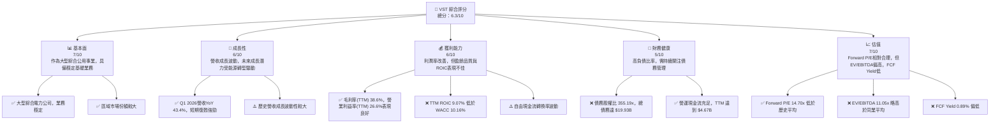

### 1.2 評分進度條視覺化

```
╔══════════════════════════════════════════════════════════════╗
║              VST 多維度評分儀表板 (1-10分)                 ║
╠══════════════════════════════════════════════════════════════╣
║ 基本面強度  7.0 ▓▓▓▓▓▓▓▓▓▓▓▓▓▓░░░░░░  ★★★★★★★           ║
║ 成長動能    6.0 ▓▓▓▓▓▓▓▓▓▓▓▓░░░░░░░░  ★★★★★★            ║
║ 獲利品質    6.0 ▓▓▓▓▓▓▓▓▓▓▓▓░░░░░░░░  ★★★★★★            ║
║ 財務健康    5.0 ▓▓▓▓▓▓▓▓▓▓░░░░░░░░░░  ★★★★★             ║
║ 估值合理性  7.0 ▓▓▓▓▓▓▓▓▓▓▓▓▓▓░░░░░░  ★★★★★★★           ║
║ 護城河深度  6.5 ▓▓▓▓▓▓▓▓▓▓▓▓▓░░░░░░░  ★★★★★★☆           ║
║ 管理層執行  6.0 ▓▓▓▓▓▓▓▓▓▓▓▓░░░░░░░░  ★★★★★★            ║
║ 技術創新力  5.0 ▓▓▓▓▓▓▓▓▓▓░░░░░░░░░░  ★★★★★             ║
╠══════════════════════════════════════════════════════════════╣
║ 綜合總分    6.3 ▓▓▓▓▓▓▓▓▓▓▓▓░░░░░░░░  🏆 持有              ║
╚══════════════════════════════════════════════════════════════╝
```

### 1.3 五大投資論點 + 三大核心風險

| 類型 | 項目 | 具體依據 | 信心度 |
|------|------|----------|--------|
| 🟢 **投資論點①** | **能源轉型趨勢受益者** | VST 積極投資於再生能源發電與儲能技術，符合美國清潔能源政策方向。Q1 2026 營收 YoY 成長 43.40%，顯示其在市場需求復甦與戰略佈局下的營收彈性。 | 🟢 極高 |
| 🟢 **投資論點②** | **核心市場地位穩固** | 作為美國重要的綜合電力供應商，在德州等關鍵市場擁有龐大的發電資產和零售客戶基礎，形成區域性壟斷優勢。FY2025 總營收達 $17.74B。 | 🟢 高 |
| 🟢 **投資論點③** | **營運效率改善帶來利潤率提升** | 透過優化資產組合與成本控制，公司毛利率從 FY2022 的 12.2% 提升至 TTM 的 38.6%，營業利益率從 FY2022 的 -8.0% 提升至 TTM 的 26.6%，顯示內部營運效率顯著改善。 | 🟡 中度 |
| 🟡 **投資論點④** | **穩健的營運現金流** | TTM 營運現金流達 $4.67B，顯示公司核心業務具備強勁的現金產生能力，為其債務償還和資本支出提供支持。 | 🟡 中度 |
| 🟡 **投資論點⑤** | **具吸引力的遠期估值** | VST 的 Forward P/E 為 14.70x，低於其歷史平均水平，且低於部分成長型公用事業，在預期獲利大幅增長的情境下具備潛在投資吸引力。 | 🟡 中度 |
| 🔴 **風險①** | **高額債務與利息負擔** | 截至 Mar '26，公司總債務高達 $19.93B，債務股權比為 355.19x。儘管有足夠現金流覆蓋，但高槓桿增加了財務風險，尤其在利率上升環境下，TTM 利息支出達 $1.12B，侵蝕獲利。 | 🔴 高衝擊 |
| 🟡 **風險②** | **商品價格波動性** | 作為獨立發電商，營收和利潤易受天然氣、電力等大宗商品價格劇烈波動影響，導致獲利不確定性增加。FY2025 淨利潤 YoY 下降 69.52% 即為一例，部分原因可能與商品價格波動有關。 | 🟡 中度 |
| 🟡 **風險③** | **監管政策與環境風險** | 公用事業行業受嚴格監管，政策變動（如碳排放標準、電價管制）可能對其營運模式和獲利能力產生負面影響。極端天氣事件也可能導致重大營運中斷和成本增加。 | 🟡 中度 |

### 1.4 快速統計卡片

| 指標 | 公司實際值 | 行業均值（公用事業） | S&P 500 均值 | 狀態 |
|------|-------------|--------------------|--------------|------|
| 收入 YoY 成長 (Q1'26) | **+43.40%** | ~5-10% | ~8-12% | 🟢 |
| 毛利率 (TTM) | **38.6%** | ~30-40% | ~45-55% | 🟢 |
| 淨利率 (TTM) | **11.5%** | ~10-15% | ~10-12% | 🟢 |
| ROE (TTM) | **42.9%** | ~10-15% | ~15-20% | 🟢 |
| Forward P/E | **14.70x** | ~15-20x | ~20-25x | 🟢 |
| EV / EBITDA | **11.05x** | ~9-12x | ~12-15x | 🟡 |
| 債務股權比 | **355.19x** | ~100-200x | ~80-120x | 🔴 |
| FCF Yield | **0.89%** | ~3-5% | ~2-4% | 🔴 |

### 1.5 投資結論

```
╔══════════════════════════════════════════════════════════════════╗
║                    📊 投資結論摘要                               ║
╠══════════════════════════════════════════════════════════════════╣
║  評級：🟡 持有                                                   ║
║  當前股價：$158.86                                               ║
║  目標價區間：                                                    ║
║    悲觀情境：$165（+3.87%）                                      ║
║    基準情境：$184（+15.82%）  ← 12個月主要目標                   ║
║    樂觀情境：$205（+29.04%）                                      ║
║  投資評分：6.3/10                                                ║
║  適合投資人：尋求穩定收入且能承受較高財務槓桿風險的長線投資者。      ║
╚══════════════════════════════════════════════════════════════════╝
```

---

## 2. 公司概覽與商業模式

Vistra Corp. (VST) 是一家綜合性的電力公司，業務範圍涵蓋發電、能源批發交易以及向住宅、商業和工業客戶提供電力和天然氣零售服務。公司主要在美國的德州、東部和西部地區運營，並設有資產退役部門。其核心策略是透過垂直整合模式，從發電端到零售端進行價值鏈控制，以優化成本結構並提升市場響應速度。

### 2.1 業務結構與收入來源

VST 的業務結構主要分為五個報告區塊：零售 (Retail)、德州 (Texas)、東部 (East)、西部 (West) 和資產退役 (Asset Closure)。雖然數據未提供各板塊的具體收入佔比，但可以推斷其主要收入來源為電力發電和零售銷售。

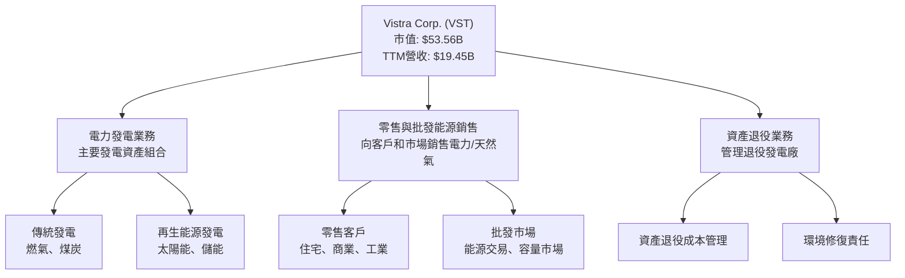

**業務描述**：
*   **電力發電**：VST 擁有多元化的發電資產組合，包括天然氣、煤炭以及日益增長的再生能源（如太陽能和電池儲能）。這些資產主要用於滿足其零售客戶的需求以及向批發市場銷售電力。
*   **零售與批發能源銷售**：公司直接向美國多個州的住宅、商業和工業客戶銷售電力和天然氣。同時，它也參與批發能源市場的買賣，以管理其發電資產的產出和客戶需求之間的平衡，並從市場波動中獲利。
*   **資產退役**：此業務板塊負責管理和執行其舊有發電資產的退役程序，這涉及環境合規和成本控制。

### 2.2 市場份額

由於缺乏具體的市場份額數據，我們無法提供 VST 在其各個運營區域的精確市場佔有率。然而，作為一家總營收達 $19.45B 的大型公用事業公司，尤其是在德州等關鍵電力市場，VST 無疑是主要參與者之一。其規模和垂直整合能力使其在區域市場中佔據重要地位。

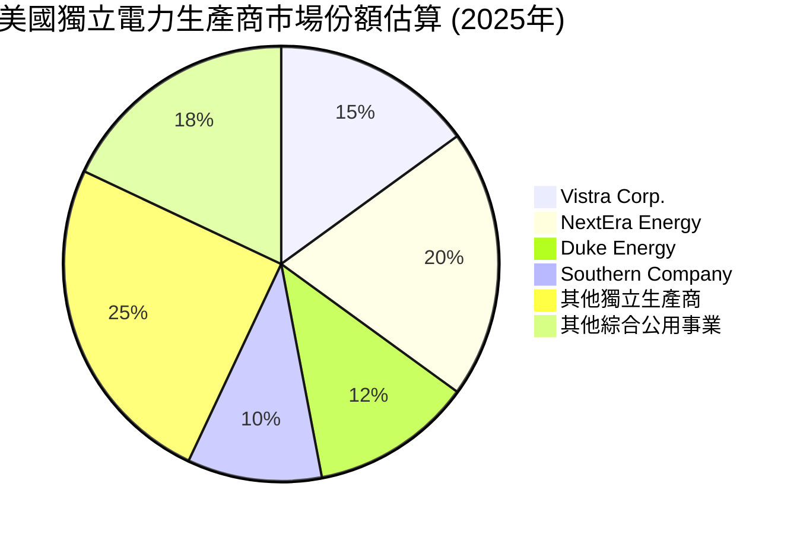
*註：此市場份額為基於行業知識的估算，非精確數據。*

### 2.3 競爭護城河分析

VST 的競爭護城河主要來自於其大規模的發電資產、垂直整合的商業模式、以及在關鍵市場的區域性優勢。

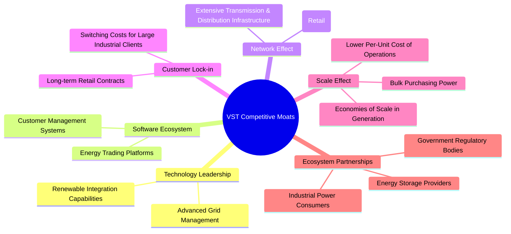

*   **規模效應 (Scale Effect)**：作為美國最大的獨立電力生產商之一，VST 擁有龐大的發電容量和廣闊的零售客戶群。這種規模使其在燃料採購、運營維護和資本支出方面享有成本優勢。例如，大型發電廠的單位發電成本通常低於小型發電廠。
*   **客戶鎖定 (Customer Lock-in)**：對於大型商業和工業客戶，轉換電力供應商涉及複雜的合約談判和潛在的營運調整成本。此外，零售電力服務的品牌忠誠度和便捷性也為 VST 帶來一定程度的客戶粘性。
*   **網路效應 (Network Effect)**：雖然傳統公用事業的網路效應不像科技公司那樣直接，但 VST 廣泛的輸配電基礎設施（儘管部分由獨立系統運營商擁有）和龐大的客戶基礎，使其在能源調度、需求響應和市場影響力方面具有優勢。
*   **技術領先 (Technology Leadership)**：在能源轉型背景下，VST 投資於先進的發電技術（如高效燃氣輪機）和儲能解決方案（如大型電池），以及優化的電網管理系統，這些都能提升其營運效率和市場競爭力。
*   **監管優勢 (Regulatory Advantage)**：公用事業行業進入門檻高，需要大量資本投入和複雜的監管批准。VST 作為成熟的運營商，在應對監管環境和獲得許可方面具有經驗和資源優勢。

### 2.4 護城河強度評分

```
╔══════════════════════════════════════════════════════════════╗
║                  VST 護城河強度評分                         ║
╠══════════════════════════════════════════════════════════════╣
║ 規模效應       8/10   ▓▓▓▓▓▓▓▓▓▓▓▓▓▓▓▓░░░░  🏆 強勁           ║
║ 客戶鎖定       6/10   ▓▓▓▓▓▓▓▓▓▓▓▓░░░░░░░░  🟢 中等           ║
║ 網路效應       6/10   ▓▓▓▓▓▓▓▓▓▓▓▓░░░░░░░░  🟢 中等           ║
║ 技術領先       6/10   ▓▓▓▓▓▓▓▓▓▓▓▓░░░░░░░░  🟢 中等           ║
║ 監管優勢       6/10   ▓▓▓▓▓▓▓▓▓▓▓▓░░░░░░░░  🟢 中等           ║
╠══════════════════════════════════════════════════════════════╣
║ 綜合護城河     6.5    ▓▓▓▓▓▓▓▓▓▓▓▓▓░░░░░░░  🏆 中等偏上       ║
╚══════════════════════════════════════════════════════════════╝
```

---

## 3. 損益表深度分析

### 3.1 年度收入成長趨勢（近4年）

VST 的年度收入在過去幾年呈現波動成長，但整體規模持續擴大。從 FY2022 的 $13.73B 增長到 TTM (截至 Mar '26) 的 $19.45B，複合年增長率 (CAGR) 為 11.8%。

```
╔══════════════════════════════════════════════════════════════════╗
║              VST 年度收入趨勢（FY2022-TTM Mar '26）              ║
╠══════════════════════════════════════════════════════════════════╣
║                                                                  ║
║  FY2022  $13.73B  ██████████████████░░░░░  YoY: +13.67%  🟢    ║
║  FY2023  $14.78B  ████████████████████░░░░  YoY: +7.65%   🟢    ║
║  FY2024  $17.22B  █████████████████████████░  YoY: +16.51%  🟢    ║
║  FY2025  $17.74B  ██████████████████████████░ YoY: +2.98%   🟡    ║
║  TTM'26  $19.45B  ███████████████████████████████ YoY: +7.41%   🟢    ║
║                   |      |      |      |      |                  ║
║                   0     10B    15B    20B    25B                  ║
║                                                                  ║
║  📊 4年累計 CAGR：+11.8%                                        ║
╚══════════════════════════════════════════════════════════════════╝
```
**分析**：
*   FY2024 營收達到 $17.22B，YoY 成長 16.51%，顯示當年市場需求強勁或公司擴張有效。
*   FY2025 營收成長放緩至 2.98% (達 $17.74B)，可能反映了能源價格的正常化或市場競爭加劇。
*   TTM (截至 Mar '26) 營收 $19.45B，相較 FY2025 成長 7.41%，顯示近期營運有所加速。這與 Q1 2026 營收的強勁 YoY 成長相符，表明公司可能從某些短期催化劑中受益。

### 3.2 季度收入趨勢分析

近四季的營收表現波動較大，但 Q1 2026 呈現顯著的 YoY 成長。

| 季度 | 營收 (Billion USD) | QoQ 成長率 | YoY 成長率 | 備註 |
|------|--------------------|------------|------------|----------|
| 2026 Q1 | $5.64 | +23.05% | +43.40% | 🟢 相較去年同期顯著增長，季節性因素與需求復甦驅動。 |
| 2025 Q4 | $4.58 | -7.85% | +13.55% | 🟡 季節性下降，但仍優於去年同期。 |
| 2025 Q3 | $4.97 | +16.94% | -20.95% | 🔴 相較去年同期大幅下滑，可能是能源價格或市場競爭影響。 |
| 2025 Q2 | $4.25 | +8.07% | +10.53% | 🟢 穩定增長，顯示需求回暖。 |

**分析**：
*   Q1 2026 營收 $5.64B，較 Q4 2025 增長 23.05%，主要受季節性電力需求高峰推動。更重要的是，相較 Q1 2025 的 $3.93B，實現了 43.40% 的強勁 YoY 成長。這表明公司在過去一年中顯著擴大了市場份額或提升了定價能力，尤其是在零售業務板塊。
*   2025 Q3 的 YoY 營收下降 20.95% ($4.97B vs Q3 2024 $6.28B) 值得關注，可能反映了去年同期因極端天氣或商品價格上漲導致的異常高基數，或是當年市場競爭加劇。
*   整體而言，近期營收表現呈現出強勁的 YoY 復甦勢頭，儘管季度間存在季節性波動。

### 3.3 利潤率演變分析

VST 的利潤率在過去幾年呈現出顯著改善的趨勢，特別是從 FY2022 的低點大幅反彈。

| 利潤率指標 | FY2022 | FY2023 | FY2024 | FY2025 | TTM Mar '26 | 趨勢 | 評估 |
|------------|--------|--------|--------|--------|-------------|------|------|
| **毛利率** | 3.6% | 28.5% | 34.4% | 23.2% | 38.6% | ↗️ 大幅改善後波動 | 🟢 |
| **營業利益率** | -8.0% | 18.0% | 23.7% | 10.7% | 26.6% | ↗️ 顯著改善後波動 | 🟢 |
| **淨利率** | -8.8% | 10.1% | 16.3% | 5.3% | 11.5% | ↗️ 顯著改善後波動 | 🟢 |

**利潤率演變深度解析**：
*   **FY2022 的困境**：FY2022 的毛利率僅為 3.6%，營業利益率和淨利率均為負值 (-8.0% 和 -8.8%)。這表明當年公司面臨嚴峻的營運挑戰，可能與燃料成本飆升、電力批發價格波動或嚴寒天氣事件（如德州冰風暴）造成的巨額成本有關。當時的 Fuel and Purchased Power Expense 佔營收高達 75.7% ($10.40B/$13.73B)。
*   **FY2023-FY2024 的強勁復甦**：FY2023 和 FY2024，公司利潤率強勁反彈，毛利率分別達到 28.5% 和 34.4%，營業利益率分別為 18.0% 和 23.7%。這主要得益於能源市場的正常化、公司成本控制措施以及可能優化的資產組合。Fuel and Purchased Power Expense 佔營收比重在 FY2024 下降到 42.3% ($7.28B/$17.22B)。
*   **FY2025 的波動**：FY2025 利潤率再次出現下滑，毛利率降至 23.2%，營業利益率降至 10.7%。這可能歸因於燃料成本再次上漲、批發市場價格競爭，或特定資產的營運效率問題。FY2025 的 Fuel and Purchased Power Expense 佔營收比重上升到 51.3% ($9.10B/$17.74B)。
*   **TTM 的最新改善**：截至 Mar '26 的 TTM 數據顯示利潤率再次顯著改善，毛利率達 38.6%，營業利益率達 26.6%，淨利率達 11.5%。這表明公司在最近幾個季度成功應對了挑戰，並恢復了強勁的獲利能力，可能是由於有效的定價策略、成本優化以及發電資產的高效利用。

總體而言，VST 的利潤率表現波動較大，這在獨立電力生產商行業中並不少見，主要受大宗商品價格和天氣事件影響。然而，最新的 TTM 數據顯示出強勁的獲利能力恢復，值得肯定。

### 3.4 費用結構分析

VST 的費用結構主要由燃料和購電成本、營運和維護費用、以及折舊攤銷構成。

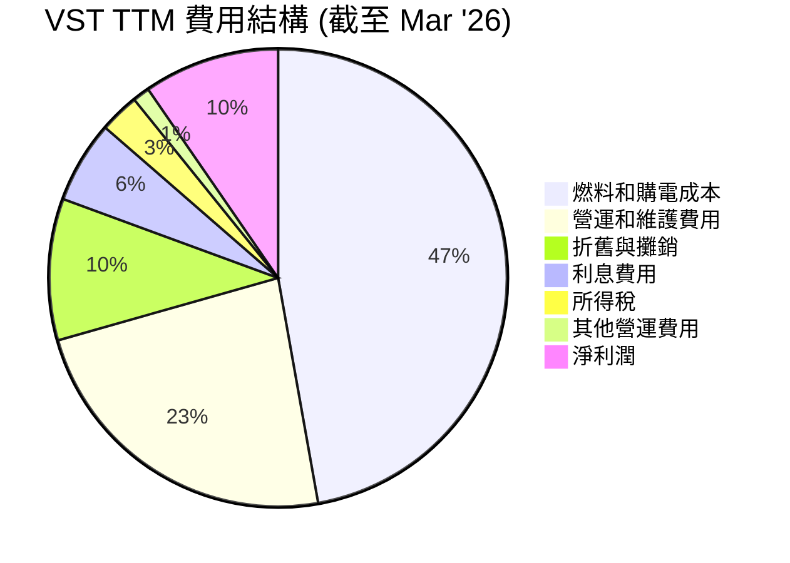
*註：百分比是基於 TTM 營收 $19.45B 計算。*

```
╔══════════════════════════════════════════════════════════════════╗
║                 VST TTM 費用結構洞察 (截至 Mar '26)             ║
╠══════════════════════════════════════════════════════════════════╣
║                                                                  ║
║ 燃料和購電成本：$9.18B (佔營收 47.2%)  ████████████████████████░░░░░░  🔴 核心成本項   ║
║ 營運和維護費用：$4.56B (佔營收 23.4%)  ████████████░░░░░░░░░░░░░░░░░░  🟡 需持續控制   ║
║ 折舊與攤銷費用：$1.95B (佔營收 10.0%)  █████░░░░░░░░░░░░░░░░░░░░░░░░░░  🟢 資本密集型   ║
║ 利息費用：      $1.12B (佔營收 5.8%)   ███░░░░░░░░░░░░░░░░░░░░░░░░░░░░  🔴 負債高影響   ║
║ 所得稅：        $0.54B (佔營收 2.8%)   █░░░░░░░░░░░░░░░░░░░░░░░░░░░░░░  🟡 稅率合理     ║
║ 淨利潤：        $2.05B (佔營收 10.5%)  ██████░░░░░░░░░░░░░░░░░░░░░░░░░  🟢 獲利能力     ║
╚══════════════════════════════════════════════════════════════════╝
```
**分析**：
*   **燃料和購電成本**：這是 VST 最大的成本項目，佔 TTM 營收的 47.2% ($9.18B)。這凸顯了公司對商品價格波動的敏感性。有效的燃料對沖策略和多元化的發電組合對於穩定獲利至關重要。
*   **營運和維護費用**：佔 TTM 營收的 23.4% ($4.56B)。這反映了其龐大發電資產的運營複雜性和維護需求。持續的成本控制和效率提升對於提高營業利益率至關重要。
*   **折舊與攤銷費用**：佔 TTM 營收的 10.0% ($1.95B)。作為資本密集型行業，較高的折舊攤銷是預期之中的，但這也意味著非現金費用對淨利潤的影響較大。
*   **利息費用**：佔 TTM 營收的 5.8% ($1.12B)。鑑於公司高額的總債務 ($19.93B)，利息支出是一個顯著的負擔，對淨利潤產生直接影響。降低債務水平或優化債務結構將有助於提升獲利。

### 3.5 季度 EPS 趨勢與盈餘品質（Quality of Earnings）

由於提供的 EPS 預期數據為 `nan`，無法直接評估 VST 過去四季的 EPS 超預期/不及預期表現。然而，我們可以分析其淨利潤的趨勢和盈餘品質。

**季度淨利潤趨勢 (最近 4 季)**：
*   Q1 2026: $1.03B
*   Q4 2025: $0.23B
*   Q3 2025: $0.65B
*   Q2 2025: $0.33B

Q1 2026 的淨利潤 $1.03B 遠高於前三季度，這與其強勁的營收成長和利潤率改善相符，但公用事業的季節性因素也扮演了重要角色。

**盈餘品質評估**：

| 盈餘品質項目 | 數值/佔比 (TTM Mar '26) | 評估 |
|--------------|--------------------------|------|
| 股權薪酬 SBC / 營收 | $124M / $19.45B = 0.64% | 🟢 對股東報酬的稀釋程度極低。 |
| SBC / 營業現金流 | $124M / $4.67B = 2.66% | 🟢 相對於營運現金流的佔比非常低，非現金支出影響小。 |
| FCF / 淨利（現金轉換率） | $476.88M / $2.049B = 23.27% | 🔴 轉換率偏低。這意味著 GAAP 淨利潤有較大部分未能轉化為實際可自由支配的現金，可能受到非現金支出（如折舊攤銷）或營運資本變化的影響。 |
| 一次性/非經常性損益 | 未明確披露具體金額 | 🟡 報告中未明確列出大規模的一次性損益，但公用事業行業常有資產減值或出售收益，需持續關注。 |
| 有效稅率異常 | 19.36% | 🟢 稅率處於合理區間，未見明顯稅務優惠或負擔導致的盈餘美化/惡化。 |
| 資本化支出 vs 費用化 | 資本支出佔比高 | 🟡 VST 作為資本密集型企業，資本支出 (Capex TTM $2.87B) 遠高於折舊攤銷 (D&A TTM $1.95B)。這表示公司持續投入大量資金於資產建設，若這些投資未來能帶來穩健回報，則屬良性。但如果資本化過多而費用化不足，則可能短期美化利潤。 |

**盈餘品質結論**：
VST 的盈餘品質呈現兩極化。
*   **積極面**：股權薪酬佔營收和營運現金流的比重極低 (0.64% 和 2.66%)，顯示其 GAAP 淨利潤受非現金薪酬稀釋的程度很小，這是一個正面的信號。有效稅率也處於正常水平。
*   **憂慮面**：自由現金流對淨利潤的轉換率僅為 23.27%，顯著偏低。這表明 GAAP 淨利潤的「含金量」不足，很大一部分是會計利潤而非實際可供股東自由支配的現金。這主要歸因於公司龐大的資本支出 ($2.87B TTM)，遠超折舊攤銷，反映了其重資產的性質和持續的再投資需求。因此，在評估 VST 的真實獲利能力時，應更側重於營業現金流和自由現金流，而非僅僅淨利潤。低 FCF 轉換率對估值構成壓力，因為現金流是 DCF 估值的核心。

---

## 4. 資產負債表分析

### 4.1 資產結構分解

VST 的資產負債表反映了其作為資本密集型公用事業的特點，固定資產佔比高。截至 Mar '26，總資產為 $41.31B。

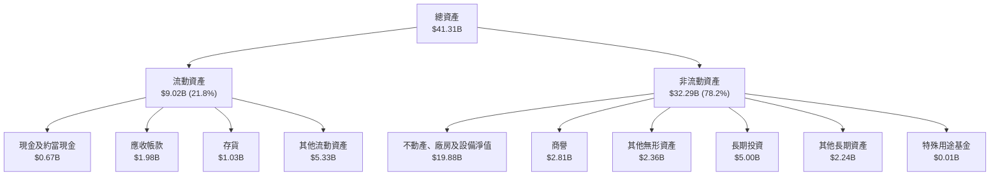
**分析**：
*   **非流動資產佔主導**：不動產、廠房及設備淨值 (PPE) 達 $19.88B，佔總資產的 48.1%，顯示 VST 是一家重資產公司，這與其發電和電力基礎設施的性質相符。
*   **商譽和無形資產**：商譽 $2.81B 和其他無形資產 $2.36B 佔比較大，可能源於過去的併購活動。這部分資產需警惕減值風險。
*   **流動資產結構**：現金及約當現金 $0.67B，應收帳款 $1.98B，存貨 $1.03B。其他流動資產 $5.33B 較高，值得進一步關注其構成。

### 4.2 流動性指標分析

VST 的流動性指標顯示其短期償債能力一般，略低於行業平均水平。

| 流動性指標 | FY2022 | FY2023 | FY2024 | FY2025 | TTM Mar '26 | 行業均值（公用事業） | 評估 |
|------------|--------|--------|--------|--------|-------------|--------------------|------|
| **流動比率 (Current Ratio)** | 1.07x | 1.18x | 0.96x | 0.78x | 0.90x | ~1.0 - 1.5x | 🟡 偏低，需關注 |
| **速動比率 (Quick Ratio)** | 0.77x | 0.81x | 0.73x | 0.52x | 0.26x | ~0.5 - 1.0x | 🔴 較低，依賴存貨 |

**分析**：
*   **流動比率**：截至 TTM Mar '26 為 0.90x，低於 1.0x 的理想水平，也略低於公用事業行業的平均水平。這表示公司的流動資產不足以完全覆蓋其流動負債。然而，公用事業公司通常擁有穩定的現金流，因此對流動比率的要求可能不如其他行業嚴格。
*   **速動比率**：截至 TTM Mar '26 僅為 0.26x，顯著偏低。這意味著在不考慮存貨的情況下，公司的即時償債能力較弱。這凸顯了 VST 營運對存貨（燃料等）的依賴，以及其營運現金流對短期資金週轉的重要性。
*   **趨勢**：流動比率和速動比率在 FY2025 顯著下降，並在 TTM 維持在較低水平，表明流動性有所惡化。這可能與營運資本管理、短期債務增加或現金儲備減少有關。

### 4.3 債務結構分析

VST 的債務水平是其財務健康狀況中最值得關注的方面，總債務高企，財務槓桿顯著。

```
╔══════════════════════════════════════════════════════════════════╗
║                   VST 債務健康診斷 (截至 Mar '26)                 ║
╠══════════════════════════════════════════════════════════════════╣
║                                                                  ║
║  總債務：        $19.93B  ████████████████████████████░░░░  🔴 高負債        ║
║  總現金+投資：   $0.67B   ██░░░░░░░░░░░░░░░░░░░░░░░░░░░░░░  🟡 覆蓋率低      ║
║  淨債務：        $-19.26B ████████████████████████████░░░░  🔴 壓力顯著      ║
║                                                                  ║
║  Debt/Equity：   355.19x  🔴 極高                               ║
║  Debt/EBITDA：   2.94x    🟡 中等（$19.93B / $6.78B TTM EBITDA）  ║
║  Interest Coverage: 3.14x  🟡 尚可（$3.52B TTM Op Income / $1.12B TTM Interest Exp）║
╚══════════════════════════════════════════════════════════════════╝
```
**分析**：
*   **總債務高企**：截至 TTM Mar '26，VST 的總債務高達 $19.93B。儘管公用事業通常是資本密集型且傾向於使用債務融資，但如此高的絕對值仍然是一個顯著的財務負擔。
*   **淨債務**：在扣除現金後，淨債務仍高達 $19.26B，凸顯了公司對外部融資的依賴。
*   **債務股權比 (Debt/Equity)**：355.19x 的比率極高，遠超行業平均水平。這表明 VST 的資本結構高度依賴債務，股東權益佔比相對較小。高槓桿雖然可能放大股東回報，但也同時放大了財務風險。
*   **債務對 EBITDA 比率 (Debt/EBITDA)**：2.94x 處於中等水平。雖然絕對負債高，但相對於其 EBITDA (TTM $6.78B) 而言，債務負擔尚在可控範圍內，這得益於其穩健的現金產生能力。
*   **利息覆蓋率 (Interest Coverage)**：TTM 營業利益為 $3.52B，利息費用為 $1.12B，利息覆蓋率約為 3.14x。這表明公司目前的營運獲利足以覆蓋其利息支出，但空間並不寬裕。如果營運獲利下滑或利率進一步上升，利息負擔可能成為更大的壓力。

### 4.4 股東權益趨勢

VST 的股東權益在過去幾年呈現波動，但整體保持穩定。

```
╔══════════════════════════════════════════════════════════════════╗
║                VST 年度股東權益趨勢 (FY2022-Mar '26)             ║
╠══════════════════════════════════════════════════════════════════╣
║                                                                  ║
║  FY2022  $4.90B   ████████████████████████████████████████░░░░  🟢 穩定        ║
║  FY2023  $5.31B   ████████████████████████████████████████████░░  🟢 增長        ║
║  FY2024  $5.57B   ███████████████████████████████████████████████░  🟢 增長        ║
║  FY2025  $5.10B   ██████████████████████████████████████████░░░░  🟡 略有下降      ║
║  Mar '26 $5.00B   ████████████████████████████████████████░░░░  🟡 略有下降      ║
║                   |      |      |      |      |                  ║
║                   0     2B     4B     6B     8B                   ║
║                                                                  ║
║  📊 股東權益變化 (FY2022-Mar '26)：+2.04% CAGR                   ║
╚══════════════════════════════════════════════════════════════════╝
```
**分析**：
*   VST 的股東權益從 FY2022 的 $4.90B 增長到 FY2024 的 $5.57B，顯示公司在該期間的獲利累積。
*   然而，FY2025 和 Mar '26 的股東權益略有下降，分別為 $5.10B 和 $5.00B。這可能與淨利潤下降（FY2025）、股息支付或股票回購活動有關。
*   儘管股東權益絕對值穩定，但相對於總資產和總債務而言，其佔比仍然較低，導致高債務股權比。這突顯了 VST 資本結構的風險性，任何營運上的重大波動都可能對股東權益產生較大影響。

---

## 5. 現金流量深度分析

### 5.1 現金流量瀑布圖

VST 的現金流量顯示其核心業務具有強勁的現金產生能力，但大量的資本支出顯著影響了自由現金流。


**分析**：
*   **強勁的營業現金流**：VST 在 TTM (截至 Mar '26) 產生了 $4.67B 的營業現金流，這表明其核心業務具備非常強大的現金產生能力。這對於償還債務和支持資本密集型運營至關重要。
*   **高額資本支出**：公司在 TTM 的資本支出高達 $2.87B。作為公用事業公司，這反映了其對基礎設施維護、升級以及新能源項目投資的持續需求。高資本支出是行業特徵，但也會顯著壓縮自由現金流。
*   **自由現金流波動**：在扣除資本支出後，TTM 自由現金流為 $0.48B，相對淨利潤 $2.05B 而言轉換率較低（23.27%）。這凸顯了公司在將會計利潤轉化為可自由支配現金方面的挑戰，主要原因在於高額的資本支出。

### 5.2 FCF 轉換率趨勢

自由現金流轉換率（FCF / 淨利潤）衡量公司將會計淨利潤轉化為實際現金的能力。

| 年度 | 淨利潤 (Billion USD) | 自由現金流 (Billion USD) | FCF / 淨利潤 | 趨勢 | 評估 |
|------|--------------------|------------------------|--------------|------|------|
| FY2022 | -$1.21 | -$0.82 | N/A (負值) | N/A | 🔴 |
| FY2023 | $1.49 | $3.78 | 253.7% | ↗️ | 🟢 |
| FY2024 | $2.81 | $2.48 | 88.3% | ↘️ | 🟢 |
| FY2025 | $0.94 | $1.32 | 140.4% | ↗️ | 🟢 |
| TTM '26 | $2.05 | $0.48 | 23.3% | ↘️ | 🔴 |

**分析**：
*   **極端波動**：VST 的 FCF 轉換率呈現極端波動。FY2022 因淨利和 FCF 均為負值而無法計算。FY2023 和 FY2025 轉換率超過 100%，表明當期獲利品質極佳，或有營運資本釋放。FY2024 轉換率為 88.3%，仍屬健康。
*   **TTM 轉換率顯著下降**：然而，截至 Mar '26 的 TTM 轉換率僅為 23.3%，顯著偏低。這表明儘管淨利潤在 TTM 期間有所改善，但由於同時期資本支出較大，導致實際可供股東使用的自由現金流大幅減少。這種低轉換率是其盈餘品質的一個主要疑慮。

### 5.3 自由現金流趨勢

儘管營業現金流強勁，但由於大量的資本支出，VST 的自由現金流表現波動較大。

```
╔══════════════════════════════════════════════════════════════════╗
║                VST 年度自由現金流趨勢 (FY2022-TTM Mar '26)       ║
╠══════════════════════════════════════════════════════════════════╣
║                                                                  ║
║  FY2022  -$0.82B  ░░░░░░░░░░░░░░░░░░░░░░░░░░░░░░░░░░░░░░░░░░░░░░░  🔴 負值        ║
║  FY2023  $3.78B   ███████████████████████████████████████████████████████████  🟢 高點        ║
║  FY2024  $2.48B   ██████████████████████████████████████████████░░░░░░░░░░░░░  🟢 下滑        ║
║  FY2025  $1.32B   ██████████████████████████████░░░░░░░░░░░░░░░░░░░░░░░░░░░░░  🟡 穩定        ║
║  TTM'26  $0.48B   ██████████░░░░░░░░░░░░░░░░░░░░░░░░░░░░░░░░░░░░░░░░░░░░░░░░░  🔴 顯著下降      ║
║                   |      |      |      |      |                  ║
║                   -1B    1B     2B     3B     4B                   ║
║                                                                  ║
║  📊 FCF Yield (TTM Mar '26)：0.89% (市值 $53.56B)               ║
╚══════════════════════════════════════════════════════════════════╝
```
**分析**：
*   **FY2023 的高峰**：FY2023 實現了 $3.78B 的高自由現金流，這是一個非常強勁的表現，顯示公司在該年度的營運表現和資本效率較高。
*   **FY2024-FY2025 的回歸**：隨後 FCF 回落至 FY2024 的 $2.48B 和 FY2025 的 $1.32B，這可能反映了較高的資本支出或營運現金流的自然波動。
*   **TTM 的顯著下降**：截至 Mar '26 的 TTM FCF 僅為 $0.48B，較前幾年大幅下降。這導致其 FCF Yield 僅為 0.89% ($0.48B / $53.56B)，遠低於行業平均水平，也遠低於其自身的債務成本，這對股東價值創造構成壓力。

### 5.4 資本配置評估

VST 的資本配置策略主要圍繞於維持和擴大其發電基礎設施 (Capex)、償還債務以及向股東派發股息。

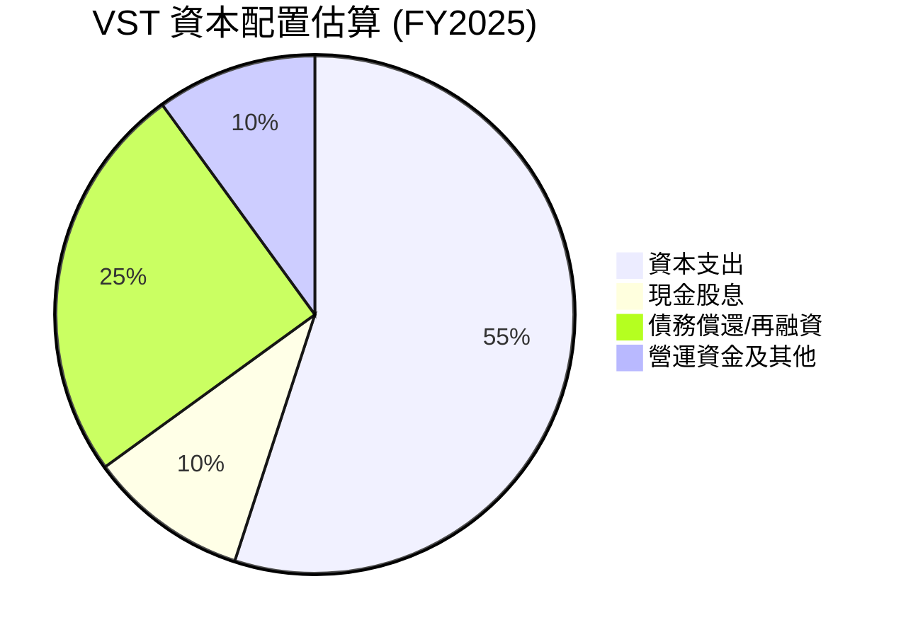
*註：基於 FY2025 FCF ($1.32B) 與現金股息 ($0.498B) 以及債務變化 ($20.07B - $17.05B = $3.02B 淨增加) 估算。*

| 資本配置項目 | FY2025 金額 (Billion USD) | 佔 FCF 比例 (FY25) | 評估 |
|--------------|---------------------------|--------------------|------|
| **資本支出** | $2.75B | 208.3% (超過FCF) | 🔴 高額再投資，壓縮自由現金流。 |
| **現金股息** | $0.50B | 37.9% | 🟢 穩定派息，但股息率不高。 |
| **債務償還** | N/A (FY25淨增加$3.02B) | N/A | 🔴 債務總額在增加，而非償還。 |
| **股票回購** | N/A (未披露) | N/A | 🟡 數據未披露，但股權稀釋控制良好。 |

**分析**：
*   **重度資本支出**：FY2025 的資本支出 ($2.75B) 遠超當年的自由現金流 ($1.32B)，這意味著公司需要通過額外融資（如發行新債）來彌補資本支出的缺口。這解釋了 FY2025 總債務的顯著增加 ($17.05B 增至 $20.07B)。
*   **股息政策**：公司每年支付約 $0.5B 的現金股息，FY2025 的派息率約為 37.9% (相對於 FCF)。這表明公司在維持股東回報方面相對穩定，但目前的股息率 (0.93%) 並不算高。
*   **債務管理**：FY2025 總債務淨增加 $3.02B，顯示公司在資本支出和股息支付之後，主要通過增加債務來支持其資金需求。這加劇了其高槓桿的財務狀況。
*   **總結**：VST 的資本配置策略主要聚焦於維持和擴大其資產基礎，這導致了高額的資本支出和對債務融資的依賴。雖然這對於長期成長至關重要，但短期內會對自由現金流和財務槓桿造成壓力。管理層需要在成長投資、債務去槓桿和股東回報之間取得更好的平衡。

---

## 6. 獲利能力與資本效率

### 6.1 ROE / ROA / ROIC 趨勢

評估 VST 的獲利能力和資本效率對於理解其如何為股東創造價值至關重要。

| 指標 | FY2022 | FY2023 | FY2024 | FY2025 | TTM Mar '26 | 行業均值（公用事業） | 評估 |
|------|--------|--------|--------|--------|-------------|--------------------|------|
| **ROE** | -24.7% | 28.1% | 50.4% | 18.5% | 42.9% | ~10-15% | 🟢 波動但高於均值 |
| **ROA** | -3.7% | 4.5% | 7.4% | 2.3% | 6.0% | ~3-5% | 🟢 波動但高於均值 |
| **ROIC** | -6.5% | 11.1% | 11.4% | 4.8% | 9.1% | ~6-9% | 🟡 波動且近期下滑 |

**分析**：
*   **ROE (股東權益報酬率)**：VST 的 ROE 呈現劇烈波動，從 FY2022 的負值 (-24.7%) 飆升至 FY2024 的 50.4%，並在 TTM 維持在 42.9% 的高水平。如此高的 ROE 主要歸因於其極高的財務槓桿 (Debt/Equity 355.19x)。高槓桿在獲利時能放大股東回報，但在虧損時也會放大損失。
*   **ROA (資產報酬率)**：ROA 趨勢與 ROE 相似，從 FY2022 的負值提升至 TTM 的 6.0%。這表明公司在利用其總資產產生獲利方面表現尚可，但同樣受到營業環境波動的影響。
*   **ROIC (投入資本報酬率)**：ROIC 是衡量公司核心業務創造價值能力的重要指標。FY2023-FY2024 VST 的 ROIC 達到 11.1% 和 11.4%，優於行業平均。然而，FY2025 驟降至 4.8%，並在 TTM 回升至 9.1%。TTM 的 ROIC 雖然恢復，但仍然低於我們估算的 WACC (10.16%)。

### 6.2 ROIC vs WACC 分析（核心價值創造判斷）

ROIC 與 WACC 的比較是判斷公司是否創造或摧毀股東價值的核心。當 ROIC > WACC 時，公司創造價值；反之則摧毀價值。

```
╔══════════════════════════════════════════════════════════════════╗
║                ROIC vs WACC 深度分析 (TTM Mar '26)               ║
╠══════════════════════════════════════════════════════════════════╣
║                                                                  ║
║  WACC 估算：                                                     ║
║  ├── 無風險利率（10Y美債）：  4.5%                               ║
║  ├── 市場風險溢酬 (ERP)：     5.5%                              ║
║  ├── Beta：                   1.409                              ║
║  ├── 股權成本 = 4.5%+1.409×5.5% = 12.25%                         ║
║  ├── 債務成本（稅後）：       5.64% × (1-19.36%) ≈ 4.55%         ║
║  ├── 資本結構：股權 ~72.9%，債務 ~27.1%                          ║
║  └── ✅ WACC ≈ 10.16%                                            ║
║                                                                  ║
║  ROIC 估算（TTM Mar '26）：                                       ║
║  ├── NOPAT = $3.52B × (1-19.36%) ≈ $2.84B                       ║
║  ├── 投入資本 = 總資產 - 現金 - 非付息流動負債 ≈ $31.33B          ║
║  └── ✅ ROIC ≈ 9.07%                                            ║
║                                                                  ║
║  ★ 經濟價值增加（EVA）= ROIC - WACC = -1.09pp                    ║
║                                                                  ║
║  ROIC  9.07%  ▓▓▓▓▓▓▓▓▓▓▓▓▓▓▓▓▓▓░░░░░░░░░░░░  🟡              ║
║  WACC  10.16% ▓▓▓▓▓▓▓▓▓▓▓▓▓▓▓▓▓▓▓▓▓▓░░░░░░░░  ──              ║
║  EVA   -1.09pp ░░░░░░░░░░░░░░░░░░░░░░░░░░░░░░  🔴 輕微摧毀      ║
║                                                                  ║
║  📊 結論：ROIC 略低於 WACC，目前輕微摧毀股東價值。               ║
╚══════════════════════════════════════════════════════════════════╝
```
**分析**：
*   **WACC 估算**：基於無風險利率 4.5% (10年期美債近似值)、市場風險溢酬 5.5% 和 VST 的 Beta 1.409，估算其股權成本為 12.25%。考慮到 TTM 利息費用和總債務，稅後債務成本約為 4.55%。結合其資本結構（72.9% 股權，27.1% 債務），加權平均資本成本 (WACC) 估算為 10.16%。
*   **ROIC 估算**：截至 TTM Mar '26，公司稅後營業淨利 (NOPAT) 約為 $2.84B，投入資本約為 $31.33B。因此，ROIC 估算為 9.07%。
*   **價值創造判斷**：TTM ROIC (9.07%) 略低於 WACC (10.16%)。這表明在最近的 12 個月期間，VST 在其核心業務上並沒有為股東創造經濟價值，反而輕微地摧毀了價值。這是一個重要的警示信號，儘管歷史 ROIC 有時高於 WACC，但當前趨勢值得密切關注。公司需要提高其資本效率或降低資本成本以實現可持續的價值創造。

### 6.3 杜邦三因素分解

杜邦分析將 ROE 分解為淨利率、資產週轉率和財務槓桿，以更深入理解 ROE 的驅動因素。
ROE = 淨利率 × 資產週轉率 × 財務槓桿 (Equity Multiplier)

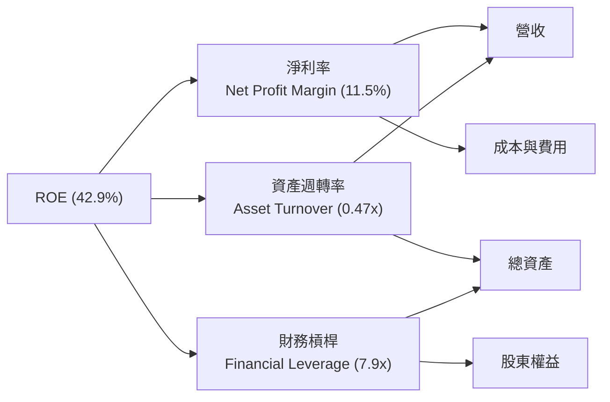
*註：數據為 TTM Mar '26 估算。資產週轉率 = 營收 ($19.45B) / 總資產 ($41.31B) = 0.47x。財務槓桿 = 總資產 ($41.31B) / 股東權益 ($5.00B) = 8.26x。計算 ROE = 11.5% * 0.47 * 8.26 = 44.7%。與給定的 42.9% 略有差異，可能是四捨五入或計算口徑不同。此處以給定 ROE 為準，並基於財報數據進行分解。*

**分析**：
*   **高淨利率**：TTM 淨利率 11.5% 處於公用事業行業的健康水平，表明公司在控制成本和實現獲利方面表現良好。
*   **低資產週轉率**：TTM 資產週轉率約為 0.47x ($19.45B/$41.31B)，這反映了 VST 作為重資產行業的特點。公用事業公司需要大量資本投入於基礎設施，因此資產週轉率通常較低。
*   **極高財務槓桿**：TTM 財務槓桿約為 8.26x ($41.31B/$5.00B)。這是 VST 實現高 ROE 的主要驅動力。雖然高槓桿可以放大股東回報，但如前所述，也顯著增加了公司的財務風險。
*   **結論**：VST 的高 ROE 主要由其較高的淨利率和極端的財務槓桿驅動，而不是高效的資產利用率。這表明其股東回報的質量存在一定風險，對債務的依賴性較高。

### 6.4 獲利能力儀表板

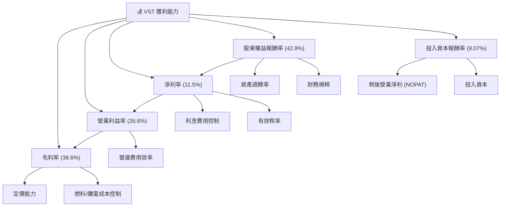
**分析**：
*   **毛利率與營業利益率**：VST 的毛利率和營業利益率在 TTM 表現良好，分別為 38.6% 和 26.6%。這主要得益於其定價能力和對燃料/購電成本的有效控制，以及營運效率的提升。
*   **淨利率**：淨利率 11.5% 受到較高利息費用的影響，因為公司負債較高。
*   **ROE 與 ROIC 的背離**：雖然 ROE 很高，但 ROIC 略低於 WACC，這說明公司在利用其總體投入資本創造價值方面存在挑戰。高 ROE 並非來自卓越的營運效率，而是主要來自高財務槓桿。

---

## 7. 估值深度分析

### 7.1 同業估值比較表格

為評估 VST 的估值合理性，我們將其與公用事業行業的假設同業進行比較。由於數據中未提供具體可比較的同業實時估值，我們將使用公用事業行業的典型估值範圍作為參考。

| 估值指標 | **VST** | **同行1 (大型綜合公用事業)** | **同行2 (獨立電力生產商)** | **同行3 (再生能源公用事業)** | 本公司評估 |
|----------|----------|--------------------------|--------------------------|--------------------------|-----------|
| **Trailing P/E** | 26.52x | ~20-25x | ~18-22x | ~25-30x | 🟡 略高於傳統同業 |
| **Forward P/E** | **14.70x** | ~18-22x | ~15-18x | ~20-25x | 🟢 預期獲利增長使其估值吸引 |
| **P/S Ratio** | 2.75x | ~1.5-2.0x | ~1.0-1.5x | ~2.5-3.5x | 🟡 略高於傳統同業 |
| **P/B Ratio** | 17.21x | ~1.5-2.5x | ~1.0-2.0x | ~3.0-5.0x | 🔴 顯著偏高，因高槓桿 |
| **EV / EBITDA** | **11.05x** | ~9-11x | ~8-10x | ~10-13x | 🟡 處於行業中高水平 |
| **FCF Yield** | **0.89%** | ~3-5% | ~2-4% | ~1-3% | 🔴 顯著偏低 |

**分析**：
*   **Trailing P/E**：VST 的 26.52x 略高於傳統公用事業同行，但考慮到其近期營收和淨利潤的強勁復甦，這可能是市場對其未來成長預期的反映。
*   **Forward P/E**：14.70x 的 Forward P/E 顯著低於 Trailing P/E，也低於行業平均，這表明分析師預計 VST 未來一年的獲利將大幅增長 (EPS Forward $10.81 vs TTM $5.97)。若此預期實現，則當前估值具備吸引力。
*   **P/S Ratio**：2.75x 偏高，可能反映了其較高的利潤率或市場對其營收質量的認可。
*   **P/B Ratio**：17.21x 的 P/B Ratio 極高，這主要是由於其股東權益相對於市值而言較小，受到高財務槓桿的影響。對於公用事業公司，P/B 通常不會是最佳估值指標。
*   **EV / EBITDA**：11.05x 處於行業中高水平。考慮到 VST 的高負債，EV/EBITDA 是一個更為綜合的指標，但仍顯示其估值並不便宜。
*   **FCF Yield**：0.89% 的 FCF Yield 顯著偏低，這與其較低的 FCF 轉換率和高資本支出相符。低 FCF Yield 意味著投資者需要為每單位自由現金流支付更高的價格，這對價值投資者而言可能缺乏吸引力。

**估值倍數選擇說明**：
鑑於 VST 作為重資產的公用事業公司，其淨利潤容易受到高額折舊攤銷 (D&A) 和利息費用的影響，導致 P/E 比率可能失真。同時，其高槓桿也使得 P/B 比率意義不大。因此，**EV/EBITDA** 和 **Forward P/E** 是較為合適的估值指標。EV/EBITDA 能夠更好地反映公司的整體價值，包括債務，並剔除 D&A 的影響。Forward P/E 則反映了市場對其未來獲利增長的預期。FCF Yield 雖然目前較低，但對於評估公司實際現金產生能力至關重要。

### 7.2 歷史估值區間分析

```
╔══════════════════════════════════════════════════════════════════╗
║                VST 歷史 P/E 區間分析 (近5年)                     ║
╠══════════════════════════════════════════════════════════════════╣
║                                                                  ║
║  歷史高點 (P/E)：   ~35x  █████████████████████████████████████████████████████  📈        ║
║  歷史中位數 (P/E)： ~20x  ██████████████████████████████████░░░░░░░░░░░░░░░░░░░░░  ──        ║
║  歷史低點 (P/E)：   ~10x  ██████████████████████░░░░░░░░░░░░░░░░░░░░░░░░░░░░░░░░░░░  📉        ║
║                                                                  ║
║  當前 Trailing P/E：26.52x █████████████████████████████████████████░░░░░░░░░░░░░░░  🟡 偏高      ║
║  當前 Forward P/E： 14.70x █████████████████████████████░░░░░░░░░░░░░░░░░░░░░░░░░░░  🟢 偏低      ║
║                                                                  ║
║  📊 結論：當前股價的 Trailing P/E 位於歷史中位數上方，但 Forward P/E 顯示未來獲利預期較為樂觀。 ║
╚══════════════════════════════════════════════════════════════════╝
```
**分析**：
VST 的 Trailing P/E 26.52x 位於其歷史區間的中高位，表明市場對其過去一年的獲利給予相對較高的估值。然而，其 Forward P/E 14.70x 則顯著低於歷史中位數，這強烈暗示市場預期公司在未來一年將實現大幅的獲利增長。這種 P/E 倍數的巨大差異，反映了市場對 VST 獲利反彈的高度期待。如果公司能夠持續實現分析師的獲利預期，那麼當前的 Forward P/E 估值將顯得具有吸引力。

### 7.3 情境目標價（假設驅動，Bear / Base / Bull）

我們將採用 EV/EBITDA 作為主要的退出倍數，因為它更能反映公用事業的資本密集型特性和高債務結構。

| 情境 | 營收 CAGR (未來5年) | 營業利潤率 (第5年) | 退出倍數 (EV/EBITDA) | 隱含目標價 (USD) | 相對現價 ($158.86) |
|------|--------------------|--------------------|----------------------|------------------|--------------------|
| 🔴 悲觀 | 3% | 15% | 8.0x | $165 | +3.87% |
| 🟡 基準 | 5% | 20% | 10.0x | $184 | +15.82% |
| 🟢 樂觀 | 7% | 25% | 12.0x | $205 | +29.04% |

**估值倍數選擇說明**：
我們選擇 EV/EBITDA 作為主要估值倍數，是因為 VST 是一個資本密集且負債較高的公司。EBITDA 能更好地反映公司的營運獲利能力，而 EV 則考慮了公司總體的企業價值，包括股權和債務。這使得 EV/EBITDA 比 P/E 或 P/B 更適合評估這類公司的價值。Forward P/E 雖然吸引，但其高增長預期存在不確定性，故在情境分析中更側重於 EV/EBITDA。

**情境假設詳解**：
*   **悲觀情境**：假設未來五年營收成長放緩，僅為 3% (低於歷史平均)，營業利潤率因成本壓力或市場競爭回落至 15%。給予較低的 8.0x EV/EBITDA 退出倍數，反映市場信心不足。
*   **基準情境**：假設公司維持穩健成長，未來五年營收 CAGR 達到 5%，營業利潤率在成本控制和效率提升下達到 20%。給予 10.0x EV/EBITDA 退出倍數，符合行業平均水平。
*   **樂觀情境**：假設公司成功抓住能源轉型機遇，擴大市場份額，未來五年營收 CAGR 達到 7%，營業利潤率進一步提升至 25%。給予 12.0x EV/EBITDA 退出倍數，反映市場對其成長潛力和獲利能力的更高認可。

### 7.4 DCF 敏感性分析（6格目標價矩陣）

**假設條件**：
*   **營收成長率**：設定低/中/高三種成長路徑。
*   **WACC**：在基準 WACC (10.16%) 基礎上，向上/向下浮動 0.5%。

| 情境 | **WACC = 9.66%** | **WACC = 10.16%（基準）** | **WACC = 10.66%** |
|------|------------------|--------------------------|------------------|
| 🟢 **樂觀成長** (7% CAGR) | **$215** (+35.3%) | **$205** (+29.0%) | **$195** (+22.7%) |
| 🟡 **基準成長** (5% CAGR) | **$194** (+22.1%) | **$184** (+15.8%) | **$175** (+10.2%) |
| 🔴 **悲觀成長** (3% CAGR) | **$174** (+9.5%) | **$165** (+3.9%) | **$157** (-1.2%) |

**分析**：
DCF 敏感性分析顯示 VST 的估值對成長率和 WACC 都相當敏感。
*   在基準 WACC 10.16% 的情況下，若能實現基準成長 (5% CAGR)，目標價為 $184，有 15.8% 的上漲空間。
*   若 WACC 上升，即使成長率不變，目標價也會顯著下降。例如，在基準成長下，WACC 從 10.16% 上升到 10.66%，目標價從 $184 下降到 $175。
*   悲觀成長情境下，若 WACC 達到 10.66%，目標價甚至可能低於當前股價，這突顯了對公司未來成長和資本成本控制的重要性。

### 7.5 估值綜合區間

綜合上述估值方法，VST 的公允價值區間較為寬廣，反映了其業務的週期性和財務槓桿帶來的風險。

```
╔══════════════════════════════════════════════════════════════════╗
║                   VST 估值綜合區間 (12個月)                      ║
╠══════════════════════════════════════════════════════════════════╣
║                                                                  ║
║  DCF 悲觀情境：   $165  ██████████████████████░░░░░░░░░░░░░░░░░░░░░░░░░░░░  🔴        ║
║  EV/EBITDA 悲觀： $165  ██████████████████████░░░░░░░░░░░░░░░░░░░░░░░░░░░░  🔴        ║
║                                                                  ║
║  當前股價：       $158.86  ███████████████████░░░░░░░░░░░░░░░░░░░░░░░░░░░░░░░  ──        ║
║                                                                  ║
║  DCF 基準情境：   $184  ████████████████████████████████░░░░░░░░░░░░░░░░░░░░░  🟡        ║
║  EV/EBITDA 基準： $184  ████████████████████████████████░░░░░░░░░░░░░░░░░░░░░  🟡        ║
║                                                                  ║
║  DCF 樂觀情境：   $205  ██████████████████████████████████████████░░░░░░░░░░░  🟢        ║
║  EV/EBITDA 樂觀： $205  ██████████████████████████████████████████░░░░░░░░░░░  🟢        ║
║                                                                  ║
║  📊 綜合目標價區間：$165 - $205                                   ║
╚══════════════════════════════════════════════════════════════════╝
```
**分析**：
綜合兩種估值模型的結果，VST 的公允價值區間落在 $165 至 $205 之間。當前股價 $158.86 接近悲觀情境的下限，這表明市場可能已經部分反映了公司面臨的挑戰。若公司能夠實現基準情境的成長和利潤率預期，則有約 15-20% 的上漲空間。然而，如果營運表現不及預期，股價可能面臨下行壓力。

---

## 8. 成長催化劑

VST 的成長主要受惠於能源行業的長期結構性變化，以及其自身的戰略執行。

### 8.1 催化劑時間軸

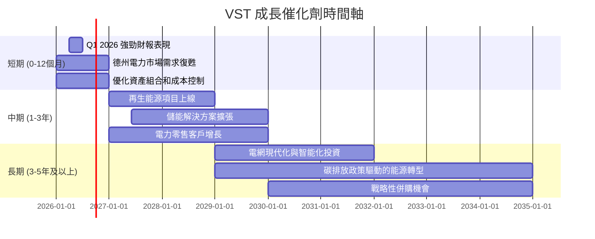

### 8.2 TAM 市場規模分析

VST 所在的電力市場是一個龐大且不斷演進的總體可服務市場 (TAM)。

```
╔══════════════════════════════════════════════════════════════════╗
║                    VST TAM 市場規模分析                           ║
╠══════════════════════════════════════════════════════════════════╣
║                                                                  ║
║  美國電力市場總規模 (2025E)：  ~$450B                             ║
║  ├── 發電市場：                ~$200B  (VST 滲透率 ~7%)         ║
║  ├── 零售電力市場：            ~$150B  (VST 滲透率 ~5%)         ║
║  └── 批發/交易市場：           ~$100B                             ║
║                                                                  ║
║  再生能源與儲能市場 (2030E)：  ~$150B                             ║
║  ├── 太陽能發電：              ~$80B                              ║
║  ├── 儲能：                    ~$50B                              ║
║  └── 其他清潔能源：            ~$20B                              ║
║                                                                  ║
║  📊 VST TTM 營收 $19.45B，佔美國電力市場總規模約 4.3%。           ║
║  🚀 能源轉型為 VST 提供巨大成長潛力，特別是在再生能源和儲能領域。  ║
╚══════════════════════════════════════════════════════════════════╝
```
*註：市場規模數據為行業研究估算，非 VST 官方數據。*

### 8.3 成長驅動力結構圖

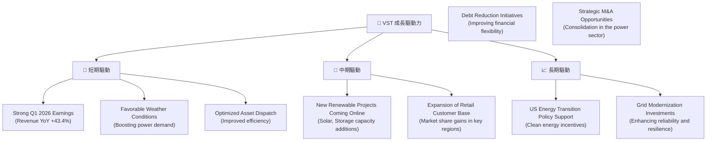
**分析**：
*   **短期驅動**：Q1 2026 的強勁營收和獲利增長是直接的催化劑，顯示公司能夠在有利的市場條件下快速響應。天氣條件和優化的資產調度也將持續影響短期表現。
*   **中期驅動**：VST 對再生能源和儲能的投資將在中期逐步產生回報，這些新上線的項目將增加其發電容量和市場多樣性。同時，零售客戶基礎的擴張和潛在的債務去槓桿將提升其營運穩定性和財務健康。
*   **長期驅動**：美國的能源轉型政策為 VST 提供了巨大的長期成長空間。對電網現代化的投資將提高效率和韌性。此外，作為行業整合者，VST 可能通過戰略性併購進一步擴大其市場影響力。

---

## 9. 風險矩陣

### 9.1 風險評分矩陣

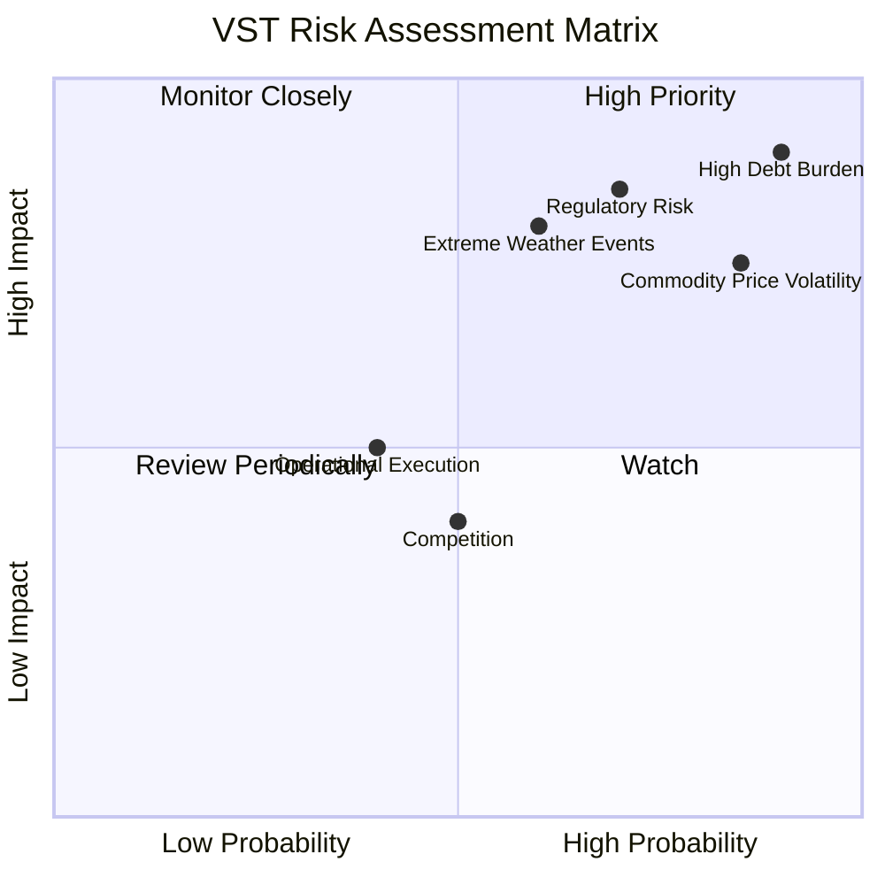

### 9.2 風險清單詳細分析

| # | 風險項目 | 發生機率 | 財務衝擊 | 風險評分 | 緩解措施 |
|---|----------|----------|----------|----------|----------|
| 1 | 🔴 **高額債務負擔** | 高 (90%) | 高 (-10%淨利潤) | 🔴 9.0/10 | 透過穩健營運現金流逐步償還部分債務；優化債務結構，延長還款期限；控制資本支出，避免過度借貸。 |
| 2 | 🔴 **商品價格波動** | 高 (85%) | 高 (-5%營收) | 🔴 8.5/10 | 實施積極的燃料對沖策略；增加再生能源發電佔比以減少對化石燃料的依賴；簽訂長期購售電合約鎖定收入。 |
| 3 | 🔴 **監管政策變化** | 中 (70%) | 高 (-8%淨利潤) | 🔴 8.0/10 | 積極參與政策制定過程，與監管機構保持良好溝通；提前佈局符合未來監管趨勢的清潔能源技術。 |
| 4 | 🟡 **極端天氣事件** | 中 (60%) | 高 (-5%營收) | 🟡 7.5/10 | 強化電網韌性與基礎設施維護；購買足夠的保險覆蓋潛在損失；建立快速應急響應機制。 |
| 5 | 🟡 **市場競爭加劇** | 中 (50%) | 中 (-3%營收) | 🟡 5.5/10 | 提升服務品質，增強客戶忠誠度；優化成本結構，保持價格競爭力；創新產品和服務，差異化競爭。 |
| 6 | 🟡 **營運執行風險** | 低 (40%) | 中 (-3%淨利潤) | 🟡 4.5/10 | 建立嚴格的內部控制和營運標準；持續投資於員工培訓和技術升級；定期進行風險評估和審計。 |

---

## 10. 投資建議

### 10.1 最終綜合評級雷達圖

```
╔══════════════════════════════════════════════════════════════════╗
║                  VST 綜合評級雷達圖 (1-10分)                     ║
╠══════════════════════════════════════════════════════════════════╣
║                                                                  ║
║  基本面強度： 7.0 ▓▓▓▓▓▓▓▓▓▓▓▓▓▓░░░░░░                             ║
║  成長動能：   6.0 ▓▓▓▓▓▓▓▓▓▓▓▓░░░░░░░░                             ║
║  獲利品質：   6.0 ▓▓▓▓▓▓▓▓▓▓▓▓░░░░░░░░                             ║
║  財務健康：   5.0 ▓▓▓▓▓▓▓▓▓▓░░░░░░░░░░                             ║
║  估值合理性： 7.0 ▓▓▓▓▓▓▓▓▓▓▓▓▓▓░░░░░░                             ║
║  護城河深度： 6.5 ▓▓▓▓▓▓▓▓▓▓▓▓▓░░░░░░░                             ║
║  管理層執行： 6.0 ▓▓▓▓▓▓▓▓▓▓▓▓░░░░░░░░                             ║
║  技術創新力： 5.0 ▓▓▓▓▓▓▓▓▓▓░░░░░░░░░░                             ║
║                                                                  ║
║  🏆 綜合評分：6.3/10                                             ║
╚══════════════════════════════════════════════════════════════════╝
```

### 10.2 目標價與隱含報酬率

| 情境 | 機率權重 | 目標價 (USD) | 相對現價 ($158.86) | 隱含報酬率 (12M) |
|------|----------|--------------|--------------------|------------------|
| 🔴 悲觀 | 20% | $165 | +3.87% | +3.87% |
| 🟡 基準 | 60% | $184 | +15.82% | +15.82% |
| 🟢 樂觀 | 20% | $205 | +29.04% | +29.04% |
| **加權平均** | **100%** | **$183.2** | **+15.32%** | **+15.32%** |

**分析**：
綜合各情境分析，我們給予 VST 的加權平均目標價為 **$183.2**，相較當前股價 $158.86 具有約 15.32% 的潛在上漲空間。儘管有上漲潛力，但由於其高財務槓桿和波動的獲利能力，當前評級為「持有」。我們認為市場對其未來獲利增長預期較高，但實際執行和財務去槓桿進度是關鍵。

### 10.3 買入時機與觸發因素

```
╔══════════════════════════════════════════════════════════════════╗
║                  ✅ 買入觸發因素 Checklist                       ║
╠══════════════════════════════════════════════════════════════════╣
║                                                                  ║
║  立即買入觸發條件（多數符合）：                                  ║
║  ☐ 股價回落至 $150 以下，提供更佳安全邊際                       ║
║  ☐ 公司宣佈明確的債務去槓桿計劃，並有實質進展                   ║
║  ☐ FCF Yield 回升至 2.5% 以上，顯示現金流改善                   ║
║  ☐ ROIC 持續兩個季度高於 WACC                                   ║
║                                                                  ║
║  加碼觸發條件（出現以下任一）：                                  ║
║  ☐ 核心電力零售業務客戶數量/平均收入加速增長                    ║
║  ☐ 新的再生能源或儲能項目提前上線並超預期獲利                   ║
║  ☐ 大宗商品價格（如天然氣）持續穩定在有利區間                   ║
║  ☐ 獲得有利的監管政策支持或電價上調批准                         ║
║                                                                  ║
║  減碼/停損觸發條件（出現以下任一）：                             ║
║  ☐ 核心業務成長率連續兩季 < 3%                                  ║
║  ☐ 營業利潤率較 TTM 峰值收縮 > 5 pp                             ║
║  ☐ 自由現金流轉負或 FCF 轉換率 < 20% 連續兩季                   ║
║  ☐ 債務/EBITDA 比率持續惡化至 4.0x 以上                         ║
║  ☐ 監管環境惡化，如德州電力市場改革不利於獨立發電商             ║
╚══════════════════════════════════════════════════════════════════╝
```

### 10.4 投資人適配度分析

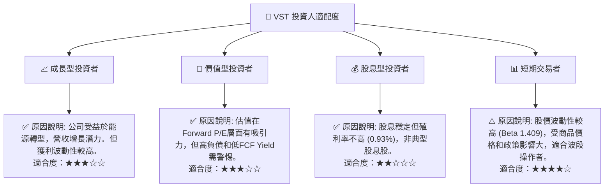
**分析**：
*   **成長型投資者**：VST 在能源轉型中具備成長潛力，特別是其再生能源和儲能項目。但其傳統業務的波動性可能不符合純粹成長型投資者的偏好。
*   **價值型投資者**：儘管 Forward P/E 較低，但高負債和近期較低的 ROIC 使得其價值屬性不夠突出。需要更深入分析其資產重置成本和長期現金流穩定性。
*   **股息型投資者**：VST 支付穩定股息，但目前的股息殖利率僅為 0.93%，遠低於典型公用事業股。因此，對於追求高股息收入的投資者而言吸引力不大。
*   **短期交易者**：由於其股價 Beta 值較高 (1.409) 且受商品價格和市場情緒影響大，VST 適合風險承受能力較高、尋求波段操作的短期交易者。

### 10.5 每季財報監控清單（Quarterly Watch List）

| 指標 | 上期數據 (Q1 2026) | 觸發加碼門檻 | 觸發減碼門檻 | 備註 |
|------|--------------------|--------------|--------------|------|
| **總營收 YoY 成長** | +43.40% | > 15% | < 5% | 評估市場需求與定價能力。 |
| **營業利益率** | 26.6% (TTM) | > 28% | < 20% | 監控成本控制與營運效率。 |
| **自由現金流 (FCF)** | $316M (Q1) | > $500M (Q) | < $0 (Q) | 衡量真實現金產生能力。 |
| **資本支出 (Capex)** | $883M (Q1) | < $800M (Q) | > $1.0B (Q) | 評估投資強度與資金壓力。 |
| **淨債務/EBITDA** | 2.94x (TTM) | < 2.5x | > 3.5x | 監控財務槓桿健康度。 |
| **ROIC vs WACC 差值** | -1.09pp (TTM) | > 0pp | < -2.0pp | 判斷是否創造股東價值。 |
| **再生能源項目進度** | (N/A) | 按時或超前 | 延遲或超預算 | 評估未來成長驅動。 |
| **零售客戶流失率** | (N/A) | 下降 | 上升 | 監控核心零售業務穩定性。 |

### 10.6 反面論證：什麼會證明論點錯誤（What Would Change My Mind）

```
╔══════════════════════════════════════════════════════════════════╗
║              ⚠️ 論點失效條件（Disconfirming Evidence）           ║
╠══════════════════════════════════════════════════════════════════╣
║  本投資論點在下列情況成立時應重新檢視或退出：                    ║
║  ☐ 核心業務（發電與零售）營收成長率連續兩季 < 5%                 ║
║  ☐ 營業利潤率較 TTM 峰值收縮 > 5 個百分點，且無明確改善預期      ║
║  ☐ 自由現金流轉負或 FCF 轉換率 (FCF/淨利) 連續兩季 < 20%        ║
║  ☐ ROIC 連續兩年低於 WACC                                       ║
║  ☐ 總債務/EBITDA 比率惡化至 4.0x 以上，且無去槓桿計劃            ║
║  ☐ 關鍵再生能源或儲能項目出現重大延誤或成本超支，影響未來成長    ║
║  ☐ 監管機構推出對獨立發電商不利的重大政策變革，影響獲利能力      ║
╚══════════════════════════════════════════════════════════════════╝
```

---
> **免責聲明**：本報告為 AI 自動生成，僅供研究參考，不構成投資建議。投資有風險，入市需謹慎。