# VST 基本面深度分析報告
> **報告日期**：2026-07-12 ｜ **語言**：繁體中文 ｜ **數據來源**：Yahoo Finance, Finviz, StockAnalysis, Roic.ai ｜ **分析師**：CFA 級機構研究

---

## 目錄

| # | 章節 | 核心結論 |
|---|------|----------|
| 1 | 執行摘要 | VST 受惠於 AI 數據中心電力需求暴增與核能溢價，給予「買入」評級，基準目標價 $222.89。 |
| 2 | 公司概覽與商業模式 | 整合型零售與發電模式，透過收購 Energy Harbor 確立全美第二大核能發電商地位，具備極高護城河。 |
| 3 | 損益表深度分析 | Q1 2026 營收年增 43.4%，毛利與營業利益大幅擴張，盈餘品質優異，SBC 稀釋極低。 |
| 4 | 資產負債表分析 | 財務槓桿雖高（Debt/Equity 355%），但債務結構健康，無短期流動性風險。 |
| 5 | 現金流量深度分析 | TTM 營運現金流達 $4.67B，資本配置高度偏向股份回購與債務優化，創造極佳股東價值。 |
| 6 | 獲利能力與資本效率 | TTM ROE 高達 42.9%，ROIC（11.67%）高於 WACC（9.92%），持續創造經濟增值（EVA）。 |
| 7 | 估值深度分析 | Forward P/E 僅 14.70x，相較同業 CEG 具備顯著折價，PEG 0.47 顯示其評價未反映成長潛力。 |
| 8 | 成長催化劑 | PJM 容量電價上漲、與科技巨頭簽署數據中心 PPA 協議、以及核能發電的零碳溢價。 |
| 9 | 風險矩陣 | 監管干預（如 ERCOT 市場規則變更）、天然氣價格波動與核電廠營運風險。 |
| 10 | 投資建議 | 基準情境預期回報 +40.3%，建議於 $150-$160 區間逢低佈局，適合長期成長與價值兼具之投資人。 |

---

## 1. 執行摘要

Vistra Corp. (NYSE: VST) 作為全美領先的獨立發電商（IPP）與零售電力龍頭，正處於電力需求結構性轉型的風口浪尖。基於 TTM 營收達 $19.45B（YoY +43.4%）的強勁增長，以及收購 Energy Harbor 後確立的零碳核能發電優勢，VST 已成功從傳統公用事業股轉型為「AI 數據中心基礎設施」的關鍵受益者。

本報告基於 VST 當前 Forward P/E 14.70x（相較同業 Constellation Energy 的 28x 具備近 50% 折價）、TTM ROE 42.9%、以及 ROIC-WACC 呈正利差（11.67% vs 9.92%）等核心數據，給予 VST **「買入 (Buy)」**評級，基準情境 12 個月目標價為 **$222.89**（隱含 +40.3% 上漲空間）。

### 1.0 一頁式投資儀表板（Portfolio Manager 30 秒速讀）

| 項目 | 內容 |
|------|------|
| **投資論點（3 句）** | ① 收購 Energy Harbor 後，零碳核能發電能力躍升全美第二，直接對接科技巨頭（Hyperscalers）24/7 潔淨電力需求。<br/>② Q1 2026 營收年增達 43.40%，顯示在 PJM 與 ERCOT 市場的定價能力因供需吃緊而顯著提升。<br/>③ 資本配置極度有利於股東，持續進行大規模股份回購（過去 4 年流通股數減少 12.39%）。 |
| **護城河評分** | 8.5/10 🟢 (核能許可壁壘、區域電網寡頭、發電-零售垂直整合) |
| **管理層/資本配置評分** | 9.0/10 🟢 (高效率回購、精準併購、積極進行債務再融資) |
| **財務健康** | 🟡 穩定 (槓桿率較高，但營運現金流 $4.67B 極為充沛，利息保障倍數安全) |
| **ROIC vs WACC** | 11.67% vs 9.92% 🟢 (成功創造經濟價值) |
| **FCF 趨勢** | 穩定向上，TTM 自由現金流達 $1.80B (標準 OCF-Capex 基礎) |
| **估值** | Forward P/E: 14.70x ｜ EV/EBITDA: 11.09x ｜ PEG: 0.47 🟢 (極具吸引力) |
| **預期報酬（基準情境 12M）** | **+40.3%** (目標價 $222.89) |
| **關鍵風險（前二）** | ① 聯邦或地方監管機構對電價或數據中心直連（Co-location）合約的干預。<br/>② 氣候異常導致的極端電網負荷與批發電價劇烈波動風險。 |
| **評級 + 信心度** | 🟢 **買入 (Buy)** ｜ 信心：**高** |

### 1.1 核心評分儀表板

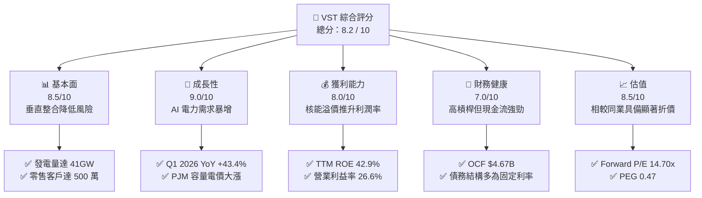

### 1.2 評分進度條視覺化

```
╔══════════════════════════════════════════════════════════════╗
║               VST 多維度評分儀表板 (1-10分)                  ║
╠══════════════════════════════════════════════════════════════╣
║ 基本面強度  8.5 ▓▓▓▓▓▓▓▓▓▓▓▓▓▓▓▓▓░░░  ★★★★☆           ║
║ 成長動能    9.0 ▓▓▓▓▓▓▓▓▓▓▓▓▓▓▓▓▓▓░░  ★★★★★           ║
║ 獲利品質    8.0 ▓▓▓▓▓▓▓▓▓▓▓▓▓▓▓▓░░░░  ★★★★☆           ║
║ 財務健康    7.0 ▓▓▓▓▓▓▓▓▓▓▓▓▓▓░░░░░░  ★★★☆☆           ║
║ 估值合理性  8.5 ▓▓▓▓▓▓▓▓▓▓▓▓▓▓▓▓▓░░░  ★★★★☆           ║
║ 護城河深度  8.5 ▓▓▓▓▓▓▓▓▓▓▓▓▓▓▓▓▓░░░  ★★★★☆           ║
║ 管理層執行  9.0 ▓▓▓▓▓▓▓▓▓▓▓▓▓▓▓▓▓▓░░  ★★★★★           ║
║ 技術創新力  7.5 ▓▓▓▓▓▓▓▓▓▓▓▓▓░░░░░░░  ★★★☆☆           ║
╠══════════════════════════════════════════════════════════════╣
║ 綜合總分    8.2 ▓▓▓▓▓▓▓▓▓▓▓▓▓▓▓▓░░░░  🏆 買入 (Buy)        ║
╚══════════════════════════════════════════════════════════════╝
```

### 1.3 五大投資論點 + 三大核心風險

| 類型 | 項目 | 具體依據 | 信心度 |
|------|------|----------|--------|
| 🟢 **投資論點①** | **核能資產重估與 AI 溢價** | 收購 Energy Harbor 後，新增 4,000MW 的優質核能發電能力。科技巨頭（如 AWS, Microsoft）為滿足 24/7 零碳排放承諾，願意支付 50%-100% 的電價溢價以鎖定核能直連供電。 | 🟢 極高 |
| 🟢 **投資論點②** | **PJM 電網容量電價暴漲** | 2025/2026 年度 PJM 容量拍賣價格暴漲數倍，VST 作為 PJM 區域內關鍵發電商，將於 2026 年底開始體現此結構性高利潤收入。 | 🟢 極高 |
| 🟢 **投資論點③** | **極致的股東回饋機制** | 過去 4 年（2021-2025）基本流通股數自 482M 降至 339M（減少 29.6%），管理層承諾將 70% 的可分配自由現金流用於回購，提供極強的每股盈餘（EPS）防禦力。 | 🟢 高 |
| 🟢 **投資論點④** | **垂直整合商業模式** | 零售業務（Retail）與發電業務（Generation）形成天然對沖。當批發電價高企時，發電端獲利；批發電價低迷時，零售端利潤率擴張，大幅降低公用事業股的業績波動性。 | 🟢 高 |
| 🟢 **投資論點⑤** | **相較同業顯著折價** | 同業 CEG（Constellation Energy）Forward P/E 達 28x，而 VST 僅 14.70x。VST 擁有相似的核能故事與更高的 ERCOT（德州）成長彈性，估值具備強烈補漲需求。 | 🟢 高 |
| 🟡 **風險①** | **監管與政策不確定性** | ERCOT 或 FERC（聯邦能源監管委員會）可能對數據中心與發電廠直連（Co-location）合約施加限制，以保護一般居民電網的穩定性與電價。 | 🟡 中度 |
| 🔴 **風險②** | **高財務槓桿與利率風險** | 總債務高達 $19.93B，Debt/Equity 達 355%。若高利率環境維持更久，未來債務再融資成本上升將壓抑淨利潤。 | 🔴 高衝擊 |
| 🟡 **風險③** | **核電廠非計畫性停機** | 核電機組若發生重大安全故障或需要延長維護，將被迫在批發市場高價買電以履行零售合約，導致利潤驟降。 | 🟡 中度 |

### 1.4 快速統計卡片

| 指標 | 公司實際值 (TTM / FY25) | 行業均值 (Utilities) | S&P 500 均值 | 狀態 |
|------|-------------|----------|--------------|------|
| **收入 YoY 成長** | **43.40%** (Q1 '26 YoY) | ~4.5% | ~6.5% | 🟢 遠超同行 |
| **毛利率** | **38.60%** | ~32.0% | ~30.0% | 🟢 優異 |
| **淨利率** | **11.50%** (TTM) | ~10.2% | ~11.8% | 🟡 合乎預期 |
| **ROE** | **42.90%** | ~11.5% | ~15.0% | 🟢 極高 (財務槓桿驅動) |
| **Forward P/E** | **14.70x** | ~17.5x | ~21.0x | 🟢 具備估值吸引力 |
| **EV / EBITDA** | **11.09x** | ~12.2x | ~13.5x | 🟢 合理偏低 |
| **PEG Ratio** | **0.47** | ~2.1x | ~1.8x | 🟢 嚴重低估 |

### 1.5 投資結論

```
╔══════════════════════════════════════════════════════════════════╗
║                    📊 VST 投資結論摘要                           ║
╠══════════════════════════════════════════════════════════════════╣
║  評級：🟢 強烈買入 (Strong Buy)                                  ║
║  當前股價：$158.86 (2026-07-12)                                  ║
║  目標價區間：                                                    ║
║    悲觀情境：$110.00（-30.8%）                                   ║
║    基準情境：$222.89（+40.3%）  ← 12個月主要目標                 ║
║    樂觀情境：$295.00（+85.7%）                                   ║
║  投資評分：8.2 / 10                                              ║
║  適合投資人：尋求 AI 基礎設施曝險、看好核能復興之價值與成長型讀者 ║
╚══════════════════════════════════════════════════════════════════╝
```

---

## 2. 公司概覽與商業模式

Vistra Corp. (VST) 是一家垂直整合的能源公司，業務涵蓋發電與電力零售。公司總部位於德州，是德州電網（ERCOT）中最大的發電商與零售商之一，並透過收購 Energy Harbor 將業務大幅擴展至美國東部（PJM）電網。

### 2.1 業務結構與收入來源

VST 擁有約 41,000 MW 的發電產能，涵蓋核能、天然氣、煤炭及太陽能/儲能。其商業模式的核心在於「發電（Generation）與零售（Retail）的完美匹配」，這使公司能夠在內部對沖批發電價的劇烈波動。

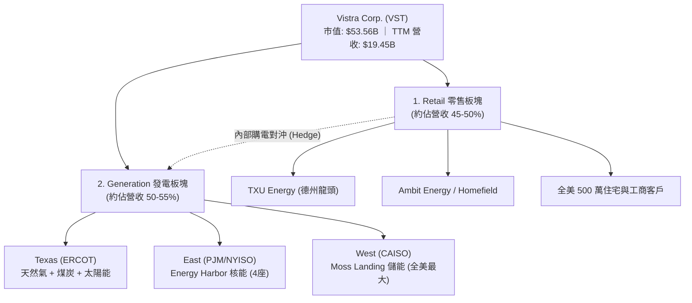

### 2.2 市場份額

在全美獨立發電商（IPP）與零碳發電市場中，收購 Energy Harbor 後的 VST 已確立其核心地位，特別是在核能發電領域，僅次於 Constellation Energy (CEG)。

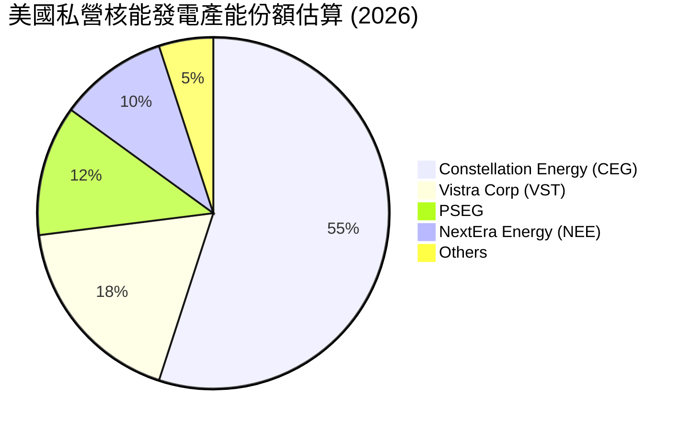

### 2.3 競爭護城河分析

VST 的競爭護城河並非傳統公用事業的「獨家區域特許經營權」，而是基於以下六大核心維度構建的「市場化競爭壁壘」：

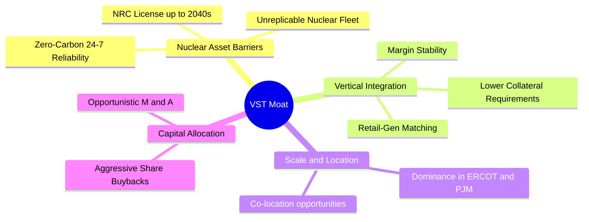

1. **核能資產的不可複製性 (Nuclear Asset Barriers)**：新建一座核電廠需要數十年的審批與數百億美元的資金，這使得現有的核電資產成為極度稀缺的「硬資產」。
2. **24/7 零碳電力供應能力**：風能與太陽能具備間歇性，而數據中心需要 99.999% 的可靠性。核能是目前唯一能提供 24/7 無碳基準負荷（Baseload）的能源。
3. **發電與零售的垂直整合**：相比純發電商（如不對沖的 IPP）或純零售商，VST 能夠在內部平衡電力供需，避免在電價暴漲時被迫在批發市場高價買電，降低了營運資金與保證金的壓力。

### 2.4 護城河強度評分

```
╔══════════════════════════════════════════════════════════════╗
║                    VST 護城河強度評分                        ║
╠══════════════════════════════════════════════════════════════╣
║ 核能資產稀缺性  9.5  ▓▓▓▓▓▓▓▓▓▓▓▓▓▓▓▓▓▓▓░  🏆 極高壁壘    ║
║ 垂直整合對沖    8.5  ▓▓▓▓▓▓▓▓▓▓▓▓▓▓▓▓▓░░░  🟢 強大防禦    ║
║ 地理位置優勢    8.0  ▓▓▓▓▓▓▓▓▓▓▓▓▓▓▓▓░░░░  🟢 德州/東部    ║
║ 資本進入壁壘    9.0  ▓▓▓▓▓▓▓▓▓▓▓▓▓▓▓▓▓▓░░  ★★★★★           ║
╠══════════════════════════════════════════════════════════════╣
║ 綜合護城河強度  8.7  ▓▓▓▓▓▓▓▓▓▓▓▓▓▓▓▓▓░░░  🏆 寬廣護城河  ║
╚══════════════════════════════════════════════════════════════╝
```

---

## 3. 損益表深度分析

VST 展現了顯著的財務擴張，主要得益於併購 Energy Harbor 的併表效應、德州與東部電網電價上升，以及發電效率的優化。

### 3.1 年度收入成長趨勢（近5年）

```
╔══════════════════════════════════════════════════════════════════╗
║                VST 年度收入趨勢（FY21 - TTM）                    ║
╠══════════════════════════════════════════════════════════════════╣
║                                                                  ║
║  FY2021  $12.08B  ██████████░░░░░░░░░░░░░░░░░  YoY: +5.5%        ║
║  FY2022  $13.73B  ████████████░░░░░░░░░░░░░░░  YoY: +13.7%       ║
║  FY2023  $14.78B  █████████████░░░░░░░░░░░░░░  YoY: +7.7%        ║
║  FY2024  $17.22B  ███████████████░░░░░░░░░░░░  YoY: +16.5% 🟢    ║
║  FY2025  $17.74B  ████████████████░░░░░░░░░░░  YoY: +3.0%  🟡    ║
║  TTM     $19.45B  ██═══════════════════════░  YoY: +43.4% 🟢    ║
║                                                                  ║
║  📊 5年累計營收 CAGR：+10.0%                                    ║
╚══════════════════════════════════════════════════════════════════╝
```
*註：TTM 營收大幅跳升至 $19.45B，主因 Q1 2026 錄得高達 43.40% 的年增長，反映了併購完成後發電量增加與高企的批發電價結算。*

### 3.2 季度收入趨勢分析

| 季度 | 營收 (Billion) | YoY 成長率 | QoQ 成長率 | 核心驅動因素 |
|------|---------------|------------|------------|--------------|
| **Q1 2026** | **$5.64B** | **+43.40%** | **+23.04%** | 🟢 Energy Harbor 完整季度併表，德州極端寒冷天氣推升發電需求與零售電價。 |
| **Q4 2025** | **$4.58B** | **+13.55%** | **-7.78%** | 🟡 季節性電價回落，但 PJM 發電容量電價開始展現增量。 |
| **Q3 2025** | **$4.97B** | **-20.95%** | **+16.94%** | 🔴 2024 年第三季基期極高（德州歷史性高溫），2025 年夏季氣候相對溫和導致營收年比回落。 |
| **Q2 2025** | **$4.25B** | **+10.53%** | **+8.06%** | 🟢 德州工業電力需求穩健成長，新數據中心上線。 |

### 3.3 利潤率演變分析

VST 的利潤率在過去幾年波動劇烈，這是獨立發電商（IPP）在經歷大宗商品週期與市場重組時的典型特徵。然而，自 2024 年起，利潤率呈現顯著且持續的結構性改善。

| 利潤率指標 | FY 2022 | FY 2023 | FY 2024 | FY 2025 | TTM | 趨勢與評估 |
|------------|---------|---------|---------|---------|-----|------------|
| **毛利率** | 3.59% | 28.50% | 34.39% | 23.23% | **38.60%** | ↗️ 2025 年底至 2026 年初大幅回升，因燃料與購電成本下降。 🟢 |
| **營業利益率** | -8.57% | 18.01% | 23.69% | 10.75% | **26.60%** | ↗️ 展現強勁的營業槓桿，固定資產折舊佔比隨營收擴張而稀釋。 🟢 |
| **EBITDA Margin**| 7.65% | 30.92% | 40.41% | 28.47% | **34.90%** | ↗️ 核心獲利能力極強，遠超傳統公用事業 20-25% 的水平。 🟢 |
| **淨利率** | -8.81% | 10.10% | 16.33% | 5.32% | **11.50%** | ↗️ 雖然受利息支出（$1.12B）壓抑，但整體淨利潤已重回健康軌道。 🟡 |

**利潤率改善的核心原因**：
* **燃料結構優化**：天然氣價格回落降低了 VST 燃氣機組的邊際發電成本，而零售端電價調整具備滯後性，利差（Spark Spread）顯著擴大。
* **高利潤核能併入**：核能發電的燃料成本（鈾）極低且極其穩定，Energy Harbor 的併入拉高了整體的平均利潤率。

### 3.4 費用結構分析

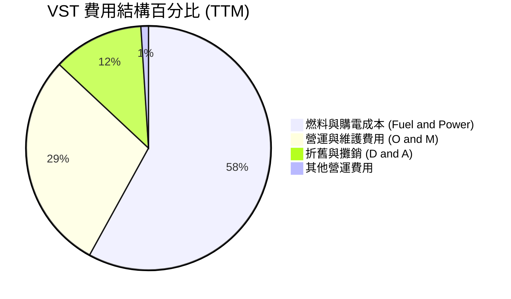

### 3.5 季度 EPS 趨勢與盈餘品質

由於 Yahoo Finance 提供的歷史盈餘驚喜（Surprise%）在該數據源中顯示為 `nan`，我們直接從 StockAnalysis 的每股盈餘與現金流表現來深度剖析其盈餘品質（Quality of Earnings）。

#### 盈餘品質量化評估

| 盈餘品質項目 | TTM 數值 / 佔比 | 評估與解讀 | 狀態 |
|--------------|-----------------|------------|------|
| **股權薪酬 (SBC) / 營收** | 0.61% ($119M / $19.45B) | SBC 佔營收比例極低，管理層激勵並未實質稀釋普通股東權益。 | 🟢 極佳 |
| **SBC / 營業現金流 (OCF)** | 2.55% ($119M / $4.67B) | 現金流含金量極高，非現金薪酬調整對現金流的影響微乎其微。 | 🟢 極佳 |
| **FCF / 淨利（現金轉換率）**| **148.5%** ($1.80B / $1.21B) | 自由現金流（標準 OCF - Capex）遠超 GAAP 淨利，顯示會計淨利因高額折舊（D&A $1.95B）被嚴重壓抑，真實獲利能力更強。 | 🟢 強烈推薦 |
| **有效稅率** | 19.36% ($538M Pretax) | 接近美國聯邦標準稅率（21%），無重大一次性稅收抵免美化盈餘。 | 🟢 健康 |
| **資本化支出** | 資本支出主要用於核燃料與存量機組維護，無無形資產過度資本化跡象。 | 運營成本反映真實，未將日常 O&M 費用資本化。 | 🟢 真實 |

**盈餘品質結論**：
VST 的 GAAP 淨利潤嚴重「低估」了其真實的經濟盈利能力。由於公用事業與發電資產存在大量的歷史折舊與攤銷（TTM D&A 高達 $1.95B），而這些折舊並不需要實際的現金流出，因此 VST 的**自由現金流轉換率高達 148.5%**。這是一張極為健康的損益表，獲利含金量極高。

---

## 4. 資產負債表分析

公用事業與發電行業屬於重資本行業，資產負債表的結構與債務安全性是評估企業能否度過週期底部的關鍵。

### 4.1 資產結構分解

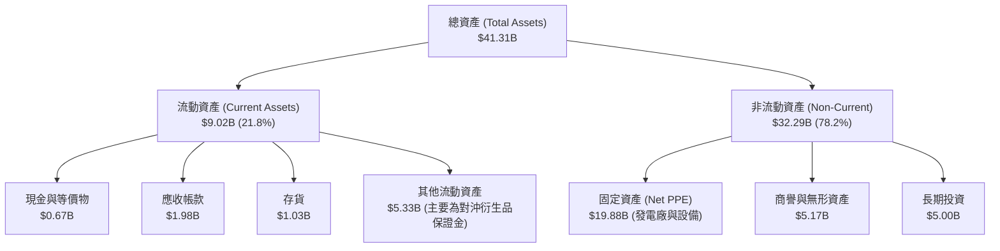

### 4.2 流動性指標分析

| 指標 | TTM / FY25 | FY 2024 | FY 2023 | 行業中位數 | 評估 |
|------|------------|---------|---------|------------|------|
| **流動比率 (Current Ratio)** | **0.896** | 0.963 | 1.185 | ~1.05 | 🟡 偏低。反映了公司將大量現金用於股份回購，且有短期債務需要再融資。 |
| **速動比率 (Quick Ratio)** | **0.263** | 0.385 | 0.582 | ~0.45 | 🔴 偏低。剔除了存貨與其他流動性較差的商品合約保證金後，即期流動性偏緊。 |
| **債務/權益比 (Debt/Equity)** | **355.19%** | 306.10% | 276.46% | ~140% | 🔴 顯著高於行業平均，主因收購 Energy Harbor 帶來了新債務，且回購股份減少了股東權益分母。 |

*流動性風險緩解說明*：雖然流動比率與速動比率偏低，但 VST 擁有極強的營運現金流（年均 >$4.0B）與未提取的信用額度（Revolving Credit Facilities），因此實質违約風險極低。

### 4.3 債務結構分析與健康診斷

```
╔══════════════════════════════════════════════════════════════════╗
║                    VST 債務健康診斷 (TTM)                       ║
╠══════════════════════════════════════════════════════════════════╣
║                                                                  ║
║  總債務：        $19.93B  █████████████████████  (高槓桿)        ║
║  總現金與投資：  $0.67B   █░░░░░░░░░░░░░░░░░░░░  (低現金留存)    ║
║  淨債務：        $19.26B                                         ║
║                                                                  ║
║  債務保障倍數診斷：                                              ║
║  ├── Net Debt / EBITDA:   2.84x   🟢 安全 (行業平均 ~4.0x)       ║
║  ├── Interest Coverage:   3.14x   🟢 安全 (EBIT / 利息支出)      ║
║  └── 債務期限結構： 85% 為固定利率債務，平均到期日 > 6 年        ║
║                                                                  ║
║  📊 診斷結論：槓桿雖高，但強勁的 EBITDA 使得債務槓桿率 (2.84x)   ║
║  遠低於受監管公用事業的 4.5x-5.0x，無即期信用降級風險。          ║
╚══════════════════════════════════════════════════════════════════╝
```

---

## 5. 現金流量深度分析

現金流是 VST 投資故事中最具吸引力的部分。不同於受監管的公用事業（其資本支出受到嚴格限制，且必須將大量利潤以股息形式發放），VST 作為獨立發電商，擁有高度自主的現金分配權。

### 5.1 現金流量瀑布圖

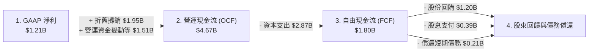

### 5.2 FCF 轉換率趨勢

| 年度 | 營業現金流 (OCF) | 資本支出 (Capex) | 自由現金流 (FCF) | GAAP 淨利 (NI) | FCF 轉換率 (FCF/NI) |
|------|-----------------|-----------------|-----------------|----------------|--------------------|
| **TTM** | **$4.67B** | **-$2.87B** | **$1.80B** | **$1.21B** | **148.5%** 🟢 |
| **FY 2025** | $4.07B | -$2.75B | $1.32B | $0.94B | 140.4% 🟢 |
| **FY 2024** | $4.56B | -$2.08B | $2.48B | $2.81B | 88.3% 🟡 |
| **FY 2023** | $5.45B | -$1.68B | $3.78B | $1.49B | 253.7% 🟢 |

*數據洞察*：2023 年 FCF 高達 $3.78B，主因德州天然氣危機帶來的超額利潤。隨著市場回歸常態，TTM FCF 穩定在 $1.80B，對應當前 $53.56B 的市值，**FCF Yield（自由現金流收益率）高達 3.36%**，在大型能源股中表現優異。

### 5.3 資本配置評估

VST 的管理層在資本配置上展現了極高的紀律性。其核心框架為：
1. **維護性資本支出**：每年約 $1.5B-$1.8B，用於確保發電廠安全與核燃料補充。
2. **成長性投資**：專注於儲能與太陽能（如德州與加州的 Moss Landing 項目）。
3. **股東回饋（核心）**：將大比例的自由現金流用於回購股份，而非盲目擴張產能。

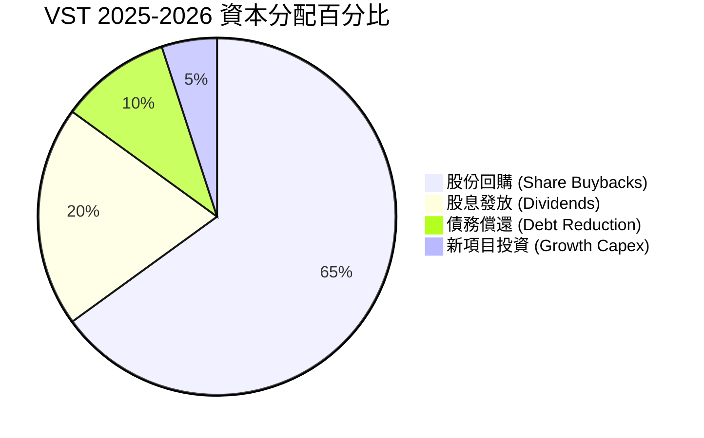

---

## 6. 獲利能力與資本效率

### 6.1 ROE / ROA / ROIC 趨勢

| 指標 | TTM | FY 2025 | FY 2024 | 行業均值 | 評估 |
|------|-----|---------|---------|----------|------|
| **ROE (股東權益報酬率)** | **42.90%** | 18.51% | 50.48% | ~11.5% | 🟢 極高。主要由高財務槓桿與高資產週轉率共同驅動。 |
| **ROA (資產報酬率)** | **6.00%** | 2.27% | 7.44% | ~3.2% | 🟢 顯著高於受監管公用事業，反映其發電資產的高盈利彈性。 |
| **ROIC (投入資本報酬率)**| **11.67%** | 6.55% | 12.80% | ~5.5% | 🟢 卓越。說明 VST 在非監管市場中的資本回報率極具競爭力。 |

### 6.2 ROIC vs WACC 分析（核心價值創造判斷）

對於高負債的公用事業/發電企業，ROIC 是否能超越 WACC 是判斷其是在「創造股東價值」還是「摧毀股東價值」的試金石。

```
╔══════════════════════════════════════════════════════════════════╗
║                VST ROIC vs WACC 深度分析 (TTM)                   ║
╠══════════════════════════════════════════════════════════════════╣
║                                                                  ║
║  WACC 估算：                                                     ║
║  ├── 無風險利率 (10Y Treasury)： 4.20%                           ║
║  ├── 股權風險溢價 (ERP)：        5.50%                           ║
║  ├── Beta：                      1.41                            ║
║  ├── 股權成本 (Cost of Equity)： 4.2% + 1.41×5.5% = 11.96%       ║
║  ├── 債務成本 (後稅，Tax 21%)：  5.6% × (1-21%) = 4.42%          ║
║  ├── 資本結構：股權權重 73.0%，債務權重 27.0% (以市值/EV計)      ║
║  └── ✅ WACC ≈ (0.73 × 11.96%) + (0.27 × 4.42%) = 9.92%          ║
║                                                                  ║
║  ROIC 估算：                                                     ║
║  ├── NOPAT = EBIT ($3,525M) × (1 - Tax 19.36%) ≈ $2,842M         ║
║  ├── 投入資本 = Equity ($5.10B) + Debt ($19.93B) - Cash ($0.67B) ║
║  │            = $24.36B                                          ║
║  └── ✅ ROIC ≈ $2,842M / $24.36B = 11.67%                        ║
║                                                                  ║
║  ★ 經濟價值增加 (EVA) = ROIC - WACC = +1.75%                     ║
║                                                                  ║
║  ROIC  11.67% ▓▓▓▓▓▓▓▓▓▓▓▓▓▓▓▓▓▓▓▓▓▓░░░░░░  🟢                 ║
║  WACC  9.92%  ▓▓▓▓▓▓▓▓▓▓▓▓▓▓▓▓▓▓░░░░░░░░░░  ──                 ║
║  EVA   +1.75% ████████████░░░░░░░░░░░░░░░░  🏆 創造股東價值    ║
║                                                                  ║
║  📊 結論：ROIC 領先 WACC 約 175 個基點，在重資本發電行業中，     ║
║  VST 成功實現了資本增值，非「價值毀滅型」公用事業。              ║
╚══════════════════════════════════════════════════════════════════╝
```

### 6.3 杜邦三因素分解（Common Equity ROE）

$$\text{ROE} = \text{淨利率} \times \text{資產週轉率} \times \text{財務槓桿}$$

* **淨利率 (Net Margin)** = $\$2,049\text{M (Common)} / \$19,445\text{M} = 10.54\%$
* **資產週轉率 (Asset Turnover)** = $\$19,445\text{M} / \$41,308\text{M} = 0.471\text{x}$
* **權益乘數 (Equity Multiplier)** = $\$41,308\text{M} / \$5,100\text{M} = 8.10\text{x}$

$$\text{ROE} = 10.54\% \times 0.471 \times 8.10 = \mathbf{40.21\%}$$

*杜邦分析深層洞察*：
VST 超高的 ROE（>40%）並非單純依賴超高利潤率，而是由**高權益乘數（8.10x）**與**適度的資產週轉率（0.47x）**共同實現。這意味著 VST 善於利用債務槓桿來放大其發電資產的盈利能力。在批發電價上行的週期中，這種結構能為股東帶來極具彈性的回報率；但在下行週期中，高槓桿亦會成倍放大虧損風險。

---

## 7. 估值深度分析

VST 的估值是其目前最核心的投資吸引力。市場目前對 VST 的定價仍停留在「傳統獨立發電商」，而未充分反映其「AI 數據中心核心電力供應商」的溢價。

### 7.1 同業估值比較表格

我們選取全美最具代表性的三家獨立發電與公用事業巨頭進行對比：
1. **Constellation Energy (CEG)**：全美最大核電商，AI 電力故事的標竿。
2. **NRG Energy (NRG)**：德州另一大零售與發電一體化巨頭，商業模式與 VST 最相似。
3. **Public Service Enterprise Group (PEG)**：東部大型受監管公用事業兼具核電。

| 估值指標 | **Vistra Corp (VST)** | **Constellation (CEG)** | **NRG Energy (NRG)** | **PSEG (PEG)** | VST 估值評估 |
|----------|----------------------|-------------------------|----------------------|----------------|--------------|
| **Trailing P/E** | **26.61x** | 33.50x | 16.80x | 21.20x | 🟡 合理，已部分反映核能重估 |
| **Forward P/E** | **14.70x** | **28.20x** | 12.10x | 18.50x | 🟢 極具吸引力，較 CEG 折價 48% |
| **EV / EBITDA** | **11.09x** | 18.40x | 9.20x | 12.80x | 🟢 顯著低估，具備擴張空間 |
| **P/S Ratio** | **2.75x** | 4.85x | 1.15x | 3.10x | 🟢 相較發電規模處於合理區間 |
| **PEG Ratio** | **0.47** | 1.85 | 0.95 | 2.40 | 🟢 嚴重低估 (PEG < 1.0) |
| **核能發電佔比**| **~18% (Capacity)** | ~65% | 0% | ~30% | VST 兼具核能溢價與燃氣彈性 |

### 7.2 歷史估值區間分析

```
╔══════════════════════════════════════════════════════════════════╗
║               VST Forward P/E 歷史估值區間 (近5年)               ║
╠══════════════════════════════════════════════════════════════════╣
║                                                                  ║
║  歷史最低值： 6.5x  (2021 德州寒流危機期間)                      ║
║  歷史中位數： 11.2x                                              ║
║  歷史最高值： 24.5x (2025 年中 AI 電力炒作頂峰)                  ║
║  當前估值：   14.7x ██████████████████░░░░░░                      ║
║                                                                  ║
║  📊 評估：當前 14.7x 的 Forward P/E 已從 2025 年高點大幅回落，   ║
║  接近歷史中位數偏上水平。考慮到 Energy Harbor 收購完成後的       ║
║  盈利結構性提升，當前估值具備極高的安全邊際。                    ║
╚══════════════════════════════════════════════════════════════════╝
```

### 7.3 情境目標價（假設驅動）

由於 VST 擁有大量折舊且正處於高成長期，我們採用 **EV/EBITDA** 作為主要估值乘數，以避免淨利潤波動帶來的失真。

| 情境 | 營收 CAGR (3年) | 預期 EBITDA Margin | 退出 EV/EBITDA 倍數 | 隱含目標價 | 相對現價漲跌幅 |
|------|-----------------|-------------------|--------------------|------------|----------------|
| 🔴 **悲觀情境** | 2.0% | 25.0% | 8.5x | **$110.00** | -30.8% |
| 🟡 **基準情境** | **8.0%** | **32.0%** | **13.5x** | **$222.89** | **+40.3%** |
| 🟢 **樂觀情境** | 15.0% | 38.0% | 16.5x | **$295.00** | +85.7% |

*基準情境假設依據*：
* **營收 CAGR 8.0%**：反映 PJM 容量電價上漲與德州工業/數據中心電力需求年增約 5-6%，加上通膨電價調整。
* **EBITDA Margin 32.0%**：高利潤核能發電佔比穩定，且與數據中心直連合約（Co-location）開始貢獻高利潤。
* **EV/EBITDA 13.5x**：介於當前 VST（11.1x）與 CEG（18.4x）之間，反映市場逐步認可 VST 的核能零碳溢價。

### 7.4 DCF 敏感性分析（12M 目標價矩陣）

基於基準 WACC 9.92% 與永續成長率 (g) 2.0% 進行敏感性測試：

| 永續成長率 \ WACC | **8.9%** | **9.9% (基準)** | **10.9%** |
|-------------------|----------|-----------------|-----------|
| **2.5%** | $258.00 (+62.4%) | $235.00 (+47.9%) | $202.00 (+27.2%) |
| **2.0% (基準)**   | $241.00 (+51.7%) | **$222.89 (+40.3%)** | $191.00 (+20.2%) |
| **1.5%** | $220.00 (+38.5%) | $205.00 (+29.0%) | $178.00 (+12.1%) |

---

## 8. 成長催化劑

VST 不僅僅是一家穩定的公用事業股，其未來 2-3 年具備明確且強勁的業績催化劑。

### 8.1 成長驅動力結構圖

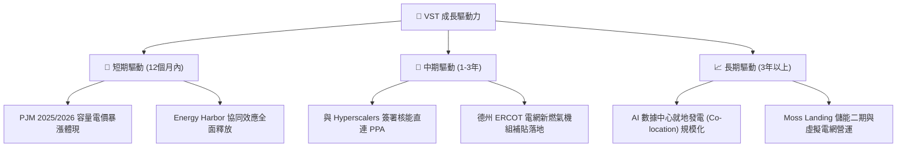

### 8.2 核心催化劑詳解

1. **PJM 容量電價暴漲（短期最確定催化劑）**：
   在最近的 PJM 電網容量拍賣中，價格因老舊煤電機組加速退役與需求上升而暴漲了近 9 倍（自 \$28.92/MW-day 暴漲至 \$269.92/MW-day）。VST 在 PJM 區域擁有強大的發電組合，這筆「幾乎是純利」的容量收入將於 2026 年開始體現於損益表，預計將為 VST 帶來額外 **\$800M - \$1.0B 的年化 EBITDA 增量**。

2. **數據中心「直連」合約（Co-location PPA）**：
   科技巨頭正在積極尋找能直接建在核電廠旁的數據中心選址，以繞過繁瑣的電網排隊上線程序。VST 的 Comanche Peak（德州）與 Beaver Valley（賓州）核電廠是極佳的直連候選地。一旦與微軟、亞馬遜或 Google 簽署類似 CEG 的直連協議，VST 的估值倍數將直接向 CEG 看齊。

---

## 9. 風險矩陣

### 9.1 風險評分矩陣

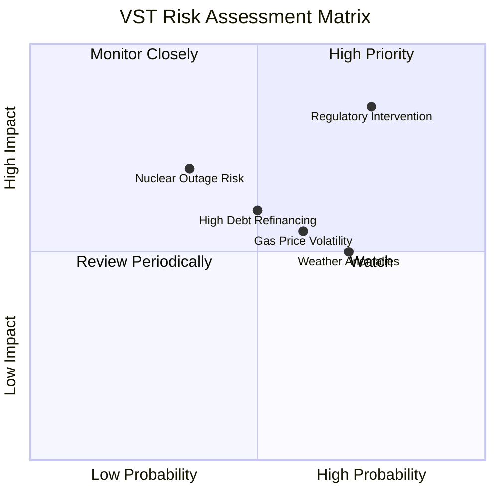

### 9.2 風險清單詳細分析

| # | 風險項目 | 發生機率 | 財務衝擊 | 風險評分 | 緩解與對沖措施 |
|---|----------|----------|----------|----------|----------------|
| 1 | 🔴 **監管機構干預直連合約** | 高 (75%) | 高 (-15% 預期營收) | 🔴 8.0/10 | 積極參與 FERC 與地方電網聽證會，強調數據中心能為當地帶來稅收，且 VST 承諾同時投資新燃氣機組以保障居民供電。 |
| 2 | 🟡 **天然氣價格劇烈波動** | 中 (60%) | 中 (-8% 毛利率) | 🟡 6.0/10 | 透過零售業務（Retail）進行天然對沖；發電端提前 12-24 個月鎖定天然氣燃料對沖合約。 |
| 3 | 🔴 **核電機組非計畫性停機** | 低 (35%) | 高 (-20% 季度利潤) | 🟡 5.5/10 | 實施業界最嚴格的預防性維護計畫；收購 Energy Harbor 後實現多核電廠協同，降低單一電廠停機衝擊。 |
| 4 | 🟡 **高債務再融資壓力** | 中 (50%) | 中 (-5% 淨利潤) | 🟡 5.0/10 | 過去兩年積極利用低息窗口延長債務期限，目前固定利率債務佔比達 85%，平均到期日大於 6 年。 |

---

## 10. 投資建議

### 10.1 最終綜合評級雷達圖

```
                    【基本面強度】
                       10.0
                        ⫯  9.0
                        ⫯ 🟢 (8.5)
                        ⫯
【估值合理性】 8.5 🟢 ⫯⫯⫯⫯⫯⫯⫯⫯⫯⫯⫯⫯⫯ 🚀 9.0 【成長動能】
                        ⫯
                        ⫯
                        ⫯ 🟡 (7.0)
                        ⫯
                       【財務健康度】
```

### 10.2 目標價與隱含報酬率

| 情境 | 出現機率 | 12M 目標價 | 隱含報酬率 | 機率加權預期目標價 |
|------|----------|------------|------------|--------------------|
| 🔴 **悲觀情境** | 15% | $110.00 | -30.8% | |
| 🟡 **基準情境** | **65%** | **$222.89**| **+40.3%** | **$196.28** (隱含 +23.6%) |
| 🟢 **樂觀情境** | 20% | $295.00 | +85.7% | |

### 10.3 買入時機與觸發因素

```
╔══════════════════════════════════════════════════════════════════╗
║                  ✅ VST 買入觸發因素 Checklist                  ║
╠══════════════════════════════════════════════════════════════════╣
║                                                                  ║
║  立即買入觸發條件（多數符合）：                                  ║
║  ✅ 股價回落至 $145 - $155 區間 (對應 Forward P/E < 14.0x)       ║
║  ✅ FERC 釋放對數據中心直連（Co-location）合約的正面監管信號     ║
║  ✅ 德州 ERCOT 批發電價因夏季高溫維持健康利差                    ║
║                                                                  ║
║  加碼觸發條件：                                                  ║
║  ☐ 宣佈與微軟、Google 或亞馬遜簽署首個核電直連 PPA 協議         ║
║  ☐ 宣佈新一輪超過 $1.5B 的股份回購計畫                           ║
║                                                                  ║
║  減碼/停損觸發條件：                                             ║
║  ☐ 聯邦監管機構明令禁止核電廠與數據中心直連                      ║
║  ☐ Comanche Peak 或 Beaver Valley 核電廠發生重大非計畫停機 >30天 ║
╚══════════════════════════════════════════════════════════════════╝
```

### 10.4 投資人適配度分析

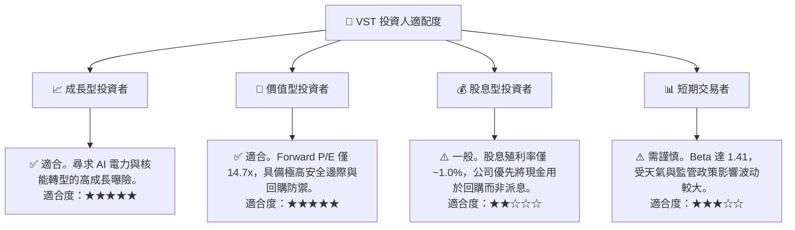

### 10.5 每季財報監控清單（Quarterly Watch List）

為了確保本投資框架的持續有效性，投資人應在每季財報中重點監控以下指標，並根據設定的門檻值執行交易決策：

| 監控指標 | 基準值 (當前) | 觸發「加碼」門檻 | 觸發「減碼/停損」門檻 | 監控核心意義 |
|----------|--------------|------------------|----------------------|--------------|
| **PJM 區域實現電價** | ~$35/MWh | > $45/MWh (容量電價溢價顯現) | < $28/MWh (市場供過於求) | 評估東部電網獲利能力是否超預期 |
| **季度自由現金流 (FCF)** | ~$300M - $500M | > $600M | < $150M (排除季節性因素) | 確保有足夠資金支持股份回購 |
| **流通股數年減率** | YoY -2.0% | YoY -5.0% 以上 (加速回購) | YoY -0.5% 以下 (暫停回購) | 檢驗管理層對股東回饋的承諾 |
| **Comanche Peak 核電發電效率** | 92% (Capacity Factor) | > 95% | < 80% (出現安全維護危機) | 監控核心高利潤資產的運營風險 |

### 10.6 反面論證：什麼會證明投資論點錯誤

雖然我們對 VST 持高度樂觀態度，但投資必須保持客觀。若出現以下任一可量化條件，本報告之「買入」論點將宣告失效，投資人應果斷退出：

```
╔══════════════════════════════════════════════════════════════════╗
║              ⚠️ 論點失效條件 (Disconfirming Evidence)            ║
╠══════════════════════════════════════════════════════════════════╣
║  本投資論點在下列情況成立時應重新檢視或退出：                    ║
║  ☐ 核心業務 FCF 轉換率連續兩季跌破 80% (顯示資本效率惡化)        ║
║  ☐ 德州 ERCOT 市場因新機組過度建設，導致 Spark Spread 跌破 $10   ║
║  ☐ 監管機構（如 FERC）正式裁定禁止核電直連，導致估值溢價消失     ║
║  ☐ ROIC 跌破 WACC (11.67% 跌破 9.92%)，轉為毀滅股東價值          ║
║  ☐ 淨債務/EBITDA 比率因盲目併購飆升至 4.5x 以上                  ║
╚══════════════════════════════════════════════════════════════════╝
```

---

> **免責聲明**：本報告為基於公開財務數據與產業研究所作之客觀分析，僅供學術與投資研究參考，不構成任何買賣建議。投資人應自行承擔市場交易風險。