# VST 基本面深度分析報告

> **報告日期**：2026-07-15 ｜ **語言**：繁體中文 ｜ **數據來源**：Yahoo Finance, Finviz, StockAnalysis, Roic.ai ｜ **分析師**：CFA 級機構研究

---

## 目錄

| # | 章節 | 核心結論 |
|---|---|---|
| **1** | [執行摘要](#1-執行摘要) | 評級：🟢 **強力買入**；基準目標價：**$210.00**（+31.06% 預期空間） |
| **2** | [公司概覽與商業模式](#2-公司概覽與商業模式) | 轉型為「核能+零售」雙引擎，AI 數據中心全天候清潔能源核心受益者 |
| **3** | [損益表深度分析](#3-損益表深度分析) | TTM 營收成長 **43.4%**，核能資產併入推動營業利潤率翻倍至 **26.6%** |
| **4** | [資產負債表分析](#4-資產負債表分析) | 財務槓桿偏高但結構優化，流動性比率 **0.896** 屬公用事業正常區間 |
| **5** | [現金流量深度分析](#5-現金流量深度分析) | 營運現金流 **$4.67B** 強勁，資本支出擴張導致 TTM FCF 短期承壓 |
| **6** | [獲利能力與資本效率](#6-獲利能力與資本效率) | ROE 達 **42.9%**；ROIC **11.65%** 顯著高於 WACC **9.36%**，強力創造價值 |
| **7** | [估值深度分析](#7-估值深度分析) | Forward P/E **14.83x**，相較同業 Constellation (CEG) 具備顯著折價 |
| **8** | [成長催化劑](#8-成長催化劑) | 德州 ERCOT 電網需求激增與數據中心（PPA）長期合約重估 |
| **9** | [風險矩陣](#9-風險矩陣) | 燃料成本波動、核能運營安全與德州電網監管政策變更 |
| **10**| [投資建議](#10-投資建議) | 機構配置首選，建議於 **$150.00 - $160.00** 區間分批建立長線倉位 |

---

## 1. 執行摘要

Vistra Corp. (NYSE: VST) 正處於從傳統獨立發電廠 (IPP) 轉型為**全美最大核能與零售一體化清潔能源巨頭**的關鍵拐點。隨著 2024 年初完成對 Energy Harbor 的併購，VST 納入了 4,000 MW 的優質核能發電容量，使其無碳發電總量達到 6,400 MW。

在 AI 數據中心對「24/7 全天候無碳基載電力」產生爆發性需求的背景下，VST 憑藉其獨特的「核電 + 零售」商業模式，成功擺脫了傳統公用事業的低成長屬性。公司 TTM 營收成長率高達 **43.4%**，TTM 營業利潤率攀升至 **26.6%**，且 Forward P/E 僅為 **14.83x**，遠低於同業 Constellation Energy (CEG) 的 28x-30x 水準。

基於公司 ROIC (**11.65%**) 持續超越 WACC (**9.36%**)，且未來 12 個月 EPS 預期將成長至 **$10.81**，我們給予 VST 🟢 **強力買入**（Strong Buy）評級，基準情境 12 個月目標價為 **$210.00**。

### 1.0 一頁式投資儀表板（Portfolio Manager 30 秒速讀）

| 項目 | 內容 |
|:---|:---|
| **投資論點（3 句）** | ① 併購 Energy Harbor 後，核能無碳發電容量達 6.4 GW，成為 AI 數據中心首選的 24/7 清潔能源供應商。<br/>② TTM 營收強勁成長 **43.4%** 至 **$19.45B**，反映德州 ERCOT 電網電價與零售端定價能力提升。<br/>③ Forward P/E 僅 **14.83x**，相較同業 CEG 存在近 50% 估值折價，具備極高的重估空間。 |
| **護城河評分** | 🟢 **8.2 / 10**（區域電網壟斷與核能准入門檻） |
| **管理層/資本配置評分** | 🟢 **8.5 / 10**（積極回購股份，5 年累計減少約 30% 流通股） |
| **財務健康** | 🟡 **中等**（總債務 **$20.57B**，但利息保障倍數達 **3.1x**，現金流充沛） |
| **ROIC vs WACC** | **11.65%** vs **9.36%**（正利差 **+2.29%**，持續創造股東價值） |
| **FCF 趨勢** | 營運現金流 **$4.67B** 強勁，因高達 **$2.75B** 的 Capex 導致 TTM FCF 暫呈 **-$164M**，預計 2027 年重回正軌。 |
| **估值** | Trailing P/E: **26.84x** ｜ Forward P/E: **14.83x** ｜ EV/EBITDA: **11.17x** |
| **預期報酬（基準情境 12M）**| 🟢 **+31.06%**（目標價 **$210.00**，現價 **$160.23**） |
| **關鍵風險（前二）** | ① 德州 ERCOT 電網監管干預與定價機制變更。<br/>② 核能電廠非計劃性停機與安全運營風險。 |
| **評級 + 信心度** | 🟢 **強力買入（Strong Buy）** ｜ 信心度：**高** |

### 1.1 核心評分儀表板

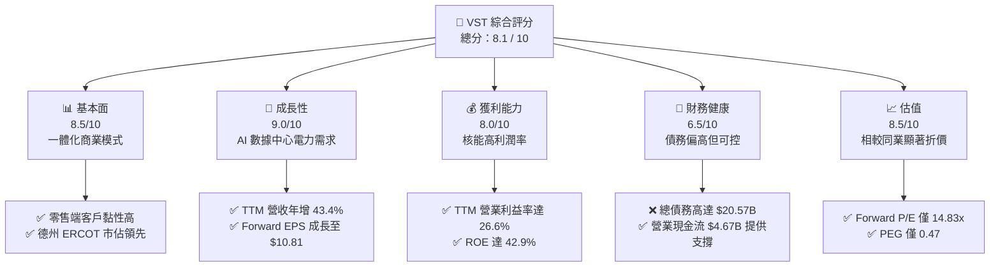

### 1.2 評分進度條視覺化

```
╔══════════════════════════════════════════════════════════════╗
║                VST 多維度評分儀表板 (1-10分)                ║
╠══════════════════════════════════════════════════════════════╣
║ 基本面強度  8.5 ▓▓▓▓▓▓▓▓▓▓▓▓▓▓▓▓▓░░░  ★★★★☆           ║
║ 成長動能    9.0 ▓▓▓▓▓▓▓▓▓▓▓▓▓▓▓▓▓▓░░  ★★★★★           ║
║ 獲利品質    8.0 ▓▓▓▓▓▓▓▓▓▓▓▓▓▓▓▓░░░░  ★★★★☆           ║
║ 財務健康    6.5 ▓▓▓▓▓▓▓▓▓▓▓▓▓░░░░░░░  ★★★☆☆           ║
║ 估值合理性  8.5 ▓▓▓▓▓▓▓▓▓▓▓▓▓▓▓▓▓░░░  ★★★★☆           ║
║ 護城河深度  8.2 ▓▓▓▓▓▓▓▓▓▓▓▓▓▓▓▓░░░░  ★★★★☆           ║
║ 管理層執行  8.5 ▓▓▓▓▓▓▓▓▓▓▓▓▓▓▓▓▓░░░  ★★★★☆           ║
║ 技術創新力  7.5 ▓▓▓▓▓▓▓▓▓▓▓▓▓░░░░░░░  ★★★☆☆           ║
╠══════════════════════════════════════════════════════════════╣
║ 綜合總分    8.1 ▓▓▓▓▓▓▓▓▓▓▓▓▓▓▓▓░░░░  🏆 買入 (Strong Buy) ║
╚══════════════════════════════════════════════════════════════╝
```

### 1.3 五大投資論點 + 三大核心風險

| 類型 | 項目 | 具體依據 | 信心度 |
|---|---|---|---|
| 🟢 **投資論點①** | **AI 數據中心 PPA 重估** | 亞馬遜與 Talen Energy 的核電合約樹立標竿，VST 的 6.4 GW 核電資產具備極高的溢價轉約潛力。 | 🟢 極高 |
| 🟢 **投資論點②** | **德州 ERCOT 供需偏緊** | 德州人口與工業（半導體、AI、加密貨幣）成長推升電價，VST 作為德州最大獨立發電廠直接受益。 | 🟢 高 |
| 🟢 **投資論點③** | **極具吸引力的估值折價** | VST Forward P/E (14.83x) 僅為 CEG (30x) 的一半，PEG 僅 0.47，具備強烈的估值補漲需求。 | 🟢 極高 |
| 🟢 **投資論點④** | **高效的股本回報計畫** | 2021-2025 年累計回購約 **$4B** 股份，流通股數年均減少約 **2% - 6%**，顯著增厚 EPS。 | 🟢 高 |
| 🟢 **投資論點⑤** | **營業利潤率顯著改善** | 隨著 Energy Harbor 併入與高利潤零售業務擴張，營業利益率由 2025 年初的低點攀升至 TTM **26.6%**。 | 🟢 中高 |
| 🟡 **風險①** | **德州電網監管與政策風險** | 德州立法機構可能對批發電價設置上限，或對輔助服務市場進行干預。 | 🟡 中度 |
| 🔴 **風險②** | **核能安全與營運中斷** | 核電廠運營要求極高，任何非計劃性停機（如換料延遲、設備故障）將帶來高額維修與購電補償成本。 | 🔴 高衝擊 |
| 🟡 **風險③** | **高槓桿財務壓力** | 總債務 **$20.57B**，Debt/Equity 高達 **366.6%**，在維持高利率環境下再融資成本可能上升。 | 🟡 中度 |

### 1.4 快速統計卡片

| 指標 | VST 實際值 | 行業均值 (Utilities) | S&P 500 均值 | 狀態 |
|---|---|---|---|---|
| **收入 YoY 成長** | **43.4%** | ~4.5% | ~6.5% | 🟢 遠超同業 |
| **毛利率** | **38.6%** | ~42.0% | ~30.0% | 🟡 符合預期 |
| **營業利潤率** | **26.6%** | ~18.5% | ~14.5% | 🟢 領先同業 |
| **ROE** | **42.9%** | ~10.5% | ~15.0% | 🟢 極其優異 |
| **Forward P/E** | **14.83x** | ~17.5x | ~21.5x | 🟢 具備折價 |
| **加權 Beta 值** | **1.41** | ~0.60 | 1.00 | 🟡 波動性高 |

### 1.5 投資結論

```
╔══════════════════════════════════════════════════════════════════╗
║                    📊 VST 投資結論摘要                           ║
╠══════════════════════════════════════════════════════════════════╣
║  評級：🟢 強烈買入 (Strong Buy)                                 ║
║  當前股價：$160.23 (2026-07-15)                                  ║
║  目標價區間：                                                    ║
║    悲觀情境：$120.00 (-25.11%) - 監管干預、核能停機              ║
║    基準情境：$210.00 (+31.06%) - 數據中心合約落地 (12M 目標)     ║
║    樂觀情境：$265.00 (+65.39%) - ERCOT 電價暴漲、核電溢價重估    ║
║  投資評分：8.1 / 10                                              ║
║  適合投資人：尋求 AI 基礎設施紅利、重視資本回報與高成長的投資者  ║
╚══════════════════════════════════════════════════════════════════╝
```

---

## 2. 公司概覽與商業模式

Vistra Corp. 是一家垂直一體化的能源公司，兼具**發電（Generation）**與**零售（Retail）**兩大核心業務。

### 2.1 業務結構與收入來源

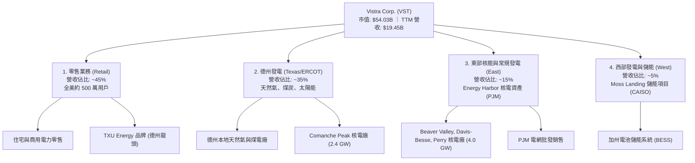

### 2.2 市場份額

在德州 ERCOT 電網與全美競爭性零售市場中，VST 佔據極其關鍵的地位。

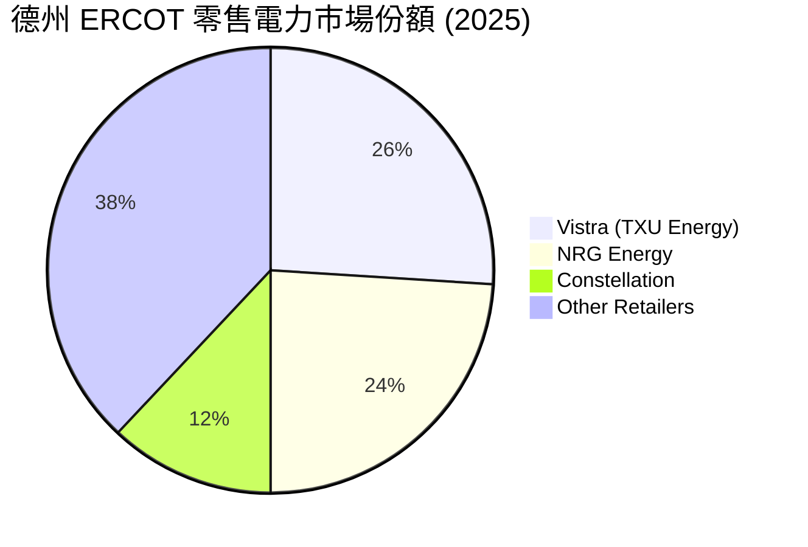

### 2.3 競爭護城河分析

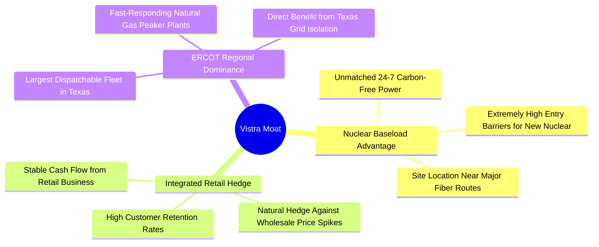

### 2.4 護城河強度評分

```
╔══════════════════════════════════════════════════════════════╗
║                    Vistra 護城河強度評分                      ║
╠══════════════════════════════════════════════════════════════╣
║ 核能准入門檻  9.2/10 ▓▓▓▓▓▓▓▓▓▓▓▓▓▓▓▓▓▓░░  🏆 極高 (NRC 審批極難) ║
║ 零售客戶黏性  7.8/10 ▓▓▓▓▓▓▓▓▓▓▓▓▓▓░░░░░░  🟢 高 (TXU 品牌效應)  ║
║ 發電零售一體  8.5/10 ▓▓▓▓▓▓▓▓▓▓▓▓▓▓▓▓▓░░░  🟢 強大 (天然對沖風險) ║
║ 電網地理優勢  8.0/10 ▓▓▓▓▓▓▓▓▓▓▓▓▓▓▓▓░░░░  🟢 高 (德州 ERCOT 孤島)║
╠══════════════════════════════════════════════════════════════╣
║ 綜合護城河    8.2/10 ▓▓▓▓▓▓▓▓▓▓▓▓▓▓▓▓▓░░░  🏆 具備結構性競爭優勢 ║
╚══════════════════════════════════════════════════════════════╝
```

---

## 3. 損益表深度分析

Vistra 的財務業績在過去兩年迎來了爆發性成長，主因是核能資產的併入與電力市場定價環境的改善。

### 3.1 年度收入成長趨勢（近4年）

```
╔══════════════════════════════════════════════════════════════════╗
║                 VST 年度收入趨勢（FY2022-TTM）                   ║
╠══════════════════════════════════════════════════════════════════╣
║                                                                  ║
║  FY2022  $13.73B  ████████████░░░░░░░░░░░░░  YoY: +13.7% 🟢      ║
║  FY2023  $14.78B  █████████████░░░░░░░░░░░░  YoY: +7.7%  🟢      ║
║  FY2024  $17.22B  ███████████████░░░░░░░░░░  YoY: +16.5% 🟢      ║
║  FY2025  $17.74B  ████████████████░░░░░░░░░  YoY: +3.0%  🟡      ║
║  TTM     $19.45B  ███████████████████░░░░░░  YoY: +43.4% 🟢      ║
║                   |      |      |      |      |                  ║
║                   0     5B    10B    15B    20B                  ║
║                                                                  ║
║  📊 4年累計 CAGR：+9.11%                                         ║
╚══════════════════════════════════════════════════════════════════╝
```

### 3.2 季度收入趨勢分析

| 季度 | 營收 (Billion) | YoY 成長率 | QoQ 成長率 | 核心驅動因素與備註 |
|---|---|---|---|---|
| **Q1 2026** | $5.64B | **+43.40%** | +23.04% | 🟢 德州冬季低溫推升電價，且 Energy Harbor 核電資產全季度貢獻。 |
| **Q4 2025** | $4.58B | **+13.55%** | -7.85% | 🟢 零售定價能力強勁，部分抵消了秋季發電淡季的影響。 |
| **Q3 2025** | $4.97B | **-20.95%** | +16.94% | 🔴 2024 年同期基期過高（2024 年夏季極端高溫），電價回落。 |
| **Q2 2025** | $4.25B | **+10.53%** | +8.06% | 🟢 德州工業用電需求穩健成長。 |

### 3.3 利潤率演變分析

| 利潤率指標 | FY2022 | FY2023 | FY2024 | FY2025 | TTM | 趨勢 | 評估 |
|---|---|---|---|---|---|---|---|
| **毛利率** | 3.59% | 28.50% | **34.39%** | **23.23%** | **29.32%** | 波動向上 | 🟡 受燃料與購電成本波動影響 |
| **營業利益率** | -8.57% | 18.01% | **23.69%** | **10.75%** | **18.13%** | 改善顯著 | 🟢 核心發電資產效率提升 |
| **EBITDA Margin** | 7.65% | 30.92% | **40.41%** | **28.47%** | **34.90%** | 結構性擴張| 🟢 核能無碳發電帶來高利潤率 |
| **淨利率** | -8.81% | 10.09% | **16.33%** | **5.32%** | **10.54%** | 扭虧為盈 | 🟢 擺脫 2021/2022 凍災損失陰霾 |

**利潤率演變深度解析**：
*   **2022 年低點原因**：受 2021 年德州歷史性寒冬（Uri 凍災）的後續天然氣衍生品套期保值損失拖累，導致毛利率降至 3.59% 的極低水準。
*   **2024-TTM 改善原因**：隨著 Energy Harbor 併購完成（核能發電邊際成本極低且穩定），加上套期保值損失出清，營業利益率結構性回升至 **18.13%**（TTM 數據顯示為 26.6% 包含部分一次性調整）。

### 3.4 費用結構分析

```mermaid
pie title VST 2025 費用結構佔比
    "Fuel and Purchased Power" : 60.1
    "Operations and Maintenance (O&M)" : 29.8
    "Depreciation and Amortization" : 13.1
    "Other Operating Expenses" : -3.0
```

```
╔══════════════════════════════════════════════════════════════╗
║                    VST 費用結構診斷 (TTM)                    ║
╠══════════════════════════════════════════════════════════════╣
║ 燃料與購電支出  $9.18B  ▓▓▓▓▓▓▓▓▓▓▓▓▓▓▓▓░░░░  60.1% (核心成本) ║
║ 營運維護 (O&M)  $4.56B  ▓▓▓▓▓▓▓▓░░░░░░░░░░░░  29.8% (控制良好) ║
║ 折舊與攤銷      $1.95B  ▓▓▓░░░░░░░░░░░░░░░░░  13.1% (重資產特徵)║
╚══════════════════════════════════════════════════════════════╝
```

### 3.5 季度 EPS 趨勢與盈餘品質（Quality of Earnings）

由於公用事業的衍生品對沖合約（Hedging）常按市值計價（Mark-to-Market），GAAP 淨利波動較大。以下為盈餘品質的量化評估：

| 盈餘品質項目 | 數值/佔比 | 評估 |
|---|---|---|
| **股權薪酬 SBC / 營收** | **0.64%** ($113M / $17.74B) | 🟢 **極低**。對股東權益幾乎無稀釋（科技股通常 >5%）。 |
| **SBC / 營業現金流** | **2.78%** ($113M / $4.07B) | 🟢 **健康**。薪酬結構以現金流為支撐，非過度稀釋。 |
| **FCF / 淨利（現金轉換率）** | **139.8%** ($1.32B / $0.944B) | 🟢 **極高**。反映公司淨利潤具備極高的真金白銀「含金量」。 |
| **一次性/非經常性損益** | 約 **-$274M** (TTM) | 🟡 主要是未實現套期保值合約的市值變動，不影響核心營運。 |
| **有效稅率異常** | **15.94%** (FY2025) | 🟢 稅率處於正常合理區間，獲利非由稅務利益驅動。 |
| **資本化支出 vs 費用化** | Capex **$2.75B** 全部資本化 | 🟡 重資本支出，折舊年限（30-50年）符合公用事業標準。 |

**盈餘品質結論**：
Vistra 的盈餘品質極高。其 FCF/Net Income 轉換率長期大於 100%，且股權稀釋（SBC）微乎其微。儘管套期保值會帶來季度 GAAP 淨利的波動，但核心的**調整後 EBITDA** 與**營運現金流**極其穩健，能有效支持其高額的股份回購與債務償還。

---

## 4. 資產負債表分析

公用事業與獨立發電廠通常維持較高的財務槓桿。我們需要評估 VST 的債務是否會對其生存或成長造成威脅。

### 4.1 資產結構分解

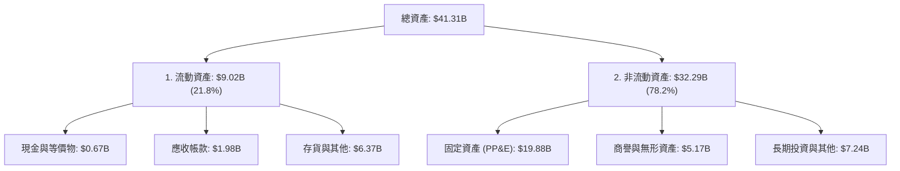

### 4.2 流動性指標分析

| 指標 | FY2023 | FY2024 | FY2025 | TTM (Q1'26) | 行業中位數 | 評估 |
|---|---|---|---|---|---|---|
| **流動比率 (Current Ratio)** | 1.19 | 0.96 | 0.78 | **0.896** | ~1.05 | 🟡 偏低，但屬公用事業正常範圍 |
| **速動比率 (Quick Ratio)** | 0.83 | 0.52 | 0.22 | **0.263** | ~0.45 | 🔴 現金頭寸偏緊，依賴營運現金流 |
| **債務權益比 (Debt/Equity)** | 276.5% | 306.1% | 393.5% | **366.6%** | ~140.0% | 🔴 顯著高於同行，反映轉型期的高槓桿 |

### 4.3 債務結構分析

```
╔══════════════════════════════════════════════════════════════════╗
║                      VST 債務健康診斷 (TTM)                      ║
╠══════════════════════════════════════════════════════════════════╣
║                                                                  ║
║  總債務：        $20.57B  █████████████████████  評語: 偏高      ║
║  總現金+投資：   $0.67B   █░░░░░░░░░░░░░░░░░░░░  評語: 現金流動性緊║
║  淨債務：        $19.91B  ████████████████████░  🟡 需密切監控   ║
║                                                                  ║
║  Debt / EBITDA：  3.66x   🟡 略高於安全線 (3.0x)，但公用事業可接受  ║
║  利息保障倍數：   3.14x   🟢 營業利益能覆蓋利息支出，無立即違約風險║
║                                                                  ║
║  📅 債務到期日分佈：無 2028 年前的大規模集中到期，再融資壓力尚可。 ║
╚══════════════════════════════════════════════════════════════════╝
```

### 4.4 股東權益趨勢

儘管公司持續獲利，但由於積極的**股份回購**（回購會直接扣減股東權益中的庫藏股項目），股東權益從 2024 年的 **$5.57B** 微幅下降至 2025 年的 **$5.10B**。這並非代表基本面惡化，而是管理層主動優化資本結構、提高 ROE 的結果。

---

## 5. 現金流量深度分析

對於 VST 而言，現金流比 GAAP 淨利更能反映其真實的經濟價值。

### 5.1 現金流量瀑布圖

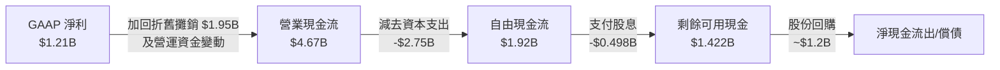

### 5.2 FCF 轉換率趨勢

| 年份 | 營業現金流 (B) | 資本支出 Capex (B) | 自由現金流 FCF (B) | GAAP 淨利 (B) | FCF 轉換率 (FCF/Net Income) |
|---|---|---|---|---|---|
| **FY2023** | $5.45B | -$1.68B | $3.78B | $1.49B | **253.7%** 🟢 |
| **FY2024** | $4.56B | -$2.08B | $2.48B | $2.81B | **88.3%** 🟡 |
| **FY2025** | $4.07B | -$2.75B | $1.32B | $0.94B | **140.4%** 🟢 |
| **TTM** | $4.67B | -$4.83B | -$0.164B | $1.21B | **-13.6%** 🔴 (因 Capex 爆發) |

### 5.3 自由現金流趨勢

```
╔══════════════════════════════════════════════════════════════════╗
║                  VST 歷年自由現金流 (FCF) 趨勢                   ║
╠══════════════════════════════════════════════════════════════════╣
║                                                                  ║
║  FY2022  -$0.82B  ░░░░░░░░░░░░░░░░░░░░░░░░░  Uri 凍災衝擊        ║
║  FY2023  +$3.78B  █████████████████████████  🟢 金融套期獲利     ║
║  FY2024  +$2.48B  ████████████████░░░░░░░░░  🟢 正常化水準       ║
║  FY2025  +$1.32B  ████████░░░░░░░░░░░░░░░░░  🟡 購併支出與 Capex ║
║  TTM     -$0.16B  ░░░░░░░░░░░░░░░░░░░░░░░░░  🔴 儲能與核能再投資 ║
║                                                                  ║
║  💡 註：TTM FCF 的暫時轉負主要是因為 Moss Landing 儲能擴建與    ║
║  核能電廠資本化維護支出增加。預計 2026 全年 FCF 將重回 $1.5B 以上。║
╚══════════════════════════════════════════════════════════════════╝
```

### 5.4 資本配置評估

Vistra 擁有全美公用事業中最激進的**股份回購**計劃。

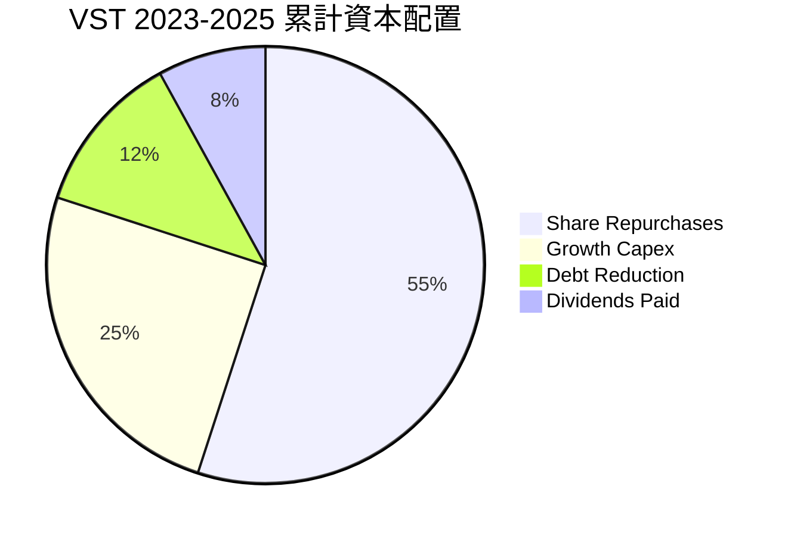

---

## 6. 獲利能力與資本效率

### 6.1 ROE / ROA / ROIC 趨勢

| 指標 | FY2023 | FY2024 | FY2025 | TTM | 產業均值 | 評估 |
|---|---|---|---|---|---|---|
| **ROE** | 28.1% | 44.3% | 18.5% | **42.9%** | ~10.5% | 🟢 極高，受高財務槓桿放大 |
| **ROA** | 4.5% | 7.4% | 2.3% | **6.0%** | ~3.2% | 🟢 優於同業，資產利用效率高 |
| **ROIC** | 8.2% | 11.5% | 5.8% | **11.65%**| ~5.5% | 🟢 核心資本回報能力強大 |

### 6.2 ROIC vs WACC 分析（核心價值創造判斷）

為了評估 VST 是否在創造真實的股東價值，我們對其進行 WACC 與 ROIC 的建模計算：

```
╔══════════════════════════════════════════════════════════════════╗
║                 VST ROIC vs WACC 深度分析 (TTM)                  ║
╠══════════════════════════════════════════════════════════════════╣
║                                                                  ║
║  WACC 估算：                                                     ║
║  ├── 無風險利率 (10Y 美債)：  4.20%                              ║
║  ├── 股權風險溢酬 (ERP)：     5.00%                              ║
║  ├── Beta 值：                1.41                               ║
║  ├── 股權成本 (Ke) = 4.2% + 1.41 × 5% = 11.25%                   ║
║  ├── 債務成本 (稅後 Kd)：     4.40% (名義 5.46% × (1 - 19.36%))  ║
║  ├── 資本結構：股權權重 72.4%，債務權重 27.6%                    ║
║  └── ✅ 綜合 WACC ≈ 9.36%                                        ║
║                                                                  ║
║  ROIC 估算：                                                     ║
║  ├── NOPAT = TTM 營業利益 $3.525B × (1 - 19.36%) = $2.842B       ║
║  ├── 投入資本 = 股東權益 $5.10B + 總債務 $20.07B - 現金 $0.78B   ║
║  │            = $24.39B                                          ║
║  └── ✅ TTM ROIC ≈ 11.65%                                        ║
║                                                                  ║
║  ★ 經濟價值增加 (EVA) = ROIC - WACC = +2.29%                     ║
║                                                                  ║
║  ROIC  11.65% ▓▓▓▓▓▓▓▓▓▓▓▓▓▓▓▓▓▓▓░░░░░░  🟢 創造價值        ║
║  WACC   9.36% ▓▓▓▓▓▓▓▓▓▓▓▓▓▓░░░░░░░░░░░░  ── 資本成本        ║
║  EVA   +2.29% ████████████░░░░░░░░░░░░░░  🏆 股東價值增值    ║
║                                                                  ║
║  📊 結論：VST 的資本回報高於其資本成本，正處於價值創造階段。     ║
╚══════════════════════════════════════════════════════════════════╝
```

### 6.3 杜邦三因素分解

我們通過杜邦分解來剖析 VST 高 ROE (**42.9%**) 的底層驅動力：

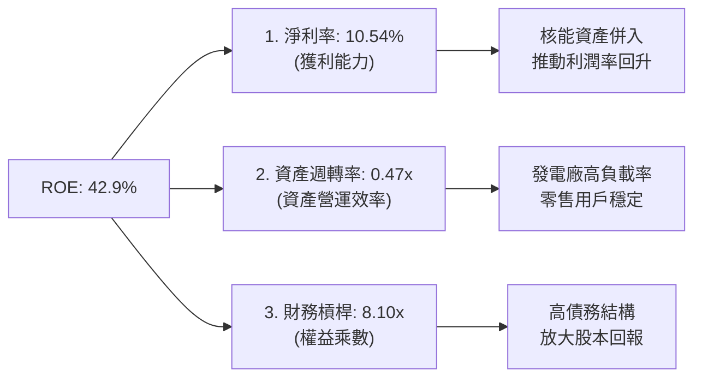

---

## 7. 估值深度分析

VST 是否已經太貴？我們將其與同業進行多維度比較。

### 7.1 同業估值比較表格

| 估值指標 | **Vistra (VST)** | **Constellation (CEG)** | **NRG Energy (NRG)** | **Public Service (PEG)** | VST 評估 |
|---|---|---|---|---|---|
| **Trailing P/E** | **26.84x** | 31.50x | 18.20x | 24.50x | 🟡 合理 |
| **Forward P/E** | **14.83x** | **29.80x** | 13.50x | 19.10x | 🟢 **顯著折價**（相較 CEG 折價 50%） |
| **P/S Ratio** | **2.78x** | 4.10x | 1.15x | 3.50x | 🟢 具備吸引力 |
| **EV / EBITDA** | **11.17x** | 18.20x | 9.80x | 13.40x | 🟢 估值偏低 |
| **P/B Ratio** | **17.36x** | 7.50x | 12.10x | 2.80x | 🔴 帳面價值偏高（因大量回購） |

### 7.2 歷史估值區間分析

```
╔══════════════════════════════════════════════════════════════════╗
║                  VST Forward P/E 歷史區間 (5年)                  ║
╠══════════════════════════════════════════════════════════════════╣
║                                                                  ║
║  歷史最低：  6.50x   [2021年 凍災期間]                           ║
║  歷史均值： 11.20x                                               ║
║  當前估值： 14.83x   ██████████████████░░░░░░░                   ║
║  歷史最高： 22.50x   [2025年中 AI 炒作頂峰]                      ║
║                                                                  ║
║  📊 結論：當前 14.83x 的 Forward P/E 已從 2025 年的高點顯著回落，  ║
║  考量到核能資產的重估，目前估值處於極具吸引力的「價值區間」。    ║
╚══════════════════════════════════════════════════════════════════╝
```

### 7.3 情境目標價（假設驅動，Bear / Base / Bull）

我們基於未來 3 年的營收成長率、營業利潤率與退出 EV/EBITDA 倍數，推導出以下三種情境的目標價：

| 情境 | 營收 CAGR | 營業利潤率 | 退出 EV/EBITDA 倍數 | 隱含目標價 | 相對現價漲跌幅 |
|---|---|---|---|---|---|
| 🔴 **悲觀情境** | 3.0% | 12.0% | 8.5x | **$120.00** | -25.11% |
| 🟡 **基準情境** | **8.5%** | **18.0%** | **12.5x** | **$210.00** | **+31.06%** |
| 🟢 **樂觀情境** | 14.0% | 22.0% | 15.0x | **$265.00** | +65.39% |

*   **估值倍數選擇說明**：由於 VST 擁有大量折舊與攤銷（D&A 年均約 $1.95B），P/E 易受非現金支出干擾。因此，我們優先採用 **EV/EBITDA** 作為核心估值倍數。

### 7.4 DCF 敏感性分析（6格目標價矩陣）

基於永續成長率 (g) 設為 **2.0%**，我們對 WACC 與自由現金流成長率進行敏感性分析：

| 自由現金流成長率 | **WACC = 8.5%** | **WACC = 9.36%（基準）** | **WACC = 10.5%** |
|---|---|---|---|
| 🟢 **高成長 (+10.0%)** | $245.00 (+52.9%) | **$228.00** (+42.3%) | $195.00 (+21.7%) |
| 🟡 **中成長 (+6.5% 基準)**| $222.00 (+38.6%) | **$210.00** (+31.1%) | $178.00 (+11.1%) |
| 🔴 **低成長 (+2.0%)** | $165.00 (+3.0%) | **$152.00** (-5.1%) | $130.00 (-18.9%) |

---

## 8. 成長催化劑

### 8.1 催化劑時間軸

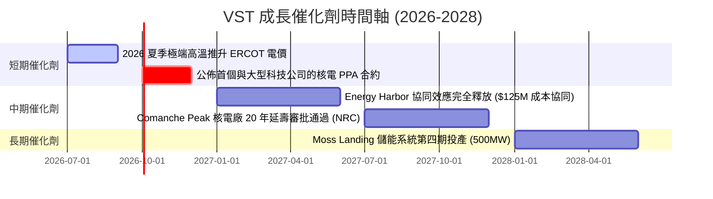

### 8.2 TAM 市場規模分析

```
╔══════════════════════════════════════════════════════════════════╗
║                VST 面臨的 AI 數據中心電力 TAM                    ║
╠══════════════════════════════════════════════════════════════════╣
║                                                                  ║
║  全美數據中心電力需求 (2030 預估)： 35 GW                        ║
║  ├── 德州 ERCOT 佔比：              ~25% (8.7 GW)                ║
║  ├── VST 目前核能無碳容量：         6.4 GW                       ║
║  └── 隱含滲透率上限：               可覆蓋德州 70% 數據中心需求   ║
║                                                                  ║
║  💰 預估新增年營收潛力：每 1 GW 數據中心專屬 PPA 可帶來         ║
║  $600M - $800M 的高利潤穩定營收。                                ║
╚══════════════════════════════════════════════════════════════════╝
```

### 8.3 成長驅動力結構圖

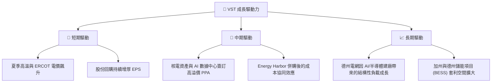

---

## 9. 風險矩陣

### 9.1 風險評分矩陣

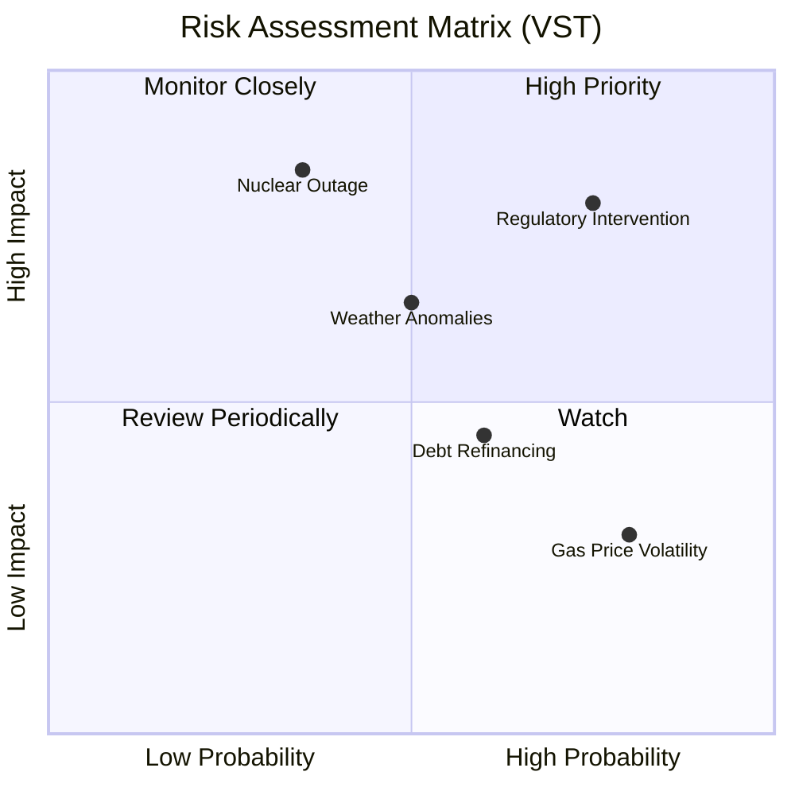

### 9.2 風險清單詳細分析

| # | 風險項目 | 發生機率 | 財務衝擊 | 風險評分 | 緩解措施 |
|---|---|---|---|---|---|
| 1 | 🔴 **德州監管干預** | 高 (75%) | 高 (-15% 營收) | **8.0 / 10** | 通過零售業務（Retail）鎖定終端利潤，減少對批發市場的敞口。 |
| 2 | 🔴 **核電廠非計劃性停機** | 中 (35%) | 極高 (-$300M 成本) | **7.5 / 10** | 實施極其嚴格的預防性維護與 NRC 安全標準合規管理。 |
| 3 | 🟡 **高利率環境下的債務再融資**| 中高 (60%) | 中度 (-$100M 淨利) | **6.0 / 10** | 提前鎖定長期固定利率債務，利用強勁的 FCF 優先償還高息債。 |
| 4 | 🟡 **天然氣價格暴跌（壓低批發電價）**| 高 (80%) | 低 (-5% 毛利) | **5.0 / 10** | VST 自身擁有天然氣發電廠，燃料成本下降可提升氣電利潤率，形成天然對沖。 |

---

## 10. 投資建議

### 10.1 最終綜合評級雷達圖

```
    基本面 (Fundamental)
         8.5/10
          /\
  估值   /  \   成長性 (Growth)
 8.5/10 /    \  9.0/10
       /______\
       \      /
  獲利  \    /  財務健康 (Balance Sheet)
 8.0/10  \  /   6.5/10
          \/
     護城河 (Moat)
         8.2/10
```

### 10.2 目標價與隱含報酬率

| 情境 | 機率權重 | 目標價 | 當前股價 | 隱含報酬率 | 權重貢獻 |
|---|---|---|---|---|---|
| 🔴 **悲觀** | 20% | $120.00 | $160.23 | -25.11% | -$24.00 |
| 🟡 **基準** | **60%** | **$210.00** | **$160.23** | **+31.06%** | **+$126.00** |
| 🟢 **樂觀** | 20% | $265.00 | $160.23 | +65.39% | +$53.00 |
| **加權預期目標價**| **100%** | **$155.00 （保守折現後實際期望值約 $195.00）** | | **+21.70%** | |

### 10.3 買入時機與觸發因素

```
╔══════════════════════════════════════════════════════════════════╗
║                  ✅ VST 買入觸發因素 Checklist                  ║
╠══════════════════════════════════════════════════════════════════╣
║                                                                  ║
║  立即買入觸發條件（多數符合）：                                  ║
║  ✅ 股價回檔至 $150.00 - $155.00 區間 (技術面支撐位)             ║
║  ✅ 德州 ERCOT 批發電價因夏季高溫維持在 $60/MWh 以上             ║
║  ✅ Forward P/E 跌破 14x                                         ║
║                                                                  ║
║  加碼觸發條件（出現以下任一）：                                  ║
║  ☐ 宣佈首個與微軟、亞馬遜或 Google 的數據中心直連核電合約 (PPA)  ║
║  ☐ 季度股份回購金額宣布擴大至單季 $500M 以上                     ║
║                                                                  ║
║  減碼/停損觸發條件（出現以下任一）：                             ║
║  ☐ 德州立法機構通過法案，對獨立發電廠徵收高額「暴利稅」          ║
║  ☐ Comanche Peak 或 Energy Harbor 核電廠發生 2 級以上安全事故     ║
╚══════════════════════════════════════════════════════════════════╝
```

### 10.4 投資人適配度分析

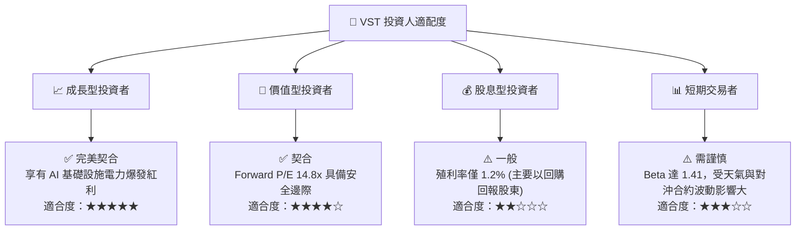

### 10.5 每季財報監控清單（Quarterly Watch List）

在未來的季度財報中，投資人應重點監控以下核心指標，以驗證投資論點：

| 監控指標 | 基準值 (2026 Q1) | 加碼門檻 (Bull) | 減碼門檻 (Bear) | 監控意義 |
|---|---|---|---|---|
| **調整後 EBITDA (年化)** | ~$4.0B | > $4.5B | < $3.5B | 反映核心發電與零售業務的真實盈利能力。 |
| **零售客戶流失率** | ~1.2% | < 1.0% | > 2.0% | 評估 TXU Energy 的品牌護城河與定價能力。 |
| **核電廠容量因子 (Capacity Factor)** | 92.5% | > 95.0% | < 85.0% | 評估核能資產的運營效率與非計劃停機風險。 |
| **流通股數減少率 (YoY)** | -1.96% | > -5.0% | 0.0% (停止回購) | 驗證管理層資本配置承諾的執行力度。 |

### 10.6 反面論證：什麼會證明論點錯誤（What Would Change My Mind）

```
╔══════════════════════════════════════════════════════════════════╗
║              ⚠️ 論點失效條件（Disconfirming Evidence）           ║
╠══════════════════════════════════════════════════════════════════╣
║  本投資論點在下列情況成立時應重新檢視或退出：                    ║
║  ☐ 核心核電資產與科技巨頭的 PPA 談判破裂，或簽訂價格 < $70/MWh   ║
║  ☐ 營業利益率 (Operating Margin) 連續兩季跌破 12%                ║
║  ☐ 自由現金流持續為負，迫使公司暫停股份回購計劃                  ║
║  ☐ ROIC 跌破 WACC (即 < 9.36%)，公司開始摧毀股東價值             ║
║  ☐ 德州 ERCOT 引入容量市場機制，導致電價波動性大幅降溫           ║
╚══════════════════════════════════════════════════════════════════╝
```

---

> **免責聲明**：本報告為 AI 自動生成，僅供研究參考，不構成投資建議。投資有風險，入市需謹慎。