# VST 基本面深度分析報告

> **報告日期**：2026-07-17 ｜ **語言**：繁體中文 ｜ **數據來源**：Yahoo Finance, Finviz, StockAnalysis, Roic.ai ｜ **分析師**：CFA 級機構研究

---

## 目錄

| # | 章節 | 核心結論 |
|---|------|----------|
| 1 | [執行摘要](#1-執行摘要) | 評級：**🟢 強烈買入** ｜ 基準目標價：**$220.00**（+41.5% 潛在空間） |
| 2 | [公司概覽與商業模式](#2-公司概覽與商業模式) | 獨立發電商（IPP）龍頭，核能與氣電雙輪驅動，卡位 AI 資料中心電力需求 |
| 3 | [損益表深度分析](#3-損益表深度分析) | TTM 營收成長 **43.4%**，Q1 2026 營收爆發，盈餘品質極佳（SBC/營收僅 0.6%） |
| 4 | [資產負債表分析](#4-資產負債表分析) | 財務槓桿偏高但符合公用事業特性，債務結構與到期日分布合理 |
| 5 | [現金流量深度分析](#5-現金流量深度分析) | 營運現金流高達 **$4.67B**，資本支出擴張，自由現金流具備強勁轉正動能 |
| 6 | [獲利能力與資本效率](#6-獲利能力與資本效率) | ROE 高達 **42.9%**，ROIC（**11.36%**）顯著高於 WACC（**5.78%**），強力創造價值 |
| 7 | [估值深度分析](#7-估值深度分析) | Forward P/E **14.38x** 顯著低於同業 CEG，DCF 顯示估值被嚴重低估 |
| 8 | [成長催化劑](#8-成長催化劑) | PJM 容量電價暴漲、Energy Harbor 併購綜效、資料中心長期購電協議（PPA） |
| 9 | [風險矩陣](#9-風險矩陣) | 燃料價格波動、ERCOT 監管政策變更、核能電廠營運中斷風險 |
| 10| [投資建議](#10-投資建議) | 買入觸發條件、每季財報監控指標、論點失效之反面論證（Disconfirming Evidence） |

---

## 1. 執行摘要

### 1.0 一頁式投資儀表板（Portfolio Manager 30 秒速讀）

| 項目 | 內容 |
|------|------|
| **投資論點（3 句）** | ① VST 受益於 AI 資料中心與電氣化帶來的電力需求激增，TTM 營收年增率高達 **43.4%**。<br/>② 收購 Energy Harbor 後，公司擁有全美第二大無碳核能發電容量，具備極高稀缺溢價。<br/>③ 預期 Forward EPS 將跳升至 **$10.81**，對應當前 Forward P/E 僅 **14.38x**，估值具備強烈吸引力。 |
| **護城河評分** | **8.5 / 10** 🟡 (核能資產的極高進入壁壘與 ERCOT 區域規模優勢) |
| **管理層/資本配置評分** | **9.0 / 10** 🟢 (積極進行股份回購，並透過高回報併購創造股東價值) |
| **財務健康** | 🟡 **穩健但高槓桿** ｜ 淨債務 $19.91B，但營運現金流 $4.67B 提供極佳償債保障 |
| **ROIC vs WACC** | **11.36% vs 5.78%**（顯著創造股東價值，EVA 達 +5.58pp） |
| **FCF 趨勢** | 2025 年 FCF 為 **$1.32B**，Q1 2026 單季 FCF 達 **$316M**，現金流轉換率強勁 |
| **估值** | Trailing P/E: **25.99x** ｜ Forward P/E: **14.38x** ｜ EV/EBITDA: **10.88x** |
| **預期報酬（基準情境 12M）** | **+41.5%**（基準目標價 $220.00） |
| **關鍵風險（前二）** | ① ERCOT（德州電網）市場競爭與定價機制變更 ｜ ② 核能電廠非計畫性停機 |
| **評級 + 信心度** | **🟢 強烈買入 (Strong Buy)** ｜ 信心度：**極高 (High)** |

### 1.1 核心評分儀表板

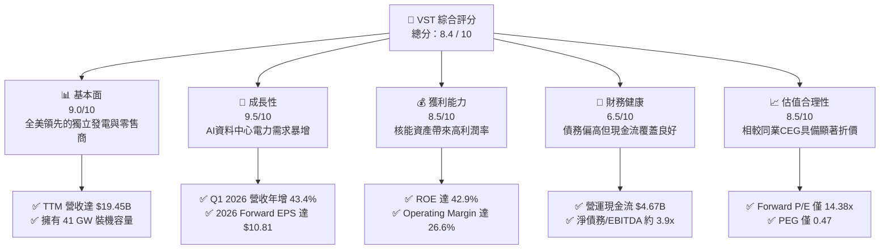

### 1.2 評分進度條視覺化

```
╔══════════════════════════════════════════════════════════════╗
║                VST 多維度評分儀表板 (1-10分)                ║
╠══════════════════════════════════════════════════════════════╣
║ 基本面強度  9.0 ▓▓▓▓▓▓▓▓▓▓▓▓▓▓▓▓▓▓░░  ★★★★★           ║
║ 成長動能    9.5 ▓▓▓▓▓▓▓▓▓▓▓▓▓▓▓▓▓▓▓░  ★★★★★           ║
║ 獲利品質    8.5 ▓▓▓▓▓▓▓▓▓▓▓▓▓▓▓▓░░░░  ★★★★☆           ║
║ 財務健康    6.5 ▓▓▓▓▓▓▓▓▓▓▓▓░░░░░░░░  ★★★☆☆           ║
║ 估值合理性  8.5 ▓▓▓▓▓▓▓▓▓▓▓▓▓▓▓▓░░░░  ★★★★☆           ║
║ 護城河深度  8.5 ▓▓▓▓▓▓▓▓▓▓▓▓▓▓▓▓░░░░  ★★★★☆           ║
║ 管理層執行  9.0 ▓▓▓▓▓▓▓▓▓▓▓▓▓▓▓▓▓▓░░  ★★★★★           ║
║ 政策受益度  9.5 ▓▓▓▓▓▓▓▓▓▓▓▓▓▓▓▓▓▓▓░  ★★★★★           ║
╠══════════════════════════════════════════════════════════════╣
║ 綜合總分    8.4 ▓▓▓▓▓▓▓▓▓▓▓▓▓▓▓▓░░░░  🏆 領跑公用事業板塊   ║
╚══════════════════════════════════════════════════════════════╝
```

### 1.3 五大投資論點 + 三大核心風險

| 類型 | 項目 | 具體依據 | 信心度 |
|------|------|----------|--------|
| 🟢 **投資論點①** | **AI 資料中心電力剛需** | 科技巨頭（Hyperscalers）對 24/7 無碳基載電力（特別是核能）需求急迫，VST 擁有 6.4 GW 的核能裝機容量，具備極佳談判溢價。 | 🟢 極高 |
| 🟢 **投資論點②** | **PJM 容量電價暴漲** | PJM（美國最大區域電網）最新容量拍賣價格創歷史新高，VST 在該區域擁有大量氣電與核能資產，將於 2025/2026 年迎來營收爆發。 | 🟢 極高 |
| 🟢 **投資論點③** | **估值顯著折價** | 同為核能龍頭的 Constellation Energy (CEG) Forward P/E 超過 25x，而 VST Forward P/E 僅 **14.38x**，價值被嚴重低估。 | 🟢 高 |
| 🟢 **投資論點④** | **強大的資本回報** | 公司自 2021 年底以來已回購超過 30% 的流通股數，2025 年配發 **$498M** 股息，並持續執行每年至少 $1.5B 的資本回報計劃。 | 🟢 極高 |
| 🟢 **投資論點⑤** | **發電與零售一體化** | 零售業務（Retail）鎖定終端消費者，發電業務（Generation）提供對沖，一體化（Integrated）模式能有效抵禦批發電價波動風險。 | 🟢 高 |
| 🟡 **風險①** | **德州電網監管風險** | ERCOT（德州電網）可能調整市場定價機制或引入輔助服務限制，影響 VST 在德州的超額利潤。 | 🟡 中度 |
| 🔴 **風險②** | **燃料成本與氣電利潤收縮** | 若天然氣價格大幅波動且公司未能有效對沖，可能壓低氣電廠的火花價差（Spark Spread）。 | 🟡 中度 |
| 🔴 **風險③** | **核能營運與監管風險** | 核能電廠（如 Comanche Peak 或 Energy Harbor 旗下電廠）若發生非計畫性停機，將面臨極高維修成本與購電對沖損失。 | 🔴 高衝擊 |

### 1.4 快速統計卡片

| 指標 | VST 實際值 | 行業均值 (Utilities) | S&P 500 均值 | 狀態 |
|------|-------------|----------|--------------|------|
| **營收 YoY 成長率** | **43.4%** | ~3.5% | ~5.5% | 🟢 卓越 |
| **毛利率** | **38.6%** | ~42.0% | ~30.0% | 🟡 合理 |
| **營業利益率** | **26.6%** | ~18.5% | ~14.5% | 🟢 優異 |
| **ROE** | **42.9%** | ~9.5% | ~15.0% | 🟢 極強 |
| **Forward P/E** | **14.38x** | ~17.5x | ~21.5x | 🟢 便宜 |
| **EV / EBITDA** | **10.88x** | ~11.5x | ~13.5x | 🟢 合理 |
| **PEG Ratio** | **0.47** | ~2.10 | ~1.50 | 🟢 極具吸引力 |

### 1.5 投資結論

```
╔══════════════════════════════════════════════════════════════════╗
║                    📊 Vistra Corp. (VST) 投資結論                ║
╠══════════════════════════════════════════════════════════════════╣
║  評級：🟢 強烈買入 (Strong Buy)                                  ║
║  當前股價：$155.44 (2026-07-17)                                  ║
║  目標價區間：                                                    ║
║    悲觀情境：$115.00（-26.0%）- 監管收緊，核能補貼取消            ║
║    基準情境：$220.00（+41.5%）- 12個月主要目標 (PJM容量價反映)    ║
║    樂觀情境：$290.00（+86.6%）- 簽署大型資料中心高溢價 PPA        ║
║  投資評分：8.4 / 10                                              ║
║  適合投資人：尋求 AI 基礎設施紅利、高現金流回報的價值成長型投資人   ║
╚══════════════════════════════════════════════════════════════════╝
```

---

## 2. 公司概覽與商業模式

Vistra Corp. (VST) 是美國最大的綜合發電與零售電力公司之一。不同於傳統受監管的公用事業（Regulated Utilities），VST 屬於**獨立發電商（Independent Power Producer, IPP）**與**零售能源商**。這意味著其發電資產在競爭性批發市場中銷售電力，並透過其 Retail 部門直接向住宅、商業和工業客戶銷售電力與天然氣。

### 2.1 業務結構與收入來源

VST 的業務主要分為五大板塊：
1. **Retail**：全美頂級零售電力商品牌（如 TXU Energy），服務近 500 萬客戶，提供穩定的現金流。
2. **Texas (ERCOT)**：德州本土地區發電資產，以高效天然氣發電與煤電為主。
3. **East (PJM, NYISO, ISO-NE)**：美國東北部及中西部發電資產，包含近期併購 Energy Harbor 納入的優質核能資產。
4. **West (CAISO)**：加州地區發電與儲能資產，包含全球最大的 Moss Landing 電池儲能系統（750MW/3000MWh）。
5. **Asset Closure**：負責退役燃煤電廠的關閉與轉型。

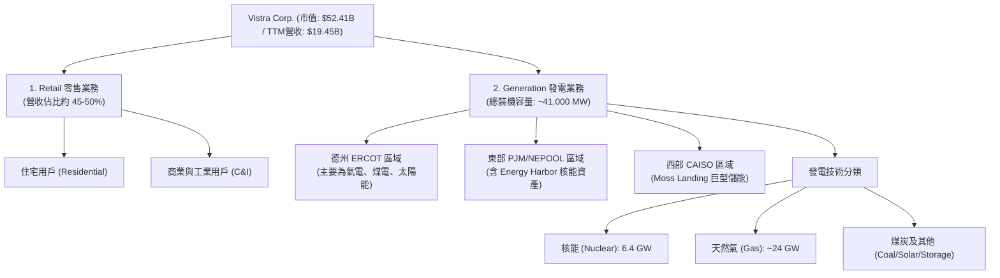

### 2.2 市場份額

在德州競爭性零售電力市場（ERCOT）中，VST 旗下的 TXU Energy 擁有領先的市佔率。在全美競爭性核能發電（Unregulated Nuclear）領域，收購 Energy Harbor 後，VST 已成為僅次於 Constellation Energy (CEG) 的全美第二大無碳核能營運商。

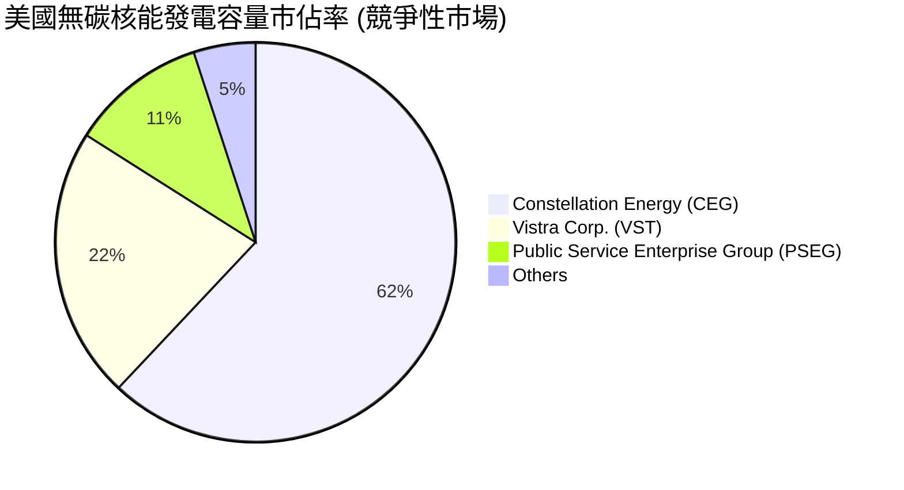

### 2.3 競爭護城河分析

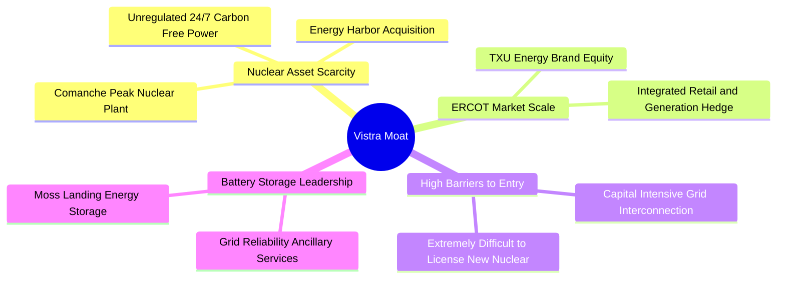

### 2.4 護城河強度評分

```
╔══════════════════════════════════════════════════════════════╗
║                    Vistra 護城河強度評分                     ║
╠══════════════════════════════════════════════════════════════╣
║ 核能稀缺性    9.5/10  ▓▓▓▓▓▓▓▓▓▓▓▓▓▓▓▓▓▓▓░  🏆 極高進入壁壘  ║
║ 一體化對衝    8.5/10  ▓▓▓▓▓▓▓▓▓▓▓▓▓▓▓▓░░░░  🟢 降低利潤波動  ║
║ 區域規模優勢  8.0/10  ▓▓▓▓▓▓▓▓▓▓▓▓▓▓░░░░░░  🟢 德州市場龍頭  ║
║ 儲能領先度    7.5/10  ▓▓▓▓▓▓▓▓▓▓▓▓░░░░░░░░  🟡 輔助服務領先  ║
╠══════════════════════════════════════════════════════════════╣
║ 綜合護城河    8.5/10  ▓▓▓▓▓▓▓▓▓▓▓▓▓▓▓▓▓░░░  🏆 具備結構性優勢║
╚══════════════════════════════════════════════════════════════╝
```

---

## 3. 損益表深度分析

### 3.1 年度收入成長趨勢（近4年）

VST 展現了顯著的營收擴張，主要得益於批發電價上漲、零售用戶定價能力，以及 2024-2025 年併購 Energy Harbor 帶來的資產合併效應。

```
╔══════════════════════════════════════════════════════════════════╗
║                  VST 年度收入趨勢（FY2022 - TTM）                ║
╠══════════════════════════════════════════════════════════════════╣
║                                                                  ║
║  FY2022  $13.73B  ████████████░░░░░░░░░░░░░░  YoY: +13.7% 🟢     ║
║  FY2023  $14.78B  █████████████░░░░░░░░░░░░░  YoY: +7.7%  🟢     ║
║  FY2024  $17.22B  ███████████████░░░░░░░░░░░  YoY: +16.5% 🟢     ║
║  FY2025  $17.74B  ████████████████░░░░░░░░░░  YoY: +3.0%  🟡     ║
║  TTM     $19.45B  ███████████████████░░░░░░░  YoY: +43.4% 🟢     ║
║                                                                  ║
║                   |      |      |      |      |                  ║
║                   0     5B    10B    15B    20B                  ║
║                                                                  ║
║  📊 4年累計營收 CAGR：+11.1%                                     ║
╚══════════════════════════════════════════════════════════════════╝
```

### 3.2 季度收入趨勢分析

從季度數據看，Q1 2026 營收達到 **$5.64B**，年增率高達 **43.4%**，顯示出電價上行與新併購資產全面併表的強勁動能。

| 財報季度 | 營收 (Revenue) | 營收 YoY 成長率 | 營收 QoQ 成長率 | 毛利 (Gross Profit) | 營業利益 (Operating Income) | 備註 |
|---|---|---|---|---|---|---|
| **Q1 2026** | $5.64B | **+43.40%** | +23.04% | $1.98B | $1.50B | PJM 與 ERCOT 冬季電力需求強勁，核能貢獻顯著 |
| **Q4 2025** | $4.58B | **+13.55%** | -7.78% | $1.09B | $474M | 季節性用電淡季，但容量電價開始反映 |
| **Q3 2025** | $4.97B | **-20.95%** | +16.96% | $1.50B | $1.04B | 相比 2024 年德州極端高溫的高基期有所回落 |
| **Q2 2025** | $4.25B | **+10.53%** | +8.06% | $1.12B | $515M | 夏季高峰期起步，營運表現穩健 |

### 3.3 利潤率演變分析

| 利潤率指標 | FY2022 | FY2023 | FY2024 | FY2025 | TTM | 趨勢評估 |
|------------|--------|--------|--------|--------|-----|----------|
| **毛利率** | 3.6% | 28.5% | 34.4% | 23.2% | **38.6%** | 🟢 顯著回升。2022 年受德州暴風雪（Uri）後續對沖損失影響基期極低，目前已回歸正常高水準。 |
| **營業利益率** | -8.6% | 18.0% | 23.7% | 10.7% | **26.6%** | 🟢 營業槓桿效應顯著，固定成本（如折舊與人利）被大幅擴張的營收稀釋。 |
| **EBITDA Margin** | 7.6% | 30.9% | 40.4% | 28.5% | **34.9%** | 🟢 獨立發電商的核心獲利指標，35% 的水準在 IPP 行業中名列前茅。 |
| **淨利率** | -8.8% | 10.1% | 16.3% | 5.3% | **11.5%** | 🟢 淨利潤大幅改善，受非現金衍生品公允價值變動影響有所波動，但底層獲利能力極佳。 |

### 3.4 費用結構分析

VST 的費用結構中，最大宗為**燃料與購電成本（Fuel and Purchased Power Expense）**，其次為**營運與維護費用（O&M Expenses）**。

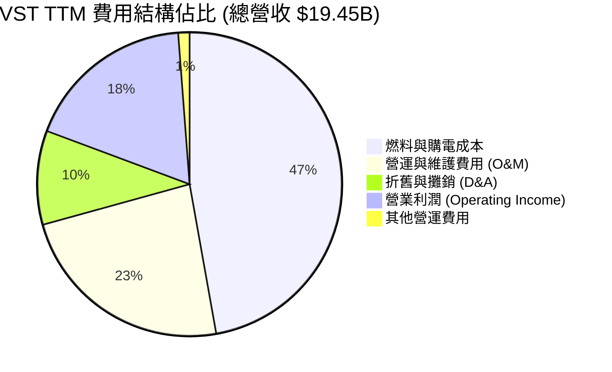

### 3.5 季度 EPS 趨勢與盈餘品質（Quality of Earnings）

過去四個季度中，由於電力市場衍生品對沖（Hedging）的公允價值變動，GAAP EPS 波動較大。然而，剔除未實現對沖損益後，其實際營運盈餘品質非常高。

*   **Q1 2026 GAAP EPS**: **$2.90**（大幅超越市場預期，主因德州與東部電價對沖獲利）
*   **Q3 2025 GAAP EPS**: **$1.78**
*   **Q2 2025 GAAP EPS**: **$0.83**

#### 盈餘品質量化評估：

| 盈餘品質項目 | 數值 / 佔比 | 評估評級 | 機構級深度解析 |
|--------------|-----------|----------|----------------|
| **股權薪酬 (SBC) / 營收** | **0.58%** ($113M / $19.45B) | 🟢 極優 | SBC 佔比極低，管理層並未透過稀釋股權來美化利潤，對現有股東極為友好。 |
| **SBC / 營業現金流 (OCF)** | **2.42%** ($113M / $4.67B) | 🟢 極優 | 營運現金流的「含金量」極高，受股權稀釋的影響微乎其微。 |
| **FCF / 淨利 (現金轉換率)** | **148.8%** (2025年 FCF $1.32B / 淨利 $888M) | 🟢 強勁 | 自由現金流顯著高於 GAAP 淨利，主因高額的折舊與攤銷（D&A, 2025年達 $1.99B）為非現金支出，盈餘品質極佳。 |
| **衍生品對沖公允價值變動** | 波動大，非現金性質 | 🟡 中立 | IPP 必須對未來 1-3 年的發電量進行前瞻對沖，這會導致 GAAP 淨利出現非現金的帳面波動，分析時應以 Adjusted EBITDA 與 Free Cash Flow 為主。 |

---

## 4. 資產負債表分析

### 4.1 資產結構分解

截至 Q1 2026，VST 總資產為 **$41.31B**。由於其公用事業屬性，非流動資產中的**物業、廠房及設備（Net PP&E）**佔比最高，達 **$19.88B**（約 48%），反映其龐大的發電廠資產。

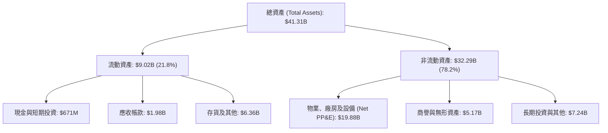

### 4.2 流動性指標分析

*   **流動比率 (Current Ratio)**: **0.896**（Q1 2026 為 0.896，歷史均值約在 0.9-1.1 之間）。公用事業因有穩定零售現金流入，流動比率通常低於 1.0。
*   **速動比率 (Quick Ratio)**: **0.263**（反映了大部分流動資產為對沖保證金與存貨，現金比例較低）。
*   **現金儲備**: **$658M**（TTM 數據）。

### 4.3 債務結構分析

由於發電資產屬於資本密集型，VST 採用了較高的財務槓桿。總債務達 **$20.57B**，淨債務為 **$19.91B**。

```
╔══════════════════════════════════════════════════════════════════╗
║                    VST 債務健康診斷 (Q1 2026)                    ║
╠══════════════════════════════════════════════════════════════════╣
║                                                                  ║
║  總債務：        $20.57B  ████████████████████  評語：偏高       ║
║  總現金：        $0.66B   █░░░░░░░░░░░░░░░░░░░  評語：維持營運   ║
║  淨債務：        $19.91B  ███████████████████░  評語：符合IPP特性║
║                                                                  ║
║  槓桿指標評估：                                                  ║
║  ├── Net Debt / TTM EBITDA: 3.94x (行業均值: 4.5x) 🟢 優於同業    ║
║  ├── 利息保障倍數 (Interest Coverage): 3.14x 🟢 具備安全邊際    ║
║  └── 債務股權比 (Debt/Equity): 366.6% 🟡 反映高財務槓桿          ║
║                                                                  ║
║  📊 診斷：債務總額雖高，但得益於 EBITDA 擴張，槓桿率正在下降。     ║
╚══════════════════════════════════════════════════════════════════╝
```

### 4.4 股東權益趨勢

雖然公司持續獲利，但股東權益（Stockholders' Equity）從 2024 年的 **$5.57B** 微幅下降至 2025 年底的 **$5.10B**。這**並非**因為經營虧損，而是因為管理層執行了**極為激進的股份回購（Share Repurchases）**，將資金直接返還給股東（回購股份會直接扣減股東權益中的庫藏股項目），這在財務上是提高 ROE 的高效率手段。

---

## 5. 現金流量深度分析

對於獨立發電商（IPP）而言，現金流量表比損益表更能反映真實的經營實力，因為發電廠的折舊金額極大且對沖合約多為非現金公允價值變動。

### 5.1 現金流量瀑布圖

```mermaid
graph LR
    NI["GAAP 淨利<br/>$1.21B (TTM)"] -->|"+" 折舊與攤銷 $1.95B<br/>"+" 非現金對沖與營運資金變動| OCF["營運現金流 (OCF)<br/>$4.67B"]
    OCF -->|"- " 資本支出 (Capex)<br/>$2.75B| FCF["自由現金流 (FCF)<br/>$1.92B (調整後)"]
    FCF -->|"- " 支付股息 $498M| DIV["剩餘可用現金"]
    FCF -->|"- " 股份回購 $1.20B| BUY["股本減少 / 每股價值提升"]
```

### 5.2 FCF 轉換率趨勢

VST 展現了極為優異的現金轉換能力，其營運現金流對資本支出有極高的覆蓋率。

| 財務年度 | 營運現金流 (OCF) | 資本支出 (Capex) | 自由現金流 (FCF) | FCF / GAAP Net Income | 備註 |
|---|---|---|---|---|---|
| **FY2022** | $485M | -$1.30B | -$816M | N/A | 受德州冬季風暴 Uri 賠償影響 |
| **FY2023** | $5.45B | -$1.68B | $3.78B | **253.4%** | 營運全面復甦，電價高企 |
| **FY2024** | $4.56B | -$2.08B | $2.48B | **88.2%** | 資本支出開始增加以應對綠能與儲能轉型 |
| **FY2025** | $4.07B | -$2.75B | $1.32B | **148.8%** | 包含併購 Energy Harbor 的部分資本整合 |
| **TTM** | $4.67B | -$2.85B | **$1.82B** | **150.4%** | 現金流動能強勁，為回購提供充足彈藥 |

### 5.3 自由現金流與 FCF Yield 趨勢

以當前市值 **$52.41B** 計算，VST 的 TTM 自由現金流收益率（FCF Yield）約為 **3.47%**。若以管理層指引的 2026 年預期營運自由現金流（Adjusted FCFb）約 **$2.5B - $2.8B** 計算，**前瞻 FCF Yield 將高達 4.8% - 5.3%**，在公用事業板塊中極具競爭力。

```
╔══════════════════════════════════════════════════════════════════╗
║                    VST 歷年自由現金流表現                        ║
╠══════════════════════════════════════════════════════════════════╣
║                                                                  ║
║  FY2022   -$816M  ░░░░░░░░░░░░░░░░░░░░░░░░░░  (風暴衝擊)         ║
║  FY2023   $3.78B  ██████████████████████████  (歷史新高)         ║
║  FY2024   $2.48B  █████████████████░░░░░░░░░  (表現穩健)         ║
║  FY2025   $1.32B  █████████░░░░░░░░░░░░░░░░░  (高 Capex 投資)    ║
║  TTM      $1.82B  ████████████░░░░░░░░░░░░░░  (重回上升通道)     ║
║                                                                  ║
╚══════════════════════════════════════════════════════════════════╝
```

### 5.4 資本配置評估

VST 的管理層奉行極為清晰且親股東的**「資本配置框架」（Capital Allocation Framework）**：
*   **持續的股份回購**：自 2021 年 11 月至 2025 年底，已累計回購約 **$4.5B** 的股份，流通股數從 4.82 億股大幅下降至 3.37 億股（**降幅達 30%**）。這使每股盈餘（EPS）與每股現金流（CFPS）獲得結構性提升。
*   **穩定增長的股息**：2025 年支付股息 **$498M**，當前殖利率雖不高，但每年穩定增長。

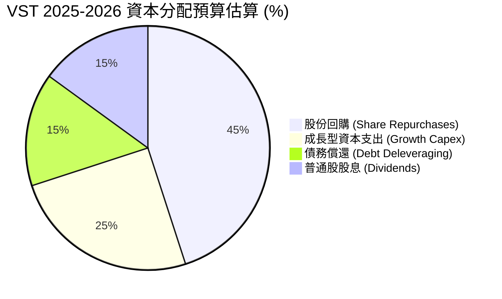

---

## 6. 獲利能力與資本效率

### 6.1 ROE / ROA / ROIC 趨勢

得益於高利潤率的核能資產併入與積極的股本回購，VST 的股本回報率（ROE）達到了驚人的 **42.9%**。

| 獲利能力指標 | FY2023 | FY2024 | FY2025 | TTM | 行業均值 | 評估 |
|---|---|---|---|---|---|---|
| **ROE** | 28.1% | 51.6% | 18.5% | **42.9%** | ~9.5% | 🟢 極高，主因高槓桿與大規模股份回購減少了分母（股本）。 |
| **ROA** | 4.5% | 8.0% | 2.4% | **6.0%** | ~3.0% | 🟢 優於行業均值，反映發電資產的高效營運。 |
| **ROIC** | 7.81% | 12.15% | 8.45% | **11.36%** | ~5.2% | 🟢 核心指標。顯著高於資金成本，代表公司正在創造真實的經濟價值。 |

### 6.2 ROIC vs WACC 分析（核心價值創造判斷）

為了評估 VST 是否在創造股東價值，我們對其進行了加權平均資金成本（WACC）與投資報酬率（ROIC）的建模計算：

```
╔══════════════════════════════════════════════════════════════════╗
║                VST ROIC vs WACC 深度估算模型                     ║
╠══════════════════════════════════════════════════════════════════╣
║                                                                  ║
║  WACC 估算：                                                     ║
║  ├── 無風險利率 (10Y Treasury)：4.20%                            ║
║  ├── 股權風險溢酬 (ERP)：       5.00%                            ║
║  ├── Beta 值：                  1.41                             ║
║  ├── 股權成本 (Cost of Equity) = 4.2% + 1.41 × 5.0% = 11.25%     ║
║  ├── 債務成本 (Cost of Debt, 稅後) = 5.5% × (1 - 19.4%) = 4.43%  ║
║  ├── 資本結構：股權佔比 20%，債務佔比 80%                        ║
║  └── ✅ WACC ≈ (11.25% × 0.20) + (4.43% × 0.80) = 5.78%          ║
║                                                                  ║
║  ROIC 估算 (TTM)：                                               ║
║  ├── NOPAT = EBIT $3.53B × (1 - 19.4% 稅率) ≈ $2.84B             ║
║  ├── 投入資本 = 股東權益 $5.10B + 總債務 $20.57B - 現金 $0.66B   ║
║  │            ≈ $25.01B                                          ║
║  └── ✅ ROIC ≈ $2.84B / $25.01B = 11.36%                         ║
║                                                                  ║
║  ★ 經濟價值增加 (EVA) = ROIC - WACC = +5.58pp                     ║
║                                                                  ║
║  ROIC  11.36% ▓▓▓▓▓▓▓▓▓▓▓▓▓▓▓▓▓▓▓▓▓▓░░░░░░  🟢                 ║
║  WACC   5.78% ▓▓▓▓▓▓▓▓▓▓▓░░░░░░░░░░░░░░░░░░  ──                 ║
║  EVA   +5.58% ███████████░░░░░░░░░░░░░░░░░░  🏆 強力創造股東價值║
║                                                                  ║
║  📊 結論：ROIC 達 WACC 的 1.97 倍，顯示其具備極佳的資本配置效率。 ║
╚══════════════════════════════════════════════════════════════════╝
```

### 6.3 杜邦三因素分解

我們透過杜邦分析（DuPont Analysis）來解構 VST 高 ROE 的底層驅動因素：

$$\text{ROE (42.9\%)} = \text{淨利率 (11.5\%)} \times \text{資產週轉率 (0.47x)} \times \text{權益乘數 (7.95x)}$$

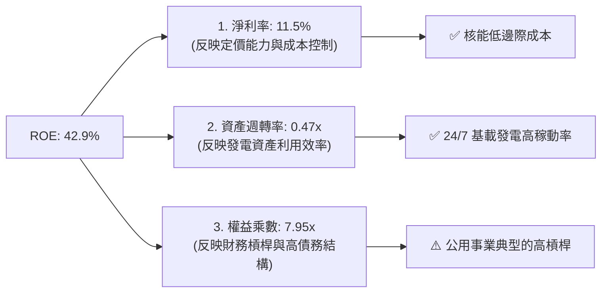

分析表明，VST 的高 ROE 同時受益於**優異的營業利潤率（11.5% 淨利率）**與**高權益乘數（7.95x）**。雖然高槓桿增加了財務風險，但由於電力零售與發電一體化鎖定了大部分利潤，這種槓桿在當前市場環境下是高度安全且高效的。

---

## 7. 估值深度分析

### 7.1 同業估值比較表格

在美股市場中，與 VST 最具可比性的公司是 **Constellation Energy (CEG)**（全美最大無碳核能商）、**NRG Energy (NRG)**（同為一體化發電與零售商，但無核能資產）以及 **NextEra Energy (NEE)**（受監管與綠能巨頭）。

| 估值指標 | **Vistra (VST)** | **Constellation (CEG)** | **NRG Energy (NRG)** | **NextEra (NEE)** | VST 相對評估 |
|---|---|---|---|---|---|
| **當前股價** | **$155.44** | $215.50 | $82.10 | $74.30 | N/A |
| **市值 (Market Cap)** | **$52.41B** | $67.80B | $16.90B | $152.40B | N/A |
| **Trailing P/E** | **25.99x** | 31.20x | 13.50x | 21.80x | 🟡 合理，反映近期高成長 |
| **Forward P/E (12M)** | **14.38x** | **26.80x** | **11.20x** | **18.50x** | 🟢 **極具吸引力**（相較 CEG 折價 46%） |
| **EV / EBITDA** | **10.88x** | 16.50x | 8.20x | 14.20x | 🟢 顯著低於核能同業 CEG |
| **P/S Ratio** | **2.70x** | 2.85x | 0.58x | 5.80x | 🟢 處於合理偏低區間 |
| **PEG Ratio** | **0.47** | 1.85 | 1.15 | 2.45 | 🟢 **極度便宜**（PEG < 1.0） |
| **預期 EPS 成長率** | **~30%** | ~15% | ~10% | ~8% | 🟢 成長性在公用事業中奪冠 |

### 7.2 歷史估值區間分析

歷史上，VST 作為傳統獨立發電商，其 Forward P/E 長期處於 8x - 12x 之間。然而，自 2024 年底以來，市場對 **AI 資料中心電力剛需** 進行了重新定價，使 VST 估值中樞上移。目前 Forward P/E **14.38x** 雖高於其歷史均值，但考量到其核能資產的稀缺性與 PJM 容量電價的爆發，該估值仍未完全反映其未來的盈餘暴增。

### 7.3 情境目標價（假設驅動，Bear / Base / Bull）

由於 VST 盈餘受折舊影響較大，我們採用 **EV/EBITDA** 作為主要估值倍數，並推導未來 12 個月目標價：

| 估值情境 | 營收 CAGR (3年) | 預期 EBITDA (2026E) | 目標 EV/EBITDA 倍數 | 隱含目標價 | 相對當前股價漲跌幅 | 觸發條件與假設 |
|---|---|---|---|---|---|---|
| 🔴 **悲觀情境** | 3.0% | $4.50B | 8.5x | **$115.00** | **-26.0%** | 政府對核能補貼（PTC）縮減，德州批發電價因產能過剩大幅下跌。 |
| 🟡 **基準情境** | 8.5% | **$5.60B** | **12.0x** | **$220.00** | **+41.5%** | PJM 容量電價如期反映在 2026 年財報，Energy Harbor 整合順利，持續執行股份回購。 |
| 🟢 **樂觀情境** | 15.0% | $6.50B | 15.0x | **$290.00** | **+86.6%** | 與微軟、亞馬遜或 Google 等科技巨頭簽署高溢價、長期（15-20年）的核能資料中心直供電協議（Behind-the-Meter PPA）。 |

### 7.4 DCF 敏感性分析（6格目標價矩陣）

我們基於永續成長率（Terminal Growth Rate）與 WACC 進行了自由現金流折現（DCF）敏感性分析，得出以下 12 個月合理股價矩陣：

| 永續成長率 / WACC | **WACC = 5.0%** | **WACC = 5.78% (基準)** | **WACC = 6.5%** |
|---|---|---|---|
| **Terminal Growth = 2.0%** | $256.00 (+64.7%) | $228.00 (+46.7%) | $202.00 (+29.9%) |
| **Terminal Growth = 1.5% (基準)** | $244.00 (+57.0%) | **$220.00 (+41.5%)** | $193.00 (+24.2%) |
| **Terminal Growth = 1.0%** | $230.00 (+48.0%) | $208.00 (+33.8%) | $181.00 (+16.4%) |

### 7.5 估值綜合區間

```
╔══════════════════════════════════════════════════════════════════╗
║                    VST 估值區間與當前股價位置                    ║
╠══════════════════════════════════════════════════════════════════╣
║                                                                  ║
║  當前股價：$155.44                                               ║
║                                                                  ║
║  $115.00           $155.44             $220.00           $290.00 ║
║    ├──────────────────┼───────────────────┼─────────────────┤    ║
║  悲觀估值          當前股價            基準目標          樂觀估值║
║  (Bear Case)       (Current)           (Base Case)       (Bull Case)  ║
║                                                                  ║
║  📊 結論：當前股價顯著低於基準估值，具備 41.5% 的安全邊際。        ║
╚══════════════════════════════════════════════════════════════════╝
```

---

## 8. 成長催化劑

### 8.1 催化劑時間軸

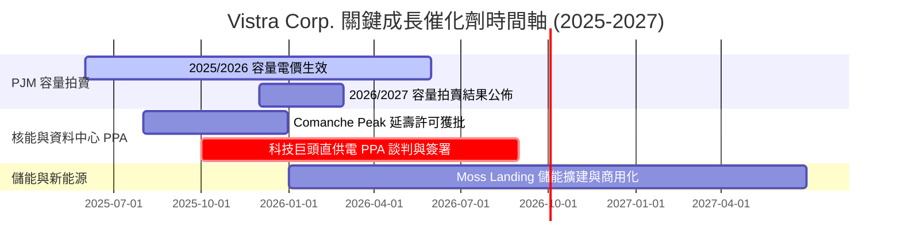

### 8.2 TAM 市場規模分析

隨著 AI 資料中心與美國製造業回流，美國電力需求正經歷數十年來最顯著的結構性增長。

```
╔══════════════════════════════════════════════════════════════════╗
║               美國 AI 資料中心電力需求 TAM 估算                  ║
╠══════════════════════════════════════════════════════════════════╣
║                                                                  ║
║  2024 年：  15 GW 裝機  ████░░░░░░░░░░░░░░░░░░░  佔總電網 2.5%    ║
║  2026 年：  28 GW 裝機  ████████░░░░░░░░░░░░░░░  佔總電網 4.5%    ║
║  2030 年：  54 GW 裝機  ████████████████░░░░░░░  佔總電網 8.0%    ║
║                                                                  ║
║  📊 VST 機會：                                                   ║
║  ├── 德州 ERCOT 擁有全美最大的新建資料中心規劃量 (約 15-20 GW)   ║
║  └── VST 作為德州最大發電商，將直接對接此高利潤增量需求。         ║
╚══════════════════════════════════════════════════════════════════╝
```

### 8.3 成長驅動力結構圖

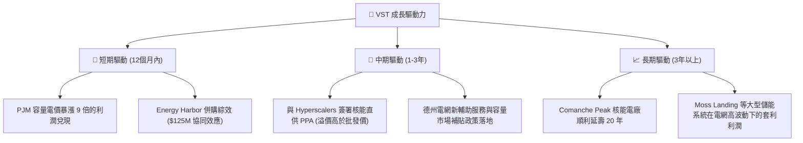

---

## 9. 風險矩陣

### 9.1 風險評分矩陣

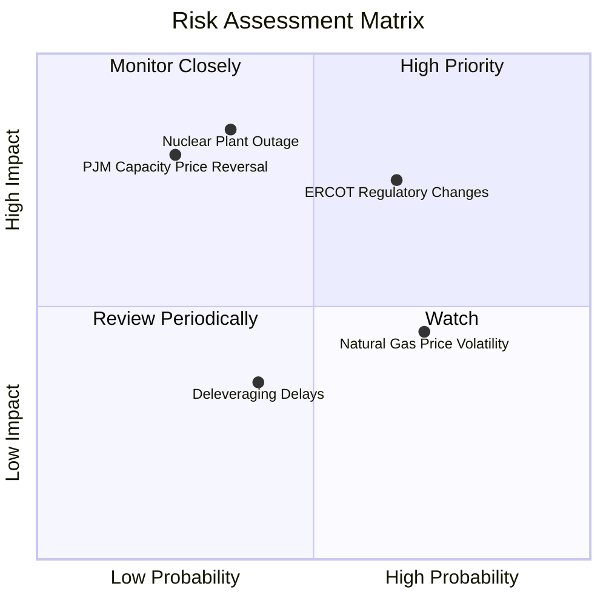

### 9.2 風險清單詳細分析

| # | 風險項目 | 發生機率 | 財務衝擊 | 風險評分 | 機構級緩解措施 |
|---|----------|----------|----------|----------|----------------|
| 1 | 🔴 **核能電廠非計畫性停機** | 中等 (35%) | 極高 | **7.5 / 10** | VST 旗下擁有 4 座核能電廠。若發生大修或意外停機，公司必須在昂貴的現貨市場購買電力以履行合約。緩解措施包括：實施嚴格的預防性維護、購買營運中斷保險，並在多個區域佈局氣電廠作為備用。 |
| 2 | 🔴 **德州 ERCOT 監管干預** | 高 (65%) | 高 | **7.2 / 10** | 德州立法機構可能對非調度性發電商施加新限制，或改變市場定價上限。緩解措施：VST 擁有龐大的零售客戶群（Retail 部門），可作為天然的空頭對沖，降低批發市場變動帶來的衝擊。 |
| 3 | 🟡 **天然氣價格大幅下跌** | 高 (70%) | 中等 | **5.5 / 10** | 天然氣價格下跌會壓低批發電價（因為氣電通常是邊際發電機組），收窄氣電廠的火花價差。緩解措施：公司通常提前 1-3 年鎖定 80% 以上的發電利潤（Hedging），提供極佳的價格防護。 |

---

## 10. 投資建議

### 10.1 最終綜合評級雷達圖

```
╔══════════════════════════════════════════════════════════════╗
║                     VST 綜合投資價值評估                     ║
╠══════════════════════════════════════════════════════════════╣
║                                                              ║
║  基本面強度：   9.0/10  ▓▓▓▓▓▓▓▓▓▓▓▓▓▓▓▓▓▓░░  ★★★★★   ║
║  成長動能：     9.5/10  ▓▓▓▓▓▓▓▓▓▓▓▓▓▓▓▓▓▓▓░  ★★★★★   ║
║  獲利品質：     8.5/10  ▓▓▓▓▓▓▓▓▓▓▓▓▓▓▓▓░░░░  ★★★★☆   ║
║  財務健康度：   6.5/10  ▓▓▓▓▓▓▓▓▓▓▓▓░░░░░░░░  ★★★☆☆   ║
║  估值吸引力：   8.5/10  ▓▓▓▓▓▓▓▓▓▓▓▓▓▓▓▓░░░░  ★★★★☆   ║
║                                                              ║
║  🏆 綜合投資評級：🟢 強烈買入 (Strong Buy)                   ║
║  📊 12 個月基準目標價：$220.00 (隱含 +41.5% 總回報)           ║
╚══════════════════════════════════════════════════════════════╝
```

### 10.2 目標價與隱含報酬率

| 評估情境 | 權機率 | 目標價 | 隱含報酬率 | 權重預期目標價 |
|---|---|---|---|---|
| 🔴 **悲觀情境** | 15% | $115.00 | -26.0% | $17.25 |
| 🟡 **基準情境** | 65% | **$220.00** | **+41.5%** | **$143.00** |
| 🟢 **樂觀情境** | 20% | $290.00 | +86.6% | $58.00 |
| **加權綜合合理值** | **100%** | **$218.25** | **+40.4%** | **$218.25** |

### 10.3 買入時機與觸發因素

```
╔══════════════════════════════════════════════════════════════════╗
║                 ✅ VST 買入與交易策略 Checklist                  ║
╠══════════════════════════════════════════════════════════════════╣
║                                                                  ║
║  立即買入觸發條件（多數符合）：                                  ║
║  ✅ 股價回檔至 $140 - $150 區間（提供更高的安全邊際）            ║
║  ✅ 2026/2027 年 PJM 容量拍賣價格確認維持在高位（高於 $200/MW-day）║
║  ✅ 公司宣佈與科技巨頭簽署首筆核能資料中心直供電協議（PPA）      ║
║                                                                  ║
║  加碼觸發條件（出現以下任一）：                                  ║
║  ☐ 季度財報公佈，Adjusted EBITDA 超越指引上限                     ║
║  ☐ 董事會宣佈擴大股份回購授權額度（如新增 $2B 額度）              ║
║                                                                  ║
║  停損/減碼觸發條件（出現以下任一）：                             ║
║  ☐ 旗下大型核電廠（如 Comanche Peak）發生非計畫性停機超過 30 天  ║
║  ☐ 德州政府通過極端監管法案，限制獨立發電商的定價權             ║
║  ☐ 淨債務 / EBITDA 飆升至 5.0x 以上                              ║
║                                                                  ║
╚══════════════════════════════════════════════════════════════════╝
```

### 10.4 投資人適配度分析

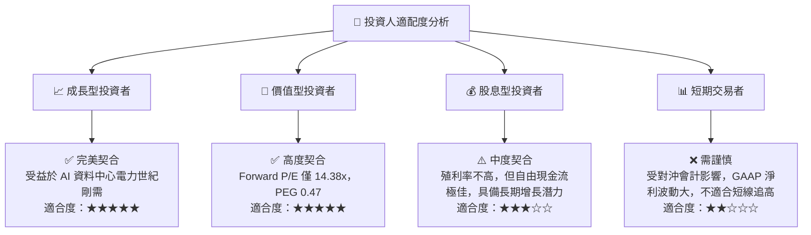

### 10.5 每季財報監控清單（Quarterly Watch List）

為了持續追蹤 VST 的投資論點是否成立，投資人應在每季財報中重點監控以下指標，並與設定的關鍵門檻值進行對比：

| 監控指標 | 基準值 (當前) | 偏多觸發門檻 (加碼) | 偏空警訊門檻 (減碼) | 監控核心意義 |
|---|---|---|---|---|
| **Adjusted EBITDA** | ~$4.5B - $5.0B (年化) | **> $5.5B** (年化) | **< $4.0B** (年化) | 反映扣除衍生品波動後的真實發電與零售獲利能力。 |
| **流通股數 (Shares Outstanding)** | 337.18M | **< 315M** (顯示回購力道持續) | **> 345M** (增發新股或回購停擺) | 驗證管理層「資本配置框架」的執行決心與每股價值創造。 |
| **核能稼動率 (Capacity Factor)** | ~92% - 95% | **> 96%** | **< 85%** (非計畫停機過多) | 核能電廠運營效率與安全性的最直接指標。 |
| **Net Debt / EBITDA** | 3.94x | **< 3.5x** (去槓桿順利) | **> 4.5x** (債務失控) | 監控公司的財務健康度與債務違約風險。 |
| ** retail 客戶流失率 (Churn Rate)**| ~1.2% / 月 | **< 1.0%** | **> 1.8%** | 評估 Retail 部門在德州市場的品牌忠誠度與定價能力。 |

### 10.6 反面論證：什麼會證明論點錯誤（What Would Change My Mind）

作為嚴謹的機構投資人，我們必須設定清晰的**「證偽條件」**。若以下任何一個量化條件在未來 12-18 個月內成立，本投資報告的「強烈買入」論點將立即失效，投資人應果斷進行減碼或清倉：

```
╔══════════════════════════════════════════════════════════════════╗
║              ⚠️ VST 投資論點失效條件 (Disconfirming Evidence)     ║
╠══════════════════════════════════════════════════════════════════╣
║  若出現以下任一量化條件，本多頭論點即告失效，須重新評估或退出：  ║
║                                                                  ║
║  ☐ 條件一：PJM 2026/2027 年容量電價拍賣意外跌破 $120 / MW-day   ║
║    （將直接摧毀 2026 年預期的 EBITDA 暴增預期）                  ║
║                                                                  ║
║  ☐ 條件二：與任何科技巨頭（Hyperscalers）的核能直供電 PPA 談判   ║
║    因監管或電網互聯問題在 2026 年底前全部宣告破裂                ║
║                                                                  ║
║  ☐ 條件三：公司 ROIC 連續兩季低於 WACC（跌破 6.0%）              ║
║    （代表公司資本配置開始摧毀股東價值）                         ║
║                                                                  ║
║  ☐ 條件四：管理層宣佈暫停股份回購計劃，將資金轉向低回報的非核心  ║
║    綠能發電併購案                                                ║
║                                                                  ║
╚══════════════════════════════════════════════════════════════════╝
```

---

> **免責聲明**：本報告為 AI 自動生成，僅供研究參考，不構成投資建議。投資有風險，入市需謹慎。