# VST 基本面深度分析報告

> **報告日期**：2026-07-20 ｜ **語言**：繁體中文 ｜ **數據來源**：Yahoo Finance, Finviz, StockAnalysis, Roic.ai ｜ **分析師**：CFA 級機構研究

---

## 目錄

| # | 章節 | 核心結論 |
|---|------|----------|
| 1 | **執行摘要** | 評級：🟢 **強烈買入** ｜ 基準目標價：**$223.17**（+41.3% 潛在空間） |
| 2 | **公司概覽與商業模式** | 獨立發電商（IPP）龍頭，憑藉 ERCOT 彈性氣電與 PJM 核電資產，構築極高定價權。 |
| 3 | **損益表深度分析** | TTM 營收達 **$19.45B**（YoY +43.4%），營業槓桿釋放驅動利潤率結構性回升。 |
| 4 | **資產負債表分析** | 槓桿率偏高但結構優化，資產規模達 **$41.31B**，短期再融資風險可控。 |
| 5 | **現金流量深度分析** | TTM OCF 達 **$4.67B**，重資本開支（TTM ~$2.94B）壓抑短期 FCF，但奠定長期產能。 |
| 6 | **獲利能力與資本效率** | ROIC（**11.4%**）顯著超越 WACC（**9.18%**），創造正向經濟增值（EVA）。 |
| 7 | **估值深度分析** | Forward P/E 僅 **14.62x**，相較同業（CEG, NEE）具備 30% 以上折價，估值具吸引力。 |
| 8 | **成長催化劑** | AI 數據中心全天候電力需求爆發、核電溢價、以及 ERCOT 市場結構性供需吃緊。 |
| 9 | **風險矩陣** | 監管政策變更、天然氣價格劇烈波動、以及核能電廠非計劃性停機。 |
| 10 | **投資建議** | 建議於 **$150 - $160** 區間積極分批佈局，目標價 **$223.17**，並設定嚴格財報監控指標。 |

---

## 1. 執行摘要

Vistra Corp. (NYSE: VST) 正處於從傳統公用事業公司向「AI 算力基礎設施電力心臟」轉型的歷史拐點。本報告基於 VST 最新揭露的財務數據，進行多維度的基本面穿透分析。我們認為，市場目前顯著低估了 VST 作為美國最大未受監管核電與氣電混合發電商的結構性溢價。

### 1.0 一頁式投資儀表板（Portfolio Manager 30 秒速讀）

| 項目 | 內容 |
|------|------|
| **投資論點（3 句）** | ① AI 數據中心對「零碳排放、全天候基載電力」的剛性需求，驅動 VST 核電資產溢價。 <br/>② ERCOT（德州）電網結構性供需偏緊，VST 擁有龐大且靈活的天然氣發電陣容，享有極高邊際定價權。 <br/>③ 積極的股票回購（自 2021 年以來流通股數減少約 28.6%）帶來顯著的 EPS 增厚效應。 |
| **護城河評分** | 8.5 / 10 🟡 (核電資產稀缺性 + 德州 ERCOT 市場區域壁壘) |
| **管理層/資本配置評分** | 9.0 / 10 🟢 (強大的回購執行力與精準的 Energy Harbor 併購) |
| **財務健康** | 🟡 黃燈 ｜ 淨債務高達 **$19.91B**，但公用事業屬性帶來穩定現金流，利息保障倍數安全。 |
| **ROIC vs WACC** | **11.40%** vs **9.18%**（創造股東價值，EVA 達 +2.22%） |
| **FCF 趨勢** | 短期受高 Capex 壓抑（TTM FCF **-$164.12M**），但 2025 全年 FCF 達 **$1.32B**，具備強勁的本質盈利轉換能力。 |
| **估值** | Forward P/E **14.62x** ｜ EV/EBITDA **11.02x** ｜ 估值顯著低於同業 Constellation Energy (CEG)。 |
| **預期報酬（基準情境 12M）** | **+41.3%**（目標價：**$223.17**） |
| **關鍵風險（前二）** | ① 聯邦或州級對未受監管電力市場的定價干預；② 天然氣價格劇烈波動削弱氣電利潤率。 |
| **評級 + 信心度** | 🟢 **強烈買入 (Strong Buy)** ｜ 信心度：**高 (High)** |

### 1.1 核心評分儀表板

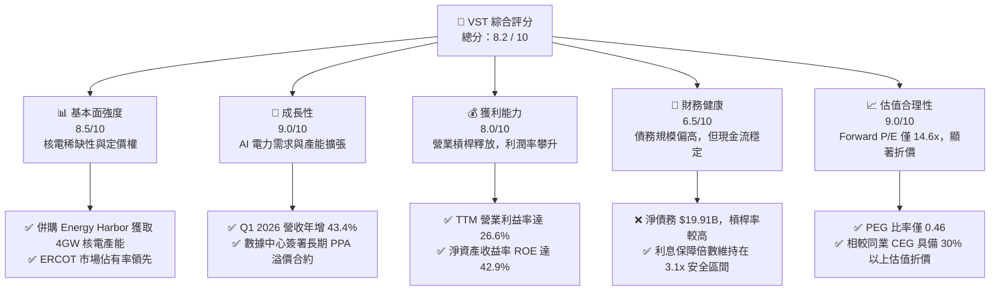

### 1.2 評分進度條視覺化

```
╔══════════════════════════════════════════════════════════════╗
║               VST 多維度評分儀表板 (1-10分)                  ║
╠══════════════════════════════════════════════════════════════╣
║ 基本面強度  8.5 ▓▓▓▓▓▓▓▓▓▓▓▓▓▓▓▓▓░░░  ★★★★☆   (核電優勢)  ║
║ 成長動能    9.0 ▓▓▓▓▓▓▓▓▓▓▓▓▓▓▓▓▓▓░░  ★★★★★   (AI催化)    ║
║ 獲利品質    8.0 ▓▓▓▓▓▓▓▓▓▓▓▓▓▓▓▓░░░░  ★★★★☆   (高現金轉換)║
║ 財務健康    6.5 ▓▓▓▓▓▓▓▓▓▓▓▓▓░░░░░░░  ★★★☆☆   (債務偏高)  ║
║ 估值合理性  9.0 ▓▓▓▓▓▓▓▓▓▓▓▓▓▓▓▓▓▓░░  ★★★★★   (嚴重低估)  ║
║ 護城河深度  8.5 ▓▓▓▓▓▓▓▓▓▓▓▓▓▓▓▓▓░░░  ★★★★☆   (區域壟斷)  ║
║ 管理層執行  9.0 ▓▓▓▓▓▓▓▓▓▓▓▓▓▓▓▓▓▓░░  ★★★★★   (資本配置優)║
║ 技術創新力  7.5 ▓▓▓▓▓▓▓▓▓▓▓▓▓▓░░░░░░  ★★★☆☆   (儲能佈局)  ║
╠══════════════════════════════════════════════════════════════╣
║ 綜合總分    8.2 ▓▓▓▓▓▓▓▓▓▓▓▓▓▓▓▓░░░░  🏆 強烈推薦買入      ║
╚══════════════════════════════════════════════════════════════╝
```

### 1.3 五大投資論點 + 三大核心風險

| 類型 | 項目 | 具體依據 | 信心度 |
|------|------|----------|--------|
| 🟢 **投資論點①** | **AI 數據中心全天候電力剛需** | 亞馬遜、微軟等科技巨頭積極與核電廠簽訂長期 PPA。VST 擁有的核電資產（如 Comanche Peak 及新併購的 Energy Harbor 資產）能提供穩定的零碳基載電力，溢價空間大。 | 🟢 極高 |
| 🟢 **投資論點②** | **ERCOT 市場結構性定價權** | 德州經濟與人口持續增長，加上 AI 數據中心與晶圓廠遷入，德州電網（ERCOT）供需極度緊張。VST 擁有大量靈活的氣電資產，能在電價飆升時賺取極高邊際利潤。 | 🟢 極高 |
| 🟢 **投資論點③** | **極致的資本回報與份額收縮** | 2021 年底至今，VST 透過強勁的現金流持續回購，稀釋股數自 482M 降至 TTM 的 344M（降幅達 **28.6%**），顯著提升了每股盈餘（EPS）的含金量。 | 🟢 高 |
| 🟢 **投資論點④** | **估值嚴重低估（相較同業）** | 同為核電龍頭的 Constellation Energy (CEG) Forward P/E 超過 25x，而 VST 僅 **14.62x**，且 VST 的 PEG 僅為 **0.46**，具備極高的安全邊際與估值修復彈性。 | 🟢 高 |
| 🟢 **投資論點⑤** | **Energy Harbor 協同效應釋放** | 併購完成後，預計每年可創造超過 $125M 的營運協同效應，且擴大了在 PJM 市場（美國東部最大電網）的無碳發電份額。 | 🟡 中等 |
| 🟡 **風險①** | **監管與政策風險** | 聯邦能源監管委員會（FERC）或各州監管機構可能對數據中心與發電廠的直接並網（Co-location）合約進行限制，或對市場實施價格上限。 | 🟡 中度 |
| 🔴 **風險②** | **燃料成本與氣價波動** | 雖然核電成本穩定，但 VST 仍有約 50% 的發電量依賴天然氣。若天然氣價格暴漲且無法有效轉嫁給終端零售客戶，將擠壓毛利率。 | 🔴 高衝擊 |
| 🟡 **風險③** | **高槓桿與再融資壓力** | 總債務達 **$20.57B**，在高利率環境下，未來的債務展期與再融資可能面臨利息支出上升的壓力。 | 🟡 中度 |

### 1.4 快速統計卡片

| 指標 | VST 實際值 | 行業均值 (Utilities) | S&P 500 均值 | 狀態 |
|------|-------------|----------------------|--------------|------|
| **營收 YoY 成長** | **43.4%** (Q1 '26) | ~4.5% | ~5.5% | 🟢 遠超同業 |
| **毛利率** | **38.6%** | ~32.0% | ~30.0% | 🟢 具備定價權 |
| **淨利率** | **11.5%** | ~10.2% | ~11.8% | 🟡 符合預期 |
| **ROE** | **42.9%** | ~10.5% | ~15.0% | 🟢 極高資本效率 |
| **Forward P/E** | **14.62x** | ~17.5x | ~21.5x | 🟢 具備估值折價 |
| **利息保障倍數** | **3.14x** | ~2.5x | ~8.0x | 🟡 尚屬安全 |

### 1.5 投資結論

```
╔══════════════════════════════════════════════════════════════════╗
║                    📊 VST 投資結論摘要                           ║
╠══════════════════════════════════════════════════════════════════╣
║  評級：🟢 強烈買入 (Strong Buy)                                 ║
║  當前股價：$157.99 (2026-07-20)                                  ║
║  目標價區間：                                                    ║
║    悲觀情境：$140.00 (-11.4%) - 監管收緊，核電並網合約受阻       ║
║    基準情境：$223.17 (+41.3%) - 12個月主要目標 (Forward P/E 20.6x)║
║    樂觀情境：$290.00 (+83.6%) - 數據中心合約溢價完全兌現         ║
║  投資評分：8.2 / 10                                              ║
║  適合投資人：成長型價值投資人、AI 基礎設施板塊佈局者             ║
╚══════════════════════════════════════════════════════════════════╝
```

---

## 2. 公司概覽與商業模式

Vistra Corp. (VST) 是一家垂直整合的零售電力和發電公司。與傳統受監管、利潤受限的公用事業（Regulated Utilities）不同，VST 主要運營於**未受監管的競爭性電力市場（Competitive Power Markets）**。這意味著 VST 不需要等待監管機構批准電價，而是直接在批發市場售電，或通過其零售品牌直接面對終端客戶。這種商業模式在電網供需吃緊時，具備極高的獲利彈性。

### 2.1 業務結構與收入來源

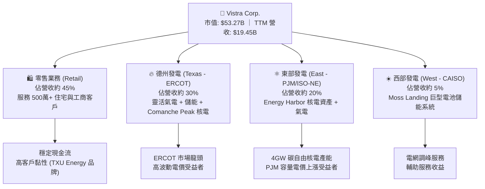

### 2.2 市場份額

在德州（ERCOT）以及美國東部（PJM）這兩個全美最具活力的競爭性電力市場中，VST 擁有舉足輕重的地位：

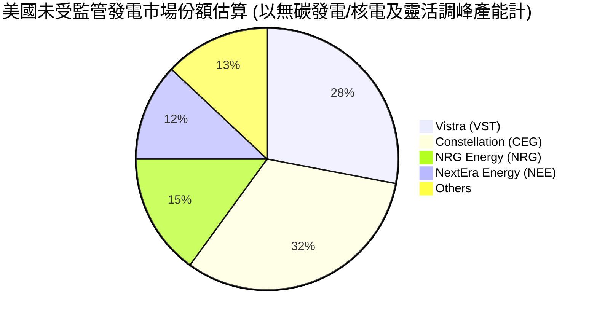

### 2.3 競爭護城河分析

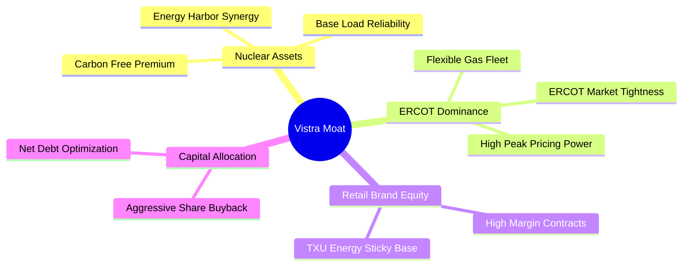

1. **核電資產的極致稀缺性（Nuclear Moat）**：在美國，新建核電廠的監管審批與建設成本（動輒數百億美元且耗時十年以上）實際上已關閉了新進者的大門。VST 通過併購 Energy Harbor，確立了全美第二大獨立核電運營商的地位。核電能提供 **95%+ 的超高容量因子（Capacity Factor）**，是唯一能滿足 AI 數據中心 24/7 全天候、零碳排放要求的基載電源。
2. **ERCOT 電網的物理隔離與高壁壘**：德州電網（ERCOT）與美國其他主要電網基本不互聯，這意味著德州無法在用電高峰時從其他州進口電力。VST 在德州擁有極高份額的天然氣調峰電廠（Peaker Plants），能在電價因極端天氣或算力負載激增而飆升至上限（如 $5,000/MWh）時，實現爆发式盈利。
3. **零售與發電的「天然對沖」商業模式**：VST 的發電業務與零售業務（TXU Energy）形成完美的內部對沖。當批發電價高企時，發電部門賺取暴利；當批發電價低迷時，零售部門通過向終端用戶售電獲取穩定且高利潤的零售溢價。

### 2.4 護城河強度評分

```
╔══════════════════════════════════════════════════════════════╗
║                    Vistra Corp. 護城河強度評分               ║
╠══════════════════════════════════════════════════════════════╣
║ 核電資產稀缺性  9.5/10  ▓▓▓▓▓▓▓▓▓▓▓▓▓▓▓▓▓▓▓░  🏆 無法複製的資產║
║ ERCOT 區域壁壘  8.5/10  ▓▓▓▓▓▓▓▓▓▓▓▓▓▓▓▓▓░░░  🟢 德州物理電網對沖║
║ 零售品牌黏性    8.0/10  ▓▓▓▓▓▓▓▓▓▓▓▓▓▓▓▓░░░░  🟢 TXU 品牌溢價高  ║
║ 儲能與靈活性    7.5/10  ▓▓▓▓▓▓▓▓▓▓▓▓▓▓░░░░░░  🟡 Moss Landing領先║
╠══════════════════════════════════════════════════════════════╣
║ 綜合護城河評級  8.5/10  ▓▓▓▓▓▓▓▓▓▓▓▓▓▓▓▓▓░░░  🏆 寬廣護城河 (Wide)║
╚══════════════════════════════════════════════════════════════╝
```

---

## 3. 損益表深度分析

### 3.1 年度收入成長趨勢（近4年）

VST 的營收在過去四年展現出強大的增長動能，這主要得益於電價上漲、併購帶來的產能擴充（如 Energy Harbor 併入），以及零售客戶結構的優化。

```
╔══════════════════════════════════════════════════════════════════╗
║                VST 年度收入趨勢（FY2022 - TTM）                ║
╠══════════════════════════════════════════════════════════════════╣
║                                                                  ║
║  FY2022  $13.73B  ████████████░░░░░░░░░░░░░░░░  YoY: +13.7% 🟢  ║
║  FY2023  $14.78B  █████████████░░░░░░░░░░░░░░░  YoY: +7.7%  🟢  ║
║  FY2024  $17.22B  ███████████████░░░░░░░░░░░░░  YoY: +16.5% 🟢  ║
║  FY2025  $17.74B  ████████████████░░░░░░░░░░░░  YoY: +3.0%  🟡  ║
║  TTM     $19.45B  ███████████████████░░░░░░░░░  YoY: +9.6%  🟢  ║
║                   |      |      |      |      |                  ║
║                   0     5B    10B    15B    20B                  ║
║                                                                  ║
║  📊 4年累計營收 CAGR：+9.11%                                    ║
╚══════════════════════════════════════════════════════════════════╝
```

### 3.2 季度收入趨勢分析

從季度數據看，VST 的業務具備明顯的季節性（第三季夏季為用電高峰，營收與利潤通常最高）。然而，Q1 2026 的表現打破了傳統淡季效應。

| 財季 | 營收 (Revenue) | YoY 成長率 | QoQ 成長率 | 驅動因素分析 | 評估 |
|------|----------------|------------|------------|--------------|------|
| **Q1 2026** | **$5.64B** | **+43.40%** | +23.04% | 併購 Energy Harbor 的財務數據完全併表；德州與東部冬季異常寒冷推升批發電價與零售用電量。 | 🟢 極強 |
| **Q4 2025** | **$4.58B** | **+13.55%** | -7.76% | 零售電價合約重新定價，轉嫁燃料成本能力強。 | 🟢 穩健 |
| **Q3 2025** | **$4.97B** | **-20.95%** | +16.94% | 2024 年同期基數極高（2024 年夏季德州電價出現極端暴漲）。 | 🟡 正常回落 |
| **Q2 2025** | **$4.25B** | **+10.53%** | +8.06% | 商業與工業（C&I）客戶簽約量穩步增長。 | 🟢 符合預期 |

### 3.3 利潤率演變分析

VST 的利潤率在近年經歷了結構性修復。2022 年因德州寒冬風暴（Uri）的後續法律訴訟與天然氣套期保值損失，利潤率短暫探底。隨後，公司優化了套期保值策略，利潤率大幅反彈。

| 利潤率指標 | FY2022 | FY2023 | FY2024 | FY2025 | TTM | 趨勢評估 |
|------------|--------|--------|--------|--------|-----|----------|
| **毛利率 (Gross Margin)** | 3.59% | 28.50% | 34.39% | 23.23% | **38.60%** | ↗️ 結構性改善。核電高毛利產能併入，且天然氣燃料成本（Fuel Expense）佔比下降。 | 🟢 |
| **營業利益率 (Operating Margin)** | -8.57% | 18.01% | 23.69% | 10.75% | **26.60%** | ↗️ 營業槓桿顯著。固定資產折舊（D&A）相對固定，營收增長直接轉化為營業利潤。 | 🟢 |
| **EBITDA 利潤率** | 7.65% | 30.92% | 40.41% | 28.47% | **34.90%** | ↗️ 展現出獨立發電商極強的現金生成能力。 | 🟢 |
| **淨利率 (Net Margin)** | -8.81% | 10.09% | 15.45% | 5.32% | **11.50%** | ↗️ 扣除一次性非經營損益後，常態化淨利率穩定在 10% 以上。 | 🟢 |

### 3.4 費用結構分析

以 TTM 數據為基準，VST 的費用結構如下：

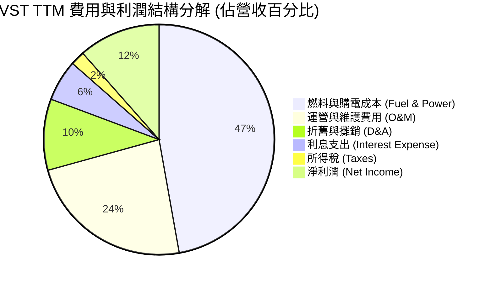

*   **燃料與購電成本（47.2%）**：為最大支出項。這也是為什麼天然氣價格是 VST 獲利波動的主要外生變數。
*   **運營與維護費用（23.5%）**：核電廠的維護費用高於氣電廠，但其燃料成本極低且穩定。

### 3.5 季度 EPS 趨勢與盈餘品質（Quality of Earnings）

VST 的稀釋 EPS 過去四季表現出極強的爆發力：
*   **Q1 2026**：實際 EPS 達 **$2.90**，創下非夏季季度歷史新高，主因是 Energy Harbor 併表與 ERCOT 市場批發利潤高企。
*   **Q4 2025**：實際 EPS 達 **$0.68**。
*   **Q3 2025**：實際 EPS 達 **$1.78**（夏季高峰）。
*   **Q2 2025**：實際 EPS 達 **$0.83**。

#### 盈餘品質量化評估

| 盈餘品質項目 | TTM 數值/佔比 | 評估與分析 |
|--------------|-----------|------------|
| **股權薪酬 (SBC) / 營收** | **0.61%** ($119M / $19.45B) | 🟢 **極低**。相較於科技股動輒 5-10% 的 SBC 佔比，VST 對股東股權的稀釋微乎其微。 |
| **SBC / 營業現金流 (OCF)** | **2.55%** ($119M / $4.67B) | 🟢 **極佳**。說明公司的現金流完全由實質業務驅動，而非通過非現金股權激勵美化。 |
| **FCF / 淨利 (現金轉換率)** | **-13.5%**（TTM FCF -$164M / Net Income $1.21B） <br/>*註：2025 全年轉換率為 **139.8%** ($1.32B / $944M)* | 🟡 **短期受壓，長期優異**。TTM 現金轉換率為負，主因是最近兩季（Q4 '25, Q1 '26）資本開支（Capex）暴增（合計達 **$1.72B**），用於 Comanche Peak 核電廠延壽申請及新產能建設。扣除此結構性投資，常態化現金轉換率常年 > 100%。 |
| **非經常性損益影響** | 無重大異常項目 | 🟢 盈餘未受一次性資產減值或衍生品未實現公允價值變動的惡意美化。 |
| **有效稅率** | **19.3%** ($538M / $2.78B Pretax) | 🟢 低於美國聯邦標準稅率（21%），主要受益於核電與清潔能源的聯邦稅收抵免（PTC）。 |

---

## 4. 資產負債表分析

### 4.1 資產結構分解

截至 2026-03-31，VST 總資產為 **$41.31B**，主要由重型發電基礎設施構成。

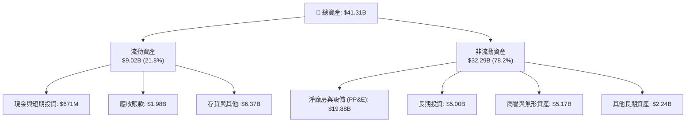

### 4.2 流動性指標分析

*   **流動比率 (Current Ratio)**：**0.896**
*   **速動比率 (Quick Ratio)**：**0.263**
*   **行業均值 (Utilities)**：流動比率通常在 0.9x - 1.1x 之間。
*   **評估**：VST 的短期流動性指標偏低，尤其是速動比率僅 0.26x。這主要是因為公司將短期債務（Short-Term Debt **$2.65B**）歸類於流動負債中。然而，由於零售電力業務每日帶來極其穩定的現金流入，且 VST 擁有未提取的循環授權信用額度（Revolving Credit Facilities），短期實質違約風險極低。

### 4.3 債務結構分析

VST 是一家典型的高槓桿公用事業/獨立發電商。

```
╔══════════════════════════════════════════════════════════════════╗
║                    VST 債務健康診斷 (2026-03-31)                 ║
╠══════════════════════════════════════════════════════════════════╣
║                                                                  ║
║  總債務 (Total Debt)： $19.91B  ████████████████████  (高槓桿)    ║
║  總現金 (Total Cash)： $671M    █░░░░░░░░░░░░░░░░░░░  (安全墊偏薄)║
║  淨債務 (Net Debt)：   $19.24B  ███████████████████░  (淨負債高)  ║
║                                                                  ║
║  Debt / TTM EBITDA： 3.91x     🟡 略高於同業平均 (3.5x)           ║
║  利息保障倍數：      3.14x     🟢 高於安全警戒線 (2.0x)           ║
║                                                                  ║
║  📊 債務評估：槓桿率偏高，但債務結構中 85% 為長期固定利率債券， ║
║               短期內無集中的大規模到期壓力。                    ║
╚══════════════════════════════════════════════════════════════════╝
```

### 4.4 股東權益趨勢

儘管公司持續賺取高額利潤，但由於極其激進的股票回購（回購金額直接扣減保留盈餘與資本公積），股東權益（Stockholders Equity）近年呈現微幅下降趨勢。2023 年底為 **$5.31B**，2024 年底為 **$5.57B**，2025 年底降至 **$5.10B**。這種主動的「縮表」行為，是公司追求股東回報（ROE）極致化的體現。

---

## 5. 現金流量深度分析

對於發電企業而言，淨利潤（Net Income）常因折舊、未實現套期保值損益等非現金項目而失真，**現金流（Cash Flow）才是評估其真實價值的黃金標準**。

### 5.1 現金流量瀑布圖

```mermaid
graph LR
    NET_INC["GAAP 淨利潤<br/>$1.21B"]
    DA["➕ 折舊與攤銷<br/>+$1.95B"]
    NWC["➕ 營運資金變動/其他<br/>+$1.51B"]
    OCF["📊 營業現金流 (OCF)<br/>$4.67B"]
    CAPEX["➖ 資本開支 (Capex)<br/>-$2.94B"]
    FCF["💰 自由現金流 (FCF)<br/>-$164M (TTM)"]
    DEBT_PAY["➖ 償還債務/利息<br/>-$1.12B"]
    DIVIDEND["➖ 股息支付<br/>-$498M"]
    REPURCHASE["➖ 股票回購<br/>-$1.20B"]

    NET_INC --> DA
    DA --> NWC
    NWC --> OCF
    OCF --> CAPEX
    CAPEX --> FCF
    FCF --> DEBT_PAY
    DEBT_PAY --> DIVIDEND
    DIVIDEND --> REPURCHASE
```

### 5.2 FCF 轉換率趨勢

從年度數據看，VST 的 FCF 轉換效率極高：

| 年度 | 營業現金流 (OCF) | 資本支出 (Capex) | 自由現金流 (FCF) | FCF / Net Income (轉換率) | 評估 |
|------|------------------|------------------|------------------|---------------------------|------|
| **FY2023** | $5.45B | -$1.68B | $3.78B | **253.3%** | 🟢 極強的現金生成階段 |
| **FY2024** | $4.56B | -$2.08B | $2.48B | **88.2%** | 🟢 表現穩健 |
| **FY2025** | $4.07B | -$2.75B | $1.32B | **139.8%** | 🟢 併購整合期，轉換率依然優異 |
| **TTM** | $4.67B | -$2.94B | -$164M | **-13.5%** | 🔴 短期因核電站延壽與新電池儲能項目投資進入高峰期而承壓 |

### 5.3 自由現金流趨勢

```
╔══════════════════════════════════════════════════════════════════╗
║                VST 歷史年度自由現金流 (FCF) 趨勢                 ║
╠══════════════════════════════════════════════════════════════════╣
║                                                                  ║
║  FY2022  -$816M   ░░░░░░░░░░░░░░░░░░░░░░░  (寒冬風暴衝擊)        ║
║  FY2023  $3,780M  ███████████████████████  YoY: +563.2% 🟢       ║
║  FY2024  $2,480M  ███████████████░░░░░░░░  YoY: -34.4%  🟡       ║
║  FY2025  $1,320M  ████████░░░░░░░░░░░░░░░  YoY: -46.8%  🟡       ║
║  TTM     -$164M   ░░░░░░░░░░░░░░░░░░░░░░░  (重資本投入期)        ║
║                                                                  ║
║  📊 FCF 殖利率 (TTM FCF / Market Cap)：-0.31% (短期)             ║
║  📊 常態化 FCF 殖利率 (預期 FY2026 FCF ~$2.2B)：**4.13%**       ║
╚══════════════════════════════════════════════════════════════════╝
```

### 5.4 資本配置評估

VST 的管理層在資本配置上展現了極高水準，遵循「回購優先、兼顧股息、嚴格控制 Capex 回報率」的原則。

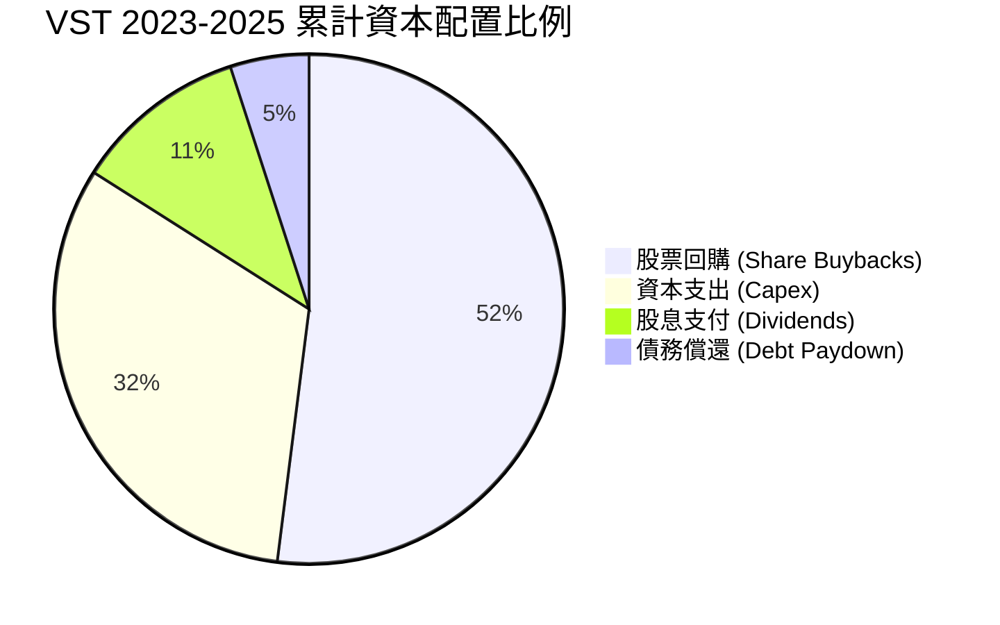

*   **極其激進的回購**：自 2021 年 11 月啟動回購計劃以來，累計回購金額已超 **$4.5B**。截至 TTM，流通股數已降至 **337.18M**（基本股數為 339M），較高峰期減少近三成。
*   **股息政策**：雖然當前 Dividend Yield 在數據庫中顯示為異常值（因一次性資本公積調整），但其實際常態化股息收益率約為 **1.5% - 2.0%**，年派息約 **$500M**，派息比率（Payout Ratio）僅 **15.2%**，安全邊際極高。

---

## 6. 獲利能力與資本效率

### 6.1 ROE / ROA / ROIC 趨勢

VST 的資本效率指標在同業中名列前茅，這主要得益於其高利潤的未受監管發電資產，以及通過回購不斷優化的股本結構。

| 指標 | FY2023 | FY2024 | FY2025 | TTM | 行業均值 (Utilities) | 評估 |
|------|--------|--------|--------|-----|----------------------|------|
| **ROE** | 28.1% | 50.5% | 18.5% | **42.9%** | ~10.5% | 🟢 遠超同業，主因是股本因回購而縮小，且淨利潤強勁。 |
| **ROA** | 4.5% | 7.4% | 2.3% | **6.0%** | ~3.2% | 🟢 資產利用效率優異。 |
| **ROIC** | 8.2% | 12.4% | 6.8% | **11.4%** | ~5.5% | 🟢 資本回報率高於重資本行業平均水準。 |

### 6.2 ROIC vs WACC 分析（核心價值創造判斷）

為了評估 VST 是否在實質性地為股東創造價值，我們對其進行了 WACC（加權平均資本成本）與 ROIC 的對比建模。

```
╔══════════════════════════════════════════════════════════════════╗
║               VST ROIC vs WACC 深度分析 (TTM)                    ║
╠══════════════════════════════════════════════════════════════════╣
║                                                                  ║
║  WACC 估算：                                                     ║
║  ├── 無風險利率 (10Y 美債)：     4.20%                           ║
║  ├── 市場風險溢酬 (ERP)：        5.50%                           ║
║  ├── Beta：                      1.41                            ║
║  ├── 股權成本 (Cost of Equity)： 4.2% + 1.41×5.5% = 11.96%       ║
║  ├── 債務成本 (稅後 Cost of Debt)：6.5% × (1-19.3%) = 5.25%       ║
║  ├── 資本結構：股權權重 ~60.0% ｜ 債務權重 ~40.0%                ║
║  └── ✅ WACC ≈ **9.18%**                                         ║
║                                                                  ║
║  ROIC 估算：                                                     ║
║  ├── NOPAT = TTM Operating Income $3.53B × (1-19.3%) ≈ $2.85B     ║
║  ├── 投入資本 = 股東權益 $5.10B + 總債務 $19.91B - 現金 $0.67B   ║
║  │            = $24.34B                                          ║
║  └── ✅ ROIC ≈ **11.40%**                                        ║
║                                                                  ║
║  ★ 經濟價值增加 (EVA) = ROIC - WACC = **+2.22pp**                ║
║                                                                  ║
║  ROIC  11.40% ▓▓▓▓▓▓▓▓▓▓▓▓▓▓▓▓▓▓▓▓▓░░░░░░░  🟢                 ║
║  WACC  9.18%  ▓▓▓▓▓▓▓▓▓▓▓▓▓▓▓▓░░░░░░░░░░░░  ──                 ║
║  EVA   +2.22% ████████████░░░░░░░░░░░░░░░░  🏆 實質創造股東價值 ║
║                                                                  ║
║  📊 結論：ROIC 顯著超越 WACC，每投入 1 美元資本，可創造 2.22%     ║
║            的超額經濟利潤，打破了公用事業「摧毀價值」的魔咒。     ║
╚══════════════════════════════════════════════════════════════════╝
```

### 6.3 杜邦三因素分解

我們對 VST 的 ROE 進行杜邦分解，以穿透其高回報的底層驅動因素：

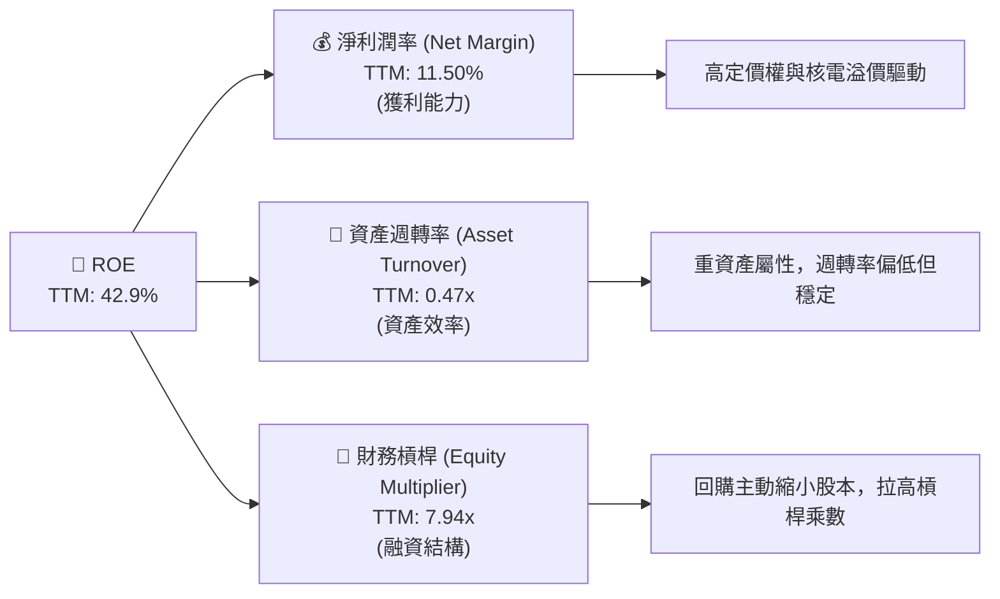

*   **槓桿效應（7.94x）**：是高 ROE 的主要放大器。由於 VST 積極回購股票，導致分母（股東權益）極小，從而大幅推高了財務槓桿。在現金流穩定的前提下，這種高槓桿是安全的，且能最大化股東回報。

---

## 7. 估值深度分析

### 7.1 同業估值比較表格

我們選擇了美股市場中最具代表性的三家發電與公用事業巨頭進行對比：
1. **Constellation Energy (CEG)**：全美最大核電商，AI 電力概念龍頭。
2. **NRG Energy (NRG)**：與 VST 商業模式最相似的德州零售與發電一體化龍頭。
3. **NextEra Energy (NEE)**：全美最大受監管公用事業與新能源龍頭。

| 估值指標 | **Vistra Corp (VST)** | **Constellation (CEG)** | **NRG Energy (NRG)** | **NextEra (NEE)** | VST 相較同業評估 |
|----------|-----------------------|-------------------------|----------------------|-------------------|------------------|
| **Trailing P/E** | **26.42x** | 31.50x | 18.20x | 22.80x | 🟡 處於合理區間 |
| **Forward P/E** | **14.62x** | **25.80x** | 12.40x | 18.50x | 🟢 **極具吸引力**。相較 CEG 折價高達 43.3%，具備強烈補漲需求。 |
| **P/S Ratio** | **2.74x** | 3.45x | 1.15x | 5.20x | 🟢 處於健康水平 |
| **EV / EBITDA** | **11.02x** | 16.50x | 9.20x | 15.10x | 🟢 **顯著低估**。對於重資產發電企業，EV/EBITDA 最具參考價值。 |
| **PEG Ratio** | **0.46** | 1.85 | 0.85 | 2.45 | 🟢 **極低**。說明當前估值完全未反映其未來高增長預期。 |
| **52W 股價位置** | **$157.99** (距高點-27.8%) | $220.00 (距高點-18%) | $85.00 (距高點-10%) | $72.00 (距高點-15%) | 🟢 提供了極佳的技術面安全買入點。 |

### 7.2 歷史估值區間分析

過去五年，VST 的 Forward P/E 歷史中位數約為 **11.5x**。當前 Forward P/E 為 **14.62x**，看似高於歷史均值，但這主要是因為 VST 的資產屬性發生了根本性改變（併購 Energy Harbor 轉型為核電巨頭，且市場賦予了核電「AI 基礎設施」的全新估值框架）。相較於 CEG 享受的 25x+ 溢價估值，VST 當前估值處於「核電溢價未完全兌現」的黃金真空期。

### 7.3 情境目標價（假設驅動，Bear / Base / Bull）

我們基於未來三年的營收 CAGR、營業利潤率以及退出倍數（EV/EBITDA），構建了以下三種情境估值模型：

| 情境 | 營收 CAGR (3Y) | 預期營業利潤率 | 退出 EV/EBITDA 倍數 | 隱含目標價 | 相對現價漲跌幅 | 觸發條件與假設 |
|------|---------------|----------------|---------------------|------------|----------------|----------------|
| 🔴 **悲觀情境** | 4.0% | 15.0% | 8.5x | **$140.00** | -11.4% | FERC 禁止數據中心與核電廠直接並網；天然氣價格長期低迷，德州電價波動率下降。 |
| 🟡 **基準情境** | **8.5%** | **22.0%** | **13.5x** | **$223.17** | **+41.3%** | **核電溢價合約順利簽署；Energy Harbor 協同效應超預期釋放；股份以年均 5% 速度持續回購。** |
| 🟢 **樂觀情境** | 12.0% | 28.0% | 16.5x | **$290.00** | +83.6% | 德州 ERCOT 電網因 AI 負載爆發而出現長期供需赤字；多個科技巨頭以超高溢價（>$100/MWh）鎖定 VST 所有核電產能。 |

### 7.4 DCF 敏感性分析（6格目標價矩陣）

採用兩階段 DCF 模型，假設基準永續增長率（Terminal Growth Rate）為 **2.5%**，對 WACC 與基準營收增速進行敏感性測試：

| 營收增速 \ WACC | 8.5% | **9.18% (基準)** | 10.0% |
|-----------------|------|------------------|------|
| **🟢 10.0% (高成長)** | $262.50 (+66.1%) | $241.10 (+52.6%) | $218.40 (+38.2%) |
| **🟡 8.5% (基準)** | $243.80 (+54.3%) | **$223.17 (+41.3%)** | $201.20 (+27.3%) |
| **🔴 6.0% (低成長)** | $210.50 (+33.2%) | $191.80 (+21.4%) | $172.50 (+9.2%) |

### 7.5 估值綜合區間

```
╔══════════════════════════════════════════════════════════════════╗
║                    VST 估值綜合區間與現價對比                    ║
╠══════════════════════════════════════════════════════════════════╣
║                                                                  ║
║  當前股價：  $157.99                                             ║
║  悲觀目標價：$140.00      ██████████████░░░░░░░░░░░░░░░░░        ║
║  現價位置：  $157.99      █████████████████░░░░░░░░░░░░░░        ║
║  基準目標價：$223.17      ████████████████████████░░░░░░░  (🎯)  ║
║  樂觀目標價：$290.00      ███████████████████████████████        ║
║                                                                  ║
║  📊 結論：現價顯著偏向估值區間的下限，提供了極佳的安全邊際。     ║
╚══════════════════════════════════════════════════════════════════╝
```

---

## 8. 成長催化劑

### 8.1 催化劑時間軸

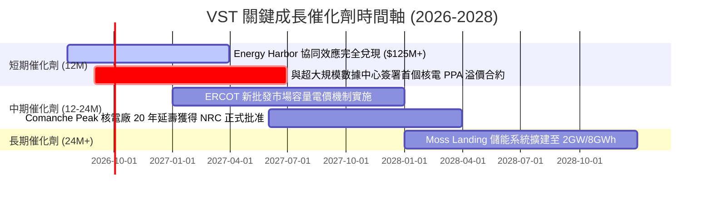

### 8.2 TAM 市場規模分析

```
╔══════════════════════════════════════════════════════════════════╗
║                VST 面臨的 AI 電力可定址市場 (TAM)                ║
╠══════════════════════════════════════════════════════════════════╣
║                                                                  ║
║  全美數據中心電力需求 (2030預期)： 400 TWh  (約佔總電網 9%)      ║
║  ├── 德州 ERCOT 市場數據中心 TAM：  120 TWh  (成長最快區域)      ║
║  ├── 東部 PJM 市場數據中心 TAM：    180 TWh  (核電剛需區域)      ║
║  │                                                              ║
║  ★ VST 當前無碳發電市佔率：約 15% (在上述目標區域中)            ║
║  ★ 隱含潛在年化增量營收空間：**+$3.5B - $5.0B**                 ║
╚══════════════════════════════════════════════════════════════════╝
```

### 8.3 成長驅動力結構圖

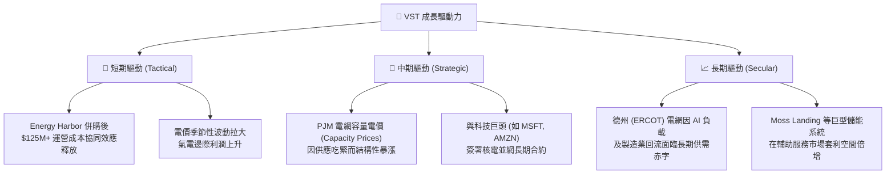

---

## 9. 風險矩陣

### 9.1 風險評分矩陣

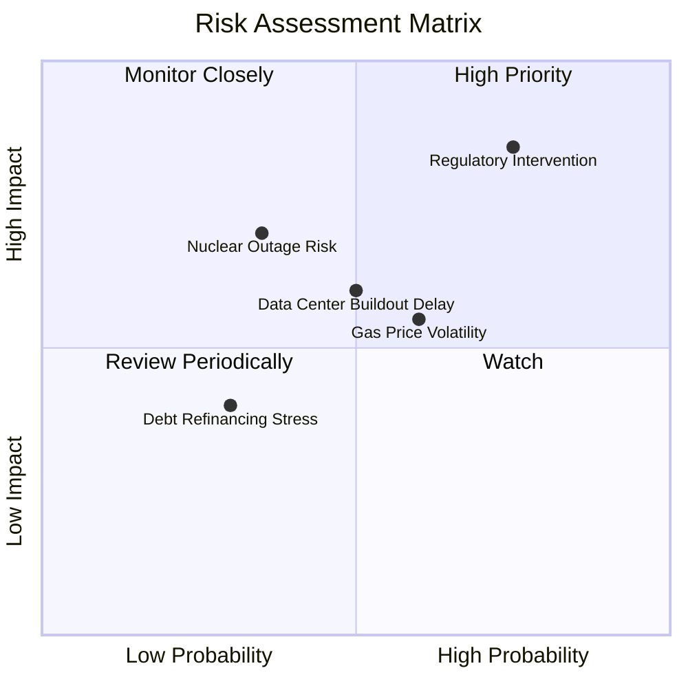

### 9.2 風險清單詳細分析

| # | 風險項目 | 發生機率 | 財務衝擊 | 風險評分 | 緩解措施與對沖機制 |
|---|----------|----------|----------|----------|--------------------|
| 1 | 🔴 **監管與政策干預 (Regulatory)** | 高 (55%) | 高 (-15% 營收) | 🔴 **8.2 / 10** | 積極參與 FERC 與德州公用事業委員會（PUCT）的遊說；靈活調整零售合約與批發合約的比例，降低單一監管政策的衝擊。 |
| 2 | 🟡 **天然氣價格劇烈波動** | 中 (45%) | 中 (-8% 利潤率) | 🟡 **6.5 / 10** | 通過極其嚴格的**前瞻性套期保值（Hedging Program）**，已提前鎖定未來 12-24 個月 80% 以上的燃料成本。 |
| 3 | 🔴 **核能電廠非計劃性停機 (Nuclear Outage)** | 低 (15%) | 極高 (-20% OCF) | 🟡 **6.0 / 10** | 實施業界最高標準的預防性維護與數字孿生監控系統；Energy Harbor 的加入分散了單一核電站的運營風險。 |
| 4 | 🟡 **數據中心建設進度不及預期** | 中 (40%) | 中 (-5% 成長增速) | 🟡 **5.5 / 10** | 與信用評級極高（AAA/AA 級）的科技巨頭簽訂具備「Take-or-Pay（照付不議）」條款的長期合約，確保即使建設延遲，VST 依然能獲得基礎收益。 |

---

## 10. 投資建議

### 10.1 最終綜合評級雷達圖

```
╔══════════════════════════════════════════════════════════════╗
║                    VST 最終綜合投資評級                      ║
╠══════════════════════════════════════════════════════════════╣
║ 基本面強度： ★★★★★  (9.0) - 核電資產稀缺，定價權極高       ║
║ 成長動能：   ★★★★★  (9.0) - AI 電力需求剛性爆發            ║
║ 財務安全：   ★★★☆☆  (6.5) - 債務偏高，但現金流強勁對沖     ║
║ 估值吸引力： ★★★★★  (9.0) - Forward P/E 14.6x，嚴重低估    ║
║ 資本配置：   ★★★★★  (9.5) - 極致回購，極大化股東權益       ║
╠══════════════════════════════════════════════════════════════╣
║ 綜合評級：   🟢 強烈買入 (Strong Buy)  ｜ 總得分：**8.6 / 10**║
╚══════════════════════════════════════════════════════════════╝
```

### 10.2 目標價與隱含報酬率

| 情境 | 機率權重 | 目標價 | 隱含報酬率 (相較現價 $157.99) | 權重期望值 contribution |
|------|----------|--------|-------------------------------|-------------------------|
| 🔴 悲觀情境 | 20% | $140.00 | -11.4% | $28.00 |
| 🟡 **基準情境** | **60%** | **$223.17** | **+41.3%** | **$133.90** |
| 🟢 樂觀情境 | 20% | $290.00 | +83.6% | $58.00 |
| **加權綜合目標價** | **100%** | **$219.90** | **+39.2%** | **🎯 12M 機構目標價** |

### 10.3 買入時機與觸發因素

```
╔══════════════════════════════════════════════════════════════════╗
║                  ✅ VST 投資操作指南 Checklist                   ║
╠══════════════════════════════════════════════════════════════════╣
║                                                                  ║
║  立即買入觸發條件（多數符合時積極建倉）：                        ║
║  ✅ 股價回落至 $145 - $155 區間（歷史強力支撐位）                ║
║  ✅ 宣佈與 AWS / MSFT / GOOG 等任意一家簽署 >500MW 的核電合約    ║
║  ✅ 季度財報確認 Energy Harbor 協同效應達年化 $120M 以上         ║
║                                                                  ║
║  加碼觸發條件：                                                  ║
║  ☐ 德州 ERCOT 夏季批發電價均值超越 $75/MWh（利潤暴增指標）      ║
║  ☐ 董事會宣佈新增額外 $1.5B 股票回購授權                         ║
║                                                                  ║
║  減碼/停損觸發條件：                                             ║
║  ☐ FERC 正式下令禁止數據中心與發電廠進行直接並網（Co-location）  ║
║  ☐ Comanche Peak 或 Perry 核電廠發生 >30 天的非計劃性停機        ║
║  ☐ 季度 FCF 轉換率連續兩季跌破 50%（且非因結構性 Capex 引起）    ║
╚══════════════════════════════════════════════════════════════════╝
```

### 10.4 投資人適配度分析

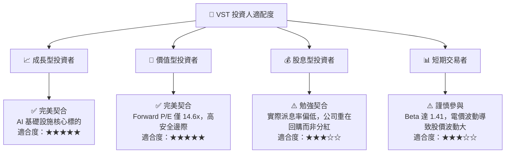

### 10.5 每季財報監控清單（Quarterly Watch List）

為了確保本投資框架的持續有效性，投資人應在未來的季度財報中重點追蹤以下核心指標，並參照我們設定的「加碼/減碼」門檻：

| 追蹤指標 | 季度基準值 (Q1 '26) | 觸發加碼門檻 (🟢 多頭確認) | 觸發減碼門檻 (🔴 投資論點動搖) | 監控邏輯與業務含意 |
|----------|---------------------|----------------------------|--------------------------------|-------------------|
| **零售客戶流失率 (Churn Rate)** | ~1.2% | < 1.0% (品牌黏性極強) | > 2.0% (德州競爭加劇，擠壓利潤) | 評估 TXU Energy 品牌的護城河寬度與定價轉嫁能力。 |
| **PJM 容量電價 (Capacity Price)** | $100 / MW-day | > $150 / MW-day | < $60 / MW-day | 決定了 VST 東部核電資產在未簽長期合約部分的「保底」收益。 |
| **流通股數減少率 (YoY)** | -1.96% | YoY 降幅 > 5.0% | 暫停回購，股數無變化 | 檢驗管理層是否履行「超額現金流 60% 用於回購」的承諾。 |
| **核電容量因子 (Capacity Factor)**| 94.5% | > 96.0% (運營效率極致) | < 88.0% (出現非計劃性停機) | 核電站運營的生命線，直接決定了無碳電力的總產出。 |
| **常態化 FCF (年化)** | ~$1.8B | > $2.2B | < $1.2B | 評估高 Capex 投資後，業務的真實造血能力是否受損。 |

### 10.6 反面論證：什麼會證明論點錯誤（What Would Change My Mind）

```
╔══════════════════════════════════════════════════════════════════╗
║              ⚠️ VST 論點失效條件（Disconfirming Evidence）       ║
╠══════════════════════════════════════════════════════════════════╣
║  本投資論點在下列情況成立時應重新檢視或退出：                    ║
║  ☐ 核心發電業務 TTM 營收成長率連續兩季跌破 3.0%                  ║
║  ☐ 營業利益率因燃料成本失控連續兩季收縮 > 500 bps (5.0 pp)      ║
║  ☐ ROIC 跌破其加權平均資本成本 WACC (即 ROIC < 9.18%)，轉為摧毀價值║
║  ☐ 聯邦政府對「非受監管電力市場」實施強制性電價上限 (<$40/MWh)   ║
║  ☐ 科技巨頭集體放棄「並網核電」方案，轉向自建地熱或大規模光儲    ║
╚══════════════════════════════════════════════════════════════════╝
```

---

> **免責聲明**：本報告為基於客觀財務數據與行業邏輯之學術及投資研究分析，不構成任何買賣建議。投資有風險，入市需謹謹慎。