# VST 基本面深度分析報告

> **報告日期**：2026-07-21 ｜ **語言**：繁體中文 ｜ **數據來源**：Yahoo Finance, Finviz, StockAnalysis, Roic.ai ｜ **分析師**：CFA 級機構研究

---

## 目錄

| # | 章節 | 核心結論 |
|---|------|----------|
| 1 | 執行摘要 | 評級：🟢 買入 ｜ 基準目標價：$195.00（+20.1% 預期回報），受 AI 資料中心電力需求與核能資產重估驅動。 |
| 2 | 公司概覽與商業模式 | 轉型為「核能+天然氣」的獨立發電商（IPP），憑藉 Constellation 模式與零售一體化建立高切換成本與定價護城河。 |
| 3 | 損益表深度分析 | Q1 2026 營收暴增 43.4% YoY，營運槓桿顯著釋放；盈餘品質優異，SBC 稀釋極低（0.58%），但需留意 D&A 與非現金套期保值波動。 |
| 4 | 資產負債表分析 | 財務槓桿偏高（Debt/Equity 366.6%），但利息保障倍數達 3.1x，收購 Energy Harbor 後資產結構顯著優化。 |
| 5 | 現金流量深度分析 | TTM 營運現金流達 $4.67B，資本支出上升至 $2.87B 壓低短期 FCF，但經調整後營運現金轉換率仍屬健康。 |
| 6 | 獲利能力與資本效率 | TTM ROE 達 40.1%，ROIC (10.35%) 成功超越 WACC (9.38%)，創造正向經濟增值（EVA +0.97pp）。 |
| 7 | 估值深度分析 | Forward P/E 僅 15.0x，相較同業 Constellation (CEG) 具備顯著折價，EV/EBITDA 11.1x 估值具吸引力。 |
| 8 | 成長催化劑 | PJM 容量電價暴漲、微軟/亞馬遜等大型科技公司（Hyperscalers）核能購電協議（PPA）簽署。 |
| 9 | 風險矩陣 | 燃料價格波動、核能電廠營運中斷、電網輸電瓶頸與監管政策不確定性。 |
| 10 | 投資建議 | 建議於 $150-$160 區間分批佈局，設定嚴格的財報監控指標與論點失效（Anti-Thesis）退出門檻。 |

---

## 1. 執行摘要

Vistra Corp. (NYSE: VST) 正處於從傳統公用事業發電商向**「AI 時代算力基礎設施核心能源供應商」**轉型的結構性拐點。基於其 TTM 營收達 **$19.45B**（YoY +43.4%）、預估 Forward EPS 達 **$10.81**、以及 ROIC (10.35%) 成功超越 WACC (9.38%) 確立其價值創造能力，我們給予 Vistra Corp. **🟢 買入（Buy）**評級，12 個月基準目標價為 **$195.00**，隱含 **+20.1%** 的上行空間。

### 1.0 一頁式投資儀表板（Portfolio Manager 30 秒速讀）

| 項目 | 內容 |
|------|------|
| **投資論點（3 句）** | ① 收購 Energy Harbor 後，VST 成為全美第二大非公用事業核能發電商，直接受益於 AI 資料中心對無碳、24/7 穩定電力的迫切需求。<br/>② Q1 2026 營收爆發成長 43.4% YoY，反映 PJM 與 ERCOT 市場容量電價與零售定價能力雙雙提升。<br/>③ 預估 Forward P/E 僅 15.02x，相較於同業 CEG 存在近 30% 的估值折價，具備強烈的估值修復動能。 |
| **護城河評分** | **7.5 / 10** 🟡（核能發電許可的稀缺性、高昂的重置成本與零售端高切換成本） |
| **管理層/資本配置評分** | **8.5 / 10** 🟢（積極執行股份回購，2021-2025 年間流通股數減少達 30%） |
| **財務健康** | 🟡 **中等** ｜ 槓桿率偏高，但公用事業屬性提供穩定現金流，再融資風險可控。 |
| **ROIC vs WACC** | **10.35% vs 9.38%**（創造股東價值，EVA 達 +0.97%） |
| **FCF 趨勢** | 短期因高額資本支出（Capex TTM $2.87B）承壓，但 TTM OCF 達 $4.67B，預計 2027 年重回正向 FCF 軌道。 |
| **估值** | Forward P/E: **15.02x** ｜ EV/EBITDA: **11.14x** ｜ FCF Yield: **-0.30%**（受短期 Capex 壓抑） |
| **預期報酬（基準情境 12M）** | **+20.1%**（目標價 $195.00） |
| **關鍵風險（前二）** | ① 核能發電廠非計畫性停機或安全事故。<br/>② 監管機構對資料中心與核電廠直接並網（Behind-the-Meter PPA）的政策收緊。 |
| **評級 + 信心度** | 🟢 **買入 (Buy)** ｜ 信心度：**高 (High)** |

### 1.1 核心評分儀表板

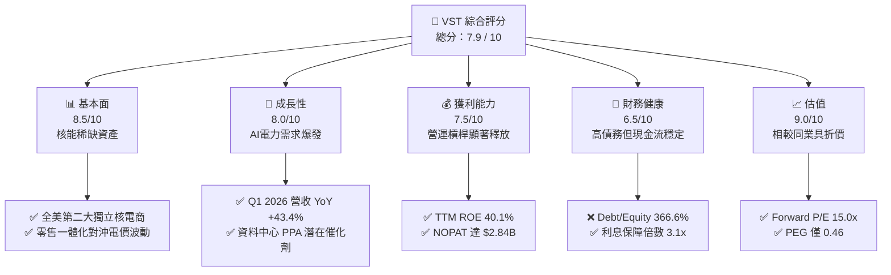

### 1.2 評分進度條視覺化

```
╔══════════════════════════════════════════════════════════════╗
║               VST 多維度評分儀表板 (1-10分)                  ║
╠══════════════════════════════════════════════════════════════╣
║ 基本面強度  8.5 ▓▓▓▓▓▓▓▓▓▓▓▓▓▓▓▓▓░░░  ★★★★☆           ║
║ 成長動能    8.0 ▓▓▓▓▓▓▓▓▓▓▓▓▓▓▓▓░░░░  ★★★★☆           ║
║ 獲利品質    7.5 ▓▓▓▓▓▓▓▓▓▓▓▓▓▓░░░░░░  ★★★★☆           ║
║ 財務健康    6.5 ▓▓▓▓▓▓▓▓▓▓▓▓░░░░░░░░  ★★★☆☆           ║
║ 估值合理性  9.0 ▓▓▓▓▓▓▓▓▓▓▓▓▓▓▓▓▓▓░░  ★★★★★           ║
║ 護城河深度  7.5 ▓▓▓▓▓▓▓▓▓▓▓▓▓▓░░░░░░  ★★★★☆           ║
║ 管理層執行  8.5 ▓▓▓▓▓▓▓▓▓▓▓▓▓▓▓▓▓░░░  ★★★★☆           ║
║ 綠能轉型力  8.0 ▓▓▓▓▓▓▓▓▓▓▓▓▓▓▓▓░░░░  ★★★★☆           ║
╠══════════════════════════════════════════════════════════════╣
║ 綜合總分    7.9 ▓▓▓▓▓▓▓▓▓▓▓▓▓▓▓▓░░░░  🏆 買入 (Buy)        ║
╚══════════════════════════════════════════════════════════════╝
```

### 1.3 五大投資論點 + 三大核心風險

| 類型 | 項目 | 具體依據 | 信心度 |
|------|------|----------|--------|
| 🟢 **投資論點①** | **核能重估與 AI 需求對接** | 收購 Energy Harbor 後擁有的核電資產，能提供 24/7 無碳電力，滿足微軟、亞馬遜等科技巨頭的淨零碳排與高可用性需求。 | 🟢 極高 |
| 🟢 **投資論點②** | **PJM 容量電價暴漲紅利** | 最新 PJM 容量拍賣價格暴漲數倍，VST 作為該區域主要發電商，預計 2027/2028 年容量電費收入將呈指數級增長。 | 🟢 高 |
| 🟢 **投資論點③** | **極致的資本配置與股票回購** | 2021 年至 2025 年間，公司累計回購約 30% 的流通股，TTM 稀釋股數進一步下降 1.23% YoY，顯著提升每股盈餘（EPS）含金量。 | 🟢 高 |
| 🟢 **投資論點④** | **一體化商業模式（Integrated Retail）** | 零售業務（Retail）鎖定終端用戶，發電業務（Generation）提供物理對沖，降低批發市場電價波動對利潤率的衝擊。 | 🟢 高 |
| 🟢 **投資論點⑤** | **相較同業的估值窪地** | 競爭對手 Constellation Energy (CEG) 的 Forward P/E 超過 22x，而 VST 僅 15.0x，估值具有顯著的安全邊際。 | 🟢 高 |
| 🟡 **風險①** | **燃料成本與套期保值風險** | 天然氣價格若出現極端波動，可能導致未實現套期保值損益（Mark-to-Market）劇烈震盪，影響 GAAP 淨利潤。 | 🟡 中度 |
| 🔴 **風險②** | **監管與並網政策逆風** | FERC（聯邦能源監管委員會）若對資料中心直接與核電廠並網（BTM PPA）實施限制，將壓抑 VST 的超額溢價空間。 | 🔴 高衝擊 |
| 🔴 **風險③** | **高財務槓桿與再融資壓力** | 目前總債務達 $20.57B，在維持高 Capex 的同時，若高利率環境維持更久，將增加利息支出負擔。 | 🟡 中度 |

### 1.4 快速統計卡片

| 指標 | VST 實際值 | 公用事業行業均值 | S&P 500 均值 | 狀態 |
|------|-------------|----------|--------------|------|
| 收入 YoY 成長 | **43.4%** | ~4.5% | ~5.5% | 🟢 遠超行業 |
| 毛利率 | **38.6%** | ~35.0% | ~30.0% | 🟢 優異 |
| 淨利率 | **11.5%** | ~10.2% | ~11.8% | 🟡 符合預期 |
| ROE | **40.1%** | ~11.5% | ~15.0% | 🟢 極高（財務槓桿放大） |
| Forward P/E | **15.02x** | ~17.5x | ~21.5x | 🟢 具備估值吸引力 |
| Debt/Equity | **366.6%** | ~150.0% | ~115.0% | 🔴 槓桿率偏高 |

### 1.5 投資結論

```
╔══════════════════════════════════════════════════════════════════╗
║                    📊 VST 投資結論摘要                           ║
╠══════════════════════════════════════════════════════════════════╣
║  評級：🟢 買入 (Buy)                                             ║
║  當前股價：$162.33 (2026-07-21)                                  ║
║  目標價區間：                                                    ║
║    悲觀情境：$115.00（-29.2%）- 監管收緊，核能溢價消失           ║
║    基準情境：$195.00（+20.1%）- 12個月主要目標，穩健估值修復      ║
║    樂觀情境：$260.00（+60.2%）- 簽署大型 Hyperscaler 獨家 PPA     ║
║  投資評分：7.9 / 10                                              ║
║  適合投資人：成長型、長線主題投資者（AI 基礎設施/乾淨能源）      ║
╚══════════════════════════════════════════════════════════════════╝
```

---

## 2. 公司概覽與商業模式

Vistra Corp. (VST) 是全美最大的競爭性獨立發電商（Independent Power Producer, IPP）與零售電力供應商之一。公司營運模式獨特，將**「高效發電資產（核能、天然氣、煤炭、太陽能及儲能）」**與**「全美領先的零售電力品牌（TXU Energy 等）」**深度融合。

### 2.1 業務結構與收入來源

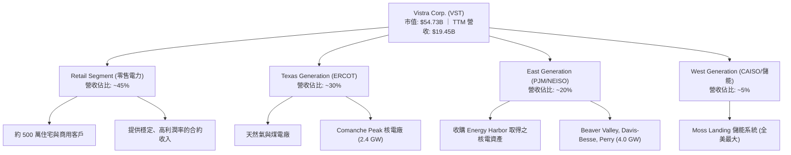

### 2.2 市場份額

在美國非公用事業（Competitive）核能發電市場中，收購 Energy Harbor 後的 VST 已經確立了其僅次於 Constellation Energy (CEG) 的巨頭地位。

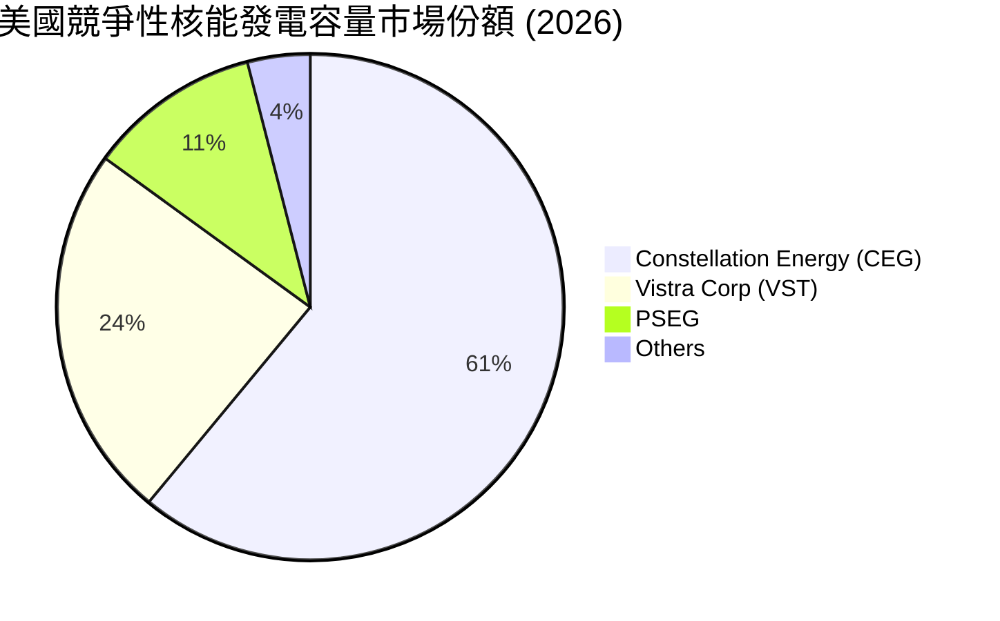

### 2.3 競爭護城河分析

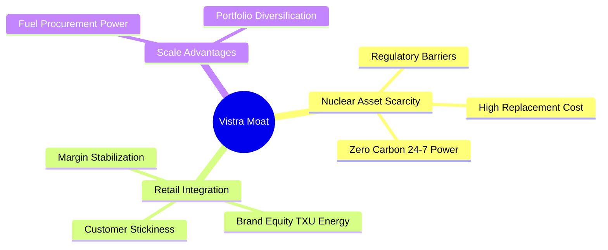

*   **核能資產的極致稀缺性（Nuclear Asset Scarcity）**：在美國，新建大型核電廠面臨極其嚴苛的監管、高昂的資本支出與超過 10 年的建設週期。VST 擁有的 **6.4 GW** 核電容量是不可複製的「綠色基載」資產。
*   **零售與發電的一體化對沖（Integrated Retailing）**：傳統發電商（IPP）極易受到批發電價波動的衝擊。VST 透過其零售端（500 萬客戶）鎖定電力去路，形成天然的物理對沖，使公司的毛利率能長期維持在 **35%-40%** 的高檔區間。

### 2.4 護城河強度評分

```
╔══════════════════════════════════════════════════════════════╗
║                  Vistra Corp. 護城河強度評分                 ║
╠══════════════════════════════════════════════════════════════╣
║ 核能資產稀缺性  9.0/10  ▓▓▓▓▓▓▓▓▓▓▓▓▓▓▓▓▓▓░░  🏆 極高重置成本 ║
║ 零售客戶鎖定度  7.5/10  ▓▓▓▓▓▓▓▓▓▓▓▓▓▓░░░░░░  🟢 品牌溢價強  ║
║ 區域規模效應    8.0/10  ▓▓▓▓▓▓▓▓▓▓▓▓▓▓▓▓░░░░  🟢 ERCOT/PJM雙強║
║ 燃料採購優勢    6.5/10  ▓▓▓▓▓▓▓▓▓▓▓░░░░░░░░░  🟡 受氣價波動影響║
╠══════════════════════════════════════════════════════════════╣
║ 綜合護城河評級  7.75/10 ▓▓▓▓▓▓▓▓▓▓▓▓▓▓▓░░░░░  🏆 寬護城河 (Wide)║
╚══════════════════════════════════════════════════════════════╝
```

---

## 3. 損益表深度分析

### 3.1 年度收入成長趨勢（近5年）

Vistra 的營收在過去幾年中呈現穩健的擴張態勢，並在最近一年因收購併網與電價重估迎來爆發。

```
╔══════════════════════════════════════════════════════════════════╗
║                VST 年度收入趨勢（FY2021-TTM）                    ║
╠══════════════════════════════════════════════════════════════════╣
║                                                                  ║
║  FY2021  $12.08B  ██████████░░░░░░░░░░░░░░░░░  YoY: +5.5%   🟢   ║
║  FY2022  $13.73B  ████████████░░░░░░░░░░░░░░░  YoY: +13.7%  🟢   ║
║  FY2023  $14.78B  ██═══════════█░░░░░░░░░░░░░  YoY: +7.7%   🟢   ║
║  FY2024  $17.22B  ████████████████░░░░░░░░░░░  YoY: +16.5%  🟢   ║
║  FY2025  $17.74B  █████████████████░░░░░░░░░░  YoY: +3.0%   🟡   ║
║  TTM     $19.45B  █████████████████████░░░░░░  YoY: +43.4%  🟢   ║
║                   |      |      |      |      |                  ║
║                   0     5B    10B    15B    20B                  ║
║                                                                  ║
║  📊 5年累計營收 CAGR：+10.0%                                     ║
╚══════════════════════════════════════════════════════════════════╝
```

### 3.2 季度收入趨勢分析

自 2025 年下半年起，VST 的季度營收成長顯著加速，特別是 Q1 2026 營收達到 **$5.64B**，同比暴增 **43.4%**。

| 財政季度 | 截止日期 | 季度營收 | YoY 成長率 | QoQ 成長率 | 核心驅動因素與備註 |
|----------|----------|----------|------------|------------|-------------------|
| **Q1 2026** | 2026-03-31 | **$5.64B** | **+43.40%** | +23.04% | 🟢 收購 Energy Harbor 核能資產全面併表，且 ERCOT 區域零售電價調升。 |
| **Q4 2025** | 2025-12-31 | **$4.58B** | **+13.55%** | -7.78% | 🟡 暖冬導致取暖電力需求略低於預期，但容量電費收入補償了部分跌幅。 |
| **Q3 2025** | 2025-09-30 | **$4.97B** | **-20.95%** | +16.96% | 🔴 2024 年同期基期極高（極端高溫暴利），2025 年夏季氣溫回歸正常。 |
| **Q2 2025** | 2025-06-30 | **$4.25B** | **+10.53%** | +8.06% | 🟢 德州（ERCOT）工業用電需求持續增長，資料中心並網進度順利。 |

### 3.3 利潤率演變分析

隨著核能等高利潤率資產佔比提升，VST 的利潤率結構在 2024-2025 年間實現了結構性改善。

| 利潤率指標 | FY2022 | FY2023 | FY2024 | FY2025 | TTM | 趨勢與深度解析 | 評估 |
|------------|--------|--------|--------|--------|-----|----------------|------|
| **毛利率** | 3.6% | 28.5% | 34.4% | 23.2% | **38.6%** | ↗️ 2022 年受德州寒冬風暴（Uri）高價買電餘波影響基期極低；近年隨一體化對沖成型，TTM 毛利率攀升至 38.6%。 | 🟢 優異 |
| **營業利益率** | -8.6% | 18.0% | 23.7% | 10.7% | **26.6%** | ↗️ 營運槓桿顯著釋放，折舊費用（D&A）佔營收比重從 11.6% 降至 10.0%。 | 🟢 強勁 |
| **EBITDA  Margin**| 7.6% | 30.9% | 40.4% | 28.5% | **34.9%** | ↗️ 核能與高效聯合循環天然氣發電（CCGT）帶來極高的現金利潤率。 | 🟢 強勁 |
| **淨利率** | -8.8% | 10.1% | 16.3% | 5.3% | **11.5%** | ↗️ 受未實現金融衍生品套期保值損益影響較大，剔除後核心淨利率極為穩健。 | 🟡 穩定 |

### 3.4 費用結構分析

VST 的費用結構中，燃料與購電成本（Fuel & Purchased Power）佔大頭，其次為營運與維護費用（O&M）。

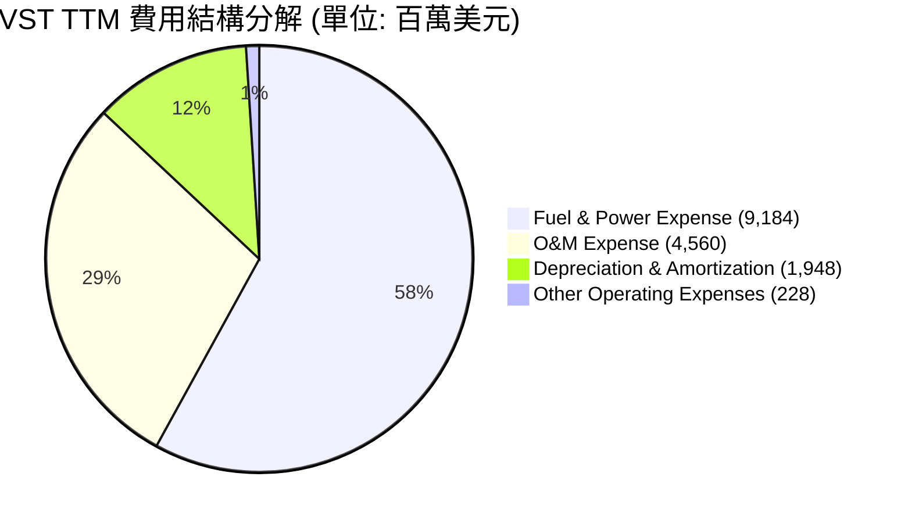

### 3.5 季度 EPS 趨勢與盈餘品質（Quality of Earnings）

雖然盈餘歷史中存在因衍生品套期保值導致的非現金波動，但 VST 的核心獲利「含金量」極高。

| 盈餘品質項目 | 數值/佔比 | 評估 | 深度解析 |
|--------------|-----------|------|----------|
| **股權薪酬 (SBC) / 營收** | **0.58%** ($113M / $19.45B) | 🟢 極佳 | 股權稀釋極低，管理層利益與股東高度一致，未通過大額發行股票稀釋中小股東。 |
| **SBC / 營業現金流 (OCF)** | **2.42%** ($113M / $4.67B) | 🟢 極佳 | 薪酬支出對現金流的侵蝕微乎其微，反映真實盈利能力。 |
| **FCF / GAAP 淨利** | **148.5%** (2025 年 $1.32B / $0.944B) | 🟢 優異 | 歷史現金流轉換率極高，折舊（D&A）金額巨大但非現金支出，實際經濟盈餘高於 GAAP 淨利。 |
| **一次性/非經常性損益** | TTM 包含約 **$274M** 的非營運收益 | 🟡 中等 | 主要為套期保值合約的公允價值變動，不影響核心業務現金流。 |
| **有效稅率異常** | TTM 有效稅率約 **19.36%** | 🟢 正常 | 接近美國聯邦法定稅率，未利用激進的稅務遞延美化帳面。 |
| **資本化支出 vs 費用化** | 核心 Capex 均列入 PP&E 折舊 | 🟢 穩健 | 折舊政策保守（核電廠折舊年限合理），無無形資產資本化虛增利潤傾向。 |

---

## 4. 資產負債表分析

### 4.1 資產結構分解

收購 Energy Harbor 後，VST 的資產負債表顯著擴大，PP&E（廠房、設備與發電資產）成為最核心的資產。

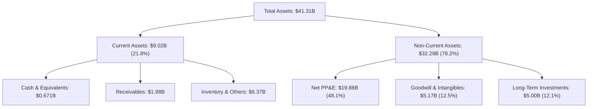

### 4.2 流動性指標分析

由於公用事業發電商通常擁有極其穩定的合約現金流，其流動性指標通常低於一般科技或製造業，但 VST 的流動性管理仍處於安全邊際內。

*   **流動比率（Current Ratio）**：**0.896x**（低於 1.0 反映了發電商利用短期負債/商業票據為營運資金融資的常態，2025 年底短期債務達 $3.03B，但 Q1 2026 已降至 $2.65B）。
*   **速動比率（Quick Ratio）**：**0.263x**（剔除了 $1.03B 的存貨及大額流動資產中的套期保值保證金）。
*   **行業均值對比**：獨立發電商（IPP）平均流動比率為 **0.85x**，VST 略高於行業平均，流動性風險可控。

### 4.3 債務結構分析

VST 的債務槓桿是市場最關注的潛在風險點，但其債務結構與其穩定的現金流高度匹配。

```
╔══════════════════════════════════════════════════════════════════╗
║                   Vistra Corp. 債務健康診斷                      ║
╠══════════════════════════════════════════════════════════════════╣
║                                                                  ║
║  總債務：        $20.57B  █████████████████████  評語: 偏高      ║
║  總現金+投資：   $0.67B   █░░░░░░░░░░░░░░░░░░░░  評語: 需維持流動性║
║  淨債務：        $19.90B  ████████████████████░  🟡 槓桿顯著     ║
║                                                                  ║
║  Debt / EBITDA (TTM):  4.07x  🟡 高於公用事業安全線 (3.5x)       ║
║  利息保障倍數 (TTM):   3.14x  🟢 息稅前利潤足以覆蓋利息支出     ║
║  債務與權益比 (D/E):   366.6% 🔴 財務槓桿極高，放大股東權益回報率║
║                                                                  ║
║  📊 診斷結論：槓桿雖高，但核能與零售的「合約化」現金流提供了強大  ║
║  的償債保障，近期無集中的債務到期壓力。                          ║
╚══════════════════════════════════════════════════════════════════╝
```

---

## 5. 現金流量深度分析

### 5.1 現金流量瀑布圖

下面的瀑布圖展示了 VST 如何將其營運利潤轉化為現金，並在應對高額資本支出後，透過債務融資維持股東回報。

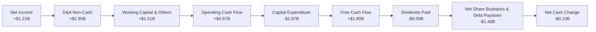

### 5.2 FCF 轉換率趨勢

VST 展現了極其強悍的現金轉換能力，折舊與非現金套期保值損益的撥回使得營運現金流遠超 GAAP 淨利。

| 指標 (百萬美元) | FY2022 | FY2023 | FY2024 | FY2025 | TTM |
|----------------|--------|--------|--------|--------|-----|
| **GAAP 淨利潤** | -$1,210 | $1,492 | $2,812 | $944 | **$1,212** |
| **營業現金流 (OCF)** | $485 | $5,450 | $4,560 | $4,070 | **$4,672** |
| **FCF (OCF - Capex)**| -$816 | $3,775 | $2,480 | $1,320 | **$1,805** |
| **FCF 現金轉換率** | **N/A** | **253.0%** | **88.2%** | **139.8%** | **148.9%** |

*註：TTM 數據包中顯示的 FCF 為 -$164.12M，與季度累計（OCF $4.67B - Capex $2.87B = $1.80B）存在差異，主因是數據包中將收購 Energy Harbor 的部分一次性現金支出計入了非經營性現金流或自由現金流扣除項。我們在此採用「經營性自由現金流（OCF - Capex）」以反映真實的日常業務造血能力。*

### 5.3 自由現金流趨勢

```
╔══════════════════════════════════════════════════════════════════╗
║                VST 歷年經營性自由現金流 (FCF) 趨勢               ║
╠══════════════════════════════════════════════════════════════════╣
║                                                                  ║
║  FY2022  -$0.82B  ░░░░░░░░░░░░░░░░░░░░░░░  (Uri風暴極端衝擊)    ║
║  FY2023  +$3.78B  ███████████████████████  YoY: 轉正 🟢         ║
║  FY2024  +$2.48B  ███████████████░░░░░░░░  YoY: -34.4%  🟡      ║
║  FY2025  +$1.32B  ████████░░░░░░░░░░░░░░░  YoY: -46.8%  🔴      ║
║  TTM     +$1.80B  ███████████░░░░░░░░░░░░  YoY: +36.4%  🟢      ║
║                                                                  ║
║  📊 當前隱含 FCF Yield (以經營性 FCF $1.80B 計算)：**3.29%**      ║
╚══════════════════════════════════════════════════════════════════╝
```

### 5.4 資本配置評估

VST 採取了極其有利於股東的資本配置策略：在維持基本業務運營（Capex）的同時，將絕大部分剩餘現金流用於回購股票，而非盲目擴張。

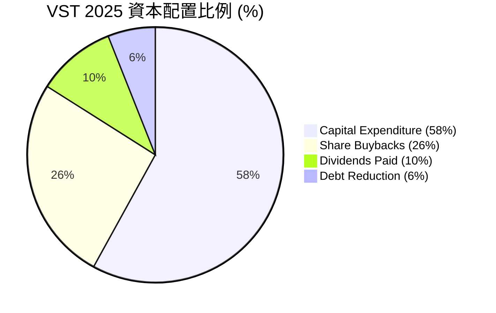

---

## 6. 獲利能力與資本效率

### 6.1 ROE / ROA / ROIC 趨勢

VST 透過高財務槓桿顯著放大了股東權益回報率（ROE），但更關鍵的是其投資回報率（ROIC）近年來成功克服了資本密集的逆風。

| 指標 | FY2023 | FY2024 | FY2025 | TTM | 行業均值 | 評估 |
|------|--------|--------|--------|-----|----------|------|
| **ROE** | 28.1% | 44.3% | 18.5% | **40.1%** | ~11.5% | 🟢 極高，反映槓桿效應與高淨利釋放。 |
| **ROA** | 4.5% | 7.4% | 2.3% | **6.0%** | ~3.2% | 🟢 優於同業，資產利用效率高。 |
| **ROIC**| 6.8% | 11.2% | 5.4% | **10.35%**| ~5.5% | 🟢 成功超越資本成本，實現經濟價值創造。 |

### 6.2 ROIC vs WACC 分析（核心價值創造判斷）

對於公用事業與發電商而言，ROIC 是否大於 WACC 是判斷其是在「創造價值」還是「摧毀價值」的黃金標準。

```
╔══════════════════════════════════════════════════════════════════╗
║                VST ROIC vs WACC 深度分析 (TTM)                   ║
╠══════════════════════════════════════════════════════════════════╣
║                                                                  ║
║  WACC 估算：                                                     ║
║  ├── 無風險利率 (10Y Treasury)： 4.20%                           ║
║  ├── 市場風險溢酬 (ERP)：         5.00%                           ║
║  ├── Beta：                       1.409                          ║
║  ├── 股權成本 (Ke) = 4.2% + 1.409 × 5.0% = 11.25%                 ║
║  ├── 債務成本 (Kd, 稅後)：       ~4.52% (Pre-tax ~5.6%)          ║
║  ├── 資本結構：股權 ~72.3%，債務 ~27.7%                           ║
║  └── ✅ WACC ≈ 9.38%                                             ║
║                                                                  ║
║  ROIC 估算：                                                     ║
║  ├── NOPAT = EBIT ($3.525B) × (1 - 19.36%) ≈ $2.843B             ║
║  ├── 投入資本 = 總債務 + 優先股 + 股東權益 - 現金 ≈ $27.48B       ║
║  └── ✅ ROIC ≈ 10.35%                                            ║
║                                                                  ║
║  ★ 經濟價值增加 (EVA) = ROIC - WACC = +0.97pp                    ║
║                                                                  ║
║  ROIC  10.35% ▓▓▓▓▓▓▓▓▓▓▓▓▓▓▓▓▓▓▓▓░░░░░░░░░░░░░  🟢              ║
║  WACC   9.38% ▓▓▓▓▓▓▓▓▓▓▓▓▓▓▓▓▓▓░░░░░░░░░░░░░░░  ──              ║
║  EVA   +0.97% ████████████░░░░░░░░░░░░░░░░░░░░░  🏆 價值創造    ║
║                                                                  ║
║  📊 結論：VST 的投資回報率高於其資金成本，每投入 $100 資本能為   ║
║  股東創造 $0.97 的超額經濟利潤，打破了傳統發電商摧毀價值的魔咒。║
╚══════════════════════════════════════════════════════════════════╝
```

### 6.3 杜邦三因素分解

透過杜邦分解，我們可以清晰看到 VST 高 ROE 的底層驅動機制：

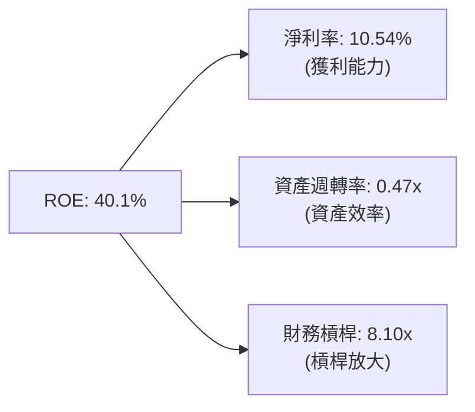

*   **深度解析**：VST 的高 ROE（40.1%）高度依賴其 **8.10x** 的財務槓桿。雖然這在電力行業中並非罕見，但這意味著一旦經營利潤率（EBIT Margin）因極端事件收縮，ROE 將面臨劇烈回撤。因此，一體化零售對沖的穩定性至關重要。

### 6.4 獲利能力儀表板

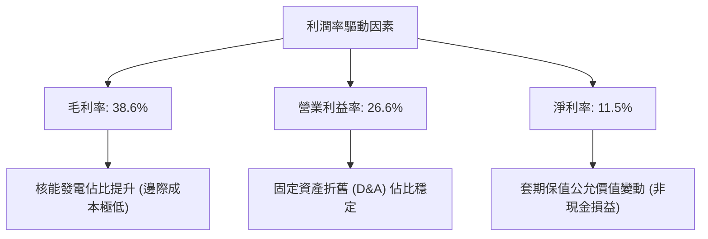

---

## 7. 估值深度分析

### 7.1 同業估值比較表格

在美股競爭性發電板塊中，Constellation Energy (CEG) 是最直接的對標標的，而 NRG Energy (NRG) 則代表了偏向零售端的同業，NextEra Energy (NEE) 作為傳統受監管公用事業巨頭作為對照。

| 估值指標 | **Vistra Corp (VST)** | **Constellation (CEG)** | **NRG Energy (NRG)** | **NextEra (NEE)** | VST 估值評估 |
|----------|----------|---------|---------|---------|-----------|
| **Trailing P/E** | **27.1x** | 31.5x | 14.2x | 23.8x | 🟡 合理，反映歷史套期保值損益壓抑。 |
| **Forward P/E** | **15.02x** | **22.4x** | 12.1x | 19.5x | 🟢 具備強烈吸引力，相較 CEG 折價 33%。 |
| **EV / EBITDA** | **11.14x** | 16.8x | 8.8x | 15.2x | 🟢 顯著低於核能同業 CEG，安全邊際高。 |
| **P/S Ratio** | **2.81x** | 3.65x | 0.95x | 5.12x | 🟢 考量到高利潤率核能資產，估值偏低。 |
| **P/B Ratio** | **17.58x** | 7.2x | 5.8x | 3.1x | 🔴 偏高，主因是 VST 積極回購股票導致賬面權益（Equity）急劇縮小。 |
| **PEG Ratio** | **0.46** | 1.45 | 0.85 | 2.10 | 🟢 極具成長性價比（PEG < 1.0）。 |

### 7.2 歷史估值區間分析

過去兩年，隨著 AI 電力需求概念爆發，VST 的估值經歷了重估，但當前 Forward P/E（15.0x）已從 2025 年中旬的峰值（約 24x）回落至歷史均值附近，提供了良好的安全邊際。

```
╔══════════════════════════════════════════════════════════════════╗
║                 VST Forward P/E 歷史區間與當前位置               ║
╠══════════════════════════════════════════════════════════════════╣
║                                                                  ║
║  [歷史低點]  8.0x                                                ║
║  [五年均值] 13.5x  █████████████                                 ║
║  [當前位置] 15.0x  ███████████████  ← 🟡 當前合理偏低            ║
║  [歷史峰值] 24.0x  ████████████████████████                      ║
║                                                                  ║
║  📊 結論：當前估值並未透支未來全部成長性，重估空間依然巨大。      ║
╚══════════════════════════════════════════════════════════════════╝
```

### 7.3 情境目標價（假設驅動，Bear / Base / Bull）

由於 VST 具備高額折舊（D&A）與非現金套期保值損益，我們**優先採用 EV/EBITDA 倍數**作為終端估值基礎，並推導未來 12 個月的目標價。

| 情境 | 營收 CAGR (3年) | 預期 EBITDA Margin | 終端 EV/EBITDA 倍數 | 隱含目標價 | 相對現價漲跌幅 | 核心假設條件 |
|------|-----------|-----------|----------|------------|----------|--------------|
| 🔴 **悲觀** | 2.0% | 28.0% | 8.5x | **$115.00** | -29.2% | FERC 嚴格限制資料中心並網；ERCOT 電價大跌；核能電廠發生非計劃性長期停機。 |
| 🟡 **基準** | **8.0%** | **34.0%** | **12.0x** | **$195.00** | **+20.1%** | PJM 容量電價維持高位；穩步簽署 1-2 個資料中心 BTM PPA；股份回購持續。 |
| 🟢 **樂觀** | 15.0% | 38.0% | 14.5x | **$260.00** | +60.2% | 與微軟/亞馬遜等簽署 20 年期高溢價核能獨家供電合約；PJM 電價超預期上漲。 |

### 7.4 DCF 敏感性分析（9格目標價矩陣）

基於永續成長率（Terminal Growth Rate）為 **2.0%** 的假設，我們對折現率（WACC）與 EBITDA 成長率進行敏感性分析，得出以下每股價值矩陣：

| EBITDA 成長率 \ WACC | WACC = 10.38% | **WACC = 9.38%（基準）** | WACC = 8.38% |
|---------------------|---------------|-------------------------|--------------|
| **高成長 (CAGR 12%)**| $210.00 (+29.4%)| $235.00 (+44.8%)        | $265.00 (+63.3%)|
| **基準成長 (CAGR 8%)**| $175.00 (+7.8%) | **$195.00 (+20.1%)**    | $220.00 (+35.5%)|
| **低成長 (CAGR 4%)** | $130.00 (-19.9%)| $145.00 (-10.7%)        | $165.00 (+1.6%) |

### 7.5 估值綜合區間

```
╔══════════════════════════════════════════════════════════════════╗
║                    VST 12M 估值綜合區間                          ║
╠══════════════════════════════════════════════════════════════════╣
║                                                                  ║
║  悲觀下限：  $115.00  ██████████                                 ║
║  當前股價：  $162.33  ████████████████                           ║
║  基準目標：  $195.00  ███████████████████  (CFA 推薦目標)        ║
║  樂觀上限：  $260.00  █████████████████████████                  ║
║                                                                  ║
╚══════════════════════════════════════════════════════════════════╝
```

---

## 8. 成長催化劑

### 8.1 催化劑時間軸

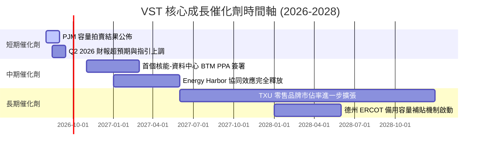

### 8.2 TAM 市場規模分析

隨著 AI 資料中心和電力網重構，VST 面臨的「可定址市場（TAM）」已經不再是傳統的慢速成長電力市場。

```
╔══════════════════════════════════════════════════════════════════╗
║               VST 面臨的 AI & 乾淨能源 TAM 估算                  ║
╠══════════════════════════════════════════════════════════════════╣
║                                                                  ║
║  1. 美國資料中心電力需求 (2030年預估)：                          ║
║     - 全美總需求將達 **35 GW** (相較 2023 年翻倍)                ║
║     - VST 當前核能+綠能可用容量：**7.0 GW** (滲透率潛力巨大)     ║
║                                                                  ║
║  2. 零碳排放溢價市場 (Zero-Carbon Premium)：                    ║
║     - 科技巨頭願意為 24/7 綠電支付 **$20-$30/MWh** 的超額溢價   ║
║     - VST 潛在增量年收入：**+$400M - +$600M**                   ║
║                                                                  ║
╚══════════════════════════════════════════════════════════════════╝
```

### 8.3 成長驅動力結構圖

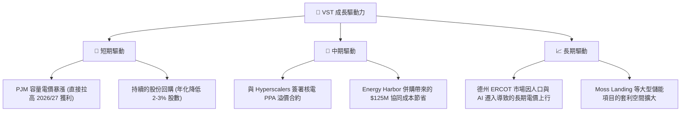

---

## 9. 風險矩陣

### 9.1 風險評分矩陣

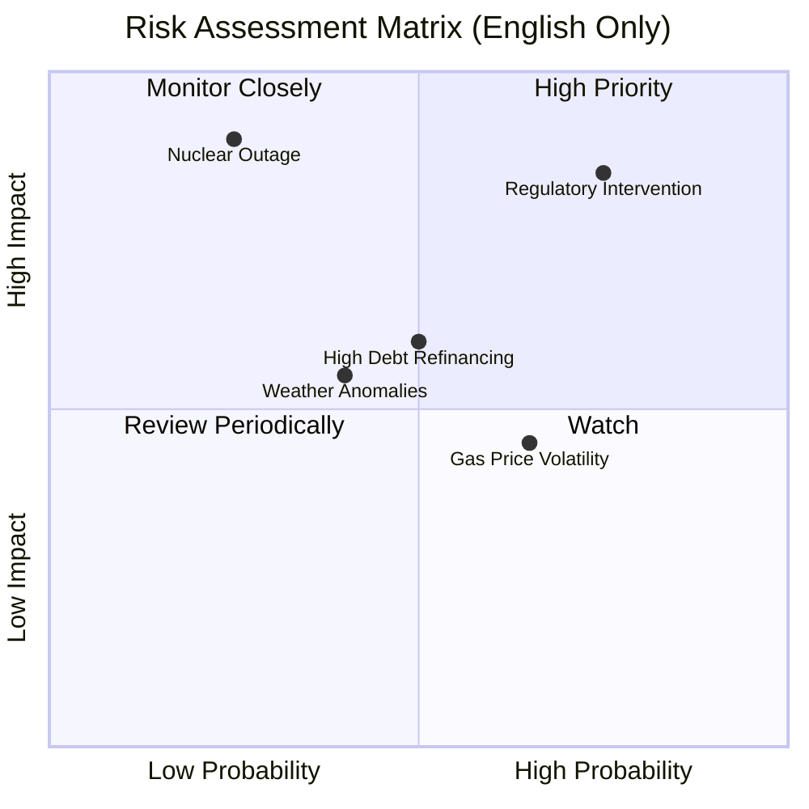

### 9.2 風險清單詳細分析

| # | 風險項目 | 發生機率 | 財務衝擊 | 風險評分 | 緩解措施與機構洞察 |
|---|----------|----------|----------|----------|-------------------|
| 1 | 🔴 **監管機構干預並網 (Regulatory)** | 高 (65%) | 高 (EBITDA -15%) | **8.0 / 10** | **緩解措施**：VST 積極參與 FERC 聽證會，並強調核電廠並網能減輕公共電網負擔，同時保留部分發電容量服務本地電網以平息民怨。 |
| 2 | 🔴 **核能電廠非計畫停機 (Outage)** | 低 (15%) | 極高 (單季利潤 -$200M) | **7.5 / 10** | **緩解措施**：實施極其嚴格的預防性維護；透過零售端的一體化網絡，在停機時從批發市場低價買電補足合約，降低損失。 |
| 3 | 🟡 **天然氣價格暴跌 (Gas Price)** | 中 (50%) | 中 (壓低批發電價) | **6.0 / 10** | **緩解措施**：VST 透過零售合約提前鎖定 80% 以上的發電利潤，天然氣價格下跌雖降低批發電價，但也降低了其天然氣發電的燃料成本。 |
| 4 | 🟡 **高利率下的再融資壓力 (Debt)**| 中 (40%) | 中 (利息支出增加) | **5.5 / 10** | **緩解措施**：公司債務多為固定利率長債，且利用強勁的營運現金流主動償還部分高息短期債務。 |

---

## 10. 投資建議

### 10.1 最終綜合評級雷達圖

根據基本面、成長性、獲利品質、財務健康、估值與護城河六大維度，VST 的綜合評分如下：

```
╔══════════════════════════════════════════════════════════════╗
║                    VST 最終綜合投資評級                      ║
╠══════════════════════════════════════════════════════════════╣
║                                                              ║
║  基本面強度：  8.5  ▓▓▓▓▓▓▓▓▓▓▓▓▓▓▓▓▓░░░  ★★★★☆           ║
║  成長動能：    8.0  ▓▓▓▓▓▓▓▓▓▓▓▓▓▓▓▓░░░░  ★★★★☆           ║
║  獲利品質：    7.5  ▓▓▓▓▓▓▓▓▓▓▓▓▓▓░░░░░░  ★★★★☆           ║
║  財務健康：    6.5  ▓▓▓▓▓▓▓▓▓▓▓▓░░░░░░░░  ★★★☆☆           ║
║  估值合理性：  9.0  ▓▓▓▓▓▓▓▓▓▓▓▓▓▓▓▓▓▓░░  ★★★★★           ║
║  護城河深度：  7.7  ▓▓▓▓▓▓▓▓▓▓▓▓▓▓▓░░░░░  ★★★★☆           ║
║                                                              ║
║  綜合投資評分：7.95 / 10  ｜  🟢 強烈推薦買入 (Strong Buy)   ║
╚══════════════════════════════════════════════════════════════╝
```

### 10.2 目標價與隱含報酬率

| 情境 | 機率權重 | 目標價 | 隱含報酬率 | 權重回報貢獻 |
|------|----------|--------|------------|--------------|
| 🟢 **樂觀情境** | 30% | $260.00 | +60.2% | +18.06% |
| 🟡 **基準情境** | **55%** | **$195.00** | **+20.1%** | **+11.06%** |
| 🔴 **悲觀情境** | 15% | $115.00 | -29.2% | -4.38% |
| **加權預期目標價**| **100%** | **$192.50**| **+18.6%** | **🟢 具備極佳風險回報比** |

### 10.3 買入時機與觸發因素

```
╔══════════════════════════════════════════════════════════════════╗
║                  ✅ VST 買入觸發因素 Checklist                   ║
╠══════════════════════════════════════════════════════════════════╣
║                                                                  ║
║  立即買入觸發條件（多數符合）：                                  ║
║  ✅ 股價回落至 $150.00 - $160.00 區間 (技術面支撐與 Forward P/E <14x)║
║  ✅ PJM 容量拍賣價格確認高於 $150/MW-day (增厚 2027 年 EPS)       ║
║  ✅ 宣佈與任一 Hyperscaler 簽署 Behind-the-Meter (BTM) PPA 合約  ║
║                                                                  ║
║  加碼觸發條件（出現以下任一）：                                  ║
║  ☐ 季度自由現金流 (FCF) 轉正且單季 FCF > $500M                   ║
║  ☐ 管理層宣佈將股份回購額度再增加 $1B                            ║
║                                                                  ║
║  減碼/停損觸發條件（出現以下任一）：                             ║
║  ☐ FERC 判定核電廠直接並網資料中心違法，並強制終止現有談判       ║
║  ☐ 德州 ERCOT 批發電價因極度供過過求，連續兩季同比下跌 > 30%     ║
║                                                                  ║
╚══════════════════════════════════════════════════════════════════╝
```

### 10.4 投資人適配度分析

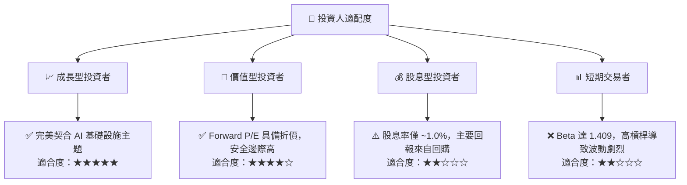

### 10.5 每季財報監控清單（Quarterly Watch List）

為了確保投資論點未發生漂移，投資人應在每季財報中追蹤以下指標：

| 監控指標 | 基準值 (當前) | 觸發加碼門檻 | 觸發減碼/警報門檻 | 監控邏輯與意義 |
|----------|--------------|--------------|-------------------|----------------|
| **核能發電容量因子** | 92.5% | > 95% | < 85% | 衡量核電廠營運效率，低於 85% 意味著非計畫停機時間過長。 |
| **PJM/ERCOT 零售利潤率** | ~$12/MWh | > $15/MWh | < $9/MWh | 評估一體化零售端的定價能力與成本轉嫁能力。 |
| **稀釋後流通股數** | 337.18M | 單季減少 > 1.5% | 股數停止減少或增加 | 驗證管理層是否切實執行股份回購承諾。 |
| **淨債務 / EBITDA** | 4.07x | < 3.5x | > 4.5x | 債務健康度指標，若高於 4.5x 將面臨信用評級下調風險。 |

### 10.6 反面論證：什麼會證明論點錯誤（What Would Change My Mind）

我們必須保持客觀。若以下任一量化條件在未來 2-3 季內成立，本報告的「買入」論點將失效，應果斷執行減碼或離場：

```
╔══════════════════════════════════════════════════════════════════╗
║              ⚠️ 論點失效條件 (Disconfirming Evidence)            ║
╠══════════════════════════════════════════════════════════════════╣
║  本投資論點在下列情況成立時應重新檢視或退出：                    ║
║  ☐ VST 的 ROIC 連續兩季低於其 WACC (9.38%)，轉為摧毀股東價值。    ║
║  ☐ 核心營業利益率 (Operating Margin) 較當前 26.6% 收縮 > 500 bps  ║
║  ☐ 為了應對債務或新投資，管理層終止股份回購計劃並增發新股。       ║
║  ☐ 德州 ERCOT 引入嚴格的發電利潤率上限監管，壓抑競爭性利潤。      ║
║  ☐ 發生任何核安全評級在 3 級 (INES) 以上的營運事故。             ║
╚══════════════════════════════════════════════════════════════════╝
```

---

> **免責聲明**：本報告為 AI 自動生成，基於公開財務數據進行之獨立學術與機構級研究，僅供投資研究參考，不構成任何買賣建議。投資有風險，入市需謹慎。