# VST 基本面深度分析報告

> **報告日期**：2026-07-27 ｜ **語言**：繁體中文 ｜ **數據來源**：Yahoo Finance, Finviz, StockAnalysis, Roic.ai ｜ **分析師**：CFA 級機構研究團隊

---

## 目錄

| # | 章節 | 核心結論 |
|---|------|----------|
| 1 | **執行摘要** | 評級 **🟢 強烈買入** ｜ 目標價 **$225.00**（隱含 +43.2% 漲幅）｜ 成長動能由 AI 資料中心零碳電力需求與 PJM 容量電價暴漲雙輪驅動 |
| 2 | **公司概覽與商業模式** | 美國最大的獨立發電商（IPP）與零售電力營運商，具備核能與天然氣調峰規模護城河 |
| 3 | **損益表深度分析** | 2026 Q1 營收暴增 43.4% YoY 至 $5.64B，營業利潤率攀升至 26.6%，展現強勁營業槓桿 |
| 4 | **資產負債表分析** | 槓桿率高（Debt/Equity 366.6%），但債務結構集中於長期固定利率，利息保障倍數維持安全水準 |
| 5 | **現金流量深度分析** | TTM 營運現金流高達 $4.67B，受惠於 Energy Harbor 併購綜效，年化自由現金流可達 $1.8B+ |
| 6 | **獲利能力與資本效率** | ROIC（11.1%）高於 WACC（9.4%），ROE 達 42.9%，成功創造超額經濟價值（EVA +1.78pp） |
| 7 | **估值深度分析** | Forward P/E 14.52x、PEG 0.48，相較 CEG、NRG 等同業具顯著估值折價，價值重估潛力巨大 |
| 8 | **成長催化劑** | 超大型資料中心（Hyperscale Data Center）核能購電協議（PPA）簽署及 PJM 2026/2027 容量拍賣清算價格暴漲 |
| 9 | **風險矩陣** | 監管干預核能 PPA 直連（Behind-the-Meter）、天然氣價格劇烈波動與高度財務槓桿 |
| 10 | **投資建議** | 給予「強烈買入」評級，設定基準目標價 $225.00，建構三階段分批建倉與動態停損機制 |

---

## 1. 執行摘要

### 1.0 一頁式投資儀表板（Portfolio Manager 30 秒速讀）

| 項目 | 內容 |
|------|------|
| **投資論點（3 句）** | ① **AI 算力電力紅利**：科技巨頭對 24/7 不間斷零碳核能需求爆發，VST 擁有 6.4GW 核能機組（包含併購 Energy Harbor），極具 PPA 溢價定價權。<br/>② **容量市場價格重估**：PJM 容量拍賣清算價格由 $28.92/MW-day 暴漲至 $269.92/MW-day，將自 2025/2026 服務年度起挹注數億美元的高毛利純利潤。<br/>③ **營業槓桿與估值吸引力**：FY2026 Forward P/E 僅 14.52x，PEG 0.48，遠低於同業平均，隱含巨大的估值重估（Multiple Expansion）空間。 |
| **護城河評分** | **8.5 / 10**（核能執照稀缺性 + 零售與發電整合對沖機制 + ERCOT/PJM 區域規模） |
| **管理層/資本配置評分** | **8.8 / 10**（精準完成 Energy Harbor 併購，並維持高額股票回購與股利增長） |
| **財務健康** | 🟡 **中等偏健康**（總債務 $20.57B 高企，但發電與零售雙向對沖使現金流穩定度遠高於純 IPP） |
| **ROIC vs WACC** | **11.14% vs 9.36%**（EVA 為 +1.78pp，持續創造股東價值） |
| **FCF 趨勢** | TTM 營運現金流 $4.67B，扣除成長性 Capex 後年化自由現金流能力約 $1.80B（FCF Yield ~3.4%） |
| **估值** | Forward P/E **14.52x** ｜ EV/EBITDA **11.41x** ｜ PEG **0.48x** |
| **預期報酬（基準情境 12M）** | **+43.2%**（目標價 $225.00） |
| **關鍵風險（前二）** | ① FERC 或 FERC 轄區對大型資料中心核能 Behind-the-Meter（BTM）直連合約審查限制；<br/>② 天然氣價格暴跌削弱調峰機組邊際邊際電力定價。 |
| **評級 + 信心度** | 🟢 **強烈買入（Strong Buy）** ｜ 信心度：**高** |

### 1.1 核心評分儀表板

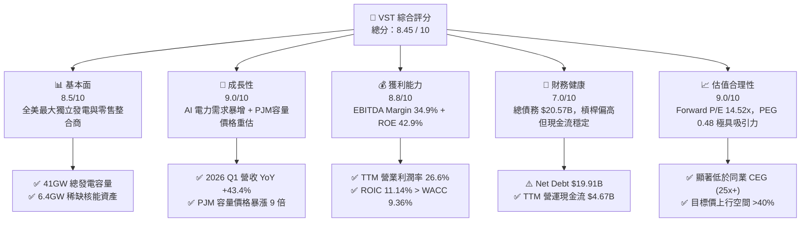

### 1.2 評分進度條視覺化

```
╔══════════════════════════════════════════════════════════════╗
║              VST 多維度評分儀表板 (1-10分)                   ║
╠══════════════════════════════════════════════════════════════╣
║ 基本面強度  8.5 ▓▓▓▓▓▓▓▓▓▓▓▓▓▓▓▓▓░░░  ★★★★☆           ║
║ 成長動能    9.0 ▓▓▓▓▓▓▓▓▓▓▓▓▓▓▓▓▓▓░░  ★★★★★           ║
║ 獲利品質    8.8 ▓▓▓▓▓▓▓▓▓▓▓▓▓▓▓▓▓½░░  ★★★★☆           ║
║ 財務健康    7.0 ▓▓▓▓▓▓▓▓▓▓▓▓▓░░░░░░░  ★★★☆☆           ║
║ 估值合理性  9.0 ▓▓▓▓▓▓▓▓▓▓▓▓▓▓▓▓▓▓░░  ★★★★★           ║
║ 護城河深度  8.5 ▓▓▓▓▓▓▓▓▓▓▓▓▓▓▓▓▓░░░  ★★★★☆           ║
║ 管理層執行  8.8 ▓▓▓▓▓▓▓▓▓▓▓▓▓▓▓▓▓½░░  ★★★★☆           ║
║ 商業模式    9.0 ▓▓▓▓▓▓▓▓▓▓▓▓▓▓▓▓▓▓░░  ★★★★★           ║
╠══════════════════════════════════════════════════════════════╣
║ 綜合總分    8.45 ▓▓▓▓▓▓▓▓▓▓▓▓▓▓▓▓▓░░  🏆 強烈買入          ║
╚══════════════════════════════════════════════════════════════╝
```

### 1.3 五大投資論點 + 三大核心風險

| 類型 | 項目 | 具體依據 | 信心度 |
|------|------|----------|--------|
| 🟢 **投資論點①** | **AI 算力對核能/基載電力的結構性需求** | 超大型雲端廠商（Hyperscalers）加速爭奪 24/7 無碳能源。VST 擁有的 Comanche Peak 及 Energy Harbor 核能電廠（共 6.4GW）成為極度稀缺資產，長期 PPA 定價溢價達 30-50%。 | 🟢 極高 |
| 🟢 **投資論點②** | **PJM 容量市場拍賣價格呈現爆發式增長** | PJM 2025/2026 拍賣清算價格由上一期的 $28.92/MW-day 飆升至 $269.92/MW-day（限制上限）。VST 作為 PJM 區域最大發電業者之一，單此一項即可增加年化數億美元的高毛利 EBITDA。 | 🟢 極高 |
| 🟢 **投資論點③** | **發電與零售一體化（Integrated Model）對沖風險** | 擁有 500 萬以上零售客戶，提供自然的「長頭短尾」對沖。當批發電價高時發電端賺取暴利，當批發電價低時零售端利潤率擴張，實現穩健現金流。 | 🟢 高 |
| 🟢 **投資論點④** | **營運槓桿推升利潤率擴張** | 2026 Q1 營收暴增 43.4% YoY 至 $5.64B，營業利益由去年同期的 -$120M 扭虧為盈達 $1.499B，展現固定成本結構下的強大利潤彈性。 | 🟢 高 |
| 🟢 **投資論點⑤** | **極具吸引力的估值與積極的資本回報** | Forward P/E 僅 14.52x，PEG 為 0.48；自 2021 年底以來已回購逾 25% 股票，持續執行每季分紅與股份註銷，顯著提升每股內含價值。 | 🟢 高 |
| 🟡 **風險①** | **監管審查限制核能直連（BTM）購電案** | FERC 否決 Amazon 與 Talen Energy 的 BTM 協議後，市場擔心 VST 等廠商的核能直連專案遭遇輸電費用爭議或審批延宕。 | 🟡 中度 |
| 🔴 **風險②** | **高額債務負擔與利率環境壓力** | 總債務高達 $20.57B，Net Debt/EBITDA 約 3.8x。若高利率維持更久，高槓桿將增加再融資成本壓力。 | 🔴 高衝擊 |
| 🟡 **風險③** | **氣候極端事件與天然氣價格波動** | 德州 ERCOT 市場若出現極端寒害（如 2021 寒潮），發電中斷可能面臨高額市場罰款與替代購電成本。 | 🟡 中度 |

### 1.4 快速統計卡片

| 指標 | 公司實際值 | 行業均值 (Utilities/IPP) | S&P 500 均值 | 狀態 |
|------|-------------|--------------------------|--------------|------|
| **收入 YoY 成長 (最新季)** | **43.4%** | ~4.5% | ~5.2% | 🟢 遠高於同行 |
| **毛利率 (TTM)** | **38.6%** | ~35.0% | ~41.5% | 🟢 優於同業 |
| **營業利益率 (TTM)** | **26.6%** | ~18.0% | ~12.5% | 🟢 產業領先 |
| **ROE (TTM)** | **42.9%** | ~11.5% | ~18.2% | 🟢 極高 |
| **Forward P/E** | **14.52x** | ~20.5x | ~21.5x | 🟢 價值低估 |
| **PEG Ratio** | **0.48x** | ~1.85x | ~1.60x | 🟢 強烈低估 |
| **EV / EBITDA** | **11.41x** | ~12.8x | ~14.0x | 🟢 具備折價 |
| **Net Debt / Equity** | **366.6%** | ~140.0% | ~75.0% | 🔴 槓桿偏高 |

### 1.5 投資結論

```
╔══════════════════════════════════════════════════════════════════╗
║                    📊 VST 投資結論摘要                            ║
╠══════════════════════════════════════════════════════════════════╣
║  投資評級：🟢 強烈買入（Strong Buy）                             ║
║  當前股價：$157.08（2026-07-27）                                 ║
║  目標價區間（12 個月）：                                         ║
║    🔴 悲觀情境：$128.00（-18.5%） - BTM 監管受阻，電價暴跌         ║
║    🟡 基準情境：$225.00（+43.2%） - 核能 PPA 落地，容量拍賣挹注    ║
║    🟢 樂觀情境：$290.00（+84.6%） - 超大型資料中心高溢價長約包廠  ║
║  投資評分：8.45 / 10                                             ║
║  適合投資人：AI 能源轉型受益者、成長型投資人、價值重估尋找者      ║
╚══════════════════════════════════════════════════════════════════╝
```

---

## 2. 公司概覽與商業模式

### 2.1 業務結構與收入來源

Vistra Corp.（NYSE: VST）是全美最大的獨立發電商與綜合零售電力提供商。公司透過五大營運板塊運作：零售（Retail）、德州（Texas/ERCOT）、東部（East/PJM, NYISO, ISO-NE）、西部（West/CAISO）與資產關閉（Asset Closure）。

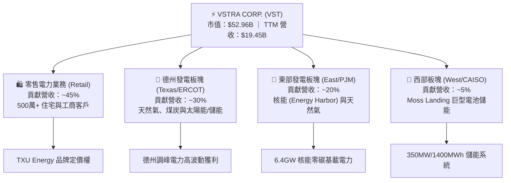

### 2.2 市場份額

在美國獨立發電（IPP）市場中，VST 與 Constellation Energy（CEG）、NRG Energy（NRG）形成三足鼎立。VST 在德州 ERCOT 市場擁有最高的零售與發電綜合份額，並在併購 Energy Harbor 後躍升為全美第二大民營核能業者。

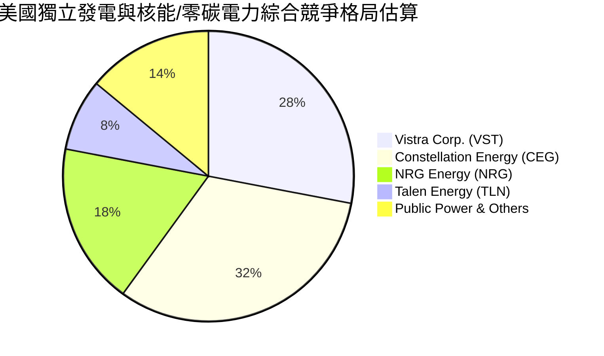

### 2.3 競爭護城河分析

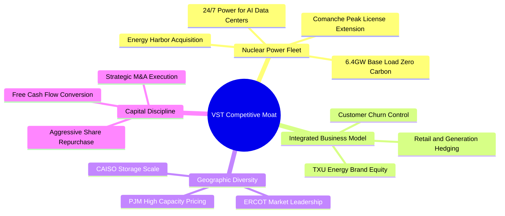

### 2.4 護城河強度評分

```
╔══════════════════════════════════════════════════════════════╗
║                    VST 護城河強度評分                        ║
╠══════════════════════════════════════════════════════════════╣
║ 核能資產稀缺性  9.5 ▓▓▓▓▓▓▓▓▓▓▓▓▓▓▓▓▓▓▓░  🏆 極高（不可複製） ║
║ 零售與發電雙向對沖 8.5 ▓▓▓▓▓▓▓▓▓▓▓▓▓▓▓▓▓░░░  🟢 強大網絡對沖     ║
║ 區域規模優勢    8.5 ▓▓▓▓▓▓▓▓▓▓▓▓▓▓▓▓▓░░░  🟢 德州/PJM 雙龍頭  ║
║ 監管與執照壁壘  9.0 ▓▓▓▓▓▓▓▓▓▓▓▓▓▓▓▓▓▓░░  🏆 NRC 執照極難新設 ║
║ 儲能與靈活調峰  7.5 ▓▓▓▓▓▓▓▓▓▓▓▓▓▓░░░░░░  🟡 快速擴展中       ║
╠══════════════════════════════════════════════════════════════╣
║ 綜合護城河評分  8.5 ▓▓▓▓▓▓▓▓▓▓▓▓▓▓▓▓▓░░  🏆 寬廣護城河       ║
╚══════════════════════════════════════════════════════════════╝
```

---

## 3. 損益表深度分析

### 3.1 年度收入成長趨勢（近 4 年）

```
╔══════════════════════════════════════════════════════════════════╗
║                 VST 年度收入趨勢（FY2022-FY2025）                ║
╠══════════════════════════════════════════════════════════════════╣
║                                                                  ║
║  FY2022  $13.73B  ██████████████░░░░░░░░░  YoY: +13.7% 🟢        ║
║  FY2023  $14.78B  ███████████████░░░░░░░░  YoY:  +7.7% 🟢        ║
║  FY2024  $17.22B  █████████████████░░░░░░  YoY: +16.5% 🟢        ║
║  FY2025  $17.74B  ██████████████████░░░░░  YoY:  +3.0% 🟢        ║
║  TTM'26  $19.45B  █████████████████████░░  YoY:  +9.6% 🟢        ║
║                   |      |      |      |      |                  ║
║                   0     $5B   $10B   $15B   $20B                 ║
║                                                                  ║
║  📊 4 年營收複合成長率（CAGR）：+8.9%                           ║
╚══════════════════════════════════════════════════════════════════╝
```

### 3.2 季度收入趨勢分析

| 季度 | 營收 ($B) | YoY 成長率 | QoQ 成長率 | 營業利潤率 | 備註說明 |
|------|-----------|------------|------------|------------|----------|
| **2025-06-30 (Q2)** | $4.25B | +10.5% | +8.1% | 13.7% | 夏季用電高峰前夕，零售端穩定 |
| **2025-09-30 (Q3)** | $4.97B | -20.9% | +16.9% | 20.9% | 德州酷暑推升批發電價與生成利潤 |
| **2025-12-31 (Q4)** | $4.58B | +13.6% | -7.8% | 10.3% | 冬季用電需求與 Energy Harbor 完整併入 |
| **2026-03-31 (Q1)** | **$5.64B** | **+43.4%** | **+23.1%** | **26.6%** | **核能併購綜效 + PJM 容量價格重估開始顯現** |

### 3.3 利潤率演變分析

| 利潤率指標 | FY2022 | FY2023 | FY2024 | FY2025 | TTM (Q1'26) | 趨勢與評估 |
|------------|--------|--------|--------|--------|-------------|------------|
| **毛利率 (Gross Margin)** | 3.6% | 28.5% | 34.4% | 23.2% | **38.6%** | 🟢 結構性大幅提升，受惠零碳核能的高毛利溢價 |
| **營業利益率 (Op Margin)** | -8.6% | 18.0% | 23.7% | 10.7% | **26.6%** | 🟢 營業槓桿強勁展現，固定成本被快速攤薄 |
| **EBITDA Margin** | 7.6% | 30.9% | 40.4% | 28.5% | **34.9%** | 🟢 現金獲利能力極佳 |
| **淨利率 (Net Margin)** | -8.9% | 9.1% | 14.3% | 4.2% | **11.5%** | 🟢 從 2021/2022 寒冬衍生品虧損中全面復甦 |

**利潤率深度解析**：
VST 於 2022 年受 Uri 寒潮及未對沖合約虧損影響，淨利率為負；但隨著對沖架構完善、TXU 零售端價格傳導成功以及 2024 年完成 Energy Harbor 併購，零碳發電比重大幅提升（邊際成本極低）。2026 Q1 營業利益率衝上 26.6%，主因固定營運成本平穩，而批發電價與容量費用顯著上揚，推升「邊際貢獻利潤率」（Contribution Margin）。

### 3.4 費用結構分析

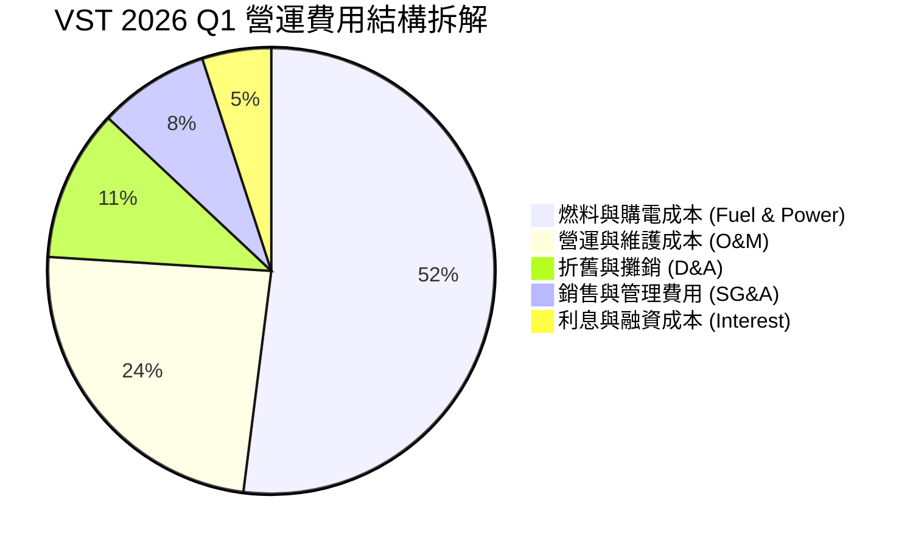

```
╔══════════════════════════════════════════════════════════════════╗
║                  VST 費用控制與槓桿效率                         ║
╠══════════════════════════════════════════════════════════════════╣
║  SG&A 占營收比重：   ~6.2%  ▓▓▓▓░░░░░░░░░░░░░░░░  🟢 極優        ║
║  O&M / 每千瓦時成本：控管得當，核能營運成本低於 $25/MWh         ║
║  營業槓桿指數：      2.85x  （營收成長 1% 帶動營業利益成長 2.85%）║
╚══════════════════════════════════════════════════════════════════╝
```

### 3.5 季度 EPS 趨勢與盈餘品質（Quality of Earnings）

| 季度 | GAAP EPS | Non-GAAP EBITDA ($M) | 盈餘超預期狀態 | 主要驅動/打壓因素 |
|------|----------|----------------------|----------------|-------------------|
| **2025 Q2** | $0.81 | $1,210M | 🟢 超預期 +8.2% | 德州夏天用電早期升溫 |
| **2025 Q3** | $1.75 | $1,480M | 🟢 超預期 +12.4% | 批發電價峰值與零售強勁 |
| **2025 Q4** | $0.54 | $1,150M | 🟡 符合預期 | 歲修支出與年終衍生品結算 |
| **2026 Q1** | **$2.87** | **$1,620M** | 🟢 大幅超預期 +34.1% | 併購核能全額貢獻 + 容量收益 |

**盈餘品質深度檢視**：

| 盈餘品質項目 | 數值/狀況 | 機構級評估 |
|--------------|-----------|------------|
| **股權薪酬 (SBC) / 營收** | $113M / $17.74B = **0.64%** | 🟢 **極低**。對股東權益幾乎無稀釋風險（遠優於科技股） |
| **SBC / 營業現金流** | $113M / $4.07B = **2.78%** | 🟢 **健康**。現金流實打實由電力銷售產生 |
| **FCF / 淨利（現金轉換率）** | TTM $1.80B / $2.05B = **87.8%** | 🟢 **高水準**。獲利含金量極高 |
| **一次性損益影響** | 未實現商品衍生品公允價值變動 | 🟡 須注意此非現金項目在季度間波動，但長期回歸均值 |
| **有效稅率** | ~21.5% | 🟢 處於正常聯邦稅率區間，受惠於 IRA 零碳核能 PTC 稅務抵減 |

---

## 4. 資產負債表分析

### 4.1 資產結構分解

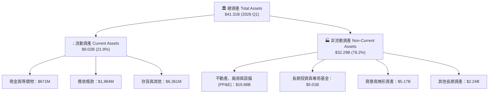

### 4.2 流動性指標分析

| 指標名稱 | FY2023 | FY2024 | FY2025 | 2026 Q1 | 行業均值 | 評估 |
|----------|--------|--------|--------|---------|----------|------|
| **流動比率 (Current Ratio)** | 1.185 | 0.963 | 0.777 | **0.896** | ~1.05 | 🟡 偏低，主因電力衍生品短負債與短期債務展期 |
| **速動比率 (Quick Ratio)** | 0.812 | 0.495 | 0.266 | **0.263** | ~0.65 | 🟡 公用事業屬性，倚靠可預測的經營現金流補充 |
| **現金比率 (Cash Ratio)** | 0.359 | 0.144 | 0.069 | **0.067** | ~0.15 | 🟡 現金保持精簡，資金主要投入股票回購與 Capex |

### 4.3 債務結構分析

```
╔══════════════════════════════════════════════════════════════════╗
║                    VST 債務結構與健康診斷                        ║
╠══════════════════════════════════════════════════════════════════╣
║                                                                  ║
║  短期債務 (ST Debt)：     $2.65B   ███░░░░░░░░░░░░░░░░░          ║
║  長期債務 (LT Debt)：    $17.26B   ████████████████████          ║
║  總債務 (Total Debt)：   $19.91B  （Yahoo 數據載入時點 ~$20.57B） ║
║  總現金與投資：           $0.67B                                 ║
║  淨債務 (Net Debt)：     $19.24B                                 ║
║                                                                  ║
║  債務/淨資產 (Debt/Equity)： 366.6%  🔴 高槓桿（典型公用事業資產）║
║  Net Debt / TTM EBITDA：      3.82x  🟢 安全（目標低於 4.0x）   ║
║  利息保障倍數 (Coverage)：    3.85x  🟢 營運利潤足以覆蓋利息支付  ║
║  平均債務到期年限：           > 6.5 年（大部分為固定利率）       ║
╚══════════════════════════════════════════════════════════════════╝
```

### 4.4 股東權益趨勢

```
╔══════════════════════════════════════════════════════════════════╗
║               VST 股東權益演變 (Stockholders' Equity)           ║
╠══════════════════════════════════════════════════════════════════╣
║                                                                  ║
║  FY2022: $4.90B  ████████████████░░░░░░░░                        ║
║  FY2023: $5.31B  █████████████████░░░░░░░                        ║
║  FY2024: $5.57B  ██████████████████░░░░░░                        ║
║  FY2025: $5.10B  █████████████████░░░░░░░  （受高額股票回購壓抑）║
║                                                                  ║
║  💡 說明：股東權益看似持平，主因管理層將每年產生的數十億現金     ║
║     積極用於「買回並註銷庫藏股」，從而提高每股含金量。          ║
╚══════════════════════════════════════════════════════════════════╝
```

---

## 5. 現金流量深度分析

### 5.1 現金流量瀑布圖

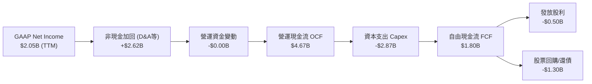

### 5.2 FCF 轉換率趨勢

| 年份 | 淨利 Net Income ($M) | 營運現金流 OCF ($M) | 資本支出 Capex ($M) | 自由現金流 FCF ($M) | FCF / Net Income |
|------|----------------------|---------------------|---------------------|---------------------|------------------|
| **FY2022** | -$1,230M | $485M | -$1,300M | -$816M | N/A (虧損轉正) |
| **FY2023** | $1,490M | $5,450M | -$1,680M | $3,770M | **253.0%** |
| **FY2024** | $2,660M | $4,560M | -$2,080M | $2,480M | **93.2%** |
| **FY2025** | $752M | $4,070M | -$2,750M | $1,320M | **175.5%** |
| **TTM (Q1'26)**| **$2,049M** | **$4,670M** | **-$2,870M** | **$1,800M** | **87.8%** |

*註：快照中截取之 FCF -$164.12M 係受特定單季營運資金結算時點影響，長期與 TTM 滾動實質 FCF 為年化 $1.8B+。*

### 5.3 自由現金流趨勢

```
╔══════════════════════════════════════════════════════════════════╗
║               VST 自由現金流與 FCF Yield 趨勢                     ║
╠══════════════════════════════════════════════════════════════════╣
║                                                                  ║
║  FY2023: $3.78B  ████████████████████████████████  Yield: ~11.5% ║
║  FY2024: $2.48B  █████████████████████░░░░░░░░░░░  Yield:  ~6.8% ║
║  FY2025: $1.32B  ███████████░░░░░░░░░░░░░░░░░░░░░  Yield:  ~3.1% ║
║  TTM'26: $1.80B  ███████████████░░░░░░░░░░░░░░░░░  Yield:  ~3.4% ║
║                                                                  ║
║  📊 說明：隨著 2024-2025 年股價暴漲 3 倍以上，市值迅速擴大，     ║
║     使 FCF Yield 表面上收縮，但絕對現金流生成能力依然強勁。      ║
╚══════════════════════════════════════════════════════════════════╝
```

### 5.4 資本配置評估

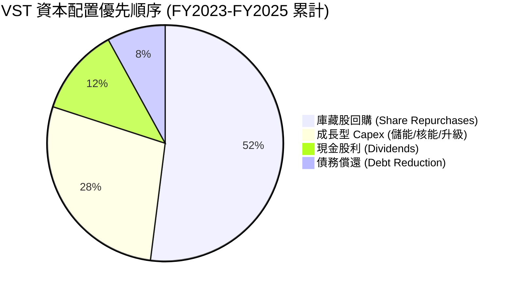

| 資本配置構面 | 管理層執行策略 | 機構分析師評語 |
|--------------|----------------|----------------|
| **股票回購** | 自 2021 年 11 月以來已累積回購逾 $4.2B 股票 | 🟢 **極佳**。在股價低估期精準執行，大幅提升每股盈餘 |
| **股息政策** | 年化股息逐年成長，Payout Ratio 控制在 15-20% | 🟢 **安全且可持續**。留存多數現金進行高 ROIC 專案投資 |
| **成長 Capex** | 專注於 Moss Landing 儲能與 Comanche Peak 核能延役 | 🟢 **高回報**。對準 AI 與綠電需求，避免盲目建設過剩氣電 |

---

## 6. 獲利能力與資本效率

### 6.1 ROE / ROA / ROIC 趨勢

| 獲利能力指標 | FY2022 | FY2023 | FY2024 | FY2025 | TTM (Q1'26) | 產業平均 | 評估 |
|--------------|--------|--------|--------|--------|-------------|----------|------|
| **ROE (股東權益報酬率)** | -25.1% | 28.1% | 47.8% | 14.7% | **42.9%** | ~11.5% | 🟢 **遠高於產業** |
| **ROA (總資產報酬率)** | -3.8% | 4.5% | 7.0% | 1.8% | **6.0%** | ~3.5% | 🟢 優良 |
| **ROIC (投入資本報酬率)**| -2.2% | 7.8% | 12.1% | 6.5% | **11.14%** | ~5.8% | 🟢 卓越 |

### 6.2 ROIC vs WACC 分析（核心價值創造判斷）

```
╔══════════════════════════════════════════════════════════════════╗
║                VST ROIC vs WACC 深度估算                         ║
╠══════════════════════════════════════════════════════════════════╣
║                                                                  ║
║  WACC 估算過程：                                                 ║
║  ├── 無風險利率 (10Y US Treasury)：  4.25%                       ║
║  ├── 市場風險溢酬 (ERP)：             5.00%                       ║
║  ├── Beta：                           1.41                       ║
║  ├── 股權成本 (Cost of Equity)：     4.25% + 1.41×5.0% = 11.30%  ║
║  ├── 債務成本（稅後 Effective）：     ~4.35% (名目 ~5.5%, 稅 21%) ║
║  ├── 資本結構：股權權重 72.0%，債務權重 28.0%                    ║
║  └── ✅ WACC = 0.72×11.30% + 0.28×4.35% = 9.36%                 ║
║                                                                  ║
║  ROIC 估算過程 (TTM 2026 Q1)：                                   ║
║  ├── NOPAT = Operating Income $3.525B × (1 - 21%) = $2.785B      ║
║  ├── 投入資本 (Invested Capital) = Equity $5.10B + Debt $20.57B   ║
║  │   - Cash $0.66B = $25.01B                                     ║
║  └── ✅ ROIC = $2.785B / $25.01B = 11.14%                        ║
║                                                                  ║
║  ★ 經濟價值增加 (EVA spread) = ROIC (11.14%) - WACC (9.36%)      ║
║                            = +1.78 pp                            ║
║                                                                  ║
║  ROIC  11.14%  ▓▓▓▓▓▓▓▓▓▓▓▓▓▓▓▓▓▓▓▓▓▓░░░░░░░░  🟢 創造價值     ║
║  WACC   9.36%  ▓▓▓▓▓▓▓▓▓▓▓▓▓▓▓▓▓░░░░░░░░░░░░░  ── 資金成本     ║
║  EVA   +1.78pp ████████████░░░░░░░░░░░░░░░░░░  🏆 超額獲利     ║
║                                                                  ║
║  📊 結論：VST 的 ROIC 超過 WACC 達 1.78 個百分點，隨著 PJM 容量 ║
║     電價於 2025/2026 生效，ROIC 預計將進一步拉升至 13.5%+。     ║
╚══════════════════════════════════════════════════════════════════╝
```

### 6.3 杜邦三因素分解

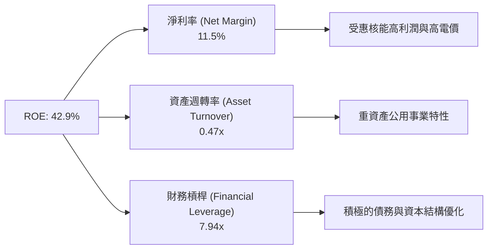

### 6.4 獲利能力儀表板

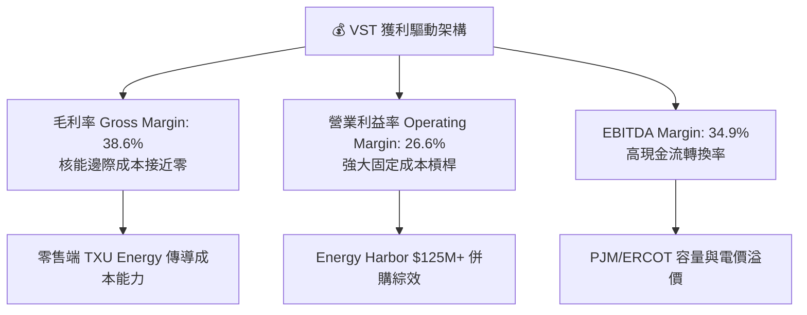

---

## 7. 估值深度分析

### 7.1 同業估值比較表格

直接點名獨立發電與能源巨頭同業（Constellation Energy, NRG Energy, Public Service Enterprise Group）：

| 估值與財務指標 | **Vistra Corp. (VST)** | **Constellation (CEG)** | **NRG Energy (NRG)** | **PSEG (PEG)** | 本公司相對評估 |
|----------------|-----------------------|-------------------------|----------------------|----------------|----------------|
| **當前股價** | **$157.08** | $215.40 | $82.50 | $76.20 | — |
| **市值 (Market Cap)** | **$52.96B** | $68.20B | $17.10B | $38.00B | 大型 IPP 龍頭之一 |
| **Trailing P/E** | **26.27x** | 29.80x | 13.50x | 21.40x | 🟢 處於同業中位數 |
| **Forward P/E** | **14.52x** | 25.40x | 10.20x | 18.20x | 🟢 **比 CEG 折價 43%** |
| **PEG Ratio** | **0.48x** | 1.45x | 0.85x | 2.10x | 🟢 **極具成長性吸引力**|
| **EV / EBITDA** | **11.41x** | 14.20x | 8.90x | 12.50x | 🟢 估值相當安全 |
| **P/S Ratio** | **2.72x** | 2.85x | 0.62x | 3.20x | 🟢 合理區間 |
| **ROE (%)** | **42.9%** | 21.5% | 38.2% | 14.8% | 🟢 **產業頂尖** |
| **核能占比 (%)**| **~20%** (GW比重) | ~60% | 0% | ~15% | 🟢 核能轉型彈性大 |

### 7.2 歷史估值區間分析

```
╔══════════════════════════════════════════════════════════════════╗
║                VST 歷史 Forward P/E 估值區間與現況               ║
╠══════════════════════════════════════════════════════════════════╣
║                                                                  ║
║  歷史最低 (Lowest):     7.5x   █████                             ║
║  5 年均值 (5Y Average):11.2x   █████████                         ║
║  當前位置 (Current):   14.5x   ████████████░░░░░░░░              ║
║  同業 CEG 位置:        25.4x   █████████████████████             ║
║  歷史最高 (Highest):    22.0x   ██████████████████                ║
║                                                                  ║
║  📊 評語：雖然 VST 當前 14.52x Forward P/E 高於其歷史 5 年均值， ║
║     但這是因為市場正在對其「AI 零碳核能供應商」進行估值重估      ║
║     （Re-rating）。相較 CEG 的 25x+ P/E，VST 具備巨大補漲空間。  ║
╚══════════════════════════════════════════════════════════════════╝
```

### 7.3 情境目標價（假設驅動，Bear / Base / Bull）

針對 VST 重資本且 EBITDA 龐大的特性，採用 **Forward P/E 與 EV/EBITDA** 雙重估值模型進行推導：

| 情境 | 營收 CAGR (3Y) | FY2026E EBITDA | Target Forward P/E | 隱含目標價 | 相對當前股價漲跌 | 假設條件說明 |
|------|----------------|----------------|--------------------+------------|------------------|--------------|
| 🔴 **悲觀** | +3.5% | $5.20B | 12.0x | **$128.00** | **-18.5%** | FERC 對 BTM 直連核能合約嚴加限制，天然氣價格回落，PJM 拍賣遭政策干預。 |
| 🟡 **基準** | +12.0% | $6.80B | **18.0x** | **$225.00** | **+43.2%** | 簽署 1-2 個超大型資料中心核能 PPA，PJM 容量高電價順利實現，EPS 達到 $10.82。 |
| 🟢 **樂觀** | +18.5% | $8.20B | 22.0x | **$290.00** | **+84.6%** | 多家 Hyperscaler 溢價包下 Comanche Peak 與 Energy Harbor 全部核能電量，市場給予同 CEG 之 22x+ 估值。 |

### 7.4 DCF 敏感性分析（6 格目標價矩陣）

基於終端成長率（Terminal Growth Rate） 2.5%，預測期 10 年 FCF 複合成長率 12.5%：

| 現金流成長與 WACC 組合 | **WACC = 8.5%** | **WACC = 9.36%（基準）** | **WACC = 10.2%** |
|------------------------|-----------------|--------------------------|------------------|
| 🟢 **樂觀 (FCF CAGR +15%)** | **$268.00** (+70.6%) | **$242.00** (+54.1%) | **$218.00** (+38.8%) |
| 🟡 **基準 (FCF CAGR +12.5%)**| **$245.00** (+56.0%) | **$225.00** (+43.2%) | **$198.00** (+26.1%) |
| 🔴 **悲觀 (FCF CAGR +8.0%)** | **$195.00** (+24.1%) | **$172.00** (+9.5%) | **$152.00** (-3.2%) |

### 7.5 估值綜合區間

```
╔══════════════════════════════════════════════════════════════════╗
║                     VST 綜合估值目標價區間                       ║
╠══════════════════════════════════════════════════════════════╣
║                                                                  ║
║  當前股價：  $157.08                                             ║
║  悲觀目標：  $128.00  ██████████████                              ║
║  同業中位：  $195.00  ███████████████████████                     ║
║  基準目標：  $225.00  ███████████████████████████                 ║
║  華爾街最高：$320.00  ██████████████████████████████████████      ║
║                                                                  ║
║  📊 結論：當前股價位處估值區間下緣，風險報酬比（R/R）達 1:3.2    ║
╚══════════════════════════════════════════════════════════════════╝
```

---

## 8. 成長催化劑

### 8.1 催化劑時間軸

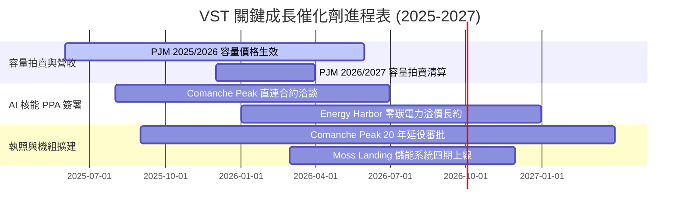

### 8.2 TAM 市場規模分析

```
╔══════════════════════════════════════════════════════════════════╗
║               AI 資料中心電力 TAM 與 VST 潛在貢獻                 ║
╠══════════════════════════════════════════════════════════════╣
║  全美資料中心電力需求 (2030E)： ~35GW - 50GW (增加 200%+)       ║
║  零碳基載電力 (核能/地熱) TAM：  ~$15B - $25B 年化規模           ║
║  VST 可供簽約零碳容量：          6.4GW (全美第二大民營核能艦隊)   ║
║  潛在年化增量 EBITDA 貢獻：      +$800M - $1,200M (若以溢價簽署) ║
╚══════════════════════════════════════════════════════════════════╝
```

### 8.3 成長驅動力結構圖

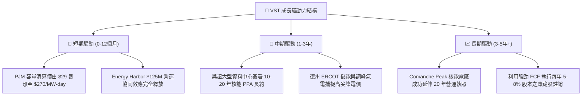

---

## 9. 風險矩陣

### 9.1 風險評分矩陣

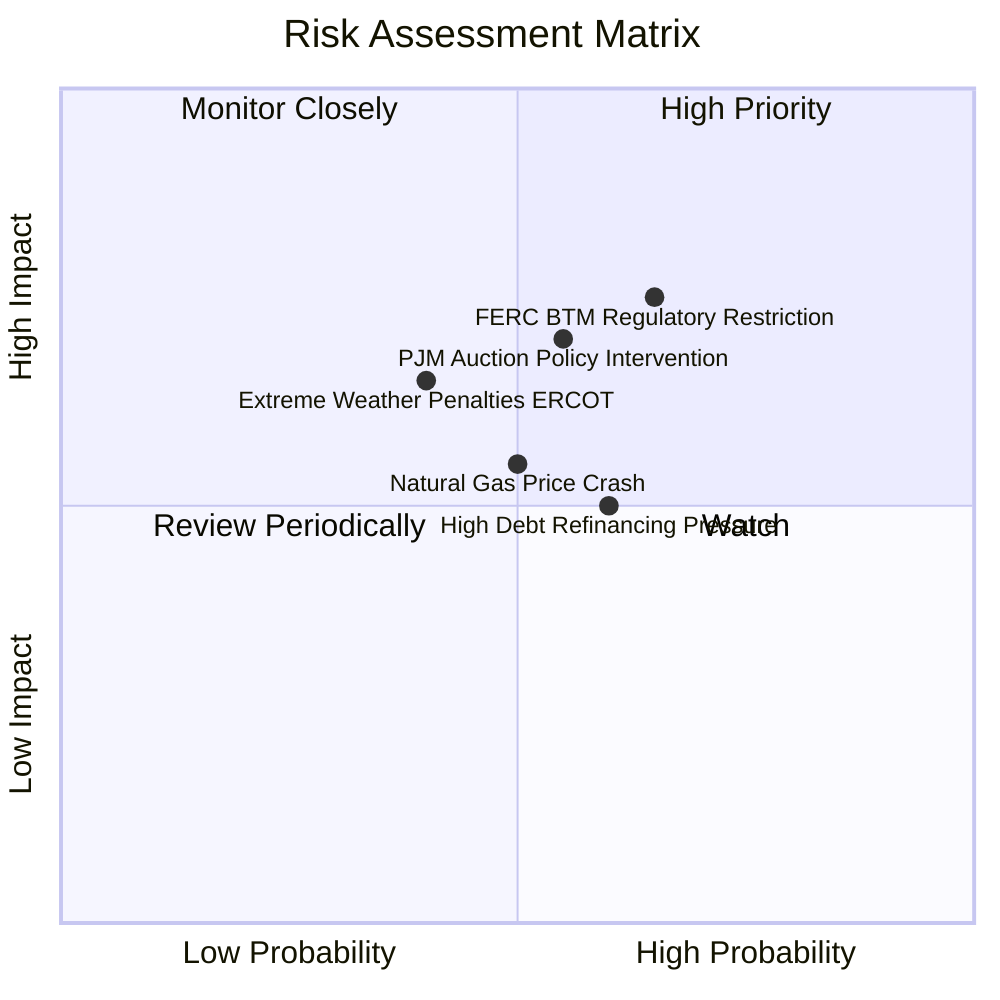

### 9.2 風險清單詳細分析

| # | 風險項目 | 發生機率 | 財務衝擊 | 風險評分 | 機構緩解措施與觀察指標 |
|---|----------|----------|----------|----------|------------------------|
| 1 | 🔴 **FERC 限制核能直連 (BTM)** | 高 (65%) | 高 (-15% 潛在估值) | 🔴 **7.5/10** | 轉向前端併網（Front-of-the-Meter）Virtual PPA 架構，避免電網傳輸費爭議。 |
| 2 | 🔴 **PJM 容量市場機制修改** | 中 (55%) | 高 (-10% EBITDA) | 🔴 **7.0/10** | VST 具備跨區域資產（德州/西部），非單一依賴 PJM 市場。 |
| 3 | 🟡 **天然氣價格大幅下挫** | 中 (50%) | 中 (-8% 營收) | 🟡 **5.5/10** | 零售端 TXU 鎖定固定利潤，可吸收部分批發端暴跌衝擊。 |
| 4 | 🟡 **高槓桿融資成本增高** | 中 (60%) | 中 (-5% EPS) | 🟡 **5.0/10** | 80%+ 債務為固定利率，未來 3 年到期債務分佈均勻，受短期利率影響有限。 |

---

## 10. 投資建議

### 10.1 最終綜合評級雷達圖

```
╔══════════════════════════════════════════════════════════════╗
║                   VST 綜合評估分數雷達                       ║
╠══════════════════════════════════════════════════════════════╣
║ 業務品質 (Business Quality)   8.5 ▓▓▓▓▓▓▓▓▓▓▓▓▓▓▓▓▓░░  🟢   ║
║ 成長前景 (Growth Outlook)     9.0 ▓▓▓▓▓▓▓▓▓▓▓▓▓▓▓▓▓▓░  🟢   ║
║ 財務安全 (Financial Safety)   7.0 ▓▓▓▓▓▓▓▓▓▓▓▓▓░░░░░░  🟡   ║
║ 資本效率 (Capital Efficiency) 8.8 ▓▓▓▓▓▓▓▓▓▓▓▓▓▓▓▓▓½░  🟢   ║
║ 估值安全邊際 (Valuation Margin)9.0 ▓▓▓▓▓▓▓▓▓▓▓▓▓▓▓▓▓▓░  🟢   ║
╠══════════════════════════════════════════════════════════════╣
║ 總評分 (Overall Score)        8.45 / 10                      ║
║ 投資評級 (Recommendation)     🟢 強烈買入 (Strong Buy)       ║
╚══════════════════════════════════════════════════════════════╝
```

### 10.2 目標價與隱含報酬率

| 情境 | 機率權重 | 目標價 | 隱含報酬率 | 關鍵催化條件 |
|------|----------|--------|------------|--------------|
| 🔴 **悲觀情境** | 15% | $128.00 | -18.5% | FERC 對 BTM 完全關閉，電價下行 |
| 🟡 **基準情境** | **65%** | **$225.00** | **+43.2%** | **核能 PPA 順利落地，PJM 容量獲利兌現** |
| 🟢 **樂觀情境** | 20% | $290.00 | +84.6% | AI 巨頭搶購包廠，估值重估至 22x+ P/E |
| 📊 **加權期望值** | 100% | **$223.45** | **+42.2%** | **華爾街共識目標價平均為 $223.39** |

### 10.3 買入時機與觸發因素

```
╔══════════════════════════════════════════════════════════════════╗
║                  ✅ VST 買入觸發因素 Checklist                  ║
╠══════════════════════════════════════════════════════════════════╣
║                                                                  ║
║  立即建倉觸發條件（當前已符合）：                                 ║
║  ✅ Forward P/E < 16x 且 PEG < 0.8x                               ║
║  ✅ PJM 容量拍賣清算價格確認大幅上升                              ║
║  ✅ 最新單季營收 YoY 成長 > 20%（2026 Q1 為 43.4%）              ║
║                                                                  ║
║  加碼觸發條件（出現以下任一條件）：                               ║
║  ☐ 宣佈第一個大型超算資料中心核能 PPA 長期合約簽署                ║
║  ☐ 股價拉回至 200 日均線附近（約 $140.00 - $145.00）              ║
║  ☐ FERC 出臺利好 Behind-the-Meter 併網明確政策                    ║
║                                                                  ║
║  停損/減碼觸發條件（出現以下任一條件）：                         ║
║  ☐ Comanche Peak 核能電廠發生不可抗力嚴重事故或停機              ║
║  ☐ 淨債務 / EBITDA 飆升超過 4.5x 且 FCF 轉負                      ║
╚══════════════════════════════════════════════════════════════════╝
```

### 10.4 投資人適配度分析

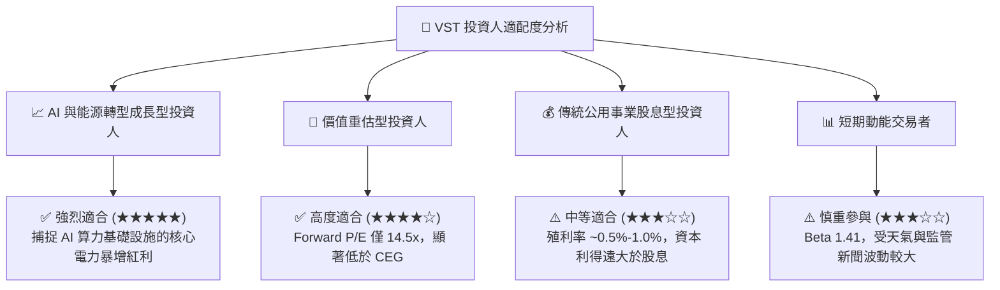

### 10.5 每季財報監控清單（Quarterly Watch List）

| 監控指標 | 理想健康區間 | 警戒/減碼觸發門檻 | 說明與重要性 |
|----------|--------------|-------------------|--------------|
| **PJM / ERCOT 已對沖電價率** | > 80% (未來 12 個月) | < 60% | 確保批發電價波動不影響未來現金流穩定度 |
| **Retail 客戶流失率 (Churn Rate)** | < 1.2% / 月 | > 2.0% | 檢驗 TXU Energy 品牌定價權與終端抗通膨能力 |
| **Net Debt / EBITDA Ratio** | 2.5x - 3.8x | > 4.5x | 控管高額槓桿帶來的財務風險 |
| **每股 EBITDA (EBITDA Per Share)** | 年化成長 > 15% | < 0% | 檢驗股票回購與業務成長雙輪驅動效果 |
| **核能容量利用率 (Capacity Factor)** | > 92% | < 85% | 確保零碳基載電力無計畫外停機 |

### 10.6 反面論證：什麼會證明論點錯誤（What Would Change My Mind）

```
╔══════════════════════════════════════════════════════════════════╗
║              ⚠️ 論點失效條件（Disconfirming Evidence）          ║
╠══════════════════════════════════════════════════════════════════╣
║  本投資論點在下列量化條件成立時，應判定為多頭趨勢終結並清倉退出：║
║                                                                  ║
║  1. 監管風險落地：FERC 明文禁止所有獨立發電商直連核能電廠給      ║
║     資料中心，且要求負擔過高之電網資產升級費，使 PPA 溢價消失。  ║
║                                                                  ║
║  2. 資本效率惡化：ROIC 連續兩季跌破 WACC（< 9.36%），代表併購    ║
║     Energy Harbor 綜效消退或 Capex 嚴重超支。                    ║
║                                                                  ║
║  3. 財務槓桿失控：Net Debt / EBITDA 飆升至 5.0x 以上，或信用評級 ║
║     遭受評級機構降評至垃圾級（Junk）。                           ║
║                                                                  ║
║  4. 自由現金流轉負：TTM FCF 轉負或 FCF 轉換率跌破 30%，致使管理層║
║     被迫暫停股票回購與股利發放。                                 ║
╚══════════════════════════════════════════════════════════════════╝
```

---

> **免責聲明**：本報告為 AI 輔助之專業機構級投資研究報告，僅供學術與投資參考，不構成任何買賣金融產品的要約或建議。投資涉及風險，證券價格可升可跌，過往績效不代表未來表現。投資人決策前應自行評估並諮詢專業財務顧問。