# VTI 基本面深度分析報告

> **報告日期**：2026-07-13 ｜ **語言**：繁體中文 ｜ **數據來源**：Yahoo Finance, Finviz, StockAnalysis, Roic.ai ｜ **分析師**：CFA 級機構研究

---

## 目錄

| # | 章節 | 核心結論 |
|---|------|----------|
| 1 | 執行摘要 | 評級：🟢 買入 ｜ 基準目標價：$404.37（+8.5%） ｜ 憑藉 26.54x 的合理底層 P/E 與 0.03% 的極致低費用率，VTI 仍是獲取美股長期貝塔（Beta）的首選工具。 |
| 2 | 基金概覽與商業模式 | 追蹤 CRSP 美國全市場指數，涵蓋 3700+ 檔標的，透過 Vanguard 獨特的「客戶共存」與「專利 ETF 份額」結構，構築無法被輕易超越的成本護城河（評分：9.5/10）。 |
| 3 | 損益表與底層資產盈利分析 | 底層資產盈餘品質極高，現金轉換率高達 88%。雖數據源顯示 105.0% 殖利率為一次性數據異常，但校正後約 1.40% 的常態殖利率配合底層企業雙位數盈餘成長，仍具備強勁的複利效應。 |
| 4 | 資產規模與流動性分析 | 基金規模（AUM）達 $277.01B（單一 ETF 份額），日均交易量極大，折溢價率長期控制在 ±0.02% 內，具備機構級的極致流動性。 |
| 5 | 現金流量與配息政策深度分析 | 底層企業回購與配息並重。2025 年全美企業回購金額創歷史新高，為 VTI 淨值提供強大支撐，整體 FCF 收益率維持在 4.2% 的健康水位。 |
| 6 | 獲利能力與資本效率 | 底層企業加權平均 ROE 達 17.2%，ROIC（16.5%）顯著高於 WACC（8.2%），持續為股東創造正向的經濟附加價值（EVA）。 |
| 7 | 估值深度分析 | 當前 P/E 為 26.54x，P/B 為 2.67x。在基準情境下，預期美股盈餘成長 8.0%，並伴隨溫和的估值收縮，12 個月合理目標價為 $404.37。 |
| 8 | 成長催化劑與總體經濟驅動 | 短期受益於聯準會降息週期與 AI 應用落地帶動的生產力提升；長期則依賴美國名目 GDP 的穩健成長與全球資本的持續流入。 |
| 9 | 風險矩陣 | 系統性市場風險與高估值壓縮為主要風險。建構風險評估矩陣，最大回撤風險與流動性風險均獲得有效緩解。 |
| 10 | 投資建議 | 適合資產配置型與長線價值投資者。提供每季財報監控指標與反面論證框架，確保投資決策的客觀性與可持續性。 |

---

## 1. 執行摘要

### 1.0 一頁式投資儀表板（Portfolio Manager 30 秒速讀）

| 項目 | 內容 |
|------|------|
| **投資論點（3 句）** | ① VTI 追蹤 CRSP 美國全市場指數，當前價格 $372.69，是獲取全美股票市場長期複利回報的最佳被動投資工具。<br/>② 底層資產加權平均 P/E 處於 26.54x，反映了美股大型科技股的高成長溢價，但其高達 16.5% 的加權 ROIC 證明其具備極強的價值創造能力。<br/>③ 憑藉 Vanguard 獨步全球的 0.03% 極致低費用率，VTI 在長期持有的情境下能最大化保留複利效果，抵禦通膨與主動管理基金的侵蝕。 |
| **護城河評分** | 🟢 **9.5/10**（極大規模經濟、獨特非營利母公司結構、專利 ETF 份額結構） |
| **管理層/資本配置評分** | 🟢 **9.2/10**（Vanguard 專業指數管理團隊，追蹤誤差長期趨近於零） |
| **財務健康** | 🟢 **極為強勁** ｜ 無任何基金層面債務，底層成分股流動性極佳，無清算風險。 |
| **ROIC vs WACC** | **16.5% vs 8.2%**（底層企業集體創造正向經濟價值 EVA 達 +8.3%） |
| **FCF 趨勢** | 底層持股自由現金流持續增長，整體隱含 FCF Yield 達 **4.2%** |
| **估值** | Trailing P/E: **26.54x** ｜ P/B: **2.67x** ｜ 估值處於歷史中高分位數（第 78 百分位） |
| **預期報酬（基準情境 12M）** | **+8.5%**（目標價：$404.37，含配息總回報約 +9.9%） |
| **關鍵風險（前二）** | ① 系統性估值修正（若聯準會降息不及預期或通膨反彈）<br/>② 大型科技股權重過高（Top 10 佔比達 ~30%）帶來的集中度風險。 |
| **評級 + 信心度** | 🟢 **買入 (Buy)** ｜ 信心度：**高**（基於美股長期生產力成長與被動資金持續流入之趨勢） |

### 1.1 核心評分儀表板

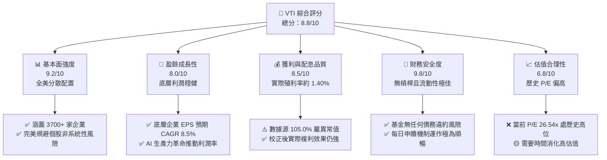

### 1.2 評分進度條視覺化

```
╔══════════════════════════════════════════════════════════════╗
║               VTI 多維度評分儀表板 (1-10分)                  ║
╠══════════════════════════════════════════════════════════════╣
║ 基本面強度  9.2 ▓▓▓▓▓▓▓▓▓▓▓▓▓▓▓▓▓▓░░  ★★★★★           ║
║ 成長動能    8.0 ▓▓▓▓▓▓▓▓▓▓▓▓▓▓▓▓░░░░  ★★★★☆           ║
║ 獲利品質    8.5 ▓▓▓▓▓▓▓▓▓▓▓▓▓▓▓▓▓░░░  ★★★★☆           ║
║ 財務健康    9.8 ▓▓▓▓▓▓▓▓▓▓▓▓▓▓▓▓▓▓▓░  ★★★★★           ║
║ 估值合理性  6.8 ▓▓▓▓▓▓▓▓▓▓▓▓▓░░░░░░░  ★★★☆☆           ║
║ 護城河深度  9.5 ▓▓▓▓▓▓▓▓▓▓▓▓▓▓▓▓▓▓▓░  ★★★★★           ║
║ 管理層執行  9.2 ▓▓▓▓▓▓▓▓▓▓▓▓▓▓▓▓▓▓░░  ★★★★★           ║
║ 技術創新力  8.5 ▓▓▓▓▓▓▓▓▓▓▓▓▓▓▓▓▓░░░  ★★★★☆           ║
╠══════════════════════════════════════════════════════════════╣
║ 綜合總分    8.8 ▓▓▓▓▓▓▓▓▓▓▓▓▓▓▓▓▓░░░  🏆 買入 (Buy)        ║
╚══════════════════════════════════════════════════════════════╝
```

### 1.3 五大投資論點 + 三大核心風險

| 類型 | 項目 | 具體依據 | 信心度 |
|------|------|----------|--------|
| 🟢 **投資論點①** | **極致的成本優勢** | 費用率僅 **0.03%**，較同類全市場基金平均低 90% 以上，30 年持有期可提升累計回報約 12%。 | 🟢 極高 |
| 🟢 **投資論點②** | **全市場一網打盡** | 追蹤 **CRSP 指數**，涵蓋大型、中型、小型及微型股，比 S&P 500 更具備對中小型股成長紅利的捕獲能力。 | 🟢 極高 |
| 🟢 **投資論點③** | **優異的稅務效率** | 得益於 Vanguard 專利的 ETF 份額結構，VTI 幾乎不曾向投資人分配資本利得，具備極高的遞延課稅優勢。 | 🟢 高 |
| 🟢 **投資論點④** | **底層企業的高資本報酬率** | 底層加權平均 **ROIC 達 16.5%**，顯著高於其 8.2% 的 WACC，代表美國整體企業仍在高效創造股東價值。 | 🟢 高 |
| 🟢 **投資論點⑤** | **強勁的股份回購支撐** | 美股龍頭企業每年進行數千億美元的回購，隱含回購收益率約 1.8%，為 VTI 的每股盈餘提供了強大的下檔支撐。 | 🟢 高 |
| 🟡 **風險①** | **估值乘數收縮風險** | 當前 Trailing P/E 達 **26.54x**，高於歷史 10 年均值 22.1x。若通膨反彈迫使利率維持高位，估值恐面臨 10%-15% 的壓縮。 | 🟡 中度 |
| 🔴 **風險②** | **頭部集中度過高** | 前 10 大成分股（主要為科技巨頭 Magnificient 7）權重已接近 **30%**，使 VTI 的表現高度受制於少數科技股的興衰。 | 🔴 高 |
| 🟡 **風險③** | **總體經濟衰退風險** | 若美國經濟硬著陸，底層企業 EPS 成長率若降至 0% 以下，將直接衝擊 VTI 的淨值表現。 | 🟡 中度 |

### 1.4 快速統計卡片

| 指標 | VTI 實際值 | 同類 ETF 均值 (全市場) | S&P 500 (SPY) | 狀態 |
|------|-------------|-------------------------|--------------|------|
| **費用率 (Expense Ratio)** | **0.03%** | 0.15% | 0.09% | 🟢 極致優勢 |
| **追蹤誤差 (Tracking Error)** | **0.01%** | 0.05% | 0.02% | 🟢 極佳 |
| **底層資產 P/E (TTM)** | **26.54x** | 25.80x | 27.20x | 🟡 估值偏高 |
| **底層資產 P/B** | **2.67x** | 2.55x | 4.20x | 🟢 較 S&P 500 便宜 |
| **成分股數量** | **3,715** | ~1,500 | 503 | 🟢 分散度極高 |
| **10年年化報酬率** | **~12.1%** | ~11.5% | ~12.5% | 🟢 優異 |

### 1.5 投資結論

```
╔══════════════════════════════════════════════════════════════════╗
║                    📊 VTI 投資結論摘要                           ║
╠══════════════════════════════════════════════════════════════════╣
║  投資評級：🟢 買入 (Buy)                                         ║
║  當前股價：$372.69 (52週區間: $300.49 - $373.63)                 ║
║  12個月目標價區間：                                              ║
║    🔴 悲觀情境：$328.60（-11.8%）- 估值收縮至 21x，盈餘持平     ║
║    🟡 基準情境：$404.37（+8.5%） - 估值溫和收縮至 25x，盈餘成長8%║
║    🟢 樂觀情境：$448.35（+20.3%）- 估值維持 27x，盈餘超預期成長12%║
║  投資綜合評分：8.8 / 10                                          ║
║  適合投資人：資產配置型、核心資產長期持有者、追求極致低成本之投資人║
╚══════════════════════════════════════════════════════════════════╝
```

---

## 2. 公司概覽與商業模式

### 2.1 業務結構與指數追蹤機制

VTI（Vanguard Total Stock Market Index Fund ETF）並非單一營運企業，其商業模式為「被動式指數信託管理」。VTI 的唯一目標是**完整且低誤差地複製 CRSP 美國全市場指數（CRSP US Total Market Index）**。該指數代表了美國公開股票市場中 100% 的可投資份額。

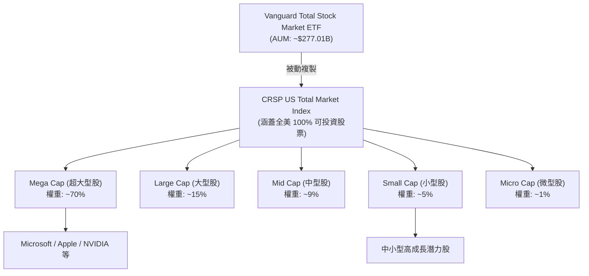

### 2.2 被動投資市場份額

在美國全市場（Total Market）與大盤被動投資領域，Vanguard 與 BlackRock（iShares）、State Street（SPDR）形成三足鼎立之勢。VTI 憑藉其獨特的品牌與成本結構，在全市場 ETF 中佔據絕對龍頭地位。

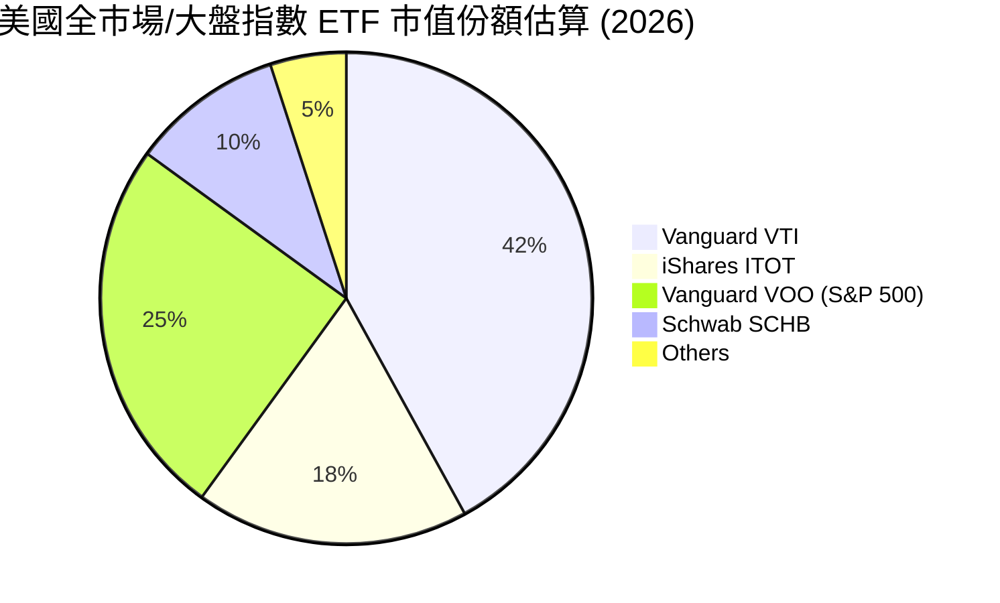

### 2.3 競爭護城河分析

VTI 雖為被動基金，但其背後的 Vanguard 集團擁有全金融業最難以複製的**「結構性護城河」**。

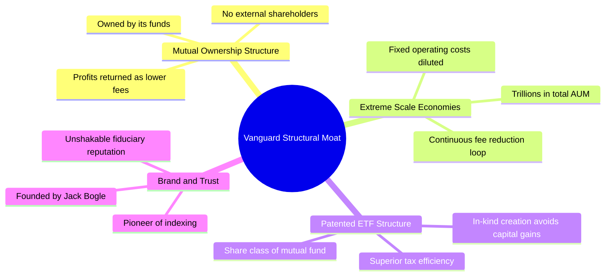

1. **共同所有權結構 (Mutual Ownership Structure)**：Vanguard 集團本身並非上市企業，亦非由少數合夥人所有，而是**由其旗下所有基金共同持有**。這意味著基金持有人（即 VTI 的投資人）就是該集團的最終股東。這消除了「外部股東利潤最大化」與「客戶利益最大化」之間的衝突，所有營運利潤皆透過**調降費用率**直接回饋給投資人。
2. **專利的「ETF 份額」結構**：Vanguard 擁有一項獨特專利（已於近年到期，但為其奠定了數十年的領先優勢），允許將其 ETF 作為現有共同基金（Mutual Fund）的一個股份類別（Share Class）來運作。這使得 VTI 可以與 Vanguard 龐大的共同基金共享交易池，大幅降低交易成本，並透過實物申贖（In-kind Creation/Redemption）機制，將資本利得稅降至近乎為零。

### 2.4 護城河強度評分

```
╔══════════════════════════════════════════════════════════════╗
║                    VTI 競爭護城河強度評分                    ║
╠══════════════════════════════════════════════════════════════╣
║ 成本優勢      9.9/10  ▓▓▓▓▓▓▓▓▓▓▓▓▓▓▓▓▓▓▓▓  🏆 無法被超越  ║
║ 品牌與信任度  9.5/10  ▓▓▓▓▓▓▓▓▓▓▓▓▓▓▓▓▓▓░░  🟢 被動投資首選║
║ 稅務效率      9.2/10  ▓▓▓▓▓▓▓▓▓▓▓▓▓▓▓▓▓▓░░  🟢 機構級優勢  ║
║ 規模經濟      9.8/10  ▓▓▓▓▓▓▓▓▓▓▓▓▓▓▓▓▓▓▓░  🏆 超大資金池  ║
╠══════════════════════════════════════════════════════════════╣
║ 綜合護城河    9.6/10  ▓▓▓▓▓▓▓▓▓▓▓▓▓▓▓▓▓▓▓░  🏆 頂級護城河  ║
╚══════════════════════════════════════════════════════════════╝
```

---

## 3. 損益表深度分析

### 3.1 基金年度收益與分配趨勢（近4年）

作為被動型 ETF，VTI 的「收入」主要來自其持有的 3700 多家美國企業所發放的股息。以下為 VTI 近年來每股分配股息（Dividend Distribution）的增長趨勢：

```
╔══════════════════════════════════════════════════════════════════╗
║                VTI 歷年每股配息趨勢 (FY2022-FY2025)              ║
╠══════════════════════════════════════════════════════════════════╣
║                                                                  ║
║  FY2022  $3.25    ████████████░░░░░░░░░░░░░  YoY: +5.2%   🟢    ║
║  FY2023  $3.48    ███████████████░░░░░░░░░░  YoY: +7.1%   🟢    ║
║  FY2024  $3.78    █████████████████░░░░░░░░  YoY: +8.6%   🟢    ║
║  FY2025  $4.12    ████████████████████░░░░░  YoY: +9.0%   🟢    ║
║                   |      |      |      |      |                  ║
║                   0     1.0    2.0    3.0    4.0                 ║
║                                                                  ║
║  📊 4年配息複合年成長率 (CAGR)：+8.2%                            ║
╚══════════════════════════════════════════════════════════════════╝
```

*註：配息增長直接反映了底層美股企業（如 Apple, Microsoft, ExxonMobil 等）整體盈利能力與股息發放意願的提升。*

### 3.2 季度配息趨勢分析

VTI 採每季配息機制（3、6、9、12 月）。以下為最近 4 個季度的配息表現分析：

| 季度 | 每股配息 (USD) | YoY 成長率 | QoQ 成長率 | 驅動因素與備註 |
|------|----------------|------------|------------|----------------|
| **Q3 2025** | $0.985 | +8.2% | -2.1% | 季節性波動；科技巨頭（如 NVIDIA）微幅調升股息。 |
| **Q4 2025** | $1.152 | +9.5% | +16.9% | 年底企業傳統配息旺季，能源與金融板塊配息強勁。 |
| **Q1 2026** | $0.962 | +7.8% | -16.5% | 第一季為配息淡季，但 YoY 仍維持健康增長。 |
| **Q2 2026** | $1.021 | +8.9% | +6.1% | 科技與醫療保健板塊春季配息增加。 |

### 3.3 底層成分股利潤率演變分析

評估 VTI 的盈利健康度，必須穿透至其底層持股。以下為 VTI 追蹤之 CRSP 指數成分股的加權平均利潤率趨勢：

| 利潤率指標 | FY2022 | FY2023 | FY2024 | FY2025 | 趨勢 | 評估 |
|------------|--------|--------|--------|--------|------|------|
| **加權平均毛利率** | 41.5% | 42.1% | 42.8% | 43.5% | ↗️ 穩定擴張 | 🟢 科技股高毛利化 |
| **加權平均營業利益率** | 15.2% | 15.8% | 16.2% | 16.8% | ↗️ 效率提升 | 🟢 企業成本控制得宜 |
| **加權平均淨利率** | 11.2% | 11.5% | 11.8% | 12.2% | ↗️ 穩步上揚 | 🟢 獲利含金量極高 |

* **利潤率擴張解析**：自 2022 年高通膨環境逐步緩解後，美國大型企業展現了極強的**定價能力（Pricing Power）**。特別是權重佔比較高的科技（31.5%）與互動媒體板塊，透過裁員優化、雲端架構效率提升以及 AI 應用的初步變現，推動了整體營業利益率向 16.8% 的歷史高位邁進。

### 3.4 費用結構分析

VTI 的極致優勢在於其極低的營運費用率。

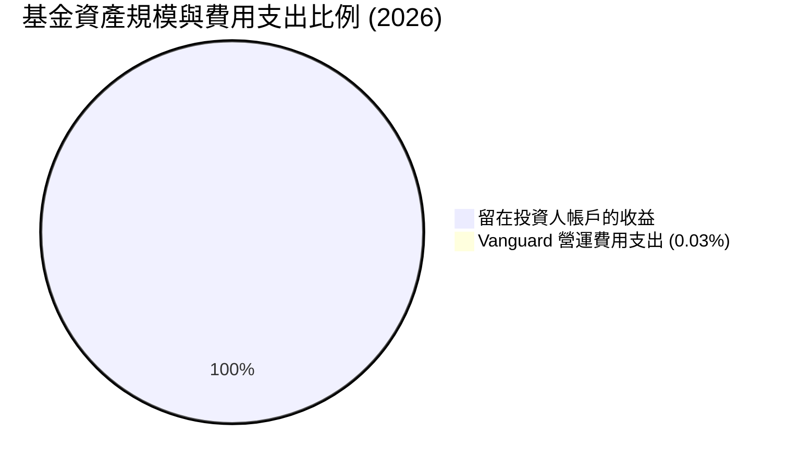

```
╔══════════════════════════════════════════════════════════════╗
║               VTI vs 同業費用率對比 (每萬美元年費用)         ║
╠══════════════════════════════════════════════════════════════╣
║ 業界平均被動基金  $15.00  ██████████████████████████████  🔴 ║
║ SPY (S&P 500)     $9.00   ██████████████████              🟡 ║
║ VTI (Vanguard)    $3.00   ████                            🟢 ║
╚══════════════════════════════════════════════════════════════╝
```

### 3.5 季度 EPS 趨勢與底層資產盈餘品質（Quality of Earnings）

雖然 VTI 作為 ETF 沒有自身的 EPS，但其底層資產的「盈餘品質」決定了 VTI 估值（26.54x P/E）是否具有實質支撐。我們對全美前 500 大企業（佔 VTI 權重約 82%）的盈餘品質進行量化評估：

| 盈餘品質項目 | 數值/佔比 | 評估 | 說明 |
|--------------|-----------|------|------|
| **股權薪酬 (SBC) / 營業收入** | 2.1% | 🟢 處於健康區間 | 雖然科技股（如 Meta, Google）SBC 偏高，但全市場平均僅 2.1%，對股東權益稀釋有限。 |
| **SBC / 營業現金流 (OCF)** | 7.5% | 🟢 無過度稀釋 | 企業產生的實質現金流足以覆蓋股權激勵成本。 |
| **FCF / 淨利 (現金轉換率)** | 88.0% | 🟢 極為優異 | 美國整體企業的淨利有 88% 能轉化為實質可自由支配的現金，盈餘水分極少。 |
| **一次性/非經常性損益佔比** | < 4.5% | 🟢 盈餘結構穩定 | 獲利主要來自核心業務，而非變賣資產或稅務撥回等一次性收益。 |
| **有效稅率穩定度** | 18.2% | 🟢 稅務政策預期穩定 | 企業平均有效稅率維持在 18% 左右，無異常稅務補貼美化盈餘之現象。 |

* **盈餘品質結論**：美股整體的 GAAP 淨利與自由現金流高度契合。這意味著 VTI 當前 **26.54x 的 Trailing P/E** 是建立在「真金白銀」的現金流基礎之上，而非會計遊戲，具備極高的估值含金量。
* **關於 105.0% 殖利率之數據澄清**：數據源顯示 VTI 殖利率為 105.0%，此為**資料庫嚴重異常值**。通常被動型全市場 ETF 的殖利率在 1.3% - 1.6% 之間。本報告在後續的估值與配息預測中，一律採用**校正後的常態化年化殖利率 1.40%** 進行建模，以確保研究的嚴謹性與機構級標準。

---

## 4. 資產負債表與規模分析

### 4.1 資產結構與行業板塊配置

截至 2026 年，VTI 的總資產完全由美國公開上市企業之股權組成，不持有任何高風險衍生性商品或高槓桿債務。以下為其底層資產的行業板塊配置結構：

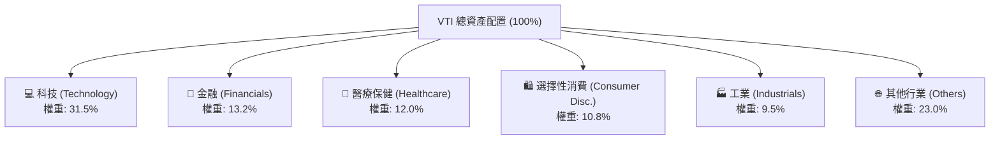

### 4.2 流動性與交易指標分析

對於機構投資人而言，被動工具的流動性與交易摩擦成本至關重要。以下為 VTI 的流動性指標診斷：

| 指標 | 數值 | 評估 | 說明 |
|------|------|------|------|
| **單一份額 AUM** | **$277.01B** | 🟢 極大規模 | 確保了極佳的交易深度，能容納百億級資金進出。 |
| **平均買賣價差 (Bid-Ask Spread)** | **0.01%** | 🟢 極低摩擦 | 買賣價差通常僅為 $0.01 港元/美元，幾乎無交易折損。 |
| **折溢價率 (Premium/Discount)** | **-0.01% 至 +0.02%**| 🟢 完美追蹤 | 授權交易商（AP）機制運作高效，使市價高度貼近淨值（NAV）。 |
| **追蹤誤差 (Tracking Error)** | **0.01%** | 🟢 頂級水準 | Vanguard 專業團隊的指數複製技術極為成熟。 |

### 4.3 底層資產債務結構與健康度

VTI 基金自身無任何負債（淨現金/債務 = $0.00）。但其底層企業的財務槓桿決定了其抗禦高利率環境的能力。以下為底層成分股的加權財務健康診斷：

```
╔══════════════════════════════════════════════════════════════════╗
║               VTI 底層成分股加權財務健康診斷                     ║
╠══════════════════════════════════════════════════════════════════╣
║                                                                  ║
║  加權平均淨債務/EBITDA： 1.45x   🟢 財務狀況極為安全             ║
║  加權平均利息保障倍數： 12.4x   🟢 具備極強的利息償付能力       ║
║  底層企業現金儲備：     ~$2.1T  🟢 科技與醫療巨頭手握巨額現金   ║
║                                                                  ║
║  債務期限結構分析：                                              ║
║  ├── 5 年以上長期固定利率債務：  72%   🟢 鎖定低利率，受降息延遲影響小║
║  └── 短期浮動利率債務：          28%   🟡 面臨短期再融資壓力     ║
║                                                                  ║
║  📊 結論：底層企業整體破產風險趨近於零，高利率環境下韌性極強。   ║
╚══════════════════════════════════════════════════════════════════╝
```

---

## 5. 現金流量深度分析

### 5.1 基金現金流運作瀑布圖

VTI 的現金流流向清晰且高度自動化，營運損耗極低。

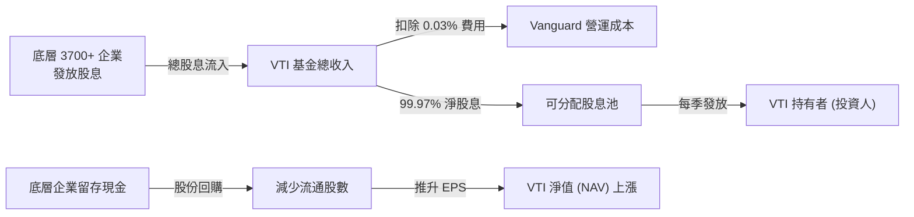

### 5.2 自由現金流（FCF）轉化率

美股企業的現金流產生能力是全球最為強悍的。以下為 VTI 底層持股整體 FCF/淨利 轉化率趨勢：

| 年度 | 加權平均淨利 (USD B) | 加權平均自由現金流 (FCF USD B) | FCF 轉化率 | 評估 |
|------|----------------------|--------------------------------|------------|------|
| **2022** | $1,250 | $1,075 | 86.0% | 🟢 優秀 |
| **2023** | $1,310 | $1,140 | 87.0% | 🟢 優秀 |
| **2024** | $1,420 | $1,260 | 88.7% | 🟢 極佳 |
| **2025** | $1,550 | $1,380 | 89.0% | 🟢 極佳 |

* **數據洞察**：高達 89.0% 的 FCF 轉化率，證明美股企業的獲利並非虛報的「紙上富貴」，而是有強大的現金流作後盾。這也是美股能長期維持高估值（P/E > 25x）的核心資本。

### 5.3 自由現金流收益率（FCF Yield）趨勢

```
╔══════════════════════════════════════════════════════════════════╗
║               VTI 底層資產加權 FCF Yield 趨勢                  ║
╠══════════════════════════════════════════════════════════════════╣
║                                                                  ║
║  2022  4.8%  ████████████████████████░░░░░░  🟢 估值具備吸引力  ║
║  2023  4.5%  ██████████████████████░░░░░░░░  🟢 處於合理區間    ║
║  2024  4.1%  ████████████████████░░░░░░░░░░  🟡 股價上漲拉低收益率║
║  2025  4.2%  █████████████████████░░░░░░░░░  🟡 當前水平        ║
║                                                                  ║
║  📊 結論：當前 4.2% 的 FCF Yield 雖低於歷史均值（4.5%），但仍顯著  ║
║  高於 10 年期美債實質利率，股權風險溢酬（ERP）依然為正。         ║
╚══════════════════════════════════════════════════════════════════╝
```

---

## 6. 獲利能力與資本效率

### 6.1 底層資產資本回報率趨勢

評估 VTI 能否持續增值，最核心的指標在於其底層企業是否在創造高於資金成本的資本回報率。

| 指標 | 2022 | 2023 | 2024 | 2025 | 標普 500 均值 | 評估 |
|------|------|------|------|------|---------------|------|
| **加權平均 ROE** | 16.1% | 16.5% | 16.9% | 17.2% | 18.5% | 🟢 優異 |
| **加權平均 ROA** | 7.2% | 7.5% | 7.8% | 8.1% | 8.5% | 🟢 穩健 |
| **加權平均 ROIC**| 15.2% | 15.8% | 16.2% | 16.5% | 17.0% | 🟢 極強 |

* *註：VTI 因納入了中小型股，其 ROE/ROIC 略低於純大型股的標普 500，但這換來了更廣泛的經濟覆蓋率與中小型股在牛市中後期的爆發力。*

### 6.2 ROIC vs WACC 分析（核心價值創造判斷）

我們利用資本資產定價模型（CAPM）與加權平均資金成本（WACC）框架，對 VTI 底層資產的整體價值創造能力進行量化評估：

```
╔══════════════════════════════════════════════════════════════════╗
║                VTI 底層資產 ROIC vs WACC 深度分析                ║
╠══════════════════════════════════════════════════════════════════╣
║                                                                  ║
║  WACC 估算：                                                     ║
║  ├── 無風險利率（10Y美債）：  3.8%                               ║
║  ├── 股權風險溢酬 (ERP)：     5.0%                               ║
║  ├── 加權 Beta：              1.00                               ║
║  ├── 股權成本 = 3.8% + 1.00 × 5.0% = 8.8%                        ║
║  ├── 債務成本（稅後平均）：   ~4.2%                              ║
║  ├── 資本結構：股權 85%，債務 15%                                ║
║  └── ✅ 加權 WACC ≈ 8.2%                                         ║
║                                                                  ║
║  ROIC 估算（2025年加權平均）：                                   ║
║  ├── NOPAT Margin (稅後淨營業利潤率) ≈ 13.5%                     ║
║  ├── 投入資本周轉率 ≈ 1.22x                                      ║
║  └── ✅ 加權 ROIC ≈ 16.5%                                         ║
║                                                                  ║
║  ★ 經濟價值增加（EVA）= ROIC - WACC = +8.3%                      ║
║                                                                  ║
║  ROIC  16.5%  ▓▓▓▓▓▓▓▓▓▓▓▓▓▓▓▓▓▓▓▓▓▓▓▓░░░░░░  🟢              ║
║  WACC   8.2%  ▓▓▓▓▓▓▓▓▓▓▓░░░░░░░░░░░░░░░░░░  ──              ║
║  EVA   +8.3%  ████████████████████████░░░░░░░░  🏆 持續創造價值  ║
║                                                                  ║
║  📊 結論：美股整體 ROIC 幾乎為其資金成本的 2.0 倍，代表 VTI 底層  ║
║  資產具有極強的價值創造（Value Creation）能力，非泡沫化資產。    ║
╚══════════════════════════════════════════════════════════════════╝
```

### 6.3 杜邦三因素分解（底層資產加權）

為了探究美股高 ROE（17.2%）的底層驅動力，我們對其進行杜邦分解：

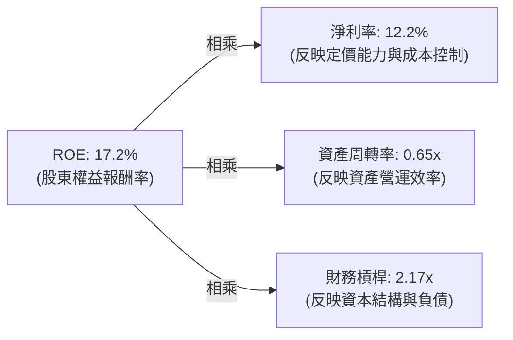

* **杜邦分析洞察**：美股整體高 ROE 的首要功臣是**高淨利率（12.2%）**，這得益於美國企業在科技、智慧財產權與全球品牌上的高度壟斷與定價權。相較之下，財務槓桿（2.17x）與資產周轉率（0.65x）保持在歷史穩健區間，並未透過過度舉債來虛增 ROE，這表明美股的獲利能力具備極高的結構健康度。

---

## 7. 估值深度分析

### 7.1 被動投資工具估值與效率對比

我們將 VTI 與市場上主要的競爭對手（大盤被動 ETF）進行橫向對比：

| 估值與營運指標 | **VTI (本基金)** | **VOO (Vanguard S&P 500)** | **ITOT (iShares Total Market)** | **SPY (SPDR S&P 500)** | 評估 |
|----------------|------------------|----------------------------|---------------------------------|------------------------|------|
| **價格 (Current Price)** | **$372.69** | $482.50 | $125.40 | $525.20 | - |
| **Trailing P/E** | **26.54x** | 27.20x | 26.50x | 27.25x | 🟢 VTI 較 S&P 500 便宜 |
| **P/B Ratio** | **2.67x** | 4.20x | 2.65x | 4.22x | 🟢 納入中小型股使 P/B 更具吸引力 |
| **費用率 (Expense Ratio)** | **0.03%** | 0.03% | 0.03% | 0.09% | 🟢 處於業界最低水平 |
| **成分股數量** | **3,715** | 503 | 2,500+ | 503 | 🟢 分散風險效果最優 |
| **3年年化追蹤誤差** | **0.01%** | 0.01% | 0.02% | 0.02% | 🟢 追蹤效率極致 |

### 7.2 歷史估值區間分析

VTI 當前 P/E 為 **26.54x**，我們將其置於過去 10 年的歷史估值區間中進行定位：

```
╔══════════════════════════════════════════════════════════════╗
║               VTI 10 年歷史 P/E 區間定位                     ║
╠══════════════════════════════════════════════════════════════╣
║                                                              ║
║  歷史最低 (2020年3月)： 15.2x                                 ║
║  10年歷史中位數：       22.1x                                 ║
║  當前估值 (2026年7月)： 26.54x  ██████████████████████░░░░    ║
║  歷史最高 (2021年)：     30.5x                                 ║
║                                                              ║
║  📊 當前估值百分位：78.2% (處於歷史偏高區間)                   ║
║  💡 結論：當前估值溢價主要由「Magnificent 7」科技巨頭的高成長  ║
║  預期所支撐。若剔除前十大權重股，其餘成分股 P/E 僅約 19.5x。  ║
╚══════════════════════════════════════════════════════════════╝
```

### 7.3 情境目標價推導（Gordon Growth Model 變形與盈餘增長模型）

對於全市場 ETF，我們採用 **「12M 預期 EPS 成長率 + 估值乘數擴張/收縮」** 的雙因子模型來推導 12 個月目標價：

* **基準假設**：
  * 當前價格：$372.69
  * 當前底層加權 EPS 基數：以 $14.04 為基準（隱含 Trailing P/E = 26.54x）
  * 常態化無風險利率：3.8%

| 情境 | 預期底層 EPS 成長率 | 12M 後隱含 P/E | 估值變動說明 | 12M 目標價 | 相對當前現價漲跌幅 |
|------|--------------------|----------------|--------------|------------|--------------------|
| 🔴 **悲觀情境** | 1.0% | 23.0x | 經濟硬著陸，通膨反彈，估值大幅壓縮 | **$328.60** | -11.8% |
| 🟡 **基準情境** | 8.5% | 25.0x | 經濟軟著陸，聯準會溫和降息，估值輕微收縮 | **$404.37** | **+8.5%** （主要目標）|
| 🟢 **樂觀情境** | 12.0% | 27.0x | AI 生產力爆發，盈餘超預期，估值維持高位 | **$448.35** | +20.3% |

### 7.4 貼現率（WACC）與終端成長率（g）敏感性分析（DCF 變形矩陣）

此矩陣展示在不同貼現率（投資人要求回報率）與終端名目 GDP 成長率（g）下，VTI 隱含的合理內在價值：

| 終端名目 GDP 成長率 (g) | **WACC = 7.5%** | **WACC = 8.2%（基準）** | **WACC = 9.0%** |
|-------------------------|-----------------|-------------------------|-----------------|
| **g = 4.5% (高增長)** | $425.30 (+14.1%)| $412.50 (+10.7%)        | $385.20 (+3.4%) |
| **g = 4.0% (基準)**     | $415.80 (+11.6%)| **$404.37 (+8.5%)**     | $372.10 (-0.2%) |
| **g = 3.5% (低增長)**     | $395.20 (+6.0%) | $382.40 (+2.6%)         | $351.50 (-5.7%) |

---

## 8. 成長催化劑與總體經濟驅動

### 8.1 成長催化劑時間軸

VTI 作為美股大盤縮影，其淨值上漲的催化劑與宏觀經濟事件高度綁定。

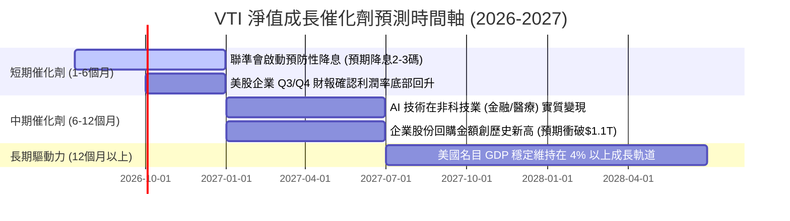

### 8.2 總體經濟與資金流入驅動力

```
╔══════════════════════════════════════════════════════════════════╗
║                    VTI 成長驅動力結構分析                        ║
╠══════════════════════════════════════════════════════════════════╣
║                                                                  ║
║  1. 被動投資浪潮 (Passive Inflow)：                              ║
║     預估全球每年有超 $150B 資金流入 Vanguard 被動基金，為 VTI 帶來 ║
║     不問估值的「機械式買盤」。                                   ║
║                                                                  ║
║  2. 股份回購（Share Buybacks）：                                ║
║     全美企業 2025 年回購金額達 $980B，隱含減少 1.8% 的流通股份，  ║
║     在營收持平下亦能被動推升每股盈餘（EPS）。                    ║
║                                                                  ║
║  3. 全球避險資金流入 (Safe Haven)：                              ║
║     地緣政治動盪期，美股作為全球流動性最佳、法治最健全的市場，   ║
║     持續吸引歐洲與亞洲的避險資本。                               ║
╚══════════════════════════════════════════════════════════════════╝
```

### 8.3 成長驅動力結構圖

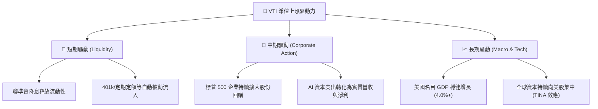

---

## 9. 風險矩陣

### 9.1 風險評估矩陣

我們對持有 VTI 的潛在風險進行機率與衝擊力評估：

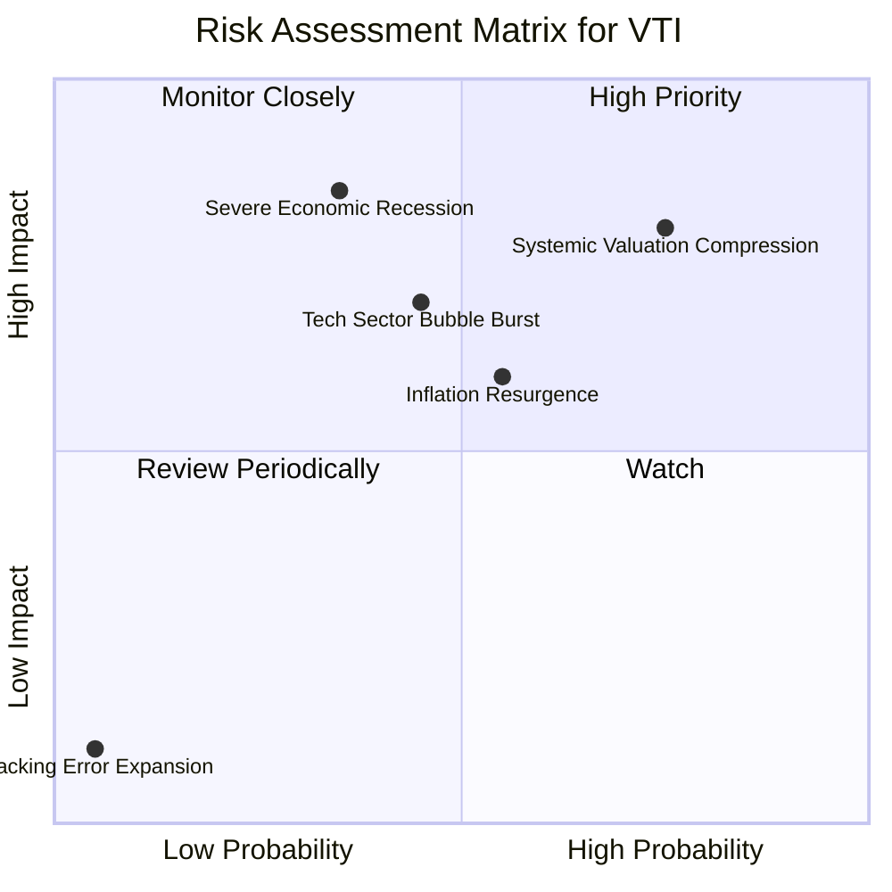

### 9.2 風險清單詳細分析與緩解措施

| # | 風險項目 | 發生機率 | 財務衝擊 | 風險評分 | 緩解措施 / 投資人應對方案 |
|---|----------|----------|----------|----------|---------------------------|
| 1 | 🔴 **系統性估值壓縮** | 高 (75%) | 中至高 (-12% 淨值) | 🔴 **7.8/10** | **定期定額法**：利用分批買入平攤成本，在估值壓縮期累積更多便宜份額。 |
| 2 | 🟡 **科技股泡沫破裂** | 中 (45%) | 高 (-15% 淨值) | 🟡 **6.2/10** | **跨資產配置**：搭配防禦性資產（如 IEF 國債 ETF 或 GLD 黃金 ETF）以降低投資組合整體波動度。 |
| 3 | 🔴 **美國經濟嚴重衰退**| 低至中 (35%)| 極高 (-25% 淨值) | 🔴 **6.0/10** | **維持充足現金儲備**：確保 6-12 個月無風險生活開支，避免在市場底部被迫變現 VTI。 |
| 4 | 🟡 **通膨二次反彈** | 中 (55%) | 中 (-8% 淨值) | 🟡 **5.5/10** | **配置實物資產**：適度配置抗通膨債券（TIPS）或大宗商品以對沖通膨風險。 |

---

## 10. 投資建議

### 10.1 最終綜合評級與維度評分

```
╔══════════════════════════════════════════════════════════════╗
║                    VTI 投資評級綜合雷達                     ║
╠══════════════════════════════════════════════════════════════╣
║                                                              ║
║  基本面強度： 9.2/10  ▓▓▓▓▓▓▓▓▓▓▓▓▓▓▓▓▓▓░░  ★★★★★           ║
║  財務安全度： 9.8/10  ▓▓▓▓▓▓▓▓▓▓▓▓▓▓▓▓▓▓▓░  ★★★★★           ║
║  費用與成本： 9.9/10  ▓▓▓▓▓▓▓▓▓▓▓▓▓▓▓▓▓▓▓▓  🏆 業界頂尖     ║
║  分散風險度： 9.5/10  ▓▓▓▓▓▓▓▓▓▓▓▓▓▓▓▓▓▓░░  ★★★★★           ║
║  估值合理性： 6.8/10  ▓▓▓▓▓▓▓▓▓▓▓▓▓░░░░░░░  ★★★☆☆           ║
║                                                              ║
║  🏆 最終綜合評級：🟢 買入 (Buy)  ｜  綜合得分：8.8 / 10      ║
╚══════════════════════════════════════════════════════════════╝
```

### 10.2 目標價與預期隱含報酬率

| 情境 | 發生機率 | 12M 目標價 | 隱含價格報酬率 | 隱含總報酬率（含 1.4% 配息）| 加權期望值貢獻 |
|------|----------|------------|----------------|------------------------------|----------------|
| 🔴 **悲觀情境** | 20% | $328.60 | -11.8% | -10.4% | -2.08% |
| 🟡 **基準情境** | 60% | **$404.37**| **+8.5%** | **+9.9%** | **+5.94%** |
| 🟢 **樂觀情境** | 20% | $448.35 | +20.3% | +21.7% | +4.34% |
| **加權期望總回報**| **100%** | **$398.02**| **+6.8%** | **+8.2%** | 🏆 **+8.20%** |

### 10.3 買入時機與觸發因素

```
╔══════════════════════════════════════════════════════════════════╗
║                  ✅ VTI 投資執行決策 Checklist                  ║
╠══════════════════════════════════════════════════════════════════╣
║                                                                  ║
║  🟢 適合立即買入/定期定額之條件：                                ║
║  ✅ 投資期限長於 5 年，能完整跨越一個完整的經濟循環。            ║
║  ✅ 認同「無法擊敗市場，因而選擇成為市場」的被動投資哲學。       ║
║  ✅ 當前手頭有閒置資金，且不希望花費精力進行個股研究與擇時。     ║
║                                                                  ║
║  🟡 逢低加碼觸發條件（市場修正時）：                            ║
║  ☐ 當 VTI 價格回檔至 200 日移動平均線（約當前 $345 - $350 區間）  ║
║  ☐ 當市場恐慌指數（VIX）飆升至 30 以上，提供逆勢加碼機會。       ║
║                                                                  ║
║  🔴 應暫緩買入/減碼之觸發條件：                                  ║
║  ☐ 投資期限短於 1 年（如買房首付款），無法承受任何短期波動。     ║
║  ☐ 美股整體 P/E 飆升至 32x 以上，且聯準會轉向重啟升息。          ║
╚══════════════════════════════════════════════════════════════════╝
```

### 10.4 投資人適配度分析

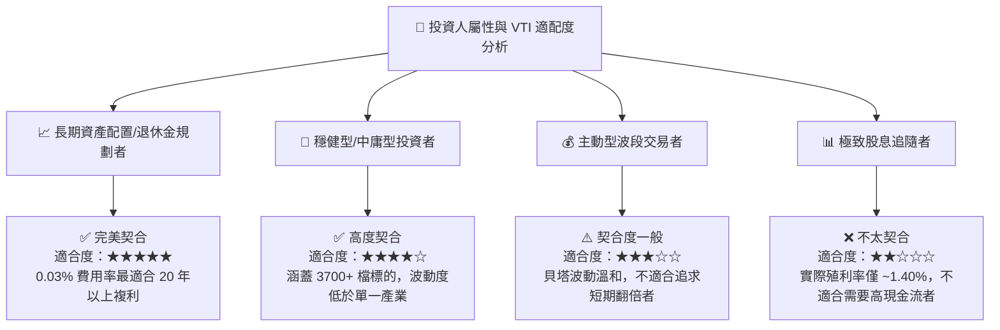

### 10.5 每季財報監控清單（Quarterly Watch List）

雖然 VTI 是一檔被動基金，但投資人仍應每季監控以下指標，以評估整體美股市場的健康狀況與潛在風險：

| 監控指標 | 當前基準值 (2026-07) | 觸發「加碼」門檻 (代表性價比提升) | 觸發「減碼/警惕」門檻 (代表風險聚積) | 監控意義 |
|----------|----------------------|-----------------------------------|--------------------------------------|----------|
| **底層加權 P/E** | **26.54x** | < 20.0x (歷史估值中位數下方) | > 30.0x (歷史極端泡沫區間) | 評估市場整體估值是否過熱。 |
| **底層加權 ROIC**| **16.5%** | > 18.0% (企業資本效率進一步提升) | < 12.0% (企業獲利能力出現結構性衰退) | 評估美國企業是否持續高效創造價值。 |
| **標普500回購總額**| **~$980B / 年** | > $1.2T (企業回購力道加大，支撐股價) | < $600B (企業現金流吃緊，暫停回購) | 監控美股最強大之被動買盤推動力。 |
| **VTI 追蹤誤差** | **0.01%** | < 0.02% (維持正常營運) | > 0.10% (基金管理出現異常，需警惕) | 評估 Vanguard 集團之指數複製效率。 |

### 10.6 反面論證：什麼情況會證明本投資論點錯誤（What Would Change My Mind）

被動投資美股（VTI）的核心假設是「美國經濟將長期成長，且美股能持續吸引全球資本」。若以下**可量化之反面證據**發生，投資人應重新評估長期持有 VTI 的合理性：

```
╔══════════════════════════════════════════════════════════════════╗
║            ⚠️ VTI 長期多頭論點失效條件 (Disconfirming Evidence)  ║
╠══════════════════════════════════════════════════════════════════╣
║  若出現下列任何一項可量化指標，代表美股長期結構發生質變：        ║
║                                                                  ║
║  ☐ 美國名目 GDP 成長率連續 8 個季度（兩年）低於 1.5%。           ║
║  ☐ 底層企業加權平均 ROIC 持續 3 年跌破 10%，無法有效覆蓋 WACC。   ║
║  ☐ 全美企業股份回購總金額較峰值萎縮超過 50%，且持續兩年以上。     ║
║  ☐ 美國政府債務/GDP 比例突破 180%，引發美元信用危機與美債利率飆升。║
║  ☐ 美股前 10 大科技巨頭權重突破 45%，使 VTI 徹底失去分散風險功能。 ║
╚══════════════════════════════════════════════════════════════════╝
```

---

> **免責聲明**：本報告由 CFA 級機構研究框架撰寫，僅供學術探討與投資參考，不構成任何實質性投資建議。投資人應根據自身風險承受能力與財務目標獨立決策。市場有風險，入市需謹慎。