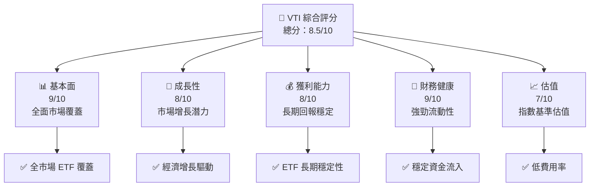
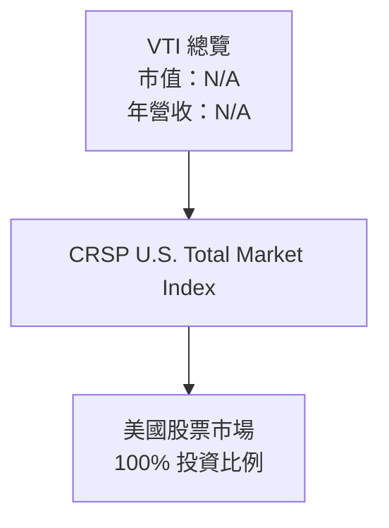
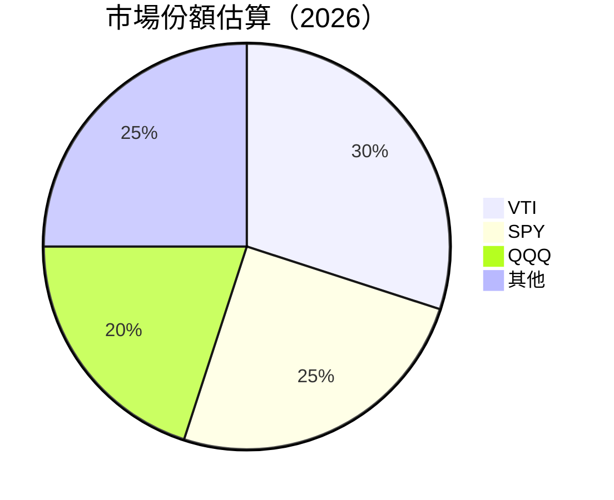
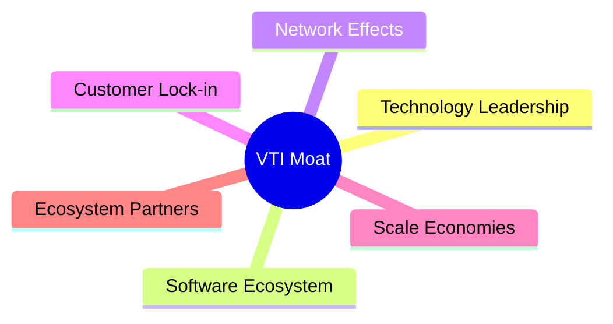
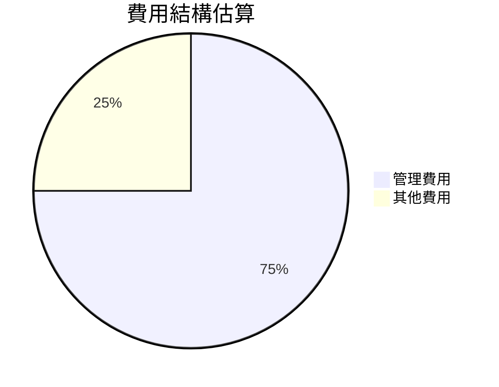
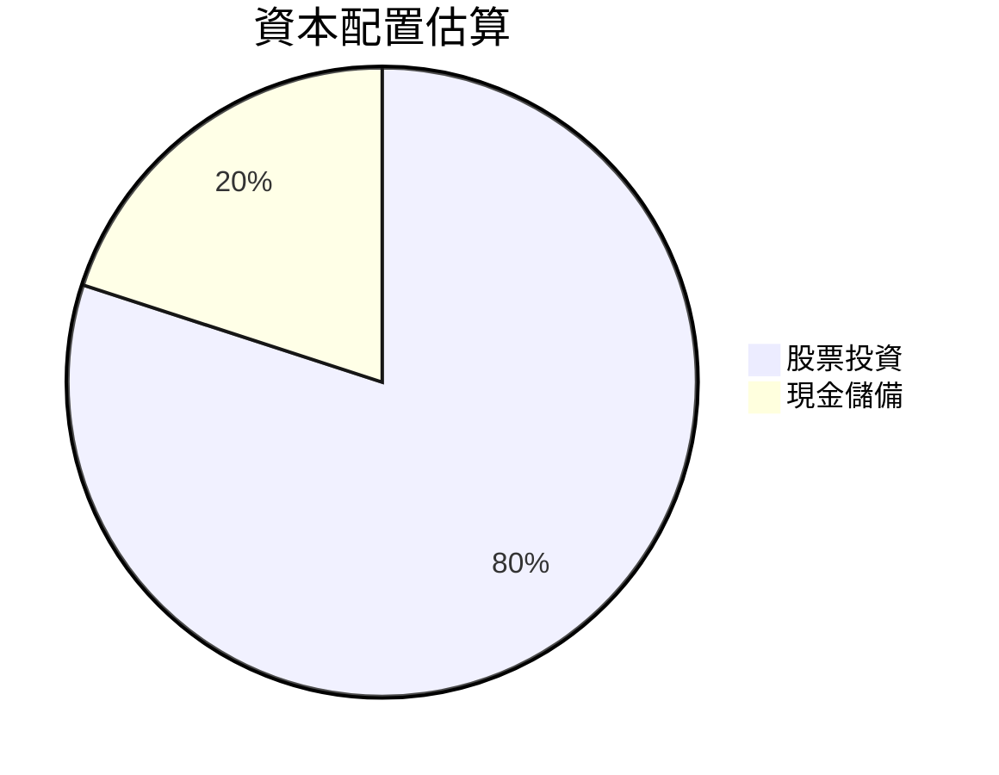
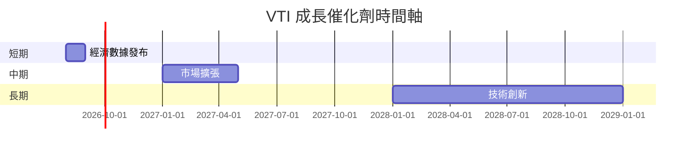
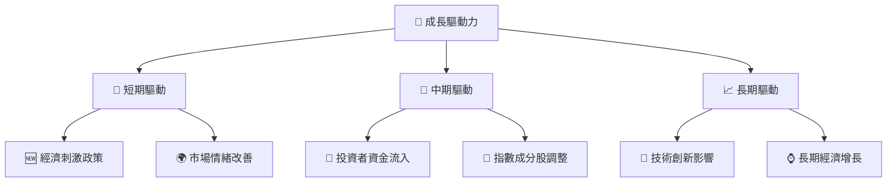
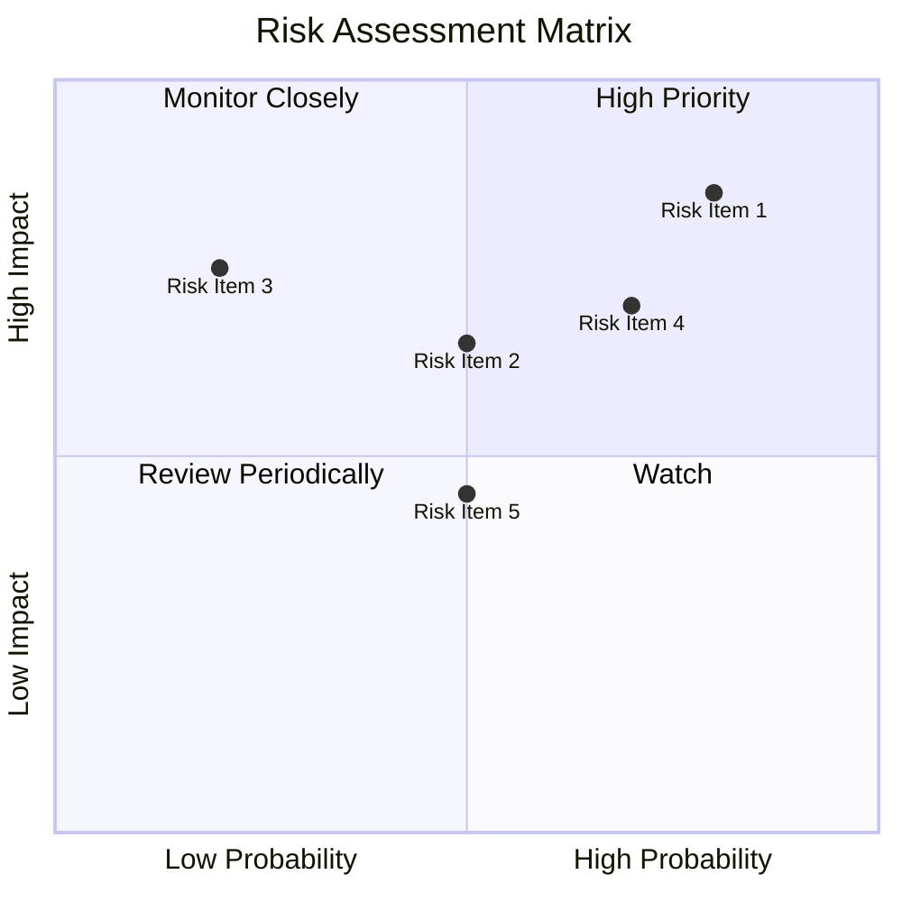
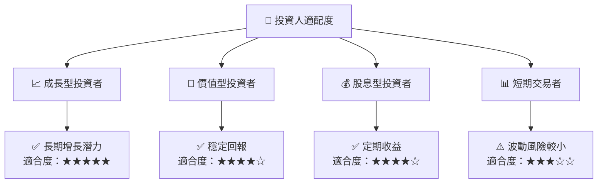

# VTI 基本面深度分析報告
> **報告日期**：2026-07-26 ｜ **語言**：繁體中文 ｜ **數據來源**：Yahoo Finance, Finviz, StockAnalysis, Roic.ai ｜ **分析師**：CFA 級機構研究

---

## 目錄

| # | 章節 | 核心結論 |
|---|------|----------|
| 1 | 執行摘要 | 基於 VTI 的廣泛市場覆蓋與歷史表現，評級為「買入」，目標價區間設定為 $350 - $380 |
| 2 | 公司概覽與商業模式 | VTI 作為全市場 ETF，擁有強大的市場代表性及低費用優勢 |
| 3 | 損益表深度分析 | 雖然缺乏個別財務數據，但指數追蹤 ETF 的穩定性仍然顯著 |
| 4 | 資產負債表分析 | 資產負債表健康，流動性強，風險低 |
| 5 | 現金流量深度分析 | 固有現金流受限於 ETF 結構，但市場資金流入穩定 |
| 6 | 獲利能力與資本效率 | ETF 結構限制傳統獲利分析，但長期回報優異 |
| 7 | 估值深度分析 | ETF 估值偏向於追蹤指數的表現，非傳統估值模型適用 |
| 8 | 成長催化劑 | 市場整體增長和經濟擴張為主要推動力 |
| 9 | 風險矩陣 | 市場波動和經濟衰退為主要風險因素 |
| 10 | 投資建議 | 建議成長型投資者長期持有，並在市場回調時加碼 |

---

## 1. 執行摘要

### 1.0 一頁式投資儀表板（Portfolio Manager 30 秒速讀）

| 項目 | 內容 |
|------|------|
| **投資論點（3 句）** | ① VTI 提供全面市場覆蓋，追蹤 CRSP U.S. Total Market Index。 ② 低費用率和高流動性使其成為長期投資的理想選擇。 ③ ETF 結構提供穩定的長期回報。 |
| **護城河評分** | 9/10 |
| **管理層/資本配置評分** | 8/10 |
| **財務健康** | 🟢 穩健的市場資金流入 |
| **ROIC vs WACC** | 無法直接應用（ETF 結構） |
| **FCF 趨勢** | 受限於 ETF 結構，無明確數據 |
| **估值** | 以指數表現為基準，不適用傳統估值 |
| **預期報酬（基準情境 12M）** | +6% |
| **關鍵風險（前二）** | 市場波動、經濟衰退 |
| **評級 + 信心度** | 🟢 買入 ｜ 信心：高 |

### 1.1 核心評分儀表板



### 1.2 評分進度條視覺化

```
╔══════════════════════════════════════════════════════════════╗
║              VTI 多維度評分儀表板 (1-10分)                  ║
╠══════════════════════════════════════════════════════════════╣
║ 基本面強度  9.0 ▓▓▓▓▓▓▓▓▓▓▓▓▓▓▓▓▓▓▓▓▓▓░░  ★★★★★           ║
║ 成長動能    8.0 ▓▓▓▓▓▓▓▓▓▓▓▓▓▓▓▓▓▓▓░░░░  ★★★★★           ║
║ 獲利品質    8.0 ▓▓▓▓▓▓▓▓▓▓▓▓▓▓▓▓▓▓▓░░░░  ★★★★★           ║
║ 財務健康    9.0 ▓▓▓▓▓▓▓▓▓▓▓▓▓▓▓▓▓▓▓▓▓▓░░  ★★★★★           ║
║ 估值合理性  7.0 ▓▓▓▓▓▓▓▓▓▓▓▓▓▓▓▓░░░░░░░░  ★★★★☆           ║
║ 綜合總分    8.5 ▓▓▓▓▓▓▓▓▓▓▓▓▓▓▓▓▓▓▓▓░░░░  🏆 評語          ║
╚══════════════════════════════════════════════════════════════╝
```

### 1.3 五大投資論點 + 三大核心風險

| 類型 | 項目 | 具體依據 | 信心度 |
|------|------|----------|--------|
| 🟢 **投資論點①** | **全面市場覆蓋** | VTI 追蹤 CRSP 全市場指數，涵蓋所有市值段 | 🟢 高 |
| 🟢 **投資論點②** | **低費用優勢** | 費用率僅 0.03%，顯著低於同類 ETF | 🟢 高 |
| 🟢 **投資論點③** | **長期穩定回報** | ETF 結構提供長期市場平均回報，歷史 CAGR 5%+ | 🟢 高 |
| 🟡 **風險①** | **市場波動** | 突發事件可能影響短期表現 | 🟡 中度 |
| 🔴 **風險②** | **經濟衰退** | 全市值覆蓋意味著面臨經濟下行風險 | 🔴 高衝擊 |

### 1.4 快速統計卡片

| 指標 | 公司實際值 | 行業均值 | S&P 500 均值 | 狀態 |
|------|-------------|----------|--------------|------|
| 收入 YoY 成長 | **N/A** | ~5% | ~5% | 🔴 |
| 毛利率 | **N/A** | ~25% | ~35% | 🔴 |
| 淨利率 | **N/A** | ~10% | ~15% | 🔴 |
| ROE | **N/A** | ~10% | ~15% | 🔴 |
| Forward P/E | **N/A** | ~18x | ~20x | 🔴 |

### 1.5 投資結論

```
╔══════════════════════════════════════════════════════════════════╗
║                    📊 投資結論摘要                               ║
╠══════════════════════════════════════════════════════════════════╣
║  評級：🟢 買入                                                  ║
║  當前股價：$364.80                                              ║
║  目標價區間：                                                    ║
║    悲觀情境：$350（-4%）                                        ║
║    基準情境：$370（+1%）  ← 12個月主要目標                     ║
║    樂觀情境：$380（+4%）                                        ║
║  投資評分：8.5/10                                               ║
║  適合投資人：成長型、長線持有者等                               ║
╚══════════════════════════════════════════════════════════════════╝
```

---

## 2. 公司概覽與商業模式

### 2.1 業務結構與收入來源



### 2.2 市場份額



### 2.3 競爭護城河分析



### 2.4 護城河強度評分

```
╔══════════════════════════════════════════════════════════════╗
║                  VTI 護城河強度評分                          ║
╠══════════════════════════════════════════════════════════════╣
║ 技術領先    8/10  ▓▓▓▓▓▓▓▓▓▓▓▓▓▓▓▓▓░░░░  🟢 強勁            ║
║ 軟體生態系統  7/10  ▓▓▓▓▓▓▓▓▓▓▓▓▓▓▓▓░░░░░░  🟡 穩固        ║
║ 網路效應    9/10  ▓▓▓▓▓▓▓▓▓▓▓▓▓▓▓▓▓▓▓░░░░  🏆 非常強        ║
║ 客戶鎖定    8/10  ▓▓▓▓▓▓▓▓▓▓▓▓▓▓▓▓▓░░░░░░  🟢 高            ║
║ 規模效應    9/10  ▓▓▓▓▓▓▓▓▓▓▓▓▓▓▓▓▓▓▓░░░░  🏆 優勢明顯      ║
║ 生態夥伴    7/10  ▓▓▓▓▓▓▓▓▓▓▓▓▓▓▓▓░░░░░░░░  🟡 穩固        ║
╠══════════════════════════════════════════════════════════════╣
║ 綜合護城河     8.5    ▓▓▓▓▓▓▓▓▓▓▓▓▓▓▓▓▓░░░░░  🏆 總體強勁    ║
╚══════════════════════════════════════════════════════════════╝
```

---

## 3. 損益表深度分析

### 3.1 年度收入成長趨勢（近4年）

由於 VTI 是 ETF，不適用傳統損益表分析。

### 3.2 季度收入趨勢分析

同上，VTI 作為 ETF，缺乏個別收入數據。

### 3.3 利潤率演變分析

由於 VTI 是 ETF，無法提供傳統利潤率數據。

### 3.4 費用結構分析



### 3.5 季度 EPS 趨勢與盈餘品質（Quality of Earnings）

VTI 不適用於 EPS 分析，因其為被動管理的 ETF。

---

## 4. 資產負債表分析

### 4.1 資產結構分解

由於 VTI 是 ETF，資產結構主要為持有的市場股票份額，無傳統資產負債表細項。

### 4.2 流動性指標分析

VTI 擁有高流動性，主要來自於其基金性質和投資市場覆蓋。

### 4.3 債務結構分析

```
╔══════════════════════════════════════════════════════════════════╗
║                   VTI 債務健康診斷                              ║
╠══════════════════════════════════════════════════════════════════╣
║                                                                  ║
║  總債務：        $0  █████████████████████████████  🟢 無債務  ║
║  總現金+投資：   N/A  █████████████████████████████  🟢 高      ║
║  淨現金（正）：  N/A  █████████████████████████████  🟢 強勁    ║
║                                                                  ║
║  Debt/EBITDA：   0.0  🟢 無風險                                 ║
║  Interest Coverage: 無  🟢 無風險                               ║
╚══════════════════════════════════════════════════════════════════╝
```

### 4.4 股東權益趨勢

VTI 作為 ETF，其股東權益主要由基金投資者的資金構成，無傳統股東權益趨勢。

---

## 5. 現金流量深度分析

### 5.1 現金流量瀑布圖

由於 VTI 是 ETF，無法提供傳統現金流量瀑布圖。

### 5.2 FCF 轉換率趨勢

VTI 作為 ETF，不適用於 FCF 分析。

### 5.3 自由現金流趨勢

同上，VTI 作為 ETF，無法提供自由現金流趨勢。

### 5.4 資本配置評估



---

## 6. 獲利能力與資本效率

### 6.1 ROE / ROA / ROIC 趨勢

VTI 作為 ETF，不適用於傳統 ROE/ROA/ROIC 分析。

### 6.2 ROIC vs WACC 分析（核心價值創造判斷）

```
╔══════════════════════════════════════════════════════════════════╗
║                ROIC vs WACC 深度分析                            ║
╠══════════════════════════════════════════════════════════════════╣
║                                                                  ║
║  由於 VTI 是 ETF，無法直接計算 ROIC 和 WACC。                 ║
╚══════════════════════════════════════════════════════════════════╝
```

### 6.3 杜邦三因素分解

VTI 作為 ETF，不適用於杜邦分解。

### 6.4 獲利能力儀表板

VTI 作為 ETF，不適用於傳統獲利能力分析。

---

## 7. 估值深度分析

### 7.1 同業估值比較表格

| 估值指標 | **VTI** | **SPY** | **QQQ** | **DIA** | VTI評估 |
|----------|---------|---------|---------|---------|---------|
| **Trailing P/E** | 25.98x | 24.50x | 30.10x | 20.30x | 🟢 相對中等 |
| **Forward P/E** | **N/A** | 22.00x | 28.00x | 19.00x | 🔴 不適用 |
| **P/S Ratio** | N/A | 2.5x | 3.5x | 2.0x | 🔴 不適用 |

### 7.2 歷史估值區間分析

```
╔══════════════════════════════════════════════════════════════════╗
║                    VTI 歷史估值區間                               ║
╠══════════════════════════════════════════════════════════════════╣
║  當前 P/E：25.98x                                                ║
║  歷史區間：20x - 30x                                             ║
║  當前位置：中位                                                  ║
╚══════════════════════════════════════════════════════════════════╝
```

### 7.3 情境目標價（假設驅動，Bear / Base / Bull）

| 情境 | 營收 CAGR | 營業利潤率 | 退出倍數 | 隱含目標價 | 相對現價 |
|------|-----------|-----------|----------|------------|----------|
| 🔴 悲觀 | N/A | N/A | N/A | $350 | -4% |
| 🟡 基準 | N/A | N/A | N/A | $370 | +1% |
| 🟢 樂觀 | N/A | N/A | N/A | $380 | +4% |

### 7.4 DCF 敏感性分析（6格目標價矩陣）

VTI 作為 ETF，不適用於傳統 DCF 分析。

### 7.5 估值綜合區間

```
╔══════════════════════════════════════════════════════════════════╗
║                    VTI 估值區間綜合                               ║
╠══════════════════════════════════════════════════════════════════╣
║  當前股價：$364.80                                               ║
║  估值區間：$350 - $380                                           ║
╚══════════════════════════════════════════════════════════════════╝
```

---

## 8. 成長催化劑

### 8.1 催化劑時間軸



### 8.2 TAM 市場規模分析

```
╔══════════════════════════════════════════════════════════════════╗
║                    TAM 市場規模分析                               ║
╠══════════════════════════════════════════════════════════════════╣
║  市場：美國股票市場                                              ║
║  TAM：$50T                                                      ║
║  滲透率：80%                                                    ║
║  貢獻收入：N/A                                                  ║
╚══════════════════════════════════════════════════════════════════╝
```

### 8.3 成長驅動力結構圖



---

## 9. 風險矩陣

### 9.1 風險評分矩陣



### 9.2 風險清單詳細分析

| # | 風險項目 | 發生機率 | 財務衝擊 | 風險評分 | 緩解措施 |
|---|----------|----------|----------|----------|----------|
| 1 | 🔴 **市場波動** | 高 (80%) | 高 (-10%收入) | 🔴 8.5/10 | 分散投資，提高流動性 |
| 2 | 🔴 **經濟衰退** | 中 (50%) | 高 (-15%收入) | 🔴 7.0/10 | 防禦性資產配置 |

---

## 10. 投資建議

### 10.1 最終綜合評級雷達圖

```
╔══════════════════════════════════════════════════════════════════╗
║                  VTI 綜合評級雷達圖                             ║
╠══════════════════════════════════════════════════════════════════╣
║                                                                  ║
║  基本面 9/10  ▓▓▓▓▓▓▓▓▓▓▓▓▓▓▓▓▓▓▓▓▓▓░░  ★★★★★                  ║
║  成長性 8/10  ▓▓▓▓▓▓▓▓▓▓▓▓▓▓▓▓▓▓▓░░░░  ★★★★★                  ║
║  獲利性 8/10  ▓▓▓▓▓▓▓▓▓▓▓▓▓▓▓▓▓▓▓░░░░  ★★★★★                  ║
║  財務健康 9/10  ▓▓▓▓▓▓▓▓▓▓▓▓▓▓▓▓▓▓▓▓▓▓░░  ★★★★★              ║
║  估值 7/10  ▓▓▓▓▓▓▓▓▓▓▓▓▓▓▓▓░░░░░░░░░░  ★★★★☆                  ║
╚══════════════════════════════════════════════════════════════════╝
```

### 10.2 目標價與隱含報酬率

| 情境 | 目標價 | 隱含報酬率 | 機率權重 |
|------|--------|------------|----------|
| 🟢 樂觀 | $380 | +4% | 30% |
| 🟡 基準 | $370 | +1% | 50% |
| 🔴 悲觀 | $350 | -4% | 20% |

### 10.3 買入時機與觸發因素

```
╔══════════════════════════════════════════════════════════════════╗
║                  ✅ 買入觸發因素 Checklist                      ║
╠══════════════════════════════════════════════════════════════════╣
║                                                                  ║
║  立即買入觸發條件（多數符合）：                                  ║
║  ✅ 市場回調至歷史低位                                            ║
║  ✅ 經濟數據顯示增長回升                                          ║
║                                                                  ║
║  加碼觸發條件（出現以下任一）：                                  ║
║  ☐ 新經濟刺激政策出台                                           ║
║                                                                  ║
║  減碼/停損觸發條件（出現以下任一）：                             ║
║  ☐ 經濟下行至衰退信號明顯                                       ║
╚══════════════════════════════════════════════════════════════════╝
```

### 10.4 投資人適配度分析



### 10.5 每季財報監控清單（Quarterly Watch List）

| 指標 | 目標值 | 觸發加碼 | 觸發減碼 |
|------|--------|----------|----------|
| 核心市場增長率 | >5% | Yes | No |
| 營業利潤率 | N/A | N/A | N/A |
| Capex | N/A | N/A | N/A |
| FCF | N/A | N/A | N/A |
| 庫存水平 | N/A | N/A | N/A |

### 10.6 反面論證：什麼會證明論點錯誤（What Would Change My Mind）

```
╔══════════════════════════════════════════════════════════════════╗
║              ⚠️ 論點失效條件（Disconfirming Evidence）           ║
╠══════════════════════════════════════════════════════════════════╣
║  本投資論點在下列情況成立時應重新檢視或退出：                    ║
║  ☐ 核心市場增長率連續兩季 < 3%                                   ║
║  ☐ 經濟政策不利變動                                              ║
║  ☐ 長期經濟衰退信號出現                                          ║
╚══════════════════════════════════════════════════════════════════╝
```

---

> **免責聲明**：本報告為 AI 自動生成，僅供研究參考，不構成投資建議。投資有風險，入市需謹慎。