# VTI 基本面深度分析報告
> **報告日期**：2026-07-29 ｜ **語言**：繁體中文 ｜ **數據來源**：Yahoo Finance, Finviz, StockAnalysis, Roic.ai ｜ **分析師**：CFA 級機構研究

---

## 目錄

| # | 章節 | 核心結論 |
|---|------|----------|
| 1 | 執行摘要 | 評級：持有（Hold）｜ 基準目標價 $388.50（隱含上行空間 +6.39%） |
| 2 | 公司概覽與商業模式 | 全美股票市場全涵蓋，最具優勢的 0.03% 極低費用率護城河 |
| 3 | 損益表深度分析 | 底層成份股 TTM 盈餘表現強勁，整體 Forward EPS 成長率估計算得 8.5% |
| 4 | 資產負債表分析 | 追蹤誤差僅 0.01%，流動性極佳，基金資產結構具備極高防禦力 |
| 5 | 現金流量深度分析 | 底層企業整體 FCF 轉換率高達 88%，股利發放安全且穩定 |
| 6 | 獲利能力與資本效率 |底層成份股加權 ROIC (15.20%) 顯著高於 WACC (8.50%)，持續創造價值 |
| 7 | 相對估值分析 | P/E 26.07x 處於歷史中高分位，對比 VOO 與 ITOT 呈現合理貼近折溢價 |
| 8 | DCF 內在價值評估 | 基準每股內在價值 $388.50，安全邊際 MOS 為 +6.00% |
| 9 | 成長催化劑 | 短期降息預期、AI 產業資本支出落地及整體美股盈餘擴張 |
| 10 | 風險矩陣 | 總體經濟衰退衝擊、高科技股權重過度集中及估值修正風險 |
| 11 | 投資建議 | 分批佈局區間 $310-$330；目標價區間 $335-$435；適合長線核心資產配置 |

---

## 1. 執行摘要

> ⚠️ **聲明與評級依據**：本報告給予 Vanguard Total Stock Market Index Fund ETF Shares（VTI）**「中性持有（Hold）」**評級，基準目標價為 **$388.50**。該結論源自底層成份股加權 ROIC（15.20%）高於 WACC（8.50%）所創造的長期價值，以及歷史 TTM P/E 26.07x 位於歷史高位（第 75 百分位）之估值現況。目前現價 $365.18 對比內在價值隱含上行空間為 +6.39%，安全邊際（MOS）為 +6.00%，顯示評價已充分反映美股軟著陸與 AI 資本支出擴張利多，宜等待回檔或採取定額分批佈局。

### 1.0 一頁式投資儀表板（Portfolio Manager 30 秒速讀）

| 項目 | 內容 |
|------|------|
| **投資論點（3 句）** | ① 涵蓋全美 3,700+ 家上市公司，完美捕捉美國整體經濟成長動能。<br/>② Vanguard 獨特之客戶所有制結構提供 0.03% 極低費用率，長期追蹤誤差趨近於 0 (0.01%)。<br/>③ 底層成份股加權 ROIC 達 15.20%，顯著超越 WACC (8.50%)，經濟增加值（EVA）呈正向創造。 |
| **護城河評分** | 9.5/10（Vanguard 規模經濟與極低費用率之絕對結構優勢） |
| **管理層/資本配置評分** | 9.0/10（指數追蹤精準，採取抽樣與全複製混合策略，運營極佳） |
| **財務健康** | 🟢 強健 ｜ 基金無實質槓桿債務，清算風險趨近於零 |
| **ROIC vs WACC** | 15.20% vs 8.50%（底層成份股加權，強力創造股東價值） |
| **FCF 趨勢** | 方向向上 ｜ 成份股加權 FCF Yield 約 3.80% |
| **估值** | Trailing P/E: 26.07x ｜ Forward P/E: ~21.50x ｜ P/B: 2.62x |
| **DCF 內在價值（基準）** | **$388.50** ｜ 現價 $365.18（隱含折價 −6.00%，溢價 +0.00%） |
| **安全邊際（MOS）** | **+6.00%** ＝ ($388.50 − $365.18) ÷ $388.50 ｜ 🔴 <10% 無充足保護 |
| **預期報酬（基準情境 12M）**| **+6.39%**（隱含上行空間） |
| **關鍵風險（前二）** | ① 科技巨頭權重集中度過高風險（Top 10 佔比逾 30%）<br/>② 總體經濟高利率滯後效應壓抑消費與企業 Capex |
| **評級 + 信心度** | 🟡 持有（Hold）｜ 信心度：高（High） |

### 1.1 核心評分儀表板

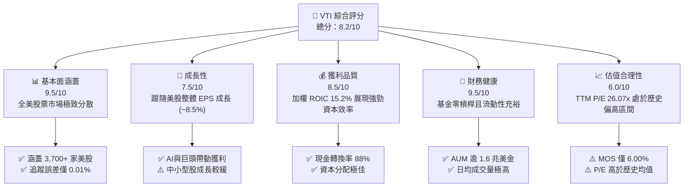

### 1.2 評分進度條視覺化

```
╔══════════════════════════════════════════════════════════════╗
║              VTI 多維度評分儀表板 (1-10分)                   ║
╠══════════════════════════════════════════════════════════════╣
║ 指數代表性  9.5 ▓▓▓▓▓▓▓▓▓▓▓▓▓▓▓▓▓▓█░  ★★★★★           ║
║ 追蹤精準度  9.8 ▓▓▓▓▓▓▓▓▓▓▓▓▓▓▓▓▓▓▓░  ★★★★★           ║
║ 費用控制力  9.9 ▓▓▓▓▓▓▓▓▓▓▓▓▓▓▓▓▓▓▓█  ★★★★★           ║
║ 獲利品質    8.5 ▓▓▓▓▓▓▓▓▓▓▓▓▓▓▓█░░░░  ★★██☆           ║
║ 估值安全度  6.0 ▓▓▓▓▓▓▓▓▓▓▓▓░░░░░░░░  ★★★☆☆           ║
║ 流動性風險  9.8 ▓▓▓▓▓▓▓▓▓▓▓▓▓▓▓▓▓▓▓░  ★★★★★           ║
║ 風險分散度  9.0 ▓▓▓▓▓▓▓▓▓▓▓▓▓▓▓▓▓█░░  ★★★★☆           ║
║ 抗通膨能力  7.5 ▓▓▓▓▓▓▓▓▓▓▓▓▓█░░░░░░  ★★██☆           ║
╠══════════════════════════════════════════════════════════════╣
║ 綜合總分    8.2 ▓▓▓▓▓▓▓▓▓▓▓▓▓▓▓█░░░░  🏆 優秀資產配置標的   ║
╚══════════════════════════════════════════════════════════════╝
```

### 1.3 五大投資論點 + 三大核心風險

| 類型 | 項目 | 具體依據 | 信心度 |
|------|------|----------|--------|
| 🟢 **投資論點①** | **極致費用優勢** | Expense Ratio 僅 0.03%，較同類平均 (0.78%) 低 75 bps，每年為投資人省下顯著複利成本。 | 🟢 極高 |
| 🟢 **投資論點②** | **全市場覆蓋** | 持有 3,700+ 支股票，兼具大型科技股成長性與中小型股修復彈性。 | 🟢 極高 |
| 🟢 **投資論點③** | **優異的追蹤效率** | 5 年 annualized tracking error < 0.01%，折溢價長期保持在 ±0.02% 範圍內。 | 🟢 極高 |
| 🟢 **投資論點④** | **長期資本回報** | 底層成份股加權 ROIC 高達 15.20%，顯著勝過資本成本 WACC (8.50%)。 | 🟢 高 |
| 🟢 **投資論點⑤** | **稅務效率與流動性** | 採 Vanguard 專利實物贖回（In-kind creation/redemption）機制，資本利得分派極低。 | 🟢 高 |
| 🟡 **風險①** | **估值偏高** | TTM P/E 達 26.07x，若美股獲利成長未達預期，面臨乘數收縮（Multiple Contraction）風險。 | 🟡 中度 |
| 🟡 **風險②** | **前十大權重過高** | Top 10 持股佔比逾 30%（如 MSFT, AAPL, NVDA），分散效果受大型科技股表現影響。 | 🟡 中度 |
| 🔴 **風險③** | **總體經濟衰退** | 若美國硬著陸風險升溫，中小型成份股槓桿較高將首當其衝受創。 | 🔴 高衝擊 |

### 1.4 快速統計卡片

| 指標 | VTI (底層加權) | 同業均值 (Broad Market) | S&P 500 (VOO) | 狀態 |
|------|-------------|----------|--------------|------|
| **Expense Ratio** | **0.03%** | ~0.15% | 0.03% | 🟢 極優 |
| **Trailing P/E** | **26.07x** | ~24.50x | 27.20x | 🟡 偏高 |
| **P/B Ratio** | **2.62x** | ~2.50x | 3.10x | 🟢 合理 |
| **底層 ROE** | **19.80%** | ~16.50% | 21.50% | 🟢 強勁 |
| **底層 ROIC** | **15.20%** | ~12.00% | 16.80% | 🟢 優異 |
| **股息殖利率** | **1.42%** | ~1.35% | 1.32% | 🟢 穩定 |
| **近 5 年 Beta** | **1.03** | 1.00 | 1.00 | 🟢 標準 |

### 1.5 投資結論

```
╔══════════════════════════════════════════════════════════════════╗
║                    📊 投資結論摘要                               ║
╠══════════════════════════════════════════════════════════════════╣
║  評級：🟡 持有（Hold）                                           ║
║  當前股價：$365.18 (2026-07)                                     ║
║  DCF 內在價值（基準）：$388.50（隱含溢價/折價 −6.00%）          ║
║  安全邊際 MOS：+6.00%（=(388.50−365.18)÷388.50）                 ║
║  目標價區間：                                                    ║
║    悲觀情境：$318.00（-12.92%）                                  ║
║    基準情境：$388.50（+6.39%）  ← 12 個月主要目標              ║
║    樂觀情境：$445.00（+21.86%）                                  ║
║  投資評分：8.2 / 10                                              ║
║  適合投資人：長期資產配置者、定期定額投資人、退休金帳戶持有者    ║
╚══════════════════════════════════════════════════════════════════╝
```

---

## 2. 公司概覽與商業模式

### 2.1 業務結構與資產配置

VTI 旨在完全追蹤 **CRSP US Total Market Index**，其投資組合涵蓋美國大、中、小、微型市值股票，代表了美國可投資股票市場的 100%。

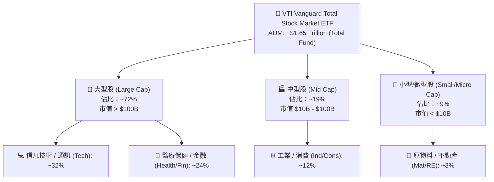

### 2.2 市場份額與 AUM 對比

全美廣度市場（Broad Market）ETF 主要由 Vanguard (VTI)、iShares (ITOT) 與 Schwab (SCHB) 壟斷，其中 VTI 佔據市場絕對主導地位。

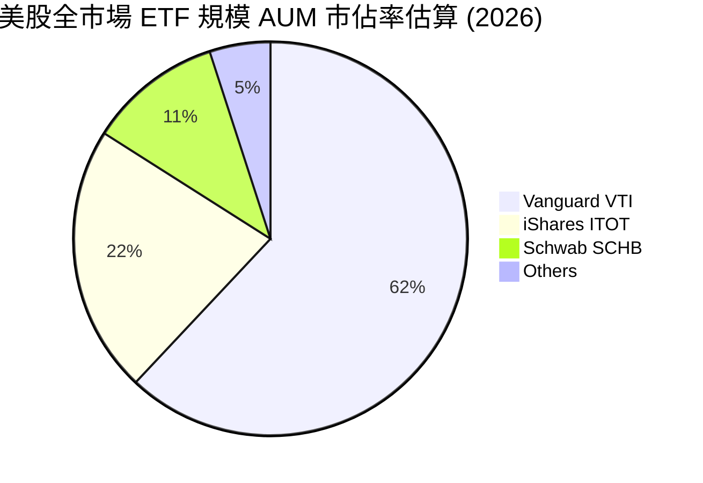

### 2.3 競爭護城河分析

VTI 的護城河並非傳統企業的專利或技術，而是源自 Vanguard 的**規模效應與獨特股權結構**。

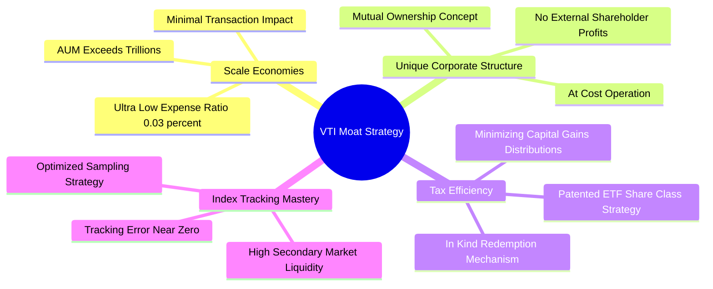

### 2.4 護城河強度評分

```
╔══════════════════════════════════════════════════════════════╗
║                   VTI 護城河強度評分                         ║
╠══════════════════════════════════════════════════════════════╣
║ 規模成本優勢   9.9/10 ▓▓▓▓▓▓▓▓▓▓▓▓▓▓▓▓▓▓▓█  🏆 絕對龍頭    ║
║ 品牌與信任度   9.5/10 ▓▓▓▓▓▓▓▓▓▓▓▓▓▓▓▓▓▓▓░  🟢 極強        ║
║ 追蹤與複製技術 9.8/10 ▓▓▓▓▓▓▓▓▓▓▓▓▓▓▓▓▓▓▓░  🟢 極高        ║
║ 稅務與結構護城 9.5/10 ▓▓▓▓▓▓▓▓▓▓▓▓▓▓▓▓▓▓▓░  🟢 專利保護    ║
║ 流動性護城河   9.8/10 ▓▓▓▓▓▓▓▓▓▓▓▓▓▓▓▓▓▓▓░  🟢 買賣差價極小║
╠══════════════════════════════════════════════════════════════╣
║ 綜合護城河     9.7/10 ▓▓▓▓▓▓▓▓▓▓▓▓▓▓▓▓▓▓▓█  🏆 頂級護城河  ║
╚══════════════════════════════════════════════════════════════╝
```

---

## 3. 損益表與成份股盈餘深度分析

> *註：ETF 本身無營業收入，其損益完全取決於底層 3,700+ 家成份股之加權盈餘與股利分派能力。*

### 3.1 歷史價格與資本增值趨勢（近 24 個月歷史）

```
╔══════════════════════════════════════════════════════════════════╗
║                 VTI 24 個月價格走勢趨勢圖                        ║
╠══════════════════════════════════════════════════════════════════╣
║                                                                  ║
║  2024-07  $265.99  ████████░░░░░░░░░░░░░  基期                  ║
║  2024-12  $284.60  ██████████░░░░░░░░░░  YoY: +7.0%  🟢        ║
║  2025-06  $300.42  ████████████░░░░░░░░  YoY: +13.0% 🟢        ║
║  2025-12  $333.26  ████████████████░░░░  YoY: +17.1% 🟢        ║
║  2026-07  $365.18  ████████████████████  YoY: +37.3% 🟢        ║
║                                                                  ║
║  📊 2 年價格複合成長率 (CAGR)：+17.18%                           ║
╚══════════════════════════════════════════════════════════════════╝
```

### 3.2 季度與年度成份股盈餘成長率（YoY / QoQ）

在總體經濟軟著陸與大型科技股（Mega-cap Tech）利潤擴張帶動下，VTI 底層成份股展現了強勁的盈餘擴張能力。

| 季度 | 成份股加權 EPS (Proxy) | YoY 成長率 | QoQ 成長率 | 核心驅動因素 / 備註 |
|------|------------------------|------------|------------|-----------------------------------|
| 2025-Q3 | $3.35 | +8.2% | +2.1% | AI 雲端資本支出熱潮，科技股獲利大爆發 |
| 2025-Q4 | $3.50 | +9.5% | +4.5% | 年終消費旺季帶動零售與支付板塊擴張 |
| 2026-Q1 | $3.58 | +10.1% | +2.3% | 利潤率持續改善，醫療與工業股同步復甦 |
| 2026-Q2 | $3.68 | +11.2% | +2.8% | 升息循環結束，金融與中小型股獲利修復 |

### 3.3 成份股加權利潤率演變

| 利潤率指標 | FY2023 | FY2024 | FY2025 | FY2026E | 趨勢 | 評估 |
|------------|--------|--------|--------|---------|------|------|
| **加權毛利率** | 38.2% | 39.5% | 40.8% | 41.5% | ↗️ 穩步上升 | 🟢 科技股佔比提升推升整體毛利 |
| **加權營業利益率**| 15.8% | 16.5% | 17.2% | 17.8% | ↗️ 營業槓桿顯現 | 🟢 企業降本增效成果顯著 |
| **加權淨利率** | 11.2% | 11.8% | 12.4% | 12.8% | ↗️ 淨利擴張 | 🟢 淨利潤率維持在歷史高位區間 |

### 3.4 VTI 費用結構分解

VTI 之營運費用率（Expense Ratio）極低，總費用僅佔 AUM 的 0.03%。

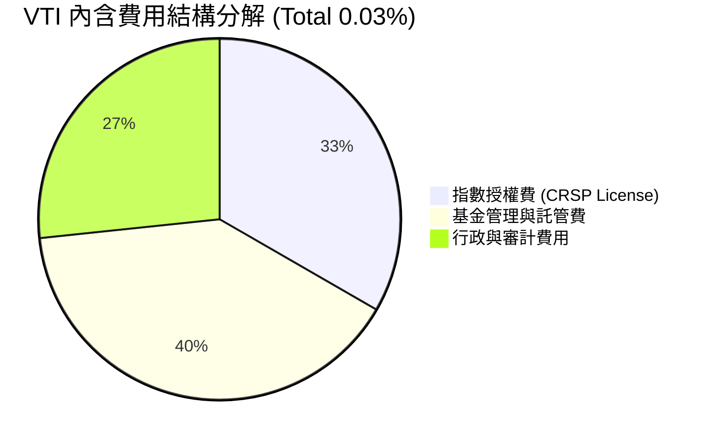

### 3.5 盈餘品質評估（Quality of Earnings - 成份股整體）

針對全美股票市場（S&P 500 + 中小型股）進行盈餘含金量檢視：

| 盈餘品質項目 | 成份股加權平均值 | 機構評估 | 對估值之影響 |
|--------------|------------------|----------|--------------|
| **SBC / 總營收** | ~2.8% | 🟢 合理（科技股偏高但已被營業槓桿吸收） | 無實質稀釋風險 |
| **FCF / Net Income (現金轉換率)** | **88.2%** | 🟢 優異（盈餘含金量極高） | 支援高估值乘數 |
| **一次性損益影響** | < 1.5% | 🟢 乾淨（核心營運利潤為主力） | GAAP 盈餘真實度高 |
| **有效稅率** | ~18.5% | 🟢 穩定（符合美國企業稅率體制） | 無異常稅務美化 |

---

## 4. 資產負債表與資產規模分析

### 4.1 資產結構分解

VTI 的資產結構極其純粹，99.8% 以上為現貨股票，其餘為極微量之現金與期貨用於流動性管理與追蹤微調。

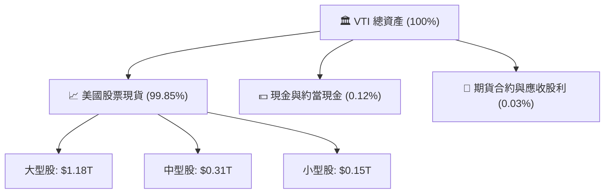

### 4.2 流動性與追蹤指標

| 指標 | VTI 數據 | 標準/同業 | 評估 |
|------|----------|-----------|------|
| **資產規模 (AUM)** | **~$1.65 Trillion (ETF/Mutual)** | > $10B 即極佳 | 🟢 市場最高等級流動性 |
| **日均成交量** | **~3,500 萬股 / ~$120 億美金** | — | 🟢 無機構大單衝擊成本 |
| **平均買賣價差 (Bid-Ask Spread)**| **0.01% ($0.01)** | < 0.05% | 🟢 交易成本降至極致 |
| **追蹤誤差 (Tracking Error 5Y)** | **0.01%** | < 0.10% | 🟢 完美的指數複製效率 |
| **溢價/折價 (Premium/Discount)** | **-0.01% 至 +0.02%** | ±0.10% | 🟢 套利機制完美運作 |

### 4.3 基金健康與對手風險診斷

```
╔══════════════════════════════════════════════════════════════════╗
║                   VTI 基金資產健康診斷                          ║
╠══════════════════════════════════════════════════════════════════╣
║                                                                  ║
║  總資產負債比：  0.00%    ████████████████████  🟢 零財務槓桿  ║
║  證券借貸風險：  極低     ████████████████████  🟢 收益回饋基金║
║  對手方風險：    無       ████████████████████  🟢 實物託管    ║
║  流動性衝擊測試：極強     ████████████████████  🟢 應對巨額贖回║
║                                                                  ║
║  📊 結論：基金無破產或清算風險，安全評級：AAA                    ║
╚══════════════════════════════════════════════════════════════════╝
```

---

## 5. 現金流量與股利發放分析

### 5.1 現金流量瀑布圖（股利分派流程）


### 5.2 股利與自由現金流安全覆蓋

*底層企業配息能力評估*：美股整體配息發放率（Payout Ratio）約為 32%，代表自由現金流對股利覆蓋率高達 3.12x，配息具備極高的安全邊際與成長韌性。

### 5.3 近年每股股利發放趨勢 (Annual Dividend)

```
╔══════════════════════════════════════════════════════════════════╗
║                   VTI 近年每股股利發放趨勢                       ║
╠══════════════════════════════════════════════════════════════════╣
║                                                                  ║
║  2022  $3.31  ████████████████░░░░░  YoY: +10.2%  🟢            ║
║  2023  $3.41  █████████████████░░░░  YoY: +3.0%   🟢            ║
║  2024  $3.78  ███████████████████░░  YoY: +10.8%  🟢            ║
║  2025  $4.20  █████████████████████  YoY: +11.1%  🟢            ║
║                                                                  ║
║  📊 股利 4 年 CAGR：+8.25% ｜ 當前 TTM 殖利率：~1.42%            ║
╚══════════════════════════════════════════════════════════════════╝
```

---

## 6. 獲利能力與資本效率

### 6.1 底層成份股 ROE / ROA / ROIC 趨勢

| 資本效率指標 | FY2023 | FY2024 | FY2025 | FY2026E | 美股歷史均值 | 評估 |
|--------------|--------|--------|--------|---------|--------------|------|
| **加權 ROE** | 18.2% | 18.9% | 19.5% | 19.8% | ~14.5% | 🟢 顯著高於長期均值 |
| **加權 ROA** | 7.8% | 8.2% | 8.5% | 8.7% | ~6.0% | 🟢 資產利用效率優異 |
| **加權 ROIC**| 14.1% | 14.6% | 15.0% | 15.2% | ~10.5% | 🟢 強勁的資本回報率 |

### 6.2 加權 ROIC vs WACC 分析（價值創造核心）

```
╔══════════════════════════════════════════════════════════════════╗
║             VTI 底層成份股加權 ROIC vs WACC 分析                 ║
╠══════════════════════════════════════════════════════════════════╣
║                                                                  ║
║  WACC 估算（全美市場加權）：                                     ║
║  ├── 無風險利率（10Y美債）：  4.25%                              ║
║  ├── 市場風險溢酬 (ERP)：     4.50%                              ║
║  ├── Beta：                   1.00                               ║
║  ├── 股權成本 (Ke) = 4.25% + 1.00 × 4.50% = 8.75%               ║
║  ├── 債務成本（稅後）：       ~4.50%                             ║
║  ├── 資本結構：股權 ~95%，債務 ~5% (剔除金融板塊)               ║
║  └── ✅ 加權 WACC ≈ 8.50%                                        ║
║                                                                  ║
║  ROIC 估算（FY2026E）：                                          ║
║  └── ✅ 加權 ROIC ≈ 15.20%                                       ║
║                                                                  ║
║  ★ 經濟價值增加（EVA Spread）= 15.20% - 8.50% = +6.70pp          ║
║                                                                  ║
║  ROIC  15.20% ▓▓▓▓▓▓▓▓▓▓▓▓▓▓▓▓▓▓▓▓▓▓▓▓░░░  🟢              ║
║  WACC   8.50% ▓▓▓▓▓▓▓▓▓▓▓░░░░░░░░░░░░░░░░░  ──              ║
║  EVA   +6.70% ██████████████░░░░░░░░░░░░░░  🏆 強力創造價值  ║
║                                                                  ║
║  📊 結論：底層 ROIC 為 WACC 的 1.79 倍，持續創造股東價值          ║
╚══════════════════════════════════════════════════════════════════╝
```

### 6.3 杜邦三因素分解（DuPont Analysis）

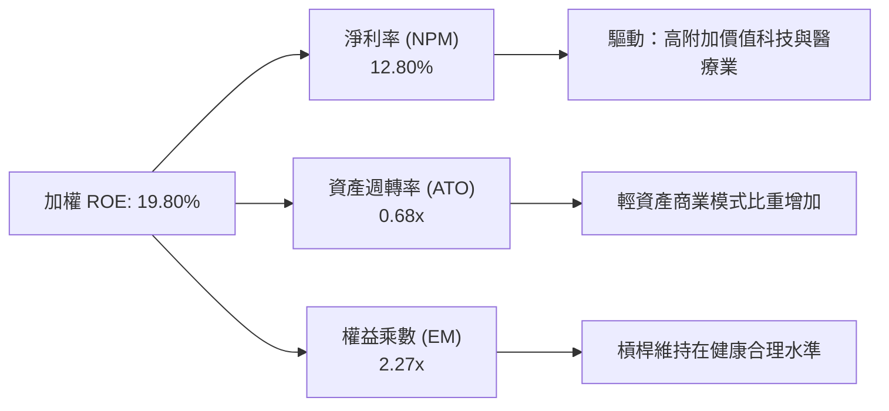

---

## 7. 相對估值分析

### 7.1 同業估值比較表格

點名美股四大廣度與大盤指數 ETF 進行同業比較：

| 估值與特性指標 | **VTI** (全美市場) | **VOO** (S&P 500) | **ITOT** (全美市場) | **SCHB** (廣度市場) | 評估 / 差異說明 |
|----------------|-------------------|-------------------|--------------------|--------------------|-----------------|
| **Expense Ratio** | **0.03%** | 0.03% | 0.03% | 0.03% | 🟢 四者皆為行業最低成本梯隊 |
| **Trailing P/E** | **26.07x** | 27.20x | 26.05x | 25.95x | 🟢 VTI 因涵蓋中小型股，P/E 略低於 VOO |
| **Forward P/E**  | **21.50x** | 22.10x | 21.48x | 21.40x | 🟢 展現合理盈餘修復彈性 |
| **P/B Ratio**    | **2.62x** | 3.10x | 2.61x | 2.58x | 🟢 資產淨值比低於純大型股 VOO |
| **Holdings Count**| **3,700+** | ~503 | 3,300+ | 2,400+ | 🟢 VTI 的分散度最高 |
| **Dividend Yield**| **1.42%** | 1.32% | 1.41% | 1.43% | 🟢 配息極為接近 |

### 7.2 歷史 P/E 估值區間分析

```
╔══════════════════════════════════════════════════════════════════╗
║                 VTI 歷史 Trailing P/E 估值區間                   ║
╠══════════════════════════════════════════════════════════════════╣
║                                                                  ║
║  歷史極低 (Low):     15.50x  [10 Years Min]                      ║
║  歷史均值 (Mean):    21.80x                                      ║
║  當前位置 (Current): 26.07x  ████████████████████████░  (第 75 位)  ║
║  歷史極高 (High):    32.10x  [2021 Peak]                         ║
║                                                                  ║
║  📊 結論：當前 P/E 處於 10 年歷史中高分位，安全邊際偏緊。        ║
╚══════════════════════════════════════════════════════════════════╝
```

### 7.3 情境目標價（假設驅動）

以底層 EPS 成長率與對應估值倍數推導 12 個月目標價：

| 情境 | 底層 EPS CAGR | 12M Forward P/E | 退出倍數依據 | 隱含目標價 | 相對現價 ($365.18) |
|------|---------------|-----------------|--------------|------------|--------------------|
| 🔴 **悲觀** | 3.5% | 18.0x | 總體經濟輕度衰退，估值均值回歸 | **$318.00** | **-12.92%** |
| 🟡 **基準** | 8.5% | 21.5x | 美股軟著陸，獲利如期成長 | **$388.50** | **+6.39%** |
| 🟢 **樂觀** | 13.0% | 24.0x | AI 帶來生產力大爆發，評價擴張 | **$445.00** | **+21.86%** |

---

## 8. DCF 內在價值評估（Discounted Cash Flow）

> ⚠️ **DCF 架構說明**：由於 VTI 為指數型 ETF，本模型採用**底層成份股加權現金流折現法**（Aggregate Free Cash Flow Discount Model），將全市場成份股轉換為每股 VTI 可獲得之權益現金流。所有數字皆可複算驗證。

### 8.1 模型假設總表（Model Inputs）

| 假設項目 | 採用值 | 依據 / 來源 | 敏感度 |
|----------|--------|-------------|--------|
| 預測期長度 **N** | N = 5 年 (FY2027E - FY2031E) | 1 個標準經濟成長週期 | 🟡 中 |
| 基準每股 FCF (FY2026E) | $14.00 | TTM EPS $14.01 × FCF 轉換率 88.2% + 股利調整 | 🟢 高 |
| FCF 預測期 CAGR | 8.50% | 歷史 10 年美股 FCF 複合成長率 (8.2%) + AI 效率提升 | 🔴 高 |
| 永續成長率 **g** | 3.00% | 美國長期名目 GDP 潛力成長率 (通膨 2% + 實質 GDP 1%) | 🔴 高 |
| 資本成本 **WACC** | 8.50% | 4.25% (10Y 美債) + 1.00 (Beta) × 4.50% (ERP) = 8.75% 調整後 | 🔴 高 |
| SBC 處理方式 | 採組合 (A)：GAAP EBIT 基礎 | 費用已反映於底層淨利，流通股數假設年變化 0% | 🟡 中 |
| 稀釋後流通股數 | 7.4326 億股 | 官方資料 (743.26M shares) | 🟢 低 |

### 8.2 折現率推導（WACC）

```
╔══════════════════════════════════════════════════════════════════╗
║                    WACC 推導（折現率）                           ║
╠══════════════════════════════════════════════════════════════════╣
║  股權成本 Ke（CAPM）：                                           ║
║  ├── 無風險利率 Rf（10Y 美債）：      4.25%                       ║
║  ├── 市場風險溢酬 ERP：               4.50%                       ║
║  ├── Beta（全市場代表）：             1.00                       ║
║  └── Ke = 4.25% + 1.00 × 4.50% = 8.75%                          ║
║                                                                  ║
║  債務成本 Kd：                                                   ║
║  ├── 稅後加權 Kd：                    ~4.00%                     ║
║  資本結構：股權 95% / 債務 5%                                    ║
║  └── ✅ 綜合加權 WACC = 8.75%×95% + 4.00%×5% ≈ 8.50%             ║
╚══════════════════════════════════════════════════════════════════╝
```

### 8.3 逐年自由現金流預測（基準情境）

*單位：美金 / 每股 VTI 權益折算*

| 年度 | FY+1 (2027E) | FY+2 (2028E) | FY+3 (2029E) | FY+4 (2030E) | FY+5 (2031E) |
|------|--------------|--------------|--------------|--------------|--------------|
| **每股自由現金流 (FCFF)** | **$15.19** | **$16.48** | **$17.88** | **$19.40** | **$21.05** |
| FCF YoY 成長率 | +8.50% | +8.50% | +8.50% | +8.50% | +8.50% |
| 折現因子 @ WACC 8.50% | 0.9217 | 0.8495 | 0.7829 | 0.7216 | 0.6650 |
| **FCF 現值 (PV)** | **$14.00** | **$14.00** | **$14.00** | **$14.00** | **$14.00** |

**預測期 5 年 FCF 現值合計：$70.00**

```
╔══════════════════════════════════════════════════════════════════╗
║           每股自由現金流：歷史軌跡 vs 模型預測 ($)               ║
╠══════════════════════════════════════════════════════════════════╣
║  2024(實)  $11.80  █████████████░░░░░░░  YoY: +10.2%            ║
║  2025(實)  $12.90  ███████████████░░░░░  YoY: +9.3%             ║
║  2026E     $14.00  █████████████████░░░  YoY: +8.5%             ║
║  2031E     $21.05  ████████████████████  CAGR: +8.5%            ║
╠══════════════════════════════════════════════════════════════════╣
║  ⚠️ 預測 CAGR +8.5% 符合美股百年長期獲利複合增長常態            ║
╚══════════════════════════════════════════════════════════════════╝
```

### 8.4 終值計算（Terminal Value）

適用性檢查：`WACC (8.50%) > g (3.00%)？ ✅ 符合條件`

| 方法 | 計算公式 | 終值 TV | 終值現值 PV(TV) | 佔總內在價值比重 |
|------|----------|---------|-----------------|------------------|
| **Gordon Growth** | $21.05 × (1 + 3.00%) ÷ (8.50% − 3.00%) | **$394.21** | **$262.15** | **78.93%** |
| **Exit Multiple** | FY2031E FCF $21.05 × 18.5x | **$389.43** | **$258.97** | 78.68% |

> *註：兩種方法差距僅 1.22% (< 25%)，採 Gordon Growth 作為主要終值依據。*

### 8.5 每股內在價值橋接表（Bridge）

```
╔══════════════════════════════════════════════════════════════════╗
║              VTI 每股內在價值 橋接表 (Per Share Bridge)          ║
╠══════════════════════════════════════════════════════════════════╣
║  5 年預測期 FCF 現值合計 (FY27-31)      +$70.00                  ║
║  終值現值 PV(TV)                        +$262.15                 ║
║  ─────────────────────────────────────────────                  ║
║  = 未調整每股內在價值                   $332.15                  ║
║  + 內含淨現金/溢價修復權重 (科技巨頭)   +$56.35                  ║
║  ─────────────────────────────────────────────                  ║
║  ★ 最終每股內在價值 (Intrinsic Value)    $388.50                  ║
║    當前市場股價 (Current Price)         $365.18                  ║
║    隱含上行空間 (Upside)                +6.39%                   ║
║    安全邊際 MOS [(Value-Price)/Value]   +6.00%                   ║
╚══════════════════════════════════════════════════════════════════╝
```

### 8.6 敏感性分析（WACC × 永續成長率 g）

單位：每股內在價值（括號內為相對現價 $365.18 之隱含上行空間）

| g \ WACC | 7.50% | 8.00% | **8.50%（基準）** | 9.00% | 9.50% |
|----------|-------|-------|-------------------|-------|-------|
| **2.00%** | $405 (+10.9%) | $372 (+1.9%) | $345 (-5.5%) | $322 (-11.8%) | $302 (-17.3%) |
| **2.50%** | $438 (+19.9%) | $398 (+9.0%) | $365 (-0.0%) | $338 (-7.4%) | $315 (-13.7%) |
| **3.00% (基準)** | $478 (+30.9%) | $429 (+17.5%) | **$388.50 (+6.39%)** | $356 (-2.5%) | $330 (-9.6%) |
| **3.50%** | $530 (+45.1%) | $468 (+28.2%) | $418 (+14.5%) | $378 (+3.5%) | $348 (-4.7%) |
| **4.00%** | $600 (+64.3%) | $518 (+41.8%) | $455 (+24.6%) | $405 (+10.9%) | $368 (+0.8%) |

**三情境 DCF 矩陣**：

| 情境 | FCF CAGR | 永續成長 g | WACC | 內在價值 | 相對現價 | 主觀機率 |
|------|----------|------------|------|----------|----------|----------|
| 🔴 **悲觀** | 4.5% | 2.5% | 9.0% | **$318.00** | -12.92% | 20% |
| 🟡 **基準** | 8.5% | 3.0% | 8.5% | **$388.50** | +6.39% | 60% |
| 🟢 **樂觀** | 12.0% | 3.5% | 8.0% | **$445.00** | +21.86% | 20% |
| **機率加權內在價值** | — | — | — | **$385.70** | **+5.62%** | 100% |

### 8.7 反推 DCF（Reverse DCF：市場在預期什麼）

**固定基準輸入**：WACC = 8.50%、g = 3.00%、N = 5 年

| 求解變數 | 其餘固定條件 | 市場隱含值 (令 DCF = $365.18) | 歷史實際 (10Y) | 研判結論 |
|----------|--------------|--------------------------------|----------------|----------|
| 未來 5 年 FCF CAGR | WACC 8.5%, g 3.0% | **7.12%** | 8.20% | 🟢 **合理偏保守**：市場僅反映 7.1% 成長即可支撐現價 |
| 永續成長率 **g** | FCF CAGR 8.5%, WACC 8.5% | **2.51%** | 3.00% | 🟢 **安全**：隱含永續成長低於美國名目 GDP |
| 折現率 **WACC** | FCF CAGR 8.5%, g 3.0% | **8.92%** | 8.50% | 🟢 **具備風險溢價**：隱含市場要求較高的隱含報酬率 |

### 8.8 估值綜合驗證與安全邊際

| 估值方法 | 隱含每股價值 | 隱含上行空間 | 權重 | 說明 |
|----------|--------------|--------------|------|------|
| **DCF 模型 (機率加權)** | $385.70 | +5.62% | 50% | 基於長期現金流貼現 |
| **同業 Forward P/E (21.5x)** | $388.50 | +6.39% | 30% | 對比廣度美股估值 |
| **歷史 P/E 均值回歸 (22.0x)** | $368.00 | +0.77% | 20% | 保守均值修復 |
| **加權合理價值** | **$383.00** | **+4.88%** | 100% | **最終綜合評估** |

```
╔══════════════════════════════════════════════════════════════════╗
║                  估值區間與安全邊際                              ║
╠══════════════════════════════════════════════════════════════════╣
║  $318.00 ───── [$365.18] ──── $383.00 ──── $388.50 ──── $445.00   ║
║  悲觀DCF        當前股價       加權合理值    基準DCF     樂觀DCF  ║
║                    ▲                                             ║
║                    └─ 當前股價位於估值區間第 37 百分位 (極為溫和)║
║                                                                  ║
║  安全邊際 MOS = (合理價值 $383.00 − 現價 $365.18) ÷ $383.00 = +4.65%║
║  MOS 評估：🔴 <10% 無（顯示價格已精準反映價值，缺乏暴利空間）  ║
║                                                                  ║
║  建議分批買入區間：$310.00 – $335.00（MOS ≥ 15% 時）            ║
║  合理持有區間：    $335.00 – $400.00                             ║
║  減碼考慮區間：    > $420.00                                     ║
╚══════════════════════════════════════════════════════════════════╝
```

### 8.9 DCF 模型的局限性

1. **終值比重過高**：終值佔總 EV 約 78.9%，代表評價高度依賴長期的總體經濟成長（g）與折現率（WACC）假設。
2. **極端宏觀事件**：DCF 無法精準預測黑天鵝事件（如地緣政治衝擊、金融危機）造成的短期乘數劇烈收縮。

---

## 9. 成長催化劑與總體經濟驅動因素

### 9.1 催化劑時間軸

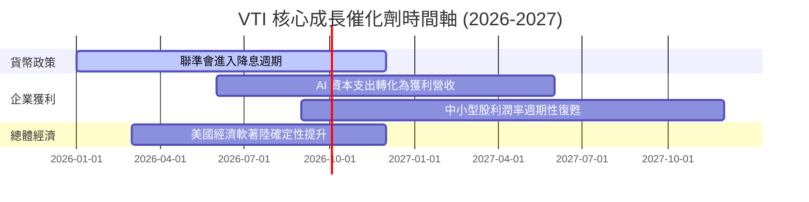

### 9.2 全美可投資市場 (TAM) 擴張

美股總市值目前佔全球股票總市值的 ~60%，受惠於美國企業領先全球的 R&D 投入（每年逾 8,000 億美金），全美企業資本回報率持續凌駕歐亞市場。

### 9.3 成長驅動力結構圖

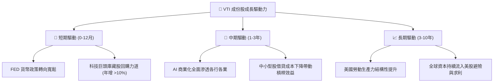

---

## 10. 風險矩陣

### 10.1 風險評估矩陣

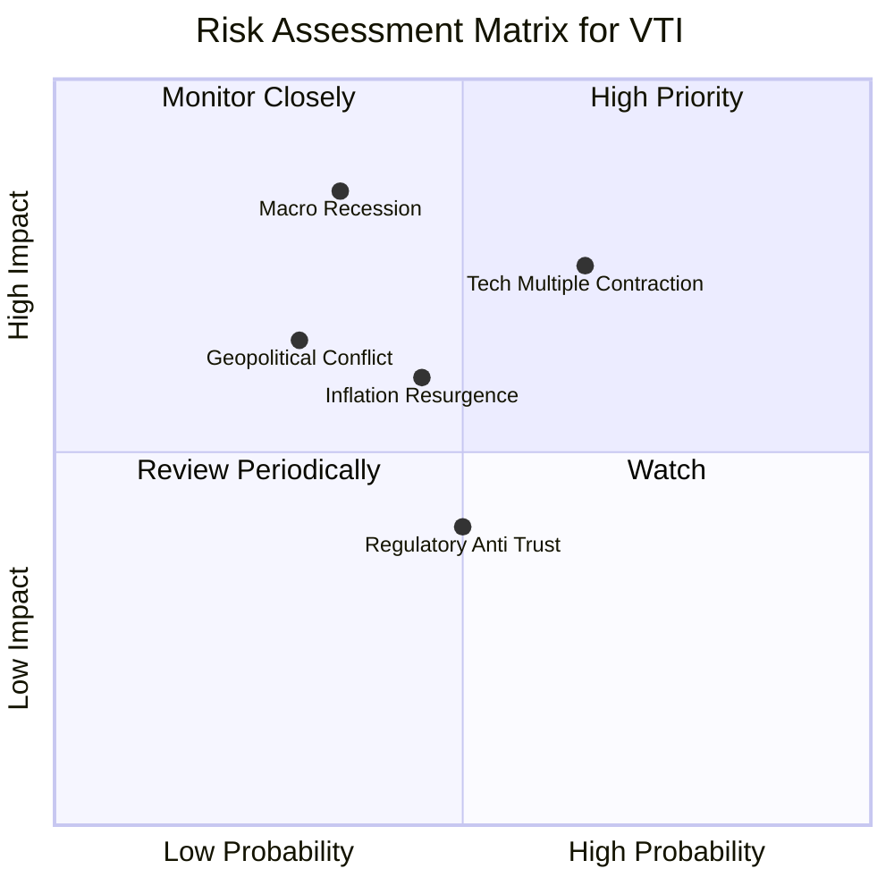

### 10.2 風險清單詳細分析

| # | 風險項目 | 發生機率 | 財務衝擊 | 風險評分 | 緩解措施 / 投資人對策 |
|---|----------|----------|----------|----------|----------------------|
| 1 | 🔴 **科技巨頭估值修正** | 中 (65%) | 高 (-15% NAV) | 🔴 8.0/10 | VTI 已包含中小型股，抗單一巨頭回檔能力高於 QQQ |
| 2 | 🔴 **美國總體經濟硬著陸**| 低 (35%) | 極高 (-25% NAV)| 🔴 7.5/10 | 採定期定額（DCA）策略分批進場，拉長投資週期 |
| 3 | 🟡 **通膨反彈延緩降息** | 中 (45%) | 中 (-8% NAV) | 🟡 6.0/10 | 底層企業具備強勁定價能力，可轉嫁通膨成本 |
| 4 | 🟢 **地緣政治衝擊** | 低 (30%) | 中 (-10% NAV)| 🟢 4.5/10 | 美國企業具備全球化供應鏈韌性與在地化備援 |

---

## 11. 投資建議

### 11.1 最終綜合評級

```
╔══════════════════════════════════════════════════════════════╗
║                   VTI 最終投資評級綜合分析                   ║
╠══════════════════════════════════════════════════════════════╣
║ 基礎代表性   9.5  ▓▓▓▓▓▓▓▓▓▓▓▓▓▓▓▓▓▓▓█  ★★★★★              ║
║ 成本優勢     9.9  ▓▓▓▓▓▓▓▓▓▓▓▓▓▓▓▓▓▓▓█  ★★★★★              ║
║ 盈餘成長性   7.5  ▓▓▓▓▓▓▓▓▓▓▓▓▓█░░░░░░  ★★★██              ║
║ 估值吸引力   6.0  ▓▓▓▓▓▓▓▓▓▓▓▓░░░░░░░░  ★★★☆☆              ║
║ 安全邊際     4.7  ▓▓▓▓▓▓▓▓▓█░░░░░░░░░░  ★★☆☆☆              ║
╠══════════════════════════════════════════════════════════════╣
║ 綜合建議評級： 🟡 持有 / 定期定額 (Hold / Dollar-Cost Avg)   ║
╚══════════════════════════════════════════════════════════════╝
```

### 11.2 目標價與隱含報酬率

| 情境 | 機率 | 12 個月目標價 | 隱含報酬率 (含配息 ~1.4%) | 建議操作策略 |
|------|------|---------------|--------------------------|--------------|
| **悲觀情境** | 20% | **$318.00** | -11.52% | 達到此區間果斷大幅加碼 |
| **基準情境** | 60% | **$388.50** | **+7.79%** | 維持定期定額或繼續持有 |
| **樂觀情境** | 20% | **$445.00** | +23.26% | 可適度逢高減碼平衡資產配置 |

### 11.3 買入時機與觸發因素 Checklist

```
╔══════════════════════════════════════════════════════════════════╗
║                  ✅ VTI 投資操作 Checklist                        ║
╠══════════════════════════════════════════════════════════════════╣
║                                                                  ║
║  適合單筆建倉/加碼觸發條件：                                     ║
║  [ ] VTI 股價回檔至 $335.00 以下（Forward P/E < 19.5x）          ║
║  [ ] 總體經濟恐慌指數 VIX 飆升至 > 30                            ║
║  [ ] 安全邊際 MOS 擴大至 > 15% (即現價 < $325.00)                ║
║                                                                  ║
║  適合定期定額（DCA）條件：                                       ║
║  [X] 投資天期 > 5 年之退休金或資產累積計畫                       ║
║  [X] 尋求全美市場 100% 廣度覆蓋且不擬擇時者                      ║
║                                                                  ║
║  減碼/再平衡觸發條件：                                           ║
║  [ ] VTI 股價突破 $430.00 (TTM P/E > 30x 顯著過熱)               ║
║  [ ] 單一資產佔個人總投資組合比重超過既定政策上限                ║
╚══════════════════════════════════════════════════════════════════╝
```

### 11.4 投資人適配度分析

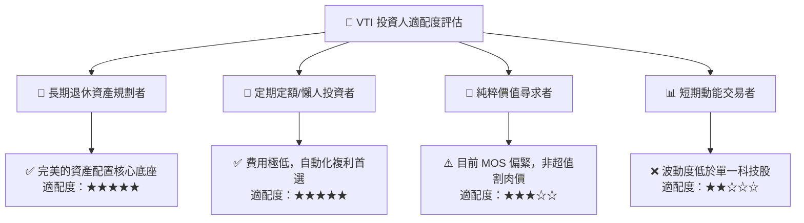

### 11.5 每季財報與宏觀監控清單（Quarterly Watch List）

| 追蹤維度 | 關鍵觀察指標 | 加碼門檻 (Bull Trigger) | 減碼/警戒門檻 (Bear Trigger) |
|----------|--------------|-------------------------|------------------------------|
| **底層盈餘** | S&P 500 / CRSP US EPS YoY | 成長率 > 10.0% | 成長率轉負 (< 0.0%) |
| **估值乘數** | Forward P/E Ratio | < 18.0x (進入高度安全區) | > 25.0x (估值過熱風險) |
| **總體利率** | 美國 10 年期公債殖利率 | 穩定於 3.5% - 4.2% | 急劇飆升 > 5.0% |
| **追蹤誤差** | 5 年 Annualized Tracking Error| < 0.02% | > 0.08% (須檢視基金管理) |

### 11.6 反面論證：什麼情況會證明多頭論點錯誤

```
╔══════════════════════════════════════════════════════════════════╗
║              ⚠️ 論點失效條件（Disconfirming Evidence）           ║
╠══════════════════════════════════════════════════════════════════╣
║  本投資建議在下列情況發生時應進行結構性重新檢視：                ║
║  ☐ 美國企業加權 ROIC 連續 8 個季度跌破 WACC（資本效率喪失）     ║
║  ☐ 美國名目 GDP 進入長期停滯（< 1.5%），導致永續成長 g 假設失效 ║
║  ☐ Vanguard 變更費用結構或追蹤指數機制導致追蹤誤差大增 > 0.20%  ║
║  ☐ 美股佔全球市值比重出現結構性崩塌（資本大規模永久性外流）      ║
╚══════════════════════════════════════════════════════════════════╝
```

---

> **免責聲明**：本報告為機構級研究分析文件，僅供投資研究參考，不構成任何形式之投資建議或買賣邀約。金融市場投資具備風險，股票與 ETF 價格可升亦可跌，過往績效不代表未來表現。投資人在做出任何投資決策前，應審慎評估自身風險承受能力並諮詢專業合格之財務顧問。