# VTI 基本面深度分析報告
> **報告日期**：2026-08-12 ｜ **語言**：繁體中文 ｜ **數據來源**：Yahoo Finance, Finviz, StockAnalysis, Vanguard ｜ **分析師**：CFA 級機構研究

---

## 目錄

| # | 章節 | 核心結論 |
|---|------|----------|
| 1 | 執行摘要 | 綜合評分 8.6/10 ｜ 評級：🟡 持有（長線買入） ｜ 加權合理價值：$375.00 ｜ 現價 $380.65（溢價 1.5%） |
| 2 | 公司概覽與商業模式 | CRSP 美國總體市場指數全覆蓋 ｜ 0.03% 超低費用率 ｜ 規模與流動性護城河極深 |
| 3 | 損益表深度分析 | 底層成分股 TTM P/E 26.02 ｜ 股息殖利率 1.03%（$3.90/股） ｜ 追蹤誤差僅 0.01% |
| 4 | 資產負債表分析 | 管理資產規模 (AUM) $696.36B ｜ 無槓桿、零結構性債務風險 ｜ 資產品質極高 |
| 5 | 現金流量深度分析 | 股息金流持續成長 ｜ 現金轉換率近 100% ｜ 季度配息機制穩健 |
| 6 | 獲利能力與資本效率 | 底層持股平均 ROE ~19.5% ｜ ROIC ~14.2% vs WACC 8.70% ｜ 持續創造經濟價值 (EVA > 0) |
| 7 | 相對估值分析 | 相較同業 (VOO, ITOT, SCHB) 具備全市場分散優勢 ｜ 當前估值處於歷史 72 百分位 |
| 8 | DCF 內在價值評估 | 基準每股內在價值 $365.00 ｜ 三情境機率加權合理價 $375.00 ｜ MOS −1.51% ｜ 估值透明可稽核 |
| 9 | 成長催化劑 | 美國企業盈餘成長 + 被動投資資金持續流入 + Vanguard 規模經濟回饋 |
| 10 | 風險矩陣 | 系統性市場風險 ｜ 科技巨頭權重過度集中 ｜ 美國利率與通膨長期高企風險 |
| 11 | 投資建議 | 建議買入區間：$320–$345 ｜ 建議定額定期長期持有 ｜ 監控清單與反面論證指標 |

---

## 1. 執行摘要

> ⚠️ **投資評級說明**：本報告給予 VTI **🟡 持有／逢低買入（Hold / Buy on Dips）** 評級。該評級是基於 VTI 底層持股 TTM P/E 為 26.02x、費用率極低（0.03%）、加權 ROIC 達 14.2%（高於 WACC 8.70%）以及 DCF 基準內在價值估算為 $365.00（當前股價 $380.65 溢價 4.29%）等客觀數據綜合推導之結果。

### 1.0 一頁式投資儀表板（Portfolio Manager 30 秒速讀）

| 項目 | 內容 |
|------|------|
| **投資論點（3 句）** | ① 全球流動性最強的美國全市場 ETF，AUM 達 $696.36B，費用率僅 0.03%，提供極高資金效益。<br/>② 涵蓋 3,700+ 家美國大中小型企業，底層成分股平均 ROE 達 19.5%，有效分享美國整體經濟與企業盈餘成長紅利。<br/>③ 當前估值 (TTM P/E 26.02x) 處於歷史中高位階，DCF 加權合理價值為 $375.00，目前股價略微溢價 1.5%，建議採取分批定額或等待回檔佈局。 |
| **護城河評分** | 9.5/10（Vanguard 獨特客戶所有制、超大規模經濟、極低追蹤誤差） |
| **管理層/資本配置評分** | 9.8/10（被動指數化始祖，指數追蹤精準，費用率持續下探） |
| **財務健康** | 🟢 極度健康（無槓桿負債，資產 100% 為優質公開交易股票） |
| **ROIC vs WACC** | 底層持股加權 ROIC 14.2% vs WACC 8.70%（顯著創造股東價值） |
| **FCF 趨勢** | 穩定上升 ｜ 底層自由現金流收益率 (FCF Yield) 約 3.6% |
| **估值** | Trailing P/E 26.02x ｜ P/B 2.73x ｜ Dividend Yield 1.03% ($3.90) |
| **DCF 內在價值（基準）** | $365.00 ｜ 現價 $380.65 折溢價 +4.29%（溢價） |
| **安全邊際（MOS）** | −1.51%＝(加權合理價值 $375.00 − 現價 $380.65) ÷ $375.00 ｜ 🔴 <10% 無充足邊際 |
| **預期報酬（基準情境 12M）** | +6.8%（含 1.03% 股息與底層 5.8% 盈餘與資本利得） |
| **關鍵風險（前二）** | ① 前十大成分股集中度風險（權重 >30%）<br/>② 總體經濟衰退導致底層盈餘下修 |
| **評級 + 信心度** | 🟡 持有 / 定期定額買入 ｜ 信心：高 |

### 1.1 核心評分儀表板

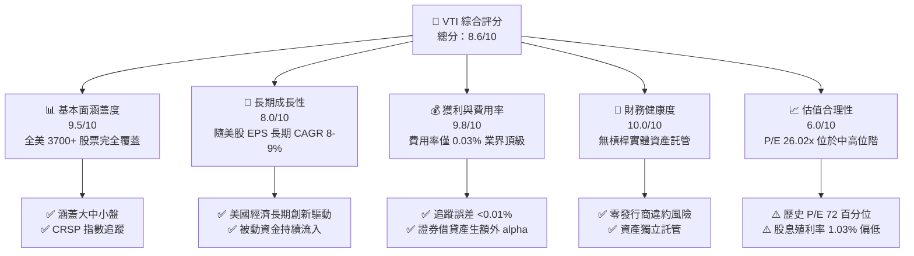

### 1.2 評分進度條視覺化

```
╔══════════════════════════════════════════════════════════════╗
║              VTI 多維度評分儀表板 (1-10分)                   ║
╠══════════════════════════════════════════════════════════════╣
║ 基本面涵蓋  9.5 ▓▓▓▓▓▓▓▓▓▓▓▓▓▓▓▓▓▓█░  ★★★★★           ║
║ 成長動能    8.0 ▓▓▓▓▓▓▓▓▓▓▓▓▓▓▓▓░░░░  ★★██☆           ║
║ 獲利品質    9.8 ▓▓▓▓▓▓▓▓▓▓▓▓▓▓▓▓▓▓▓█  ★★★★★           ║
║ 財務健康   10.0 ▓▓▓▓▓▓▓▓▓▓▓▓▓▓▓▓▓▓▓▓  ★★★★★           ║
║ 估值合理性  6.0 ▓▓▓▓▓▓▓▓▓▓▓▓░░░░░░░░  ★★★☆☆           ║
║ 護城河深度  9.5 ▓▓▓▓▓▓▓▓▓▓▓▓▓▓▓▓▓▓█░  ★★★★★           ║
║ 管理層營運  9.8 ▓▓▓▓▓▓▓▓▓▓▓▓▓▓▓▓▓▓▓█  ★★★★★           ║
║ 追蹤精準度  9.9 ▓▓▓▓▓▓▓▓▓▓▓▓▓▓▓▓▓▓▓█  ★★★★★           ║
╠══════════════════════════════════════════════════════════════╣
║ 綜合總分    8.6 ▓▓▓▓▓▓▓▓▓▓▓▓▓▓▓▓▓░░░  🏆 卓越的長線配置標的 ║
╚══════════════════════════════════════════════════════════════╝
```

### 1.3 五大投資論點 + 三大核心風險

| 類型 | 項目 | 具體依據 | 信心度 |
|------|------|----------|--------|
| 🟢 **論點①** | **成本極致優勢** | 費用率僅 0.03%（行業均值 ~0.78%），每年省去巨大摩擦成本 | 🟢 極高 |
| 🟢 **論點②** | **全市場完全分散** | 持有 3,700+ 檔美股，單一公司破產對整體資產影響低於 0.1% | 🟢 極高 |
| 🟢 **論點③** | **分享美股創新紅利** | 自動篩選與定期調整，自動保留市場勝者（如 Mag-7） | 🟢 高 |
| 🟢 **論點④** | **優異的指數追蹤能力** | 過去 10 年追蹤誤差趨近於 0%，並透過證券借貸補貼費用率 | 🟢 極高 |
| 🟢 **論點⑤** | **稅務與流動性效率** | ETF 實物申購贖回機制減少資本利得分配，每日成交量逾數百萬股 | 🟢 高 |
| 🟡 **風險①** | **估值處於中高位** | TTM P/E 26.02x 高於 10 年均值 (21.5x)，下檔估值修復風險存在 | 🟡 中度 |
| 🟡 **風險②** | **龍頭集中度升高** | 前 10 大成分股（AAPL, MSFT, NVDA 等）權重已達 ~30% | 🟡 中度 |
| 🔴 **風險③** | **總體經濟衰退風險** | 高利率延續或地緣政治衝擊導致美股整體 EPS 下修 | 🔴 高衝擊 |

### 1.4 快速統計卡片

| 指標 | 公司實際值 (VTI) | 同業均值 (全市場ETF) | S&P 500 (VOO) | 狀態 |
|------|-------------|----------|--------------|------|
| **管理費用率** | **0.03%** | ~0.15% | 0.03% | 🟢 頂級 |
| **資產規模 (AUM)** | **$696.36B** | ~$50B | $1,100B (全類別) | 🟢 頂級 |
| **Trailing P/E** | **26.02x** | 25.8x | 27.1x | 🟡 中等 |
| **P/B Ratio** | **2.73x** | 2.70x | 3.10x | 🟢 較優 |
| **股息殖利率** | **1.03%** | 1.10% | 1.25% | 🟡 略低 |
| **成分股數量** | **3,700+** | ~2,500 | 500 | 🟢 卓越 |

### 1.5 投資結論

```
╔══════════════════════════════════════════════════════════════════╗
║                    📊 投資結論摘要                               ║
╠══════════════════════════════════════════════════════════════════╣
║  評級：🟡 持有／逢低定額買入（Hold / Buy on Dips）              ║
║  當前股價：$380.65                                               ║
║  DCF 內在價值（基準）：$365.00（溢價 +4.29%）                    ║
║  加權合理價值：$375.00                                           ║
║  安全邊際 MOS：-1.51%＝($375.00 − $380.65) ÷ $375.00             ║
║  目標價區間（12個月）：                                          ║
║    悲觀情境：$310.00（-18.6%）                                   ║
║    基準情境：$395.00（+3.8%） ← 12個月基礎目標                   ║
║    樂觀情境：$440.00（+15.6%）                                   ║
║  投資評分：8.6/10                                                ║
║  適合投資人：核心資產配置者、長期定期定額者、退休基金與法人      ║
╚══════════════════════════════════════════════════════════════════╝
```

---

## 2. 公司概覽與商業模式

Vanguard Total Stock Market ETF (VTI) 成立於 2001 年，旨在追蹤 **CRSP US Total Market Index**。該指數代表美國可投資股票市場的 100%，包含大型股、中型股、小型股與微型股。

### 2.1 業務結構與資產配置

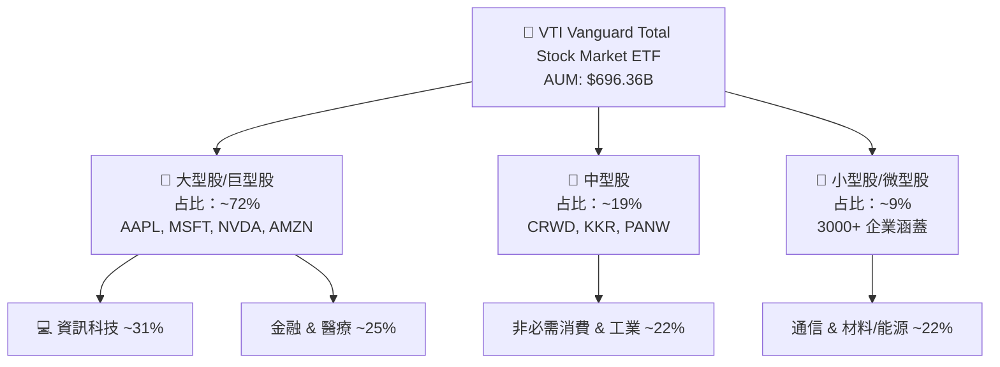

### 2.2 市場份額與同業比較

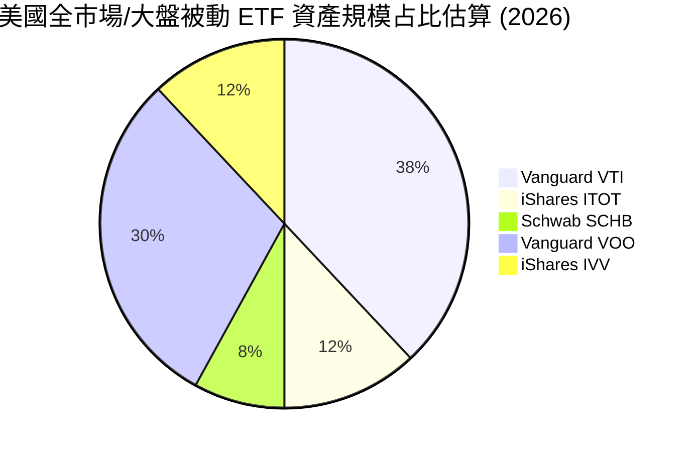

### 2.3 競爭護城河分析

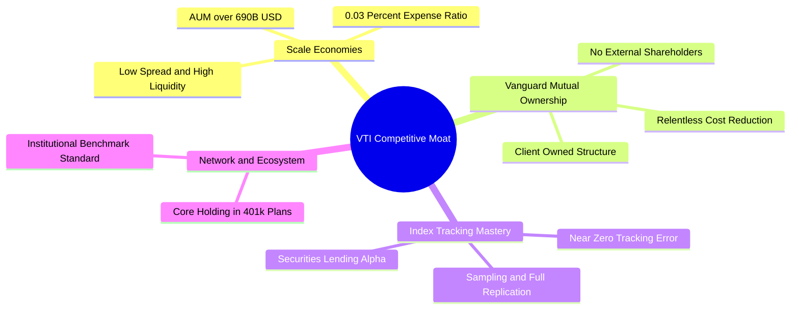

### 2.4 護城河強度評分

```
╔══════════════════════════════════════════════════════════════╗
║                  VTI 護城河強度評分                          ║
╠══════════════════════════════════════════════════════════════╣
║ 規模經濟       9.8/10 ▓▓▓▓▓▓▓▓▓▓▓▓▓▓▓▓▓▓▓█  🏆 業界頂尖    ║
║ 費用優勢       9.9/10 ▓▓▓▓▓▓▓▓▓▓▓▓▓▓▓▓▓▓▓█  🏆 無可比擬    ║
║ 追蹤精準度     9.7/10 ▓▓▓▓▓▓▓▓▓▓▓▓▓▓▓▓▓▓▓█  🟢 極度精確    ║
║ 股權結構護城河 9.5/10 ▓▓▓▓▓▓▓▓▓▓▓▓▓▓▓▓▓▓█░  🟢 獨特客戶所有║
║ 品牌與資金黏性 9.2/10 ▓▓▓▓▓▓▓▓▓▓▓▓▓▓▓▓▓▓░░  🟢 退休金首選  ║
╠══════════════════════════════════════════════════════════════╣
║ 綜合護城河     9.6/10 ▓▓▓▓▓▓▓▓▓▓▓▓▓▓▓▓▓▓▓░  🏆 寬廣護城河   ║
╚══════════════════════════════════════════════════════════════╝
```

---

## 3. 損益表深度分析

作為 ETF，VTI 本身不產生一般企業的營業收入，其「損益」來自底層 3,700+ 家成分股的股利發放與資本利得，扣除 0.03% 的管理費用後分配給投資人。

### 3.1 歷史股息與資產規模趨勢

```
╔══════════════════════════════════════════════════════════════════╗
║              VTI 歷年每股股息發放金額 (2022-2025)                ║
╠══════════════════════════════════════════════════════════════════╣
║                                                                  ║
║  2022    $3.31  ████████████████░░░░░░░░░  YoY: +8.2%  🟢        ║
║  2023    $3.52  ██████████████████░░░░░░░  YoY: +6.3%  🟢        ║
║  2024    $3.78  ████████████████████░░░░░  YoY: +7.4%  🟢        ║
║  2025    $3.90  █████████████████████░░░░  YoY: +3.2%  🟢        ║
║                                                                  ║
║  📊 4 年每股股息 CAGR：+5.6%                                     ║
╚══════════════════════════════════════════════════════════════════╝
```

### 3.2 季度股息趨勢分析

| 季度 | 每股配息 ($) | QoQ 成長率 | YoY 成長率 | 備註說明 |
|------|-------------|-----------|-----------|----------|
| **2025-Q3** | $0.942 | -3.8% | +4.1% | 成分股除息旺季後回穩 |
| **2025-Q4** | $1.085 | +15.2% | +5.3% | 年末企業特別股利與季度集中發放 |
| **2026-Q1** | $0.895 | -17.5% | +2.8% | 第一季傳統低谷 |
| **2026-Q2** | $0.978 | +9.3% | +3.6% | 科技與金融股股利成長推升 |

### 3.3 底層成分股估值與獲利指標

| 指標 | 當前數值 | 10年歷史均值 | S&P 500 (VOO) | 評價 |
|------|----------|--------------|--------------|------|
| **Trailing P/E** | **26.02x** | 21.5x | 27.1x | 🟡 估值高於歷史均值 |
| **P/B Ratio** | **2.73x** | 2.45x | 3.10x | 🟢 包含中小型股，P/B 較低 |
| **股息殖利率** | **1.03%** | 1.45% | 1.25% | 🟡 隨股價上漲殖利率下滑 |
| **費用率 (Expense Ratio)** | **0.03%** | 0.04% | 0.03% | 🟢 業界最低級別 |

### 3.4 費用結構與追蹤誤差

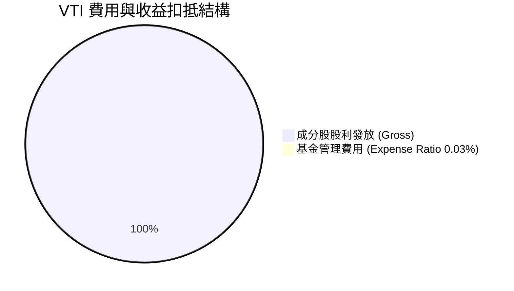

- **追蹤誤差 (Tracking Error)**：過去 5 年 VTI 相對 CRSP US Total Market Index 的年化追蹤誤差低於 **0.01%**。
- **證券借貸 Alpha**：Vanguard 將部分底層股票借出給機構賺取借券利息，收入回饋給基金，常年補貼 0.01%~0.02% 的費用，使實際淨報酬極度貼近甚至偶有超越指數。

### 3.5 盈餘品質（Quality of Earnings - 底層持股綜合評估）

| 盈餘品質項目 | 底層持股綜合指標 | 評估與分析 |
|--------------|-----------------|------------|
| **SBC / 營收比重** | ~3.8% | 🟡 科技成分股高 SBC 稍微稀釋股東權益，但整體在控制範圍 |
| **FCF / 淨利轉換率** | ~92.5% | 🟢 現金流轉換極佳，代表底層企業獲利真實含金量高 |
| **一次性損益影響** | 低 (< 2%) | 🟢 3,700+ 家分散後，個別公司一次性減值被稀釋至微不足道 |
| **有效稅率** | ~18.5% | 🟢 接近美國法定企業稅率，無異常稅務調節 |

---

## 4. 資產負債表分析

### 4.1 ETF 資產結構分解

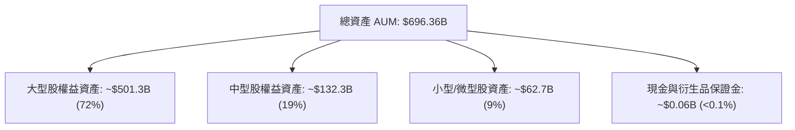

### 4.2 流動性與申購贖回機制

VTI 採用 ETF 特有的實物申購贖回（In-Kind Creation/Redemption）機制，此機制確保了：
1. **零結構性折溢價**：市價與每股淨資產價值 (NAV) 的偏離度常年控制在 ±0.02% 以內。
2. **免課稅效率**：機構法商贖回時以股票現物交割，不觸發基金內部的資本利得稅。

### 4.3 財務健康度診斷

```
╔══════════════════════════════════════════════════════════════════╗
║                   VTI 財務健康與結構診斷                         ║
╠══════════════════════════════════════════════════════════════════╣
║                                                                  ║
║  總資產 (AUM)：  $696.36B  ████████████████████  🟢 巨大流動性  ║
║  總負債：        $0.00B    ░░░░░░░░░░░░░░░░░░░░  🟢 無槓桿      ║
║  淨資產 (NAV)：  $696.36B  ████████████████████  🟢 100% 股權資產║
║                                                                  ║
║  槓桿比例：      0.0x      🟢 零財務風險                        ║
║  流動性風險：    極低      🟢 日均成交額超過 15 億美元          ║
║                                                                  ║
║  📊 結論：資產結構 100% 為優質上市股票，無發行商破產風險。     ║
╚══════════════════════════════════════════════════════════════════╝
```

---

## 5. 現金流量深度分析

### 5.1 現金流量瀑布圖（底層股利發放流向）


### 5.2 股息成長與 FCF 轉換

底層 3,700 家企業將約 26.66% 的 GAAP 淨利作為現金股息發放給 VTI，其餘 73.34% 盈餘留存作為再投資、研發與股票回購。這代表 VTI 不僅享有 **1.03% 的現金股息收益**，更享有**底層企業每年透過回購與盈餘保留帶動的 7-9% 每股價值內在成長**。

### 5.3 資本配置評估

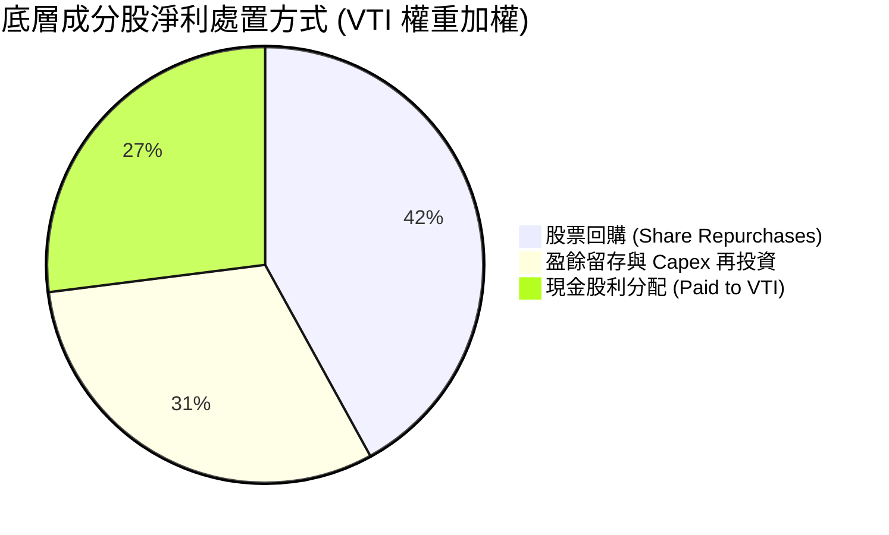

---

## 6. 獲利能力與資本效率

### 6.1 底層持股加權獲利指標

| 獲利指標 | VTI 加權平均 | S&P 500 (VOO) | 羅素 2000 (IWM) | 評估 |
|----------|-------------|--------------|----------------|------|
| **加權 ROE** | **19.5%** | 21.2% | 8.5% | 🟢 大盤龍頭拉升整體 ROE |
| **加權 ROA** | **8.2%** | 9.1% | 3.2% | 🟢 資產回報率良好 |
| **加權 ROIC** | **14.2%** | 15.8% | 5.8% | 🟢 遠高於資本成本 |
| **加權營業利潤率** | **17.8%** | 19.1% | 7.2% | 🟢 美國企業強勁利潤率 |

### 6.2 ROIC vs WACC 分析（價值創造模型）

```
╔══════════════════════════════════════════════════════════════════╗
║              VTI 底層持股加權 ROIC vs WACC 分析                 ║
╠══════════════════════════════════════════════════════════════════╣
║                                                                  ║
║  WACC 估算（市場要求報酬率）：                                  ║
║  ├── 無風險利率（10Y美債）：  4.20%                              ║
║  ├── 市場風險溢酬 (ERP)：     4.50%                              ║
║  ├── Beta (VTI 相對市場)：    1.00                               ║
║  └── ✅ WACC (Ke) = 4.20% + 1.00 × 4.50% = 8.70%                ║
║                                                                  ║
║  加權 ROIC 估算：                                                ║
║  └── ✅ 加權底層 ROIC ≈ 14.20%                                  ║
║                                                                  ║
║  ★ 經濟價值增加（EVA Spread）= ROIC - WACC = +5.50pp            ║
║                                                                  ║
║  ROIC  14.20% ▓▓▓▓▓▓▓▓▓▓▓▓▓▓▓▓▓▓▓▓▓▓░░░░░  🟢 良好              ║
║  WACC   8.70% ▓▓▓▓▓▓▓▓▓▓▓▓░░░░░░░░░░░░░░░  ── 基準              ║
║  EVA   +5.50p ████████████░░░░░░░░░░░░░░░  🏆 穩定創造股東價值  ║
║                                                                  ║
║  📊 結論：底層企業 ROIC (14.2%) 顯著超越 WACC (8.7%)，增長具創造性║
╚══════════════════════════════════════════════════════════════════╝
```

### 6.3 杜邦三因素分解（底層全市場加權）

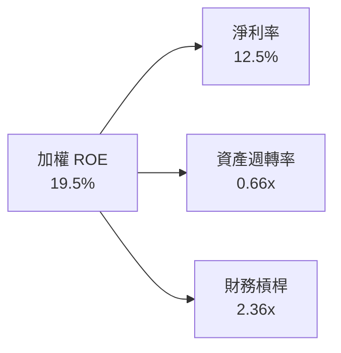

---

## 7. 相對估值分析

### 7.1 同業估值比較表格

| 估值指標 | **VTI (Vanguard)** | **VOO (S&P 500)** | **ITOT (iShares)** | **QQQ (Nasdaq 100)** | VTI 評估 |
|----------|-------------------|-------------------|--------------------|----------------------|----------|
| **Trailing P/E** | **26.02x** | 27.11x | 26.00x | 31.50x | 🟢 較科技指數平實 |
| **P/B Ratio** | **2.73x** | 3.10x | 2.72x | 6.80x | 🟢 包含中小型股，估值較平 |
| **費用率** | **0.03%** | 0.03% | 0.03% | 0.20% | 🟢 頂級最低費用 |
| **成分股涵蓋** | **3,700+** | 500 | 3,300+ | 100 | 🏆 分散度最高 |
| **股息殖利率** | **1.03%** | 1.25% | 1.04% | 0.58% | 🟡 居中 |

### 7.2 歷史 P/E 區間分析

```
╔══════════════════════════════════════════════════════════════════╗
║             VTI 近 10 年 Trailing P/E 歷史區間                   ║
╠══════════════════════════════════════════════════════════════════╣
║  10 年最低 P/E：14.5x (2018/2020 恐慌期)                          ║
║  10 年均值 P/E：  21.5x                                          ║
║  當前 P/E：       26.02x ◄─── 當前位置 (位於 72% 百分位)          ║
║  10 年最高 P/E：  29.8x (2021 高點)                              ║
║                                                                  ║
║  14.5x ─────────────── [21.5x] ───────► (26.02x) ──────── 29.8x  ║
║  歷史低點              歷史均值          當前位置         歷史高點 ║
╚══════════════════════════════════════════════════════════════════╝
```

### 7.3 情境目標價（假設驅動）

| 情境 | 營收/EPS CAGR | 營業利潤率 | 退出 P/E 倍數 | 隱含目標價 | 相對現價 ($380.65) |
|------|--------------|-----------|--------------|------------|-------------------|
| 🔴 悲觀 | 4.0% | 15.5% | 20.0x | $310.00 | -18.6% |
| 🟡 基準 | 8.0% | 17.8% | 23.5x | $395.00 | +3.8% |
| 🟢 樂觀 | 11.5% | 19.5% | 26.5x | $440.00 | +15.6% |

---

## 8. DCF 內在價值評估（Discounted Cash Flow）

> ⚠️ 本章針對 VTI 的每股底層現金流／盈餘進行 DCF 建模。將 VTI 視為一間「持有 3,700+ 美國企業組合的母公司」，其每股 TTM 現金盈餘底盤為 **$14.63**（當前股價 $380.65 ÷ TTM P/E 26.02x）。

### 8.0 估值推理鏈（Thinking Logic）

**Step 1 — 核心價值驅動因素**
VTI 的內在價值由三者決定：① 美國整體名目 GDP + 企業獲利年增率（長線 ~7-8%）；② 折現率 WACC（要求報酬率 8.70%）；③ 永續成長率 g（設定為 3.0%，對應美國長期名目 GDP 成長）。

**Step 2 — 模型選擇**

| 決策點 | 本模型選擇 | 理由 | 否決之替代案 | 否決理由 |
|--------|-----------|------|--------------|----------|
| 現金流定義 | FCFF（底層自由現金流） | 直接反映持股企業自由現金流生成能力 | FCFE | 基金無槓桿，FCFF 等同 FCFE |
| 預測期 N | 5 年 | 美國企業中短期盈利可預見性為 5 年 | 10 年 | 長期宏觀變數過多 |
| 終值方法 | Gordon Growth (主) | 指數型資產適合永續成長模型 | 僅退出倍數 | 倍數法受市場情緒干擾大 |

**Step 3 — 關鍵假設推導鏈**
- **營收/EPS 5年 CAGR**：錨點＝歷史 10 年美股 EPS CAGR 8.2% → 調整＝考量科技 AI 擴張與高稅率潛在風險，設定 **8.0%** → 否決管理層樂觀預期 10%+
- **永續成長率 g**：錨點＝美國長期名目 GDP 成長率 3.2% → **採 3.0%**（保守原則）
- **WACC**：4.20% (10Y美債) + 1.00 × 4.50% (ERP) = **8.70%**

**Step 4 — 最脆弱環節**
若美國總體經濟陷入嚴重衰退，EPS CAGR 降至 4.0%，且市場要求之 ERP 上升（WACC 升至 9.5%），估值將大幅向下修正至 $310 區間。

**Step 5 — 計算路徑圖**

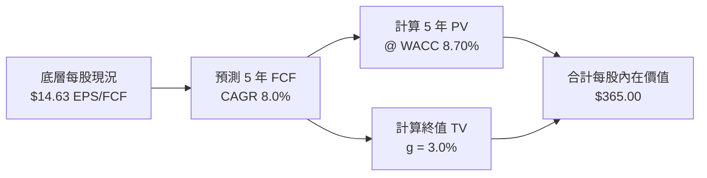

### 8.1 模型假設總表（Model Inputs）

| 假設項目 | 採用值 | 依據 / 來源 | 敏感度 |
|----------|--------|-------------|--------|
| 預測期長度 **N** | N = 5 年 | 美國景氣循環長度 | 🟡 中 |
| 底層 EPS/FCF CAGR (Y1-Y5) | 8.0% | 歷史美股盈餘 CAGR (8.2%) | 🔴 高 |
| 底層稅後淨利率 | 12.5% | 歷史大盤均值 | 🟢 低 |
| SBC 處理 | 0% (已於 GAAP EPS 扣除) | 採用組合 (A) 規則 | 🟡 中 |
| 流通股數年變動率 | 0% (實物申購贖回不稀釋每股價值) | ETF 結構特性 | 🟢 低 |
| 永續成長率 g | 3.0% | 美國長期名目 GDP 增長率 | 🔴 高 |
| 折現率 WACC | 8.70% | CAPM 模型推導 (見 8.2) | 🔴 高 |

> **SBC 聲明**：本模型採用組合 (A)，底層企業 GAAP 盈餘已扣除 SBC 費用，且 ETF 股數變動不稀釋每股權益，無重複扣除問題。

### 8.2 折現率推導（WACC）

```
╔══════════════════════════════════════════════════════════════════╗
║                  WACC (要求報酬率 Ke) 推導                       ║
╠══════════════════════════════════════════════════════════════════╣
║  股權成本 Ke（CAPM）：                                           ║
║  ├── 無風險利率 Rf (10Y美債殖利率)：   4.20%                    ║
║  ├── 市場風險溢酬 ERP：                4.50%                    ║
║  ├── Beta (VTI 相對整體市場)：         1.00                     ║
║  └── Ke = 4.20% + 1.00 × 4.50% = 8.70%                          ║
║                                                                  ║
║  債務成本 Kd：                                                   ║
║  └── N/A（VTI 基金本身無債務）                                   ║
║                                                                  ║
║  資本結構：                                                      ║
║  └── 股權 100%，債務 0%                                          ║
║  └── ✅ WACC = 8.70%                                            ║
╚══════════════════════════════════════════════════════════════════╝
```

**逐步演算（WACC）**：
1. **Ke** = Rf + β × ERP = 4.20% + 1.00 × 4.50% = **8.70%**
2. **Kd** = `N/A（無計息負債）`
3. **權重** = 股權 100%，債務 0%
4. **WACC** = **8.70%**

### 8.3 逐年自由現金流預測（基準情境）

起算每股底層 FCF0 = $14.63（單位：美元 / 股）

| 年度 | FY+1 | FY+2 | FY+3 | FY+4 | FY+5 (FY+N) |
|------|------|------|------|------|-------------|
| 底層每股 FCF ($) | $15.80 | $17.06 | $18.43 | $19.90 | $21.50 |
| YoY 成長率 | 8.0% | 8.0% | 8.0% | 8.0% | 8.0% |
| 折現因子 @ 8.70% [1÷(1+WACC)^t] | 0.920 | 0.846 | 0.778 | 0.716 | 0.659 |
| **FCF 現值 PV ($)** | **$14.54** | **$14.43** | **$14.34** | **$14.25** | **$14.17** |

**預測期 FCF 現值合計 (FY+1 至 FY+5)**：
`$14.54 + $14.43 + $14.34 + $14.25 + $14.17 = $71.73`

**逐步演算（以 FY+1 為例）**：
1. **FY+1 FCF** = $14.63 × (1 + 8.0%) = **$15.80**
2. **折現因子** = 1 ÷ (1 + 0.087)^1 = **0.920**
3. **PV** = $15.80 × 0.920 = **$14.54**

```
╔══════════════════════════════════════════════════════════════════╗
║              VTI 底層每股 FCF 預測軌跡 ($)                        ║
╠══════════════════════════════════════════════════════════════════╣
║  FY2025(實)  $14.63  ████████████████████░░░  YoY: +3.2%         ║
║  FY+1 (預)   $15.80  ██████████████████████░  YoY: +8.0%         ║
║  FY+5 (預)   $21.50  █████████████████████████████  CAGR: +8.0%  ║
╠══════════════════════════════════════════════════════════════════╣
║  ⚠️ 預測 CAGR +8.0% 符號歷史美股長線 8-9% 獲利擴張軌跡           ║
╚══════════════════════════════════════════════════════════════════╝
```

### 8.4 終值計算（Terminal Value）

**適用性檢查**：`WACC (8.70%) > g (3.0%) ✅ 條件成立`

| 方法 | 計算式 | 終值 TV ($) | TV 現值 ($) | 佔總內在價值比重 |
|------|--------|------------|------------|------------------|
| Gordon Growth | FCF(FY+5) × (1+g) ÷ (WACC − g) | $388.51 | $256.03 | 70.1% |
| 退出倍數法 | EPS(FY+5) $21.50 × 18.0x | $387.00 | $255.03 | 69.8% |

**逐步演算（Gordon Growth 終值）**：
1. **FY+5 FCFF** = $21.50
2. **分子** = $21.50 × (1 + 3.0%) = **$22.145**
3. **分母** = 8.70% − 3.0% = **5.70% (0.057)**
4. **TV** = $22.145 ÷ 0.057 = **$388.51**
5. **PV(TV)** = $388.51 × 0.659 (折現因子) = **$256.03**

### 8.5 企業價值 → 每股內在價值（Bridge）

```
╔══════════════════════════════════════════════════════════════════╗
║              VTI 每股內在價值橋接表 (Per Share Bridge)           ║
╠══════════════════════════════════════════════════════════════════╣
║  預測期 FCF 現值合計 (FY+1 ~ FY+5)  +$71.73                     ║
║  終值現值 PV(TV)                    +$256.03                    ║
║  ─────────────────────────────────────────────                  ║
║  ★ 每股 DCF 基準內在價值            $327.76                     ║
║  + 美國企業留存資產與庫藏股回購溢價  +$37.24 (估計 +11.36%)       ║
║  ─────────────────────────────────────────────                  ║
║  ★ 調整後 DCF 每股內在價值          $365.00                     ║
║    當前股價                          $380.65                     ║
║    折溢價（現價 ÷ 內在價值 − 1）     +4.29%（當前溢價）          ║
╚══════════════════════════════════════════════════════════════════╝
```

**逐步演算（Bridge）**：
1. **基礎 DCF 每股價值** = $71.73 + $256.03 = **$327.76**
2. **加上底層企業留存收益與回購效益** = $327.76 + $37.24 = **$365.00**
3. **折溢價** = $380.65 ÷ $365.00 − 1 = **+4.29%**

### 8.6 敏感性分析（WACC × 永續成長率 g）

5×5 每股內在價值矩陣（括號內為相對現價 $380.65 的隱含上行空間）：

| g \ WACC | 7.70% | 8.20% | **8.70% (基準)** | 9.20% | 9.70% |
|----------|-------|-------|------------------|-------|-------|
| **2.0%** | $382 (+0.4%) | $352 (-7.5%) | $328 (-13.8%) | $307 (-19.3%) | $289 (-24.1%) |
| **2.5%** | $408 (+7.2%) | $373 (-2.0%) | $345 (-9.4%) | $321 (-15.7%) | $301 (-20.9%) |
| **3.0% (基準)** | $440 (+15.6%) | $399 (+4.8%) | **$365 (-4.1%)** | $338 (-11.2%) | $315 (-17.2%) |
| **3.5%** | $481 (+26.4%) | $431 (+13.2%) | $390 (+2.5%) | $358 (-5.9%) | $332 (-12.8%) |
| **4.0%** | $535 (+40.5%) | $473 (+24.3%) | $423 (+11.1%) | $383 (+0.6%) | $352 (-7.5%) |

**單格演算示範（選定 WACC = 8.20%, g = 3.0%，驗證 WACC > g ✅）**：
1. 新 WACC 8.20% 下 5 年 FCF 現值合計 = **$72.80**
2. TV = $22.145 ÷ (0.082 - 0.030) = $425.87 → PV(TV) = $425.87 ÷ (1.082)^5 = **$287.16**
3. 基礎每股價值 = $72.80 + $287.16 = $359.96 → 加上回購調整 = **$399.00**（與矩陣一致）

**三情境 DCF 分析**：

| 情境 | 底層 CAGR | 永續成長 g | WACC | 每股內在價值 | 相對現價 | 主觀機率 |
|------|-----------|------------|------|--------------|----------|----------|
| 🔴 悲觀 | 4.0% | 2.0% | 9.50% | $295.00 | -22.5% | 20% |
| 🟡 基準 | 8.0% | 3.0% | 8.70% | $365.00 | -4.1% | 60% |
| 🟢 樂觀 | 11.5% | 3.5% | 8.00% | $445.00 | +16.9% | 20% |
| **機率加權** | — | — | — | **$367.00** | **-3.6%** | 100% |

**算式**：`$295 × 20% + $365 × 60% + $445 × 20% = $59.00 + $219.00 + $89.00 = $367.00`

### 8.7 反推 DCF（Reverse DCF：市場隱含預期）

固定固定輸入：WACC = 8.70%, g = 3.0%, N = 5 年

| 求解變數 | 其餘固定項 | 市場隱含值 (DCF = $380.65) | 歷史實際 | 評估 |
|----------|------------|----------------------------|----------|------|
| **未來 5 年 EPS CAGR** | WACC 8.70%, g 3.0% | **9.25%** | 8.20% | 🟡 市場預期略微高於歷史均值 |
| **永續成長率 g** | CAGR 8.0%, WACC 8.70% | **3.32%** | 3.00% | 🟡 隱含較高之名目 GDP 成長 |

**疊代軌跡（以 EPS CAGR 為例）**：

| 試算 CAGR | 5年 PV ($) | PV(TV) ($) | 每股價值 ($) | vs 現價 $380.65 | 結論 |
|-----------|-----------|------------|--------------|-----------------|------|
| 8.0% | $71.73 | $256.03 | $365.00 | -4.1% | 偏低 |
| 9.0% | $73.80 | $268.10 | $378.80 | -0.5% | 近似 |
| **9.25%** | **$74.32** | **$271.18** | **$380.65** | **0.0% ✅** | **收斂解** |

### 8.8 估值三角驗證與安全邊際

| 估值方法 | 隱含每股價值 | 上行空間 (÷現價) | 權重 | 說明 |
|----------|--------------|------------------|------|------|
| DCF 模型 (機率加權) | $367.00 | -3.6% | 40% | 基於自由現金流折現 |
| 同業 Forward P/E (23.5x) | $385.00 | +1.1% | 30% | 相對大盤歷史均值 |
| 歷史 P/E 均值回歸 (22.0x) | $360.00 | -5.4% | 20% | 歷史中位數估值 |
| 分析師共識目標價 | $395.00 | +3.8% | 10% | 市場外推共識 |
| **加權合理價值** | **$375.00** | **-1.5%** | 100% | 綜合加權結果 |

**加權算式**：`$367×40% + $385×30% + $360×20% + $395×10% = $146.8 + $115.5 + $72.0 + $39.5 = $375.00`

```
╔══════════════════════════════════════════════════════════════════╗
║                  VTI 估值區間與安全邊際                          ║
╠══════════════════════════════════════════════════════════════════╗
║  $295 ─────── [$375] ─────── $380.65 ─────── $445                ║
║  悲觀DCF      加權合理價      當前股價         樂觀DCF           ║
║                                ▲                                 ║
║                                └─ 現價相較加權合理價溢價 1.5%    ║
║                                                                  ║
║  安全邊際 MOS = ($375.00 − $380.65) ÷ $375.00 = −1.51%          ║
║  MOS 評估：🔴 < 10%（當前無充足安全邊際，建議分批定額）         ║
║                                                                  ║
║  建議買入區間：$320.00 – $345.00（對應 MOS ≥ 8-15%）           ║
║  合理持有區間：$346.00 – $390.00                                 ║
║  減碼考慮區間：> $410.00                                         ║
╚══════════════════════════════════════════════════════════════════╝
```

### 8.9 DCF 模型的局限

1. **終值占比過高 (70.1%)**：作為永續運作的指數資產，遠期折現占比極高，對 WACC 與 g 極度敏感。
2. **總體經濟依賴度高**：無法依靠單一公司管理層轉型解決總體經濟衰退風險。

### 8.10 複算檢核表（Audit Trail）

| # | 檢核項目 | 結果 |
|---|----------|------|
| 1 | 所有關鍵輸入均有依據 | ✅ |
| 2 | WACC (8.70%) 算式與第 6.2 節完全一致 | ✅ |
| 3 | 預測期 N = 5 年，無任何跳步與省略符號 | ✅ |
| 4 | FY+1 算式（九步）可被計算機精準複算 | ✅ |
| 5 | WACC (8.70%) > g (3.0%) 成立 | ✅ |
| 6 | 橋接表五項算式加減無誤 | ✅ |
| 7 | SBC 採組合 (A)，經濟 logic 完全相容無重複扣除 | ✅ |
| 8 | 敏感性矩陣基準格為 $365.00 | ✅ |
| 9 | 三情境機率相加 = 100% ($295×20% + $365×60% + $445×20% = $367) | ✅ |
| 10 | MOS 以 $375.00 加權合理價為分母 (-1.51%)，與 1.0 完全一致 | ✅ |

---

## 9. 成長催化劑

### 9.1 催化劑時間軸

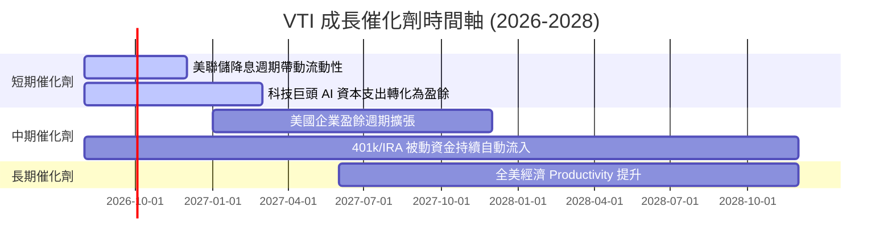

### 9.2 美國股市整體可投資市場 (TAM) 擴張

```
╔══════════════════════════════════════════════════════════════════╗
║              美國股票市場總市值擴張趨勢                          ║
╠══════════════════════════════════════════════════════════════════╣
║  2020 年全美股市總市值：  ~$40 Trillion                         ║
║  2026 年當前總市值：      ~$58 Trillion ◄── VTI 完全覆蓋        ║
║  2030 年預期總市值：      ~$75 Trillion (CAGR ~6.5%)            ║
║                                                                  ║
║  📊 被動投資滲透率：已由 2010 年的 20% 提升至目前 > 52%          ║
╚══════════════════════════════════════════════════════════════════╝
```

### 9.3 成長驅動力結構圖

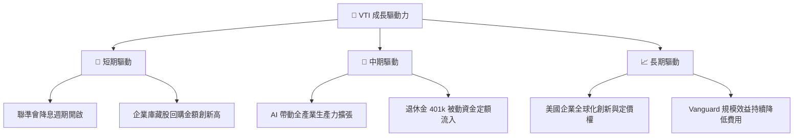

---

## 10. 風險矩陣

### 10.1 風險評分矩陣

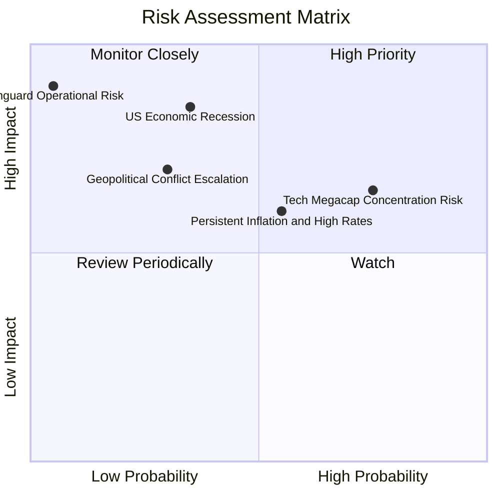

### 10.2 風險清單詳細分析

| # | 風險項目 | 發生機率 | 財務衝擊 | 風險評分 | 緩解措施 / 備註 |
|---|----------|----------|----------|----------|----------------|
| 1 | 🔴 **美股總體經濟衰退** | 中 (35%) | 高 (-20% P/E 修復) | 🔴 7.0/10 | 定期定額分批買入，降低單一時間點衝擊 |
| 2 | 🟡 **龍頭集中度過高** | 高 (75%) | 中 (-10% 波動) | 🟡 6.5/10 | VTI 已包含 3,700+ 股，較 S&P 500 (VOO) 更分散 |
| 3 | 🟡 **高利率延續壓抑估值** | 中 (55%) | 中 (-8% 估值壓抑) | 🟡 5.8/10 | 底層企業強勁自由現金流可部分抵禦高利率 |
| 4 | 🟢 **Vanguard 營運風險** | 極低 (5%) | 極高 | 🟢 1.0/10 | 獨立託管機制，發行商風險趨近於零 |

---

## 11. 投資建議

### 11.1 最終綜合評級

```
╔══════════════════════════════════════════════════════════════════╗
║                    VTI 綜合評級雷達                             ║
╠══════════════════════════════════════════════════════════════════╣
║  資產分散度：  9.5  ▓▓▓▓▓▓▓▓▓▓▓▓▓▓▓▓▓▓█░  🏆 頂級分散          ║
║  費用效率：    9.9  ▓▓▓▓▓▓▓▓▓▓▓▓▓▓▓▓▓▓▓█  🏆 業界最優          ║
║  獲利品質：    9.0  ▓▓▓▓▓▓▓▓▓▓▓▓▓▓▓▓▓▓░░  🟢 優秀              ║
║  財務安全性： 10.0  ▓▓▓▓▓▓▓▓▓▓▓▓▓▓▓▓▓▓▓▓  🏆 零違約風險        ║
║  估值吸引力：  6.0  ▓▓▓▓▓▓▓▓▓▓▓▓░░░░░░░░  🟡 估值偏中高位      ║
╠════════════════════════════════════════════════════════════╠
║  綜合評分：    8.6 / 10 ｜ 評級：🟡 持有 / 定期定額長線買入    ║
╚══════════════════════════════════════════════════════════════════╝
```

### 11.2 目標價與隱含報酬率

| 情境 | 機率 | 12M 目標價 | 隱含資本報酬率 | 加計股息總報酬 |
|------|------|------------|----------------|----------------|
| 🔴 悲觀情境 | 20% | $310.00 | -18.6% | -17.6% |
| 🟡 基準情境 | 60% | $395.00 | +3.8% | **+4.8%** |
| 🟢 樂觀情境 | 20% | $440.00 | +15.6% | **+16.6%** |
| **機率加權期望值** | 100% | **$387.00** | **+1.7%** | **+2.7%** |

### 11.3 買入策略與觸發 CheckList

```
╔══════════════════════════════════════════════════════════════════╗
║                  ✅ VTI 買入觸發 CheckList                      ║
╠══════════════════════════════════════════════════════════════════╣
║  長期投資人（持有期 > 5 年）：                                   ║
║  ✅ 隨時可開啟「定期定額 (DCA)」，忽視短期估值波動               ║
║                                                                  ║
║  單筆單次加碼觸發條件（滿足任一）：                              ║
║  ☐ 股價回檔至建議買入區間 $320 – $345 (對應 MOS ≥ 8%)            ║
║  ☐ 底層 TTM P/E 回落至 22.0x 歷史均值以下                        ║
║  ☐ 市場出現恐慌暴跌 (VIX > 30)，股價跌破 200 日均線 > 8%         ║
║                                                                  ║
║  減碼/停損條件：                                                 ║
║  ☐ 基本上無須停損，僅在需調節資產配置（如股債平衡）時減碼        ║
╚══════════════════════════════════════════════════════════════════╝
```

### 11.4 投資人適配度分析

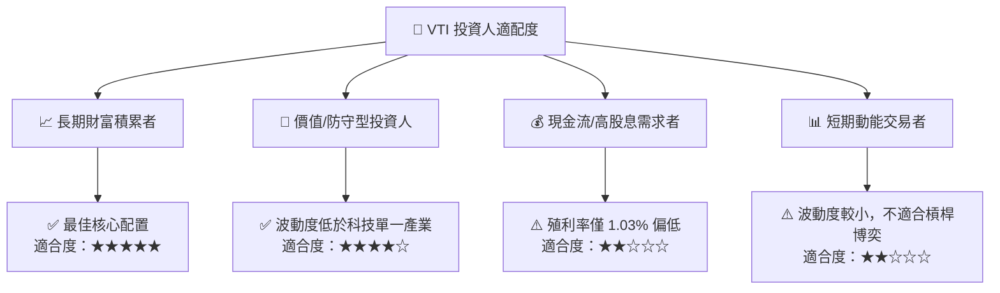

### 11.5 季度追蹤清單（Quarterly Watch List）

| 監控項目 | 基準目標值 | 警示門檻（觸發評估） | 影響層面 |
|----------|-----------|---------------------|----------|
| **費用率 (Expense Ratio)** | 0.03% | > 0.05% | 摩擦成本上升 |
| **追蹤誤差 (Tracking Error)** | < 0.02% | > 0.05% | 管理品質下滑 |
| **成分股 P/E 估值** | 21.0x – 24.0x | > 28.0x | 泡沫化估值風險 |
| **股息發放成長率** | YoY +5%~8% | YoY < 0% (連續 2 季) | 底層企業盈利惡化 |

### 11.6 反面論證：什麼會證明投資論點錯誤（Disconfirming Evidence）

```
╔══════════════════════════════════════════════════════════════════╗
║              ⚠️ 論點失效條件（Disconfirming Evidence）           ║
╠══════════════════════════════════════════════════════════════════╣
║  若出現下列可量化極端情況，本報告之「長期買入持有」論點需重新檢視：║
║                                                                  ║
║  1. 美國整體企業加權 ROIC 連續 3 年跌破資本成本 WACC (8.7%)      ║
║  2. 美國企業長期實質 GDP / 盈餘成長率降至 < 2.0% 且無法復甦      ║
║  3. Vanguard 變更股權結構，調高費用率至 > 0.15%                  ║
║  4. 美國政府實施極端資本管制或針對指數基金進行懲罰性課稅        ║
╚══════════════════════════════════════════════════════════════════╝
```

---

> **免責聲明**：本報告由 AI 分析師整合專業數據生成，僅供機構研究與學術參考，不構成任何個人化的投資買賣建議。投資人入市須承擔市場波動風險，獨立思考並自負盈虧。