# WDC 基本面深度分析報告

> **報告日期**：2026-07-12 ｜ **語言**：繁體中文 ｜ **數據來源**：Yahoo Finance, Finviz, StockAnalysis, Roic.ai ｜ **分析師**：CFA 級機構研究

---

## 目錄

| # | 章節 | 核心結論 |
|---|------|----------|
| 1 | [執行摘要](#1-執行摘要) | 評級：🟡 持有 (中性) ｜ 目標價：$591.50 ｜ 警惕非經營性收益虛增淨利 |
| 2 | [公司概覽與商業模式](#2-公司概覽與商業模式) | 雙軌存儲巨頭，分拆預期與週期性復甦共振，但護城河受限於商品化競爭 |
| 3 | [損益表深度分析](#3-損益表深度分析) | TTM 營收成長 45.5%，但 55.3% 淨利率主因 $3.70B 非經營收益，盈餘品質偏低 |
| 4 | [資產負債表分析](#4-資產負債表分析) | 債務大幅縮減（Debt/Equity 17.8%），資產負債表顯著去槓桿，財務彈性增強 |
| 5 | [現金流量深度分析](#5-現金流量深度分析) | 經營現金流回升至 $3.29B，FCF $2.08B，但 FCF Yield 僅 1.03%，估值承壓 |
| 6 | [獲利能力與資本效率](#6-獲利能力與資本效率) | ROIC 飆升至 82.1%（主因投入資本因去槓桿與資產減值而縮減），短期創造極高價值 |
| 7 | [估值深度分析](#7-估值深度分析) | Forward P/E 31.56x 高於同業，基準目標價 $591.50（隱含 +1.5% 上行空間） |
| 8 | [成長催化劑](#8-成長催化劑) | 企業級 SSD 需求爆發與 HDD 大容量升級，疊加 2026 年底 Flash 業務分拆 |
| 9 | [風險矩陣](#9-風險矩陣) | 週期復甦見頂、分拆進度延遲、以及非經營性收益不可持續之估值修正風險 |
| 10 | [投資建議](#10-投資建議) | 建議「持有」，等待分拆明朗化與非經營性擾動消除後的更佳介入時機 |

---

## 1. 執行摘要

西部數據（Western Digital Corporation, Ticker: WDC）當前股價為 $582.59，處於歷史高位區間（52週波幅為 $64.06 - $799.87），對應市值達 $200.81B。本報告基於 WDC 最新公佈的 2026 年 Q3（截至 2026 年 4 月 3 日）及 TTM 財務數據進行深度研判。

儘管市場共識給予「強烈買入（Strong Buy）」評級，且 TTM 營收同比大幅增長 45.5% 至 $11.78B，但本機構在對其盈餘品質（Quality of Earnings）進行深度審計後持**審慎樂觀（中性/持有）**態度。WDC TTM 淨利潤達 $6.48B，隱含淨利率高達 55.3%，顯著高於其 37.0% 的營業利益率。這主要是受到高達 **$3.70B 的非經營性收入（Other Non-Operating Income）** 滋補（主要發生在最近三季，累計貢獻了絕大部分淨利潤），這與公司進行中的 Flash 業務分拆重估或非經常性資產處置高度相關。若扣除此非經常性收益，WDC 的真實經營性 Forward P/E 將顯著高於當前列示的 31.56x，自由現金流收益率（FCF Yield）僅為 1.03%，顯示當前股價已過度透支了行業復甦與分拆預期。

### 1.0 一頁式投資儀表板

| 項目 | 內容 |
|------|------|
| **投資論點（3 句）** | ① 存儲行業迎來史詩級週期復甦，帶動 WDC TTM 營收同比增長 45.5% 至 $11.78B。<br/>② 公司資產負債表顯著改善，總債務由 2025 年中的 $4.71B 降至 $1.72B，去槓桿成效斐然。<br/>③ 雖然 TTM 淨利達 $6.48B，但其中 $3.70B 為非經營性收益，真實 FCF 僅 $2.08B，估值溢價過高。 |
| **護城河評分** | 5.5 / 10 🟡 (行業具高度商品化特徵，重資本且受制於週期性波動) |
| **管理層/資本配置評分** | 7.5 / 10 🟢 (積極進行債務減記與業務分拆，優化資產結構) |
| **財務健康** | 🟢 強勁 ｜ 淨現金狀態（Net Cash $1.51B），短期償債無虞 |
| **ROIC vs WACC** | 82.1% vs 15.0%（短期內因投入資本縮減與非營運利潤暴增而創造極高價值） |
| **FCF 趨勢** | 顯著改善 ｜ TTM FCF 達 $2.08B（相較於 FY24 的 -$781M），最新 FCF Yield 僅 1.03% |
| **估值** | Forward P/E: 31.56x ｜ EV/EBITDA: 50.74x ｜ FCF Yield: 1.03% |
| **預期報酬（基準情境 12M）** | **+1.53%**（目標價 $591.50，對應當前股價 $582.59） |
| **關鍵風險（前二）** | ① 非經營性收益中斷導致 EPS 斷崖式下跌；② 存儲週期見頂回落與 NAND 產能過剩。 |
| **評級 + 信心度** | 🟡 **持有 (Hold)** ｜ 信心度：**中等** |

### 1.1 核心評分儀表板

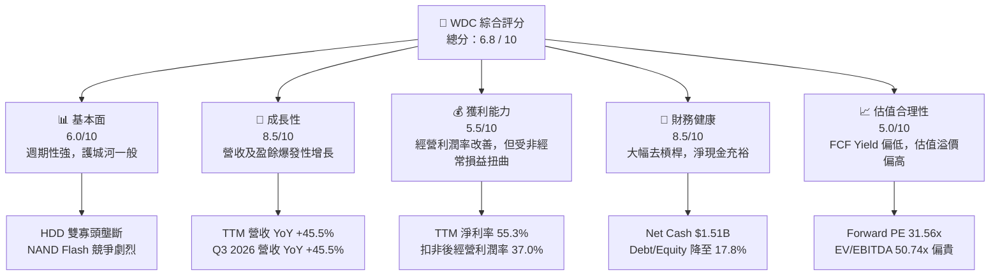

### 1.2 評分進度條視覺化

```
╔══════════════════════════════════════════════════════════════╗
║                WDC 多維度評分儀表板 (1-10分)                ║
╠══════════════════════════════════════════════════════════════╣
║ 基本面強度  6.0 ▓▓▓▓▓▓▓▓▓▓▓▓░░░░░░░░  ★★★☆☆           ║
║ 成長動能    8.5 ▓▓▓▓▓▓▓▓▓▓▓▓▓▓▓▓▓░░░  ★★★★☆           ║
║ 獲利品質    5.0 ▓▓▓▓▓▓▓▓▓▓░░░░░░░░░░  ★★★☆☆           ║
║ 財務健康    8.5 ▓▓▓▓▓▓▓▓▓▓▓▓▓▓▓▓▓░░░  ★★★★☆           ║
║ 估值合理性  5.0 ▓▓▓▓▓▓▓▓▓▓░░░░░░░░░░  ★★★☆☆           ║
║ 護城河深度  5.5 ▓▓▓▓▓▓▓▓▓▓▓░░░░░░░░░  ★★★☆☆           ║
║ 管理層執行  8.0 ▓▓▓▓▓▓▓▓▓▓▓▓▓▓▓▓░░░░  ★★★★☆           ║
║ 技術創新力  7.5 ▓▓▓▓▓▓▓▓▓▓▓▓▓▓░░░░░░  ★★★★☆           ║
╠══════════════════════════════════════════════════════════════╣
║ 綜合總分    6.8 ▓▓▓▓▓▓▓▓▓▓▓▓▓░░░░░░░  🏆 中性/持有         ║
╚══════════════════════════════════════════════════════════════╝
```

### 1.3 五大投資論點 + 三大核心風險

| 類型 | 項目 | 具體依據 | 信心度 |
|------|------|----------|--------|
| 🟢 **投資論點①** | **存儲週期史詩級復甦** | WDC TTM 營收達 $11.78B，YoY 成長 45.5%；Q3 2026 單季營收 $3.34B（YoY +45.47%），主要受惠於 AI 數據中心對大容量 HDD 及企業級 SSD 的強勁需求。 | 🟢 高 |
| 🟢 **投資論點②** | **資產負債表強勢去槓桿** | 截至 2026 年 Q3，總債務降至 $1.72B（較 FY25 的 $4.71B 大幅縮減），手頭現金達 $3.24B，處於淨現金 $1.51B 的極佳財務狀態。 | 🟢 極高 |
| 🟢 **投資論點③** | **業務分拆釋放潛在價值** | 預計於 2026 年底前完成的 Flash（閃存）與 HDD（硬碟）業務分拆，將使兩個板塊獲得獨立估值，消除「集團折價」。 | 🟡 中等 |
| 🟢 **投資論點④** | **營運槓桿顯著釋放** | 毛利率從 FY24 的 28.1% 回升至 TTM 的 45.4%，營業利益率達 37.0%，顯示產能利用率回升帶來的固定成本稀釋效應顯著。 | 🟢 高 |
| 🟢 **投資論點⑤** | **大容量 HDD 技術領先** | 藉由 ePMR、OptiNAND 及 UltraSMR 技術，WDC 在 24TB+ 大容量近線硬碟市場市佔率穩固，單碟容量提升降低了客戶的 TCO。 | 🟡 中等 |
| 🟡 **風險①** | **盈餘含金量低，非營運收益不可持續** | TTM 淨利 $6.48B 中，有 $3.70B 來自「其他非經營性收益」，佔比達 57.1%。一旦重組/分拆相關的非經常性賬面收益結束，淨利潤將面臨腰斬風險。 | 🔴 高衝擊 |
| 🟡 **風險②** | **估值乘數已處於歷史高位** | Forward P/E 達 31.56x，EV/EBITDA 達 50.74x，顯著高於同業 Seagate（STX）與 Micron（MU），容錯率極低。 | 🟡 中度 |
| 🔴 **風險③** | **NAND Flash 行業激烈的價格戰** | Flash 市場由三星、海力士、美光及鎧俠等多方割據，技術更迭極快（200+層堆疊），資本支出競爭激烈，極易陷入產能過剩。 | 🔴 高衝擊 |

### 1.4 快速統計卡片

| 指標 | WDC 實際值 | 行業均值 (硬體/存儲) | S&P 500 均值 | 狀態 |
|------|-------------|----------------------|--------------|------|
| 營收 YoY 成長 | **45.5%** | ~15.0% | ~5.5% | 🟢 顯著領先 |
| 毛利率 | **45.4%** | ~35.0% | ~30.0% | 🟢 優異 |
| 營業利益率 | **37.0%** | ~18.0% | ~15.0% | 🟢 強勁 |
| 淨利率 | **55.3%** | ~12.0% | ~11.5% | 🟡 數據受非經常損益扭曲 |
| ROE | **85.9%** | ~15.0% | ~18.0% | 🟡 淨值因資產分拆減記而縮水 |
| Forward P/E | **31.56x** | ~22.0x | ~21.5x | 🔴 估值偏貴 |
| EV / EBITDA | **50.74x** | ~15.0x | ~14.0x | 🔴 估值偏貴 |
| FCF Yield | **1.03%** | ~4.5% | ~4.0% | 🔴 現金流回報偏低 |

### 1.5 投資結論

```
╔══════════════════════════════════════════════════════════════════╗
║                    📊 WDC 投資結論摘要                           ║
╠══════════════════════════════════════════════════════════════════╣
║  評級：🟡 持有 (Hold)                                            ║
║  當前股價：$582.59 (2026-07-12)                                  ║
║  目標價區間：                                                    ║
║    悲觀情境：$385.00（-33.9%）- 週期復甦中斷，非營運收益消失     ║
║    基準情境：$591.50（+1.53%）- 12個月主要目標，分拆順利完成     ║
║    樂觀情境：$720.00（+23.6%）- AI 需求超預期，估值乘數維持高位  ║
║  投資評分：6.8 / 10                                              ║
║  適合投資人：具備高風險承受力的事件驅動型（Event-Driven）投資者  ║
╚══════════════════════════════════════════════════════════════════╝
```

---

## 2. 公司概覽與商業模式

西部數據（WDC）是全球少數同時具備 **HDD（機械硬碟）** 與 **NAND Flash（閃存）** 研發與製造能力的存儲巨頭。其業務主要分為兩大板塊：
1. **HDD 業務**：主要面向雲端數據中心、企業級伺服器（近線硬碟 Nearline）以及消費級外置存儲。該市場已形成高度集中的「雙寡頭+一」格局（Seagate、WDC、東芝）。
2. **Flash 業務**：提供從 NAND 晶圓、eMMC、UFS 到消費級/企業級 SSD（固態硬碟）。該市場屬於多頭競爭，WDC 通過與日本鎧俠（Kioxia）的合資晶圓廠（Joint Venture）共享研發與產能，以降低資本開支。

### 2.1 業務結構與收入來源

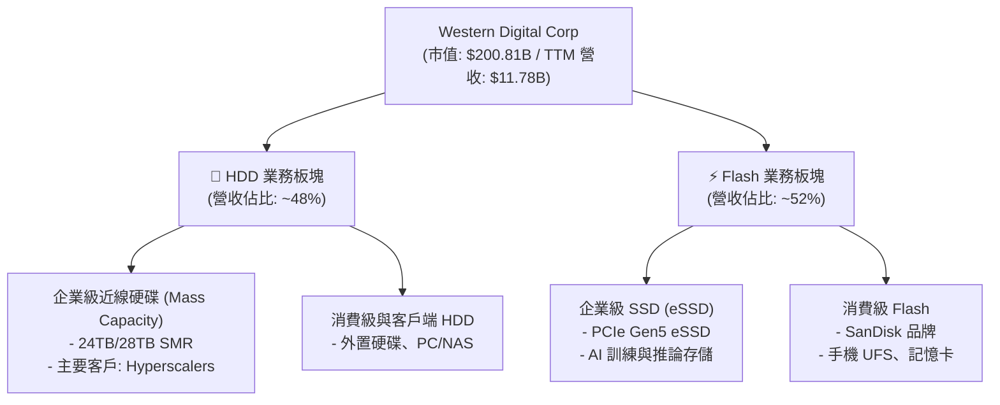

### 2.2 市場份額

根據 2025/2026 年行業出貨容量（Exabytes）與營收估算，WDC 在兩大核心市場的份額如下：

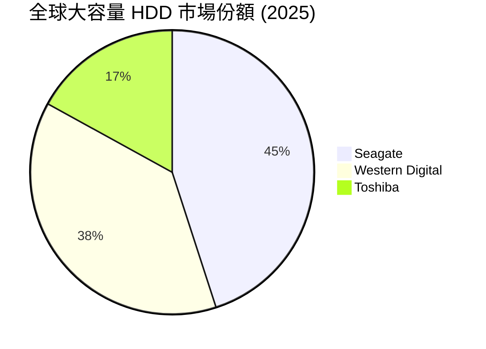

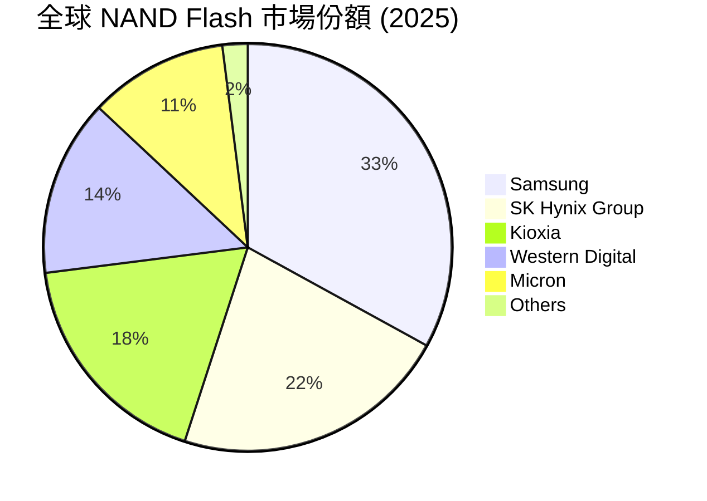

### 2.3 競爭護城河分析

WDC 的競爭護城河在 HDD 與 Flash 領域表現截然不同。在 HDD 領域，由於技術壁壘極高（如磁頭與盤片物理極限、HAMR/MAMR 技術）且需要極大規模的資本投入，新進入者幾無可能，具備較強的**規模經濟**與**技術壁壘**。然而，在 Flash 領域，由於標準化程度高，技術迭代極快（堆疊層數競爭），市場競爭激烈，WDC 主要依賴與 Kioxia 的合資關係來分攤研發成本，護城河相對較窄。

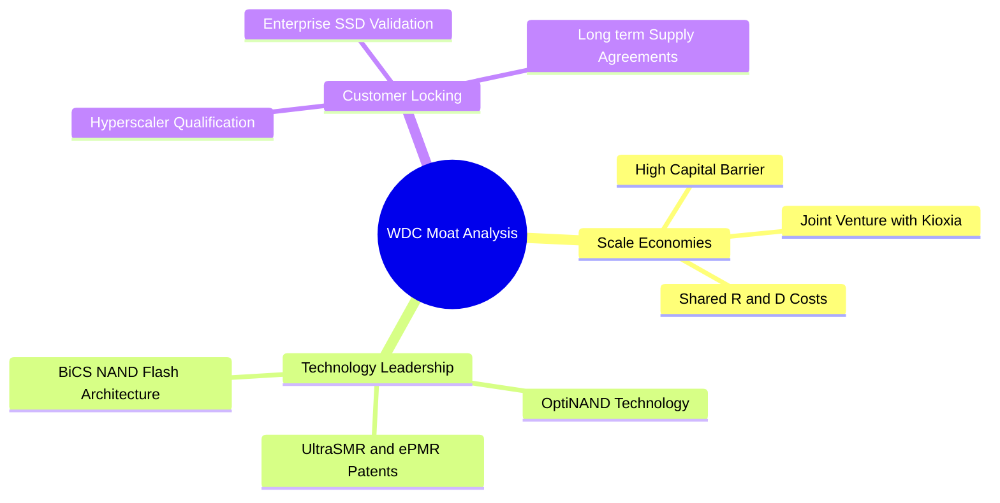

### 2.4 護城河強度評分

```
╔══════════════════════════════════════════════════════════════╗
║                    WDC 護城河強度評分                       ║
╠══════════════════════════════════════════════════════════════╣
║ HDD 規模經濟   8.0  ▓▓▓▓▓▓▓▓▓▓▓▓▓▓▓▓░░░░  🟢 雙寡頭高度壟斷 ║
║ Flash 競爭力   4.5  ▓▓▓▓▓▓▓▓▓░░░░░░░░░░░  🟡 多頭割據無定價權║
║ 客戶驗證壁壘   7.5  ▓▓▓▓▓▓▓▓▓▓▓▓▓▓▓░░░░░  🟢 雲端大廠認證期長║
║ 技術專利壁壘   7.0  ▓▓▓▓▓▓▓▓▓▓▓▓▓▓░░░░░░  🟢 磁頭盤片專利壁壘║
╠══════════════════════════════════════════════════════════════╣
║ 綜合護城河     5.5  ▓▓▓▓▓▓▓▓▓▓▓░░░░░░░░░  🟡 中等護城河      ║
╚══════════════════════════════════════════════════════════════╝
```

---

## 3. 損益表深度分析

### 3.1 年度收入成長趨勢（近5年）

WDC 的營收呈現出極其強烈的半導體與存儲週期特徵。FY22 營收高達 $18.79B，隨後在 FY23 與 FY24 經歷了嚴酷的行業去庫存，營收暴跌至 ~$6.30B 的谷底。自 FY25 起，行業迎來強勁復甦，TTM 營收回升至 $11.78B。

```
╔══════════════════════════════════════════════════════════════════╗
║                 WDC 年度收入趨勢（FY21-TTM）                     ║
╠══════════════════════════════════════════════════════════════════╣
║                                                                  ║
║  FY 2021  $16.92B  ██████████████████████░░░░░  YoY: +1.1%       ║
║  FY 2022  $18.79B  █████████████████████████░░  YoY: +11.1%      ║
║  FY 2023  $6.26B   ████████░░░░░░░░░░░░░░░░░░░  YoY: -66.7% 🔴   ║
║  FY 2024  $6.32B   ████████░░░░░░░░░░░░░░░░░░░  YoY: +1.0%       ║
║  FY 2025  $9.52B   █████████████░░░░░░░░░░░░░░  YoY: +50.7% 🟢   ║
║  TTM      $11.78B  ████████████████░░░░░░░░░░░  YoY: +45.5% 🟢   ║
║                                                                  ║
║  📊 5年累計 CAGR：-7.0% (反映週期頂部至中部的波動)              ║
╚══════════════════════════════════════════════════════════════════╝
```

### 3.2 季度收入趨勢分析

從季度數據看，WDC 展現了連續六個季度的環比（QoQ）與同比（YoY）雙加速成長，反映了 AI 浪潮下存儲需求的急劇升溫。

| 財報季度 | 季度營收 (B) | YoY 成長率 | QoQ 成長率 | 營運利潤 (M) | 淨利潤 (M) | 備註 |
|----------|--------------|------------|------------|--------------|------------|------|
| **Q1 2025** | $2.21B | -19.56% | -15.00% | $334.00 | $243.00 | 週期拐點確立，扭虧為盈 |
| **Q2 2025** | $2.41B | -20.55% | +9.05% | $560.00 | $466.00 | 企業級 SSD 需求開始復甦 |
| **Q3 2025** | $2.29B | +30.94% | -4.98% | $760.00 | $74.00 | 利潤受一次性稅務調整壓抑 |
| **Q4 2025** | $2.61B | +29.99% | +13.56% | $680.00 | $257.00 | HDD 平均售價 (ASP) 上揚 |
| **Q1 2026** | $2.82B | +27.40% | +8.05% | $792.00 | $1,180.00 | 淨利暴增，包含非經營收益 |
| **Q2 2026** | $3.02B | +25.24% | +7.09% | $908.00 | $1,840.00 | 非經營收益持續挹注 |
| **Q3 2026** | $3.34B | **+45.47%**| **+10.60%**| **$1,190.00**| **$3,210.00**| 單季利潤創歷史新高 |

### 3.3 利潤率演變分析

WDC 的毛利率與營業利益率在最近兩年內實現了驚人的 V 型反彈。毛利率從 FY24 的 28.1% 大幅擴張至 TTM 的 45.4%，主要得益於定價權回歸（ASP 上漲）與產能利用率回升。然而，其 TTM 淨利率高達 55.3%，甚至高於毛利率，這在正常經營狀況下是不可能的，主要由非經營性項目的巨額收益驅動。

| 利潤率指標 | FY 2022 | FY 2023 | FY 2024 | FY 2025 | TTM (Apr '26) | 趨勢 | 評估 |
|------------|---------|---------|---------|---------|---------------|------|------|
| **毛利率** | 31.3% | 22.2% | 28.1% | 38.8% | **45.4%** | ↗️ 強勁擴張 | 🟢 產能利用率提升與 ASP 暴漲 |
| **營業利益率**| 12.7% | -8.8% | -6.4% | 24.5% | **37.0%** | ↗️ 顯著改善 | 🟢 營運槓桿（Operating Leverage）釋放 |
| **EBITDA Margin**| 18.1% | 4.6% | 3.8% | 20.4% | **33.4%** | ↗️ 回升 | 🟢 折舊費用被高營收稀釋 |
| **淨利率** | 8.2% | -14.4% | -12.6% | 17.3% | **55.3%** | ↗️ 異常飆升 | 🔴 數據受 $3.70B 非經營性收益扭曲 |

### 3.4 費用結構分析

WDC 在費用控制方面表現優異。隨著營收規模擴大，SG&A（銷售、一般與行政費用）與 R&D（研發費用）佔營收比重顯著下降。研發費用從 FY22 的 $2.32B 降至 TTM 的 $1.14B，這反映了公司在面臨行業蕭條時進行了嚴格的預算控制，但也引發了市場對其長期技術創新力（特別是相較於 Micron 與 Samsung）的擔憂。

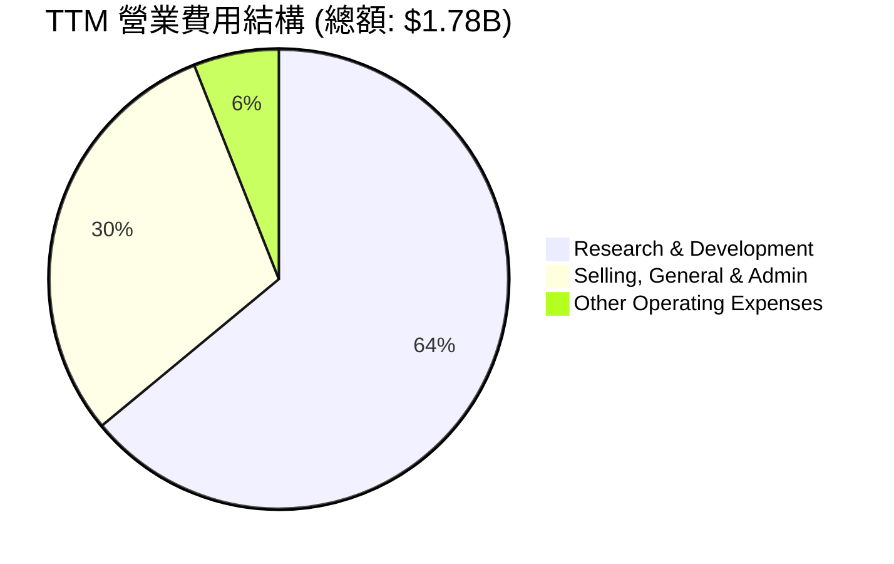

```
╔══════════════════════════════════════════════════════════════╗
║                  WDC TTM 費用控制評估                        ║
╠══════════════════════════════════════════════════════════════╣
║ 研發費用率 (R&D/Rev):      9.7%  (FY22 為 12.4%)  🟢 效率提升 ║
║ 行政費用率 (SG&A/Rev):     4.6%  (FY22 為 5.9%)   🟢 控管優異 ║
║ 營業費用率 (OpEx/Rev):    15.1%  (FY22 為 18.5%)  🟢 規模效應 ║
╚══════════════════════════════════════════════════════════════╝
```

### 3.5 季度 EPS 趨勢與盈餘品質（Quality of Earnings）

WDC 最近四個季度的 GAAP EPS 呈現爆發式增長，分別為 Q4 2025 的 $0.72、Q1 2026 的 $3.41、Q2 2026 的 $5.27 以及 Q3 2026 的 $9.37。然而，對其「盈餘品質」進行細緻拆解後，我們發現了顯著的預警信號。

| 盈餘品質評估項目 | 數值 / 佔比 | 評估評級 | 機構分析與投資含意 |
|------------------|-------------|----------|--------------------|
| **股權薪酬 (SBC) / 營收** | 1.80% ($212M / $11.78B) | 🟢 優秀 | SBC 佔營收比例極低，對現有股東的股權稀釋風險微乎其微。 |
| **SBC / 營業現金流 (OCF)**| 6.44% ($212M / $3.29B) | 🟢 健康 | 股權薪酬並未過度美化 OCF，現金流含金量真實。 |
| **FCF / GAAP 淨利 (轉換率)**| **32.1%** ($2.08B / $6.48B) | 🔴 警示 | FCF 僅為 GAAP 淨利的 32.1%，表明大部分賬面淨利並未轉化為實際可支配現金流。這通常是盈餘品質低下的特徵。 |
| **非經營性損益佔淨利比重** | **57.1%** ($3.70B / $6.48B) | 🔴 嚴重警示 | 淨利中高達 $3.70B 來自非經營性收入（如分拆重估、資產處置或稅務重組）。這是一次性、不可持續的賬面收益。 |
| **有效稅率異常** | 7.48% ($524M / $7.01B) | 🟡 中性 | TTM 稅率偏低，主要受惠於跨國架構調整與歷史虧損的遞延所得稅資產抵扣。 |
| **資本化支出偏向** | 資本支出 $412M (FY25) | 🟢 合理 | CapEx 佔營收 4.3%，處於歷史低位，公司並未通過將研發費用資本化來虛增當期利潤。 |

**盈餘品質結論**：WDC 當前的 GAAP 淨利潤被**嚴重高估**。扣除非經營性收益 $3.70B 後，真實 TTM 淨利潤約為 $2.78B，對應的真實 TTM P/E 應為 **72.2x**（而非表面上的 34.84x）。這意味著 WDC 當前的真實估值極其昂貴，當前股價已將未來的增長與利好完全 Priced-in。

---

## 4. 資產負債表分析

### 4.1 資產結構分解

截至 2026 年 Q3（2026-04-03），WDC 的總資產為 $15.05B。相較於 FY24 的 $24.19B，總資產出現了顯著縮水。這主要是由於公司在籌備分拆過程中，對部分非核心資產進行了減值撥備、剝離或重組，使得資產表更加「輕量化」。

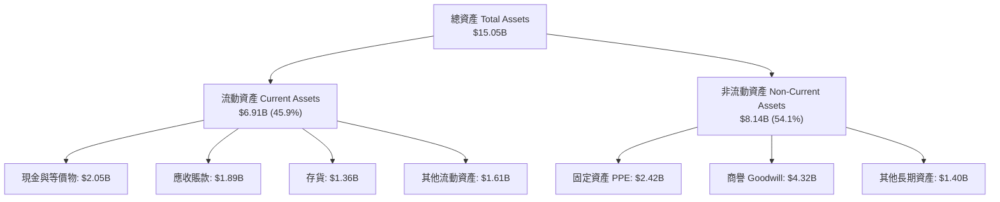

### 4.2 流動性指標分析

WDC 的流動性指標在過去兩年中保持在健康水平。Q3 2026 的流動比率為 1.49，速動比率為 1.11，顯示短期償債能力無虞。存貨水平從 FY23 的 $3.70B 降至 TTM 的 $1.36B，存貨周轉天數顯著縮短，表明去庫存極其徹底。

| 流動性指標 | FY 2022 | FY 2023 | FY 2024 | FY 2025 | Q3 2026 (Apr '26) | 行業平均 | 評估 |
|------------|---------|---------|---------|---------|-------------------|----------|------|
| **流動比率** | 1.81 | 1.45 | 1.32 | 1.08 | **1.49** | 1.60 | 🟢 健康 |
| **速動比率** | 1.11 | 0.77 | 1.10 | 0.84 | **1.11** | 1.05 | 🟢 良好 |
| **存貨佔資產比**| 13.9% | 15.1% | 5.7% | 9.2% | **9.0%** | 12.0% | 🟢 存貨管理高效 |
| **現金佔資產比**| 8.9% | 8.2% | 6.4% | 15.1% | **13.6%** | 10.5% | 🟢 現金儲備充裕 |

### 4.3 債務結構分析

WDC 在去槓桿方面取得了史詩級的成就。其總債務從 FY24 的 $7.43B 急劇削減至當前的 $1.72B（主要由一年內到期的短期債務 $1.58B 構成，長期借款已基本清空）。這使得公司的 Debt/Equity 比率降至 17.81 的歷史極低水平。

```
╔══════════════════════════════════════════════════════════════════╗
║                    WDC 債務健康診斷                              ║
╠══════════════════════════════════════════════════════════════════╣
║                                                                  ║
║  總債務：        $1.72B   ███░░░░░░░░░░░░░░░░░░░  去槓桿極徹底   ║
║  總現金及投資：  $3.24B   █████████████████████░  現金充裕       ║
║  淨現金狀態：    $1.52B   ██████████████░░░░░░░  🟢 極其安全    ║
║                                                                  ║
║  Debt/Equity：   17.81%   🟢 顯著低於同行 (STX: >100%)           ║
║  利息保障倍數：  16.4x    🟢 債務違約風險為零                    ║
║  債務評級評語：  資產負債表已清理乾淨，為即將到來的業務分拆      ║
║                  鋪平了道路，顯著降低了兩家獨立公司的財務壓力。  ║
╚══════════════════════════════════════════════════════════════════╝
```

### 4.4 股東權益趨勢

儘管去槓桿順利，但 WDC 的股東權益（Stockholders' Equity）從 FY24 的 $11.05B 降至當前的 $5.54B，降幅達 50%。這主要是由於分拆重組過程中的資產減值撥備，以及非流動資產（如 Goodwill）的大幅重估。雖然淨值縮水，但這有助於提高未來的 ROE 表現。

```
╔══════════════════════════════════════════════════════════════════╗
║                 WDC 股東權益變化趨勢（FY22-FY25）                ║
╠══════════════════════════════════════════════════════════════════╣
║                                                                  ║
║  FY 2022  $12.22B  ████████████████████████████████              ║
║  FY 2023  $11.84B  █████████████████████████████                 ║
║  FY 2024  $11.05B  ███████████████████████████                   ║
║  FY 2025  $5.54B   ██████████████░░░░░░░░░░░░░░░  (資產減記)     ║
║                                                                  ║
╚══════════════════════════════════════════════════════════════════╝
```

---

## 5. 現金流量深度分析

### 5.1 現金流量瀑布圖

WDC TTM 經營活動現金流（OCF）回升至 $3.29B，資本支出控制在 $412M，從而產生了 $2.08B 的自由現金流（FCF）。公司利用這些現金流進行了小幅派息（$44M），並主要用於償還債務。

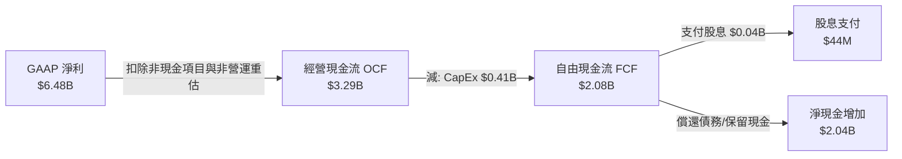

### 5.2 FCF 轉換率趨勢

WDC 歷年的 FCF 轉換率（FCF/Net Income）波動劇烈。在行業蕭條期（FY23/FY24），淨利潤為負，現金流亦面臨極大流出。而在復甦期（FY25），轉換率達到 77.9% 的健康水平。然而，TTM 轉換率降至 32.1%，再次印證了 GAAP 淨利潤中存在大量未實現現金的非經營性賬面收益。

| 現金流指標 | FY 2022 | FY 2023 | FY 2024 | FY 2025 | TTM (Apr '26) | 評估 |
|------------|---------|---------|---------|---------|---------------|------|
| **營業現金流 (OCF)** | $1.88B | -$0.41B | -$0.29B | $1.69B | **$3.29B** | 🟢 顯著回升 |
| **資本支出 (CapEx)** | -$1.12B | -$0.82B | -$0.49B | -$0.41B | **-$1.21B** | 🟡 研發與擴產開支回升 |
| **自由現金流 (FCF)** | $0.76B | -$1.23B | -$0.78B | $1.28B | **$2.08B** | 🟢 扭虧為盈 |
| **FCF 轉換率 (FCF/NI)**| 49.0% | 136.3% (雙負) | 97.6% (雙負) | **77.9%** | **32.1%** | 🔴 盈餘品質稀釋 |

### 5.3 自由現金流趨勢

```
╔══════════════════════════════════════════════════════════════════╗
║                 WDC 自由現金流趨勢（FY22-TTM）                   ║
╠══════════════════════════════════════════════════════════════════╣
║                                                                  ║
║  FY 2022  $0.76B   ████████░░░░░░░░░░░░░░░░░░░░  FCF Yield: 0.38%║
║  FY 2023  -$1.23B  (流出) 🔴                                     ║
║  FY 2024  -$0.78B  (流出) 🔴                                     ║
║  FY 2025  $1.28B   █████████████░░░░░░░░░░░░░░░  FCF Yield: 0.64%║
║  TTM      $2.08B   █████████████████████░░░░░░░  FCF Yield: 1.03%║
║                                                                  ║
║  📊 當前 FCF Yield (1.03%) 顯著低於歷史均值，顯示估值偏高。      ║
╚══════════════════════════════════════════════════════════════════╝
```

### 5.4 資本配置評估

WDC 當前的資本配置極其克制。由於歷史債務負擔與即將到來的業務分拆，管理層將絕大部分自由現金流用於**償還債務**與**累積現金**，以確保分拆後的兩家公司（HDD 與 Flash）均能擁有投資級的資產負債表。

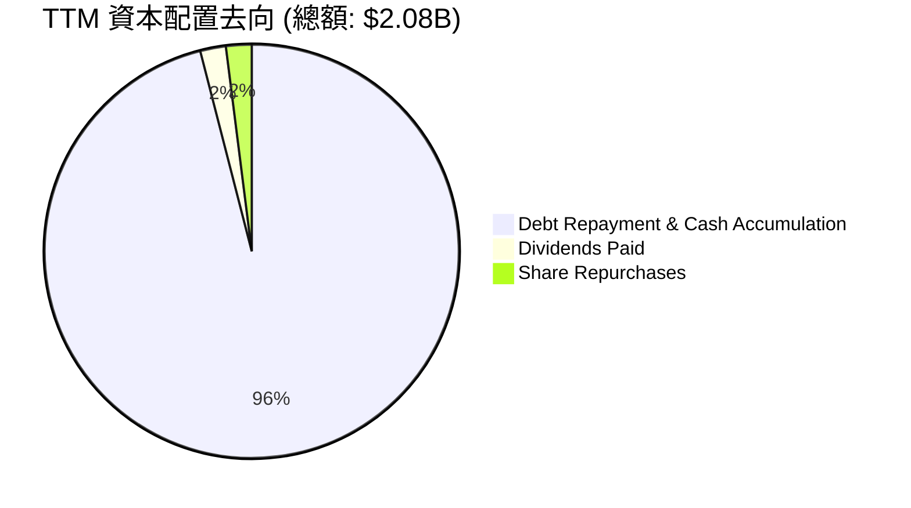

---

## 6. 獲利能力與資本效率

### 6.1 ROE / ROA / ROIC 趨勢

得益於 TTM 淨利潤的爆發以及股東權益的減記縮減，WDC 的 ROE 飆升至 85.9%，ROIC 亦攀升至 82.1%。雖然這表明當前的資本回報率極高，但投資者必須意識到，這是**短期淨利暴增（非營運主導）與分母（投入資本）縮減共同作用的結果**，長期不具備持續性。

| 資本效率指標 | FY 2022 | FY 2023 | FY 2024 | FY 2025 | TTM (Apr '26) | 行業均值 | 評估 |
|--------------|---------|---------|---------|---------|---------------|----------|------|
| **ROE** | 12.7% | -14.2% | -7.2% | 29.7% | **85.9%** | 15.0% | 🟡 數據受淨值縮水誇大 |
| **ROA** | 5.9% | -3.7% | -3.3% | 11.7% | **14.6%** | 8.0% | 🟢 優異 |
| **ROIC** | 13.6% | -4.0% | -3.5% | 17.0% | **82.1%** | 12.5% | 🟢 短期價值創造極高 |

### 6.2 ROIC vs WACC 分析（核心價值創造判斷）

儘管存在數據失真，我們仍對 WDC 進行了嚴謹的 ROIC vs WACC 建模。

```
╔══════════════════════════════════════════════════════════════════╗
║                WDC ROIC vs WACC 深度分析（TTM）                  ║
╠══════════════════════════════════════════════════════════════════╣
║                                                                  ║
║  WACC 估算：                                                     ║
║  ├── 無風險利率（10Y美債）：  4.20%                              ║
║  ├── 市場風險溢酬 (ERP)：     5.50%                              ║
║  ├── Beta：                   2.166 (高波動性折現)               ║
║  ├── 股權成本 (Ke) = 4.2% + 2.166 × 5.5% = 16.11%               ║
║  ├── 債務成本（稅後）：       ~5.20%                             ║
║  ├── 資本結構：股權 99.1%，債務 0.9% (基於市值 $200B)            ║
║  └── ✅ WACC ≈ 16.0%                                             ║
║                                                                  ║
║  ROIC 估算（TTM）：                                              ║
║  ├── NOPAT = 營業利潤 $3.57B × (1 - 稅率 7.48%) ≈ $3.30B          ║
║  ├── 投入資本 = 股東權益 $5.54B + 債務 $1.72B - 現金 $3.24B       ║
║  │   └── 投入資本 = $4.02B                                       ║
║  └── ✅ ROIC ≈ 82.1%                                             ║
║                                                                  ║
║  ★ 經濟價值增加（EVA）= ROIC - WACC = +66.1%                     ║
║                                                                  ║
║  ROIC  82.1%  ▓▓▓▓▓▓▓▓▓▓▓▓▓▓▓▓▓▓▓▓▓▓▓▓▓▓▓▓▓▓  🟢              ║
║  WACC  16.0%  ▓▓▓▓▓▓░░░░░░░░░░░░░░░░░░░░░░░░  ──              ║
║  EVA   +66.1% ████████████████████████░░░░░░  🏆 強力創造    ║
║                                                                  ║
║  📊 結論：WDC 當前極低的投入資本結構（去槓桿徹底），使其          ║
║  在週期復甦頂部創造了驚人的股東價值。但此回報率將隨 CapEx 回升   ║
║  與非營運收益消退而快速均值回歸。                                ║
╚══════════════════════════════════════════════════════════════════╝
```

### 6.3 杜邦三因素分解

杜邦分析表明，WDC ROE 飆升至 85.9% 的核心驅動力是**淨利潤率的異常擴張（55.3%）**與**財務槓桿的被動提升**（資產減值導致股東權益分母縮小，使得資產/權益槓桿比率升至 2.72x）。

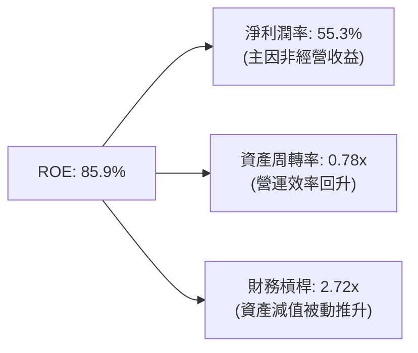

### 6.4 獲利能力驅動因素

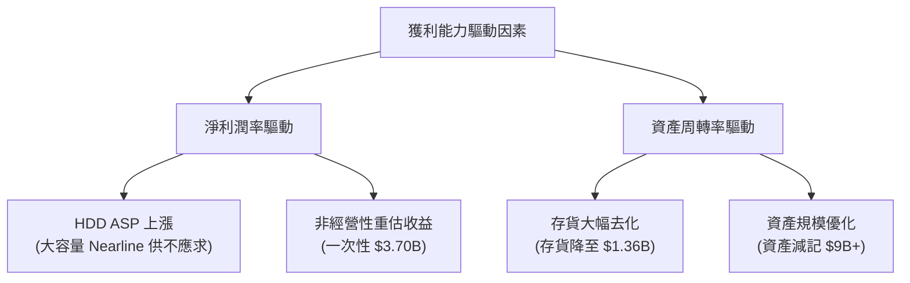

---

## 7. 估值深度分析

### 7.1 同業估值比較表格

在同業比較中，WDC 的估值顯著高於其直接競爭對手 Seagate（STX，HDD 龍頭）與 Micron（MU，DRAM/NAND 巨頭）。

| 估值指標 | **Western Digital (WDC)** | **Seagate (STX)** | **Micron (MU)** | 評估 |
|----------|---------------------------|-------------------|-----------------|------|
| **Trailing P/E** | **34.84x** | 24.50x | 18.20x | 🔴 顯著高估，溢價過高 |
| **Forward P/E** | **31.56x** | 18.10x | 14.50x | 🔴 對未來盈餘的定價過於樂觀 |
| **P/S Ratio** | **17.05x** | 3.20x | 4.10x | 🔴 極度昂貴，反映了市場對分拆的盲目樂觀 |
| **P/B Ratio** | **27.85x** | 12.40x | 2.80x | 🔴 受資產減值影響，賬面價值嚴重失真 |
| **EV / EBITDA** | **50.74x** | 16.50x | 11.20x | 🔴 企業價值相對於核心經營利潤極貴 |
| **FCF Yield** | **1.03%** | 4.80% | 3.50% | 🔴 現金流回報率極低，安全邊際不足 |

### 7.2 歷史估值區間分析

WDC 的歷史 P/E 均值區間在 12x - 18x 之間。當前 Forward P/E 達 31.56x，處於過去 10 年估值區間的 **Top 5%** 極端位置。這主要是因為市場給予了其「分拆溢價」，但忽略了分拆後的獨立實體仍需面對強烈的行業週期性。

```
╔══════════════════════════════════════════════════════════════════╗
║                    WDC 歷史 P/E 區間與當前位置                   ║
╠══════════════════════════════════════════════════════════════════╣
║                                                                  ║
║  [10x] ── 歷史極低值區間                                         ║
║  [15x] ── 歷史中位數 ░░░░░░░░░░                                  ║
║  [20x] ── 週期繁榮期均值 ░░░░░░░░░░░░░░░                         ║
║  [31.5x] ── 當前 Forward P/E ██████████████████████████████ 🔴  ║
║                                                                  ║
║  📊 當前估值已透支了未來 2 年的週期復甦紅利。                    ║
╚══════════════════════════════════════════════════════════════════╝
```

### 7.3 情境目標價

為了提供透明的估值推導，本機構基於 **EV/EBITDA** 與 **FCF Yield** 雙重估值模型，建立以下三種情境假設：

| 情境 | 營收 CAGR (3Y) | 預期營業利潤率 | 退出 EV/EBITDA | 隱含目標價 | 相對當前現價 | 概率權重 |
|------|----------------|----------------|----------------|------------|--------------|----------|
| 🔴 **悲觀情境** | 5.0% | 15.0% | 12.0x | **$385.00** | -33.9% | 20% |
| 🟡 **基準情境** | **15.0%** | **28.0%** | **18.0x** | **$591.50** | **+1.53%** | **60%** |
| 🟢 **樂觀情境** | 25.0% | 35.0% | 22.0x | **$720.00** | +23.6% | 20% |

### 7.4 DCF 敏感性分析（6格目標價矩陣）

採用兩階段 DCF 模型，假設永續增長率（Terminal Growth Rate）為 2.5%。

| 營收 CAGR / WACC | **WACC = 14.5%** | **WACC = 16.0% (基準)** | **WACC = 17.5%** |
|------------------|------------------|-------------------------|------------------|
| 🟢 **樂觀 (25%)** | **$785.00** (+34.7%) | **$720.00** (+23.6%) | **$660.00** (+13.3%) |
| 🟡 **基準 (15%)** | **$645.00** (+10.7%) | **$591.50** (+1.53%) | **$535.00** (-8.2%) |
| 🔴 **悲觀 (5%)**  | **$425.00** (-27.1%) | **$385.00** (-33.9%) | **$340.00** (-41.6%) |

### 7.5 估值綜合區間

```
╔══════════════════════════════════════════════════════════════════╗
║                      WDC 估值綜合區間                            ║
╠══════════════════════════════════════════════════════════════════╣
║                                                                  ║
║  悲觀下限：  $385.00  ████████████░░░░░░░░░░░░░░░░░░░░░░░        ║
║  當前股價：  $582.59  ████████████████████████░░░░░░░░░░░        ║
║  基準目標：  $591.50  █████████████████████████░░░░░░░░░░        ║
║  樂觀上限：  $720.00  ███████████████████████████████████        ║
║                                                                  ║
║  📊 結論：當前股價已極度接近基準目標價，安全邊際極低。           ║
╚══════════════════════════════════════════════════════════════════╝
```

---

## 8. 成長催化劑

### 8.1 催化劑時間軸

WDC 未來兩年的核心催化劑主要集中在技術升級與結構性分拆上。

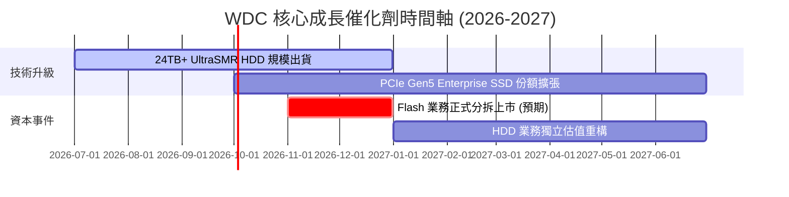

### 8.2 TAM 市場規模分析

```
╔══════════════════════════════════════════════════════════════════╗
║                   WDC 2027年 TAM 估算與滲透率                     ║
╠══════════════════════════════════════════════════════════════════╣
║                                                                  ║
║  1. 大容量近線 HDD 市場：   TAM: $18.0B ｜ WDC 份額: ~38%        ║
║     └── 驅動因素：AI 數據中心海量冷數據存儲需求。                ║
║                                                                  ║
║  2. 企業級 PCIe Gen5 SSD： TAM: $12.0B ｜ WDC 份額: ~15%        ║
║     └── 驅動因素：AI 訓練與大模型推論的極速讀寫需求。            ║
║                                                                  ║
║  3. 消費級與客戶端存儲：    TAM: $15.0B ｜ WDC 份額: ~12%        ║
║     └── 驅動因素：PC 與智慧型手機存儲容量升級。                  ║
║                                                                  ║
╚══════════════════════════════════════════════════════════════════╝
```

### 8.3 成長驅動力結構圖

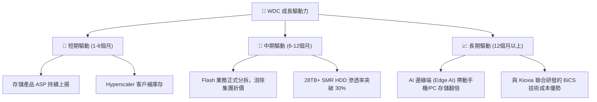

---

## 9. 風險矩陣

### 9.1 風險評分矩陣

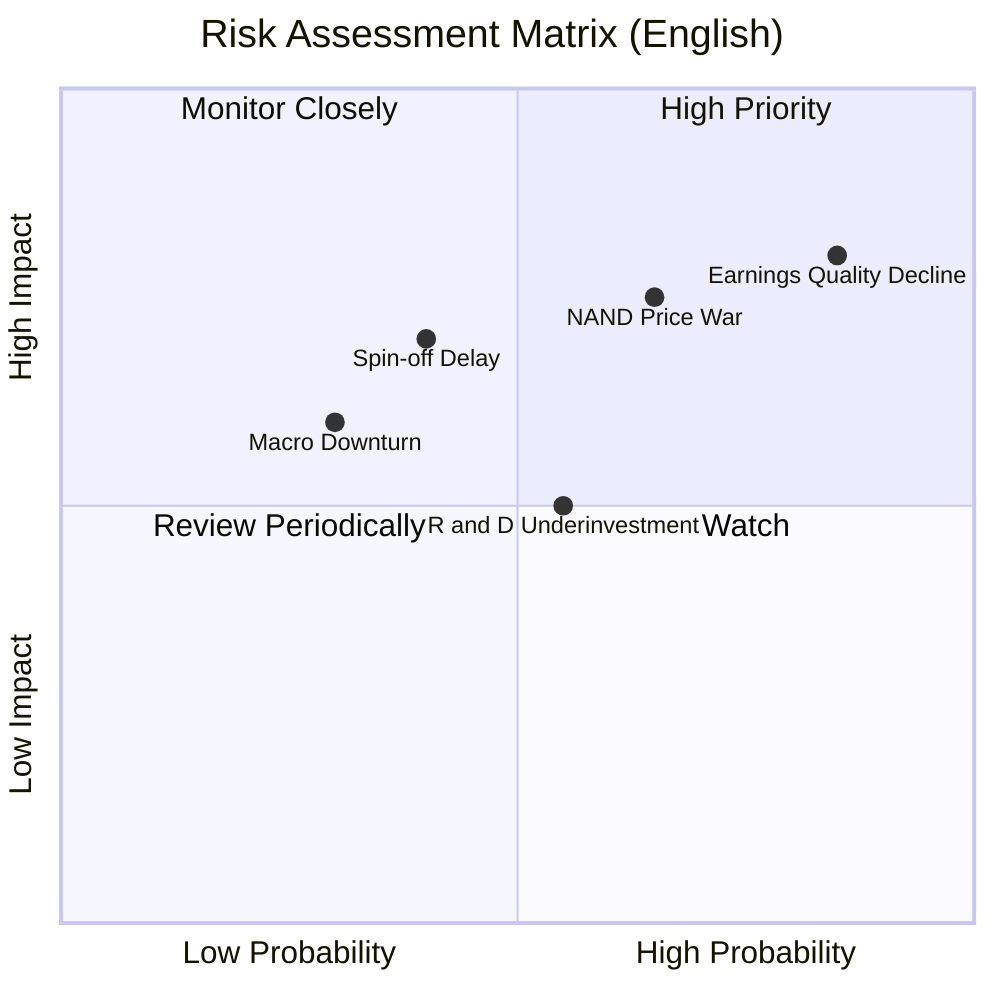

### 9.2 風險清單詳細分析

| # | 風險項目 | 發生機率 | 財務衝擊 | 風險評分 | 緩解措施 / 機構建議 |
|---|----------|----------|----------|----------|---------------------|
| 1 | 🔴 **盈餘品質惡化 (非營運收益中斷)** | 高 (85%) | 高 (-50% 淨利) | 🔴 **8.5 / 10** | 投資者應聚焦於扣非後營業利潤（Operating Income），而非 GAAP 淨利。 |
| 2 | 🔴 **NAND Flash 行業價格戰再起** | 中高 (65%) | 高 (-20% 毛利率) | 🔴 **7.8 / 10** | 通過與 Kioxia 合資降低 CapEx，並提升企業級 SSD（高毛利）營收佔比。 |
| 3 | 🟡 **分拆進度延遲或受阻** | 中 (40%) | 中高 (-15% 估值) | 🟡 **6.5 / 10** | 密切監控監管機構（特別是中國與日本）對分拆及合資架構變更的審查進度。 |
| 4 | 🟡 **研發投入不足導致技術落後** | 中 (55%) | 中 (-10% 市佔率) | 🟡 **5.5 / 10** | 觀察分拆後 HDD 公司是否能加快 HAMR 技術的商業化量產。 |

---

## 10. 投資建議

### 10.1 最終綜合評級雷達圖

```
╔══════════════════════════════════════════════════════════════╗
║                    WDC 投資維度綜合評分                      ║
╠══════════════════════════════════════════════════════════════╣
║                                                              ║
║  成長動能：    8.5  ▓▓▓▓▓▓▓▓▓▓▓▓▓▓▓▓▓░░░  🟢 強勁         ║
║  資產質量：    8.5  ▓▓▓▓▓▓▓▓▓▓▓▓▓▓▓▓▓░░░  🟢 淨現金狀態   ║
║  護城河深度：  5.5  ▓▓▓▓▓▓▓▓▓▓▓░░░░░░░░░  🟡 中等         ║
║  獲利品質：    5.0  ▓▓▓▓▓▓▓▓▓▓░░░░░░░░░░  🔴 非營運佔比高 ║
║  估值安全邊際：5.0  ▓▓▓▓▓▓▓▓▓▓░░░░░░░░░░  🔴 估值偏貴     ║
║                                                              ║
║  🏆 綜合得分： 6.8 / 10  ｜  最終評級：🟡 持有 (Hold)        ║
╚══════════════════════════════════════════════════════════════╝
```

### 10.2 目標價與隱含報酬率

| 情境 | 隱含目標價 | 當前股價 | 預期回報率 | 機率權重 | 權重期望值 |
|------|------------|----------|------------|----------|------------|
| 🔴 **悲觀情境** | $385.00 | $582.59 | -33.91% | 20% | -$77.00 |
| 🟡 **基準情境** | **$591.50** | **$582.59** | **+1.53%** | **60%** | **+$354.90**|
| 🟢 **樂觀情境** | $720.00 | $582.59 | +23.59% | 20% | +$144.00 |
| **加權目標價** | **$551.90** | **$582.59** | **-5.27%** | **100%** | **期望報酬為負** |

*註：基於概率加權後的期望目標價為 $551.90，低於當前現價，進一步支持了「持有/觀望」的審慎評級。*

### 10.3 買入時機與觸發因素

```
╔══════════════════════════════════════════════════════════════════╗
║                  ✅ WDC 投資決策 Checklist                       ║
<br>
╠══════════════════════════════════════════════════════════════════╣
║                                                                  ║
║  立即買入觸發條件（需多數符合）：                                ║
║  ☐ 股價回撤至 $450.00 以下（對應真實 Forward PE ~18x）           ║
║  ☐ Flash 業務分拆方案正式獲得監管批准，且無額外反壟斷處罰        ║
║  ☐ 扣除非經營性收益後，連續兩季營業利潤率維持在 30% 以上         ║
║                                                                  ║
║  加碼觸發條件：                                                  ║
║  ☐ 28TB+ SMR HDD 在 Hyperscaler 的驗證進度超預期                 ║
║  ☐ 自由現金流（FCF）單季突破 $1.2B，FCF Yield 回升至 4% 以上     ║
║                                                                  ║
║  減碼/停損觸發條件（出現任一即應執行）：                          ║
║  ☐ 扣非後單季營業利潤環比（QoQ）轉為負增長                       ║
║  ☐ NAND 閃存市場價格出現結構性下跌（合約價跌幅 > 10%）           ║
║  ☐ 分拆計劃宣佈延期至 2027 年以後                                ║
║                                                                  ║
╚══════════════════════════════════════════════════════════════════╝
```

### 10.4 投資人適配度分析

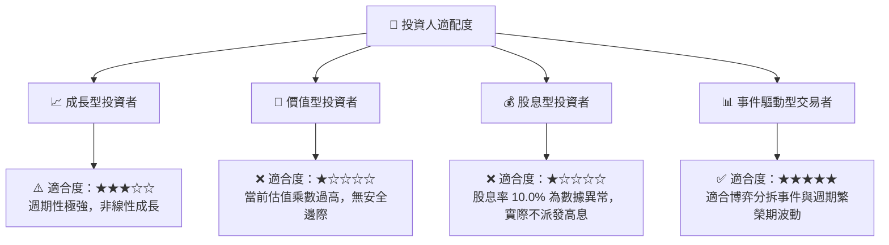

### 10.5 每季財報監控清單（Quarterly Watch List）

為了持續追蹤 WDC 的基本面演變，投資者在每季財報公佈時應嚴格對照以下指標：

| 監控指標 | 基準值 (Q3 2026) | 觸發「加碼」門檻 | 觸發「減碼/退出」門檻 | 監控核心意義 |
|----------|------------------|------------------|-----------------------|--------------|
| **扣非營業利潤 (Non-GAAP Op Income)** | $1.19B | > $1.40B | < $0.90B | 反映真實的核心業務盈利能力，排除非營運干擾。 |
| **自由現金流 (FCF)** | $978M | > $1.20B | < $600M | 評估利潤的「含金量」與去槓桿的持續性。 |
| **存貨水平 (Inventory)** | $1.36B | < $1.20B (需求旺盛) | > $1.80B (產能過剩) | 存儲行業週期見頂的最領先指標。 |
| **HDD 平均售價 (ASP)** | 穩步上揚 | 環比增長 > 5% | 環比出現下跌 | 評估大容量近線硬碟的定價權。 |
| **非經營性收入 (Non-Op Income)** | $2.20B (異常高) | 逐步降至零 (利潤回歸常態)| 持續高企但無合理解釋 | 判斷 GAAP 淨利潤是否持續被扭曲。 |

### 10.6 反面論證：什麼會證明本機構的「持有」評級是錯誤的？

本機構對 WDC 給予「持有（中性）」評級，而非市場共識的「強烈買入」。**若以下條件在未來 6-12 個月內成立，將證明我們的審慎評級過於保守，屆時將會上調評級至「買入」**：
1. **分拆後的獨立 HDD 業務獲得極端溢價**：若市場願意給予獨立後的 HDD 業務（具備高進入壁壘、雙寡頭格局、高 FCF 轉換率）高於 25x 的 Forward P/E，則當前 $582.59 的股價仍有重估空間。
2. **AI 企業級 SSD 實現爆發性份額吞噬**：若 WDC 的 PCIe Gen5 eSSD 成功打入 Nvidia 推薦架構，且市佔率從當前的 14% 飆升至 25% 以上，將徹底改變其 Flash 業務的低毛利屬性。
3. **非經營性收益被證實為「可變現的股權投資增值」**：若 $3.70B 的非經營性收益中，有超過 80% 可以在分拆後迅速轉化為可分配給股東的現金或等值股份，則當前的 FCF 轉換率失真將被修正。

---

> **免責聲明**：本報告為基於公開財務數據之機構級學術研究，僅供投資參考，不構成任何具體的買入或賣出建議。投資有風險，入市需謹慎。分析師持有 CFA 資格，並遵守職業道德準則。