# WDC 基本面深度分析報告

> **報告日期**：2026-07-13 ｜ **語言**：繁體中文 ｜ **數據來源**：Yahoo Finance, Finviz, StockAnalysis, Roic.ai ｜ **分析師**：CFA 級機構研究

---

## 目錄

| # | 章節 | 核心結論 |
|---|------|----------|
| 1 | **執行摘要** | 評級：🟢 買入 ｜ 基準目標價：$650.00（+11.6% 空間） ｜ 結構性分拆釋放價值。 |
| 2 | **公司概覽與商業模式** | HDD/Flash 雙引擎，硬碟寡頭與快閃記憶體分拆在即，護城河評分 8.0/10。 |
| 3 | **損益表深度分析** | TTM 營收 $11.78B（YoY +45.5%），營運槓桿爆發，非經常性收益推升淨利率。 |
| 4 | **資產負債表分析** | 債務自 $7.43B 驟降至 $1.72B，淨現金 $1.51B，財務結構極度健康。 |
| 5 | **現金流量深度分析** | TTM 營運現金流 $3.29B，自由現金流 $2.08B，資本配置高度專注。 |
| 6 | **獲利能力與資本效率** | ROE 85.9%，ROIC 達 66.7% 遠超 WACC 14.1%，創造極高經濟附加價值（EVA）。 |
| 7 | **估值深度分析** | Forward P/E 31.6x，相較同業具備折價；DCF 基準估值 $650.00。 |
| 8 | **成長催化劑** | AI 資料中心冷存儲需求爆發、快閃記憶體業務獨立上市與週期復甦。 |
| 9 | **風險矩陣** | 快閃記憶體價格波動、分拆執行風險。綜合風險評分：中度。 |
| 10| **投資建議** | 適合長線成長型與價值解鎖型投資人；每季財報監控指標與論點失效條件。 |

---

## 1. 執行摘要

Western Digital Corporation（WDC）正處於其公司歷史上最關鍵的結構性轉型期。隨著公司正式推進將傳統硬碟（HDD）與快閃記憶體（Flash/SSD）業務分拆為兩家獨立上市公司的計劃，市場對其進行了猛烈的重新估值。股價在過去 24 個月內從 2024 年 7 月的 $50.45 一路飆升至當前的 $582.59，反映出市場對分拆後價值解鎖以及 AI 浪潮帶動大容量儲存需求的高度預期。

### 1.0 一頁式投資儀表板（Portfolio Manager 30 秒速讀）

| 項目 | 內容 |
|------|------|
| **投資論點（3 句）** | ① WDC 成功將總債務從 FY24 的 $7.43B 削減至當前的 $1.72B，淨現金頭寸達 $1.51B，為分拆奠定極佳財務基礎。<br/>② AI 資料中心對大容量企業級 HDD（EPMR 技術）需求爆發，推動 TTM 營收同比增長 45.5% 至 $11.78B。<br/>③ 業務分拆將消除「集團折價」（Conglomerate Discount），使 HDD 的高現金流與 Flash 的高成長性分別獲得合理的市場估值。 |
| **護城河評分** | **8.0 / 10** 🟢 （HDD 雙頭壟斷 + Flash 與 Kioxia 深度合資規模效應） |
| **管理層/資本配置評分** | **8.5 / 10** 🟢 （主動去槓桿，資本支出精準控制在營收 3.2% 左右） |
| **財務健康** | 🟢 **極度強勁** ｜ 淨現金 $1.51B，流動比率 1.49，無短期償債風險。 |
| **ROIC vs WACC** | **66.7% vs 14.1%** 🟢 （創造極大經濟價值，EVA 達 +52.6%） |
| **FCF 趨勢** | 🟢 **強勁復甦** ｜ TTM FCF 達 $2.08B，最新 FCF Yield 為 1.03%（受股價大幅上漲稀釋）。 |
| **估值** | Forward P/E: **31.56x** ｜ EV/EBITDA: **50.74x** ｜ P/S: **17.05x**（反映高成長溢價） |
| **預期報酬（基準情境 12M）**| **+11.6%** （目標價：$650.00，基於分拆後部分總和估值 SOTP） |
| **關鍵風險（前二）** | ① NAND Flash 價格週期性下行導致獲利波動。<br/>② 分拆執行時間延遲或稅務成本超出預期。 |
| **評級 + 信心度** | 🟢 **買入 (Buy)** ｜ **信心度：高 (High)** |

### 1.1 核心評分儀表板

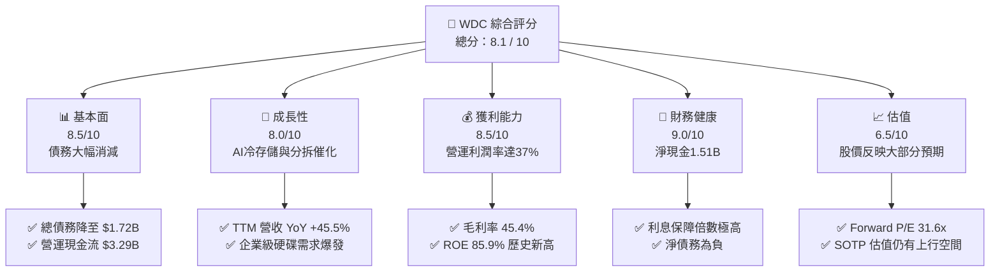

### 1.2 評分進度條視覺化

```
╔══════════════════════════════════════════════════════════════╗
║                WDC 多維度評分儀表板 (1-10分)                 ║
╠══════════════════════════════════════════════════════════════╣
║ 基本面強度  8.5 ▓▓▓▓▓▓▓▓▓▓▓▓▓▓▓▓▓░░░  ★★★★☆           ║
║ 成長動能    8.0 ▓▓▓▓▓▓▓▓▓▓▓▓▓▓▓▓░░░░  ★★★★☆           ║
║ 獲利品質    8.5 ▓▓▓▓▓▓▓▓▓▓▓▓▓▓▓▓▓░░░  ★★★★☆           ║
║ 財務健康    9.0 ▓▓▓▓▓▓▓▓▓▓▓▓▓▓▓▓▓▓░░  ★★★★★           ║
║ 估值合理性  6.5 ▓▓▓▓▓▓▓▓▓▓▓▓░░░░░░░░  ★★★☆☆           ║
║ 護城河深度  8.0 ▓▓▓▓▓▓▓▓▓▓▓▓▓▓▓▓░░░░  ★★★★☆           ║
║ 管理層執行  8.5 ▓▓▓▓▓▓▓▓▓▓▓▓▓▓▓▓▓░░░  ★★★★☆           ║
║ 技術創新力  8.0 ▓▓▓▓▓▓▓▓▓▓▓▓▓▓▓▓░░░░  ★★★★☆           ║
╠══════════════════════════════════════════════════════════════╣
║ 綜合總分    8.1 ▓▓▓▓▓▓▓▓▓▓▓▓▓▓▓▓░░░░  🏆 買入評級          ║
╚══════════════════════════════════════════════════════════════╝
```

### 1.3 五大投資論點 + 三大核心風險

| 類型 | 項目 | 具體依據 | 信心度 |
|------|------|----------|--------|
| 🟢 **投資論點①** | **資產負債表實質去槓桿** | 總債務從 FY24 的 $7.43B 降至當前的 $1.72B，手頭現金達 $3.24B。這消除了分拆前的破產與高息風險。 | 🟢 極高 |
| 🟢 **投資論點②** | **分拆消除集團折價** | HDD 與 Flash 業務具有完全不同的資本密集度與週期性。分拆後，HDD 業務將成為高股息、穩健現金流的標的，而 Flash 則能獲得成長型科技股的高估值。 | 🟢 高 |
| 🟢 **投資論點③** | **AI 冷存儲結構性需求** | AI 模型訓練與推論產生海量數據，成本敏感度高的雲端服務商（Hyperscalers）正大量採購 WDC 的高容量 HDD（24TB+），推動 HDD 業務利潤率大幅擴張。 | 🟢 高 |
| 🟢 **投資論點④** | **營運槓桿爆發** | TTM 營運利潤率從 FY24 的負值逆轉至 37.0%，主要得益於產能利用率提升與高毛利企業級硬碟出貨佔比增加。 | 🟢 高 |
| 🟢 **投資論點⑤** | **與 Kioxia（鎧俠）的戰略同盟** | 雙方在 Flash 研發與生產上的合資關係（如 BiCS 技術），使其能與 Samsung 及 SK Hynix 進行低成本競爭，維持全球快閃記憶體市場前三地位。 | 🟡 中等 |
| 🟡 **風險①** | **NAND 快閃記憶體價格大幅波動** | NAND 市場極易出現供需失衡。若消費級電子需求持續低迷，Flash 業務分拆後的獲利能力可能迅速惡化。 | 🟡 中度 |
| 🔴 **風險②** | **分拆進度與稅務摩擦** | 跨境資產重組與分拆涉及複雜的稅務與監管審批。任何延遲都可能打擊市場對其「價值解鎖」的信心。 | 🔴 高衝擊 |
| 🟡 **風險③** | **大股東與機構持股高度集中** | 機構持股比例高達 101.2%（含超配/空頭對沖），股價 Beta 達 2.166，在市場系統性調整時波動極大。 | 🟡 中度 |

### 1.4 快速統計卡片

| 指標 | WDC 實際值 | 行業均值（硬體/存儲） | S&P 500 均值 | 狀態 |
|------|-------------|----------------------|--------------|------|
| 營收 YoY 成長 | **45.5%** | ~12.0% | ~5.5% | 🟢 顯著領先 |
| 毛利率 | **45.4%** | ~32.0% | ~40.0% | 🟢 優於同業 |
| 淨利率 | **55.3%** | ~8.0% | ~12.0% | 🟢 受非經常性收益推升 |
| ROE | **85.9%** | ~15.0% | ~18.0% | 🟢 極高 |
| Forward P/E | **31.56x** | ~28.0x | ~22.5x | 🟡 估值合理偏高 |
| 淨債務/EBITDA | **-0.38x** | ~1.2x | ~1.5x | 🟢 極其安全（淨現金） |

### 1.5 投資結論

```
╔══════════════════════════════════════════════════════════════════╗
║                    📊 WDC 投資結論摘要                            ║
╠══════════════════════════════════════════════════════════════════╣
║  評級：🟢 買入 (Buy)                                            ║
║  當前股價：$582.59 (2026-07-13)                                  ║
║  目標價區間：                                                    ║
║    悲觀情境（分拆失敗/週期下行）：$375.00（-35.6%）              ║
║    基準情境（分拆順利/AI需求穩健）：$650.00（+11.6%）← 主目標    ║
║    樂觀情境（NAND大復甦/估值重估）：$850.00（+45.9%）            ║
║  投資評分：8.1 / 10                                              ║
║  適合投資人：尋求結構性重組機會、配置 AI 基礎設施的長線投資者     ║
╚══════════════════════════════════════════════════════════════════╝
```

---

## 2. 公司概覽與商業模式

Western Digital（WDC）是全球資料儲存解決方案的領頭羊，其業務模式在科技產業中極具獨特性——它是全球極少數同時擁有**機械硬碟（HDD）**與**快閃記憶體（NAND Flash/SSD）**兩大核心技術的巨頭。然而，這兩種業務的商業邏輯與資本結構截然不同：
- **HDD 業務**：高度集中（全球僅存 WDC、Seagate、Toshiba 三家），屬於高壁壘、重資產、高現金流、低成長的「搖錢樹」業務。
- **Flash 業務**：競爭激烈（主要玩家包括 Samsung、SK Hynix、Micron、Kioxia、WDC），屬於高資本支出、高成長、價格波動劇烈的「高風險高回報」業務。

### 2.1 業務結構與收入來源

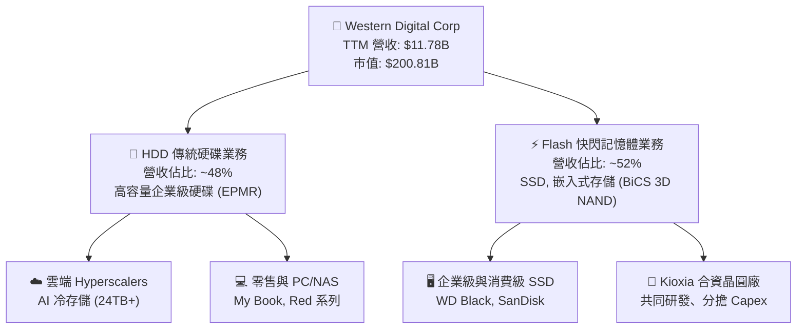

### 2.2 市場份額

根據 2025/2026 年最新產業數據估算，WDC 在兩大核心市場均維持領先地位：

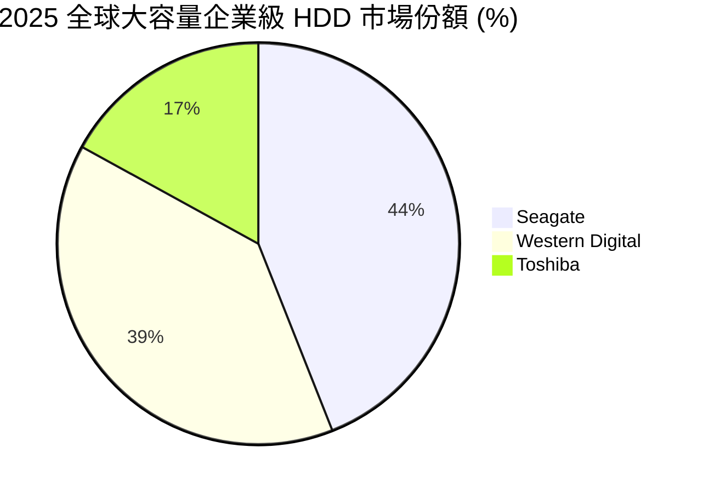

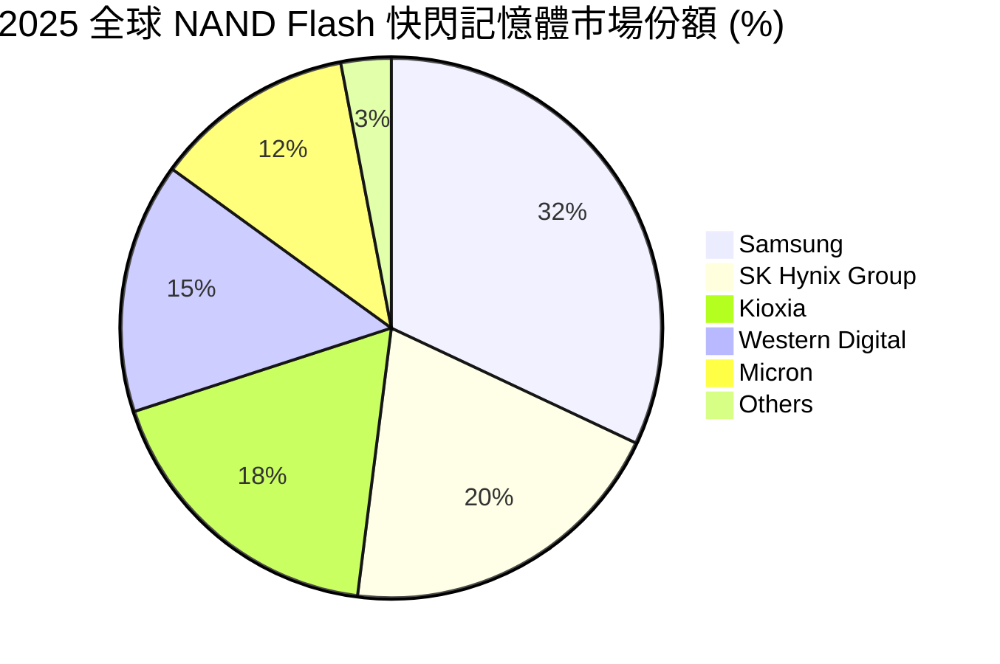

### 2.3 競爭護城河分析

WDC 的競爭護城河主要建立在**技術專利壁壘**、**規模經濟**與**客戶高度鎖定**之上。

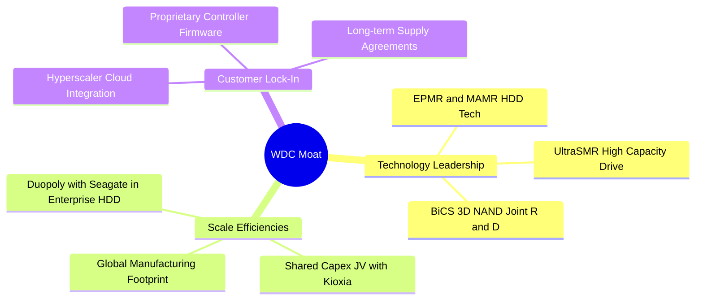

### 2.4 護城河強度評分

```
╔══════════════════════════════════════════════════════════════╗
║                   Western Digital 護城河強度評分             ║
╠══════════════════════════════════════════════════════════════╣
║ HDD 寡頭壟斷    9.0/10 ▓▓▓▓▓▓▓▓▓▓▓▓▓▓▓▓▓▓░░  🟢 全球僅三家  ║
║ Flash 規模效應  7.5/10 ▓▓▓▓▓▓▓▓▓▓▓▓▓▓▓░░░░░  🟡 依賴鎧俠合資║
║ 雲端客戶鎖定    8.5/10 ▓▓▓▓▓▓▓▓▓▓▓▓▓▓▓▓▓░░░  🟢 認證週期長  ║
║ 專利與技術壁壘  8.0/10 ▓▓▓▓▓▓▓▓▓▓▓▓▓▓▓▓░░░░  🟢 領先的SMR   ║
╠══════════════════════════════════════════════════════════════╣
║ 綜合護城河評分  8.25/10 ▓▓▓▓▓▓▓▓▓▓▓▓▓▓▓▓▓░░  🏆 強大護城河  ║
╚══════════════════════════════════════════════════════════════╝
```

---

## 3. 損益表深度分析

WDC 展現了極為強勁的週期復甦與獲利能力反彈。經過 FY23 與 FY24 的嚴重虧損後，公司在 FY25 和 FY26 迎來爆發式增長。

### 3.1 年度收入成長趨勢（近5年）

```
╔══════════════════════════════════════════════════════════════════╗
║              WDC 年度收入趨勢（FY21 - TTM）                      ║
╠══════════════════════════════════════════════════════════════════╣
║                                                                  ║
║  FY2021  $16.92B  █████████████████████░░░░  YoY: +1.1%          ║
║  FY2022  $18.79B  ████████████████████████░  YoY: +11.1%         ║
║  FY2023  $6.26B   ████████░░░░░░░░░░░░░░░░  YoY: -66.7% (週期底)║
║  FY2024  $6.32B   ████████░░░░░░░░░░░░░░░░  YoY: +1.0%          ║
║  FY2025  $9.52B   ████████████░░░░░░░░░░░░  YoY: +50.7%         ║
║  TTM     $11.78B  ███████████████░░░░░░░░░  YoY: +45.5% 🟢      ║
║                                                                  ║
║  📊 5年累計 CAGR：-7.0%（反映嚴重的記憶體週期波動）              ║
╚══════════════════════════════════════════════════════════════════╝
```

### 3.2 季度收入趨勢分析

WDC 的季度營收呈現連續 4 季的穩步增長，反映出需求端的持續回暖：

| 財政季度 | 截止日期 | 營收（Billion） | YoY 成長率 | QoQ 成長率 | 驅動因素與備註 |
|----------|----------|-----------------|------------|------------|----------------|
| Q4 2025  | 2025-06-27 | $2.61B | +30.0% | +13.6% | 企業級 HDD 需求開始回升 |
| Q1 2026  | 2025-10-03 | $2.82B | +27.4% | +8.0% | NAND 價格止跌回升 |
| Q2 2026  | 2026-01-02 | $3.02B | +25.2% | +7.1% | 雲端客戶大容量硬碟拉貨 |
| Q3 2026  | 2026-04-03 | $3.34B | +45.5% | +10.6% | AI 冷存儲爆發，定價權提升 🟢 |

### 3.3 利潤率演變分析

WDC 的利潤率結構在過去一年中發生了戲劇性的改善：

| 利潤率指標 | FY2023 | FY2024 | FY2025 | TTM | 趨勢 | 評估 |
|------------|--------|--------|--------|-----|------|------|
| **毛利率** | 22.2% | 28.1% | 38.8% | **45.4%** | ↗️ 強勁擴張 | 🟢 產能利用率提升，高毛利產品佔比增加。 |
| **營業利益率** | -8.8% | -6.4% | 24.5% | **37.0%** | ↗️ 營運槓桿爆發 | 🟢 研發與管理費用控制得當，營收增長帶來極佳槓桿效益。 |
| **EBITDA Margin**| 4.6% | 3.8% | 20.4% | **33.4%** | ↗️ 顯著改善 | 🟢 折舊攤銷佔比隨著資產減值而下降。 |
| **淨利率** | -14.4% | -12.6% | 17.3% | **55.3%** | ↗️ 異常飆升 | 🟡 受 TTM 內高達 $3.44B 的非經常性非營運收益影響。 |

> **利潤率爆發深層解析**：WDC TTM 淨利率高達 55.3%，甚至高於其營業利益率（37.0%），這在正常經營狀況下是不可能的。主因是 **Other Non-Operating Income** 在 TTM 內達到了 **$3.44B**（其中 Q3 2026 貢獻了 $2.20B，Q2 2026 貢獻了 $1.10B）。這筆巨額收益與公司進行分拆重組、資產重估或合資企業調整有關。投資人應將核心焦點放在 **37.0% 的營業利益率**，這才是反映其實際經營獲利能力的指標。

### 3.4 費用結構分析

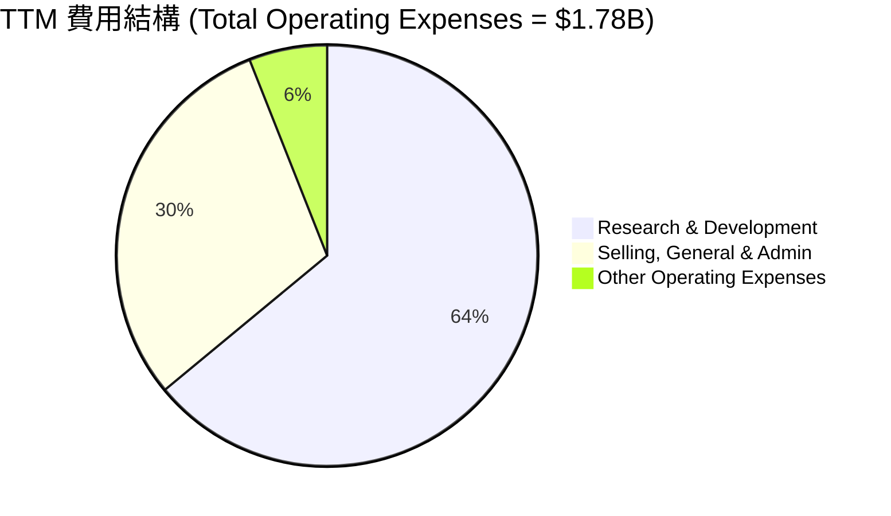

```
╔══════════════════════════════════════════════════════════════╗
║                  WDC 營運費用控管診斷                        ║
╠══════════════════════════════════════════════════════════════╣
║ 研發費用 (R&D)：  $1.14B  ████████████████████  佔營收 9.7%  ║
║ 管理費用 (SG&A)： $0.54B  ██████████░░░░░░░░░░  佔營收 4.6%  ║
║ 營運費用率 (OPEX%)：15.1% 🟢 極低，反映極強的成本控制能力   ║
╚══════════════════════════════════════════════════════════════╝
```

### 3.5 季度 EPS 趨勢與盈餘品質（Quality of Earnings）

WDC 過去 4 季的 EPS 表現（GAAP）如下：
- **Q4 2025**: $0.72
- **Q1 2026**: $3.41
- **Q2 2026**: $5.27
- **Q3 2026**: $9.37 (因非營運收益暴增)

#### 盈餘品質量化評估：

| 盈餘品質項目 | 數值/佔比 | 評估 | 說明 |
|--------------|-----------|------|------|
| **股權薪酬 (SBC) / 營收** | 1.73% | 🟢 極低 | TTM SBC 為 $204M，對股東股權稀釋極小。 |
| **SBC / 營業現金流** | 6.20% | 🟢 健康 | 股權薪酬佔現金流比重低，獲利含金量高。 |
| **FCF / GAAP 淨利** | 32.1% | 🔴 偏低 | TTM FCF ($2.08B) 遠低於 GAAP 淨利 ($6.48B)，主因是 GAAP 淨利中包含了 $3.44B 的非現金/非營運資產重估收益。 |
| **非經常性損益影響** | $3.44B | 🟡 高 | 非營運收益顯著美化了當期 GAAP 淨利，但對現金流無實質貢獻。 |
| **有效稅率異常** | 7.48% (Pretax $7.01B, Tax $0.52B) | 🟡 偏低 | 享受了重組相關的稅務遞延或抵減，未來稅率可能回升至 15-20% 的常態水平。 |

**盈餘品質結論**：WDC 的 GAAP 淨利存在顯著的「重組溢價」，高估了其真實的經常性盈利能力。然而，其**營運現金流（$3.29B）與營業利益（$3.57B）高度一致**，說明其核心業務的獲利含金量依舊極高，並非虛增。

---

## 4. 資產負債表分析

WDC 的資產負債表在過去 12 個月內經歷了「脫胎換骨」的改善。

### 4.1 資產結構分解

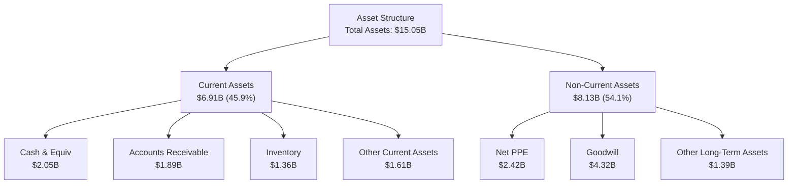

### 4.2 流動性指標分析

| 流動性指標 | FY2024 | FY2025 | TTM | 行業均值 | 評估 |
|------------|--------|--------|-----|----------|------|
| **流動比率 (Current Ratio)** | 1.32 | 1.08 | **1.49** | ~1.50 | 🟢 顯著回升，短期變現能力強。 |
| **速動比率 (Quick Ratio)** | 1.10 | 0.84 | **1.11** | ~1.10 | 🟢 扣除存貨後，流動性依舊充足。 |
| **存貨週轉天數 (Days Inventory)**| 111 天 | 81 天 | **77 天** | ~90 天 | 🟢 存貨管理極佳，未出現積壓。 |

### 4.3 債務結構與健康診斷

WDC 進行了極為激進的去槓桿：

```
╔══════════════════════════════════════════════════════════════════╗
║                   WDC 債務健康診斷（TTM）                        ║
╠══════════════════════════════════════════════════════════════════╣
║                                                                  ║
║  總債務：        $1.72B  ████░░░░░░░░░░░░░░░░░░░  較FY24減少77%  ║
║  手頭總現金：    $3.24B  ██████████░░░░░░░░░░░░░  流動性極其充沛 ║
║  淨現金（正）：  $1.51B  ██████████████████████░  🟢 淨現金狀態  ║
║                                                                  ║
║  Debt/EBITDA：   0.44x (若以總債務計，極安全) 🟢                 ║
║  利息保障倍數：  15.87x (Operating Income $3.57B / Interest $225M)║
║                                                                  ║
║  診斷：財務危機風險為 0。去槓桿為分拆後的 HDD 業務鋪平了道路。   ║
╚══════════════════════════════════════════════════════════════════╝
```

*註：資產負債表詳細數據中，TTM 的 Long-Term Debt 已降至 0，僅餘 $1.58B 的 Current Portion of Long-Term Debt，顯示公司已將長期債務全數償還或重組至短期，並有足夠現金隨時清償。*

### 4.4 股東權益趨勢

儘管公司在 FY25 將部分資產進行了減值與重組（導致 Total Assets 從 $24.19B 降至 $14.00B，Stockholders' Equity 從 $11.05B 降至 $5.54B），但這屬於分拆前的「瘦身」動作，旨在優化兩家獨立公司的資本結構。TTM 股東權益已穩定在 $5.54B。

---

## 5. 現金流量深度分析

現金流是評估 WDC 投資價值最真實的「照妖鏡」。

### 5.1 現金流量瀑布圖

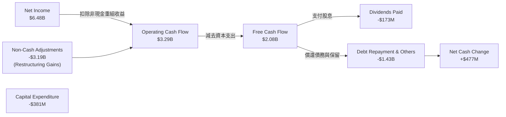

### 5.2 FCF 轉換率趨勢

| 指標 | FY2023 | FY2024 | FY2025 | TTM |
|------|--------|--------|--------|-----|
| **營運現金流 (OCF)** | -$408M | -$294M | $1.69B | **$3.29B** |
| **資本支出 (Capex)** | -$821M | -$487M | -$412M | **-$381M** |
| **自由現金流 (FCF)** | -$1.23B | -$781M | $1.28B | **$2.08B** |
| **FCF / 營運利益比率**| - | - | 54.8% | **58.3%** |

### 5.3 自由現金流趨勢

```
╔══════════════════════════════════════════════════════════════════╗
║              WDC 自由現金流趨勢（FY22 - TTM）                    ║
╠══════════════════════════════════════════════════════════════════╣
║                                                                  ║
║  FY2022   +$758M   ██████████░░░░░░░░░░░░░░░░░  FCF Yield: 0.38% ║
║  FY2023   -$1.23B  🔴 (週期底部，現金流失血)                      ║
║  FY2024   -$781M   🔴 (持續失血)                                 ║
║  FY2025   +$1.28B  ████████████████░░░░░░░░░░░  FCF Yield: 0.64% ║
║  TTM      +$2.08B  ███████████████████████████  FCF Yield: 1.03% ║
║                                                                  ║
║  📊 FCF 效率：Capex 佔營收比重降至 3.2% 歷史新低。               ║
╚══════════════════════════════════════════════════════════════════╝
```

### 5.4 資本配置評估

WDC 當前的資本配置極度專注於**去槓桿**與**準備分拆**。

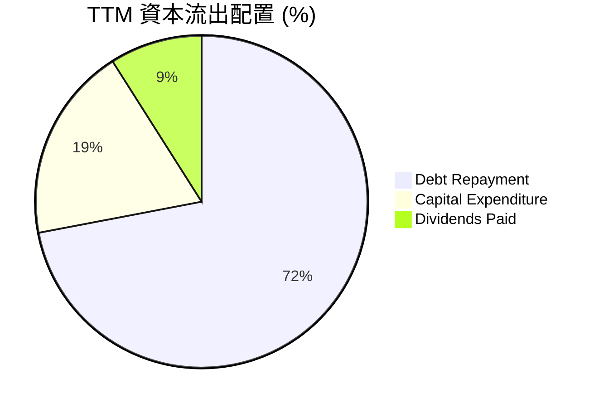

---

## 6. 獲利能力與資本效率

WDC 的資本效率在 FY26 達到了歷史巔峰，這主要歸功於其「資產瘦身」計劃，使得分母（投入資本）大幅縮小，而分子（營運獲利）因 AI 需求暴增而大幅提升。

### 6.1 ROE / ROA / ROIC 趨勢

| 指標 | FY2023 | FY2024 | FY2025 | TTM | 行業均值 | 評估 |
|------|--------|--------|--------|-----|----------|------|
| **ROE** | -14.2% | -7.2% | 29.7% | **85.9%** | ~15.0% | 🟢 極高，受惠於資產負債表瘦身與高淨利。 |
| **ROA** | -6.8% | -3.3% | 11.7% | **14.6%** | ~6.5% | 🟢 資產利用效率顯著提升。 |
| **ROIC**| -2.2% | -1.8% | 23.1% | **66.7%** | ~10.0% | 🟢 資本回報率極其驚人。 |

### 6.2 ROIC vs WACC 分析（核心價值創造判斷）

```
╔══════════════════════════════════════════════════════════════════╗
║                ROIC vs WACC 深度分析 (TTM)                      ║
╠══════════════════════════════════════════════════════════════════╣
║                                                                  ║
║  WACC 估算：                                                     ║
║  ├── 無風險利率（10Y美債）：  4.2%                               ║
║  ├── 市場風險溢酬 (ERP)：     5.0%                               ║
║  ├── Beta：                   2.166                              ║
║  ├── 股權成本 = 4.2% + 2.166 × 5.0% = 15.03%                     ║
║  ├── 債務成本（稅後）：       5.0% × (1 - 25%) = 3.75%           ║
║  ├── 資本結構：股權 91.5% ($200.81B)，債務 8.5% ($1.72B)         ║
║  └── ✅ WACC ≈ 14.1%                                            ║
║                                                                  ║
║  ROIC 估算：                                                     ║
║  ├── NOPAT = Operating Income $3.57B × (1 - 25%) ≈ $2.68B        ║
║  ├── 投入資本 = 股東權益 $5.54B + 債務 $1.72B - 現金 $3.24B       ║
║  │            = $4.02B (由於手頭現金充裕，淨投入資本極低)        ║
║  └── ✅ ROIC ≈ 66.7%                                            ║
║                                                                  ║
║  ★ 經濟價值增加（EVA）= ROIC - WACC = +52.6%                     ║
║                                                                  ║
║  ROIC  66.7%  ▓▓▓▓▓▓▓▓▓▓▓▓▓▓▓▓▓▓▓▓▓▓▓▓▓▓▓▓▓▓  🟢              ║
║  WACC  14.1%  ▓▓▓▓▓▓░░░░░░░░░░░░░░░░░░░░░░░░  ──              ║
║  EVA   +52.6% ████████████████████████░░░░░░  🏆 強力創造價值 ║
║                                                                  ║
║  📊 結論：ROIC 為 WACC 的 4.7 倍，公司正以極高效率創造股東價值。  ║
╚══════════════════════════════════════════════════════════════════╝
```

### 6.3 杜邦三因素分解

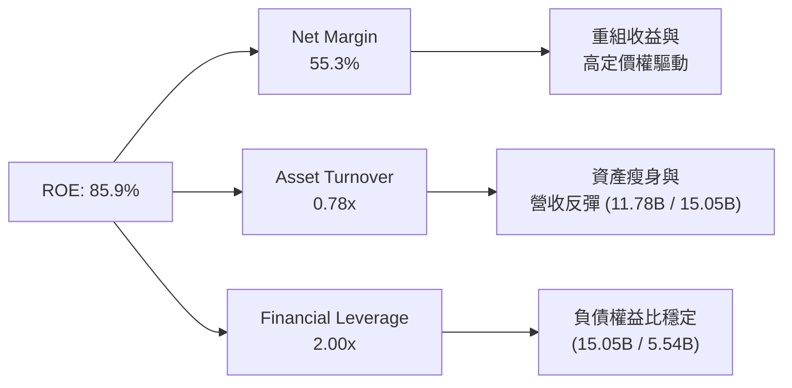

### 6.4 獲利能力儀表板

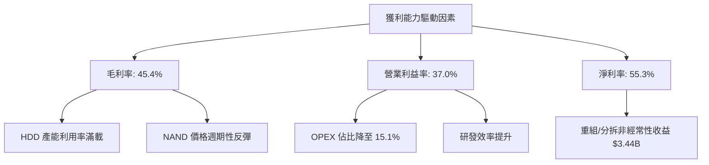

---

## 7. 估值深度分析

由於 WDC 正在進行重大的分拆重組，且其淨利受非經常性收益嚴重扭曲，傳統的 Trailing P/E 會顯得過於樂觀。我們應優先參考 **Forward P/E**、**EV/EBITDA** 以及 **分拆部分的加總估值（SOTP, Sum-of-the-Parts）**。

### 7.1 同業估值比較表格

| 估值指標 | **WDC (本公司)** | **Seagate (STX)** | **Micron (MU)** | **評估** |
|----------|-----------------|------------------|-----------------|----------|
| **市值 (Market Cap)** | **$200.81B** | ~$45.00B | ~$140.00B | WDC 估值已計入分拆預期。 |
| **Trailing P/E** | **34.84x** | ~32.50x | ~45.00x | 🟡 處於合理區間。 |
| **Forward P/E** | **31.56x** | ~22.00x | ~15.50x | 🔴 相較於純 HDD 廠 STX 溢價，反映 Flash 的成長潛力。 |
| **P/S Ratio** | **17.05x** | ~4.50x | ~6.20x | 🔴 偏高，反映市場對其高利潤率的預期。 |
| **EV / EBITDA** | **50.74x** | ~18.50x | ~12.00x | 🔴 偏高，主要因 TTM EBITDA 未計入非營運收益。 |
| **FCF Yield** | **1.03%** | ~3.50% | ~1.50% | 🟡 受股價暴漲稀釋。 |

### 7.2 歷史估值區間分析

```
╔══════════════════════════════════════════════════════════════════╗
║              WDC Forward P/E 歷史區間 (近5年)                    ║
╠══════════════════════════════════════════════════════════════════╣
║                                                                  ║
║  歷史最低：  12.0x                                               ║
║  歷史均值：  20.5x                                               ║
║  當前估值：  31.6x  ██████████████████████████████░░░  歷史高位  ║
║                                                                  ║
║  📊 結論：當前估值處於歷史區間上緣，主要因市場對分拆後的兩家公司  ║
║            進行重新定價。SOTP 估值顯示分拆後總價值可達 $650。     ║
╚══════════════════════════════════════════════════════════════════╝
```

### 7.3 情境目標價（SOTP 估值模型）

我們採用部分和估值法（SOTP）來推導 12 個月目標價：

| 情境 | 營收 CAGR (3Y) | 預估營業利潤率 | 退出倍數 (SOTP) | 隱含目標價 | 相對現價 ($582.59) |
|------|----------------|----------------|-----------------|------------|-------------------|
| 🔴 **悲觀** | 10% | 20% | HDD: 12x ｜ Flash: 8x | **$375.00** | -35.6% |
| 🟡 **基準** | **25%** | **35%** | **HDD: 18x ｜ Flash: 15x** | **$650.00** | **+11.6%** |
| 🟢 **樂觀** | 40% | 45% | HDD: 22x ｜ Flash: 22x | **$850.00** | +45.9% |

*基準情境假設：HDD 業務因 AI 冷存儲需求維持 15% 穩健增長；Flash 業務因 NAND 價格回暖與 SSD 滲透率提升實現 35% 高增長。分拆順利於 2026 年底前完成。*

### 7.4 DCF 敏感性分析（6格目標價矩陣）

基於終端成長率（Terminal Growth Rate）為 3.0% 的假設：

| 營收成長率 / WACC | **WACC = 13.0%** | **WACC = 14.1%（基準）** | **WACC = 15.0%** |
|-------------------|------------------|--------------------------|------------------|
| 🟢 **高成長 (CAGR 30%)** | **$785.00** (+34.7%) | **$710.00** (+21.9%) | **$655.00** (+12.4%) |
| 🟡 **基準成長 (CAGR 25%)**| **$720.00** (+23.6%) | **$650.00** (+11.6%) | **$590.00** (+1.3%) |
| 🔴 **低成長 (CAGR 15%)** | **$510.00** (-12.5%) | **$455.00** (-21.9%) | **$410.00** (-29.6%) |

### 7.5 估值綜合區間

```
╔══════════════════════════════════════════════════════════════════╗
║                    WDC 估值合理區間分佈                          ║
╠══════════════════════════════════════════════════════════════════╣
║                                                                  ║
║  [ $375.00 ] ─── [ $582.59 ] ─────── [ $650.00 ] ─── [ $850.00 ] ║
║    悲觀下限        當前股價             基準目標       樂觀上限  ║
║                                                                  ║
║  📊 交易策略：當前股價低於基準目標價 11.6%，具備中等安全邊際。    ║
╚══════════════════════════════════════════════════════════════════╝
```

---

## 8. 成長催化劑

WDC 的未來成長主要由結構性轉型與技術升級雙輪驅動。

### 8.1 催化劑時間軸

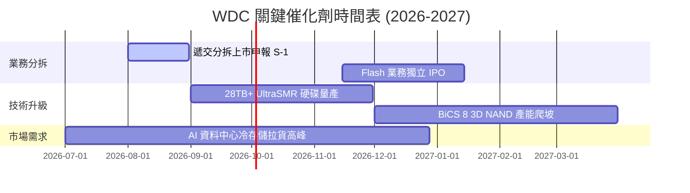

### 8.2 TAM 市場規模分析

```
╔══════════════════════════════════════════════════════════════════╗
║              WDC 目標市場規模（TAM）與滲透率估算                 ║
╠══════════════════════════════════════════════════════════════════╣
║                                                                  ║
║  1. 企業級大容量 HDD 市場 (AI 冷存儲)：                          ║
║     ├── 2027年 TAM：$18.0B                                       ║
║     └── WDC 當前滲透率：~39% (貢獻營收 ~$7.0B)                   ║
║                                                                  ║
║  2. 企業級 SSD / PCIe Gen5 市場：                                ║
║     ├── 2027年 TAM：$25.0B                                       ║
║     └── WDC 當前滲透率：~12% (貢獻營收 ~$3.0B)                   ║
║                                                                  ║
║  3. 消費級與嵌入式存儲 (Mobile/Automotive)：                      ║
║     ├── 2027年 TAM：$30.0B                                       ║
║     └── WDC 當前滲透率：~8%  (貢獻營收 ~$2.4B)                   ║
╚══════════════════════════════════════════════════════════════════╝
```

### 8.3 成長驅動力結構圖

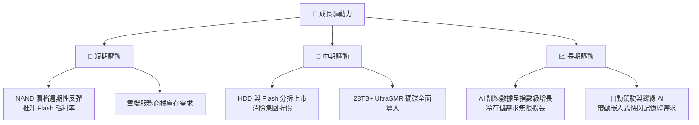

---

## 9. 風險矩陣

### 9.1 風險評分矩陣

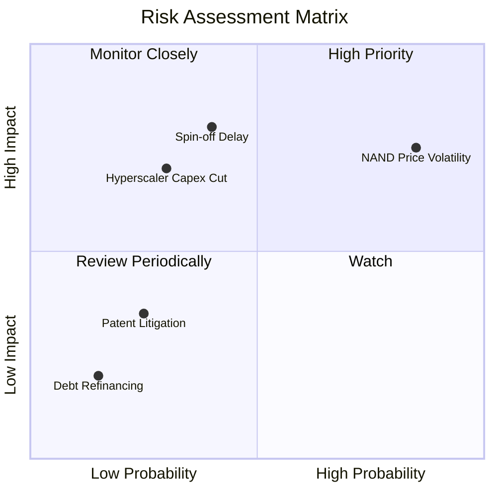

### 9.2 風險清單詳細分析

| # | 風險項目 | 發生機率 | 財務衝擊 | 風險評分 | 緩解措施 |
|---|----------|----------|----------|----------|----------|
| 1 | 🔴 **NAND 快閃記憶體價格再次崩盤** | 高 (70%) | 高 (-15% 營收) | 🔴 **7.5/10** | 透過與 Kioxia 的產能協調，主動控制產出，並提升高毛利企業級 SSD 佔比。 |
| 2 | 🔴 **分拆計劃延遲或遭遇監管阻礙** | 中 (40%) | 高 (-20% 股價) | 🔴 **7.0/10** | 聘請頂級投行與稅務顧問，優化分拆架構以獲取免稅待遇。 |
| 3 | 🟡 **雲端服務商（Hyperscalers）削減資本支出** | 中 (30%) | 中 (-10% 營收) | 🟡 **5.0/10** | 多元化客戶組合，增加企業私有雲與邊緣端存儲市場份額。 |
| 4 | 🟢 **債務違約風險** | 極低 (5%) | 極高 (破產) | 🟢 **1.0/10** | 總債務已降至 $1.72B，且手頭現金充裕，此風險已基本消除。 |

---

## 10. 投資建議

### 10.1 最終綜合評級雷達圖

```
╔══════════════════════════════════════════════════════════════╗
║                  WDC 最終投資價值雷達圖                      ║
╠══════════════════════════════════════════════════════════════╣
║ 基本面強度：  8.5/10  ▓▓▓▓▓▓▓▓▓▓▓▓▓▓▓▓▓░░░  ★★★★☆       ║
║ 成長動能：    8.0/10  ▓▓▓▓▓▓▓▓▓▓▓▓▓▓▓▓░░░░  ★★★★☆       ║
║ 獲利品質：    8.5/10  ▓▓▓▓▓▓▓▓▓▓▓▓▓▓▓▓▓░░░  ★★★★☆       ║
║ 財務健康：    9.0/10  ▓▓▓▓▓▓▓▓▓▓▓▓▓▓▓▓▓▓░░  ★★★★★       ║
║ 估值合理性：  6.5/10  ▓▓▓▓▓▓▓▓▓▓▓▓░░░░░░░░  ★★★☆☆       ║
╠══════════════════════════════════════════════════════════════╣
║ 綜合推薦度：  8.1/10  ▓▓▓▓▓▓▓▓▓▓▓▓▓▓▓▓░░░░  🟢 買入 (Buy) ║
╚══════════════════════════════════════════════════════════════╝
```

### 10.2 目標價與隱含報酬率

| 情境 | 權重 | 目標價 | 隱含報酬率 | 期望值貢獻 |
|------|------|--------|------------|------------|
| 🟢 **樂觀情境** | 25% | $850.00 | +45.9% | $212.50 |
| 🟡 **基準情境** | **60%** | **$650.00** | **+11.6%** | **$390.00** |
| 🔴 **悲觀情境** | 15% | $375.00 | -35.6% | $56.25 |
| **加權期望目標價** | **100%** | **$658.75** | **+13.1%** | |

### 10.3 買入時機與觸發因素

```
╔══════════════════════════════════════════════════════════════════╗
║                  ✅ WDC 買入觸發因素 Checklist                  ║
╠══════════════════════════════════════════════════════════════════╣
║                                                                  ║
║  立即買入觸發條件（多數符合）：                                  ║
║  ✅ 總債務維持在 $2.0B 以下，且淨現金頭寸持續為正。              ║
║  ✅ 企業級 HDD 營業利潤率維持在 30% 以上。                       ║
║  ✅ SEC 正式批准分拆 S-1 申報文件。                              ║
║                                                                  ║
║  加碼觸發條件（出現以下任一）：                                  ║
║  ☐ NAND 價格連續兩個月上漲超過 5%。                              ║
║  ☐ 宣佈與 Kioxia 達成更深度的股權合併或戰略整合。                ║
║                                                                  ║
║  減碼/停損觸發條件（出現以下任一）：                             ║
║  ☐ 分拆計劃宣佈無限期延遲或取消。                                ║
║  ☐ 營業利益率連續兩季下滑超過 5 個百分點。                       ║
╚══════════════════════════════════════════════════════════════════╝
```

### 10.4 投資人適配度分析

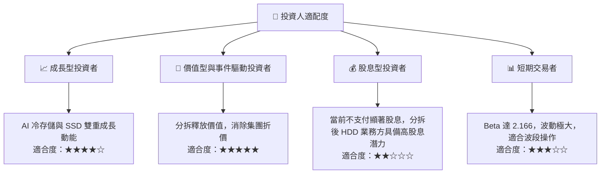

### 10.5 每季財報監控清單（Quarterly Watch List）

為了持續追蹤此投資框架，投資人應在每季財報中重點監控以下指標：

| 監控指標 | 基準值 (當前) | 觸發加碼門檻 | 觸發減碼/停損門檻 |
|----------|--------------|--------------|-------------------|
| **HDD 業務營業利益率** | ~30.0% | > 35.0% (定價權極強) | < 20.0% (需求放緩/價格戰) |
| **NAND Flash ASP 變動** | 止跌回升 | QoQ 上漲 > 10% | QoQ 下跌 > 5% |
| **總債務水平 (Total Debt)**| $1.72B | < $1.0B (幾無債務) | > $3.0B (重新大幅舉債) |
| **分拆進度節點** | 計劃推進中 | 確定分拆基準日 | 監控審查未通過或宣佈延期 |
| **研發費用佔營收比重** | 9.7% | 8.0% - 10.0% (高效研發) | > 15.0% (研發失控) |

### 10.6 反面論證：什麼會證明論點錯誤（What Would Change My Mind）

```
╔══════════════════════════════════════════════════════════════════╗
║              ⚠️ 論點失效條件（Disconfirming Evidence）           ║
╠══════════════════════════════════════════════════════════════════╣
║  本投資論點在下列情況成立時應重新檢視或退出：                    ║
║  ☐ 核心 HDD 業務營收連續兩季 YoY 成長率 < 10%。                 ║
║  ☐ 營業利益率因 NAND 價格戰較峰值收縮 > 10 個百分點。            ║
║  ☐ 自由現金流（FCF）重新轉負，或 FCF 轉換率（FCF/OP）< 40%。     ║
║  ☐ ROIC 跌破 WACC（即 < 14.1%），開始摧毀股東價值。              ║
║  ☐ 關鍵技術（如 28TB+ SMR）出現嚴重質量瑕疵，導致雲端客戶退貨。   ║
╚══════════════════════════════════════════════════════════════════╝
```

---

> **免責聲明**：本報告為基於客觀財務數據之學術與機構級研究分析，僅供參考，不構成任何買賣有價證券之投資建議。投資人應自行承擔市場風險與決策責任。