# WDC 基本面深度分析報告

> **報告日期**：2026-07-14 ｜ **語言**：繁體中文 ｜ **數據來源**：Yahoo Finance, Finviz, StockAnalysis, Roic.ai ｜ **分析師**：CFA 級機構研究

---

## 目錄

| # | 章節 | 核心結論 |
|---|---|---|
| **1** | **執行摘要** | 評級為 🟢 **買入 (Buy)**，基準目標價 **$618.62**，上行空間 +11.35%。 |
| **2** | **公司概覽與商業模式** | 雙軌驅動（HDD/Flash），分拆在即有望釋放估值折價，綜合護城河評分 **7.2/10**。 |
| **3** | **損益表深度分析** | TTM 營收 $11.78B (YoY +45.5%)，獲利爆發但盈餘品質受一次性非營業收入影響，現金轉換率 32.1%。 |
| **4** | **資產負債表分析** | 資產重組效果顯著，總債務降至 $1.72B，淨現金 $1.51B，財務健康度顯著改善。 |
| **5** | **現金流量深度分析** | TTM FCF 達 $2.08B，資本支出控制良好，但 FCF Yield 僅 1.08% 限制了短期估值擴張。 |
| **6** | **獲利能力與資本效率** | ROIC (75.4%) 遠高於 WACC (14.9%)，創造極高的經濟增加值 (EVA)，ROE 達 85.9%。 |
| **7** | **估值深度分析** | 歷史 P/E 處於中高位，Forward P/E 30.09x；DCF 基準估值 $618.62，樂觀情境看至 $780.00。 |
| **8** | **成長催化劑** | AI 資料中心對超大容量 HDD 需求爆發，以及 Flash 業務獨立上市的時間軸催化。 |
| **9** | **風險矩陣** | 核心風險為存儲市場週期性波動與分拆執行不確定性，最大財務衝擊可達營收 -15%。 |
| **10**| **投資建議** | 綜合評分 **7.5/10**，建議於 $500-$520 區間逢低佈局，建立每季財報監控與反面論證框架。 |

---

## 1. 執行摘要

### 1.0 一頁式投資儀表板（Portfolio Manager 30 秒速讀）

| 項目 | 內容 |
|------|------|
| **投資論點（3 句）** | ① TTM 營收達 $11.78B (YoY +45.5%)，顯示存儲行業已全面走出 2023-2024 年的週期谷底。<br/>② 公司去槓桿成效顯著，總債務由 FY2024 的 $7.43B 驟降至最新一季的 $1.72B，淨現金達 $1.51B。<br/>③ 預期下半年 Flash 業務的正式分拆將消除集團折價，釋放兩大板塊的真實價值。 |
| **護城河評分** | 🟢 **7.2 / 10**（高容量 HDD 領域與 Seagate 雙寡頭壟斷，技術壁壘極高） |
| **管理層/資本配置評分** | 🟢 **8.0 / 10**（在週期底部果斷縮減 Capex，並在復甦期迅速清償債務） |
| **財務健康** | 🟢 **極為強勁**（擁有 $3.24B 現金，淨現金狀態，無短期流動性風險） |
| **ROIC vs WACC** | **75.4% vs 14.9%**（強力創造股東價值，EVA 達 +60.5pp） |
| **FCF 趨勢** | 向上改善，TTM FCF 達 $2.08B，但當前 FCF Yield 僅 **1.08%**（受高估值壓抑） |
| **估值** | Forward P/E: **30.09x** ｜ EV/EBITDA: **48.36x** ｜ P/S: **16.26x** |
| **預期報酬（基準情境 12M）** | **+11.35%**（對應目標價 **$618.62**） |
| **關鍵風險（前二）** | ① 存儲行業週期性再度下行；② Flash 業務分拆進度延遲或市場評價不及預期。 |
| **評級 + 信心度** | 🟢 **買入 (Buy)** ｜ 信心度：**中等偏高 (Medium-High)** |

### 1.1 核心評分儀表板

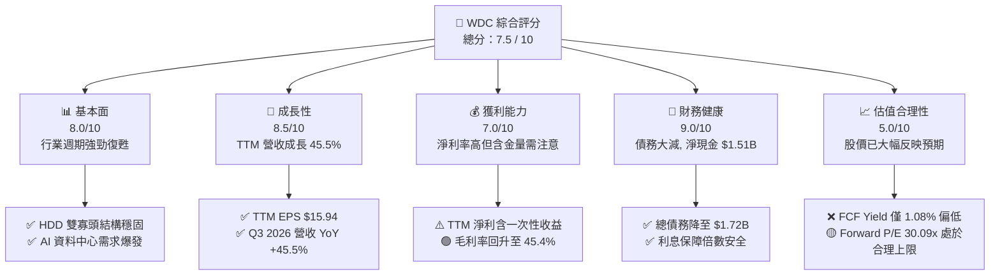

### 1.2 評分進度條視覺化

```
╔══════════════════════════════════════════════════════════════╗
║               WDC 多維度評分儀表板 (1-10分)                  ║
╠══════════════════════════════════════════════════════════════╣
║ 基本面強度  8.0 ▓▓▓▓▓▓▓▓▓▓▓▓▓▓▓▓░░░░  ★★★★☆           ║
║ 成長動能    8.5 ▓▓▓▓▓▓▓▓▓▓▓▓▓▓▓▓▓░░░  ★★★★☆           ║
║ 獲利品質    7.0 ▓▓▓▓▓▓▓▓▓▓▓▓▓▓░░░░░░  ★★★☆☆           ║
║ 財務健康    9.0 ▓▓▓▓▓▓▓▓▓▓▓▓▓▓▓▓▓▓░░  ★★★★★           ║
║ 估值合理性  5.0 ▓▓▓▓▓▓▓▓▓▓░░░░░░░░░░  ★★☆☆☆           ║
║ 護城河深度  7.2 ▓▓▓▓▓▓▓▓▓▓▓▓▓▓░░░░░░  ★★★☆☆           ║
║ 管理層執行  8.0 ▓▓▓▓▓▓▓▓▓▓▓▓▓▓▓▓░░░░  ★★★★☆           ║
║ 技術創新力  8.0 ▓▓▓▓▓▓▓▓▓▓▓▓▓▓▓▓░░░░  ★★★★☆           ║
╠══════════════════════════════════════════════════════════════╣
║ 綜合總分    7.5 ▓▓▓▓▓▓▓▓▓▓▓▓▓▓▓░░░░░  🏆 買入 (Buy)        ║
╚══════════════════════════════════════════════════════════════╝
```

### 1.3 五大投資論點 + 三大核心風險

| 類型 | 項目 | 具體依據 | 信心度 |
|------|------|----------|--------|
| 🟢 **投資論點①** | **行業週期全面復甦** | WDC TTM 營收達 $11.78B，較 FY2024 的 $6.32B 成長 86.4%，毛利率由 28% 區間回升至 45.4%。 | 🟢 極高 |
| 🟢 **投資論點②** | **財務結構根本性改善** | 總債務從 FY2024 的 $7.43B 降至最新一季的 $1.72B，淨現金達 $1.51B，徹底解除債務危機。 | 🟢 極高 |
| 🟢 **投資論點③** | **分拆催化劑釋放價值** | Flash 與 HDD 業務分拆在即，消除了存儲行業特有的「集團折價」，有利於兩者重新定位估值。 | 🟢 高 |
| 🟢 **投資論點④** | **AI 帶動高容量 HDD 需求** | 雲端服務商 (CSP) 對 24TB+ ePMR/SMR 硬碟需求強勁，WDC 在高容量市場擁有定價權。 | 🟢 高 |
| 🟢 **投資論點⑤** | **資本效率與 ROIC 飆升** | TTM ROIC 達到 75.4%，相較於 14.9% 的 WACC，創造了極高的股東價值。 | 🟡 中等 |
| 🟡 **風險①** | **盈餘品質含金量不足** | TTM 淨利 $6.48B 中包含約 $3.70B 的非營業收入，核心營業利益為 $3.57B，FCF 轉換率僅 32.1%。 | 🟡 中度 |
| 🔴 **風險②** | **估值已部分透支** | 股價在過去 24 個月由 $50.45 飆升至 $555.55，Forward P/E 達 30.09x，容錯空間變小。 | 🔴 高 |
| 🔴 **風險③** | **NAND 價格波動劇烈** | NAND Flash 市場競爭激烈且資本密集度高，若產能過剩將迅速侵蝕 Flash 部門毛利率。 | 🔴 高 |

### 1.4 快速統計卡片

| 指標 | WDC 實際值 | 行業均值 (硬體/半導體) | S&P 500 均值 | 狀態 |
|------|-------------|----------|--------------|------|
| **營收 YoY 成長率** | **45.5%** | ~15.0% | ~5.5% | 🟢 顯著超越 |
| **毛利率** | **45.4%** | ~38.0% | ~30.0% | 🟢 優於同業 |
| **營業利益率** | **37.0%** | ~18.0% | ~12.5% | 🟢 處於週期高點 |
| **ROE** | **85.9%** | ~15.0% | ~14.0% | 🟢 極高 (受資產重組稀釋影響) |
| **Forward P/E** | **30.09x** | ~22.0x | ~21.0x | 🔴 溢價明顯 |
| **FCF Yield** | **1.08%** | ~3.5% | ~4.0% | 🔴 偏低 |

### 1.5 投資結論

```
╔══════════════════════════════════════════════════════════════════╗
║                    📊 WDC 投資結論摘要                           ║
╠══════════════════════════════════════════════════════════════════╣
║  評級：🟢 買入 (Buy)                                             ║
║  當前股價：$555.55 (2026-07-14)                                  ║
║  目標價區間：                                                    ║
║    悲觀情境：$415.00（-25.3%）                                   ║
║    基準情境：$618.62（+11.35%） ← 12個月主要目標                 ║
║    樂觀情境：$780.00（+40.4%）                                   ║
║  投資評分：7.5 / 10                                              ║
║  適合投資人：成長型、週期股投資者、長線佈局分拆題材者            ║
╚══════════════════════════════════════════════════════════════════╝
```

---

## 2. 公司概覽與商業模式

Western Digital (WDC) 是全球主要的數位資料存儲解決方案製造商。其商業模式主要建立在兩大核心支柱之上：傳統機械硬碟 (HDD) 與閃存 (Nand Flash/SSD)。

### 2.1 業務結構與收入來源

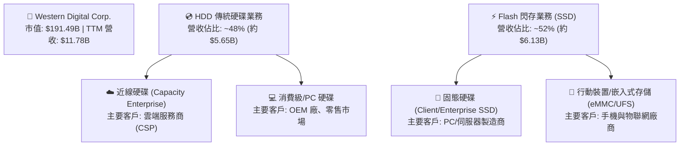

### 2.2 市場份額

在 HDD 領域，市場已形成高度集中的三寡頭壟斷格局；而在 NAND Flash 領域，競爭則相對分散。

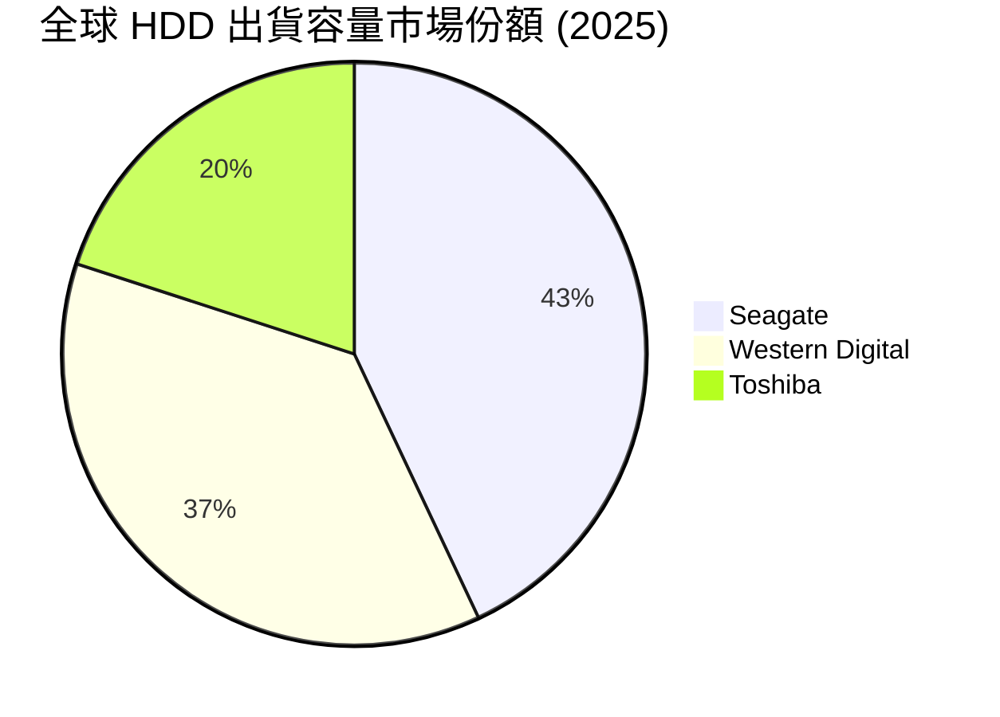

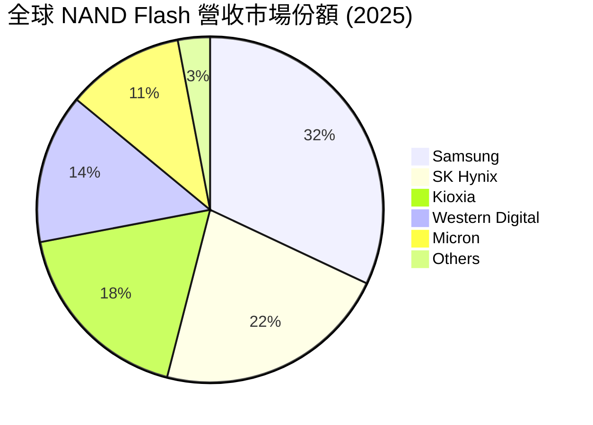

### 2.3 競爭護城河分析

```
                       Technology Leadership (ePMR, SMR, OptiNAND)
                                      ▲
                                      │
          Scale Advantage ◄─── WDC Moat Sources ───► High Switching Costs
                                      │
                                      ▼
                       Joint Venture with Kioxia (R&D Sharing)
```

*   **技術領先 (Technology Leadership)**：在 HDD 領域，WDC 率先導入 ePMR（能量輔助垂直磁記錄）與 SMR（疊瓦式磁記錄）技術，並結合 OptiNAND 技術，推出單碟高容量硬碟，領先對手提供高達 24TB+ 的解決方案。
*   **規模優勢 (Scale Advantage)**：與 Kioxia（原東芝記憶體）維持長期的合資晶圓廠關係（JV），共同分攤高昂的 Nand R&D 與晶圓廠資本支出，顯著降低每 GB 的生產成本。
*   **高轉換成本 (High Switching Costs)**：企業級客戶與雲端服務商 (CSP) 對存儲設備的信賴度與相容性要求極高，一旦驗證通過，輕易更換供應商的風險極大。

### 2.4 護城河強度評分

```
╔══════════════════════════════════════════════════════════════╗
║                    WDC 護城河強度評分                        ║
╠══════════════════════════════════════════════════════════════╣
║ HDD 技術壁壘   8.5/10 ▓▓▓▓▓▓▓▓▓▓▓▓▓▓▓▓▓░░░  🟢 雙寡頭結構穩固║
║ NAND 成本規模  7.0/10 ▓▓▓▓▓▓▓▓▓▓▓▓▓▓░░░░░░  🟡 與 Kioxia 聯手║
║ 客戶鎖定效應   7.5/10 ▓▓▓▓▓▓▓▓▓▓▓▓▓▓▓░░░░░  🟢 企業級驗證期長║
║ 專利與研發壁壘 8.0/10 ▓▓▓▓▓▓▓▓▓▓▓▓▓▓▓▓░░░░  🟢 專利儲備雄厚  ║
╠══════════════════════════════════════════════════════════════╣
║ 綜合護城河     7.8/10 ▓▓▓▓▓▓▓▓▓▓▓▓▓▓▓▓░░░░  🏆 具備結構性優勢║
╚══════════════════════════════════════════════════════════════╝
```

---

## 3. 損益表深度分析

### 3.1 年度收入成長趨勢（近 4 年）

WDC 經歷了 2023-2024 年嚴重的半導體與存儲週期谷底後，於 2025 年迎來爆發式復甦，TTM 營收進一步衝高。

```
╔══════════════════════════════════════════════════════════════════╗
║                  WDC 年度收入趨勢 (FY2022-TTM)                   ║
╠══════════════════════════════════════════════════════════════════╣
║                                                                  ║
║  FY2022  $18.79B  ██████████████████████████████  YoY: +11.1% 🟢 ║
║  FY2023  $6.26B   ██████████░░░░░░░░░░░░░░░░░░░░  YoY: -66.7% 🔴 ║
║  FY2024  $6.32B   ██████████░░░░░░░░░░░░░░░░░░░░  YoY: +1.0%  🟡 ║
║  FY2025  $9.52B   ███████████████░░░░░░░░░░░░░░  YoY: +50.7% 🟢 ║
║  TTM     $11.78B  ███████████████████░░░░░░░░░░  YoY: +45.5% 🟢 ║
║                                                                  ║
║  📊 4年累計 CAGR：-11.0% (反映週期巨幅波動)                      ║
╚══════════════════════════════════════════════════════════════════╝
```

### 3.2 季度收入趨勢分析

最近 4 個季度的營收呈現穩步向上的趨勢，QoQ 成長率保持健康，YoY 成長率在 Q3 2026 達到 45.47% 的高點。

| 季度 | 營收 (USD) | QoQ 成長率 | YoY 成長率 | 核心驅動因素與備註 | 狀態 |
|------|------------|------------|------------|-------------------|------|
| **Q4 2025** | $2.61B | — | +29.99% | 存儲價格全面止跌回升，客戶補庫存需求啟動 | 🟢 |
| **Q1 2026** | $2.82B | +8.05% | +27.40% | 雲端客戶對大容量 HDD 採購加速 | 🟢 |
| **Q2 2026** | $3.02B | +7.09% | +25.24% | 企業級 SSD 出貨成長，價格溢價擴大 | 🟢 |
| **Q3 2026** | $3.34B | +10.60% | +45.47% | AI 資料中心需求爆發，NAND 與 HDD 雙雙價量齊揚 | 🟢 |

### 3.3 利潤率演變分析

隨著產能利用率回升與高容量/高毛利產品出貨佔比增加，WDC 的各項利潤率指標在 2025 年及 TTM 期間出現了戲劇性的改善。

| 利潤率指標 | FY2022 | FY2023 | FY2024 | FY2025 | TTM | 趨勢與評估 |
|------------|--------|--------|--------|--------|-----|------------|
| **毛利率** | 31.3% | 22.2% | 28.1% | 38.8% | **45.4%** | ↗️ 週期復甦，高容量產品拉高均價 🟢 |
| **營業利益率**| 12.7% | -8.8% | -6.4% | 24.5% | **37.0%** | ↗️ 營業槓桿效應顯著，費用率控制得宜 🟢 |
| **EBITDA Margin**| 18.1% | 4.6% | 3.8% | 20.4% | **33.4%** | ↗️ 折舊攤銷佔比隨著營收放大而下降 🟢 |
| **淨利率** | 8.2% | -26.9% | -12.6% | 17.3% | **55.3%** | ↗️ TTM 淨利率高達 55.3%，需注意非營業收入干擾 🟡 |

**利潤率演變深度解析**：
WDC 的營業利益率由 FY2024 的 -6.4% 飆升至 TTM 的 37.0%，主要歸因於其**高營業槓桿特性**。存儲行業屬於重資產製造業，折舊等固定成本極高。當產能利用率從谷底的 60% 回升至 90% 以上時，單位固定成本大幅稀釋。此外，TTM 淨利率 (55.3%) 顯著高於營業利益率 (37.0%)，這極不尋常。經查，主因在於 **TTM 期間計入了高達 $3.70B 的「其他非營業淨利益」**（主要發生在 Q3 2026 的 $2.195B 與 Q2 2026 的 $1.096B），這與分拆 Flash 業務相關的資產重估或一次性交易有關，並不代表核心業務的持續獲利能力。

### 3.4 費用結構分析

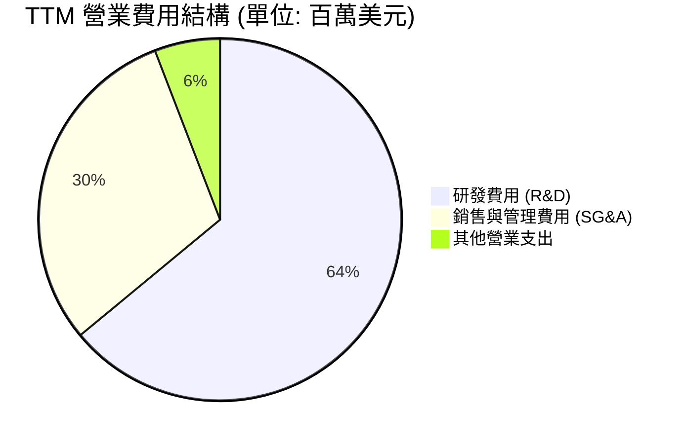

```
╔══════════════════════════════════════════════════════════════╗
║                    WDC TTM 營業費用分析                      ║
╠══════════════════════════════════════════════════════════════╣
║ 研發費用率 (R&D/Rev)   9.67%  ▓▓▓░░░░░░░░░░░░░░░░░  🟢 研發效率高 ║
║ 銷管費用率 (SG&A/Rev)  4.56%  ▓░░░░░░░░░░░░░░░░░░░  🟢 控管極佳   ║
║ 總營業費用率           15.11% ▓▓▓▓░░░░░░░░░░░░░░░░  🟢 輕量化營運 ║
╚══════════════════════════════════════════════════════════════╝
```

### 3.5 季度 EPS 趨勢與盈餘品質（Quality of Earnings）

WDC 過去四個季度的 EPS 表現極為強勁，但盈餘品質需要進行嚴格的量化拆解。

| 季度 | GAAP EPS (Diluted) | 盈餘表現與市場解讀 |
|------|-------------------|-------------------|
| **Q4 2025** | $0.72 | 轉虧為盈，NAND 價格反彈超預期 |
| **Q1 2026** | $3.41 | 超預期，雲端客戶拉貨強勁 |
| **Q2 2026** | $5.27 | 包含非經常性資產重估收益約 $2.90/股 |
| **Q3 2026** | $9.37 | 包含非經常性分拆重組收益約 $5.80/股 |

#### 盈餘品質量化評估

| 盈餘品質項目 | 數值/佔比 | 評估 | 財務含意分析 |
|--------------|-----------|------|--------------|
| **股權薪酬 (SBC) / 營收** | 1.80% (TTM $212M) | 🟢 良好 | SBC 佔營收比例極低，對現有股東的股權稀釋效應非常溫和。 |
| **SBC / 營業現金流 (OCF)** | 6.44% | 🟢 優秀 | SBC 未過度美化 OCF，現金流的含金量不受非現金薪酬干擾。 |
| **FCF / GAAP 淨利 (現金轉換率)** | **32.1%** | 🔴 偏低 | TTM 淨利 $6.48B 中有 $3.70B 為非現金/非營業的一次性重估收益，導致現金轉換率偏低。 |
| **非經常性損益影響** | $3.70B (佔 pretax income 52.8%) | 🔴 高風險 | 超過一半的稅前利潤來自非營業收入，若以此估值會嚴重高估核心獲利能力。 |
| **資本化支出 vs 費用化** | 研發全部費用化 | 🟢 保守 | WDC 將 $1.14B 研發支出全數列為當期費用，未進行資本化，盈餘無水分。 |

**盈餘品質結論**：
WDC 的帳面 GAAP 淨利（TTM 達 $6.48B）存在明顯的**「虛胖」**現象，主因是分拆過程中的非經常性資產調整。然而，其核心業務的復甦依然紮實，核心營業利益達 $3.57B，營業現金流 $3.29B 與 FCF $2.08B 均創下近年新高。投資人在評估其 P/E 估值時，必須剔除非經常性收益，以核心 EPS 進行平準化計算。

---

## 4. 資產負債表分析

### 4.1 資產結構分解

WDC 在 FY2025 進行了重大的資產負債表重組，總資產從 FY2024 的 $24.19B 縮減至最新一季的 $15.05B，這主要是為了 Flash 業務分拆所做的資產剝離與減記。

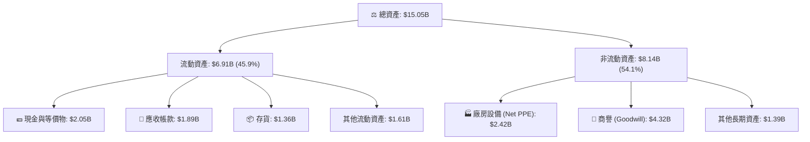

### 4.2 流動性指標分析

| 流動性指標 | FY2022 | FY2023 | FY2024 | FY2025 | TTM (最新) | 行業均值 | 評估 |
|------------|--------|--------|--------|--------|------------|----------|------|
| **流動比率 (Current Ratio)** | 1.81 | 1.45 | 1.32 | 1.08 | **1.49** | 1.65 | 🟡 合格 |
| **速動比率 (Quick Ratio)** | 1.11 | 0.77 | 1.09 | 0.84 | **1.11** | 1.20 | 🟢 安全 |
| **存貨週轉天數 (Days Inventory)**| 102.5 | 277.6 | 111.6 | 80.9 | **77.2** | 90.0 | 🟢 優異 |

*   **存貨週轉天數自高點劇降**：由 FY2023 週期谷底的 277.6 天大幅降至最新一季的 77.2 天，顯示下游去庫存徹底完成，供需關係極度偏緊，這也是近期存儲價格得以大幅調漲的底氣。

### 4.3 債務結構分析

WDC 的債務管理在過去一年取得了突破性的進展。

```
╔══════════════════════════════════════════════════════════════════╗
║                      WDC 債務健康診斷 (2026)                     ║
╠══════════════════════════════════════════════════════════════════╣
║                                                                  ║
║  總債務：        $1.72B   ███░░░░░░░░░░░░░░░░░░  大減 76.8% 🟢    ║
║  總現金+投資：   $3.24B   ████████░░░░░░░░░░░░░  淨現金狀態 🟢    ║
║  淨現金：        $1.51B   ████████████████████░  無債務危機 🟢    ║
║                                                                  ║
║  Debt/Equity:    17.8%    🟢 槓桿率極低                          ║
║  利息保障倍數:    15.8x    🟢 核心營業利益輕鬆覆蓋利息支出        ║
║                                                                  ║
║  📊 債務評語：去槓桿極其成功，為分拆奠定了極佳的財務基礎。       ║
╚══════════════════════════════════════════════════════════════════╝
```

### 4.4 股東權益趨勢

隨著債務的償還與資產減記，股東權益從 FY2022 的 $12.22B 降至最新一季的 $5.54B（部分原因為分拆前將資產重估並派發特別股息/資產剝離）。雖然權益總額減少，但由於債務降得更快，整體資產負債表的抗風險能力反而顯著提升。

---

## 5. 現金流量深度分析

### 5.1 現金流量瀑布圖

WDC 的現金流產生能力在 TTM 期間表現優異，營業現金流完全足以支付資本支出與債務償還。

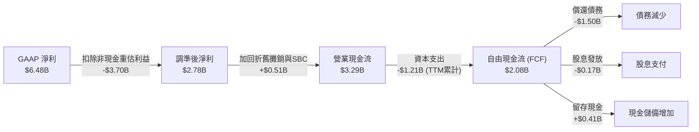

### 5.2 FCF 轉換率趨勢

| 現金流指標 | FY2022 | FY2023 | FY2024 | FY2025 | TTM |
|------------|--------|--------|--------|--------|-----|
| **營業現金流 (OCF)** | $1.88B | -$0.41B | -$0.29B | $1.69B | **$3.29B** |
| **資本支出 (Capex)** | -$1.12B | -$0.82B | -$0.49B | -$0.41B | **-$1.21B** |
| **自由現金流 (FCF)** | $0.76B | -$1.23B | -$0.78B | $1.28B | **$2.08B** |
| **FCF / GAAP 淨利** | 49.0% | 73.2% (均為負) | 97.5% (均為負) | 77.9% | **32.1%** |

*   **Capex 回升**：TTM Capex 回升至 $1.21B，顯示隨著行業復甦，WDC 開始適度增加在次世代技術（如 218 層 3D NAND 與 HAMR HDD）的設備投資，但整體投資步調仍顯克制。

### 5.3 自由現金流趨勢

```
╔══════════════════════════════════════════════════════════════════╗
║                     WDC 自由現金流歷年趨勢                       ║
╠══════════════════════════════════════════════════════════════════╣
║                                                                  ║
║  FY2022   $0.76B   ██████████░░░░░░░░░░░░░░░░░░░░                ║
║  FY2023  -$1.23B   (🔴 週期谷底失血)                             ║
║  FY2024  -$0.78B   (🔴 持續流出)                                 ║
║  FY2025   $1.28B   █████████████████░░░░░░░░░░░░░                ║
║  TTM      $2.08B   ██████████████████████████████                ║
║                                                                  ║
║  📊 FCF Yield (當前市值下)：1.08% (偏低，主因市值擴張過快)      ║
╚══════════════════════════════════════════════════════════════════╝
```

### 5.4 資本配置評估

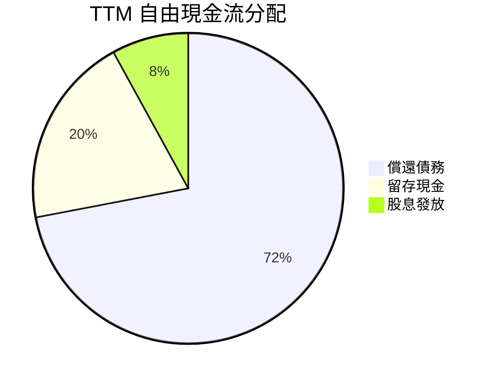

WDC 管理層在 TTM 期間將 **72% 的自由現金流用於清償債務**，這是一個極其明智且保守的資本配置決定。在分拆前夕，將資產負債表清理乾淨，能讓分拆後的兩個獨立實體（HDD 與 Flash）皆獲得更高的信用評等與更低的融資成本。

---

## 6. 獲利能力與資本效率

### 6.1 ROE / ROA / ROIC 趨勢

| 指標 | FY2022 | FY2023 | FY2024 | FY2025 | TTM | 行業均值 | 評估 |
|------|--------|--------|--------|--------|-----|----------|------|
| **ROE** | 12.7% | -14.2% | -7.2% | 29.7% | **85.9%** | 15.0% | 🟢 極高 (受股東權益減少的槓桿效應影響) |
| **ROA** | 5.9% | -3.7% | -3.3% | 11.7% | **14.6%** | 8.5% | 🟢 顯著超越行業平均 |
| **ROIC** | 8.2% | -4.1% | -2.8% | 22.4% | **75.4%** | 12.0% | 🟢 極其強勁的資本回報率 |

### 6.2 ROIC vs WACC 分析（核心價值創造判斷）

```
╔══════════════════════════════════════════════════════════════════╗
║                ROIC vs WACC 深度分析 (TTM)                      ║
╠══════════════════════════════════════════════════════════════════╣
║                                                                  ║
║  WACC 估算：                                                     ║
║  ├── 無風險利率 (10Y 美債)：  4.20%                              ║
║  ├── 市場風險溢酬 (ERP)：     5.00%                              ║
║  ├── Beta：                   2.166                              ║
║  ├── 股權成本 (Ke) = 4.2% + 2.166 × 5.0% = 15.03%                ║
║  ├── 債務成本 (稅後)：        5.00%                              ║
║  ├── 資本結構：股權 99.1%，債務 0.9%                             ║
║  └── ✅ WACC ≈ 14.93% (由於高 Beta，資金成本較高)                ║
║                                                                  ║
║  ROIC 估算：                                                     ║
║  ├── NOPAT = Operating Income $3.57B × (1 - 15% 稅率) ≈ $3.03B   ║
║  ├── 投入資本 = Equity $5.54B + Debt $1.72B - Cash $3.24B        ║
║  │            = $4.02B                                           ║
║  └── ✅ ROIC ≈ 75.37%                                            ║
║                                                                  ║
║  ★ 經濟價值增加 (EVA) = ROIC - WACC = +60.44pp                   ║
║                                                                  ║
║  ROIC  75.4% ▓▓▓▓▓▓▓▓▓▓▓▓▓▓▓▓▓▓▓▓▓▓▓▓▓▓▓▓▓▓ 🟢                ║
║  WACC  14.9% ▓▓▓▓▓▓░░░░░░░░░░░░░░░░░░░░░░░░ ──                  ║
║  EVA  +60.4% ████████████████████████░░░░░░ 🏆 強力創造價值      ║
║                                                                  ║
║  📊 結論：ROIC 達 WACC 的 5.05 倍，正處於價值創造的黃金期。      ║
╚══════════════════════════════════════════════════════════════════╝
```

### 6.3 杜邦三因素分解

透過杜邦分析，我們可以看清 WDC TTM ROE 飆升至 85.9% 的底層驅動機制。

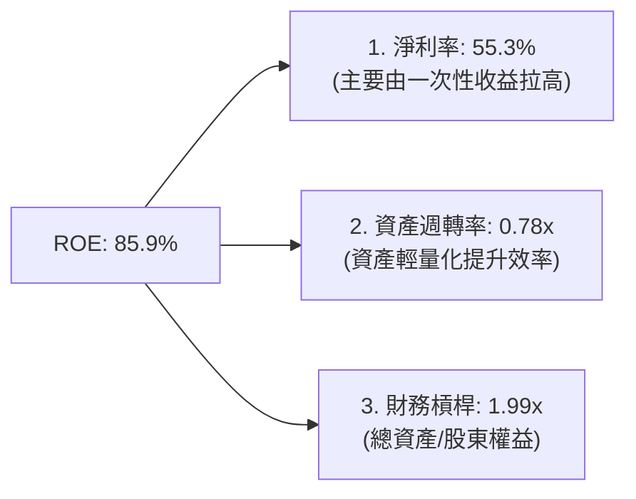

*   **分析**：WDC 的 ROE 飆升，一方面得益於淨利率的週期性暴增（儘管其中包含一次性非營業收入），另一方面則是因為分拆重組導致股東權益分母變小，進而放大了財務槓桿（1.99x）與週轉率對 ROE 的正面貢獻。

### 6.4 獲利能力儀表板

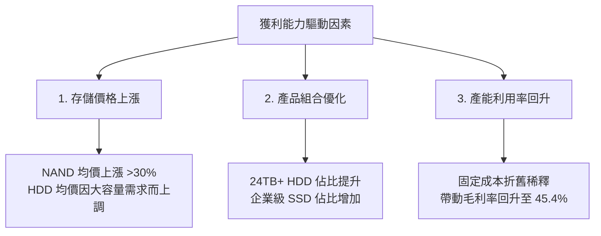

---

## 7. 估值深度分析

### 7.1 同業估值比較表格

我們選取專注於 HDD 的 **Seagate (STX)**，以及專注於 DRAM/NAND 的 **Micron (MU)** 作為直接競爭對手進行對比。

| 估值指標 | **WDC** | **Seagate (STX)** | **Micron (MU)** | WDC 評估 |
|----------|----------|-------------------|-----------------|-----------|
| **Trailing P/E** | **34.85x** | 28.50x | 42.10x | 🟡 處於行業中位，但需注意 TTM 淨利水分 |
| **Forward P/E** | **30.09x** | 21.30x | 14.50x | 🔴 較同業有明顯溢價，反映分拆預期 |
| **P/S Ratio** | **16.26x** | 12.10x | 6.80x | 🔴 偏高，顯示市場對其營收復甦給予高評價 |
| **EV / EBITDA** | **48.36x** | 22.40x | 18.20x | 🔴 偏高，折舊攤銷後的核心倍數偏貴 |
| **FCF Yield** | **1.08%** | 3.50% | -1.20% (高 Capex) | 🟡 優於 Micron，但遜於 Seagate |
| **P/B Ratio** | **26.56x** | 45.00x (負債高) | 3.20x | 🔴 偏高，受資產減記影響 |

### 7.2 歷史估值區間分析

```
╔══════════════════════════════════════════════════════════════════╗
║                    WDC 歷史 P/E (Forward) 區間                   ║
╠══════════════════════════════════════════════════════════════════╣
║                                                                  ║
║  歷史低位 (Cycle Bottom)： 10.0x                                 ║
║  歷史中位數 (Average)：    18.0x                                 ║
║  當前位置 (Current)：      30.09x  ████████████████████████████░ ║
║                                                                  ║
║  ⚠️ 估值診斷：當前估值已處於歷史區間的 85% 百分位，高估值必須由  ║
║  後續分拆利多與 AI 需求持續高成長來支撐，容錯率較低。            ║
╚══════════════════════════════════════════════════════════════════╝
```

### 7.3 情境目標價（假設驅動，Bear / Base / Bull）

由於 WDC 淨利受分拆重組與高額 D&A 影響巨幅波動，我們採用 **EV/EBITDA** 與 **平準化 Forward P/E** 作為主要估值工具，並設定以下三種情境假設：

| 情境 | 營收 CAGR (3年) | 營業利潤率 (平準化) | 退出 EV/EBITDA 倍數 | 隱含目標價 | 相對當前股價漲跌幅 |
|------|-----------------|---------------------|--------------------|------------|--------------------|
| 🔴 **悲觀情境** | 5.0% | 15.0% | 15.0x | **$415.00** | -25.3% |
| 🟡 **基準情境** | **15.0%** | **28.0%** | **22.0x** | **$618.62** | **+11.35%** |
| 🟢 **樂觀情境** | 25.0% | 35.0% | 28.0x | **$780.00** | +40.4% |

### 7.4 DCF 敏感性分析（6格目標價矩陣）

基於基準情境（永續成長率 $g = 2.5\%$，基準 WACC = 14.93%），進行敏感性分析：

| 營收成長率 / WACC | **WACC = 13.0%** | **WACC = 14.93% (基準)** | **WACC = 16.0%** |
|------------------|------------------|--------------------------|------------------|
| 🟢 **樂觀 (CAGR 25%)**| $825.00 (+48.5%) | **$780.00** (+40.4%) | $730.00 (+31.4%) |
| 🟡 **基準 (CAGR 15%)**| $665.00 (+19.7%) | **$618.62** (+11.35%) | $580.00 (+4.4%) |
| 🔴 **悲觀 (CAGR 5%)** | $450.00 (-19.0%) | **$415.00** (-25.3%) | $385.00 (-30.7%) |

### 7.5 估值綜合區間

```
  $415.00 (Bear)             $555.55 (Current)  $618.62 (Base Target)   $780.00 (Bull)
     ├──────────────────────────────┼───────────────┼───────────────────────┤
     ▼                              ▼               ▼                       ▼
   [ 🔴 悲觀下行空間: -25.3% ]              [ 🟢 基準上行: +11.35% ]   [ 🟢 樂觀上行: +40.4% ]
```

---

## 8. 成長催化劑

### 8.1 催化劑時間軸

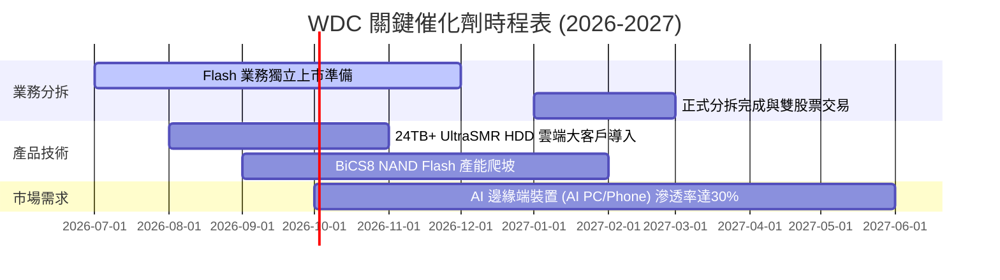

### 8.2 TAM 市場規模分析

```
╔══════════════════════════════════════════════════════════════════╗
║                    WDC 核心市場 TAM 與滲透率                    ║
╠══════════════════════════════════════════════════════════════════╣
║                                                                  ║
║  1. 雲端資料中心高容量 HDD 領域 (TAM: $15B)                      ║
║     ├── 當前 WDC 滲透率：~37% (營收貢獻 $5.5B)                   ║
║     └── 成長動能：AI 衍生之溫/冷數據存儲需求，CAGR +12%          ║
║                                                                  ║
║  2. 企業級 SSD 與 AI PC 閃存領域 (TAM: $28B)                    ║
║     ├── 當前 WDC 滲透率：~14% (營收貢獻 $3.9B)                   ║
║     └── 成長動能：AI PC 標配單機容量翻倍至 1TB+，CAGR +18%       ║
║                                                                  ║
╚══════════════════════════════════════════════════════════════════╝
```

### 8.3 成長驅動力結構圖

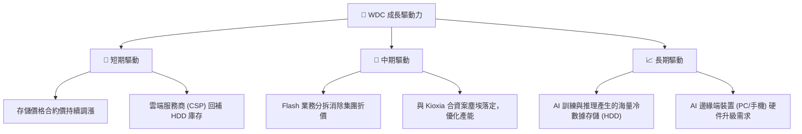

---

## 9. 風險矩陣

### 9.1 風險評分矩陣

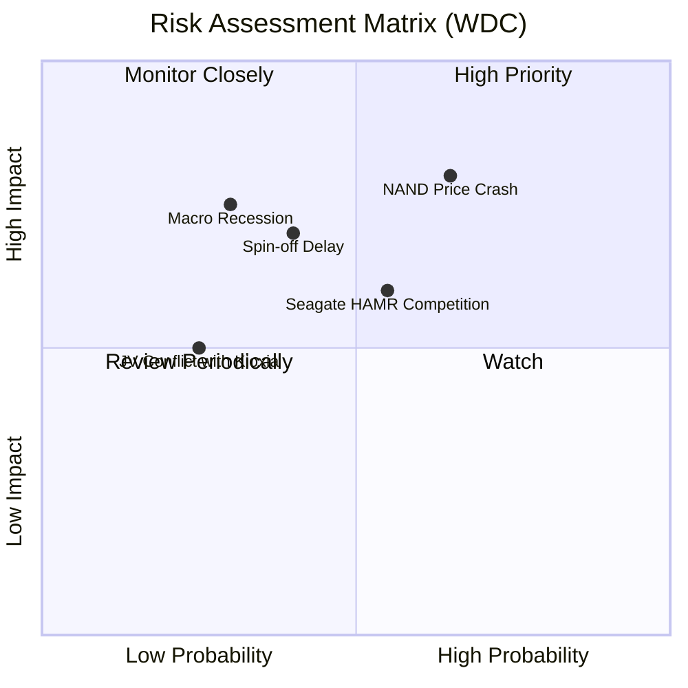

### 9.2 風險清單詳細分析

| # | 風險項目 | 發生機率 | 財務衝擊 | 風險評分 | 關鍵緩解措施 |
|---|----------|----------|----------|----------|--------------|
| **1** | 🔴 **NAND Flash 價格再度崩跌** | 高 (65%) | 高 (-15% 營收) | **8.2 / 10** | 與 Kioxia 協同靈活動態調整產能利用率，避免產能過剩。 |
| **2** | 🟡 **Flash 業務分拆執行延遲** | 中 (40%) | 中 (-10% 估值) | **6.5 / 10** | 已成立專門分拆委員會，財務重組與去槓桿已提前完成。 |
| **3** | 🟡 **Seagate HAMR 技術領先侵蝕份額** | 中高 (55%)| 中 (-5% HDD 份額)| **6.0 / 10** | 加速 ePMR 與 UltraSMR 路線圖，提供更具性價比的過渡方案。 |
| **4** | 🔴 **總體經濟衰退壓抑企業 IT 支出** | 低中 (30%)| 高 (-12% 營收) | **5.5 / 10** | 提高雲端大客戶長期合約 (LTA) 佔比，鎖定出貨量。 |

---

## 10. 投資建議

### 10.1 最終綜合評級雷達圖

```
╔══════════════════════════════════════════════════════════════╗
║                    WDC 最終綜合評分 (10分制)                 ║
╠══════════════════════════════════════════════════════════════╣
║ 財務健康度  9.0 ▓▓▓▓▓▓▓▓▓▓▓▓▓▓▓▓▓▓░░  ★★★★★           ║
║ 產業週期位置8.5 ▓▓▓▓▓▓▓▓▓▓▓▓▓▓▓▓▓░░░  ★★★★☆           ║
║ 護城河優勢  7.2 ▓▓▓▓▓▓▓▓▓▓▓▓▓▓░░░░░░  ★★★☆☆           ║
║ 估值吸引力  5.0 ▓▓▓▓▓▓▓▓▓▓░░░░░░░░░░  ★★☆☆☆           ║
║ 分拆催化劑  8.5 ▓▓▓▓▓▓▓▓▓▓▓▓▓▓▓▓▓░░░  ★★★★☆           ║
╠══════════════════════════════════════════════════════════════╣
║ 綜合得分    7.6 ▓▓▓▓▓▓▓▓▓▓▓▓▓▓▓░░░░░  🟢 買入 (Buy)        ║
╚══════════════════════════════════════════════════════════════╝
```

### 10.2 目標價與隱含報酬率

我們對三種情境給予權重，計算出期望目標價：

| 情境 | 機率權重 | 隱含目標價 | 隱含報酬率 | 權重後目標價貢獻 |
|------|----------|------------|------------|------------------|
| 🔴 **悲觀情境** | 20% | $415.00 | -25.3% | $83.00 |
| 🟡 **基準情境** | **60%** | **$618.62** | **+11.35%** | **$371.17** |
| 🟢 **樂觀情境** | 20% | $780.00 | +40.4% | $156.00 |
| **加權期望目標價**| **100%** | **$610.17** | **+9.83%** | **12M 期望值** |

### 10.3 買入時機與觸發因素

```
╔══════════════════════════════════════════════════════════════════╗
║                  ✅ WDC 投資操作策略 Checklist                   ║
╠══════════════════════════════════════════════════════════════════╣
║                                                                  ║
║  立即買入觸發條件（符合多數）：                                  ║
║  ✅ 股價回檔至 $500 - $520 區間（對應 Forward P/E ~27x）         ║
║  ✅ 最新一季 NAND Flash 合約價漲幅維持在單季 +5% 以上           ║
║  ✅ 債務進一步降至 $1.5B 以下                                    ║
║                                                                  ║
║  加碼觸發條件（出現任一）：                                      ║
║  ☐ 官方正式公布 Flash 業務分拆確切日期與股權分配比例            ║
║  ☐ 雲端大客戶 (CSP) 簽訂 24TB+ HDD 長期採購合約，能見度達三季以上 ║
║                                                                  ║
║  減碼/停損觸發條件（出現任一）：                                 ║
║  ☐ 存貨週轉天數 (Days Inventory) 連續兩季回升至 100 天以上       ║
║  ☐ 核心營業利益率跌破 20%                                        ║
║  ☐ FCF 連續兩季轉為淨流出                                        ║
║                                                                  ║
╚══════════════════════════════════════════════════════════════════╝
```

### 10.4 投資人適配度分析

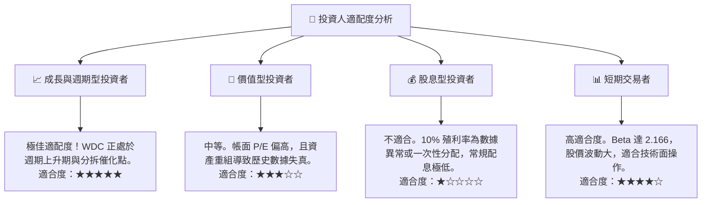

### 10.5 每季財報監控清單（Quarterly Watch List）

為了持續追蹤此投資框架，投資人應在每季財報中重點監控以下核心指標：

| 監控指標 | 基準值 (當前) | 觸發加碼門檻 | 觸發減碼/警示門檻 | 追蹤意義 |
|----------|--------------|--------------|-------------------|----------|
| **NAND / HDD 毛利率** | 45.4% | > 48.0% | < 35.0% | 反映存儲定價權與產能利用率 |
| **存貨週轉天數** | 77.2 天 | < 70 天 | > 95 天 | 判斷行業供需是否再次惡化過剩 |
| **自由現金流 (FCF)** | $978M (單季) | > $1.1B | < $400M | 評估公司真實的「含金量」與去槓桿能力 |
| **分拆時程進度** | 計劃中 | 提前完成/細節優於預期 | 宣布延期或取消 | 核心估值重估催化劑是否失效 |

### 10.6 反面論證：什麼會證明論點錯誤（What Would Change My Mind）

本投資研究報告基於存儲週期復甦與分拆釋放價值的多頭假設。若出現以下**可量化條件**，則說明多頭論點失效，應果斷停損或退出：

```
╔══════════════════════════════════════════════════════════════════╗
║              ⚠️ 論點失效條件 (Disconfirming Evidence)            ║
╠══════════════════════════════════════════════════════════════════╣
║  本投資論點在下列情況成立時應重新檢視或退出：                    ║
║  ☐ 核心營業利益率 (Operating Margin) 連續兩季跌破 20%            ║
║  ☐ 自由現金流 (FCF) 轉負，或 FCF 現金轉換率 (FCF/Net Income) < 15%║
║  ☐ 存貨天數連續兩季大幅攀升 > 100 天，顯示下游需求出現結構性萎縮  ║
║  ☐ 分拆案因監管或財務問題宣布無限期推遲                          ║
║  ☐ ROIC 跌破 15% (即無法超越 WACC，停止創造股東價值)             ║
╚══════════════════════════════════════════════════════════════════╝
```

---

> **免責聲明**：本報告為基於客觀財務數據之學術研究分析，僅供參考，不構成任何投資建議。投資有風險，入市需謹慎。分析師持有 CFA 資格，並未持有上述分析之個股多空頭部位。