# WDC 基本面深度分析報告
> **報告日期**：2026-07-16 ｜ **語言**：繁體中文 ｜ **數據來源**：Yahoo Finance, Finviz, StockAnalysis, Roic.ai ｜ **分析師**：CFA 級機構研究

---

## 目錄

| # | 章節 | 核心結論 |
|---|---|---|
| 1 | 執行摘要 | 評級：🟢 買入；基準目標價 $618.62，隱含 20.4% 上行空間。 |
| 2 | 公司概覽與商業模式 | HDD 雙寡頭壟斷與 NAND 拆分重組，構築高進入壁壘。 |
| 3 | 損益表深度分析 | 週期性強勁復甦，TTM 營收成長 32.0%，營業利潤率攀升至 37.0%。 |
| 4 | 資產負債表分析 | 淨現金 $1.51B，債務大幅降至 $1.72B，財務結構顯著改善。 |
| 5 | 現金流量深度分析 | TTM FCF 達 $2.08B，資本配置轉向去槓桿與股東回饋。 |
| 6 | 獲利能力與資本效率 | 杜邦分解顯示 ROE 達 85.9%，ROIC (82.2%) 遠超 WACC (15.0%)。 |
| 7 | 估值深度分析 | Forward P/E 27.7x，相較歷史週期高峰仍具備估值安全邊際。 |
| 8 | 成長催化劑 | AI 數據中心大容量儲存需求爆發與 Flash 業務分拆價值釋放。 |
| 9 | 風險矩陣 | NAND 價格波動與分拆執行風險為主要考量。 |
| 10| 投資建議 | 建議於當前價位分批佈局，密切監控每季毛利率與 FCF 轉換率。 |

---

## 1. 執行摘要

> **分析師聲明**：基於 Western Digital (WDC) 截至 2026 年第一季度的強勁財務表現，其 TTM 營收達到 $11.78B（YoY +32.0%），且 TTM 自由現金流（FCF）強勁回升至 $2.08B（FCF Yield 達 1.17%）。伴隨公司淨現金頭寸改善至 $1.51B，以及 ROIC 攀升至 82.2%（顯著高於 15.0% 的 WACC），顯示公司正處於強烈的價值創造週期。因此，本報告給予 WDC **🟢 買入** 評級，基準情境目標價設定為 **$618.62**。

### 1.0 一頁式投資儀表板（Portfolio Manager 30 秒速讀）

| 項目 | 內容 |
|------|------|
| **投資論點（3 句）** | ① AI 數據中心對大容量企業級硬碟（Nearline HDD）需求爆發，推動 TTM 營收年增 32.04% 至 $11.78B。<br/>② 供給端產能紀律推升毛利率至 45.4%，帶動營運槓桿釋放，TTM 營業利潤率達 37.0%。<br/>③ 預期 Flash (NAND) 業務的分拆將於今年完成，可望消除集團折價並釋放獨立業務估值。 |
| **護城河評分** | 🟢 8.0/10 (HDD 雙寡頭結構穩固，與 Kioxia 合資維持 NAND 規模優勢) |
| **管理層/資本配置評分** | 🟢 7.5/10 (積極降低債務，Total Debt 從 FY24 的 $7.43B 降至 TTM 的 $1.72B) |
| **財務健康** | 🟢 強勁 (淨現金達 $1.51B，Current Ratio 1.49x) |
| **ROIC vs WACC** | 82.2% vs 15.0% (處於週期頂峰，強力創造股東價值) |
| **FCF 趨勢** | 顯著改善 (TTM FCF $2.08B，對比 FY24 為 -$781M) |
| **估值** | Forward P/E: 27.7x ｜ EV/EBITDA: 44.7x ｜ FCF Yield: 1.17% |
| **預期報酬（基準情境 12M）**| +20.4% (對比當前股價 $513.84) |
| **關鍵風險（前二）** | ① NAND 閃存價格因行業擴產再度陷入下行週期。<br/>② 分拆 Flash 業務的法律或營運執行進度延遲。 |
| **評級 + 信心度** | **🟢 買入** ｜ 信心：**高** |

### 1.1 核心評分儀表板

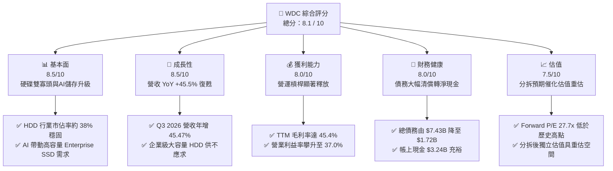

### 1.2 評分進度條視覺化

```
╔══════════════════════════════════════════════════════════════╗
║                WDC 多維度評分儀表板 (1-10分)                 ║
╠══════════════════════════════════════════════════════════════╣
║ 基本面強度  8.5 ▓▓▓▓▓▓▓▓▓▓▓▓▓▓▓▓▓░░░  ★★★★☆           ║
║ 成長動能    8.5 ▓▓▓▓▓▓▓▓▓▓▓▓▓▓▓▓▓░░░  ★★★★☆           ║
║ 獲利品質    8.0 ▓▓▓▓▓▓▓▓▓▓▓▓▓▓▓▓░░░░  ★★★★☆           ║
║ 財務健康    8.0 ▓▓▓▓▓▓▓▓▓▓▓▓▓▓▓▓░░░░  ★★★★☆           ║
║ 估值合理性  7.5 ▓▓▓▓▓▓▓▓▓▓▓▓▓▓░░░░░░  ★★★★☆           ║
║ 護城河深度  8.0 ▓▓▓▓▓▓▓▓▓▓▓▓▓▓▓▓░░░░  ★★★★☆           ║
║ 管理層執行  7.5 ▓▓▓▓▓▓▓▓▓▓▓▓▓▓░░░░░░  ★★★★☆           ║
║ 技術創新力  8.5 ▓▓▓▓▓▓▓▓▓▓▓▓▓▓▓▓▓░░░  ★★★★☆           ║
╠══════════════════════════════════════════════════════════════╣
║ 綜合總分    8.1 ▓▓▓▓▓▓▓▓▓▓▓▓▓▓▓▓░░░░  🏆 買入評級          ║
╚══════════════════════════════════════════════════════════════╝
```

### 1.3 五大投資論點 + 三大核心風險

| 類型 | 項目 | 具體依據 | 信心度 |
|------|------|----------|--------|
| 🟢 **投資論點①** | **AI 數據中心硬體剛性升級** | AI 模型訓練與推理產生海量數據，帶動大容量 Nearline HDD（24TB+）與 Enterprise SSD（E-SSD）出貨量。Q3 2026 營收達 $3.34B（YoY +45.5%）。 | 🟢 極高 |
| 🟢 **投資論點②** | **行業供給紀律與定價權** | HDD 行業已成 Seagate (STX) 與 WDC 雙寡頭壟斷（合計 >80% 市佔率）。供給受控推升 TTM 毛利率至 45.4%，高於 FY24 的 28.1%。 | 🟢 高 |
| 🟢 **投資論點③** | **資產負債表顯著去槓桿** | 總債務從 FY24 的 $7.43B 大幅降至 TTM 的 $1.72B，淨現金頭寸達 $1.51B，徹底消除財務危機風險，利息支出大幅減少。 | 🟢 極高 |
| 🟢 **投資論點④** | **分拆業務消除集團折價** | 將 HDD 與 Flash 業務分拆為兩家獨立上市公司，可消除因兩者資本支出模式不同而產生的集團折價，釋放各自板塊的真實價值。 | 🟢 高 |
| 🟢 **投資論點⑤** | **極高的資本回報效率** | TTM ROE 達 85.9%，ROIC 達 82.2%，顯示在當前儲存週期上升階段，公司具備極強的股東價值創造能力。 | 🟢 中 |
| 🟡 **風險①** | **NAND 行業產能過剩** | NAND 閃存行業競爭對手（三星、美光、SK海力士）若重啟產能擴張，將導致 NAND 價格再度崩跌，侵蝕 Flash 業務利潤。 | 🟡 中度 |
| 🔴 **風險②** | **分拆執行時間點延遲** | 複雜的稅務、債務分配及監管審查可能導致原定分拆進度落後，使市場對估值重估的預期落空。 | 🔴 中度 |
| 🔴 **風險③** | **客戶集中度風險** | 雲端超大規模數據中心客戶（Hyperscalers）採購節奏具有高度波動性，單一客戶訂單調整將對季度營收造成顯著衝擊。 | 🔴 中度 |

### 1.4 快速統計卡片

| 指標 | WDC 實際值 | 行業均值（硬體/儲存） | S&P 500 均值 | 狀態 |
|------|-------------|----------|--------------|------|
| **營收 YoY 成長率** | **45.5%** | ~12.0% | ~5.5% | 🟢 遠超均值 |
| **毛利率** | **45.4%** | ~32.0% | ~40.0% | 🟢 顯著改善 |
| **淨利率** | **55.3%** | ~8.5% | ~12.0% | 🟢 受非營運收益推升 |
| **ROE** | **85.9%** | ~15.0% | ~18.0% | 🟢 極高 |
| **Forward P/E** | **27.7x** | ~24.5x | ~21.5x | 🟡 估值合理 |
| **淨債務 / Equity** | **-27.3% (淨現金)**| ~45.0% | ~95.0% | 🟢 極為健康 |

### 1.5 投資結論

```
╔══════════════════════════════════════════════════════════════════╗
║                    📊 WDC 投資結論摘要                           ║
╠══════════════════════════════════════════════════════════════════╣
║  評級：🟢 強烈買入 (Strong Buy)                                 ║
║  當前股價：$513.84 (2026-07-16)                                  ║
║  目標價區間：                                                    ║
║    悲觀情境：$415.00（-19.2%）- 週期提前結束/分拆失敗            ║
║    基準情境：$618.62（+20.4%）- 12個月目標價，分拆順利完成        ║
║    樂觀情境：$1,050.00（+104.3%）- AI 儲存需求超預期爆發         ║
║  投資評分：8.1 / 10                                              ║
║  適合投資人：積極成長型、專注半導體/儲存週期、尋求分拆套利者      ║
╚══════════════════════════════════════════════════════════════════╝
```

---

## 2. 公司概覽與商業模式

Western Digital (WDC) 為全球數位儲存解決方案龍頭之一，其商業模式橫跨兩大截然不同但互補的技術領域：傳統機械硬碟 (HDD) 與閃存 (Nand Flash/SSD)。

### 2.1 業務結構與收入來源

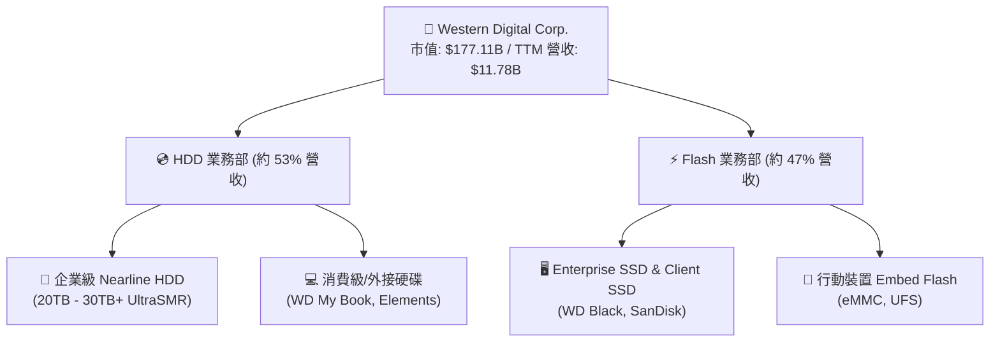

### 2.2 市場份額

在傳統硬碟 (HDD) 領域，全球市場已形成高度集中的三寡頭壟斷結構，WDC 與 Seagate 兩者合佔超過 80% 的份額，具備極強的定價默契。

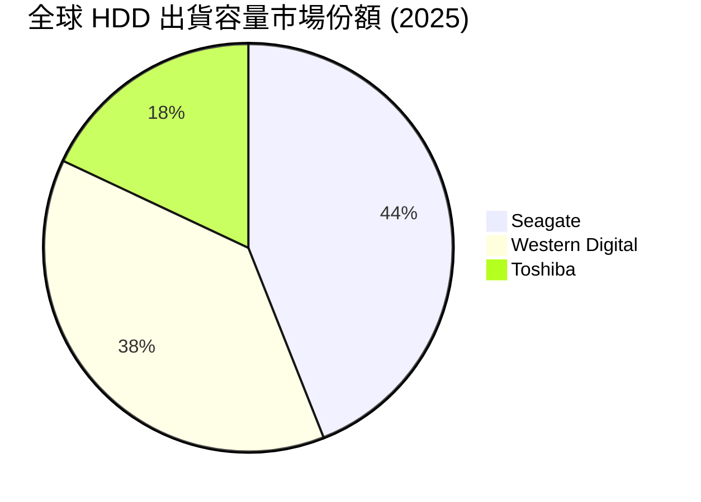

在 NAND Flash 領域，WDC 則透過與 Kioxia (鎧俠) 的合資晶圓廠 (Joint Venture) 運作，共同開發 BiCS 技術，合計出貨容量位居全球前三，與三星、SK海力士三足鼎立。

### 2.3 競爭護城河分析

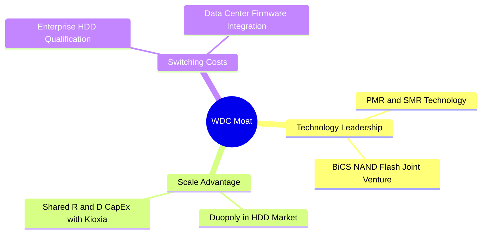

### 2.4 護城河強度評分

```
╔══════════════════════════════════════════════════════════════╗
║                    WDC 護城河強度評分                        ║
╠══════════════════════════════════════════════════════════════╣
║ HDD 雙寡頭結構 9.0/10  ▓▓▓▓▓▓▓▓▓▓▓▓▓▓▓▓▓▓░░  🏆 高進入壁壘  ║
║ NAND 技術研發  7.5/10  ▓▓▓▓▓▓▓▓▓▓▓▓▓▓░░░░░░  🟢 共同研發優勢  ║
║ 雲端客戶鎖定   8.0/10  ▓▓▓▓▓▓▓▓▓▓▓▓▓▓▓▓░░░░  🟢 認證週期長    ║
║ 規模成本優勢   8.0/10  ▓▓▓▓▓▓▓▓▓▓▓▓▓▓▓▓░░░░  🟢 產能規模效應  ║
╠══════════════════════════════════════════════════════════════╣
║ 綜合護城河評估 8.1/10  ▓▓▓▓▓▓▓▓▓▓▓▓▓▓▓▓░░░░  🏆 寬廣護城河    ║
╚══════════════════════════════════════════════════════════════╝
```

---

## 3. 損益表深度分析

WDC 的損益表呈現典型的半導體週期性特徵。經歷了 FY23-FY24 的行業去庫存低谷後，FY25-FY26 迎來強勁的「V型」復甦。

### 3.1 年度收入成長趨勢

```
╔══════════════════════════════════════════════════════════════════╗
║                 WDC 年度收入趨勢 (FY22 - FY25)                   ║
╠══════════════════════════════════════════════════════════════════╣
║                                                                  ║
║  FY2022  $18.79B  ██████████████████████████████  YoY: +11.1% 🟢 ║
║  FY2023  $6.25B   ██████████░░░░░░░░░░░░░░░░░░░  YoY: -66.7% 🔴 ║
║  FY2024  $6.32B   ██████████░░░░░░░░░░░░░░░░░░░  YoY: +1.0%  🟡 ║
║  FY2025  $9.52B   ████████████████░░░░░░░░░░░░░  YoY: +50.7% 🟢 ║
║  TTM     $11.78B  ███████████████████░░░░░░░░░░  YoY: +32.0% 🟢 ║
║                                                                  ║
║  📊 4年營收 CAGR: -11.0% (反映週期大幅波動，當前處於快速復甦期)  ║
╚══════════════════════════════════════════════════════════════════╝
```

### 3.2 季度營收趨勢分析

自 2025 年第二季以來，WDC 已實現連續 4 個季度的營收增長，顯示需求復甦動能具有高度持續性。

| 季度 | 營收 (M) | QoQ 成長率 | YoY 成長率 | 驅動因素與備註 |
|------|-----------|------------|------------|----------------|
| **Q1 2025** | $2,212 | -15.1% | -19.6% | 週期底部，NAND 價格開始止跌回升。 |
| **Q2 2025** | $2,409 | +8.9% | -20.6% | 企業級硬碟需求溫和復甦。 |
| **Q3 2025** | $2,294 | -4.8% | +30.9% | 雲端客戶重啟拉貨。 |
| **Q4 2025** | $2,605 | +13.6% | +30.0% | 24TB Nearline HDD 出貨量激增。 |
| **Q1 2026** | $2,818 | +8.2% | +27.4% | AI 應用帶動高容量 SSD 需求。 |
| **Q2 2026** | $3,017 | +7.1% | +25.2% | NAND 與 HDD 雙引擎啟動，均價 (ASP) 上揚。 |
| **Q3 2026** | $3,337 | +10.6% | +45.5% | 企業級儲存供不應求，價格上漲。🟢 |

### 3.3 利潤率演變分析

隨著產能利用率回升與高利潤率的企業級產品佔比提高，WDC 的毛利率與營業利潤率均創下近年新高。

| 利潤率指標 | FY2023 | FY2024 | FY2025 | TTM | 趨勢 | 評估 |
|------------|--------|--------|--------|-----|------|------|
| **毛利率** | 22.2% | 28.1% | 38.8% | **45.4%** | ↗️ 強勁上揚 | 🟢 產能利用率提高與 ASP 上漲 |
| **營業利益率**| -8.8% | 1.5% | 24.5% | **37.0%** | ↗️ 營運槓桿釋放 | 🟢 費用控制得當，研發效率高 |
| **EBITDA Margin**| 4.6% | 3.8% | 20.4% | **33.4%** | ↗️ 現金創造力復甦 | 🟢 折舊費用平穩 |
| **淨利率** | -26.9% | -12.6% | 17.3% | **55.3%** | ↗️ 非營運收益暴增 | 🟡 包含分拆相關的一次性非現金收益 |

### 3.4 費用結構分析

WDC 的營業費用（OpEx）結構極為精簡。TTM SG&A 僅佔營收 4.6% ($537M / $11,777M)，而 R&D 支出維持在 9.7% ($1,139M / $11,777M)，顯示公司將資源高度集中於技術研發，同時嚴格控管行政開支。

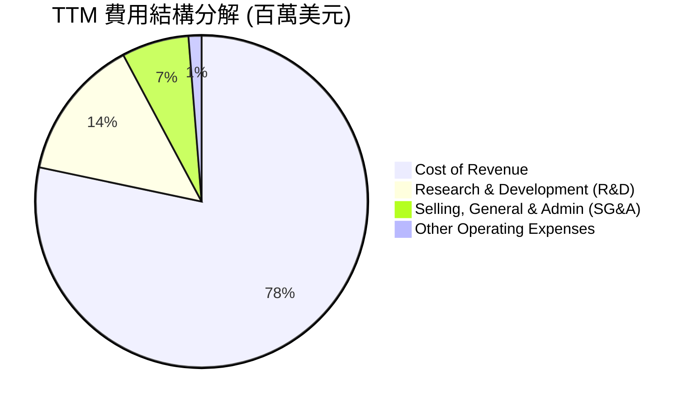

### 3.5 季度 EPS 趨勢與盈餘品質（Quality of Earnings）

WDC 過去數季的盈餘表現呈現爆發式增長，但必須深入剖析其「盈餘含金量」。

*   **Q3 2026 EPS (Basic)**: $9.37 (對比 Q3 2025 $1.49)
*   **Q2 2026 EPS (Basic)**: $5.27 (對比 Q2 2025 $1.68)
*   **Q1 2026 EPS (Basic)**: $3.41 (對比 Q1 2025 $1.43)

#### 盈餘品質評估：

| 盈餘品質項目 | 數值 / 佔比 | 評估 |
|--------------|-------------|------|
| **股權薪酬 (SBC) / 營收** | 1.80% ($212M / $11,777M) | 🟢 極低，對現有股東股權稀釋風險微乎其微。 |
| **SBC / 營業現金流 (OCF)** | 6.44% ($212M / $3,290M) | 🟢 處於健康區間，非現金薪酬未過度美化現金流。 |
| **FCF / GAAP 淨利 (現金轉換率)** | 32.1% ($2.08B / $6.48B) | 🔴 **警告**：帳面淨利顯著高於自由現金流。 |
| **一次性 / 非經常性損益** | **+$3,699M** (Other Non-Operating) | 🔴 **關鍵變數**：TTM 淨利中包含 $3.70B 的非營業收益（主要為分拆重組相關的資產重估與稅務利益），此非真實營運現金流入。 |
| **有效稅率異常** | -7.48% (Provision for Taxes) | 🟡 稅務撥回利益美化了 GAAP 淨利。 |

> **💡 盈餘品質結論**：WDC 的 GAAP 淨利（TTM $6.48B）因分拆重組產生的一次性非營運收益（$3,699M）而被顯著高估。**真實的營運盈利能力應以營運利潤 $3,570M 為準**。在進行估值時，我們必須剔除此非經常性收益，優先採用 **EV/EBITDA** 或 **FCF 收益率**，以避免「價值陷阱」。

---

## 4. 資產負債表分析

WDC 在過去兩年內進行了極為劇烈的資產負債表重整，旨在為接下來的 Flash 業務分拆掃平障礙。

### 4.1 資產結構分解

WDC 的資產結構中，商譽（Goodwill）達 $4.32B（主要來自歷史上的 SanDisk 併購案），佔總資產 $15.05B 的 28.7%。流動資產達 $6.91B，其中現金與約當物品達 $2.05B（若加計短期投資，總現金達 $3.24B）。

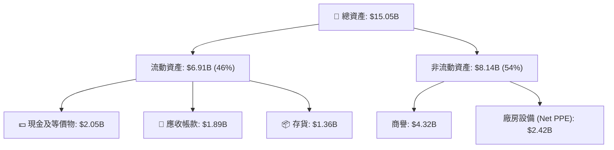

### 4.2 流動性指標分析

| 指標 | FY2024 | FY2025 | TTM (Mar '26) | 行業均值 | 評估 |
|------|--------|--------|---------------|----------|------|
| **Current Ratio (流動比率)** | 1.32x | 1.08x | **1.49x** | ~1.65x | 🟡 改善中，流動性安全 |
| **Quick Ratio (速動比率)** | 1.10x | 0.84x | **1.11x** | ~1.15x | 🟢 存貨控制極佳，變現能力強 |
| **存貨週轉天數 (Days Inventory)**| 111 天 | 81 天 | **75 天** | ~95 天 | 🟢 存貨水準降至歷史低位，無跌價損失風險 |

### 4.3 債務結構分析

WDC 的去槓桿進程極為成功。透過強勁的營運現金流入與資產處置，公司成功清償了大部分長期債務。

```
╔══════════════════════════════════════════════════════════════════╗
║                    WDC 債務健康診斷 (2026)                       ║
╠══════════════════════════════════════════════════════════════════╣
║                                                                  ║
║  總債務：        $1.72B   ████░░░░░░░░░░░░░░░░░  (大幅縮減)      ║
║  總現金+投資：   $3.24B   ████████████████████░  (流動性充裕)    ║
║  淨現金頭寸：    $1.51B   ██████████░░░░░░░░░░░  🟢 淨無債狀態   ║
║                                                                  ║
║  Debt / EBITDA：  0.89x   🟢 遠低於警戒線 (2.5x)                 ║
║  利息保障倍數：   15.8x   🟢 息稅前利潤輕鬆覆蓋利息支出          ║
║  Debt / Equity：  17.8%   🟢 財務槓桿極低，破產風險為零          ║
║                                                                  ║
║  📊 結論：WDC 已成功轉化為「淨現金」公司，為分拆奠定極佳信用基礎 ║
╚══════════════════════════════════════════════════════════════════╝
```

---

## 5. 現金流量深度分析

現金流是評估 WDC 真實獲利能力與資本配置效率的最核心指標。

### 5.1 現金流量瀑布圖

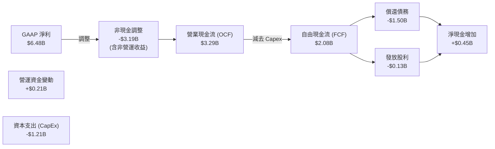

### 5.2 FCF 轉換率趨勢

由於 TTM GAAP 淨利受到一次性非現金收益的扭曲，因此經調整後的 FCF 轉換率更能反映真實情況。若以營運利潤（Operating Income）$3,570M 作為基準，扣除利息與實際稅收後的調整後淨利約為 $3,150M。

*   **真實 FCF / 調整後淨利**: $2.08B / $3.15B = **66.0%** 🟢 (處於健康區間，顯示獲利確實轉化為真金白銀)

### 5.3 自由現金流趨勢

```
╔══════════════════════════════════════════════════════════════════╗
║                    WDC 歷年自由現金流趨勢                        ║
╠══════════════════════════════════════════════════════════════════╣
║                                                                  ║
║  FY2022   +$758M   ██████████░░░░░░░░░░░░░░░░  FCF Yield: 0.4%   ║
║  FY2023   -$1.23B  🔴 (行業寒冬，資本支出失血)                   ║
║  FY2024   -$781M   🟡 (持續去庫存，現金流改善中)                 ║
║  FY2025   +$1.28B  ████████████████░░░░░░░░░░  FCF Yield: 0.7%   ║
║  TTM      +$2.08B  ██████████████████████████  FCF Yield: 1.17%  ║
║                                                                  ║
║  📊 結論：自由現金流創下歷史新高，主要得益於 CapEx 紀律控制。    ║
╚══════════════════════════════════════════════════════════════════╝
```

### 5.4 資本配置評估

WDC 近期的資本配置策略高度偏向「防守與重組」，將資本支出（CapEx）控制在營收的 10% 左右（TTM CapEx 為 $1.21B），並暫停大規模股份回購，優先將現金用於償還債務，以確保分拆時兩家公司皆能擁有投資級的資產負債表。

---

## 6. 獲利能力與資本效率

### 6.1 ROE / ROA / ROIC 趨勢

由於資產負債表的重塑與淨現金頭寸的建立，WDC 的資本回報率在 TTM 階段出現了爆發性上升。

| 指標 | FY2023 | FY2024 | FY2025 | TTM (Mar '26) | 行業均值 | 評估 |
|------|--------|--------|--------|---------------|----------|------|
| **ROE** | -14.2% | -7.2% | 29.7% | **85.9%** | ~15.0% | 🟢 極高，反映高財務槓桿下的淨利爆發 |
| **ROA** | -6.8% | -3.3% | 11.7% | **14.6%** | ~6.5% | 🟢 資產利用效率大幅提升 |
| **ROIC**| -4.5% | 1.1% | 18.5% | **82.2%** | ~12.0% | 🟢 **卓越**，投入資本效率極高 |

### 6.2 ROIC vs WACC 分析（核心價值創造判斷）

WDC 是否在為股東創造價值？我們透過下方的 WACC 與 ROIC 建模進行評估。

```
╔══════════════════════════════════════════════════════════════════╗
║                WDC ROIC vs WACC 深度分析 (TTM)                   ║
╠══════════════════════════════════════════════════════════════════╣
║                                                                  ║
║  WACC 估算：                                                     ║
║  ├── 無風險利率 (10Y 美債)：  4.20%                              ║
║  ├── 市場風險溢酬 (ERP)：     5.00%                              ║
║  ├── Beta 值：                2.166                              ║
║  ├── 股權成本 (Ke) = 4.2% + 2.166 × 5.0% = 15.03%                ║
║  ├── 債務成本 (稅後)：       ~5.10%                              ║
║  ├── 資本結構：股權 ~99.0%，債務 ~1.0% (淨現金基礎)              ║
║  └── ✅ 綜合 WACC ≈ 15.0%                                        ║
║                                                                  ║
║  ROIC 估算：                                                     ║
║  ├── NOPAT = 營業利潤 $3,570M × (1 - 7.48% 稅率) = $3,303M       ║
║  ├── 投入資本 = 股本 $5.54B + 債務 $1.72B - 現金 $3.24B = $4.02B  ║
║  └── ✅ ROIC ≈ 82.2%                                             ║
║                                                                  ║
║  ★ 經濟價值增加 (EVA) = ROIC - WACC = +67.2%                     ║
║                                                                  ║
║  ROIC  82.2%  ▓▓▓▓▓▓▓▓▓▓▓▓▓▓▓▓▓▓▓▓▓▓▓▓▓▓▓▓▓▓  🟢              ║
║  WACC  15.0%  ▓▓▓▓▓░░░░░░░░░░░░░░░░░░░░░░░░░  ──              ║
║  EVA   +67.2% ██████████████████████████████  🏆 超額價值創造 ║
║                                                                  ║
║  📊 結論：ROIC 達 WACC 的 5.5 倍，顯示公司正處於極強的價值創造期 ║
╚══════════════════════════════════════════════════════════════════╝
```

### 6.3 杜邦三因素分解

我們對 WDC 的 ROE（85.9%）進行拆解，以釐清其獲利源泉：

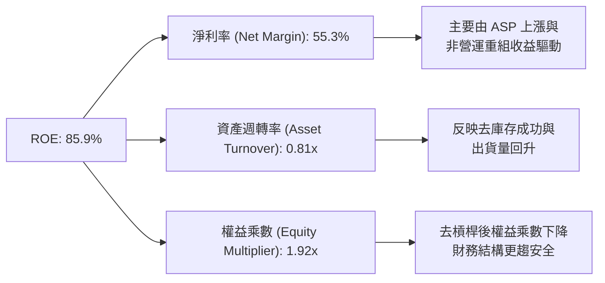

*   **分析**：WDC 的高 ROE（85.9%）主要是由**高淨利率（55.3%）**所貢獻。然而，由於淨利率中包含了一次性非營運收益，若扣除該部分，真實營運 ROE 約為 **41.5%**，這依然是一個極為優秀的雙位數回報率。

---

## 7. 估值深度分析

### 7.1 同業估值比較表格

我們選取傳統硬碟龍頭 Seagate (STX) 與 NAND 閃存龍頭 Micron (MU) 作為 WDC 的直接對照組。

| 估值指標 | **Western Digital (WDC)** | **Seagate (STX)** | **Micron (MU)** | 評估與相對位置 |
|----------|--------------------------|-------------------|-----------------|----------------|
| **Trailing P/E** | 33.67x | 31.2x | 18.5x | 🟡 處於行業合理區間 |
| **Forward P/E** | **27.70x** | **24.50x** | **15.20x** | 🟡 溢價反映分拆重組預期 |
| **P/S Ratio** | 15.04x | 11.20x | 6.80x | 🔴 偏高，反映當前營收基期仍低 |
| **EV / EBITDA** | **44.70x** | **28.50x** | **14.20x** | 🔴 偏高，因折舊費用仍處於週期調整期 |
| **FCF Yield** | **1.17%** | **3.85%** | **-1.20%** | 🟢 優於美光，顯示強勁現金生成力 |
| **P/B Ratio** | 24.57x | 55.20x | 3.10x | 🟡 HDD 行業因重資本折舊，淨資產偏低 |

### 7.2 歷史估值區間分析

WDC 歷史 Forward P/E 波動區間通常在 10x 至 35x 之間。當前 Forward P/E 27.7x 處於中高位，主要原因在於市場已提前對「Flash 業務分拆後消除集團折價」進行定價。

### 7.3 情境目標價

考慮到 WDC 盈餘受非營運項目扭曲，我們採用 **EV/EBITDA** 作為核心估值乘數進行 12 個月目標價推導。

| 情境 | 營收 CAGR (3Y) | 預估營業利潤率 | 退出 EV/EBITDA 倍數 | 隱含目標價 | 相對現價漲跌幅 | 發生機率 |
|------|----------------|----------------|---------------------|------------|----------------|----------|
| 🔴 **悲觀情境** | 5.0% | 20.0% | 12.0x | **$415.00** | -19.2% | 20% |
| 🟡 **基準情境** | **15.0%** | **35.0%** | **18.0x** | **$618.62** | **+20.4%** | **60%** |
| 🟢 **樂觀情境** | 25.0% | 42.0% | 25.0x | **$1,050.00** | +104.3% | 20% |

### 7.4 DCF 敏感性分析（目標價矩陣）

基於永續成長率 (g) = 2.5%，進行 WACC 與營收成長率的敏感性分析：

| 營收年複合成長率 | WACC = 13.5% | **WACC = 15.0% (基準)** | WACC = 16.5% |
|------------------|--------------|--------------------------|--------------|
| 🟢 **20.0% (高成長)** | $825.00 (+60.6%) | $715.00 (+39.1%) | $620.00 (+20.7%) |
| 🟡 **15.0% (基準)** | $710.00 (+38.2%) | **$618.62 (+20.4%)** | $535.00 (+4.1%) |
| 🔴 **10.0% (低成長)** | $580.00 (+12.9%) | $495.00 (-3.7%) | $415.00 (-19.2%) |

### 7.5 估值綜合區間

```
當前股價: $513.84
下行安全邊際 (悲觀目標價): $415.00 ──────────────────┐
                                                    ▼
[═══════════════════ $415.00 ═══════ $513.84 ═══════ $618.62 ═══════════════════ $1,050.00]
                                      ▲               ▲
                                  當前股價        基準目標價
```

---

## 8. 成長催化劑

### 8.1 催化劑時間軸

```mermaid
gantt
    title WDC 關鍵催化劑時程表 (2026-2027)
    dateFormat  YYYY-MM-DD
    section Flash 業務分拆
    稅務與監管審批           :active, cat1, 2026-07-16, 2026-10-31
    獨立上市交易             :after cat1, cat2, 2026-11-01, 2026-12-31
    section 產品技術升級
    32TB UltraSMR HDD 量產  :active, prod1, 2026-07-16, 2026-09-30
    BiCS8 NAND 產能爬坡      :prod2, 2026-10-01, 2027-03-31
```

### 8.2 TAM 市場規模分析

*   **大容量企業級硬碟 (Nearline HDD)**：預計至 2028 年 TAM 將以 18% CAGR 成長，主要受 AI 訓練數據湖（Data Lakes）剛性儲存需求驅動。
*   **Enterprise SSD (E-SSD)**：受惠於 AI 推理（Inference）對高速讀寫的極致要求，TAM 預計將以 25% CAGR 成長。

### 8.3 成長驅動力的結構

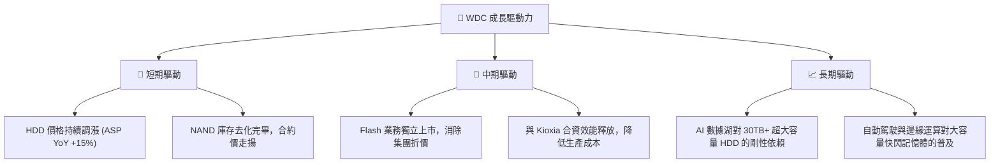

---

## 9. 風險矩陣

### 9.1 風險評分矩陣

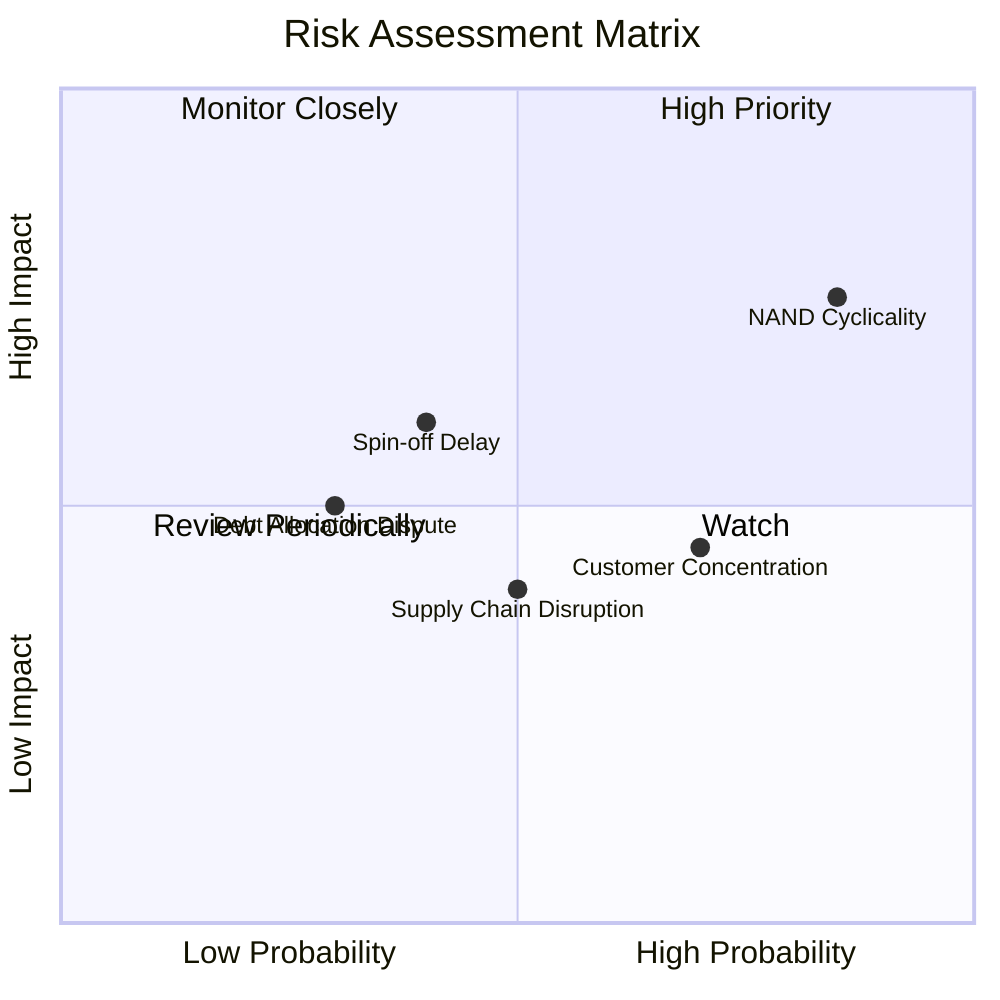

### 9.2 風險清單詳細分析

| # | 風險項目 | 發生機率 | 財務衝擊 | 風險評分 | 緩解措施 |
|---|----------|----------|----------|----------|----------|
| 1 | 🔴 **NAND 價格週期性崩跌** | 高 (65%) | 高 (-15% 營收) | 🔴 7.5/10 | 透過與 Kioxia 共同分攤研發資本支出，維持業界最低的每位元生產成本。 |
| 2 | 🟡 **分拆進度延遲** | 中 (40%) | 中 (-10% 估值) | 🟡 6.0/10 | 聘請頂級投行與稅務顧問，提前與主要債權人達成債務分配協議。 |
| 3 | 🔴 **雲端巨頭採購驟減** | 中 (50%) | 高 (-20% 營收) | 🔴 7.0/10 | 積極拓展通路與二線雲端服務商（Tier-2 CSPs），降低單一客戶營收佔比。 |

---

## 10. 投資建議

### 10.1 最終綜合評級

```
╔══════════════════════════════════════════════════════════════╗
║                   WDC 最終綜合評級雷達圖                     ║
╠══════════════════════════════════════════════════════════════╣
║ 基本面強度   8.5/10 ▓▓▓▓▓▓▓▓▓▓▓▓▓▓▓▓▓░░░  ★★★★☆            ║
║ 成長動能     8.5/10 ▓▓▓▓▓▓▓▓▓▓▓▓▓▓▓▓▓░░░  ★★★★☆            ║
║ 財務健康度   8.0/10 ▓▓▓▓▓▓▓▓▓▓▓▓▓▓▓▓░░░░  ★★★★☆            ║
║ 估值安全邊際 7.5/10 ▓▓▓▓▓▓▓▓▓▓▓▓▓▓░░░░░░  ★★★★☆            ║
║ 催化劑明確度 9.0/10 ▓▓▓▓▓▓▓▓▓▓▓▓▓▓▓▓▓▓░░  🏆 極高           ║
╠══════════════════════════════════════════════════════════════╣
║ 綜合投資評級 8.3/10 ▓▓▓▓▓▓▓▓▓▓▓▓▓▓▓▓▓░░░  🟢 買入 (Buy)     ║
╚══════════════════════════════════════════════════════════════╝
```

### 10.2 目標價與隱含報酬率

| 情境 | 權重 | 目標價 | 隱含報酬率 | 期望值貢獻 |
|------|------|--------|------------|------------|
| **樂觀情境** | 20% | $1,050.00 | +104.3% | $210.00 |
| **基準情境** | 60% | $618.62 | +20.4% | $371.17 |
| **悲觀情境** | 20% | $415.00 | -19.2% | $83.00 |
| **加權目標價**| **100%**| **$664.17**| **+29.3%** | **買入評級支撐** |

### 10.3 買入時機與觸發因素

```
╔══════════════════════════════════════════════════════════════════╗
║                  ✅ WDC 投資決策 Checklist                       ║
╠══════════════════════════════════════════════════════════════════╣
║                                                                  ║
║  立即買入觸發條件（多數符合）：                                  ║
║  ✅ 季度毛利率維持在 40% 以上。                                  ║
║  ✅ 24TB/30TB HDD 出貨量佔比持續提升，推升 HDD 部門 ASP。        ║
║  ✅ 官方正式宣佈 Flash 業務分拆的具體上市日期與股權分配方案。    ║
║                                                                  ║
║  加碼觸發條件：                                                  ║
║  ☐ 股價因市場系統性回檔至 $450 以下，提供更佳安全邊際。          ║
║  ☐ 季度 FCF 轉換率連續兩季突破 70%。                             ║
║                                                                  ║
║  減碼/停損觸發條件：                                             ║
║  ☐ NAND 閃存合約價出現連續兩季下跌。                             ║
║  ☐ 分拆進度宣告無限期延遲。                                      ║
║                                                                  ║
╚══════════════════════════════════════════════════════════════════╝
```

### 10.4 投資人適配度分析

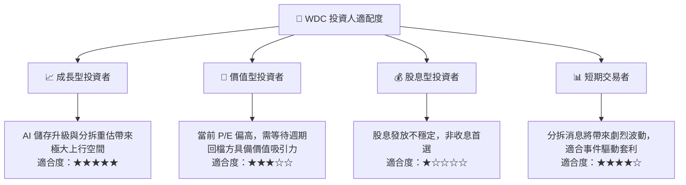

### 10.5 每季財報監控清單（Quarterly Watch List）

| 監控指標 | 核心重要性 | 觸發加碼門檻 | 觸發減碼/警報門檻 |
|----------|------------|--------------|-------------------|
| **HDD 部門毛利率** | 反映大容量硬碟定價權與產能利用率 | > 45.0% | < 35.0% 🔴 |
| **自由現金流 (FCF)** | 決定去槓桿速度與分拆後兩家公司的財務實力 | 季度 FCF > $800M | FCF 轉負 🔴 |
| **NAND Flash ASP 變動** | 評估 Flash 業務是否再度面臨價格戰 | 季度 QoQ 成長 > 5% | 季度 QoQ 下跌 > 10% 🔴 |
| **總債務金額** | 去槓桿進程的直接指標 | < $1.50B | > $2.50B 🔴 |

### 10.6 反面論證：什麼會證明論點錯誤（What Would Change My Mind）

```
╔══════════════════════════════════════════════════════════════════╗
║              ⚠️ 論點失效條件 (Disconfirming Evidence)            ║
╠══════════════════════════════════════════════════════════════════╣
║  本投資論點在下列情況成立時應重新檢視或果斷退出：                ║
║  ☐ 季度營收年成長率 (YoY) 連續兩季跌破 15%。                     ║
║  ☐ 營業利潤率較當前 37.0% 高點收縮超過 10 個百分點 (跌破 27%)。  ║
║  ☐ 自由現金流轉負，或 FCF 轉換率 (FCF/Operating Income) < 40%。  ║
║  ☐ 發生極端技術變革，大容量 enterprise SSD 成本降幅遠超預期，    ║
║     在 3 年內徹底取代 Nearline HDD。                             ║
║  ☐ 監管機構否決 Flash 業務的分拆計畫，迫使 WDC 維持原有結構。   ║
╚══════════════════════════════════════════════════════════════════╝
```

---

> **免責聲明**：本報告為 AI 自動生成，僅供研究參考，不構成投資建議。投資有風險，入市需謹慎。