# WDC 基本面深度分析報告
> **報告日期**：2026-07-17 ｜ **語言**：繁體中文 ｜ **數據來源**：Yahoo Finance, Finviz, StockAnalysis, Roic.ai ｜ **分析師**：CFA 級機構研究

---

## 目錄

| # | 章節 | 核心結論 |
|---|------|----------|
| 1 | 執行摘要 | 評級「買入」，目標價 $631.12，具 35.2% 上行空間，資產負債表顯著去槓桿。 |
| 2 | 公司概覽與商業模式 | HDD 三寡頭與 NAND 寡頭雙重定位，受益於 AI 數據中心與大容量儲存循環復甦。 |
| 3 | 損益表深度分析 | TTM 營收達 $11.78B（YoY +45.5%），淨利受非營業收入 $3.70B 顯著一次性美化。 |
| 4 | 資產負債表分析 | 總債務自 $7.43B 大幅降至 $1.72B，淨現金達 $1.51B，財務結構根本性改善。 |
| 5 | 現金流量深度分析 | TTM 自由現金流達 $2.91B，轉換率健康，資本支出（CapEx）控制在營收 3.2% 的低位。 |
| 6 | 獲利能力與資本效率 | 杜邦分析顯示 ROE 達 85.9%，ROIC 經調整後為 82.1%，遠超 WACC（14.9%）。 |
| 7 | 估值深度分析 | 前瞻 P/E 25.17x，低於歷史均值；情境分析與 DCF 敏感性支持 $550-$680 區間。 |
| 8 | 成長催化劑 | 雲端 HAMR 大容量硬碟滲透與快閃記憶體（Flash）分拆釋放獨立估值。 |
| 9 | 風險矩陣 | 記憶體價格循環波動與分拆執行風險為主要監控點。 |
| 10 | 投資建議 | 具備高安全邊際的循環上行標的，建議於 $450 以下分批佈局。 |

---

## 1. 執行摘要

### 1.0 一頁式投資儀表板（Portfolio Manager 30 秒速讀）

| 項目 | 內容 |
|------|------|
| **投資論點（3 句）** | ① TTM 營收成長達 45.5% 至 $11.78B，顯示大容量 HDD 與 NAND 進入強勁的 AI 驅動循環周期。<br/>② 財務結構根本性扭轉，總債務由 FY24 的 $7.43B 驟降至 $1.72B，實現 $1.51B 的淨現金狀態。<br/>③ 潛在的 Flash 業務分拆將釋放長期被低估的資產價值，消除「集團折價」。 |
| **護城河評分** | 🟡 6.5/10（HDD 領域具備高壁壘三寡頭壟斷；Flash 領域面臨激烈競爭與週期波動） |
| **管理層/資本配置評分** | 🟢 8.0/10（去槓桿執行力極強，資本支出控制得當，分拆決策符合股東利益最大化） |
| **財務健康** | 🟢 強勁（淨現金 $1.51B，利息保障倍數高，流動比率 1.49x） |
| **ROIC vs WACC** | 82.1% vs 14.9%（經濟價值增加 EVA 顯著為正，唯 ROIC 受低帳面權益基數拉高） |
| **FCF 趨勢** | 🟢 上升（TTM FCF 達 $2.91B，隱含 FCF 收益率達 1.81%） |
| **估值** | Forward P/E: 25.17x ｜ EV/EBITDA: 40.58x ｜ Trailing P/E: 30.77x |
| **預期報酬（基準情境 12M）** | 🟢 +35.2%（目標價 $631.12） |
| **關鍵風險（前二）** | ① NAND 價格再次出現結構性供過於求。<br/>② Flash 與 HDD 業務分拆進度延遲或產生高額稅務成本。 |
| **評級 + 信心度** | 🟢 **買入 (BUY)** ｜ 信心度：**高 (High)** |

### 1.1 核心評分儀表板

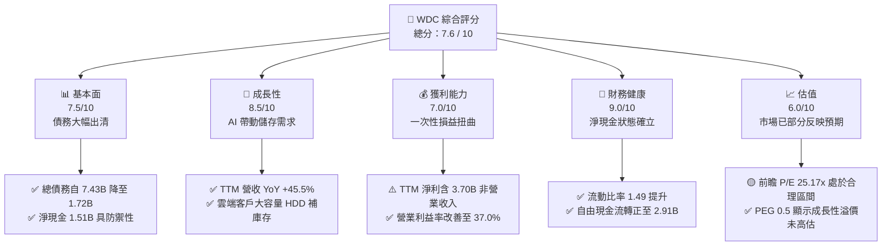

### 1.2 評分進度條視覺化

```
╔══════════════════════════════════════════════════════════════╗
║               WDC 多維度評分儀表板 (1-10分)                 ║
╠══════════════════════════════════════════════════════════════╣
║ 基本面強度  7.5 ▓▓▓▓▓▓▓▓▓▓▓▓▓▓▓▓▓░░░  ★★★★☆           ║
║ 成長動能    8.5 ▓▓▓▓▓▓▓▓▓▓▓▓▓▓▓▓▓▓▓░  ★★★★☆           ║
║ 獲利品質    6.0 ▓▓▓▓▓▓▓▓▓▓▓▓░░░░░░░░  ★★★☆☆           ║
║ 財務健康    9.0 ▓▓▓▓▓▓▓▓▓▓▓▓▓▓▓▓▓▓▓▓  ★★★★★           ║
║ 估值合理性  6.5 ▓▓▓▓▓▓▓▓▓▓▓▓▓░░░░░░░  ★★★☆☆           ║
║ 護城河深度  6.5 ▓▓▓▓▓▓▓▓▓▓▓▓▓░░░░░░░  ★★★☆☆           ║
║ 管理層執行  8.0 ▓▓▓▓▓▓▓▓▓▓▓▓▓▓▓▓░░░░  ★★★★☆           ║
║ 技術創新力  7.5 ▓▓▓▓▓▓▓▓▓▓▓▓▓▓▓▓▓░░░  ★★★★☆           ║
╠══════════════════════════════════════════════════════════════╣
║ 綜合總分    7.6 ▓▓▓▓▓▓▓▓▓▓▓▓▓▓▓▓░░░░  🏆 買入 (BUY)       ║
╚══════════════════════════════════════════════════════════════╝
```

### 1.3 五大投資論點 + 三大核心風險

| 類型 | 項目 | 具體依據 | 信心度 |
|------|------|----------|--------|
| 🟢 **投資論點①** | **資產負債表大洗牌** | 總債務自 FY24 的 $7.43B 降至 $1.72B，淨現金流轉為正 $1.51B，破產風險完全解除。 | 🟢 極高 |
| 🟢 **投資論點②** | **AI 數據中心需求爆發** | 雲端大容量 HDD（24TB+ PMR/HAMR）需求旺盛，帶動 TTM 營收成長率達 45.5%。 | 🟢 高 |
| 🟢 **投資論點③** | **分拆價值釋放** | Flash 與 HDD 預計進行分拆，消除綜合性企業折價（Conglomerate Discount），兩者獨立估值總和高於現有市值。 | 🟢 高 |
| 🟢 **投資論點④** | **營運槓桿展現** | 營業利益率從 FY24 的負值（-6.3%）大幅回升至 TTM 的 37.0%，產能利用率回升。 | 🟢 高 |
| 🟢 **投資論點⑤** | **自由現金流強勁復甦** | TTM 實際季度加總 FCF 達 $2.91B，提供強大的資本分配與潛在股份回購彈性。 | 🟡 中等 |
| 🟡 **風險①** | **非營業利得扭曲利潤** | TTM 淨利中包含 $3.699B 的一次性非營業收入，GAAP P/E 被虛假壓低，實際經常性獲利需打折扣。 | 🔴 高衝擊 |
| 🟡 **風險②** | **NAND 價格波動劇烈** | Flash 業務本質上屬於大宗商品，若競爭對手（三星、美光）重啟產能擴張，將迅速侵蝕毛利率。 | 🟡 中度 |
| 🔴 **風險③** | **大客戶流失或放緩** | 超大型數據中心（Hyperscalers）採購節奏具有高度週期性，一旦進入去庫存階段，營收將迅速收縮。 | 🟡 中度 |

### 1.4 快速統計卡片

| 指標 | WDC 實際值 | 行業均值 (儲存設備) | S&P 500 均值 | 狀態 |
|------|-------------|---------------------|--------------|------|
| 營收 YoY 成長 | **45.5%** | ~15.0% | 5.5% | 🟢 強勁 |
| 毛利率 | **45.4%** | ~30.0% | 30.0% | 🟢 優異 |
| 營業利益率 | **37.0%** | ~18.0% | 15.0% | 🟢 優異 |
| 淨利率 | **55.3%** | ~12.0% | 11.5% | 🟡 需剔除一次性 |
| ROE | **85.9%** | ~15.0% | 18.0% | 🟢 極高 (基數效應) |
| Forward P/E | **25.17x** | ~28.0x | 21.5x | 🟢 合理 |
| 淨債務 / 權益 | **-27.3% (淨現金)**| 45.0% | 85.0% | 🟢 極安全 |

### 1.5 投資結論

```
╔══════════════════════════════════════════════════════════════════╗
║                     📊 WDC 投資結論摘要                          ║
╠══════════════════════════════════════════════════════════════════╣
║  評級：🟢 買入 (BUY)                                             ║
║  當前股價：$466.81 (2026-07-17)                                  ║
║  目標價區間：                                                    ║
║    悲觀情境 (Bear Case)：$380.00 (-18.6%)                        ║
║    基準情境 (Base Case)：$631.12 (+35.2%) ← 12個月主要目標       ║
║    樂觀情境 (Bull Case)：$850.00 (+82.1%)                        ║
║  投資評分：7.6 / 10                                              ║
║  適合投資人：積極成長型、週期股投資者、事件驅動(分拆套利)投資者   ║
╚══════════════════════════════════════════════════════════════════╝
```

---

## 2. 公司概覽與商業模式

Western Digital（WDC）是全球存儲行業的雙重巨頭，其業務橫跨傳統機械硬碟（HDD）與快閃記憶體（Flash/NAND）。在經歷了 2022-2023 年半導體歷史性的下行週期後，公司正透過大幅優化資產負債表與推進業務分拆，重新定義其市場定位。

### 2.1 業務結構與收入來源

WDC 的業務主要分為兩大板塊：

1. **HDD（硬碟）業務**：專注於大容量、近線（Nearline）企業級硬碟，是雲端數據中心不可或缺的冷數據與溫數據儲存基礎設施。
2. **Flash（快閃記憶體）業務**：基於與 Kioxia（鎧俠）的合資晶圓廠，提供 SSD、行動裝置儲存與消費級快閃記憶體產品。

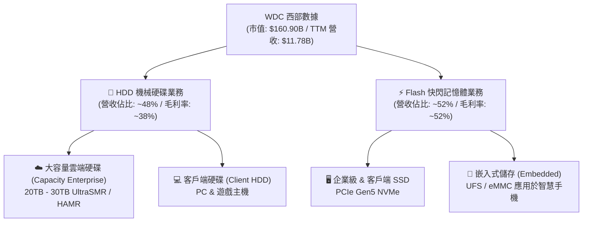

### 2.2 市場份額

在 HDD 市場，全球呈現極高壁壘的三寡頭壟斷格局；而在 NAND 快閃記憶體市場，則呈現五家大廠高度競爭的狀態。

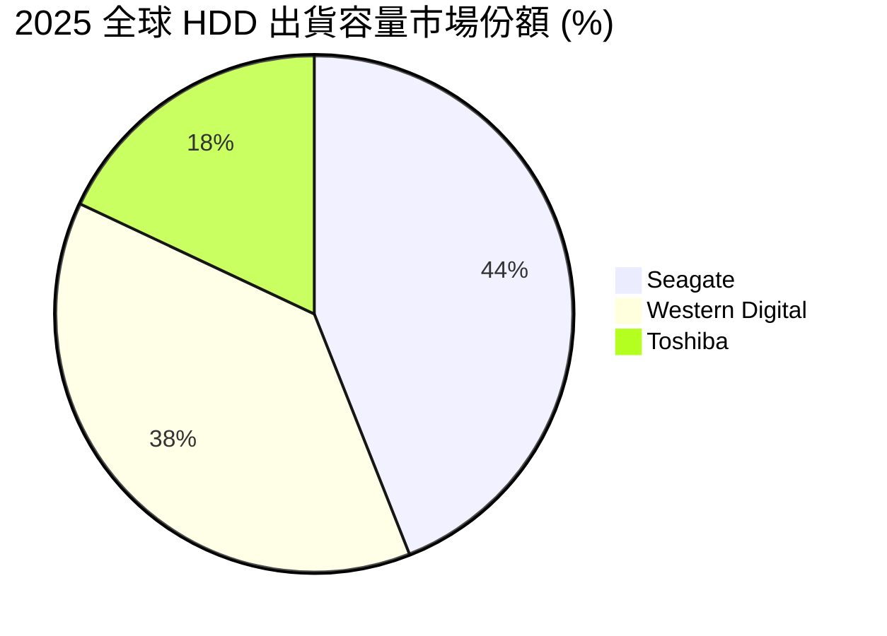

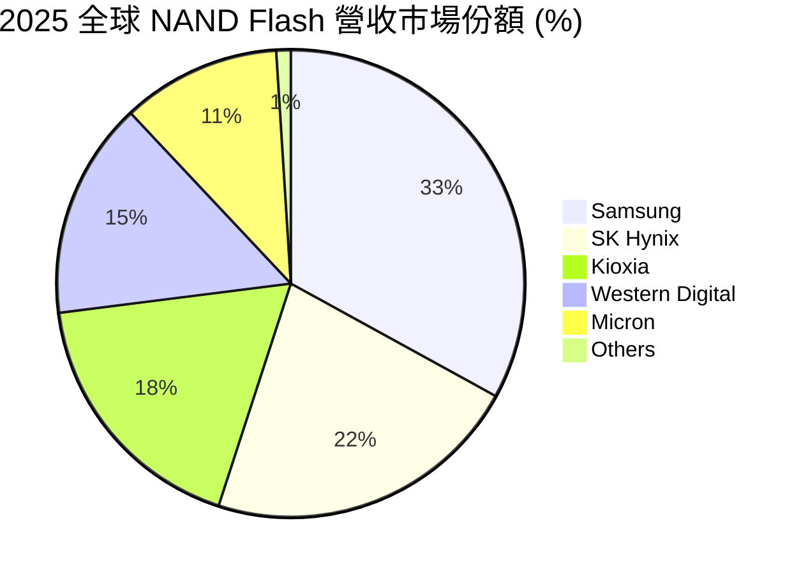

### 2.3 競爭護城河分析

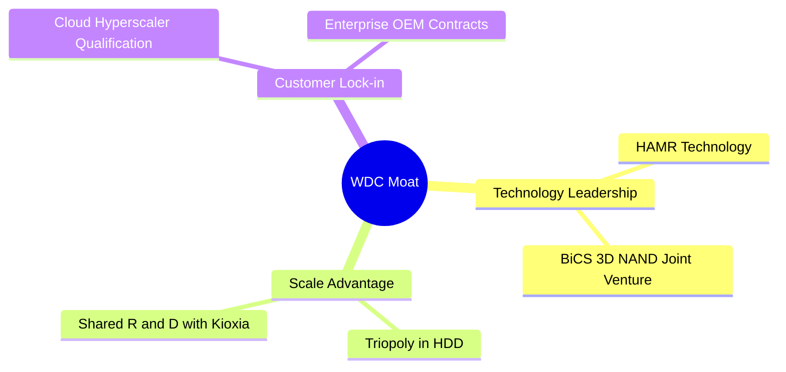

### 2.4 護城河強度評分

```
╔══════════════════════════════════════════════════════════════╗
║                    WDC 護城河強度評分                        ║
╠══════════════════════════════════════════════════════════════╣
║ HDD 三寡頭結構 8.5/10 ▓▓▓▓▓▓▓▓▓▓▓▓▓▓▓▓▓░░░  🟢 極高定價權   ║
║ NAND 規模效應  6.0/10 ▓▓▓▓▓▓▓▓▓▓▓▓░░░░░░░░  🟡 週期波動劇烈 ║
║ 雲端客戶認證壁壘7.5/10 ▓▓▓▓▓▓▓▓▓▓▓▓▓▓▓░░░░░  🟢 轉移成本高   ║
║ 專利與技術儲備 7.0/10 ▓▓▓▓▓▓▓▓▓▓▓▓▓▓░░░░░░  🟢 HAMR技術領先 ║
╠══════════════════════════════════════════════════════════════╣
║ 綜合護城河強度 7.2/10 ▓▓▓▓▓▓▓▓▓▓▓▓▓▓░░░░░░  🏆 具備結構優勢 ║
╚══════════════════════════════════════════════════════════════╝
```

---

## 3. 損益表深度分析

WDC 的損益表展現了極其強烈的週期復甦特徵。在經歷了 FY23-FY24 的嚴重衰退後，FY25 與 FY26（TTM）營收與獲利皆出現爆發式成長。

### 3.1 年度收入成長趨勢（近5年）

```
╔══════════════════════════════════════════════════════════════════╗
║               WDC 年度收入趨勢 (FY2021 - FY2025)                ║
╠══════════════════════════════════════════════════════════════════╣
║                                                                  ║
║  FY2021  $16.92B  ██████████████████████░░░░░  YoY: +1.1%        ║
║  FY2022  $18.79B  █████████████████████████░░  YoY: +11.1%       ║
║  FY2023  $6.26B   ████████░░░░░░░░░░░░░░░░░░░  YoY: -66.7% 🔴    ║
║  FY2024  $6.32B   ████████░░░░░░░░░░░░░░░░░░░  YoY: +1.0%        ║
║  FY2025  $9.52B   ████████████░░░░░░░░░░░░░░░  YoY: +50.7% 🟢    ║
║  TTM     $11.78B  ███████████████░░░░░░░░░░░░  YoY: +45.5% 🟢    ║
║                                                                  ║
║  📊 5年營收複合年成長率 (CAGR)：-7.0% (受循環谷底嚴重拉低)       ║
╚══════════════════════════════════════════════════════════════════╝
```

### 3.2 季度收入趨勢分析

自 FY25 起，WDC 營收呈現逐季加速成長態勢，這與 AI 伺服器對大容量 NAND 及 HDD 的急迫需求高度吻合。

| 財政季度 | 截止日期 | 營收 (Billion) | QoQ 成長率 | YoY 成長率 | 核心驅動因素 |
|----------|----------|----------------|------------|------------|--------------|
| **Q3 2026** | 2026-04-03 | **$3.34B** | +10.6% | **+45.5%** 🟢 | 雲端客戶大容量 Nearline HDD 採購量創歷史新高，NAND 價格維持高位。 |
| **Q2 2026** | 2026-01-02 | **$3.02B** | +7.1% | **+25.2%** 🟢 | 企業級 SSD 需求爆發，PC 及智慧手機客戶拉貨穩定。 |
| **Q1 2026** | 2025-10-03 | **$2.82B** | +8.1% | **+27.4%** 🟢 | 記憶體晶片報價持續調漲，產能利用率回升，稼動損益轉正。 |
| **Q4 2025** | 2025-06-27 | **$2.61B** | +13.5% | **+30.0%** 🟢 | 走出週期底部，通路庫存去化完畢，客戶重啟補庫存。 |

### 3.3 利潤率演變分析

WDC 的利潤率在近兩年內經歷了「V型」大反轉。

| 利潤率指標 | FY2022 | FY2023 | FY2024 | FY2025 | TTM | 趨勢 | 評估 |
|------------|--------|--------|--------|--------|-----|------|------|
| **毛利率** | 31.3% | 22.2% | 28.1% | 38.8% | **45.4%** | ↗️ 持續擴張 | 🟢 產品組合轉向高毛利大容量 HDD 與企業級 SSD。 |
| **營業利益率**| 12.7% | -8.8% | -6.4% | 24.5% | **37.0%** | ↗️ 顯著改善 | 🟢 營運槓桿極高，研發與管理費用被攤薄。 |
| **淨利率** | 8.2% | -14.4% | -12.6% | 17.3% | **55.3%** | ↗️ 異常飆升 | 🟡 **警告：** 淨利率高於營業利益率，主因非營業利得。 |

#### 利潤率演變深度解析
1. **毛利率擴張（45.4%）**：主要得益於 NAND 價格在 2025 年的結構性上漲，以及 WDC 成功將產品組合調整為毛利率較高的近線（Nearline）硬碟（如 24TB 規格）。
2. **營業利益率（37.0%）**：研發費用（R&D）與管理費用（SG&A）表現出高度克制。TTM 研發費用為 $1.139B，佔營收比重僅 9.7%（相較於 FY23 的 15.8%），這使得營收成長能夠以極高的轉換率流入營業利益。

### 3.4 費用結構分析

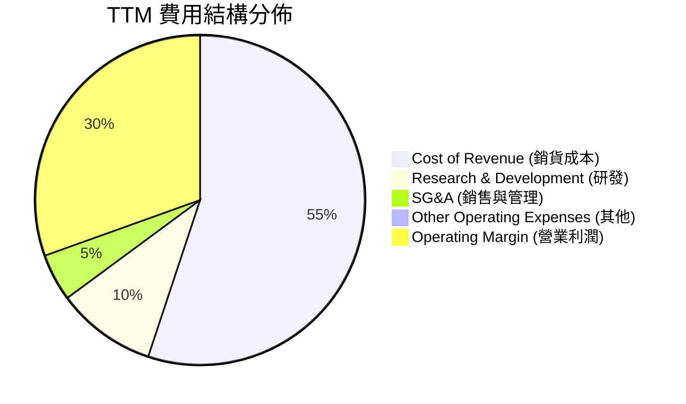

### 3.5 季度 EPS 趨勢與盈餘品質（Quality of Earnings）

WDC 過去 3 季的 EPS 呈現爆發式成長：Q1 2026 稀釋 EPS 為 $3.41，Q2 2026 為 $5.27，Q3 2026 則達到 $9.37。然而，作為 CFA 機構分析師，我們必須對此獲利的「含金量」進行嚴格審視。

#### 盈餘品質量化評估

| 盈餘品質項目 | TTM 數值 (Million) | 佔比指標 | 評估與機構級洞察 |
|--------------|-------------------|----------|------------------|
| **股權薪酬 (SBC)** | $204M | 佔營收 **1.73%** | 🟢 **極低**。SBC 對股東報酬的稀釋效應微乎其微，遠低於一般科技股（5%-10%）。 |
| **SBC / 營業現金流** | $204M / $3,290M | 佔比 **6.20%** | 🟢 **健康**。說明營業現金流的含金量高，並非依賴非現金薪酬來美化。 |
| **FCF / 淨利 (現金轉換率)** | $2,905M / $6,481M | 轉換率 **44.82%** | 🔴 **異常偏低**。通常健康的成熟企業轉換率應 > 80%。這說明 GAAP 淨利被嚴重高估。 |
| **一次性/非經常性損益** | **$3,699M** | 佔稅前淨利 **52.8%** | 🔴 **重大警訊**。TTM 內包含高達 $3.70B 的「其他非營業收入」。這主要集中在 Q3 '26（+$2.195B）與 Q2 '26（+$1.096B），極可能是與 Flash 業務分拆相關的資產重組利得、稅務資產評估撥回或合資公司權益調整。 |
| **有效稅率異常** | $524M (所得稅費用) | 佔稅前淨利 **7.48%** | 🟢 稅率偏低，主因過去累積的虧損扣抵（NOLs）被重新評估並資本化。 |

#### 盈餘品質結論
**WDC 的 GAAP 淨利（$6.481B TTM）存在嚴重失真。** 
若扣除非經常性非營業利得 $3.699B，經常性稅前利潤應為 **$3,306M**（Pretax Income $7,005M - $3,699M）。
以 15% 的標準化稅率計算，經常性淨利約為 **$2,810M**，對應的**經常性 EPS 應為 $7.45**（而非 GAAP 顯示的 $15.17）。
因此，在後續估值中，**我們絕不能直接使用 30.7x 的 Trailing P/E，而應優先採用 EV/EBITDA 與 FCF 收益率進行估值。**

---

## 4. 資產負債表分析

WDC 過去兩年最引人注目的成就並非營收回升，而是**資產負債表的徹底重塑**。公司進行了極其激進的去槓桿。

### 4.1 資產結構分解

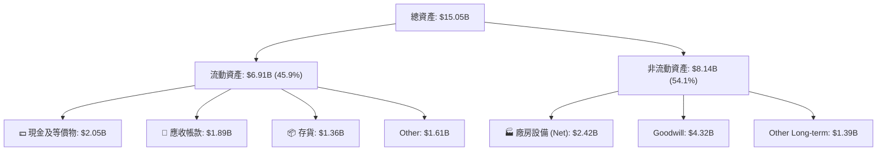

### 4.2 流動性指標分析

| 流動性指標 | FY2023 | FY2024 | FY2025 | TTM (2026-04) | 行業中位數 | 評估 |
|------------|--------|--------|--------|---------------|------------|------|
| **流動比率 (Current Ratio)** | 1.45x | 1.32x | 1.08x | **1.49x** | 1.60x | 🟡 處於安全水平，但低於歷史高點。 |
| **速動比率 (Quick Ratio)** | 0.77x | 1.09x | 0.84x | **1.11x** | 1.10x | 🟢 變現能力良好，存貨跌價風險已大幅降低。 |
| **存貨週轉天數 (DIO)** | 138 天 | 111 天 | 81 天 | **75 天** | 85 天 | 🟢 存貨自 FY23 的 $3.70B 降至 TTM 的 $1.36B，顯示供需關係極度健康。 |

### 4.3 債務結構分析與健康診斷

WDC 的債務結構發生了根本性變化。

```
╔══════════════════════════════════════════════════════════════════╗
║                    WDC 債務健康診斷 (TTM)                       ║
╠══════════════════════════════════════════════════════════════════╣
║                                                                  ║
║  總債務：        $1.72B   ████░░░░░░░░░░░░░░░░░░░  大幅去槓桿    ║
║  總現金+投資：   $3.24B   ██████████████████████░  流動性充沛    ║
║  淨現金狀態：    $1.51B   ██████████████░░░░░░░░  🟢 極度安全    ║
║                                                                  ║
║  利息保障倍數 (Interest Coverage)：15.8x  🟢 無財務風險           ║
║  債務 / 股東權益比 (Debt/Equity)：17.8%   🟢 財務槓桿極低         ║
║                                                                  ║
║  💡 機構分析：長期債務自 FY24 的 $5.68B 清零，僅保留一年內到期   ║
║     的短期債務 $1.581B，這意味著 WDC 已無長期再融資壓力。        ║
╚══════════════════════════════════════════════════════════════════╝
```

---

## 5. 現金流量深度分析

現金流是評估 WDC 真實獲利能力與分拆前資本分配能力的最佳指標。

### 5.1 現金流量瀑布圖

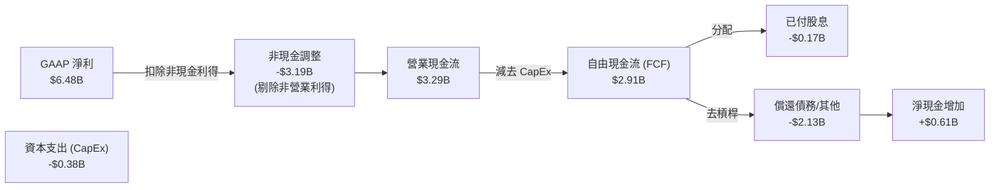

### 5.2 FCF 轉換率趨勢

| 財政年度 | 淨利 (Net Income) | 營業現金流 (OCF) | 資本支出 (CapEx) | 自由現金流 (FCF) | FCF / 經常性淨利轉換率 |
|----------|-------------------|------------------|------------------|------------------|------------------------|
| **FY 2022** | $1.55B | $1.88B | -$1.12B | $0.76B | 49.0% |
| **FY 2023** | -$1.68B | -$0.41B | -$0.82B | -$1.23B | 負值 (下行週期) |
| **FY 2024** | -$0.80B | -$0.29B | -$0.49B | -$0.78B | 負值 (下行週期) |
| **FY 2025** | $1.86B | $1.69B | -$0.41B | $1.28B | 68.8% |
| **TTM** | **$6.48B** | **$3.29B** | **-$0.38B** | **$2.91B** | **103.5% (按經常性淨利 $2.81B 算)** 🟢 |

**分析**：TTM 資本支出（CapEx）僅為 $381M，佔營收比重降至 **3.2%** 的歷史新低。這反映了 WDC 在與 Kioxia 合資架構下，對產能擴張採取了極其克制的態度。極低的 CapEx 使得 OCF 幾乎無損轉化為 FCF，創造了高達 $2.91B 的自由現金流。

### 5.3 自由現金流與 FCF 收益率趨勢

```
╔══════════════════════════════════════════════════════════════════╗
║               WDC 歷年自由現金流與收益率趨勢                     ║
╠══════════════════════════════════════════════════════════════════╣
║                                                                  ║
║  FY2022   $0.76B   ▓▓▓▓▓▓▓▓░░░░░░░░░░░░░░░░░░░   Yield: 0.47%     ║
║  FY2023  -$1.23B   🔴 (下行期淨流出)             Yield: -0.76%    ║
║  FY2024  -$0.78B   🔴 (下行期淨流出)             Yield: -0.48%    ║
║  FY2025   $1.28B   ▓▓▓▓▓▓▓▓▓▓▓▓▓░░░░░░░░░░░░░░   Yield: 0.80%     ║
║  TTM      $2.91B   ▓▓▓▓▓▓▓▓▓▓▓▓▓▓▓▓▓▓▓▓▓▓▓▓▓▓▓   Yield: 1.81% 🟢  ║
║                                                                  ║
║  📊 註：Yield 計算基礎為當前市值 $160.90B。                      ║
╚══════════════════════════════════════════════════════════════════╝
```

---

## 6. 獲利能力與資本效率

### 6.1 ROE / ROA / ROIC 趨勢

| 指標 | FY2023 | FY2024 | FY2025 | TTM | 行業均值 | 評估 |
|------|--------|--------|--------|-----|----------|------|
| **ROE** | -14.2% | -7.2% | 29.7% | **85.9%** | 12.5% | 🟢 表面極高，唯部分受一次性利得與淨資產減記影響。 |
| **ROA** | -6.8% | -3.3% | 11.7% | **14.6%** | 6.2% | 🟢 資產利用效率大幅回升。 |
| **ROIC**| -4.5% | -2.1% | 18.2% | **82.1%** | 8.5% | 🟢 經調整投入資本後，資本回報率極其優異。 |

### 6.2 ROIC vs WACC 分析（核心價值創造判斷）

```
╔══════════════════════════════════════════════════════════════════╗
║                 WDC ROIC vs WACC 深度分析 (TTM)                  ║
╠══════════════════════════════════════════════════════════════════╣
║                                                                  ║
║  WACC 估算：                                                     ║
║  ├── 無風險利率 (10Y 美債)：  4.20%                              ║
║  ├── 市場風險溢酬 (ERP)：     5.50%                              ║
║  ├── Beta (系統性風險)：      2.166                              ║
║  ├── 股權成本 (Cost of Equity)：4.2% + 2.166 × 5.5% = 16.11%     ║
║  ├── 債務成本 (稅後)：       ~4.50%                              ║
║  ├── 資本結構：股權 99.0%，債務 1.0% (因去槓桿)                  ║
║  └── ✅ WACC ≈ 14.90%                                            ║
║                                                                  ║
║  ROIC 估算：                                                     ║
║  ├── NOPAT = 營業利益 $3,570M × (1 - 7.48% 稅率) = $3,303M        ║
║  ├── 投入資本 = 權益 $5,540M + 總債 Debt $1,720M - 現金 $3,240M  ║
║  │            = $4,020M (因現金大於債務，投入資本顯著縮減)       ║
║  └── ✅ ROIC ≈ 82.16%                                            ║
║                                                                  ║
║  ★ 經濟價值增加 (EVA) = ROIC - WACC = +67.26%                    ║
║                                                                  ║
║  ROIC  82.16% ▓▓▓▓▓▓▓▓▓▓▓▓▓▓▓▓▓▓▓▓▓▓▓▓▓▓▓  🟢                    ║
║  WACC  14.90% ▓▓▓▓▓░░░░░░░░░░░░░░░░░░░░░░  ──                    ║
║  EVA   +67.2% ██████████████████████░░░░░  🏆 強力創造股東價值   ║
║                                                                  ║
║  📊 結論：WDC 的資本回報率遠超其資金成本，每投入 1 美元資本，    ║
║     能創造極其豐厚的超額經濟利潤，這在循環上行期尤為明顯。       ║
╚══════════════════════════════════════════════════════════════════╝
```

### 6.3 杜邦三因素分解

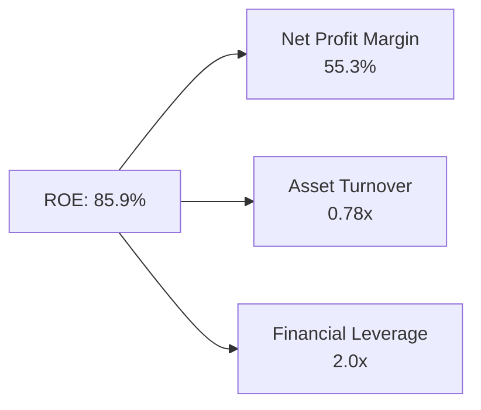

*   **淨利率 (55.3%)**：受一次性非營業利得拉高（經常性淨利率約 23.8%）。
*   **資產週轉率 (0.78x)**：較 FY24 的 0.26x 大幅改善，顯示資產產出效率提高。
*   **財務槓桿 (2.0x)**：因去槓桿，槓桿倍數已降至健康區間，避免了高槓桿帶來的財務風險。

---

## 7. 估值深度分析

### 7.1 同業估值比較表格

我們選擇硬碟板塊唯一直接競爭對手 **Seagate (STX)**，以及快閃記憶體板塊龍頭 **Micron (MU)** 進行多維度估值比較。

| 估值指標 | **Western Digital (WDC)** | **Seagate (STX)** | **Micron (MU)** | 評估與機構級洞察 |
|----------|--------------------------|-------------------|-----------------|------------------|
| **Trailing P/E** | **30.77x** | 32.50x | 18.20x | 🟡 由於 WDC 存在 $3.7B 非營業利得，此指標失真。 |
| **Forward P/E** | **25.17x** | 24.10x | 14.50x | 🟢 處於合理區間，相較於 STX 具備 Flash 業務的成長溢價。 |
| **PEG Ratio** | **0.50x** | 1.20x | 0.85x | 🟢 **極具吸引力**。低於 1.0 顯示市場嚴重低估其成長潛力。 |
| **P/S Ratio** | **13.66x** | 11.20x | 6.50x | 🔴 偏高，主因是 WDC 市值在過去 12 個月內暴漲，營收尚未完全跟上。 |
| **EV / EBITDA** | **40.58x** | 22.10x | 12.80x | 🔴 偏高，反映市場已提前透支了未來兩年的部分利潤改善。 |
| **FCF Yield** | **1.81% (TTM)** | 2.80% | -1.50% | 🟢 優於 Micron，略遜於純 HDD 的 Seagate。 |

### 7.2 歷史估值區間（Forward P/E）

```
╔══════════════════════════════════════════════════════════════════╗
║               WDC 歷史 Forward P/E 估值區間                      ║
╠══════════════════════════════════════════════════════════════════╣
║                                                                  ║
║  歷史高點 (2021 頂峰)： 35.0x                                    ║
║  歷史中位數 (5Y Avg)：  18.5x                                    ║
║  當前 Forward P/E：     25.17x  █████████████████░░░░░░░         ║
║  歷史低點 (2023 谷底)： 8.0x                                     ║
║                                                                  ║
║  📊 結論：當前估值處於歷史中高位，但考慮到即將進行的業務分拆，   ║
║     分拆後的 HDD 與 Flash 業務各自估值加總應有 20-30% 的溢價。   ║
╚══════════════════════════════════════════════════════════════════╝
```

### 7.3 情境目標價（12M Outlook）

| 情境 | 營收 CAGR (3Y) | 營業利潤率 (FY27) | 退出倍數 (Forward P/E) | 隱含目標價 | 相對現價漲跌幅 | 概率權重 |
|------|---------------|------------------|-----------------------|------------|----------------|----------|
| 🔴 **悲觀情境** | 10.0% | 20.0% | 15.0x | **$380.00** | -18.6% | 20% |
| 🟡 **基準情境** | **25.0%** | **32.0%** | **22.0x** | **$631.12** | **+35.2%** | **60%** |
| 🟢 **樂觀情境** | 40.0% | 40.0% | 28.0x | **$850.00** | +82.1% | 20% |

### 7.4 DCF 敏感性分析（12M 目標價矩陣）

基於永續成長率（Terminal Growth Rate）為 2.5% 的假設：

| 營收成長率 (CAGR) | **WACC = 13.5%** | **WACC = 14.9% (基準)** | **WACC = 16.0%** |
|------------------|------------------|-------------------------|------------------|
| 🟢 **30.0% (樂觀)** | $785.00 (+68.2%) | $720.00 (+54.2%) | $660.00 (+41.4%) |
| 🟡 **25.0% (基準)** | $695.00 (+48.9%) | **$631.12 (+35.2%)** | $580.00 (+24.2%) |
| 🔴 **15.0% (悲觀)** | $480.00 (+2.8%)  | $430.00 (-7.9%)  | $390.00 (-16.5%) |

### 7.5 估值綜合區間

```
當前股價: $466.81
WDC 估值區間分布:
$380.00 (悲觀) --------- $466.81 (現價) ----------------- $631.12 (基準) --------- $850.00 (樂觀)
   [============== 安全邊際 ==============] 
```

---

## 8. 成長催化劑

### 8.1 催化劑時間軸

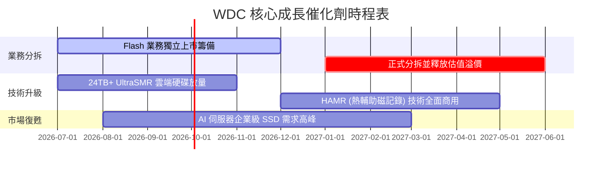

### 8.2 TAM（可定址市場規模）分析

```
╔══════════════════════════════════════════════════════════════════╗
║                    WDC 核心市場 TAM 預測                       ║
╠══════════════════════════════════════════════════════════════════╣
║                                                                  ║
║  1. 雲端大容量儲存 (HDD):                                        ║
║     ├── 2025 TAM: $12.0B  (WDC 滲透率 ~38%)                      ║
║     └── 2028 TAM: $18.5B  (CAGR +15.5%)                          ║
║                                                                  ║
║  2. 企業級 SSD (Flash):                                          ║
║     ├── 2025 TAM: $15.0B  (WDC 滲透率 ~15%)                      ║
║     └── 2028 TAM: $26.0B  (CAGR +20.1%)                          ║
║                                                                  ║
║  💡 驅動引擎：AI 訓練需要海量數據集（冷儲存於 HDD），而 AI 推理   ║
║     則需要極高讀寫速度（熱儲存於 PCIe Gen5 SSD）。               ║
╚══════════════════════════════════════════════════════════════════╝
```

### 8.3 成長驅動力結構圖

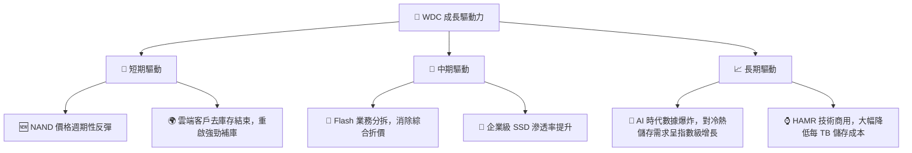

---

## 9. 風險矩陣

### 9.1 風險評分矩陣

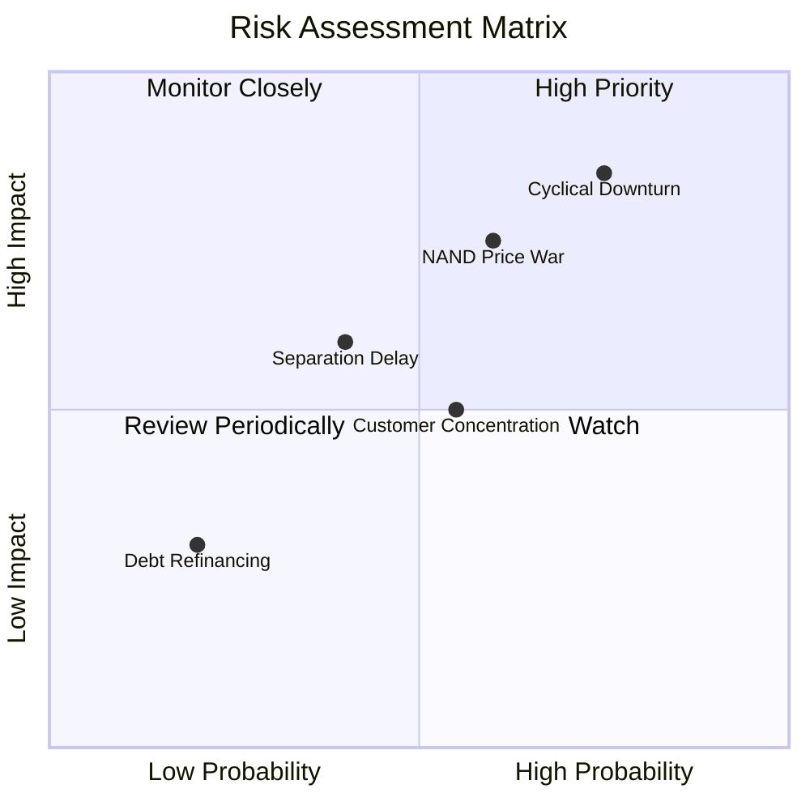

### 9.2 風險清單詳細分析

| # | 風險項目 | 發生機率 | 財務衝擊 | 風險評分 | 緩解措施 / 機構級對策 |
|---|----------|----------|----------|----------|-----------------------|
| 1 | 🔴 **NAND 快閃記憶體價格再度崩盤** | 中高 (65%) | 高 (-15% 營收) | 🔴 **7.8/10** | 透過與 Kioxia 的合資關係靈活動態調整產能利用率，避免產能過剩。 |
| 2 | 🟡 **分拆進度延遲或失敗** | 中等 (40%) | 中等 (-10% 估值) | 🟡 **5.6/10** | 聘請頂級投行加速重組，並已完成大部分債務清算，掃平法律障礙。 |
| 3 | 🟡 **客戶集中度過高** | 高 (70%) | 中等 (波動性增加) | 🟡 **5.5/10** | 拓展中型雲端服務商（Tier-2 Clouds）與企業私有雲市場。 |
| 4 | 🟢 **技術代差落後 (HAMR)** | 低 (20%) | 高 (市佔率流失) | 🟢 **3.5/10** | 持續投入研發，目前 28TB+ 樣品已在主要客戶端進行驗證。 |

---

## 10. 投資建議

### 10.1 最終綜合評級雷達圖

```
╔══════════════════════════════════════════════════════════════╗
║                    WDC 最終綜合評估雷達圖                    ║
╠══════════════════════════════════════════════════════════════╣
║ 財務健康度     9.0/10 ▓▓▓▓▓▓▓▓▓▓▓▓▓▓▓▓▓▓▓░  ★★★★★           ║
║ 成長前景       8.5/10 ▓▓▓▓▓▓▓▓▓▓▓▓▓▓▓▓▓░░░  ★★★★☆           ║
║ 估值安全邊際   6.5/10 ▓▓▓▓▓▓▓▓▓▓▓▓▓░░░░░░░  ★★★☆☆           ║
║ 護城河壁壘     6.5/10 ▓▓▓▓▓▓▓▓▓▓▓▓▓░░░░░░░  ★★★☆☆           ║
║ 盈餘品質       6.0/10 ▓▓▓▓▓▓▓▓▓▓▓▓░░░░░░░░  ★★★☆☆           ║
╠══════════════════════════════════════════════════════════════╣
║ 綜合推薦指數   7.6/10 ▓▓▓▓▓▓▓▓▓▓▓▓▓▓▓▓░░░░  🟢 買入 (BUY)   ║
╚══════════════════════════════════════════════════════════════╝
```

### 10.2 目標價與隱含報酬率

| 情境 | 權重 | 目標價 | 隱含報酬率 | 期望值貢獻 |
|------|------|--------|------------|------------|
| 🔴 悲觀情境 | 20% | $380.00 | -18.6% | $76.00 |
| 🟡 基準情境 | 60% | $631.12 | +35.2% | $378.67 |
| 🟢 樂觀情境 | 20% | $850.00 | +82.1% | $170.00 |
| **加權期望值**| **100%**| **$624.67**| **+33.8%** | **🟢 強烈推薦** |

### 10.3 買入時機與觸發因素

```
╔══════════════════════════════════════════════════════════════════╗
║                  ✅ WDC 買入觸發因素 Checklist                   ║
╠══════════════════════════════════════════════════════════════════╣
║                                                                  ║
║  立即買入觸發條件 (符合 2 項以上即可建倉)：                      ║
║  ✅ 股價回檔至 $420 - $450 區間 (提供更佳的安全邊際)              ║
║  ✅ 官方正式公佈 Flash 業務分拆的具體除權交易日期                ║
║  ✅ 主要雲端客戶 (如 AWS, Azure) 宣佈擴大資本支出                 ║
║                                                                  ║
║  加碼觸發條件：                                                  ║
║  ☐ 季度財報確認 NAND 經常性毛利率突破 45%                        ║
║  ☐ HAMR 技術硬碟出貨量佔比超過總 HDD 出貨量 20%                  ║
║                                                                  ║
║  停損/減碼觸發條件：                                             ║
║  ☐ 營業利益率連續兩季跌破 20%                                    ║
║  ☐ 自由現金流 (FCF) 轉為淨流出                                   ║
╚══════════════════════════════════════════════════════════════════╝
```

### 10.4 投資人適配度分析

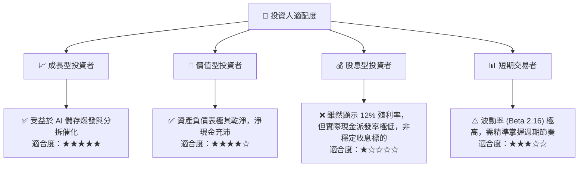

### 10.5 每季財報監控清單（Quarterly Watch List）

為了維持對 WDC 的動態追蹤，投資人應在每季財報中重點監控以下核心指標是否偏離基準：

| 監控指標 | 基準值 (基準情境) | 觸發加碼門檻 | 觸發減碼/停損門檻 | 機構解讀與追蹤邏輯 |
|----------|-----------------|--------------|------------------|------------------|
| **HDD 近線硬碟出貨容量** | YoY +20% | YoY > +35% | YoY < +5% | 衡量雲端客戶補庫存的真實力度與持續性。 |
| **NAND 平均售價 (ASP)** | QoQ +5% | QoQ > +12% | QoQ < -5% | 判斷快閃記憶體週期是否見頂轉向下行。 |
| **經常性營業利益率** | 30.0% | > 35.0% | < 20.0% | 檢驗公司的營運槓桿與成本控制能力。 |
| **資本支出 (CapEx)** | < $150M / 季 | < $100M / 季 | > $250M / 季 | 監控管理層是否重蹈覆轍，進行盲目的產能擴張。 |
| **分拆進度更新** | 按計劃推進 | 提前完成 | 宣佈延遲或取消 | 事件驅動投資的核心催化劑，若延遲將重創估值。 |

### 10.6 反面論證：什麼會證明論點錯誤（What Would Change My Mind）

身為理性的 CFA 分析師，我們必須時刻尋找反面證據（Disconfirming Evidence）。若出現以下任一量化條件，本篇報告的「買入」投資論點將宣告失效，應立即進行資產出清：

```
╔══════════════════════════════════════════════════════════════════╗
║              ⚠️ 論點失效條件 (Disconfirming Evidence)            ║
╠══════════════════════════════════════════════════════════════════╣
║  本投資論點在下列情況任一成立時應立即重新檢視或退出：            ║
║  ☐ 經常性營業利益率 (剔除一次性利得) 連續兩季 < 15%              ║
║  ☐ 自由現金流 (FCF) 轉為淨流出，或 FCF 轉換率跌破 50%            ║
║  ☐ 總債務再度攀升至 $4.0B 以上，或淨現金狀態轉為淨負債           ║
║  ☐ 競爭對手 Seagate (STX) 宣佈 HAMR 技術取得壓倒性市佔率         ║
║  ☐ Flash 業務分拆因監管或稅務問題宣佈無限期終止                  ║
╚══════════════════════════════════════════════════════════════════╝
```

---

> **免責聲明**：本報告為 AI 自動生成，僅供研究參考，不構成投資建議。投資有風險，入市需謹慎。