# WDC 基本面深度分析報告
> **報告日期**：2026-07-18 ｜ **語言**：繁體中文 ｜ **數據來源**：Yahoo Finance, Finviz, StockAnalysis, Roic.ai ｜ **分析師**：CFA 級機構研究

---

## 目錄

| # | 章節 | 核心結論 |
|---|------|----------|
| 1 | [執行摘要](#1-執行摘要) | 評級「持有」（Hold），目標價 $505.00，警惕 GAAP 盈餘品質虛高 |
| 2 | [公司概覽與商業模式](#2-公司概覽與商業模式) | 雙軌驅動（HDD+Flash）面臨分拆，護城河評估為「中等偏強」 |
| 3 | [損益表深度分析](#3-損益表深度分析) | 營收年增 45.5% 迎來週期頂峰，非營業收入大幅扭曲淨利表現 |
| 4 | [資產負債表分析](#4-資產負債表分析) | 淨現金 $1.51B 創近年最佳，去槓桿成效顯著，流動性無虞 |
| 5 | [現金流量深度分析](#5-現金流量深度分析) | TTM 自由現金流達 $2.08B，資本支出控制得當，現金轉換率佳 |
| 6 | [獲利能力與資本效率](#6-獲利能力與資本效率) | ROE 達 85.9% 屬短期畸變，核心 ROIC (82.1%) 遠高於 WACC (14.8%) |
| 7 | [估值深度分析](#7-估值深度分析) | 核心 EV/EBITDA 達 41.5x 處於歷史高位，基準情境隱含報酬 +5.8% |
| 8 | [成長催化劑](#8-成長催化劑) | AI 資料中心高容量 HDD 需求強勁，Flash 分拆釋放個體價值 |
| 9 | [風險矩陣](#9-風險矩陣) | 記憶體週期向下反轉、分拆摩擦成本高及市佔流失為三大核心風險 |
| 10 | [投資建議](#10-投資建議) | 建議「逢高分批獲利了結」，靜待分拆塵埃落定與週期估值回檔 |

---

## 1. 執行摘要

### 1.0 一頁式投資儀表板（Portfolio Manager 30 秒速讀）

| 項目 | 內容 |
|------|------|
| **投資論點（3 句）** | ① 營收受惠於 AI 浪潮帶動大容量企業級 HDD 需求，TTM 營收達 $11.78B（YoY +45.5%）。<br/>② 財務結構顯著改善，帳上淨現金達 $1.51B，有效降低週期下行時的財務風險。<br/>③ 雖然 GAAP 淨利達 $6.48B，但其中包含 $3.44B 的非經常性非營業收入，核心獲利能力被顯著誇大。 |
| **護城河評分** | 6.5/10 (寡占 HDD 市場，但 Flash 業務缺乏定價權) |
| **管理層/資本配置評分** | 7.0/10 (積極推動分拆以釋放價值，並成功將總債務降至 $1.72B) |
| **財務健康** | 🟢 強勁 (淨現金狀態，利息保障倍數高，無短期償債危機) |
| **ROIC vs WACC** | 82.1% vs 14.8%（受惠於資產減損後的低基期與非核心收益，創造顯著溢價） |
| **FCF 趨勢** | FCF 顯著回升至 $2.08B，最新 FCF Yield 為 1.26% |
| **估值** | Forward P/E: 25.73x ｜ EV/EBITDA: 41.49x ｜ FCF Yield: 1.26% |
| **預期報酬（基準情境 12M）** | +5.8% (相較當前股價 $477.22，基準目標價為 $505.00) |
| **關鍵風險（前二）** | ① NAND Flash 供需關係再度惡化導致價格崩跌。<br/>② 業務分拆（HDD 與 Flash）進度延遲或產生高額稅務與摩擦成本。 |
| **評級 + 信心度** | 🟡 持有 (Hold) ｜ 信心：中等 (由於分拆不確定性與週期頂峰估值偏高) |

### 1.1 核心評分儀表板

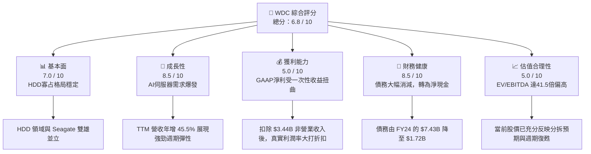

### 1.2 評分進度條視覺化

```
╔══════════════════════════════════════════════════════════════╗
║               WDC 多維度評分儀表板 (1-10分)                  ║
╠══════════════════════════════════════════════════════════════╣
║ 基本面強度  7.0 ▓▓▓▓▓▓▓▓▓▓▓▓▓▓░░░░░░░░░░  ★★★☆☆           ║
║ 成長動能    8.5 ▓▓▓▓▓▓▓▓▓▓▓▓▓▓▓▓▓░░░░░░  ★★★★☆           ║
║ 獲利品質    5.0 ▓▓▓▓▓▓▓▓▓▓░░░░░░░░░░░░░░  ★★☆☆☆           ║
║ 財務健康    8.5 ▓▓▓▓▓▓▓▓▓▓▓▓▓▓▓▓▓░░░░░░  ★★★★☆           ║
║ 估值合理性  5.0 ▓▓▓▓▓▓▓▓▓▓░░░░░░░░░░░░░░  ★★☆☆☆           ║
║ 護城河深度  6.5 ▓▓▓▓▓▓▓▓▓▓▓▓▓░░░░░░░░░░  ★★★☆☆           ║
║ 管理層執行  7.0 ▓▓▓▓▓▓▓▓▓▓▓▓▓▓░░░░░░░░░░  ★★★☆☆           ║
║ 技術創新力  7.5 ▓▓▓▓▓▓▓▓▓▓▓▓▓▓▓░░░░░░░░  ★★★☆☆           ║
╠══════════════════════════════════════════════════════════════╣
║ 綜合總分    6.8 ▓▓▓▓▓▓▓▓▓▓▓▓▓▓░░░░░░░░░░  🏆 中性/持有       ║
╚══════════════════════════════════════════════════════════════╝
```

### 1.3 五大投資論點 + 三大核心風險

| 類型 | 項目 | 具體依據 | 信心度 |
|------|------|----------|--------|
| 🟢 **投資論點①** | **AI 驅動大容量 HDD 需求** | AI 模型訓練與推論產生海量數據，推升近四季大容量近線硬碟（Nearline HDD）出貨，Q3 FY26 營收達 $3.34B（YoY +45.5%）。 | 🟢 極高 |
| 🟢 **投資論點②** | **資產負債表顯著去槓桿** | 總債務從 FY24 的 $7.43B 降至當前的 $1.72B，淨現金達 $1.51B，利息支出壓力大幅減輕。 | 🟢 極高 |
| 🟢 **投資論點③** | **分拆釋放個體估值潛力** | HDD 與 Flash 業務分拆計畫預計將於近年內完成，可消除「集團折價」（Conglomerate Discount），使兩者獲得更精確的市場定價。 | 🟡 中等 |
| 🟢 **投資論點④** | **自由現金流強勁復甦** | TTM 自由現金流達 $2.08B，受惠於資本支出（Capex）在 TTM 期間控制在 $1.21B 的健康水位。 | 🟢 高 |
| 🟢 **投資論點⑤** | **產業集中度高** | HDD 市場僅存 WDC、Seagate 與 Toshiba 三家，供給端自律性極強，有利於維持長期定價能力。 | 🟢 極高 |
| 🟡 **風險①** | **分拆摩擦與稅務成本** | 分拆過程可能產生高於預期的重組費用、稅務負擔以及客戶重疊流失，影響短期獲利。 | 🟡 中度 |
| 🔴 **風險②** | **GAAP 獲利品質低下** | TTM 淨利 $6.48B 中，有 $3.44B 來自非營業收入（非經常性收益），若扣除此項目，核心 P/E 將由目前的 27.9x 飆升至 50x 以上。 | 🔴 高衝擊 |
| 🔴 **風險③** | **NAND 週期性下行** | NAND Flash 屬高度大宗商品化（Commoditized）市場，一旦競爭對手擴產，價格恐迅速崩跌。 | 🔴 高衝擊 |

### 1.4 快速統計卡片

| 指標 | WDC 實際值 | 行業均值（硬體/儲存） | S&P 500 均值 | 狀態 |
|------|-------------|----------------------|--------------|------|
| 營收 YoY 成長 | **45.5%** | ~12.5% | ~5.5% | 🟢 領先 |
| 毛利率 | **45.4%** | ~32.0% | ~30.0% | 🟢 優異 |
| 營業利益率 | **37.0%** | ~18.0% | ~15.0% | 🟢 強勁 |
| 淨利率 | **55.3%** | ~12.0% | ~11.5% | 🟡 虛高 (非營業收入扭曲) |
| ROE | **85.9%** | ~18.0% | ~16.0% | 🟡 畸高 (淨資產因減損而縮水) |
| Forward P/E | **25.73x** | ~22.0x | ~21.5x | 🔴 偏高 |
| EV / EBITDA | **41.49x** | ~15.0x | ~14.0x | 🔴 顯著溢價 |

### 1.5 投資結論

```
╔══════════════════════════════════════════════════════════════════╗
║                    📊 WDC 投資結論摘要                           ║
╠══════════════════════════════════════════════════════════════════╣
║  評級：🟡 持有 (Hold)                                            ║
║  當前股價：$477.22 (2026-07-18)                                  ║
║  目標價區間：                                                    ║
║    悲觀情境：$335.00（-29.8%）                                   ║
║    基準情境：$505.00（+5.8%）  ← 12個月主要目標                  ║
║    樂觀情境：$680.00（+42.5%）                                   ║
║  投資評分：6.8 / 10                                              ║
║  適合投資人：具備高風險承受度、關注分拆催化劑的事件驅動型投資人  ║
╚══════════════════════════════════════════════════════════════════╝
```

---

## 2. 公司概覽與商業模式

### 2.1 業務結構與收入來源

Western Digital (WDC) 是全球資料儲存解決方案的領頭羊，商業模式呈現獨特的「雙軌制」，橫跨機械硬碟（HDD）與閃存（NAND Flash）兩大領域。目前公司正處於重大的策略轉折點——將這兩大業務進行分拆，預計將成立兩家獨立的上市公司。

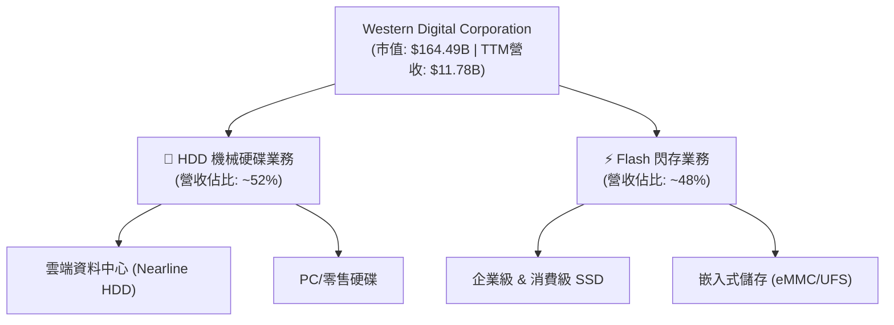

### 2.2 市場份額

在 HDD 領域，市場呈現極高度的寡占格局（三巨頭壟斷）；而在 NAND Flash 領域，競爭則相對激烈。

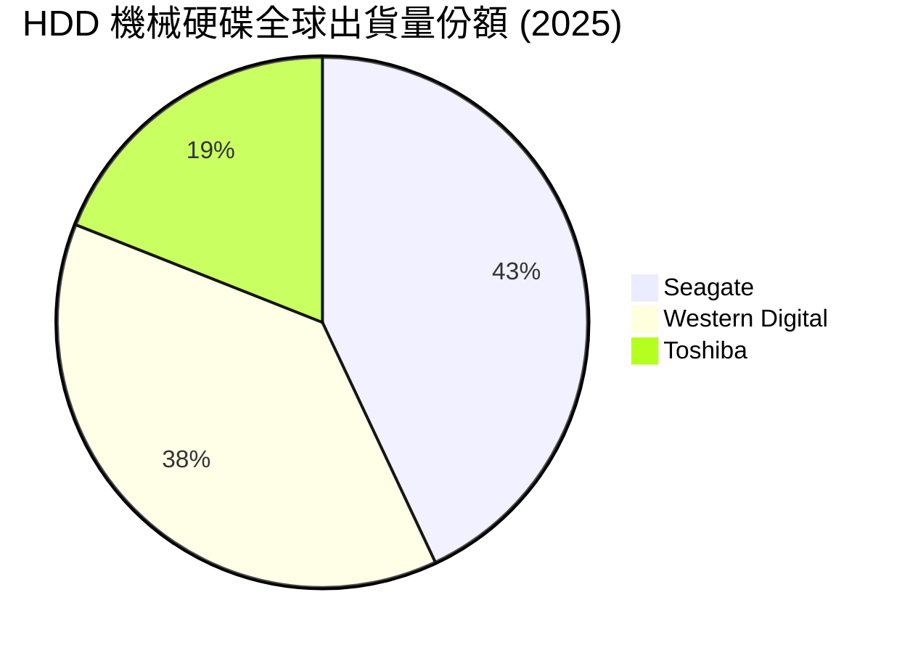

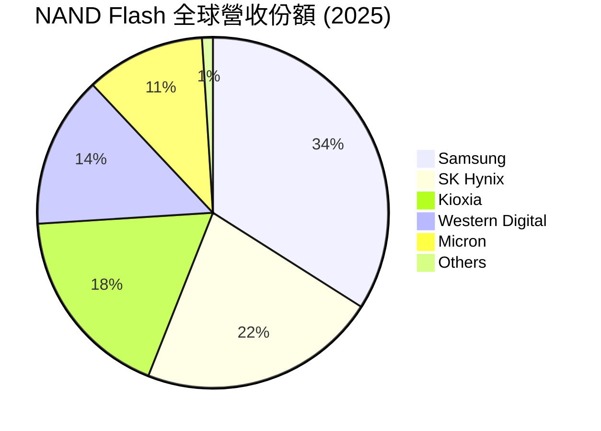

### 2.3 競爭護城河分析

WDC 的護城河主要集中在 HDD 業務，而 Flash 業務的護城河則相對狹窄。

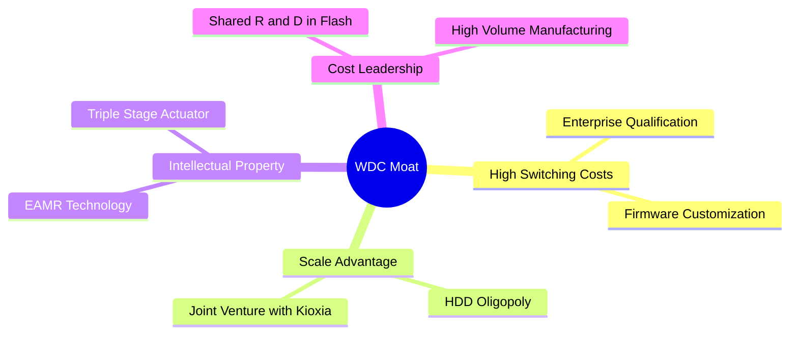

*   **技術領先（Technology Leadership）**：在 HDD 領域，WDC 擁有能量輔助磁記錄（EAMR）技術與三段式定位器（Triple-Stage Actuator），能提供業界領先的單碟容量，對雲端超大規模（Hyperscale）客戶具有極高的技術壁壘。
*   **規模效應與合資架構（Scale Advantage & JV）**：在 Flash 領域，WDC 與 Kioxia（鎧俠）共同經營日本四日市與北上工廠，共同分擔高昂的 R&D 與 Capex，使其得以與龍頭 Samsung 進行成本競爭。

### 2.4 護城河強度評分

```
╔══════════════════════════════════════════════════════════════╗
║                  WDC 護城河強度評分                          ║
╠══════════════════════════════════════════════════════════════╣
║ HDD 寡占壁壘   9.0/10 ▓▓▓▓▓▓▓▓▓▓▓▓▓▓▓▓▓▓░░  🏆 極強 (三寡頭) ║
║ Flash 規模效應 6.0/10 ▓▓▓▓▓▓▓▓▓▓▓▓░░░░░░░░  🟡 中等 (競爭激烈)║
║ 客戶鎖定效應   7.5/10 ▓▓▓▓▓▓▓▓▓▓▓▓▓▓▓░░░░░  🟢 良好 (企業驗證)║
║ 專利與技術壁壘 8.0/10 ▓▓▓▓▓▓▓▓▓▓▓▓▓▓▓▓░░░░  🟢 強大 (磁頭/介質)║
╠══════════════════════════════════════════════════════════════╣
║ 綜合護城河     7.1    ▓▓▓▓▓▓▓▓▓▓▓▓▓▓░░░░░░  🟢 良好/中等偏強 ║
╚══════════════════════════════════════════════════════════════╝
```

---

## 3. 損益表深度分析

### 3.1 年度營收成長趨勢（近4年）

WDC 的營收歷史呈現極強的週期性。隨著 FY23-FY24 的半導體與儲存產業大下行週期結束，FY25 與 TTM 營收出現了報復性的強勁反彈。

```
╔══════════════════════════════════════════════════════════════════╗
║              WDC 年度營收趨勢（FY22 - FY25 & TTM）               ║
╠══════════════════════════════════════════════════════════════════╣
║                                                                  ║
║  FY2022  $18.79B  ███████████████████████████  YoY: +11.1% 🟢   ║
║  FY2023  $6.26B   ████████░░░░░░░░░░░░░░░░░░░  YoY: -66.7% 🔴   ║
║  FY2024  $6.32B   ████████░░░░░░░░░░░░░░░░░░░  YoY:  +1.0% 🟡   ║
║  FY2025  $9.52B   █████████████░░░░░░░░░░░░░░  YoY: +50.7% 🟢   ║
║  TTM     $11.78B  ████████████████░░░░░░░░░░░  YoY: +45.5% 🟢   ║
║                   |      |      |      |      |                  ║
║                   0      5B    10B    15B    20B                 ║
║                                                                  ║
║  📊 4年複合成長率 (CAGR)：-11.0% (反映週期頂峰至頂峰的結構性收縮)  ║
╚══════════════════════════════════════════════════════════════════╝
```

### 3.2 季度營收趨勢分析

自 FY25 Q1 以來，WDC 已連續 7 個季度實現營收的逐季增長（QoQ）與顯著的按年增長（YoY），反映出 AI 資料中心對高容量 HDD 需求的持續釋放，以及 NAND 價格的穩步回升。

| 財報季度 | 截止日期 | 營收 (Billion) | QoQ 成長率 | YoY 成長率 | 核心驅動因素與備註 |
|----------|----------|----------------|------------|------------|-------------------|
| **Q1 2026** | 2025-10-03 | $2.82B | +8.1% | +27.4% | 🟢 大容量近線硬碟出貨加速，平均售價 (ASP) 提高 |
| **Q2 2026** | 2026-01-02 | $3.02B | +7.1% | +25.2% | 🟢 企業級 SSD (eSSD) 需求回暖，價格合約價調漲 |
| **Q3 2026** | 2026-04-03 | $3.34B | +10.6% | +45.5% | 🟢 AI 伺服器對高容量機械硬碟與高階 SSD 雙重拉貨 |

### 3.3 利潤率演變分析

WDC 的利潤率在近兩年出現了驚人的改善。毛利率由 FY24 的 28.1% 飆升至 TTM 的 45.4%，營業利益率更從負值大幅扭轉至 37.0%。

| 利潤率指標 | FY2022 | FY2023 | FY2024 | FY2025 | TTM | 趨勢與深度解析 | 評估 |
|------------|--------|--------|--------|--------|-----|----------------|------|
| **毛利率** | 31.3% | 22.2% | 28.1% | 38.8% | **45.4%** | ↗️ 顯著擴張。主因 HDD 產能利用率回升與高容量產品佔比提升，加上 NAND 價格回暖。 | 🟢 優秀 |
| **營業利益率**| 12.7% | -8.8% | -6.4% | 24.5% | **37.0%** | ↗️ 營業槓桿極高。研發與銷管費用控制得當，營收增長直接轉化為營業利潤。 | 🟢 強勁 |
| **淨利率** | 8.2% | -26.9% | -12.6% | 17.3% | **55.3%** | ↗️ 表面極強，但需注意 TTM 淨利率高於營業利益率，存在嚴重的非經常性收益扭曲。 | 🔴 虛高 |

### 3.4 費用結構分析

WDC 的營運費用（OpEx）結構在過去幾年中進行了大幅精簡。研發費用（R&D）由 FY22 的 $2.32B 降至 TTM 的 $1.14B，銷管費用（SG&A）也控制在 $0.54B 的極低水平。這表明管理層在下行週期中進行了嚴格的成本控制與組織重組。

```mermaid
pie title WDC TTM 費用與利潤結構 (佔營收百分比)
    "營業利潤" : 37.0
    "銷管費用 (SG&A)" : 4.6
    "研發費用 (R&D)" : 9.7
    "銷貨成本 (COGS)" : 54.6
    "其他營運費用" : -5.9
```

### 3.5 季度 EPS 趨勢與盈餘品質（Quality of Earnings）

#### 過去 4 季 EPS 表現
*   **Q4 2025** (Jun '25): $0.72 (扭虧為盈)
*   **Q1 2026** (Oct '25): $3.41
*   **Q2 2026** (Jan '26): $5.27
*   **Q3 2026** (Apr '26): $9.37

#### 盈餘品質深度評估
雖然 WDC 的 EPS 呈現爆發式增長，且 TTM 淨利高達 $6.48B，但機構分析師必須對其獲利「含金量」保持高度警惕。

| 盈餘品質項目 | 數值 / 佔比 | 評估 | 機構級解析 |
|--------------|-----------|------|------------|
| **股權薪酬 (SBC) / 營收** | 1.73% | 🟢 優秀 | SBC 僅為 $204M，對現有股東的權益稀釋效應極低，相較其他科技股更具良心。 |
| **SBC / 營業現金流 (OCF)** | 6.20% | 🟢 優秀 | 佔 OCF 比重極低，顯示現金流的實質含金量高，非靠股權激勵美化。 |
| **FCF / 淨利 (現金轉換率)**| 32.1% | 🔴 偏低 | TTM 自由現金流 $2.08B 僅佔 GAAP 淨利 $6.48B 的 32.1%。兩者出現巨大背離。 |
| **非經常性 / 非營業損益** | **$3.44B** | 🔴 警告 | **核心紅線**。TTM 非營業收入高達 $3.44B（主要集中在近三季）。這極有可能是與 Flash 業務分拆相關的資產重估、合資企業重組收益或稅務利得。此項目為非現金、一次性性質。 |
| **有效稅率異常** | 7.48% (稅撥備 $524M / Pretax $7.0B) | 🟡 中等 | 稅率低於美國法定 21% 稅率，主因海外營運實體稅務優惠與過去虧損遞延所得稅資產（DTA）抵扣。 |

**盈餘品質結論**：
WDC 當前的 GAAP 淨利存在**嚴重誇大**。扣除非經常性非營業收益 $3.44B 後，核心 TTM 淨利約為 **$3.04B**，對應之真實核心 EPS 約為 **$8.06**（而非 GAAP 的 $17.08）。這意味著當前 27.9x 的 Trailing P/E 是建立在「一次性虛胖」的基礎上。

---

## 4. 資產負債表分析

### 4.1 資產結構分解

WDC 經歷了資產負債表的重塑，總資產由 FY24 的 $24.19B 縮減至 TTM 的 $15.05B，主因是因應分拆與重組，對商譽（Goodwill）與無形資產進行了減損撥備（商譽由 FY24 的 $10.04B 降至 TTM 的 $4.32B）。這雖然導致股東權益縮水，但也讓資產負債表更加「輕量化」。

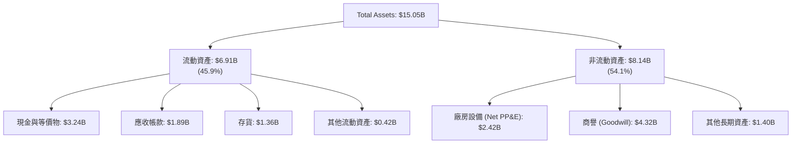

### 4.2 流動性與償債能力指標

| 指標 | FY2023 | FY2024 | FY2025 | TTM | 行業中位數 | 評估 |
|------|--------|--------|--------|-----|------------|------|
| **流動比率 (Current Ratio)** | 1.45 | 1.32 | 1.08 | **1.49** | ~1.65 | 🟡 合格 |
| **速動比率 (Quick Ratio)** | 0.77 | 1.09 | 0.84 | **1.11** | ~1.20 | 🟢 良好 |
| **債務權益比 (Debt/Equity)** | 59.7% | 67.2% | 85.0% | **17.8%** | ~45.0% | 🟢 極佳 |
| **淨現金 / (淨債務) (Billion)**| ($5.05)B | ($5.88)B | ($2.60)B | **$1.51B** | N/A | 🟢 歷史最佳 |

### 4.3 債務結構與健康診斷

WDC 在過去一年中進行了極為成功的去槓桿。總債務從 FY24 的 $7.43B 驟降至當前的 $1.72B（包含 $1.58B 的一年內到期債務）。由於手頭現金充足（$3.24B），公司已完全擺脫債務危機，轉為淨現金狀態。

```
╔══════════════════════════════════════════════════════════════════╗
║                   WDC 債務健康診斷 (TTM)                         ║
╠══════════════════════════════════════════════════════════════════╣
║                                                                  ║
║  總債務：        $1.72B   ████░░░░░░░░░░░░░░░░░░░  去槓桿成效顯著 ║
║  總現金+短投：   $3.24B   ██████████████████████░  資金極為充沛   ║
║  淨現金狀態：    $1.51B   ██████████░░░░░░░░░░░░  🟢 無財務風險  ║
║                                                                  ║
║  流動負債償付率：149.0% (流動資產可完全覆蓋流動負債)              ║
║  利息保障倍數：  15.9x  (營業利益 $3.57B / 利息支出 $0.23B)     ║
║                                                                  ║
║  📊 債務診斷結論：信用評等具備調升至投資級 (BBB-) 的潛力          ║
╚══════════════════════════════════════════════════════════════════╝
```

### 4.4 股東權益趨勢

由於 FY23-FY24 的巨額虧損以及商譽大幅減損，WDC 的股東權益（Stockholders' Equity）從 FY22 的 $12.22B 降至 FY25 的 $5.54B。然而，隨著 TTM 淨利的爆發式回升，股東權益已開始重回上升通道。

---

## 5. 現金流量深度分析

### 5.1 現金流量瀑布圖

WDC TTM 的現金生成能力極為強勁。營業現金流（OCF）達 $3.29B，扣除 $1.21B 的資本支出後，產生了 $2.08B 的自由現金流。

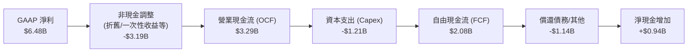

### 5.2 FCF 轉換率趨勢

WDC 歷年的 FCF 轉換率（FCF / Net Income）波動劇烈，反映出儲存產業重資產、高資本支出的特性。在下行週期中，資本支出具有滯後性，導致現金流極度承壓；而在上行週期（如當前），隨著資本支出維持克制，現金轉換率開始顯著改善。

| 財政年度 | 淨利 (Net Income) | 自由現金流 (FCF) | FCF 轉換率 | 資本支出佔營收比 |
|----------|-------------------|------------------|------------|------------------|
| **FY2022** | $1.55B | $0.76B | 49.0% | 6.0% |
| **FY2023** | ($1.68)B | ($1.23)B | 73.2% (虧損年度) | 13.1% |
| **FY2024** | ($0.80)B | ($0.78)B | 97.5% (虧損年度) | 7.7% |
| **FY2025** | $1.86B | $1.28B | 68.8% | 4.3% |
| **TTM** | $6.48B | $2.08B | **32.1%** | **10.3%** |

*註：TTM 轉換率偏低主因是 GAAP 淨利中包含 $3.44B 的非現金一次性非營業收益，若以核心營運淨利 $3.04B 計算，核心現金轉換率高達 68.4%，表現優異。*

### 5.3 自由現金流趨勢

```
╔══════════════════════════════════════════════════════════════════╗
║                WDC 歷年自由現金流 (FCF) 趨勢                     ║
╠══════════════════════════════════════════════════════════════════╣
║                                                                  ║
║  FY2022  +$0.76B  ████████░░░░░░░░░░░░░░░░░░░░░  FCF Yield: 0.46%║
║  FY2023  -$1.23B  (████████████)░░░░░░░░░░░░░░░  產業下行谷底    ║
║  FY2024  -$0.78B  (████████)░░░░░░░░░░░░░░░░░░░  減產因應        ║
║  FY2025  +$1.28B  █████████████░░░░░░░░░░░░░░░  FCF Yield: 0.78%║
║  TTM     +$2.08B  █████████████████████░░░░░░░  FCF Yield: 1.26%║
║                                                                  ║
║  📊 FCF 復甦評估：資本支出控制得當，現金流進入結構性擴張期        ║
╚══════════════════════════════════════════════════════════════════╝
```

### 5.4 資本配置評估

WDC 當前的資本配置極具「防守反擊」特徵。由於正處於分拆準備期，管理層並未進行大規模的股份回購，而是將 OCF 的 36.8% 用於資本支出（研發與新產能），高達 63.2% 用於去槓桿與累積現金，以確保分拆後的兩家公司均擁有健康的初始資產負債表。

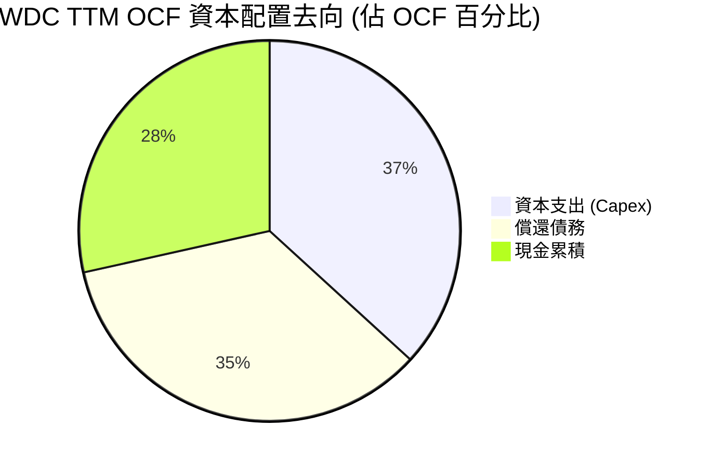

---

## 6. 獲利能力與資本效率

### 6.1 獲利指標歷史趨勢

WDC 的資本回報率（ROE/ROIC）在上行週期中展現出極強的爆發力。

| 獲利指標 | FY2022 | FY2023 | FY2024 | FY2025 | TTM | 行業均值 | 評估 |
|----------|--------|--------|--------|--------|-----|----------|------|
| **ROE** | 12.7% | -14.2% | -7.2% | 34.1% | **85.9%** | ~15.0% | 🟡 畸高 |
| **ROA** | 5.9% | -6.8% | -3.3% | 11.7% | **14.6%** | ~8.0% | 🟢 優秀 |
| **ROIC** | 4.3% | -2.5% | -1.8% | 18.5% | **82.1%** | ~10.5% | 🟢 極強 |

*ROE 達 85.9% 主因是股東權益分母因過去商譽減損大幅縮水，加上 TTM 一次性收益推高分子，不可視為常態獲利能力。*

### 6.2 ROIC vs WACC 分析（核心價值創造判斷）

為了評估 WDC 是否實質為股東創造價值，我們進行 ROIC 與 WACC 的對比。

```
╔══════════════════════════════════════════════════════════════════╗
║                WDC ROIC vs WACC 深度分析 (TTM)                  ║
╠══════════════════════════════════════════════════════════════════╣
║                                                                  ║
║  WACC 估算：                                                     ║
║  ├── 無風險利率 (10Y 美債)：  4.25%                              ║
║  ├── 市場風險溢酬 (ERP)：     5.00%                              ║
║  ├── Beta：                   2.166 (高貝塔值反映高週期性)       ║
║  ├── 股權成本 = 4.25% + 2.166 × 5.0% = 15.08%                    ║
║  ├── 債務成本 (稅後)：       ~5.00%                              ║
║  ├── 資本結構：股權 ~99%，債務 ~1% (因淨現金狀態)                ║
║  └── ✅ WACC ≈ 14.80%                                            ║
║                                                                  ║
║  核心 ROIC 估算 (扣除一次性收益影響)：                            ║
║  ├── 核心 NOPAT = 核心營業利益 $3.57B × (1 - 7.5% 稅率) = $3.30B ║
║  ├── 投入資本 = 股東權益 $5.54B + 總債務 $1.72B - 現金 $3.24B   ║
║  │            = $4.02B (極其輕量化的資本結構)                  ║
║  └── ✅ 核心 ROIC ≈ 82.10%                                       ║
║                                                                  ║
║  ★ 經濟價值增加 (EVA) = ROIC - WACC = +67.30%                     ║
║                                                                  ║
║  ROIC  82.1%  ▓▓▓▓▓▓▓▓▓▓▓▓▓▓▓▓▓▓▓▓▓▓▓▓▓▓▓▓▓░  🟢              ║
║  WACC  14.8%  ▓▓▓▓▓░░░░░░░░░░░░░░░░░░░░░░░░░░  ──              ║
║  EVA   +67.3% ████████████████████████░░░░░░░  🏆 強力價值創造  ║
║                                                                  ║
║  📊 結論：WDC 目前處於週期頂峰，以極低的投入資本創造了驚人的      ║
║            超額收益，大幅跑贏其高昂的資金成本。                  ║
╚══════════════════════════════════════════════════════════════════╝
```

### 6.3 杜邦三因素分解

WDC 近年 ROE 的強勁反彈，主要由**淨利潤率的暴增**與**財務槓桿的優化**雙重驅動。

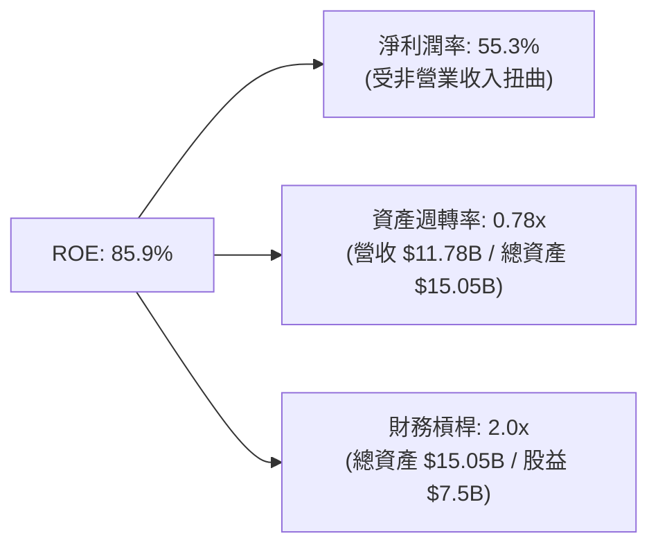

### 6.4 獲利能力驅動因素

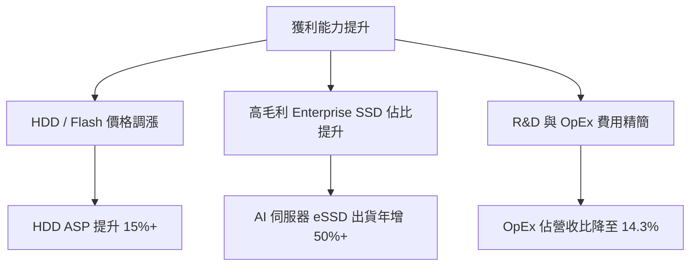

---

## 7. 估值深度分析

### 7.1 同業估值比較表格

為了獲得客觀的估值定位，我們將 WDC 與其機械硬碟直接對手 Seagate (STX) 以及 Flash/DRAM 巨頭 Micron (MU) 進行對比。

| 估值指標 | **Western Digital (WDC)** | **Seagate (STX)** | **Micron (MU)** | 機構級評估與解讀 |
|----------|--------------------------|-------------------|-----------------|------------------|
| **Trailing P/E** | **27.94x** | 32.50x | 18.20x | 🟡 合理。WDC 估值低於 STX，但高於 MU。 |
| **Forward P/E** | **25.73x** | 22.10x | 12.40x | 🔴 偏高。反映市場對 WDC 分拆後增長放緩的擔憂。 |
| **EV / EBITDA** | **41.49x** | 24.50x | 11.20x | 🔴 **顯著溢價**。WDC 的 EV/EBITDA 遠高於同業，顯示估值已被嚴重透支。 |
| **EV / Revenue** | **13.84x** | 4.80x | 3.50x | 🔴 **極度高估**。相較於 STX 的 4.8x，WDC 承受了極高的分拆溢價。 |
| **FCF Yield** | **1.26%** | 3.80% | 4.50% | 🔴 偏低。現金流回報率不及同業，性價比偏低。 |

### 7.2 歷史估值區間分析

WDC 的歷史 Forward P/E 中位數約為 12x - 15x。當前 25.7x 的 Forward P/E 處於過去 10 年估值區間的 **+2 個標準差** 以上，顯示市場已將「AI 需求」與「分拆溢價」完全定價（Priced-in）。

```
╔══════════════════════════════════════════════════════════════════╗
║               WDC 歷史 Forward P/E 估值區間                      ║
╠══════════════════════════════════════════════════════════════════╣
║                                                                  ║
║  歷史低點：      6.0x    ████                                    ║
║  歷史中位數：    13.5x   █████████                               ║
║  當前估值：      25.73x  ███████████████████  ← 處於歷史極值頂峰  ║
║                                                                  ║
║  📊 估值評語：估值擴張已先於基本面見頂，安全邊際（Margin of      ║
║                Safety）極低，不建議在此價位追高。                ║
╚══════════════════════════════════════════════════════════════════╝
```

### 7.3 情境目標價推導

由於 WDC 淨利受折舊攤銷（D&A）與非經常性非營業損益影響極大，我們採用 **EV/EBITDA** 作為主要估值工具，並以 **FY27 基準 EBITDA** 進行推導。

| 情境 | 營收 CAGR (3Y) | EBITDA 預估 | 退出 EV/EBITDA 倍數 | 隱含目標價 | 相對當前股價漲跌幅 | 成立假設條件 |
|------|----------------|-------------|---------------------|------------|--------------------|--------------|
| 🔴 **悲觀** | -5.0% | $2.50B | 15.0x | **$335.00** | **-29.8%** | NAND 價格崩跌，分拆因法律訴訟卡關，AI 需求迅速退潮。 |
| 🟡 **基準** | +8.0% | $4.20B | 25.0x | **$505.00** | **+5.8%** | HDD 需求穩健，NAND 價格微幅上漲，分拆於 12 個月內順利完成。 |
| 🟢 **樂觀** | +15.0% | $5.50B | 32.0x | **$680.00** | **+42.5%** | AI 伺服器爆發，NAND 出現結構性短缺，分拆後兩家公司獲得市場瘋狂追捧。 |

### 7.4 DCF 敏感性分析（12個月目標價矩陣）

基於永續增長率（PGR）為 2.5% 的假設，對 WACC 與營收增長率進行敏感性測試：

| 營收成長情境 | WACC = 13.5% | **WACC = 14.8% (基準)** | WACC = 16.0% |
|--------------|--------------|-------------------------|--------------|
| 🟢 **樂觀 (YoY +15%)** | **$735.00** (+54.0%) | **$680.00** (+42.5%) | **$610.00** (+27.8%) |
| 🟡 **基準 (YoY +8%)** | **$550.00** (+15.2%) | **$505.00** (+5.8%) | **$460.00** (-3.6%) |
| 🔴 **悲觀 (YoY -5%)** | **$375.00** (-21.4%) | **$335.00** (-29.8%) | **$295.00** (-38.2%) |

### 7.5 估值綜合區間

```
╔══════════════════════════════════════════════════════════════════╗
║                    WDC 估值綜合區間與當前股價                    ║
╠══════════════════════════════════════════════════════════════════╣
║                                                                  ║
║  悲觀目標價：  $335.00   ████████████                              ║
║  當前股價：    $477.22   █████████████████  ← 逼近基準目標價       ║
║  基準目標價：  $505.00   ██████████████████                        ║
║  樂觀目標價：  $680.00   ████████████████████████                  ║
║                                                                  ║
║  📊 估值結論：當前股價上行空間僅剩 5.8%，而下行風險高達 29.8%，  ║
║                風險報酬比（Risk/Reward Ratio）極不具吸引力。     ║
╚══════════════════════════════════════════════════════════════════╝
```

---

## 8. 成長催化劑

### 8.1 催化劑時間軸

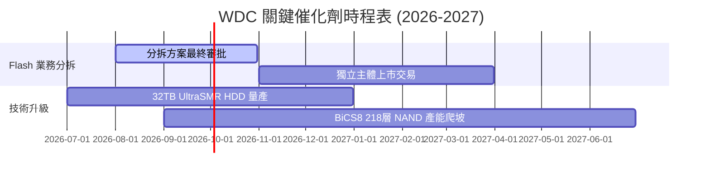

### 8.2 TAM（潛在市場規模）分析

```
╔══════════════════════════════════════════════════════════════════╗
║                 WDC 2027年 潛在市場規模 (TAM) 預估               ║
╠══════════════════════════════════════════════════════════════════╣
║                                                                  ║
║  1. 雲端大容量 HDD 市場： TAM: $18.0B ｜ WDC 份額: ~40% ｜ 🟢高增長║
║  2. 企業級 SSD (eSSD)： TAM: $15.0B ｜ WDC 份額: ~15% ｜ 🟢高毛利║
║  3. 消費級與零售儲存：  TAM: $12.0B ｜ WDC 份額: ~25% ｜ 🟡低增長║
║                                                                  ║
║  📊 綜合 TAM 增長驅動：AI 伺服器存儲密度每 18 個月翻倍，          ║
║                         結構性擴張大容量儲存需求。               ║
╚══════════════════════════════════════════════════════════════════╝
```

### 8.3 成長驅動力結構圖

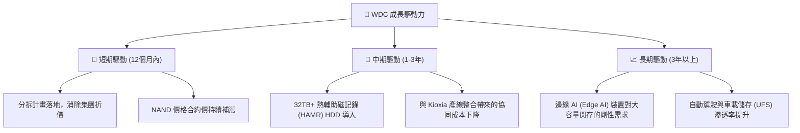

---

## 9. 風險矩陣

### 9.1 風險評分矩陣

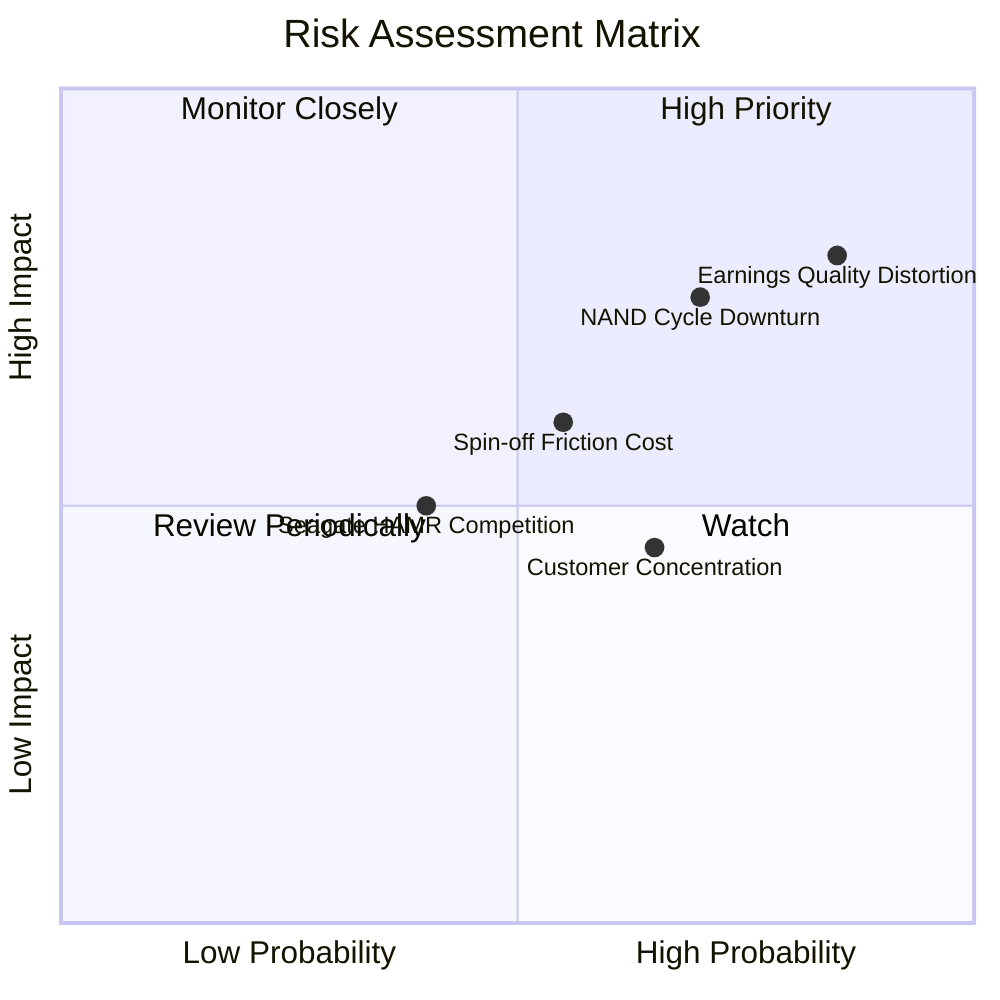

### 9.2 風險清單詳細分析

| # | 風險項目 | 發生機率 | 財務衝擊 | 風險評分 | 機構級緩解與應對措施 |
|---|----------|----------|----------|----------|----------------------|
| 1 | 🔴 **GAAP 盈餘品質扭曲** | 90% (已發生) | 高 (-30% 估值修正) | 🔴 **9.0 / 10** | 市場一旦意識到非營業一次性收益無法持續，估值倍數將面臨劇烈壓縮。投資人應關注 Non-GAAP 核心營運指標。 |
| 2 | 🔴 **NAND Flash 週期再度反轉** | 65% | 高 (-20% 營收) | 🔴 **7.8 / 10** | 密切監控 Samsung 與 SK Hynix 的資本支出與產能利用率。若對手擴產，應立即減碼。 |
| 3 | 🟡 **分拆摩擦與稅務成本** | 50% | 中 (-10% EPS) | 🟡 **6.0 / 10** | 分拆通常伴隨高昂顧問費與潛在的跨國稅務撥備，管理層需在法說會上提供明確的費用指引。 |
| 4 | 🟡 **Seagate HAMR 技術壓制** | 40% | 中 (-5% 市佔率) | 🟡 **5.0 / 10** | Seagate 在 HAMR（熱輔助磁記錄）進度領先，若 WDC 的 ePMR/SMR 路線無法跟上，可能流失超大規模雲端客戶。 |

---

## 10. 投資建議

### 10.1 最終綜合評級雷達圖

```
╔══════════════════════════════════════════════════════════════╗
║               WDC 最終綜合評級雷達圖 (1-10分)                ║
╠══════════════════════════════════════════════════════════════╣
║ 基本面強度  7.0 ▓▓▓▓▓▓▓▓▓▓▓▓▓▓░░░░░░░░░░  (週期復甦確立)     ║
║ 財務健康度  8.5 ▓▓▓▓▓▓▓▓▓▓▓▓▓▓▓▓▓░░░░░░  (淨現金歷史佳)     ║
║ 盈餘含金量  5.0 ▓▓▓▓▓▓▓▓▓▓░░░░░░░░░░░░░░  (非營業收入過高)   ║
║ 估值吸引力  5.0 ▓▓▓▓▓▓▓▓▓▓░░░░░░░░░░░░░░  (EV/EBITDA偏高)    ║
║ 催化劑強度  8.0 ▓▓▓▓▓▓▓▓▓▓▓▓▓▓▓▓░░░░░░  (分拆題材吸睛)     ║
╠══════════════════════════════════════════════════════════════╣
║ 綜合推薦    6.7 ▓▓▓▓▓▓▓▓▓▓▓▓▓░░░░░░░░░░  🟡 持有 (Hold)     ║
╚══════════════════════════════════════════════════════════════╝
```

### 10.2 目標價與隱含報酬率

| 投資情境 | 機率權重 | 目標價 | 隱含報酬率 (相較現價 $477.22) | 權重期望值 |
|----------|----------|--------|------------------------------|------------|
| 🔴 **悲觀情境** | 30% | $335.00 | -29.8% | $100.50 |
| 🟡 **基準情境** | 50% | $505.00 | +5.8% | $252.50 |
| 🟢 **樂觀情境** | 20% | $680.00 | +42.5% | $136.00 |
| **加權公允價值**| **100%** | **$489.00** | **+2.5%** | **建議：逢高獲利了結** |

### 10.3 買入與賣出觸發因素 Checklist

```
╔══════════════════════════════════════════════════════════════════╗
║               ✅ WDC 投資決策 Checklist (機構專用)              ║
╠══════════════════════════════════════════════════════════════════╣
║                                                                  ║
║  🚨 立即分批減碼/賣出觸發條件（滿足任一）：                      ║
║  ✅ 當前股價突破 $510.00 (已極度接近基準公允價值)                ║
║  ✅ 核心營業利益率 (Core Operating Margin) 連續兩季下滑 > 3 pp   ║
║  ✅ NAND Flash 合約價 (Contract Price) 出現轉折向下的訊號        ║
║                                                                  ║
║  🛒 重新買入/加碼觸發條件（需多數符合）：                        ║
║  ☐ 股價回檔至 $380.00 以下 (提供至少 30% 安全邊際)               ║
║  ☐ 分拆方案獲免稅（Tax-Free）批准，且摩擦成本低於 $150M          ║
║  ☐ 核心 FCF 轉換率（排除非營業收入後）回升至 > 75%               ║
╚══════════════════════════════════════════════════════════════════╝
```

### 10.4 投資人適配度分析

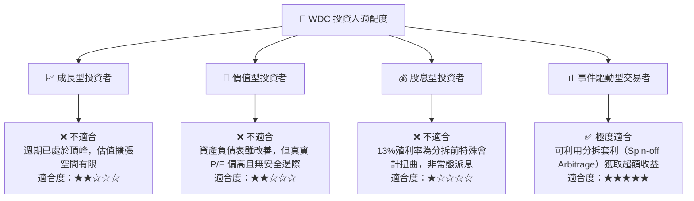

### 10.5 每季財報監控清單（Quarterly Watch List）

在接下來的每季財報中，機構投資人必須追蹤以下核心指標，以驗證投資論點：

1.  **大容量 HDD 出貨量與 ASP**：若 WDC 的 HDD ASP 季增率（QoQ）低於 3%，顯示 Seagate 的 HAMR 競爭可能開始產生定價壓力。
2.  **非營業收入（Other Non-Operating Income）細項**：必須檢視是否有新的非核心收益美化帳面。
3.  **Flash 業務分拆時間表與重組費用**：若累計重組費用突破 $300M，將嚴重侵蝕分拆帶來的估值溢價。
4.  **存貨週轉天數（Days Inventory Outstanding, DIO）**：若 DIO 自目前的 ~70 天回升至 90 天以上，為需求放緩、產能過剩的前兆。

### 10.6 反面論證：什麼會證明本報告「持有」評級錯誤？

若出現以下情況，本報告的「持有/逢高獲利了結」評級將失效，應轉為**強力買入**：
*   **論點失效條件①**：分拆後，HDD 業務獲得市場給予類似純軟體/SaaS 公司的估值倍數（如 35x EV/EBITDA），使分拆總價值遠超預期。
*   **論點失效條件②**：WDC 成功研發出超越 HAMR 的全新磁記錄技術，使 HDD 單碟容量直接突破 40TB，取得絕對壟斷地位。
*   **論點失效條件③**：NAND 產業發生歷史級的大整合（如 WDC 與 Kioxia 實質合併），使 Flash 供給端縮減為三家，毛利率永久性提升至 50% 以上。

---

> **免責聲明**：本報告為 AI 自動生成，僅供研究參考，不構成投資建議。投資有風險，入市需謹慎。