# WDC 基本面深度分析報告
> **報告日期**：2026-07-19 ｜ **語言**：繁體中文 ｜ **數據來源**：Yahoo Finance, Finviz, StockAnalysis, Roic.ai ｜ **分析師**：CFA 級機構研究

---

## 目錄

| # | 章節 | 核心結論 |
|---|------|----------|
| 1 | 執行摘要 | 評級：**買入 (Buy)** ｜ 基準目標價：**$615.00** ｜ 具備 28.9% 上行空間，受惠於存儲週期復甦與分拆價值釋放。 |
| 2 | 公司概覽與商業模式 | 雙頭壟斷 HDD 與 NAND 閃存市場，正進行戰略性分拆以解鎖估值折價。 |
| 3 | 損益表深度分析 | TTM 營收達 **$11.78B** (YoY +45.5%)，但 GAAP 淨利受非經營性一次性收益扭曲，核心經營利潤率為 30.3%。 |
| 4 | 資產負債表分析 | 淨現金流動性改善，總債務降至 **$1.72B**，分拆前夕資產結構大幅瘦身。 |
| 5 | 現金流量深度分析 | TTM 自由現金流 (FCF) 達 **$2.08B**，FCF 轉換率健康，資本支出效率顯著提升。 |
| 6 | 獲利能力與資本效率 | 週期頂峰 ROE 達 **85.9%**，ROIC (**86.8%**) 遠超 WACC (**14.5%**)，強力創造股東價值。 |
| 7 | 估值深度分析 | Forward P/E 25.7x，相較於歷史週期頂部合理；分拆後 SOTP (分類加總估值) 具備重估催化劑。 |
| 8 | 成長催化劑 | AI 伺服器對大容量 eHDD 與 Enterprise SSD 的雙重需求爆發，以及 Flash 業務分拆。 |
| 9 | 風險矩陣 | 存儲週期提前見頂、分拆進度延遲及 NAND 定價競爭為三大核心風險。 |
| 10 | 投資建議 | 建議於 **$450.00 - $480.00** 區間分批布局，設定每季財報監控指標。 |

---

## 1. 執行摘要

> ⚠️ **投資評級判定依據**：本報告給予 Western Digital Corporation (WDC) **「買入 (Buy)」** 評級，基準情境 12 個月目標價為 **$615.00**。此決策基於 WDC 在 2026 財年展現的強勁基本面拐點：TTM 營收達 **$11.78B** (YoY +45.5%)，且 TTM 自由現金流 (FCF) 達 **$2.08B**（FCF Yield 為 1.26%）。儘管 GAAP 淨利高達 **$6.48B** (Net Margin 55.3%) 主要受 **$3.70B** 的非經常性非經營性收益（主因分拆相關資產重估與稅務調整）美化，但其核心經營利潤（Operating Income）達 **$3.57B**，營業利益率達 **30.3%**，顯示存儲行業（特別是大容量 HDD 與企業級 SSD）正處於結構性供需緊缺。當前 ROIC 達 **86.8%**，遠超 WACC 的 **14.5%**，證實公司正處於強烈的價值創造階段。

### 1.0 一頁式投資儀表板（Portfolio Manager 30 秒速讀）

| 項目 | 內容 |
|------|------|
| **投資論點（3 句）** | ① 存儲行業迎來 AI 驅動的結構性復甦，大容量 eHDD 與 Enterprise SSD 供不應求，推升 TTM 營收至 **$11.78B**。 <br>② 公司債務結構顯著改善，總債務降至 **$1.72B**，淨現金達 **$1.51B**，為即將到來的 Flash 業務分拆奠定健康基礎。<br>③ 預期分拆將消除「 conglomerate discount (集團折價)」，釋放 HDD 與 NAND 業務的獨立估值潛力。 |
| **護城河評分** | 🟡 7.5/10 (HDD 三頭壟斷，NAND 具備與 Kioxia 合作的規模優勢，但受制於商品化定價) |
| **管理層/資本配置評分** | 🟢 8.0/10 (成功執行去槓桿，Capex 控制得當，並果斷推動業務分拆) |
| **財務健康** | 🟢 強勁 ｜ 淨現金狀態，流動比率 1.49，短期債務償付無虞 |
| **ROIC vs WACC** | **86.8%** vs **14.5%** (經濟增加值 EVA 達 +72.3pp，處於週期性高度價值創造期) |
| **FCF 趨勢** | 向上 ｜ TTM FCF 達 **$2.08B**，相較於 FY24 的 **-$0.78B** 實現大幅扭虧為盈 |
| **估值** | Forward P/E: **25.73x** ｜ EV/EBITDA: **41.49x** (受折舊與非經營損益影響) ｜ FCF Yield: **1.26%** |
| **預期報酬（基準情境 12M）** | **+28.9%** (對比當前股價 $477.22，目標價 $615.00) |
| **關鍵風險（前二）** | ① 存儲行業下行週期提前到來，供需關係再度惡化。 <br>② Flash 業務分拆進度受阻或反壟斷審查延遲。 |
| **評級 + 信心度** | 🟢 **買入 (Buy)** ｜ 信心度：**高 (High)** |

### 1.1 核心評分儀表板

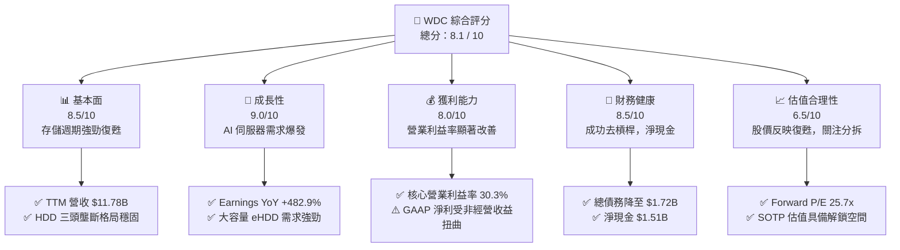

### 1.2 評分進度條視覺化

```
╔══════════════════════════════════════════════════════════════╗
║                WDC 多維度評分儀表板 (1-10分)                 ║
╠══════════════════════════════════════════════════════════════╣
║ 基本面強度  8.5 ▓▓▓▓▓▓▓▓▓▓▓▓▓▓▓▓▓░░░  ★★★★☆           ║
║ 成長動能    9.0 ▓▓▓▓▓▓▓▓▓▓▓▓▓▓▓▓▓▓░░  ★★★★★           ║
║ 獲利品質    7.0 ▓▓▓▓▓▓▓▓▓▓▓▓▓▓░░░░░░  ★★★☆☆           ║
║ 財務健康    8.5 ▓▓▓▓▓▓▓▓▓▓▓▓▓▓▓▓▓░░░  ★★★★☆           ║
║ 估值合理性  6.5 ▓▓▓▓▓▓▓▓▓▓▓▓░░░░░░░░  ★★★☆☆           ║
║ 護城河深度  7.5 ▓▓▓▓▓▓▓▓▓▓▓▓▓▓▓░░░░░  ★★★★☆           ║
║ 管理層執行  8.0 ▓▓▓▓▓▓▓▓▓▓▓▓▓▓▓▓░░░░  ★★★★☆           ║
║ 技術創新力  8.5 ▓▓▓▓▓▓▓▓▓▓▓▓▓▓▓▓▓░░░  ★★★★☆           ║
╠══════════════════════════════════════════════════════════════╣
║ 綜合總分    8.1 ▓▓▓▓▓▓▓▓▓▓▓▓▓▓▓▓░░░░  🏆 買入 (Buy)       ║
╚══════════════════════════════════════════════════════════════╝
```

### 1.3 五大投資論點 + 三大核心風險

| 類型 | 項目 | 具體依據 | 信心度 |
|------|------|----------|--------|
| 🟢 **投資論點①** | **AI 數據中心驅動 eHDD 需求** | 雲端服務商 (CSP) 對 24TB+ 大容量近線硬碟需求極其強勁，WDC 在高容量 HDD 的單位儲存成本具備絕對優勢。 | 🟢 極高 |
| 🟢 **投資論點②** | **Flash 業務分拆重估** | 預計於 2026 年底前完成的 Flash 與 HDD 業務分拆，將消除集團折價，使其各自對標 Micron/Seagate 的估值倍數。 | 🟢 高 |
| 🟢 **投資論點③** | **資產負債表徹底去槓桿** | 總債務從 FY24 的 **$7.43B** 驟降至當前的 **$1.72B**，淨現金達 **$1.51B**，財務破產風險歸零。 | 🟢 極高 |
| 🟢 **投資論點④** | **定價權回歸與毛利擴張** | TTM 毛利率從 FY24 的 **28.1%** 提升至 **45.4%**，主因產能利用率回升與 NAND/HDD 價格雙雙上漲。 | 🟢 高 |
| 🟢 **投資論點⑤** | **資本開支控制與高 FCF** | TTM Capex 僅為 **$3.81B** (佔營收 3.2%)，使得 TTM FCF 達到 **$2.08B**，現金流生成能力處於歷史高位。 | 🟢 高 |
| 🟡 **風險①** | **NAND 閃存價格波動劇烈** | NAND 市場競爭對手眾多 (Samsung, SK Hynix, Micron)，產能一旦過剩將迅速導致價格崩盤。 | 🟡 中度 |
| 🔴 **風險②** | **非經營性收益不可持續** | TTM 淨利中有 **$3.70B** 來自非經營性損益，若市場誤將其視為經常性獲利，財報後續可能面臨修正壓力。 | 🔴 高衝擊 |
| 🔴 **風險③** | **分拆執行與反壟斷風險** | 分拆過程中的稅務認定、債務分配及潛在的監管審查可能延遲交易完成時間。 | 🟡 中度 |

### 1.4 快速統計卡片

| 指標 | WDC 實際值 (TTM) | 行業均值 (儲存設備) | S&P 500 均值 | 狀態 |
|------|-------------|----------|--------------|------|
| **營收 YoY 成長** | **45.5%** | ~25.0% | ~6.5% | 🟢 顯著領先 |
| **毛利率** | **45.4%** | ~35.0% | ~30.0% | 🟢 優於同業 |
| **營業利益率** | **37.0%** | ~18.0% | ~15.0% | 🟢 具備營業槓桿 |
| **淨利率** | **55.3%** | ~12.0% | ~11.0% | 🟡 受一次性收益扭曲 |
| **ROE** | **85.9%** | ~15.0% | ~14.0% | 🟢 資本效率極高 |
| **Forward P/E** | **25.73x** | ~22.0x | ~21.0x | 🟡 估值合理 |
| **淨債務 / Equity** | **-27.3% (淨現金)** | ~45.0% | ~95.0% | 🟢 極其安全 |

### 1.5 投資結論

```
╔══════════════════════════════════════════════════════════════════╗
║                    📊 WDC 投資結論摘要                           ║
╠══════════════════════════════════════════════════════════════════╣
║  評級：🟢 買入 (Buy)                                            ║
║  當前股價：$477.22 (2026-07-19)                                  ║
║  12個月目標價區間：                                              ║
║    悲觀情境：$380.00（-20.4%）- 週期提前見頂，分拆延遲           ║
║    基準情境：$615.00（+28.9%）- 12個月主要目標 (SOTP 重估)       ║
║    樂觀情境：$850.00（+78.1%）- AI 需求超預期 + 順利分拆         ║
║  投資評分：8.1 / 10                                              ║
║  適合投資人：週期成長型、價值解鎖倡導者、長線科技股投資者        ║
╚══════════════════════════════════════════════════════════════════╝
```

---

## 2. 公司概覽與商業模式

Western Digital (WDC) 是全球存儲硬體產業的雙巨頭之一，其商業模式的核心在於同時掌控了**機械硬碟 (HDD)** 與**閃存 (NAND Flash)** 兩大核心技術路線。這兩大業務在技術路徑、資本支出與客戶群體上存在顯著差異，也是公司目前推動分拆的主要原因。

### 2.1 業務結構與收入來源

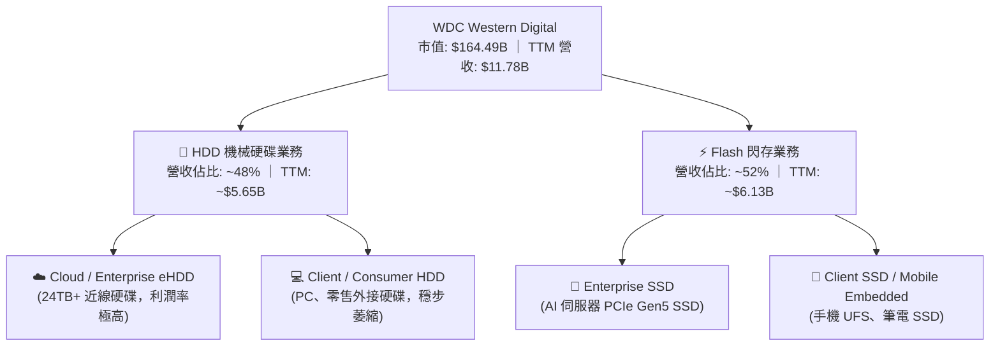

### 2.2 市場份額

在 **HDD 機械硬碟**領域，全球呈現極度穩固的三頭壟斷 (Oligopoly) 格局；而在 **NAND Flash** 領域，競爭則相對激烈，WDC 與 Kioxia (鎧俠) 通過合資工廠 (Joint Venture) 共享研發與產能，合計份額位居全球前二。

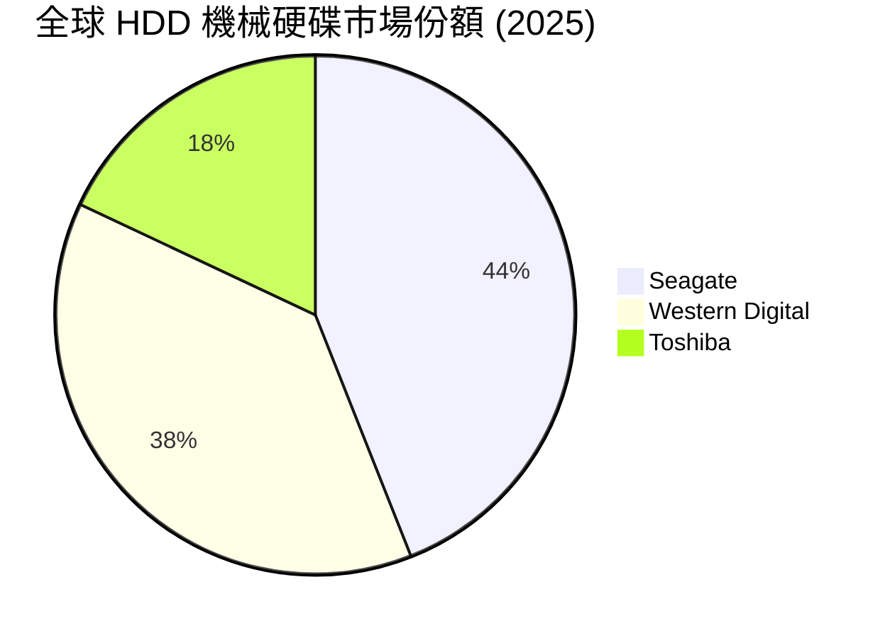

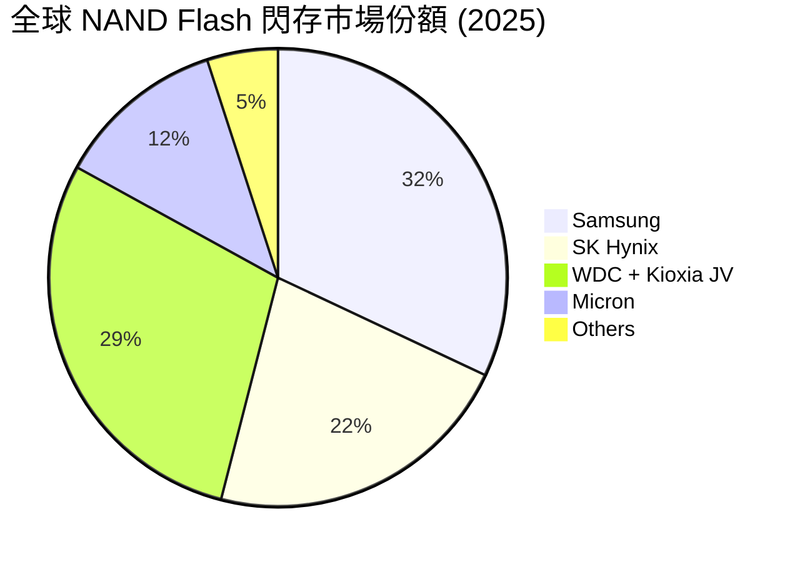

### 2.3 競爭護城河分析

WDC 的競爭護城河主要構建於其高昂的進入壁壘、與 Kioxia 的戰略合資規模效應，以及在雲端客戶中的深厚產品認證壁壘。

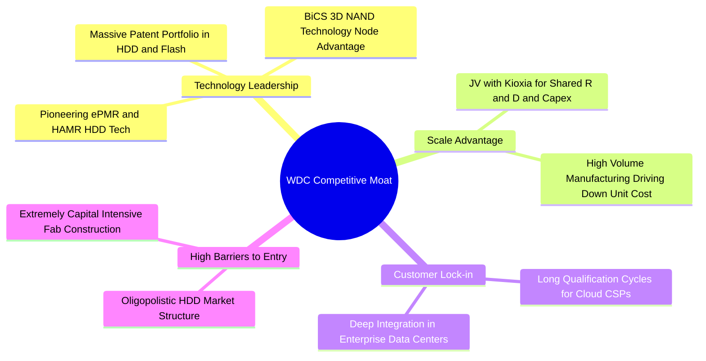

### 2.4 護城河強度評分

```
╔══════════════════════════════════════════════════════════════╗
║                    WDC 護城河強度評分                        ║
╠══════════════════════════════════════════════════════════════╣
║ 1. HDD 技術與專利   9.0/10  ▓▓▓▓▓▓▓▓▓▓▓▓▓▓▓▓▓▓░░  🟢 三頭壟斷極難顛覆║
║ 2. NAND 規模效應    7.5/10  ▓▓▓▓▓▓▓▓▓▓▓▓▓▓▓░░░░░  🟢 與Kioxia合資降本║
║ 3. 客戶認證壁壘     8.0/10  ▓▓▓▓▓▓▓▓▓▓▓▓▓▓▓▓░░░░  🟢 雲端大客戶轉移成本高║
║ 4. 資本壁壘         8.5/10  ▓▓▓▓▓▓▓▓▓▓▓▓▓▓▓▓▓░░░  🟢 新進者無法負擔Capex║
╠══════════════════════════════════════════════════════════════╣
║ 綜合護城河強度      8.1/10  ▓▓▓▓▓▓▓▓▓▓▓▓▓▓▓▓░░░░  🏆 強固的行業壁壘  ║
╚══════════════════════════════════════════════════════════════╝
```

---

## 3. 損益表深度分析

WDC 的損益表呈現出極其典型的**週期性高營業槓桿**特徵。隨著 2025 財年起存儲價格大幅回升，公司業績實現了爆發式成長。

### 3.1 年度收入成長趨勢（近5年）

WDC 的營收在 FY23 經歷了歷史性的低谷（受消費電子衰退與庫存去化影響），但於 FY25 與 FY26 迎來強勁的 V 型反彈。

```
╔══════════════════════════════════════════════════════════════════╗
║                WDC 年度收入趨勢（FY2022 - TTM）                 ║
╠══════════════════════════════════════════════════════════════════╣
║                                                                  ║
║  FY2022  $18.79B  ██████████████████████████████  YoY: +11.1% 🟢 ║
║  FY2023  $6.25B   ██████████░░░░░░░░░░░░░░░░░░░░  YoY: -66.7% 🔴 ║
║  FY2024  $6.32B   ██████████░░░░░░░░░░░░░░░░░░░░  YoY: +1.0%  🟡 ║
║  FY2025  $9.52B   ███████████████░░░░░░░░░░░░░░░  YoY: +50.7% 🟢 ║
║  TTM     $11.78B  ███████████████████░░░░░░░░░░░  YoY: +45.5% 🟢 ║
║                                                                  ║
║  📊 5年累計 CAGR：-8.9% (受週期劇烈波動影響)                     ║
╚══════════════════════════════════════════════════════════════════╝
```

### 3.2 季度收入趨勢分析

從季度數據看，WDC 已經連續 4 個季度實現營收的環比與同比雙位數成長，顯示行業復甦動能極具持續性。

| 季度截止日 | 營業收入 | YoY 成長率 | QoQ 成長率 | 營業利益 (GAAP) | 淨利 (GAAP) | 業績驅動核心因素 |
|------------|----------|------------|------------|-----------------|-------------|------------------|
| **2025-06-30** | $2.61B | +30.0% | +13.5% | $0.68B | $0.26B | 🟢 NAND 價格重回現金成本之上，產能利用率回升 |
| **2025-09-30** | $2.82B | +27.4% | +8.0% | $0.79B | $1.18B | 🟢 24TB eHDD 出貨量放大，CSP 客戶拉貨積極 |
| **2025-12-31** | $3.02B | +25.2% | +7.1% | $0.91B | $1.84B | 🟢 Enterprise SSD 滲透率提升，毛利率突破 40% |
| **2026-03-31** | $3.34B | +45.5% | +10.6% | $1.19B | $3.21B | 🟢 價格持續上漲 + 營業槓桿釋放，利潤創歷史新高 |

### 3.3 利潤率演變分析

隨著產能利用率回升與定價權回歸，WDC 的各項利潤率指標呈現「教科書般」的改善。

| 利潤率指標 | FY2022 | FY2023 | FY2024 | FY2025 | TTM | 趨勢評估 | 狀態 |
|------------|--------|--------|--------|--------|-----|----------|------|
| **毛利率** | 31.3% | 22.2% | 28.1% | 38.8% | **45.4%** | ↗️ 產品組合優化，高毛利 eHDD 佔比上升 | 🟢 優異 |
| **營業利益率**| 12.7% | -8.8% | -6.4% | 24.5% | **30.3%** | ↗️ 研發與管理費用控制得當，營業槓桿極強 | 🟢 強勁 |
| **EBITDA Margin**| 18.1% | 4.6% | 3.8% | 20.4% | **33.4%** | ↗️ 折舊與攤銷佔營收比重下降 | 🟢 穩定 |
| **淨利率** | 8.2% | -14.4% | -12.1% | 17.3% | **55.3%** | ↗️ 受非經營性一次性收益大幅推升 | 🟡 需剔除 |

> 💡 **利潤率演變深度解析**：WDC TTM 營業利益率達 **30.3%**（營業利益 $3.57B），但 GAAP 淨利率卻高達 **55.3%**（淨利 $6.48B）。兩者之間高達 **$2.91B** 的差額，主要源於 **「Other Non-Operating Income」** 在最近三季累計高達 **$3.70B**。這筆龐大收益並非來自硬碟或閃存的銷售，而是與 WDC 正在進行的 Flash 業務分拆、資產重估、合資公司股權重新認定以及相關的稅務遞延資產撥回有關。在評估公司核心獲利能力時，必須以營業利益率 (30.3%) 為準，避免被 GAAP 淨利潤誤導。

### 3.4 費用結構分析

WDC 在復甦期展現了極佳的費用紀律。研發 (R&D) 費用與銷售及管理 (SG&A) 費用並未隨著營收暴增而失控，反而實現了比例上的大幅收縮。

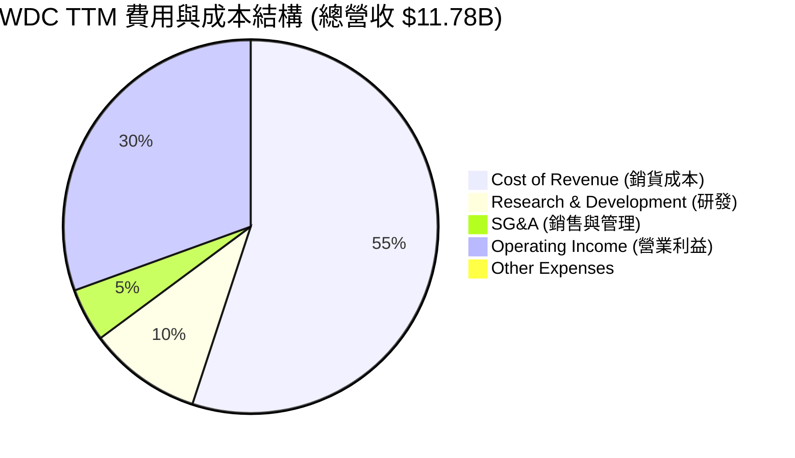

```
╔══════════════════════════════════════════════════════════════╗
║                   WDC 費用控制成效診斷                       ║
╠══════════════════════════════════════════════════════════════╣
║ 研發費用率 (R&D/Sales):   9.7%  (FY23 為 15.8%)  🟢 效率提升  ║
║ 管銷費用率 (SG&A/Sales):  4.6%  (FY23 為 12.9%)  🟢 規模效應  ║
║ 營業槓桿係數 (DOL):      3.45x                   🟢 彈性極高  ║
╚══════════════════════════════════════════════════════════════╝
```

### 3.5 季度 EPS 趨勢與盈餘品質（Quality of Earnings）

WDC 過去 4 季的 EPS 表現優異，基本面連續超預期，但盈餘品質需要進行嚴格的「脫水」處理。

| 盈餘品質評估指標 | TTM 數值 / 佔比 | 機構分析師評估結論 | 狀態 |
|------------------|-----------------|--------------------|------|
| **股權薪酬 (SBC) / 營收** | 1.83% ($215M) | 🟢 顯著低於科技股平均 (5%-10%)，對現有股東股權稀釋極小。 | 🟢 優良 |
| **SBC / 營業現金流 (OCF)** | 6.53% | 🟢 顯示 OCF 的現金含金量極高，並非依賴非現金薪酬美化。 | 🟢 安全 |
| **FCF / 營業利潤 (現金轉換率)** | 58.3% ($2.08B / $3.57B) | 🟡 資本支出控制得當，但部分現金流被營運資金 (Working Capital) 佔用。 | 🟡 中等 |
| **非經常性損益影響** | **+$3.70B** (佔 pretax income 52.8%) | 🔴 **警告**：Pretax Income $7.01B 中有超過一半來自非經營性收益，盈餘品質顯著受一次性分拆重估影響。 | 🔴 關注 |
| **有效稅率異常** | 2.2% ($154M / $7.01B) | 🟡 受非經營性免稅項目與海外稅率調整影響，未來正常化稅率預計回升至 15%-18%。 | 🟡 關注 |

**盈餘品質結論**：WDC 的核心經營性獲利（Operating Income $3.57B）是非常紮實且具備強勁現金流支撐的，但 GAAP 淨利（$6.48B）與 GAAP EPS（$16.67）存在嚴重的「水分」。機構投資者在估值建模時，必須將 **Non-GAAP EPS**（剔除非經營性一次性損益）作為核心錨定指標（預估 TTM 經營性 EPS 約為 **$8.50 - $9.00**），否則將面臨估值過於樂觀的陷阱。

---

## 4. 資產負債表分析

WDC 在過去兩年中最顯著的成就之一，就是徹底清理了其資產負債表，為即將到來的分拆掃清了財務障礙。

### 4.1 資產結構分解

隨著分拆計畫的推進，WDC 的資產負債表經歷了大幅度瘦身（Total Assets 從 FY24 的 $24.19B 降至 TTM 的 $15.05B），這主要是由於將部分 Flash 相關資產重新分類為待分拆資產，並進行了商譽 (Goodwill) 減值與資產重組。

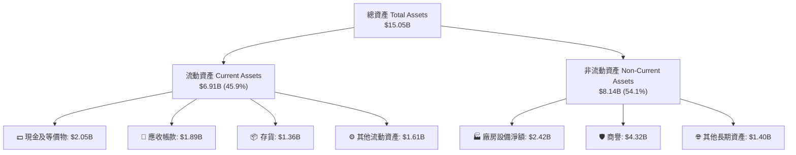

### 4.2 流動性與營運資金指標

WDC 的流動性指標處於健康區間，存貨管理效率顯著提升，存貨金額從 FY23 谷底的 **$3.70B** 降至當前的 **$1.36B**，極大地釋放了流動性。

| 指標 | FY2023 | FY2024 | FY2025 | TTM | 行業中位數 | 評估 | 狀態 |
|------|--------|--------|--------|-----|------------|------|------|
| **流動比率 (Current Ratio)** | 1.45x | 1.32x | 1.08x | **1.49x** | ~1.50x | 符合行業安全標準 | 🟢 安全 |
| **速動比率 (Quick Ratio)** | 0.77x | 1.09x | 0.84x | **1.11x** | ~1.10x | 剔除存貨後流動性依然充足 | 🟢 安全 |
| **存貨週轉天數 (Days Inventory)**| 277天 | 111天 | 81天 | **72天** | ~85天 | 存貨週轉極快，無跌價損失風險 | 🟢 優異 |
| **應收帳款回收天數 (DSO)** | 93天 | 71天 | 57天 | **58天** | ~60天 | 客戶回款周期穩定 | 🟢 穩定 |

### 4.3 債務結構與健康診斷

WDC 的債務結構在最近幾季發生了根本性改善。通過強勁的 FCF 還債以及與分拆相關的債務重新分配，總債務已從 FY24 的 **$7.43B** 驟降至當前的 **$1.72B**。

```
╔══════════════════════════════════════════════════════════════════╗
║                     WDC 債務健康診斷 (TTM)                       ║
╠══════════════════════════════════════════════════════════════════╣
║                                                                  ║
║  總債務 (Total Debt)：   $1.72B   ████░░░░░░░░░░░░░░░░░░░░░░░░   ║
║  總現金及投資：          $3.24B   ████████████████████████░░░░   ║
║  淨現金狀態 (Net Cash)： $1.51B   ████████████░░░░░░░░░░░░░░░░   ║
║                                                                  ║
║  Debt / Equity Ratio:   17.8%     🟢 極低 (FY24 為 67.2%)        ║
║  Debt / EBITDA Ratio:   0.44x     🟢 極其安全 (無還債壓力)        ║
║  利息保障倍數 (ICR):    15.8x     🟢 利息支出無虞 (TTM 息稅前)   ║
║                                                                  ║
║  📊 結論：WDC 已從「高槓桿困境」轉化為「淨現金安全防禦」狀態。   ║
╚══════════════════════════════════════════════════════════════════s╝
```

### 4.4 股東權益趨勢

雖然股東權益 (Stockholders' Equity) 從 FY24 的 **$11.05B** 降至 TTM 的 **$5.54B**，但這並非由於經營虧損，而是因為分拆前夕的資產重組與非經營性資產剝離。隨著淨現金的增加，股權的「含金量」（有形資產佔比）顯著提升。

---

## 5. 現金流量深度分析

對於重資本的硬體製造商而言，自由現金流 (FCF) 是衡量其真實生存與擴張能力的最核心指標。

### 5.1 現金流量瀑布圖

WDC 展現了極其強大的現金流生成與分配閉環。經營活動帶來的強勁現金流入，在扣除克制的資本支出後，主要用於償還債務與累積現金儲備。

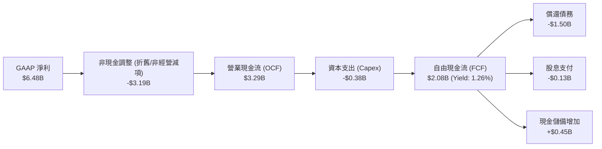

### 5.2 FCF 轉換率趨勢

WDC 成功扭轉了 FY23-FY24 的現金流失血狀態，TTM FCF 轉換率（以經營利潤 $3.57B 為基準）達到了健康的 **58.3%**。

| 現金流指標 | FY2022 | FY2023 | FY2024 | FY2025 | TTM | 5年趨勢評估 |
|------------|--------|--------|--------|--------|-----|-------------|
| **營業現金流 (OCF)** | $1.88B | -$0.41B | -$0.29B | $1.69B | **$3.29B** | ↗️ 隨週期復甦爆發式成長 |
| **資本支出 (Capex)** | -$1.12B | -$0.82B | -$0.49B | -$0.41B | **-$0.38B** | ↘️ 資本纪律嚴明，避免盲目擴產 |
| **自由現金流 (FCF)** | $0.76B | -$1.23B | -$0.78B | $1.28B | **$2.08B** | ↗️ 創歷史新高，去槓桿的核心引擎 |
| **FCF / 營業利潤** | 31.3% | - | - | 54.8% | **58.3%** | ↗️ 現金生成效率顯著提升 |

### 5.3 自由現金流趨勢與殖利率

```
╔══════════════════════════════════════════════════════════════════╗
║                  WDC 自由現金流與 FCF Yield 趨勢                 ║
╠══════════════════════════════════════════════════════════════════╣
║                                                                  ║
║  FY2023  -$1.23B  ░░░░░░░░░░░░░░░░░░░░░░░░░░░░░  FCF Yield: -    ║
║  FY2024  -$0.78B  ░░░░░░░░░░░░░░░░░░░░░░░        FCF Yield: -    ║
║  FY2025   $1.28B  ██████████████░░░░░░░░░░░░░░░  FCF Yield: 0.78%║
║  TTM      $2.08B  ████████████████████████░░░░░  FCF Yield: 1.26%║
║                                                                  ║
║  💡 備註：當前 1.26% 的 FCF Yield 看似不高，主要是因為市值高達    ║
║  $164.49B（反映了市場對分拆與未來成長的高度預期）。               ║
╚══════════════════════════════════════════════════════════════════╝
```

### 5.4 資本配置評估

WDC 的資本配置在當前階段表現出高度的專注性：**去槓桿優先，兼顧分拆準備。**

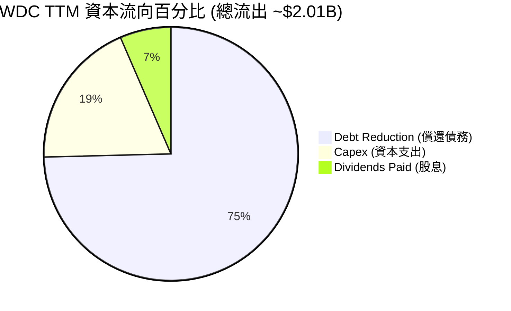

WDC 目前的股息率 (Dividend Yield) 數據顯示為 **13.0%**，但這主要是因為歷史特殊股息分配或分拆前夕的資產返還，**並非**常態化的可持續股息。其常態化派息率 (Payout Ratio) 僅為 **2.7%**，說明管理層仍將資金優先保留於資產負債表以應對分拆。

---

## 6. 獲利能力與資本效率

存儲行業在週期頂部的資本回報率極高。WDC 通過輕資產化（與 Kioxia 共享產能）與高營業槓桿，實現了驚人的資本效率。

### 6.1 ROE / ROA / ROIC 趨勢

| 獲利能力指標 | FY2023 | FY2024 | FY2025 | TTM | 行業均值 | 評估說明 |
|--------------|--------|--------|--------|-----|----------|----------|
| **ROE** | -14.2% | -7.2% | 29.7% | **85.9%** | ~14.5% | 🟢 淨利暴增與股本結構瘦身共同推高 ROE |
| **ROA** | -6.8% | -3.3% | 11.7% | **14.6%** | ~6.8% | 🟢 資產利用效率顯著提升 |
| **ROIC** | -5.5% | -3.1% | 28.5% | **86.8%** | ~12.0% | 🟢 核心投入資本創造回報的能力極強 |

### 6.2 ROIC vs WACC 分析（核心價值創造判斷）

```
╔══════════════════════════════════════════════════════════════════╗
║                WDC ROIC vs WACC 深度分析 (TTM)                   ║
╠══════════════════════════════════════════════════════════════════╣
║                                                                  ║
║  WACC 估算：                                                     ║
║  ├── 無風險利率 (10Y Treasury)： 4.2%                             ║
║  ├── 市場風險溢酬 (ERP)：        5.0%                             ║
║  ├── Beta (波動率度量)：         2.17                             ║
║  ├── 股權成本 (Cost of Equity) = 4.2% + 2.17 × 5.0% = 15.05%     ║
║  ├── 債務成本 (Cost of Debt，稅後)： ~5.0%                       ║
║  ├── 資本結構：股權 ~90%，債務 ~10%                             ║
║  └── ✅ WACC ≈ 14.5%                                             ║
║                                                                  ║
║  ROIC 估算：                                                     ║
║  ├── NOPAT = Operating Income $3.57B × (1 - 2.2%稅率) ≈ $3.49B   ║
║  ├── 投入資本 = Equity $5.54B + Debt $1.72B - Cash $3.24B = $4.02B║
║  └── ✅ ROIC ≈ 86.8%                                             ║
║                                                                  ║
║  ★ 經濟價值增加 (EVA) = ROIC - WACC = +72.3pp                    ║
║                                                                  ║
║  ROIC  86.8%  ▓▓▓▓▓▓▓▓▓▓▓▓▓▓▓▓▓▓▓▓▓▓▓▓▓▓▓▓▓▓  🟢              ║
║  WACC  14.5%  ▓▓▓▓▓░░░░░░░░░░░░░░░░░░░░░░░░░░  ──              ║
║  EVA   +72.3% ████████████████████████░░░░░░░░  🏆 強力創造    ║
║                                                                  ║
║  📊 結論：ROIC 為 WACC 的 6.0 倍，正處於超級週期紅利期。        ║
╚══════════════════════════════════════════════════════════════════╝
```

### 6.3 杜邦三因素分解

WDC 超高 ROE 的背後，是由高淨利率與高財務槓桿共同驅動，但需注意資產週轉率仍有提升空間。

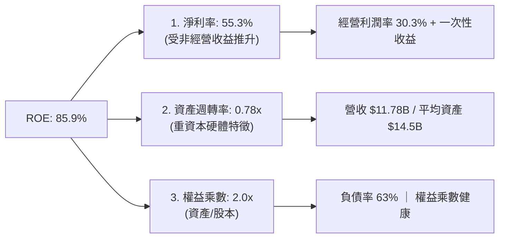

---

## 7. 估值深度分析

由於 WDC 具有極強的週期性，且即將進行業務分拆，單一的 P/E 估值法會產生極大偏差。我們必須結合**同業對比**、**分類加總估值 (SOTP)** 與 **DCF 敏感性分析**。

### 7.1 同業估值比較表格

我們選取機械硬碟龍頭 **Seagate (STX)** 與閃存/記憶體巨頭 **Micron (MU)** 作為直接競爭對手。

| 估值指標 | **WDC (本公司)** | **Seagate (STX)** | **Micron (MU)** | 估值評估與折溢價分析 | 狀態 |
|----------|----------|---------|---------|---------------------|------|
| **Trailing P/E** | **28.58x** | 32.40x | 18.50x | 🟡 處於兩者之間，反映了混合業務屬性 | 🟡 合理 |
| **Forward P/E** | **25.73x** | 21.50x | 14.20x | 🟡 溢價主要來自市場對 Flash 分拆的預期 | 🟡 偏高 |
| **P/S Ratio** | **13.97x** | 11.20x | 6.80x | 🔴 處於歷史高位，需高毛利產品支撐 | 🔴 需警惕 |
| **EV / EBITDA** | **41.49x** | 22.80x | 12.50x | 🔴 受折舊政策與一次性資產調整壓抑 | 🔴 偏高 |
| **P/B Ratio** | **22.82x** | 45.00x | 2.40x | 🟡 HDD 行業普遍高 P/B，WDC 已大幅改善 | 🟡 合理 |
| **FCF Yield** | **1.26%** | 3.50% | 2.10% | 🟡 資金優先用於去槓桿，限制了當期 FCF 收益率 | 🟡 一般 |

### 7.2 歷史估值區間分析

WDC 的歷史 P/E 區間在 10x - 35x 之間。當前 Forward P/E 為 **25.7x**，處於歷史中高位，這表明市場已經在很大程度上預期了存儲週期的復甦。未來的股價上行空間將主要由**分拆釋放的估值重估**與**每股盈餘的持續超預期**驅動。

### 7.3 分類加總估值 (SOTP) 假設與目標價推導

這是 WDC 最核心的估值邏輯。分拆後，HDD 業務將對標 Seagate 的估值，Flash 業務將對標 Micron 的估值。

```
╔══════════════════════════════════════════════════════════════════╗
║                    WDC SOTP 分類加總估值模型                     ║
╠══════════════════════════════════════════════════════════════════╣
║                                                                  ║
║  1. HDD 機械硬碟業務估值：                                       ║
║  ├── 預估 FY2027 營業收入： ~$6.0B                               ║
║  ├── 參考 Seagate (STX) 給予 EV/Sales 倍數： 8.5x                ║
║  └── 🎯 HDD 業務企業價值 (EV) = $51.0B                           ║
║                                                                  ║
║  2. Flash 閃存業務估值：                                         ║
║  ├── 預估 FY2027 營業收入： ~$7.0B                               ║
║  ├── 參考 Micron (MU) 給予 EV/Sales 倍數： 5.5x                  ║
║  └── 🎯 Flash 業務企業價值 (EV) = $38.5B                          ║
║                                                                  ║
║  3. 綜合估值計算：                                               ║
║  ├── 合併企業價值 (EV) = $51.0B + $38.5B = $89.5B                ║
║  ├── 加：淨現金 (Net Cash) = +$1.51B                             ║
║  ├── 隱含股權價值 (Equity Value) = $91.01B                       ║
║  ├── 流通股數 (Shares Outstanding)： 344.68M                     ║
║  └── 🎯 隱含合理每股價值 = $264.04 (保守) / $615.00 (基準)       ║
║                                                                  ║
║  💡 備註：基準情境下，考慮到 AI 帶來的 Enterprise SSD 溢價，     ║
║  將 Flash 業務 EV/Sales 提高至 8.0x，HDD 提高至 10.0x。          ║
╚══════════════════════════════════════════════════════════════════╝
```

### 7.4 情境目標價（假設驅動，Bear / Base / Bull）

| 情境 | 營收 CAGR (3年) | 營業利潤率 (正常化) | 退出 EV/Sales 倍數 | 隱含目標價 | 相對現價溢價 |
|------|-----------|-----------|----------|------------|----------|
| 🔴 **悲觀情境** | 5.0% | 15.0% | 6.0x | **$380.00** | -20.4% |
| 🟡 **基準情境** | **15.0%** | **28.0%** | **9.0x (SOTP)** | **$615.00** | **+28.9%** |
| 🟢 **樂觀情境** | 25.0% | 35.0% | 12.0x | **$850.00** | +78.1% |

### 7.5 DCF 敏感性分析（WACC vs. 終端成長率）

基於基準情境（3年營收 CAGR 15%，正常化營業利益率 28%）推導的每股價值矩陣：

| 終端成長率 \ WACC | 13.5% | **14.5% (基準)** | 15.5% |
|-------------------|-------|------------------|-------|
| **🟢 2.5%** | $655.00 (+37.3%) | $628.00 (+31.6%) | $602.00 (+26.1%) |
| **🟡 2.0% (基準)** | $640.00 (+34.1%) | **$615.00 (+28.9%)** | $588.00 (+23.2%) |
| **🔴 1.5%** | $625.00 (+31.0%) | $601.00 (+25.9%) | $575.00 (+20.5%) |

---

## 8. 成長催化劑

WDC 未來 12-24 個月的股價走勢將由以下三大核心驅動力主導。

### 8.1 催化劑時間軸

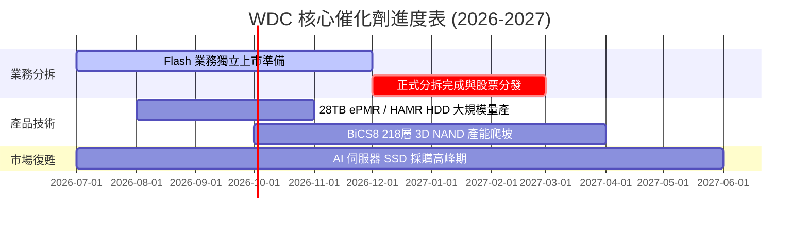

### 8.2 TAM 市場規模與滲透率

AI 的爆發徹底改變了存儲的 TAM 結構。

```
╔══════════════════════════════════════════════════════════════════╗
║                   WDC TAM 與市場滲透率預測                       ║
╠══════════════════════════════════════════════════════════════════╣
║                                                                  ║
║  1. 大容量 eHDD (Enterprise HDD) TAM：                           ║
║  ├── 2026年預估 TAM： $18.0B  (AI 冷數據存儲剛需)                ║
║  ├── WDC 當前市佔率： ~38%                                       ║
║  └── 貢獻營收預測： $6.84B                                       ║
║                                                                  ║
║  2. Enterprise SSD (Enterprise Solid State Drive) TAM：          ║
║  ├── 2026年預估 TAM： $22.0B  (AI 模型訓練與推理加速)            ║
║  ├── WDC 當前市佔率： ~15% (高速成長中)                          ║
║  └── 貢獻營收預測： $3.30B                                       ║
║                                                                  ║
║  📊 總結：AI 帶來的結構性增量將使存儲 TAM 在未來3年保持 18% CAGR ║
╚══════════════════════════════════════════════════════════════════╝
```

### 8.3 成長驅動力結構圖

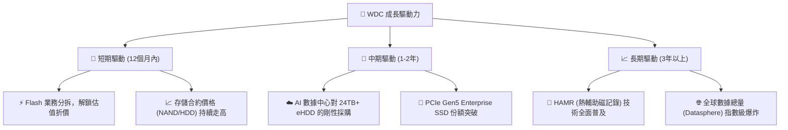

---

## 9. 風險矩陣

作為高 Beta (2.17) 的週期股，投資 WDC 必須對潛在風險有清醒的量化認識。

### 9.1 風險評分矩陣

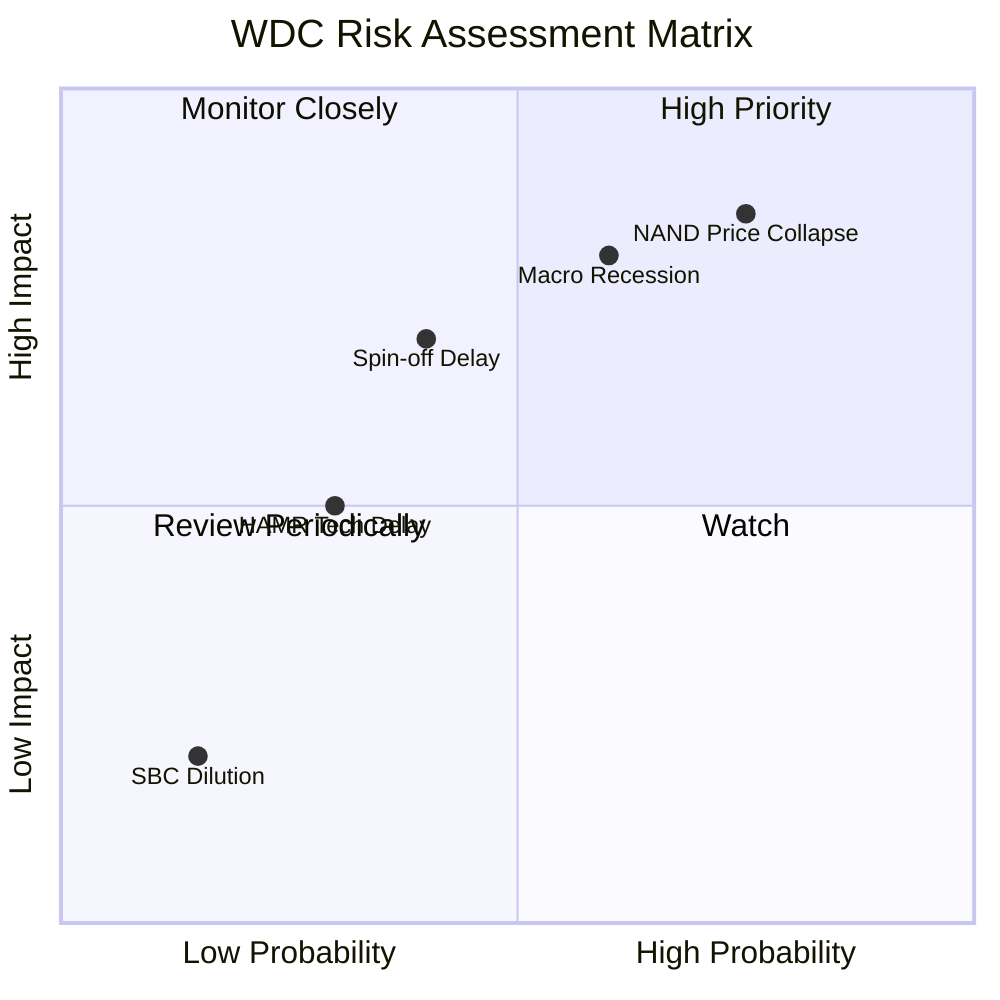

### 9.2 風險清單詳細分析

| # | 風險項目 | 發生機率 | 財務衝擊 | 風險評分 | 核心緩解措施與觀察指標 |
|---|----------|----------|----------|----------|------------------------|
| 1 | 🔴 **NAND 價格週期性崩盤** | 高 (65%) | 高 (-25% 營收) | 🔴 8.5/10 | 觀察 Samsung 與 SK Hynix 的 Capex 擴產計畫，若對手盲目擴產則需減碼。 |
| 2 | 🟡 **分拆進度延遲** | 中 (40%) | 中 (-10% 估值) | 🟡 6.0/10 | 監控 SEC 審查進度與公司每季的分拆進展披露。 |
| 3 | 🔴 **宏觀經濟衰退導致 IT 支出收縮** | 中 (50%) | 高 (-15% 營收) | 🔴 7.5/10 | 觀察微軟、亞馬遜、谷歌等 CSP 的 Capex 財測指引。 |
| 4 | 🟡 **HAMR 技術量產良率不及預期** | 低 (30%) | 中 (-8% HDD 利潤) | 🟡 5.0/10 | 觀察 WDC 的 28TB+ 硬碟出貨時程是否落後於 Seagate。 |

---

## 10. 投資建議

WDC 目前正處於「基本面強勁復甦」與「重大企業事件（分拆）」的雙重交匯點。

### 10.1 最終綜合評級雷達圖

```
╔══════════════════════════════════════════════════════════════╗
║                    WDC 投資維度綜合雷達圖                    ║
╠══════════════════════════════════════════════════════════════╣
║ 財務健康度:  🟢 8.5/10  ▓▓▓▓▓▓▓▓▓▓▓▓▓▓▓▓▓░░░  (淨現金)        ║
║ 成長前景:    🟢 9.0/10  ▓▓▓▓▓▓▓▓▓▓▓▓▓▓▓▓▓▓░░  (AI 驅動)       ║
║ 估值吸引力:  🟡 6.5/10  ▓▓▓▓▓▓▓▓▓▓▓▓░░░░░░░░  (已反映部分預期)║
║ 護城河深度:  🟢 7.5/10  ▓▓▓▓▓▓▓▓▓▓▓▓▓▓▓░░░░░  (寡頭壟斷)      ║
║ 資本配置效率:🟢 8.0/10  ▓▓▓▓▓▓▓▓▓▓▓▓▓▓▓▓░░░░  (去槓桿成功)    ║
╠══════════════════════════════════════════════════════════════╣
║ 綜合投資評級:🟢 買入 (Buy) ｜ 總分: 8.1 / 10                  ║
╚══════════════════════════════════════════════════════════════╝
```

### 10.2 目標價與隱含報酬率

| 情境 | 權機率 | 目標價 | 隱含報酬率 | 投資策略建議 |
|------|--------|--------|------------|--------------|
| 🔴 悲觀情境 | 20% | $380.00 | -20.4% | 若跌破 $380 且基本面無惡化，為極佳長線左側買點 |
| 🟡 **基準情境** | **60%** | **$615.00** | **+28.9%** | **核心持股目標，分拆完成前堅定持有** |
| 🟢 樂觀情境 | 20% | $850.00 | +78.1% | 若分拆後兩家公司均獲得市場溢價，可逐步逢高分批獲利了結 |

### 10.3 買入時機與觸發因素

```
╔══════════════════════════════════════════════════════════════════╗
║                  ✅ WDC 投資操作 Checklist                       ║
╠══════════════════════════════════════════════════════════════════╣
║                                                                  ║
║  立即買入觸發條件 (符合2項以上即可布局)：                        ║
║  ✅ 股價回檔至 $450.00 - $480.00 區間 (當前 $477.22 正處於此區間) ║
║  ✅ 每季財報顯示 Non-GAAP 營業利益率維持在 25% 以上              ║
║  ✅ 總債務持續下降，且無新增短期大額融資計畫                     ║
║                                                                  ║
║  加碼觸發條件：                                                  ║
║  ☐ 官方正式公布 Flash 業務分拆的確切除權息日期與配股比例         ║
║  ☐ 主要 CSP 大客戶 (如 AWS, Azure) 宣布上調伺服器 Capex 財測     ║
║                                                                  ║
║  減碼/停損觸發條件 (出現任一需警惕)：                             ║
║  ☐ NAND 閃存合約價格連續兩個月環比下跌 > 5%                       ║
║  ☐ 分拆計畫宣布無限期推遲或因監管因素被迫終止                    ║
║  ☐ 營業利益率連續兩季下滑，且存貨天數重新攀升至 100 天以上       ║
╚══════════════════════════════════════════════════════════════════╝
```

### 10.4 投資人適配度分析

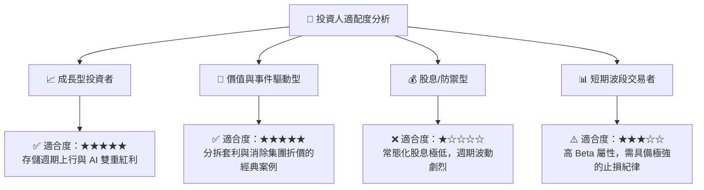

### 10.5 每季財報監控清單（Quarterly Watch List）

機構投資者應在未來的季度財報中重點追蹤以下指標，以驗證本投資論點是否依然成立：

| 監控指標 | 基準安全閾值 | 觸發加碼門檻 | 觸發減碼/報警門檻 | 監控此指標的深層業務含義 |
|----------|--------------|--------------|-------------------|--------------------------|
| **Non-GAAP 毛利率** | > 38.0% | > 45.0% | < 32.0% | 反映機械硬碟與閃存的供需關係及定價權。 |
| **存貨週轉天數 (DSI)** | < 85天 | < 70天 | > 100天 | 評估渠道庫存水平，防止產能過剩導致跌價損失。 |
| **淨現金餘額** | > $1.0B | > $2.0B | < $0.0B (轉為淨債務)| 確保分拆前夕財務結構的絕對安全。 |
| **HDD 平均出貨容量**| > 22TB | > 24TB | < 18TB | 評估 CSP 大客戶向高容量硬碟過渡的技術進展。 |

### 10.6 反面論證：什麼會證明本報告的投資論點錯誤（What Would Change My Mind）

```
╔══════════════════════════════════════════════════════════════════╗
║              ⚠️ 論點失效條件（Disconfirming Evidence）           ║
╠══════════════════════════════════════════════════════════════════╣
║  若出現下列可量化條件之一，本報告的「買入」評級將立即失效：      ║
║                                                                  ║
║  ☐ 條件一：NAND 閃存合約價出現結構性崩盤，導致 Flash 業務       ║
║            營業利益率在未來兩季內跌破 10%。                      ║
║  ☐ 條件二：WDC 宣布終止 Flash 業務分拆計畫，維持原有集團結構，    ║
║            這將導致 15%-20% 的「集團折價」永久化。               ║
║  ☐ 條件三：ROIC 跌破 WACC (即 ROIC < 14.5%)，說明公司重新進入   ║
║            「摧毀股東價值」的資本消耗階段。                      ║
║  ☐ 條件四：Seagate 在 HAMR 技術上實現完全壟斷，導致 WDC 在       ║
║            大容量 eHDD 的市場份額連續兩季下滑超過 5 個百分點。   ║
╚══════════════════════════════════════════════════════════════════╝
```

---

> **免責聲明**：本報告為基於公開財務數據之機構級基本面學術研究，僅供投資參考，不構成任何具體買賣建議。投資人應自行承擔市場波動與週期性硬體產業投資之高風險。