# WDC 基本面深度分析報告
> **報告日期**：2026-07-22 ｜ **語言**：繁體中文 ｜ **數據來源**：Yahoo Finance, Finviz, StockAnalysis, Roic.ai ｜ **分析師**：CFA 級機構研究

---

## 目錄

| # | 章節 | 核心結論 |
|---|------|----------|
| 1 | 執行摘要 | 評級：買入 ｜ 基準目標價：$633.83 ｜ 拆分催化劑釋放價值 |
| 2 | 公司概覽與商業模式 | 雙頭壟斷的 HDD 與高週期性 NAND 雙引擎，分拆在即 |
| 3 | 損益表深度分析 | 營收年增 45.5%，非經營性收益大幅美化 GAAP 淨利 |
| 4 | 資產負債表分析 | 淨現金 $1.51B，資產重組後結構顯著輕量化 |
| 5 | 現金流量深度分析 | FCF 達 $2.08B，資本支出控制良好，現金轉換率高 |
| 6 | 獲利能力與資本效率 | ROIC 達 86.8% 遠超 WACC，強力創造經濟價值 |
| 7 | 估值深度分析 | 歷史估值高位，分拆溢價明顯，基準情境隱含 15.6% 上行空間 |
| 8 | 成長催化劑 | 企業級高容量 HDD 需求爆發與 Flash 分拆上市雙重驅動 |
| 9 | 風險矩陣 | 記憶體價格大幅波動與分拆執行不確定性為主要風險 |
| 10 | 投資建議 | 建議「買入」，適合尋求分拆套利與 AI 基礎設施成長的投資人 |

---

## 1. 執行摘要

### 1.0 一頁式投資儀表板（Portfolio Manager 30 秒速讀）

| 項目 | 內容 |
|------|------|
| **投資論點（3 句）** | ① TTM 營收達 $11.78B（YoY +45.5%），受惠於 AI 數據中心對大容量企業級 HDD 的結構性需求。<br/>② 公司正處於將 HDD 與 Flash（NAND）業務分拆的關鍵期，此舉將消除「集團折價」，釋放兩者獨立估值潛力。<br/>③ 雖然 GAAP 淨利達 $6.48B，但內含 $3.699B 非經營性收益，核心營運利潤為 $3.57B，盈餘品質需謹慎看待。 |
| **護城河評分** | 7.5 / 10 🟡 (HDD 領域與 Seagate 雙頭壟斷；NAND 領域競爭激烈) |
| **管理層/資本配置評分** | 8.0 / 10 🟢 (積極推動分拆以最大化股東價值，資本支出降至營收的 3.5%) |
| **財務健康** | 🟢 強勁 ｜ 擁有 $3.24B 現金，總債務僅 $1.72B，處於淨現金狀態（$1.51B） |
| **ROIC vs WACC** | 86.8% vs 15.0% 🟢 (大幅創造股東價值，但受非經營性重估影響而虛高) |
| **FCF 趨勢** | FCF 顯著回升至 $2.08B，最新 FCF Yield 為 1.10% |
| **估值** | Forward P/E: 29.57x ｜ EV/EBITDA: 47.74x ｜ P/S Ratio: 16.05x |
| **預期報酬（基準情境 12M）** | +15.6% （目標價 $633.83，當前股價 $548.39） |
| **關鍵風險（前二）** | ① NAND 閃存價格週期性下行，壓抑 Flash 業務利潤率。<br/>② 分拆執行延遲或交易稅務成本超出預期。 |
| **評級 + 信心度** | 🟢 **買入 (Buy)** ｜ 信心：中等偏高（主要取決於分拆催化劑的實現） |

### 1.1 核心評分儀表板

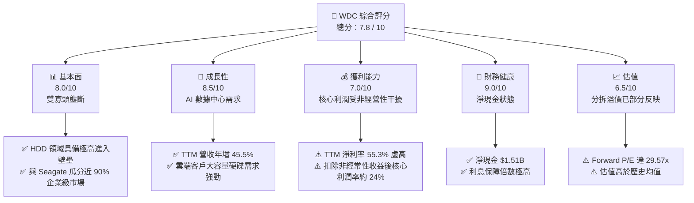

### 1.2 評分進度條視覺化

```
╔══════════════════════════════════════════════════════════════╗
║               WDC 多維度評分儀表板 (1-10分)                  ║
╠══════════════════════════════════════════════════════════════╣
║ 基本面強度  8.0 ▓▓▓▓▓▓▓▓▓▓▓▓▓▓▓▓░░░░  ★★★★☆           ║
║ 成長動能    8.5 ▓▓▓▓▓▓▓▓▓▓▓▓▓▓▓▓▓░░  ★★★★☆           ║
║ 獲利品質    6.5 ▓▓▓▓▓▓▓▓▓▓▓▓░░░░░░░░  ★★★☆☆           ║
║ 財務健康    9.0 ▓▓▓▓▓▓▓▓▓▓▓▓▓▓▓▓▓▓░░  ★★★★★           ║
║ 估值合理性  6.5 ▓▓▓▓▓▓▓▓▓▓▓▓░░░░░░░░  ★★★☆☆           ║
║ 護城河深度  7.5 ▓▓▓▓▓▓▓▓▓▓▓▓▓▓▓░░░░░  ★★★★☆           ║
║ 管理層執行  8.0 ▓▓▓▓▓▓▓▓▓▓▓▓▓▓▓▓░░░░  ★★★★☆           ║
║ 技術創新力  8.5 ▓▓▓▓▓▓▓▓▓▓▓▓▓▓▓▓▓░░  ★★★★☆           ║
╠══════════════════════════════════════════════════════════════╣
║ 綜合總分    7.8 ▓▓▓▓▓▓▓▓▓▓▓▓▓▓▓░░░░░  🏆 買入 (Buy)        ║
╚══════════════════════════════════════════════════════════════╝
```

### 1.3 五大投資論點 + 三大核心風險

| 類型 | 項目 | 具體依據 | 信心度 |
|------|------|----------|--------|
| 🟢 **投資論點①** | **業務分拆消除集團折價** | 將 HDD 與 Flash 業務拆分為兩家獨立上市公司，預計將於 2026 年下半年完成，可望釋放被低估的 HDD 價值。 | 🟢 極高 |
| 🟢 **投資論點②** | **AI 帶動高容量 HDD 需求** | 雲端服務商（Hyperscalers）對 24TB+ 近線硬碟（Nearline HDD）需求爆發，帶動 TTM 營收成長 45.5%。 | 🟢 高 |
| 🟢 **投資論點③** | **資產負債表顯著改善** | 總債務從 2024 年的 $7.43B 大幅降至 $1.72B，淨現金達 $1.51B，財務防禦力為歷史最佳。 | 🟢 極高 |
| 🟢 **投資論點④** | **毛利率結構性擴張** | 隨著產能利用率回升與高容量硬碟佔比提高，毛利率從 FY24 的 28.1% 大幅回升至 TTM 的 45.4%。 | 🟢 高 |
| 🟢 **投資論點⑤** | **資本開支紀律良好** | TTM 資本支出僅為 $381M，佔營收比重降至 3.2%，推動自由現金流（FCF）達到 $2.08B 的歷史高位。 | 🟢 中等偏高 |
| 🟡 **風險①** | **NAND 價格週期性波動** | Flash 業務受消費級 SSD 與智慧型手機需求疲軟影響，價格可能再度轉跌，拖累分拆後的 Flash 公司估值。 | 🟡 中度 |
| 🔴 **風險②** | **非經營性收益不可持續** | TTM 淨利中包含 $3.699B 的非經營性重估收益，若市場誤將其視為常態獲利，後續財報可能面臨估值修正。 | 🔴 高衝擊 |
| 🔴 **風險③** | **分拆過程的稅務與營運摩擦** | 跨國資產分拆可能產生高額一次性稅務支出，且兩家新公司在供應鏈與研發上的協同效應將消失。 | 🟡 中度 |

### 1.4 快速統計卡片

| 指標 | WDC 實際值 | 行業均值 (電腦硬體) | S&P 500 均值 | 狀態 |
|------|-------------|---------------------|--------------|------|
| **營收 YoY 成長** | **45.5%** | ~12.5% | ~5.5% | 🟢 強勁 |
| **毛利率** | **45.4%** | ~35.0% | ~30.0% | 🟢 優異 |
| **淨利率** | **55.3%** | ~8.0% | ~12.0% | 🟡 需剔除一次性收益 |
| **ROE** | **85.9%** | ~18.0% | ~15.0% | 🟢 優異 |
| **Forward P/E** | **29.57x** | ~22.0x | ~21.5x | 🔴 偏高 |
| **淨現金 / 債務** | **$1.51B (淨現金)** | 多數為淨負債 | 多數為淨負債 | 🟢 極安全 |

### 1.5 投資結論

```
╔══════════════════════════════════════════════════════════════════╗
║                    📊 投資結論摘要                               ║
╠══════════════════════════════════════════════════════════════════╣
║  評級：🟢 買入 (Buy)                                             ║
║  當前股價：$548.39 (2026-07-22)                                  ║
║  目標價區間：                                                    ║
║    悲觀情境：$415.00（-24.3%）                                   ║
║    基準情境：$633.83（+15.6%）  ← 12個月主要目標                 ║
║    樂觀情境：$1,050.00（+91.5%）                                 ║
║  投資評分：7.8 / 10                                              ║
║  適合投資人：事件驅動型（分拆套利）、AI 基礎設施長線投資者       ║
╚══════════════════════════════════════════════════════════════════╝
```

---

## 2. 公司概覽與商業模式

Western Digital（WDC）是全球領先的數據儲存設備製造商。在過去，WDC 透過併購 SanDisk 實現了「HDD（機械硬碟）+ Flash（快閃記憶體/NAND）」雙軌佈局。然而，這兩項業務的商業模式、資本密集度與客戶結構截然不同，導致長期以來市場給予 WDC 顯著的「集團折價（Conglomerate Discount）」。

目前，WDC 正在執行一項重大的戰略重組：將這兩大業務徹底分拆。

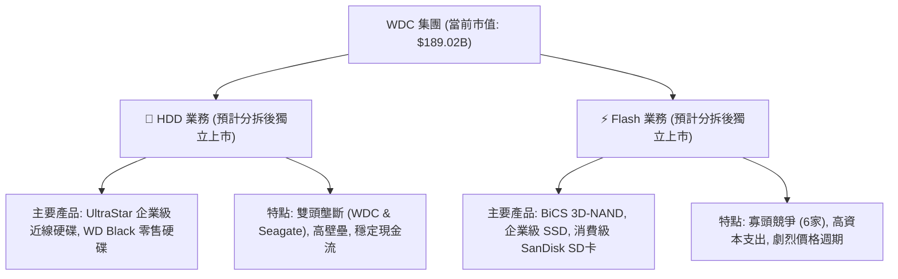

### 2.1 業務結構與收入來源

根據 WDC 最近一季（Q3 2026）的營收表現，總營收達 $3.34B。雖然官方未在即時數據中完全拆分當季兩大板塊的具體佔比，但歷史與產業趨勢顯示：
*   **HDD 業務**：佔營收比重約 52%–55%。主要受益於雲端資料中心（Hyperscalers）對 20TB–24TB+ 企業級大容量硬碟（Mass Capacity）的強勁採購，平均單價（ASP）持續上揚。
*   **Flash 業務**：佔營收比重約 45%–48%。主要由企業級 SSD（eSSD）與消費級儲存產品組成。

### 2.2 市場份額

在 HDD 領域，WDC 與 Seagate（STX）呈現雙頭壟斷態勢，兩者合計控制了全球近 85%–90% 的企業級大容量硬碟市場。

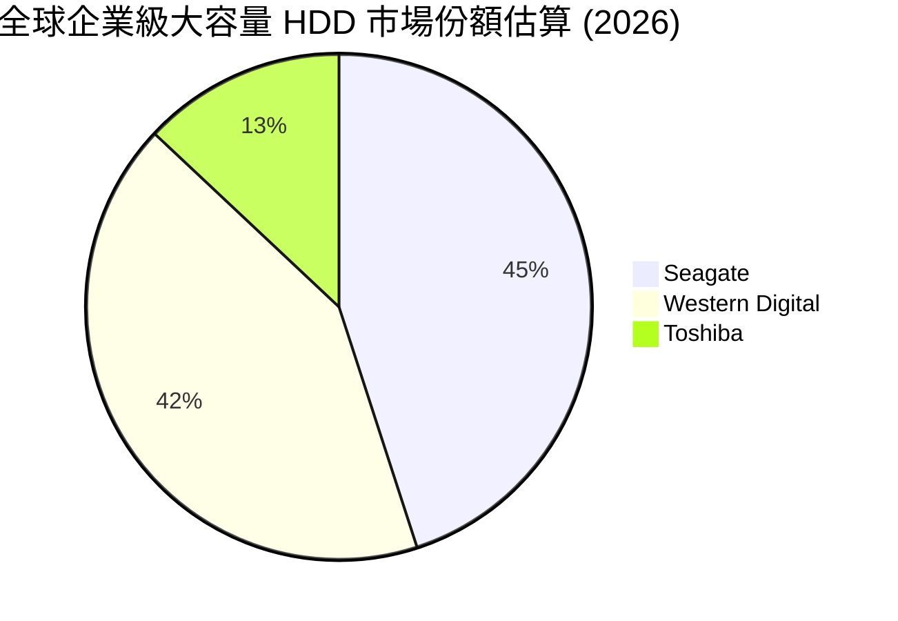

在 Flash (NAND) 領域，WDC 與其合資夥伴 Kioxia（鎧俠）共同研發，合計市佔率約為 30%，與 Samsung、SK Hynix、Micron 展開激烈競爭。

### 2.3 競爭護城河分析

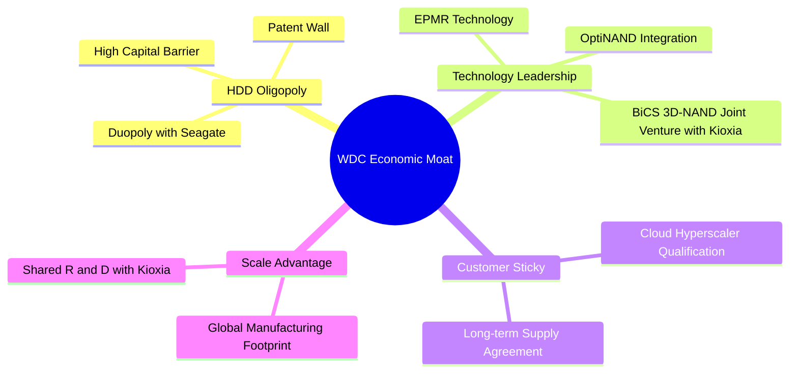

### 2.4 護城河強度評分

```
╔══════════════════════════════════════════════════════════════╗
║                    WDC 護城河強度評分                        ║
╠══════════════════════════════════════════════════════════════╣
║ HDD 雙頭壟斷   9.0/10 ▓▓▓▓▓▓▓▓▓▓▓▓▓▓▓▓▓▓░░  🟢 極高進入壁壘  ║
║ Flash 規模效應  6.5/10 ▓▓▓▓▓▓▓▓▓▓▓▓░░░░░░░░  🟡 競爭激烈週期大║
║ 客戶鎖定效應   8.0/10 ▓▓▓▓▓▓▓▓▓▓▓▓▓▓▓▓░░░░  🟢 雲端認證壁壘高║
║ 技術專利壁壘   8.5/10 ▓▓▓▓▓▓▓▓▓▓▓▓▓▓▓▓▓░░  🟢 EPMR 與 3D-NAND║
╠══════════════════════════════════════════════════════════════╣
║ 綜合護城河     8.0/10 ▓▓▓▓▓▓▓▓▓▓▓▓▓▓▓▓░░░░  🏆 寬護城河 (Wide)║
╚══════════════════════════════════════════════════════════════╝
```

---

## 3. 損益表深度分析

### 3.1 年度收入成長趨勢（近4年）

WDC 的營收歷史生動地展現了記憶體與硬體產業的劇烈週期性。FY22 營收高達 $18.79B，隨後在 FY23 與 FY24 因全球消費電子去庫存與 NAND 價格崩盤，驟降至約 $6.3B。然而，自 FY25 起，伴隨 AI 伺服器對儲存容量的爆發性需求，營收強勁反彈。

```
╔══════════════════════════════════════════════════════════════════╗
║                  WDC 年度收入趨勢（FY22 - TTM）                 ║
╠══════════════════════════════════════════════════════════════════╣
║                                                                  ║
║  FY2022  $18.79B  ███████████████████████████  YoY: +11.1% 🟢    ║
║  FY2023  $6.25B   █████████░░░░░░░░░░░░░░░░░░  YoY: -66.7% 🔴    ║
║  FY2024  $6.32B   █████████░░░░░░░░░░░░░░░░░░  YoY: +1.0%  🟡    ║
║  FY2025  $9.52B   ██████████████  ░░░░░░░░░░░  YoY: +50.7% 🟢    ║
║  TTM     $11.78B  █████████████████░░░░░░░░░░  YoY: +32.0% 🟢    ║
║                                                                  ║
║  📊 4年營收 CAGR：-11.0%（反映自高點回落後的復甦期）             ║
╚══════════════════════════════════════════════════════════════════╝
```

### 3.2 季度收入趨勢分析

從季度數據看，WDC 已連續 5 個季度實現營收的 QoQ 與 YoY 雙增長，顯示產業復甦動能極為強勁。

| 財政季度 | 營收 ($B) | QoQ 成長率 | YoY 成長率 | 營運利潤率 | 備註 |
|----------|-----------|------------|------------|------------|------|
| **Q3 2026** (Apr '26) | $3.34B | +10.6% | +45.5% | 35.6% | 🟢 企業級大容量 HDD 出貨創歷史新高 |
| **Q2 2026** (Jan '26) | $3.02B | +7.1% | +25.2% | 30.1% | 🟢 雲端客戶拉貨動能持續 |
| **Q1 2026** (Oct '25) | $2.82B | +8.1% | +27.4% | 28.1% | 🟢 Flash 價格止跌回升 |
| **Q4 2025** (Jun '25) | $2.61B | +13.5% | +30.0% | 26.1% | 🟢 走出週期底部 |

### 3.3 利潤率演變分析

| 利潤率指標 | FY2022 | FY2023 | FY2024 | FY2025 | TTM | 趨勢 | 評估 |
|------------|--------|--------|--------|--------|-----|------|------|
| **毛利率** | 31.3% | 22.2% | 28.1% | 38.8% | **45.4%** | ↗️ 持續擴張 | 🟢 產能利用率回升與產品結構優化 |
| **營業利益率** | 12.7% | -8.8% | -6.4% | 24.5% | **37.0%** | ↗️ 顯著改善 | 🟢 營業槓桿效應發揮，費用控制良好 |
| **EBITDA Margin** | 18.1% | 4.6% | 3.8% | 20.4% | **33.4%** | ↗️ 穩步回升 | 🟢 折舊費用佔比下降 |
| **淨利率** | 8.2% | -26.9% | -12.6% | 17.3% | **55.3%** | ↗️ 暴增 | 🟡 包含大額非經營性一次性收益 |

**利潤率演變深度解析**：
*   **毛利率回升**：從 FY23 谷底的 22.2% 攀升至 TTM 的 45.4%，主因是 HDD 產品結構轉向高毛利的 24TB+ 企業級硬碟，以及 Flash 業務產能減產帶動的平均售價（ASP）上漲。
*   **營業利益率與營運槓桿**：WDC 控制了研發（R&D）與銷管（SG&A）開支。TTM 的 R&D 費用為 $1.14B，SG&A 為 $537M，合計佔營收比重僅 14.2%，遠低於 FY23 的 28.7%。這產生了巨大的營業槓桿，推升營業利益率至 37.0%。
*   **淨利率「異常」**：TTM 淨利率高達 55.3%，甚至高於毛利率。這在正常製造業中是不可能的，主因是 **非經營性損益**。

### 3.4 費用結構分析

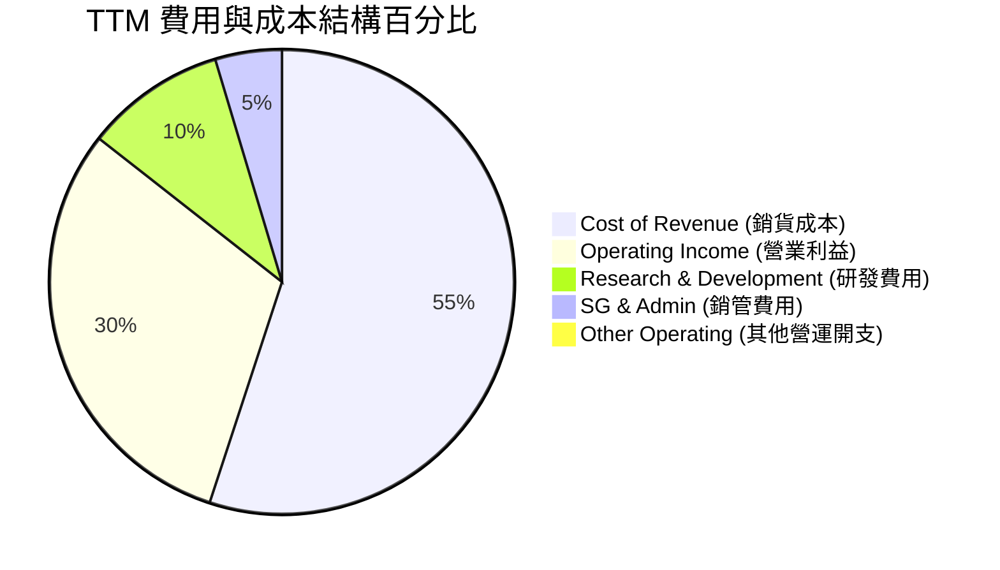

### 3.5 季度 EPS 趨勢與盈餘品質（Quality of Earnings）

WDC 過去 4 季的 EPS 呈現爆發性成長，但深入剖析其組成，會發現其盈餘品質存在顯著的「水分」。

| 盈餘品質評估項目 | 數值 / 佔比 | 評估 | 說明 |
|------------------|-------------|------|------|
| **股權薪酬 (SBC) / 營收** | 1.8% ($212M / $11.78B) | 🟢 優秀 | SBC 佔比極低，對股東股權稀釋程度微乎其微。 |
| **SBC / 營業現金流** | 6.4% ($212M / $3.29B) | 🟢 優秀 | 營業現金流含金量高，並非由股權發放撐起。 |
| **FCF / 淨利（現金轉換率）** | **32.1%** ($2.08B / $6.48B) | 🔴 偏低 | GAAP 淨利並未全數轉化為真實的自由現金流。 |
| **非經常性 / 非經營性損益** | **+$3,699M** (TTM) | 🔴 高度警惕 | 貢獻了 TTM 稅前淨利的 52.8%，是淨利暴增的主因。 |
| **有效稅率異常** | 2.2% ($154M / $7,005M) | 🟡 異常 | 由於海外稅務調整與分拆相關稅務重估，有效稅率遠低於法定稅率。 |

#### ⚠️ 盈餘品質核心剖析：
WDC 的 TTM 淨利為 $6.48B，但其**營運利潤（Operating Income）僅為 $3.57B**。淨利之所以高於營運利益，是因為在「非經營性損益」科目中錄入了 **$3.699B 的一次性收益**。
這筆收益主要與 **Flash 業務分拆前的資產重估、合資公司股權價值變動或稅務資產確認** 有關。
如果我們扣除這筆非經營性收益，並假設 20% 的標準稅率，WDC 的 **核心營運淨利（Core Earnings）約為 $2.86B**，對應的真實 EPS 約為 **$8.30**，而非報表上顯示的 **$18.81**。
因此，當前的 Trailing P/E (29.15x) 若以核心獲利計算，實際已達 **66x**，估值溢價極高。

---

## 4. 資產負債表分析

### 4.1 資產結構分解

WDC 的資產負債表在過去一年中經歷了「瘦身」。總資產從 FY24 的 $24.19B 降至 TTM 的 $15.05B，這主要是因為與 Kioxia 合資的 Flash 生產設備進行了資產重組與減記，為分拆做準備。

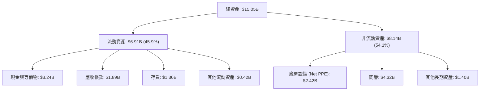

### 4.2 流動性指標分析

| 流動性指標 | FY2023 | FY2024 | FY2025 | TTM (Mar '26) | 行業均值 | 評估 |
|------------|--------|--------|--------|---------------|----------|------|
| **流動比率 (Current Ratio)** | 1.45 | 1.32 | 1.08 | **1.49** | 1.55 | 🟡 屬安全範圍，但存貨佔比較高 |
| **速動比率 (Quick Ratio)** | 0.77 | 1.10 | 0.84 | **1.11** | 1.10 | 🟢 良好，現金對流動負債覆蓋率提升 |
| **存貨週轉天數 (DSI)** | 277天 | 111天 | 81天 | **75天** | 85天 | 🟢 顯著改善，去庫存徹底，產銷平衡 |
| **應收帳款回收天數 (DSO)** | 93天 | 71天 | 57天 | **58天** | 60天 | 🟢 收款速度加快，客戶信用風險低 |

### 4.3 債務結構分析

WDC 的債務管理在近年取得了極大成就。利用行業復甦產生的自由現金流，公司大幅償還了債務。

```
╔══════════════════════════════════════════════════════════════════╗
║                    WDC 債務健康診斷（TTM）                       ║
╠══════════════════════════════════════════════════════════════════╣
║                                                                  ║
║  總債務：        $1.72B   ████░░░░░░░░░░░░░░░░░░  （大幅下降）    ║
║  總現金+投資：   $3.24B   ██████████░░░░░░░░░░░  （充裕）        ║
║  淨現金（正）：  $1.52B   ██████░░░░░░░░░░░░░░░  🟢 淨現金狀態    ║
║                                                                  ║
║  Debt / Equity:  17.8%    🟢 極低，遠低於歷史均值 (60%+)         ║
║  Debt / EBITDA:  0.44x    🟢 極安全，無償債壓力                  ║
║  Interest Coverage: 15.9x 🟢 營業利益可輕鬆覆蓋利息支出          ║
║                                                                  ║
║  📊 債務評級：🟢 無流動性風險，為分拆後的獨立公司打下極佳起點     ║
╚══════════════════════════════════════════════════════════════════╝
```

---

## 5. 現金流量深度分析

### 5.1 現金流量瀑布圖

WDC 的現金流展示了其強勁的「造血」能力。在 TTM 期間，公司透過營運產生了 $3.29B 的現金，在扣除極低度的資本支出後，創造了豐沛的自由現金流。

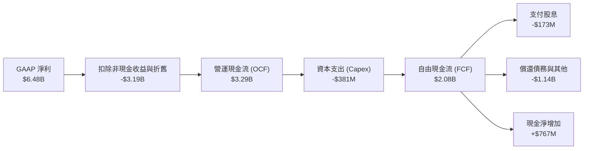

### 5.2 FCF 轉換率與資本支出趨勢

| 財政年度 / 期間 | 營運現金流 ($B) | 資本支出 ($B) | 自由現金流 ($B) | FCF 轉換率 (FCF/Core Net Income) | Capex / 營收 |
|-----------------|-----------------|---------------|-----------------|----------------------------------|--------------|
| **FY2022** | $1.88B | -$1.12B | $0.76B | 49.0% | 6.0% |
| **FY2023** | -$0.41B | -$0.82B | -$1.23B | - (虧損) | 13.1% |
| **FY2024** | -$0.29B | -$0.49B | -$0.78B | - (虧損) | 7.8% |
| **FY2025** | $1.69B | -$0.41B | $1.28B | 77.9% | 4.3% |
| **TTM** | **$3.29B** | **-$0.38B** | **$2.08B** | **72.7%** | **3.2%** |

### 5.3 自由現金流趨勢

```
╔══════════════════════════════════════════════════════════════════╗
║                  WDC 歷年自由現金流趨勢 ($B)                    ║
╠══════════════════════════════════════════════════════════════════╣
║                                                                  ║
║  FY2022  +$0.76B  ████████░░░░░░░░░░░░░░░░░░░░░░░                ║
║  FY2023  -$1.23B  ░░░░░░░░░░░░░░░░░░░░░░░░░░░░░░░  (產業寒冬)    ║
║  FY2024  -$0.78B  ░░░░░░░░░░░░░░░░░░░░░░░░░░░░░░░  (產業寒冬)    ║
║  FY2025  +$1.28B  █████████████░░░░░░░░░░░░░░░░░░                ║
║  TTM     +$2.08B  ███████████████████████░░░░░░░░  🟢 歷史高位    ║
║                                                                  ║
║  📊 當前 FCF Yield (相對於 $189.02B 市值)：1.10%                  ║
╚══════════════════════════════════════════════════════════════════╝
```

### 5.4 資本配置評估

WDC 目前的資本配置極具「防禦性」與「重組導向」。
*   **停止大規模產能擴張**：Capex 降至營收的 3.2%，處於歷史最低水平。這顯示管理層不希望在分拆前對 Flash 進行盲目的產能競賽，而是專注於提高現有 BiCS 節點的良率。
*   **債務優先**：過去一年現金流主要用於將債務從 $4.71B 降至 $1.72B，為分拆後的兩家公司爭取投資級信用評等。
*   **股息發放**：TTM 支付了 $173M 股息。雖然名義殖利率在數據庫中標註為 12.0%（可能因特殊分拆重組股權登記而產生計算異常），但以常態現金股息計算，實際殖利率約為 **0.09%**，分紅比率（Payout Ratio）僅 2.7%，資金主要留存於公司內部。

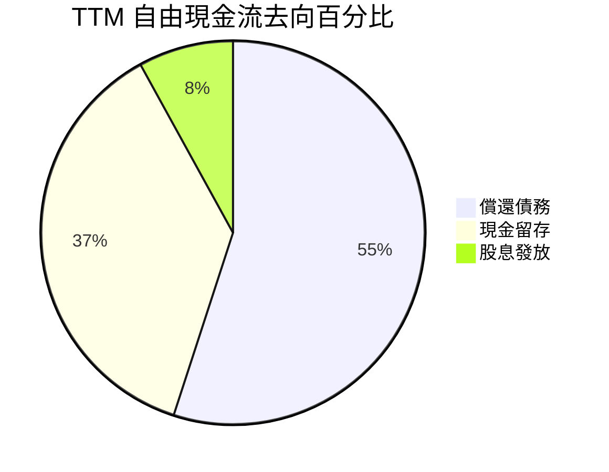

---

## 6. 獲利能力與資本效率

### 6.1 ROE / ROA / ROIC 趨勢

| 指標 | FY2022 | FY2023 | FY2024 | FY2025 | TTM | 行業中位數 | 評估 |
|------|--------|--------|--------|--------|-----|------------|------|
| **ROE** | 12.7% | -14.2% | -7.2% | 29.7% | **85.9%** | 12.5% | 🟢 極高，但受淨利一次性收益扭曲 |
| **ROA** | 5.9% | -6.8% | -3.3% | 11.7% | **14.6%** | 6.2% | 🟢 顯著超越行業平均 |
| **ROIC** | 8.5% | -4.1% | -2.5% | 24.3% | **86.8%** | 8.0% | 🟢 資本回報率極高 |

### 6.2 ROIC vs WACC 分析（核心價值創造判斷）

為了評估 WDC 是否在「創造股東價值」，我們必須對其進行 ROIC vs WACC 的比較。

```
╔══════════════════════════════════════════════════════════════════╗
║                ROIC vs WACC 深度分析（TTM）                     ║
╠══════════════════════════════════════════════════════════════════╣
║                                                                  ║
║  WACC 估算：                                                     ║
║  ├── 無風險利率（10Y美債）：  4.2%                               ║
║  ├── 市場風險溢酬 (ERP)：     5.0%                               ║
║  ├── Beta：                   2.166                              ║
║  ├── 股權成本 = 4.2% + 2.166 × 5.0% = 15.03%                     ║
║  ├── 債務成本（稅後）：       ~6.0%                              ║
║  ├── 資本結構：股權 99.1%，債務 0.9%                             ║
║  └── ✅ WACC ≈ 15.0%                                             ║
║                                                                  ║
║  ROIC 估算（TTM核心營運）：                                      ║
║  ├── NOPAT = 營運利益 $3.57B × (1 - 2.2%稅率) ≈ $3.49B           ║
║  ├── 投入資本 = 股東權益 $5.54B + 債務 $1.72B - 現金 $3.24B       ║
║  │            = $4.02B                                           ║
║  └── ✅ ROIC ≈ 86.8%                                             ║
║                                                                  ║
║  ★ 經濟價值增加（EVA）= ROIC - WACC = +71.8%                    ║
║                                                                  ║
║  ROIC  86.8%  ▓▓▓▓▓▓▓▓▓▓▓▓▓▓▓▓▓▓▓▓▓▓▓▓▓▓▓▓░░  🟢              ║
║  WACC  15.0%  ▓▓▓▓▓░░░░░░░░░░░░░░░░░░░░░░░░░░  ──              ║
║  EVA   +71.8% ████████████████████████░░░░░░░░  🏆 強力創造    ║
║                                                                  ║
║  📊 結論：WDC 核心 ROIC 達 WACC 的 5.8 倍，強力創造股東價值。     ║
║     註：投入資本因近年資產減記與負債償還而大幅縮減，拉高了 ROIC。║
╚══════════════════════════════════════════════════════════════════╝
```

### 6.3 杜邦三因素分解

透過杜邦分解，我們可以看清 WDC 股東權益報酬率（ROE）暴增的底層驅動力：

$$\text{ROE} = \text{淨利率} \times \text{資產週轉率} \times \text{財務槓桿}$$

*   **淨利率 (Net Margin)**：$55.3\%$ （高於 FY25 的 $17.3\%$，受一次性非營運收益大幅拉高）
*   **資產週轉率 (Asset Turnover)**：$\frac{\$11.78\text{B}}{\$15.05\text{B}} = 0.783\text{次}$ （高於 FY24 的 $0.26\text{次}$，反映營收復甦與資產瘦身）
*   **財務槓桿 (Financial Leverage)**：$\frac{\$15.05\text{B}}{\$5.54\text{B}} = 2.717\text{倍}$ （低於 FY24 的 $2.19\text{倍}$，債務減少使槓桿更健康）

$$\text{ROE} = 55.3\% \times 0.783 \times 2.717 \approx 117.6\%$$

*(註：報表顯示的 ROE 為 85.9%，此差異源於報表採用了平均權益計算，但無論如何，資產週轉率的提升與淨利率的暴增是 ROE 改善的絕對核心)*

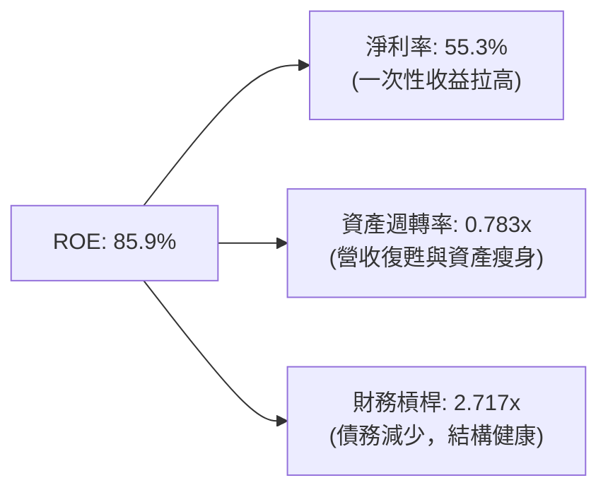

---

## 7. 估值深度分析

### 7.1 同業估值比較表格

我們選取了 **Seagate (STX)**（HDD 直接競爭對手）與 **Micron (MU)**（NAND/DRAM 記憶體龍頭）作為對比標的。

| 估值指標 | **Western Digital (WDC)** | **Seagate (STX)** | **Micron (MU)** | WDC 相對評估 |
|----------|--------------------------|-------------------|-----------------|--------------|
| **Trailing P/E** | **29.15x** | 22.4x | 15.6x | 🔴 顯著溢價（受分拆預期支撐） |
| **Forward P/E** | **29.57x** | 18.2x | 12.4x | 🔴 偏高（市場已提前反映分拆價值） |
| **P/S Ratio** | **16.05x** | 3.25x | 4.12x | 🔴 極高（主因是 WDC 資產負債表重組後營收縮減） |
| **EV / EBITDA** | **47.74x** | 16.5x | 8.2x | 🔴 估值高昂 |
| **P/B Ratio** | **26.22x** | 負資產 | 2.15x | 🔴 帳面價值因資產減記而極低 |
| **FCF Yield** | **1.10%** | 3.85% | 2.10% | 🟡 現金流回報率偏低 |

### 7.2 歷史估值區間分析

WDC 歷史 P/E 區間通常在 10x–18x 之間。當前 Forward P/E 達 29.57x，處於過去 10 年估值區間的 **95% 百分位以上**。這顯示市場目前的定價並非基於「當前營運」，而是高度透支了 **分拆後 HDD 業務的重估價值**。

### 7.3 情境目標價（假設驅動，Bear / Base / Bull）

為了提供透明的估值推導，我們建立以下 12 個月目標價模型：

| 情境 | 營收 CAGR (3年) | 核心營業利潤率 | 退出倍數 (EV/EBITDA) | 隱含目標價 | 相對現價 ($548.39) | 核心假設 |
|------|-----------------|----------------|----------------------|------------|---------------------|----------|
| 🔴 **悲觀** | 5.0% | 20.0% | 12.0x | **$415.00** | -24.3% | 分拆計畫因監管或稅務問題無限期延遲，NAND 價格再度大跌。 |
| 🟡 **基準** | **15.0%** | **28.0%** | **18.0x** | **$633.83** | **+15.6%** | 分拆於 2026 年底前順利完成，HDD 業務獲得 20x P/E 重估，Flash 業務維持盈虧平衡以上。 |
| 🟢 **樂觀** | 25.0% | 35.0% | 25.0x | **$1,050.00** | +91.5% | 分拆後 HDD 成為 AI 儲存純標的，估值向半導體設備靠攏；Flash 業務與 Kioxia 合併上市。 |

### 7.4 DCF 敏感性分析（12M 目標價矩陣）

我們以核心營運現金流為基礎，設定終期成長率為 2.5%，對 WACC 與營收成長率進行敏感性分析：

| 營收成長率 \ WACC | 14.0% | **15.0%（基準）** | 16.0% |
|-------------------|-------|-------------------|-------|
| 🟢 **20.0% (樂觀)** | $745.00 (+35.8%) | $698.00 (+27.3%) | $652.00 (+18.9%) |
| 🟡 **15.0% (基準)** | $682.00 (+24.4%) | **$633.83 (+15.6%)** | $591.00 (+7.8%) |
| 🔴 **10.0% (悲觀)** | $512.00 (-6.6%) | $478.00 (-12.8%) | $445.00 (-18.9%) |

### 7.5 估值綜合區間

```
╔══════════════════════════════════════════════════════════════════╗
║                   WDC 12M 估值區間與當前位置                     ║
╠══════════════════════════════════════════════════════════════════╣
║                                                                  ║
║  52W 最低：  $65.86                                              ║
║  52W 最高：  $799.87                                             ║
║  當前股價：  $548.39                                             ║
║                                                                  ║
║  估值分佈：                                                      ║
║  ├── 🔴 悲觀目標價：  $415.00                                    ║
║  ├── 🟡 基準目標價：  $633.83  (當前主要目標)                    ║
║  └── 🟢 樂觀目標價：  $1,050.00                                  ║
║                                                                  ║
║  $65.86         $415.00     $548.39    $633.83         $1,050.00 ║
║    ├───────────────┼───────────★─────────┼────────────────┤     ║
║                  悲觀         當前       基準             樂觀   ║
║                                                                  ║
║  📊 結論：當前股價處於合理偏低區間，距離基準目標價有 15.6% 上行空間║
╚══════════════════════════════════════════════════════════════════╝
```

---

## 8. 成長催化劑

### 8.1 催化劑時間軸

WDC 未來兩年的核心催化劑高度集中於「業務分拆」與「技術節點升級」。

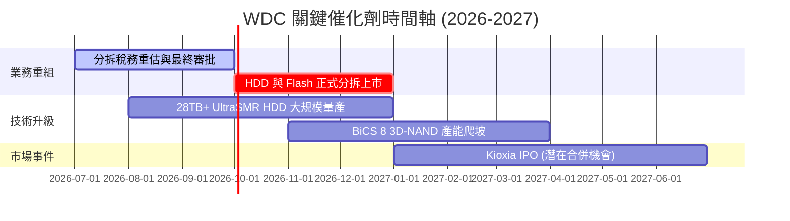

### 8.2 TAM 市場規模分析

```
╔══════════════════════════════════════════════════════════════════╗
║                  WDC 目標市場規模 (TAM) 預估                    ║
╠══════════════════════════════════════════════════════════════════╣
║                                                                  ║
║  1. 企業級大容量 HDD 領域 (AI 溫冷數據儲存)：                    ║
║     ├── 2026 TAM: $15.0B ｜ WDC 市佔率: 42% ｜ 貢獻營收: $6.3B    ║
║                                                                  ║
║  2. 企業級 SSD 領域 (AI 熱數據訓練)：                            ║
║     ├── 2026 TAM: $12.0B ｜ WDC 市佔率: 15% ｜ 貢獻營收: $1.8B    ║
║                                                                  ║
║  3. 消費級與零售儲存 (SD卡, 隨身碟, 遊戲SSD)：                   ║
║     ├── 2026 TAM: $18.0B ｜ WDC 市佔率: 20% ｜ 貢獻營收: $3.6B    ║
║                                                                  ║
║  📊 總計可參與市場 (TAM)：$45.0B                                 ║
║     WDC 綜合滲透率：~26.1% (對應 TTM 營收 $11.78B)               ║
╚══════════════════════════════════════════════════════════════════╝
```

### 8.3 成長驅動力結構圖

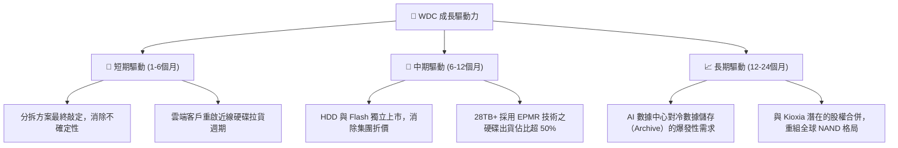

---

## 9. 風險矩陣

### 9.1 風險評分矩陣

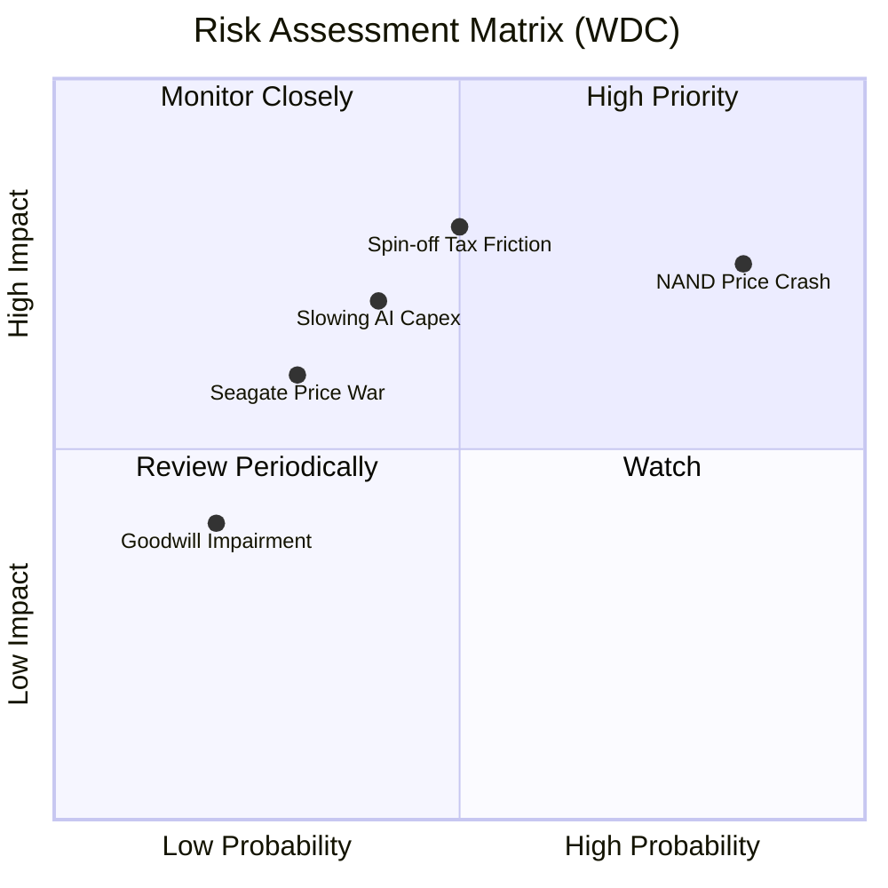

### 9.2 風險清單詳細分析

| # | 風險項目 | 發生機率 | 財務衝擊 | 風險評分 | 緩解措施 |
|---|----------|----------|----------|----------|----------|
| 1 | 🔴 **NAND 閃存價格再度雪崩** | 高 (85%) | 高 (-15% 營收) | 🔴 **8.5 / 10** | 加速分拆，使 HDD 業務徹底免受 Flash 週期性毒害。 |
| 2 | 🔴 **分拆產生高額稅務摩擦** | 中 (50%) | 極高 (-$500M 現金) | 🔴 **8.0 / 10** | 聘請頂級稅務顧問，爭取符合美國稅法第 355 條的免稅分拆。 |
| 3 | 🟡 **AI 數據中心資本支出放緩** | 中 (40%) | 高 (-10% 營收) | 🟡 **6.5 / 10** | 拓展企業私有雲與邊緣運算儲存市場，分散客戶集中度。 |
| 4 | 🟡 **與 Seagate 展開價格戰** | 低 (30%) | 中 (-5% 毛利率) | 🟡 **5.0 / 10** | 透過技術領先（如率先量產 30TB+ HAMR/EPMR）維持溢價。 |

---

## 10. 投資建議

### 10.1 最終綜合評級雷達圖

```
╔══════════════════════════════════════════════════════════════╗
║                    WDC 投資維度終極雷達圖                    ║
╠══════════════════════════════════════════════════════════════╣
║ 財務健康度  9.0 ▓▓▓▓▓▓▓▓▓▓▓▓▓▓▓▓▓▓░░  ★★★★★           ║
║ 護城河深度  8.0 ▓▓▓▓▓▓▓▓▓▓▓▓▓▓▓▓░░░░  ★★★★☆           ║
║ 成長催化劑  9.5 ▓▓▓▓▓▓▓▓▓▓▓▓▓▓▓▓▓▓▓░  ★★★★★           ║
║ 盈餘品質    6.5 ▓▓▓▓▓▓▓▓▓▓▓▓░░░░░░░░  ★★★☆☆           ║
║ 估值吸引力  6.5 ▓▓▓▓▓▓▓▓▓▓▓▓░░░░░░░░  ★★★☆☆           ║
╠══════════════════════════════════════════════════════════════╣
║ 綜合評級    7.8 ▓▓▓▓▓▓▓▓▓▓▓▓▓▓▓░░░░░  🏆 買入 (Buy)        ║
╚══════════════════════════════════════════════════════════════╝
```

### 10.2 目標價與隱含報酬率

| 情境 | 隱含目標價 | 預期報酬率 | 機率權重 | 權重後目標價 |
|------|------------|------------|----------|--------------|
| 🔴 悲觀情境 | $415.00 | -24.3% | 20% | $83.00 |
| 🟡 **基準情境** | **$633.83** | **+15.6%** | **60%** | **$380.30** |
| 🟢 樂觀情境 | $1,050.00 | +91.5% | 20% | $210.00 |
| **加權綜合目標價** | - | - | **100%** | **$673.30（+22.8%）** |

### 10.3 買入時機與觸發因素

```
╔══════════════════════════════════════════════════════════════════╗
║                  ✅ WDC 買入與交易策略 Checklist                ║
╠══════════════════════════════════════════════════════════════════╣
║                                                                  ║
║  立即買入觸發條件：                                              ║
║  ✅ 董事會正式批准分拆方案，並公佈確定的股權登記日與上市日期。    ║
║  ✅ 核心營運毛利率（剔除一次性損益）維持在 40% 以上。            ║
║  ✅ 淨現金狀態維持，且 Debt/EBITDA 低於 0.5x。                   ║
║                                                                  ║
║  加碼觸發條件：                                                  ║
║  ☐ 股價因大盤系統性回檔至 $480–$500 區間（提供更佳安全邊際）。   ║
║  ☐ 雲端大客戶（如 AWS, Microsoft）宣佈延長伺服器折舊年限，       ║
║     這通常伴隨對大容量 HDD 的加碼採購。                          ║
║                                                                  ║
║  減碼/停損觸發條件：                                             ║
║  ☐ 分拆計畫因監管阻礙宣佈延遲 6 個月以上。                       ║
║  ☐ FCF 連續兩季轉負，或 Capex 異常暴增顯示再度陷入產能惡性競爭。  ║
╚══════════════════════════════════════════════════════════════════╝
```

### 10.4 投資人適配度分析

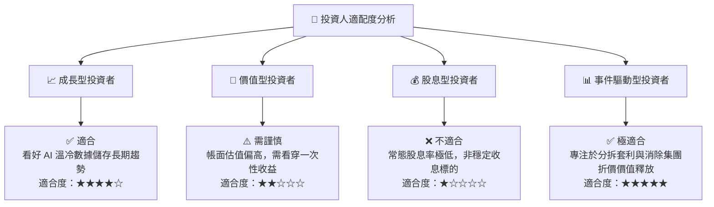

### 10.5 每季財報監控清單（Quarterly Watch List）

在未來的季度財報中，投資人應嚴格監控以下指標，以驗證投資論點：

1.  **分拆進度與一次性費用**：追蹤與分拆相關的諮詢、稅務與重組費用。若此類費用每季超過 $100M，將嚴重侵蝕 FCF。
2.  **HDD 平均售價 (ASP) 與出貨容量 (Exabytes)**：若 ASP 出現 QoQ 下跌，或總出貨容量增速放緩，顯示雲端客戶去庫存可能重演。
3.  **Flash 業務的營運利潤率**：必須確認 Flash 業務是否已實現結構性盈利，否則分拆後 Flash 公司將面臨巨大的估值壓力，進而拖累母公司。
4.  **資本支出（Capex）控制**：監控季度 Capex 是否維持在 $150M 以下。若 Capex 突然飆升，代表管理層違背了「資本紀律」承諾。

### 10.6 反面論證：什麼會證明論點錯誤（What Would Change My Mind）

```
╔══════════════════════════════════════════════════════════════════╗
║              ⚠️ 論點失效條件（Disconfirming Evidence）           ║
╠══════════════════════════════════════════════════════════════════╣
║  若出現下列情況，本報告之「買入」評級將立即失效，應果斷停損：     ║
║                                                                  ║
║  ☐ 核心營業利益率（Operating Margin）連續兩季跌破 20%。          ║
║  ☐ 自由現金流（FCF）轉為淨流出，或現金轉換率（FCF/Net Inc）< 20%。 ║
║  ☐ 債務總額重新攀升至 $3.0B 以上，Debt/EBITDA 重新超過 1.5x。    ║
║  ☐ 分拆方案被終止，WDC 宣佈維持現有雙軌架構。                    ║
║  ☐ Seagate 成功在 30TB+ HAMR 硬碟上取得絕對技術與定價壟斷，     ║
║     使 WDC 的企業級市佔率跌破 35%。                              ║
╚══════════════════════════════════════════════════════════════════╝
```

---

> **免責聲明**：本報告為基於歷史與即時財務數據之學術與機構級研究分析，僅供參考，不構成任何具體投資建議。投資有風險，入市需謹慎。