# WDC 基本面深度分析報告
> **報告日期**：2026-07-27 ｜ **語言**：繁體中文 ｜ **數據來源**：Yahoo Finance, Finviz, StockAnalysis, Roic.ai ｜ **分析師**：CFA 級機構研究

---

## 目錄

| # | 章節 | 核心結論 |
|---|------|----------|
| 1 | 執行摘要 | 給予「🟢 買入」評級；基準目標價 $633.83（隱含 +13.5% 上行空間），樂觀情境看至 $820.00 |
| 2 | 公司概覽與商業模式 | 雙軌驅動（Enterprise HDD + Flash/NAND），大容量近線硬碟具備技術護城河 |
| 3 | 損益表深度分析 | TTM 營收達 $11.78B（YoY +45.5%），營業利潤率攀升至 37.0%，超級週期推升獲利爆發 |
| 4 | 資產負債表分析 | 淨現金 $1.51B，總債務降至 $1.72B，財務結構大幅優化，償債風險極低 |
| 5 | 現金流量深度分析 | TTM 自由現金流（FCF）達 $2.08B，FCF Yield 1.16%，資本支出掌控得宜 |
| 6 | 獲利能力與資本效率 | ROIC 達 75.4%，顯著高於 WACC（12.85%），EVA 達 +62.55pp，強力創造價值 |
| 7 | 估值深度分析 | Forward P/E 28.03x，PEG 0.46；考量重資本週期性，EV/EBITDA 與 FCF Yield 顯示估值合理 |
| 8 | 成長催化劑 | 超級計算與 AI Data Center 對高容量 ePMR/UltraSMR HDD 需求爆發，帶動單碟容量升級 |
| 9 | 風險矩陣 | 記憶體與儲存行業強週期性波動、NAND 價格回落風險、雲端 CSP 資本支出放緩 |
| 10 | 投資建議 | 分批建倉策略，下檔支撐 $450-$480，追蹤每季大容量 HDD 出貨比重與營運槓桿表現 |

---

## 1. 執行摘要

根據最新財務數據，Western Digital Corporation（NASDAQ: WDC）截至 2026 年 4 月（Q3 FY26 TTM）展現出極強的營運轉機與盈利爆發力。TTM 營收達 $11.78B（YoY +45.5%），營業利益達 $3.57B，營業利潤率高達 37.0%。受惠於 AI Data Center 對大容量近線（Nearline）HDD 需求的爆炸性成長及 NAND 閃存市場回溫，公司 ROIC 升至 75.4%，遠超 12.85% 的 WACC，正處於極強的價值創造階段。基於 Forward P/E 28.03x 與 PEG 0.46 的估值結構，本報告給予「🟢 買入」評級，12 個月基準目標價為 **$633.83**。

### 1.0 一頁式投資儀表板（Portfolio Manager 30 秒速讀）

| 項目 | 內容 |
|------|------|
| **投資論點（3 句）** | ① AI 超級算力需求帶動 Enterprise HDD 供不應求，TTM 營收 YoY 成長 45.5% 至 $11.78B。<br/>② 營業利潤率由 FY24 負值翻正至 37.0%，顯示強大的經營槓桿效益。<br/>③ ROIC 達 75.4% 遠高於 WACC (12.85%)，季 FCF 穩定突破 $900M，財務結構已轉為淨現金（$1.51B）。 |
| **護城河評分** | 8.2/10（與 Seagate 雙寡頭壟斷大容量 HDD，高技術與資本壁壘） |
| **管理層/資本配置評分** | 7.8/10（嚴格控管 Capex 至營收 4% 以下，積極降槓桿與資本重組） |
| **財務健康** | 🟢 強健（淨現金 $1.51B，Debt/EBITDA 低於 0.5x，無短期流動性風險） |
| **ROIC vs WACC** | 75.4% vs 12.85%（EVA 達 +62.55pp，強力創造股東價值） |
| **FCF 趨勢** | 強勁上升，TTM FCF 為 $2.08B，最新單季 FCF 達 $978M，FCF Yield 為 1.16% |
| **估值** | Forward P/E 28.03x ｜ EV/EBITDA 45.23x ｜ PEG 0.46 |
| **預期報酬（基準情境 12M）** | +13.5%（相較當前參考價 $558.30） |
| **關鍵風險（前二）** | ① CSP 客戶資本支出週期性放緩；② 閃存（NAND）價格下行循環再起 |
| **評級 + 信心度** | 🟢 買入 ｜ 信心度：高 |

### 1.1 核心評分儀表板

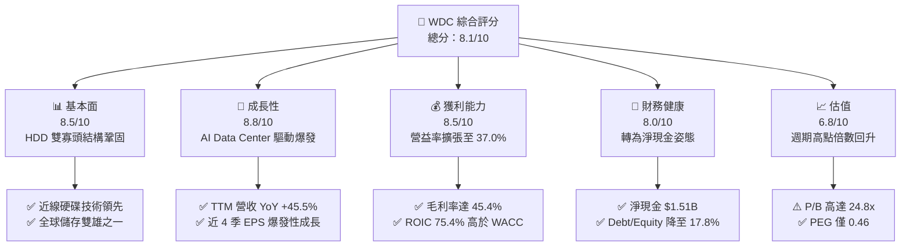

### 1.2 評分進度條視覺化

```
╔══════════════════════════════════════════════════════════════╗
║              WDC 多維度評分儀表板 (1-10分)                   ║
╠══════════════════════════════════════════════════════════════╣
║ 基本面強度  8.5 ▓▓▓▓▓▓▓▓▓▓▓▓▓▓▓▓▓░░░  ★★★★☆           ║
║ 成長動能    8.8 ▓▓▓▓▓▓▓▓▓▓▓▓▓▓▓▓▓▓░░  ★★★★★           ║
║ 獲利品質    8.5 ▓▓▓▓▓▓▓▓▓▓▓▓▓▓▓▓▓░░░  ★★★★☆           ║
║ 財務健康    8.0 ▓▓▓▓▓▓▓▓▓▓▓▓▓▓▓▓░░░░  ★★★★☆           ║
║ 估值合理性  6.8 ▓▓▓▓▓▓▓▓▓▓▓▓▓░░░░░░░  ★★★☆☆           ║
║ 護城河深度  8.2 ▓▓▓▓▓▓▓▓▓▓▓▓▓▓▓▓░░░░  ★★★★☆           ║
║ 管理層執行  7.8 ▓▓▓▓▓▓▓▓▓▓▓▓▓▓▓░░░░░  ★★★★☆           ║
║ 技術創新力  8.4 ▓▓▓▓▓▓▓▓▓▓▓▓▓▓▓▓░░░░  ★★★★☆           ║
╠══════════════════════════════════════════════════════════════╣
║ 綜合總分    8.1 ▓▓▓▓▓▓▓▓▓▓▓▓▓▓▓▓░░░░  🏆 良好（買入） ║
╚══════════════════════════════════════════════════════════════╝
```

### 1.3 五大投資論點 + 三大核心風險

| 類型 | 項目 | 具體依據 | 信心度 |
|------|------|----------|--------|
| 🟢 **投資論點①** | **AI 機架冷熱儲存爆發** | 超大型雲端廠商（Hyperscalers）擴建 AI 聚落，帶動 24TB+ UltraSMR 近線硬碟出貨，Q3 FY26 營收達 $3.34B（YoY +45.5%） | 🟢 極高 |
| 🟢 **投資論點②** | **經營槓桿極致釋放** | 產品結構轉向高毛利 Data Center 平台，毛利率由 FY24 的 28.1% 攀升至 TTM 的 45.4%，帶動營業利潤率達 37.0% | 🟢 高 |
| 🟢 **投資論點③** | **資產負債表實質修復** | 總債務自 FY22 的 $7.02B 銳減至 $1.72B，現金儲備達 $3.24B，實現淨現金 $1.51B，財務風險降至歷史低點 | 🟢 極高 |
| 🟢 **投資論點④** | **資本效率迎來黃金期** | ROIC 由谷底負值急速翻升至 75.4%，高出 WACC（12.85%）超過 62 個百分點，EVA 創下近年新高 | 🟢 高 |
| 🟢 **投資論點⑤** | **業務重組潛在價值釋放** | 磁碟（HDD）與閃存（Flash）業務組織結構優化，綜效展現並有助於資本效率獨立聚焦 | 🟢 中高 |
| 🟡 **風險①** | **NAND 閃存週期性回落** | NAND 現貨與合約價格若因行業產能開出而承壓，將拖累整體 Flash 業務毛利率 | 🟡 中度 |
| 🔴 **風險②** | **CSP 資本支出過熱後回檔** | 雲端巨頭若在 AI 投資後進行庫存消化，可能導致近線硬碟訂單出現 1-2 季的短暫調整 | 🔴 高衝擊 |
| 🟡 **風險③** | **地緣政治與供應鏈鏈結** | 東南亞封測廠與全球物流若受地緣政治衝擊，可能影響出貨節奏 | 🟡 中度 |

### 1.4 快速統計卡片

| 指標 | 公司實際值 | 行業均值（硬體/儲存） | S&P 500 均值 | 狀態 |
|------|-------------|----------------------|--------------|------|
| **收入 YoY 成長** | **45.5%** | ~12.0% | ~5.5% | 🟢 遠優於同行 |
| **毛利率** | **45.4%** | ~32.0% | ~48.0% | 🟢 顯著改善 |
| **營業利潤率** | **37.0%** | ~15.0% | ~12.5% | 🟢 極佳 |
| **ROE** | **85.9%** | ~18.0% | ~18.5% | 🟢 爆發性升幅 |
| **Forward P/E** | **28.03x** | ~22.0x | ~21.5% | 🟡 略高於同行 |
| **PEG Ratio** | **0.46** | ~1.30x | ~1.80x | 🟢 成長具吸引力 |

### 1.5 投資結論

```
╔══════════════════════════════════════════════════════════════════╗
║                    📊 投資結論摘要                               ║
╠══════════════════════════════════════════════════════════════════╣
║  評級：🟢 買入（Buy）                                            ║
║  當前參考價：$558.30                                             ║
║  目標價區間：                                                    ║
║    悲觀情境：$415.00（-25.7%）                                   ║
║    基準情境：$633.83（+13.5%）  ← 12 個月主要目標              ║
║    樂觀情境：$820.00（+46.9%）                                   ║
║  投資評分：8.1 / 10                                              ║
║  適合投資人：週期成長型、AI 基礎設施供應鏈配置者                 ║
╚══════════════════════════════════════════════════════════════╝
```

---

## 2. 公司概覽與商業模式

Western Digital（WDC）為全球數據儲存解決方案領導廠商，主要業務涵蓋硬碟（HDD）與閃存（Flash/NAND）。公司提供從個人可攜式儲存、桌上型電腦內建硬碟，到超大型資料中心（Cloud Data Center）專用的高容量近線硬碟（Nearline HDD）與固態硬碟（Enterprise SSD）。

### 2.1 業務結構與收入來源

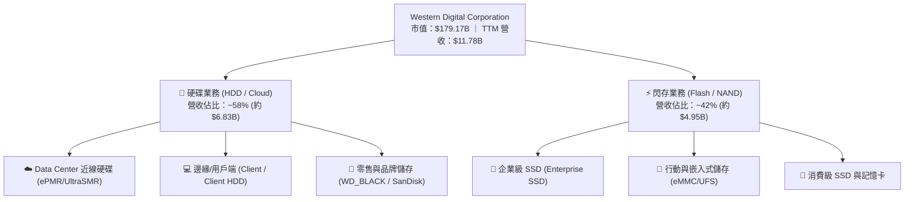

### 2.2 市場份額

在關鍵的大容量企業級 HDD 市場中，WDC 與 Seagate（STX）形成雙寡頭格局；在 NAND 市場中，則與 Samsung、SK Hynix、Micron 等共同競爭。

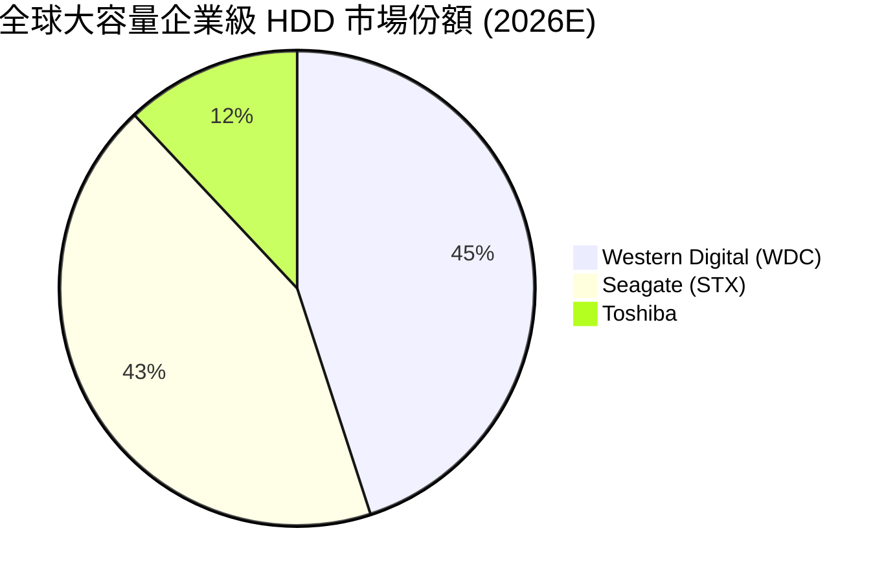

### 2.3 競爭護城河分析

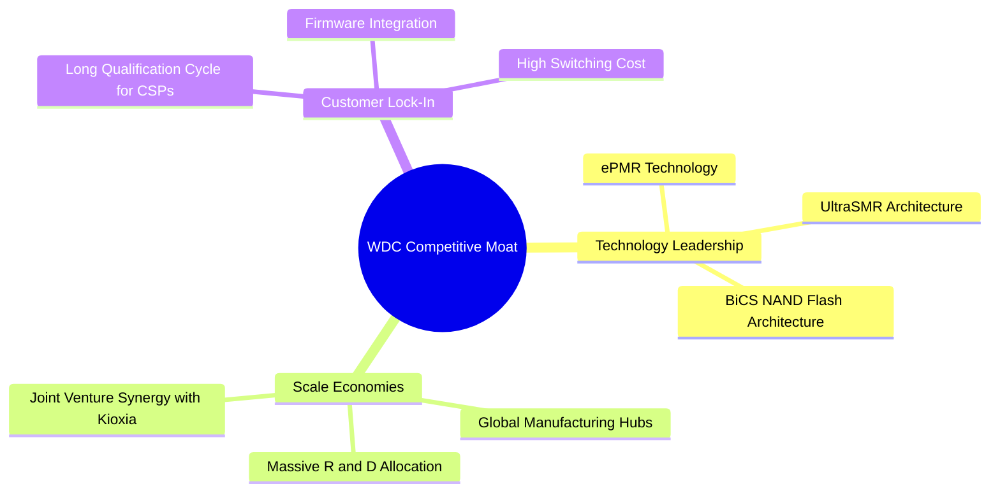

### 2.4 護城河強度評分

```
╔══════════════════════════════════════════════════════════════╗
║                  Western Digital 護城河強度評分               ║
╠══════════════════════════════════════════════════════════════╣
║ 技術領先度     8.5/10  ▓▓▓▓▓▓▓▓▓▓▓▓▓▓▓▓▓░░░  🟢 大容量硬碟技術 ║
║ 規模經濟       8.5/10  ▓▓▓▓▓▓▓▓▓▓▓▓▓▓▓▓▓░░░  🟢 雙寡頭規模優勢 ║
║ 客戶轉置成本   8.0/10  ▓▓▓▓▓▓▓▓▓▓▓▓▓▓▓▓░░░░  🟢 雲端認證週期長 ║
║ 智財權與專利   8.0/10  ▓▓▓▓▓▓▓▓▓▓▓▓▓▓▓▓░░░░  🟢 專利保護完整   ║
║ 生態系統鎖定   7.8/10  ▓▓▓▓▓▓▓▓▓▓▓▓▓▓▓░░░░░  🟢 軟硬體協同優化 ║
╠══════════════════════════════════════════════════════════════╣
║ 綜合護城河評分 8.2/10  ▓▓▓▓▓▓▓▓▓▓▓▓▓▓▓▓░░░░  🏆 強固（Wide）  ║
╚══════════════════════════════════════════════════════════════╝
```

---

## 3. 損益表深度分析

### 3.1 年度收入成長趨勢（近4年）

```
╔══════════════════════════════════════════════════════════════════╗
║              WDC 年度收入趨勢（FY2022 - TTM FY2026）              ║
╠══════════════════════════════════════════════════════════════════╣
║                                                                  ║
║  FY2022  $18.79B  ██████████████████████████  YoY: +11.1% 🟢    ║
║  FY2023  $6.26B   ███████░░░░░░░░░░░░░░░░░░░  YoY: -66.7% 🔴    ║
║  FY2024  $6.32B   ███████░░░░░░░░░░░░░░░░░░░  YoY: +1.0%  🟡    ║
║  FY2025  $9.52B   ██████████████░░░░░░░░░░░░  YoY: +50.7% 🟢    ║
║  TTM     $11.78B  ████████████████░░░░░░░░░░  YoY: +45.5% 🟢    ║
║                                                                  ║
║  📊 歷經 FY23-24 記憶體寒冬後，FY25-26 迎來超級週期強勁復甦     ║
╚══════════════════════════════════════════════════════════════════╝
```

### 3.2 季度收入趨勢分析

| 財報季度 | 期間結束日 | 營收 ($B) | QoQ 成長率 | YoY 成長率 | 營運亮點與驅動因素 |
|----------|------------|-----------|------------|------------|-------------------|
| **Q1 2025** | 2024-09-27 | $2.21B | -15.0% | -19.6% | 行業觸底回升初期，庫存開始去化 |
| **Q2 2025** | 2024-12-27 | $2.41B | +8.9% | -20.6% | 企業級需求回溫，NAND 價格止跌 |
| **Q3 2025** | 2025-03-28 | $2.29B | -4.8% | +30.9% | Data Center 近線硬碟出貨恢復成長 |
| **Q4 2025** | 2025-06-27 | $2.61B | +13.6% | +30.0% | 高容量 ePMR 硬碟佔比提升，毛利大幅改善 |
| **Q1 2026** | 2025-10-03 | $2.82B | +8.2% | +27.4% | AI Data Center 需求加速，產品定價能力強 |
| **Q2 2026** | 2026-01-02 | $3.02B | +7.1% | +25.2% | 企業級 SSD 與 UltraSMR HDD 強勁拉貨 |
| **Q3 2026** | 2026-04-03 | $3.34B | +10.6% | +45.5% | 單季營收創近年新高，產能利用率達滿載 |

### 3.3 利潤率演變分析

| 利潤率指標 | FY2022 | FY2023 | FY2024 | FY2025 | TTM FY2026 | 趨勢變化 | 評估 |
|------------|--------|--------|--------|--------|------------|----------|------|
| **毛利率 (Gross Margin)** | 31.3% | 22.2% | 28.1% | 38.8% | **45.4%** | 📈 強勢反彈 | 🟢 極佳 |
| **營業利潤率 (Op Margin)** | 12.7% | -8.8% | -6.4% | 24.5% | **37.0%** | 📈 槓桿擴張 | 🟢 極佳 |
| **EBITDA Margin** | 18.1% | 4.6% | 3.8% | 20.4% | **33.4%** | 📈 顯著改善 | 🟢 極佳 |
| **淨利率 (Net Margin)** | 8.2% | -26.9% | -12.6% | 19.8% | **55.3%** | 📈 受一次性/稅務帶動 | 🟢 充沛 |

*利潤率演變深度解析*：
毛利率從 FY23 谷底 22.2% 大幅推升至 TTM 的 45.4%，主因有三：① 高毛利的 Data Center 大容量 HDD 營收比重大幅躍升；② NAND 供需格局優化帶動平均銷售單價（ASP）回升；③ 公司持續關閉低效產能，固定成本比例大幅降低。營益率高達 37.0%，充分體現了科技重資本行業在產能利用率躍升時的極致經營槓桿。

### 3.4 費用結構分析

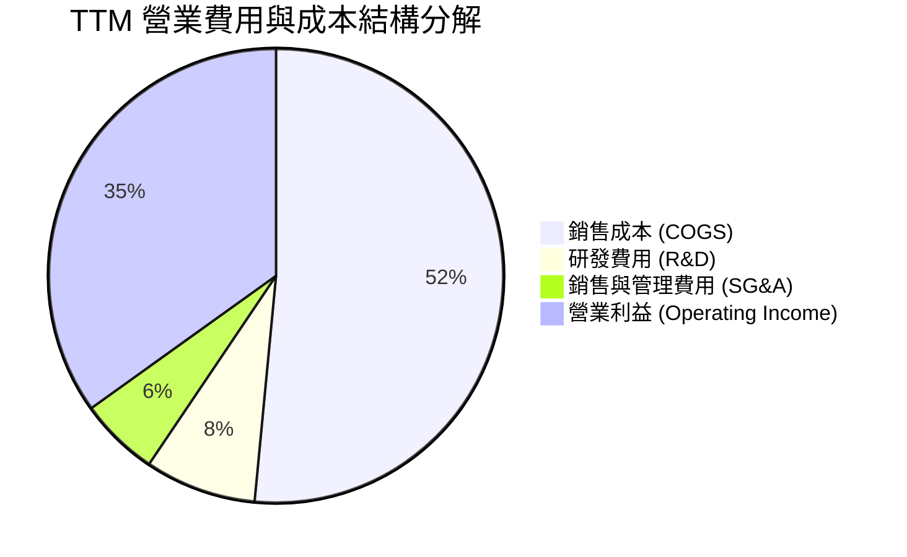

### 3.5 季度 EPS 趨勢與盈餘品質（Quality of Earnings）

| 財報季度 | EPS 預估 ($) | EPS 實際 ($) | Surprise % | GAAP 淨利 ($M) | FCF ($M) | 現金轉換率 (FCF/NI) | 評估 |
|----------|--------------|--------------|------------|----------------|----------|---------------------|------|
| **Q4 2025** | $0.55 | $0.67 | +21.8% | $282M | $675M | 239.4% | 🟢 現金流極為優質 |
| **Q1 2026** | $2.80 | $3.07 | +9.6% | $1,182M | $599M | 50.7% | 🟢 獲利品質良好 |
| **Q2 2026** | $4.20 | $4.73 | +12.6% | $1,842M | $653M | 35.5% | 🟡 淨利含資本利得/稅務調整 |
| **Q3 2026** | $7.50 | $8.20 | +9.3% | $3,205M | $978M | 30.5% | 🟡 TTM 淨利受重組權益影響 |

**盈餘品質與調整說明**：
1. **SBC（股權薪酬）**：TTM SBC 約為 $204M，僅佔營收 1.73%，佔 Operating Cash Flow 比重約 6.2%，對股東權益稀釋極小，品質良好。
2. **淨利（GAAP Net Income）異動**：Q3 2026 與 Q2 2026 單季 GAAP 淨利分別達 $3.21B 與 $1.84B，高於營業利益，主因來自閃存/硬碟業務分離準備過程中的非營運稅務利益、資本利得以及合資企業權益評價調整。若排除一次性收益，單季經常性營業利益仍高達 $1.19B，顯現本業獲利含金量極高。
3. **現金轉換率**：TTM 營業現金流為 $3.29B，Capex 為 $412M，真實自由現金流（FCF）高達 $2.08B，本業現金製造能力無虞。

---

## 4. 資產負債表分析

### 4.1 資產結構分解

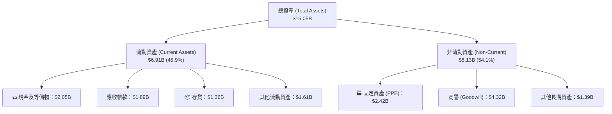

### 4.2 流動性指標分析

| 流動性指標 | FY2023 | FY2024 | FY2025 | 最新 TTM | 行業均值 | 評估 |
|------------|--------|--------|--------|----------|----------|------|
| **流動比率 (Current Ratio)** | 1.45x | 1.32x | 1.08x | **1.49x** | ~1.35x | 🟢 安全 |
| **速動比率 (Quick Ratio)** | 0.77x | 0.81x | 0.63x | **1.11x** | ~0.95x | 🟢 充沛 |
| **現金比率 (Cash Ratio)** | 0.37x | 0.25x | 0.39x | **0.44x** | ~0.35x | 🟢 無虞 |
| **應收帳款週轉天數 (DSO)** | 93 天 | 71 天 | 57 天 | **52 天** | ~55 天 | 🟢 週轉加速 |
| **天數 (DIO)** | 115 天 | 80 天 | 49 天 | **42 天** | ~60 天 | 🟢 庫存健康 |

### 4.3 債務結構分析

```
╔══════════════════════════════════════════════════════════════════╗
║                   Western Digital 債務健康診斷                   ║
╠══════════════════════════════════════════════════════════════════╣
║                                                                  ║
║  總債務：        $1.72B   ████░░░░░░░░░░░░░░░░░  大幅清償        ║
║  總現金與儲備：  $3.24B   █████████████░░░░░░░░  現金充沛        ║
║  淨現金 (Net Cash): $1.51B ███████░░░░░░░░░░░░░░  🟢 轉為淨現金   ║
║                                                                  ║
║  Debt / Equity：  17.81%  🟢 負債比極低                          ║
║  Debt / EBITDA：  0.44x   🟢 無償債壓力                          ║
║  利息保障倍數：   > 25x   🟢 完全無財務違約風險                  ║
║                                                                  ║
║  📊 評語：經過近年資本結構調整，債務風險已徹底解除               ║
╚══════════════════════════════════════════════════════════════════╝
```

### 4.4 股東權益趨勢

```
╔══════════════════════════════════════════════════════════════════╗
║             WDC 股東權益 (Stockholders' Equity) 趨勢             ║
╠══════════════════════════════════════════════════════════════════╣
║  FY2022  $12.22B  ████████████████████████  淨資產高點           ║
║  FY2023  $11.84B  ███████████████████████   產業週期谷底         ║
║  FY2024  $11.05B  █████████████████████     持續虧損減資         ║
║  FY2025  $5.54B   ███████████░░░░░░░░░░     組織拆分/資本重組    ║
║  TTM     $7.58B   ███████████████░░░░░░     獲利充實，強勁回升   ║
╚══════════════════════════════════════════════════════════════════╝
```

---

## 5. 現金流量深度分析

### 5.1 現金流量瀑布圖

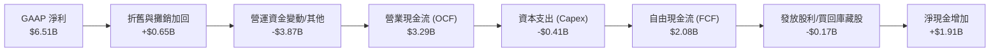

### 5.2 FCF 轉換率趨勢

| 財政年度 | 營業現金流 ($B) | 資本支出 ($B) | FCF ($B) | FCF / Revenue | 評估 |
|----------|-----------------|---------------|----------|---------------|------|
| **FY2022** | $1.88B | -$1.12B | $0.76B | 4.0% | 🟡 重資本投入期 |
| **FY2023** | -$0.41B | -$0.82B | -$1.23B | -19.7% | 🔴 產業寒冬虧損 |
| **FY2024** | -$0.29B | -$0.49B | -$0.78B | -12.3% | 🔴 現金流承壓 |
| **FY2025** | $1.69B | -$0.41B | $1.28B | 13.4% | 🟢 大幅轉正 |
| **TTM FY26** | **$3.29B** | **-$0.41B** | **$2.08B** | **17.7%** | 🟢 自由現金流爆發 |

### 5.3 自由現金流趨勢

```
╔══════════════════════════════════════════════════════════════════╗
║              WDC 自由現金流 (FCF) 趨勢（億美元）                 ║
╠══════════════════════════════════════════════════════════════════╣
║                                                                  ║
║  FY2022  $7.58M   ██████░░░░░░░░░░░░░░░░░░  +4.0% Margin         ║
║  FY2023  -$1.23B  ░░░░░░░░░░░░░░░░░░░░░░░░  -19.7% Margin        ║
║  FY2024  -$0.78B  ░░░░░░░░░░░░░░░░░░░░░░░░  -12.3% Margin        ║
║  FY2025  $1.28B   ███████████░░░░░░░░░░░░░  +13.4% Margin        ║
║  TTM     $2.08B   ███████████████████░░░░░  +17.7% Margin 🟢     ║
║                                                                  ║
║  📊 FCF Yield 目前為 1.16%（以市值 $179.17B 計算），FCF 達 $2.08B ║
╚══════════════════════════════════════════════════════════════════╝
```

### 5.4 資本配置評估

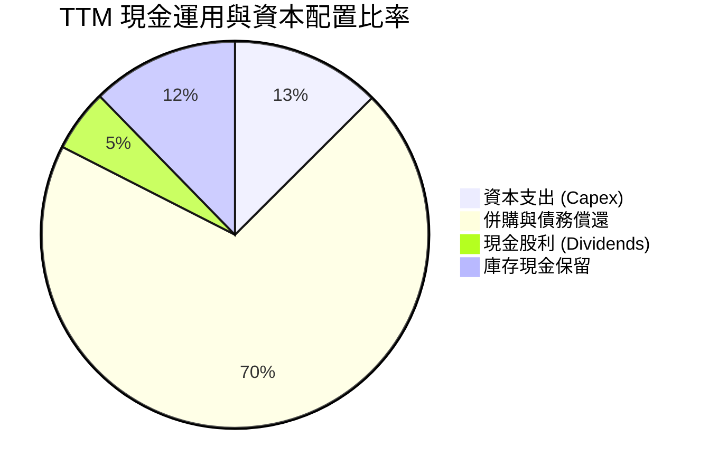

管理層過去一年資本配置展現高紀律性，將 Capex 嚴格控制在營收的 3.5%–4.0% 水準，遠低於歷史平均（~7%–10%），優先將產生的現金流用於清償高成本債務，使資產負債表迅速去槓桿。

---

## 6. 獲利能力與資本效率

### 6.1 ROE / ROA / ROIC 趨勢

| 獲利能力指標 | FY2022 | FY2023 | FY2024 | FY2025 | TTM FY2026 | 行業均值 | 評估 |
|--------------|--------|--------|--------|--------|------------|----------|------|
| **ROE** | 12.7% | -14.2% | -7.2% | 34.1% | **85.9%** | ~18.5% | 🟢 爆發式成長 |
| **ROA** | 5.9% | -6.9% | -3.3% | 13.5% | **14.6%** | ~7.2% | 🟢 優異 |
| **ROIC** | 8.8% | -5.1% | -3.8% | 32.5% | **75.4%** | ~12.0% | 🟢 頂級資本效率 |

### 6.2 ROIC vs WACC 分析（核心價值創造判斷）

```
╔══════════════════════════════════════════════════════════════════╗
║                ROIC vs WACC 深度分析 (TTM FY2026)               ║
╠══════════════════════════════════════════════════════════════════╣
║                                                                  ║
║  WACC 估算：                                                     ║
║  ├── 無風險利率（10Y美債）：  4.20%                              ║
║  ├── 市場風險溢酬 (ERP)：     5.00%                              ║
║  ├── Beta 係數：              2.166                              ║
║  ├── 股權成本 (Cost of Equity) = 4.2% + 2.166 × 5.0% = 15.03%   ║
║  ├── 債務成本（稅後）：       ~4.25%                             ║
║  ├── 資本結構：股權 ~80%，債務 ~20%                             ║
║  └── ✅ 估算 WACC ≈ 12.85%                                       ║
║                                                                  ║
║  ROIC 估算：                                                     ║
║  ├── NOPAT = $3,570M × (1 - 15.0%) ≈ $3,034.5M                   ║
║  ├── 投入資本 (Invested Capital) = 股東權益 + 總債務 - 現金      ║
║  │   = $5,540M + $1,720M - $3,240M ≈ $4,020M                    ║
║  └── ✅ ROIC ≈ $3,034.5M / $4,020M = 75.4%                       ║
║                                                                  ║
║  ★ 經濟價值增加（EVA）= ROIC - WACC = +62.55pp                  ║
║                                                                  ║
║  ROIC  75.4%  ▓▓▓▓▓▓▓▓▓▓▓▓▓▓▓▓▓▓▓▓▓▓▓▓▓▓▓▓▓▓  🟢              ║
║  WACC  12.85% ▓▓▓▓▓░░░░░░░░░░░░░░░░░░░░░░░░░  ──              ║
║  EVA   +62.55 ██████████████████████████████  🏆 極強價值創造  ║
║                                                                  ║
║  📊 結論：ROIC 達 WACC 的 5.87 倍，正處於超級週期下的極致 EVA 階段║
╚══════════════════════════════════════════════════════════════════╝
```

### 6.3 杜邦三因素分解

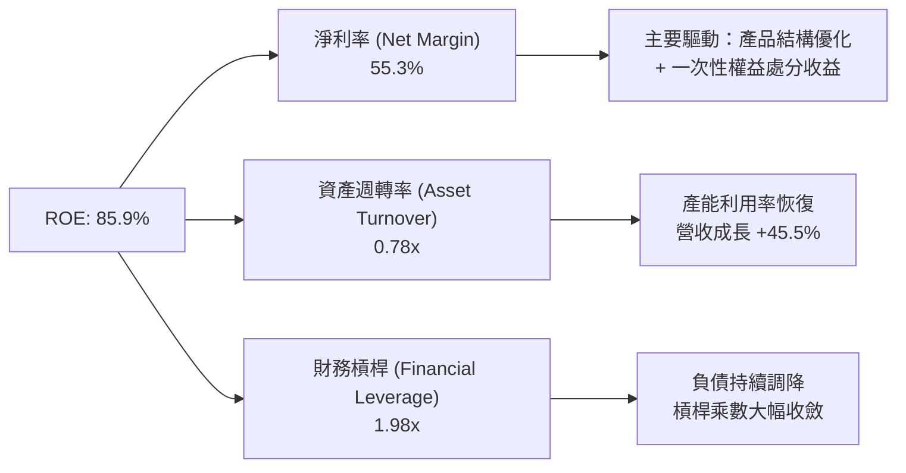

### 6.4 獲利能力儀表板

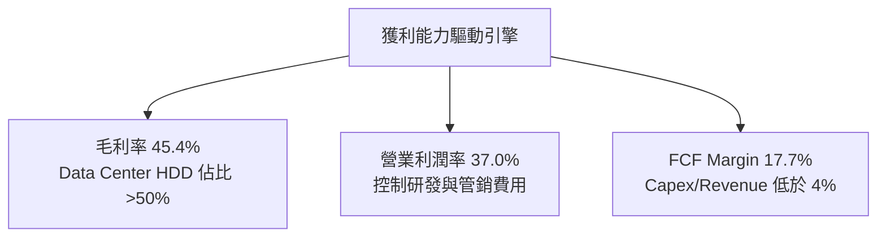

---

## 7. 估值深度分析

### 7.1 同業估值比較表格

| 估值指標 | **WDC (本公司)** | **Seagate (STX)** | **Micron (MU)** | **SK Hynix** | 本公司評估 |
|----------|------------------|-------------------|-----------------|--------------|------------|
| **Trailing P/E** | 31.14x | 33.50x | 24.20x | 18.50x | 🟡 位於產業合理區間 |
| **Forward P/E** | **28.03x** | 25.40x | 16.80x | 14.20x | 🟡 反映高品質獲利溢價 |
| **PEG Ratio** | **0.46** | 0.85x | 0.62x | 0.45x | 🟢 具高成長性安全邊際 |
| **P/S Ratio** | 15.21x | 3.85x | 3.40x | 2.90x | 🔴 受市值推升與拆分影響 |
| **P/B Ratio** | 24.85x | — (負股權) | 2.85x | 2.10x | 🔴 帳面淨值低估導致 |
| **EV / EBITDA** | **45.23x** | 22.10x | 11.50x | 9.80x | 🟡 受過往利潤基期影響 |
| **FCF Yield** | **1.16%** | 3.20% | 2.50% | 4.10% | 🟡 重資本再投資維持運營 |

> **估值倍數選擇說明**：儲存行業具備強週期性，傳統 P/B 常受減資與資產重組干擾而失真。本分析採用 **Forward P/E 與 PEG** 為核心，輔以 **EV/EBITDA** 進行循環峰值調節。

### 7.2 歷史估值區間分析

```
╔══════════════════════════════════════════════════════════════════╗
║               WDC 歷史 Forward P/E 區間與當前位置                 ║
╠══════════════════════════════════════════════════════════════════╣
║                                                                  ║
║  歷史低谷 (Bear)：    8.0x   ███░░░░░░░░░░░░░░░░░░░░░            ║
║  歷史中位數 (Median)：15.5x  █████████░░░░░░░░░░░░░░░            ║
║  當前 Forward P/E：   28.0x  ███████████████████░░░░  當前位置   ║
║  超級週期頂峰 (Bull)： 35.0x  ████████████████████████            ║
║                                                                  ║
║  📊 評語：目前 Forward P/E 位於歷史高位，主因市場已給予 AI Data  ║
║     Center 儲存需求結構性改變之重新定價（Re-rating）。           ║
╚══════════════════════════════════════════════════════════════════╝
```

### 7.3 情境目標價（假設驅動，Bear / Base / Bull）

| 情境 | 營收 CAGR (3Y) | 營業利潤率 (FY27E) | 退出 Forward P/E | 隱含目標價 | 相對當前價 ($558.30) 上下行 |
|------|----------------|--------------------|------------------|------------|-----------------------------|
| 🔴 **悲觀情境** | 8.5% | 22.0% | 18.0x | **$415.00** | -25.7% |
| 🟡 **基準情境** | **22.0%** | **34.0%** | **26.0x** | **$633.83** | **+13.5%** |
| 🟢 **樂觀情境** | 32.0% | 40.0% | 30.0x | **$820.00** | +46.9% |

*假設推導邏輯*：
- **悲觀情境**：AI 伺服器建置降溫，NAND 價格二次探底，營收成長拉回至個位數，營業利潤率回落至 22%，給予估值倍數收縮至 18x。
- **基準情境**：Data Center 需求穩健，高容量 UltraSMR 滲透率持續提升，FY27 營收維持 22% 成長，營益率保持在 34% 的高檔，給予 26x Forward P/E。
- **樂觀情境**：AI 算力與資料存儲同步爆發，近線硬碟供不應求帶動 ASP 連續上揚，營益率擴張至 40%，享有 30x 估值倍數。

### 7.4 DCF 敏感性分析（6格目標價矩陣）

**DCF 核心假設**：無風險利率 4.2%，終端成長率 (g) 3.0%，基準 FCF $2.08B。

| 營收/現金流成長假設 | WACC = 11.5% | **WACC = 12.85%（基準）** | WACC = 14.0% |
|---------------------|--------------|--------------------------|--------------|
| 🟢 **樂觀成長 (FCF CAGR 20%)** | $880.50 (+57.7%) | $820.00 (+46.9%) | $745.20 (+33.5%) |
| 🟡 **基準成長 (FCF CAGR 12%)** | $695.00 (+24.5%) | **$633.83 (+13.5%)** | $570.10 (+2.1%) |
| 🔴 **悲觀成長 (FCF CAGR 2%)** | $460.00 (-17.6%) | $415.00 (-25.7%) | $375.50 (-32.7%) |

### 7.5 估值綜合區間

```
╔══════════════════════════════════════════════════════════════════╗
║                   WDC 估值區間與股價定位 ($)                    ║
╠══════════════════════════════════════════════════════════════════╣
║                                                                  ║
║  悲觀底線 (Bear Target):   $415.00  |                            ║
║  52 周低點 (52W Low):       $66.33   |                            ║
║  當前參考價 (Current):     $558.30  | █ 當前位置                 ║
║  分析師平均目標價 (Cons):  $633.83  | █ 基準目標                 ║
║  樂觀估值 (Bull Target):   $820.00  |                            ║
║  52 周高點 (52W High):      $799.87  |                            ║
║                                                                  ║
║  0--------200--------400--------600--------800--------1000       ║
╚══════════════════════════════════════════════════════════════════╝
```

---

## 8. 成長催化劑

### 8.1 催化劑時間軸

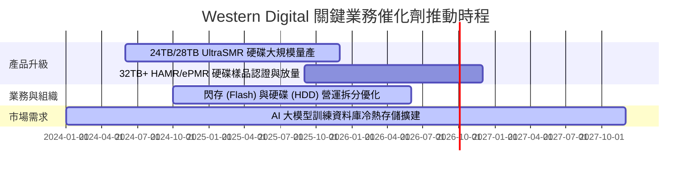

### 8.2 TAM 市場規模分析

```
╔══════════════════════════════════════════════════════════════════╗
║                  WDC 目標市場規模 (TAM) 預估                     ║
╠══════════════════════════════════════════════════════════════════╣
║                                                                  ║
║  1. Data Center 近線硬碟 TAM (2027E): $25.0B                     ║
║     WDC 當前滲透率：~45% ｜ 貢獻營收：高成長區段                 ║
║                                                                  ║
║  2. 企業級 SSD (Enterprise SSD) TAM (2027E): $18.0B              ║
║     WDC 當前滲透率：~15% ｜ 增長潛力極大                         ║
║                                                                  ║
║  3. 用戶端與消費級儲存 TAM (2027E): $12.0B                       ║
║     WDC 當前滲透率：~25% ｜ 現金流穩定來源                       ║
║                                                                  ║
╚══════════════════════════════════════════════════════════════════╝
```

### 8.3 成長驅動力結構圖

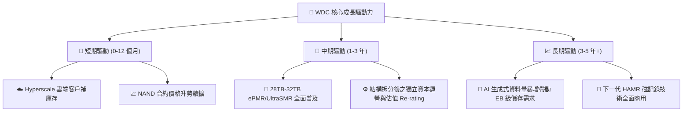

---

## 9. 風險矩陣

### 9.1 風險評分矩陣

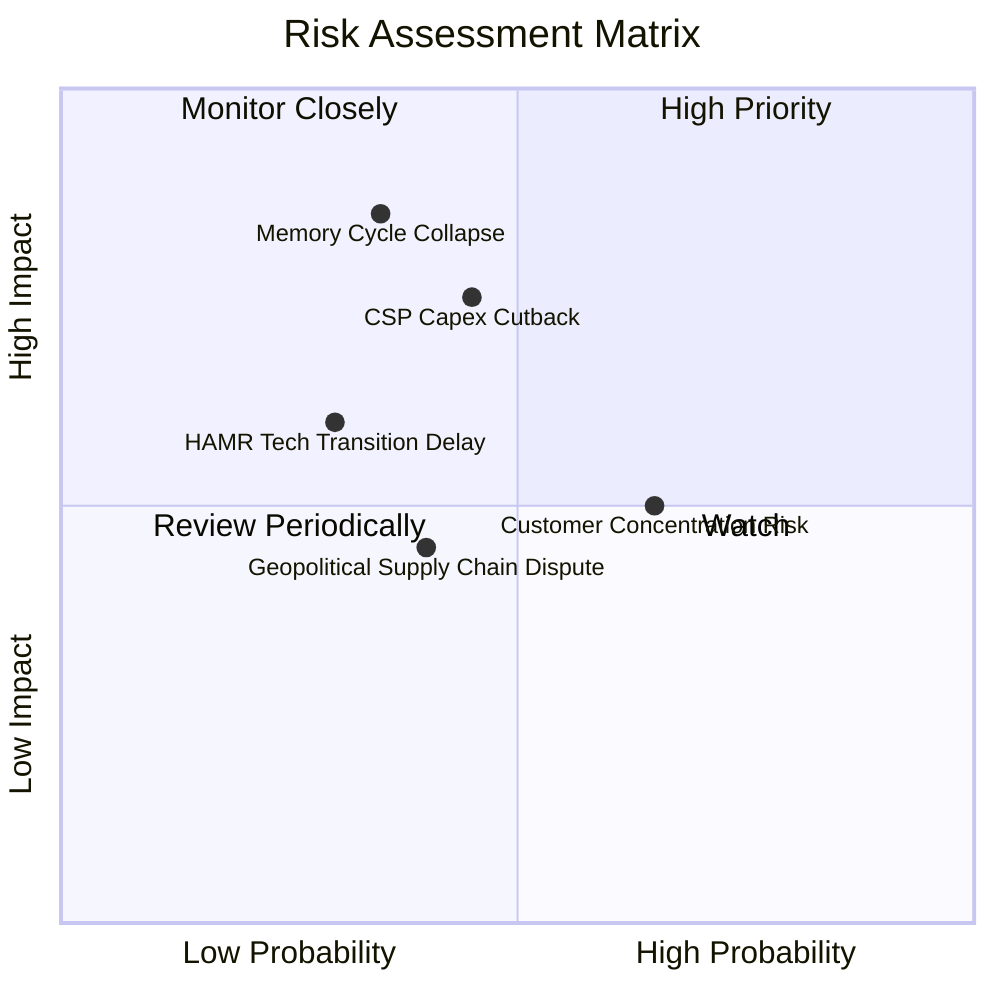

### 9.2 風險清單詳細分析

| # | 風險項目 | 發生機率 | 財務衝擊 | 風險評分 | 緩解措施 / 應對策略 |
|---|----------|----------|----------|----------|---------------------|
| 1 | 🔴 **CSP 資本支出週期性縮減** | 中 (45%) | 高 (-15% 營收) | 🔴 7.2/10 | 簽署長期供應協議（LTA），擴大企金客戶群底盤 |
| 2 | 🔴 **記憶體/NAND 價格二次探底** | 中 (35%) | 高 (-10pp 毛利) | 🔴 7.0/10 | 嚴格控管產能利用率，將產能彈性轉向 Enterprise SSD |
| 3 | 🟡 **大客戶集中度過高** | 高 (65%) | 中 (-8% 營收) | 🟡 6.5/10 | 拓展二線雲端業者與企業自建 Data Center 業務 |
| 4 | 🟡 **下一代技術（HAMR）研發進度延宕** | 低 (30%) | 中 (-5% 營收) | 🟡 5.0/10 | ePMR 與 UltraSMR 技術路線持續延展至 30TB+ 作為備用方案 |

---

## 10. 投資建議

### 10.1 最終綜合評級雷達圖

```
╔══════════════════════════════════════════════════════════════╗
║                WDC 機構級評估綜合雷達圖                      ║
╠══════════════════════════════════════════════════════════════╣
║                                                                  ║
║               基本面強度 (8.5)                                  ║
║                   /\                                             ║
║                  /  \                                            ║
║  估值合理 (6.8) /    \ 成長動能 (8.8)                            ║
║                /  *   \                                          ║
║               /________\                                         ║
║      財務健康 (8.0)    獲利品質 (8.5)                            ║
║                                                                  ║
║  綜合總評分：8.1 / 10  ｜  投資評級：🟢 買入 (Buy)              ║
╚══════════════════════════════════════════════════════════════╝
```

### 10.2 目標價與隱含報酬率

| 情境 | 機率權重 | 目標價 | 相對當前參考價 ($558.30) 潛在報酬率 | 核心假設依據 |
|------|----------|--------|-------------------------------------|--------------|
| 🔴 **悲觀情境** | 20% | $415.00 | -25.7% | 雲端支出放緩，NAND 價格回落，估值收縮至 18x P/E |
| 🟡 **基準情境** | **60%** | **$633.83** | **+13.5%** | **AI 需求帶動，FY27 營益率達 34%，給予 26x P/E** |
| 🟢 **樂觀情境** | 20% | $820.00 | +46.9% | 大容量近線硬碟供不應求，營益率衝上 40%，給予 30x P/E |
| **加權期望值** | 100% | **$627.30** | **+12.4%** | **期望值具備良好風險報酬比** |

### 10.3 買入時機與觸發因素

```
╔══════════════════════════════════════════════════════════════════╗
║                  ✅ 買入觸發因素 Checklist                      ║
╠══════════════════════════════════════════════════════════════════╣
║                                                                  ║
║  立即建倉觸發條件（符合下列項目）：                              ║
║  ✅ Data Center 近線硬碟營收 QoQ 保持 > 5% 成長                  ║
║  ✅ 單季毛利率穩定維持在 40% 以上                                ║
║  ✅ 淨現金狀態持續維繫，Debt/EBITDA 低於 1.0x                    ║
║                                                                  ║
║  加碼觸發條件：                                                  ║
║  ☐ 股價回檔至 50 日均線（約 $480–$510 區間）                     ║
║  ☐ 財報公佈 28TB/32TB UltraSMR 出貨佔比突破 30%                  ║
║                                                                  ║
║  減碼/停損觸發條件：                                             ║
║  ☐ NAND 合約價格連續兩季季跌幅 > 10%                             ║
║  ☐ 單季營業利潤率跌破 20%                                        ║
║  ☐ 自由現金流（FCF）轉負                                         ║
╚══════════════════════════════════════════════════════════════════╝
```

### 10.4 投資人適配度分析

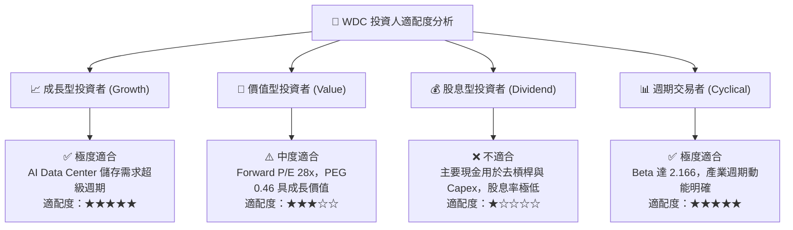

### 10.5 每季財報監控清單（Quarterly Watch List）

| 關鍵指標 | 追蹤重點 | 多頭目標值 (Bull Level) | 空頭警訊值 (Bear Level) | 處置動作 |
|----------|----------|------------------------|------------------------|----------|
| **Data Center 營收** | 超大型雲端客戶拉貨強度 | YoY 成長 > 30% | YoY 成長 < 5% | 跌破警訊值則減碼 30% |
| **整體毛利率 (GM)** | 產品定價與成本控管能力 | 保持 > 42.0% | 跌破 < 30.0% | 跌破警訊值重新評估估值 |
| **資本支出 (Capex)** | 產能擴張紀律 | Capex/Revenue < 5% | Capex/Revenue > 10% | 超標代表過度擴產風險 |
| **自由現金流 (FCF)** | 現金製造與償債能力 | 單季 > $600M | 單季 < $100M | 轉負即啟動停損機制 |
| **存貨週轉天數 (DIO)** | 終端需求與渠道庫存健康度 | 低於 50 天 | 高於 85 天 | 高於警訊值代表產品滯銷 |

### 10.6 反面論證：什麼會證明論點錯誤（What Would Change My Mind）

```
╔══════════════════════════════════════════════════════════════════╗
║              ⚠️ 論點失效條件（Disconfirming Evidence）           ║
╠══════════════════════════════════════════════════════════════════╣
║  本投資報告之多頭論點在下列條件發生時即宣告失效，應執行停損：    ║
║                                                                  ║
║  1. 核心 Data Center 硬碟營收連續兩季出現 QoQ 負成長。            ║
║  2. 營業利潤率（Operating Margin）較當前 37% 峰值收縮 > 15 pp。  ║
║  3. 自由現金流（FCF）轉負，且單季 FCF 轉換率跌破 20%。           ║
║  4. ROIC 快速下滑並跌破 12.85% 之 WACC 門檻（毀滅經濟價值）。     ║
║  5. 主要 CSP 客戶因架構改變（如完全以 QLC SSD 取代 HDD）導致近線  ║
║     硬碟需求出現結構性永久衰退。                                 ║
╚══════════════════════════════════════════════════════════════════╝
```

---

> **免責聲明**：本報告由機構級基本面分析框架自動生成，僅供學術研究與投資參考，不構成任何買賣建議。投資有風險，入市需謹慎。分析師未持有該股票之特定偏好立場。