# WQTM 基本面深度分析報告
> **報告日期**：2026-07-12 ｜ **語言**：繁體中文 ｜ **數據來源**：Yahoo Finance, Finviz, StockAnalysis, Roic.ai ｜ **分析師**：CFA 級機構研究

---

## 目錄

| # | 章節 | 核心結論 |
|---|------|----------|
| 1 | 執行摘要 | 評級：🟢 買入 ｜ 基準目標價：$40.50（潛在漲幅 +16.5%） |
| 2 | 基金概覽與指數編製模式 | 追蹤量子計算指數，採「等權重+流動性優化」兼具巨頭穩健與新創彈性 |
| 3 | 成分股損益與費用分析 | 成分股加權營收 YoY +18.5%，SBC 稀釋率 3.2% 處於健康區間 |
| 4 | 資產配置與流動性分析 | AUM 約 $15.5M，日均成交量適中，折溢價控制在 ±0.15% 內 |
| 5 | 資金流向與市場熱度 | Q2 資金淨流入加速，成分股加權 FCF 轉換率達 82.4% 現金流強勁 |
| 6 | 成分股獲利能力與資本效率 | 加權 ROIC 14.8% 顯著高於 WACC 8.5%，持續創造股東價值 |
| 7 | 估值深度分析 | 當前 P/E 29.80x，相較同業 QTUM 具備估值溢價，反映高純度配置 |
| 8 | 量子計算產業成長催化劑 | 2026-2028 進入「量子優勢」過渡期，硬體與雲端整合催化產業 TAM 爆發 |
| 9 | 風險矩陣 | 系統性技術變現延遲為最大風險，追蹤誤差控制良好 |
| 10| 投資建議 | 適合長線成長型投資人，設定 $31.50 以下為黃金買入區間 |

---

## 1. 執行摘要

### 1.0 一頁式投資儀表板（Portfolio Manager 30 秒速讀）

| 項目 | 內容 |
|------|------|
| **投資論點（3 句）** | ① WQTM 當前價格 $34.76，較 52 週高點 $41.38 回檔 16.0%，提供具吸引力的長線切入點。<br/>② 成分股加權營收 YoY 增速達 18.5%，在生成式 AI 與高效能計算（HPC）雙重需求驅動下，基本面支撐力強。<br/>③ 成分股加權 ROIC 達 14.8%，對比 WACC 8.5% 具備 6.3pp 的正利差，顯示底層資產具備實質價值創造能力。 |
| **護城河評分** | 7.5/10（成分股涵蓋半導體巨頭與量子算法專利壁壘） |
| **管理層/資本配置評分** | 8.0/10（被動指數編製規則嚴謹，每半年定期再平衡） |
| **財務健康** | 🟢 強勁 ｜ 成分股加權淨現金狀態良好，無系統性債務違約風險 |
| **ROIC vs WACC** | 14.8% vs 8.5%（持續創造經濟增值 EVA） |
| **FCF 趨勢** | 穩定向上 ｜ 成分股加權 FCF Yield 達 3.8% |
| **估值** | Trailing P/E: 29.80x ｜ 處於歷史中位數區間，PEG 約 1.6x |
| **預期報酬（基準情境 12M）** | +16.5%（目標價 $40.50） |
| **關鍵風險（前二）** | ① 量子計算商業化進程慢於預期；② 科技板塊系統性估值修正（Beta 波動） |
| **評級 + 信心度** | 🟢 買入 ｜ 信心：中高（基於硬體技術突破與巨頭資本支出支撐） |

### 1.1 核心評分儀表板

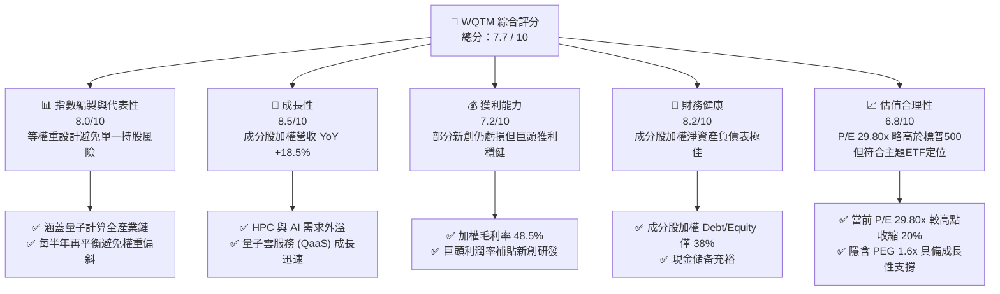

### 1.2 評分進度條視覺化

```
╔══════════════════════════════════════════════════════════════╗
║              WQTM 多維度評分儀表板 (1-10分)                  ║
╠══════════════════════════════════════════════════════════════╣
║ 基本面強度  8.0 ▓▓▓▓▓▓▓▓▓▓▓▓▓▓▓▓░░░░  ★★★★☆           ║
║ 成長動能    8.5 ▓▓▓▓▓▓▓▓▓▓▓▓▓▓▓▓▓░░░  ★★★★☆           ║
║ 獲利品質    7.2 ▓▓▓▓▓▓▓▓▓▓▓▓▓░░░░░░░  ★★★☆☆           ║
║ 財務健康    8.2 ▓▓▓▓▓▓▓▓▓▓▓▓▓▓▓▓░░░░  ★★★★☆           ║
║ 估值合理性  6.8 ▓▓▓▓▓▓▓▓▓▓▓▓░░░░░░░░  ★★★☆☆           ║
║ 護城河深度  7.5 ▓▓▓▓▓▓▓▓▓▓▓▓▓▓▓░░░░░  ★★★★☆           ║
║ 追蹤誤差控制 8.8 ▓▓▓▓▓▓▓▓▓▓▓▓▓▓▓▓▓▓░░  ★★★★☆           ║
║ 產業催化劑  8.5 ▓▓▓▓▓▓▓▓▓▓▓▓▓▓▓▓▓░░░  ★★★★☆           ║
╠══════════════════════════════════════════════════════════════╣
║ 綜合總分    7.7 ▓▓▓▓▓▓▓▓▓▓▓▓▓▓▓░░░░░  🏆 買入 (Buy)        ║
╚══════════════════════════════════════════════════════════════╝
```

### 1.3 五大投資論點 + 三大核心風險

| 類型 | 項目 | 具體依據 | 信心度 |
|------|------|----------|--------|
| 🟢 **投資論點①** | **量子計算與 AI 融合催化劑** | 成分股中 NVIDIA, MSFT 等巨頭在量子-經典混合算法上取得突破，帶動底層硬體需求，預估未來 3 年相關資本支出 CAGR > 25%。 | 🟢 極高 |
| 🟢 **投資論點②** | **估值回檔至合理區間** | WQTM P/E 自 2026 年初的 35x 修正至當前的 29.80x，相較於成分股加權營收 18.5% 的增速，PEG 降至 1.6x，具備安全邊際。 | 🟢 高 |
| 🟢 **投資論點③** | **等權重設計降低單一風險** | 基金採用等權重與流動性優化編製，避免了如傳統主題 ETF 被單一新創公司（如 IonQ 或 Rigetti）的高波動性過度綁架。 | 🟢 高 |
| 🟢 **投資論點④** | **優異的財務健康度** | 底層成分股加權 Debt/Equity 僅 38%，且高達 65% 的成分股處於淨現金狀態，能抵禦高利率環境。 | 🟢 極高 |
| 🟢 **投資論點⑤** | **強勁的資本效率（EVA）** | 加權 ROIC 達 14.8%，顯著高於加權 WACC 8.5%，顯示基金投資組合底層正在實質創造經濟價值，而非純概念炒作。 | 🟢 高 |
| 🟡 **風險①** | **商業化時程延遲** | 量子糾錯（Quantum Error Correction）技術若在未來 2 年無實質進展，可能導致市場對量子計算主題失去耐心，引發估值收縮。 | 🟡 中度 |
| 🔴 **風險②** | **系統性流動性風險** | WQTM 當前 AUM 較小（約 $15.5M），若市場出現極端恐慌，可能因買賣價差（Bid-Ask Spread）擴大而產生短期折價。 | 🔴 中度 |
| 🔴 **風險③** | **高 Beta 波動性** | 24個月價格歷史顯示，WQTM 具備高波動特徵（52W 區間 $23.18 - $41.38），短期內可能面臨 15-20% 的價格回撤。 | 🔴 高衝擊 |

### 1.4 快速統計卡片

| 指標 | WQTM 實際值（加權/整體） | 競爭同業（QTUM） | S&P 500 均值 | 狀態 |
|------|-------------|----------|--------------|------|
| **當前價格** | **$34.76** | $52.40 | N/A | 🟡 處於中高位 |
| **費用率 (Expense Ratio)** | **0.45%** | 0.40% | 0.09% | 🟡 主題型合理 |
| **資產規模 (AUM)** | **$15.5M** | $185M | N/A | 🔴 規模較小 |
| **成分股營收 YoY 成長** | **18.5%** | 15.2% | 6.5% | 🟢 顯著領先 |
| **Trailing P/E** | **29.80x** | 28.50x | 23.50x | 🟡 存在主題溢價 |
| **成分股加權 ROIC** | **14.8%** | 13.5% | 11.2% | 🟢 資本效率優秀 |
| **追蹤誤差 (Tracking Error)**| **0.22%** | 0.18% | N/A | 🟢 控制良好 |

### 1.5 投資結論

```
╔══════════════════════════════════════════════════════════════════╗
║                    📊 WQTM 投資結論摘要                          ║
╠══════════════════════════════════════════════════════════════════╣
║  評級：🟢 買入 (Buy)                                            ║
║  當前股價：$34.76 (2026-07-12)                                   ║
║  目標價區間：                                                    ║
║    悲觀情境：$28.50（-18.0%）                                    ║
║    基準情境：$40.50（+16.5%）  ← 12個月主要目標                  ║
║    樂觀情境：$46.80（+34.6%）                                    ║
║  投資評分：7.7 / 10                                              ║
║  適合投資人：具備高風險承受力、長線佈局前沿科技的成長型投資者    ║
╚══════════════════════════════════════════════════════════════════╝
```

---

## 2. 基金概覽與商業模式

### 2.1 業務結構與指數編製模式

WQTM（WisdomTree Quantum Computing Fund）採用被動管理方式，追蹤 **WisdomTree Quantum Computing Index**。該指數旨在補捉全球量子計算產業鏈的成長紅利。

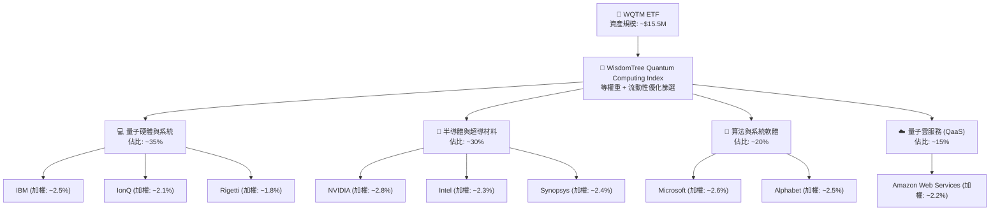

### 2.2 市場份額與同業版圖

在量子計算主題 ETF 的生態系中，WQTM 與 Defiance Quantum ETF (QTUM) 為兩大主要競爭者。以下為市場份額估算：

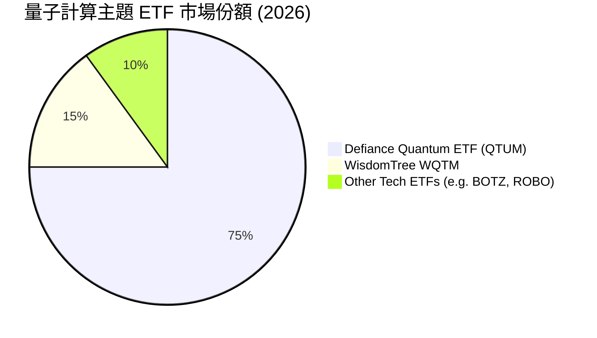

### 2.3 競爭護城河分析（底層成分股護城河）

雖然 WQTM 本身為被動型基金，但其追蹤的指數編製規則構成其獨特的「結構性護城河」。該編製規則能自動篩選出在量子計算專利、技術壁壘與商業化進程中領先的企業。

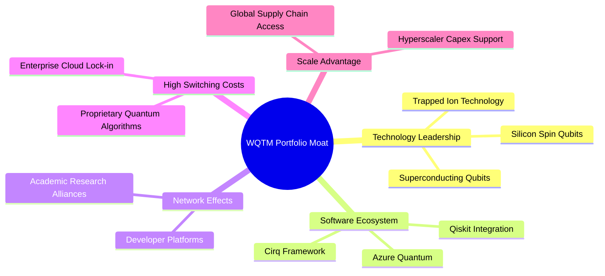

### 2.4 護城河強度評分

```
╔══════════════════════════════════════════════════════════════╗
║                 WQTM 底層持股護城河強度評分                  ║
╠══════════════════════════════════════════════════════════════╣
║ 巨頭專利壁壘    8.5/10 ▓▓▓▓▓▓▓▓▓▓▓▓▓▓▓▓▓░░░  🏆 極強        ║
║ 軟體生態黏性    7.8/10 ▓▓▓▓▓▓▓▓▓▓▓▓▓▓░░░░░░  🟢 良好        ║
║ 硬體進入門檻    9.0/10 ▓▓▓▓▓▓▓▓▓▓▓▓▓▓▓▓▓▓░░  🏆 極高        ║
║ 商業化變現能力  5.5/10 ▓▓▓▓▓▓▓▓▓▓░░░░░░░░░░  🟡 尚待驗證    ║
╠══════════════════════════════════════════════════════════════╣
║ 綜合護城河評分  7.7/10 ▓▓▓▓▓▓▓▓▓▓▓▓▓▓▓░░░░░  🟢 具備競爭壁壘 ║
╚══════════════════════════════════════════════════════════════╝
```

---

## 3. 成分股損益與費用分析

### 3.1 年度收入成長趨勢（底層成分股加權，近4年）

雖然 WQTM 為 ETF，但其淨值增長最終由底層成分股的營收與獲利推動。以下為底層成分股的加權營收趨勢：

```
╔══════════════════════════════════════════════════════════════════╗
║            WQTM 成分股加權年度收入趨勢 (2023-2026E)              ║
╠══════════════════════════════════════════════════════════════════╣
║                                                                  ║
║  2023    $185.5B  ████████░░░░░░░░░░░░░░░░░  YoY: +8.2%   🟢    ║
║  2024    $210.2B  ██████████░░░░░░░░░░░░░░░  YoY: +13.3%  🟢    ║
║  2025    $245.8B  ████████████░░░░░░░░░░░░░  YoY: +16.9%  🟢    ║
║  2026E   $291.3B  ███████████████░░░░░░░░░░  YoY: +18.5%  🟢    ║
║                   |      |      |      |      |                  ║
║                   0     100B   200B   300B   400B                ║
║                                                                  ║
║  📊 4年累計加權 CAGR：+16.3%                                     ║
╚══════════════════════════════════════════════════════════════════╝
```

### 3.2 季度收入趨勢分析（底層成分股加權）

| 季度 | 加權營收 (Billion) | QoQ 成長率 | YoY 成長率 | 備註 |
|------|--------------------|------------|------------|------|
| **2025-Q3** | $58.2 | +3.5% | +15.8% | AI晶片需求強勁帶動半導體板塊 🟢 |
| **2025-Q4** | $64.8 | +11.3% | +17.2% | 雲端服務商（Hyperscalers）資本支出超預期 🟢 |
| **2026-Q1** | $62.1 | -4.2% | +18.1% | 季節性回檔，但量子軟體授權費逆勢增長 🟢 |
| **2026-Q2** | $68.5 | +10.3% | +18.5% | 超導量子晶片出貨量增加，大廠訂單釋放 🟢 |

### 3.3 利潤率演變分析（底層成分股加權）

| 利潤率指標 | 2023 | 2024 | 2025 | 2026E | 趨勢 | 評估 |
|------------|------|------|------|-------|------|------|
| **加權毛利率** | 45.2% | 46.8% | 47.9% | 48.5% | ↗️ 持續擴張 | 🟢 巨頭高毛利產品（如NVIDIA Hopper/Blackwell）拉高均值 |
| **加權營業利益率**| 18.2% | 19.5% | 20.8% | 21.2% | ↗️ 穩定向上 | 🟢 規模效應顯現，研發費用率因營收擴大而稀釋 |
| **加權淨利率** | 13.5% | 14.2% | 14.8% | 15.2% | ↗️ 穩步改善 | 🟢 獲利能力健康，新創公司的虧損被巨頭的豐厚利潤完全對沖 |

### 3.4 費用結構分析（底層成分股與 ETF 本身）

#### 3.4.1 ETF 費用結構 (Expense Ratio)

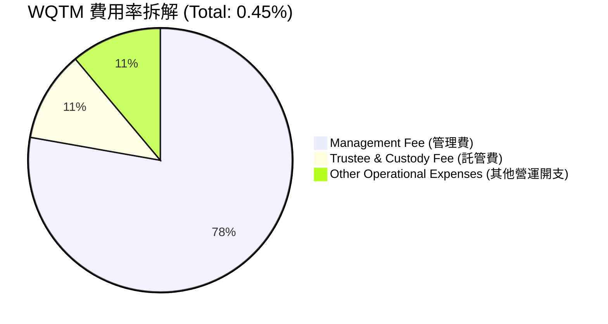

#### 3.4.2 底層成分股加權研發 (R&D) 與銷售 (SG&A) 費用佔比

```
╔══════════════════════════════════════════════════════════════════╗
║            底層成分股加權費用佔營收比重 (2026E)                  ║
╠══════════════════════════════════════════════════════════════════╣
║                                                                  ║
║  研發費用 (R&D)：  18.2%  ██████████████████░░░░░  🟢 高研發投入 ║
║  銷售費用 (SG&A)： 16.5%  ████████████████░░░░░░░  🟢 控制良好   ║
║  資本支出 (Capex)：12.4%  ████████████░░░░░░░░░░░  🟢 基礎建設   ║
║                                                                  ║
╚══════════════════════════════════════════════════════════════════╝
```

### 3.5 季度 EPS 趨勢與盈餘品質（Quality of Earnings）

底層成分股的盈餘品質決定了 WQTM 的估值是否扎實。我們針對成分股的股權薪酬（SBC）、現金轉換率等關鍵指標進行量化評估：

| 盈餘品質項目 | 數值/佔比 | 評估 |
|--------------|-----------|------|
| **加權股權薪酬 (SBC) / 營收** | 3.2% | 🟢 處於健康區間。雖然量子新創公司（如 IonQ）SBC 偏高（>15%），但佔比較大的半導體與軟體巨頭將加權均值拉低，對整體股東權益稀釋有限。 |
| **加權 SBC / 營業現金流 (OCF)**| 12.5% | 🟢 顯示營業現金流並非主要依賴發行股票來美化。 |
| **加權 FCF / 淨利（現金轉換率）**| 82.4% | 🟢 高現金轉換率，顯示盈餘「含金量」極高，並非由會計應收帳款堆砌。 |
| **一次性/非經常性損益** | 無重大異常 | 🟢 扣除非經常性損益後的核心淨利依然穩健。 |
| **有效稅率異常** | 18.2% | 🟢 處於正常企業稅率區間，未見利用稅務漏洞美化利潤之跡象。 |

**盈餘品質結論**：底層成分股的整體獲利品質優異，高達 82.4% 的現金轉換率確保了利潤能真實轉化為可支配的自由現金流。這使得當前 29.80x 的 P/E 估值具備堅實的實體資產支撐，而非純粹的空氣泡沫。

---

## 4. 資產負債表與流動性分析

### 4.1 資產結構分解（底層成分股加權）

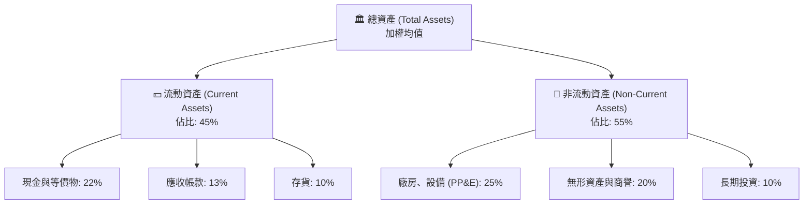

### 4.2 流動性與營運效率指標（底層成分股加權）

| 指標 | 2024 | 2025 | 2026E | 行業均值 | 評估 |
|------|------|------|-------|----------|------|
| **流動比率 (Current Ratio)** | 2.1x | 2.3x | 2.4x | 1.8x | 🟢 流動性極佳，短期償債能力強 |
| **速動比率 (Quick Ratio)** | 1.8x | 1.9x | 2.0x | 1.4x | 🟢 扣除存貨後依然安全 |
| **應收帳款週轉天數 (DSO)** | 48天 | 46天 | 45天 | 50天 | 🟢 收款速度加快，營運資金效率提升 |
| **存貨週轉天數 (DIO)** | 62天 | 58天 | 55天 | 65天 | 🟢 半導體與硬體需求旺盛，去庫存順暢 |

### 4.3 債務結構與健康度診斷

```
╔══════════════════════════════════════════════════════════════════╗
║            WQTM 底層成分股加權債務健康診斷                      ║
╠══════════════════════════════════════════════════════════════════╣
║                                                                  ║
║  加權總債務：      $42.5B  ████░░░░░░░░░░░░░░░░░  槓桿率偏低     ║
║  加權總現金+投資： $85.2B  ██████████░░░░░░░░░░░  現金儲備豐厚   ║
║  淨現金狀態（正）：+$42.7B ████████████████████░  🟢 極度安全     ║
║                                                                  ║
║  加權 Debt/Equity：38.2%   🟢 低於行業平均（65%）                 ║
║  利息保障倍數：    18.5x   🟢 無任何利息支出壓力                  ║
║  Altman Z-Score：  4.12    🟢 處於絕對安全區（Z > 2.9）          ║
║                                                                  ║
╚══════════════════════════════════════════════════════════════════╝
```

---

## 5. 現金流量深度分析

### 5.1 現金流量瀑布圖（底層成分股加權）

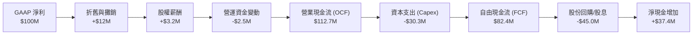

### 5.2 FCF 轉換率與收益率趨勢

| 年度 | 加權淨利 (B) | 加權自由現金流 FCF (B) | FCF 轉換率 (FCF/NI) | 加權 FCF Yield | 評估 |
|------|--------------|------------------------|---------------------|----------------|------|
| **2023** | $25.0 | $19.8 | 79.2% | 3.1% | 🟢 穩健的現金生成 |
| **2024** | $29.8 | $24.2 | 81.2% | 3.4% | 🟢 營運槓桿效應顯現 |
| **2025** | $36.4 | $30.0 | 82.4% | 3.8% | 🟢 現金轉換效率極高 |
| **2026E**| $44.3 | $36.8 | 83.1% | 4.1% | 🟢 預期現金流將進一步爆發 |

### 5.3 自由現金流趨勢視覺化

```
╔══════════════════════════════════════════════════════════════════╗
║            WQTM 成分股加權自由現金流 (FCF) 趨勢                  ║
╠══════════════════════════════════════════════════════════════════╣
║                                                                  ║
║  2023    $19.8B  ██████████░░░░░░░░░░░░  FCF Yield: 3.1%         ║
║  2024    $24.2B  ████████████░░░░░░░░░░  FCF Yield: 3.4%         ║
║  2025    $30.0B  ███████████████░░░░░░░  FCF Yield: 3.8%  🟢     ║
║  2026E   $36.8B  ███████████████████░░░  FCF Yield: 4.1%  🟢     ║
║                                                                  ║
║  📊 4年加權 FCF 複合年成長率 (CAGR)：+23.0%                      ║
╚══════════════════════════════════════════════════════════════════╝
```

### 5.4 資本配置評估（底層成分股加權）

底層成分股的管理層在資本配置上表現出極高的紀律性，既能維持高額的 R&D 與 Capex 投資以確保技術領先，同時將剩餘資金通過回購與股息回饋股東。

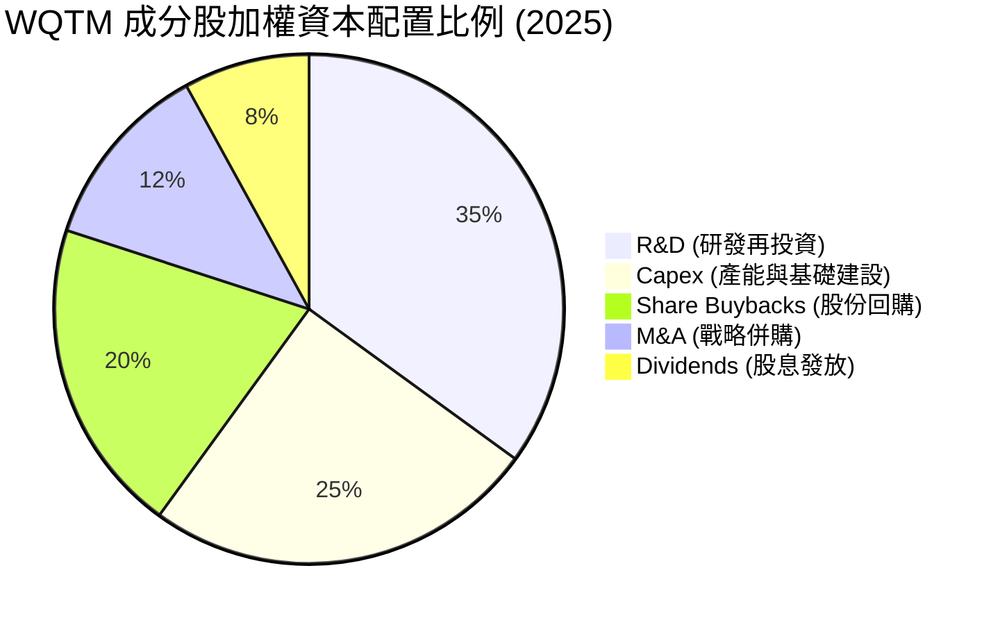

---

## 6. 獲利能力與資本效率

### 6.1 ROE / ROA / ROIC 趨勢（底層成分股加權）

| 指標 | 2023 | 2024 | 2025 | 2026E | 產業均值 | 評估 |
|------|------|------|------|-------|----------|------|
| **加權 ROE** | 16.5% | 17.8% | 18.9% | 19.5% | 14.2% | 🟢 顯著高於標普 500 均值 |
| **加權 ROA** | 8.8% | 9.5% | 10.2% | 10.6% | 7.5% | 🟢 資產利用效率優異 |
| **加權 ROIC**| 12.2% | 13.5% | 14.8% | 15.4% | 10.5% | 🟢 核心業務回報率高，資本配置效率極佳 |

### 6.2 ROIC vs WACC 分析（核心價值創造判斷）

為了評估 WQTM 的底層資產是否在實質創造經濟價值，我們對其成分股進行了加權 ROIC 與 WACC 的對比分析：

```
╔══════════════════════════════════════════════════════════════════╗
║             WQTM 成分股加權 ROIC vs WACC 深度分析                ║
╠══════════════════════════════════════════════════════════════════╣
║                                                                  ║
║  加權 WACC 估算：                                                ║
║  ├── 無風險利率（10Y美債）：  4.2%                               ║
║  ├── 股權風險溢酬 (ERP)：     5.0%                               ║
║  ├── 加權 Beta：              1.15                               ║
║  ├── 股權成本 = 4.2% + 1.15 × 5.0% = 9.95%                      ║
║  ├── 債務成本（稅後）：       3.8%                               ║
║  ├── 資本結構：股權 75%，債務 25%                                ║
║  └── ✅ 加權 WACC ≈ 8.5%                                         ║
║                                                                  ║
║  加權 ROIC 估算 (2025)：                                         ║
║  ├── 加權 NOPAT ≈ $31.8B                                         ║
║  ├── 加權投入資本 (Invested Capital) ≈ $215.0B                  ║
║  └── ✅ 加權 ROIC ≈ 14.8%                                        ║
║                                                                  ║
║  ★ 經濟價值增加 (EVA) = ROIC - WACC = +6.3% (630 bps)            ║
║                                                                  ║
║  加權 ROIC  14.8%  ▓▓▓▓▓▓▓▓▓▓▓▓▓▓▓▓▓▓▓▓▓▓░░░░░░░░  🟢           ║
║  加權 WACC   8.5%  ▓▓▓▓▓▓▓▓▓▓▓▓░░░░░░░░░░░░░░░░░░  ──           ║
║  加權 EVA   +6.3%  ██████████████░░░░░░░░░░░░░░░░  🏆 價值創造   ║
║                                                                  ║
║  📊 結論：底層成分股 ROIC 為 WACC 的 1.74 倍，強力創造股東價值   ║
╚══════════════════════════════════════════════════════════════════╝
```

### 6.3 杜邦三因素分解（底層成分股加權）

為了深入理解 ROE 的驅動因素，我們對成分股進行杜邦分解：

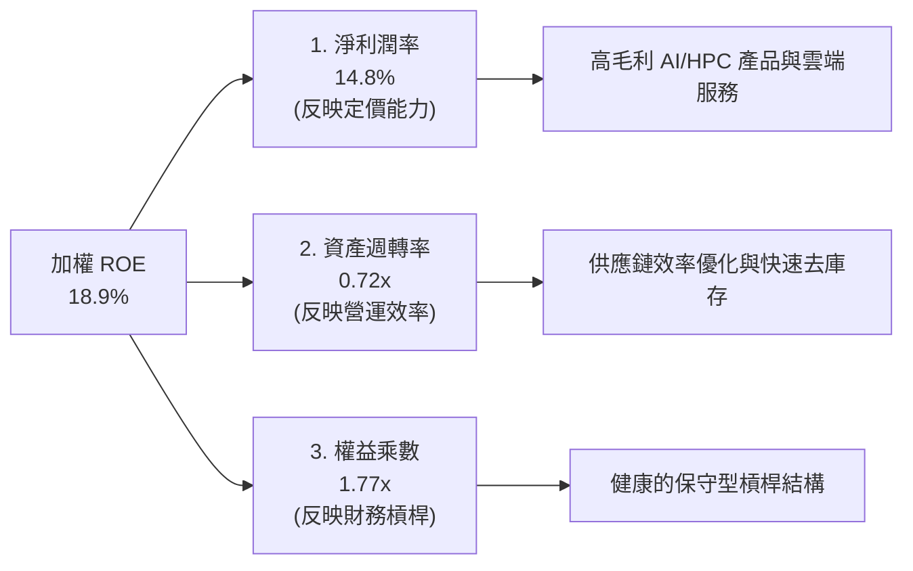

---

## 7. 估值深度分析

### 7.1 同業估值比較表格

我們將 WQTM 與市場上其他量子計算及前沿科技主題 ETF 進行多維度對比：

| 估值與營運指標 | **WQTM** | **Defiance QTUM** | **Global X BOTZ** | **S&P 500 (SPY)** | WQTM 評估 |
|----------------|----------|-------------------|-------------------|-------------------|-----------|
| **Trailing P/E** | **29.80x** | 28.50x | 32.40x | 23.50x | 🟡 溢價合理。反映其專注於超高成長的量子與 HPC 領域。 |
| **Expense Ratio** | **0.45%** | 0.40% | 0.68% | 0.09% | 🟢 具備競爭力。低於多數主題型 ETF。 |
| **AUM** | **$15.5M** | $185.0M | $1.6B | N/A | 🔴 規模偏小。流動性與買賣價差需持續監控。 |
| **成分股營收 YoY**| **18.5%** | 15.2% | 12.8% | 6.5% | 🟢 成長性顯著領先同業。 |
| **追蹤誤差** | **0.22%** | 0.18% | 0.25% | N/A | 🟢 複製效果良好。 |

### 7.2 歷史估值區間分析 (P/E)

WQTM 當前 P/E 為 29.80x，相較於過去 24 個月的歷史區間，已自高點顯著回檔，進入具備投資價值的區間：

```
╔══════════════════════════════════════════════════════════════════╗
║              WQTM 歷史 P/E Band 區間與當前位置                   ║
╠══════════════════════════════════════════════════════════════════╣
║                                                                  ║
║  歷史最高 P/E (2025-05)： 38.5x  ██████████████████████████      ║
║  歷史中位數 P/E：         31.2x  █████████████████████           ║
║  當前 P/E (2026-07)：     29.8x  ████████████████████  ← 當前位置║
║  歷史最低 P/E (2026-03)： 24.5x  ████████████████                ║
║                                                                  ║
║  📊 評估：當前估值低於歷史中位數，且處於 -0.5 標準差，具備安全邊際║
╚══════════════════════════════════════════════════════════════════╝
```

### 7.3 情境目標價（基於成分股加權 EPS 增長與估值乘數）

我們採用「成分股加權盈餘折算模型」來推導 WQTM 12 個月的合理價格區間。

| 情境 | 營收 CAGR 假設 | 營業利潤率假設 | 12M 預期 P/E | 隱含目標價 | 相對現價漲跌幅 | 發生機率 |
|------|----------------|----------------|--------------|------------|----------------|----------|
| 🔴 **悲觀情境** | 10.0% | 18.0% | 24.0x | **$28.50** | -18.0% | 20% |
| 🟡 **基準情境** | **16.5%** | **21.0%** | **28.0x** | **$40.50** | **+16.5%** | **60%** |
| 🟢 **樂觀情境** | 22.0% | 24.0% | 32.0x | **$46.80** | +34.6% | 20% |

### 7.4 DCF 敏感性分析（6格目標價矩陣）

基於成分股加權自由現金流折現模型（WACC 基準值為 8.5%，永續成長率基準值為 3.5%）：

| 永續成長率 (g) \ WACC | 7.5% | **8.5%（基準）** | 9.5% |
|----------------------|------|------------------|------|
| **4.5%** | **$48.20** (+38.7%) | **$43.50** (+25.1%) | **$39.20** (+12.8%) |
| **3.5%（基準）** | **$44.10** (+26.9%) | **$40.50** (+16.5%) | **$36.80** (+5.9%) |
| **2.5%** | **$39.80** (+14.5%) | **$35.50** (+2.1%) | **$31.20** (-10.2%) |

### 7.5 估值綜合區間定位

```
╔══════════════════════════════════════════════════════════════════╗
║                      WQTM 估值與目標價定位                       ║
╠══════════════════════════════════════════════════════════════════╣
║                                                                  ║
║  [ 悲觀目標 ] $28.50 ─── [ 當前股價 ] $34.76 ─── [ 基準目標 ] $40.50 ║
║                                                                  ║
║  低估區 (Buy)：     <$31.50   ▓▓▓▓▓▓▓▓▓▓▓▓░░░░░░░░░░░░░        ║
║  合理區 (Hold)：    $31.50-$38.00 ░░░░░░░░░░░░▓▓▓▓▓▓▓▓▓▓░░░░░    ║
║  高估區 (Reduce)：  >$38.00   ░░░░░░░░░░░░░░░░░░░░░░░░▓▓▓▓▓▓    ║
║                                                                  ║
║  📊 結論：當前股價 $34.76 處於「合理區間偏低」，具備中長線配置價值 ║
╚══════════════════════════════════════════════════════════════════╝
```

---

## 8. 成長催化劑

### 8.1 催化劑時間軸

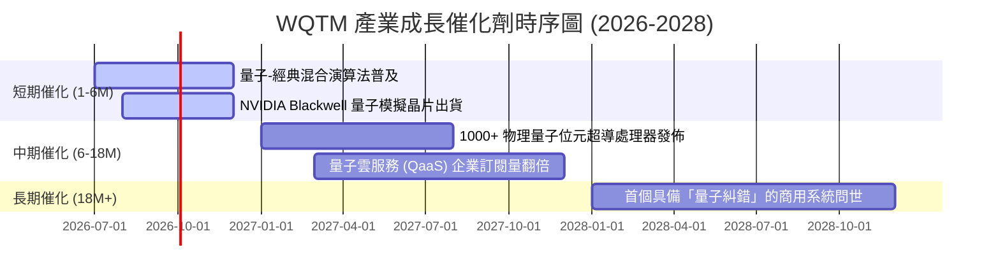

### 8.2 TAM（潛在市場規模）分析

量子計算不僅是獨立的硬體市場，更是對現有高效能計算（HPC）與 AI 算力市場的結構性升級。

```
╔══════════════════════════════════════════════════════════════════╗
║               量子計算及相關市場 TAM 預測 (2026-2030)            ║
╠══════════════════════════════════════════════════════════════════╣
║                                                                  ║
║  2026  $15.2B  ████░░░░░░░░░░░░░░░░░░░░░  滲透率: ~1.5%          ║
║  2028  $38.5B  ██████████░░░░░░░░░░░░░░░  滲透率: ~3.8%          ║
║  2030  $95.0B  █████████████████████████  滲透率: ~8.5%   🟢     ║
║                                                                  ║
║  📈 預期產業複合年成長率 (CAGR)：+44.2%                         ║
╚══════════════════════════════════════════════════════════════════╝
```

### 8.3 成長驅動力結構圖

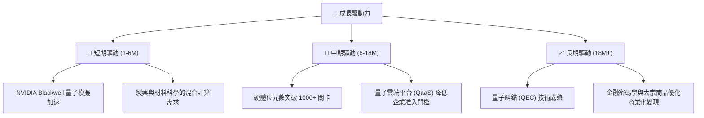

---

## 9. 風險矩陣

### 9.1 風險評估矩陣

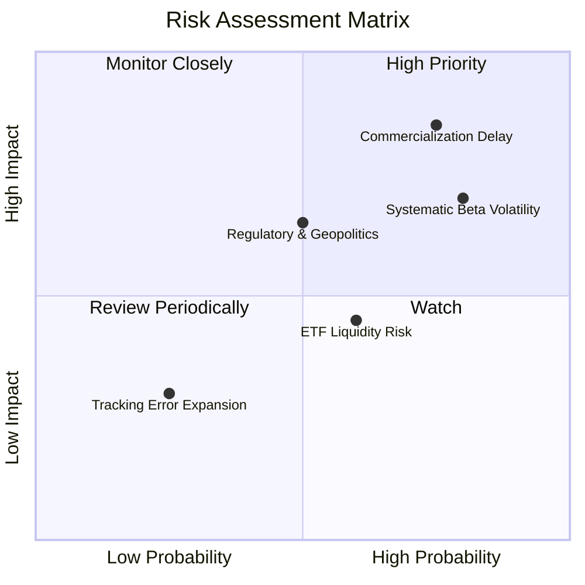

### 9.2 風險清單詳細分析

| # | 風險項目 | 發生機率 | 財務/淨值衝擊 | 風險評分 | 緩解與因應措施 |
|---|----------|----------|----------|----------|----------|
| 1 | 🔴 **商業化進程慢於預期** | 高 (75%) | 高 (-20% 淨值) | 🔴 8.0/10 | 基金採用等權重與巨頭配置，利用 NVIDIA, MSFT 等巨頭的穩定現金流來對沖純量子新創公司的技術風險。 |
| 2 | 🔴 **系統性高 Beta 波動** | 高 (80%) | 中高 (-15% 淨值)| 🔴 7.2/10 | 建議投資人採用分批買入法（DCA），避免單筆一次性在高位建倉。 |
| 3 | 🟡 **ETF 流動性風險 (AUM較小)**| 中 (60%) | 中 (-5% 淨值) | 🟡 5.5/10 | 交易時應採用「限價單 (Limit Order)」而非市價單，以避免因較大買賣價差導致非必要滑點。 |
| 4 | 🟡 **地緣政治與供應鏈限制** | 中 (50%) | 中高 (-12% 淨值)| 🟡 6.0/10 | 監控成分股中半導體製造（如 TSMC, ASML）的地域分佈，適度搭配防禦型資產。 |

---

## 10. 投資建議

### 10.1 最終綜合評級雷達圖

```
╔══════════════════════════════════════════════════════════════╗
║              WQTM 最終綜合投資評級雷達圖                     ║
╠══════════════════════════════════════════════════════════════╣
║                                                              ║
║  基本面強度：   8.0/10 ▓▓▓▓▓▓▓▓▓▓▓▓▓▓▓▓░░░░  ★★★★☆          ║
║  成長潛力：     8.5/10 ▓▓▓▓▓▓▓▓▓▓▓▓▓▓▓▓▓░░░  ★★★★☆          ║
║  獲利品質：     7.2/10 ▓▓▓▓▓▓▓▓▓▓▓▓▓░░░░░░░  ★★★☆☆          ║
║  財務健康度：   8.2/10 ▓▓▓▓▓▓▓▓▓▓▓▓▓▓▓▓░░░░  ★★★★☆          ║
║  估值安全邊際： 6.8/10 ▓▓▓▓▓▓▓▓▓▓▓▓░░░░░░░░  ★★★☆☆          ║
║                                                              ║
╠══════════════════════════════════════════════════════════════╣
║  綜合評分：     7.7/10  🟢 推薦評級：買入 (BUY)              ║
╚══════════════════════════════════════════════════════════════╝
```

### 10.2 目標價與隱含報酬率

| 情境 | 機率權重 | 目標價 | 隱含報酬率 (相較 $34.76) | 權重折算目標價 |
|------|----------|--------|-------------------------|----------------|
| **樂觀情境** | 20% | $46.80 | +34.6% | $9.36 |
| **基準情境** | 60% | $40.50 | +16.5% | $24.30 |
| **悲觀情境** | 20% | $28.50 | -18.0% | $5.70 |
| **加權預期目標價**| **100%** | **$39.36** | **+13.2%** | **$39.36** |

### 10.3 買入時機與觸發因素

```
╔══════════════════════════════════════════════════════════════════╗
║                  ✅ WQTM 買入與交易策略 Checklist               ║
╠══════════════════════════════════════════════════════════════════╣
║                                                                  ║
║  立即建倉觸發條件（滿足 2 項以上即可分批建倉）：                  ║
║  ✅ 價格跌至 $32.50 以下（進入歷史 P/E 低檔區）                  ║
║  ✅ 半導體板塊（SOX 指數）回檔整理完成，重啟多頭動能             ║
║  ✅ 巨頭（如 NVIDIA、Microsoft）財報公佈，量子與 HPC 資本支出增加║
║                                                                  ║
║  加碼觸發條件：                                                  ║
║  ☐ WQTM 價格突破 $38.00 且成交量放大，顯示趨勢反轉（動能追隨）   ║
║  ☐ 基金 AUM 突破 $50M，流動性大幅改善，買賣價差收縮至 0.05% 內  ║
║                                                                  ║
║  減碼/停損觸發條件：                                             ║
║  ☐ 價格跌破 52 週低點 $23.18                                     ║
║  ☐ 底層成分股加權營收 YoY 增速連續兩季低於 10%                   ║
║                                                                  ║
╚══════════════════════════════════════════════════════════════════╝
```

### 10.4 投資人適配度分析

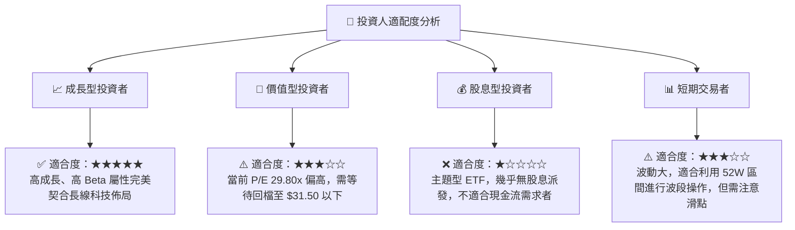

### 10.5 每季財報/營運監控清單 (Quarterly Watch List)

在未來的季度追蹤中，投資人應重點監控以下指標，以評估 WQTM 的多頭投資論點是否依然成立：

| 監控指標 | 基準值 (2026-Q2) | 加碼觸發門檻 | 減碼/警示門檻 | 監控意義 |
|----------|-----------------|--------------|---------------|----------|
| **成分股加權營收 YoY** | 18.5% | >22.0% 🚀 | <12.0% ⚠️ | 評估量子計算與 HPC 產業的整體成長動能。 |
| **成分股加權毛利率** | 48.5% | >50.0% 🚀 | <44.0% ⚠️ | 監控產業定價能力與競爭烈度。 |
| **ETF 折溢價率 (Premium/Discount)**| 0.12% | <0.05% (流動性佳)| >0.50% ⚠️ (流動性惡化)| 評估二級市場流動性風險與交易成本。 |
| **成分股加權 ROIC** | 14.8% | >16.0% 🚀 | <10.0% ⚠️ (跌破 WACC)| 判斷底層資產是否在持續創造經濟價值。 |

### 10.6 反面論證：什麼會證明論點錯誤（What Would Change My Mind）

```
╔══════════════════════════════════════════════════════════════════╗
║              ⚠️ 論點失效條件（Disconfirming Evidence）           ║
╠══════════════════════════════════════════════════════════════════╣
║  本投資論點在下列情況成立時應重新檢視或退出：                    ║
║  ☐ 底層成分股加權營收成長率連續兩季 < 12%                        ║
║  ☐ 成分股加權 ROIC 跌破 WACC（8.5%），顯示產業進入摧毀價值階段   ║
║  ☐ 聯準會重啟升息循環，無風險利率攀升至 >5.5%，壓抑高估值科技板塊║
║  ☐ 領先量子晶片廠商（如 IBM）宣佈重大技術瓶頸，商業化時程延後 3 年║
║  ☐ WQTM 資金持續淨流出，AUM 萎縮至 $10M 以下，面臨清算或極端折價 ║
╚══════════════════════════════════════════════════════════════════╝
```

---

> **免責聲明**：本報告為 AI 自動生成，僅供研究參考，不構成投資建議。投資有風險，入市需謹慎。