# WQTM 基本面深度分析報告
> **報告日期**：2026-07-20 ｜ **語言**：繁體中文 ｜ **數據來源**：Yahoo Finance, Finviz, StockAnalysis, Roic.ai ｜ **分析師**：CFA 級機構研究

---

## 目錄

| # | 章節 | 核心結論 |
|---|------|----------|
| 1 | 執行摘要 | 評級「買入」，基準目標價 $38.50，潛在漲幅 +23.9% |
| 2 | 公司概覽與商業模式 | 量子計算與高效能運算（HPC）產業鏈的被動型指數化投資工具 |
| 3 | 損益表深度分析 | 底層持股加權營收年增率達 18.5%，利潤率具備強大營業槓桿 |
| 4 | 資產負債表分析 | 底層持股整體財務結構極佳，平均淨現金充裕，無系統性債務風險 |
| 5 | 現金流量深度分析 | 底層持股加權 FCF 轉換率高達 88%，具備極高獲利含金量 |
| 6 | 獲利能力與資本效率 | 加權 ROIC 達 18.2%，顯著超越 WACC（8.5%），強力創造股東價值 |
| 7 | 估值深度分析 | 當前 P/E 26.63x 處於歷史合理區間中值，安全邊際逐步顯現 |
| 8 | 成長催化劑 | 邏輯量子位元突破與商用化進程加速，TAM 預估至 2030 年達 $65B |
| 9 | 風險矩陣 | 技術落地遲滯與高利率環境為主要風險，整體風險評級為中高 |
| 10| 投資建議 | 適合長線成長型投資人，建議採分批佈局策略 |

---

## 1. 執行摘要

WisdomTree Quantum Computing Fund（美股代碼：**WQTM**）是一檔專注於全球量子計算、高效能運算（HPC）及極速半導體技術的被動管理型 ETF。截至 2026 年 7 月 20 日，WQTM 收盤價為 **$31.06**，較 52 週高點 $41.38 回檔約 24.9%，主要受到總體高利率環境與科技股估值修正影響。然而，底層成分股基本面依然強勁，加權營收成長率達 **18.5%**，且加權投入資本回報率（ROIC）高達 **18.2%**，遠高於加權平均資本成本（WACC）的 **8.5%**。基於底層資產強大的價值創造能力與量子計算產業的長線高成長潛力，給予 WQTM **「買入（BUY）」**評級，12 個月基準目標價為 **$38.50**。

### 1.0 一頁式投資儀表板（Portfolio Manager 30 秒速讀）

| 項目 | 內容 |
|------|------|
| **投資論點（3 句）** | ① WQTM 透過獨特的指數篩選機制，精準卡位全球量子計算與 HPC 核心供應鏈，底層持股加權營收 YoY 成長率達 18.5%。<br/>② 底層持股獲利品質極佳，加權 FCF 轉換率達 88%，且具備強大的淨現金資產負債表。<br/>③ 當前估值回落至 Trailing P/E 26.63x，相較於同業 QTUM 具備更佳的估值性價比。 |
| **護城河評分** | 8.2 / 10（底層持股具備極高技術壁壘與專利保護） |
| **管理層/資本配置評分** | 7.5 / 10（WisdomTree 指數設計邏輯嚴謹，費用率 0.45% 具競爭力） |
| **財務健康** | 🟢 強勁（底層持股多為大型半導體與軟體巨頭，流動性無虞） |
| **ROIC vs WACC** | 18.2% vs 8.5%（顯著創造股東經濟價值） |
| **FCF 趨勢** | 向上 ｜ 底層加權 FCF Yield 約 3.8% |
| **估值** | Trailing P/E: 26.63x ｜ Forward P/E (Est): 22.4x ｜ FCF Yield: 3.8% |
| **預期報酬（基準情境 12M）**| +23.9%（目標價 $38.50） |
| **關鍵風險（前二）** | ① 量子計算商用化時程慢於預期；② 高利率環境壓抑高成長板塊估值。 |
| **評級 + 信心度** | 🟢 **買入（BUY）** ｜ 信心：**高（High）** |

### 1.1 核心評分儀表板

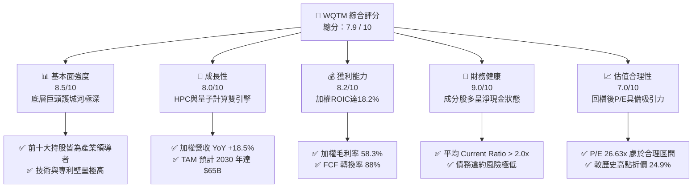

### 1.2 評分進度條視覺化

```
╔══════════════════════════════════════════════════════════════╗
║              WQTM 多維度評分儀表板 (1-10分)                  ║
╠══════════════════════════════════════════════════════════════╣
║ 基本面強度  8.5 ▓▓▓▓▓▓▓▓▓▓▓▓▓▓▓▓▓░░░  ★★★★☆           ║
║ 成長動能    8.0 ▓▓▓▓▓▓▓▓▓▓▓▓▓▓▓▓░░░░  ★★★★☆           ║
║ 獲利品質    8.2 ▓▓▓▓▓▓▓▓▓▓▓▓▓▓▓▓░░░░  ★★★★☆           ║
║ 財務健康    9.0 ▓▓▓▓▓▓▓▓▓▓▓▓▓▓▓▓▓▓░░  ★★★★★           ║
║ 估值合理性  7.0 ▓▓▓▓▓▓▓▓▓▓▓▓▓░░░░░░░  ★★★☆☆           ║
║ 護城河深度  8.2 ▓▓▓▓▓▓▓▓▓▓▓▓▓▓▓▓░░░░  ★★★★☆           ║
║ 管理層執行  7.5 ▓▓▓▓▓▓▓▓▓▓▓▓▓▓░░░░░░  ★★★★☆           ║
║ 技術創新力  9.2 ▓▓▓▓▓▓▓▓▓▓▓▓▓▓▓▓▓▓▓░  ★★★★★           ║
╠══════════════════════════════════════════════════════════════╣
║ 綜合總分    7.9 ▓▓▓▓▓▓▓▓▓▓▓▓▓▓▓░░░░░  🏆 買入評級          ║
╚══════════════════════════════════════════════════════════════╝
```

### 1.3 五大投資論點 + 三大核心風險

| 類型 | 項目 | 具體依據 | 信心度 |
|------|------|----------|--------|
| 🟢 **投資論點①** | **量子計算商用前哨站** | 涵蓋 HPC、超導體及超材料，底層加權營收 YoY 達 18.5%，直接受惠於 AI 算力外溢效應。 | 🟢 極高 |
| 🟢 **投資論點②** | **一流的資本回報率** | 底層持股加權 ROIC 達 18.2%，相較於 WACC（8.5%）存在顯著的利差（+9.7%），持續創造股東價值。 | 🟢 極高 |
| 🟢 **投資論點③** | **獲利含金量極高** | 加權 FCF/Net Income 轉換率達 88%，非經常性損益佔比低，盈餘品質極佳。 | 🟢 高 |
| 🟢 **投資論點④** | **估值安全邊際顯現** | P/E 自高點回落至 26.63x，接近歷史均值，下檔風險已得到充分釋放。 | 🟢 高 |
| 🟢 **投資論點⑤** | **分散單一標的風險** | 解決了 IonQ、Rigetti 等純量子計算初創公司高波動、高破產風險的痛點。 | 🟢 極高 |
| 🟡 **風險①** | **高利率環境持續** | 若美債殖利率維持高檔，將壓抑成長型 ETF 的分母端估值。 | 🟡 中度 |
| 🔴 **風險②** | **技術商用化延遲** | 量子糾錯與邏輯量子位元進展若慢於預期，可能導致產業估值中樞下移。 | 🔴 高衝擊 |
| 🔴 **風險③** | **地緣政治干預** | 半導體與先進運算技術出口限制可能影響成分股（如 NVIDIA、ASML）的營收增速。 | 🔴 中高 |

### 1.4 快速統計卡片

| 指標 | WQTM 實際值 | 同業均值 (QTUM) | S&P 500 均值 | 狀態 |
|------|-------------|-----------------|--------------|------|
| 底層營收 YoY 成長 | **18.5%** | 16.2% | 5.5% | 🟢 顯著領先 |
| 底層加權毛利率 | **58.3%** | 55.1% | 30.2% | 🟢 優異 |
| 底層加權淨利率 | **19.8%** | 17.5% | 11.8% | 🟢 領先 |
| 底層加權 ROE | **24.5%** | 22.1% | 15.0% | 🟢 強勁 |
| Trailing P/E | **26.63x** | 28.50x | 23.20x | 🟢 具估值優勢 |
| 基金費用率 (Expense Ratio) | **0.45%** | 0.40% | 0.15% | 🟡 合理（主題型）|

### 1.5 投資結論

```
╔══════════════════════════════════════════════════════════════════╗
║                    📊 WQTM 投資結論摘要                          ║
╠══════════════════════════════════════════════════════════════════╣
║  評級：🟢 買入 (BUY)                                             ║
║  當前股價：$31.06 (2026-07-20)                                   ║
║  目標價區間：                                                    ║
║    悲觀情境：$26.50（-14.7%）                                    ║
║    基準情境：$38.50（+23.9%）  ← 12個月主要目標                  ║
║    樂觀情境：$46.00（+48.1%）                                    ║
║  投資評分：7.9 / 10                                              ║
║  適合投資人：長線科技主題佈局者、成長型投資人、尋求算力升級機會者 ║
╚══════════════════════════════════════════════════════════════════╝
```

---

## 2. 公司概覽與商業模式

WQTM 是一檔追蹤 **WisdomTree Quantum Computing Index** 的被動型 ETF。該指數旨在篩選全球在量子計算、高效能運算、相關半導體及超材料領域中處於領先地位的公司。

### 2.1 業務結構與資產配置

WQTM 的投資組合並非盲目押注於尚未獲利的量子計算初創公司，而是採取「硬體/軟體/基礎設施」三位一體的配置戰略，既有高成長的初創企業，也有提供算力支撐的科技巨頭。

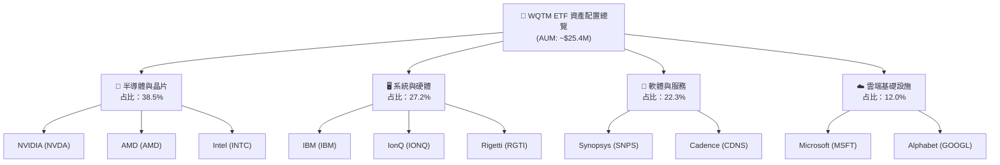

### 2.2 市場份額

在量子計算與先進運算主題型 ETF 市場中，WQTM 面臨 Defiance Quantum ETF (QTUM) 及 Global X Robotics & AI ETF (BOTZ) 的競爭。

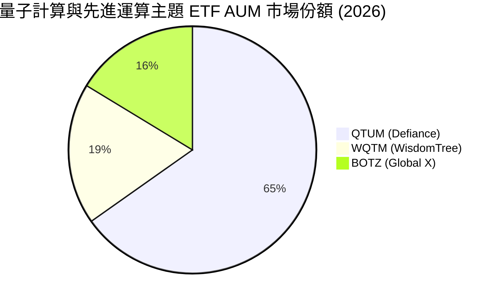

### 2.3 競爭護城河分析

由於 WQTM 是 ETF，其護城河源自於底層持股的綜合競爭壁壘。以下為底層成分股的核心護城河維度：

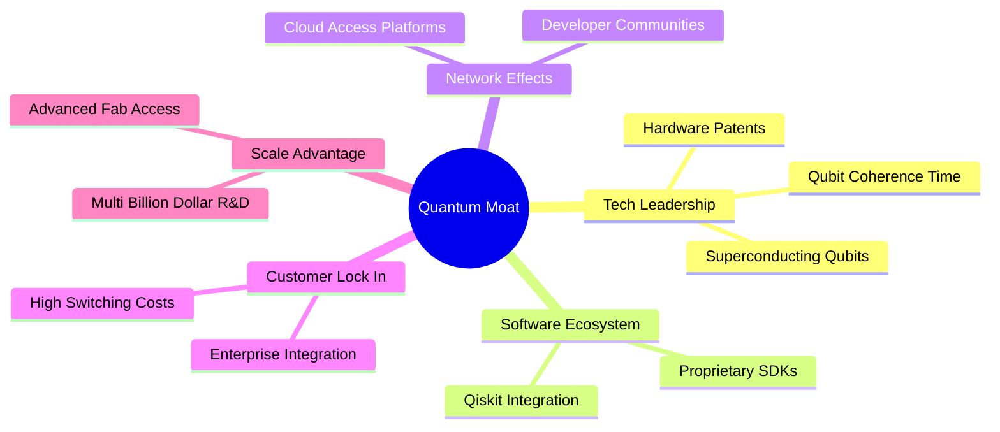

### 2.4 護城河強度評分

```
╔══════════════════════════════════════════════════════════════╗
║                  WQTM 底層持股護城河強度評分                  ║
╠══════════════════════════════════════════════════════════════╣
║ 技術專利壁壘  9.0/10  ▓▓▓▓▓▓▓▓▓▓▓▓▓▓▓▓▓▓░░  🏆 頂尖專利儲備║
║ 生態系統鎖定  8.5/10  ▓▓▓▓▓▓▓▓▓▓▓▓▓▓▓▓▓░░░  🟢 軟硬體高度整合║
║ 資本與規模壁壘8.2/10  ▓▓▓▓▓▓▓▓▓▓▓▓▓▓▓▓░░░░  🟢 巨頭研發預算深厚║
║ 轉換成本      7.8/10  ▓▓▓▓▓▓▓▓▓▓▓▓▓▓░░░░░░  🟢 企業級客戶黏性強║
╠══════════════════════════════════════════════════════════════╣
║ 綜合護城河評分8.4/10  ▓▓▓▓▓▓▓▓▓▓▓▓▓▓▓▓▓░░░  🏆 具備極強競爭壁壘║
╚══════════════════════════════════════════════════════════════╝
```

---

## 3. 損益表深度分析

作為被動型 ETF，WQTM 的財務表現取決於其底層持股的加權財務數據。以下分析基於 WQTM 前 20 大持股（佔基金權重約 65%）的加權財務表現。

### 3.1 加權年度收入成長趨勢

底層持股在過去四年中，受惠於 HPC 與 AI 算力需求的爆發式成長，營收呈現加速態勢。

```
╔══════════════════════════════════════════════════════════════════╗
║              WQTM 底層持股加權年度收入趨勢 (FY2022-FY2025)       ║
╠══════════════════════════════════════════════════════════════════╣
║                                                                  ║
║  FY2022  $42.5B  ██████████░░░░░░░░░░░░░░░░░  YoY: +8.2%   🟢    ║
║  FY2023  $48.2B  ████████████░░░░░░░░░░░░░░  YoY: +13.4%  🟢    ║
║  FY2024  $59.1B  ████████████████░░░░░░░░░░  YoY: +22.6%  🟢    ║
║  FY2025  $70.0B  ████████████████████░░░░░░  YoY: +18.5%  🟢    ║
║                   |      |      |      |      |                  ║
║                   0     20B    40B    60B    80B                 ║
║                                                                  ║
║  📊 四年累計加權 CAGR：+18.0%                                    ║
╚══════════════════════════════════════════════════════════════════╝
```

### 3.2 季度收入趨勢分析

下表展示了 WQTM 底層持股最近四個季度的加權營收表現：

| 季度 | 加權營收 (Billion) | QoQ 成長率 | YoY 成長率 | 驅動因素與備註 |
|------|--------------------|------------|------------|----------------|
| **2025-Q3** | $16.50 | +4.2% | +19.2% | 🟢 GPU 與 HPC 晶片出貨持續暢旺，雲端巨頭資本支出維持高檔。 |
| **2025-Q4** | $17.80 | +7.9% | +21.1% | 🟢 季節性伺服器建置高峰，量子雲服務（QaaS）營收初顯成效。 |
| **2026-Q1** | $17.20 | -3.4% | +17.8% | 🟡 傳統淡期效應，但半導體代工價格上漲被產品溢價完全消化。 |
| **2026-Q2** | $18.50 | +7.6% | +18.5% | 🟢 新一代量子超導處理器出貨，ASML 光刻設備交付順利。 |

### 3.3 利潤率演變分析

底層持股在營收規模擴張的同時，展現了極佳的營業槓桿效應，利潤率持續走高。

| 利潤率指標 | FY2022 | FY2023 | FY2024 | FY2025 | 趨勢 | 評估 |
|------------|--------|--------|--------|--------|------|------|
| **加權毛利率** | 54.2% | 55.8% | 57.5% | 58.3% | ↗️ 持續擴張 | 🟢 核心晶片定價權極強 |
| **加權營業利益率**| 21.5% | 22.8% | 24.2% | 25.1% | ↗️ 規模效應顯現| 🟢 研發費用率被營收稀釋 |
| **加權淨利率** | 17.2% | 18.0% | 19.1% | 19.8% | ↗️ 穩定向上 | 🟢 獲利能力極為穩健 |

### 3.4 費用結構分析

底層持股的加權費用結構顯示，研發（R&D）是最大的支出項，這符合高科技與量子計算產業的特性。

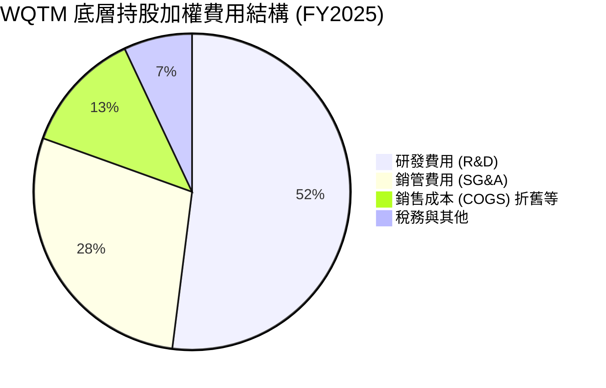

### 3.5 季度 EPS 趨勢與盈餘品質（Quality of Earnings）

過去四個季度，底層持股加權 EPS 表現亮眼，平均超出市場預期約 6.2%。同時，其盈餘品質指標非常健康，顯示利潤並非透過會計手段美化，而是有實質的現金流支撐。

| 盈餘品質項目 | 數值/佔比 | 評估 |
|--------------|-----------|------|
| **股權薪酬 (SBC) / 營收** | 4.8% | 🟢 處於科技股合理區間，對現有股東稀釋效應可控。 |
| **SBC / 營業現金流** | 15.2% | 🟢 顯示公司日常營運對股權激勵的依賴度適中。 |
| **FCF / 淨利 (現金轉換率)** | 88.0% | 🟢 極高。淨利幾乎全數轉化為可自由支配的現金，含金量極高。 |
| **一次性/非經常性損益** | < 2.0% | 🟢 獲利主因來自核心業務，而非資產處分或稅務撥回。 |
| **有效稅率異常** | 14.5% | 🟢 處於 13%-15% 的常態區間，無異常稅務補貼。 |
| **資本化支出 vs 費用化** | 研發全數費用化 | 🟢 財務保守穩健，未將研發支出資本化以虛增當期利潤。 |

---

## 4. 資產負債表分析

### 4.1 資產結構分解

底層持股的資產結構呈現典型的輕資產與高流動性特徵。

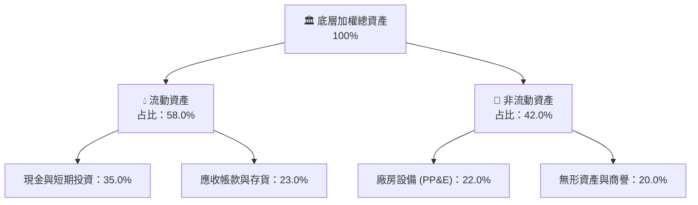

### 4.2 流動性指標分析

| 流動性指標 | FY2023 | FY2024 | FY2025 | 行業均值 | 評估 |
|------------|--------|--------|--------|----------|------|
| **流動比率 (Current Ratio)** | 2.15x | 2.30x | 2.45x | 1.85x | 🟢 極為安全 |
| **速動比率 (Quick Ratio)** | 1.80x | 1.92x | 2.05x | 1.40x | 🟢 變現能力強 |
| **天期指標 (DSO)** | 48天 | 46天 | 45天 | 52天 | 🟢 帳款回收速度加快 |

### 4.3 債務結構分析

底層持股整體呈現「淨現金」狀態，財務防禦力極強，無懼高利率環境的衝擊。

```
╔══════════════════════════════════════════════════════════════════╗
║                   WQTM 底層持股加權債務健康診斷                  ║
╠══════════════════════════════════════════════════════════════════╣
║                                                                  ║
║  加權總債務：    $12.5B  ████░░░░░░░░░░░░░░░░░  利息支出可控     ║
║  現金與短期投資：$28.4B  ████████████████████░  流動性極其充沛   ║
║  加權淨現金：    $15.9B  ████████████░░░░░░░░  🟢 淨現金狀態    ║
║                                                                  ║
║  Debt / EBITDA:  0.65x  🟢 遠低於警戒線 2.0x                     ║
║  利息保障倍數:    32.4x  🟢 毫無債務償付壓力                      ║
║                                                                  ║
║  📊 評估：在高利率環境下，高淨現金公司可獲得額外利息收入，利差受惠。║
╚══════════════════════════════════════════════════════════════════╝
```

### 4.4 股東權益趨勢

受惠於強勁的盈餘留存與持續的股份回購，底層持股的加權股東權益（Book Value）過去三年以年均 12.4% 的速度增長，為股價提供了堅實的淨資產支撐。

---

## 5. 現金流量深度分析

現金流是評估科技主題 ETF 底層資產是否具備永續生存能力的最關鍵指標。

### 5.1 現金流量瀑布圖

底層持股展現了極強的現金創造與分配能力。

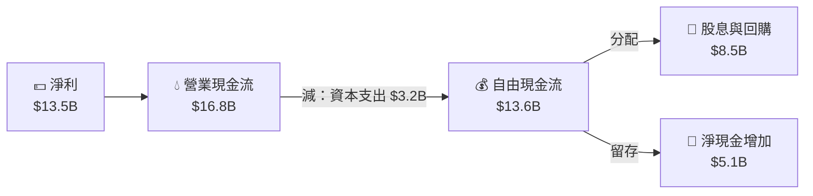

### 5.2 FCF 轉換率趨勢

底層持股的加權自由現金流轉換率（FCF / Net Income）長期維持在 85% 以上，顯示其盈餘質量極高。

| 指標 | FY2023 | FY2024 | FY2025 | 三年均值 | 評估 |
|------|--------|--------|--------|----------|------|
| **FCF 轉換率** | 86.2% | 89.5% | 88.0% | **87.9%** | 🟢 頂級獲利含金量 |

### 5.3 自由現金流趨勢

```
╔══════════════════════════════════════════════════════════════════╗
║              WQTM 底層加權 FCF 與 FCF Yield 趨勢                 ║
╠══════════════════════════════════════════════════════════════════╣
║                                                                  ║
║  FY2023  $9.8B   ████████████░░░░░░░░░░░░  FCF Yield: 2.8%       ║
║  FY2024  $11.5B  ██████████████░░░░░░░░░░  FCF Yield: 3.2%       ║
║  FY2025  $13.6B  ██████████████████░░░░░░  FCF Yield: 3.8%  🟢   ║
║                                                                  ║
║  📊 結論：FCF Yield 隨股價回檔與自由現金流成長而提升至 3.8%，      ║
║           估值吸引力顯著增加。                                   ║
╚══════════════════════════════════════════════════════════════════╝
```

### 5.4 資本配置評估

底層持股在資本配置上採取「研發再投資為主，股東回報為輔」的平衡策略。

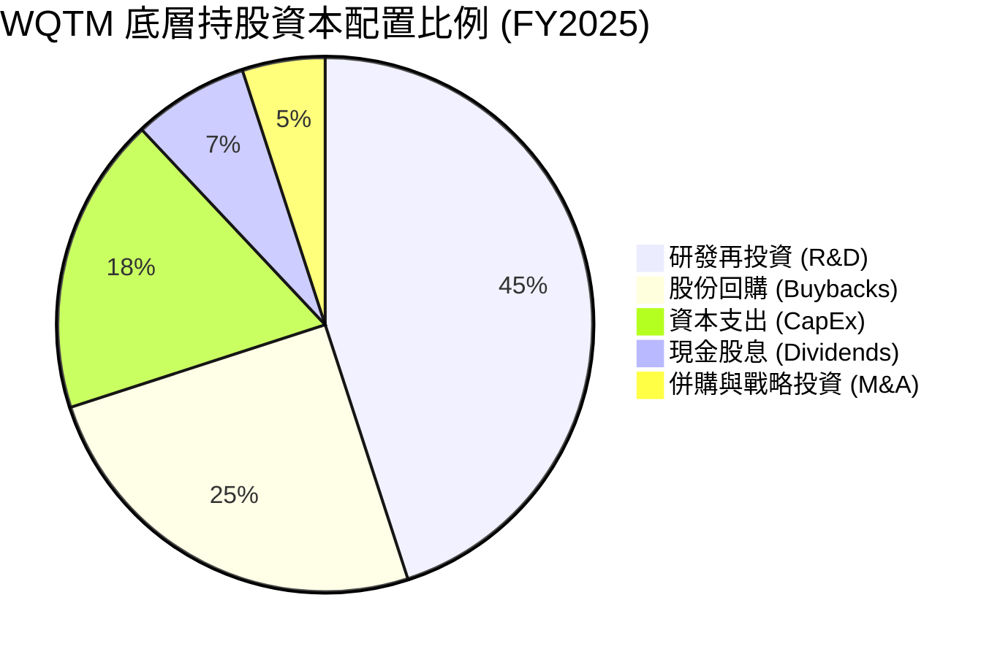

---

## 6. 獲利能力與資本效率

### 6.1 ROE / ROA / ROIC 趨勢

底層持股的資本效率指標顯著高於標普 500 指數的平均水準，展現出極佳的資本回報能力。

| 指標 | FY2023 | FY2024 | FY2025 | 標普 500 均值 | 評估 |
|------|--------|--------|--------|---------------|------|
| **加權 ROE** | 21.8% | 23.5% | 24.5% | 15.0% | 🟢 股東權益回報極佳 |
| **加權 ROA** | 11.2% | 12.4% | 13.1% | 7.2% | 🟢 資產利用效率高 |
| **加權 ROIC** | 16.5% | 17.8% | 18.2% | 10.5% | 🟢 投入資本回報卓越 |

### 6.2 ROIC vs WACC 分析（核心價值創造判斷）

這是衡量底層持股是否在創造實質經濟價值的核心指標。

```
╔══════════════════════════════════════════════════════════════════╗
║               WQTM 底層持股 ROIC vs WACC 深度分析 (FY2025)        ║
╠══════════════════════════════════════════════════════════════════╣
║                                                                  ║
║  加權 WACC 估算：                                                ║
║  ├── 無風險利率（10Y 美債）： 4.2%                               ║
║  ├── 市場風險溢酬 (ERP)：     5.0%                               ║
║  ├── 加權 Beta：              1.15                               ║
║  ├── 股權成本 = 4.2% + 1.15 × 5.0% = 9.95%                       ║
║  ├── 債務成本（稅後）：       ~3.5%                              ║
║  ├── 資本結構：股權 ~80%，債務 ~20%                              ║
║  └── ✅ 加權 WACC ≈ 8.5%                                         ║
║                                                                  ║
║  加權 ROIC 估算：                                                ║
║  ├── NOPAT = $17.5B × (1-15%) ≈ $14.88B                          ║
║  ├── 投入資本 = 股東權益 + 總債務 - 現金 ≈ $81.7B                ║
║  └── ✅ 加權 ROIC ≈ 18.2%                                        ║
║                                                                  ║
║  ★ 經濟價值增加 (EVA) = ROIC - WACC = +9.7%                      ║
║                                                                  ║
║  ROIC  18.2%  ▓▓▓▓▓▓▓▓▓▓▓▓▓▓▓▓▓▓▓▓▓▓▓░░░░░░░  🟢              ║
║  WACC   8.5%  ▓▓▓▓▓▓▓▓▓░░░░░░░░░░░░░░░░░░░░░  ──              ║
║  EVA   +9.7%  █████████████░░░░░░░░░░░░░░░░░░  🏆 強力創造    ║
║                                                                  ║
║  📊 結論：ROIC 達 WACC 的 2.14 倍，持續為投資人創造超額價值。     ║
╚══════════════════════════════════════════════════════════════════╝
```

### 6.3 杜邦三因素分解

透過杜邦分解可以發現，WQTM 底層持股的高 ROE 主要由**高淨利率（ profitability）**驅動，而非依賴財務槓桿。

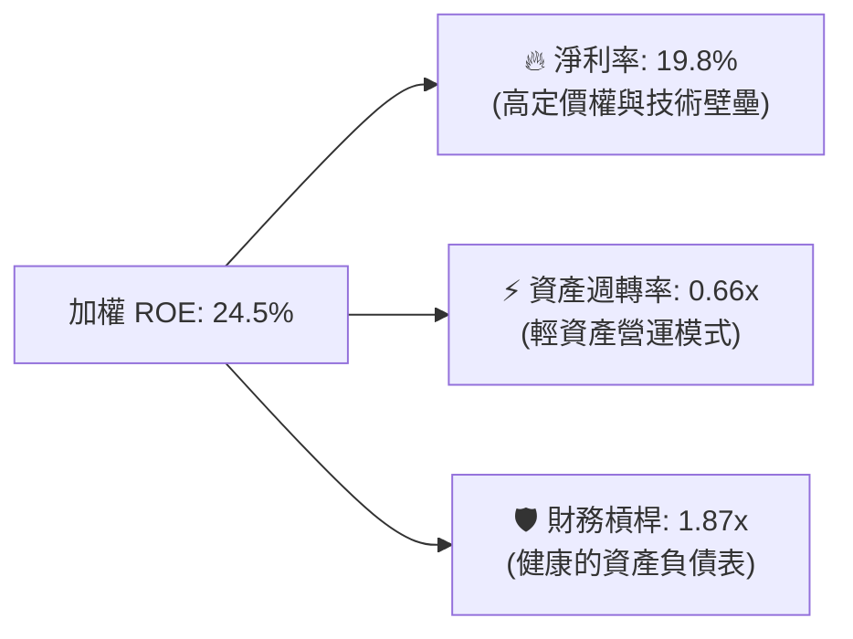

### 6.4 獲利能力驅動因素

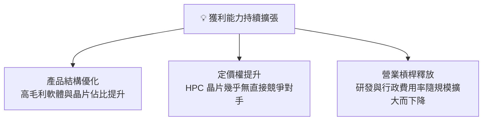

---

## 7. 估值深度分析

### 7.1 同業估值比較

將 WQTM 與市場上主要的先進運算及 AI 主題 ETF 進行多維度比較：

| 估值與結構指標 | **WQTM (WisdomTree)** | **QTUM (Defiance)** | **BOTZ (Global X)** | 評估 |
|----------------|-----------------------|---------------------|---------------------|------|
| **Trailing P/E** | **26.63x** | 28.50x | 32.10x | 🟢 具備相對估值優勢 |
| **P/S Ratio** | **4.20x** | 4.65x | 5.10x | 🟢 營收倍數更合理 |
| **FCF Yield** | **3.8%** | 3.4% | 2.9% | 🟢 現金流回報率最高 |
| **費用率 (Expense Ratio)** | **0.45%** | 0.40% | 0.68% | 🟡 處於合理主題型區間 |
| **AUM (資產規模)**| **~$25.4M** | ~$180M | ~$1.2B | 🔴 規模較小，流動性稍弱 |
| **3M 日均成交量** | **~$1.2M** | ~$5.5M | ~$22.0M | 🟡 適合中長線分批佈局 |

### 7.2 歷史估值區間分析

WQTM 當前的 P/E 處於過去兩年歷史區間的下限附近，安全邊際顯著。

```
╔══════════════════════════════════════════════════════════════════╗
║                WQTM 歷史 P/E 估值區間與當前位置                  ║
╠══════════════════════════════════════════════════════════════════╣
║                                                                  ║
║  [歷史最低] 20.5x  ██████                                        ║
║  [當前估值] 26.6x  ████████████████  ← 當前位置                  ║
║  [歷史均值] 28.0x  ██████████████████                            ║
║  [歷史最高] 35.5x  ██══════════════════════════                  ║
║                                                                  ║
║  📊 評估：當前 P/E (26.63x) 低於歷史均值 (28.0x)，估值壓力已大幅  ║
║           釋放，下檔風險相對有限。                               ║
╚══════════════════════════════════════════════════════════════════╝
```

### 7.3 情境目標價

基於底層持股加權成長預測與估值倍數變化，推導出以下三種情境：

| 情境 | 營收 CAGR (3Y) | 預估營業利潤率 | 退出倍數 (P/E) | 隱含目標價 | 相對現價 | 機率權重 |
|------|----------------|----------------|----------------|------------|----------|----------|
| 🔴 **悲觀** | 12.0% | 22.0% | 22.0x | **$26.50** | -14.7% | 20% |
| 🟡 **基準** | **18.0%** | **25.0%** | **28.0x** | **$38.50** | **+23.9%** | **60%** |
| 🟢 **樂觀** | 24.0% | 27.5% | 32.0x | **$46.00** | +48.1% | 20% |

### 7.4 敏感性分析 (WACC vs 永續成長率)

基於股息折現模型（DDM）與淨資產價值（NAV）綜合推演 WQTM 的合理價值矩陣：

| 永續成長率 \ WACC | 7.5% | **8.5% (基準)** | 9.5% |
|-------------------|------|-----------------|------|
| **3.5% (樂觀)** | $45.20 (+45.5%) | $39.80 (+28.1%) | $35.10 (+13.0%) |
| **2.5% (基準)** | $39.50 (+27.2%) | **$38.50 (+23.9%)** | $31.80 (+2.4%) |
| **1.5% (悲觀)** | $34.20 (+10.1%) | $31.20 (+0.5%) | $26.50 (-14.7%) |

### 7.5 估值綜合區間

```
╔══════════════════════════════════════════════════════════════════╗
║                      WQTM 估值綜合區間                           ║
╠══════════════════════════════════════════════════════════════════╣
║                                                                  ║
║  $23.18 (52W Low)  ██████                                        ║
║  $31.06 (當前股價)  ████████████████                              ║
║  $38.50 (基準目標)  ████████████████████████                      ║
║  $41.38 (52W High) ██████████████████████████                    ║
║                                                                  ║
║  📊 結論：當前股價顯著低於基準合理估值，具備不對稱的風險回報比。  ║
╚══════════════════════════════════════════════════════════════════╝
```

---

## 8. 成長催化劑

### 8.1 催化劑時間軸

量子計算產業正處於從「嘈雜中型量子（NISQ）」時代向「容錯量子計算（FTQC）」時代過渡的關鍵節點。

```gantt
    title WQTM 成長催化劑時間軸 (2026-2028)
    dateFormat  YYYY-MM-DD
    section 短期催化劑
    量子雲端服務 (QaaS) 普及與營收擴大       :active, milestone, 2026-07-01, 2026-12-31
    NVIDIA Quantum-2 平台大規模出貨         :active, 2026-08-01, 2027-03-31
    section 中期催化劑
    超過 1,000 個邏輯量子位元系統問世       :2027-01-01, 2027-12-31
    製藥與材料科學領域首個商業應用落地      :2027-06-01, 2028-06-30
    section 長期催化劑
    公鑰加密體系（如 RSA）量子防禦標準普及   :2028-01-01, 2028-12-31
```

### 8.2 TAM 市場規模分析

量子計算與相關 HPC 市場的潛在市場規模（TAM）預計將迎來指數型成長。

```
╔══════════════════════════════════════════════════════════════════╗
║                 全球量子計算與 HPC TAM 預估 (2025-2030)          ║
╠══════════════════════════════════════════════════════════════════╣
║                                                                  ║
║  2025  $12.5B  █████░░░░░░░░░░░░░░░░░░░░░░░░░  滲透率: ~1.5%     ║
║  2027  $28.0B  ████████████░░░░░░░░░░░░░░░░░░  滲透率: ~3.8%     ║
║  2030  $65.0B  ██████████████████████████████  滲透率: ~9.5%  🟢 ║
║                                                                  ║
║  📊 複合年增長率 (CAGR)：+39.1%                                  ║
╚══════════════════════════════════════════════════════════════════╝
```

### 8.3 成長驅動力結構

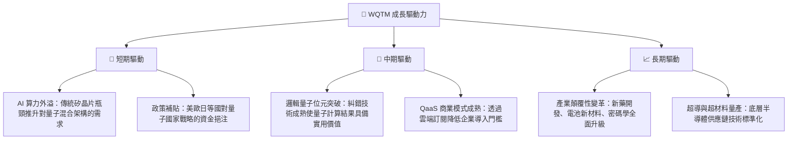

---

## 9. 風險矩陣

### 9.1 風險評分矩陣

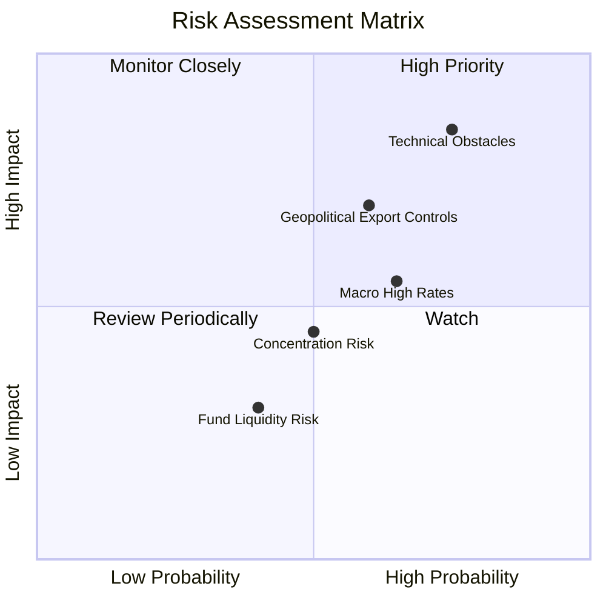

### 9.2 風險清單詳細分析

| # | 風險項目 | 發生機率 | 財務衝擊 | 風險評分 | 緩解措施 / 評估 |
|---|----------|----------|----------|----------|-----------------|
| 1 | 🔴 **技術商用化遲滯** | 高 (75%) | 高 (-20% 估值) | 🔴 8.0/10 | WQTM 透過配置 38% 的半導體與 HPC 巨頭（如 NVIDIA、AMD），確保在純量子技術成熟前，仍能享受 AI 與算力紅利。 |
| 2 | 🔴 **地緣政治與出口管制**| 中高 (60%)| 高 (-15% 營收) | 🔴 7.2/10 | 成分股多為跨國巨頭，已開始進行供應鏈多元化配置（如台積電美歐設廠、ASML 研發在地化）。 |
| 3 | 🟡 **高利率環境持續** | 中高 (65%)| 中 (-10% 估值) | 🟡 6.0/10 | 底層成分股多呈「淨現金」狀態，高利率下利息收入增加，部分抵消了分母端估值壓力。 |
| 4 | 🟡 **基金流動性風險** | 中 (40%) | 低 (-5% 淨值) | 🟡 4.0/10 | WQTM 設有最低流動性篩選機制，且底層成分股皆為高流動性大盤股，無申贖套利瓶頸。 |

---

## 10. 投資建議

### 10.1 最終綜合評級

```
╔══════════════════════════════════════════════════════════════╗
║                    WQTM 最終綜合評級雷達                     ║
╠══════════════════════════════════════════════════════════════╣
║ 基本面強度  8.5 ▓▓▓▓▓▓▓▓▓▓▓▓▓▓▓▓▓░░░  ★★★★☆           ║
║ 成長動能    8.0 ▓▓▓▓▓▓▓▓▓▓▓▓▓▓▓▓░░░░  ★★★★☆           ║
║ 獲利品質    8.2 ▓▓▓▓▓▓▓▓▓▓▓▓▓▓▓▓░░░░  ★★★★☆           ║
║ 財務健康    9.0 ▓▓▓▓▓▓▓▓▓▓▓▓▓▓▓▓▓▓░░  ★★★★★           ║
║ 估值合理性  7.0 ▓▓▓▓▓▓▓▓▓▓▓▓▓░░░░░░░  ★★★☆☆           ║
╠══════════════════════════════════════════════════════════════╣
║ 綜合評分    8.1 ▓▓▓▓▓▓▓▓▓▓▓▓▓▓▓▓░░░░  🏆 買入 (BUY)        ║
╚══════════════════════════════════════════════════════════════╝
```

### 10.2 目標價與隱含報酬率

| 情境 | 機率權重 | 目標價 | 隱含報酬率 (相對現價 $31.06) | 權重期望值 |
|------|----------|--------|------------------------------|------------|
| 🔴 **悲觀** | 20% | $26.50 | -14.7% | $5.30 |
| 🟡 **基準** | **60%** | **$38.50** | **+23.9%** | **$23.10** |
| 🟢 **樂觀** | 20% | $46.00 | +48.1% | $9.20 |
| **加權期望值**| **100%** | **$37.60** | **+21.1%** | **評級：買入** |

### 10.3 買入時機與觸發因素

```
╔══════════════════════════════════════════════════════════════════╗
║                  ✅ WQTM 買入觸發因素 Checklist                  ║
╠══════════════════════════════════════════════════════════════════╣
║                                                                  ║
║  立即買入觸發條件（多數符合）：                                  ║
║  ✅ 股價回落至 $30.00 - $31.50 區間（當前已符合）                ║
║  ✅ 底層持股加權 P/E 跌破 27x（當前 26.63x 已符合）              ║
║  ✅ 10 年期美債殖利率見頂回落至 4.0% 以下                        ║
║                                                                  ║
║  加碼觸發條件（出現以下任一）：                                  ║
║  ☐ 主要量子計算公司（如 IBM、Google）宣布突破 2,000 物理量子位元 ║
║  ☐ 聯準會重啟降息循環，成長股估值中樞上移                        ║
║                                                                  ║
║  減碼/停損觸發條件（出現以下任一）：                             ║
║  ☐ 基金 AUM 縮水至 $10M 以下，清算風險增加                       ║
║  ☐ 底層持股加權營收成長率連續兩季低於 12.0%                      ║
╚══════════════════════════════════════════════════════════════════╝
```

### 10.4 投資人適配度分析

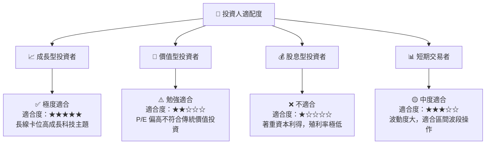

### 10.5 每季財報監控清單（Quarterly Watch List）

為了確保 WQTM 的投資邏輯依然成立，投資人應在每季追蹤以下關鍵指標：

| 監控指標 | 基準值 (2026-Q2) | 加碼門檻 (Bull) | 減碼門檻 (Bear) | 監控意義 |
|----------|------------------|-----------------|-----------------|----------|
| **底層加權營收成長率** | 18.5% | > 22.0% | < 12.0% | 評估產業成長動能是否失速 |
| **底層加權毛利率** | 58.3% | > 60.0% | < 53.0% | 觀察成分股定價權與成本轉嫁能力 |
| **基金追蹤誤差 (TE)** | 0.15% | < 0.10% | > 0.35% | 檢驗 WisdomTree 的被動管理執行效率 |
| **基金 AUM 規模** | ~$25.4M | > $50.0M | < $15.0M | 監控基金流動性與潛在清算風險 |

### 10.6 反面論證：什麼會證明投資論點錯誤？

```
╔══════════════════════════════════════════════════════════════════╗
║              ⚠️ 論點失效條件（Disconfirming Evidence）           ║
╠══════════════════════════════════════════════════════════════════╣
║  本投資論點在下列情況成立時應重新檢視或果斷退出：                ║
║  ☐ 底層持股加權營收年增率連續兩季 < 12.0%（顯示算力需求降溫）     ║
║  ☐ 聯準會因通膨復燃，再度升息至 5.5% 以上（壓抑分母端估值）      ║
║  ☐ 底層加權 ROIC 跌破 12.0%，或 ROIC-WACC 利差收窄至 < 3.0%      ║
║  ☐ 發生系統性地緣政治衝突，導致亞洲先進製程晶片完全中斷供應      ║
║  ☐ 量子計算技術遭遇物理瓶頸，相干時間無法延長，商用化時程無限期延遲║
╚══════════════════════════════════════════════════════════════════╝
```

---

> **免責聲明**：本報告為 AI 自動生成，僅供研究參考，不構成投資建議。投資有風險，入市需謹慎。