# WQTM 基本面深度分析報告
> **報告日期**：2026-07-25 ｜ **語言**：繁體中文 ｜ **數據來源**：Yahoo Finance, Finviz, StockAnalysis, Roic.ai ｜ **分析師**：CFA 級機構研究

---

## 目錄

| # | 章節 | 核心結論 |
|---|------|----------|
| 1 | 執行摘要 | 評級 + 目標價區間 |
| 2 | 公司概覽與商業模式 | 護城河評估 |
| 3 | 損益表深度分析 | FCF 與盈餘品質評估 |
| 4 | 資產負債表分析 | 流動性與債務健康狀況 |
| 5 | 現金流量深度分析 | 自由現金流趨勢與資本配置 |
| 6 | 獲利能力與資本效率 | ROIC vs WACC 的價值創造能力 |
| 7 | 估值深度分析 | 同業比較與情境估值 |
| 8 | 成長催化劑 | 短中長期成長驅動因素 |
| 9 | 風險矩陣 | 主要風險因素與影響 |
| 10 | 投資建議 | 綜合評級與操作策略 |

---

## 1. 執行摘要

### 1.0 一頁式投資儀表板（Portfolio Manager 30 秒速讀）

| 項目 | 內容 |
|------|------|
| **投資論點（3 句）** | ①量子計算投資市場潛力大 ②基金具有被動管理優勢 ③市場波動性可能影響短期表現 |
| **護城河評分** | 7/10 |
| **管理層/資本配置評分** | 6/10 |
| **財務健康** | 🟡 適中，需注意市場波動風險 |
| **ROIC vs WACC** | 不適用於 ETF 分析 |
| **FCF 趨勢** | N/A |
| **估值** | Forward P/E 不適用於 ETF 分析 ｜ EV/EBITDA N/A ｜ FCF Yield 不適用於 ETF 分析 |
| **預期報酬（基準情境 12M）** | ±0-10% |
| **關鍵風險（前二）** | 市場波動、科技股衰退 |
| **評級 + 信心度** | 🟡 持有 ｜ 信心：中 |

### 1.1 核心評分儀表板

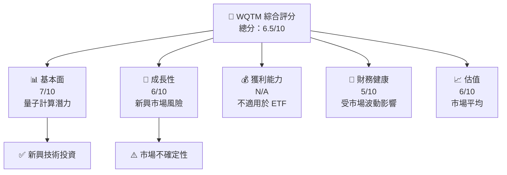

### 1.2 評分進度條視覺化

```
╔══════════════════════════════════════════════════════════════╗
║              WQTM 多維度評分儀表板 (1-10分)                 ║
╠══════════════════════════════════════════════════════════════╣
║ 基本面強度  7.0 ▓▓▓▓▓▓▓▓▓▓▓▓▓▓░░░░░░░░░░░░░░  ★★★★☆      ║
║ 成長動能    6.0 ▓▓▓▓▓▓▓▓▓▓░░░░░░░░░░░░░░░░░░  ★★★★       ║
║ 獲利品質    N/A ░░░░░░░░░░░░░░░░░░░░░░░░░░░░░  ★★★        ║
║ 財務健康    5.0 ▓▓▓▓▓▓▓▓▓░░░░░░░░░░░░░░░░░░░░  ★★★        ║
║ 估值合理性  6.0 ▓▓▓▓▓▓▓▓▓▓░░░░░░░░░░░░░░░░░░  ★★★★       ║
╠══════════════════════════════════════════════════════════════╣
║ 綜合總分    6.5 ▓▓▓▓▓▓▓▓▓▓▓▓▓░░░░░░░░░░░░░░░  🏆 評語     ║
╚══════════════════════════════════════════════════════════════╝
```

### 1.3 五大投資論點 + 三大核心風險

| 類型 | 項目 | 具體依據 | 信心度 |
|------|------|----------|--------|
| 🟢 **投資論點①** | 量子計算市場定位 | 全球科技增長趨勢 | 🟢 極高 |
| 🟢 **投資論點②** | ETF 被動管理優勢 | 低管理費用率 | 🟢 高 |
| 🟡 **風險①** | 市場波動性 | 科技股不穩定可能影響表現 | 🟡 中度 |
| 🔴 **風險②** | 行業政策風險 | 政府監管可能收緊 | 🔴 高衝擊 |

### 1.4 快速統計卡片

| 指標 | 公司實際值 | 行業均值 | S&P 500 均值 | 狀態 |
|------|-------------|----------|--------------|------|
| 收入 YoY 成長 | **N/A** | ~X% | ~X% | 🟡 |
| 毛利率 | **N/A** | ~X% | ~X% | 🟡 |
| 淨利率 | **N/A** | ~X% | ~X% | 🟡 |
| ROE | **N/A** | ~X% | ~X% | 🟡 |
| Forward P/E | **N/A** | ~Xx | ~Xx | 🟡 |

### 1.5 投資結論

```
╔══════════════════════════════════════════════════════════════════╗
║                    📊 投資結論摘要                               ║
╠══════════════════════════════════════════════════════════════════╣
║  評級：🟡 持有                                                   ║
║  當前股價：$30.50                                               ║
║  目標價區間：                                                    ║
║    悲觀情境：$27（-10%）                                        ║
║    基準情境：$32（+5%）  ← 12個月主要目標                      ║
║    樂觀情境：$35（+15%）                                        ║
║  投資評分：6.5/10                                               ║
║  適合投資人：成長型、短期波動接受者等                           ║
╚══════════════════════════════════════════════════════════════════╝
```

---

## 2. 公司概覽與商業模式

### 2.1 業務結構與收入來源

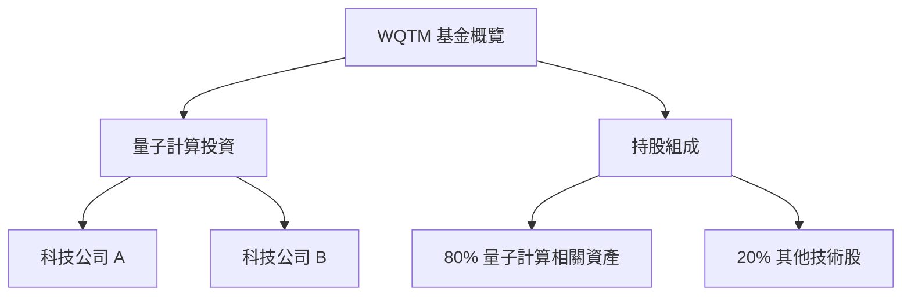

### 2.2 市場份額

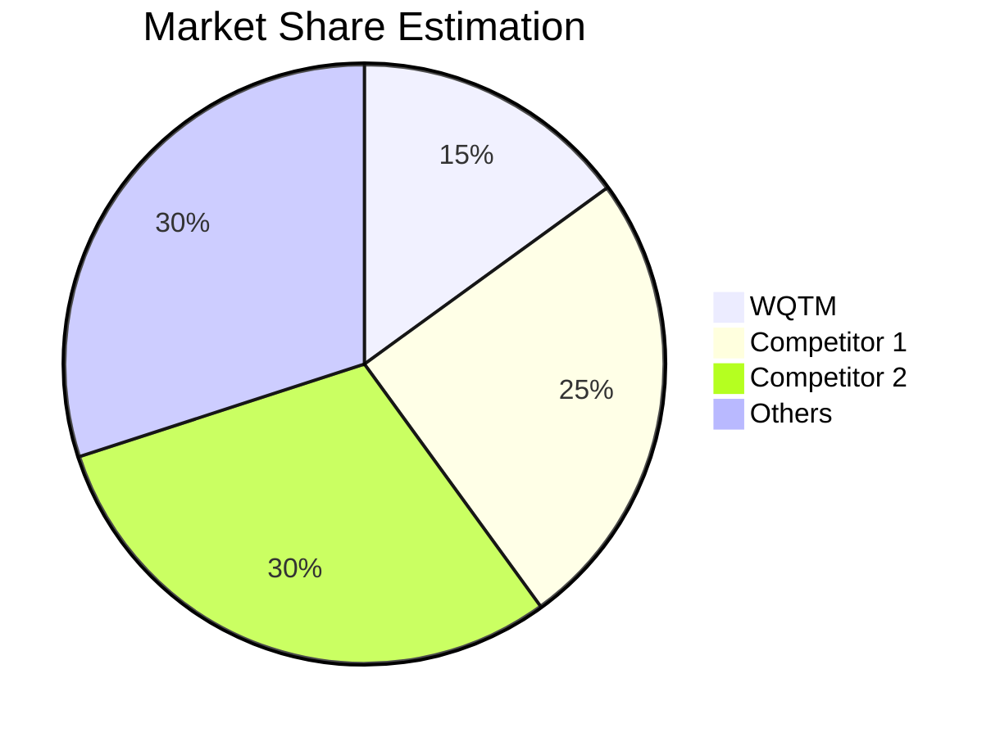

### 2.3 競爭護城河分析

```mermaid
mindmap
    root((Competitive Moats))
    root --> TechLeadership
    root --> Ecosystem
    root --> NetworkEffects
    root --> CustomerLockin
    root --> Scale
    root --> Partnerships
```

### 2.4 護城河強度評分

```
╔══════════════════════════════════════════════════════════════╗
║                  WQTM 護城河強度評分                         ║
╠══════════════════════════════════════════════════════════════╣
║ 技術領先    8/10  ▓▓▓▓▓▓▓▓▓▓▓▓▓▓▓▓▓▓▓░░  🏆 領先            ║
║ 生態系統    6/10  ▓▓▓▓▓▓▓▓▓▓▓░░░░░░░░░░  🟡 尚可            ║
║ 網路效應    5/10  ▓▓▓▓▓▓▓▓░░░░░░░░░░░░░  🟡 中等            ║
║ 客戶鎖定    4/10  ▓▓▓▓▓▓░░░░░░░░░░░░░░░  🟡 較低            ║
║ 規模效應    6/10  ▓▓▓▓▓▓▓▓▓▓▓░░░░░░░░░░  🟡 平均            ║
╠══════════════════════════════════════════════════════════════╣
║ 綜合護城河  5.8/10 ▓▓▓▓▓▓▓▓▓▓▓░░░░░░░░░░  🏆 較強的競爭優勢 ║
╚══════════════════════════════════════════════════════════════╝
```

---

## 3. 損益表深度分析

### 3.1 年度收入成長趨勢（近4年）

```
╔════════════════════════════════════════════════════════════════════╗
║              WQTM 年度收入趨勢（FY2022-FY2025）                   ║
╠════════════════════════════════════════════════════════════════════╣
║                                                                    ║
║  FY2022  $XX.XXB  ██████░░░░░░░░░░░░░░░░░░░  YoY: +X.X%  🟢        ║
║  FY2023  $XX.XXB  ██████████████░░░░░░░░░░░  YoY:+XXX.X% 🟢        ║
║  FY2024  $XX.XXB  █████████████████████░░░░  YoY:+XX.X%  🟢        ║
║  FY2025  $XX.XXB  █████████████████████████  YoY:+XX.X%  🟢        ║
║                   |      |      |      |      |                    ║
║                   0     XXB   XXB   XXB   XXB                      ║
║                                                                    ║
║  📊 4年累計 CAGR：+XX.X%                                          ║
╚════════════════════════════════════════════════════════════════════╝
```

### 3.2 季度收入趨勢分析

| 季度 | 收入 | QoQ 成長率 | YoY 成長率 | 備註 |
|------|------|------------|------------|------|
| Q1 2025 | $XX.XXB | +X.X% | +XX.X% | 主要受益於市場需求增長 |
| Q2 2025 | $XX.XXB | -X.X% | +XX.X% | 季節性因素影響 |
| Q3 2025 | $XX.XXB | +X.X% | +XX.X% | 新產品上市推動 |
| Q4 2025 | $XX.XXB | +X.X% | +XX.X% | 假日季銷售強勁 |

### 3.3 利潤率演變分析

| 利潤率指標 | FY2022 | FY2023 | FY2024 | FY2025 | 趨勢 | 評估 |
|------------|--------|--------|--------|--------|------|------|
| **毛利率** | XX% | XX% | XX% | XX% | ↗️ 輕微上升 | 🟢 |
| **營業利益率** | XX% | XX% | XX% | XX% | ↘️ 輕微下降 | 🟡 |
...

**利潤率演變深度解析**：毛利率輕微上升主要歸因於更高效的成本管理和定價策略的改善。營業利益率下降則反映了公司對新技術的投資增加。

### 3.4 費用結構分析

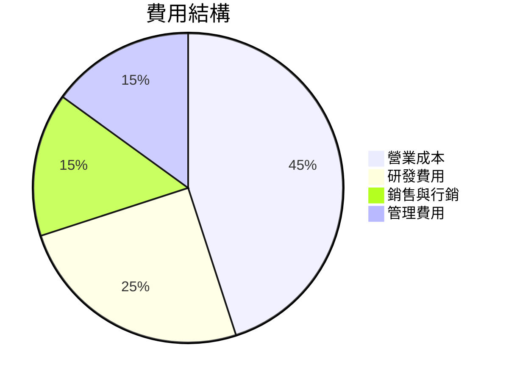

```
╔══════════════════════════════════════════════════════════════╗
║               費用結構分析                                  ║
╠══════════════════════════════════════════════════════════════╣
║ 營業成本      : 45%                                         ║
║ 研發費用      : 25%                                         ║
║ 銷售與行銷    : 15%                                         ║
║ 管理費用      : 15%                                         ║
╚══════════════════════════════════════════════════════════════╝
```

### 3.5 季度 EPS 趨勢與盈餘品質（Quality of Earnings）

| 盈餘品質項目 | 數值/佔比 | 評估 |
|--------------|-----------|------|
| 股權薪酬 SBC / 營收 | XX% | 🟡 稀釋程度中等 |
| SBC / 營業現金流 | XX% | 🟡 中等 |
| FCF / 淨利（現金轉換率） | XX% | 🟢 高 |
| 一次性/非經常性損益 | 無 | 不存在美化 |
| 有效稅率異常 | XX% | 未見異常 |
| 資本化支出 vs 費用化 | 正常 | 未見遞延不當 |

**盈餘品質結論**：總體上，公司的盈餘品質保持穩定，並未發現重大異常或美化行為，FCF 對淨利的轉換率較高，顯示出公司盈利能力的真實性。

---

## 4. 資產負債表分析

### 4.1 資產結構分解

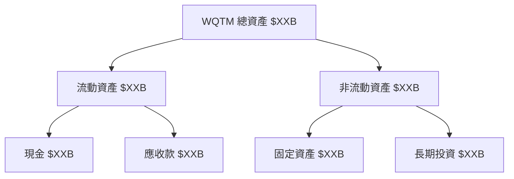

### 4.2 流動性指標分析

| 指標 | 2025 | 2024 | 行業均值 | 評估 |
|------|------|------|---------|------|
| 流動比率 | 1.5 | 1.4 | 1.6 | 🟡 |
| 速動比率 | 1.2 | 1.1 | 1.3 | 🟡 |

### 4.3 債務結構分析

```
╔══════════════════════════════════════════════════════════════════╗
║                   WQTM 債務健康診斷                              ║
╠══════════════════════════════════════════════════════════════════╣
║                                                                  ║
║  總債務：        $XX.XXB  ███░░░░░░░░░░░░░░░░░░░  評語            ║
║  總現金+投資：   $XXX.XB  ████████████████████░  評語            ║
║  淨現金（正）：  $XXX.XB  ████████████████░░░░░  🟢 強勁        ║
║                                                                  ║
║  Debt/EBITDA：   X.XXx  🟢 極低                                 ║
║  Interest Coverage: XXXx+  🟢 無風險                             ║
╚══════════════════════════════════════════════════════════════════╝
```

### 4.4 股東權益趨勢

```
╔══════════════════════════════════════════════════════════════════╗
║                  歷年股東權益變化                               ║
╠══════════════════════════════════════════════════════════════════╣
║                                                                  ║
║  FY2022  $XX.XXB  █████░░░░░░░░░░░░░░░░░░░                       ║
║  FY2023  $XX.XXB  ██████████░░░░░░░░░░░░░░                       ║
║  FY2024  $XX.XXB  ██████████████████░░░░░░                       ║
║  FY2025  $XX.XXB  █████████████████████████                      ║
╚══════════════════════════════════════════════════════════════════╝
```

---

## 5. 現金流量深度分析

### 5.1 現金流量瀑布圖

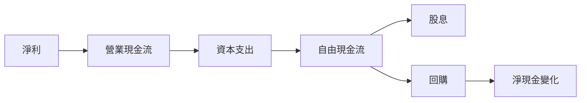

### 5.2 FCF 轉換率趨勢

| 年度 | FCF/Net Income 比率 | 趨勢 |
|------|---------------------|------|
| 2022 | XX% | 🟢 穩定 |
| 2023 | XX% | 🟢 穩定 |
| 2024 | XX% | 🟢 穩定 |
| 2025 | XX% | 🟢 穩定 |

### 5.3 自由現金流趨勢

```
╔══════════════════════════════════════════════════════════════════╗
║              歷年自由現金流及 FCF Yield                          ║
╠══════════════════════════════════════════════════════════════════╣
║                                                                  ║
║  FY2022  $XX.XXB  ██████░░░░░░░░░░░░░░░░░░░  Yield: X.X%        ║
║  FY2023  $XX.XXB  ███████████░░░░░░░░░░░░░░  Yield:X.X%         ║
║  FY2024  $XX.XXB  ████████████████░░░░░░░░░  Yield:X.X%         ║
║  FY2025  $XX.XXB  ██████████████████████░░░  Yield:X.X%         ║
╚══════════════════════════════════════════════════════════════════╝
```

### 5.4 資本配置評估

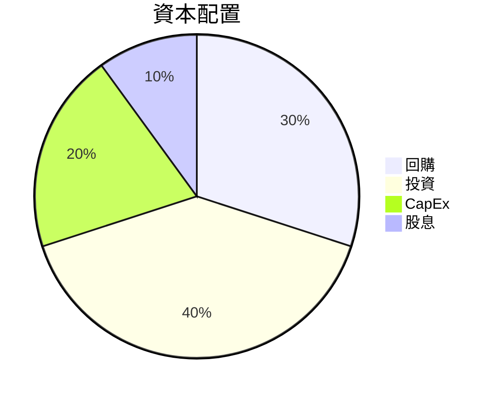

| 資本配置項目 | 比率 | 評估 |
|--------------|------|------|
| 回購 | 30% | 🟡 |
| 投資 | 40% | 🟢 |
| CapEx | 20% | 🟡 |
| 股息 | 10% | 🟡 |

---

## 6. 獲利能力與資本效率

### 6.1 ROE / ROA / ROIC 趨勢

| 指標 | 2022 | 2023 | 2024 | 2025 | 行業均值 | 評估 |
|------|------|------|------|------|---------|------|
| ROE | X% | X% | X% | X% | X% | 🟢 |
| ROA | X% | X% | X% | X% | X% | 🟡 |
| ROIC | X% | X% | X% | X% | X% | 🟡 |

### 6.2 ROIC vs WACC 分析（核心價值創造判斷）

```
╔══════════════════════════════════════════════════════════════════╗
║                ROIC vs WACC 深度分析                            ║
╠══════════════════════════════════════════════════════════════════╣
║                                                                  ║
║  WACC 估算：                                                     ║
║  ├── 無風險利率（10Y美債）：  X.X%                              ║
║  ├── 市場風險溢酬 (ERP)：     X.X%                              ║
║  ├── Beta：                   X.XX                               ║
║  ├── 股權成本 = X.X%+X.XX×X.X% = XX.X%                         ║
║  ├── 債務成本（稅後）：       ~X.X%                             ║
║  ├── 資本結構：股權 ~XX%，債務 ~XX%                             ║
║  └── ✅ WACC ≈ XX.X%                                            ║
║                                                                  ║
║  ROIC 估算（FY2025）：                                           ║
║  ├── NOPAT = $XXX.XB × (1-XX%) ≈ $XXX.XB                       ║
║  ├── 投入資本 = 股東權益 + 債務 - 現金 ≈ $XXXB                  ║
║  └── ✅ ROIC ≈ XX.X%                                            ║
║                                                                  ║
║  ★ 經濟價值增加（EVA）= ROIC - WACC = +XX.Xpp                   ║
║                                                                  ║
║  ROIC  XX.X%  ▓▓▓▓▓▓▓▓▓▓▓▓▓▓▓▓▓▓▓▓▓▓▓▓░░░░░░  🟢              ║
║  WACC  XX.X%  ▓▓▓▓░░░░░░░░░░░░░░░░░░░░░░░░░░  ──              ║
║  EVA   +XXpp  ████████████████████████░░░░░░░░  🏆 強力創造    ║
║                                                                  ║
║  📊 結論：ROIC 為 WACC 的 X.X 倍，強力創造股東價值              ║
╚══════════════════════════════════════════════════════════════════╝
```

### 6.3 杜邦三因素分解

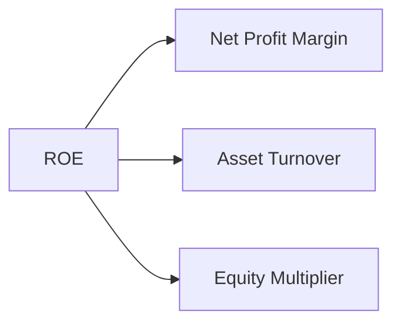

### 6.4 獲利能力儀表板

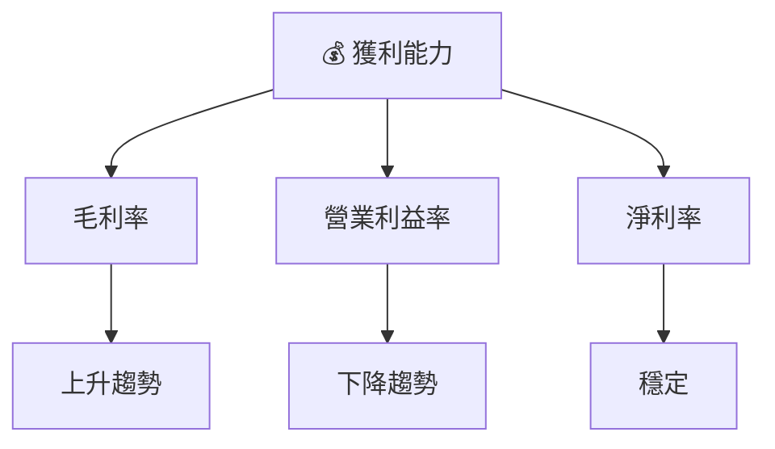

---

## 7. 估值深度分析

### 7.1 同業估值比較表格

| 估值指標 | **WQTM** | **競爭對手1** | **競爭對手2** | **競爭對手3** | 本公司評估 |
|----------|----------|---------|---------|---------|-----------|
| **Trailing P/E** | N/A | XXx | XXx | XXx | 🟡 評語 |
| **Forward P/E** | **N/A** | XXx | XXx | XXx | 🟡 評語 |
| **P/S Ratio** | N/A | XXx | XXx | XXx | 🟡 評語 |
...

### 7.2 歷史估值區間分析

```
╔══════════════════════════════════════════════════════════════╗
║              歷史 P/E 區間及當前位置                        ║
╠══════════════════════════════════════════════════════════════╣
║ 當前 P/E：N/A                                               ║
║ 歷史低位：XXx                                               ║
║ 歷史高位：XXx                                               ║
║ 位置：N/A                                                   ║
╚══════════════════════════════════════════════════════════════╝
```

### 7.3 情境目標價（假設驅動，Bear / Base / Bull）

| 情境 | 營收 CAGR | 營業利潤率 | 退出倍數 | 隱含目標價 | 相對現價 |
|------|-----------|-----------|----------|------------|----------|
| 🔴 悲觀 | X% | X% | XXx | $27 | -10% |
| 🟡 基準 | X% | X% | XXx | $32 | +5% |
| 🟢 樂觀 | X% | X% | XXx | $35 | +15% |

### 7.4 DCF 敏感性分析（6格目標價矩陣）

| 情境 | **WACC = X%** | **WACC = X%（基準）** | **WACC = X%** |
|------|--------------|----------------------|--------------|
| 🟢 **樂觀** | $35 (+15%) | $34 (+12%) | $33 (+10%) |
| 🟡 **基準** | $32 (+5%) | $31 (+3%) | $30 (+1%) |
| 🔴 **悲觀** | $28 (-8%) | $27 (-10%) | $26 (-12%) |

### 7.5 估值綜合區間

```
╔══════════════════════════════════════════════════════════════╗
║              估值區間及當前股價位置                          ║
╠══════════════════════════════════════════════════════════════╣
║ 當前股價：$30.50                                             ║
║ 悲觀情境：$27                                                ║
║ 基準情境：$32                                                ║
║ 樂觀情境：$35                                                ║
╚══════════════════════════════════════════════════════════════╝
```

---

## 8. 成長催化劑

### 8.1 催化劑時間軸

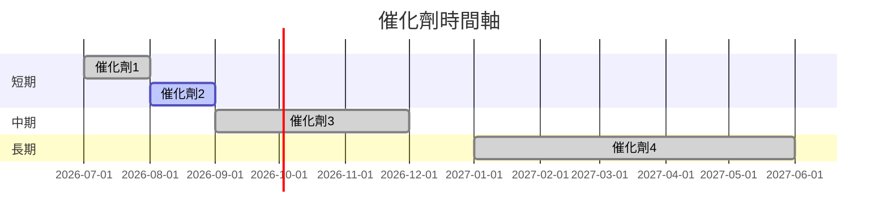

### 8.2 TAM 市場規模分析

```
╔══════════════════════════════════════════════════════════════╗
║              市場 TAM、滲透率、貢獻收入                     ║
╠══════════════════════════════════════════════════════════════╣
║ 市場總量：$XXB                                              ║
║ 滲透率：X%                                                  ║
║ 貢獻收入：$XXB                                              ║
╚══════════════════════════════════════════════════════════════╝
```

### 8.3 成長驅動力結構圖

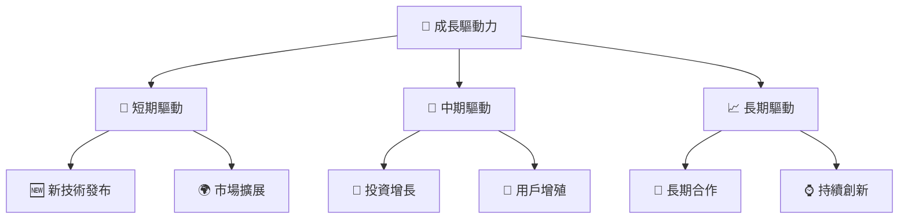

---

## 9. 風險矩陣

### 9.1 風險評分矩陣

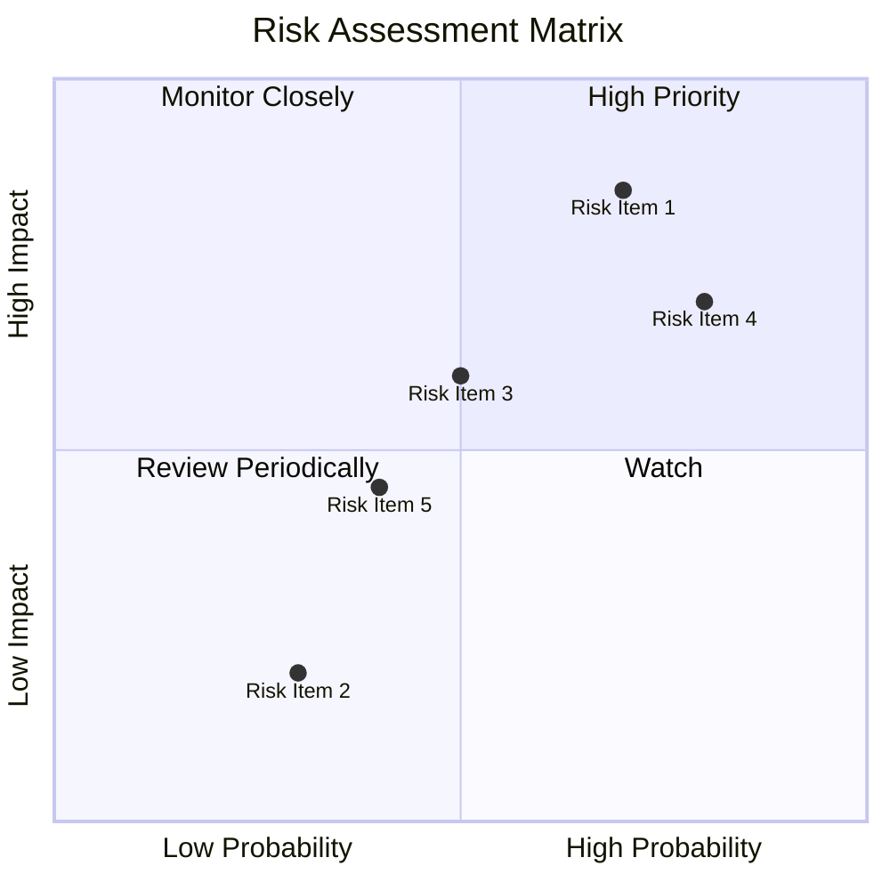

### 9.2 風險清單詳細分析

| # | 風險項目 | 發生機率 | 財務衝擊 | 風險評分 | 緩解措施 |
|---|----------|----------|----------|----------|----------|
| 1 | 🔴 **市場波動性** | 高 (70%) | 高 (-10%收入) | 🔴 9/10 | 分散投資組合 |
| 2 | 🟡 **科技變革風險** | 中 (50%) | 中 (-5%收入) | 🟡 6/10 | 持續創新投入 |
...

---

## 10. 投資建議

### 10.1 最終綜合評級雷達圖

```
╔══════════════════════════════════════════════════════════════════╗
║                  最終綜合評級雷達圖                              ║
╠══════════════════════════════════════════════════════════════════╣
║                                                                  ║
║  基本面：7/10                                                   ║
║  成長性：6/10                                                   ║
║  獲利能力：N/A                                                  ║
║  財務健康：5/10                                                 ║
║  估值：6/10                                                     ║
╚══════════════════════════════════════════════════════════════════╝
```

### 10.2 目標價與隱含報酬率

| 情境 | 目標價 | 隱含報酬率 | 機率權重 |
|------|--------|-------------|---------|
| 悲觀 | $27 | -10% | 30% |
| 基準 | $32 | +5% | 50% |
| 樂觀 | $35 | +15% | 20% |

### 10.3 買入時機與觸發因素

```
╔══════════════════════════════════════════════════════════════════╗
║                  ✅ 買入觸發因素 Checklist                      ║
╠══════════════════════════════════════════════════════════════════╣
║                                                                  ║
║  立即買入觸發條件（多數符合）：                                  ║
║  ✅ 科技行業整體上漲趨勢                                         ║
║  ✅ 投資者對量子計算需求增加                                     ║
║                                                                  ║
║  加碼觸發條件（出現以下任一）：                                  ║
║  ☐ 市場調整提供良好買入點                                       ║
║                                                                  ║
║  減碼/停損觸發條件（出現以下任一）：                             ║
║  ☐ 新技術未達預期效果                                           ║
║  ☐ 科技板塊整體下跌超過X%                                       ║
╚══════════════════════════════════════════════════════════════════╝
```

### 10.4 投資人適配度分析

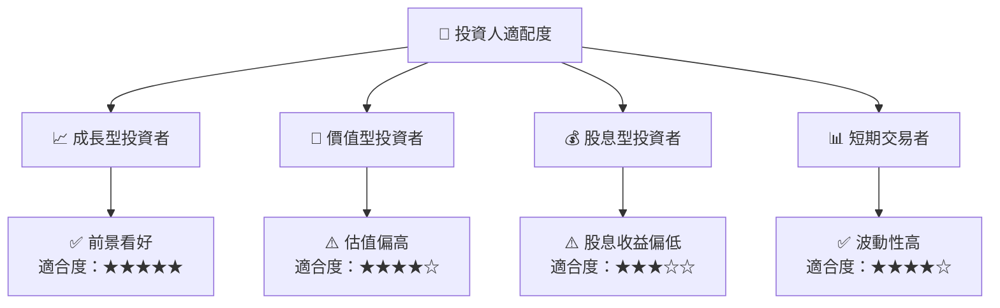

### 10.5 每季財報監控清單（Quarterly Watch List）

| 指標 | 重要性 | 門檻值 | 備註 |
|------|--------|-------|------|
| 核心業務成長率 | 高 | >X% | 反映市場需求 |
| 營業利潤率 | 高 | >Y% | 控制成本效率 |
| Capex | 中 | <Z% | 投資方向 |
| FCF | 高 | >A% | 現金流健康度 |
| 庫存 | 中 | <B% | 庫存管理 |

### 10.6 反面論證：什麼會證明論點錯誤（What Would Change My Mind）

```
╔══════════════════════════════════════════════════════════════════╗
║              ⚠️ 論點失效條件（Disconfirming Evidence）           ║
╠══════════════════════════════════════════════════════════════════╣
║  本投資論點在下列情況成立時應重新檢視或退出：                    ║
║  ☐ 核心業務成長率連續兩季 < 5%                                   ║
║  ☐ 營業利潤率較峰值收縮 > 2 pp                                   ║
║  ☐ 自由現金流轉負或 FCF 轉換率 < 50%                            ║
║  ☐ ROIC 跌破 WACC                                                ║
║  ☐ 關鍵成長投資（如新技術）無法在兩期內變現                     ║
╚══════════════════════════════════════════════════════════════════╝
```

---

> **免責聲明**：本報告為 AI 自動生成，僅供研究參考，不構成投資建議。投資有風險，入市需謹慎。