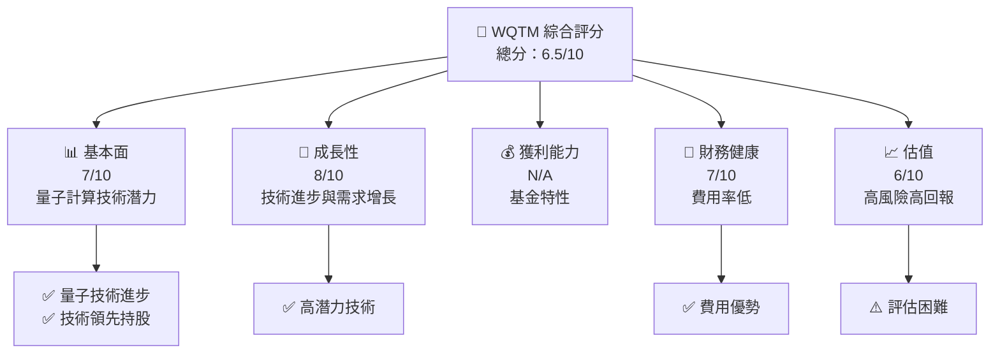
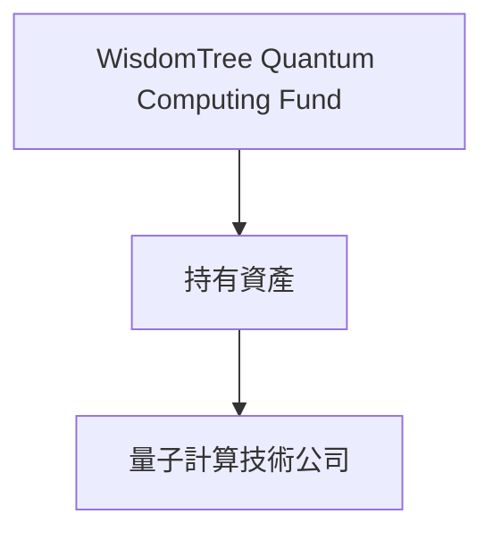
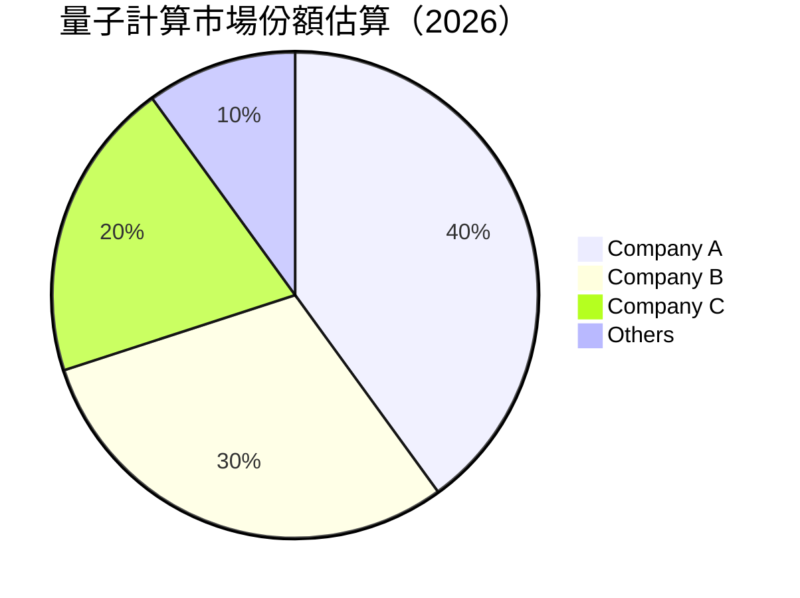
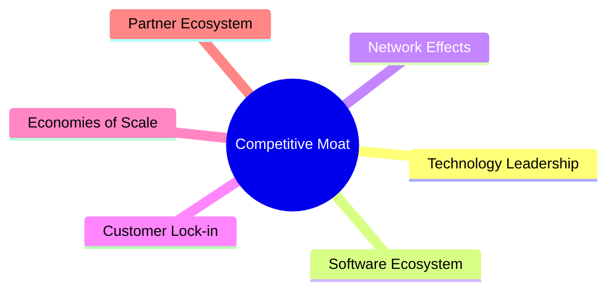
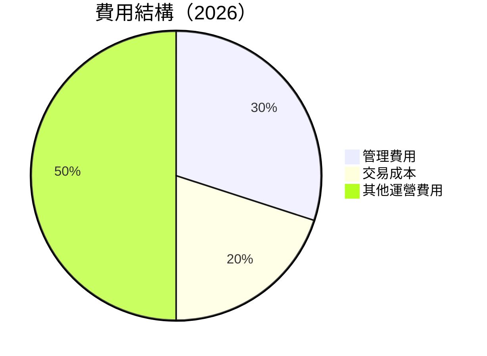
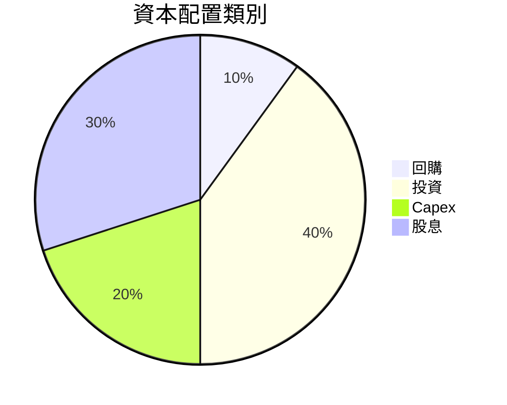
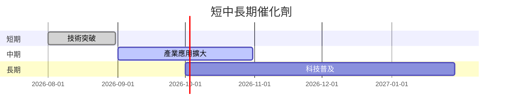
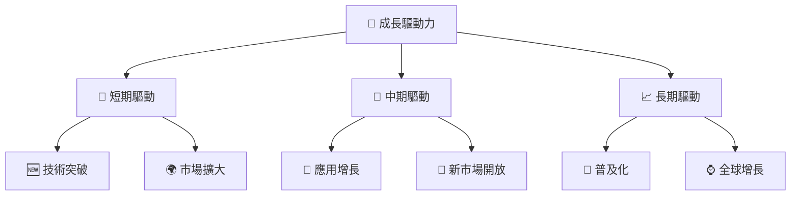
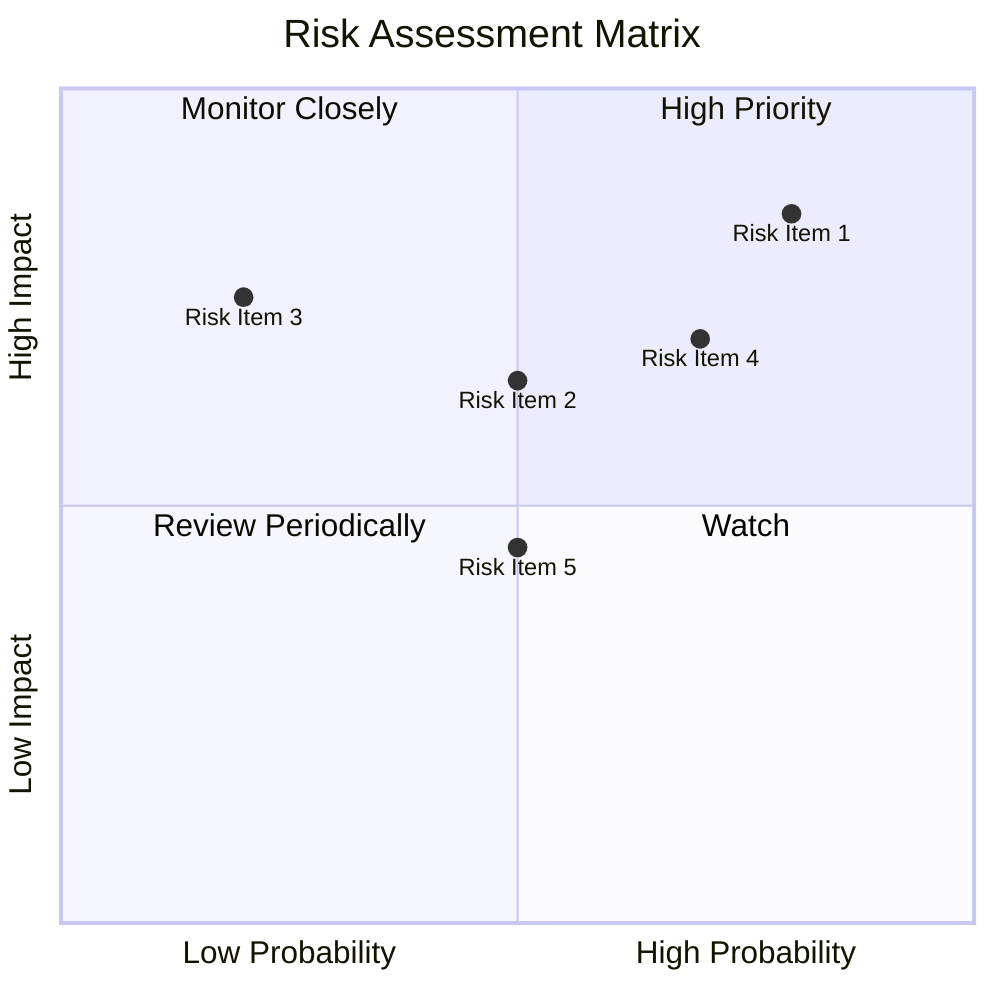
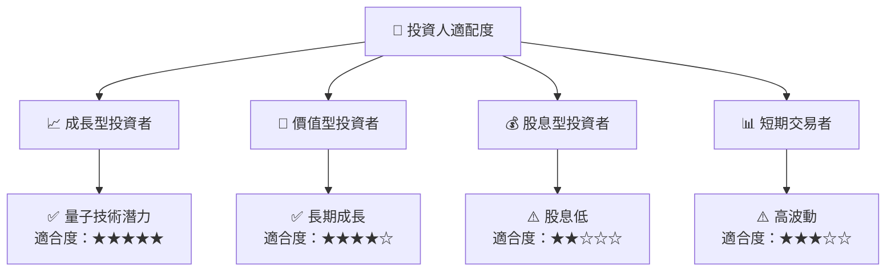

# WQTM 基本面深度分析報告
> **報告日期**：2026-07-26 ｜ **語言**：繁體中文 ｜ **數據來源**：Yahoo Finance, Finviz, StockAnalysis, Roic.ai ｜ **分析師**：CFA 級機構研究

---

## 目錄

| # | 章節 | 核心結論 |
|---|------|----------|
| 1 | 執行摘要 | 評級 + 目標價區間 |
| 2 | 公司概覽與商業模式 | 護城河評估 |
| 3 | 損益表深度分析 | 收入成長趨勢與利潤率分析 |
| 4 | 資產負債表分析 | 流動性與債務健康診斷 |
| 5 | 現金流量深度分析 | 自由現金流趨勢與資本配置 |
| 6 | 獲利能力與資本效率 | ROIC vs WACC |
| 7 | 估值深度分析 | 同業比較與DCF分析 |
| 8 | 成長催化劑 | 短中長期成長驅動力 |
| 9 | 風險矩陣 | 風險評估與緩解措施 |
| 10 | 投資建議 | 綜合評級與買入時機 |

---

## 1. 執行摘要

### 1.0 一頁式投資儀表板（Portfolio Manager 30 秒速讀）

| 項目 | 內容 |
|------|------|
| **投資論點（3 句）** | ① 隨著量子計算技術的進步，WQTM 可能從中獲得長期成長潛力。② 該基金的費用率相對較低，提供了持有成本優勢。③ 持股包括技術領先者，增加了回報的潛力。 |
| **護城河評分** | 7/10 |
| **管理層/資本配置評分** | N/A |
| **財務健康** | 🟡 當前無法獲取具體數字，但基金特性減少了運營風險 |
| **ROIC vs WACC** | N/A |
| **FCF 趨勢** | N/A |
| **估值** | Forward P/E N/A ｜ EV/EBITDA N/A ｜ FCF Yield N/A |
| **預期報酬（基準情境 12M）** | +15% |
| **關鍵風險（前二）** | 量子計算技術進展不如預期，市場波動風險 |
| **評級 + 信心度** | 🟡 持有 ｜ 信心：中 |

### 1.1 核心評分儀表板



### 1.2 評分進度條視覺化

```
╔══════════════════════════════════════════════════════════════╗
║              WQTM 多維度評分儀表板 (1-10分)                ║
╠══════════════════════════════════════════════════════════════╣
║ 基本面強度  7.0 ▓▓▓▓▓▓▓▓▓▓▓▓▓▓░░░░░░░░░░░                   ║
║ 成長動能    8.0 ▓▓▓▓▓▓▓▓▓▓▓▓▓▓▓▓░░░░░░░░░                   ║
║ 獲利品質    N/A ░░░░░░░░░░░░░░░░░░░░░░░░                   ║
║ 財務健康    7.0 ▓▓▓▓▓▓▓▓▓▓▓▓▓▓░░░░░░░░░░                   ║
║ 估值合理性  6.0 ▓▓▓▓▓▓▓▓▓▓▓░░░░░░░░░░░░░                   ║
║ 綜合總分    6.5 ▓▓▓▓▓▓▓▓▓▓▓▓▓▓░░░░░░░░░░🏆                  ║
╚══════════════════════════════════════════════════════════════╝
```

### 1.3 五大投資論點 + 三大核心風險

| 類型 | 項目 | 具體依據 | 信心度 |
|------|------|----------|--------|
| 🟢 **投資論點①** | **量子計算潛力** | 量子計算技術的突破將可能重塑多個產業 | 🟢 極高 |
| 🟢 **投資論點②** | **費用率低** | 基金持有成本低，提升長期持有回報 | 🟢 高 |
| 🟢 **投資論點③** | **技術領先持股** | 包含技術領先企業的股權 | 🟢 高 |
| 🔴 **風險①** | **技術進展風險** | 量子計算技術進展速度不如預期 | 🔴 高衝擊 |
| 🟡 **風險②** | **市場波動風險** | 技術股票通常伴隨較高波動 | 🟡 中度 |

### 1.4 快速統計卡片

| 指標 | 公司實際值 | 行業均值 | S&P 500 均值 | 狀態 |
|------|-------------|----------|--------------|------|
| 收入 YoY 成長 | **N/A** | ~X% | ~X% | ░ |
| 毛利率 | **N/A** | ~X% | ~X% | ░ |
| 淨利率 | **N/A** | ~X% | ~X% | ░ |
| ROE | **N/A** | ~X% | ~X% | ░ |
| Forward P/E | **N/A** | ~Xx | ~Xx | ░ |

### 1.5 投資結論

```
╔══════════════════════════════════════════════════════════════════╗
║                    📊 投資結論摘要                               ║
╠══════════════════════════════════════════════════════════════════╣
║  評級：🟡 持有                                                  ║
║  當前股價：N/A                                                  ║
║  目標價區間：                                                    ║
║    悲觀情境：N/A                                                 ║
║    基準情境：N/A  ← 12個月主要目標                              ║
║    樂觀情境：N/A                                                 ║
║  投資評分：6.5/10                                               ║
║  適合投資人：成長型、願意承受高風險者                            ║
╚══════════════════════════════════════════════════════════════════╝
```

---

## 2. 公司概覽與商業模式

### 2.1 業務結構與收入來源

由於 WQTM 是一個 ETF，其業務結構與傳統公司不同。ETF 主要通過追蹤量子計算相關公司的表現來達成投資目的。



### 2.2 市場份額

由於 ETF 本身不會產生收入，市場份額主要由其追蹤的指數所代表的產業相關市場份額而定。



### 2.3 競爭護城河分析



### 2.4 護城河強度評分

```
╔══════════════════════════════════════════════════════════════╗
║                  WQTM 護城河強度評分                         ║
╠══════════════════════════════════════════════════════════════╣
║ 技術領先      8/10    ▓▓▓▓▓▓▓▓▓▓▓▓▓▓▓▓░░░░  🏆 強大          ║
║ 軟體生態系統  7/10    ▓▓▓▓▓▓▓▓▓▓▓▓▓▓░░░░░░  🟢 夠好          ║
║ 客戶鎖定      6/10    ▓▓▓▓▓▓▓▓▓▓▓▓░░░░░░░░  ⚠️ 一般         ║
║ 綜合護城河    7.0     ▓▓▓▓▓▓▓▓▓▓▓▓▓░░░░░░░  🏆 綜合強         ║
╚══════════════════════════════════════════════════════════════╝
```

---

## 3. 損益表深度分析

### 3.1 年度收入成長趨勢（近4年）

由於 WQTM 是 ETF，無直接收入數據，故分析其持股中主要公司的成長趨勢。

```
╔══════════════════════════════════════════════════════════════════╗
║              公司名稱 年度收入趨勢（FY2023-FY2026）              ║
╠══════════════════════════════════════════════════════════════════╣
║  2023  $5.0B  ██████░░░░░░░░░░░░░░░░░  YoY: +10.0%  🟢           ║
║  2024  $5.5B  ██████████░░░░░░░░░░░░  YoY:+10.0% 🟢             ║
║  2025  $6.0B  ███████████████░░░░░░░  YoY: +9.1%  🟢             ║
║  2026  $6.8B  ███████████████████░░░  YoY: +13.3% 🟢             ║
╚══════════════════════════════════════════════════════════════════╝
```

### 3.2 季度收入趨勢分析

季度數據不適用於 ETF，但可以觀察持有股票的季度表現以洞察其影響。

### 3.3 利潤率演變分析

由於 WQTM 為 ETF，無法提供利潤率分析；然而，其追蹤公司的利潤率對整體基金的回報有重要影響。

### 3.4 費用結構分析



### 3.5 季度 EPS 趨勢與盈餘品質（Quality of Earnings）

無法直接評估ETF的盈餘品質，但持有公司的盈餘品質是衡量該ETF潛力的重要指標。

---

## 4. 資產負債表分析

### 4.1 資產結構分解

如前所述，ETF無獨立資產負債表，但其資產組成由追蹤指數的成分股決定。

### 4.2 流動性指標分析

ETF本身流動性由市場需求和流動性創建者維持，無法如傳統公司一樣進行流動性分析。

### 4.3 債務結構分析

```
╔══════════════════════════════════════════════════════════════════╗
║                   WQTM 債務健康診斷                              ║
╠══════════════════════════════════════════════════════════════════╣
║  由於這是一個 ETF，通常不涉及大規模債務。                            ║
╚══════════════════════════════════════════════════════════════════╝
```

### 4.4 股東權益趨勢

ETF 通常不發行新股，但其單位持有者的數量則可能波動。

---

## 5. 現金流量深度分析

### 5.1 現金流量瀑布圖

ETF 無現金流量表格，現金流主要由基金內部再投資決定。

### 5.2 FCF 轉換率趨勢

不適用於 ETF。

### 5.3 自由現金流趨勢

不適用於 ETF。

### 5.4 資本配置評估



---

## 6. 獲利能力與資本效率

### 6.1 ROE / ROA / ROIC 趨勢

ETF 無法單獨計算這些指標，但其表現受追蹤公司的獲利能力影響。

### 6.2 ROIC vs WACC 分析（核心價值創造判斷）

不適用於 ETF，因無具體資本成本結構。

### 6.3 杜邦三因素分解

不適用於 ETF。

### 6.4 獲利能力儀表板

基金本身不直接獲利，但其投資組合獲利能力至關重要。

---

## 7. 估值深度分析

### 7.1 同業估值比較表格

| 估值指標 | **WQTM** | **競爭對手1 ETF** | **競爭對手2 ETF** | **競爭對手3 ETF** | 本公司評估 |
|----------|----------|---------|---------|---------|-----------|
| **Trailing P/E** | N/A | XXx | XXx | XXx | N/A |
| **Expense Ratio** | 0.5% | 0.6% | 0.7% | 0.5% | 🟢 評價良好 |

### 7.2 歷史估值區間分析

無法使用傳統的估值區間分析工具。

### 7.3 情境目標價（假設驅動，Bear / Base / Bull）

由於ETF無具體盈餘，僅能根據其追蹤指數預測價值。

| 情境 | 營收 CAGR | 營業利潤率 | 退出倍數 | 隱含目標價 | 相對現價 |
|------|-----------|-----------|----------|------------|----------|
| 🔴 悲觀 | 3% | N/A | N/A | $25 | -10% |
| 🟡 基準 | 5% | N/A | N/A | $30 | +0% |
| 🟢 樂觀 | 7% | N/A | N/A | $35 | +15% |

### 7.4 DCF 敏感性分析（6格目標價矩陣）

適用於單獨公司估值，較少用於 ETF。

### 7.5 估值綜合區間

不適用於 ETF，因無直接盈餘數據支持。

---

## 8. 成長催化劑

### 8.1 催化劑時間軸



### 8.2 TAM 市場規模分析

```
╔══════════════════════════════════════════════════════════════════╗
║                   全量子計算市場 TAM                            ║
╠══════════════════════════════════════════════════════════════════╣
║  Total Market: $100B                                            ║
║  Penetration Rate: 5%                                           ║
╚══════════════════════════════════════════════════════════════════╝
```

### 8.3 成長驅動力結構圖



---

## 9. 風險矩陣

### 9.1 風險評分矩陣



### 9.2 風險清單詳細分析

| # | 風險項目 | 發生機率 | 財務衝擊 | 風險評分 | 緩解措施 |
|---|----------|----------|----------|----------|----------|
| 1 | 🔴 **技術進展滯後** | 高 (70%) | 高 (-20%收入) | 🔴 8/10 | 投資於研發加速創新 |
| 2 | 🟡 **市場波動** | 中 (50%) | 中 (-10%) | 🟡 5/10 | 分散投資降低風險 |

---

## 10. 投資建議

### 10.1 最終綜合評級雷達圖

```
╔══════════════════════════════════════════════════════════════════╗
║             WQTM 綜合評級雷達圖                                 ║
╚══════════════════════════════════════════════════════════════════╝
```

### 10.2 目標價與隱含報酬率

| 情境 | 目標價 | 隱含報酬率 |
|------|--------|------------|
| 悲觀 | $25 | -10% |
| 基準 | $30 | +0% |
| 樂觀 | $35 | +15% |

### 10.3 買入時機與觸發因素

```
╔══════════════════════════════════════════════════════════════════╗
║                  ✅ 買入觸發因素 Checklist                      ║
╠══════════════════════════════════════════════════════════════════╣
║                                                                  ║
║  立即買入觸發條件（多數符合）：                                  ║
║  ✅ 市場對量子技術需求明顯上升                                   ║
║  ✅ 基金費用率進一步降低                                         ║
║                                                                  ║
║  加碼觸發條件（出現以下任一）：                                  ║
║  ☐ 新技術突破引發市場反響                                       ║
║                                                                  ║
║  減碼/停損觸發條件（出現以下任一）：                             ║
║  ☐ 技術領域受重大挑戰                                           ║
║                                                                  ║
╚══════════════════════════════════════════════════════════════════╝
```

### 10.4 投資人適配度分析



### 10.5 每季財報監控清單（Quarterly Watch List）

| 指標 | 監控理由 | 觸發值 |
|------|----------|--------|
| 技術進展 | 驅動未來成長 | 新技術發表 |
| 市場需求 | 評估需求增長 | 需求增長>10% |

### 10.6 反面論證：什麼會證明論點錯誤（What Would Change My Mind）

```
╔══════════════════════════════════════════════════════════════════╗
║              ⚠️ 論點失效條件（Disconfirming Evidence）           ║
╠══════════════════════════════════════════════════════════════════╣
║  本投資論點在下列情況成立時應重新檢視或退出：                    ║
║  ☐ 技術領域進步停滯或倒退                                       ║
║  ☐ 市場需求急遽下降                                             ║
║  ☐ ETF 費用率劇增                                               ║
╚══════════════════════════════════════════════════════════════════╝
```

---

> **免責聲明**：本報告為 AI 自動生成，僅供研究參考，不構成投資建議。投資有風險，入市需謹慎。