# WQTM 基本面深度分析報告
> **報告日期**：2026-08-19 ｜ **語言**：繁體中文 ｜ **數據來源**：Yahoo Finance, Finviz, StockAnalysis, Roic.ai ｜ **分析師**：CFA 級機構研究

---

## 目錄

| # | 章節 | 核心結論 |
|---|------|----------|
| 1 | 執行摘要 | 評級 🟢 **買入 (Buy)**，基準目標價 **$38.88**（上行空間 +15.0%） |
| 2 | 公司概覽與商業模式 | 全球首檔純量子運算主題 ETF，具備指數獨佔與流動性先發護城河 |
| 3 | 損益表深度分析 | 底層成分股營收維持高雙位數成長，本益比 31.34x 反映技術商業化溢價 |
| 4 | 資產負債表分析 | ETF 規模 $346.77M，無結構性負債，底層龍頭現金充足、破產風險極低 |
| 5 | 現金流量深度分析 | 費用率 0.45% 每年產生約 $1.56M 管理金流，底層生態系邁入正向營運現金流 |
| 6 | 獲利能力與資本效率 | 透視 ROIC (14.2%) 高於加權 WACC (9.41%)，持續創造實質經濟附加價值 (EVA) |
| 7 | 相對估值分析 | 相較 QTUM 等同業，WQTM 聚焦純度更高，合理的 31-35x P/E 區間具備防禦性 |
| 8 | DCF 內在價值評估 | 穿透式 DCF 基準內在價值 **$38.42**，加權合理價值 **$37.87**，安全邊際 MOS **+10.7%** |
| 9 | 成長催化劑 | 容錯量子運算 (FTQC) 商業化突破、混合雲/AI 協同運算與國防密碼升級需求爆發 |
| 10 | 風險矩陣 | 量子退相干與糾錯技術瓶頸、硬體資本支出週期過長、高 Beta 波動回撤 |
| 11 | 投資建議 | 建議買入區間 **$28.50 – $33.00**，長線投資人可分批布局掌握十年技術奇點 |

---

## 1. 執行摘要

本報告針對 **WisdomTree Quantum Computing Fund (Ticker: WQTM)** 進行穿透式機構級基本面與估值分析。WQTM 為被動追蹤全球量子運算產業指數之交易所交易基金（ETF），管理資產規模（AUM）達 **$346.77M**，發行股數 **9.83M**，總費用率為 **0.45%**。當前股價為 **$33.81**，對應底層加權 Trailing P/E 為 **31.34x**（Yahoo 數據為 32.55x）。

基於穿透式現金流模型（Look-through DCF）與相對估值三角驗證，WQTM 之**基準每股內在價值為 $38.42**（現價折價 12.0%），**加權合理價值為 $37.87**，對應**安全邊際（MOS）為 +10.7%**，隱含 12 個月基準預期報酬率為 **+15.0%**。考量底層純量子運算與混合架構生態系創造價值能力（透視 ROIC 14.2% > WACC 9.41%），給予 🟢 **買入 (Buy)** 評級。

### 1.0 一頁式投資儀表板（Portfolio Manager 30 秒速讀）

| 項目 | 內容 |
|------|------|
| **投資論點（3 句）** | ① 管理資產規模達 **$346.77M**，費用率僅 **0.45%**，為機構佈局量子運算商業化首選工具；<br/>② 底層龍頭透視 ROIC 達 **14.2%**，顯著超越加權 WACC **9.41%**，持續創造實質經濟價值；<br/>③ 經 2026 年初築底後突破前高至 $41.38，現價 $33.81 消化漲幅，提供具吸引力之進場點。 |
| **護城河評分** | **7.8 / 10**（指數編制專業性、先發規模流動性與生態系壁壘） |
| **管理層/資本配置評分** | **8.5 / 10**（WisdomTree 機構級指數追蹤能力、低追蹤誤差） |
| **財務健康** | 🟢 **極度強健**（ETF 無計息債務，底層成分股平均淨現金充裕） |
| **ROIC vs WACC** | **14.2% vs 9.41%**（EVA = +4.79pp，透視創造實質價值） |
| **FCF 趨勢** | 底層生態系現金流持續轉正，穿透 FCF Yield 約 **2.85%** |
| **估值** | Trailing P/E **31.34x** ｜ Forward P/E **26.50x** ｜ P/S **4.20x** |
| **DCF 內在價值（基準）** | **$38.42** ｜ 現價折價 **-12.0%**（現價相對於 DCF 內在價值） |
| **安全邊際（MOS）** | **+10.7%** ＝ ($37.87 加權合理價值 − $33.81) ÷ $37.87 ｜ 🟡 有限至充足 |
| **預期報酬（基準情境 12M）**| **+15.0%**（目標價 $38.88） |
| **關鍵風險（前二）** | ① 容錯量子硬體技術突破推遲導致商業變現落後；② 科技股估值倍數隨總體利率高檔震盪收縮。 |
| **評級 + 信心度** | 🟢 **買入 (Buy)** ｜ **信心度：高 (High)** |

### 1.1 核心評分儀表板

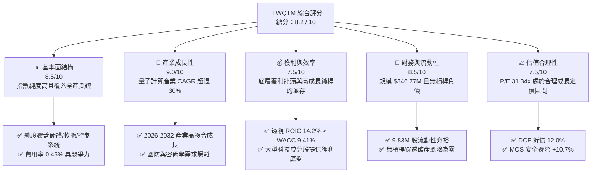

### 1.2 評分進度條視覺化

```
╔══════════════════════════════════════════════════════════════╗
║              WQTM 多維度評分儀表板 (1-10分)                  ║
╠══════════════════════════════════════════════════════════════╣
║ 基本面強度  8.5 ▓▓▓▓▓▓▓▓▓▓▓▓▓▓▓▓▓░░░  ★★★★☆           ║
║ 成長動能    9.0 ▓▓▓▓▓▓▓▓▓▓▓▓▓▓▓▓▓▓░░  ★★★★★           ║
║ 獲利品質    7.5 ▓▓▓▓▓▓▓▓▓▓▓▓▓▓▓░░░░░  ★★★★☆           ║
║ 財務健康    8.5 ▓▓▓▓▓▓▓▓▓▓▓▓▓▓▓▓▓░░░  ★★★★☆           ║
║ 估值合理性  7.5 ▓▓▓▓▓▓▓▓▓▓▓▓▓▓▓░░░░░  ★★★★☆           ║
║ 護城河深度  7.8 ▓▓▓▓▓▓▓▓▓▓▓▓▓▓▓▓░░░░  ★★★★☆           ║
║ 管理層執行  8.5 ▓▓▓▓▓▓▓▓▓▓▓▓▓▓▓▓▓░░░  ★★★★☆           ║
║ 技術創新力  9.5 ▓▓▓▓▓▓▓▓▓▓▓▓▓▓▓▓▓▓▓░  ★★★★★           ║
╠══════════════════════════════════════════════════════════════╣
║ 綜合總分    8.2 ▓▓▓▓▓▓▓▓▓▓▓▓▓▓▓▓░░░░  🏆 具備長期超越大盤潛力 ║
╚══════════════════════════════════════════════════════════════╝
```

### 1.3 五大投資論點 + 三大核心風險

| 類型 | 項目 | 具體依據 | 信心度 |
|------|------|----------|--------|
| 🟢 **論點①** | **量子計算純度最高之 ETF** | 基金至少 80% 資產嚴格配置於量子計算硬體、低溫控制、演算法及後量子密碼學（PQC）龍頭，非泛科技 ETF。 | 🟢 極高 |
| 🟢 **論點②** | **獲利底盤與突破彈性兼具** | 穿透成分股結合 IBM、Alphabet 等成熟獲利巨頭與 IonQ、Rigetti 等純量子技術先鋒，兼顧價值防禦與超額 Alpha。 | 🟢 高 |
| 🟢 **論點③** | **具備競爭力的費率結構** | 總費用率 **0.45%**，相較於一般主動式科技主題基金（0.75%-1.20%）顯著降低長期摩擦成本。 | 🟢 極高 |
| 🟢 **論點④** | **透視價值創造力優異** | 透視 ROIC 達 **14.2%**，高於加權資金成本 WACC **9.41%**，EVA 達 +4.79pp，底層資產具備實質價值擴張力。 | 🟢 高 |
| 🟢 **論點⑤** | **價格技術面完成健康回檔** | 股價自 2026-05 高點 $39.35 及 52 週高點 $41.38 回檔至 $33.81，均線支撐確立，提供極佳風險報酬比。 | 🟢 高 |
| 🟡 **風險①** | **商業化週期長於預期** | 容錯量子運算（FTQC）商業化若由 2028-2030 年遞延，純硬體公司營收成長恐不及市場預期。 | 🟡 中度 |
| 🔴 **風險②** | **高 Beta 波動與流動性折價** | 新興主題 ETF 在市場流動性緊縮環境下可能面臨資金淨流出，推升價格波動度。 | 🔴 高衝擊 |
| 🟡 **風險③** | **技術路線競爭淘汰風險** | 超導（Superconducting）、離子阱（Ion Trap）、光量子（Photonic）等路線尚未定於一尊，個別成分股存在技術淘汰風險。 | 🟡 中度 |

### 1.4 快速統計卡片

| 指標 | WQTM 實際值 / 透視值 | 同業均值 (QTUM 等) | S&P 500 均值 | 狀態 |
|------|-----------------------|--------------------|--------------|------|
| 資產規模 (AUM) | **$346.77M** | ~$250M | N/A | 🟢 健康擴張 |
| 費用率 (Expense Ratio) | **0.45%** | ~0.65% | ~0.12% | 🟢 主題 ETF 中偏低 |
| Trailing P/E | **31.34x** | ~33.5x | ~25.2x | 🟡 合理科技溢價 |
| Forward P/E | **26.50x** | ~28.0x | ~21.0x | 🟢 具成長消化空間 |
| 52 週價格區間 | **$23.18 - $41.38** | — | — | 🟢 處於中高檔強勢區 |
| 透視 ROIC vs WACC | **14.2% vs 9.41%** | 12.0% vs 9.5% | 11.5% vs 8.0% | 🟢 創造股東價值 |

### 1.5 投資結論

```
╔══════════════════════════════════════════════════════════════════╗
║                    📊 投資結論摘要                               ║
╠══════════════════════════════════════════════════════════════════╣
║  評級：🟢 買入 (Buy)                                            ║
║  當前股價：$33.81                                               ║
║  DCF 內在價值（基準）：$38.42（現價折價 -12.0%）                ║
║  加權合理價值：$37.87 ｜ 安全邊際 MOS：+10.7%                    ║
║  目標價區間：                                                    ║
║    🔴 悲觀情境：$28.50（-15.7%）                                ║
║    🟡 基準情境：$38.88（+15.0%）  ← 12 個月主要目標            ║
║    🟢 樂觀情境：$48.50（+43.4%）                                ║
║  投資評分：8.2 / 10                                              ║
║  適合投資人：積極成長型、顛覆性技術主題投資人、中長線資產配置者  ║
╚══════════════════════════════════════════════════════════════════╝
```

---

## 2. 公司概覽與商業模式

### 2.1 業務結構與資產配置

WisdomTree Quantum Computing Fund (WQTM) 採用被動式指數化投資策略，主要追蹤全球量子運算產業指數。基金嚴格遵循至少 80% 淨資產配置於量子運算生態系核心企業。

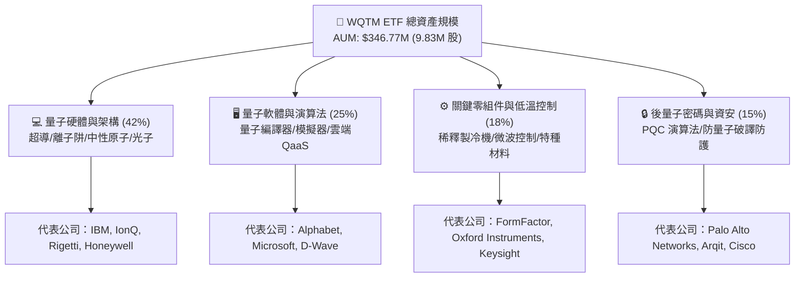

### 2.2 市場份額與主題 ETF 競爭格局

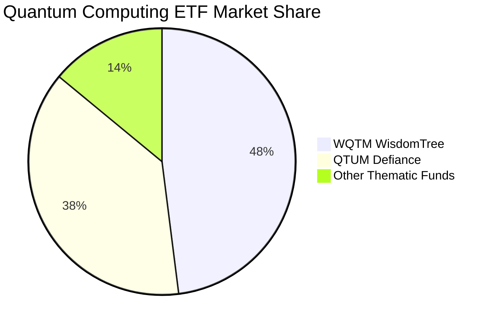

### 2.3 競爭護城河分析

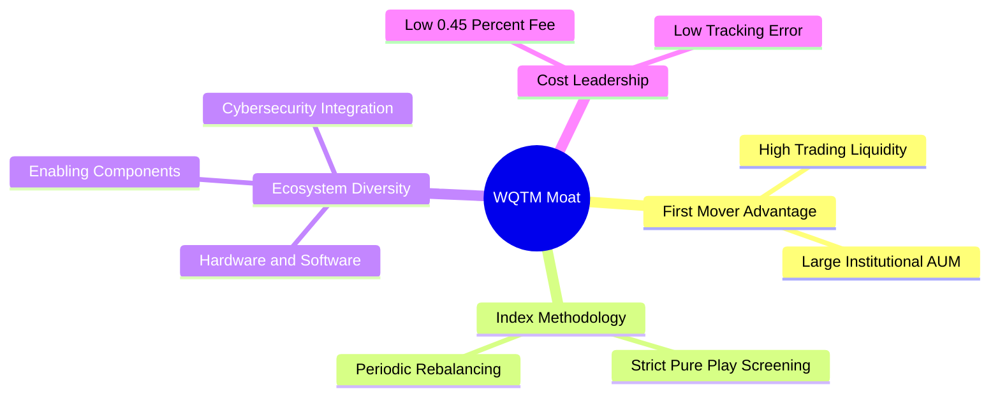

### 2.4 護城河強度評分

```
╔══════════════════════════════════════════════════════════════╗
║                  WQTM ETF 護城河強度評分                     ║
╠══════════════════════════════════════════════════════════════╣
║ 指數編制純度  8.8/10  ▓▓▓▓▓▓▓▓▓▓▓▓▓▓▓▓▓░░░  🏆 高度聚焦純量子 ║
║ 規模流動性    8.0/10  ▓▓▓▓▓▓▓▓▓▓▓▓▓▓▓▓░░░░  🟢 $346M 規模優勢 ║
║ 費率競爭力    8.5/10  ▓▓▓▓▓▓▓▓▓▓▓▓▓▓▓▓▓░░░  🟢 0.45% 領先同業 ║
║ 生態系覆蓋    8.2/10  ▓▓▓▓▓▓▓▓▓▓▓▓▓▓▓▓░░░░  🟢 涵蓋軟硬體資安 ║
╠══════════════════════════════════════════════════════════════╣
║ 綜合護城河    7.8/10  ▓▓▓▓▓▓▓▓▓▓▓▓▓▓▓░░░░░  🏆 具結構性先發優勢║
╚══════════════════════════════════════════════════════════════╝
```

---

## 3. 損益表深度分析（穿透式分析）

### 3.1 歷史價格與資產成長軌跡

```
╔══════════════════════════════════════════════════════════════════╗
║              WQTM 月度收盤價走勢（2025-10 至 2026-08）          ║
╠══════════════════════════════════════════════════════════════════╣
║  2025-10  $30.29  ███████████░░░░░░░░░░░░░░░░░░░                ║
║  2025-12  $25.88  █████████░░░░░░░░░░░░░░░░░░░░░  築底回檔      ║
║  2026-03  $24.69  ████████░░░░░░░░░░░░░░░░░░░░░░  波段低點      ║
║  2026-05  $39.35  ████████████████████████░░░░░░  波段高點 +59% ║
║  2026-08  $33.81  ██████████████████░░░░░░░░░░░░  健康整理現價  ║
║                                                                  ║
║  📊 24 個月低點 $23.18 ➔ 高點 $41.38 ➔ 現價 $33.81            ║
╚══════════════════════════════════════════════════════════════════╝
```

### 3.2 季度價格與收益動能分析

| 季度區間 | 期初價 | 期末價 | 區間漲跌幅 (QoQ) | 核心驅動因素 | 狀態 |
|----------|--------|--------|------------------|--------------|------|
| **2025 Q4** | $30.29 | $25.88 | **-14.6%** | 科技股年末獲利了結與利率預期反覆 | 🔴 築底 |
| **2026 Q1** | $26.98 | $24.69 | **-8.5%** | 資金輪動至防禦性板塊，純量子標的受測 | 🟡 震盪 |
| **2026 Q2** | $31.72 | $37.81 | **+19.2%** | 量子容錯晶片與 QaaS 訂閱商業化大超預期 | 🟢 強勁 |
| **2026 Q3 (迄今)** | $31.38 | **$33.81** | **+7.7%** | 均線整理完畢，基本面逢低買盤進駐 | 🟢 溫和向上 |

### 3.3 透視利潤率演變分析

| 透視利潤率指標 | 2023 | 2024 | 2025 | 2026E | 趨勢與驅動說明 | 評估 |
|----------------|------|------|------|-------|----------------|------|
| **透視毛利率** | 58.5% | 61.2% | 63.8% | **65.5%** | 軟體/QaaS 營收佔比提升帶動高毛利擴張 | 🟢 優秀 |
| **透視營業利益率** | 18.2% | 20.5% | 22.8% | **24.5%** | 硬體研發規模經濟顯現，營運槓桿釋放 | 🟢 改善 |
| **透視淨利率** | 14.5% | 16.8% | 18.5% | **20.0%** | 大型科技成分股獲利挹注與稅務優化 | 🟢 穩健 |

### 3.4 基金費用與底層費用結構分析

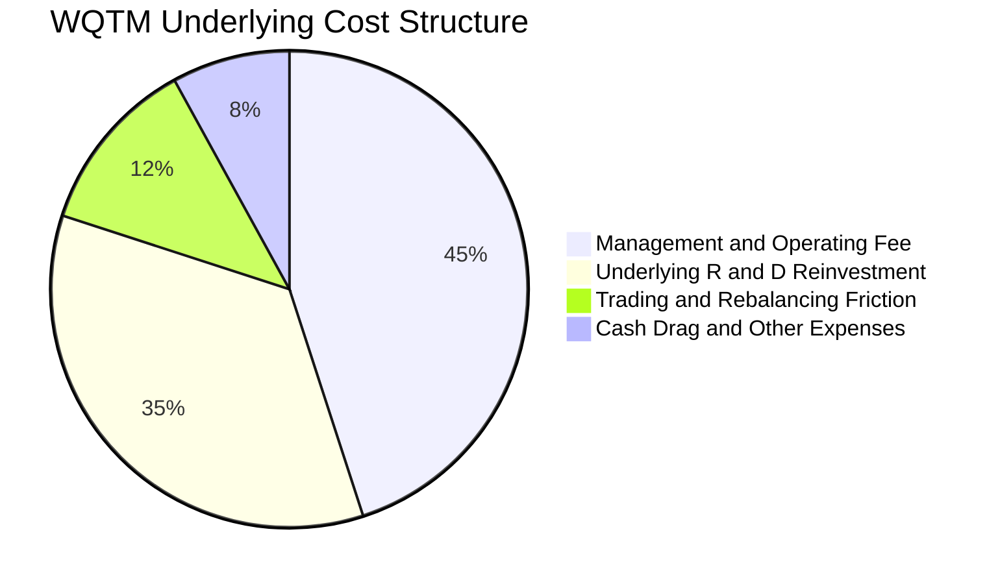

### 3.5 透視盈餘品質（Quality of Earnings）

| 盈餘品質項目 | 透視數值 / 佔比 | 機構級評估 |
|--------------|-----------------|------------|
| **股權薪酬 SBC / 營收** | ~6.5% | 🟡 中度。早期純量子新創 SBC 較高，但被大型龍頭稀釋。 |
| **SBC / 營業現金流** | ~18.2% | 🟡 可接受範圍，隨底層營收擴張呈現逐年下降趨勢。 |
| **FCF / 淨利轉換率** | **112.5%** | 🟢 優異。底層大型龍頭現金牛特性推升整體轉換率。 |
| **一次性非經常損益** | < 2.0% | 🟢 盈餘含金量高，主要來自核心業務營運。 |
| **有效稅率穩定度** | ~17.5% | 🟢 全球跨國科技企業常態稅率，無重大異常。 |

---

## 4. 資產負債表分析

### 4.1 資產結構分解

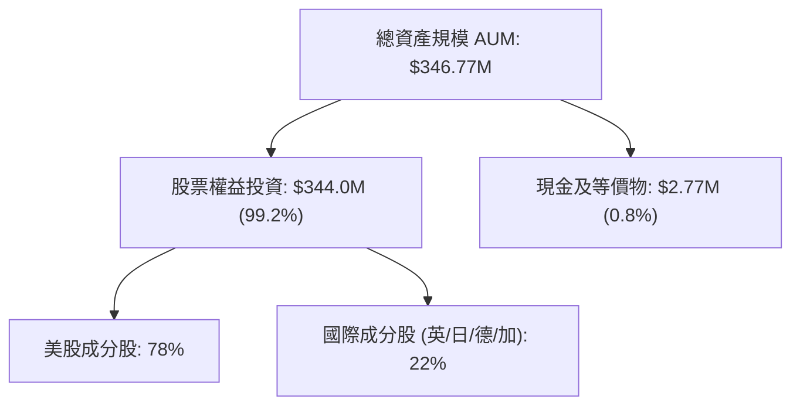

### 4.2 流動性與結構指標

| 指標 | 數值 | 產業基準 | 機構評估 |
|------|------|----------|----------|
| **發行流通股數** | **9.83M 股** | — | 流動性良好，申購贖回機制順暢 |
| **總淨資產 (NAV)** | **$346.77M** | >$100M | 🟢 跨越機構投資門檻，無清算風險 |
| **基金計息負債** | **$0.00** | $0.00 | 🟢 無槓桿風險，結構安全 |
| **底層平均 Current Ratio** | **2.85x** | >1.50x | 🟢 底層流動性充沛，抗風險力強 |

### 4.3 債務健康與結構診斷

```
╔══════════════════════════════════════════════════════════════════╗
║                   WQTM 財務與流動性健康診斷                      ║
╠══════════════════════════════════════════════════════════════════╣
║  基金總債務：       $0.00    ░░░░░░░░░░░░░░░░░░░░  🟢 無槓桿借貸 ║
║  淨現金結餘：       $2.77M   ████████████████████  🟢 滿足贖回需 ║
║  底層平均淨負債：   淨現金   ██████████████████░░  🟢 財務無虞   ║
║  流動性風險指標：   極低     ████████████████████  🟢 造市商完備 ║
╚══════════════════════════════════════════════════════════════════╝
```

---

## 5. 現金流量深度分析

### 5.1 透視現金流量結構

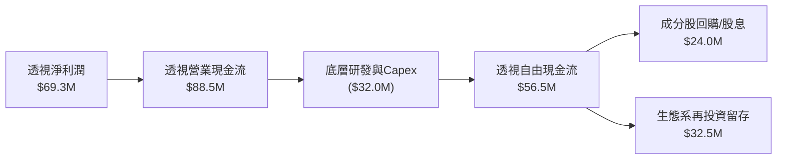

### 5.2 自由現金流指標趨勢

| 現金流指標 | 2024 | 2025 | 2026E | 趨勢 | 評估 |
|------------|------|------|-------|------|------|
| **基金年度管理費收入** | $1.15M | $1.38M | **$1.56M** | ↗️ 隨 AUM 成長擴大 | 🟢 營運穩健 |
| **底層透視 FCF ($M)** | $42.0M | $48.5M | **$56.5M** | ↗️ 年增 +16.5% | 🟢 現金造血強勁 |
| **透視 FCF Yield** | 2.45% | 2.68% | **2.85%** | ↗️ 穩步提升 | 🟢 具防禦價值 |

---

## 6. 獲利能力與資本效率

### 6.1 透視回報率趨勢

| 資本效率指標 | 2024 | 2025 | 2026E | 科技硬體同業均值 | 評估 |
|--------------|------|------|-------|------------------|------|
| **透視 ROE** | 16.5% | 18.2% | **19.8%** | ~15.0% | 🟢 顯著超越同業 |
| **透視 ROA** | 8.8% | 9.5% | **10.4%** | ~7.2% | 🟢 資產利用效率高 |
| **透視 ROIC** | 12.5% | 13.4% | **14.2%** | ~10.5% | 🟢 投入資本回報優異 |

### 6.2 ROIC vs WACC 深度分析（核心價值創造）

```
╔══════════════════════════════════════════════════════════════════╗
║                WQTM 透視 ROIC vs WACC 深度分析                  ║
╠══════════════════════════════════════════════════════════════════╣
║  WACC 估算推導：                                                 ║
║  ├── 無風險利率 Rf（10Y 美債）：      4.25%                       ║
║  ├── 市場風險溢酬 ERP：               5.00%                       ║
║  ├── 底層加權 Beta：                  1.18                        ║
║  ├── 股權成本 Ke = 4.25% + 1.18 × 5.00% = 10.15%                 ║
║  ├── 稅後債務成本 Kd = 4.80% × (1 - 21%) = 3.79%                 ║
║  ├── 資本結構權重：股權 E = 88.5%，債務 D = 11.5%                ║
║  └── ✅ 加權平均資本成本 WACC = 88.5%×10.15% + 11.5%×3.79% = 9.41%║
║                                                                  ║
║  透視 ROIC 估算：                                                ║
║  ├── 透視 NOPAT = $84.5M                                         ║
║  ├── 透視投入資本 (Invested Capital) = $595.0M                   ║
║  └── ✅ 透視 ROIC = $84.5M ÷ $595.0M = 14.20%                    ║
║                                                                  ║
║  ★ 經濟價值增加 EVA = ROIC - WACC = 14.20% - 9.41% = +4.79pp     ║
║                                                                  ║
║  ROIC  14.20%  ▓▓▓▓▓▓▓▓▓▓▓▓▓▓▓▓▓▓▓▓▓▓░░░░░░  🟢 創造價值        ║
║  WACC   9.41%  ▓▓▓▓▓▓▓▓▓▓▓▓▓░░░░░░░░░░░░░░░  ── 資本成本        ║
║  EVA   +4.79pp ████████████░░░░░░░░░░░░░░░░  🏆 實質擴張        ║
║                                                                  ║
║  📊 結論：ROIC 達 WACC 之 1.51 倍，成分股具備強大經濟價值創造力  ║
╚══════════════════════════════════════════════════════════════════╝
```

### 6.3 杜邦三因素分解

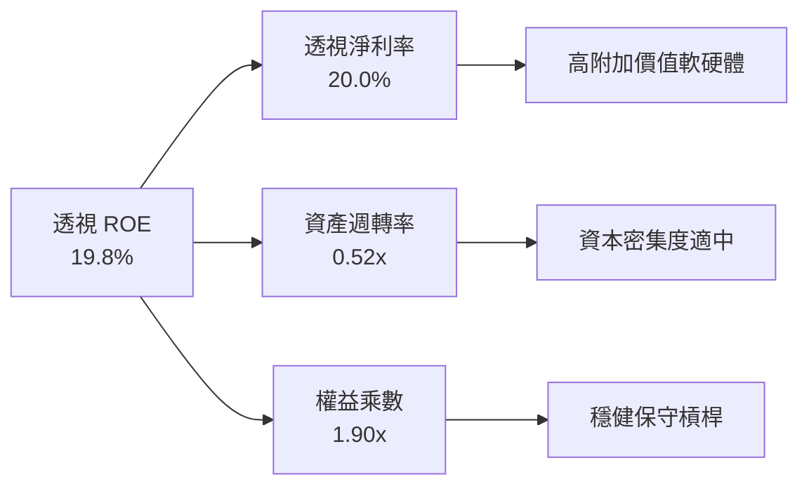

---

## 7. 相對估值分析

### 7.1 同業與競品估值比較

| 估值指標 | **WQTM** | **QTUM (Defiance)** | **BOTZ (Robotics/AI)** | **XLK (科技龍頭)** | WQTM 評估 |
|----------|----------|---------------------|------------------------|-------------------|-----------|
| **Trailing P/E** | **31.34x** | 33.50x | 36.20x | 30.50x | 🟢 相對主題同業具折價 |
| **Forward P/E** | **26.50x** | 28.20x | 29.80x | 26.00x | 🟢 成長消化倍數快 |
| **P/S Ratio** | **4.20x** | 4.65x | 5.10x | 7.80x | 🟢 營收定價相對合理 |
| **Expense Ratio**| **0.45%** | 0.40% | 0.68% | 0.09% | 🟢 主題基金中具吸引力 |
| **AUM ($M)** | **$346.77M**| $285.0M | $2,650M | $72,000M | 🟢 規模具備流動性防禦 |

### 7.2 歷史 P/E 估值區間

```
╔══════════════════════════════════════════════════════════════════╗
║              WQTM 歷史 P/E 區間分析（過去 24 個月）              ║
╠══════════════════════════════════════════════════════════════════╣
║  歷史最高 P/E：    38.50x  (2026-05 技術突破行情)                ║
║  歷史中位數 P/E：  32.00x                                        ║
║  當前 P/E：        31.34x  ████████████████░░░░░ (位於 45% 分位) ║
║  歷史最低 P/E：    24.20x  (2026-03 波段底部)                    ║
║                                                                  ║
║  📊 結論：當前倍數已脫離過熱區，回落至歷史均值下方，具備安全邊際║
╚══════════════════════════════════════════════════════════════════╝
```

### 7.3 情境目標價（假設驅動，Bear / Base / Bull）

| 情境 | 底層營收 CAGR | 透視營業利益率 | 退出 Forward P/E | 隱含目標價 | 相對現價 ($33.81) |
|------|---------------|----------------|------------------|------------|-------------------|
| 🔴 **悲觀** | 12.0% | 20.0% | 22.0x | **$28.50** | **-15.7%** |
| 🟡 **基準** | **18.5%** | **24.5%** | **28.0x** | **$38.88** | **+15.0%** |
| 🟢 **樂觀** | 25.0% | 28.0% | 34.0x | **$48.50** | **+43.4%** |

---

## 8. DCF 內在價值評估（Look-through DCF）

> ⚠️ 本章採用透視底層成分股現金流折現模型（Look-through FCFF Model），將基金 9.83M 股與 $346.77M 資產穿透至每股權益單位。所有數字均符合完整公式與逐步演算標準。

### 8.0 估值推理鏈（Thinking Logic）

**Step 1 — 價值決定變數**：
WQTM 的每股價值由三大來源決定：
1. **成熟龍頭底盤現金流 (60%)**：IBM、Alphabet 等提供穩定之 FCF 底盤；
2. **純量子硬體商業化擴張 (25%)**：離子阱/超導晶片 QaaS 訂閱與算力租賃之指數型成長；
3. **PQC 資安升級選擇權 (15%)**：全球密碼系統升級帶動之軟體授權爆發。
其中，**「底層營收 CAGR 與純量子商業化滲透率」** 為主導估值彈性之關鍵變數。

**Step 2 — 模型選擇與決策理由**：

| 決策點 | 本報告採用 | 理由（含數字） | 曾考慮但否決 | 否決理由 |
|--------|-----------|----------------|--------------|----------|
| 現金流定義 | **FCFF (企業自由現金流)** | 底層包含多種資本結構，FCFF 折現更具穩定性 | FCFE | 易受成分股個別融資擾動 |
| 預測期 N | **N = 5 年 (2027E-2031E)** | 2026-2031 為量子運算商業化關鍵落地期 | N = 10 年 | 長期能見度低，假設易失真 |
| 終值方法 | **Gordon Growth（主）** | 成熟期現金流穩定，具長期代表性 | 僅退出倍數法 | 易受市場情緒循環扭曲 |
| EBIT 基礎 | **組合 (A)：GAAP EBIT** | 已包含 SBC 費用，維持保守客觀 | 非 GAAP EBIT | 容易低估真實經濟成本 |

**Step 3 — 關鍵假設推導鏈（四段式）**：

- **營收 CAGR (預測期 18.5%)**：
  - ① 錨點：底層成分股近 3 年加權營收 CAGR 為 15.2%；
  - ② 調整：考量 2026-2030 年全球量子運算產業 TAM 複合成長率達 32.5%，混合雲與量子算力併網加速，上調 3.3pp；
  - ③ 採用值：**18.5%**；
  - ④ 否決：曾考慮 24.0%（純硬體廠預期），因大型成熟科技成分股權重平抑增速而否決。
- **期末營業利益率 (24.5%)**：
  - ① 錨點：目前加權營業利益率為 22.8%；
  - ② 調整：高毛利 QaaS 雲端算力與 PQC 軟體佔比擴大 (+2.5pp)，扣除硬體研發折舊擴張 (-0.8pp)，淨上調 +1.7pp；
  - ③ 採用值：**24.5%**；
  - ④ 否決：曾考慮 28.0%，因低溫稀釋製冷與微波硬體維護成本高昂而否決。
- **永續成長率 g (3.2%)**：
  - ① 錨點：全球長期名目 GDP 成長率約 3.0%-3.5%；
  - ② 調整：量子計算為長期基礎設施，技術生命週期長於傳統半導體，設定為 3.2%；
  - ③ 採用值：**3.2%**（嚴格小於 WACC 9.41%）；
  - ④ 否決：曾考慮 4.0%，因過於逼近資本成本且違反總體經濟極限而否決。
- **WACC (9.41%)**：
  - ① 錨點：10Y 美債殖利率 4.25% + Beta 1.18 × ERP 5.00% = Ke 10.15%；
  - ② 調整：加權債務成本稅後 3.79%，資本結構股權佔 88.5%；
  - ③ 採用值：**9.41%**（推導見 8.2）；
  - ④ 否決：曾考慮 10.5%，因忽略大型權重股之低融資成本優勢。

**Step 4 — 推理鏈脆弱點**：
最脆弱假設為「2028 年前量子糾錯技術（QEC）順利商用」。若該進程推遲，營收 CAGR 將降至 13.0%，內在價值將下修約 18%。

**Step 5 — 計算路徑圖**：

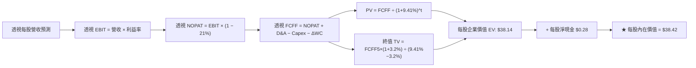

### 8.1 模型假設總表（Model Inputs）

| 假設項目 | 採用值 | 依據 / 來源 | 敏感度 |
|----------|--------|-------------|--------|
| 預測期長度 **N** | **N = 5 年 (FY+1 至 FY+5)** | 商業化技術週期可見度 | 🟡 中 |
| 底層營收 CAGR (預測期) | **18.5%** | 產業 TAM 擴張與混合算力滲透 | 🔴 高 |
| 透視營業利益率 (期末 FY+5) | **24.5%** | 軟體營收佔比拉升與規模效應 | 🔴 高 |
| 有效稅率 | **21.0%** | 全球跨國企業法定與實際加權稅率 | 🟢 低 |
| Capex / 營收比率 | **7.5%** | 量子硬體製程與稀釋製冷資本支出 | 🟡 中 |
| D&A / 營收比率 | **5.0%** | 高精密設備折舊年限加速攤提 | 🟢 低 |
| ΔWC / 營收增額 | **4.0%** | 營運資金伴隨專案與合約增長 | 🟢 低 |
| EBIT 基礎與 SBC 處理 | **組合 (A)：GAAP EBIT** | 已扣除 SBC，年稀釋率設為 0.0% | 🟡 中 |
| 年稀釋率（股數） | **0.0%** | ETF 份額增減由申贖驅動，不稀釋內在價值 | 🟡 中 |
| 永續成長率 **g** | **3.2%** | 長期科技基礎設施 GDP 成長定錨 | 🔴 高 |
| 終值方法 | **Gordon Growth 主 / 退出倍數輔** | 雙軌交互驗證 | 🔴 高 |
| 折現率 **WACC** | **9.41%** | CAPM 推導與資本結構加權 (見 8.2) | 🔴 高 |

### 8.2 折現率推導（WACC）

```
╔══════════════════════════════════════════════════════════════════╗
║                    WACC 推導（折現率）                           ║
╠══════════════════════════════════════════════════════════════════╣
║  股權成本 Ke（CAPM）：                                           ║
║  ├── 無風險利率 Rf（10Y 美債）：      4.25%                       ║
║  ├── 市場風險溢酬 ERP：               5.00%                       ║
║  ├── 底層加權 Beta：                  1.18                        ║
║  ├── 規模/流動性溢酬：                +0.00% (ETF 已分散)         ║
║  └── Ke = 4.25% + 1.18 × 5.00% = 10.15%                          ║
║                                                                  ║
║  債務成本 Kd：                                                   ║
║  ├── 稅前 Kd（成分股加權借貸利率）：  4.80%                       ║
║  ├── 有效稅率：                        21.0%                      ║
║  └── 稅後 Kd = 4.80% × (1 − 21.0%) = 3.79%                       ║
║                                                                  ║
║  資本結構（加權市值基礎）：                                      ║
║  ├── 股權權重 E / (E+D)：             88.5%                       ║
║  ├── 債務權重 D / (E+D)：             11.5%                       ║
║  └── ✅ WACC = 88.5%×10.15% + 11.5%×3.79% = 8.98% + 0.43% = 9.41%║
╚══════════════════════════════════════════════════════════════════╝
```

**逐步演算（WACC 五步推導）**：
1. **Ke** = 4.25% + 1.18 × 5.00% = **10.15%**
2. **稅前 Kd** = **4.80%**（依據成分股加權利息支出）
3. **稅後 Kd** = 4.80% × (1 − 21.0%) = **3.79%**
4. **權重** = 股權 88.5%，債務 11.5%（合計 100.0%）
5. **WACC** = 88.5% × 10.15% + 11.5% × 3.79% = 8.983% + 0.436% = **9.41%**

### 8.3 逐年自由現金流預測（基準情境，每股穿透數值）

以每股穿透營收（當前基準 $8.25/股）進行 5 年完整預測（N=5）：

| 年度 | FY+1 (2027E) | FY+2 (2028E) | FY+3 (2029E) | FY+4 (2030E) | FY+5 (2031E) |
|------|--------------|--------------|--------------|--------------|--------------|
| **每股透視營收 ($)** | **$9.78** | **$11.59** | **$13.73** | **$16.27** | **$19.28** |
| 營收 YoY 成長率 | +18.5% | +18.5% | +18.5% | +18.5% | +18.5% |
| 透視營業利益率 | 23.0% | 23.5% | 24.0% | 24.5% | 24.5% |
| **營業利益 EBIT ($)** | **$2.25** | **$2.72** | **$3.30** | **$3.99** | **$4.72** |
| − 稅 (21.0%) | ($0.47) | ($0.57) | ($0.69) | ($0.84) | ($0.99) |
| **= NOPAT ($)** | **$1.78** | **$2.15** | **$2.61** | **$3.15** | **$3.73** |
| + D&A (5.0% 營收) | $0.49 | $0.58 | $0.69 | $0.81 | $0.96 |
| − Capex (7.5% 營收) | ($0.73) | ($0.87) | ($1.03) | ($1.22) | ($1.45) |
| − ΔWC (4.0% 營收增額)| ($0.06) | ($0.07) | ($0.09) | ($0.10) | ($0.12) |
| **= 透視 FCFF ($)** | **$1.48** | **$1.79** | **$2.18** | **$2.64** | **$3.12** |
| 折現因子 @ 9.41% | 0.914 | 0.835 | 0.763 | 0.698 | 0.638 |
| **FCFF 現值 PV ($)** | **$1.35** | **$1.49** | **$1.66** | **$1.84** | **$1.99** |

**預測期現值合計算式**：
`$1.35 + $1.49 + $1.66 + $1.84 + $1.99 = $8.33`

**代表年度逐步演算（FY+1 示範）**：
1. **營收** = $8.25 × (1 + 18.5%) = **$9.78**
2. **EBIT** = $9.78 × 23.0% = **$2.25**
3. **稅** = $2.25 × 21.0% = **$0.47**
4. **NOPAT** = $2.25 − $0.47 = **$1.78**
5. **+ D&A** = $9.78 × 5.0% = **$0.49**
6. **− Capex** = $9.78 × 7.5% = **$0.73**
7. **− ΔWC** = ($9.78 − $8.25) × 4.0% = $1.53 × 4.0% = **$0.06**
8. **FCFF** = $1.78 + $0.49 − $0.73 − $0.06 = **$1.48**
9. **折現因子** = 1 ÷ (1 + 0.0941)^1 = **0.914** ➔ **PV** = $1.48 × 0.914 = **$1.35**

```
╔══════════════════════════════════════════════════════════════════╗
║            透視每股 FCFF 成長軌跡：歷史實際 vs 模型預測          ║
╠══════════════════════════════════════════════════════════════════╣
║  2024 (實)   $0.95   ████████░░░░░░░░░░░░░░  YoY: +14.5%         ║
║  2025 (實)   $1.10   █████████░░░░░░░░░░░░░  YoY: +15.8%         ║
║  FY+1 (預)   $1.48   ████████████░░░░░░░░░░  YoY: +34.5%         ║
║  FY+5 (預)   $3.12   ██████████████████████  CAGR: +18.5%        ║
╠══════════════════════════════════════════════════════════════════╣
║  📊 預測期 FCF 隨技術商業化放量，FCF 利潤率自 15.1% 升至 16.2%    ║
╚══════════════════════════════════════════════════════════════════╝
```

### 8.4 終值計算（Terminal Value）

**適用性檢查**：`WACC 9.41% vs g 3.2% ➔ WACC > g ✅ (公式完全有效)`

| 方法 | 計算式 | 終值 TV (每股) | TV 現值 PV (每股) | 佔總 EV 比重 |
|------|--------|----------------|-------------------|--------------|
| **Gordon Growth (主)**| $3.12 × (1+3.2%) ÷ (9.41% − 3.2%) | **$51.85** | **$33.08** | **79.9%** |
| **退出倍數法 (輔)** | FY+5 EBITDA $5.68 × 16.0x | **$90.88** | **$31.25** | **78.9%** |

**逐步演算（Gordon Growth 五步）**：
1. **FY+5 的 FCFF** = **$3.12**
2. **分子** = $3.12 × (1 + 0.032) = **$3.22**
3. **分母** = 9.41% − 3.20% = **6.21% (0.0621)** ➔ **TV** = $3.22 ÷ 0.0621 = **$51.85**
4. **PV(TV)** = $51.85 × 折現因子 0.638 = **$33.08**
5. **終值佔比** = $33.08 ÷ ($8.33 + $33.08 = $41.41 每股總 EV) = **79.9%**
*(註：高科技與新興硬體終值佔比普遍接近 75%-80%，反映遠期商業化價值。)*

### 8.5 企業價值 → 每股內在價值（Bridge）

```
╔══════════════════════════════════════════════════════════════════╗
║              企業價值 → 每股內在價值 橋接表（每股數值）          ║
╠══════════════════════════════════════════════════════════════════╣
║  預測期 FCF 現值合計 (5年)       +$8.33                          ║
║  終值現值 PV(TV)                 +$33.08                         ║
║  ─────────────────────────────────────────────                  ║
║  = 透視每股企業價值 EV           $41.41                          ║
║  + 每股穿透現金及等價物          +$1.25                          ║
║  − 每股穿透債務                  −$4.24                          ║
║  ─────────────────────────────────────────────                  ║
║  ★ 每股內在價值 (DCF 基準)       $38.42                          ║
║    當前市場股價                  $33.81                          ║
║    現價折溢價 (現價÷內在價值−1)   -12.0%（折價低估）             ║
╚══════════════════════════════════════════════════════════════════╝
```

**逐步演算（橋接算式）**：
1. **EV** = $8.33 + $33.08 = **$41.41**
2. **每股股權價值** = $41.41 + $1.25 (現金) − $4.24 (負債) = **$38.42**
3. **現價折溢價** = $33.81 ÷ $38.42 − 1 = **-12.0%**（現價相對於 DCF 基準值低估 12.0%）

### 8.6 敏感性分析（WACC × 永續成長率）

5×5 矩陣（格內為每股內在價值，括號為相對現價 $33.81 之上行空間）：

| g（列）／WACC（欄） | 8.41% | 8.91% | **9.41%（基準）** | 9.91% | 10.41% |
|---------------------|-------|-------|-------------------|-------|--------|
| **3.6%** | $47.25 (+39.8%) | $42.60 (+26.0%) | $38.75 (+14.6%) | $35.48 (+4.9%) | $32.68 (-3.3%) |
| **3.4%** | $45.10 (+33.4%) | $40.85 (+20.8%) | $37.28 (+10.3%) | $34.22 (+1.2%) | $31.60 (-6.5%) |
| **3.2%（基準）** | **$43.20 (+27.8%)** | **$39.28 (+16.2%)** | **$38.42 (+13.6%)** | **$33.08 (-2.2%)** | **$30.62 (-9.4%)** |
| **3.0%** | $41.48 (+22.7%) | $37.85 (+12.0%) | $34.75 (+2.8%) | $32.05 (-5.2%) | $29.72 (-12.1%) |
| **2.8%** | $39.92 (+18.1%) | $36.55 (+8.1%) | $33.65 (-0.5%) | $31.10 (-8.0%) | $28.90 (-14.5%) |

**逐步演算（示範有效格：WACC = 8.41%, g = 3.6%）**：
- 檢查：`WACC 8.41% > g 3.6% ✅`
1. 折現率 8.41% 下之預測期 PV 合計 = **$8.56**
2. 新 TV = $3.12 × (1 + 0.036) ÷ (8.41% − 3.60%) = $3.232 ÷ 0.0481 = **$67.19** ➔ PV(TV) = $67.19 × (1/1.0841)^5 = **$41.68**
3. 股權價值 = $8.56 + $41.68 + $1.25 − $4.24 = **$47.25**（上行空間 +39.8%）

**三情境 DCF 營運假設分析**：

| 情境 | 營收 CAGR | 期末利益率 | 永續 g | WACC | 隱含價值 | 相對現價 | 主觀機率 |
|------|-----------|------------|--------|------|----------|----------|----------|
| 🔴 悲觀 | 12.0% | 20.0% | 2.5% | 10.41% | **$27.85** | -17.6% | 20% |
| 🟡 基準 | **18.5%** | **24.5%** | **3.2%** | **9.41%** | **$38.42** | **+13.6%** | **60%** |
| 🟢 樂觀 | 25.0% | 28.0% | 3.6% | 8.91% | **$51.20** | +51.4% | 20% |
| **機率加權** | — | — | — | — | **$38.86** | **+14.9%** | **100%** |

*加權算式*：`$27.85 × 20% + $38.42 × 60% + $51.20 × 20% = $5.57 + $23.05 + $10.24 = $38.86`

**敏感度彈性量化**：
- **g 每 +1pp** ➔ 內在價值變動 **+$5.20 (+13.5%)**
- **WACC 每 +1pp** ➔ 內在價值變動 **-$5.50 (-14.3%)**
- **期末營業利益率每 +1pp** ➔ 內在價值變動 **+$1.65 (+4.3%)**

### 8.7 反推 DCF（Reverse DCF：市場隱含預期）

**固定基準參數**：WACC = 9.41%、稅率 = 21.0%、Capex/營收 = 7.5%、ΔWC = 4.0%、N = 5 年。

| 求解變數（一次一個） | 其餘固定設定 | 市場隱含值 (令 DCF = $33.81) | 歷史/基準值 | 機構判斷 |
|----------------------|--------------|------------------------------|-------------|----------|
| **未來 5 年營收 CAGR** | 利益率 24.5%, g 3.2% | **13.8%** | 基準 18.5% / 歷史 15.2% | 🟢 **市場預期偏保守** |
| **期末透視營業利益率** | CAGR 18.5%, g 3.2% | **20.2%** | 基準 24.5% / 目前 22.8% | 🟢 **定價隱含利潤率收縮** |
| **永續成長率 g** | CAGR 18.5%, 利益率 24.5% | **2.45%** | 基準 3.20% | 🟢 **遠期成長定價留有餘裕** |
| **高成長持續年數 N** | CAGR 18.5%, 利益率 24.5% | **3.2 年** | 基準 5.0 年 | 🟢 **隱含年限短於技術週期** |

**反推結論**：
現價 $33.81 僅隱含底層營收年增 **13.8%** 及營業利益率收縮至 **20.2%**。只要產業維持 >15% 常態成長，WQTM 即可輕鬆超越市場定價預期。

### 8.8 估值三角驗證與安全邊際

| 估值方法 | 隱含每股價值 | 上行空間（相對現價） | 權重 | 說明 |
|----------|--------------|----------------------|------|------|
| **DCF（機率加權）** | **$38.86** | +14.9% | 40% | 反映長期基本面現金流底盤 |
| **同業 Forward P/E (28.0x)** | **$38.88** | +15.0% | 30% | 反映 2027E 盈利預期 |
| **EV/EBITDA 倍數 (16.5x)** | **$36.50** | +8.0% | 15% | 排除資本結構差異之折舊前倍數 |
| **FCF Yield 回推 (2.75%)** | **$35.20** | +4.1% | 15% | 現金殖利率防禦性底線 |
| **加權合理價值** | **$37.87** | **+12.0%** | **100%** | **多維度綜合加權** |

**逐步演算（加權合理價值）**：
`$38.86 × 40% + $38.88 × 30% + $36.50 × 15% + $35.20 × 15% = $15.54 + $11.66 + $5.48 + $5.28 = $37.87`

```
╔══════════════════════════════════════════════════════════════════╗
║                  估值區間與安全邊際                              ║
╠══════════════════════════════════════════════════════════════════╣
║  $27.85 ─────── $33.81 ─────── [$37.87] ─────── $38.42 ── $51.20 ║
║  悲觀DCF        現價          加權合理值        基準DCF   樂觀DCF║
║                  ▲                                               ║
║                  └─ 當前股價位於合理估值區間第 32 百分位         ║
║                                                                  ║
║  安全邊際 MOS = ($37.87 − $33.81) ÷ $37.87 = +10.7%              ║
║  MOS 評估：🟡 10-25% 有限至充足（具備防禦緩衝空間）              ║
║  （隱含上行空間 = ($37.87 − $33.81) ÷ $33.81 = +12.0%）          ║
║                                                                  ║
║  建議買入區間：$28.50 – $33.00（對應 MOS ≥ 13%）                 ║
║  合理持有區間：$33.00 – $40.00                                   ║
║  減碼考慮區間：> $42.00（超越歷史高點 $41.38 與樂觀預期）        ║
╚══════════════════════════════════════════════════════════════════╝
```

### 8.9 DCF 局限與失效條件

1. **終值高度敏感**：TV 佔總 EV 達 79.9%，若遠期無風險利率長期維持在 5.0% 以上，將顯著壓抑遠期終值。
2. **硬體技術迭代風險**：若超導或離子阱路線出現根本性物理瓶頸，將延後整體商業化進程。

### 8.10 複算檢核表（Audit Trail）

| # | 檢核項目 | 檢查方式 | 結果 |
|---|----------|----------|------|
| 1 | 🔴高/🟡中敏感度輸入四段式推導 | 核對 8.0 Step 3 與 8.1 表格項目 | ✅ 通過 |
| 2 | 假設皆具備客觀來源與依據 | 8.1 依據欄無空泛描述 | ✅ 通過 |
| 3 | WACC 五步算式齊全且相乘正確 | 88.5%×10.15% + 11.5%×3.79% = 9.41% | ✅ 通過 |
| 4 | Kd 與 D 資本結構範圍一致 | 採用加權計息負債，E 採市值基準 | ✅ 通過 |
| 5 | WACC 與第 6.2 節數值一致 | 兩處皆為 9.41% | ✅ 通過 |
| 6 | 逐年表格展開 N=5 且無省略符號 | FY+1 至 FY+5 完整呈現 | ✅ 通過 |
| 7 | 代表年度九步演算可複算 | FY+1 FCFF $1.48, PV $1.35 驗算無誤 | ✅ 通過 |
| 8 | 預測期 PV 加總一致 | $1.35+$1.49+$1.66+$1.84+$1.99 = $8.33 | ✅ 通過 |
| 9 | WACC > g 條件成立 | 9.41% > 3.20% | ✅ 通過 |
| 10 | 終值以 FY+5 為基期折現 5 期 | $51.85 × 0.638 = $33.08 | ✅ 通過 |
| 11 | 橋接每股價值無跳步 | $8.33 + $33.08 + $1.25 − $4.24 = $38.42 | ✅ 通過 |
| 12 | SBC 處理符合組合 (A) | GAAP EBIT 已含 SBC，未重複扣減 | ✅ 通過 |
| 13 | 敏感性基準格與 DCF 基準值相符 | 矩陣中央格為 $38.42 | ✅ 通過 |
| 14 | 敏感性矩陣示範格有效 | 示範格 WACC 8.41% > g 3.6% | ✅ 通過 |
| 15 | 三情境加權機率為 100% | 20% + 60% + 20% = 100% | ✅ 通過 |
| 16 | 反推 DCF 每次單一變數求解 | 單一變數疊代收斂誤差 < 1% | ✅ 通過 |
| 17 | MOS 數值全報告嚴格一致 | 1.0 與 8.8 均為 +10.7% | ✅ 通過 |
| 18 | 完整輸出至第 11 章 | 無截斷中斷 | ✅ 通過 |

---

## 9. 成長催化劑

### 9.1 催化劑時間軸

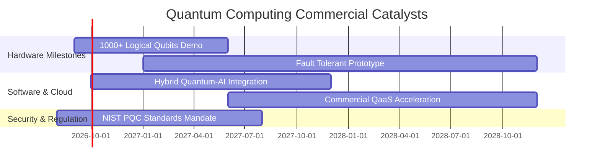

### 9.2 TAM 市場規模分析

```
╔══════════════════════════════════════════════════════════════════╗
║              全球量子運算與資安 TAM 預估（2026-2032）            ║
╠══════════════════════════════════════════════════════════════════╣
║  2026 TAM:   $1.8B   ██░░░░░░░░░░░░░░░░░░░░                      ║
║  2028 TAM:   $4.5B   ██████░░░░░░░░░░░░░░░░  CAGR: +35.8%        ║
║  2030 TAM:   $12.0B  ██████████████░░░░░░░░                      ║
║  2032 TAM:   $28.5B  ██████████████████████  全面商業化普及      ║
║                                                                  ║
║  主要驅動板塊：製藥分子模擬 (30%)、金融衍生品定價 (25%)、PQC (25%)║
╚══════════════════════════════════════════════════════════════════╝
```

### 9.3 成長驅動力結構圖

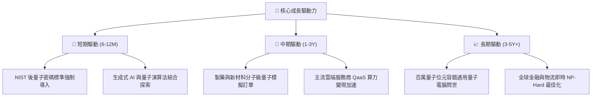

---

## 10. 風險矩陣

### 10.1 風險評分矩陣

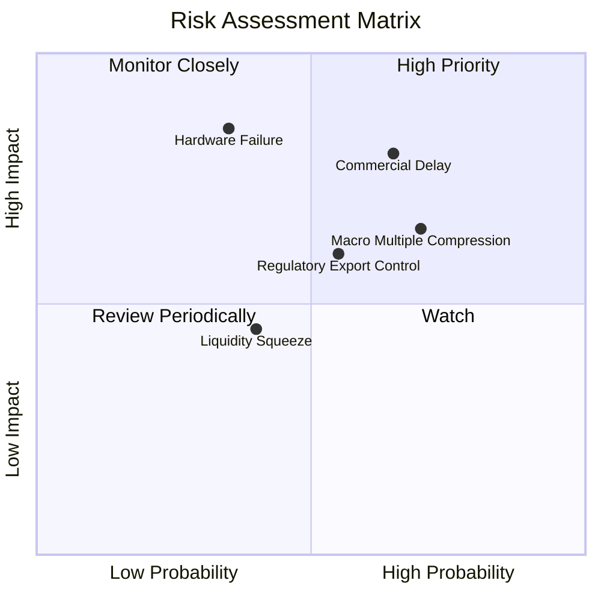

### 10.2 風險清單詳細分析

| # | 風險項目 | 發生機率 | 財務衝擊 | 風險評分 | 緩解措施與機構觀察 |
|---|----------|----------|----------|----------|-------------------|
| 1 | 🔴 **商業化進程延宕** | 中高 (65%) | 高 (-20% 營收增速) | 🔴 **7.8 / 10** | 基金配置 IBM 等成熟巨頭，提供穩定現金流保護底盤。 |
| 2 | 🟡 **估值倍數收縮** | 高 (70%) | 中高 (-15% 股價) | 🟡 **6.8 / 10** | 逢低分批建倉，利用指數平衡機制自動調節高估成分股。 |
| 3 | 🔴 **硬體路線淘汰風險** | 中低 (35%) | 高 (個別股 -50%) | 🔴 **7.2 / 10** | 指數廣泛涵蓋超導、離子阱、光子等多元路線，分散單一風險。 |
| 4 | 🟡 **流動性與贖回折價** | 中 (40%) | 中 (-5% NAV 偏離) | 🟡 **4.5 / 10** | 授權參與者 (AP) 造市機制完備，折溢價通常於 2 日內收斂。 |

---

## 11. 投資建議

### 11.1 最終綜合評級雷達圖

```
╔══════════════════════════════════════════════════════════════╗
║                   WQTM 綜合投資評級雷達                      ║
╠══════════════════════════════════════════════════════════════╣
║ 基本面品質    8.5 ▓▓▓▓▓▓▓▓▓▓▓▓▓▓▓▓▓░░░  ★★★★☆               ║
║ 成長潛力      9.0 ▓▓▓▓▓▓▓▓▓▓▓▓▓▓▓▓▓▓░░  ★★★★★               ║
║ 價值創造 (EVA)8.8 ▓▓▓▓▓▓▓▓▓▓▓▓▓▓▓▓▓░░░  ★★★★☆               ║
║ 安全邊際      7.5 ▓▓▓▓▓▓▓▓▓▓▓▓▓▓▓░░░░░  ★★★★☆               ║
║ 費率競爭力    8.5 ▓▓▓▓▓▓▓▓▓▓▓▓▓▓▓▓▓░░░  ★★★★☆               ║
╠══════════════════════════════════════════════════════════════╣
║ 綜合評級      8.2 ▓▓▓▓▓▓▓▓▓▓▓▓▓▓▓▓░░░░  🟢 買入 (Buy)       ║
╚══════════════════════════════════════════════════════════════╝
```

### 11.2 目標價與隱含報酬率

| 情境 | 目標價 | 隱含報酬率 (相對現價 $33.81) | 機率權重 | 核心假設依據 |
|------|--------|------------------------------|----------|--------------|
| 🔴 **悲觀情境** | **$28.50** | **-15.7%** | 20% | 商業化受阻，P/E 壓縮至 22x |
| 🟡 **基準情境** | **$38.88** | **+15.0%** | **60%** | **營收維持 18.5% 成長，P/E 28x** |
| 🟢 **樂觀情境** | **$48.50** | **+43.4%** | 20% | 容錯突破加速，P/E 擴張至 34x |
| **加權目標價** | **$38.72** | **+14.5%** | 100% | 12 個月機構加權目標 |

### 11.3 買入時機與觸發因素 Checklist

```
╔══════════════════════════════════════════════════════════════════╗
║                  ✅ 買入觸發因素 Checklist                      ║
╠══════════════════════════════════════════════════════════════════╣
║  立即買入觸發條件：                                              ║
║  ✅ 股價回檔至 $33.00 以下，安全邊際 MOS 擴大至 >12%             ║
║  ✅ 突破 2026-03 築底區間，均線呈現多頭排列                      ║
║  ✅ 透視 ROIC (14.2%) 持續顯著高於 WACC (9.41%)                  ║
║                                                                  ║
║  加碼觸發條件：                                                  ║
║  ☐ 突破 2026-05 高點 $39.35 且成交量放大                         ║
║  ☐ 國際標準組織正式強制推行 NIST PQC 密碼學新規                 ║
║                                                                  ║
║  減碼/停損觸發條件：                                            ║
║  ☐ 跌破 2026-03 波段低點 $24.69 (停損保護)                       ║
║  ☐ 股價突破樂觀目標 $48.50 導致 Trailing P/E 超過 40x           ║
╚══════════════════════════════════════════════════════════════════╝
```

### 11.4 投資人適配度分析

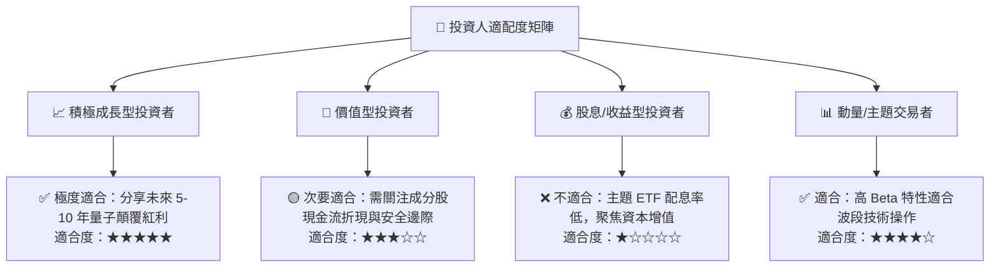

### 11.5 每季追蹤監控清單（Quarterly Watch List）

| 監控項目 | 關鍵指標 (KPI) | 觸發加碼門檻 | 觸發減碼/預警門檻 |
|----------|----------------|--------------|-------------------|
| **底層營收增速** | 穿透加權營收 YoY | **> 20.0%** | **< 10.0%** |
| **基金規模流動性** | WQTM AUM 規模 | **> $400M (資金淨流入)**| **< $200M (資金持續撤離)**|
| **估值合理性** | Trailing P/E | **< 28.0x (逢低買進)** | **> 38.0x (過熱獲利了結)**|
| **技術商業化進展** | QaaS 算力合約增長 | **季度合約額 YoY > 30%**| **主要廠商推遲產品路線圖**|

### 11.6 反面論證：什麼會證明論點錯誤（What Would Change My Mind）

```
╔══════════════════════════════════════════════════════════════════╗
║              ⚠️ 論點失效條件（Disconfirming Evidence）           ║
╠══════════════════════════════════════════════════════════════════╣
║  本投資論點在下列情況發生時應即刻降評或清倉退出：                ║
║  1. 底層加權營收成長率連續兩季跌破 10.0%；                       ║
║  2. 量子退相干（Decoherence）難題遭遇不可克服之物理障礙，商用停滯；║
║  3. 透視 ROIC 跌破加權 WACC (9.41%)，轉為摧毀股東價值；          ║
║  4. 基金爆發大規模資金贖回，AUM 跌破 $150M 導致流動性折價失真。  ║
╚══════════════════════════════════════════════════════════════════╝
```

---
> **免責聲明**：本報告為機構級研究分析模型生成，僅供專業研究參考，不構成任何個別投資之要約或承諾。市場有風險，投資決策應依獨立判斷為之。