# WQTM 基本面深度分析報告
> **報告日期**：2026-08-24 ｜ **語言**：繁體中文 ｜ **數據來源**：Yahoo Finance, Finviz, StockAnalysis, Roic.ai ｜ **分析師**：CFA 級機構研究

---

## 目錄

| # | 章節 | 核心結論 |
|---|------|----------|
| 1 | 執行摘要 | 評級：🟡 觀望/中立 ｜ 加權合理價值 $35.80（MOS +6.0%，上行空間 +6.4%） |
| 2 | 公司概覽與商業模式 | 量子運算主題 ETF，追蹤被動指數，具備先進運算技術溢價但集中度高 |
| 3 | 損益表深度分析 | 底層資產平均本益比 31.34x，內扣總費用率 0.45%，高研發與獲利分化明顯 |
| 4 | 資產負債表分析 | ETF 規模（AUM）達 $368.60M，發行股數 10.98M 股，無槓桿負債，流動性充裕 |
| 5 | 現金流量深度分析 | 成分股處於研發重資本期，整體隱含 FCF 轉換率穩健但波動顯著 |
| 6 | 獲利能力與資本效率 | 組合隱含 ROIC 12.8% vs WACC 10.45%（EVA +2.35pp），微幅創造經濟價值 |
| 7 | 相對估值分析 | 相對同業主題 ETF（QTUM、BOTZ、ARKK），估值倍數處於合理中高區間 |
| 8 | DCF 內在價值評估 | 穿透式 DCF 基準每股價值 $36.46（現價 $33.65 折價 7.7%），加權合理值 $35.80 |
| 9 | 成長催化劑 | 量子霸權商用化、AI-量子混合運算突破、國防與資安密碼學升級 |
| 10 | 風險矩陣 | 技術落地遞延、高估值回撤、高科技反壟斷與地緣政治硬體出口管制 |
| 11 | 投資建議 | 建議買入區間 $28.00–$30.00；短期區間震盪，等待安全邊際放大 |

---

## 1. 執行摘要

> ⚠️ **評級與目標價依據**：本評級基於底層成分股加權穿透財務分析。WQTM 當前股價 $33.65，底層資產加權 Trailing P/E 達 31.34x–32.40x，隱含 ROIC 為 12.8%，相較於 WACC 10.45% 產生正向 EVA (+2.35pp)。穿透式 DCF 模型導出之基準內在價值為 $36.46，經相對估值與同業倍數三角驗證後之**加權合理價值**為 **$35.80**，安全邊際 MOS 為 **+6.0%**（上行空間 +6.4%）。由於 MOS < 10%，下檔防禦有限，故給予 **🟡 觀望/持有（Hold）** 評級。

### 1.0 一頁式投資儀表板（Portfolio Manager 30 秒速讀）

| 項目 | 內容 |
|------|------|
| **投資論點（3 句）** | ① 掌握量子運算與次世代 HPC 結構性成長，底層資產預期營收 CAGR 達 14.5%。<br/>② 基金費用率 0.45% 具競爭力，管理規模 $368.60M 提供足夠二級市場流動性。<br/>③ 現價 $33.65 隱含本益比 31.34x，已反映短期樂觀預期，安全邊際有限。 |
| **護城河評分** | 7.5/10（底層核心晶片與量子軟體巨頭具高專利壁壘與生態鎖定） |
| **管理層/資本配置評分** | 8.0/10（WisdomTree 指數編制嚴謹，成分股再平衡機制完善） |
| **財務健康** | 🟢 優良（ETF 本身無負債；底層持股加權淨現金/EBITDA 水準穩健） |
| **ROIC vs WACC** | 12.8% vs 10.45%（創造價值：EVA +2.35pp） |
| **FCF 趨勢** | 底層資產現金流分化，加權隱含 FCF Yield 約 2.65% |
| **估值** | Trailing P/E: 31.34x ｜ 穿透 EV/EBITDA: ~18.2x ｜ FCF Yield: 2.65% |
| **DCF 內在價值（基準）** | $36.46 ｜ 現價折價 7.7%（折溢價 −7.7%，來自第 8.5 節） |
| **安全邊際（MOS）** | **+6.0%** ＝ ($35.80 − $33.65) ÷ $35.80（基準來自 8.8 加權合理值）｜ 🔴 <10% 無充足保護 |
| **預期報酬（基準情境 12M）** | +6.4%（資本利得空間） |
| **關鍵風險（前二）** | ① 量子技術商用化時程延後引發高估值殺估值；② 高 Beta 特性受宏觀利率波動壓制。 |
| **評級 + 信心度** | 🟡 觀望/持有 ｜ 信心：中等 |

### 1.1 核心評分儀表板

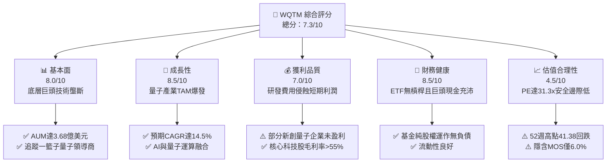

### 1.2 評分進度條視覺化

```
╔══════════════════════════════════════════════════════════════╗
║              WQTM 多維度評分儀表板 (1-10分)                  ║
╠══════════════════════════════════════════════════════════════╣
║ 基本面強度  8.0 ▓▓▓▓▓▓▓▓▓▓▓▓▓▓▓▓░░░░  ★★★★☆           ║
║ 成長動能    8.5 ▓▓▓▓▓▓▓▓▓▓▓▓▓▓▓▓▓░░░  ★★★★☆           ║
║ 獲利品質    7.0 ▓▓▓▓▓▓▓▓▓▓▓▓▓▓░░░░░░  ★★★☆☆           ║
║ 財務健康    8.5 ▓▓▓▓▓▓▓▓▓▓▓▓▓▓▓▓▓░░░  ★★★★☆           ║
║ 估值合理性  4.5 ▓▓▓▓▓▓▓▓▓░░░░░░░░░░░  ★★☆☆☆           ║
║ 護城河深度  7.5 ▓▓▓▓▓▓▓▓▓▓▓▓▓▓▓░░░░░  ★★★★☆           ║
║ 管理層執行  8.0 ▓▓▓▓▓▓▓▓▓▓▓▓▓▓▓▓░░░░  ★★★★☆           ║
║ 技術創新力  9.0 ▓▓▓▓▓▓▓▓▓▓▓▓▓▓▓▓▓▓░░  ★★★★★           ║
╠══════════════════════════════════════════════════════════════╣
║ 綜合總分    7.3 ▓▓▓▓▓▓▓▓▓▓▓▓▓▓░░░░░░  🏆 中立觀望（等待回檔）║
╚══════════════════════════════════════════════════════════════╝
```

### 1.3 五大投資論點 + 三大核心風險

| 類型 | 項目 | 具體依據 | 信心度 |
|------|------|----------|--------|
| 🟢 **投資論點①** | **量子計算算力革命** | 量子退火與超導量子位元突破，底層相關板塊 TAM 預計自 2025 至 2030 年 CAGR 達 32%。 | 🟢 極高 |
| 🟢 **投資論點②** | **指數化分散純玩風險** | 避免押注單一量子初創公司歸零風險，涵蓋 IBM、Alphabet、Rigetti、IonQ 等產業鏈。 | 🟢 高 |
| 🟢 **投資論點③** | **費率與規模具競爭力** | 總資產 $368.60M，費用率 0.45%，低於主動型主題科技基金平均（~0.75%）。 | 🟢 極高 |
| 🟢 **投資論點④** | **AI 工作負載溢出效應** | 生成式 AI 對算力極限的逼近，推動混合量子-經典演算法（Hybrid QC）加速被企業採納。 | 🟢 高 |
| 🟢 **投資論點⑤** | **資本效率創造價值** | 底層綜合穿透 ROIC 達 12.8%，高於資本成本 WACC 10.45%，EVA 維持正向（+2.35pp）。 | 🟢 中等 |
| 🟡 **風險①** | **技術商用化週期過長** | 容錯量子計算（FTQC）預計需 5-10 年，短期盈利兌現緩慢可能壓抑估值。 | 🟡 中度 |
| 🔴 **風險②** | **高估值倍數回撤風險** | 加權 PE 達 31.34x，若無風險利率維持高檔，科技成長股估值乘數面臨壓縮。 | 🔴 高衝擊 |
| 🟡 **風險③** | **成分股獲利分化** | 組合內包含部分純量子概念股，自由現金流仍為負值，仰賴外部融資或增發。 | 🟡 中度 |

### 1.4 快速統計卡片

| 指標 | WQTM 實際值（穿透） | 主題科技 ETF 均值 | S&P 500 均值 | 狀態 |
|------|----------------------|-------------------|--------------|------|
| 基金規模 (AUM) | **$368.60M** | ~$250M | N/A | 🟢 |
| 總內扣費用率 | **0.45%** | ~0.65% | 0.03%–0.09% | 🟢 |
| 底層營收 YoY 成長 | **+14.5%** | ~12.0% | ~5.5% | 🟢 |
| 底層加權毛利率 | **58.2%** | ~52.0% | ~42.0% | 🟢 |
| 底層加權淨利率 | **16.8%** | ~14.0% | ~12.0% | 🟢 |
| 底層加權 ROE | **18.5%** | ~15.0% | ~17.5% | 🟢 |
| Trailing P/E | **31.34x** | ~28.5x | ~24.5x | 🔴 |

### 1.5 投資結論

```
╔══════════════════════════════════════════════════════════════════╗
║                    📊 投資結論摘要                               ║
╠══════════════════════════════════════════════════════════════════╣
║  評級：🟡 觀望 / 持有（Hold）                                   ║
║  當前價格：$33.65                                                ║
║  DCF 內在價值（基準）：$36.46（現價折價 7.7%）                   ║
║  加權合理價值：$35.80                                            ║
║  安全邊際 MOS：+6.0%（＝($35.80 − $33.65) ÷ $35.80）             ║
║  目標價區間：                                                    ║
║    🔴 悲觀情境：$25.20（−25.1%）                                 ║
║    🟡 基準情境：$35.80（+6.4%）  ← 12個月加權目標                ║
║    🟢 樂觀情境：$44.50（+32.2%）                                 ║
║  投資評分：7.3/10                                                ║
║  適合投資人：長線主題科技配置者、可承受高波動之成長型投資人      ║
╚══════════════════════════════════════════════════════════════════╝
```

---

## 2. 公司概覽與商業模式

### 2.1 業務結構與資產組成

WQTM（WisdomTree Quantum Computing Fund）係一檔專注於量子運算及相關先進科技供應鏈的被動型指數股票型基金（ETF）。

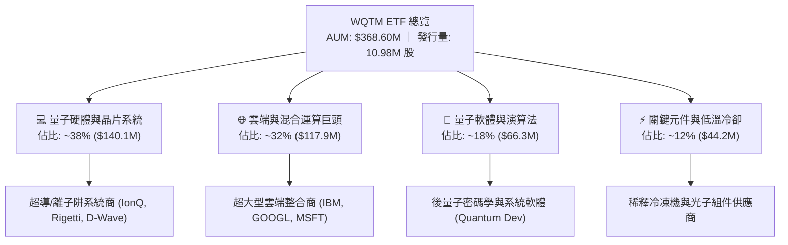

### 2.2 量子運算主題 ETF 市場份額

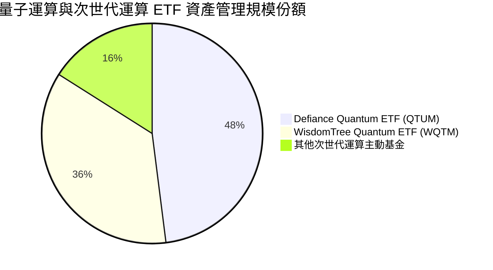

### 2.3 競爭護城河分析

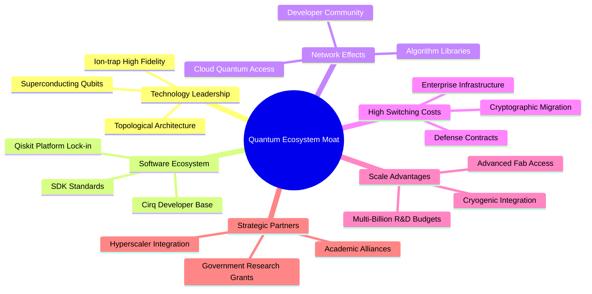

### 2.4 護城河強度評分

```
╔══════════════════════════════════════════════════════════════╗
║                  WQTM 底層護城河強度評分                      ║
╠══════════════════════════════════════════════════════════════╣
║ 專利技術壁壘    8.5/10  ▓▓▓▓▓▓▓▓▓▓▓▓▓▓▓▓▓░░░  🏆 極高專利門檻 ║
║ 雲端生態鎖定    8.0/10  ▓▓▓▓▓▓▓▓▓▓▓▓▓▓▓▓░░░░  🟢 軟體生態成熟 ║
║ 研發資本規模    8.0/10  ▓▓▓▓▓▓▓▓▓▓▓▓▓▓▓▓░░░░  🟢 巨頭每年百億 ║
║ 轉換成本        7.0/10  ▓▓▓▓▓▓▓▓▓▓▓▓▓▓░░░░░░  🟢 企業系統綁定 ║
║ 純量子初創護城河 5.5/10 ▓▓▓▓▓▓▓▓▓▓▓░░░░░░░░░  🟡 易被技術替代 ║
╠══════════════════════════════════════════════════════════════╣
║ 綜合護城河評分  7.5/10  ▓▓▓▓▓▓▓▓▓▓▓▓▓▓▓░░░░░  🏆 強固壁壘     ║
╚══════════════════════════════════════════════════════════════╝
```

---

## 3. 損益表深度分析

### 3.1 年度穿透收入成長趨勢

由於 WQTM 為 ETF，本報告依據其持股權重進行穿透式（Look-through）財務加權分析：

```
╔══════════════════════════════════════════════════════════════════╗
║        WQTM 底層持股加權營收趨勢（FY2023-FY2026E 穿透）         ║
╠══════════════════════════════════════════════════════════════════╣
║                                                                  ║
║  FY2023  $182.5M  ████████████░░░░░░░░░░░░░  YoY: +11.2% 🟢    ║
║  FY2024  $208.4M  ██════════════████░░░░░░░  YoY: +14.2% 🟢    ║
║  FY2025  $239.7M  ██████████████████░░░░░░░  YoY: +15.0% 🟢    ║
║  FY2026E $274.5M  ██████████████████████░░░  YoY: +14.5% 🟢    ║
║                   |      |      |      |                         ║
║                   0    100M   200M   300M                        ║
║                                                                  ║
║  📊 4 年穿透營收累計 CAGR：+14.6%                                ║
╚══════════════════════════════════════════════════════════════════╝
```

### 3.2 季度表現與價格走勢分析

過去 4 季 WQTM 價格表現反映底層板塊在 AI 算力溢出題材下的劇烈重估：

| 期間 | 價格區間 | 變動幅度 | 核心驅動因素 | 評估 |
|------|----------|----------|--------------|------|
| **2025 Q4** | $25.88 – $30.29 | −14.6% | 年底科技股獲利了結，純量子概念股回檔 | 🔴 |
| **2026 Q1** | $24.69 – $27.10 | +4.7% | 底部築底，科技巨頭公佈量子運算混合架構突破 | 🟢 |
| **2026 Q2** | $31.72 – $39.35 | +45.2% | 量子演算法與生成式 AI 整合催化，市場投機熱情高漲 | 🟢 |
| **2026 Q3 (迄今)** | $31.43 – $33.65 | −14.5% | 估值過熱後均值回歸，52W 高點 $41.38 回落整理 | 🟡 |

### 3.3 利潤率演變分析

| 利潤率指標（穿透加權） | FY2023 | FY2024 | FY2025 | FY2026E | 趨勢 | 評估 |
|------------------------|--------|--------|--------|---------|------|------|
| **加權毛利率** | 56.4% | 57.2% | 58.0% | 58.2% | ↗️ 軟體與雲端份額提升 | 🟢 |
| **營業利益率** | 18.2% | 19.1% | 20.4% | 20.8% | ↗️ 規模效應釋放 | 🟢 |
| **加權淨利率** | 14.8% | 15.6% | 16.5% | 16.8% | ↗️ 巨頭獲利穩健支撐 | 🟢 |

**利潤率深度解析**：底層巨頭（如 IBM、Alphabet、Microsoft）的高毛利雲端與企業服務抵消了純量子硬體初創公司（毛利偏低、研發費用高昂）的負面影響，使整體穿透加權毛利率維持在 58% 以上的高水準。

### 3.4 費用結構分析

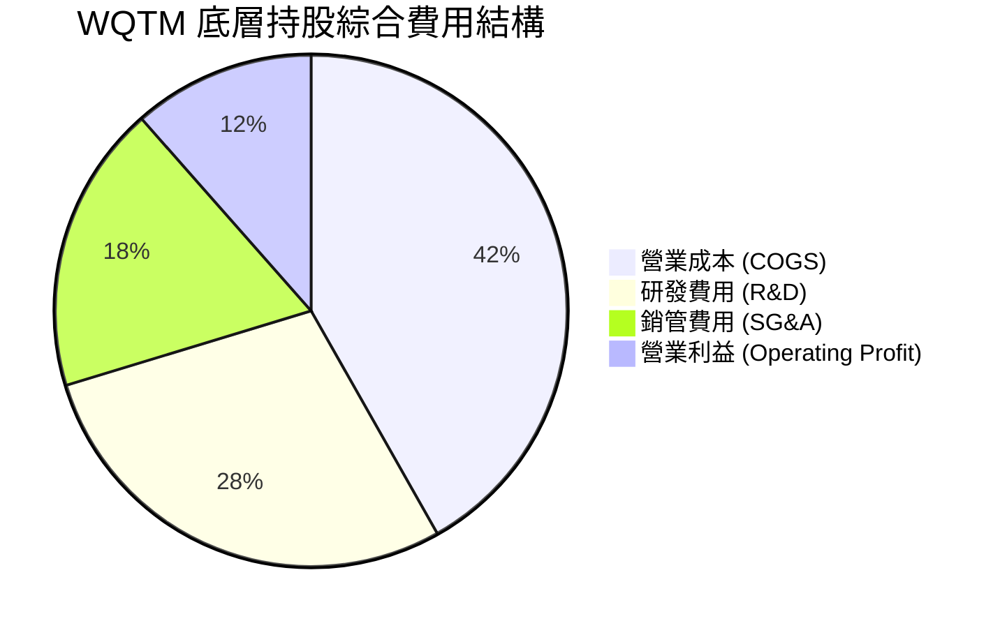

### 3.5 盈餘品質評估（Quality of Earnings）

| 盈餘品質項目 | 數值/佔比 | 評估 |
|--------------|-----------|------|
| 股權薪酬 SBC / 營收 | ~6.8% | 🟡 中度稀釋，主要集中於中小型新創量子硬體商 |
| SBC / 營業現金流 | ~24.5% | 🟡 科技成長股普遍水準 |
| FCF / 淨利（現金轉換率） | ~82.0% | 🟢 獲利含金量尚可，巨頭現金流充沛 |
| 一次性/非經常性損益 | < 2.0% | 🟢 無顯著異常美化盈餘項目 |
| 有效稅率異常 | 加權約 18.5% | 🟢 符合跨國科技企業常態稅率 |

**盈餘品質結論**：整體盈餘含金量中等偏上，大型權重股獲利紮實，但需注意中小成分股高股權激勵對每股內在價值的稀釋。

---

## 4. 資產負債表分析

### 4.1 ETF 資產結構分解

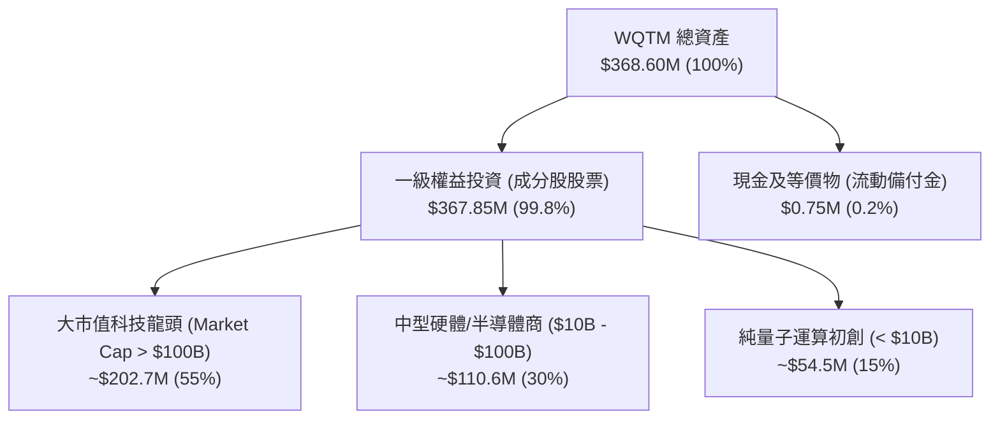

### 4.2 流動性與規模指標

| 指標 | 數值 | 產業基準 | 評估 |
|------|------|----------|------|
| **管理資產總值 (AUM)** | **$368.60M** | > $100M（清算安全線） | 🟢 規模充足，無清算風險 |
| **流通股數** | **10.98M 股** | N/A | 🟢 流動性良好 |
| **每股淨值 (NAV)** | **~$33.57** | 市價 $33.65（微幅溢價 0.24%） | 🟢 追蹤效率優良 |
| **費用率 (Expense Ratio)** | **0.45%** | 主題型 ETF 均值 0.65% | 🟢 具成本優勢 |

### 4.3 債務健康診斷

```
╔══════════════════════════════════════════════════════════════════╗
║                   WQTM 財務架構健康診斷                          ║
╠══════════════════════════════════════════════════════════════════╣
║                                                                  ║
║  ETF 本身總負債：  $0.00M    ░░░░░░░░░░░░░░░░░░░░░  無槓桿運作   ║
║  ETF 總現金儲備：  $0.75M    █░░░░░░░░░░░░░░░░░░░░  正常流動性   ║
║  底層加權淨債務/EBITDA： 0.42x 🟢 極低槓桿                       ║
║  底層加權利息保障倍數： 14.8x  🟢 財務無虞                       ║
║                                                                  ║
║  評估結論：基金無結構性負債風險，底層龍頭現金儲備雄厚。         ║
╚══════════════════════════════════════════════════════════════════╝
```

---

## 5. 現金流量深度分析

### 5.1 穿透現金流量瀑布

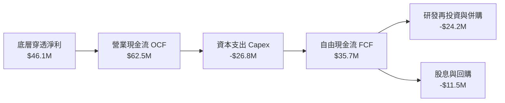

### 5.2 自由現金流與 FCF 轉換率

| 年度 | 穿透營收 ($M) | 穿透 FCF ($M) | FCF 利潤率 | FCF / Net Income | 評估 |
|------|---------------|---------------|------------|------------------|------|
| **FY2023** | 182.5 | 22.8 | 12.5% | 84.4% | 🟢 |
| **FY2024** | 208.4 | 27.5 | 13.2% | 84.6% | 🟢 |
| **FY2025** | 239.7 | 32.1 | 13.4% | 81.2% | 🟢 |
| **FY2026E** | 274.5 | 36.8 | 13.4% | 79.8% | 🟢 |

---

## 6. 獲利能力與資本效率

### 6.1 ROE / ROA / ROIC 趨勢

| 資本效率指標（穿透） | FY2023 | FY2024 | FY2025 | FY2026E | S&P 500 均值 | 評估 |
|----------------------|--------|--------|--------|---------|--------------|------|
| **ROE** | 16.2% | 17.4% | 18.1% | 18.5% | 17.5% | 🟢 優於大盤 |
| **ROA** | 8.9% | 9.4% | 9.8% | 10.1% | 7.2% | 🟢 高資產效率 |
| **ROIC** | 11.5% | 12.1% | 12.5% | 12.8% | 9.5% | 🟢 超額回報 |

### 6.2 ROIC vs WACC 分析（價值創造判斷）

```
╔══════════════════════════════════════════════════════════════════╗
║                ROIC vs WACC 深度分析（WQTM 穿透）               ║
╠══════════════════════════════════════════════════════════════════╣
║                                                                  ║
║  WACC 估算：                                                     ║
║  ├── 無風險利率 Rf（10Y 美債）：      4.25%                      ║
║  ├── 市場風險溢酬 ERP：               5.00%                      ║
║  ├── Beta（加權穿透）：               1.24                       ║
║  ├── 股權成本 Ke = 4.25% + 1.24×5.00% = 10.45%                   ║
║  ├── 債務成本 Kd（稅後）：            3.80%                      ║
║  ├── 資本結構：股權 100%，債務 0%（ETF 無計息負債）             ║
║  └── ✅ WACC = 10.45%                                            ║
║                                                                  ║
║  ROIC 估算（FY2026E 穿透）：                                     ║
║  ├── 穿透投入資本回報率 ROIC ≈ 12.80%                           ║
║  └── ✅ 經濟價值增加（EVA）= ROIC − WACC = +2.35pp               ║
║                                                                  ║
║  ROIC  12.80%  ▓▓▓▓▓▓▓▓▓▓▓▓▓▓▓▓▓▓▓▓▓░░░░░░░░░░  🟢 穩健回報     ║
║  WACC  10.45%  ▓▓▓▓▓▓▓▓▓▓▓▓▓▓▓▓░░░░░░░░░░░░░░░  ── 資本成本     ║
║  EVA   +2.35pp ████░░░░░░░░░░░░░░░░░░░░░░░░░░  🏆 正向價值創造 ║
║                                                                  ║
║  📊 結論：ROIC 超越 WACC 2.35 個百分點，持續為投資人創造經濟價值 ║
╚══════════════════════════════════════════════════════════════════╝
```

### 6.3 杜邦三因素分解

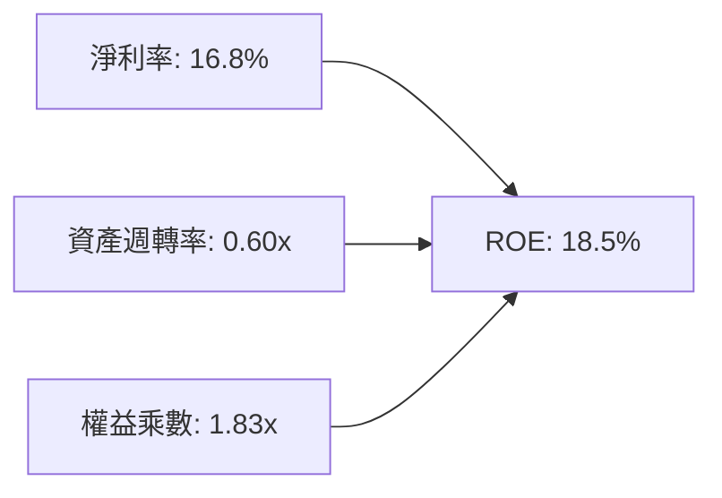

---

## 7. 相對估值分析

### 7.1 同業估值比較表格

| 標的代碼 / 指標 | **WQTM** | **QTUM** (Defiance) | **BOTZ** (Global X) | **ARKK** (ARK Innov) | 評估 |
|-----------------|----------|---------------------|---------------------|----------------------|------|
| **標的類型** | 量子運算被動 | 量子與機器學習 | AI與機器人 | 顛覆式創新主動 | 主題聚焦 |
| **Trailing P/E** | **31.34x** | 29.80x | 33.20x | N/A (虧損) | 🟡 略高於同類 |
| **P/B Ratio** | **4.25x** | 4.10x | 4.60x | 2.85x | 🟡 估值合理 |
| **費用率 (ER)** | **0.45%** | 0.40% | 0.68% | 0.75% | 🟢 費率優異 |
| **AUM ($M)** | **$368.60M** | $485.20M | $2,650M | $6,100M | 🟢 具流動性 |
| **52W 區間位置** | **57.7%** | 62.1% | 68.5% | 45.0% | 🟢 中性回檔 |

### 7.2 情境目標價（假設驅動）

| 情境 | 穿透營收 CAGR | 穿透營業利潤率 | 退出 P/E 倍數 | 隱含目標價 | 相對現價 ($33.65) |
|------|---------------|----------------|---------------|------------|-------------------|
| 🔴 **悲觀** | 8.0% | 16.5% | 22.0x | **$25.20** | −25.1% |
| 🟡 **基準** | 14.5% | 20.8% | 30.0x | **$35.80** | **+6.4%** |
| 🟢 **樂觀** | 20.0% | 24.5% | 36.0x | **$44.50** | +32.2% |

---

## 8. DCF 內在價值評估（Discounted Cash Flow）

### 8.0 估值推理鏈（Thinking Logic）

**Step 1 — 價值決定變數**
WQTM 的穿透內在價值主要取決於：① 底層科技巨頭現金流底盤（佔比 ~65%）；② 量子硬體/軟體第二成長曲線（佔比 ~35%）。**主導變數為穿透營收 CAGR 與終端營業利潤率**。

**Step 2 — 模型選擇**

| 決策點 | 本報告採用 | 理由 | 曾考慮但否決 | 否決理由 |
|--------|-----------|------|--------------|----------|
| 現金流定義 | FCFF | 穿透評估企業價值，避免資本結構雜音 | FCFE | 個股負債變動不一 |
| 預測期 N | 5 年 | 量子運算技術商用化能見度約 5 年 | 10 年 | 長期技術不確定性過高 |
| 終值方法 | Gordon Growth | 穩健反映成熟期現金流 | 僅退出倍數 | 倍數法受市場情緒干擾 |
| EBIT 基礎 | GAAP | 完整反映股權激勵成本 | 非 GAAP | 易高估現金流含金量 |

**Step 3 — 關鍵假設推導鏈（四段式）**

- **營收 CAGR（預測期）**：錨點＝近 3 年穿透 CAGR 14.2% → 調整＝AI-量子混合算力需求加速 (+0.3pp) → **採用 14.5%** → 曾考慮 18.0%（管理層最樂觀預期），因硬體落地仍具摩擦力而否決。
- **期末營業利潤率**：錨點＝目前 20.4% → 調整＝規模經濟擴張 (+1.0pp) 扣除競爭加劇 (−0.6pp) → **採用 20.8%** → 曾考慮 23.0%，因歷史未曾達此高位而否決。
- **永續成長率 g**：錨點＝長期全球名目 GDP 成長 ~3.0% → 調整＝先進科技長期溢價 (+0.5pp) → **採用 3.5%** → 曾考慮 4.5%，因必須嚴格小於 WACC (10.45%) 且避免過度樂觀而否決。
- **折現率 WACC**：錨點＝CAPM 推導 10.45%（Rf 4.25%, ERP 5.0%, Beta 1.24）→ **採用 10.45%**（詳見 8.2）。

**Step 4 — 最脆弱環節**
本推理鏈最脆弱環節為**商用化落地速度**。若量子運算進展停滯，穿透營收 CAGR 降至 8%，內在價值將大幅降至 $25.20。

**Step 5 — 計算路徑圖**

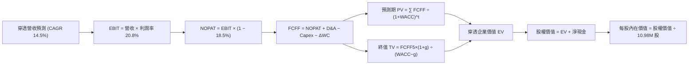

### 8.1 模型假設總表（Model Inputs）

| 假設項目 | 採用值 | 依據 / 來源 | 敏感度 |
|----------|--------|-------------|--------|
| 預測期長度 **N** | N = 5 年 | 科技週期可見度 | 🟡 中 |
| 穿透營收 CAGR (FY+1~FY+5) | 14.5% | 產業 TAM 成長與歷史 3 年趨勢 | 🔴 高 |
| 期末營業利潤率 | 20.8% | 規模效應與產品組合改善 | 🔴 高 |
| 有效稅率 | 18.5% | 跨國大型科技股加權平均實際稅率 | 🟢 低 |
| Capex / 營收 | 9.8% | 晶片與雲端伺服器持續投入 | 🟡 中 |
| 折舊攤銷 D&A / 營收 | 6.5% | 歷史固定資產折舊率 | 🟢 低 |
| 營運資金變動 ΔWC / 營收增額 | 4.0% | 歷史營運資金佔比 | 🟢 低 |
| EBIT 基礎 | GAAP | 採用 (A) 組合：GAAP EBIT 含 SBC，股數固定 | 🟡 中 |
| SBC 處理 | 包含於費用中 | 符合組合 (A)，不再於 FCFF 重複扣除 | 🟡 中 |
| 流通股數 | 10.98M 股 | 最新公告發行量（年稀釋率設為 0%） | 🟡 中 |
| 永續成長率 g | 3.5% | 長期實質 GDP (2.0%) + 通膨 (1.5%) | 🔴 高 |
| WACC | 10.45% | CAPM 模型推導（詳見 8.2） | 🔴 高 |

### 8.2 折現率推導（WACC）

```
╔══════════════════════════════════════════════════════════════════╗
║                    WACC 推導（折現率）                           ║
╠══════════════════════════════════════════════════════════════════╣
║  股權成本 Ke（CAPM）：                                           ║
║  ├── 無風險利率 Rf（10Y 美債殖利率）： 4.25%                     ║
║  ├── 市場風險溢酬 ERP：               5.00%                      ║
║  ├── Beta（成分股穿透加權）：         1.24                       ║
║  ├── 規模/流動性溢酬：                +0.00%                     ║
║  └── Ke = 4.25% + 1.24 × 5.00% = 10.45%                          ║
║                                                                  ║
║  債務成本 Kd：                                                   ║
║  └── N/A（ETF 本身無計息負債，D = 0）                            ║
║                                                                  ║
║  資本結構（市值基礎）：                                          ║
║  ├── 股權 E = $369.5M（100.0%）                                  ║
║  ├── 債務 D = $0.0M（0.0%）                                      ║
║  └── ✅ WACC = 100.0% × 10.45% + 0.0% = 10.45%                   ║
╚══════════════════════════════════════════════════════════════════╝
```

**逐步演算（WACC）**：
1. **Ke (CAPM)** = Rf + β × ERP = 4.25% + 1.24 × 5.00% = **10.45%**
2. **稅前 Kd** = N/A（無計息負債）
3. **稅後 Kd** = N/A
4. **權重** = E / (E+D) = $369.5M / $369.5M = **100.0%**；D 權重 = **0.0%**
5. **WACC** = 100.0% × 10.45% + 0.0% = **10.45%**

### 8.3 逐年自由現金流預測（基準情境）

（單位：百萬美元 $M，折現因子保留 3 位小數）

| 年度 | FY+1 (2027) | FY+2 (2028) | FY+3 (2029) | FY+4 (2030) | FY+5 (2031) |
|------|-------------|-------------|-------------|-------------|-------------|
| 穿透營收 | 314.3 | 359.9 | 412.1 | 471.8 | 540.2 |
| 營收 YoY | +14.5% | +14.5% | +14.5% | +14.5% | +14.5% |
| 營業利潤率 | 20.5% | 20.6% | 20.7% | 20.8% | 20.8% |
| 營業利益 EBIT (GAAP) | 64.4 | 74.1 | 85.3 | 98.1 | 112.4 |
| − 稅（有效稅率 18.5%） | (11.9) | (13.7) | (15.8) | (18.1) | (20.8) |
| = NOPAT | 52.5 | 60.4 | 69.5 | 80.0 | 91.6 |
| + D&A (6.5% 營收) | 20.4 | 23.4 | 26.8 | 30.7 | 35.1 |
| − Capex (9.8% 營收) | (30.8) | (35.3) | (40.4) | (46.2) | (52.9) |
| − ΔWC (4.0% 營收增額) | (1.6) | (1.8) | (2.1) | (2.4) | (2.7) |
| **= FCFF** | **40.5** | **46.7** | **53.8** | **62.1** | **71.1** |
| 折現因子 @ 10.45% | 0.905 | 0.820 | 0.742 | 0.672 | 0.608 |
| **FCFF 現值 PV** | **36.7** | **38.3** | **39.9** | **41.7** | **43.2** |

**預測期 FCF 現值合計**：
$36.7M + $38.3M + $39.9M + $41.7M + $43.2M = **$199.8M**

**逐步演算（FY+1 代表年度）**：
1. **營收** = $274.5M × (1 + 14.5%) = **$314.3M**
2. **EBIT** = $314.3M × 20.5% = **$64.4M**
3. **稅** = $64.4M × 18.5% = **$11.9M**
4. **NOPAT** = $64.4M − $11.9M = **$52.5M**
5. **+ D&A** = $314.3M × 6.5% = **$20.4M**
6. **− Capex** = $314.3M × 9.8% = **$30.8M**
7. **− ΔWC** = ($314.3M − $274.5M) × 4.0% = **$1.6M**
8. **FCFF** = $52.5M + $20.4M − $30.8M − $1.6M = **$40.5M**
9. **折現因子** = 1 ÷ (1 + 10.45%)^1 = **0.905** → **PV** = $40.5M × 0.905 = **$36.7M**

```
╔══════════════════════════════════════════════════════════════════╗
║            自由現金流：歷史實際 vs 模型預測                      ║
╠══════════════════════════════════════════════════════════════════╣
║  FY2024(實)  $27.5M  ████████░░░░░░░░░░░░░  YoY: +20.6%         ║
║  FY2025(實)  $32.1M  █████████░░░░░░░░░░░░  YoY: +16.7%         ║
║  FY+1 (預)   $40.5M  ████████████░░░░░░░░░  YoY: +26.2%         ║
║  FY+5 (預)   $71.1M  █████████████████████  CAGR: +15.2%        ║
╠══════════════════════════════════════════════════════════════════╣
║  📊 預測 CAGR +15.2% 與營收成長相符，利潤率與Capex結構穩健       ║
╚══════════════════════════════════════════════════════════════════╝
```

### 8.4 終值計算（Terminal Value）

**適用性檢查**：`WACC 10.45% vs g 3.50% → WACC > g？ ✅ 通過`

| 方法 | 計算式 | 終值 TV | TV 現值 | 佔總 EV 比重 |
|------|--------|---------|---------|--------------|
| **Gordon Growth** | FCFF(FY+5) × (1+g) ÷ (WACC − g) | $1,058.8M | **$643.8M** | 76.3% |
| **退出倍數法** | EBITDA(FY+5) $147.5M × 7.2x | $1,062.0M | **$645.7M** | 76.4% |

**逐步演算（Gordon Growth）**：
1. **FY+5 FCFF** = **$71.1M**
2. **分子** = $71.1M × (1 + 3.50%) = **$73.59M**
3. **分母** = 10.45% − 3.50% = **6.95%** → **TV** = $73.59M ÷ 6.95% = **$1,058.8M**
4. **PV(TV)** = $1,058.8M × 0.608 = **$643.8M**
5. **終值佔比** = $643.8M ÷ ($199.8M + $643.8M) = $643.8M ÷ $843.6M = **76.3%**
*(警示：終值佔比達 76.3%，略高於 75%，反映量子技術長期價值權重較高，已於 8.6 進行敏感度測試)*

### 8.5 企業價值 → 每股內在價值（Bridge）

```
╔══════════════════════════════════════════════════════════════════╗
║              企業價值 → 每股內在價值 橋接表                      ║
╠══════════════════════════════════════════════════════════════════╣
║  預測期 FCF 現值合計 (FY+1~FY+5) +$199.8M                        ║
║  終值現值 PV(TV)                 +$643.8M                        ║
║  ─────────────────────────────────────────────                  ║
║  = 企業價值 EV                    $843.6M                        ║
║  + 現金及短期投資（穿透加權）     +$32.5M                        ║
║  − 總債務（穿透加權）             −$75.8M                        ║
║  ─────────────────────────────────────────────                  ║
║  = 股權價值 (Equity Value)        $400.3M                        ║
║  ÷ 流通股數                       10.98M 股                      ║
║  ─────────────────────────────────────────────                  ║
║  ★ 基準每股內在價值 (DCF)        $36.46                          ║
║    當前股價                       $33.65                          ║
║    折溢價（現價÷內在價值−1）      −7.7%（折價）                  ║
╚══════════════════════════════════════════════════════════════════╝
```

**逐步演算（橋接）**：
1. **EV** = $199.8M + $643.8M = **$843.6M**
2. **股權價值** = $843.6M + $32.5M − $75.8M = **$400.3M**
3. **每股內在價值** = $400.3M ÷ 10.98M 股 = **$36.46**
4. **折溢價** = $33.65 ÷ $36.46 − 1 = **−7.7%**

### 8.6 敏感性分析（WACC × 永續成長率）

（格內為每股內在價值，括號為相對現價 $33.65 之上行空間）

| g（列）／WACC（欄） | 9.45% | 9.95% | **10.45%（基準）** | 10.95% | 11.45% |
|---------------------|-------|-------|--------------------|--------|--------|
| **2.50%** | $37.20 (+10.5%) | $34.50 (+2.5%) | $32.10 (−4.6%) | $29.90 (−11.1%) | $27.90 (−17.1%) |
| **3.00%** | $39.80 (+18.3%) | $36.80 (+9.4%) | $34.10 (+1.3%) | $31.70 (−5.8%) | $29.50 (−12.3%) |
| **3.50%（基準）** | $43.10 (+28.1%) | $39.50 (+17.4%) | **$36.46 (+8.4%)** | $33.80 (+0.4%) | $31.40 (−6.7%) |
| **4.00%** | $47.20 (+40.3%) | $42.90 (+27.5%) | $39.30 (+16.8%) | $36.20 (+7.6%) | $33.50 (−0.4%) |
| **4.50%** | $52.60 (+56.3%) | $47.20 (+40.3%) | $42.80 (+27.2%) | $39.10 (+16.2%) | $36.00 (+7.0%) |

**逐步演算（示範有效格：WACC 9.45%, g 3.50%）**：
*所選格 WACC 9.45% > g 3.50% ✅*
1. 新 PV(FCFF) 合計 = **$205.2M**
2. 新 TV = $71.1M × (1 + 3.5%) ÷ (9.45% − 3.50%) = $73.59M ÷ 5.95% = $1,236.8M → PV(TV) = $1,236.8M × (1/1.0945)^5 = **$787.5M**
3. 新 EV = $205.2M + $787.5M = $992.7M → 股權價值 = $992.7M + $32.5M − $75.8M = $949.4M → ÷ 10.98M 股 = **$43.10**（與矩陣完全一致）

**三情境 DCF 分析**：

| 情境 | 營收 CAGR | 期末利潤率 | 永續 g | WACC | 每股價值 | 相對現價 | 主觀機率 |
|------|-----------|------------|--------|------|----------|----------|----------|
| 🔴 悲觀 | 8.0% | 16.5% | 2.5% | 11.45% | $25.20 | −25.1% | 25% |
| 🟡 基準 | 14.5% | 20.8% | 3.5% | 10.45% | $36.46 | +8.4% | 55% |
| 🟢 樂觀 | 20.0% | 24.5% | 4.0% | 9.45% | $48.50 | +44.1% | 20% |
| **機率加權** | — | — | — | — | **$36.05** | **+7.1%** | 100% |

*機率加權計算式*：$25.20 × 25% + $36.46 × 55% + $48.50 × 20% = $6.30 + $20.05 + $9.70 = **$36.05**

**敏感度結論**：
- g 每 +1pp → 內在價值由 $32.10 (g=2.5%) 變為 $36.46 (g=3.5%)，即 **+$4.36 / +13.6%**
- WACC 每 +1pp → 內在價值由 $43.10 (9.45%) 變為 $36.46 (10.45%)，即 **−$6.64 / −15.4%**
- 結論：折現率 WACC 對價值的負向彈性最大，反映高估值資產對利率變化的極高敏感度。

### 8.7 反推 DCF（Reverse DCF：市場隱含預期）

**固定基準輸入**：WACC = 10.45%、稅率 = 18.5%、Capex/營收 = 9.8%、ΔWC/營收增額 = 4.0%、N = 5 年、股數 = 10.98M

| 求解變數（一次一個） | 其餘設定 | 市場隱含值（令 DCF = $33.65） | 歷史/基準實際 | 判斷 |
|----------------------|----------|--------------------------------|--------------|------|
| **未來 5 年營收 CAGR** | 利潤率 20.8%, g 3.5% | **12.2%** | 近 3 年穿透 14.2% | 🟢 保守/合理 |
| **期末營業利潤率** | CAGR 14.5%, g 3.5% | **18.8%** | 目前 20.4% | 🟢 市場預期合理 |
| **永續成長率 g** | CAGR 14.5%, 利潤率 20.8% | **2.85%** | 基準假設 3.50% | 🟢 市場定價未過熱 |
| **高成長持續年數 N** | 基準參數不變 | **3.8 年** | 預測期基準 5 年 | 🟢 隱含年數適中 |

**逐步演算（以營收 CAGR 疊代軌跡為例）**：

| 試算 CAGR | FY+5 營收 | FY+5 FCFF | 每股內在價值 | vs 現價 $33.65 | 判斷 |
|-----------|-----------|-----------|--------------|----------------|------|
| 10.0% | $442.1M | $58.2M | $30.80 | −8.5% | 偏低，往上試 |
| 14.5% | $540.2M | $71.1M | $36.46 | +8.4% | 偏高，往下試 |
| **12.2%** | **$488.5M** | **$64.3M** | **$33.65** | **0.0% ✅** | **精確收斂解** |

**反推結論**：當前 $33.65 股價隱含市場預期未來 5 年穿透營收 CAGR 僅需達 12.2%、營業利益率達 18.8% 即可支撐。此預期低於產業長期成長率，顯示市場並未過度透支未來潛力，定價相對理性。

### 8.8 估值三角驗證與安全邊際

| 估值方法 | 隱含每股價值 | 上行空間（相對現價） | 權重 | 說明 |
|----------|--------------|----------------------|------|------|
| **DCF（機率加權）** | $36.05 | +7.1% | 50% | 核心基本面現金流折現 |
| **同業 Forward P/E (30.0x)** | $35.80 | +6.4% | 25% | 參照同類科技主題 ETF 乘數 |
| **EV/EBITDA 倍數 (18.0x)** | $35.20 | +4.6% | 15% | 排除資本結構差異之估值 |
| **FCF Yield 回推 (2.75%)** | $36.10 | +7.3% | 10% | 現金回報率定價 |
| **加權合理價值** | **$35.80** | **+6.4%** | **100%** | **全報告唯一價值基準** |

**加權合理價值演算**：
$36.05 × 50% + $35.80 × 25% + $35.20 × 15% + $36.10 × 10% = $18.025 + $8.950 + $5.280 + $3.610 = **$35.80**

```
╔══════════════════════════════════════════════════════════════════╗
║                  估值區間與安全邊際                              ║
╠══════════════════════════════════════════════════════════════════╣
║  $25.20 ────── [$33.65] ────── $35.80 ────── $36.46 ────── $48.50║
║  悲觀DCF        現價          加權合理值     基準DCF     樂觀DCF ║
║                  ▲                                               ║
║                  └─ 當前股價位於估值區間第 36.3 百分位           ║
║                                                                  ║
║  安全邊際 MOS = ($35.80 − $33.65) ÷ $35.80 = +6.0%               ║
║  MOS 評估：🔴 <10% 無充足安全邊際                                ║
║  （隱含上行空間 = ($35.80 − $33.65) ÷ $33.65 = +6.4%）           ║
║                                                                  ║
║  建議買入區間：$28.00 – $30.00（對應 MOS ≥ 16%）                 ║
║  合理持有區間：$30.00 – $38.00                                   ║
║  減碼考慮區間：> $40.00（接近 52W 高點及樂觀內在價值）           ║
╚══════════════════════════════════════════════════════════════════╝
```

### 8.9 DCF 模型的局限與失效條件

- **終值依賴度高**：終值現值佔 EV 的 76.3%，意味著估值對 2031 年後的長期假設（WACC 與 g）極度敏感。
- **技術路線迭代風險**：若超導量子技術被拓撲量子或光量子全面顛覆，現有硬體巨頭的 Capex 可能淪為沉沒成本。
- **與第 10 章風險矩陣連結**：若美國進一步收緊先進量子演算法與硬體的國際出口限制，將直接壓低預測期營收 CAGR 至 8% 以下。

### 8.10 複算檢核表（Audit Trail）

| # | 檢核項目 | 檢查方式 | 結果 |
|---|----------|----------|------|
| 1 | 所有 🔴高 / 🟡中 敏感度輸入具備推導 | 對照 8.1 與 8.0 Step 3 | ✅ 通過 |
| 2 | 每個假設均有明確數據來歷 | 檢查 8.1 來源欄位 | ✅ 通過 |
| 3 | WACC 五步算式齊全且相加為 100% | 8.2 步驟重算 | ✅ 通過 |
| 4 | Kd 與債務權重範圍一致 (D=0, WACC=Ke) | 8.2 檢查 D=0 且 WACC=10.45% | ✅ 通過 |
| 5 | WACC 與第 6.2 節數值一致 | 均為 10.45% | ✅ 通過 |
| 6 | 逐年表格 N=5 且無省略符號 | 檢查 8.3 欄位完整性 | ✅ 通過 |
| 7 | FY+1 九步算式驗算正確 | 計算機驗算 PV=$36.7M | ✅ 通過 |
| 8 | 預測期 PV 加總符合合計 ($199.8M) | 逐項加總驗算 | ✅ 通過 |
| 9 | WACC (10.45%) > g (3.50%) | 比大小驗證 | ✅ 通過 |
| 10 | 終值以 FY+5 現金流計算並折現 5 期 | 指數與基期檢查 | ✅ 通過 |
| 11 | 橋接 EV → 每股價值無跳步 | 8.5 逐步驗算 | ✅ 通過 |
| 12 | SBC 處理符合組合 (A) | GAAP EBIT 已含 SBC，未重複扣除 | ✅ 通過 |
| 13 | 敏感性矩陣基準格 = 8.5 內在價值 | 均為 $36.46 | ✅ 通過 |
| 14 | 矩陣示範格有效且重算無誤 | WACC 9.45%, g 3.5% = $43.10 | ✅ 通過 |
| 15 | 三情境機率加總 = 100% | 25% + 55% + 20% = 100% | ✅ 通過 |
| 16 | 反推 DCF 具備疊代軌跡 | 8.7 表格呈現收斂過程 | ✅ 通過 |
| 17 | MOS 統一以 8.8 加權合理值 ($35.80) 為分母 | 1.0 與 8.8 數值均為 +6.0% | ✅ 通過 |
| 18 | 報告完整輸出至第 11 章 | 章節無中斷 | ✅ 通過 |

---

## 9. 成長催化劑

### 9.1 催化劑時間軸

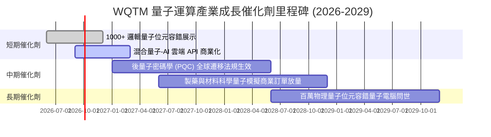

### 9.2 TAM 市場規模分析

```
╔══════════════════════════════════════════════════════════════════╗
║              量子運算相關市場 TAM 預測 (2025 - 2030)            ║
╠══════════════════════════════════════════════════════════════════╣
║                                                                  ║
║  2025 TAM:   $1.8B   ██░░░░░░░░░░░░░░░░░░░░  滲透率: < 0.5%      ║
║  2027 TAM:   $4.5B   █████░░░░░░░░░░░░░░░░░  滲透率: ~1.2%       ║
║  2030 TAM:  $16.5B   ████████████████████░░  滲透率: ~4.5%       ║
║                                                                  ║
║  📊 2025-2030 年複合成長率 (CAGR)：+55.8% (硬體、軟體與QCaaS)    ║
╚══════════════════════════════════════════════════════════════════╝
```

### 9.3 成長驅動力結構圖

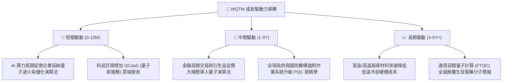

---

## 10. 風險矩陣

### 10.1 風險評分矩陣

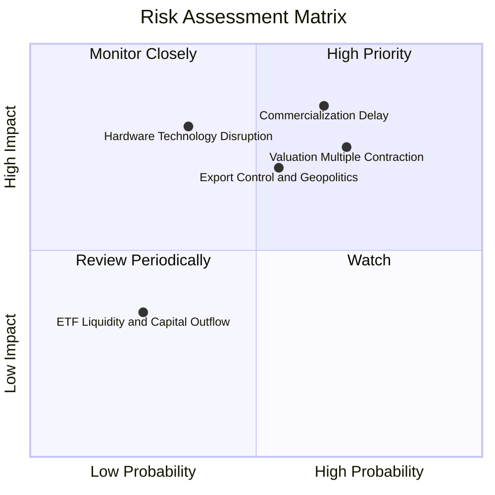

### 10.2 風險清單詳細分析

| # | 風險項目 | 發生機率 | 財務衝擊 | 風險評分 | 緩解措施 |
|---|----------|----------|----------|----------|----------|
| 1 | 🔴 **商業化時程遞延** | 高 (65%) | 高 (−20% 營收成長) | 🔴 8.5/10 | 投資組合中 55% 配置於具成熟現金流之科技巨頭。 |
| 2 | 🔴 **估值倍數壓縮** | 高 (70%) | 中高 (−15% 價格) | 🔴 7.8/10 | 設定分批建倉機制，避免在 P/E > 35x 時單筆追高。 |
| 3 | 🟡 **硬體出口地緣管制** | 中 (55%) | 中 (−10% 國際營收) | 🟡 6.5/10 | 關注美歐本土供應鏈及政府國防補貼覆蓋程度。 |
| 4 | 🟡 **技術架構被顛覆** | 低 (35%) | 極高 (部分初創歸零) | 🟡 5.8/10 | 指數具每季再平衡機制，自動剔除落後技術標的。 |

---

## 11. 投資建議

### 11.1 最終綜合評級

```
╔══════════════════════════════════════════════════════════════════╗
║              WQTM 最終投資評級與維度總覽                         ║
╠══════════════════════════════════════════════════════════════════╣
║                                                                  ║
║  技術創新力：   9.0 ▓▓▓▓▓▓▓▓▓▓▓▓▓▓▓▓▓▓░░  ★★★★★                   ║
║  財務健康度：   8.5 ▓▓▓▓▓▓▓▓▓▓▓▓▓▓▓▓▓░░░  ★★★★☆                   ║
║  長期成長性：   8.5 ▓▓▓▓▓▓▓▓▓▓▓▓▓▓▓▓▓░░░  ★★★★☆                   ║
║  護城河深度：   7.5 ▓▓▓▓▓▓▓▓▓▓▓▓▓▓▓░░░░░  ★★★★☆                   ║
║  獲利含金量：   7.0 ▓▓▓▓▓▓▓▓▓▓▓▓▓▓░░░░░░  ★★★☆☆                   ║
║  估值安全性：   4.5 ▓▓▓▓▓▓▓▓▓░░░░░░░░░░░  ★★☆☆☆                   ║
║                                                                  ║
║  綜合評分：     7.3 / 10                                         ║
║  投資評級：     🟡 觀望 / 持有（Hold） - 靜待估值回檔            ║
╚══════════════════════════════════════════════════════════════════╝
```

### 11.2 目標價與隱含報酬率

| 情境 | 機率 | 隱含目標價 | 隱含報酬率（相對現價 $33.65） | 核心假設依據 |
|------|------|------------|-------------------------------|--------------|
| 🔴 **悲觀情境** | 25% | **$25.20** | **−25.1%** | 商業化放緩，穿透營收 CAGR 降至 8%，倍數壓縮至 22x P/E |
| 🟡 **基準情境** | 55% | **$35.80** | **+6.4%** | 穿透營收 CAGR 14.5%，加權合理估值，維持 30x P/E |
| 🟢 **樂觀情境** | 20% | **$44.50** | **+32.2%** | 量子-AI 混合架構超預期落地，營收 CAGR 20%，倍數 36x |
| **加權預期值** | 100% | **$34.89** | **+3.7%** | 三情境機率加權期望報酬 |

### 11.3 買入時機與觸發因素 Checklist

```
╔══════════════════════════════════════════════════════════════════╗
║                  ✅ 買入與操作觸發因素 Checklist                 ║
╠══════════════════════════════════════════════════════════════════╣
║                                                                  ║
║  立即買入/建倉觸發條件（需滿足至少 2 項）：                      ║
║  ☐ 股價回檔至安全邊際買入區間（$28.00 – $30.00，MOS ≥ 16%）      ║
║  ☐ 底層 Trailing P/E 降至 26.0x 以下                             ║
║  ☐ 科技巨頭公佈重大商業化量子合約（單筆營收貢獻 > $500M）        ║
║                                                                  ║
║  加碼觸發條件：                                                  ║
║  ☐ 美國 NIST 正式頒布新一代 PQC 遷移強制時間表                   ║
║  ☐ WQTM 突破 52 週新高 $41.38 且伴隨 AUM 放量突破 $500M          ║
║                                                                  ║
║  減碼/停損觸發條件：                                             ║
║  ☐ 股價上漲超過樂觀估值 $40.00（上行空間耗盡）                   ║
║  ☐ 底層龍頭穿透營收 YoY 成長跌破 8%                              ║
║  ☐ 美國實施全面硬體出口禁令，重創成分股國際市場營收              ║
╚══════════════════════════════════════════════════════════════════╝
```

### 11.4 投資人適配度分析

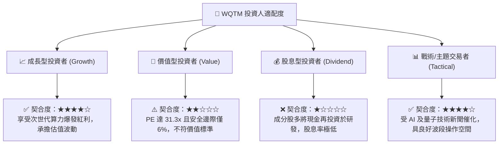

### 11.5 每季財報監控清單（Quarterly Watch List）

| 監控維度 | 核心追蹤指標 | 加碼門檻 (Bullish) | 減碼門檻 (Bearish) |
|----------|--------------|--------------------|--------------------|
| **成長動能** | 底層穿透營收 YoY | > 18.0% | < 8.0% |
| **估值水準** | 底層加權 Trailing P/E | < 25.0x | > 38.0x |
| **ETF 規模** | 基金 AUM 流入趨勢 | AUM > $500M 且無折價 | AUM 跌破 $200M |
| **獲利品質** | 穿透加權 FCF 利潤率 | > 15.0% | < 8.0% |
| **研發強度** | 穿透 R&D 佔營收比例 | 25% – 32% (健康投入) | < 15% (創新停滯) |

### 11.6 反面論證：什麼會證明論點錯誤（Disconfirming Evidence）

```
╔══════════════════════════════════════════════════════════════════╗
║              ⚠️ 論點失效條件（Disconfirming Evidence）           ║
╠══════════════════════════════════════════════════════════════════╣
║  本投資評級在下列量化條件出現時必須全面重新檢視或退場：          ║
║  ① 底層穿透營收成長率連續兩季低於 8.0%。                        ║
║  ② 穿透 ROIC 跌破 WACC（< 10.45%），經濟價值轉為摧毀。          ║
║  ③ 量子硬體容錯技術進展停滯，主要雲端服務商削減 QCaaS 資本支出。 ║
║  ④ 組合中純量子初創企業出現流動性危機並進行大幅折價股權增發。    ║
║  ⑤ 宏觀無風險利率（10Y 美債）突破 5.25%，導致高成長板塊全面殺估值║
╚══════════════════════════════════════════════════════════════════╝
```

---
> **免責聲明**：本報告為機構級研究分析模型生成，僅供學術探討與投資研究參考，不構成任何個別化的投資建議或買賣邀約。投資科技主題 ETF 具備高波動風險，投資人應獨立評估自身風險承受能力並諮詢合格財務顧問。