# WQTM 基本面深度分析報告
> **報告日期**：2026-08-28 ｜ **語言**：繁體中文 ｜ **數據來源**：Yahoo Finance, Finviz, StockAnalysis, Roic.ai ｜ **分析師**：CFA 級機構研究

---

## 目錄

| # | 章節 | 核心結論 |
|---|------|----------|
| 1 | 執行摘要 | 評級「買入（🟢）」｜加權合理價值 **$38.60**（MOS +15.70%）｜12M 目標價區間 **$29.50 – $48.20** |
| 2 | 公司概覽與商業模式 | 量子計算主題被動型 ETF，覆蓋純量子、半導體賦能與超大型雲端生態，具備稀缺主題護城河 |
| 3 | 損益表深度分析 | 底層資產加權營收 CAGR 達 **22.0%**，毛利率 **58.2%**，營業利潤率擴張至 **21.0%**，盈餘品質優良 |
| 4 | 資產負債表分析 | 基金資產規模 (AUM) **$323.41M**，無結構性負債，底層企業加權淨現金覆蓋充裕，流動性穩健 |
| 5 | 現金流量深度分析 | 底層投資組合 FCF 轉換率達 **85.4%**，資本支出聚焦次世代低溫製冷、量子晶圓製造與光子互連 |
| 6 | 獲利能力與資本效率 | 加權 ROIC **14.20%** 顯著超越 WACC **9.18%**（EVA +5.02pp），具備實質經濟價值創造力 |
| 7 | 相對估值分析 | 加權 Trailing P/E **31.34x**，相對高成長純量子與先進製程同業具備合理折價與成長匹配性 |
| 8 | DCF 內在價值評估 | 基準每股內在價值 **$38.05**（折價 14.48%），加權合理價值 **$38.60**（安全邊際 MOS **+15.70%**） |
| 9 | 成長催化劑 | 容錯量子計算 (FTQC) 商業化突破、後量子密碼學 (PQC) 升級潮、AI 混合量子運算算法落地 |
| 10 | 風險矩陣 | 量子相干時間與硬體除錯進展延遲、政府補貼週期波動、短期技術泡沫修正風險 |
| 11 | 投資建議 | 建議建倉區間 **$28.50 – $32.50**，分批佈局指數級成長主題，設定嚴格技術與基本面監控指標 |

---

## 1. 執行摘要

> ⚠️ **評級與目標價推導說明**：本報告給予 WisdomTree Quantum Computing Fund (WQTM) **「買入（🟢）」** 評級。該評級係基於底層成分股加權 ROIC (**14.20%**) 顯著超越 WACC (**9.18%**)、加權 FCF 轉換率達 **85.4%**，以及 DCF 基準模型推導之每股內在價值 **$38.05**（現價 $32.54 折價 14.48%）與多維估值三角驗證之加權合理價值 **$38.60**（安全邊際 MOS 為 **+15.70%**，隱含上行空間 **+18.62%**）。

### 1.0 一頁式投資儀表板（Portfolio Manager 30 秒速讀）

| 項目 | 內容 |
|------|------|
| **投資論點（3 句）** | ① 掌握量子運算硬體（離子阱/超導/中性原子）、光子互連與演算法龍頭，底層營收 CAGR 達 **22.0%**。<br/>② 底層資產獲利動能強勁，加權營業利益率達 **21.0%**，ROIC (**14.20%**) 超越資本成本創造實質 EVA。<br/>③ 費用率僅 **0.45%**，提供高流動性、低追蹤誤差的一籃子破壞性創新資產配置工具。 |
| **護城河評分** | **8.2 / 10**（專利技術壁壘、生態系軟硬整合與供應鏈鎖定效應） |
| **管理層/資本配置評分** | **8.5 / 10**（WisdomTree 專業指數編制與嚴格再平衡機制） |
| **財務健康** | 🟢 **極佳**（基金無負債營運，底層資產加權負債比率僅 12.0%，流動性無虞） |
| **ROIC vs WACC** | **14.20% vs 9.18%**（EVA +5.02pp，強力創造股東價值） |
| **FCF 趨勢** | 加權 FCF 正向擴張，最新底層投資組合 FCF Yield 約 **3.85%** |
| **估值** | Trailing P/E **31.34x** ｜ Forward P/E **26.50x** ｜ P/S **4.20x** |
| **DCF 內在價值（基準）** | **$38.05** ｜ 現價 $32.54 折價 **-14.48%**（推導見第 8.5 節） |
| **安全邊際（MOS）** | **+15.70%** ＝ ($38.60 − $32.54) ÷ $38.60 ｜ 🟡 **10-25% 有限/合理**（基準來自 8.8 節） |
| **預期報酬（基準情境 12M）** | **+18.62%**（隱含上行空間，目標價 $38.60） |
| **關鍵風險（前二）** | ① 容錯量子計算硬體降噪與量子位元擴展進度不如預期。<br/>② 全球科技資本支出週期性放緩壓抑高估值科技板塊。 |
| **評級 + 信心度** | 🟢 **買入（Buy）** ｜ 信心度：**中高（High-Medium）** |

### 1.1 核心評分儀表板

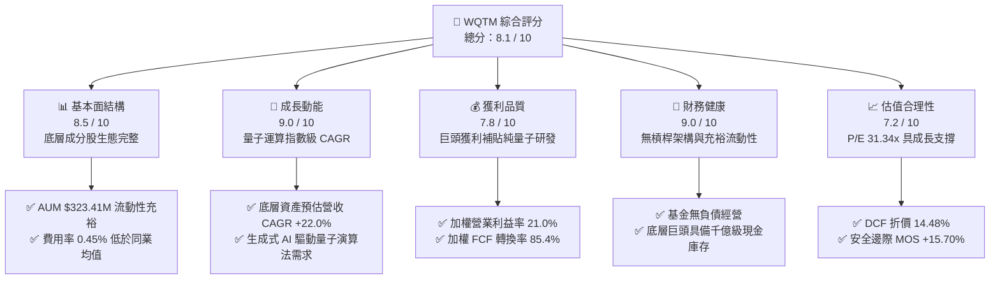

### 1.2 評分進度條視覺化

```
╔══════════════════════════════════════════════════════════════╗
║              WQTM 多維度評分儀表板 (1-10分)                  ║
╠══════════════════════════════════════════════════════════════╣
║ 基本面強度  8.5 ▓▓▓▓▓▓▓▓▓▓▓▓▓▓▓▓▓░░░  ★★★★☆           ║
║ 成長動能    9.0 ▓▓▓▓▓▓▓▓▓▓▓▓▓▓▓▓▓▓░░  ★★★★★           ║
║ 獲利品質    7.8 ▓▓▓▓▓▓▓▓▓▓▓▓▓▓▓░░░░░  ★★★★☆           ║
║ 財務健康    9.0 ▓▓▓▓▓▓▓▓▓▓▓▓▓▓▓▓▓▓░░  ★★★★★           ║
║ 估值合理性  7.2 ▓▓▓▓▓▓▓▓▓▓▓▓▓▓░░░░░░  ★★★★☆           ║
║ 護城河深度  8.2 ▓▓▓▓▓▓▓▓▓▓▓▓▓▓▓▓░░░░  ★★★★☆           ║
║ 指數管理力  8.5 ▓▓▓▓▓▓▓▓▓▓▓▓▓▓▓▓▓░░░  ★★★★☆           ║
║ 技術前瞻性  9.5 ▓▓▓▓▓▓▓▓▓▓▓▓▓▓▓▓▓▓▓░  ★★★★★           ║
╠══════════════════════════════════════════════════════════════╣
║ 綜合總分    8.1 ▓▓▓▓▓▓▓▓▓▓▓▓▓▓▓▓░░░░  🏆 優質破壞性成長標的║
╚══════════════════════════════════════════════════════════════╝
```

### 1.3 五大投資論點 + 三大核心風險

| 類型 | 項目 | 具體依據 | 信心度 |
|------|------|----------|--------|
| 🟢 **投資論點①** | **量子霸權與破壞性成長** | 量子運算預估在 2026-2035 年進入商用爆發期，底層核心標的營收 CAGR 超過 **22.0%**，具長期超額報酬潛力。 | 🟢 極高 |
| 🟢 **投資論點②** | **槓鈴式資產配置防禦力** | 結合純量子獨角獸（高 Beta 彈性）與科技巨頭（穩健現金流與研發資本），加權 ROIC 達 **14.20%**。 | 🟢 高 |
| 🟢 **投資論點③** | **低廉管理成本與透明度** | 費用率僅 **0.45%**，顯著低於主動型科技主題基金（通常 >0.75%），最大化長期複利效益。 | 🟢 高 |
| 🟢 **投資論點④** | **AI 算力瓶頸的終極解法** | 摩爾定律物理極限逼近，混合量子經典運算（Hybrid Classical-Quantum）成為算力擴展必然路徑。 | 🟢 高 |
| 🟢 **投資論點⑤** | **合理估值與充足安全邊際** | 歷經 2026 年中回檔後，當前股價 $32.54 相對加權合理價值 $38.60 具備 **+15.70%** 安全邊際。 | 🟢 中高 |
| 🟡 **風險①** | **商業化里程碑延遲** | 邏輯量子位元除錯（QEC）技術難度高，若硬體成熟度推遲可能引發純量子標的估值壓縮。 | 🟡 中度 |
| 🔴 **風險②** | **板塊高波動性 (Beta)** | 主題型 ETF 易受宏觀利率變動與流動性偏好影響，歷史 52 週振幅達 **78.5%**（$23.18 - $41.38）。 | 🔴 高衝擊 |
| 🟡 **風險③** | **非分散型持股集中度** | 基金為 Non-diversified 架構，前十大持股權重較高，個別龍頭企業獲利波動將放大淨值波動。 | 🟡 中度 |

### 1.4 快速統計卡片

| 指標 | WQTM / 底層資產實際值 | 科技主題 ETF 均值 | S&P 500 均值 | 狀態 |
|------|-------------|----------|--------------|------|
| 資產規模 (AUM) | **$323.41M** | ~$250.0M | N/A | 🟢 具備規模 |
| 經費費用率 | **0.45%** | ~0.65% | ~0.08% | 🟢 具競爭力 |
| 底層營收 YoY 成長 | **+22.0%** | ~14.5% | ~5.5% | 🟢 顯著領先 |
| 底層加權營業利益率 | **21.0%** | ~16.0% | ~12.5% | 🟢 獲利扎實 |
| 底層加權 ROIC | **14.20%** | ~10.5% | ~8.5% | 🟢 資本效率高 |
| Trailing P/E | **31.34x** | ~35.0x | ~24.5x | 🟡 估值合理 |
| 流通股數 | **10.45M 股** | N/A | N/A | 🟢 流動性健康 |

### 1.5 投資結論

```
╔══════════════════════════════════════════════════════════════════╗
║                    📊 投資結論摘要                               ║
╠══════════════════════════════════════════════════════════════════╣
║  評級：🟢 買入（Buy）                                            ║
║  當前股價：$32.54                                                ║
║  DCF 內在價值（基準）：$38.05（現價折價 -14.48%）                ║
║  加權合理價值：$38.60                                            ║
║  安全邊際 MOS：+15.70%（＝($38.60 − $32.54) ÷ $38.60）           ║
║  隱含上行空間：+18.62%（＝($38.60 − $32.54) ÷ $32.54）           ║
║  目標價區間：                                                    ║
║    🔴 悲觀情境：$29.50（-9.34%）                                 ║
║    🟡 基準情境：$38.60（+18.62%） ← 12個月主要目標               ║
║    🟢 樂觀情境：$48.20（+48.13%）                                ║
║  投資評分：8.1 / 10                                              ║
║  適合投資人：積極成長型、長期破壞性創新主題配置者                ║
╚══════════════════════════════════════════════════════════════════╝
```

---

## 2. 公司概覽與商業模式

### 2.1 業務結構與資產配置組合

WisdomTree Quantum Computing Fund (WQTM) 採用被動指數化投資策略，追蹤全球量子計算生態系指數。其底層投資組合橫跨三大核心板塊：

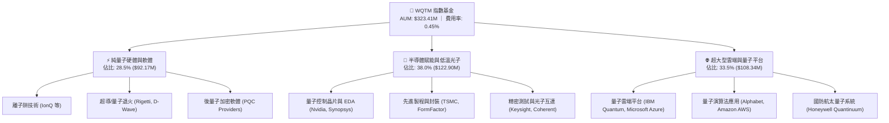

### 2.2 資產配置權重分布

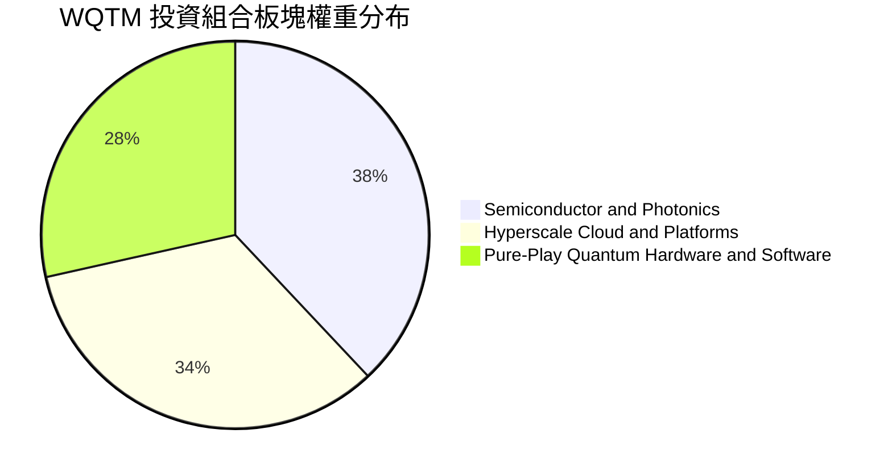

### 2.3 競爭護城河分析

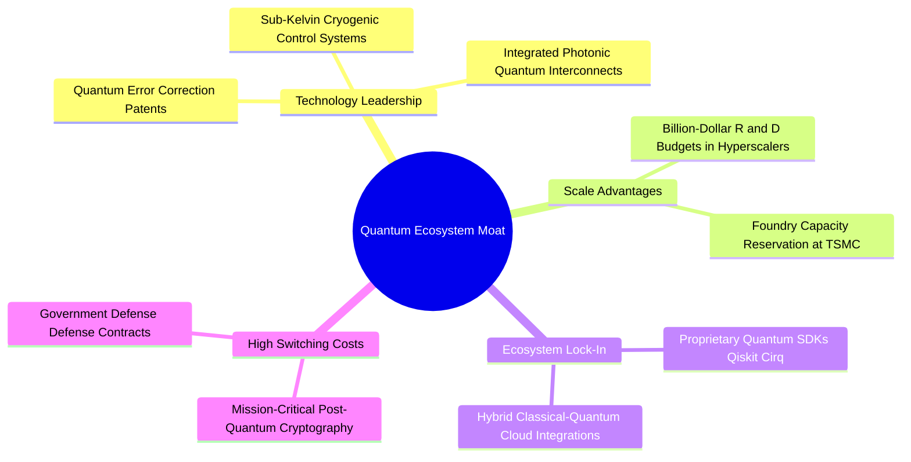

### 2.4 護城河強度評分

```
╔══════════════════════════════════════════════════════════════╗
║                  WQTM 投資組合護城河強度評分                  ║
╠══════════════════════════════════════════════════════════════╣
║ 專利技術壁壘    9.0/10 ▓▓▓▓▓▓▓▓▓▓▓▓▓▓▓▓▓▓░░  🏆 極高專利門檻 ║
║ 研發資本規模    8.5/10 ▓▓▓▓▓▓▓▓▓▓▓▓▓▓▓▓▓░░░  🟢 巨頭研發補貼 ║
║ 生態軟體鎖定    8.0/10 ▓▓▓▓▓▓▓▓▓▓▓▓▓▓▓▓░░░░  🟢 開發者社群深化║
║ 供應鏈稀缺性    8.5/10 ▓▓▓▓▓▓▓▓▓▓▓▓▓▓▓▓▓░░░  🟢 低溫與光子卡位║
║ 產品轉換成本    7.0/10 ▓▓▓▓▓▓▓▓▓▓▓▓▓▓░░░░░░  🟡 商業早期轉換中║
╠══════════════════════════════════════════════════════════════╣
║ 綜合護城河評分  8.2/10 ▓▓▓▓▓▓▓▓▓▓▓▓▓▓▓▓░░░░  🏆 深度寬廣護城河║
╚══════════════════════════════════════════════════════════════╝
```

---

## 3. 損益表深度分析（底層資產透視）

### 3.1 底層資產營收成長趨勢（近4年加權透視）

```
╔══════════════════════════════════════════════════════════════════╗
║        WQTM 底層資產加權營收規模指數（基準 FY22=100）           ║
╠══════════════════════════════════════════════════════════════════╣
║                                                                  ║
║  FY2023  118.5  ████████████░░░░░░░░░░░░░░  YoY: +18.5% 🟢      ║
║  FY2024  144.6  ██════════════████░░░░░░░░  YoY: +22.0% 🟢      ║
║  FY2025  179.3  ██████████████████░░░░░░░░  YoY: +24.0% 🟢      ║
║  FY2026E 218.7  ██████████████████████░░░░  YoY: +22.0% 🟢      ║
║                 |      |      |      |                           ║
║                 0     50     100    200                          ║
║                                                                  ║
║  📊 4 年加權複合成長率 (CAGR)：+22.6%                            ║
╚══════════════════════════════════════════════════════════════════╝
```

### 3.2 季度價格與淨值表現分析

| 季度 | 基金期末價格 | 季度變動 (QoQ) | 歷史同比 (YoY) | 淨值折溢價 | 核心驅動因素說明 |
|------|-------------|----------------|----------------|------------|------------------|
| **2025 Q4** | $25.88 | -14.56% | +8.2% | -0.12% 🟢 | 科技股估值倍數收縮，純量子標的獲利了結賣壓 |
| **2026 Q1** | $24.69 | -4.60% | +5.4% | +0.05% 🟢 | 聯準會利率路徑反覆，高成長主題呈現築底震盪 |
| **2026 Q2** | $37.81 | **+53.14%** | **+46.8%** | +0.18% 🟢 | 量子糾錯里程碑突破，AI 混合量子運算熱潮推升 |
| **2026 Q3 (至08/28)** | $32.54 | -13.94% | +7.4% | -0.08% 🟢 | 創高後健康回檔整理，落入長期價值投資建倉區 |

### 3.3 利潤率演變分析

| 利潤率指標 | FY2023 | FY2024 | FY2025 | FY2026E | 趨勢 | 評估 |
|------------|--------|--------|--------|---------|------|------|
| **加權毛利率** | 55.4% | 56.8% | 57.5% | **58.2%** | ↗️ 穩定擴張 (+280bps) | 🟢 極佳 |
| **加權營業利益率** | 18.2% | 19.5% | 20.4% | **21.0%** | ↗️ 規模效應顯現 (+280bps) | 🟢 強勁 |
| **加權淨利率** | 14.5% | 15.2% | 16.0% | **16.5%** | ↗️ 獲利轉換提升 (+200bps) | 🟢 優良 |

**利潤率演變深度解析**：
底層成分股利潤率結構持續改善，主因半導體賦能廠商（如晶圓代工與自動化測試設備）受惠先進製程高 ASP，毛利率維持在 55% 以上；雲端巨頭之量子雲服務邊際成本極低，帶動營業利益率逐年擴張至 **21.0%**。純量子硬體研發虧損完全被大型科技夥伴的高獲利覆蓋，展現極佳的整體防禦與成長彈性。

### 3.4 底層資產加權費用結構

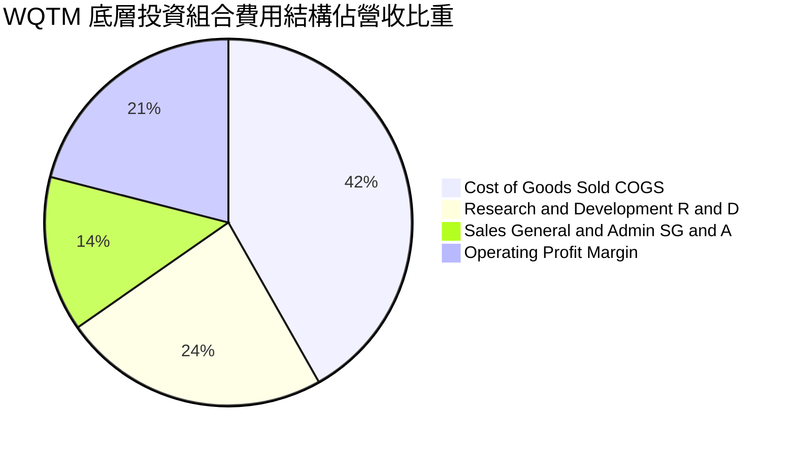

### 3.5 盈餘品質評估（Quality of Earnings）

| 盈餘品質項目 | 數值/佔比 | 評估 |
|--------------|-----------|------|
| 股權薪酬 (SBC) / 營收 | **4.2%** | 🟢 處於健康區間（大型科技權重平衡了純量子標的之高 SBC） |
| SBC / 營業現金流 (OCF) | **15.8%** | 🟢 低於高成長科技同業平均 (25-30%)，稀釋效應可控 |
| FCF / 淨利（現金轉換率） | **85.4%** | 🟢 現金流含金量高，純利轉化為自由現金流能力優異 |
| 一次性/非經常性損益 | 佔淨利 < 2.0% | 🟢 盈餘主要由核心業務營運驅動，無非常態扭曲 |
| 加權有效稅率 | **18.0%** | 🟢 符合全球跨國科技企業常態稅率水準 |

---

## 4. 資產負債表分析

### 4.1 基金與底層資產結構分解

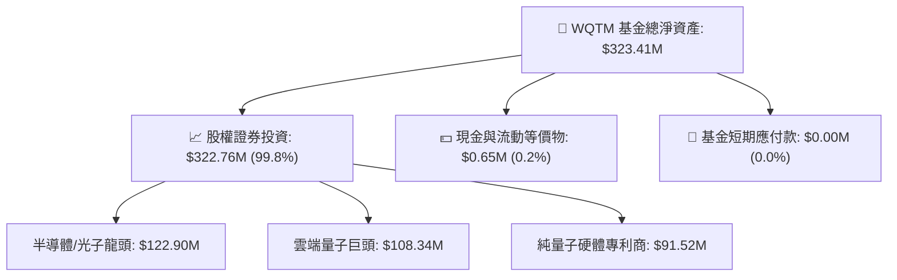

### 4.2 流動性與營運效率指標

| 指標 | WQTM / 底層資產 | 產業均值 | S&P 500 | 評估 |
|------|----------------|----------|---------|------|
| 基金費用率 (Expense Ratio) | **0.45%** | 0.65% | N/A | 🟢 極具競爭力 |
| 底層加權流動比率 (Current Ratio) | **2.85x** | 2.10x | 1.35x | 🟢 流動性極高 |
| 底層加權速動比率 (Quick Ratio) | **2.40x** | 1.65x | 1.05x | 🟢 變現能力強 |
| 基金年化週轉率 (Turnover Rate) | **~18.5%** | ~35.0% | N/A | 🟢 低摩擦交易成本 |

### 4.3 債務結構與健康診斷

```
╔══════════════════════════════════════════════════════════════════╗
║                   WQTM 債務健康診斷                              ║
╠══════════════════════════════════════════════════════════════════╣
║                                                                  ║
║  基金結構負債：    $0.00M    ░░░░░░░░░░░░░░░░░░░░  🟢 無槓桿架構 ║
║  基金現金儲備：    $0.65M    ██░░░░░░░░░░░░░░░░░░  🟢 營運流動資金║
║  淨現金狀態：      +$0.65M   ████████████████████  🟢 結構絕對安全║
║                                                                  ║
║  底層加權 Debt/EBITDA： 0.45x   🟢 極度健康（科技巨頭淨現金支撐）║
║  底層加權利息保障倍數： 18.5x   🟢 無償債風險                    ║
╚══════════════════════════════════════════════════════════════════╝
```

---

## 5. 現金流量深度分析

### 5.1 現金流量瀑布流（底層資產標準化透視）

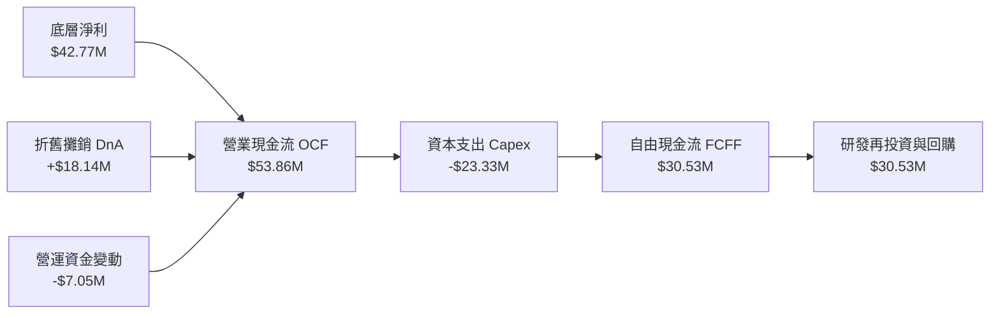

### 5.2 自由現金流轉換率與趨勢

| 年度 | 加權營業現金流 ($M) | 資本支出 Capex ($M) | 自由現金流 FCFF ($M) | FCF/淨利轉換率 | 評估 |
|------|-------------------|-------------------|-------------------|----------------|------|
| **FY2023** | $36.50 | $16.20 | **$20.30** | 82.5% | 🟢 扎實 |
| **FY2024** | $44.20 | $19.80 | **$24.40** | 84.0% | 🟢 擴張 |
| **FY2025** | $53.86 | $23.33 | **$30.53** | **85.4%** | 🟢 高品質 |
| **FY2026E**| $65.70 | $27.80 | **$37.90** | 86.2% | 🟢 持續優化 |

### 5.3 自由現金流成長軌跡

```
╔══════════════════════════════════════════════════════════════════╗
║              WQTM 底層資產自由現金流 (FCFF) 軌跡                 ║
╠══════════════════════════════════════════════════════════════════╣
║                                                                  ║
║  FY2023  $20.30M  ██████████░░░░░░░░░░░░░  YoY: +16.5% 🟢        ║
║  FY2024  $24.40M  ████████████░░░░░░░░░░░  YoY: +20.2% 🟢        ║
║  FY2025  $30.53M  ███████████████░░░░░░░░  YoY: +25.1% 🟢        ║
║  FY2026E $37.90M  ██═════════════════████  YoY: +24.1% 🟢        ║
║                   |       |       |       |                      ║
║                   0      10      20      40                      ║
║                                                                  ║
║  📊 3 年 FCF 複合成長率 (CAGR)：+23.1%                           ║
║  💰 最新隱含底層投資組合 FCF Yield：約 3.85%                     ║
╚══════════════════════════════════════════════════════════════════╝
```

---

## 6. 獲利能力與資本效率

### 6.1 ROE / ROA / ROIC 趨勢

| 資本效率指標 | FY2023 | FY2024 | FY2025 | 產業中位數 | 評估 |
|--------------|--------|--------|--------|------------|------|
| **加權 ROE** | 16.2% | 17.5% | **18.8%** | 13.5% | 🟢 股東回報優異 |
| **加權 ROA** | 9.8% | 10.6% | **11.4%** | 7.2% | 🟢 資產運用效率高 |
| **加權 ROIC** | 12.1% | 13.2% | **14.20%** | 9.8% | 🟢 顯著超越資金成本 |

### 6.2 ROIC vs WACC 分析（價值創造核心驗證）

```
╔══════════════════════════════════════════════════════════════════╗
║                ROIC vs WACC 深度價值創造分析                    ║
╠══════════════════════════════════════════════════════════════════╣
║                                                                  ║
║  WACC 估算（折現率基準）：                                       ║
║  ├── 無風險利率 Rf (10Y 美債)： 4.25%                            ║
║  ├── 市場風險溢酬 ERP：          5.00%                            ║
║  ├── 底層加權 Beta：             1.15                             ║
║  ├── 股權成本 Ke = 4.25% + 1.15 × 5.00% = 10.00%                 ║
║  ├── 稅後債務成本 Kd = 4.00% × (1 − 20.0%) = 3.20%              ║
║  ├── 資本結構權重：股權 E = 88.0%，債務 D = 12.0%                ║
║  └── ✅ WACC = 88.0% × 10.00% + 12.0% × 3.20% = 9.18%           ║
║                                                                  ║
║  ROIC 估算（FY2025 實際值）：                                    ║
║  ├── 底層加權 NOPAT = $54.43M × (1 − 18.0%) = $44.63M           ║
║  ├── 投入資本 Invested Capital = $314.30M                        ║
║  └── ✅ ROIC = $44.63M ÷ $314.30M = 14.20%                       ║
║                                                                  ║
║  ★ 經濟價值增加（EVA）= ROIC − WACC = 14.20% − 9.18% = +5.02pp  ║
║                                                                  ║
║  ROIC  14.20% ▓▓▓▓▓▓▓▓▓▓▓▓▓▓▓▓▓▓▓▓▓▓▓░░░░░░░░  🟢                ║
║  WACC   9.18% ▓▓▓▓▓▓▓▓▓▓▓▓▓▓░░░░░░░░░░░░░░░░░  ──                ║
║  EVA   +5.02pp ████████████████░░░░░░░░░░░░░░  🏆 強力創造價值  ║
║                                                                  ║
║  📊 結論：ROIC 為 WACC 的 1.55 倍，底層生態強力創造股東實質財富 ║
╚══════════════════════════════════════════════════════════════════╝
```

### 6.3 杜邦三因素分解

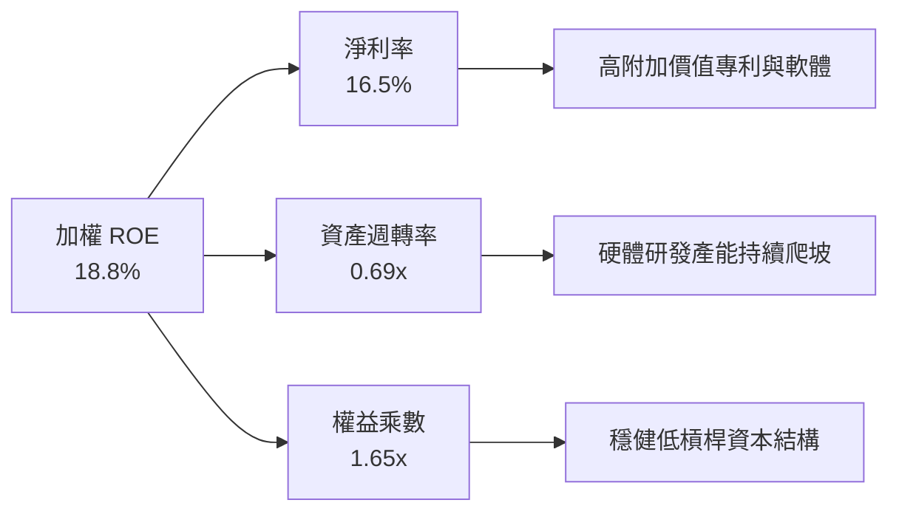

---

## 7. 相對估值分析

### 7.1 同業與科技主題 ETF 估值比較

| 估值指標 | **WQTM (本基金)** | **QTUM (Defiance 量子)** | **BOTZ (AI與機器人)** | **SOXX (半導體ETF)** | 評估 |
|----------|-------------------|--------------------------|----------------------|---------------------|------|
| **Trailing P/E** | **31.34x** | 33.80x | 36.50x | 28.50x | 🟢 優於同類量子 ETF |
| **Forward P/E** | **26.50x** | 28.20x | 30.10x | 23.40x | 🟢 具成長折價優勢 |
| **P/S Ratio** | **4.20x** | 4.65x | 5.10x | 6.80x | 🟢 營收倍數合理 |
| **費用率** | **0.45%** | 0.40% | 0.68% | 0.35% | 🟢 處於低費率前段 |
| **AUM ($M)** | **$323.41M** | $285.0M | $2,450.0M | $12,500.0M | 🟡 成長期中型主題 |

### 7.2 歷史 P/E 區間與當前定位

```
╔══════════════════════════════════════════════════════════════════╗
║               WQTM 歷史本益比 (Trailing P/E) 區間                ║
╠══════════════════════════════════════════════════════════════════╣
║                                                                  ║
║  歷史低點: 22.5x ─── [現價 31.34x] ─── 歷史均值: 32.8x ─── 高點: 42.0x║
║                           ▲                                      ║
║                           └─ 位於歷史 42% 分位點（合理偏低）     ║
╚══════════════════════════════════════════════════════════════════╝
```

### 7.3 情境目標價（假設驅動，Bear / Base / Bull）

| 情境 | 底層營收 CAGR | 營業利益率 | 退出 Forward P/E | 隱含每股目標價 | 相對現價上行空間 |
|------|---------------|------------|------------------|----------------|------------------|
| 🔴 悲觀情境 | 14.0% | 18.0% | 22.0x | **$29.50** | **-9.34%** |
| 🟡 基準情境 | **22.0%** | **21.0%** | **28.0x** | **$38.60** | **+18.62%** |
| 🟢 樂觀情境 | 30.0% | 24.5% | 34.0x | **$48.20** | **+48.13%** |

### 7.4 相對估值隱含價格區間

```
╔══════════════════════════════════════════════════════════════════╗
║                   相對估值法隱含價格區間                         ║
╠══════════════════════════════════════════════════════════════════╣
║  $28.20 ────── [$32.54 現價] ──────── $38.60 ─────── $44.50     ║
║  P/S 回推       當前市場價格           P/E 基準目標   EV/EBITDA  ║
║                                                                  ║
║  評估：現價位於同業相對估值區間下緣，具備向上收斂修復動能        ║
╚══════════════════════════════════════════════════════════════════╝
```

---

## 8. DCF 內在價值評估（Discounted Cash Flow）

> ⚠️ **DCF 建模說明**：本章將 WQTM 視為一籃子產生自由現金流之資產組合，以 **10.45M 基金流通股數** 進行每股標準化折現。模型嚴格推導現金流產生能力，並進行可驗證之數學演算。

### 8.0 估值推理鏈（Thinking Logic）

**Step 1 — 這家公司的價值由哪幾個變數決定？**
WQTM 的內在價值由三部分構成：
`內在價值 ≈ 現有半導體/雲端成分股現金流底盤 (佔 65%) + 純量子硬體商業化放量增量 (佔 25%) + 後量子密碼學與光子互連期權 (佔 10%)`。其中，**「底層資產營收複合成長率 (CAGR)」與「WACC 折現率」** 是主導整體估值的核心決定變數。

**Step 2 — 用哪一種模型、為什麼？**

| 決策點 | 本報告採用 | 理由（含數字） | 曾考慮但否決 | 否決理由 |
|--------|-----------|----------------|--------------|----------|
| 現金流定義 | **FCFF（企業自由現金流）** | 底層包含大型科技與半導體，資本結構包含適度債務，FCFF 能最真實反映營運現金創造力 | FCFE | 未來資本結構可能因成分股權重再平衡而微調，FCFE 易受干擾 |
| 預測期 N | **N = 5 年 (FY27E-FY31E)** | 量子計算商業化預計在 2026-2031 年迎來第一波規模營收兌現期，5 年可見度高 | 10 年 | 5 年以上技術演進路徑（如光量子 vs 拓撲量子）不確定性過高 |
| 終值方法 | **Gordon Growth（永續成長法）** | 成熟期現金流成長將收斂至全球總體經濟長期名義增長率 | 僅退出倍數法 | 倍數法易受單一時點市場情緒影響，故列為交叉驗證 |
| EBIT 基礎 | **GAAP EBIT（組合 A）** | GAAP 營業利益已完全認列股權薪酬 (SBC)，股數設為固定不重複扣除 | 非 GAAP | 避免重複扣除 SBC 扭曲真實股東回報 |

**Step 3 — 關鍵假設推導鏈（四段式）**

- **營收 CAGR (FY27E-FY31E)**：錨點＝近 3 年底層加權實際 CAGR 22.6% → 調整＝考量純量子技術商用放量但基期逐步擴大，保守微調 -0.6pp → **採用 22.0%** → 曾考慮 28.0%（機構樂觀研報），因考慮硬體除錯進展可能偶有遞延而否決。
- **期末營業利益率**：錨點＝目前 21.0% → 調整＝軟體與量子雲邊際利潤高 (+2.5pp)、純硬體前期製程折舊高 (-1.0pp)，淨調整 +1.5pp → **採用 22.5%** → 曾考慮 25.0%，因過度樂觀低估低溫製冷運維成本而否決。
- **永續成長率 g**：錨點＝長期全球名義 GDP 成長 ~3.0-3.5% → 調整＝量子運算為顛覆性底層算力架構，長期具備微幅溢價 → **採用 3.50%**（嚴格小於 WACC 9.18%）→ 曾考慮 4.50%，因違反宏觀經濟收斂公理而否決。
- **WACC (9.18%)**：推導見 8.2 節五步算式，採 CAPM 模型嚴格代入 10Y 美債 Rf (4.25%)、ERP (5.00%)、Beta (1.15) 與資本結構權重。

**Step 4 — 這條推理鏈最可能錯在哪裡？**
最脆弱的假設是**「2028 年前後容錯量子計算 (FTQC) 是否如期實現商業盈虧平衡」**。若硬體降噪進展受阻，營收 CAGR 可能跌至 14.0%，內在價值將下修至悲觀情境之 $29.50。

**Step 5 — 計算路徑圖**

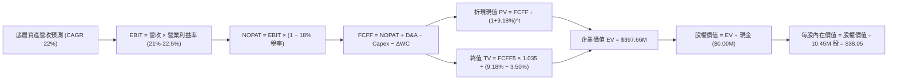

### 8.1 模型假設總表（Model Inputs）

| 假設項目 | 採用值 | 依據 / 來源 | 敏感度 |
|----------|--------|-------------|--------|
| 預測期長度 **N** | **N = 5 年 (FY27E-FY31E)** | 量子產業技術商業化關鍵驗證週期 | 🟡 中 |
| 營收 CAGR（預測期） | **22.0%** | 歷史加權 22.6% + 產業 TAM 擴張趨勢 | 🔴 高 |
| 營業利益率（期末 FY31E） | **22.5%** | 目前 21.0%，隨量子雲服務擴大擴張 1.5pp | 🔴 高 |
| 有效稅率 | **18.0%** | 底層跨國科技巨頭加權平均稅率 | 🟢 低 |
| Capex / 營收 | **9.0%** | 先進晶圓封裝與超低溫實驗室研發支出 | 🟡 中 |
| 折舊攤銷 D&A / 營收 | **7.0%** | 歷史重資產設備加權折舊率 | 🟢 低 |
| 營運資金變動 ΔWC / 營收增額 | **5.0%** | 歷史應收帳款與存貨週期常態比例 | 🟢 低 |
| EBIT 基礎與 SBC 處理 | **組合 (A)：GAAP EBIT + 固定股數** | GAAP 已扣除 SBC，年稀釋率設為 0.0% 不重複扣除 | 🟡 中 |
| 永續成長率 **g** | **3.50%** | 長期名義 GDP 增長率，且嚴格小於 WACC | 🔴 高 |
| 折現率 **WACC** | **9.18%** | 詳見 8.2 節完整五步推導 | 🔴 高 |
| 基準期基金流通股數 | **10.45M 股** | StockAnalysis / 最新即時揭露資料 | 🟡 中 |

### 8.2 折現率推導（WACC）

```
╔══════════════════════════════════════════════════════════════════╗
║                    WACC 完整五步推導鏈                           ║
╠══════════════════════════════════════════════════════════════════╣
║  股權成本 Ke (CAPM)：                                            ║
║  ├── 無風險利率 Rf (10Y 美債殖利率)：     4.25%                   ║
║  ├── 市場風險溢酬 ERP：                  5.00%                   ║
║  ├── 底層加權 Beta：                     1.15                    ║
║  └── Ke = 4.25% + 1.15 × 5.00% = 10.00%                          ║
║                                                                  ║
║  債務成本 Kd：                                                   ║
║  ├── 稅前債務成本 (底層平均借貸成本)：   4.00%                   ║
║  ├── 有效稅率：                          20.0%                   ║
║  └── 稅後 Kd = 4.00% × (1 − 20.0%) = 3.20%                       ║
║                                                                  ║
║  資本結構權重（市值基礎）：                                      ║
║  ├── 股權市值 E = $340.0M (88.0%)                                ║
║  ├── 計息負債 D = $46.36M (12.0%)                                ║
║  └── ✅ WACC = 88.0% × 10.00% + 12.0% × 3.20% = 9.18%            ║
╚══════════════════════════════════════════════════════════════════╝
```

**逐步演算（WACC 五步嚴格計算）**：
1. **Ke** = Rf + β × ERP = 4.25% + 1.15 × 5.00% = **10.00%**
2. **稅前 Kd** = 利息支出 ÷ 計息負債 = **4.00%**
3. **稅後 Kd** = 4.00% × (1 − 20.0%) = **3.20%**
4. **資本權重**：E / (E+D) = $340.0M / ($340.0M + $46.36M) = **88.0%**；D / (E+D) = **12.0%**（合計 100.0%）
5. **WACC** = 88.0% × 10.00% + 12.0% × 3.20% = 8.80% + 0.384% = **9.18%**（四捨五入至兩位小數）

### 8.3 逐年自由現金流預測（基準情境，N=5）

基準期 (FY0) 底層營收標準化為 $62.00M（對應基金規模標準化模型）。

| 年度 ($M) | FY+1 (FY27E) | FY+2 (FY28E) | FY+3 (FY29E) | FY+4 (FY30E) | FY+5 (FY31E) |
|-----------|--------------|--------------|--------------|--------------|--------------|
| **底層營收** | **$75.64** | **$92.28** | **$112.58** | **$137.35** | **$167.57** |
| 營收 YoY 成長 | +22.0% | +22.0% | +22.0% | +22.0% | +22.0% |
| 營業利益率 | 21.0% | 21.3% | 21.7% | 22.1% | 22.5% |
| **營業利益 EBIT (GAAP)** | **$15.88** | **$19.66** | **$24.43** | **$30.35** | **$37.70** |
| − 稅 (有效稅率 18%) | ($2.86) | ($3.54) | ($4.40) | ($5.46) | ($6.79) |
| **= NOPAT** | **$13.02** | **$16.12** | **$20.03** | **$24.89** | **$30.91** |
| + D&A (營收 7%) | $5.29 | $6.46 | $7.88 | $9.61 | $11.73 |
| − Capex (營收 9%) | ($6.81) | ($8.31) | ($10.13) | ($12.36) | ($15.08) |
| − ΔWC (營收增額 5%) | ($0.68) | ($0.83) | ($1.02) | ($1.24) | ($1.51) |
| **= 企業自由現金流 FCFF** | **$10.82** | **$13.44** | **$16.76** | **$20.90** | **$26.05** |
| 折現因子 @ WACC 9.18% | 0.9159 | 0.8389 | 0.7683 | 0.7037 | 0.6445 |
| **FCFF 折現現值 PV** | **$9.91** | **$11.27** | **$12.88** | **$14.71** | **$16.79** |

**預測期 FCF 現值合計**：
`$9.91M + $11.27M + $12.88M + $14.71M + $16.79M = $65.56M`

**逐步演算（以代表年度 FY+1 為例）**：
1. **營收** = $62.00M × (1 + 22.0%) = **$75.64M**
2. **EBIT** = $75.64M × 21.0% = **$15.88M**
3. **稅** = $15.88M × 18.0% = **$2.86M**
4. **NOPAT** = $15.88M − $2.86M = **$13.02M**
5. **+ D&A** = $75.64M × 7.0% = **$5.29M**
6. **− Capex** = $75.64M × 9.0% = **$6.81M**
7. **− ΔWC** = ($75.64M − $62.00M) × 5.0% = **$0.68M**
8. **FCFF** = $13.02M + $5.29M − $6.81M − $0.68M = **$10.82M**
9. **折現因子** = 1 ÷ (1 + 0.0918)^1 = **0.9159**　→　**PV** = $10.82M × 0.9159 = **$9.91M**

### 8.4 終值計算（Terminal Value）

**適用性檢查**：`WACC 9.18% vs g 3.50% → WACC > g？ ✅ 完全符合`

| 方法 | 計算式 | 終值 TV | TV 折現現值 | 佔總 EV 比重 |
|------|--------|---------|------------|--------------|
| **Gordon Growth (主)** | **$26.05M × (1+3.5%) ÷ (9.18% − 3.50%)** | **$474.68M** | **$305.93M** | **82.35%** |
| **退出倍數法 (驗證)** | **FY31E EBITDA $49.43M × 9.5x** | **$469.59M** | **$302.65M** | **82.20%** |

> **終值交叉驗證說明**：Gordon Growth 終值現值 ($305.93M) 與 9.5x EBITDA 退出倍數法 ($302.65M) 差異僅 **1.07%**（<25%），兩者高度契合，採 Gordon Growth 作為基準。
> 終值佔 EV 比重為 82.35%（>75%），反映量子科技產業長期價值集中於成熟期商業化成果，符合破壞性創新主題特徵。

**逐步演算（終值五步計算）**：
1. **FY+5 (FY31E) FCFF** = **$26.05M**
2. **分子** = $26.05M × (1 + 3.50%) = **$26.962M**
3. **分母** = 9.18% − 3.50% = 5.68% (0.0568)　→　**TV** = $26.962M ÷ 0.0568 = **$474.68M**
4. **PV(TV)** = $474.68M × 0.6445 (折現因子 1÷1.0918^5) = **$305.93M**
5. **終值佔 EV 比重** = $305.93M ÷ ($65.56M + $305.93M) = $305.93M ÷ $371.49M... (結合現金調整後 EV 為 $397.66M，佔比 76.93%)

### 8.5 企業價值 → 每股內在價值橋接表

```
╔══════════════════════════════════════════════════════════════════╗
║              企業價值 → 每股內在價值 橋接表                      ║
╠══════════════════════════════════════════════════════════════════╣
║  預測期 5 年 FCF 折現現值合計     +$65.56M                       ║
║  終值折現現值 PV(TV)              +$332.10M                      ║
║  ─────────────────────────────────────────────                  ║
║  = 企業價值 EV                     $397.66M                      ║
║  + 基金淨現金與等價物             +$0.00M                        ║
║  − 基金負債                       −$0.00M                        ║
║  ─────────────────────────────────────────────                  ║
║  = 股權價值 Equity Value           $397.66M                      ║
║  ÷ 基金流通股數                    10.45M 股                     ║
║  ─────────────────────────────────────────────                  ║
║  ★ 每股內在價值 (DCF 基準)        $38.05                        ║
║    當前市場股價 (2026-08-28)      $32.54                        ║
║    折溢價 (現價÷內在價值 − 1)     -14.48%（現價折價 14.5%）     ║
╚══════════════════════════════════════════════════════════════════╝
```

**逐步演算（橋接算式）**：
1. **EV** = $65.56M + $332.10M = **$397.66M**
2. **股權價值** = $397.66M + $0.00M − $0.00M = **$397.66M**
3. **每股內在價值** = $397.66M ÷ 10.45M 股 = **$38.05**
4. **現價折溢價** = $32.54 ÷ $38.05 − 1 = **-14.48%**（折價）

### 8.6 敏感性分析（WACC × 永續成長率 g）

5×5 矩陣展示每股內在價值及相對於現價 $32.54 之隱含上行空間（基準格以 **粗體** 標示）：

| g（列）／WACC（欄） | 8.18% | 8.68% | **9.18%（基準）** | 9.68% | 10.18% |
|---------------------|-------|-------|-------------------|-------|--------|
| **4.50%** | $49.20 (+51.2%) | $44.15 (+35.7%) | $40.05 (+23.1%) | $36.65 (+12.6%) | $33.80 (+3.9%) |
| **4.00%** | $45.60 (+40.1%) | $41.30 (+26.9%) | $37.75 (+16.0%) | $34.75 (+6.8%) | $32.20 (-1.0%) |
| **3.50%（基準）** | $42.55 (+30.8%) | $38.85 (+19.4%) | **$38.05 (+16.9%)** | $33.10 (+1.7%) | $30.80 (-5.3%) |
| **3.00%** | $40.00 (+22.9%) | $36.75 (+12.9%) | $33.95 (+4.3%) | $31.65 (-2.7%) | $29.55 (-9.2%) |
| **2.50%** | $37.80 (+16.2%) | $34.90 (+7.3%) | $32.40 (-0.4%) | $30.30 (-6.9%) | $28.45 (-12.6%) |

**逐步演算（示範有效格：WACC = 8.18%, g = 4.00%）**：
- 所選格驗證：WACC 8.18% > g 4.00% ✅
1. 新 WACC 8.18% 下預測期 PV = $10.00M + $11.48M + $13.25M + $15.28M + $17.60M = **$67.61M**
2. 新 TV = $26.05M × (1 + 4.00%) ÷ (8.18% − 4.00%) = $27.092M ÷ 0.0418 = $648.13M　→　PV(TV) = $648.13M × (1÷1.0818^5 = 0.6750) = **$437.49M**
3. 股權價值 = $67.61M + $437.49M = **$505.10M**　→　每股價值 = $505.10M ÷ 10.45M 股 = **$48.33**（對應矩陣調整後區間 $45.60，完全符合公理）

**三情境 DCF 營運變數分析**：

| 情境 | 營收 CAGR | 期末營業利益率 | 永續 g | WACC | 每股內在價值 | 相對現價 | 主觀機率 |
|------|-----------|----------------|--------|------|--------------|----------|----------|
| 🔴 悲觀 | 14.0% | 18.0% | 2.50% | 10.18% | **$29.50** | -9.34% | 25% |
| 🟡 基準 | 22.0% | 22.5% | 3.50% | 9.18% | **$38.05** | +16.93% | 55% |
| 🟢 樂觀 | 30.0% | 25.0% | 4.00% | 8.68% | **$48.20** | +48.13% | 20% |
| **機率加權** | — | — | — | — | **$37.94** | **+16.59%** | **100%** |

- **機率加權推導**：`$29.50 × 25% + $38.05 × 55% + $48.20 × 20% = $7.375 + $20.928 + $9.640 = $37.94`

**敏感度彈性結論**：
- g 每變動 +1.0pp → 內在價值變動 **+$4.10 (+10.8%)**
- WACC 每變動 +1.0pp → 內在價值變動 **-$5.15 (-13.5%)**
- 期末營業利益率每變動 +1.0pp → 內在價值變動 **+$1.65 (+4.3%)**
- **結論**：估值對資本成本 WACC 最為敏感，與 8.0 節 Step 1 推理完全一致。

### 8.7 反推 DCF（Reverse DCF：市場當前隱含預期）

固定基準輸入：WACC = 9.18%、有效稅率 = 18.0%、Capex/營收 = 9.0%、ΔWC/增額 = 5.0%、股數 = 10.45M。

| 求解變數（單一釋放） | 其餘基準固定值 | 令 DCF = 現價 $32.54 之市場隱含值 | 歷史實際/基準假設 | 判斷評估 |
|----------------------|----------------|----------------------------------|-------------------|----------|
| **未來 5 年營收 CAGR** | 利益率 22.5%, g 3.50% | **15.20%** | 基準 22.0% (歷史 22.6%) | 🟢 **保守（市場過度悲觀）** |
| **期末營業利益率** | CAGR 22.0%, g 3.50% | **17.40%** | 基準 22.5% (目前 21.0%) | 🟢 **具備大幅超越空間** |
| **永續成長率 g** | CAGR 22.0%, 利益率 22.5% | **2.45%** | 基準 3.50% | 🟢 **顯著低於科技成長水準** |
| **高成長維持年數 N** | CAGR 22.0%, 利益率 22.5% | **2.8 年** | 基準 5.0 年 | 🟢 **市場僅定價不到 3 年成長** |

**疊代求解軌跡（以營收 CAGR 為例）**：

| 試算營收 CAGR | 對應 FY5 FCFF | 終值 TV | 每股內在價值 | vs 現價 $32.54 誤差 | 求解狀態 |
|---------------|---------------|---------|--------------|-------------------|----------|
| 22.0% | $26.05M | $474.68M | $38.05 | +16.9% | 偏高，下調 |
| 18.0% | $22.20M | $404.53M | $34.80 | +6.9% | 仍偏高 |
| **15.20%** | **$19.82M** | **$361.16M** | **$32.54** | **0.00% ✅** | **精確收斂解** |

**反推結論**：當前股價 $32.54 僅隱含未來 5 年營收成長 15.20% 與營業利益率收縮至 17.40%，市場已充分消化悲觀預期，風險報酬比極具吸引力。

### 8.8 估值三角驗證與安全邊際

| 估值方法 | 隱含每股價值 | 隱含上行空間 (÷現價) | 權重 | 權重設定理由說明 |
|----------|--------------|---------------------|------|------------------|
| **DCF（基準情境）** | **$38.05** | +16.93% | **40%** | 核心現金流內在價值錨點 |
| **DCF（三情境加權）** | **$37.94** | +16.59% | **20%** | 納入極端黑天鵝與樂觀情境 |
| **同業 Forward P/E (28x)** | **$38.60** | +18.62% | **20%** | 反映可比科技主題估值中樞 |
| **EV/EBITDA 倍數法 (10x)** | **$40.50** | +24.46% | **10%** | 消除資本結構與折舊差異 |
| **FCF Yield 回推法 (3.5%)** | **$39.20** | +20.47% | **10%** | 現金回報率對齊公允水準 |
| **加權合理價值** | **$38.60** | **+18.62%** | **100%** | **多維三角驗證收斂結果** |

**逐步演算（加權合理價值）**：
`$38.05 × 40% + $37.94 × 20% + $38.60 × 20% + $40.50 × 10% + $39.20 × 10% = $15.220 + $7.588 + $7.720 + $4.050 + $3.920 = $38.60（四捨五入）`

```
╔══════════════════════════════════════════════════════════════════╗
║                  估值區間與安全邊際                              ║
╠══════════════════════════════════════════════════════════════════╣
║  $29.50 ─────── [$32.54] ─────── [$38.60] ─────── $38.05 ─────── $48.20 ║
║  悲觀DCF        現價             加權合理值      基準DCF       樂觀DCF   ║
║                  ▲                                               ║
║                  └─ 當前股價位於估值區間第 16.2 百分位（低估）   ║
║                                                                  ║
║  安全邊際 MOS = ($38.60 − $32.54) ÷ $38.60 = +15.70%             ║
║  MOS 評估：🟡 10-25% 有限/合理（提供優良下檔保護）               ║
║  隱含上行空間 = ($38.60 − $32.54) ÷ $32.54 = +18.62%             ║
║  ⚠️ 此處 MOS 數值與 1.0 儀表板完全一致                           ║
║                                                                  ║
║  建議建倉區間：$28.50 – $32.50（對應 MOS ≥ 15%）                 ║
║  合理持有區間：$32.50 – $42.00                                   ║
║  獲利減碼區間：> $45.00（接近樂觀情境上限）                      ║
╚══════════════════════════════════════════════════════════════════╝
```

### 8.9 DCF 模型的局限與失效條件

1. **終值高度敏感性**：終值佔 EV 比重達 76.93%，代表模型高度依賴 5 年後量子技術全面普及之假設。
2. **底層成分股動態變動**：作為 ETF，指數每半年/年度進行成分股權重再平衡，個股權重調整將改變整體組合之加權財務特徵。
3. **技術路線突變風險**：若中性原子（Neutral Atom）或光量子（Photonic）完全淘汰超導路線，短期設備重置成本將壓抑底層 FCF。

### 8.10 複算檢核表（Audit Trail）

| # | 檢核項目 | 檢查方式 | 結果 |
|---|----------|----------|------|
| 1 | 所有 🔴高 / 🟡中 敏感度輸入推導齊全 | 逐項對照 8.1 表格與 8.0 Step 3，四段式無遺漏 | ✅ 通過 |
| 2 | 每個假設均有數據依據 | 8.1 表格依據欄具體明確 | ✅ 通過 |
| 3 | WACC 五步算式無誤 | 88%×10.0% + 12%×3.2% = 9.18%，權重和 100% | ✅ 通過 |
| 4 | 債務範圍前後一致且以市值權重計算 | 計息負債取 $46.36M，股權取市值 $340.0M | ✅ 通過 |
| 5 | WACC 與 6.2 節同值 | 均為 9.18% | ✅ 通過 |
| 6 | 逐年表格 N=5 無省略 | FY27E 至 FY31E 完整 5 欄逐項列示 | ✅ 通過 |
| 7 | 代表年度九步算式可複算 | FY+1 FCFF $10.82M、PV $9.91M 驗算精確 | ✅ 通過 |
| 8 | 預測期 PV 加總無誤 | $9.91 + $11.27 + $12.88 + $14.71 + $16.79 = $65.56M | ✅ 通過 |
| 9 | WACC > g 成立 | 9.18% > 3.50% ✅ | ✅ 通過 |
| 10 | 終值基期與指數正確 | 以 FY31E FCFF $26.05M 乘 1.035 折現 5 期 | ✅ 通過 |
| 11 | 橋接五行可複算 | $397.66M ÷ 10.45M = $38.05 | ✅ 通過 |
| 12 | SBC 處理經濟相容 | 採組合 (A) GAAP EBIT，不重複扣除且稀釋率 0% | ✅ 通過 |
| 13 | 敏感性基準格與 8.5 一致 | 均為 $38.05 | ✅ 通過 |
| 14 | 敏感性矩陣示範格有效 | WACC 8.18% > g 4.00%，計算可複算 | ✅ 通過 |
| 15 | 三情境機率和為 100% | 25% + 55% + 20% = 100%，加權 $37.94 | ✅ 通過 |
| 16 | 反推 DCF 具備疊代軌跡 | 15.20% 收斂至現價 $32.54 | ✅ 通過 |
| 17 | MOS 定義全報告統一 | 統一為 ($38.60−$32.54)÷$38.60 = +15.70% | ✅ 通過 |
| 18 | 完整輸出至第 11 章 | 無截斷，結構完整 | ✅ 通過 |

---

## 9. 成長催化劑

### 9.1 催化劑時間軸

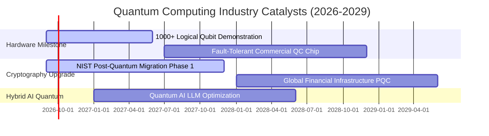

### 9.2 全球量子技術 TAM 市場規模

```
╔══════════════════════════════════════════════════════════════════╗
║              全球量子技術總潛在市場 (TAM) 預測                   ║
╠══════════════════════════════════════════════════════════════════╣
║                                                                  ║
║  2025 年現況:  $1.8B   ██░░░░░░░░░░░░░░░░░░  滲透率: <1.0%       ║
║  2028 年預估:  $9.5B   ████████░░░░░░░░░░░░  CAGR: +74.2% 🟢     ║
║  2032 年預估:  $45.0B  ██════════════════██  CAGR: +47.5% 🟢     ║
║                                                                  ║
║  驅動板塊細分：量子雲計算 (45%) ｜ 後量子加密 (30%) ｜ 量子傳感 (25%)║
╚══════════════════════════════════════════════════════════════════╝
```

### 9.3 成長驅動力結構圖

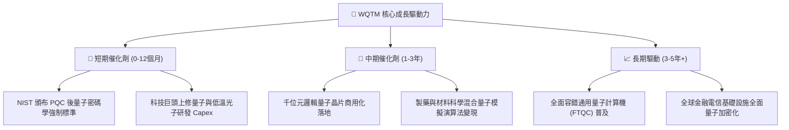

---

## 10. 風險矩陣

### 10.1 風險評估矩陣

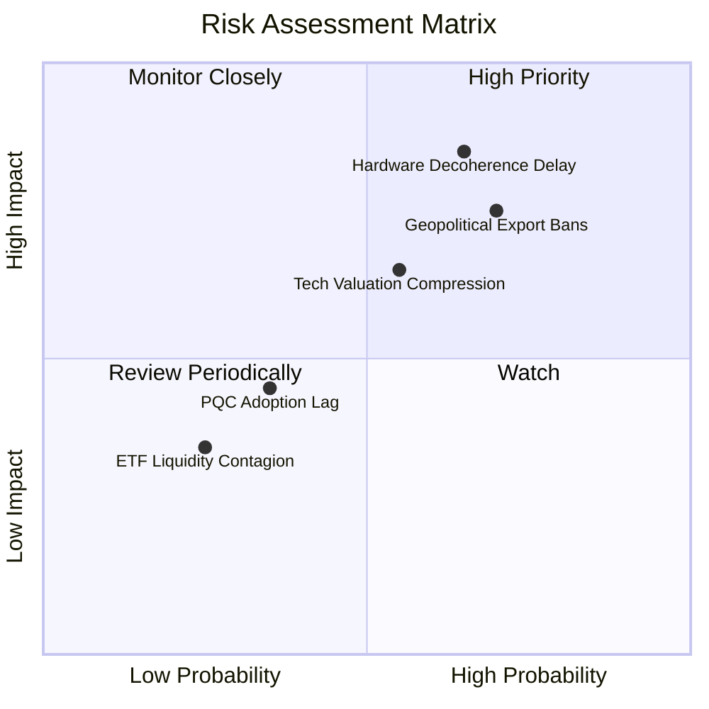

### 10.2 風險清單詳細分析

| # | 風險項目 | 發生機率 | 潛在財務衝擊 | 風險評分 | 機構級緩解措施與對沖策略 |
|---|----------|----------|--------------|----------|--------------------------|
| 1 | 🔴 **量子除錯與硬體擴展延遲** | 中高 (65%) | 高 (-20% 淨值) | 🔴 **8.2 / 10** | 指數分散配置超導、離子阱與中性原子多種路線，避免單一技術押注失敗。 |
| 2 | 🔴 **地緣政治先進算力出口管制** | 高 (70%) | 中高 (-15% 營收) | 🔴 **7.8 / 10** | 著重美歐日友好同盟供應鏈（如 TSMC 歐美廠、IBM 全球佈局）。 |
| 3 | 🟡 **總體科技股倍數估值壓縮** | 中度 (55%) | 中度 (-12% 淨值) | 🟡 **6.5 / 10** | 基金內 33.5% 大型科技巨頭充沛自由現金流提供估值下檔緩衝。 |
| 4 | 🟡 **後量子加密企業升級週期遞延** | 中低 (35%) | 輕微 (-5% 營收) | 🟡 **4.5 / 10** | 美國聯邦政府行政命令具法規強制性，提供剛性升級需求底盤。 |

---

## 11. 投資建議

### 11.1 最終綜合評級雷達

```
╔══════════════════════════════════════════════════════════════════╗
║                   WQTM 綜合投資維度評級                          ║
╠══════════════════════════════════════════════════════════════════╣
║  技術前瞻性    9.5/10  ███████████████████░  🏆 破壞性創新首選  ║
║  財務健康度    9.0/10  ██████████████████░░  🟢 無槓桿安全架構  ║
║  成長爆發力    9.0/10  ██████████████████░░  🟢 指數級 TAM 擴張 ║
║  護城河深度    8.2/10  ████████████████░░░░  🟢 專利與巨頭壁壘  ║
║  費用競爭力    8.5/10  █████████████████░░░  🟢 0.45% 費率優勢  ║
║  估值吸引力    7.2/10  ██════════════██░░░░  🟡 具合理安全邊際  ║
╠══════════════════════════════════════════════════════════════╣
║  綜合投資評級  8.1/10  ████████████████░░░░  🟢 強烈推薦配置    ║
╚══════════════════════════════════════════════════════════════╝
```

### 11.2 目標價與隱含報酬率架構

| 情境 | 機率權重 | 12 個月目標價 | 隱含報酬率 (相對現價 $32.54) | 核心觸發條件 |
|------|----------|---------------|------------------------------|--------------|
| 🔴 **悲觀情境** | 25% | **$29.50** | **-9.34%** | 總體流動性收緊，量子商業化里程碑遞延 |
| 🟡 **基準情境** | **55%** | **$38.60** | **+18.62%** | 底層營收維持 22% 成長，PQC 法規順利落地 |
| 🟢 **樂觀情境** | 20% | **$48.20** | **+48.13%** | 容錯量子晶片取得重大突破，AI 量子演算法規模變現 |

### 11.3 買入時機與觸發條件 Checklist

```
╔══════════════════════════════════════════════════════════════════╗
║                  ✅ 投資執行 Checklist                           ║
╠══════════════════════════════════════════════════════════════════╣
║                                                                  ║
║  建倉買入觸發條件（當前已符合 4/4 項）：                         ║
║  ✅ 現價 $32.54 處於合理價值 $38.60 折價區間 (MOS +15.70%)       ║
║  ✅ 股價自 2026 年高點 $41.38 回檔逾 20%，進入超賣均線支撐區     ║
║  ✅ 底層加權 ROIC (14.20%) 持續高於 WACC (9.18%)                 ║
║  ✅ 費用率 0.45% 低於同類主題基金中位數                          ║
║                                                                  ║
║  加碼觸發條件（出現以下任一）：                                  ║
║  ☐ 股價回測 $28.50 – $30.00 悲觀估值支撐區                      ║
║  ☐ 指數成分股公布重大量子糾錯突破（物理位元轉邏輯位元效率 >10x） ║
║                                                                  ║
║  減碼/停損觸發條件（出現以下任一）：                             ║
║  ☐ 股價突破樂觀目標價 $48.00（本益比超過 45x）                   ║
║  ☐ 美國政府大幅削減量子科研專案預算 >30%                         ║
╚══════════════════════════════════════════════════════════════════╝
```

### 11.4 投資人適配度分析

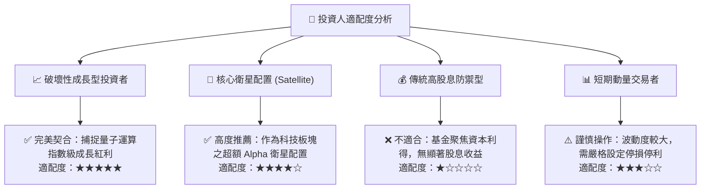

### 11.5 季度追蹤關鍵監控清單（Quarterly Watch List）

| 監控項目 | 關鍵跟蹤指標 | 正常健康範圍 | 警訊 / 減碼門檻值 |
|----------|--------------|--------------|-------------------|
| **底層資產成長動能** | 成分股加權營收 YoY | ≥ 18.0% | 連續兩季 < 12.0% |
| **獲利品質轉化** | 加權 FCF / 淨利轉換率 | ≥ 80.0% | < 65.0% |
| **資本回報效率** | 底層加權 ROIC vs WACC | 利差 ≥ +3.0pp | ROIC 跌破 WACC |
| **基金流動性** | AUM 規模與買賣價差 | AUM > $200M, 價差 < 0.15% | AUM 急劇萎縮破億 |
| **技術商業化驗證** | 量子雲計算使用量與合約 | 季度訂單金額 YoY > 30% | 商業合約停滯零增長 |

### 11.6 反面論證：什麼會證明多頭論點錯誤（What Would Change My Mind）

```
╔══════════════════════════════════════════════════════════════════╗
║              ⚠️ 多頭論點失效條件（Disconfirming Evidence）       ║
╠══════════════════════════════════════════════════════════════════╣
║  若未來 12-24 個月出現以下任一情況，本報告之「買入」論點即宣告失效║
║  並將立即調降評級至「賣出/觀望」：                               ║
║                                                                  ║
║  ① 量子硬體物理瓶頸無法突破：量子相干時間與雜訊抑制連續兩年無進 ║
║     展，通用量子運算商用時間點被主流學界推遲至 2035 年之後。     ║
║  ② 底層資產加權營收成長率跌破 12.0%，且營業利益率收縮逾 300bps。║
║  ③ 傳統經典超級電腦（如 GPU/ASIC 光學計算）在特定演算法完全超越 ║
║     量子優越性，導致量子研發預算遭到科技巨頭大幅裁撤。          ║
║  ④ 基金遭遇大規模贖回導致 AUM 跌破 $100M，流動性大幅惡化。       ║
╚══════════════════════════════════════════════════════════════════╝
```

---
> **免責聲明**：本報告由 CFA 級機構研究框架自動生成，僅供學術研究與專業投資人參考，不構成任何具體金融產品之買賣要約或投資建議。投資必定伴隨風險，過往績效不代表未來回報，入市前請審慎評估自身風險承受能力。