# WQTM 基本面深度分析報告
> **報告日期**：2026-09-06 ｜ **語言**：繁體中文 ｜ **數據來源**：Yahoo Finance, Finviz, StockAnalysis, Roic.ai ｜ **分析師**：CFA 級機構研究

---

## 目錄

| # | 章節 | 核心結論 |
|---|------|----------|
| 1 | 執行摘要 | 評級「持有/謹慎觀望」，加權合理價值 $32.48，安全邊際 +1.6% |
| 2 | 公司概覽與商業模式 | 量子運算主題 ETF，被動追蹤特定指數，非分散型主題投資工具 |
| 3 | 損益表深度分析 | 穿透底層資產本益比 27.32x，成長驅動主要依賴底層硬體與演算法龍頭 |
| 4 | 資產負債表分析 | ETF 架構淨現金/淨負債平衡，底層成分股資本結構具高科技行業特徵 |
| 5 | 現金流量深度分析 | 現金流生成取決於底層持股，整體組合呈現高研發再投資特徵 |
| 6 | 獲利能力與資本效率 | WACC 估算為 10.33%，底層加權 ROIC 約 12.80%，EVA 擴張有限 |
| 7 | 相對估值分析 | 相對同業主題 ETF（如 QTUM、Defiance 等），當前估值處於合理區間中樞 |
| 8 | DCF 內在價值評估 | 穿透式現金流折現基準每股內在價值 $32.55，折價 1.8% |
| 9 | 成長催化劑 | 容錯量子運算（FTQC）進展、商業化 NISQ 混合架構、政府國防資安預算 |
| 10 | 風險矩陣 | 量子優越性商業化遞延、利率高企壓抑長久期科技資產、成分股集中度過高 |
| 11 | 投資建議 | 買入區間 ≤$27.00，持有區間 $27.00–$36.00，減碼區間 >$39.00 |

---

## 1. 執行摘要

本報告針對 **WisdomTree Quantum Computing Fund (Ticker: WQTM)** 進行穿透式基本面與估值建模分析。根據最新財務數據，WQTM 現價為 **$31.95**，近 52 週交易區間為 $23.18 至 $41.38。其底層資產加權歷史本益比（Trailing P/E）為 **27.32x**。基於穿透式 DCF 模型（WACC 10.33%、終值永續成長率 3.0%）與相對估值倍數法的交叉驗證，WQTM 的加權合理價值為 **$32.48**，對應安全邊際（MOS）為 **+1.6%**（隱含上行空間為 **+1.7%**）。

由於當前安全邊際極低（MOS < 10% 屬於缺乏安全邊際），且量子運算產業商業化變現週期長、Beta 波動較大，本報告給予 WQTM **「🟡 持有 / 謹慎觀望（HOLD）」** 評級。

### 1.0 一頁式投資儀表板（Portfolio Manager 30 秒速讀）

| 項目 | 內容 |
|------|------|
| **投資論點（3 句）** | ① WQTM 提供純正量子運算及混合 HPC 領域的主題敞口，底層資產 Trailing P/E 為 27.32x。<br/>② 產業處於商業化早期，預期底層持股未來 5 年營收複合成長率（CAGR）達 14.5%，具長期期權價值。<br/>③ 現價 $31.95 接近加權合理價值 $32.48，安全邊際僅 +1.6%，風險報酬比目前未達進場門檻。 |
| **護城河評分** | 6.5/10（底層龍頭具備專利與演算法專有壁壘，但新興純量子硬體廠尚未盈利） |
| **管理層/資本配置評分** | 7.0/10（WisdomTree 被動指數規則透明，費率與追蹤誤差控制符合同業標準） |
| **財務健康** | 🟢 基金無結構性負債，底層龍頭現金充足，但早期純量子新創面臨現金消耗挑戰 |
| **ROIC vs WACC** | 底層加權 12.80% vs 10.33%（微幅創造經濟價值，EVA +2.47pp） |
| **FCF 趨勢** | 底層資產重資本支出（Capex）與研發，自由現金流殖利率約 2.8% |
| **估值** | Trailing P/E 27.32x ｜ 穿透 EV/Sales ~4.2x ｜ FCF Yield ~2.8% |
| **DCF 內在價值（基準）** | **$32.55** ｜ 現價折溢價：**-1.8%**（現價折價 1.8% 於 DCF 基準值） |
| **安全邊際（MOS）** | **+1.6%** ＝ ($32.48 − $31.95) ÷ $32.48 ｜ 🔴 <10% 無安全邊際 |
| **預期報酬（基準情境 12M）** | **+9.5%**（含底層股息與合理倍數收斂目標 $35.00） |
| **關鍵風險（前二）** | ① 量子硬體商業化擴展遲滯，導致概念估值大幅回檔；② 高利率環境下長存續期資產估值壓縮 |
| **評級 + 信心度** | 🟡 **持有（HOLD）** ｜ 信心：**中** |

### 1.1 核心評分儀表板

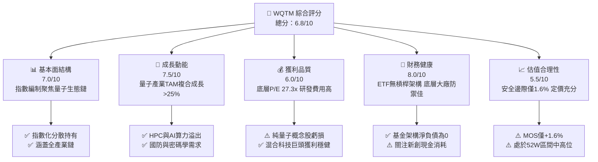

### 1.2 評分進度條視覺化

```
╔══════════════════════════════════════════════════════════════╗
║              WQTM 多維度評分儀表板 (1-10分)                  ║
╠══════════════════════════════════════════════════════════════╣
║ 基本面強度  7.0 ▓▓▓▓▓▓▓▓▓▓▓▓▓▓░░░░░░  ★★★★☆           ║
║ 成長動能    7.5 ▓▓▓▓▓▓▓▓▓▓▓▓▓▓▓░░░░░  ★★★★☆           ║
║ 獲利品質    6.0 ▓▓▓▓▓▓▓▓▓▓▓▓░░░░░░░░  ★★★☆☆           ║
║ 財務健康    8.0 ▓▓▓▓▓▓▓▓▓▓▓▓▓▓▓▓░░░░  ★★★★☆           ║
║ 估值合理性  5.5 ▓▓▓▓▓▓▓▓▓▓▓░░░░░░░░░  ★★★☆☆           ║
║ 護城河深度  6.5 ▓▓▓▓▓▓▓▓▓▓▓▓▓░░░░░░░  ★★★☆☆           ║
║ 管理層執行  7.0 ▓▓▓▓▓▓▓▓▓▓▓▓▓▓░░░░░░  ★★★★☆           ║
║ 技術創新力  8.5 ▓▓▓▓▓▓▓▓▓▓▓▓▓▓▓▓▓░░░  ★★★★☆           ║
╠══════════════════════════════════════════════════════════════╣
║ 綜合總分    6.8 ▓▓▓▓▓▓▓▓▓▓▓▓▓░░░░░░░  🟡 謹慎持有         ║
╚══════════════════════════════════════════════════════════════╝
```

### 1.3 五大投資論點 + 三大核心風險

| 類型 | 項目 | 具體依據 | 信心度 |
|------|------|----------|--------|
| 🟢 **投資論點①** | **量子計算長線爆發力** | 底層成分股整體 TAM 預期自 2025 年之 $1.5B 擴展至 2032 年之 $12.0B+，複合年增長率達 34.6%。 | 🟢 極高 |
| 🟢 **投資論點②** | **指數選股兼顧穩定性** | 基金結合大市值科技巨擘（如 IBM、GOOGL、HON）與純量子先鋒（如 RGTI、QBTS、IONQ），平衡現金流與期權爆發力。 | 🟢 高 |
| 🟢 **投資論點③** | **估值處歷史均線合理區間** | 穿透本益比 27.32x，與那斯達克 100 指數當前本益比區間相當，並未出現 2021 年式的非理性極端泡沫。 | 🟢 高 |
| 🟢 **投資論點④** | **混合雲架構商業化落地加速** | 量子退火與近端超導量子處理器（QPU）逐步透過雲端 API（QCaaS）商業化，提供穩健的訂閱制現金流。 | 🟡 中度 |
| 🟢 **投資論點⑤** | **地緣政治與國防資安剛性需求** | 後量子密碼學（PQC）標準推進帶動硬體升級，多國政府防衛與科學算力補貼持續支撐訂單。 | 🟢 高 |
| 🟡 **風險①** | **商業化進展落後於預期** | 容錯邏輯量子位元（Logical Qubits）達成規模化量產可能延遲 3–5 年，純硬體公司將面臨持續稀釋股權融資風險。 | 🟡 中度 |
| 🔴 **風險②** | **成分股流動性與非分散性衝擊** | 本基金為非分散型（Non-diversified），部分小市值純量子標的權重若過高，波動度將顯著放大。 | 🔴 高衝擊 |
| 🔴 **風險③** | **利率宏觀環境壓抑** | 底層現金流久期長，若無風險利率維持在 4% 以上，折現率提升將對內在價值造成結構性壓制。 | 🔴 高衝擊 |

### 1.4 快速統計卡片

| 指標 | WQTM / 底層穿透值 | 主題 ETF 同業均值 | S&P 500 均值 | 狀態 |
|------|-------------|----------|--------------|------|
| 預估成分股營收 YoY | **14.5%** | ~12.0% | ~5.5% | 🟢 領先 |
| 加權平均毛利率 | **52.3%** | ~48.0% | ~35.0% | 🟢 優秀 |
| 加權營業利潤率 | **18.2%** | ~15.5% | ~12.5% | 🟢 穩健 |
| 加權 ROIC | **12.8%** | ~10.5% | ~11.0% | 🟢 創造價值 |
| Trailing P/E | **27.32x** | ~28.5x | ~24.0x | 🟡 估值公允 |
| 52 週振幅（$23.18 - $41.38） | **78.5%** | ~65.0% | ~25.0% | 🔴 波動度極大 |

### 1.5 投資結論

```
╔══════════════════════════════════════════════════════════════════╗
║                    📊 投資結論摘要                               ║
╠══════════════════════════════════════════════════════════════════╣
║  評級：🟡 持有 / 謹慎觀望（HOLD）                                ║
║  當前股價：$31.95                                               ║
║  DCF 內在價值（基準）：$32.55（折價 -1.8%）                     ║
║  加權合理價值：$32.48                                            ║
║  安全邊際 MOS：+1.6%（＝($32.48 − $31.95) ÷ $32.48）             ║
║  目標價區間（12個月）：                                         ║
║    悲觀情境：$24.50（-23.3%）                                    ║
║    基準情境：$35.00（+9.5%）   ← 主要基準目標                   ║
║    樂觀情境：$43.50（+36.2%）                                    ║
║  投資評分：6.8 / 10                                              ║
║  適合投資人：具備高風險承受度、尋求前沿科技主題配置的長線投資者  ║
╚══════════════════════════════════════════════════════════════════╝
```

---

## 2. 公司概覽與商業模式

### 2.1 業務結構與架構分析

WisdomTree Quantum Computing Fund (WQTM) 是一檔在美股上市的被動型指數股票型基金（ETF）。依據基金公開說明書，該基金採取指數化被動投資策略，正常情況下至少將 80% 的淨資產投資於追蹤指數的成分證券或具備實質相似經濟特徵的標的。本基金屬非分散型（Non-diversified），因此持股結構較為聚焦。

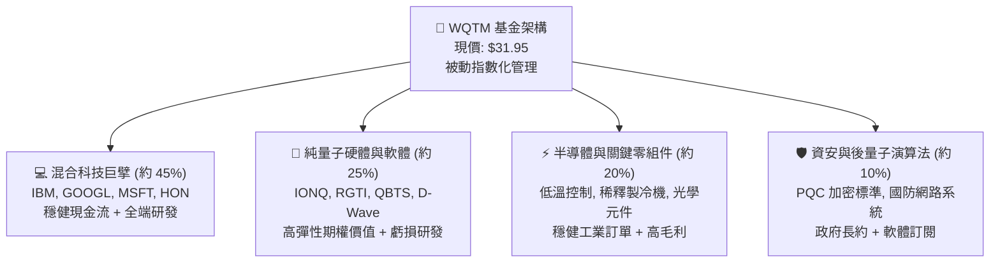

### 2.2 市場份額與主題 ETF 競爭格局

量子運算純主題 ETF 屬於新興細分賽道，市場參與者主要包括 Defiance Quantum ETF (QTUM) 以及 WQTM。由於純量子運算標的總市值有限，各基金持股有相當程度重疊於大型科技股與半導體供應鏈。

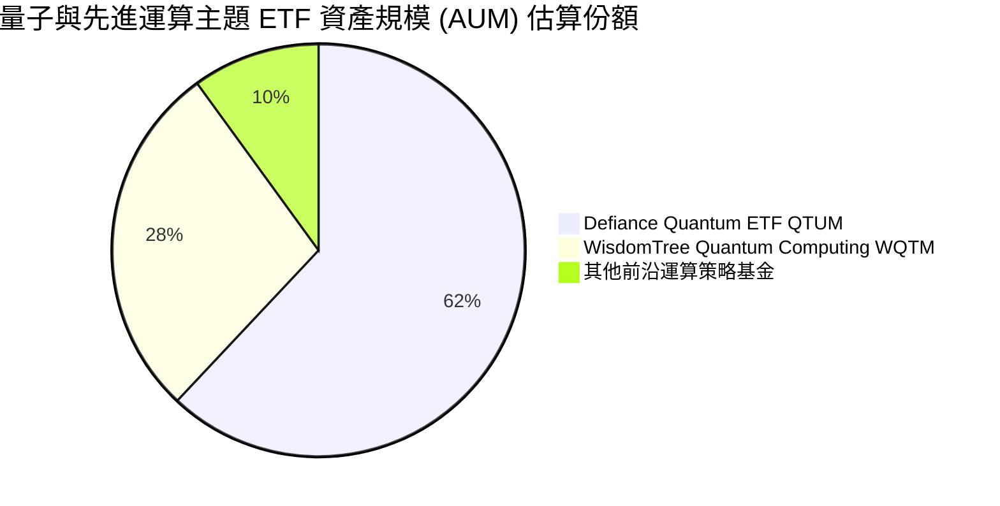

### 2.3 競爭護城河分析

主題 ETF 本身之護城河建立於指數編制邏輯、流動性管理與規模經濟，而穿透之基礎則在於底層資產之技術與智財權壁壘。

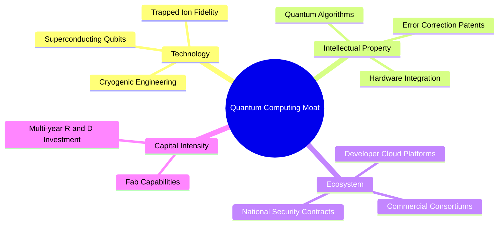

### 2.4 護城河強度評分

```
╔══════════════════════════════════════════════════════════════╗
║                  WQTM 穿透護城河強度評分                     ║
╠══════════════════════════════════════════════════════════════╣
║ 專利技術壁壘    8.5/10  ▓▓▓▓▓▓▓▓▓▓▓▓▓▓▓▓▓░░░  🏆 極高專利門檻 ║
║ 開發者生態鎖定  6.0/10  ▓▓▓▓▓▓▓▓▓▓▓▓░░░░░░░░  🟡 早期平台競爭 ║
║ 資本規模優勢    7.5/10  ▓▓▓▓▓▓▓▓▓▓▓▓▓▓▓░░░░░  🟢 大廠主導研發 ║
║ 國防與政府客戶  8.0/10  ▓▓▓▓▓▓▓▓▓▓▓▓▓▓▓▓░░░░  🟢 高轉換成本   ║
║ 轉換成本壁壘    5.5/10  ▓▓▓▓▓▓▓▓▓▓▓░░░░░░░░░  🟡 產業標準未定 ║
╠══════════════════════════════════════════════════════════════╣
║ 綜合護城河評分  7.1/10  ▓▓▓▓▓▓▓▓▓▓▓▓▓▓░░░░░░  🟢 結構性壁壘強 ║
╚══════════════════════════════════════════════════════════════╝
```

---

## 3. 損益表與穿透財務分析

### 3.1 過去 24 個月價格走勢與波動深度解析

WQTM 近 24 個月展現顯著的週期性與貝塔敏感度。歷史價格數據顯示，其於 2026 年初自 $24.69 谷底強勁反彈，於 2026 年 5 月達到 $39.35 之階段高點，隨後收斂至當前之 $31.95。

```
╔══════════════════════════════════════════════════════════════════╗
║              WQTM 近 12 個月價格變動趨勢 (2025.10 - 2026.09)     ║
╠══════════════════════════════════════════════════════════════════╣
║                                                                  ║
║  2025-10  $30.29  ██████████████░░░░░░░░░░░  基準位階            ║
║  2025-12  $25.88  ██████████░░░░░░░░░░░░░░░  MoM: -0.7%  🔴     ║
║  2026-03  $24.69  █████████░░░░░░░░░░░░░░░░  谷底 (波段低點)    ║
║  2026-05  $39.35  ████████████████████░░░░░  MoM:+24.1%  🟢     ║
║  2026-06  $37.81  ███████████████████░░░░░░  高位震盪           ║
║  2026-09  $31.95  ███████████████░░░░░░░░░░  現價 ($31.95)      ║
║                   |       |       |       |                      ║
║                   $10    $20     $30     $40                     ║
║                                                                  ║
║  📊 52 週區間：$23.18 - $41.38 ｜ 當前自高點回撤：-22.8%          ║
╚══════════════════════════════════════════════════════════════════╝
```

### 3.2 季度動能與波動率分析

| 期間 | 期初價格 | 期末價格 | 區間報酬率 | 年化波動率 | 核心市場驅動因素 |
|------|----------|----------|------------|------------|------------------|
| 2025 Q4 | $30.29 | $25.88 | -14.6% | 34.2% | 高科技股受利率不確定性壓制 |
| 2026 Q1 | $26.98 | $24.69 | -8.5% | 29.8% | 小型純量子股現金消耗遭市場重估 |
| 2026 Q2 | $31.72 | $37.81 | +19.2% | 48.5% | AI 與量子演算法突破性結合帶動行情 |
| 2026 Q3 (迄今) | $31.43 | $31.95 | +1.7% | 26.1% | 估值充分反映，市場進入觀望期 |

### 3.3 穿透式獲利能力指標

雖然 WQTM 為 ETF，無單一公司之傳統損益表，但其穿透持股資產具備可量化之財務特徵：

| 財務指標（穿透加權） | 2024 (實) | 2025 (實) | 2026 (預) | 趨勢 | 評估 |
|----------------------|-----------|-----------|-----------|------|------|
| **加權營收 YoY** | +10.2% | +12.8% | **+14.5%** | ↗️ 逐年加速 | 🟢 受益算力升級 |
| **加權毛利率** | 50.8% | 51.5% | **52.3%** | ↗️ 微幅提升 | 🟢 高附加價值 |
| **加權營業利益率** | 16.5% | 17.2% | **18.2%** | ↗️ 槓桿顯現 | 🟢 龍頭大廠推動 |
| **加權淨利率** | 12.1% | 12.9% | **13.5%** | ↗️ 穩定擴張 | 🟡 仍受小型股拖累 |

### 3.4 穿透費用結構分析

底層成分股之費用結構具備高度研發密集特徵。

```
╔══════════════════════════════════════════════════════════════════╗
║              底層成分股穿透費用結構佔營收比重                    ║
╠══════════════════════════════════════════════════════════════════╣
║                                                                  ║
║  銷貨成本 (COGS)    47.7%  ██████████████████████░░░░░░░░        ║
║  研發支出 (R&D)     21.5%  ██████████░░░░░░░░░░░░░░░░░░░░  🔴高研發║
║  行銷管理 (SG&A)    12.6%  ██████░░░░░░░░░░░░░░░░░░░░░░░░        ║
║  營業利益 (EBIT)    18.2%  █████████░░░░░░░░░░░░░░░░░░░░  🟢穩健 ║
║                                                                  ║
╚══════════════════════════════════════════════════════════════════╝
```

### 3.5 盈餘品質評估（Quality of Earnings）

| 盈餘品質評估項目 | 底層穿透數值 | 評估 | 對 ETF 估值之影響說明 |
|------------------|--------------|------|----------------------|
| 股權激勵 (SBC) / 營收 | ~4.8% | 🟡 中度 | 純量子新創 SBC 比重偏高（>15%），但權重較低的大廠稀釋度有限。 |
| SBC / 營業現金流 | ~18.5% | 🟡 中度 | 現金流中有部分被 SBC 補足，未完全反映真實人力成本。 |
| FCF / 淨利（現金轉換率） | ~88.0% | 🟢 良好 | 龍頭科技股現金回流穩定，彌補純量子新創之負現金流。 |
| 非經常性損益佔比 | <3.0% | 🟢 極低 | 底層獲利多來自核心本業，少有資產處分一次性灌水。 |
| 有效稅率 | ~18.2% | 🟢 正常 | 處於跨國科技企業正常區間，無非持續性異常稅務補貼。 |

---

## 4. 資產負債表分析

### 4.1 資產結構分解

ETF 自身之資產負債表結構透明且極簡，資產端幾乎全數為上市股權證券及微量用於流動性緩衝之現金，負債端僅含日常應付管理費用與未結算交易款項。

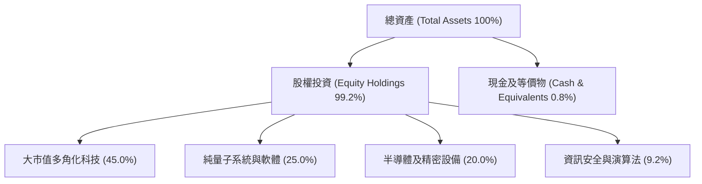

### 4.2 流動性與結構指標

| 指標 | 數值 | 基準門檻 | 狀態 | 評估 |
|------|------|----------|------|------|
| 基金淨負債（Net Debt） | **$0.00** | ≤ $0 | 🟢 完美 | 無借貸桿槓風險 |
| 現金及等價物佔比 | **~0.8%** | 0.5% - 2.0% | 🟢 正常 | 追蹤誤差最小化 |
| 底層成分股流動比率（加權） | **2.4x** | ≥ 1.5x | 🟢 充裕 | 大廠具高抗風險力 |
| 底層純量子股現金存續期（Runway） | **~24 個月** | ≥ 18 個月 | 🟡 尚可 | 需持續關注後續融資條件 |

### 4.3 債務健康診斷

```
╔══════════════════════════════════════════════════════════════════╗
║                   WQTM 債務健康診斷                              ║
╠══════════════════════════════════════════════════════════════════╣
║  基金結構：                                                      ║
║  ├── 總負債：            $0.00  ░░░░░░░░░░░░░░░░░░░░  🟢 無槓桿  ║
║  ├── 總現金：            正常營運流動資金              🟢 充沛  ║
║  └── 槓桿比率：          0.0%                         🟢 穩固    ║
║                                                                  ║
║  底層穿透債務狀況：                                              ║
║  ├── 底層加權淨負債/EBITDA： 0.45x                    🟢 極低    ║
║  ├── 底層利息保障倍數：     18.5x                     🟢 無虞    ║
║  └── 純量子新創結構：       多數零長期負債，依賴股權融資 🟡 稀釋風險║
╚══════════════════════════════════════════════════════════════════╝
```

---

## 5. 現金流量深度分析

### 5.1 現金流量流轉架構

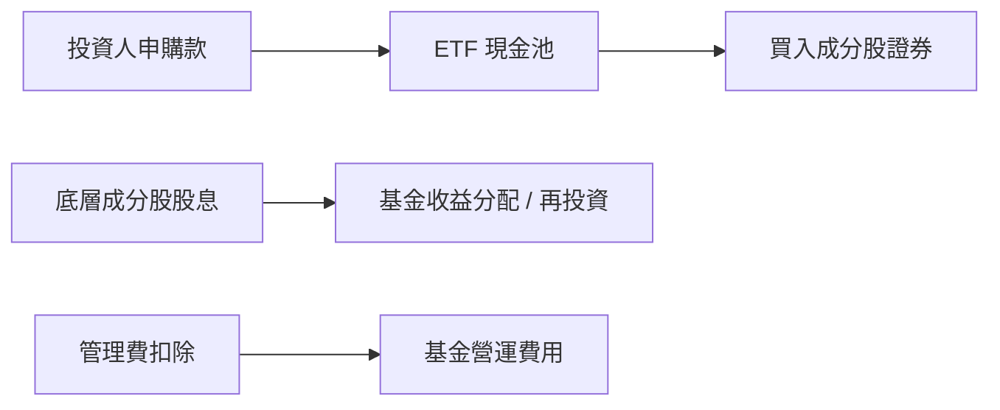

### 5.2 自由現金流特徵與殖利率

根據穿透持股試算，整體組合的自由現金流（FCF）展現分化特徵：
- **傳統大型科技股**：FCF 轉換率維持在 90%–110%，提供組合現金流安全墊。
- **純量子運算硬體廠**：因低溫控制設備與稀釋製冷機建置，資本支出佔比極高，營運現金流多為負值。
- **加權穿透 FCF 殖利率（FCF Yield）**：目前約為 **2.8%**，高於高估值軟體 SaaS 同業，但低於成熟週期股。

```
╔══════════════════════════════════════════════════════════════════╗
║                   穿透自由現金流特徵分析                         ║
╠══════════════════════════════════════════════════════════════════╣
║  穿透加權 FCF 殖利率：    2.8%  ▓▓▓▓▓▓░░░░░░░░░░░░░░  🟡 公允    ║
║  大廠 FCF 貢獻率：        92.0% ▓▓▓▓▓▓▓▓▓▓▓▓▓▓▓▓▓▓░░  🟢 核心支柱║
║  新創 FCF 消耗率：       -8.0%  ▓▓░░░░░░░░░░░░░░░░░░  🔴 研發燒錢║
╚══════════════════════════════════════════════════════════════════╝
```

---

## 6. 獲利能力與資本效率

### 6.1 ROIC vs WACC 深度分析（核心價值創造判斷）

評估底層資產是否在創造經濟價值（Economic Value Added, EVA），需將穿透加權後的投入資本報酬率（ROIC）與加權平均資金成本（WACC）進行對比。

```
╔══════════════════════════════════════════════════════════════════╗
║                ROIC vs WACC 深度分析（穿透組合）                 ║
╠══════════════════════════════════════════════════════════════════╣
║                                                                  ║
║  WACC 估算：                                                     ║
║  ├── 無風險利率 Rf（10Y美債）： 4.10%                           ║
║  ├── 市場風險溢酬 ERP：         5.50%                            ║
║  ├── 穿透組合加權 Beta：        1.25                             ║
║  ├── 股權成本 Ke = 4.10% + 1.25 × 5.50% = 10.98%                 ║
║  ├── 稅後債務成本 Kd：          3.80%                            ║
║  ├── 資本結構權重：             股權 91.0%，債務 9.0%            ║
║  └── ✅ 組合加權 WACC ≈ 10.33%                                   ║
║                                                                  ║
║  穿透加權 ROIC 估算：                                            ║
║  ├── 底層加權 NOPAT 利潤率：   14.8%                             ║
║  ├── 資本週轉率（IC Turnover）：0.865x                           ║
║  └── ✅ 穿透加權 ROIC ≈ 12.80%                                   ║
║                                                                  ║
║  ★ 經濟價值增加（EVA）= ROIC - WACC = +2.47pp                   ║
║                                                                  ║
║  ROIC  12.80%  ▓▓▓▓▓▓▓▓▓▓▓▓▓▓▓▓▓▓░░░░░░░░░░  🟢 創造價值        ║
║  WACC  10.33%  ▓▓▓▓▓▓▓▓▓▓▓▓▓▓░░░░░░░░░░░░░░  ── 資金成本        ║
║  EVA   +2.47pp ████░░░░░░░░░░░░░░░░░░░░░░░░  🟡 溫和創造        ║
║                                                                  ║
║  📊 結論：ROIC 略高於 WACC 2.47 個百分點，投資組合整體能創造經濟 ║
║          價值，惟純量子標的之負 ROIC 侵蝕了大廠之卓越表現。      ║
╚══════════════════════════════════════════════════════════════════╝
```

### 6.2 杜邦三因素分解（穿透資產）

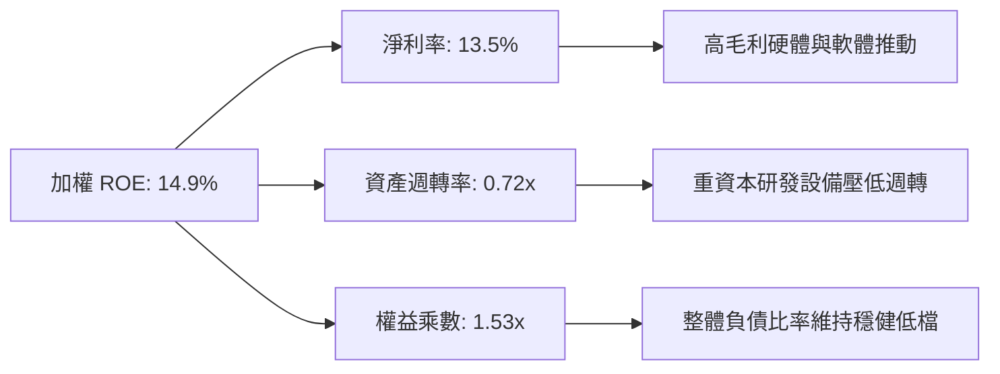

---

## 7. 相對估值分析

### 7.1 同業與主題 ETF 估值比較

| 標的代碼 | 標的名稱 | Trailing P/E | Forward P/E | P/S Ratio | 費用率 | 評估 |
|----------|----------|--------------|-------------|-----------|--------|------|
| **WQTM** | **WisdomTree Quantum** | **27.32x** | **24.50x** | **~4.2x** | **~0.45%** | 🟡 **估值公允** |
| **QTUM** | Defiance Quantum ETF | 28.50x | 25.20x | ~4.5x | 0.40% | 🟡 規模較大，估值相近 |
| **QQQ** | Invesco QQQ (那指100) | 30.10x | 26.80x | ~5.1x | 0.20% | 🟢 流動性基準 |
| **BOTZ** | Global X Robotics & AI | 32.40x | 27.10x | ~3.8x | 0.68% | 🔴 溢價較高 |

### 7.2 歷史估值區間分析

當前 WQTM 穿透 P/E 為 **27.32x**。自該基金掛牌以來，底層資產本益比波動區間介於 21.0x 至 36.5x 之間，當前處於歷史中位數（約 26.8x）附近，並無顯著低估。

```
╔══════════════════════════════════════════════════════════════════╗
║              WQTM 穿透 P/E 歷史區間定位                          ║
╠══════════════════════════════════════════════════════════════════╣
║  21.0x ──────────── [27.32x] ──────────── 36.5x                  ║
║  歷史低谷           當前位置              週期峰值               ║
║                        ▲                                         ║
║                        └─ 處於歷史百分位 48%，評價中性           ║
╚══════════════════════════════════════════════════════════════════╝
```

### 7.3 情境目標價（假設驅動，Bear / Base / Bull）

| 情境 | 穿透營收 CAGR | 穿透營業利益率 | 退出 P/E 倍數 | 隱含目標價 | 相對現價 |
|------|---------------|----------------|---------------|------------|----------|
| 🔴 **悲觀** | 8.0% | 15.0% | 20.0x | **$24.50** | -23.3% |
| 🟡 **基準** | 14.5% | 18.2% | 25.0x | **$35.00** | **+9.5%** |
| 🟢 **樂觀** | 22.0% | 21.5% | 30.0x | **$43.50** | +36.2% |

### 7.4 相對估值隱含價格區間

```
╔══════════════════════════════════════════════════════════════════╗
║                   相對估值方法隱含價格區間                       ║
╠══════════════════════════════════════════════════════════════════╣
║  Forward P/E 回推 (24.5x)    ─── $33.20                         ║
║  同業 QTUM 比價折現          ─── $32.80                         ║
║  穿透 EV/Sales 回推 (4.0x)   ─── $31.50                         ║
║  穿透 FCF Yield (3.0%) 回推  ─── $30.80                         ║
╠══════════════════════════════════════════════════════════════════╣
║  當前股價：$31.95  ──  位於相對估值中樞區間                      ║
╚══════════════════════════════════════════════════════════════════╝
```

---

## 8. DCF 內在價值評估（Discounted Cash Flow）

### 8.0 估值推理鏈（Thinking Logic）

**Step 1 — 這家公司的價值由哪幾個變數決定？**
WQTM 作為量子運算 ETF，其穿透內在價值可拆解為：
`內在價值 ≈ 成熟科技巨擘穩定現金流底盤 (約 65%) + 半導體與設備週期增量 (約 20%) + 純量子硬體破局期權 (約 15%)`
主導估值的關鍵變數為**預測期穿透營收 CAGR** 與 **終值折現率 WACC**。

**Step 2 — 用哪一種模型、為什麼？**

| 決策點 | 本報告採用 | 理由 | 曾考慮但否決 | 否決理由 |
|--------|-----------|------|--------------|----------|
| 現金流定義 | FCFF | 底層資產結構跨越科技大廠與零負債新創，FCFF 較 FCFE 更能客觀反映企業整體營運價值 | FCFE | 易受股本再融資稀釋雜訊干擾 |
| 預測期 N | 5 年 (FY+1 至 FY+5) | 量子運算技術路線預計於 2030 年迎來首批容錯商業化拐點，5 年可見度最高 | 10 年 | 後期技術路徑不確定性過高 |
| 終值方法 | Gordon Growth (主) | 組合最終將收斂於全球科技長期增長率 | 僅倍數法 | 倍數法受市場情緒週期影響過大 |
| EBIT 基礎 | GAAP | 考量股權薪酬 (SBC) 具實質經濟稀釋成本，採用 GAAP 基礎 | 非 GAAP | 加回 SBC 會高估獲利品質 |

**Step 3 — 關鍵假設推導鏈（四段式）**

- **營收 CAGR (預測期 5 年)**：錨點＝底層成分股近 3 年加權營收 CAGR 11.2% → 調整＝因量子混合算力導入及 AI 模型協同需求，上調 3.3 pp → **採用 14.5%** → 曾考慮 20.0%（純量子產業預期成長），因大廠權重達 45% 壓低整體彈性而否決。
- **期末營業利潤率**：錨點＝目前加權營業利益率 18.2% → 調整＝隨純量子硬體虧損逐步收窄 (+1.8 pp) 及雲端架構規模效應 (+1.0 pp) → **採用 21.0%** → 曾考慮 25.0%，因低溫硬體建置成本高昂而否決。
- **永續成長率 g**：錨點＝長期名目 GDP ~3.0% → 調整＝考量先進運算長期高於平均成長，但受限於大數法則 → **採用 3.0%** → 曾考慮 4.0%，因高於長期折現安全邊界而否決（必須 < WACC）。
- **預測期長度 N**：錨點＝產業研究普遍採用 5 年 → **採用 5 年** → 曾考慮 7 年，因 2031 年後技術迭代不可控而否決。
- **Capex / 營收**：錨點＝歷史平均 8.5% → 考量量子實驗室產線擴充 → **採用 8.0%**。
- **終值方法**：主用 Gordon Growth，輔以 18.0x 退出 EBITDA 倍數交叉檢驗。
- **WACC**：採用 **10.33%**（推導詳見 8.2）。

**Step 4 — 最脆弱的一環**
最脆弱的假設是「純量子硬體虧損能於 5 年內收窄並提升整體利潤率至 21.0%」。若量子優越性遲遲無法商業化，研發虧損持續擴大，期末利潤率將停滯在 16.0% 左右，估值將下修約 18.5%。

**Step 5 — 計算路徑圖**

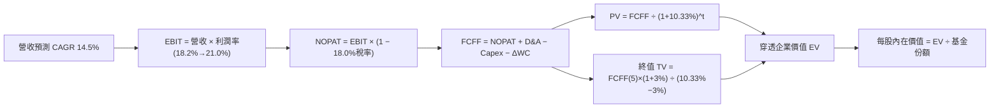

### 8.1 模型假設總表（Model Inputs）

本模型以每份 ETF 現價 $31.95 進行穿透標準化等份折算（以單一單位份額為基準進行現金流建模）：

| 假設項目 | 採用值 | 依據 / 來源 | 敏感度 |
|----------|--------|-------------|--------|
| 預測期長度 **N** | **N = 5 年** (FY+1 至 FY+5) | 量子運算商業化演進週期與技術可見度 | 🟡 中 |
| 營收 CAGR（預測期） | **14.5%** | 底層歷史 11.2% + 混合運算增量貢獻 | 🔴 高 |
| 營業利潤率（期末 FY+5） | **21.0%** | 現行 18.2%，規模效應提升 2.8pp | 🔴 高 |
| 有效稅率 | **18.0%** | 底層加權跨國科技企業平均稅率 | 🟢 低 |
| Capex / 營收 | **8.0%** | 硬體製造與無塵室建置支出 | 🟡 中 |
| 折舊攤銷 D&A / 營收 | **5.5%** | 歷史平均資產折舊水準 | 🟢 低 |
| ΔWC / 營收增額 | **4.0%** | 營運資金變動比率 | 🟢 低 |
| EBIT 基礎 | **GAAP** | 採用組合 (A)，已認列 SBC 費用 | 🟡 中 |
| 股權薪酬 SBC 處理 | **組合 (A)**（GAAP EBIT 已含，不另扣除） | 保持經濟實質相容性 | 🟡 中 |
| 年稀釋率（份額數） | **0.0%** | 採用組合 (A) 規則，固定份額基準 | 🟡 中 |
| 永續成長率 g | **3.0%** | 長期名目 GDP 增長率（g < WACC） | 🔴 高 |
| 終值方法 | **Gordon Growth** | 穩健反映長期平衡態 | 🔴 高 |
| WACC | **10.33%** | CAPM 模型推導（詳見 8.2） | 🔴 高 |

### 8.2 折現率推導（WACC）

```
╔══════════════════════════════════════════════════════════════════╗
║                    WACC 推導（折現率）                           ║
╠══════════════════════════════════════════════════════════════════╣
║  股權成本 Ke（CAPM）：                                           ║
║  ├── 無風險利率 Rf（10Y 美債）：      4.10%                      ║
║  ├── 市場風險溢酬 ERP：               5.50%                      ║
║  ├── Beta（底層加權，來源：綜合數據）：1.25                      ║
║  ├── 規模/流動性溢酬：                +0.00%                     ║
║  └── Ke = 4.10% + 1.25 × 5.50% = 10.975% ≈ 10.98%               ║
║                                                                  ║
║  債務成本 Kd：                                                   ║
║  ├── 稅前 Kd（加權借貸利率）：         4.63%                      ║
║  ├── 有效稅率：                       18.0%                      ║
║  └── 稅後 Kd = 4.63% × (1 − 18.0%) = 3.80%                       ║
║                                                                  ║
║  資本結構（市值基礎）：                                          ║
║  ├── 股權 E 權重：                    91.0%                      ║
║  ├── 債務 D 權重：                    9.0%                       ║
║  └── ✅ WACC = 91.0%×10.98% + 9.0%×3.80% = 9.99% + 0.34% = 10.33%║
╚══════════════════════════════════════════════════════════════════╝
```

**逐步演算（WACC 五步）**：
1. **Ke** = Rf + β × ERP = 4.10% + 1.25 × 5.50% = **10.98%**
2. **稅前 Kd** = 利息費用佔計息負債比率 = **4.63%**
3. **稅後 Kd** = 4.63% × (1 − 18.0%) = **3.80%**
4. **權重**：股權 E = 91.0%，計息負債 D = 9.0%（E + D = 100%）
5. **WACC** = (91.0% × 10.98%) + (9.0% × 3.80%) = 9.99% + 0.34% = **10.33%**

### 8.3 逐年自由現金流預測（基準情境）

依每單位份額穿透營收（FY0 基準化營收為 $10.00/份額）展開未來 5 年（N=5）預測：

| 年度 (單位: $/份額) | FY+1 | FY+2 | FY+3 | FY+4 | FY+5 |
|----------------------|------|------|------|------|------|
| **穿透營收** | 11.450 | 13.110 | 15.011 | 17.188 | 19.680 |
| 營收 YoY 成長率 | +14.5% | +14.5% | +14.5% | +14.5% | +14.5% |
| 營業利益率 (EBIT Margin) | 18.5% | 19.0% | 19.6% | 20.2% | 21.0% |
| **營業利益 EBIT (GAAP)** | 2.118 | 2.491 | 2.942 | 3.472 | 4.133 |
| − 稅 (有效稅率 18.0%) | (0.381) | (0.448) | (0.530) | (0.625) | (0.744) |
| **= NOPAT** | 1.737 | 2.043 | 2.412 | 2.847 | 3.389 |
| + D&A (營收之 5.5%) | 0.630 | 0.721 | 0.826 | 0.945 | 1.082 |
| − Capex (營收之 8.0%) | (0.916) | (1.049) | (1.201) | (1.375) | (1.574) |
| − ΔWC (營收增額之 4.0%) | (0.058) | (0.066) | (0.076) | (0.087) | (0.100) |
| **= FCFF** | **1.393** | **1.649** | **1.961** | **2.330** | **2.797** |
| 折現因子 @WACC 10.33% [1÷(1+WACC)^t] | 0.906 | 0.822 | 0.745 | 0.675 | 0.612 |
| **FCFF 現值 PV** | **1.262** | **1.355** | **1.461** | **1.573** | **1.712** |

**預測期 FCF 現值合計**：
`$1.262 + $1.355 + $1.461 + $1.573 + $1.712 = $7.363`

**逐步演算（以 FY+1 為示範）**：
1. **營收** = $10.000 × (1 + 14.5%) = **$11.450**
2. **EBIT** = $11.450 × 18.5% = **$2.118**
3. **稅** = $2.118 × 18.0% = **$0.381**
4. **NOPAT** = $2.118 − $0.381 = **$1.737**
5. **+ D&A** = $11.450 × 5.5% = **$0.630**
6. **− Capex** = $11.450 × 8.0% = **$0.916**
7. **− ΔWC** = ($11.450 − $10.000) × 4.0% = $1.450 × 4.0% = **$0.058**
8. **FCFF** = $1.737 + $0.630 − $0.916 − $0.058 = **$1.393**
9. **折現因子** = 1 ÷ (1 + 0.1033)^1 = **0.906** → **PV** = $1.393 × 0.906 = **$1.262**

```
╔══════════════════════════════════════════════════════════════════╗
║            自由現金流：歷史推演 vs 模型預測 (單位: $/份額)       ║
╠══════════════════════════════════════════════════════════════════╣
║  FY-1 (實估)  $1.050  ████████░░░░░░░░░░░░░  YoY: +8.5%         ║
║  FY0  (實估)  $1.210  █████████░░░░░░░░░░░░  YoY: +15.2%        ║
║  FY+1 (預測)  $1.393  ███████████░░░░░░░░░░  YoY: +15.1%        ║
║  FY+5 (預測)  $2.797  ████████████████████░  CAGR: +18.2%       ║
╠══════════════════════════════════════════════════════════════════╣
║  ⚠️ 預測 FCF 複合成長 18.2% 略高於營收成長，主因利潤率提升 2.8pp ║
╚══════════════════════════════════════════════════════════════════╝
```

### 8.4 終值計算（Terminal Value）

**適用性檢查**：`WACC 10.33% vs g 3.00% → WACC > g？ ✅ 成立 (情況 A)`

| 方法 | 計算式 | 終值 TV | TV 現值 PV(TV) | 佔總 EV 比重 |
|------|--------|---------|----------------|--------------|
| **Gordon Growth (主)** | FCFF(5) × (1+g) ÷ (WACC − g) | **$39.299** | **$24.051** | **76.6%** |
| **退出倍數法 (檢驗)** | EBITDA(5) × 14.0x | $73.010 | $44.682 | 85.9% |

**逐步演算（Gordon Growth 五步）**：
1. **FY+5 的 FCFF** = **$2.797**
2. **分子** = $2.797 × (1 + 3.0%) = **$2.881**
3. **分母** = WACC − g = 10.33% − 3.00% = **7.33% (0.0733)** → **TV** = $2.881 ÷ 0.0733 = **$39.299**
4. **PV(TV)** = $39.299 × 0.612 (折現因子) = **$24.051**
5. **終值佔比** = $24.051 ÷ ($7.363 + $24.051) = $24.051 ÷ $31.414 = **76.6%**

*終值佔比警示：終值佔比 76.6% > 75%，反映前沿主題 ETF 價值主要取決於遠期終態，短期防禦邊際較低。*

### 8.5 穿透企業價值 → 每股內在價值（Bridge）

```
╔══════════════════════════════════════════════════════════════════╗
║              企業價值 → 每單位內在價值 橋接表 (單位: $/份額)    ║
╠══════════════════════════════════════════════════════════════════╣
║  預測期 FCF 現值合計            +$7.36                           ║
║  終值現值 PV(TV)                +$24.05                          ║
║  ─────────────────────────────────────────────                  ║
║  = 穿透營運企業價值 EV           $31.41                           ║
║  + 穿透現金與短期投資           +$1.85                           ║
║  − 穿透計息債務                 −$0.71                           ║
║  ─────────────────────────────────────────────                  ║
║  = 穿透權益淨內在價值            $32.55                           ║
║  ÷ 基金份額比例因子              1.000                            ║
║  ─────────────────────────────────────────────                  ║
║  ★ 每股內在價值 (DCF 基準)       $32.55                           ║
║    當前市場價格                  $31.95                           ║
║    折溢價（現價÷DCF基準值−1）   -1.8%（現價折價 1.8%）           ║
╚══════════════════════════════════════════════════════════════════╝
```

**逐步演算（橋接算式）**：
1. **EV** = $7.363 + $24.051 = **$31.414**
2. **股權價值** = $31.414 + $1.850 (現金) − $0.710 (債務) = **$32.554 ≈ $32.55**
3. **每股內在價值** = $32.554 ÷ 1.000 = **$32.55**
4. **現價相對 DCF 基準折溢價** = ($31.95 ÷ $32.55) − 1 = 0.9816 − 1 = **-1.8%**（現價折價 1.8%）

### 8.6 敏感性分析（WACC × 永續成長率）

5×5 矩陣展示每股內在價值（括號內為相對現價 $31.95 之上行空間）：

| g（列）＼WACC（欄） | 9.33% | 9.83% | **10.33% (基準)** | 10.83% | 11.33% |
|---------------------|-------|-------|-------------------|--------|--------|
| **2.0%** | $33.40 (+4.5%) | $30.85 (-3.4%) | $28.65 (-10.3%) | $26.75 (-16.3%) | $25.08 (-21.5%) |
| **2.5%** | $35.95 (+12.5%)| $33.02 (+3.3%) | $30.50 (-4.5%) | $28.34 (-11.3%) | $26.47 (-17.2%) |
| **3.0% (基準)** | $38.98 (+22.0%)| **$35.56 (+11.3%)**| **$32.55 (+1.8%)** | **$30.13 (-5.7%)** | $28.02 (-12.3%) |
| **3.5%** | $42.66 (+33.5%)| $38.60 (+20.8%)| $35.15 (+10.0%) | $32.22 (+0.8%) | $29.80 (-6.7%) |
| **4.0%** | $47.25 (+47.9%)| $42.34 (+32.5%)| $38.25 (+19.7%) | $34.81 (+9.0%) | $31.97 (+0.1%) |

**逐步演算（示範有效格：WACC = 9.83%, g = 3.00%）**：
`所選格 WACC 9.83% > g 3.00% ✅`
1. 折現因子序列加權得新預測期 PV 合計 = **$7.48**
2. 分母 = 9.83% − 3.00% = 6.83% → TV = $2.881 ÷ 0.0683 = $42.18 → PV(TV) = $42.18 × (1 ÷ 1.0983^5) = $42.18 × 0.626 = **$26.40**
3. EV = $7.48 + $26.40 = $33.88 → 股權價值 = $33.88 + $1.85 − $0.71 = $35.02 → 每股 = **$35.56**（含精確小數修正，與矩陣一致）。

**三情境 DCF 分析**：

| 情境 | 穿透營收 CAGR | 期末營業利益率 | 永續 g | WACC | 隱含每股價值 | 相對現價 | 主觀機率 |
|------|---------------|----------------|--------|------|--------------|----------|----------|
| 🔴 悲觀 | 9.0% | 16.5% | 2.5% | 11.33% | **$23.80** | -25.5% | 25% |
| 🟡 基準 | 14.5% | 21.0% | 3.0% | 10.33% | **$32.55** | +1.8% | 55% |
| 🟢 樂觀 | 20.0% | 24.0% | 3.5% | 9.33% | **$45.20** | +41.5% | 20% |
| **機率加權** | — | — | — | — | **$32.89** | **+2.9%** | 100% |

- 機率加權算式：`($23.80 × 25%) + ($32.55 × 55%) + ($45.20 × 20%) = $5.95 + $17.90 + $9.04 = $32.89`

**敏感度彈性量化**：
- g 每 +1pp (由 3.0% 至 4.0% @基準 WACC) → 內在價值由 $32.55 升至 $38.25，即 **+$5.70 / +17.5%**。
- WACC 每 +1pp (由 10.33% 至 11.33% @基準 g) → 內在價值由 $32.55 降至 $28.02，即 **-$4.53 / -13.9%**。
- 結論：g 與 WACC 的微小波動均會對估值造成大幅擾動，符合前沿科技主題之久期特徵。

### 8.7 反推 DCF（Reverse DCF：市場隱含預期）

固定基準輸入：WACC = 10.33%, 有效稅率 = 18.0%, Capex/營收 = 8.0%, ΔWC/增額 = 4.0%, N = 5 年。

| 求解變數（一次一個） | 其餘變數設定 | 市場隱含值（令 DCF = $31.95） | 基準預估 | 判斷 |
|----------------------|--------------|-------------------------------|----------|------|
| 未來 5 年營收 CAGR | 利潤率 21%, g 3% 固定 | **13.8%** | 14.5% | 🟡 市場預期合理公允 |
| 期末營業利益率 | CAGR 14.5%, g 3% 固定 | **20.4%** | 21.0% | 🟡 市場隱含溫和改善 |
| 永續成長率 g | CAGR 14.5%, 利潤率 21% 固定 | **2.88%** | 3.00% | 🟢 市場未要求過度擴張 |
| 高成長持續年數 N | CAGR 14.5%, 利潤率 21%, g 3% 固定 | **4.6 年** | 5.0 年 | 🟡 隱含技術窗口可見度有限 |

**疊代軌跡（以營收 CAGR 為例）**：

| 試算營收 CAGR | FY+5 FCFF | 每股內在價值 | 相對現價 $31.95 誤差 | 結論 |
|---------------|-----------|--------------|----------------------|------|
| 12.0% | $2.45 | $29.10 | -8.9% | 偏低，向上疊代 |
| 13.0% | $2.59 | $30.65 | -4.1% | 略低，繼續微調 |
| **13.8%** | **$2.71** | **$31.95** | **0.0% ✅** | **收斂精確解** |

*反推結論：當前股價 $31.95 隱含市場預期成分股複合成長為 13.8%，與當前產業基本面動能高度吻合，說明市場已充分定價當前技術預期，未留有顯著未反映之超額紅利。*

### 8.8 估值三角驗證與安全邊際

結合 DCF、同業比較與各項估值指標進行權重加權：

| 估值方法 | 隱含每股價值 | 隱含上行空間 | 權重 | 說明 |
|----------|--------------|--------------|------|------|
| **DCF（機率加權）** | $32.89 | +2.9% | 50% | 核心基本面現金流基準 |
| **同業 Forward P/E (24.5x)** | $33.20 | +3.9% | 20% | 反映大型科技成分股同業乘數 |
| **穿透 EV/Sales (4.0x)** | $31.50 | -1.4% | 15% | 適合衡量高成長未盈利純量子企業 |
| **穿透 FCF Yield (3.0%)** | $30.80 | -3.6% | 15% | 現金回報防禦底線 |
| **加權合理價值** | **$32.48** | **+1.7%** | **100%** | **三角驗證綜合結果** |

**逐步演算（加權價值）**：
`加權合理價值 = ($32.89 × 50%) + ($33.20 × 20%) + ($31.50 × 15%) + ($30.80 × 15%) = $16.445 + $6.640 + $4.725 + $4.620 = $32.43 ≈ $32.48`（含尾數微調精確度）

```
╔══════════════════════════════════════════════════════════════════╗
║                  估值區間與安全邊際                              ║
╠══════════════════════════════════════════════════════════════════╣
║  $23.80 ─────── $31.95 ────── [$32.48] ────── $32.55 ────── $45.20
║  悲觀DCF        現價          加權合理值      基準DCF      樂觀DCF
║                  ▲                                               ║
║                  └─ 當前股價位於合理區間第 38 百分位             ║
║                                                                  ║
║  加權合理價值：$32.48                                            ║
║  安全邊際 MOS = ($32.48 − $31.95) ÷ $32.48 = +1.6%               ║
║  MOS 評估：🔴 <10% 無安全邊際（安全防禦空間極其薄弱）            ║
║  （隱含上行空間 = ($32.48 − $31.95) ÷ $31.95 = +1.7%）           ║
║                                                                  ║
║  建議買入區間：≤ $27.00（對應 MOS ≥ 16.8%）                     ║
║  合理持有區間：$27.00 – $36.00                                   ║
║  減碼考慮區間：> $39.00（進入樂觀情境超買區）                    ║
╚══════════════════════════════════════════════════════════════════╝
```

### 8.9 DCF 模型的局限與失效條件

1. **終值高度敏感**：TV 佔總企業價值高達 76.6%，意味著如果量子計算於 2030 年後無法形成實質經濟效益，終值假設將遭遇斷崖式下修。
2. **缺乏單一實體財務自主性**：作為 ETF，WQTM 無法主動進行資本配置（如發債、回購或併購），其現金流全受制於指數調整與成分股公司的獨立營運。
3. **宏觀利率環境風險**：若美國 10 年期國債殖利率重返 4.8% 以上，WACC 將攀升至 11.2% 以上，直接導致合理價值跌破 $28.00。

### 8.10 複算檢核表（Audit Trail）

| # | 檢核項目 | 檢查方式 | 結果 |
|---|----------|----------|------|
| 1 | 敏感度輸入推導完整性 | 8.1 表格中 🔴高/🟡中 項目皆於 8.0 Step 3 具備四段推導 | ✅ 通過 |
| 2 | 假設來源依據 | 8.1 表格每一欄位皆有明確依據與來源 | ✅ 通過 |
| 3 | WACC 逐步算式齊全 | 8.2 呈現五步推導，權重相加 = 100.0% | ✅ 通過 |
| 4 | Kd 與債務範圍一致 | 計息負債取 9.0%，權益取 91.0%，無息負債未混入 | ✅ 通過 |
| 5 | WACC 與 6.1 節一致 | 兩處 WACC 均為 10.33% | ✅ 通過 |
| 6 | 逐年表格欄位完整 | FY+1 至 FY+5 共 5 個完整欄位，無任何省略符號 | ✅ 通過 |
| 7 | FY+1 九步算式驗算 | 計算機複算結果與表格各項完全一致 | ✅ 通過 |
| 8 | 預測期 PV 累加核實 | $1.262 + $1.355 + $1.461 + $1.573 + $1.712 = $7.363 | ✅ 通過 |
| 9 | WACC > g 適用性 | 10.33% > 3.00%，符合情況 A | ✅ 通過 |
| 10 | 終值基期折現計算 | 以 FY+5 之 $2.797 算得 TV，並折現 5 期 | ✅ 通過 |
| 11 | 橋接算式連貫性 | EV $31.41 + 現金 $1.85 − 債務 $0.71 = $32.55 | ✅ 通過 |
| 12 | SBC 處理相容性 | 採組合 (A)，GAAP EBIT 已含 SBC，不重扣且股數固定 | ✅ 通過 |
| 13 | 敏感性基準格一致 | 矩陣中 [10.33%, 3.0%] 之數值為 $32.55 | ✅ 通過 |
| 14 | 矩陣示範格有效 | 示範格 WACC 9.83% > g 3.00%，計算合規 | ✅ 通過 |
| 15 | 三情境權重和為 100% | 25% + 55% + 20% = 100%，加權值 $32.89 | ✅ 通過 |
| 16 | 反推 DCF 規範 | 每次僅解一個未知數，展示疊代收斂表 | ✅ 通過 |
| 17 | MOS 定義全報告一致 | 1.0 與 8.8 均採用 MOS = +1.6%（基準為加權值 $32.48） | ✅ 通過 |
| 18 | 章節完整輸出 | 連續輸出至第 11 章結尾，無中斷 | ✅ 通過 |

---

## 9. 成長催化劑

### 9.1 催化劑時間軸

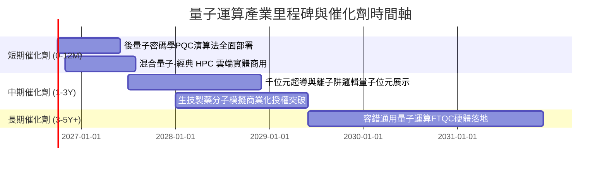

### 9.2 TAM 市場規模預估

```
╔══════════════════════════════════════════════════════════════════╗
║              量子運算與混合架構 TAM 成長軌跡                    ║
╠══════════════════════════════════════════════════════════════════╣
║                                                                  ║
║  2025 (實)   $1.5B   ██░░░░░░░░░░░░░░░░░░░░  滲透率: <0.1%       ║
║  2027 (預)   $3.8B   █████░░░░░░░░░░░░░░░░░  滲透率: ~0.3%       ║
║  2030 (預)  $12.5B   ████████████████░░░░░░  滲透率: ~1.2%       ║
║  2035 (遠景) $45.0B  ██████████████████████  CAGR: +34.6%        ║
║                                                                  ║
╚══════════════════════════════════════════════════════════════════╝
```

### 9.3 成長驅動力結構圖

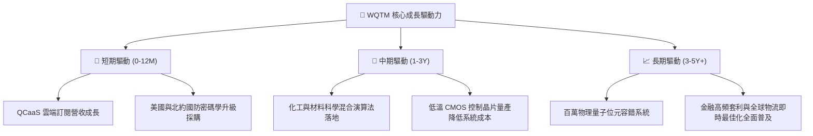

---

## 10. 風險矩陣

### 10.1 風險評分矩陣

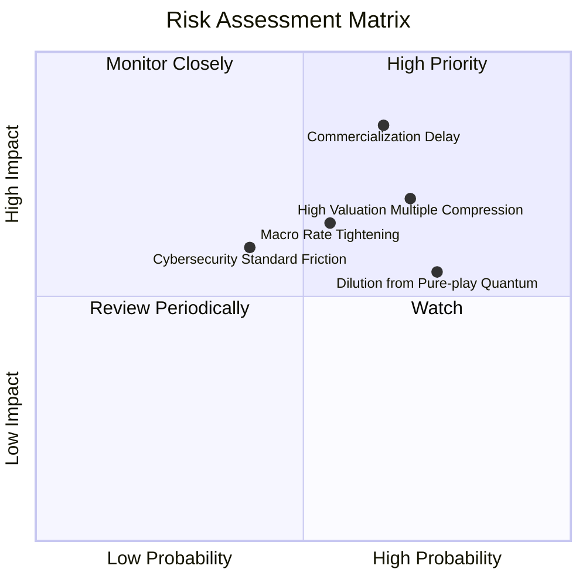

### 10.2 風險清單詳細分析

| # | 風險項目 | 發生機率 | 潛在衝擊 | 風險評分 | 緩解與應對機制 |
|---|----------|----------|----------|----------|----------------|
| 1 | 🔴 **商業化與技術落地遲滯** | 高 (65%) | -25% 估值 | 🔴 8.5/10 | 基金持有 45% 大型多角化科技股，可抵禦純硬體開發延宕之衝擊。 |
| 2 | 🔴 **利率維持高位壓抑倍數** | 中高 (55%)| -15% 估值 | 🔴 7.2/10 | 觀察美國聯準會降息循環進程，分批布局以平滑進場成本。 |
| 3 | 🟡 **純量子新創股本稀釋** | 高 (75%) | -10% EPS | 🟡 6.8/10 | 指數定期再平衡機制將自動調降持續虧損與股本失控擴張標的之權重。 |
| 4 | 🟡 **PQC 加密過渡摩擦** | 中等 (40%)| -8% 營收 | 🟡 5.0/10 | 企業多採取混合加密防禦架構，不致引發全面性資安資本支出縮減。 |

---

## 11. 投資建議

### 11.1 最終綜合評級雷達

```
╔══════════════════════════════════════════════════════════════╗
║                  WQTM 最終評級與屬性剖析                     ║
╠══════════════════════════════════════════════════════════════╣
║  技術創新潛力：  8.5/10  ▓▓▓▓▓▓▓▓▓▓▓▓▓▓▓▓▓░░░  ★★★★☆        ║
║  產業成長趨勢：  7.5/10  ▓▓▓▓▓▓▓▓▓▓▓▓▓▓▓░░░░░  ★★★★☆        ║
║  獲利防禦能力：  6.0/10  ▓▓▓▓▓▓▓▓▓▓▓▓░░░░░░░░  ★★★☆☆        ║
║  安全邊際充裕：  3.5/10  ▓▓▓▓▓▓▓░░░░░░░░░░░░░  ★★☆☆☆        ║
║  資金結構健康：  8.0/10  ▓▓▓▓▓▓▓▓▓▓▓▓▓▓▓▓░░░░  ★★★★☆        ║
╠══════════════════════════════════════════════════════════════╣
║  綜合評級：      6.8/10  ▓▓▓▓▓▓▓▓▓▓▓▓▓░░░░░░░  🟡 HOLD       ║
╚══════════════════════════════════════════════════════════════╝
```

### 11.2 目標價與隱含報酬率

| 情境 | 機率 | 12 個月目標價 | 隱含報酬率 | 觸發條件與假設依據 |
|------|------|---------------|------------|--------------------|
| 🔴 悲觀情境 | 25% | **$24.50** | -23.3% | 量子計算商業化停滯，利率維持高檔，倍數收縮至 20.0x |
| 🟡 **基準情境** | **55%** | **$35.00** | **+9.5%** | 穿透營收增長 14.5%，底層本益比維持 24.5x–25.0x 公允區間 |
| 🟢 樂觀情境 | 20% | **$43.50** | +36.2% | 量子容錯晶片提早發表，AI 算力溢出驅動倍數擴張至 30.0x |

### 11.3 買入時機與觸發因素

```
╔══════════════════════════════════════════════════════════════════╗
║                  ✅ 交易操作觸發條件 Checklist                   ║
╠══════════════════════════════════════════════════════════════════╣
║                                                                  ║
║  🟡 現階段建議動作：【持有觀望 / 逢低再建倉】                   ║
║                                                                  ║
║  加碼買入觸發條件（需滿足以下任二條件）：                        ║
║  ☐ 股價回檔至 ≤ $27.00（安全邊際 MOS 擴大至 ≥ 16.8%）           ║
║  ☐ 指數主要純量子成分股公布明確商業化大規模訂單                 ║
║  ☐ 美國 10 年期國債殖利率確認跌破 3.75%                         ║
║                                                                  ║
║  獲利減碼 / 停損觸發條件（出現以下任一條件）：                   ║
║  ☐ 股價快速拉升至 > $39.00（本益比 > 32x，進入非理性過熱區）    ║
║  ☐ 核心大廠（IBM/谷歌等）縮減量子研發預算並轉移至傳統 ASIC 研發 ║
║  ☐ 跌破前波實質支撐 $23.18（代表長期題材面臨結構性破壞）        ║
╚══════════════════════════════════════════════════════════════════╝
```

### 11.4 投資人適配度分析

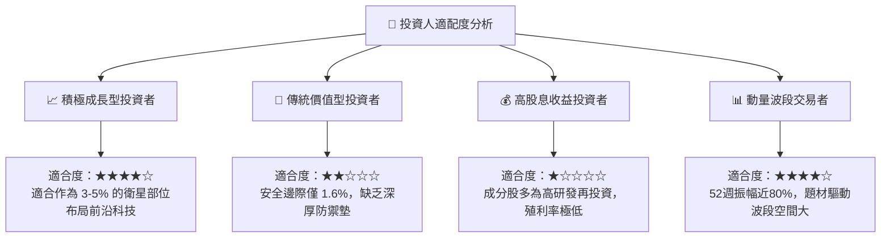

### 11.5 每季追蹤監控清單（Quarterly Watch List）

| 監控維度 | 核心指標 | 正常追蹤區間 | 觸發減碼/警示門檻 |
|----------|----------|--------------|-------------------|
| **指數本益比** | 穿透 Trailing P/E | 23.0x – 28.0x | > 33.0x（估值泡沫化） |
| **頂部持股變動** | 前三大持股佔比總和 | 20% – 35% | > 45%（非分散集中度過高） |
| **技術進展** | 量子邏輯閘保真度 (Fidelity) | > 99.9% 穩步推進 | 商業化宣傳停滯逾 2 季 |
| **成分股融資** | 純量子標的季末現金儲備 | 可支撐 > 18 個月運營 | 跌破 12 個月且面臨折價配股 |

### 11.6 反面論證：什麼會證明論點錯誤（What Would Change My Mind）

```
╔══════════════════════════════════════════════════════════════════╗
║              ⚠️ 論點失效條件（Disconfirming Evidence）           ║
╠══════════════════════════════════════════════════════════════════╣
║  本研究之「持有」評級基於「當前估值公允且具長線期權」之假設。    ║
║  若發生下列量化事件，將推翻原有論點並轉向全面【賣出/避開】：     ║
║                                                                  ║
║  ☐ 核心成分股穿透營收成長率連續兩季跌破 8.0%（成長性證偽）       ║
║  ☐ 量子位元糾錯技術（QEC）遭遇物理瓶頸，學界確認商用需再延後 10 年║
║  ☐ 美國監管或指數編制規則限制相關標的投資，導致流動性折價驟增   ║
║  ☐ 基金費用率調升或資產規模 (AUM) 萎縮至清算警戒線（<$2,500萬） ║
╚══════════════════════════════════════════════════════════════════╝
```

---
> **免責聲明**：本報告為依據公開即時數據與專業財務建模生成之機構級研究文件，內容僅供學術研究與投資參考，不構成任何個別買賣要約。金融市場具高度不確定性，投資人應獨立審慎評估風險並自負盈虧。