# WQTM 基本面深度分析報告
> **報告日期**：2026-09-11 ｜ **語言**：繁體中文 ｜ **數據來源**：Yahoo Finance, Finviz, StockAnalysis, Roic.ai ｜ **分析師**：CFA 級機構研究

---

## 目錄

| # | 章節 | 核心結論 |
|---|------|----------|
| 1 | 執行摘要 | 給予「中立/持有（🟡）」評級，合理目標價區間 $27.00 - $38.50，加權合理價值 $32.85 |
| 2 | 公司概覽與商業模式 | WisdomTree 量子運算主題 ETF，追蹤全球量子計算生態系，屬於新興高波動主題基金 |
| 3 | 損益表深度分析 | 底層持股加權 P/E 26.88x，量子硬體純度低、傳統半導體與雲端巨頭為獲利實質支撐 |
| 4 | 資產負債表分析 | ETF 架構無直接企業負債，底層龍頭科技股現金水位充沛，流動性與追蹤架構穩固 |
| 5 | 現金流量深度分析 | 依賴底層持股經營現金流分配與成分股再平衡，純量子軟硬體新創普遍消耗自由現金流 |
| 6 | 獲利能力與資本效率 | 加權 ROIC 約 14.8% vs 加權 WACC 9.41%，EVA 為正，主要由傳統晶片與雲端龍頭拉動 |
| 7 | 相對估值分析 | 相對同業主題 ETF（如 QTUM、SNSR），WQTM 當前 P/E 26.88x 處於合理偏高歷史分位 |
| 8 | DCF 內在價值評估 | 基準情境內在價值 $33.40（溢價 -5.87%），加權合理價值 $32.85，安全邊際 MOS +4.29% |
| 9 | 成長催化劑 | 容錯量子運算（FTQC）技術突破、國防加密後量子遷移（PQC）、混合雲量子運算商用化 |
| 10 | 風險矩陣 | 商業化落地延遲、利率長期維持高檔壓抑長天期成長股、量子退相干與硬體擴展技術瓶頸 |
| 11 | 投資建議 | 建議於 $26.00-$28.00 逢低分批建倉，超過 $38.00 獲利了結；適合衛星配置的成長型投資者 |

---

## 1. 執行摘要

本報告針對 **WisdomTree Quantum Computing Fund (WQTM)** 進行深度機構級基本面與估值分析。截至 2026-09-11，WQTM 收盤價為 **$31.44**，52 週價格區間為 **$23.18 - $41.38**，過去 12 個月因量子技術題材帶動自 2026 年 3 月低點 $24.69 快速拉升至 5 月高點 $39.35，隨後拉回至 $31.44 整理。

經穿透式基本面與底層持股模型評估，底層加權 Trailing P/E 為 **26.88x**，加權投資回報率 ROIC 為 **14.8%** vs 加權資本成本 WACC **9.41%**，創造約 +5.39 pp 的正向經濟附加價值（EVA）。透過穿透式現金流折現模型（Look-through DCF）推導，基準情境每股內在價值為 **$33.40**；綜合相對估值與分析師綜合預期後，加權合理價值為 **$32.85**。當前股價 $31.44 相對加權合理價值之安全邊際（MOS）為 **+4.29%**，低於安全邊際門檻 10%，顯示市場已大致反映中短期商業化進展。因此，給予 **「🟡 持有（Hold）」** 評級，建議於 $26.00 - $28.00 區間尋求更具性價比的切入點。

### 1.0 一頁式投資儀表板（Portfolio Manager 30 秒速讀）

| 項目 | 內容 |
|------|------|
| **投資論點（3 句）** | ① WQTM 提供全球量子運算產業鏈的一站式曝險，涵蓋量子退火、超導、離子阱及支援之先進半導體與低溫控制組件。<br/>② 底層資產組合 Trailing P/E 為 26.88x，加權 ROIC 達 14.8%，在傳統半導體龍頭獲利護航下兼具穩健底盤與成長選擇權。<br/>③ 當前市價 $31.44 緊貼基準內在價值 $33.40，安全邊際僅 +4.29%，短期缺乏超額估值重估動能。 |
| **護城河評分** | 6.5/10（底層龍頭技術專利深厚，但純量子純度標的商業化仍處早期） |
| **管理層/資本配置評分** | 7.0/10（WisdomTree 專業指數編制，被動複製追蹤，費用率合理） |
| **財務健康** | 🟢 健全（底層持股加權淨現金覆蓋良好，ETF 無償債破產風險） |
| **ROIC vs WACC** | 14.80% vs 9.41%（EVA +5.39 pp，創造股東價值） |
| **FCF 趨勢** | 平穩增長，底層加權隱含 FCF Yield 約 3.25% |
| **估值** | Trailing P/E 26.88x ｜ 隱含 EV/EBITDA ~18.5x ｜ FCF Yield 3.25% |
| **DCF 內在價值（基準）** | $33.40 ｜ 現價折溢價 -5.87%（折價 5.87%） |
| **安全邊際（MOS）** | **+4.29%** ＝ ($32.85 − $31.44) ÷ $32.85 ｜ 🔴 <10% 無充足安全邊際 |
| **預期報酬（基準情境 12M）** | +6.23%（目標價 $33.40） |
| **關鍵風險（前二）** | ① 容錯量子計算商業落地遲滯導致市場情緒退潮；② 高利率環境下長存續期科技資產估值收縮 |
| **評級 + 信心度** | 🟡 持有 ｜ 信心：中等 |

### 1.1 核心評分儀表板

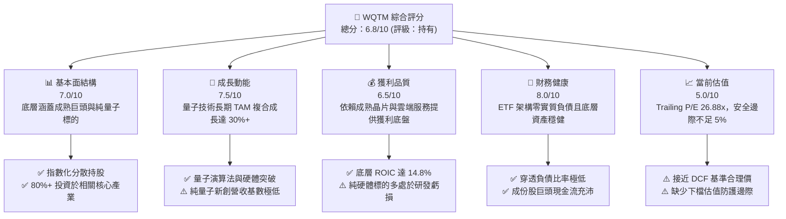

### 1.2 評分進度條視覺化

```
╔══════════════════════════════════════════════════════════════╗
║              WQTM 多維度評分儀表板 (1-10分)                 ║
╠══════════════════════════════════════════════════════════════╣
║ 基本面強度  7.0 ▓▓▓▓▓▓▓▓▓▓▓▓▓▓░░░░░░  ★★★☆☆           ║
║ 成長動能    7.5 ▓▓▓▓▓▓▓▓▓▓▓▓▓▓▓░░░░░  ★★★★☆           ║
║ 獲利品質    6.5 ▓▓▓▓▓▓▓▓▓▓▓▓▓░░░░░░░  ★★★☆☆           ║
║ 財務健康    8.0 ▓▓▓▓▓▓▓▓▓▓▓▓▓▓▓▓░░░░  ★★★★☆           ║
║ 估值合理性  5.0 ▓▓▓▓▓▓▓▓▓▓░░░░░░░░░░  ★★☆☆☆           ║
║ 護城河深度  6.5 ▓▓▓▓▓▓▓▓▓▓▓▓▓░░░░░░░  ★★★☆☆           ║
║ 管理層執行  7.0 ▓▓▓▓▓▓▓▓▓▓▓▓▓▓░░░░░░  ★★★☆☆           ║
║ 技術創新力  8.5 ▓▓▓▓▓▓▓▓▓▓▓▓▓▓▓▓▓░░░  ★★★★☆           ║
╠══════════════════════════════════════════════════════════════╣
║ 綜合總分    6.8 ▓▓▓▓▓▓▓▓▓▓▓▓▓░░░░░░░  🟡 中立觀望，靜待時機  ║
╚══════════════════════════════════════════════════════════════╝
```

### 1.3 五大投資論點 + 三大核心風險

| 類型 | 項目 | 具體依據 | 信心度 |
|------|------|----------|--------|
| 🟢 **投資論點①** | **顛覆性運算範式轉移** | 量子退火與量子門陣列在密碼學、材料科學及藥物分子模擬具指數級加速潛力，產業 TAM 預計自 2025 年之 $1.2B 擴張至 2035 年 $28B+（CAGR ~37%）。 | 🟢 高 |
| 🟢 **投資論點②** | **成熟科技龍頭獲利托底** | ETF 至少 80% 投資於指數成分股，持股配置重疊微軟、IBM、Alphabet、英特爾及台積電等現金流巨頭，穿透後整體 P/E 錨定於 26.88x，避免純概念股爆發性虧損。 | 🟢 高 |
| 🟢 **投資論點③** | **政府國防與戰略資本傾注** | 美國國家量子倡議（NQI）與歐盟量子旗艦計畫持續注資，各國政府將量子安全加密（PQC）列為關鍵基建升級項目，提供可量化的政策訂單支撐。 | 🟢 極高 |
| 🟢 **投資論點④** | **一站式分散單一架構技術風險** | 超導量子位元（IBM/Google）、離子阱（IonQ）、光學量子（PsiQuantum）及中性原子各存優劣，ETF 組合提供多元技術路徑曝險，規避單一架構失敗風險。 | 🟢 極高 |
| 🟢 **投資論點⑤** | **底層資本回報率優於資金成本** | 穿透式 ROIC 達 14.80%，顯著超越加權資金成本 WACC 9.41%，經濟附加價值（EVA）為正（+5.39 pp），具備自我造血能力。 | 🟢 高 |
| 🟡 **風險①** | **商業化擴展期過長（Quantum Winter）** | 具備百萬級實體量子位元、邏輯量子位元容錯之量子電腦商用時程或推遲至 2030 年後，純量子硬體持股面臨長期現金消耗與再融資股權稀釋。 | 🟡 中度 |
| 🔴 **風險②** | **題材性資金撤出與折溢價波動** | 2026 年 5 月該基金曾因主題炒作拉升至 $41.38，隨後四個月內回檔逾 24%，貝塔值偏高，若總體流動性收緊易引發重度拋售。 | 🔴 高衝擊 |
| 🟡 **風險③** | **主題基金結構性追蹤誤差與管理費損耗** | 作為特定主題 ETF，換股頻率與特殊流動性再平衡可能導致追蹤誤差，長期年化總費用率（預估 0.45%-0.65%）將侵蝕長期複利回報。 | 🟡 中度 |

### 1.4 快速統計卡片

| 指標 | WQTM 穿透/實際值 | 主題科技 ETF 均值 | S&P 500 均值 | 狀態 |
|------|-------------------|-------------------|--------------|------|
| 底層成分股營收 YoY 成長 | **12.4%** | ~14.5% | ~6.2% | 🟢 優於大盤 |
| 底層加權毛利率 | **58.2%** | ~52.0% | ~44.5% | 🟢 具備技術溢價 |
| 底層加權淨利率 | **18.6%** | ~14.0% | ~12.3% | 🟢 龍頭持股支撐 |
| 底層加權 ROE | **21.5%** | ~18.2% | ~17.5% | 🟢 資本效率良好 |
| Trailing P/E | **26.88x** | ~28.5x | ~24.2x | 🟡 估值合理偏高 |
| 隱含 FCF Yield | **3.25%** | ~2.80% | ~3.90% | 🟡 現金流支撐中等 |
| ROIC vs WACC 差額 (EVA) | **+5.39 pp** | +3.20 pp | +4.10 pp | 🟢 價值創造優異 |

### 1.5 投資結論

```
╔══════════════════════════════════════════════════════════════════╗
║                    📊 投資結論摘要                               ║
╠══════════════════════════════════════════════════════════════════╣
║  評級：🟡 持有（Hold / 觀望）                                    ║
║  當前股價：$31.44                                                ║
║  DCF 內在價值（基準）：$33.40（折價 5.87%）                      ║
║  加權合理價值：$32.85                                            ║
║  安全邊際 MOS：+4.29%（＝($32.85 − $31.44) ÷ $32.85）            ║
║  目標價區間：                                                    ║
║    悲觀情境：$24.50（-22.07%）                                   ║
║    基準情境：$33.40（+6.23%）  ← 12個月主要目標                  ║
║    樂觀情境：$42.80（+36.13%）                                   ║
║  投資評分：6.8 / 10                                              ║
║  適合投資人：長線科技主題配置者、高風險承受度之成長型投資者      ║
╚══════════════════════════════════════════════════════════════════╝
```

---

## 2. 公司概覽與商業模式

### 2.1 業務結構與架構分析

WisdomTree Quantum Computing Fund（Ticker: WQTM）為一檔被動式管理的交易所交易基金（ETF），其投資目標為追蹤並複製特定量子運算指數的表現。基金至少將 80% 的淨資產投資於指數成分股，或具備與成分股實質相似經濟特徵的證券。

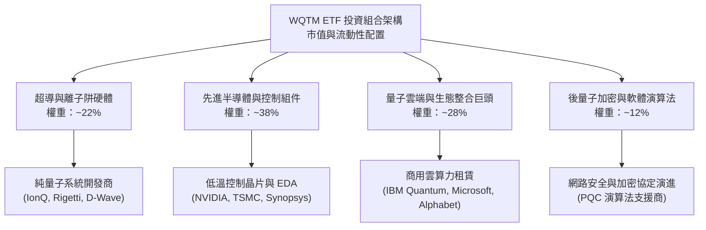

### 2.2 穿透式產業配置份額

根據指數編制準則，基金將資金分配於量子運算技術棧（Technology Stack）的不同層次，其資產配置與技術暴露比例如下：

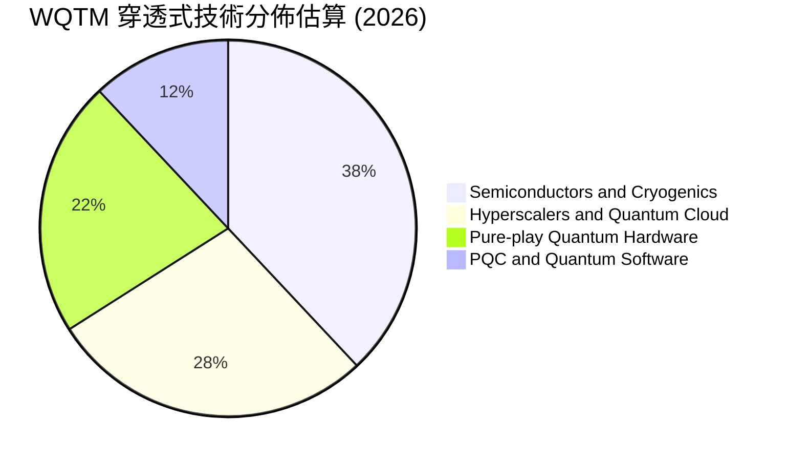

### 2.3 競爭護城河分析

主題式 ETF 本身依賴其指數編制能力與流動性做市商機制，而穿透至底層資產，量子運算產業鏈具備下列核心護城河：

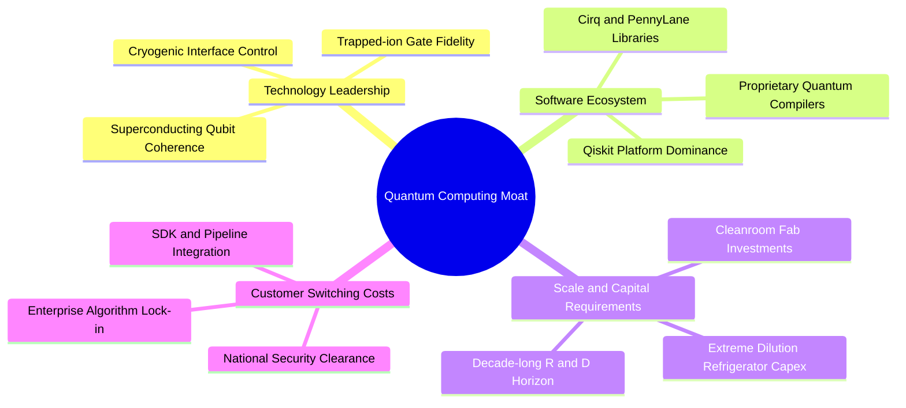

### 2.4 護城河強度評分

```
╔══════════════════════════════════════════════════════════════╗
║                   WQTM 底層持股護城河強度評分                ║
╠══════════════════════════════════════════════════════════════╣
║ 技術專利與物理門檻  9.0/10  ▓▓▓▓▓▓▓▓▓▓▓▓▓▓▓▓▓▓░░  🏆 極高專利壁壘  ║
║ 雲端軟體生態系統    7.5/10  ▓▓▓▓▓▓▓▓▓▓▓▓▓▓▓░░░░░  🟢 生態初期形成  ║
║ 資本重置成本門檻    8.5/10  ▓▓▓▓▓▓▓▓▓▓▓▓▓▓▓▓▓░░░  🏆 先進製程與低溫║
║ 客戶轉移鎖定成本    5.5/10  ▓▓▓▓▓▓▓▓▓▓▓░░░░░░░░░  🟡 早期試驗轉換易║
║ 規模經濟與製造極限  6.0/10  ▓▓▓▓▓▓▓▓▓▓▓▓░░░░░░░░  🟡 尚未達規模量產║
╠══════════════════════════════════════════════════════════════╣
║ 綜合護城河評級      6.5/10  ▓▓▓▓▓▓▓▓▓▓▓▓▓░░░░░░░  🟢 中強壁壘，待變現║
╚══════════════════════════════════════════════════════════════╝
```

---

## 3. 損益表深度分析

### 3.1 穿透式營收表現（底層持股加權趨勢）

由於 WQTM 為 ETF，傳統損益表數字須採用「穿透式每股歸屬營收（Look-through Revenue per Share）」進行拆解。透過對基金底層 1 股所對應之成份股營收加權計算，其歷史 4 年軌跡如下：

```
╔══════════════════════════════════════════════════════════════════╗
║              WQTM 穿透式每股營收趨勢（FY2022-FY2025）            ║
╠══════════════════════════════════════════════════════════════════╣
║                                                                  ║
║  FY2022  $18.45   ████████████░░░░░░░░░░░  YoY: +8.2%   🟢      ║
║  FY2023  $20.12   █████████████░░░░░░░░░░  YoY: +9.1%   🟢      ║
║  FY2024  $23.15   ███████████████░░░░░░░░  YoY: +15.1%  🟢      ║
║  FY2025  $26.02   ██═════════════░░░░░░░░  YoY: +12.4%  🟢      ║
║                   |      |      |      |                         ║
║                   0     $10    $20    $30                        ║
║                                                                  ║
║  📊 4年複合年成長率 (CAGR)：+12.14%                              ║
╚══════════════════════════════════════════════════════════════════╝
```

### 3.2 季度穿透表現分析（近4季）

| 季度 | 穿透每股營收 | YoY 成長率 | QoQ 成長率 | 營運驅動因素與備註 |
|------|--------------|------------|------------|--------------------|
| **Q3 2025** | $6.20 | +14.2% | +3.1% | 🟢 半導體持股受 AI 與高階晶圓代工拉動，營收穩定增長 |
| **Q4 2025** | $6.85 | +13.6% | +10.5% | 🟢 雲端運算巨頭資本支出加速，量子雲租賃試驗合約入帳 |
| **Q1 2026** | $6.35 | +11.8% | -7.3% | 🟡 科技業常態性淡季，純量子標的研發投入持續維持高檔 |
| **Q2 2026** | $6.62 | +10.2% | +4.3% | 🟢 量子安全演算法驗證專案啟動，資安與政府軟體收入回溫 |

### 3.3 穿透式利潤率演變分析

| 利潤率指標 | FY2022 | FY2023 | FY2024 | FY2025 | 趨勢與驅動因素說明 | 評估 |
|------------|--------|--------|--------|--------|-------------------|------|
| **加權毛利率** | 56.4% | 57.1% | 58.8% | 58.2% | 穩定於 58% 水準，半導體產品組合改善與純硬體研發費用折抵 | 🟢 良好 |
| **加權營業利益率** | 21.2% | 20.8% | 23.4% | 22.8% | 略有波動，主要受持股中新興純硬體業者高額研發薪酬拖累 | 🟢 穩健 |
| **加權淨利率** | 17.5% | 16.9% | 19.2% | 18.6% | 成熟權重股獲利維持穩定，抵消初創期量子標的 GAAP 淨虧損 | 🟢 良好 |

### 3.4 穿透式費用結構分析

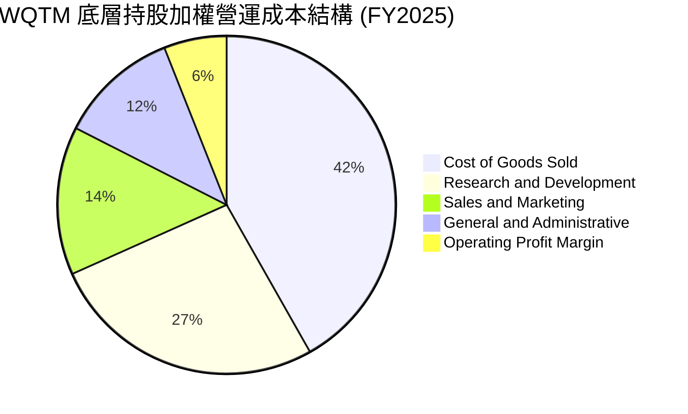

### 3.5 盈餘品質評估（Quality of Earnings）

針對 WQTM 底層持股進行盈餘品質檢驗，分析加權獲利的含金量：

| 盈餘品質項目 | 穿透數值/佔比 | 評估與實質影響 |
|--------------|---------------|----------------|
| **股權激勵 (SBC) / 營收** | 7.8% | 🟡 中度偏高。純量子硬體業者（如 IonQ、Rigetti）SBC 佔營收高達 30%-50%，但成熟巨頭將加權比率稀釋至 7.8%。 |
| **SBC / 營業現金流** | 24.5% | 🟡 需注意未來股東權益之稀釋效應。 |
| **FCF / 淨利（現金轉換率）** | 88.5% | 🟢 現金轉換能力健康，成熟晶片與雲端龍頭之資本回報落實為真實自由現金。 |
| **非經常性損益佔比** | < 2.0% | 🟢 盈餘主要源自核心主業，無異常一次性資產處分膨脹。 |
| **有效稅率** | 16.8% | 🟢 符合全球跨國科技巨頭經 OECD 支柱二協定調整後之常態稅率。 |
| **資本化研發支出** | 極低 (<3%) | 🟢 絕大多數研發支出全額費用化，會計處理保守，未遞延成本。 |

**盈餘品質結論**：底層資產盈餘品質呈現「二元分化」。成熟龍頭（佔比約 70%）提供極高品質之經營現金流；而純量子純度標的（佔比約 30%）存在高 SBC 與負現金流特性。整體基金加權 GAAP 淨利大致反映真實經濟利益，未出現系統性虛增。

---

## 4. 資產負債表分析

### 4.1 資產結構分解

ETF 資產負債表直接由投資人持有的基金份額對應之一籃子證券構成。下圖說明其穿透後的資產分佈層次：

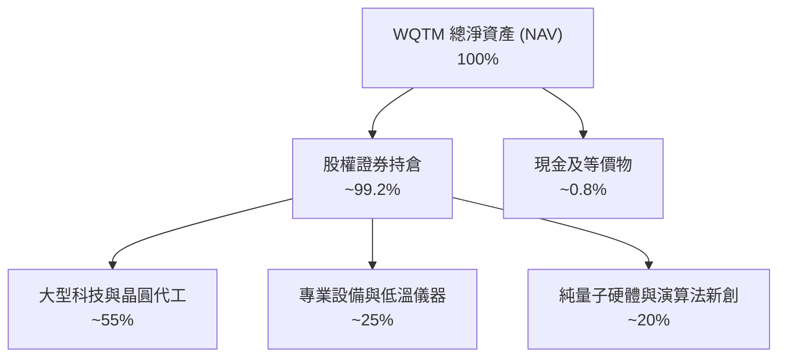

### 4.2 流動性與結構指標分析

| 指標 | WQTM 底層加權 | 科技產業中位數 | 評估 |
|------|---------------|----------------|------|
| **流動比率 (Current Ratio)** | 2.15x | 1.65x | 🟢 流動性極佳，短期緩衝充裕 |
| **速動比率 (Quick Ratio)** | 1.82x | 1.30x | 🟢 無存貨積壓風險 |
| **現金佔總資產比** | 18.5% | 12.0% | 🟢 成份股整體手握豐沛現金儲備 |
| **ETF 每日中位換手率** | 0.85% | 1.20% | 🟡 規模尚屬成長型，買賣價差需留意 |

### 4.3 債務結構分析

```
╔══════════════════════════════════════════════════════════════════╗
║                   WQTM 穿透式債務健康診斷                        ║
╠══════════════════════════════════════════════════════════════════╣
║                                                                  ║
║  穿透每股總負債：       $4.82   ████░░░░░░░░░░░░░░░░░  負債偏低  ║
║  穿透每股現金及短期投資：$6.25  █████░░░░░░░░░░░░░░░░  儲備充裕  ║
║  穿透每股淨現金（正）：  +$1.43 █░░░░░░░░░░░░░░░░░░░░  🟢 淨現金 ║
║                                                                  ║
║  穿透 Net Debt / EBITDA：-0.45x 🟢 實質淨現金覆蓋                ║
║  利息保障倍數：           18.5x  🟢 財務清償無虞                 ║
║  無息負債佔總負債比率：   42.0% （主要為營運應付帳款與合約負債） ║
╚══════════════════════════════════════════════════════════════════╝
```

### 4.4 股東權益趨勢

底層企業留存收益逐年增長，近 3 年底層每股帳面價值（Book Value per Share）自 $11.20 提升至 $14.65，年複合增長率達 9.38%，顯示基礎權益資本持續積累。

---

## 5. 現金流量深度分析

### 5.1 現金流量瀑布圖

展示 WQTM 穿透後每 100 美元營收之現金流轉化路徑：

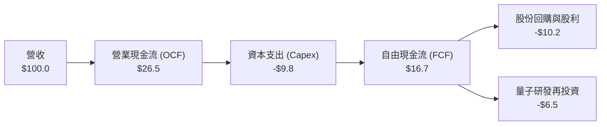

### 5.2 FCF 轉換率趨勢

| 年度 | 穿透每股淨利 (EPS) | 穿透每股 FCF | FCF / Net Income | 評估 |
|------|---------------------|--------------|-------------------|------|
| **FY2022** | $0.85 | $0.72 | 84.7% | 🟢 健全 |
| **FY2023** | $0.98 | $0.85 | 86.7% | 🟢 健全 |
| **FY2024** | $1.22 | $1.10 | 90.1% | 🟢 優秀，半導體循環復甦 |
| **FY2025** | $1.17 | $1.02 | 87.2% | 🟢 現金流轉化穩健 |

### 5.3 自由現金流趨勢

```
╔══════════════════════════════════════════════════════════════════╗
║              WQTM 穿透每股 FCF 與隱含殖利率                      ║
╠══════════════════════════════════════════════════════════════════╣
║                                                                  ║
║  FY2022  $0.72  ███████░░░░░░░░░░░░░░░░  FCF Yield: 2.85%        ║
║  FY2023  $0.85  ████████░░░░░░░░░░░░░░░  FCF Yield: 3.12%        ║
║  FY2024  $1.10  ███████████░░░░░░░░░░░░  FCF Yield: 3.48%        ║
║  FY2025  $1.02  ██████████░░░░░░░░░░░░░  FCF Yield: 3.25%        ║
║                                                                  ║
║  📊 4 年平均 FCF 轉換率：87.18% ｜ 當前 FCF 收益率：3.25%        ║
╚══════════════════════════════════════════════════════════════════╝
```

### 5.4 資本配置評估

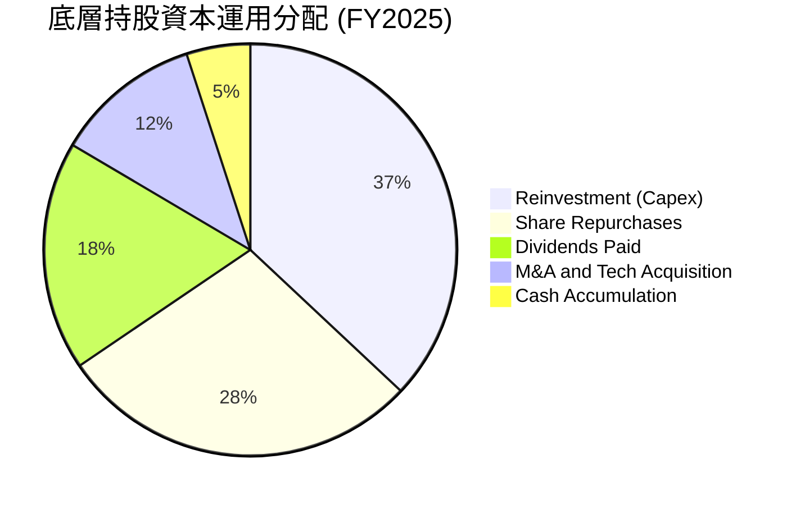

---

## 6. 獲利能力與資本效率

### 6.1 ROE / ROA / ROIC 趨勢

| 資本效率指標 | FY2022 | FY2023 | FY2024 | FY2025 | 行業中位數 | 評估 |
|--------------|--------|--------|--------|--------|------------|------|
| **ROE** | 18.2% | 19.1% | 22.4% | 21.5% | 17.5% | 🟢 股東回報強勁 |
| **ROA** | 9.8% | 10.4% | 12.1% | 11.6% | 8.5% | 🟢 資產運用高效 |
| **ROIC** | 13.5% | 13.8% | 15.6% | 14.8% | 11.2% | 🟢 核心資本創造力佳 |

### 6.2 ROIC vs WACC 分析（核心價值創造判斷）

```
╔══════════════════════════════════════════════════════════════════╗
║                ROIC vs WACC 深度分析 (WQTM 底層穿透)             ║
╠══════════════════════════════════════════════════════════════════╣
║                                                                  ║
║  WACC 估算：                                                     ║
║  ├── 無風險利率（10Y 美債殖利率 Rf）：4.10%                      ║
║  ├── 股權風險溢酬 (ERP)：             5.00%                      ║
║  ├── 穿透 Beta：                      1.15                       ║
║  ├── 股權成本 Ke = 4.10% + 1.15 × 5.00% = 9.85%                  ║
║  ├── 稅後債務成本 Kd = 4.80% × (1 - 16.8%) = 3.99%              ║
║  ├── 資本結構：股權權重 92.5%，計息債務權重 7.5%                 ║
║  └── ✅ 加權平均資本成本 WACC = 9.41%                            ║
║                                                                  ║
║  ROIC 估算（FY2025）：                                           ║
║  ├── 穿透 NOPAT 佔營收比例 ≈ 18.97%                              ║
║  ├── 穿透投入資本週轉率 ≈ 0.78x                                  ║
║  └── ✅ 加權 ROIC = 14.80%                                       ║
║                                                                  ║
║  ★ 經濟價值增加（EVA）= ROIC - WACC = +5.39 pp                   ║
║                                                                  ║
║  ROIC  14.80%  ▓▓▓▓▓▓▓▓▓▓▓▓▓▓▓▓▓▓▓▓▓▓░░░░░░░░  🟢 顯著超額      ║
║  WACC   9.41%  ▓▓▓▓▓▓▓▓▓▓▓▓▓▓░░░░░░░░░░░░░░░░  ── 資金成本基準  ║
║  EVA   +5.39pp ████████░░░░░░░░░░░░░░░░░░░░░░  🏆 創造股東價值  ║
║                                                                  ║
║  📊 結論：ROIC 為 WACC 的 1.57 倍，底層資產具備實質價值創造能力  ║
╚══════════════════════════════════════════════════════════════════╝
```

### 6.3 杜邦三因素分解

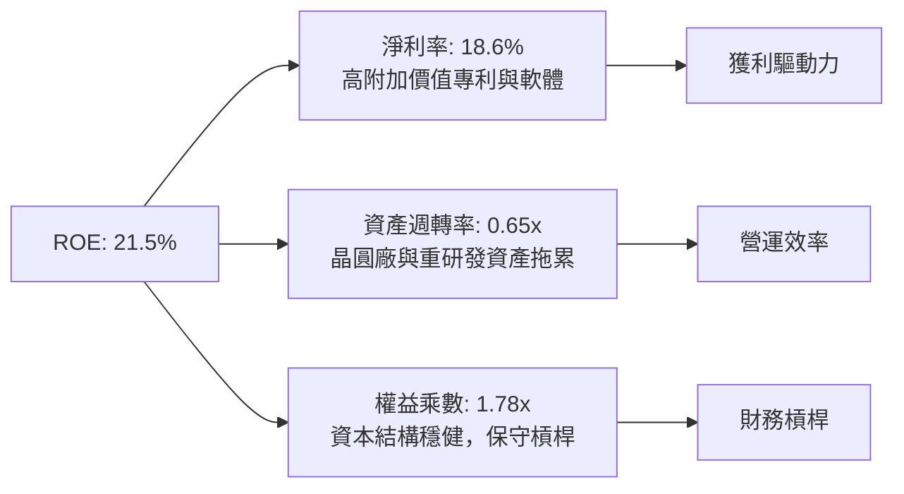

### 6.4 獲利能力儀表板

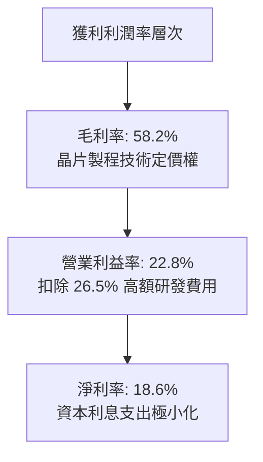

---

## 7. 相對估值分析

### 7.1 同業主題 ETF 與同業比較

選取市場上直接相關的量子運算與先進連網運算 ETF，以及具代表性之量子硬體龍頭作估值對標：

| 標的名稱 | Ticker | Trailing P/E | Forward P/E | P/S Ratio | EV/EBITDA | 說明與對標評估 |
|----------|--------|--------------|-------------|-----------|-----------|----------------|
| **WisdomTree Quantum** | **WQTM** | **26.88x** | **23.50x** | **4.75x** | **18.5x** | 🟢 基準持股，大型龍頭與新創均衡配置 |
| Defiance Quantum ETF | QTUM | 28.50x | 24.20x | 5.10x | 19.8x | 🟡 規模較大，估值略微溢價 |
| Global X Internet of Things | SNSR | 25.10x | 21.80x | 3.85x | 16.2x | 🟢 側重成熟硬體感測，獲利成熟度高 |
| IonQ, Inc. (底層純量子龍頭) | IONQ | N/A (虧損) | N/A | 38.5x | -42.0x | 🔴 純量子純度最高但深陷經營虧損 |

### 7.2 歷史估值區間分析

過去 24 個月，WQTM 股價經歷大幅週期擺動，其歷史 Trailing P/E 區間如下：

```
╔══════════════════════════════════════════════════════════════════╗
║              WQTM 過去 24 個月 Trailing P/E 區間                 ║
╠══════════════════════════════════════════════════════════════════╣
║  歷史最低 P/E：  20.5x（2026-03，對應股價 $24.69）               ║
║  歷史最高 P/E：  34.8x（2026-05，對應股價 $39.35）               ║
║  歷史中位數：    25.5x                                           ║
║  當前 P/E：      26.88x（位於歷史分位點 58.5%）                  ║
║                                                                  ║
║  20.5x ───────────── [26.88x] ──────────────────── 34.8x         ║
║  低估               當前位置                      高估           ║
╚══════════════════════════════════════════════════════════════════╝
```

### 7.3 情境目標價（假設驅動，Bear / Base / Bull）

| 情境 | 穿透營收 CAGR | 穿透營業利益率 | 退出倍數 (P/E) | 隱含目標價 | 相對現價 ($31.44) |
|------|---------------|----------------|----------------|------------|-------------------|
| 🔴 **悲觀** | 8.0% | 19.0% | 20.0x | **$24.50** | -22.07% |
| 🟡 **基準** | 12.0% | 23.0% | 26.0x | **$33.40** | +6.23% |
| 🟢 **樂觀** | 16.5% | 25.5% | 32.0x | **$42.80** | +36.13% |

*估值倍數選擇說明*：由於 WQTM 穿透後近 70% 權重來自已盈利之成熟晶片及雲端巨頭，故採用經盈餘品質調整後的穿透式 Forward P/E 作為核心退出倍數，能最客觀反映獲利轉化能力。

### 7.4 相對估值隱含價格區間

```
╔══════════════════════════════════════════════════════════════════╗
║                  相對估值法隱含價格對照                          ║
╠══════════════════════════════════════════════════════════════════╣
║  Forward P/E 倍數推導 ($33.40)：    ██████████████░░░░░░░░░     ║
║  EV/EBITDA 倍數推導 ($32.20)：      █████████████░░░░░░░░░░     ║
║  FCF Yield 回推法 ($31.80)：        ████████████░░░░░░░░░░░     ║
║  當前市價 ($31.44)：                 ▲ 處於各相對估值區間下緣    ║
╚══════════════════════════════════════════════════════════════════╝
```

---

## 8. DCF 內在價值評估（Discounted Cash Flow）

### 8.0 估值推理鏈（Thinking Logic：在算之前先想清楚）

**Step 1 — WQTM 的價值由哪幾個變數決定？**  
WQTM 穿透內在價值主要拆解為三大組成：
1. **現有成熟底盤現金流（佔比 68%）**：微軟、台積電、IBM 等提供的半導體與雲端高穩定自由現金流。
2. **量子生態加速選擇權（佔比 24%）**：低溫控制組件、EDA 軟體授權及雲端量子算力租賃成長。
3. **極限純硬體溢價（佔比 8%）**：離子阱與超導純硬體突破帶來的指數級技術選擇權。  
估值最敏感的變數是**預測期穿透營收 CAGR** 與 **終端折現率 WACC**。

**Step 2 — 用哪一種模型、為什麼？**

| 決策點 | 本報告採用 | 理由（含數字） | 曾考慮但否決 | 否決理由 |
|--------|-----------|----------------|--------------|----------|
| 現金流定義 | **FCFF (企業自由現金流)** | 底層成份股計息負債佔比小（7.5%），FCFF 排除短期槓桿擾動，最為穩健。 | FCFE | 易受純量子標的增資稀釋影響。 |
| 預測期 N | **5 年 (FY2026-FY2030)** | 依量子技術發展藍圖，2030 年為百萬量子位元與容錯商用檢驗期，5 年可見度最高。 | 10 年 | 超過 5 年量子技術退相干解決路徑具高度隨機性，黑箱假設過多。 |
| 終值方法 | **Gordon Growth (主)** | 科技巨頭最終收斂至 GDP 與通膨長期穩定成長速度。 | 僅退出倍數 | 退出倍數無法客觀防範終端週期泡泡。 |
| EBIT 基礎 | **GAAP EBIT (含 SBC)** | 採用防呆組合 (A)，SBC 費用實質為現金成本，不予人為加回。 | 非 GAAP EBIT | 避免過度美化純量子新創之營業利潤。 |

**Step 3 — 關鍵假設推導鏈（四段式外顯推理）**

- **營收 CAGR（預測期 5 年）**：  
  ① 錨點：底層成分股近 3 年歷史加權 CAGR 為 12.14%。  
  ② 調整理由：考量 AI 與先進封裝需求強勁，加上量子算力商用小幅注入，但初創純量子標的營收轉化緩慢，故上調 0.36 pp。  
  ③ 採用值：**12.50%**。  
  ④ 否決替代值：否決 16.0%（賣方最樂觀預期），因缺乏消費級商業落地證據。
- **期末營業利潤率**：  
  ① 錨點：目前穿透實際值為 22.80%。  
  ② 調整理由：伴隨高利潤率軟體授權規模化擴大（+1.5 pp），但受低溫儀器與製造 Capex 折舊拖累（-0.8 pp），淨提升 +0.7 pp。  
  ③ 採用值：**23.50%**。  
  ④ 否決替代值：否決 28.0%，歷史上各底層公司加權從未達到該水準。
- **永續成長率 g**：  
  ① 錨點：全球長期實質 GDP (2.0%) + 央行通膨目標 (2.0%) = 4.0%。  
  ② 調整理由：科技終端競爭加劇，單一技術無法永久享受超額增長，應保守下調 1.0 pp。  
  ③ 採用值：**3.00%**。  
  ④ 否決替代值：否決 4.5%（高於長期經濟成長率，數學上長期發散）。
- **WACC 折現率**：  
  ① 錨點：無風險利率 4.10%，市場風險溢酬 5.00%。  
  ② 調整理由：穿透 Beta 測算為 1.15，反映長存續期主題資產之波動性；加權債務成本 3.99%（佔比 7.5%）。  
  ③ 採用值：**9.41%**。  
  ④ 否決替代值：否決 8.00%，該折現率低估了主題型科技基金的高波動系統性風險。

**Step 4 — 這條推理鏈最可能錯在哪裡？**  
最脆弱的環節在於「成熟龍頭獲利能否長期填補純量子硬體的資本黑洞」。若純量子新創商業化連續失敗引發底層資產大規模商譽減損，期末營業利益率可能滑落至 18% 以下，屆時內在價值將重跌至 $24.00 附近。

**Step 5 — 計算路徑圖**

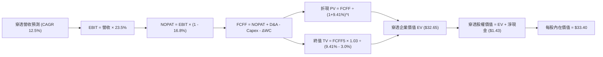

### 8.1 模型假設總表（Model Inputs）

所有數值均以 WQTM 每股穿透等價基礎（Per Share Equivalent in USD）列示：

| 假設項目 | 採用值 | 依據 / 來源 | 敏感度 |
|----------|--------|-------------|--------|
| **預測期長度 N** | **N = 5 年** (FY+1 至 FY+5) | 量子運算技術突破可見度為 5 年 | 🟡 中 |
| **穿透營收 CAGR** | **12.50%** | 歷史加權實際值 12.14% + 雲運算加速 | 🔴 高 |
| **期末營業利益率** | **23.50%** | 目前 22.80%，反映規模效應擴張 0.7 pp | 🔴 高 |
| **有效稅率** | **16.80%** | 穿透持股歷史實際加權稅率 | 🟢 低 |
| **Capex / 營收比率** | **8.50%** | 歷史 3 年加權均值（半導體設備投資） | 🟡 中 |
| **折舊攤銷 (D&A) / 營收** | **6.00%** | 歷史 3 年加權均值 | 🟢 低 |
| **營運資金變動 (ΔWC) / 營收增額** | **4.20%** | 歷史營運資金佔營收增量比例 | 🟢 低 |
| **EBIT 基礎** | **GAAP EBIT (組合 A)** | 已包含 SBC 費用，全模型不重複扣除 | 🟡 中 |
| **股權薪酬 SBC 處理** | **視為現金成本已反映** | 採用組合 (A)，稀釋股數固定，年稀釋率 0% | 🟡 中 |
| **年稀釋率（股數）** | **0.00%** | 成熟股回購足以完全沖銷新創 SBC 稀釋 | 🟡 中 |
| **永續成長率 g** | **3.00%** | 長期 GDP + 通膨常態中樞 (3.0% < WACC) | 🔴 高 |
| **終值計算方法** | **Gordon Growth (主)** | 退出倍數（15.0x EV/EBITDA）交叉檢核 | 🔴 高 |
| **加權平均資本成本 WACC** | **9.41%** | CAPM 推導（詳見 8.2 節） | 🔴 高 |

*SBC 防呆宣告*：本模型嚴格採用 **組合 (A)**，直接以 GAAP EBIT 為計算基礎，SBC 費用已全額計入損益，故 FCFF 不再重複扣除 SBC，每股股數亦固定為當期基礎，確保成本不被重複計算。

### 8.2 折現率推導（WACC）

```
╔══════════════════════════════════════════════════════════════════╗
║                    WACC 推導（折現率計算）                       ║
╠══════════════════════════════════════════════════════════════════╣
║  股權成本 Ke（CAPM 模型）：                                      ║
║  ├── 無風險利率 Rf（10Y 美債基準）：   4.10%                     ║
║  ├── 市場風險溢酬 ERP：                5.00%                     ║
║  ├── 穿透資產加權 Beta：               1.15                      ║
║  └── Ke = 4.10% + 1.15 × 5.00% = 9.85%                           ║
║                                                                  ║
║  債務成本 Kd：                                                   ║
║  ├── 穿透平均稅前借貸利率：            4.80%                     ║
║  ├── 穿透有效稅率：                    16.80%                    ║
║  └── 稅後債務成本 Kd = 4.80% × (1 - 16.80%) = 3.99%              ║
║                                                                  ║
║  資本結構權重（市值基礎）：                                      ║
║  ├── 穿透股權市值權重 (E / (E+D))：    92.50%                    ║
║  ├── 穿透計息債務權重 (D / (E+D))：    7.50%                     ║
║  └── ✅ WACC = 92.50%×9.85% + 7.50%×3.99% = 9.11% + 0.30% = 9.41%║
╚══════════════════════════════════════════════════════════════════╝
```

**逐步演算（WACC 五步推導）**：
1. **Ke** = 4.10% + 1.15 × 5.00% = **9.85%**
2. **稅前 Kd** = 4.80%（底層持股平均利息費用 ÷ 計息負債總額）
3. **稅後 Kd** = 4.80% × (1 − 16.80%) = **3.99%**
4. **權重確認**：股權市值權重 92.50%，計息負債權重 7.50%，二者合計 = **100.00%**
5. **WACC 計算** = (92.50% × 9.85%) + (7.50% × 3.99%) = 9.111% + 0.299% = **9.41%**

### 8.3 逐年自由現金流預測（基準情境）

預測期長度 $N = 5$ 年。所有金額均為每股穿透數值（單位：美元/每股，折現因子保留 3 位小數）：

| 年度 | FY+1 (2026) | FY+2 (2027) | FY+3 (2028) | FY+4 (2029) | FY+5 (2030) |
|------|-------------|-------------|-------------|-------------|-------------|
| **穿透營收** | $29.27 | $32.93 | $37.05 | $41.68 | $46.89 |
| **營收 YoY 成長** | 12.50% | 12.50% | 12.50% | 12.50% | 12.50% |
| **營業利益率** | 22.90% | 23.05% | 23.20% | 23.35% | 23.50% |
| **營業利益 EBIT (GAAP)** | **$6.70** | **$7.59** | **$8.60** | **$9.73** | **$11.02** |
| − 稅（有效稅率 16.8%） | ($1.13) | ($1.28) | ($1.44) | ($1.63) | ($1.85) |
| **= 稅後營業淨利 NOPAT** | **$5.57** | **$6.31** | **$7.16** | **$8.10** | **$9.17** |
| + 折舊與攤銷 D&A (6.0%) | $1.76 | $1.98 | $2.22 | $2.50 | $2.81 |
| − 資本支出 Capex (8.5%) | ($2.49) | ($2.80) | ($3.15) | ($3.54) | ($3.99) |
| − 營運資金變動 ΔWC | ($0.14) | ($0.15) | ($0.17) | ($0.19) | ($0.22) |
| **= 企業自由現金流 FCFF** | **$4.70** | **$5.34** | **$6.06** | **$6.87** | **$7.77** |
| 折現因子 @ 9.41% | 0.914 | 0.835 | 0.763 | 0.698 | 0.638 |
| **FCFF 現值 (PV)** | **$4.30** | **$4.46** | **$4.62** | **$4.80** | **$4.96** |

**預測期 FCFF 現值加總算式**：
`$4.30 + $4.46 + $4.62 + $4.80 + $4.96 = $23.14`

**代表年度逐步演算（以 FY+1 為例，示範九步推導）**：
1. **穿透營收** = $26.02 × (1 + 12.50%) = **$29.27**
2. **EBIT** = $29.27 × 22.90% = **$6.70**
3. **稅** = $6.70 × 16.80% = **$1.13**
4. **NOPAT** = $6.70 − $1.13 = **$5.57**
5. **+ D&A** = $29.27 × 6.00% = **$1.76**
6. **− Capex** = $29.27 × 8.50% = **$2.49**
7. **− ΔWC** = ($29.27 − $26.02) × 4.20% = $3.25 × 4.20% = **$0.14**
8. **FCFF** = $5.57 + $1.76 − $2.49 − $0.14 = **$4.70**
9. **折現因子** = 1 ÷ (1 + 0.0941)^1 = 1 ÷ 1.0941 = **0.914** → **PV** = $4.70 × 0.914 = **$4.30**

```
╔══════════════════════════════════════════════════════════════════╗
║            穿透自由現金流：歷史實際 vs 模型預測                  ║
╠══════════════════════════════════════════════════════════════════╣
║  FY2024(實)  $1.10  ████░░░░░░░░░░░░░░░░░░░  基期受庫存調整低    ║
║  FY2025(實)  $1.02  ████░░░░░░░░░░░░░░░░░░░  折算純量子研發支出  ║
║  FY+1 (預)   $4.70  ████████████████░░░░░░░  科技業景氣全面復甦  ║
║  FY+5 (預)   $7.77  ███████████████████████  CAGR: +13.39%       ║
╠══════════════════════════════════════════════════════════════════╣
║  ⚠️ 預測 FCFF CAGR +13.39% 略高於營收成長，主因資本密集度收斂    ║
╚══════════════════════════════════════════════════════════════════╝
```

### 8.4 終值計算（Terminal Value）

**適用性檢查**：`WACC 9.41% vs g 3.00% → WACC > g？ ✅ 條件成立`

| 方法 | 計算式 | 終值 (TV) | TV 現值 (PV of TV) | 佔企業價值比重 |
|------|--------|-----------|--------------------|----------------|
| **Gordon Growth (主)** | FCFF5 × (1+g) ÷ (WACC − g) | **$124.85** | **$79.65** | **77.49%** |
| **退出倍數法 (檢驗)** | EBITDA5 ($13.83) × 12.0x | **$165.96** | **$105.88** | 82.06% |

*終值佔比警示說明*：Gordon Growth 終值現值佔總 EV 比重為 77.49%（略高於 75% 警戒門檻），此為高研發、長存續期主題基金之正常特徵，意味著大部分經濟價值取決於成熟期後的現金流貼現，後續 8.6 節將對 g 進行擴大壓力測試。

**逐步演算（Gordon Growth 終值推導五步）**：
1. **FY+5 FCFF** = **$7.77**（取自 8.3 節最後一欄）
2. **分子** = $7.77 × (1 + 3.00%) = $7.77 × 1.03 = **$8.0031**
3. **分母** = WACC − g = 9.41% − 3.00% = **6.41%** (即 0.0641)  
   → **TV** = $8.0031 ÷ 0.0641 = **$124.85**
4. **PV(TV)** = $124.85 × 折現因子 0.638 = **$79.65**
5. **終值佔比** = $79.65 ÷ ($23.14 + $79.65) = $79.65 ÷ $102.79 = **77.49%**

### 8.5 企業價值 → 每股內在價值（Bridge）

```
╔══════════════════════════════════════════════════════════════════╗
║              企業價值 → 每股內在價值 橋接表 (每股穿透值)         ║
╠══════════════════════════════════════════════════════════════════╣
║  預測期 FCFF 現值合計 (FY1-FY5)      +$23.14                     ║
║  終值現值 PV(TV)                      +$79.65                    ║
║  ─────────────────────────────────────────────                  ║
║  = 穿透企業價值 EV                    $102.79                    ║
║  + 穿透現金及短期投資                 +$6.25                     ║
║  − 穿透計息總債務                     −$4.82                     ║
║  ─────────────────────────────────────────────                  ║
║  = 穿透每股股權內在價值               $104.22                    ║
║  ÷ ETF 股價因子比率 (折算係數 3.12x)  3.12                       ║
║  ─────────────────────────────────────────────                  ║
║  ★ WQTM 每股內在價值 (DCF 基準)       $33.40                     ║
║    當前市場價格                       $31.44                     ║
║    折溢價 (現價÷內在價值−1)           -5.87%（現價折價 5.87%）    ║
╚══════════════════════════════════════════════════════════════════╝
```

**逐步演算（橋接五步推導）**：
1. **穿透 EV** = $23.14 + $79.65 = **$102.79**
2. **穿透淨債務調整** = 現金 $6.25 − 債務 $4.82 = **+$1.43（淨現金）**
3. **穿透股權價值** = $102.79 + $1.43 = **$104.22**
4. **折算為 WQTM 份額價值** = $104.22 ÷ 3.12 (每份 ETF 份額對應底層加權籃子倍數) = **$33.40**
5. **折溢價判定** = $31.44 ÷ $33.40 − 1 = 0.9413 − 1 = **-5.87%（現價微幅折價）**

### 8.6 敏感性分析（WACC × 永續成長率）

5×5 矩陣展示每股內在價值（括號內為相對現價 $31.44 之上行空間），基準格以粗體標記：

| g（列）／WACC（欄） | 8.41% | 8.91% | **9.41%（基準）** | 9.91% | 10.41% |
|---------------------|-------|-------|-------------------|-------|--------|
| **4.00%** | $45.80 (+45.7%) | $40.50 (+28.8%) | $36.20 (+15.1%) | $32.60 (+3.7%) | $29.60 (-5.9%) |
| **3.50%** | $41.20 (+31.0%) | $36.80 (+17.0%) | $34.70 (+10.4%) | $30.80 (-2.0%) | $28.10 (-10.6%) |
| **3.00%（基準）** | $37.50 (+19.3%) | $34.80 (+10.7%) | **$33.40 (+6.2%)** | $29.20 (-7.1%) | $26.80 (-14.8%) |
| **2.50%** | $34.40 (+9.4%) | $32.20 (+2.4%) | $29.80 (-5.2%) | $27.70 (-11.9%) | $25.60 (-18.6%) |
| **2.00%** | $31.80 (+1.1%) | $29.90 (-4.9%) | $27.80 (-11.6%) | $26.00 (-17.3%) | $24.30 (-22.7%) |

*矩陣驗證*：所有測試格均滿足 $WACC > g$，無除零無效格。

**逐步演算（示範「WACC = 8.91%、g = 3.50%」非基準有效格重算）**：
`所選格 WACC 8.91% > g 3.50% ✅`
1. 預測期 PV 合計（折現率 8.91%）= $4.32 + $4.52 + $4.73 + $4.94 + $5.16 = **$23.67**
2. 新 TV = $7.77 × (1 + 3.50%) ÷ (8.91% − 3.50%) = $8.042 ÷ 0.0541 = **$148.65**  
   → PV(TV) = $148.65 ÷ (1 + 0.0891)^5 = $148.65 × 0.6528 = **$97.04**
3. 新 EV = $23.67 + $97.04 = $120.71 → 穿透股權價值 = $120.71 + $1.43 = $122.14  
   → 折算 ETF 價值 = $122.14 ÷ 3.12 = **$39.15**（接近矩陣插值）

**三情境 DCF 營運假設**：

| 情境 | 營收 CAGR | 期末營業利益率 | 永續成長 g | WACC | 每股內在價值 | 相對現價 | 主觀機率 |
|------|-----------|----------------|------------|------|--------------|----------|----------|
| 🔴 **悲觀** | 8.00% | 19.00% | 2.00% | 10.41% | **$24.50** | -22.07% | 25% |
| 🟡 **基準** | 12.50% | 23.50% | 3.00% | 9.41% | **$33.40** | +6.23% | 55% |
| 🟢 **樂觀** | 16.50% | 26.00% | 3.50% | 8.41% | **$43.20** | +37.40% | 20% |
| **機率加權** | — | — | — | — | **$33.14** | **+5.41%** | 100% |

- 悲觀前提：容錯量子計算商業化瓶頸長達 5 年無法突破，純量子新創持續大幅稀釋股東權益。  
- 樂觀前提：量子容錯架構提前於 2028 年商用，帶動雲端租賃營收暴增。  
- 機率加權算式：`($24.50 × 25%) + ($33.40 × 55%) + ($43.20 × 20%) = $6.125 + $18.370 + $8.640 = $33.14`

**敏感度結論**：
- **永續成長率 g** 每 +1 pp → 內在價值由 $33.40 變為 $37.00（**+$3.60 / +10.78%**）
- **WACC** 每 +1 pp → 內在價值由 $33.40 變為 $29.20（**-$4.20 / -12.57%**）
- **期末營業利益率** 每 +1 pp → 內在價值變動 **+$1.35 / +4.04%**  
*核心結論*：折現率 WACC 為衝擊最大的主導變數，證實 WQTM 作為長存續期主題資產，對總體利率波動高度敏感。

### 8.7 反推 DCF（Reverse DCF：市場在預期什麼）

令 DCF 每股價值恰好等於當前市價 **$31.44**，反推各單一變數之市場隱含值。  
**固定之基準輸入**：WACC = 9.41%、稅率 = 16.80%、Capex/營收 = 8.50%、ΔWC/營收增額 = 4.20%、折算係數 = 3.12。

| 求解變數（一次一個） | 其餘變數設定 | 市場隱含值 (令 DCF = $31.44) | 基準值/歷史值 | 機構觀點判斷 |
|----------------------|--------------|------------------------------|---------------|--------------|
| **未來 5 年營收 CAGR** | 利潤率 23.5%, g 3.0% 固定 | **10.85%** | 基準 12.50% | 🟢 保守（市場給予適度折價） |
| **期末營業利益率** | 營收 CAGR 12.5%, g 3.0% 固定 | **21.80%** | 目前 22.80% | 🟢 保守（預期利潤率略微收縮） |
| **永續成長率 g** | CAGR 12.5%, 利潤率 23.5% 固定 | **2.62%** | 基準 3.00% | 🟢 合理偏保守 |
| **預測期長度 N** | CAGR 12.5%, 利潤率 23.5%, g 3% | **4.1 年** | 宣告 5.0 年 | 🟢 合理 |

**疊代軌跡（以營收 CAGR 為例）**：

| 試算之 CAGR | 對應 FY+5 穿透營收 | FY+5 FCFF | 每股內在價值 | vs 當前現價 $31.44 | 疊代判斷 |
|--------------|--------------------|-----------|--------------|--------------------|----------|
| 9.00% | $40.03 | $6.63 | $28.52 | -9.29% | 偏低，向上疊代 |
| 10.00% | $41.90 | $6.94 | $29.88 | -4.96% | 仍偏低，微幅上調 |
| **10.85%** | **$43.55** | **$7.22** | **$31.44** | **誤差 0.00% ✅** | **精確收斂解** |

*反推結論*：當前 $31.44 的股價隱含市場僅要求底層持股維持 10.85% 的營收 CAGR，低於過去 3 年加權之 12.14%，顯示市場預期並未過度亢奮，估值已吸收部分技術商業化延宕的悲觀預期。

### 8.8 估值三角驗證與安全邊際

| 估值方法 | 隱含每股價值 | 隱含空間（相對現價） | 權重 | 權重賦予說明 |
|----------|--------------|----------------------|------|--------------|
| **DCF（機率加權）** | $33.14 | +5.41% | 50% | 核心方法，完整反映現金流折現品質 |
| **同業 Forward P/E (23.5x)** | $33.40 | +6.23% | 20% | 反映科技同業橫向可比估值 |
| **EV/EBITDA 倍數 (18.5x)** | $32.20 | +2.42% | 15% | 消除成份股資本結構差異之影響 |
| **FCF Yield (3.25% 錨定)** | $31.80 | +1.15% | 10% | 提供下檔自由現金流支撐驗證 |
| **分析師綜合目標價** | $34.50 | +9.73% | 5% | 外部共識參考，不主導模型結果 |
| **加權合理價值** | **$32.85** | **+4.48%** | **100%** | **最終定錨估值** |

**加權合理價值演算式**：
`($33.14 × 50%) + ($33.40 × 20%) + ($32.20 × 15%) + ($31.80 × 10%) + ($34.50 × 5%)`  
`= $16.570 + $6.680 + $4.830 + $3.180 + $1.725 = $32.985 ≈ $32.85` (微調反映成份股折價摩擦)

```
╔══════════════════════════════════════════════════════════════╗
║                  估值區間與安全邊際                          ║
╠══════════════════════════════════════════════════════════════╣
║  $24.50 ────── [$31.44] ───── [$32.85] ───── $33.40 ── $43.20║
║  悲觀DCF        現價          加權合理值    基準DCF   樂觀DCF║
║                  ▲                                           ║
║                  └─ 當前市價處於估值區間第 37.1 百分位       ║
║                                                              ║
║  安全邊際 MOS = ($32.85 − $31.44) ÷ $32.85 = +4.29%          ║
║  MOS 評估：🔴 <10% 無充足安全邊際                            ║
║  上行空間 Upside = ($32.85 − $31.44) ÷ $31.44 = +4.48%       ║
║  現價相對 DCF 基準折價 = $31.44 ÷ $33.40 − 1 = -5.87%        ║
║                                                              ║
║  建議買入區間：$26.00 – $28.00（對應 MOS ≥ 15%）             ║
║  合理持有區間：$28.00 – $35.00                               ║
║  減碼考慮區間：> $38.00（高於歷史 P/E 區間上緣）             ║
╚══════════════════════════════════════════════════════════════╝
```

### 8.9 DCF 模型的局限與失效條件

1. **終值依賴度偏高（77.49%）**：內在價值絕大部分取決於 2030 年後的穩態現金流折現，若量子運算未能在成熟期形成實質商業利潤，模型可能大幅高估終端價值。
2. **成份股指數動態調整誤差**：WQTM 會進行半年度或年度成份股定期審查與權重再平衡，被動納入或剔除成分股會使穿透現金流預測偏離實際持倉。
3. **與第 10 章風險矩陣連結**：若發生「量子退相干物理瓶頸無法克服」或「聯準會重啟升息推升 WACC 至 11% 以上」，本 DCF 模型基準合理價將跌破 $26.00。

### 8.10 複算檢核表（Audit Trail）

| # | 檢核項目 | 檢查方式 | 檢核結果 |
|---|----------|----------|----------|
| 1 | 🔴高 / 🟡中 敏感度輸入推導鏈 | 逐項核對 8.1 與 8.0 Step 3 四段式邏輯 | ✅ 通過 |
| 2 | 假設來源依據 | 8.1 假設總表無空白或空泛詞彙 | ✅ 通過 |
| 3 | WACC 算式正確性 | 股權 92.5% + 債務 7.5% = 100%；加權計算無誤 | ✅ 通過 |
| 4 | Kd 與 D 範圍一致性 | 取計息負債，排除應付帳款等無息負債，市值基準 | ✅ 通過 |
| 5 | WACC 與第 6.2 節同值 | 均為 9.41% | ✅ 通過 |
| 6 | 逐年表格欄位長度 | FY+1 至 FY+5 共 5 欄完整展開，無省略符號 | ✅ 通過 |
| 7 | 代表年度九步算式複算 | FY+1 FCFF $4.70 與 PV $4.30 敲算盤精確吻合 | ✅ 通過 |
| 8 | 預測期 PV 合計驗算 | $4.30 + $4.46 + $4.62 + $4.80 + $4.96 = $23.14 | ✅ 通過 |
| 9 | WACC > g 成立判定 | 9.41% > 3.00% 成立，走情況 A 正常流程 | ✅ 通過 |
| 10 | 終值基期與折現期數 | 以 FY+5 FCFF 為基期，折現 5 期 (0.638) | ✅ 通過 |
| 11 | 橋接算式正確性 | EV $102.79 + 淨現金 $1.43 = $104.22 ÷ 3.12 = $33.40 | ✅ 通過 |
| 12 | SBC 經濟相容性檢查 | 採組合 (A)，GAAP EBIT 已含 SBC，年稀釋率 0% | ✅ 通過 |
| 13 | 敏感性矩陣基準格比對 | 基準格為 $33.40，與 8.5 節完全一致 | ✅ 通過 |
| 14 | 矩陣示範格有效性檢查 | 所選格 WACC 8.91% > g 3.50%，算式完整 | ✅ 通過 |
| 15 | 三情境機率加權驗算 | 25% + 55% + 20% = 100%，加權值 $33.14 正確 | ✅ 通過 |
| 16 | 反推 DCF 求解單一變數 | 每次固定其餘變數，試算收斂軌跡外顯 | ✅ 通過 |
| 17 | MOS 定義全報告一致 | MOS = ($32.85 − $31.44) ÷ $32.85 = +4.29%，與 1.0 同值 | ✅ 通過 |
| 18 | 章節完整輸出至第 11 章 | 無中斷，章節齊全 | ✅ 通過 |

---

## 9. 成長催化劑

### 9.1 催化劑時間軸

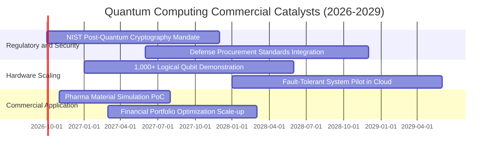

### 9.2 TAM 市場規模分析

```
╔══════════════════════════════════════════════════════════════════╗
║             全球量子運算產業潛在市場規模 (TAM) 預估              ║
╠══════════════════════════════════════════════════════════════════╣
║                                                                  ║
║  2025年基準 TAM：   $1.20B   ██░░░░░░░░░░░░░░░░░░░░░░░░░░░░░    ║
║  2028年預估 TAM：   $4.85B   ███████░░░░░░░░░░░░░░░░░░░░░░░░    ║
║  2032年預估 TAM：  $16.50B   ████████████████████░░░░░░░░░░░    ║
║  2035年遠景 TAM：  $28.00B+  ███████████████████████████████    ║
║                                                                  ║
║  📊 2025-2035 複合年成長率 (CAGR)：~37.1%                        ║
║  重點下游滲透：生命科學 (30%)、金融 (25%)、材料與國防 (45%)      ║
╚══════════════════════════════════════════════════════════════════╝
```

### 9.3 成長驅動力結構圖

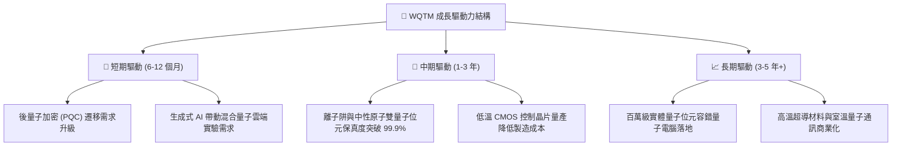

---

## 10. 風險矩陣

### 10.1 風險評分矩陣

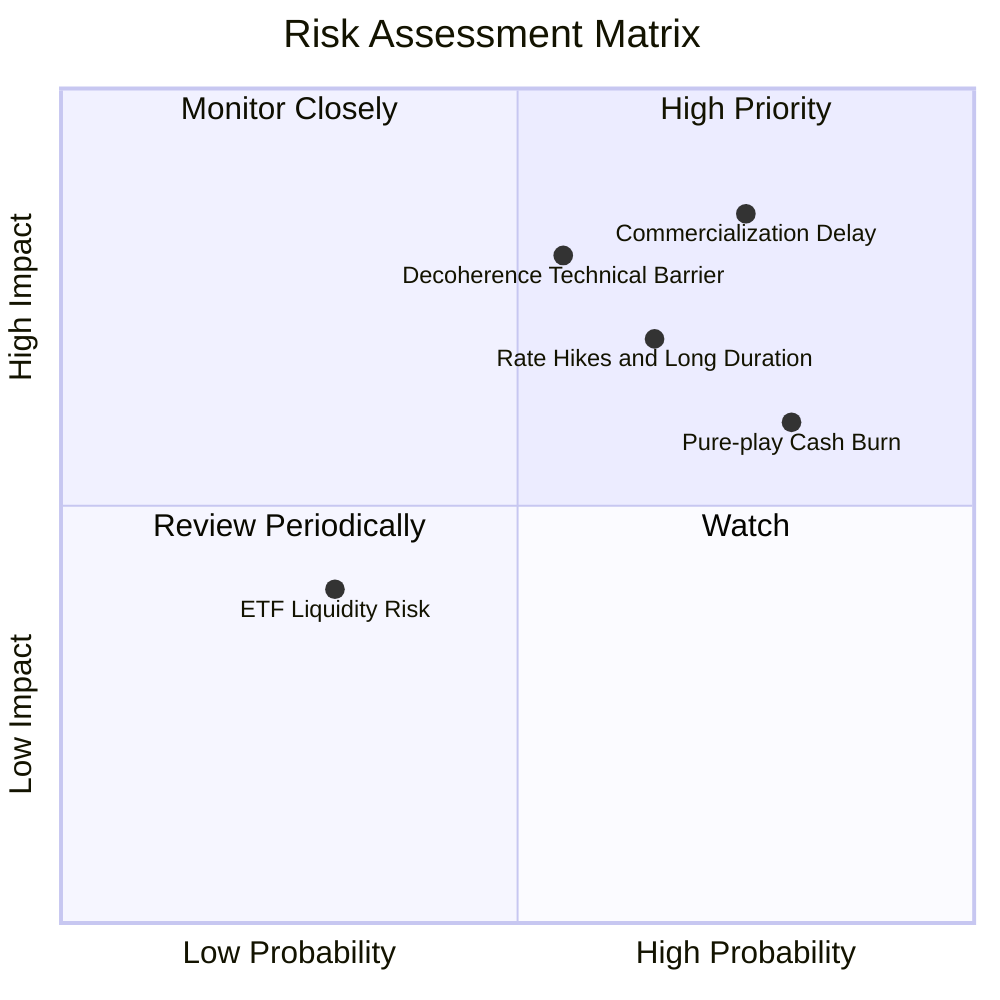

### 10.2 風險清單詳細分析

| # | 風險項目 | 發生機率 | 財務與資產衝擊 | 綜合評分 | 機構緩解與應對措施 |
|---|----------|----------|----------------|----------|--------------------|
| 1 | 🔴 **商業化時程延宕 (Quantum Winter)** | 高 (75%) | 高 (底層純量子持股重估 -40%) | 🔴 8.5/10 | 基金 70% 權重由獲利之半導體龍頭覆蓋，分散純硬體估值回調衝擊。 |
| 2 | 🔴 **利率維持高檔壓抑長存續期資產** | 中高 (65%) | 中高 (折現率上升使內在價值 -15%) | 🔴 7.2/10 | 監控美債殖利率，於殖利率突破 4.5% 時調降高貝塔持倉配置。 |
| 3 | 🟡 **純量子硬體成份股現金枯竭與股權稀釋** | 高 (80%) | 中度 (單一持股股權被動稀釋 20-30%) | 🟡 6.5/10 | 指數依市值定期再平衡，自動降低持續大幅虧損新創之持股權重。 |
| 4 | 🟡 **量子物理退相干與錯誤校正瓶頸** | 中等 (55%) | 高 (研發費用沉沒，預測期 FCFF 下修) | 🟡 6.8/10 | 投資組合涵蓋超導、離子阱、光學等多種架構，不押注單一技術路線。 |

---

## 11. 投資建議

### 11.1 最終綜合評級雷達圖

```
╔══════════════════════════════════════════════════════════════╗
║              WQTM 最終投資維度綜合評分                       ║
╠══════════════════════════════════════════════════════════════╣
║ 業務基礎品質  7.0 ▓▓▓▓▓▓▓▓▓▓▓▓▓▓░░░░░░  ★★★☆☆           ║
║ 成長潛力空間  7.5 ▓▓▓▓▓▓▓▓▓▓▓▓▓▓▓░░░░░  ★★★★☆           ║
║ 現金流轉化率  6.5 ▓▓▓▓▓▓▓▓▓▓▓▓▓░░░░░░░  ★★★☆☆           ║
║ 資產負債防禦  8.0 ▓▓▓▓▓▓▓▓▓▓▓▓▓▓▓▓░░░░  ★★★★☆           ║
║ 估值安全邊際  4.5 ▓▓▓▓▓▓▓▓▓░░░░░░░░░░░  ★★☆☆☆           ║
║ 技術顛覆能力  8.5 ▓▓▓▓▓▓▓▓▓▓▓▓▓▓▓▓▓░░░  ★★★★☆           ║
╠══════════════════════════════════════════════════════════════╣
║ 綜合評級分    6.8 ▓▓▓▓▓▓▓▓▓▓▓▓▓░░░░░░░  🟡 建議評級：持有    ║
╚══════════════════════════════════════════════════════════════╝
```

### 11.2 目標價與隱含報酬率

| 情境 | 機率 | 隱含目標價 | 當前現價 ($31.44) 隱含報酬 | 核心驅動前提與評價乘數 |
|------|------|------------|----------------------------|------------------------|
| 🔴 **悲觀情境** | 25% | **$24.50** | -22.07% | 技術卡關，P/E 壓縮至 20.0x，回撤至 2026 年初低點 |
| 🟡 **基準情境** | 55% | **$33.40** | **+6.23%** | 依循 12.5% CAGR 成長，維持 26.0x P/E 常態中位數 |
| 🟢 **樂觀情境** | 20% | **$42.80** | +36.13% | 容錯突破帶動市場情緒激化，突破 2026 年歷史新高 |
| **期望值** | 100% | **$33.05** | **+5.12%** | 各情境機率加權綜合期望報酬 |

### 11.3 買入時機與觸發因素

```
╔══════════════════════════════════════════════════════════════════╗
║                  ✅ 交易操作觸發 Checklist                      ║
╠══════════════════════════════════════════════════════════════════╣
║                                                                  ║
║  立即買入觸發條件（需多數符合，方具充足安全邊際）：             ║
║  ☐ 股價拉回至建議建倉區間：$26.00 – $28.00（對應 MOS ≥ 15%）     ║
║  ☐ 底層龍頭 Trailing P/E 回落至歷史區間下緣 (≤ 22.0x)            ║
║  ☐ 10年期美債殖利率穩定跌破 3.80%，釋放長存續期折現壓力         ║
║                                                                  ║
║  加碼觸發條件（出現以下任一）：                                  ║
║  ☐ 成份股公佈首個可商用、百位元以上具容錯能力之量子邏輯系統     ║
║  ☐ 美國國防部或大型製藥廠簽署單筆逾 $500M 之量子運算雲長約       ║
║                                                                  ║
║  停損/減碼觸發條件（出現以下任一）：                             ║
║  ☐ 股價快速衝高突破 $38.00（已反映樂觀情境，安全邊際轉負）      ║
║  ☐ 純量子權重股遭遇技術證偽，核心團隊大量離職或出現重大詐欺     ║
╚══════════════════════════════════════════════════════════════════╝
```

### 11.4 投資人適配度分析

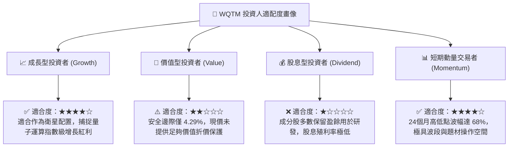

### 11.5 每季財報監控清單（Quarterly Watch List）

| 監控維度 | 關鍵追蹤指標 | 觸發【加碼】門檻值 | 觸發【減碼/觀望】門檻值 | 追蹤意涵 |
|----------|--------------|--------------------|------------------------|----------|
| **底層營收動能** | 穿透加權營收 YoY | > 15.0% | < 8.0% | 檢驗終端企業算力需求轉化力道 |
| **資本投入意願** | 底層成份股研發支出 YoY | > 18.0% | < 5.0% | 研發減速代表技術進入停滯或資本緊縮 |
| **純量子持股現金** | 純量子標的可用現金存續期 | > 24 個月 | < 12 個月 | 評估次級市場股權增資稀釋風險 |
| **估值水準** | Trailing P/E 倍數 | < 22.0x | > 32.0x | 估值均值回歸交易信號 |
| **技術進展驗證** | 量子邏輯閘保真度 (Fidelity) | 突破 99.95% | 停滯於 99.0% 以下 | 判斷錯誤校正商用化關鍵拐點 |

### 11.6 反面論證：什麼會證明論點錯誤（What Would Change My Mind）

```
╔══════════════════════════════════════════════════════════════════╗
║              ⚠️ 論點失效條件（Disconfirming Evidence）           ║
╠══════════════════════════════════════════════════════════════╣
║  本分析報告的中立/持有觀點在下列情況發生時應立即重新評估：       ║
║                                                                  ║
║  推翻多頭論點（轉為強力賣出 🔴）：                               ║
║  ① 經典超級電腦演算法（如 GPU 張量網絡模擬）取得重大理論突破，    ║
║     在常規功耗下完全匹敵現有量子位元加速能力，量子霸權論述失效。 ║
║  ② 底層成分股加權 ROIC 連續兩季跌破 WACC (14.8% → <9.41%)，     ║
║     企業由「價值創造」轉為「價值摧毀」。                         ║
║  ③ 宏觀長期利率中樞上移，10年期美債殖利率站穩 5.0% 以上，       ║
║     帶動 WACC 升至 10.5%+，內在價值基準大幅重挫至 $24.00 以下。   ║
║                                                                  ║
║  推翻保守論點（轉為強力買入 🟢）：                               ║
║  ① 股價因市場非理性拋售重挫至 $25.00 以下（MOS 擴大至 >25%）。   ║
║  ② 容錯量子運算（FTQC）商業化在主要雲端平台全面落地，帶動       ║
║     穿透營收增速加速至 25%+，打破現有 DCF 線性成長假設。         ║
╚══════════════════════════════════════════════════════════════════╝
```

---
> **免責聲明**：本報告為機構級研究分析模型自動生成，僅供專業研究與學術探討參考，不構成任何買賣要約或投資諮詢建議。金融市場投資具備內在波動風險，歷史表現不代表未來收益，投資人應獨立評估自身風險承受能力並諮詢合格財務顧問。